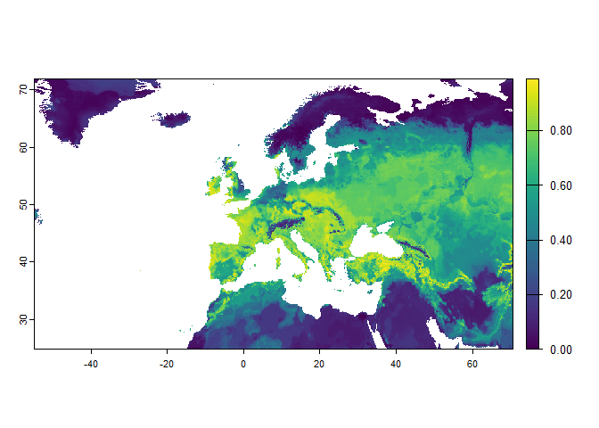
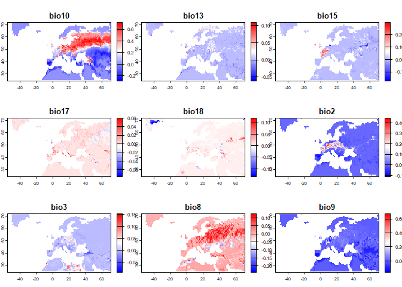

# SDM Example

This is an R-script demonstrating a SDM modeling workflow. A similar
workflow may be implemented in SDM-based VREs. The purpose of the script
is to demonstrate (in a simplified way) what a workflow could look like,
and I did not check the model for ecological realism (which typically
should be done!).

This is an annotated version aimed at explaining intermediate processing
steps and data requirements. A version implementing a Shiny-based GUI
(e.g., selecting the species of interest with a drop-down menu, etc.)
can be implemented soon as an additional demo.

For demonstration purposes, I chose to work at a fairly low spatial
resolution (\~10km raster cell size). When working at higher spatial
resolutions (e.g., 1km) computational costs can be much larger. On the
other hand, I did no optimize the code for speed, and some performance
gains can be made (e.g., via parallelization).

All visualizations are quick-and-dirty and could be optimized for
display within VREs.

## Preparation

### Working directory

First, let's set the working directory of R to the location of the
source file (i.e., this script). NOTE: this only works in Rstudio.
Running the code contained in this script in R requires you to have
downloaded the folder containing the .csv file containing the example
occurrence dataset, the R file containing required functions, and the
folder of .tif files containing raster datasets used in the analysis.


``` r
setwd(dirname(rstudioapi::getActiveDocumentContext()$path))
```

### Packages and functions

Second, let's install and load all packages required for this example
(if missing). A note on packages / dependencies: In the development of
VREs, we should probably aim to keep dependencies to other packages
minimal. Yet, some dependencies to well-maintained packages will exist
(e.g., sf and terra for spatial data processing).

Also, we are sourcing (loading) the script containing the functions I
wrote and/or adapted for data processing and modeling. In the future, I
can make these functions available as an R-package via a repository
(e.g., Git / GitHub).


``` r
packages <- c("tidyverse", "sf", "terra","fastshap", "mapview", "randomForest", "blockCV", "parallel")

for (pkg in packages) {
  if (!require(pkg, character.only = TRUE)) {
    install.packages(pkg)
    library(pkg, character.only = TRUE)
  }
}

source("bmd_functions.R")
```

### Load data

Next, let's load our example dataset. I downloaded presence occurrence
records for all bat (Chiroptera) species listed in the annex II of the
habitats directive (13 species; see here for all annex II species:
<https://eunis.eea.europa.eu/references/2325/species>). I downloaded the
dataset via the rgbif package
(<https://docs.ropensci.org/rgbif/articles/rgbif.html>). The lines of
commented-out code show the function call with which I downloaded the
data. To run this, you need to install and setup the rgbif package.

Note: The package also allows you to download occurrence data cubes
(developed by the B-Cubed project). I tested this feature and noticed
two things:

1.  The SQL-based downloads are slower than using the `occ_download`
    function (see here:
    <https://docs.ropensci.org/rgbif/articles/gbif_sql_downloads.html>)

2.  Although the occurrence cubes have the option to download bias
    information, this only seems to add the number of target-group taxa
    counts at the locations of the occurrence data. However, for
    target-group bias-adjustment in SDMs (see e.g.,
    <https://doi.org/10.1111/ddi.13442>), we need the full set of
    locations of all target-group taxa.

In addition to the occurrence data ("bats_europe.csv"), we are also
loading several raster datasets:

1.  A raster defining land areas (derived from CHELSA:
    <https://chelsa-climate.org/>)

2.  A raster defining the extent of our area-of-interest (Europe), for
    which we want to make model predictions.

3.  19 bioclimatic variables from CHELSA (candidate predictors) for
    current climate conditions (see here for an overview of what the
    variables indicate: <https://www.worldclim.org/data/bioclim.html>)

4.  The same 19 bioclimatic variables for based on a single climate
    model and future period (2071-2100)

Note: Even though we want to make predictions for Europe, we need to
train our models across the full distribution of the species to avoid
niche truncation (i.e., excluding parts of the environmental niche of a
species during model training). When projecting models for future
climate scenarios, we would typically first create an ensemble of all
available climate models (N=5 for CHELSA), but I kept it simple here.

As an example species, I chose *Rhinolophus ferrumequinum* (<https://en.wikipedia.org/wiki/Greater_horseshoe_bat>)


``` r
### code to download bat occurrences via the rgbif package
# GBIF taxon ids of all bats listed in annex II of the habitats directive
# taxon_ids <- c(2432614, 2432655, 2432621, 2432666, 2432416, 2432470, 2432452, 2432430, 2432414, 2432427, 2432509, 2432582, 2432953)
#
# dl <- rgbif::occ_download(
#   pred_in("taxonKey", taxon_ids),
#   pred("occurrenceStatus","PRESENT"),
#   pred_gte("year", 1980),
#   pred("hasCoordinate", TRUE),
#   pred("hasGeospatialIssue", FALSE),
#   format = "SIMPLE_CSV",
#   pred_or(
#     pred_lt("coordinateUncertaintyInMeters",1000),
#     pred_isnull("coordinateUncertaintyInMeters")
#   ),
#   pred_in("basisOfRecord",c("HUMAN_OBSERVATION", "PRESERVED_SPECIMEN"))
# )
# 
# occ_download_wait(dl)
# dat <- occ_download_get(dl) |> occ_download_import()

# load bat occurrence data and select required columns
presence_full <- read_delim("bats_europe.csv", delim = "\t") %>%
  select(species, decimalLongitude, decimalLatitude)
```

```
## Rows: 69598 Columns: 50
## -- Column specification --------------------------------------------------------
## Delimiter: "\t"
## chr  (32): datasetKey, occurrenceID, kingdom, phylum, class, order, family, ...
## dbl  (15): gbifID, individualCount, decimalLatitude, decimalLongitude, coord...
## lgl   (1): typeStatus
## dttm  (2): dateIdentified, lastInterpreted
## 
## i Use `spec()` to retrieve the full column specification for this data.
## i Specify the column types or set `show_col_types = FALSE` to quiet this message.
```

``` r
landmask <- rast("raster_data/landseamask_agg10.tif")
landmask_europe <- rast("raster_data/landseamask_europe_agg10.tif")

# convert to spatial sf object
presence_full_sf <- st_as_sf(presence_full, coords = c("decimalLongitude", "decimalLatitude"), crs = 4326)

# which species are present in the dataset?
all_species <- unique(presence_full$species)

# plot a small fraction of the data as a check
presence_full_sf_plot <- sample_frac(presence_full_sf, 0.05)
mapview(presence_full_sf_plot)
```

```{=html}
<div class="leaflet html-widget html-fill-item" id="htmlwidget-9b08565f304a01a7df51" style="width:672px;height:480px;"></div>
<script type="application/json" data-for="htmlwidget-9b08565f304a01a7df51">{"x":{"options":{"minZoom":1,"maxZoom":52,"crs":{"crsClass":"L.CRS.EPSG3857","code":null,"proj4def":null,"projectedBounds":null,"options":{}},"preferCanvas":false,"bounceAtZoomLimits":false,"maxBounds":[[[-90,-370]],[[90,370]]]},"calls":[{"method":"addProviderTiles","args":["CartoDB.Positron","CartoDB.Positron","CartoDB.Positron",{"errorTileUrl":"","noWrap":false,"detectRetina":false,"pane":"tilePane"}]},{"method":"addProviderTiles","args":["CartoDB.DarkMatter","CartoDB.DarkMatter","CartoDB.DarkMatter",{"errorTileUrl":"","noWrap":false,"detectRetina":false,"pane":"tilePane"}]},{"method":"addProviderTiles","args":["OpenStreetMap","OpenStreetMap","OpenStreetMap",{"errorTileUrl":"","noWrap":false,"detectRetina":false,"pane":"tilePane"}]},{"method":"addProviderTiles","args":["Esri.WorldImagery","Esri.WorldImagery","Esri.WorldImagery",{"errorTileUrl":"","noWrap":false,"detectRetina":false,"pane":"tilePane"}]},{"method":"addProviderTiles","args":["OpenTopoMap","OpenTopoMap","OpenTopoMap",{"errorTileUrl":"","noWrap":false,"detectRetina":false,"pane":"tilePane"}]},{"method":"createMapPane","args":["point",440]},{"method":"addCircleMarkers","args":[[52.242378,36.9587,39.09,52.125272,51.882744,53.08308,51.14,32.989786,40.2,52.749962,42.02,52.928437,53.09229,32.989786,49.05044,36.14,53.232966,49.733,51.828846,47.950001,38.83,41.41915,51.33,49.955719,55.69467,-0.342142,37.91,40.689999,-3.318056,38.93,36.799999,50.010277,53.089839,39.476002,42.70089,42.28736,42.00122,51.59701,42.04699,52.11,52.96167,52.50798,54.736817,50.82939,51.723745,49.4592,51.885323,39.41,49.1798,47.849998,-3.316111,-3.29732,50.035423,33.240543,41.623601,43.62677,51.091773,52.543769,51.794541,46.85063,38.93,51.405494,35.058553,48.7243,43.029999,51.656987,52.889803,32.989786,53.283535,53.089514,52.56,51.575486,51.791126,36.95,54.978055,50.86,38.23,57.23333,52.802874,57.89084,51.157341,51.83,41.150002,51.619333,53.203267,51.42,54.947687,51.494609,52.692676,39.9,50.7,51.83,-3.255278,38.68,53.153676,55.71518,52.36,52.93472,51.885323,51.656269,40.16,56.992989,39.860001,-3.307778,52.50653,49.7896,51.612834,50.6,52.084469,51.619882,32.696889,51.575486,51.745071,50.38,52.899302,51.407456,-3.315278,51.26221,52.80294,50.96,46.142151,43.235401,-3.2999,50.297717,56.90446,50.335709,38.080002,50.24,-3.327778,50.88,56.20508,40.68,49.8165,52.911481,52.06237,51.612834,43.45153,51.405494,43.040001,49.186017,52.757785,51.662246,57.31308,50.18359,42.68,43.2336,57.31308,49.6934,55.70873,53.074321,-15.8594,50.38,52.94422,42.5,42.07121,50.09,51.841841,51.38,49.7215,53.113052,50.035423,49.74094,42.05079,51.22,42.666741,57.36542,52.7,-3.315,51.885323,50.035423,42.47436,32.73636,51.836907,51.82,51.656006,52.09,51.645618,49.51293,49.871681,50.062317,42.25,37.09,51.4,51.917743,59.46917,55.338997,49.776386,58.52845,50.01918,41.79281,48.7682,55.52806,31.762535,51.82,32.44,51.737806,-3.300017,55.62843,41.59,56.79547,51.35,51.791126,51.045937,51.755987,43.12319,43.48,51.35,53.252861,56.83559,51.872997,38.68,53.283331,46.411399,51.36,50.85,47.364152,42.139999,51.686782,56.85058,51.878962,33.249557,42.049999,51.28,50.853701,52.91434,31.61798,54.881318,50.38,51.541597,50.75,53.21739,50.78,50.31,53.22257,3.81083,50.83358,49.360782,36.16,41.40492,53.190437,41.83368,37.98,-3.323611,51.744743,42.95309,59.4,43.235582,50.38,53.241611,55.98645,41.426,45.38,49.7581,51.93878,50.035423,51.17673,33.043108,-3.255278,41.60667,50.902964,50.61,51.420064,52.07175,50.458918,52.125272,56.163715,50.994492,49.6657,39.08,52.961409,51.690194,51.719753,51.719475,43.220001,51.611159,51.723927,51.93,55.121415,42.400002,51.811108,-3.318056,41.049999,48.865337,50.46,42.02,51.630772,51.35,55.77873,48.8928,53.101049,33.249557,31.636175,40.060001,47.981242,51.612834,51.23,51.22,42.95568,50.78,39.12,51.56,52.739811,42.27,-3.316111,53.074031,48.9915,43.50704,50.484835,50.09,46.33333,51.815144,51.704391,55.5795,51.692708,51.29,51.723745,52.004567,49.7048,36.22,53.09229,50.616338,50.072639,42.93,52.988359,50.0794,51.18,50.484835,52.748316,52.271505,51.342133,36.709999,51.24,49.131,52.775759,51.785562,50.59,51.69406,42.73362,49.7895,50.86,57.03791,31.807562,49.1038,57.13664,51.74,51.24254,50.79651,46.85063,42.08,49.7974,51.631132,49.5205,-3.328333,50.954705,42.54,38.139999,52.728611,51.557516,50.588677,41.513,50.010277,51.83,50.035423,50.32,52.088702,52.899302,52.07,43.08891,43.24224,-3.325833,47.072016,52.94422,32.3,53.181682,51.29,1.04,52.944981,51.81,57.75824,55.63449,48.7682,43.78195,50.162398,51.29,51.128383,56.91255,52.945231,48.314,38.93,41.310001,42.49222,51.4,53.09229,-3.305833,49.6396,56.13221,43.17904,43.22612,51.656006,42.22,-3.303056,50.74,51.920641,50.88,56.226712,51.82,50.135113,-15.27181,53.08821,51.575219,52.952163,42.05296,58.68202,51.405494,58.52845,33.28,50.57935,41.40492,50.9,41.40808,46.629384,51.737806,49.7978,52.242378,52.073605,49.04258,51.84,55.60555,52.775759,51.575486,40.119999,52.650528,36.14,42.803337,40.1,55.390247,51.395094,52.785206,52.224652,43.11414,42.72689,41.310223,42.0886,51.631132,50.288728,-3.29732,52.12,51.63126,49.7464,51.225641,59.06189,51.29,48.8779,31.473755,51.792519,51.603229,33.249557,49.64876,33.037357,51.85,32.384452,41.049999,43.359741,37.952312,51.33,51.160744,49.1123,51.747986,31.410498,51.22,55.51783,42.93281,48.284166,50.54731,49.8241,42.164,49.73307,56.15272,51.930636,42.507,42.357,50.323826,50.75,32.497439,51.71189,48.3628,41.59,51.737806,50.74704,43.310001,50.32,36.610001,50.394307,52.650528,31.599968,51.746796,43.35974,32.989786,38.94,41.354781,39.06,32.88645,51.3,37.880001,47.883335,43.28928,49.7978,32.940956,31.681159,51.982549,42.13441,42.753835,49.7531,49.7576,52.084469,51.378778,41.52,54.062737,48.9846,43.299999,-3.255,51.17258,55.99469,56.92645,49.5702,48.8779,51.2,43.168244,52.839114,48.6482,52.004963,55.194432,52.924682,51.831235,47.983334,49.0236,53.181682,45.209325,51.541597,-3.316111,-3.33,46.32,38.68,44.736592,51.12,49.723,52.560934,39.12,33.249718,47.983334,41.36268,51.993646,55.99411,52.925996,50.458918,31.717339,51.712067,39.599998,52.757785,42.3703,52.022148,49.7008,50.587976,43.820982,42.40907,50.504474,40.330002,56.39533,50.53,51.225641,50.48,51.252676,50.86,51.32,-3.327778,42.76902,33.249557,40.02,51.671564,51.811108,51.83,55.026158,51.71,37.48,51.43,56.93808,52.086098,42.30108,49.7865,51.16,31.599968,38.439999,-3.321944,52.83,51.920641,51.867953,52.944981,-3.29867,32.75532,55.922563,50.953018,38.169998,43.568268,52.787023,-4.6142,53.072793,38.169998,31.471223,56.163575,48.9846,52.3755,51.704391,52.758717,47.196496,42.23,52.899302,55.81737,51.33,53.266829,50.4,39.860001,42,52.952163,49.7694,42.76902,57.31308,51.050864,51.809612,-3.313889,49.64337,48.666685,32.100105,42.28736,31.843136,51.12,31.780557,55.31229,52.81,50.43,47.966667,43.30751,32.989786,51.630772,-3.30601,52.737849,51.631132,53.181682,60.28169,37.900002,51.73,51.831545,51.71451,43.627229,51.93679,53.266829,33.249557,51.82,47.338581,41.809,56.846846,51.35,52.802874,50.4,32.04,51.44,42.164,52.74,38.880001,51.35,53.189624,52.50447,52.4,41.139999,59.66341,39.66,41.23,42.88062,52.003165,38.14,42.28736,31.798609,31.771452,32.1,49.008685,32.114053,51.79,50.64,50.866867,42.30949,48,51.907055,43.166118,52.020087,32.64366,51.83,51.656987,41.52718,51.92,51.10772,51.828846,51.325151,50.79,43.26495,49.544,38.247872,42.5,37.900002,33.168329,43.094,51.631132,38.94,41.64744,52.703393,48.8962,50.663139,51.84,50.6,53.301955,52.578332,57.9,49.6934,51.72,50.013923,43.632731,52.899302,52.82,52.50125,50.864574,51.15,59.2,33.01,42.96309,50.035423,50.44094,45.455843,41.666709,51.827087,36.428222,50.36,52.055973,51.885323,53.160734,52.026885,42.15093,51.4,49.265155,51.146958,51.370553,56.87932,42.189999,53.181682,43.953386,51.924716,-3.256,51.35032,49.7212,53.047086,42.9357,33.037357,49.7176,47.8025,42.270145,51.827087,51.440319,31.681485,42.93281,51.610348,52.711148,57.31251,51.24254,51.612834,54.580081,51.35,50.46,52.933127,43.432734,51.76,52.51168,31.699359,50.780704,51.794541,51.23,51.404442,50.566117,26.417,51.95,51.630772,51.370553,51.82,32.75532,32.055081,51.745535,-3.29732,51.896819,51.79,51.823999,51.805884,52.925737,-3.313889,51.687131,52.737849,51.29,51.252676,41.06,42.029999,56.17241,43.360149,38.790001,50.66,-3.300833,51.665425,49.667,39.060001,-3.286389,49.4686,37.889999,33.037357,39.12,51.386195,56.167146,53.08308,52.944981,31.806494,52.902204,51.82,-3.303056,42.139999,52.953204,51.59,41.96117,51.29,42.00124,43.220001,51.15749,51.603229,50.48,37.900002,52.0742,50.4,33.037357,49.6569,51.630772,51.613494,50.45,52.3755,53.189624,51.36,50.72,48.8623,43.639263,41.96959,41.268879,32.32,39.599998,50.439384,47.900002,50.035423,56.215912,52.93472,51.36,50.487477,51.744743,40.08,33.043016,53.189624,52.899302,49.4997,51.93878,43.299999,55.52735,51.630772,32.672999,52.25864,41.63655,52.702241,51.920641,50.4,51.4,31.61761,46.194088,31.725234,35.039774,41.330002,51.612834,51.611159,47.829,42.220001,50.010277,52.010758,51.610348,53.155182,41.64871,41.71463,51.24,58.7,41.5,52.59,46.251543,52.94422,-2.45,52.803409,49.6779,48.7374,52.929989,39.32,52.843661,46.194225,51.36,49.4974,52.757785,32.44,32.737265,51.29,38.9,49.4687,55.98338,51.784159,43.66,-3.315278,49.833,41.32806,41.779999,42.122,51.72,51.24275,45.501519,51.931201,38.049999,51.29,50.035423,51.785562,49.7258,42.313492,58.34061,40.09,51.99,50.786332,37.259998,50.281901,43.09026,3.81083,33.079207,49.7806,-3.286389,43.25019,38.880001,41.03,52.084469,53.181682,49.5571,52.153278,53.153676,51.586032,52.961146,57.104062,-3.315278,51.017441,51.794541,50.79651,57.59488,51.69,51.63126,42.59,57.11099,49.7978,43.82277,51.5034,52.98888,52.9,42.740002,40.689999,51.745535,43.17904,50.07,43.394461,51.791126,32.113924,52.898508,49.8304,51.744743,43.432734,57.09823,52.956093,52.021126,52.748316,50.58412,39.33,51.646925,51.81,48.9686,53.283126,47.849998,32.64366,31.744355,42.32,51.110573,38.83,43.88685,42.759998,38.68,48.9915,54.762525,51.885323,41.8672,42.15031,57.05525,51.404085,52.93472,51.361077,50.99,53.241611,-3.287222,49.673196,52.56,17.01,41.110001,55.363684,52.96167,50.91,49.7742,31.636175,53.09229,53.074321,53.294821,51.25174,49.6574,-3.321944,53.294821,43.58367,51.914718,48.59158,53.129073,56.08496,50.595157,31.744128,52.739811,55.401329,38.68,41.61883,49.3167,49.7176,51.690194,51.567289,49.7549,40.79254,51.803169,53.08308,51.982549,49.6635,43.099998,52.902204,52.899046,39.66,50.32,43.50704,52.933127,53.255164,52.042572,-3.303889,-3.255278,39.27,39,42.51539,47.338581,51.794541,51.815144,49.4852,58.36134,51.785562,55.58904,57.7,52.917045,52.902204,51.930636,41.89447,56.34927,50.440028,51.84,42.30949,50.0783,52.749962,56.07499,59.06274,51.603229,50.48,52.561615,57.41921,32.988884,50.133915,56.00013,32.952025,51.32,51.879433,50.358777,-14.51389,32.989786,50.8666,54.825034,48.796781,43.24198,51.719475,55.92936,41.233859,33.037357,42.759998,52.938841,54.740462,-3.3235,50.64,-3.306111,51.807165,50.08,49.7933,28.42,54.857092,37.27,24.36,52.084469,50.749001,51.82,51.885323,39.599998,49.2061,41.62365,52.776917,51.82,51.83,48.8036,48.557,49.36,51.73,57.15886,40.24,43.451523,51.696111,53.074031,56.77891,51.87,48.1419,-3.286389,41.62087,43.15192,51.745535,50.48,50.98,50.010277,-3.313889,49.4732,52.924682,53.153676,50.49,46.635486,41.89259,51.774442,49.5443,59.3,42.067,42.34,45.548121,52.924682,57.09761,41.83408,52.901906,51.05,52.757541,51.15,42.233,52.899302,54.970235,51.583666,51.63,52.933127,40.869999,48.193959,52.952163,51.611159,-3.323611,43.928282,-3.3163,35.561372,52.925737,32.989786,32.2,56.9363,49.6435,51.13,51.14,50.7,50.082842,51.972958,-3.357778,-3.29732,52.49,51.13941,56.09771,41.470001,54.768802,50.35,39.77,51.189201,49.5722,47.920862,52.924682,32.44,43.235561,52.79462,43.728829,47.849998,40.580002,43.19407,41.848,49.9116,43.44835,50.25,41.6937,51.937434,39.33,55.60455,42.606731,48.033333,41.869999,-3.325833,48.9915,51.1,46.687169,54.736609,-3.292222,-3.3285,52.739811,42.15031,52.77,51.719475,42.1516,-28.26075,52.007139,53.047086,51.498522,53.074321,31.744355,52.269276,50.935434,-2.476281,58.29869,39.05,51.4,32.3,42.02,50.79,51.810062,55.60556,52.11705,51.560326,51.370553,32.1,-3.327778,54.787726,32.433333,50.7,52.952163,-3.315,58.9,52.064778,49.7907,50.65,43.03,41.52501,-3.29867,39.23,24.36,51.99,57.69709,41.36075,-3.29986,39.9,31.608959,51.744743,53.232966,33.222784,43.337307,55.60556,36.95,-3.30325,52.988359,51.21,49.64337,49.7212,49.8634,-3.303889,50.035423,50.64,50.48,53.181682,51.748118,32.32,51.662246,-3.288889,43.360338,52.933127,50.45,55.56794,51.873175,39.59,51.16371,37,39.27,52.971171,50.08,48.15392,38.25,51.34,39.7,41.869999,51.630772,50.937217,48.8623,50.46,50.287022,51.174294,38.83,51.085981,41.63655,49.7222,43.2336,52.00233,51.22,51.885323,49.64337,43.358028,52.81,51.63,42.59,52.073605,-3.328333,30.941816,49.5561,55.306577,51.1357,55.233424,42.429508,56.93546,49.4663,51.359669,51.791126,53.252861,50.055,52.872827,36.14,55.334899,56.94739,51.907055,51.235062,-3.255,51.696111,42,33.240543,51.22878,50.394307,49.6917,51.05,36.52,52.49932,51.38,36.14,32.557842,51.7651,54.89569,-3.287222,42.00584,53.283126,35.110914,52.971171,39.33,-3.313889,51.575219,53.181682,43.10077,51.885323,51.643946,51.22,32.844767,51.745535,51.84,48.8962,50.83358,43.2336,42.179512,-3.323611,50.87,51.7651,49.7909,43.451533,51.189201,51.71189,51.594244,52.938841,51.69,42.96553,42.02866,43.470001,51.784981,51.33,42.30949,43.31274,55.60555,-3.2999,51.4,55.7212,50.510929,31.599968,51.7638,51.70997,51.173939,39.37,31.933129,32.04,42.88062,41.504,49.5719,51.656987,51.12,51.23,43.07615,55.56863,37.610001,56.23902,51.819173,46.07,42.849998,-3.298611,43.459999,43.369999,-3.318056,49.6124,51.1972,43.1097,42.221558,51.619333,50.59,43.28985,51.575486,53.074321,51.335346,54.680268,42.94778,51.819173,51.719475,51.14,43.84664,53.05554,51.896819,36.22,50.37,33.249557,52.871576,51.62,49.7034,53.091838,50.08,52.369449,40.78606,31.599943,51.612834,50.75,52.357738,54.768802,42.00584,-3.286389,51.225923,47.05706,47.900002,42.418,52.001373,50.595157,55.55485,50.010277,39.73,42.792878,51.836325,42.54,39.92,43.186182,50.738049,49.256725,39.12,-3.26913,51.712015,53.232966,-3.323611,50.010277,39.34,52.145989,48.8329,48.9846,51.671564,48.6373,37.48,51.712296,38.83,51.631132,52.234905,40.869999,51.982549,50.0551,51.24254,32.47539,51.610348,50.95,49.6636,-3.323611,52.748316,43.0046,48.4479,32.32,52.94422,34.974637,57.20773,52.703393,52.93472,43.12319,41.2871,53.136988,51.882744,51.89,52.843661,31.780572,51.630772,51.18002,41.779999,53.283331,51.33,53.034311,51.18002,53.056351,52.925737,51.662246,36.610001,24.36,49.6977,43.394408,51.827254,43.310001,52.650667,50.95,49.7176,48.9915,52.8,50.081654,37.16,57.04723,-3.30322,51.33,51.83,50.87,49.7933,49.5151,51.74,50.32,57.59645,49.605,51.907055,56.93762,51.631132,48.691678,41.59,58.52845,-3.305833,41.47047,52.96167,41.258241,-0.39069,33.249557,52.748316,43.23606,36.52,52.79462,51.41,52.06,51.82,50.75,51.755669,59.56881,41.278895,49.998,56.992989,52.010687,51.656987,-16.083333,50.46,51.39,51.905401,-3.330278,51.719475,51.836244,50.53,-3.328333,51.614241,51.619767,46.537976,50.486294,52.938841,57.0499,43.49529,42.30181,51.846259,50.379409,-3.302778,50.61,53.072793,51.797165,47.696944,43.02,52.944981,36.077292,51.671564,51.94,41.442576,39.23,39.060001,58.67073,32.3,59.85621,39.52,52.899302,43.17615,-3.3275,51.878962,51.5,48.8,42.30949,39.09,37.970001,52.740283,50.095917,57.23996,51.828846,51.656987,38.83,51.39,50.48,51.189201,52.8,54.692248,51.8932,50.06032,48.8952,51.83,57.72759,49.1537,38.950001,41.411896,40.509998,48.558239,50.73,51.630772,52.739811,58.34061,50.010277,28.412552,51.10772,49.6396,-3.305833,31.744128,31.762488,51.4,56.09803,42.02,40.509998,36.799999,51.611159,51.791126,41.85403,51.13,41.96959,41.492,52.938841,52.084469,42.08,51.827254,51.878962,53.252861,51.35,52.188429,42.94778,36.990002,55.54203,37.48,40.935563,33.249557,51.7651,43.389999,42.24745,50.5,55.942347,51.719475,51.39,52.239098,52.3676,45.02,50.394307,47.303611,50.436188,43.029,49.5721,38.83,51.990914,41.130001,42.1727,52.748316,53.181682,-3.31516,43.235576,51.7651,47.1889,50.49,36.889999,50.7,32.989786,-3.286389,58.53298,32.32,47.933334,55.59048,53.09229,53.058612,41.45444,50.504474,41.40808,32.989786,-0.39069,50.86,51.85,50.48,51.841133,52.793718,51.235062,52.944981,32.916715,52.843661,51.728953,52.350654,50.44,52.928437,51.704391,16.988644,45.528697,52.084469,53.232624,51.82785,54.815047,41.605819,41.44382,52.945231,58.38996,38.83,52.8,48.997315,57.77313,50.593959,36.900002,41.66253,53.15,42.560001,51.5284,49.7978,-3.323611,51.36,50.6,51.774442,39.73,41.96959,53.252861,51.61967,51.870556,37.360001,31.771489,41.220001,51.82,49.8234,50.4,51.719286,-3.316667,42.94717,51.828876,52.802874,51.75,37.700001,50.010277,31.77,51.233696,51.791126,47.983334,51.717385,50.59,51.619767,41.77823,51.85,51.18002,43.78195,52.114614,-15.4135,-4.61,43.169888,32.989786,51.22,48.8623,49.414688,36.774639,51.792142,41.310001,58.37023,-3.316667,52.595337,42.400002,51.972951,55.182297,48.066666,41.687841,51.770197,35.441463,49.6234,43.03039,52.748316,51.46,51.17351,49.008685,56.872345,56.175008,51.827087,36.82,51.791126,51.79,-3.286389,55.59396,53.164427,43.4957,41.71463,49.7228,38.83,42.571,51.732904,42.28736,50.42,50.35244,51.870556,50.49,51.695411,57.31308,35.194592,50.28,50.566117,46.3333,52.898508,41.94738,51.720927,52.785206,51.81,31.654267,36.14,50.010277,39.37,49.1054,52.929989,51.618784,53.072793,49.6585,51.630772,39.12,42.52509,41.54,51.791126,49.6588,51.794541,48.9915,43.73204,41.84,51.662246,52.98888,43.097602,51.610348,49.802097,52.59,57.314,51.36,49.6727,39.330002,53.047086,42.973856,50.61,40.1,51.12,49.833,51.594244,48.8962,55.52799,48.8329,52.58,-3.306111,51.34,-0.26489,52.25864,49.3229,49.381778,57.74934,51.810992,52.162,41.63655,52.8,52.114147,39.31,50.5,51.82,50.010277,43.674113,52.80294,51.736545,55.99469,50.007,56.68348,55.69398,51.819173,51.038596,-3.305833,56.8589,51.803169,32.012,52.902204,-14.50872,51.891368,51.575219,40.23,51.784855,43.15192,55.259727,52.899302,49.7801,40.060001,-3.321944,32.122942,42.94778,51.32,-3.315278,43.235588,43.65565,51.82,57.12717,51.656987,-3.29986,50.93,58.4,-3.624677,42.571477,33.033751,51.4,37.169998,50.034729,-3.300833,52.331695,42,51.937434,31.599968,51.557516,51.93,51.656006,46.15,51.920641,42.01144,41.444852,52.042572,-3.287222,53.056351,52.929853,51.618784,50.48,49.7212,-3.313889,51.630772,53.08308,49.6668,53.047086,52.114614,51.263683,50.059124,41.494,32.73636,42.01274,48.5264,51.872997,-3.305833,50.86,39.66,41.509998,52.61,41.95448,-3.298611,32.989786,53.232624,49.4,49.3326,51.745535,53.21739,58.52845,56.76773,51.662246,-3.327778,17.01,-3.315278,52.938841,51.235062,52.938841,36.949901,55.61882,49.3881,52.71,53.23,-3.305556,48.016666,-3.298611,51.594244,50.501518,51.11,52.721525,56.25298,50.394307,43.075583,43.25036,-3.320833,52.702241,49.186017,53.09229,58.52845,51.82,43.359741,53.294821,56.02557,50.330612,49.723,51.74,53.08308,51.83,43.130001,50.510929,42.68,41.049999,-3.2975,57.05166,51.909815,43.98797,53.09229,50.8,51.08,50.438316,-3.287222,42.049999,-7.827222,53.034311,49.441231,41.494,37.48,56.159726,50.595157,50.261072,50.54,52.917045,51.81,53.290836,43.130001,41.59,-3.316667,49.1887,51.16,47.933334,48.8952,51.611726,-0.2639,32.3,49.046075,36.529999,53.232966,50.18416,52.80294,41.869999,51.395094,-34.036448,50.595157,43.677763,52.96167,31.816725,51.35,42.139999,32.952025,52.04229,41.87931,51.39,41.34401,42.37,51.914718,37.529999,40.41,50.86,50.394307,43.299999,39.12,52.50195,57.12717,43.394521,43.09008,42.287,51.29,51.665425,51.630772,51.695411,48.5264,31.770537,43.049,51.819173,33.249557,51.745535,51.572021,55.59048,52.952163,51.7,35.232263,51.3,42.88374,49.5527,43.171255,52.843661,51.704391,51.797165,50.786332,-13.3797,31.701045,51.819173,47.920784,52.889803,52.8,51.29,50.055,56.18615,36.22,37.889999,53.22257,36.990002,48.7928,49.6657,50.663139,32.366522,50.45,51.611159,51.32,51.8,51.827087,40.32,48.3014,43.65178,51.774442,52.889803,38.48,53.198957,38.950001,51.29,31.726444,50.32,48.8962,51.618784,-3.303056,50.64,40.26,41.87884,50.010277,-3.287222,51.795588,40.02,51.43,43.009998,51.745071,52.260906,50.5,-3.255278,37.869999,38.259998,45.442311,43.299999,49.4678,38.419998,52.064778,51.594244,52.938977,52.249967,-15.60203,43.540001,43.17904,52.902204,51.39,41.242697,51.630772,42.849998,40.66,53.034311,52.929853,51.630772,50.935434,51.189201,42.94778,51.745535,53.262311,53.047086,56.10491,47.933334,41.869999,51.7,40.189041,52.7,51.784855,51.11,51.886078,31.770537,38.93,55.60833,43.13242,50.48,50.436188,49.7974,39.31,32.317518,52.8,51.26,41.54,51.18,43.86974,45.670203,50.31,41.68,41.283616,-3.315,53.160734,31.6,36.22,51.797165,52.543769,49.6588,52.899302,-3.315,52.952163,52.952163,51.920641,51.794541,41.46,50.37,52.578332,51.856037,50.0551,49.7464,52.004567,43.65565,52.786049,42.42649,42.338,51.83,55.55548,50.439384,-3.307778,50.616338,51.38,56.94188,52.93472,55.129788,51.557516,51.744743,41.742,39.68,50.95,55.305898,50.44,51.569557,42.860001,50.07,52.854865,39.59,41.987,51.073789,49.5722,-3.3345,50.8,51.31,-2.45,51.71,52.775759,-15.4135,30.941816,50.31,49.4687,42.139999,43.26495,52.988359,36.419998,43.116762,51.21,51.23,50.1567,51.024317,51.29,39.12,53.08308,49.4687,51.904902,51.778949,51.33,51.708277,51.630772,39.34,41.779999,47.338581,51.867953,40.09,42.950001,43.95901,51.40622,51.82,42.95647,49.7978,54.7684,52.938841,49.5543,58.52845,53.23684,-0.2203,47.883335,49.73307,43.22163,51.954822,51.619333,48,39.709999,50.31,37.832289,54.726464,43.360202,52.899302,29.877462,48.016666,50.34,57.20756,49.5198,54.890871,49.6964,39.06,51.13,50.079231,51.39,-3.316667,50.38,51.38,52.022485,51.69,41.34401,54.776047,53.232624,51.914718,59.045594,51.719475,51.612834,33.248,31.00497,43.359943,55.293231,41.049999,53.266829,52.82,39.7,51.896819,41.62365,32.457549,50.99537,51.71,49.5718,52.94422,51.630772,49.6741,51.44,51.704391,51.736545,51.88,56.92661,51.29,56.90307,50.379601,-3.316389,36.14,51.56,41.87931,50.504474,42.1266,50.035423,42.133902,41.196,50.43,32.429507,52.56,51.05,50.68,51.575486,39.73,51.93679,52.16339,53.074321,52.13,-3.328333,41.54728,51.719286,51.83,17.01,51.050864,40.48,51.630772,49.267234,52.90875,49.66536,-3.3219,53.241611,41.68193,52.757785,57.86036,51.83,52.899302,51.85,51.16,36.17,42.377,51.14,35.26771,57.24005,33.240543,33.240543,32.070486,52.749962,39.73,51.728953,52.924682,51.82,49.65647,51.836907,51.656006,51.575486,51.00177,47.364152,51.37,54.762537,52.255505,34.663999,39.509998,50.08,43.168692,32.557842,51.7,31.654267,48.9111,49.6396,51.89,43.820659,55.51818,49.6801,50.88,51.42,42.41,39.7,46.3,42.526,52.63,37.959999,51.67,-3.255,47.933334,51.611159,51.575219,41.23,48.204722,39.68,41.470001,52.703393,50.62,52.25877,58.29777,41.75104,59.32479,41.380001,32.95747,53.091838,51.564322,51.84,52.942648,41.950001,41.584,43.451758,49.7907,41.70982,51.93679,49.2939,58.52845,36.91,50.010277,43.20443,43.778858,58.27277,53.09229,52.91,33.037357,51.631132,51.35,52.889803,51.83,52.938841,51.19,51.29,52.938841,42.294366,52.084469,55.60556,38.68,51.71,-3.3163,42.54,42.33785,50.297717,55.40364,41.40808,42.23,53.189624,50.85,55.59794,53.217847,52.843661,52.739811,57.104523,51.082817,37.360001,51.81,43.380001,51.797165,51.744743,58.9,51.996953,52.641967,51.93,41.96526,50.86,55.92683,57.95555,51.47,42.91,42.271,49.9952,51.755987,43.2336,-3.3275,51.630772,37.43,49.66153,43.310001,39.9,54.881172,50.297717,43.040001,51.717385,56.1526,51.874019,51.05,50.56255,53.153676,42.96309,41.98784,43.45152,43.14331,46.47966,41.61883,47.496532,51.8,42.02866,49.5617,50.48,51.74,49.7215,32.709224,52.010687,50.57,53.074321,53.283126,51.95,52.737849,-3.315,53.22084,52.641967,58.41724,57.20756,51.76,52.01,-3.32137,50.72,41.77823,48.6849,51.885323,43.19964,51.690194,39.06,56.20351,-3.316111,51.704391,52.938841,41.97197,41.74395,49.64337,52.933127,50.794971,51.82,-3.357778,41.95931,50.87,49.6668,51.157341,50.082842,57.78233,32.989786,41.54,31.607643,41.139999,48.8962,42.01359,50.683546,50.44,51.630772,35.900002,-0.39069,41.79471,41.85075,52.889803,53.074321,40.220001,51.832432,52.578332,-3.316111,-3.29986,51.39,51.720927,40.849998,51.690194,51.10772,43.235592,42.91864,43.08942,42.73362,55.98705,51.832144,39.68,51.31,50.32,52.010758,50.98,57.23333,51.719286,49.669102,52.96167,56.21511,42.08,52.23,-3.316111,53.074321,57.06475,51.10772,51.696111,47.966667,50.79651,43.394523,49.186017,50.010277,39.52,43.2336,51.631132,51.931358,41.61031,43.73204,51.794541,51.785912,48.6373,51.618784,51.44,43.2336,51.16,52.952163,41.84,-3.33,41.352356,50.211376,50.75,50.85,45.500183,41.40492,50.51,39.66,51.604509,51.39,50.692204,36.22,50.48,40.060001,48.5507,50.297717,43.58367,50.0015,52.641967,52.020087,41.139999,46.129734,52.835381,53.034311,52.945231,51.35,41.75,52.988359,52.929853,39.419998,49.452278,32.107393,49.7212,31.744355,43.076408,53.034311,51.611159,51.84,56.17825,56.0976,51.920641,49.997417,42.88069,53.231184,51.885323,50.448215,-3.316111,52.641967,51.891318,51.39,51.79,51.877378,-3.320833,51.494609,51.83,52.042572,51.33,50.010277,53.266829,57.08459,41.99779,51.656987,52.925996,41.52,43.09008,52.748316,42.54,39.31,-3.315278,56.22,48.5264,51.8,52.749962,53.09229,56.18561,36.810001,42.07601,52.944981,51.575219,51.719475,51.720927,50.010277,50.596028,41.83368,52.710897,-3.302778,52.019955,51.656006,38.225336,-3.328333,50.44,50.683546,50.35,52.46,41.65288,50.88,50.6,42.199,52.026885,36.441847,37.869999,42.39869,51.575486,51.919976,50.486294,55.449788,51.619767,37.799999,41.54,49.67319,43.040001,52.711148,50.08,51.619767,50.38,40.599998,43.394404,51.832144,52.739811,44.343797,55.60556,51.794541,33.037357,58.9,31.770537,52.988359,49.3399,53.08308,58.27626,42.839522,47.981809,53.074321,51.81,51.610348,52.83,49.6492,52.52665,53.09229,38.860001,56.65592,17.01,51.846086,43.30751,51.665425,52.952163,51.415274,42.88062,51.81,51.085981,37.91,51.4,58.67339,50.504474,51.442722,52.43733,50.64,52.758717,51.23355,40.99,51.16648,52.952163,55.83389,52.09,49.025522,57.77973,40.51,50.39,53.034311,52.953204,49.9616,52.728865,41.96117,40.51,52.82,43.07074,50.504474,53.160734,52.817414,53.074321,41.98927,51.696111,51.631132,37.990002,37.27,53.232966,52.98888,49.72747,50.00542,38.9,47.11909,52.22,52.65,40.150002,51.870556,39.06,56.502242,51.045937,51.33,51.29,46.194026,51.732904,51.78,49.988651,50.73,51.63,51.4,51.575219,54.972789,51.631132,54.778685,52.96167,53.232624,49.5205,43.13466,59.19079,43.35974,58.1,56.15272,52.944981,51.719202,56.94524,50.853701,41.77823,51.907055,52.8,52.003165,50.58,51.832144,37.360001,51.44,51.885323,51.82,41.541,53.266829,50.37,51.744743,49.293764,-15.270813,51.575219,43.09,51.720927,51.87,32.75532,57.31308,56.89885,40.040001,53.082641,52.979637,51.745071,53.918939,57.36519,50.595157,31.834682,52.80294,49.6367,51.7638,-3.316667,38.9,47.920874,-3.305833,51.575486,51.43,51.170898,51.745071,53.274752,52.899302,52.938841,41.43,33.079205,48.377537,53.034311,-3.3091,33.249718,51.919976,38.93,57.04478,53.09229,47.24144,51.252616,-3.328333,39.23,53.072793,50.44,50.92,47.27,51.723745,43.24495,49.7675,50.51,50.84,56.168118,50.1869,33.214223,-3.316667,51.919976,49.7499,51.84,47.883335,52.843661,52.785206,33.087,49.6006,51.4,43.459999,-2.45,31.599968,50.680556,53.074031,42.1516,49.7169,51.29,50.36,51.908764,52.76816,47.762811,59.48546,50.98,56.17204,53.08308,52.003165,-3.316111,53.414291,39.33,52.495,50.74,52.818548,52.007139,42.164,53.074321,43.08318,51.631132,43.06627,52.08,52.929853,41.31609,52.641967,51.45,51.791126,52.243821,42.299999,49.8685,56.67443,48.59158,41.54,51.737806,51.920641,63.7814,47.338581,52.14872,17.01,51.12,57.457531,32.980011,52.84,56.0213,48.4312,39.23,50.98,52.084469,49.4595,50.379601,52.80294,51.815144,51.81,37.529999,57.31308,51.704391,52.16339,51.49,51.810992,51.837867,47.950001,53.4933,53.253095,55.52575,-3.255278,41.94739,51.744743,50.37,51.10772,51.89,48.8744,42.54,47.13,51.7,31.681159,51.611159,31.607697,58.3391,33.249557,39.27,51.831545,51.77,42.9357,39.240002,51.696111,42.57,51.86,42.88023,42.1516,51.41,52.62,43.65565,51.878962,51.774442,52.356354,51.832144,57.05003,56.16843,57.69942,51.88,51.877378,50.866867,50.436188,42.34629,51.882327,57.20145,49.1038,51.630772,52.1,49.4761,51.687131,32.989786,51.16648,50.22,51.730149,53.232624,52.925996,33.043108,39.417545,-15.27181,51.235062,53.536022,50.440353,55.53321,51.158356,43.73204,41.89447,32.433,51.404267,52.08,51.84,51.737183,36.91,50.69,48.066387,53.131288,39.31,43.15659,49.7237,56.15512,59.34247,50.618668,52.686139,43.358,53.160734,63.44412,41.8672,50.902964,49.64337,32.11,48.803639,56.84773,42.84602,50.041927,52.932855,41.89147,-3.321667,51.982549,31.590924,43.2336,36.700001,39.66,-3.3219,37.16,49.245628,55.396157,50.82187,51.671564,52.084469,49.715157,41.18,57.42839,49.7464,51.954822,43.86968,52.899302,-3.321667,49.0581,40.187,42.37025,58.52845,43.110936,50.87505,43.00965,40.46,40.1,51.045937,42,42.54,54.786671,42.00584,52.739811,53.160734,51.557516,53.015308,30.591,32.898848,-3.255,51.828876,41.521,37.599998,56.387167,52.154648,51.557516,56.95814,31.608959,38.68,-3.297222,51.704038,49.5299,51.980882,51.631132,50.93,51.885323,6.575,47.933334,42,53.046963,51.920641,53.290836,48.623328,43.62677,50.36,51.56,42.670813,51.63756,31.645035,51.76,51.704391,39.52,49.7215,49.47386,51.89,56.45163,51.28963,51.810992,50.48,57.04379,56.10259,49.8236,51.810992,43.17904,53.043038,52.758717,39.9,57.36519,55.60556,51.717385,56.442509,51.4,58.33572,50.014999,57.2744,56.194378,42.10727,59,39.33,51.40622,50.593959,57.00873,55.934448,43.01396,32.943659,51.671564,41.28373,52.96167,51.937434,41.423,51.84,42.164,39.32,50.8,51.12,57.02873,51.828876,42.005546,51.29,56.10341,41.63484,51.12,51.559075,51.879433,43.362675,50.531289,50.4,51.93,59,50.595157,49.7883,53.064656,44.305263,50.73659,48.815449,52.02,36.22,32.3,54.790146,51.896819,31.744128,51.540685,49.7978,49.605,51.836907,52.19472,52.084469,50.93,41.40492,51.905401,40.970001,45.548121,50.44,41.84,49.6556,51.085981,50.86,51.611159,51.57,50.35338,51.885323,52.16339,50.69,56.94504,49.7215,51.15749,52.269167,57.28518,42.96553,52.862593,54.754532,-3.313889,50.900842,51.980882,-3.313889,50.487477,50.48,57.24366,51.645618,32.989786,51.828846,52.148182,-15.39541,50.82984,51.614241,43.43375,51.45,51.18002,55.51175,42.15093,51.421665,52.902204,51.370553,50.93,53.074321,42.93,47.983334,53.047086,39.71,53.181682,31.77,41.71463,56.168389,51.83094,50.853701,41.64744,52.924682,51.832144,51.557516,53.232966,51.720927,50.9161,42.665933,54.062737,17.01,49.1054,33.249718,41.96162,-13.066667,50.311609,50.531289,-3.298611,52.154648,42.454,51.395094,49.6396,43.26725,50.886547,51.662583,52.818548,51.89,51.744743,51.846259,44.175392,53.236042,51.39,7.542103,35.359491,51.782538,51.737876,50.904128,49.7651,-3.316667,52.08968,52.827711,50.38,51.662246,56.10259,49.028788,51.71189,41.40808,50.86,50.39888,57.2092,50.08,51.982549,56.335486,52.929989,50.0551,41.52,33.304255,51.656987,32.989786,50.802662,49.8908,51.712067,51.828846,35.378556,53.043038,51.83,51.719286,42.76902,52.332664,43.359753,49.564,43.2336,51.791126,43.235584,52.307718,51.85,42.119999,51.370553,50.394307,42.772703,52.51488,52.739811,38.439999,49.1798,48.1622,49.5467,52.25864,53.232624,47.883335,-3.300833,43.73204,53.22257,55.69601,51.146969,51.656987,51.719475,49.1054,56.09861,41.40492,51.063757,51.83,51.33,51.87407,-3.30322,52.56,41.96959,51.38,52.084469,50.010277,53.074321,50.74,42.82249,31.843714,32.989786,41.98784,49.7176,51.613494],[-1.730481,-4.535452,46.48,-1.643545,-5.263399,-3.800486,-3.98,35.4007,-0.21,-3.831167,45.62,1.174981,-3.785936,35.4007,23.53185,36.14,-3.342306,6.10471,-1.747464,14.45,0.07000000000000001,26.05071,-2.29,7.833013,13.98886,31.966271,38.99,-4.36,40.028889,-0.57,-5.19,10.305777,-3.278116,-5.051,26.3778,27.74987,27.52253,4.65316,26.53772,-1.46,-4.078337,4.96919,11.745845,14.356464,-4.802989,5.99756,-3.258189,-5.38,5.30254,14.65,39.967222,40.03869,10.301571,35.693105,24.323812,24.8562,-2.094191,-3.040998,-4.850891,22.40071,-0.57,-3.53252,127.899288,5.94801,-2.08,-4.957926,-4.074896,35.4007,-3.613895,-3.307971,-3.14,-4.158796,-2.690096,34.79,12.506485,-2.18,-5.68,12.45502,-3.210348,12.04053,-3.22398,-2.05,-2.82,-4.218663,-3.565959,-2.24,9.749428,-3.59313,-4.035937,-0.34,-3.11,-3.17,40.065,0.14,-3.190285,13.96207,-2.81,-4.077045,-3.258189,-2.688045,-3.06,8.827363999999999,-0.37,40.013889,4.9676,6.1681,-2.34078,-3.6,9.776387,-1.243077,35.17931,-4.158796,-4.659431,-3.79,-4.045614,-3.374427,40.034722,-2.323847,-3.892733,-0.46,6.152304,-4.219021,39.9951,-3.651079,16.2594,8.215327,-2.26,11.09,40.021944,-4.55,15.31682,-6.81,6.02916,-4.35852,-2.34419,-2.34078,-3.609013,-3.53252,-2.32,26.18955,-3.223916,-4.741343,13.83434,16.841217,-2.45,24.8854,13.83434,6.03275,13.32679,-4.307697,35.5903,-4.08,-4.047733,3.06,22.77695,-5.36,-3.111819,-2.72,6.09211,-4.160345,10.301571,18.97494,26.9131,-3.93,-2.464536,14.35259,5.2,40.034722,-3.258189,10.301571,18.53258,34.975528,-2.531146,-2.48,-2.731408,-3.32,-4.682516,5.50743,10.439672,8.900641999999999,43.309,-3.06,-2.64,-4.960503,11.753395,12.252132,9.343185,14.52667,8.55265,23.16296,5.88388,13.70558,35.030736,-2.48,35.62,-2.573428,39.995133,14.10148,44.53,13.01829,-2.3,-2.690096,-1.537767,-4.573127,25.1733,-8.07,-2.24,-3.867571,12.80963,-2.502521,-0.07000000000000001,-3.628888,6.150002,-2.34,5.8,-1.019301,2.58,-4.844112,16.19441,-2.981987,35.693152,3.06,-2.77,-3.002912,-4.209934,34.893996,11.885653,-4.08,-3.436146,5.7,-3.836071,-2.95,-3.8,-3.461811,34.02931,3.61772,16.710463,-5.5,25.51094,-3.834919,24.833042,-1.12,40.0325,-4.6739,24.33831,28.2,-4.219108,-3.59,-3.372547,13.81801,45.155,36.53,5.82476,-3.303326,10.301571,4.46636,35.295907,40.065,24.46784,-1.951597,-2.02,-2.458306,-1.833635,-3.698953,-1.643545,9.529275999999999,9.765715,6.42079,-1.21,-4.093215,-4.699622,-2.587676,-4.976485,-3.55,-4.174933,-5.150562,-2.77,11.990804,-7.85,-1.921625,40.028889,-3.77,8.829560000000001,-4.63,45.62,-4.927315,-2.3,14.08817,5.51855,-3.801237,35.693152,34.967723,-3.64,20.633758,-2.34078,-2.67,-4.02,25.21516,-2.89,-0.43,-2.34,-3.90481,3.11,39.967222,-4.32261,5.48935,23.49102,-3.770365,-5.17,3.166666,-3.082147,-4.859692,13.31905,-2.601792,-2.46,-4.802989,-3.01387,5.90193,36.2,-3.785936,-4.453846,10.349333,-1.1,-4.094518,6.12139,-3.44,-3.770365,-3.934814,-3.298409,-2.582831,-4.96,-2.35,13.573,-3.22442,-4.850325,-3.59,-2.211181,24.89994,6.30698,-2.18,15.79417,34.988409,6.71879,15.93378,-2.57,5.38543,5.63228,22.40071,45.33,6.31533,-4.912886,5.36272,40.030278,-2.720341,42.11,-5.91,-4.037612,-4.157945,-4.876283,44.771,10.305777,-3.18,10.301571,-5.21,-2.519537,-4.045614,-3.29,23.36338,22.96209,40.031667,0.725671,-4.047733,35.7,-3.81958,-2.76,34.75,-4.003117,-2.5,15.46398,14.038,5.88388,26.39201,16.8309,-2.44,7.489687,16.13274,-3.988244,5.72868,-0.57,1.03,23.19494,-2.3,-3.785936,40.0525,6.25313,14.52408,26.50966,23.80292,-2.731408,3.3,39.998611,-2.88,-3.317341,-2.98,9.695339000000001,-2.48,-5.35283,28.44492,11.06468,-4.173216,-4.107655,27.80657,13.59765,-3.53252,14.52667,35.77,-4.88984,25.51094,-2.9,25.49976,0.376368,-2.573428,6.31811,-1.730481,-3.307249,22.58266,-3.18,13.77076,-3.22442,-4.158796,-0.24,-3.161789,36.14,-3.927552,-0.27,12.20558,-2.755985,-3.877134,-2.111215,25.57713,25.02417,-7.4067,23.36575,-4.912886,-3.650768,40.03869,-2.17,-2.109755,6.10284,-2.495435,15.55772,-2.46,5.54099,34.926041,-2.385631,-4.116789,35.693152,18.99084,35.508925,-2.49,34.870148,-4.01,-3.691686,-5.728546,-2.82,-2.83795,6.64988,-1.776885,34.873649,-3.94,13.89217,26.49977,1.11722,8.991838,5.74967,27.43236,18.98557,15.33391,-4.801323,44.923,42.194,11.040323,5.85,35.475328,-2.283631,5.43694,44.53,-2.573428,-2.844715,-2.57,-5.2,-5.63,-4.315723,-3.161789,34.904592,-2.573542,-3.691674,35.4007,-0.27,-7.285702,-0.61,35.622755,-2.63,-6.67,14.45,24.29686,6.31811,35.475445,34.914878,-3.406526,27.4837,25.306342,5.82118,5.82423,9.776387,-2.425247,28.22,-4.759533,7.5225,-4.05,40.064722,4.00847,13.42563,16.28294,5.93888,5.54099,-3.53,-2.137808,-3.879459,5.82407,10.003071,12.035242,-4.136074,-3.271193,14.416667,6.03845,-3.81958,15.383146,-3.436146,39.967222,40.028611,8.02,-0.47,5.549095,-4.17,6.09599,-3.129916,-0.67,35.650231,14.35,26.08731,-3.217529,13.42554,-4.06175,-3.698953,34.967514,-2.196791,-1.08,-3.223916,18.83252,-4.734155,6.04642,-4.904499,15.776267,18.76084,-3.658281,-3.77,15.96108,-4.23,-2.495435,-3.77,-2.481397,-2.18,-2.75,40.021944,25.91186,35.693152,0.01,-4.727442,-1.921625,-3.17,11.950305,-2.19,30.53,-2.69,16.42399,9.780886000000001,27.70781,5.93723,-3.99,34.904592,-4.32,40.023056,-3.31,-3.317341,-3.199607,-4.003117,40.01478,34.990416,8.439126,9.81401,-2.26,19.033766,-3.758576,39.35423,-3.188053,-2.26,35.383783,9.526908000000001,7.5225,15.4611,-4.859692,-3.846355,15.486667,-2.82,-4.045614,13.69857,-2.29,-4.108109,-3.49,-5.51,45.66,-4.107655,6.50324,25.91186,13.83434,-3.0785,6.616391,40.050833,19.05383,19.622312,34.788312,27.74987,34.787598,-4.17,35.020144,12.216583,-3.39,-3.58,14.383333,23.57637,35.4007,-4.927315,40.01394,-4.023229,-4.912886,-3.81958,16.8889,-2.94,-2.17,-3.242177,4.47737,6.223553,-4.918107,-4.108109,35.693152,-2.48,-1.271261,44.656,10.196742,-2,-3.210348,-3.49,34.77,-2.71,27.43236,-3.21,-6.98,-2.3,-3.191281,4.96206,-0.23,-3.89,16.6038,-0.41,-3.66,26.3695,-4.77671,-0.89,27.74987,35.030668,34.96738,34.79,23.508852,34.924116,-2.38,-4.11,-2.178996,27.78909,14.4,-2.837235,-4.700428,-4.821489,35.11751,-3.15,-4.957926,24.83203,-3.34,-4.165493,-1.747464,-2.32429,-3.46,23.34653,6.09694,33.546574,2.94,-1.69,35.714146,40.807,-4.912886,-0.27,25.51402,-3.266793,5.531,8.469412,-3.18,-3.6,-4.154864,-3.189395,25.9,6.03275,-2.66,8.632158,22.731311,-4.045614,-3.41,4.93235,-4.182626,-2.29,27.9,35.38,25.30483,10.301571,-3.698309,13.984944,24.359707,-2.690645,129.305194,-3.78,10.192909,-3.258189,-3.369965,-2.081573,27.35765,-2.86,16.758675,-3.981456,-2.037301,13.53614,-5.85,-3.81958,11.560453,-2.88119,39.9745,6.13268,6.09183,-4.321161,26.51326,35.508925,6.0849,24.96138,8.847013,-2.690645,-2.713569,35.178535,26.49977,-4.218224,-4.007189,15.75579,5.38543,-2.34078,18.536458,-2.25,-4.79,-4.16625,-3.663405,-3.57,4.93558,34.999208,11.560963,-4.850891,-2.69,-2.698634,-4.691313,111.033,-1.87,-4.927315,-2.037301,-2.48,34.990416,34.751869,-2.790791,40.03869,-2.996909,-2.38,-3.096869,-3.110933,-4.076615,40.050833,-4.829664,-4.023229,-2.46,-2.481397,0.912,0.77,14.25161,-3.691944,-1.1,-3.62,39.995278,-2.659266,6.42273,-1.21,39.981944,6.0638,-1.12,35.508925,-0.43,-2.741468,9.655739000000001,-3.800486,-4.003117,34.639918,-4.372886,-2.48,40.003333,-2.58,-4.048157,-2.37,23.99389,-2.46,27.52257,-3.55,-3.209684,-4.116789,-3.77,-1.69,13.8305,-4.63,35.508925,6.39595,-4.927315,-4.045046,-3.76,15.4611,-3.191281,-2.34,-3.39,5.63838,19.101124,24.8629,-7.419775,35.62,-1.08,9.176026999999999,14.383333,10.301571,9.719106,-4.077045,-2.35,-3.5872,-4.6739,-1.11,35.381551,-3.191281,-4.045614,5.89688,-3.303326,-4.17,13.71819,-4.927315,35.540736,9.492990000000001,24.33857,-3.370359,-3.317341,-3.49,-2.64,34.767528,12.897002,34.619305,32.408885,-2.94,-2.34078,-4.174933,18.7718,-4.51,10.305777,-4.835476,-4.218224,-3.788546,24.52611,23.78233,-2.37,26,1.62,-3.22,13.584323,-4.047733,29.12,-3.863083,6.43305,7.3339,-3.079998,-0.51,-4.59245,12.896841,-2.35,6.35926,-3.223916,35.62,34.978723,-2.82,-0.73,6.0638,13.81015,-2.023147,-7.82,40.034722,6.38196,25.90702,3.06,45.12,-2.68,4.19625,13.912033,7.208008,-5.91,-2.46,10.301571,-4.850325,6.0963,-8.486504,15.59759,0.11,-2.96,-3.427061,-4.41,-4.913891,25.68803,34.02931,35.188844,5.91043,39.981944,26.92119,-4.9,45.07,9.776387,-3.81958,6.37652,9.601604,-3.190285,-4.072683,-4.108092,10.019483,40.034722,10.12271,-4.850891,5.63228,16.36575,-2.19,-2.109755,-2.7,12.73899,6.31811,27.59508,-3.607845,-4.064745,4.7,-0.5,-4.12,-2.790791,26.50966,-5.2,-3.360128,-2.690096,34.871138,-4.551116,6.09598,-4.6739,-3.663405,12.71325,-4.375837,-4.777823,-3.934814,-4.268517,-0.52,-2.745715,-3.12,5.5087,-3.64388,14.65,35.11751,34.946342,-2.33,9.89283,0.07000000000000001,27.58904,-4.28,-0.18,5.48935,11.95909,-3.258189,25.16961,27.3578,13.84035,-2.756133,-4.077045,-2.338907,-4.38,-3.372547,39.981944,19.046436,-3.13,54.13,-5.8,12.285587,-4.078337,-2.83,6.48788,34.967723,-3.785936,-4.307697,-3.434269,4.19648,6.18944,40.023056,-3.434269,22.5741,-4.713077,19.617642,-4.265785,13.71687,-3.604949,34.851362,-3.90481,12.210756,-0.47,25.7205,7.33333,6.0849,-4.699622,-4.115119,6.18209,-3.57516,-4.865943,-3.800486,-3.406526,6.38349,-5.52,-4.372886,-4.06047,-0.41,-5.21,23.49102,-4.16625,-0.285157,9.774005000000001,40.003333,40.065,-1.02,-0.29,23.15996,-1.271261,-4.850891,-3.082147,6.12298,15.61695,-4.850325,13.65725,26.9,1.263416,-4.372886,-4.801323,24.8809,13.58901,-4.698235,-3.18,27.78909,4.55837,-3.831167,13.91954,15.57957,-4.116789,-3.77,-3.056173,16.6797,35.402841,-5.688665,13.39786,35.691512,-2.89,-2.923887,-3.779729,35.46478,35.4007,7.7267,11.884811,19.580761,24.96755,-4.976485,13.53141,-7.395049,35.508925,-4.16,-3.095098,11.474749,40.03256,-2.06,40.014167,-2.965921,-5.3,5.93763,-16.68,12.055513,-3.17,56.42,9.776387,9.343593,-2.48,-3.258189,-7.08,5.34083,24.32337,-3.832299,-2.48,-2.66,6.78012,5.72682,16.71,-2.18,14.03273,-0.28,-3.609019,-4.830225,-4.32261,14.58926,-1.49,16.79612,39.981944,25.89909,25.12622,-2.790791,-4.13,-4.24,10.305777,40.050833,6.00715,-4.136074,-3.190285,-4.8,0.392056,25.28871,-4.93661,6.25691,23.9,43.69,43.35,13.814708,-4.136074,12.59501,23.25304,-4.38774,5.9,-3.920403,-3.98,43.319,-4.045614,12.538884,-4.202489,-4.92,-4.16625,-4.01,16.226046,-4.107655,-4.174933,40.0325,5.186656,39.96709,128.531169,-4.076615,35.4007,34.91,16.2416,6.35889,-3.99,-4.14,-3.11,-5.293253,-2.05236,39.995,40.03869,0.79,5.13707,13.70996,-5.93,11.448808,-4.69,-0.37,-3.568263,5.93791,12.956562,-4.136074,35.62,-4.219021,-3.135964,10.318264,14.65,-5.54,24.01514,46.399,6.13618,22.72661,-5.16,24.32664,-3.419661,-0.8,13.77005,0.115367,14.3,-3.3,40.031667,5.48935,-3.07,15.985877,11.589036,40.033056,40.017222,-3.90481,27.3578,-3.22,-4.976485,27.35421,32.49651,-2.649709,-4.321161,-0.726465,-4.307697,34.946342,7.82553,-2.90505,29.201863,15.59211,-0.61,-2.76,35.7,45.62,-3.46,-2.50182,13.77076,9.824856,-3.999377,-2.037301,34.79,40.021944,11.6218,35.733333,-3.11,-4.107655,40.034722,27.1,-3.292403,5.93372,-3.37,41.076,25.52115,40.01478,-0.68,56.42,-2.96,15.11094,-7.27555,39.99509,-0.34,34.894022,-4.6739,-3.342306,35.617915,-0.868283,13.77076,34.79,39.998883,-4.094518,-4.02,19.05383,6.09183,6.2426,40.003333,10.301571,-2.06,-4.13,-3.81958,-1.863794,35.62,-4.741343,39.931944,-3.692213,-4.16625,-4.81,13.75522,-2.458947,-5.39,3.99397,-4.07,-1.02,-4.049007,-5.3,16.94684,-1.34,-2.25,45.56,-2.58,-4.927315,-2.63468,5.63838,-4.78,32.50713,6.252982,0.07000000000000001,-0.138137,24.33857,5.97007,24.8854,-3.2469,-4.02,-3.258189,19.05383,-3.81843,-3.39,-4.92,-2.7,-3.307249,40.030278,35.369183,19.25094,12.299246,6.2797,12.187929,-8.455750999999999,16.42119,6.05649,9.054622999999999,-2.690096,-3.867571,6.02884,-4.490165,36.14,12.26561,16.45945,-2.837235,-2.38095,40.064722,-4.830225,45.66,35.693105,4.61124,-4.315723,6.33237,-3.08,-5.51,4.92748,-2.34,36.14,34.938286,-4.950498,11.266272,39.981944,27.42278,-3.64388,126.265952,-4.049007,-0.8,40.050833,-4.173216,-3.81958,23.61443,-3.258189,-4.754694,-4.02,35.242294,-2.790791,-3.18,5.531,3.61772,24.8854,-2.703372,40.0325,-4.54,-4.950498,6.49932,-3.609008,-3.568263,-2.283631,-4.116371,-3.095098,-2.18,24.17988,26.40869,-5.04,-3.385873,-2.85,27.78909,24.11307,13.77076,39.9951,-2.64,13.95456,-3.827758,34.904592,-2.74764,-1.270521,83.025943,-1.14,34.734315,34.77,26.3695,44.566,5.93767,-4.957926,-4.17,-2.62,-2.813887,13.74241,-6.79,15.26001,-2.472906,7.6,-4.53,40.014444,-5.53,-5.65,40.028889,5.90257,4.0079,23.42401,-2.661846,-4.218663,-3.68,24.29688,-4.158796,-4.307697,9.89719,11.526971,25.43037,-2.472906,-4.976485,-0.62,27.30848,-3.112976,-2.996909,36.2,-4.72,35.693152,-4.088885,-2.52,5.88946,-3.815786,-5.3,15.503464,-3.56748,34.894055,-2.34078,5.7,7.628312,11.448808,27.42278,39.981944,-2.423836,2.431379,14.383333,42.728,-3.334278,-3.604949,13.42658,10.305777,45.2,-4.741116,-2.647246,42.11,-0.71,-4.610473,-2.844553,11.564006,-0.67,40.04979,-2.225738,-3.342306,40.0325,10.305777,-3.75,-3.265525,5.62457,7.5225,-4.727442,5.9375,30.53,6.080418,0.07000000000000001,-4.912886,9.421623,-4.13,-3.406526,6.02928,5.38543,35.300358,-4.218224,-2.57,6.30661,40.0325,-3.934814,23.4097,5.8481,35.62,-4.047733,126.255066,12.551,-3.266793,-4.077045,25.1733,-7.37655,-3.80274,-5.263399,-3.26,-4.59245,35.030702,-4.927315,-3.582258,-2.7,-3.628888,-2.85,-4.037085,-3.582258,-3.784449,-4.076615,-4.741343,-5.74,56.42,5.97835,-3.360149,-2.661627,-2.94,-3.856581,-2.72,6.1265,5.48935,-3.21,8.907423,-5.31,13.9331,40.0029,-2.29,-1.76,-2.18,5.93763,5.87843,-2.57,-5.21,15.32684,19.10356,-2.837235,16.42405,-4.912886,19.303745,-1.98,14.52667,40.013611,24.90496,-4.078337,-7.042855,36.21111,35.693152,-3.934814,23.10729,-5.62,-3.135964,-2.07,-2.34,-2.48,5.95,-4.5876,16.85455,20.918587,5.82447,8.827363999999999,-3.305414,-4.957926,35.083333,-3.64,-2.82,-4.727054,40.028889,-4.976485,-2.661758,-3.55,40.030278,-4.001746,-2.774158,11.78371,-3.671741,-3.095098,16.31814,22.78067,27.70513,-2.444157,-3.597654,39.998611,-2,-3.188053,-3.081717,-2.36361,-1.1,-4.003117,129.096966,-4.727442,-3.31,-6.689794,-0.68,-1.21,16.2195,35.7,17.64027,-0.73,-4.045614,24.06898,40.021944,-2.981987,-2.24,6.26667,27.78909,46.48,-5.45,-3.875203,10.174885,12.47806,-1.747464,-4.957926,0.07000000000000001,-2.76,-3.81,-3.568263,-3.21,11.825084,14.1632,4.55779,5.57189,-2.66,15.52323,5.43575,-0.29,25.5382,-4.12,20.608908,-3.04,-4.927315,-3.90481,15.59759,10.305777,-16.544954,-4.165493,6.25313,40.0525,34.851362,34.999069,-2.86,13.71108,45.62,-4.36,-5.07,-4.174933,-2.690096,24.93639,-4.12,24.8629,44.598,-3.095098,9.776387,45.33,-2.661627,-2.981987,-3.867571,-2.3,-2.272028,25.43037,-4.29,13.60206,30.53,-3.819889,35.693152,-4.950498,-7.33,22.88569,-3.81,9.249717,-4.976485,-2.35,0.686045,4.9041,35.18,-4.315723,2.525,8.119916999999999,41.333,5.93789,0.07000000000000001,-1.90675,-4.97,25.0374,-3.934814,-3.81958,40.03479,-4.219074,-4.950498,9.7925,-3.77,-5.41,-3.11,35.4007,39.981944,15.57268,35.62,14.35,13.77624,-3.785936,-4.187466,23.12765,-3.658281,25.49976,35.4007,36.21111,-2.18,-2.49,-4.13,-3.184378,-3.907165,-2.38095,-4.003117,35.424061,-4.59245,-2.544358,7.629269,-3.7,1.174981,-4.859692,54.028975,13.885359,9.776387,-3.372259,-2.54555,11.47427,25.246587,23.61893,-3.988244,15.6183,0.07000000000000001,-3.21,22.511992,15.44642,-3.689682,-4.85,24.71139,11.01,-5.62,10.003532,6.31811,40.0325,-2.33,-3.6,-4.93661,45.2,24.8629,-3.867571,-2.788601,-2.90918,-3.28,34.988493,0.79,-1.77,5.74898,-3.5,-2.674525,40.014722,24.48911,-1.761975,-3.210348,-2.59,-6.9,10.305777,34.96,-2.681721,-2.690096,14.35,-2.949531,-3.68,-2.774158,23.15524,-2.49,-3.582258,26.39201,-1.278541,37.07433,39.35,25.936642,35.4007,-4.01,5.63838,8.415990000000001,28.632901,-2.487122,1.15,15.56726,40.014722,-3.94283,-8.210000000000001,-2.066917,12.055139,14.4,-6.682238,-3.081072,129.275485,6.37694,24.17589,-3.934814,-2.23,3.89405,23.508852,10.192587,9.541415000000001,-2.690645,-3.17,-2.690096,-2.49,39.981944,13.76654,-4.297569,22.78081,23.78233,6.09547,0.07000000000000001,43.355,-5.151187,27.74987,-4.99,-3.596749,-2.90918,-3.67,-4.859125,13.83434,129.138964,-4.81,-4.691313,7.9833,-4.551116,24.02384,-4.918658,-3.877134,-3.14,34.999307,36.14,10.305777,-1.14,6.66528,-3.079998,-4.247528,-3.188053,6.41325,-4.927315,-0.67,23.20259,45.26,-2.690096,6.39272,-4.850891,5.48935,22.57697,27.56,-4.741343,-4.064745,-3.826682,-4.218224,7.739245,-2.95,15.43201,-2.33,6.12654,-7.09,-4.321161,-2.757747,-2.02,-0.27,-3.32,6.38196,-4.116371,5.531,13.70554,5.62457,-2.7,40.014167,-2.25,30.15708,9.492990000000001,6.36186,16.76622,15.11648,-2.182717,4.349,24.33857,-3.24,9.914303,-0.58,-3.76,-2.48,10.305777,0.468222,-3.892733,-2.790634,13.42563,5.91972,14.80574,13.31072,-2.472906,-0.610743,40.0525,15.14657,-4.865943,35.06,-4.372886,35.23344,-2.401008,-4.173216,-5.06,-4.879282,25.12622,11.748345,-4.045614,6.16925,3.88,40.023056,34.871105,25.43037,-2.89,40.034722,-4.219078,26.34741,-2.48,15.93523,-4.957926,39.99509,-0.76,26.2,39.736776,-7.089765,35.509986,-2.64,-4.63,8.880601,39.995278,15.456184,45.66,-3.419661,34.904592,-4.157945,-2.39,-2.731408,7.18,-3.317341,24.27515,-6.635645,9.774005000000001,39.981944,-3.784449,-3.094871,-4.247528,-3.77,6.09183,40.050833,-4.927315,-3.800486,6.4219,-4.321161,-1.278541,82.973682,8.918409,45.293,34.975528,24.27898,6.16374,-2.502521,40.013611,-2.18,-0.41,-2.46,-2.92,24.01057,40.014444,35.4007,-3.372259,6.91667,6.68759,-2.790791,-3.836071,14.52667,14.77652,-4.741343,40.021944,54.13,40.034722,-3.095098,-2.38095,-3.095098,55.041855,14.24042,5.18548,-3.38,-4.09,39.938333,14.233334,40.014444,-4.116371,9.124146,-2.33,-3.252513,12.85881,-4.315723,-4.729387,26.92153,39.923056,-3.370359,26.18955,-3.785936,14.52667,-1.92,-3.691686,-3.434269,13.84491,8.217902,6.09599,-2.59,-3.800486,-2.66,-2.2,-3.827758,-2.94,-3.89,40.038611,16.25773,-2.226729,22.67704,-3.785936,5.65,-2.04,9.528071000000001,39.981944,-3.42,36.870556,-4.037085,8.852190999999999,45.293,30.53,9.508474,-3.604949,-5.02488,-4.26,1.263416,-1.73,-3.734196,-9.18,44.53,40.014722,5.43884,-3.99,14.35,5.57189,-4.969426,37.68675,35.7,23.386894,-4.95,-3.342306,16.839718,-3.892733,2.46,-2.755985,18.87404,-3.604949,26.496408,-4.078337,35.104566,-2.3,-2.7,35.691512,4.39606,24.53253,-2.3,-7.28792,42.6,-4.713077,-7.36,-5.18,-2.18,-4.315723,-2.08,-0.43,4.95929,15.93523,-3.36021,23.38507,43.304,-2.75,-2.659266,-4.927315,-4.859125,6.16374,34.962101,40.977,-2.472906,35.693152,-2.790791,-3.119651,13.77624,-4.107655,-2.2,129.116184,-2.63,26.92974,6.37263,-2.140743,-4.59245,-4.859692,-3.081717,-3.427061,34.0025,34.936965,-2.472906,12.955885,-4.074896,-3.08,-2.46,6.02884,14.05456,36.2,-1.12,-3.461811,-4.52,6.20186,6.42079,9.530588,34.912714,-3.69,-4.174933,-2.95,-3.14,-2.690645,-4.71,5.72801,22.70244,-4.93661,-4.074896,-0.92,-3.865226,-0.17,-2.76,35.020248,-5.2,5.531,-4.247528,39.998611,-2.06,-0.37,24.87554,10.305777,39.981944,-4.807445,0.01,-2.69,-6.61,-4.659431,9.609769999999999,-3.81,40.065,-6.44,-2.26,36.316736,-1.58,6.05414,-6.54,-3.292403,-4.116371,-3.080222,1.624521,28.72441,-5.79,26.50966,-4.372886,-2.78,-7.393209,-4.927315,-4.29,0.1,-4.037085,-3.094871,-4.927315,-2.90505,-3.568263,25.43037,-2.790791,-3.837995,-4.321161,13.71238,14.35,-3.3,-2.21,-8.448999000000001,5.2,-4.879282,-3.09,-3.18556,34.962101,-0.57,13.39568,23.01406,-3.77,8.119916999999999,6.31533,-0.58,34.860347,-3.21,-0.35,45.26,-3.44,22.83012,15.105606,-5.1,-4.5,-6.874353,40.034722,-3.369965,34.88,36.2,-3.081717,-3.040998,6.39272,-4.045614,40.034722,-4.107655,-4.107655,-3.317341,-4.850891,31.99,-4.72,-3.189395,-2.110302,6.02922,6.10284,-3.01387,26.34741,-3.091257,18.52625,43.345,-3.15,13.70423,9.176026999999999,40.013889,-4.453846,-2.78,16.21629,-4.077045,10.923136,-4.157945,-4.6739,45.985,-0.38,-2.57,12.211319,-4.7,-3.985352,-3.8,-5.2,-4.489136,-1,44.358,-2.094154,5.93791,40.0307,5.65,-2.13,29.12,-2.19,-3.22442,37.07433,35.369183,-3.76,6.0638,-2.7,23.34653,-4.094518,-5.96,-4.549675,-3.55,-2.49,6.02846,11.511016,-2.46,-0.67,-3.800486,6.0638,-3.098839,-5.110897,-2.85,-2.963812,-4.927315,-0.8,-2.34,-1.271261,-3.199607,0.11,-3.67,27.32586,-2.267357,-2.48,25.31446,6.31811,12.019914,-3.095098,6.10259,14.52667,6.57696,37.5922,14.716666,18.98557,23.7474,-2.197853,-4.218663,14.4,2.94,-5.1,128.640675,11.543644,-3.692015,-4.045614,35.0755,14.2,-5.18,12.53021,6.15429,11.276743,6.02513,-0.61,-4.12,8.912400999999999,-2.35,40.014722,-4.08,-2.36,-4.719598,-2.19,-7.28792,11.618798,-3.372259,-4.713077,9.969305,-4.976485,-2.34078,35.693,35.356729,-3.691861,12.223478,-4.25,-4.108109,-3.41,45.56,-2.996909,24.32337,35.555673,-3.233963,-2.22,5.93763,-4.047733,-4.927315,6.30149,-2.72,-4.859692,-2.790634,-2.27,16.20904,-2.46,16.16227,-3.583596,39.967222,36.14,-4.09,24.53227,-3.658281,22.78547,10.301571,12.078473,0.92,-4.85,35.550461,-3.14,-3.08,-4.68,-4.158796,45.2,-4.918107,-0.035015,-4.307697,-1.64,40.030278,23.74778,-2.674525,-3.18,54.13,-3.0785,-6.11,-4.927315,17.842942,-4.492226,18.95699,40.02297,-3.372547,23.29826,-3.223916,15.64029,-1.76,-4.045614,-2.44,-0.58,29.64,42.601,-4.14,127.574585,12.43698,35.693105,35.693105,34.763458,-3.831167,45.2,-2.544358,-4.136074,-2.48,18.98329,-2.531146,-2.731408,-4.158796,-0.540582,-1.019301,-2.35,11.906856,9.527609,32.887733,-5.04,-5.3,-2.136337,34.938286,-2.21,34.999307,5.50446,6.25313,-1.43,7.246192,13.86746,5.94435,-4.55,-2.83,-3.18,45.56,7.8,42.906,-2.99,-5.9,-2.66,40.064722,14.35,-4.174933,-4.173216,-2.34,24.585278,-0.49,-5.93,-3.266793,-3.51,4.75542,12.29403,24.34702,18.1916,-6.19,35.255173,-3.815786,-4.273699,-2.64,-4.136959,-7.73,44.133,-3.608965,5.93372,23.31224,-4.918107,11.801,14.52667,-4.07,10.305777,23.49366,3.811436,15.52274,-3.785936,1.26,35.508925,-4.912886,-2.3,-4.074896,-1.76,-3.095098,-3.56,-2.46,-3.095098,27.718948,9.776387,13.77076,-0.47,-2.28,39.96709,42.11,22.89917,-3.651079,13.39979,25.49976,3.06,-3.191281,-0.87,14.1818,-3.806135,-4.59245,-3.90481,10.020404,-2.022791,-3.17,-3.15,-5.16,-3.081717,-4.6739,27.1,-2.838911,-3.117225,-2.46,23.98517,-2.18,13.76942,16.02592,-2.65,-6.24,42.853,6.04343,-4.573127,24.8854,40.021944,-4.927315,-6.57,18.96906,-3.31,-0.34,11.884988,-3.651079,-3.55,-2.949531,13.72352,-2.110346,5.9,9.446847,-3.190285,25.30483,27.73559,-3.609055,24.38969,1.450861,25.7205,7.930955,-3.14,26.40869,5.94572,-3.77,-1.25,6.09211,34.932936,-3.305414,-3.73,-4.307697,-3.64388,-1.56,-4.023229,40.034722,-3.596558,-3.117225,15.52962,12.53021,-4.41,-2.65,39.93439,-1.37,23.1561,5.94027,-3.258189,26.49531,-4.699622,-0.61,15.31204,39.967222,-4.859692,-3.095098,27.66975,23.22958,19.05383,-4.16625,-3.455702,-2.48,39.995,22.93443,-0.64,6.4219,-3.22398,-5.293253,15.92469,35.4007,45.26,34.546281,-3.89,5.531,24.2751,-4.669714,-4.7,-4.927315,-5.38,36.21111,24.8622,23.43119,-4.074896,-4.307697,-0.36,-3.155125,-3.189395,39.967222,39.99509,-2.76,-4.918658,0.33,-4.699622,-4.165493,-4.219056,26.93946,23.38515,24.89994,13.81565,-3.184143,-0.49,-2.66,-5.21,-4.835476,-4.24,12.45502,-2.674525,9.001773,-4.078337,15.5578,45.33,0.64,39.967222,-4.307697,16.28131,-4.165493,-4.830225,14.383333,5.63228,-3.360253,26.18955,10.305777,-0.73,24.8854,-4.912886,7.208384,25.72082,22.57697,-4.850891,-4.835846,5.9375,-4.247528,-2.71,24.8854,-3.48,-4.107655,27.56,40.028611,-7.316701,8.124059000000001,-3.35,5.8,13.927803,25.51094,-3.61,-0.41,-4.044642,-2.73,-4.684366,36.2,-3.77,3.88,6.72751,-3.651079,22.5741,6.07888,-3.117225,-4.821489,-2.34,11.06444,-4.101994,-4.037085,-3.988244,-2.26,-6.53,-4.094518,-3.094871,-7.2,8.923817,34.800437,6.09183,34.946342,-4.749448,-4.037085,-4.174933,0.21,15.28761,13.73856,-3.317341,10.270278,26.35687,-3.492068,-3.258189,8.249509,39.967222,-3.117225,-2.415539,-2.76,-0.32,-3.156277,39.923056,-3.59313,-2.66,9.774005000000001,-2.89,10.305777,-4.108109,12.80595,27.52773,-4.957926,-4.06175,28.22,23.38507,-3.934814,42.11,-0.58,40.034722,34.79,6.16374,-3.14,-3.831167,-3.785936,14.98192,-4.51,27.51253,-4.003117,-4.173216,-4.976485,-4.918658,10.305777,-4.113654,24.833042,-4.021982,39.998611,7.664227,-2.731408,-3.975305,40.030278,-4.7,-4.669714,-4.75,0.96,25.87389,-2.98,-3.6,43.513,-2.081573,129.155101,-5.79,24.29161,-4.158796,-3.375487,-3.671741,11.874927,-2.774158,-4.99,45.26,19.04644,-3.06,-4.007189,-5.3,-2.774158,-3.59,-2,-3.360116,-3.184143,-3.90481,15.479333,13.77076,-4.850891,35.508925,23.6,34.962101,-4.094518,6.60464,-3.800486,15.52219,-4.050515,20.63496,-4.307697,-3.13,-4.218224,0.99,6.24613,5.01295,-3.785936,0.06,16.48967,54.13,-2.487704,23.57637,-2.659266,-4.107655,-2.238651,26.3695,-3.13,-0.138137,38.99,-2.64,14.96443,-3.658281,-3.433042,0.668662,-2.06,-3.846355,5.38496,37.83,-3.209919,-4.107655,14.01399,-2.34,23.599045,15.92701,49.28,-4.61,-4.037085,-4.048157,6.15299,-4.022813,23.99389,49.28,-3.41,25.68348,-3.658281,-3.369965,-4.101126,-4.307697,23.96483,-4.830225,-4.912886,-1.69,-3.17,-3.342306,-4.064745,18.97795,4.62579,-0.73,0.486117,-2.18,-2.87,-2,-2.90918,-0.61,8.579160999999999,-1.537767,-2.78,-2.87,12.896979,-5.151187,-2.61,8.476869000000001,-1.78,-4.93,-2.64,-4.173216,12.54074,-4.912886,11.67079,-4.078337,-3.372259,5.36272,23.04039,17.77199,-3.691674,27.5,15.33391,-4.003117,-2.689,16.29453,-3.002912,23.1561,-2.837235,-3.21,-4.77671,-3.9,-3.184143,-3.51,-3.6,-3.258189,-2.48,45.245,-4.108109,-4.72,-4.6739,11.801167,28.443502,-4.173216,-6.24,-4.918658,-2.5,34.990416,13.83434,16.31565,-0.36,-3.098745,-4.0792,-4.659431,14.274932,14.35448,-3.604949,35.030601,-3.892733,6.1681,-2.74764,40.014722,-0.73,12.956593,40.0525,-4.158796,-2.3,9.228622,-4.659431,-3.598567,-4.045614,-3.095098,46.91,35.178134,16.263896,-4.037085,40.017633,35.650231,-3.375487,-0.27,15.80887,-3.785936,-0.026696,-2.495725,40.030278,-6.86,-3.188053,-3.74,-0.76,12.35,-4.802989,25.02973,6.18781,-3.79,-0.88,9.558202,7.0025,35.734788,40.014722,-3.375487,6.41072,-3.18,14.55,-4.59245,-3.877134,35.317,6.0021,-2.76,-5.53,29.12,34.904592,-3.23984,-4.32261,27.35421,5.87922,-2.46,-3.78,-4.959912,-3.817108,7.036717,14.42254,-4.24,14.84566,-3.800486,-4.77671,39.967222,8.279657,-0.8,4.95501,-2.84,-3.418534,-2.649709,27.43236,-4.307697,25.21652,-4.912886,23.10457,-3.3,-3.094871,-7.36902,-3.117225,-2.75,-2.690096,4.65271,-6.88,6.03865,13.67594,19.617642,45.26,-2.573428,-3.317341,20.56598,-1.271261,9.945897,54.13,-3.32,15.259437,35.14607,-3.09,13.26368,6.16905,-0.68,-3.42,9.776387,5.99666,-3.583596,-3.892733,-3.082147,-2.5,-1.36,13.83434,-4.859692,-0.035015,-2.73,-2.182717,-1.761928,14.45,22.6416,-3.852591,13.71967,40.065,24.02383,-4.6739,-4.38,-4.165493,-3.26,5.65811,42,12.46,-2.21,34.914878,-4.174933,34.556818,15.57073,35.693152,-1.02,-3.242177,-2.24,26.51326,-7.2,-4.830225,-6.87,-2.12,26.3545,27.35421,-2.67,-2.92,26.34741,-2.981987,-4.93661,7.628634,-3.184143,13.83955,9.582935000000001,15.46828,-2.27,-3.156277,-2.178996,8.119916999999999,22.81225,-2.415456,14.40945,6.71879,-4.927315,-2.18,6.02142,-4.829664,35.4007,-3.209919,-5.03,-2.124474,-3.372259,-4.06175,35.295907,-8.266322000000001,28.44492,-2.38095,7.057343,-4.684169,13.90929,10.150105,22.57697,24.8809,34.905,-2.727384,-2.6,-3.18,-2.689273,-3.51,-4.09,13.4975,-4.146311,-0.58,23.37051,6.07562,15.32472,17.95585,10.470429,-3.887677,-3.818216,-3.369965,19.67408,25.16965,-1.951597,19.053828,34.78,24.945056,13.39121,24.17513,10.1542,-4.181117,24.87293,40.011944,-3.406526,34.894085,24.8854,-5.63,-0.41,40.02297,-5.31,10.826867,12.220016,5.66418,-4.727442,9.776387,8.591309000000001,46.98,15.35374,6.10277,-2.197853,22.83005,-4.045614,40.011944,5.44886,-5.084,18.83262,14.52667,-4.291069,-4.552708,23.25571,-0.1,-0.27,-1.537767,45.66,42,11.499569,27.42278,-3.90481,-3.369965,-4.157945,-4.095823,-9.516,35.28507,40.064722,-1.761975,45.017,-6.34,9.907906000000001,-0.050018,-4.157945,12.47349,34.894022,-0.47,40.038611,-4.874145,6.3546,-2.503728,-4.912886,-3.48,-3.258189,2.3918,14.35,45.66,-3.068003,-3.317341,-3.734196,23.709526,24.8562,-3.78,-4.08,-2.504932,10.403726,34.893906,-2.49,-4.859692,-0.73,6.09211,7.682211,-3.26,16.04023,-2.02289,-2.182717,-3.77,15.80885,13.73289,5.74902,-2.182717,26.50966,-4.052415,-3.846355,-0.35,14.35448,13.77076,-2.949531,9.142239999999999,-2.64,13.60631,10.302043,15.98663,9.549535000000001,25.00374,23.4,-0.8,-2.267357,-3.689682,16.38816,9.346584999999999,22.88911,35.477595,-4.727442,-7.392907,-4.078337,-3.419661,43.312,-3.18,27.43236,-0.85,5.65,-4.1,8.85201,-1.761975,27.52922,-2.46,13.732,24.335,-4.17,-4.071457,-2.923887,-3.578901,-4.209536,-3.49,-2.39,23.5,-3.604949,6.06511,-3.829567,9.447483999999999,5.88406,16.005342,-2.03,36.2,35.7,11.87918,-2.996909,34.851362,-1.590451,6.31811,19.10356,-2.531146,4.53222,9.776387,-0.76,25.51094,-4.727054,-3.3,13.814708,-4.7,-6.29,6.20286,-0.138137,-2.18,-4.174933,-4.12,-4.102856,-3.258189,-0.035015,-4.09,16.44223,6.09211,-3.209684,7.825556,16.10768,24.17988,-4.088453,11.860504,40.050833,-2.705288,-2.503728,40.050833,-3.5872,-3.77,14.24369,-4.682516,35.4007,-1.747464,9.9331,28.45081,25.068601,-4.001746,16.8893,-2.67,-3.582258,14.16985,27.35736,-2.634434,-4.372886,-2.037301,-0.76,-4.307697,-5.27,14.4,-4.321161,-0.28,-3.81958,34.96,23.78233,9.579266000000001,4.13243,-3.002912,25.51402,-4.136074,-3.184143,-4.157945,-3.342306,-4.918658,2.2556,-2.482664,-4.759533,54.13,6.66528,35.650231,26.53937,33.933333,-4.803331,-4.209536,40.014444,-0.050018,43.129,-2.755985,6.25313,26.88562,7.13105,-4.726902,-3.418534,-3.26,-4.6739,-2.444157,4.293551,-3.791917,-2.73,-8.501943000000001,129.277842,-2.617484,-2.558947,-0.017394,6.4295,40.014722,4.33632,-3.40399,-4.08,-4.741343,13.73289,14.493862,-2.283631,25.49976,-2.18,-3.485743,12.55436,-5.3,-3.406526,8.346086,-3.079998,6.02923,28.22,35.764323,-4.957926,35.4007,24.80866,6.16469,-2.196791,-1.747464,24.737224,-4.052415,-3.17,-2.674525,25.91186,15.445777,-3.691824,5.9433,24.8854,-2.690096,-4.219106,9.421291,-2.49,-6.76,-2.037301,-4.315723,11.693094,4.97081,-3.90481,-3.97,5.30254,6.32108,6.08823,9.492990000000001,-3.372259,14.55,39.995278,22.57697,-3.461811,13.9969,10.141264,-4.957926,-4.976485,6.66528,13.72887,25.51094,7.737083,-2.66,-2.78,-2.008668,40.0029,-3.13,24.8629,-2.8,9.776387,10.305777,-4.307697,-2.88,24.24107,35.041148,35.4007,27.73559,6.0849,-4.045046],6,null,"presence_full_sf_plot",{"crs":{"crsClass":"L.CRS.EPSG3857","code":null,"proj4def":null,"projectedBounds":null,"options":{}},"pane":"point","stroke":true,"color":"#333333","weight":1,"opacity":[0.9,0.9,0.9,0.9,0.9,0.9,0.9,0.9,0.9,0.9,0.9,0.9,0.9,0.9,0.9,0.9,0.9,0.9,0.9,0.9,0.9,0.9,0.9,0.9,0.9,0.9,0.9,0.9,0.9,0.9,0.9,0.9,0.9,0.9,0.9,0.9,0.9,0.9,0.9,0.9,0.9,0.9,0.9,0.9,0.9,0.9,0.9,0.9,0.9,0.9,0.9,0.9,0.9,0.9,0.9,0.9,0.9,0.9,0.9,0.9,0.9,0.9,0.9,0.9,0.9,0.9,0.9,0.9,0.9,0.9,0.9,0.9,0.9,0.9,0.9,0.9,0.9,0.9,0.9,0.9,0.9,0.9,0.9,0.9,0.9,0.9,0.9,0.9,0.9,0.9,0.9,0.9,0.9,0.9,0.9,0.9,0.9,0.9,0.9,0.9,0.9,0.9,0.9,0.9,0.9,0.9,0.9,0.9,0.9,0.9,0.9,0.9,0.9,0.9,0.9,0.9,0.9,0.9,0.9,0.9,0.9,0.9,0.9,0.9,0.9,0.9,0.9,0.9,0.9,0.9,0.9,0.9,0.9,0.9,0.9,0.9,0.9,0.9,0.9,0.9,0.9,0.9,0.9,0.9,0.9,0.9,0.9,0.9,0.9,0.9,0.9,0.9,0.9,0.9,0.9,0.9,0.9,0.9,0.9,0.9,0.9,0.9,0.9,0.9,0.9,0.9,0.9,0.9,0.9,0.9,0.9,0.9,0.9,0.9,0.9,0.9,0.9,0.9,0.9,0.9,0.9,0.9,0.9,0.9,0.9,0.9,0.9,0.9,0.9,0.9,0.9,0.9,0.9,0.9,0.9,0.9,0.9,0.9,0.9,0.9,0.9,0.9,0.9,0.9,0.9,0.9,0.9,0.9,0.9,0.9,0.9,0.9,0.9,0.9,0.9,0.9,0.9,0.9,0.9,0.9,0.9,0.9,0.9,0.9,0.9,0.9,0.9,0.9,0.9,0.9,0.9,0.9,0.9,0.9,0.9,0.9,0.9,0.9,0.9,0.9,0.9,0.9,0.9,0.9,0.9,0.9,0.9,0.9,0.9,0.9,0.9,0.9,0.9,0.9,0.9,0.9,0.9,0.9,0.9,0.9,0.9,0.9,0.9,0.9,0.9,0.9,0.9,0.9,0.9,0.9,0.9,0.9,0.9,0.9,0.9,0.9,0.9,0.9,0.9,0.9,0.9,0.9,0.9,0.9,0.9,0.9,0.9,0.9,0.9,0.9,0.9,0.9,0.9,0.9,0.9,0.9,0.9,0.9,0.9,0.9,0.9,0.9,0.9,0.9,0.9,0.9,0.9,0.9,0.9,0.9,0.9,0.9,0.9,0.9,0.9,0.9,0.9,0.9,0.9,0.9,0.9,0.9,0.9,0.9,0.9,0.9,0.9,0.9,0.9,0.9,0.9,0.9,0.9,0.9,0.9,0.9,0.9,0.9,0.9,0.9,0.9,0.9,0.9,0.9,0.9,0.9,0.9,0.9,0.9,0.9,0.9,0.9,0.9,0.9,0.9,0.9,0.9,0.9,0.9,0.9,0.9,0.9,0.9,0.9,0.9,0.9,0.9,0.9,0.9,0.9,0.9,0.9,0.9,0.9,0.9,0.9,0.9,0.9,0.9,0.9,0.9,0.9,0.9,0.9,0.9,0.9,0.9,0.9,0.9,0.9,0.9,0.9,0.9,0.9,0.9,0.9,0.9,0.9,0.9,0.9,0.9,0.9,0.9,0.9,0.9,0.9,0.9,0.9,0.9,0.9,0.9,0.9,0.9,0.9,0.9,0.9,0.9,0.9,0.9,0.9,0.9,0.9,0.9,0.9,0.9,0.9,0.9,0.9,0.9,0.9,0.9,0.9,0.9,0.9,0.9,0.9,0.9,0.9,0.9,0.9,0.9,0.9,0.9,0.9,0.9,0.9,0.9,0.9,0.9,0.9,0.9,0.9,0.9,0.9,0.9,0.9,0.9,0.9,0.9,0.9,0.9,0.9,0.9,0.9,0.9,0.9,0.9,0.9,0.9,0.9,0.9,0.9,0.9,0.9,0.9,0.9,0.9,0.9,0.9,0.9,0.9,0.9,0.9,0.9,0.9,0.9,0.9,0.9,0.9,0.9,0.9,0.9,0.9,0.9,0.9,0.9,0.9,0.9,0.9,0.9,0.9,0.9,0.9,0.9,0.9,0.9,0.9,0.9,0.9,0.9,0.9,0.9,0.9,0.9,0.9,0.9,0.9,0.9,0.9,0.9,0.9,0.9,0.9,0.9,0.9,0.9,0.9,0.9,0.9,0.9,0.9,0.9,0.9,0.9,0.9,0.9,0.9,0.9,0.9,0.9,0.9,0.9,0.9,0.9,0.9,0.9,0.9,0.9,0.9,0.9,0.9,0.9,0.9,0.9,0.9,0.9,0.9,0.9,0.9,0.9,0.9,0.9,0.9,0.9,0.9,0.9,0.9,0.9,0.9,0.9,0.9,0.9,0.9,0.9,0.9,0.9,0.9,0.9,0.9,0.9,0.9,0.9,0.9,0.9,0.9,0.9,0.9,0.9,0.9,0.9,0.9,0.9,0.9,0.9,0.9,0.9,0.9,0.9,0.9,0.9,0.9,0.9,0.9,0.9,0.9,0.9,0.9,0.9,0.9,0.9,0.9,0.9,0.9,0.9,0.9,0.9,0.9,0.9,0.9,0.9,0.9,0.9,0.9,0.9,0.9,0.9,0.9,0.9,0.9,0.9,0.9,0.9,0.9,0.9,0.9,0.9,0.9,0.9,0.9,0.9,0.9,0.9,0.9,0.9,0.9,0.9,0.9,0.9,0.9,0.9,0.9,0.9,0.9,0.9,0.9,0.9,0.9,0.9,0.9,0.9,0.9,0.9,0.9,0.9,0.9,0.9,0.9,0.9,0.9,0.9,0.9,0.9,0.9,0.9,0.9,0.9,0.9,0.9,0.9,0.9,0.9,0.9,0.9,0.9,0.9,0.9,0.9,0.9,0.9,0.9,0.9,0.9,0.9,0.9,0.9,0.9,0.9,0.9,0.9,0.9,0.9,0.9,0.9,0.9,0.9,0.9,0.9,0.9,0.9,0.9,0.9,0.9,0.9,0.9,0.9,0.9,0.9,0.9,0.9,0.9,0.9,0.9,0.9,0.9,0.9,0.9,0.9,0.9,0.9,0.9,0.9,0.9,0.9,0.9,0.9,0.9,0.9,0.9,0.9,0.9,0.9,0.9,0.9,0.9,0.9,0.9,0.9,0.9,0.9,0.9,0.9,0.9,0.9,0.9,0.9,0.9,0.9,0.9,0.9,0.9,0.9,0.9,0.9,0.9,0.9,0.9,0.9,0.9,0.9,0.9,0.9,0.9,0.9,0.9,0.9,0.9,0.9,0.9,0.9,0.9,0.9,0.9,0.9,0.9,0.9,0.9,0.9,0.9,0.9,0.9,0.9,0.9,0.9,0.9,0.9,0.9,0.9,0.9,0.9,0.9,0.9,0.9,0.9,0.9,0.9,0.9,0.9,0.9,0.9,0.9,0.9,0.9,0.9,0.9,0.9,0.9,0.9,0.9,0.9,0.9,0.9,0.9,0.9,0.9,0.9,0.9,0.9,0.9,0.9,0.9,0.9,0.9,0.9,0.9,0.9,0.9,0.9,0.9,0.9,0.9,0.9,0.9,0.9,0.9,0.9,0.9,0.9,0.9,0.9,0.9,0.9,0.9,0.9,0.9,0.9,0.9,0.9,0.9,0.9,0.9,0.9,0.9,0.9,0.9,0.9,0.9,0.9,0.9,0.9,0.9,0.9,0.9,0.9,0.9,0.9,0.9,0.9,0.9,0.9,0.9,0.9,0.9,0.9,0.9,0.9,0.9,0.9,0.9,0.9,0.9,0.9,0.9,0.9,0.9,0.9,0.9,0.9,0.9,0.9,0.9,0.9,0.9,0.9,0.9,0.9,0.9,0.9,0.9,0.9,0.9,0.9,0.9,0.9,0.9,0.9,0.9,0.9,0.9,0.9,0.9,0.9,0.9,0.9,0.9,0.9,0.9,0.9,0.9,0.9,0.9,0.9,0.9,0.9,0.9,0.9,0.9,0.9,0.9,0.9,0.9,0.9,0.9,0.9,0.9,0.9,0.9,0.9,0.9,0.9,0.9,0.9,0.9,0.9,0.9,0.9,0.9,0.9,0.9,0.9,0.9,0.9,0.9,0.9,0.9,0.9,0.9,0.9,0.9,0.9,0.9,0.9,0.9,0.9,0.9,0.9,0.9,0.9,0.9,0.9,0.9,0.9,0.9,0.9,0.9,0.9,0.9,0.9,0.9,0.9,0.9,0.9,0.9,0.9,0.9,0.9,0.9,0.9,0.9,0.9,0.9,0.9,0.9,0.9,0.9,0.9,0.9,0.9,0.9,0.9,0.9,0.9,0.9,0.9,0.9,0.9,0.9,0.9,0.9,0.9,0.9,0.9,0.9,0.9,0.9,0.9,0.9,0.9,0.9,0.9,0.9,0.9,0.9,0.9,0.9,0.9,0.9,0.9,0.9,0.9,0.9,0.9,0.9,0.9,0.9,0.9,0.9,0.9,0.9,0.9,0.9,0.9,0.9,0.9,0.9,0.9,0.9,0.9,0.9,0.9,0.9,0.9,0.9,0.9,0.9,0.9,0.9,0.9,0.9,0.9,0.9,0.9,0.9,0.9,0.9,0.9,0.9,0.9,0.9,0.9,0.9,0.9,0.9,0.9,0.9,0.9,0.9,0.9,0.9,0.9,0.9,0.9,0.9,0.9,0.9,0.9,0.9,0.9,0.9,0.9,0.9,0.9,0.9,0.9,0.9,0.9,0.9,0.9,0.9,0.9,0.9,0.9,0.9,0.9,0.9,0.9,0.9,0.9,0.9,0.9,0.9,0.9,0.9,0.9,0.9,0.9,0.9,0.9,0.9,0.9,0.9,0.9,0.9,0.9,0.9,0.9,0.9,0.9,0.9,0.9,0.9,0.9,0.9,0.9,0.9,0.9,0.9,0.9,0.9,0.9,0.9,0.9,0.9,0.9,0.9,0.9,0.9,0.9,0.9,0.9,0.9,0.9,0.9,0.9,0.9,0.9,0.9,0.9,0.9,0.9,0.9,0.9,0.9,0.9,0.9,0.9,0.9,0.9,0.9,0.9,0.9,0.9,0.9,0.9,0.9,0.9,0.9,0.9,0.9,0.9,0.9,0.9,0.9,0.9,0.9,0.9,0.9,0.9,0.9,0.9,0.9,0.9,0.9,0.9,0.9,0.9,0.9,0.9,0.9,0.9,0.9,0.9,0.9,0.9,0.9,0.9,0.9,0.9,0.9,0.9,0.9,0.9,0.9,0.9,0.9,0.9,0.9,0.9,0.9,0.9,0.9,0.9,0.9,0.9,0.9,0.9,0.9,0.9,0.9,0.9,0.9,0.9,0.9,0.9,0.9,0.9,0.9,0.9,0.9,0.9,0.9,0.9,0.9,0.9,0.9,0.9,0.9,0.9,0.9,0.9,0.9,0.9,0.9,0.9,0.9,0.9,0.9,0.9,0.9,0.9,0.9,0.9,0.9,0.9,0.9,0.9,0.9,0.9,0.9,0.9,0.9,0.9,0.9,0.9,0.9,0.9,0.9,0.9,0.9,0.9,0.9,0.9,0.9,0.9,0.9,0.9,0.9,0.9,0.9,0.9,0.9,0.9,0.9,0.9,0.9,0.9,0.9,0.9,0.9,0.9,0.9,0.9,0.9,0.9,0.9,0.9,0.9,0.9,0.9,0.9,0.9,0.9,0.9,0.9,0.9,0.9,0.9,0.9,0.9,0.9,0.9,0.9,0.9,0.9,0.9,0.9,0.9,0.9,0.9,0.9,0.9,0.9,0.9,0.9,0.9,0.9,0.9,0.9,0.9,0.9,0.9,0.9,0.9,0.9,0.9,0.9,0.9,0.9,0.9,0.9,0.9,0.9,0.9,0.9,0.9,0.9,0.9,0.9,0.9,0.9,0.9,0.9,0.9,0.9,0.9,0.9,0.9,0.9,0.9,0.9,0.9,0.9,0.9,0.9,0.9,0.9,0.9,0.9,0.9,0.9,0.9,0.9,0.9,0.9,0.9,0.9,0.9,0.9,0.9,0.9,0.9,0.9,0.9,0.9,0.9,0.9,0.9,0.9,0.9,0.9,0.9,0.9,0.9,0.9,0.9,0.9,0.9,0.9,0.9,0.9,0.9,0.9,0.9,0.9,0.9,0.9,0.9,0.9,0.9,0.9,0.9,0.9,0.9,0.9,0.9,0.9,0.9,0.9,0.9,0.9,0.9,0.9,0.9,0.9,0.9,0.9,0.9,0.9,0.9,0.9,0.9,0.9,0.9,0.9,0.9,0.9,0.9,0.9,0.9,0.9,0.9,0.9,0.9,0.9,0.9,0.9,0.9,0.9,0.9,0.9,0.9,0.9,0.9,0.9,0.9,0.9,0.9,0.9,0.9,0.9,0.9,0.9,0.9,0.9,0.9,0.9,0.9,0.9,0.9,0.9,0.9,0.9,0.9,0.9,0.9,0.9,0.9,0.9,0.9,0.9,0.9,0.9,0.9,0.9,0.9,0.9,0.9,0.9,0.9,0.9,0.9,0.9,0.9,0.9,0.9,0.9,0.9,0.9,0.9,0.9,0.9,0.9,0.9,0.9,0.9,0.9,0.9,0.9,0.9,0.9,0.9,0.9,0.9,0.9,0.9,0.9,0.9,0.9,0.9,0.9,0.9,0.9,0.9,0.9,0.9,0.9,0.9,0.9,0.9,0.9,0.9,0.9,0.9,0.9,0.9,0.9,0.9,0.9,0.9,0.9,0.9,0.9,0.9,0.9,0.9,0.9,0.9,0.9,0.9,0.9,0.9,0.9,0.9,0.9,0.9,0.9,0.9,0.9,0.9,0.9,0.9,0.9,0.9,0.9,0.9,0.9,0.9,0.9,0.9,0.9,0.9,0.9,0.9,0.9,0.9,0.9,0.9,0.9,0.9,0.9,0.9,0.9,0.9,0.9,0.9,0.9,0.9,0.9,0.9,0.9,0.9,0.9,0.9,0.9,0.9,0.9,0.9,0.9,0.9,0.9,0.9,0.9,0.9,0.9,0.9,0.9,0.9,0.9,0.9,0.9,0.9,0.9,0.9,0.9,0.9,0.9,0.9,0.9,0.9,0.9,0.9,0.9,0.9,0.9,0.9,0.9,0.9,0.9,0.9,0.9,0.9,0.9,0.9,0.9,0.9,0.9,0.9,0.9,0.9,0.9,0.9,0.9,0.9,0.9,0.9,0.9,0.9,0.9,0.9,0.9,0.9,0.9,0.9,0.9,0.9,0.9,0.9,0.9,0.9,0.9,0.9,0.9,0.9,0.9,0.9,0.9,0.9,0.9,0.9,0.9,0.9,0.9,0.9,0.9,0.9,0.9,0.9,0.9,0.9,0.9,0.9,0.9,0.9,0.9,0.9,0.9,0.9,0.9,0.9,0.9,0.9,0.9,0.9,0.9,0.9,0.9,0.9,0.9,0.9,0.9,0.9,0.9,0.9,0.9,0.9,0.9,0.9,0.9,0.9,0.9,0.9,0.9,0.9,0.9,0.9,0.9,0.9,0.9,0.9,0.9,0.9,0.9,0.9,0.9,0.9,0.9,0.9,0.9,0.9,0.9,0.9,0.9,0.9,0.9,0.9,0.9,0.9,0.9,0.9,0.9,0.9,0.9,0.9,0.9,0.9,0.9,0.9,0.9,0.9,0.9,0.9,0.9,0.9,0.9,0.9,0.9,0.9,0.9,0.9,0.9,0.9,0.9,0.9,0.9,0.9,0.9,0.9,0.9,0.9,0.9,0.9,0.9,0.9,0.9,0.9,0.9,0.9,0.9,0.9,0.9,0.9,0.9,0.9,0.9,0.9,0.9,0.9,0.9,0.9,0.9,0.9,0.9,0.9,0.9,0.9,0.9,0.9,0.9,0.9,0.9,0.9,0.9,0.9,0.9,0.9,0.9,0.9,0.9,0.9,0.9,0.9,0.9,0.9,0.9,0.9,0.9,0.9,0.9,0.9,0.9,0.9,0.9,0.9,0.9,0.9,0.9,0.9,0.9,0.9,0.9,0.9,0.9,0.9,0.9,0.9,0.9,0.9,0.9,0.9,0.9,0.9,0.9,0.9,0.9,0.9,0.9,0.9,0.9,0.9,0.9,0.9,0.9,0.9,0.9,0.9,0.9,0.9,0.9,0.9,0.9,0.9,0.9,0.9,0.9,0.9,0.9,0.9,0.9,0.9,0.9,0.9,0.9,0.9,0.9,0.9,0.9,0.9,0.9,0.9,0.9,0.9,0.9,0.9,0.9,0.9,0.9,0.9,0.9,0.9,0.9,0.9,0.9,0.9,0.9,0.9,0.9,0.9,0.9,0.9,0.9,0.9,0.9,0.9,0.9,0.9,0.9,0.9,0.9,0.9,0.9,0.9,0.9,0.9,0.9,0.9,0.9,0.9,0.9,0.9,0.9,0.9,0.9,0.9,0.9,0.9,0.9,0.9,0.9,0.9,0.9,0.9,0.9,0.9,0.9,0.9,0.9,0.9,0.9,0.9,0.9,0.9,0.9,0.9,0.9,0.9,0.9,0.9,0.9,0.9,0.9,0.9,0.9,0.9,0.9,0.9,0.9,0.9,0.9,0.9,0.9,0.9,0.9,0.9,0.9,0.9,0.9,0.9,0.9,0.9,0.9,0.9,0.9,0.9,0.9,0.9,0.9,0.9,0.9,0.9,0.9,0.9,0.9,0.9,0.9,0.9,0.9,0.9,0.9,0.9,0.9,0.9,0.9,0.9,0.9,0.9,0.9,0.9,0.9,0.9,0.9,0.9,0.9,0.9,0.9,0.9,0.9,0.9,0.9,0.9,0.9,0.9,0.9,0.9,0.9,0.9,0.9,0.9,0.9,0.9,0.9,0.9,0.9,0.9,0.9,0.9,0.9,0.9,0.9,0.9,0.9,0.9,0.9,0.9,0.9,0.9,0.9,0.9,0.9,0.9,0.9,0.9,0.9,0.9,0.9,0.9,0.9,0.9,0.9,0.9,0.9,0.9,0.9,0.9,0.9,0.9,0.9,0.9,0.9,0.9,0.9,0.9,0.9,0.9,0.9,0.9,0.9,0.9,0.9,0.9,0.9,0.9,0.9,0.9,0.9,0.9,0.9,0.9,0.9,0.9,0.9,0.9,0.9,0.9,0.9,0.9,0.9,0.9,0.9,0.9,0.9,0.9,0.9,0.9,0.9,0.9,0.9,0.9,0.9,0.9,0.9,0.9,0.9,0.9,0.9,0.9,0.9,0.9,0.9,0.9,0.9,0.9,0.9,0.9,0.9,0.9,0.9,0.9,0.9,0.9,0.9,0.9,0.9,0.9,0.9,0.9,0.9,0.9,0.9,0.9,0.9,0.9,0.9,0.9,0.9,0.9,0.9,0.9,0.9,0.9,0.9,0.9,0.9,0.9,0.9,0.9,0.9,0.9,0.9,0.9,0.9,0.9,0.9,0.9,0.9,0.9,0.9,0.9,0.9,0.9,0.9,0.9,0.9,0.9,0.9,0.9,0.9,0.9,0.9,0.9,0.9,0.9,0.9,0.9,0.9,0.9,0.9,0.9,0.9,0.9,0.9,0.9,0.9,0.9,0.9,0.9,0.9,0.9,0.9,0.9,0.9,0.9,0.9,0.9,0.9,0.9,0.9,0.9,0.9,0.9,0.9,0.9,0.9,0.9,0.9,0.9,0.9,0.9,0.9,0.9,0.9,0.9,0.9,0.9,0.9,0.9,0.9,0.9,0.9,0.9,0.9,0.9,0.9,0.9,0.9,0.9,0.9,0.9,0.9,0.9,0.9,0.9,0.9,0.9,0.9,0.9,0.9,0.9,0.9,0.9,0.9,0.9,0.9,0.9,0.9,0.9,0.9,0.9,0.9,0.9,0.9,0.9,0.9,0.9,0.9,0.9,0.9,0.9,0.9,0.9,0.9,0.9,0.9,0.9,0.9,0.9,0.9,0.9,0.9,0.9,0.9,0.9,0.9,0.9,0.9,0.9,0.9,0.9,0.9,0.9,0.9,0.9,0.9,0.9,0.9,0.9,0.9,0.9,0.9,0.9,0.9,0.9,0.9,0.9,0.9,0.9,0.9,0.9,0.9,0.9,0.9,0.9,0.9,0.9,0.9,0.9,0.9,0.9,0.9,0.9,0.9,0.9,0.9,0.9,0.9,0.9,0.9,0.9,0.9,0.9,0.9,0.9,0.9,0.9,0.9,0.9,0.9,0.9,0.9,0.9,0.9,0.9,0.9,0.9,0.9,0.9,0.9,0.9,0.9,0.9,0.9,0.9,0.9,0.9,0.9,0.9,0.9,0.9,0.9,0.9,0.9,0.9,0.9,0.9,0.9,0.9,0.9,0.9,0.9,0.9,0.9,0.9,0.9,0.9,0.9,0.9,0.9,0.9,0.9,0.9,0.9,0.9,0.9,0.9,0.9,0.9,0.9,0.9,0.9,0.9,0.9,0.9,0.9,0.9,0.9,0.9,0.9,0.9,0.9,0.9,0.9,0.9,0.9,0.9,0.9,0.9,0.9,0.9,0.9,0.9,0.9,0.9,0.9,0.9,0.9,0.9,0.9,0.9,0.9,0.9,0.9,0.9,0.9,0.9,0.9,0.9,0.9,0.9,0.9,0.9,0.9,0.9,0.9,0.9,0.9,0.9,0.9,0.9,0.9,0.9,0.9,0.9,0.9,0.9,0.9,0.9,0.9,0.9,0.9,0.9,0.9,0.9,0.9,0.9,0.9,0.9,0.9,0.9,0.9,0.9,0.9,0.9,0.9,0.9,0.9,0.9,0.9,0.9,0.9,0.9,0.9,0.9,0.9,0.9,0.9,0.9,0.9,0.9,0.9,0.9,0.9,0.9,0.9,0.9,0.9,0.9,0.9,0.9,0.9,0.9,0.9,0.9,0.9,0.9,0.9,0.9,0.9,0.9,0.9,0.9,0.9,0.9,0.9,0.9,0.9,0.9,0.9,0.9,0.9,0.9,0.9,0.9,0.9,0.9,0.9,0.9,0.9,0.9,0.9,0.9,0.9,0.9,0.9,0.9,0.9,0.9,0.9,0.9,0.9,0.9,0.9,0.9,0.9,0.9,0.9,0.9,0.9,0.9,0.9,0.9,0.9,0.9,0.9,0.9,0.9,0.9,0.9,0.9,0.9,0.9,0.9,0.9,0.9,0.9,0.9,0.9,0.9,0.9,0.9,0.9,0.9,0.9,0.9,0.9,0.9,0.9,0.9,0.9,0.9,0.9,0.9,0.9,0.9,0.9,0.9,0.9,0.9,0.9,0.9,0.9,0.9,0.9,0.9,0.9,0.9,0.9,0.9,0.9,0.9,0.9,0.9,0.9,0.9,0.9,0.9,0.9,0.9,0.9,0.9,0.9,0.9,0.9,0.9,0.9,0.9,0.9,0.9,0.9,0.9,0.9,0.9,0.9,0.9,0.9,0.9,0.9,0.9,0.9,0.9,0.9,0.9,0.9,0.9,0.9,0.9,0.9,0.9,0.9,0.9,0.9,0.9,0.9,0.9,0.9,0.9,0.9,0.9,0.9,0.9,0.9,0.9,0.9,0.9,0.9,0.9,0.9,0.9,0.9,0.9,0.9,0.9,0.9,0.9,0.9,0.9,0.9,0.9,0.9,0.9,0.9,0.9,0.9,0.9,0.9,0.9,0.9,0.9,0.9,0.9,0.9,0.9,0.9,0.9,0.9,0.9,0.9,0.9,0.9,0.9,0.9,0.9,0.9,0.9,0.9,0.9,0.9,0.9,0.9,0.9,0.9,0.9,0.9,0.9,0.9,0.9,0.9,0.9,0.9,0.9,0.9,0.9,0.9,0.9,0.9,0.9,0.9,0.9,0.9,0.9,0.9,0.9,0.9,0.9,0.9,0.9,0.9,0.9,0.9,0.9,0.9,0.9,0.9,0.9,0.9,0.9,0.9,0.9,0.9,0.9,0.9,0.9,0.9,0.9,0.9,0.9,0.9,0.9,0.9,0.9,0.9,0.9,0.9,0.9,0.9,0.9,0.9,0.9,0.9,0.9,0.9,0.9,0.9,0.9,0.9,0.9,0.9,0.9,0.9,0.9,0.9,0.9,0.9,0.9,0.9,0.9,0.9,0.9,0.9,0.9,0.9,0.9,0.9,0.9,0.9,0.9,0.9,0.9,0.9,0.9,0.9,0.9,0.9,0.9,0.9,0.9,0.9,0.9,0.9,0.9,0.9,0.9,0.9,0.9,0.9,0.9,0.9,0.9,0.9,0.9,0.9,0.9,0.9,0.9,0.9,0.9,0.9,0.9,0.9,0.9,0.9,0.9,0.9,0.9,0.9,0.9,0.9,0.9,0.9,0.9,0.9,0.9,0.9,0.9,0.9,0.9,0.9,0.9,0.9,0.9,0.9,0.9,0.9,0.9,0.9,0.9,0.9,0.9,0.9,0.9,0.9,0.9,0.9,0.9,0.9,0.9,0.9,0.9,0.9,0.9,0.9,0.9,0.9,0.9,0.9,0.9,0.9,0.9,0.9,0.9,0.9,0.9,0.9,0.9,0.9,0.9,0.9,0.9,0.9,0.9,0.9,0.9,0.9,0.9,0.9,0.9,0.9,0.9,0.9,0.9,0.9,0.9,0.9,0.9,0.9,0.9,0.9,0.9,0.9,0.9,0.9,0.9,0.9,0.9,0.9,0.9,0.9,0.9,0.9,0.9,0.9,0.9,0.9,0.9,0.9,0.9,0.9,0.9,0.9,0.9,0.9,0.9,0.9,0.9,0.9,0.9,0.9,0.9,0.9,0.9,0.9,0.9,0.9,0.9,0.9,0.9,0.9,0.9,0.9,0.9,0.9,0.9,0.9,0.9,0.9,0.9,0.9,0.9,0.9,0.9,0.9,0.9,0.9,0.9,0.9,0.9,0.9,0.9,0.9,0.9,0.9,0.9,0.9,0.9,0.9,0.9,0.9,0.9,0.9,0.9,0.9,0.9,0.9,0.9,0.9,0.9,0.9,0.9,0.9,0.9,0.9,0.9,0.9,0.9,0.9,0.9,0.9,0.9,0.9,0.9,0.9,0.9,0.9,0.9,0.9,0.9,0.9,0.9,0.9,0.9,0.9,0.9,0.9,0.9,0.9,0.9,0.9,0.9,0.9,0.9,0.9,0.9,0.9,0.9,0.9,0.9,0.9,0.9,0.9,0.9,0.9,0.9,0.9,0.9,0.9,0.9,0.9,0.9,0.9,0.9,0.9,0.9,0.9,0.9,0.9,0.9,0.9,0.9,0.9,0.9,0.9,0.9,0.9,0.9,0.9,0.9,0.9,0.9,0.9,0.9,0.9,0.9,0.9,0.9,0.9,0.9,0.9,0.9,0.9,0.9,0.9,0.9,0.9,0.9,0.9,0.9,0.9,0.9,0.9,0.9,0.9,0.9,0.9,0.9,0.9,0.9,0.9,0.9,0.9,0.9,0.9,0.9,0.9,0.9,0.9,0.9,0.9,0.9,0.9,0.9,0.9,0.9,0.9,0.9,0.9,0.9,0.9,0.9,0.9,0.9,0.9,0.9,0.9,0.9,0.9,0.9,0.9,0.9,0.9,0.9,0.9,0.9,0.9,0.9,0.9,0.9,0.9,0.9,0.9,0.9,0.9,0.9,0.9,0.9,0.9,0.9,0.9,0.9,0.9,0.9,0.9,0.9,0.9,0.9,0.9,0.9,0.9,0.9,0.9,0.9,0.9,0.9,0.9,0.9,0.9,0.9,0.9,0.9,0.9,0.9,0.9,0.9,0.9,0.9,0.9,0.9,0.9,0.9,0.9,0.9,0.9,0.9,0.9,0.9,0.9,0.9,0.9,0.9,0.9,0.9,0.9,0.9,0.9,0.9,0.9,0.9,0.9,0.9,0.9,0.9,0.9,0.9,0.9,0.9,0.9,0.9,0.9,0.9,0.9,0.9,0.9,0.9,0.9,0.9,0.9,0.9,0.9,0.9,0.9,0.9,0.9,0.9,0.9,0.9,0.9,0.9,0.9,0.9,0.9,0.9,0.9,0.9,0.9,0.9,0.9,0.9,0.9,0.9,0.9,0.9,0.9,0.9,0.9,0.9,0.9,0.9,0.9,0.9,0.9,0.9,0.9,0.9,0.9,0.9,0.9,0.9,0.9,0.9,0.9,0.9,0.9,0.9,0.9,0.9,0.9,0.9,0.9,0.9,0.9,0.9,0.9,0.9,0.9,0.9,0.9,0.9,0.9,0.9,0.9,0.9,0.9,0.9,0.9,0.9,0.9,0.9,0.9,0.9,0.9,0.9,0.9,0.9,0.9,0.9,0.9,0.9,0.9,0.9,0.9,0.9,0.9,0.9,0.9,0.9,0.9,0.9,0.9,0.9,0.9,0.9,0.9,0.9,0.9,0.9,0.9,0.9,0.9,0.9,0.9,0.9,0.9,0.9,0.9,0.9,0.9,0.9,0.9,0.9,0.9,0.9,0.9,0.9,0.9,0.9,0.9,0.9,0.9,0.9,0.9,0.9,0.9,0.9,0.9,0.9,0.9,0.9,0.9,0.9,0.9,0.9,0.9,0.9,0.9,0.9,0.9,0.9,0.9,0.9,0.9,0.9,0.9,0.9,0.9,0.9,0.9,0.9,0.9,0.9,0.9,0.9,0.9,0.9,0.9,0.9,0.9,0.9,0.9,0.9,0.9,0.9,0.9,0.9,0.9,0.9,0.9,0.9,0.9,0.9,0.9,0.9,0.9,0.9,0.9,0.9,0.9,0.9,0.9,0.9,0.9,0.9,0.9,0.9,0.9,0.9,0.9,0.9,0.9,0.9,0.9,0.9,0.9,0.9,0.9,0.9,0.9,0.9,0.9,0.9,0.9,0.9,0.9,0.9,0.9,0.9,0.9,0.9,0.9,0.9,0.9,0.9,0.9,0.9,0.9,0.9,0.9,0.9,0.9,0.9,0.9,0.9,0.9,0.9,0.9,0.9,0.9,0.9,0.9,0.9,0.9,0.9,0.9,0.9,0.9,0.9,0.9,0.9,0.9,0.9,0.9,0.9,0.9,0.9,0.9,0.9,0.9,0.9,0.9,0.9,0.9,0.9,0.9,0.9,0.9,0.9,0.9,0.9,0.9,0.9,0.9,0.9,0.9,0.9,0.9,0.9,0.9,0.9,0.9,0.9,0.9,0.9,0.9,0.9,0.9,0.9,0.9,0.9,0.9,0.9,0.9,0.9,0.9,0.9,0.9],"fill":true,"fillColor":["#C8DF32","#8BD650","#30437F","#C8DF32","#8BD650","#C8DF32","#C8DF32","#005F8E","#3AC96D","#C8DF32","#8BD650","#4B0055","#C8DF32","#005F8E","#00A691","#FDE333","#C8DF32","#00A691","#C8DF32","#C8DF32","#8BD650","#8BD650","#8BD650","#45256B","#4B0055","#FDE333","#005F8E","#00A691","#FDE333","#30437F","#8BD650","#00A691","#C8DF32","#009097","#8BD650","#009097","#4B0055","#007896","#005F8E","#45256B","#C8DF32","#007896","#4B0055","#4B0055","#C8DF32","#00A691","#C8DF32","#8BD650","#00A691","#00A691","#FDE333","#FDE333","#00A691","#8BD650","#009097","#8BD650","#45256B","#C8DF32","#8BD650","#00A691","#30437F","#C8DF32","#8BD650","#8BD650","#009097","#C8DF32","#C8DF32","#005F8E","#C8DF32","#C8DF32","#C8DF32","#C8DF32","#C8DF32","#00A691","#4B0055","#8BD650","#8BD650","#4B0055","#C8DF32","#007896","#8BD650","#C8DF32","#3AC96D","#C8DF32","#C8DF32","#8BD650","#007896","#C8DF32","#C8DF32","#C8DF32","#C8DF32","#C8DF32","#FDE333","#009097","#C8DF32","#4B0055","#C8DF32","#C8DF32","#C8DF32","#8BD650","#C8DF32","#007896","#3AC96D","#FDE333","#007896","#00A691","#C8DF32","#8BD650","#00A691","#8BD650","#8BD650","#C8DF32","#C8DF32","#C8DF32","#C8DF32","#C8DF32","#FDE333","#C8DF32","#C8DF32","#4B0055","#009097","#00A691","#FDE333","#C8DF32","#4B0055","#00A691","#8BD650","#4B0055","#FDE333","#C8DF32","#4B0055","#8BD650","#45256B","#C8DF32","#4B0055","#C8DF32","#8BD650","#C8DF32","#009097","#C8DF32","#C8DF32","#C8DF32","#4B0055","#00A691","#00A691","#009097","#4B0055","#009097","#4B0055","#C8DF32","#00B983","#8BD650","#C8DF32","#009097","#8BD650","#8BD650","#C8DF32","#4B0055","#009097","#C8DF32","#45256B","#C8DF32","#8BD650","#C8DF32","#009097","#4B0055","#007896","#FDE333","#C8DF32","#45256B","#C8DF32","#C8DF32","#C8DF32","#C8DF32","#C8DF32","#C8DF32","#C8DF32","#8BD650","#4B0055","#00A691","#C8DF32","#C8DF32","#8BD650","#8BD650","#4B0055","#4B0055","#4B0055","#4B0055","#00A691","#8BD650","#C8DF32","#4B0055","#FDE333","#8BD650","#FDE333","#8BD650","#FDE333","#4B0055","#3AC96D","#4B0055","#8BD650","#C8DF32","#4B0055","#C8DF32","#009097","#C8DF32","#C8DF32","#C8DF32","#4B0055","#C8DF32","#3AC96D","#C8DF32","#00A691","#8BD650","#00A691","#4B0055","#009097","#8BD650","#00A691","#C8DF32","#C8DF32","#C8DF32","#8BD650","#C8DF32","#C8DF32","#FDE333","#4B0055","#C8DF32","#C8DF32","#009097","#C8DF32","#C8DF32","#8BD650","#C8DF32","#FDE333","#009097","#C8DF32","#00A691","#00A691","#C8DF32","#C8DF32","#C8DF32","#FDE333","#C8DF32","#8BD650","#007896","#C8DF32","#C8DF32","#C8DF32","#45256B","#30437F","#30437F","#009097","#C8DF32","#45256B","#009097","#C8DF32","#FDE333","#009097","#8BD650","#45256B","#8BD650","#C8DF32","#C8DF32","#C8DF32","#007896","#00A691","#4B0055","#3AC96D","#C8DF32","#C8DF32","#C8DF32","#8BD650","#C8DF32","#C8DF32","#8BD650","#C8DF32","#007896","#3AC96D","#C8DF32","#FDE333","#00A691","#00A691","#8BD650","#009097","#8BD650","#8BD650","#4B0055","#C8DF32","#8BD650","#C8DF32","#8BD650","#8BD650","#009097","#C8DF32","#C8DF32","#8BD650","#009097","#C8DF32","#00A691","#C8DF32","#C8DF32","#8BD650","#FDE333","#C8DF32","#8BD650","#00A691","#8BD650","#8BD650","#4B0055","#C8DF32","#C8DF32","#4B0055","#8BD650","#C8DF32","#C8DF32","#C8DF32","#00A691","#00A691","#C8DF32","#C8DF32","#4B0055","#C8DF32","#C8DF32","#00A691","#C8DF32","#8BD650","#C8DF32","#C8DF32","#C8DF32","#C8DF32","#8BD650","#00A691","#C8DF32","#C8DF32","#C8DF32","#8BD650","#45256B","#009097","#8BD650","#4B0055","#8BD650","#00A691","#4B0055","#C8DF32","#007896","#009097","#00A691","#30437F","#8BD650","#C8DF32","#8BD650","#FDE333","#C8DF32","#3AC96D","#8BD650","#C8DF32","#C8DF32","#8BD650","#009097","#00A691","#C8DF32","#45256B","#8BD650","#C8DF32","#C8DF32","#C8DF32","#C8DF32","#C8DF32","#FDE333","#4B0055","#C8DF32","#FDE333","#C8DF32","#8BD650","#FDE333","#C8DF32","#8BD650","#4B0055","#007896","#C8DF32","#C8DF32","#00A691","#8BD650","#00A691","#4B0055","#C8DF32","#C8DF32","#30437F","#009097","#C8DF32","#8BD650","#C8DF32","#FDE333","#4B0055","#4B0055","#3AC96D","#C8DF32","#C8DF32","#C8DF32","#FDE333","#C8DF32","#C8DF32","#C8DF32","#007896","#C8DF32","#C8DF32","#FDE333","#00A691","#C8DF32","#C8DF32","#45256B","#007896","#C8DF32","#4B0055","#009097","#8BD650","#00A691","#8BD650","#C8DF32","#00A691","#C8DF32","#009097","#C8DF32","#C8DF32","#00A691","#C8DF32","#007896","#C8DF32","#C8DF32","#3AC96D","#C8DF32","#FDE333","#00A691","#C8DF32","#4B0055","#8BD650","#C8DF32","#45256B","#005F8E","#30437F","#8BD650","#C8DF32","#8BD650","#C8DF32","#FDE333","#C8DF32","#C8DF32","#00A691","#8BD650","#4B0055","#C8DF32","#C8DF32","#8BD650","#C8DF32","#C8DF32","#C8DF32","#00A691","#005F8E","#C8DF32","#FDE333","#30437F","#4B0055","#C8DF32","#C8DF32","#C8DF32","#45256B","#C8DF32","#C8DF32","#C8DF32","#4B0055","#45256B","#C8DF32","#45256B","#45256B","#8BD650","#C8DF32","#4B0055","#8BD650","#4B0055","#8BD650","#4B0055","#00A691","#FDE333","#8BD650","#C8DF32","#3AC96D","#8BD650","#C8DF32","#C8DF32","#8BD650","#3AC96D","#C8DF32","#C8DF32","#8BD650","#C8DF32","#8BD650","#005F8E","#30437F","#C8DF32","#30437F","#009097","#8BD650","#30437F","#00A691","#8BD650","#009097","#005F8E","#FDE333","#C8DF32","#8BD650","#4B0055","#009097","#009097","#00A691","#8BD650","#00B983","#C8DF32","#00A691","#8BD650","#FDE333","#4B0055","#4B0055","#4B0055","#45256B","#C8DF32","#C8DF32","#8BD650","#C8DF32","#8BD650","#00A691","#4B0055","#C8DF32","#C8DF32","#C8DF32","#00A691","#C8DF32","#8BD650","#C8DF32","#FDE333","#FDE333","#00A691","#3AC96D","#009097","#8BD650","#8BD650","#C8DF32","#00A691","#FDE333","#00A691","#8BD650","#C8DF32","#4B0055","#C8DF32","#C8DF32","#00B983","#8BD650","#00A691","#C8DF32","#C8DF32","#4B0055","#00A691","#8BD650","#8BD650","#8BD650","#C8DF32","#3AC96D","#4B0055","#C8DF32","#C8DF32","#C8DF32","#C8DF32","#8BD650","#C8DF32","#FDE333","#009097","#C8DF32","#3AC96D","#C8DF32","#C8DF32","#C8DF32","#4B0055","#C8DF32","#8BD650","#C8DF32","#4B0055","#00A691","#45256B","#009097","#C8DF32","#FDE333","#30437F","#FDE333","#C8DF32","#C8DF32","#C8DF32","#C8DF32","#FDE333","#005F8E","#007896","#00A691","#C8DF32","#C8DF32","#C8DF32","#FDE333","#C8DF32","#009097","#C8DF32","#007896","#00A691","#00A691","#8BD650","#C8DF32","#009097","#C8DF32","#C8DF32","#4B0055","#8BD650","#C8DF32","#8BD650","#8BD650","#8BD650","#C8DF32","#8BD650","#00A691","#4B0055","#C8DF32","#007896","#FDE333","#45256B","#4B0055","#FDE333","#8BD650","#FDE333","#8BD650","#FDE333","#4B0055","#C8DF32","#C8DF32","#00A691","#005F8E","#005F8E","#8BD650","#FDE333","#C8DF32","#C8DF32","#C8DF32","#007896","#45256B","#8BD650","#C8DF32","#007896","#009097","#8BD650","#C8DF32","#C8DF32","#8BD650","#4B0055","#009097","#007896","#8BD650","#C8DF32","#8BD650","#FDE333","#C8DF32","#00B983","#C8DF32","#8BD650","#8BD650","#C8DF32","#007896","#4B0055","#30437F","#007896","#00A691","#4B0055","#C8DF32","#8BD650","#00A691","#3AC96D","#8BD650","#8BD650","#FDE333","#007896","#FDE333","#C8DF32","#C8DF32","#8BD650","#30437F","#C8DF32","#C8DF32","#C8DF32","#8BD650","#005F8E","#C8DF32","#C8DF32","#C8DF32","#C8DF32","#8BD650","#C8DF32","#8BD650","#C8DF32","#C8DF32","#45256B","#30437F","#8BD650","#C8DF32","#8BD650","#C8DF32","#C8DF32","#3AC96D","#00A691","#C8DF32","#C8DF32","#00A691","#C8DF32","#8BD650","#C8DF32","#C8DF32","#007896","#009097","#C8DF32","#00A691","#00A691","#C8DF32","#C8DF32","#007896","#C8DF32","#8BD650","#007896","#009097","#00A691","#45256B","#C8DF32","#30437F","#30437F","#8BD650","#8BD650","#8BD650","#007896","#C8DF32","#C8DF32","#C8DF32","#C8DF32","#8BD650","#C8DF32","#C8DF32","#C8DF32","#4B0055","#30437F","#C8DF32","#C8DF32","#C8DF32","#FDE333","#007896","#00A691","#C8DF32","#009097","#005F8E","#00A691","#45256B","#009097","#8BD650","#C8DF32","#FDE333","#009097","#C8DF32","#C8DF32","#007896","#007896","#C8DF32","#00A691","#C8DF32","#8BD650","#C8DF32","#3AC96D","#C8DF32","#007896","#8BD650","#C8DF32","#8BD650","#8BD650","#8BD650","#C8DF32","#8BD650","#C8DF32","#C8DF32","#C8DF32","#8BD650","#005F8E","#FDE333","#C8DF32","#FDE333","#C8DF32","#C8DF32","#C8DF32","#C8DF32","#C8DF32","#FDE333","#8BD650","#C8DF32","#C8DF32","#C8DF32","#C8DF32","#C8DF32","#4B0055","#4B0055","#00A691","#C8DF32","#FDE333","#C8DF32","#4B0055","#3AC96D","#FDE333","#009097","#8BD650","#005F8E","#30437F","#8BD650","#007896","#C8DF32","#C8DF32","#FDE333","#C8DF32","#8BD650","#FDE333","#3AC96D","#C8DF32","#8BD650","#8BD650","#C8DF32","#005F8E","#45256B","#4B0055","#C8DF32","#8BD650","#009097","#4B0055","#C8DF32","#005F8E","#45256B","#C8DF32","#C8DF32","#8BD650","#00A691","#C8DF32","#C8DF32","#C8DF32","#8BD650","#C8DF32","#8BD650","#4B0055","#FDE333","#3AC96D","#00A691","#C8DF32","#00A691","#007896","#C8DF32","#8BD650","#C8DF32","#C8DF32","#C8DF32","#00A691","#C8DF32","#C8DF32","#8BD650","#C8DF32","#C8DF32","#4B0055","#C8DF32","#8BD650","#009097","#009097","#C8DF32","#C8DF32","#8BD650","#C8DF32","#FDE333","#4B0055","#FDE333","#FDE333","#8BD650","#C8DF32","#C8DF32","#4B0055","#30437F","#45256B","#8BD650","#C8DF32","#C8DF32","#30437F","#30437F","#8BD650","#007896","#8BD650","#C8DF32","#8BD650","#C8DF32","#FDE333","#C8DF32","#00A691","#4B0055","#C8DF32","#00A691","#C8DF32","#C8DF32","#C8DF32","#00A691","#C8DF32","#FDE333","#005F8E","#8BD650","#8BD650","#009097","#4B0055","#C8DF32","#8BD650","#FDE333","#00A691","#C8DF32","#00A691","#C8DF32","#C8DF32","#007896","#C8DF32","#007896","#3AC96D","#C8DF32","#00A691","#C8DF32","#8BD650","#8BD650","#4B0055","#30437F","#C8DF32","#C8DF32","#3AC96D","#8BD650","#3AC96D","#FDE333","#FDE333","#009097","#FDE333","#3AC96D","#3AC96D","#30437F","#00A691","#C8DF32","#00A691","#00A691","#C8DF32","#C8DF32","#C8DF32","#007896","#FDE333","#00A691","#8BD650","#45256B","#4B0055","#C8DF32","#C8DF32","#C8DF32","#4B0055","#009097","#30437F","#C8DF32","#C8DF32","#007896","#3AC96D","#4B0055","#C8DF32","#3AC96D","#8BD650","#C8DF32","#C8DF32","#FDE333","#C8DF32","#00A691","#C8DF32","#3AC96D","#4B0055","#C8DF32","#C8DF32","#C8DF32","#4B0055","#00A691","#C8DF32","#C8DF32","#00A691","#C8DF32","#00A691","#005F8E","#C8DF32","#8BD650","#00A691","#00A691","#30437F","#C8DF32","#C8DF32","#009097","#4B0055","#C8DF32","#009097","#3AC96D","#4B0055","#8BD650","#C8DF32","#8BD650","#C8DF32","#C8DF32","#FDE333","#00A691","#C8DF32","#FDE333","#8BD650","#4B0055","#C8DF32","#C8DF32","#00A691","#C8DF32","#C8DF32","#C8DF32","#C8DF32","#007896","#8BD650","#FDE333","#C8DF32","#C8DF32","#C8DF32","#00A691","#C8DF32","#4B0055","#8BD650","#8BD650","#C8DF32","#4B0055","#00A691","#C8DF32","#00A691","#00A691","#C8DF32","#C8DF32","#00A691","#8BD650","#C8DF32","#C8DF32","#C8DF32","#8BD650","#8BD650","#C8DF32","#C8DF32","#30437F","#8BD650","#30437F","#C8DF32","#4B0055","#00A691","#FDE333","#FDE333","#C8DF32","#C8DF32","#C8DF32","#4B0055","#C8DF32","#C8DF32","#45256B","#4B0055","#C8DF32","#4B0055","#007896","#4B0055","#C8DF32","#C8DF32","#00A691","#4B0055","#C8DF32","#C8DF32","#30437F","#8BD650","#C8DF32","#4B0055","#4B0055","#C8DF32","#8BD650","#C8DF32","#4B0055","#8BD650","#8BD650","#007896","#C8DF32","#8BD650","#C8DF32","#8BD650","#00B983","#005F8E","#00A691","#4B0055","#00A691","#8BD650","#8BD650","#4B0055","#8BD650","#005F8E","#4B0055","#C8DF32","#4B0055","#FDE333","#8BD650","#FDE333","#C8DF32","#C8DF32","#009097","#4B0055","#4B0055","#00A691","#FDE333","#00A691","#00A691","#8BD650","#C8DF32","#30437F","#8BD650","#00A691","#C8DF32","#8BD650","#C8DF32","#45256B","#4B0055","#009097","#8BD650","#4B0055","#C8DF32","#009097","#8BD650","#C8DF32","#007896","#4B0055","#00A691","#FDE333","#3AC96D","#8BD650","#C8DF32","#8BD650","#C8DF32","#00A691","#FDE333","#00A691","#C8DF32","#C8DF32","#C8DF32","#00A691","#3AC96D","#C8DF32","#8BD650","#007896","#30437F","#30437F","#005F8E","#C8DF32","#007896","#8BD650","#C8DF32","#009097","#C8DF32","#C8DF32","#3AC96D","#C8DF32","#4B0055","#C8DF32","#8BD650","#C8DF32","#30437F","#45256B","#C8DF32","#C8DF32","#FDE333","#009097","#FDE333","#8BD650","#C8DF32","#005F8E","#FDE333","#4B0055","#00A691","#C8DF32","#8BD650","#8BD650","#C8DF32","#C8DF32","#FDE333","#FDE333","#4B0055","#007896","#4B0055","#00A691","#007896","#C8DF32","#00A691","#4B0055","#45256B","#4B0055","#C8DF32","#FDE333","#C8DF32","#C8DF32","#009097","#00A691","#3AC96D","#8BD650","#8BD650","#00A691","#C8DF32","#8BD650","#8BD650","#C8DF32","#30437F","#4B0055","#C8DF32","#00A691","#C8DF32","#FDE333","#009097","#8BD650","#009097","#4B0055","#FDE333","#FDE333","#C8DF32","#C8DF32","#C8DF32","#8BD650","#C8DF32","#FDE333","#C8DF32","#C8DF32","#4B0055","#C8DF32","#C8DF32","#00A691","#C8DF32","#FDE333","#4B0055","#005F8E","#8BD650","#FDE333","#8BD650","#C8DF32","#C8DF32","#4B0055","#45256B","#8BD650","#C8DF32","#FDE333","#FDE333","#4B0055","#8BD650","#45256B","#C8DF32","#FDE333","#007896","#C8DF32","#009097","#4B0055","#009097","#00A691","#FDE333","#3AC96D","#FDE333","#C8DF32","#4B0055","#4B0055","#FDE333","#3AC96D","#FDE333","#C8DF32","#C8DF32","#FDE333","#009097","#4B0055","#00A691","#FDE333","#C8DF32","#C8DF32","#00A691","#00A691","#009097","#FDE333","#45256B","#8BD650","#C8DF32","#C8DF32","#C8DF32","#FDE333","#C8DF32","#FDE333","#3AC96D","#C8DF32","#C8DF32","#4B0055","#C8DF32","#C8DF32","#4B0055","#009097","#C8DF32","#C8DF32","#8BD650","#4B0055","#8BD650","#8BD650","#3AC96D","#C8DF32","#C8DF32","#C8DF32","#009097","#C8DF32","#007896","#009097","#30437F","#45256B","#8BD650","#45256B","#8BD650","#C8DF32","#8BD650","#C8DF32","#00A691","#009097","#C8DF32","#C8DF32","#4B0055","#C8DF32","#FDE333","#FDE333","#45256B","#4B0055","#007896","#4B0055","#8BD650","#007896","#009097","#00A691","#C8DF32","#C8DF32","#00A691","#C8DF32","#FDE333","#4B0055","#4B0055","#C8DF32","#8BD650","#FDE333","#8BD650","#8BD650","#8BD650","#009097","#C8DF32","#00A691","#C8DF32","#30437F","#007896","#C8DF32","#FDE333","#FDE333","#C8DF32","#4B0055","#FDE333","#8BD650","#C8DF32","#8BD650","#C8DF32","#005F8E","#FDE333","#C8DF32","#C8DF32","#C8DF32","#C8DF32","#C8DF32","#8BD650","#005F8E","#C8DF32","#8BD650","#8BD650","#009097","#8BD650","#C8DF32","#FDE333","#C8DF32","#C8DF32","#00A691","#009097","#C8DF32","#C8DF32","#8BD650","#C8DF32","#C8DF32","#3AC96D","#45256B","#30437F","#C8DF32","#8BD650","#30437F","#C8DF32","#4B0055","#FDE333","#C8DF32","#4B0055","#C8DF32","#FDE333","#C8DF32","#4B0055","#30437F","#C8DF32","#FDE333","#FDE333","#45256B","#8BD650","#009097","#C8DF32","#8BD650","#C8DF32","#45256B","#4B0055","#C8DF32","#4B0055","#8BD650","#00A691","#8BD650","#FDE333","#009097","#C8DF32","#FDE333","#00A691","#4B0055","#8BD650","#4B0055","#8BD650","#C8DF32","#30437F","#C8DF32","#C8DF32","#00A691","#4B0055","#8BD650","#8BD650","#8BD650","#4B0055","#8BD650","#C8DF32","#C8DF32","#00A691","#C8DF32","#C8DF32","#C8DF32","#4B0055","#45256B","#C8DF32","#8BD650","#00A691","#8BD650","#8BD650","#C8DF32","#009097","#45256B","#4B0055","#8BD650","#FDE333","#C8DF32","#00A691","#00A691","#C8DF32","#C8DF32","#C8DF32","#4B0055","#00A691","#30437F","#C8DF32","#C8DF32","#3AC96D","#C8DF32","#4B0055","#C8DF32","#8BD650","#00A691","#FDE333","#8BD650","#C8DF32","#FDE333","#45256B","#00A691","#C8DF32","#8BD650","#00A691","#C8DF32","#C8DF32","#30437F","#007896","#3AC96D","#8BD650","#45256B","#00A691","#C8DF32","#00A691","#007896","#FDE333","#C8DF32","#C8DF32","#45256B","#FDE333","#C8DF32","#4B0055","#8BD650","#FDE333","#C8DF32","#8BD650","#4B0055","#C8DF32","#C8DF32","#009097","#4B0055","#C8DF32","#8BD650","#C8DF32","#C8DF32","#FDE333","#C8DF32","#4B0055","#C8DF32","#C8DF32","#8BD650","#C8DF32","#C8DF32","#C8DF32","#C8DF32","#C8DF32","#C8DF32","#FDE333","#00A691","#C8DF32","#C8DF32","#009097","#C8DF32","#C8DF32","#009097","#00A691","#C8DF32","#00A691","#C8DF32","#4B0055","#FDE333","#8BD650","#C8DF32","#8BD650","#009097","#8BD650","#C8DF32","#8BD650","#4B0055","#4B0055","#C8DF32","#4B0055","#C8DF32","#C8DF32","#8BD650","#4B0055","#FDE333","#45256B","#C8DF32","#C8DF32","#FDE333","#009097","#C8DF32","#C8DF32","#C8DF32","#8BD650","#C8DF32","#C8DF32","#8BD650","#00A691","#8BD650","#007896","#00A691","#00A691","#007896","#C8DF32","#C8DF32","#00B983","#8BD650","#C8DF32","#8BD650","#FDE333","#8BD650","#C8DF32","#C8DF32","#FDE333","#C8DF32","#C8DF32","#00A691","#C8DF32","#C8DF32","#4B0055","#8BD650","#45256B","#C8DF32","#C8DF32","#FDE333","#45256B","#C8DF32","#C8DF32","#C8DF32","#C8DF32","#C8DF32","#8BD650","#C8DF32","#C8DF32","#C8DF32","#8BD650","#009097","#4B0055","#FDE333","#007896","#8BD650","#C8DF32","#00A691","#FDE333","#C8DF32","#C8DF32","#C8DF32","#30437F","#30437F","#C8DF32","#C8DF32","#00A691","#4B0055","#C8DF32","#C8DF32","#30437F","#C8DF32","#C8DF32","#C8DF32","#C8DF32","#4B0055","#007896","#00A691","#C8DF32","#8BD650","#4B0055","#8BD650","#00A691","#00A691","#00A691","#009097","#C8DF32","#C8DF32","#C8DF32","#4B0055","#45256B","#FDE333","#8BD650","#8BD650","#FDE333","#8BD650","#FDE333","#8BD650","#4B0055","#009097","#8BD650","#00A691","#C8DF32","#C8DF32","#30437F","#C8DF32","#009097","#30437F","#C8DF32","#00A691","#30437F","#C8DF32","#C8DF32","#C8DF32","#8BD650","#C8DF32","#005F8E","#3AC96D","#4B0055","#00A691","#4B0055","#C8DF32","#C8DF32","#C8DF32","#C8DF32","#C8DF32","#007896","#8BD650","#C8DF32","#4B0055","#007896","#30437F","#C8DF32","#4B0055","#00A691","#4B0055","#45256B","#00A691","#C8DF32","#00A691","#8BD650","#C8DF32","#C8DF32","#FDE333","#C8DF32","#C8DF32","#C8DF32","#C8DF32","#8BD650","#8BD650","#005F8E","#FDE333","#007896","#FDE333","#00A691","#4B0055","#C8DF32","#C8DF32","#8BD650","#C8DF32","#3AC96D","#005F8E","#FDE333","#4B0055","#8BD650","#8BD650","#C8DF32","#C8DF32","#C8DF32","#C8DF32","#00B983","#C8DF32","#C8DF32","#45256B","#C8DF32","#4B0055","#C8DF32","#FDE333","#005F8E","#00A691","#C8DF32","#C8DF32","#4B0055","#8BD650","#8BD650","#C8DF32","#4B0055","#30437F","#C8DF32","#C8DF32","#4B0055","#C8DF32","#3AC96D","#C8DF32","#4B0055","#8BD650","#00A691","#009097","#FDE333","#C8DF32","#8BD650","#C8DF32","#30437F","#C8DF32","#C8DF32","#C8DF32","#C8DF32","#C8DF32","#8BD650","#C8DF32","#C8DF32","#00A691","#C8DF32","#C8DF32","#FDE333","#00A691","#C8DF32","#C8DF32","#C8DF32","#30437F","#45256B","#8BD650","#C8DF32","#C8DF32","#00A691","#C8DF32","#8BD650","#C8DF32","#009097","#8BD650","#4B0055","#4B0055","#C8DF32","#FDE333","#FDE333","#00A691","#005F8E","#C8DF32","#8BD650","#00A691","#8BD650","#C8DF32","#3AC96D","#4B0055","#FDE333","#C8DF32","#00A691","#C8DF32","#4B0055","#00A691","#4B0055","#C8DF32","#8BD650","#45256B","#005F8E","#C8DF32","#C8DF32","#4B0055","#4B0055","#007896","#007896","#C8DF32","#00A691","#C8DF32","#8BD650","#FDE333","#4B0055","#C8DF32","#C8DF32","#8BD650","#00A691","#00A691","#30437F","#8BD650","#8BD650","#C8DF32","#C8DF32","#C8DF32","#8BD650","#C8DF32","#4B0055","#8BD650","#C8DF32","#C8DF32","#30437F","#C8DF32","#C8DF32","#C8DF32","#C8DF32","#C8DF32","#8BD650","#FDE333","#00A691","#C8DF32","#00A691","#C8DF32","#C8DF32","#C8DF32","#4B0055","#C8DF32","#8BD650","#C8DF32","#8BD650","#C8DF32","#45256B","#8BD650","#8BD650","#C8DF32","#00A691","#C8DF32","#C8DF32","#4B0055","#C8DF32","#007896","#C8DF32","#4B0055","#C8DF32","#00A691","#3AC96D","#C8DF32","#8BD650","#8BD650","#3AC96D","#8BD650","#00A691","#C8DF32","#009097","#4B0055","#009097","#C8DF32","#FDE333","#8BD650","#FDE333","#009097","#00A691","#C8DF32","#4B0055","#C8DF32","#007896","#C8DF32","#C8DF32","#00A691","#3AC96D","#8BD650","#8BD650","#45256B","#009097","#C8DF32","#C8DF32","#4B0055","#00A691","#4B0055","#007896","#8BD650","#4B0055","#FDE333","#4B0055","#8BD650","#C8DF32","#C8DF32","#00B983","#C8DF32","#C8DF32","#00A691","#C8DF32","#00A691","#4B0055","#C8DF32","#45256B","#8BD650","#FDE333","#FDE333","#8BD650","#C8DF32","#FDE333","#C8DF32","#3AC96D","#8BD650","#4B0055","#C8DF32","#FDE333","#45256B","#007896","#FDE333","#4B0055","#3AC96D","#8BD650","#00A691","#30437F","#FDE333","#00A691","#009097","#C8DF32","#FDE333","#C8DF32","#C8DF32","#C8DF32","#8BD650","#C8DF32","#C8DF32","#4B0055","#00A691","#FDE333","#C8DF32","#C8DF32","#C8DF32","#4B0055","#009097","#FDE333","#8BD650","#C8DF32","#00A691","#C8DF32","#C8DF32","#30437F","#00A691","#C8DF32","#FDE333","#C8DF32","#00A691","#C8DF32","#FDE333","#8BD650","#00A691","#009097","#C8DF32","#009097","#FDE333","#005F8E","#C8DF32","#00A691","#00A691","#C8DF32","#C8DF32","#4B0055","#4B0055","#C8DF32","#FDE333","#FDE333","#FDE333","#C8DF32","#C8DF32","#C8DF32","#30437F","#4B0055","#C8DF32","#C8DF32","#C8DF32","#FDE333","#00A691","#FDE333","#C8DF32","#00A691","#4B0055","#C8DF32","#4B0055","#C8DF32","#45256B","#3AC96D","#FDE333","#C8DF32","#C8DF32","#C8DF32","#4B0055","#C8DF32","#4B0055","#C8DF32","#4B0055","#45256B","#00A691","#4B0055","#C8DF32","#C8DF32","#C8DF32","#C8DF32","#C8DF32","#00A691","#FDE333","#4B0055","#C8DF32","#005F8E","#C8DF32","#45256B","#C8DF32","#00A691","#FDE333","#C8DF32","#FDE333","#C8DF32","#45256B","#30437F","#00A691","#007896","#8BD650","#C8DF32","#8BD650","#4B0055","#C8DF32","#C8DF32","#8BD650","#3AC96D","#FDE333","#45256B","#C8DF32","#C8DF32","#C8DF32","#8BD650","#FDE333","#FDE333","#00A691","#30437F","#C8DF32","#00A691","#C8DF32","#8BD650","#8BD650","#FDE333","#C8DF32","#30437F","#C8DF32","#FDE333","#8BD650","#8BD650","#C8DF32","#007896","#C8DF32","#8BD650","#8BD650","#30437F","#C8DF32","#00A691","#00A691","#4B0055","#C8DF32","#3AC96D","#30437F","#007896","#4B0055","#C8DF32","#C8DF32","#8BD650","#8BD650","#C8DF32","#C8DF32","#C8DF32","#009097","#8BD650","#C8DF32","#8BD650","#C8DF32","#C8DF32","#8BD650","#4B0055","#C8DF32","#8BD650","#8BD650","#C8DF32","#C8DF32","#00A691","#4B0055","#C8DF32","#8BD650","#C8DF32","#C8DF32","#00B983","#8BD650","#8BD650","#4B0055","#C8DF32","#C8DF32","#C8DF32","#00A691","#4B0055","#00A691","#005F8E","#C8DF32","#00A691","#45256B","#00A691","#00A691","#FDE333","#C8DF32","#C8DF32","#8BD650","#C8DF32","#8BD650","#009097","#C8DF32","#3AC96D","#C8DF32","#C8DF32","#30437F","#C8DF32","#3AC96D","#8BD650","#C8DF32","#C8DF32","#8BD650","#C8DF32","#FDE333","#8BD650","#4B0055","#00A691","#00A691","#FDE333","#C8DF32","#00A691","#C8DF32","#4B0055","#C8DF32","#00A691","#C8DF32","#FDE333","#00A691","#C8DF32","#30437F","#3AC96D","#45256B","#3AC96D","#C8DF32","#C8DF32","#C8DF32","#4B0055","#FDE333","#00A691","#3AC96D","#C8DF32","#8BD650","#8BD650","#C8DF32","#8BD650","#00A691","#C8DF32","#C8DF32","#8BD650","#C8DF32","#C8DF32","#3AC96D","#C8DF32","#C8DF32","#C8DF32","#4B0055","#00A691","#8BD650","#C8DF32","#8BD650","#007896","#8BD650","#C8DF32","#C8DF32","#8BD650","#30437F","#4B0055","#30437F","#8BD650","#00A691","#00A691","#3AC96D","#FDE333","#C8DF32","#8BD650","#8BD650","#8BD650","#3AC96D","#8BD650","#C8DF32","#00A691","#4B0055","#FDE333","#C8DF32","#FDE333","#00A691","#C8DF32","#C8DF32","#45256B","#C8DF32","#FDE333","#C8DF32","#C8DF32","#C8DF32","#8BD650","#005F8E","#8BD650","#C8DF32","#C8DF32","#00A691","#00A691","#C8DF32","#3AC96D","#8BD650","#C8DF32","#4B0055","#C8DF32","#4B0055","#00A691","#FDE333","#C8DF32","#8BD650","#4B0055","#C8DF32","#4B0055","#C8DF32","#C8DF32","#C8DF32","#00A691","#C8DF32","#4B0055","#C8DF32","#C8DF32","#C8DF32","#C8DF32","#C8DF32","#8BD650","#8BD650","#C8DF32","#45256B","#FDE333","#00A691","#C8DF32","#FDE333","#C8DF32","#C8DF32","#FDE333","#C8DF32","#C8DF32","#009097","#3AC96D","#3AC96D","#C8DF32","#8BD650","#C8DF32","#C8DF32","#8BD650","#00A691","#00A691","#C8DF32","#009097","#C8DF32","#009097","#C8DF32","#8BD650","#8BD650","#C8DF32","#C8DF32","#8BD650","#00A691","#4B0055","#C8DF32","#8BD650","#C8DF32","#45256B","#C8DF32","#8BD650","#005F8E","#009097","#4B0055","#C8DF32","#45256B","#4B0055","#007896","#FDE333","#00A691","#C8DF32","#00A691","#C8DF32","#C8DF32","#C8DF32","#30437F","#C8DF32","#8BD650","#4B0055","#4B0055","#C8DF32","#FDE333","#00A691","#8BD650","#4B0055","#00A691","#4B0055","#00A691","#30437F","#8BD650","#00A691","#C8DF32","#FDE333","#8BD650","#C8DF32","#4B0055","#C8DF32","#8BD650","#4B0055","#C8DF32","#8BD650","#4B0055","#C8DF32","#C8DF32","#009097","#C8DF32","#8BD650","#4B0055","#00A691","#C8DF32","#C8DF32","#3AC96D","#C8DF32","#45256B","#FDE333","#C8DF32","#8BD650","#45256B","#C8DF32","#C8DF32","#00A691","#C8DF32","#C8DF32","#C8DF32","#C8DF32","#4B0055","#C8DF32","#4B0055","#8BD650","#FDE333","#FDE333","#8BD650","#C8DF32","#C8DF32","#8BD650","#45256B","#8BD650","#C8DF32","#C8DF32","#C8DF32","#C8DF32","#C8DF32","#8BD650","#C8DF32","#30437F","#8BD650","#4B0055","#C8DF32","#C8DF32","#FDE333","#C8DF32","#C8DF32","#C8DF32","#FDE333","#C8DF32","#8BD650","#8BD650","#009097","#C8DF32","#009097","#FDE333","#C8DF32","#8BD650","#C8DF32","#4B0055","#C8DF32","#C8DF32","#C8DF32","#45256B","#3AC96D","#00B983","#C8DF32","#8BD650","#4B0055","#8BD650","#8BD650","#FDE333","#C8DF32","#30437F","#C8DF32","#C8DF32","#8BD650","#C8DF32","#C8DF32","#C8DF32","#C8DF32","#4B0055","#4B0055","#C8DF32","#4B0055","#007896","#8BD650","#00A691","#8BD650","#8BD650","#FDE333","#C8DF32","#8BD650","#00A691","#4B0055","#4B0055","#009097","#4B0055","#00A691","#C8DF32","#8BD650","#4B0055","#3AC96D","#30437F","#45256B","#C8DF32","#C8DF32","#C8DF32","#FDE333","#C8DF32","#C8DF32","#C8DF32","#8BD650","#45256B","#3AC96D","#C8DF32","#C8DF32","#8BD650","#007896","#007896","#C8DF32","#007896","#8BD650","#005F8E","#C8DF32","#8BD650","#C8DF32","#C8DF32","#00A691","#8BD650","#8BD650","#009097","#3AC96D","#8BD650","#8BD650","#4B0055","#C8DF32","#00A691","#C8DF32","#C8DF32","#4B0055","#C8DF32","#4B0055","#005F8E","#C8DF32","#C8DF32","#C8DF32","#C8DF32","#C8DF32","#C8DF32","#8BD650","#C8DF32","#8BD650","#00A691","#4B0055","#3AC96D","#8BD650","#FDE333","#3AC96D","#3AC96D","#C8DF32","#4B0055","#00A691","#30437F","#C8DF32","#4B0055","#4B0055","#C8DF32","#C8DF32","#C8DF32","#007896","#45256B","#8BD650","#C8DF32","#3AC96D","#C8DF32","#C8DF32","#007896","#C8DF32","#C8DF32","#C8DF32","#C8DF32","#8BD650","#4B0055","#4B0055","#8BD650","#30437F","#3AC96D","#00A691","#8BD650","#8BD650","#FDE333","#8BD650","#C8DF32","#C8DF32","#3AC96D","#3AC96D","#4B0055","#C8DF32","#8BD650","#C8DF32","#4B0055","#C8DF32","#009097","#00A691","#C8DF32","#005F8E","#45256B","#009097","#30437F","#4B0055","#3AC96D","#8BD650","#C8DF32","#005F8E","#00A691","#8BD650","#4B0055","#009097","#FDE333","#C8DF32","#8BD650","#C8DF32","#C8DF32","#C8DF32","#C8DF32","#FDE333","#C8DF32","#C8DF32","#4B0055","#4B0055","#8BD650","#C8DF32","#FDE333","#45256B","#8BD650","#8BD650","#C8DF32","#3AC96D","#C8DF32","#8BD650","#4B0055","#FDE333","#C8DF32","#C8DF32","#8BD650","#C8DF32","#00A691","#C8DF32","#C8DF32","#8BD650","#FDE333","#8BD650","#4B0055","#009097","#4B0055","#C8DF32","#4B0055","#005F8E","#8BD650","#FDE333","#8BD650","#009097","#3AC96D","#8BD650","#8BD650","#8BD650","#005F8E","#FDE333","#8BD650","#009097","#C8DF32","#C8DF32","#8BD650","#C8DF32","#C8DF32","#FDE333","#FDE333","#C8DF32","#C8DF32","#30437F","#C8DF32","#8BD650","#C8DF32","#C8DF32","#8BD650","#00A691","#4B0055","#C8DF32","#009097","#8BD650","#8BD650","#8BD650","#C8DF32","#007896","#C8DF32","#00A691","#C8DF32","#4B0055","#30437F","#4B0055","#FDE333","#C8DF32","#4B0055","#8BD650","#8BD650","#00A691","#45256B","#C8DF32","#C8DF32","#45256B","#C8DF32","#8BD650","#C8DF32","#007896","#00A691","#8BD650","#8BD650","#8BD650","#45256B","#C8DF32","#8BD650","#009097","#C8DF32","#C8DF32","#00A691","#FDE333","#C8DF32","#00A691","#C8DF32","#009097","#8BD650","#00A691","#8BD650","#30437F","#C8DF32","#8BD650","#8BD650","#00A691","#8BD650","#005F8E","#009097","#C8DF32","#3AC96D","#00A691","#C8DF32","#8BD650","#00A691","#8BD650","#C8DF32","#C8DF32","#C8DF32","#8BD650","#8BD650","#C8DF32","#C8DF32","#45256B","#00A691","#FDE333","#009097","#C8DF32","#4B0055","#C8DF32","#C8DF32","#4B0055","#4B0055","#007896","#C8DF32","#45256B","#8BD650","#C8DF32","#C8DF32","#00A691","#FDE333","#C8DF32","#C8DF32","#C8DF32","#4B0055","#C8DF32","#FDE333","#C8DF32","#C8DF32","#00A691","#C8DF32","#45256B","#C8DF32","#4B0055","#8BD650","#C8DF32","#C8DF32","#005F8E","#8BD650","#C8DF32","#30437F","#3AC96D","#FDE333","#007896","#009097","#C8DF32","#C8DF32","#C8DF32","#4B0055","#C8DF32","#8BD650","#C8DF32","#C8DF32","#8BD650","#C8DF32","#45256B","#C8DF32","#8BD650","#C8DF32","#FDE333","#007896","#C8DF32","#30437F","#FDE333","#C8DF32","#8BD650","#C8DF32","#4B0055","#3AC96D","#C8DF32","#8BD650","#4B0055","#C8DF32","#8BD650","#30437F","#8BD650","#C8DF32","#C8DF32","#C8DF32","#4B0055","#C8DF32","#8BD650","#8BD650","#45256B","#8BD650","#C8DF32","#C8DF32","#C8DF32","#8BD650","#8BD650","#C8DF32","#C8DF32","#C8DF32","#009097","#4B0055","#8BD650","#005F8E","#007896","#8BD650","#C8DF32","#8BD650","#C8DF32","#4B0055","#4B0055","#C8DF32","#C8DF32","#C8DF32","#C8DF32","#4B0055","#00A691","#007896","#C8DF32","#30437F","#007896","#FDE333","#C8DF32","#3AC96D","#C8DF32","#C8DF32","#8BD650","#009097","#C8DF32","#45256B","#005F8E","#C8DF32","#4B0055","#C8DF32","#C8DF32","#4B0055","#8BD650","#C8DF32","#007896","#3AC96D","#4B0055","#C8DF32","#4B0055","#C8DF32","#8BD650","#007896","#30437F","#C8DF32","#C8DF32","#C8DF32","#00A691","#C8DF32","#45256B","#30437F","#C8DF32","#00A691","#C8DF32","#C8DF32","#C8DF32","#C8DF32","#C8DF32","#8BD650","#C8DF32","#3AC96D","#30437F","#C8DF32","#C8DF32","#C8DF32","#00A691","#30437F","#8BD650","#C8DF32","#C8DF32","#8BD650","#C8DF32","#3AC96D","#007896","#4B0055","#C8DF32","#C8DF32","#C8DF32","#8BD650","#8BD650","#00A691","#45256B","#C8DF32","#C8DF32","#C8DF32","#4B0055","#C8DF32","#4B0055","#C8DF32","#C8DF32","#4B0055","#00A691","#007896","#4B0055","#007896","#4B0055","#C8DF32","#C8DF32","#4B0055","#C8DF32","#8BD650","#C8DF32","#C8DF32","#8BD650","#C8DF32","#C8DF32","#8BD650","#C8DF32","#C8DF32","#8BD650","#009097","#C8DF32","#8BD650","#C8DF32","#8BD650","#FDE333","#C8DF32","#C8DF32","#C8DF32","#C8DF32","#005F8E","#4B0055","#4B0055","#8BD650","#C8DF32","#C8DF32","#C8DF32","#00A691","#4B0055","#8BD650","#FDE333","#C8DF32","#45256B","#C8DF32","#FDE333","#3AC96D","#4B0055","#FDE333","#C8DF32","#C8DF32","#00A691","#C8DF32","#C8DF32","#C8DF32","#C8DF32","#C8DF32","#FDE333","#009097","#C8DF32","#FDE333","#005F8E","#C8DF32","#00A691","#4B0055","#C8DF32","#8BD650","#C8DF32","#FDE333","#009097","#C8DF32","#C8DF32","#8BD650","#C8DF32","#C8DF32","#C8DF32","#00A691","#C8DF32","#4B0055","#007896","#00A691","#30437F","#FDE333","#C8DF32","#45256B","#C8DF32","#00A691","#C8DF32","#C8DF32","#8BD650","#45256B","#8BD650","#3AC96D","#FDE333","#FDE333","#C8DF32","#C8DF32","#00B983","#00A691","#C8DF32","#8BD650","#8BD650","#C8DF32","#8BD650","#007896","#C8DF32","#4B0055","#C8DF32","#8BD650","#FDE333","#007896","#30437F","#007896","#C8DF32","#C8DF32","#C8DF32","#8BD650","#C8DF32","#009097","#C8DF32","#00A691","#C8DF32","#C8DF32","#4B0055","#C8DF32","#C8DF32","#C8DF32","#4B0055","#8BD650","#45256B","#4B0055","#00A691","#8BD650","#C8DF32","#C8DF32","#007896","#4B0055","#00A691","#FDE333","#8BD650","#4B0055","#FDE333","#C8DF32","#4B0055","#009097","#8BD650","#C8DF32","#00A691","#8BD650","#8BD650","#C8DF32","#C8DF32","#8BD650","#C8DF32","#4B0055","#C8DF32","#4B0055","#8BD650","#C8DF32","#C8DF32","#00A691","#4B0055","#C8DF32","#4B0055","#FDE333","#C8DF32","#C8DF32","#C8DF32","#8BD650","#C8DF32","#00A691","#30437F","#4B0055","#8BD650","#FDE333","#C8DF32","#FDE333","#4B0055","#005F8E","#009097","#C8DF32","#8BD650","#4B0055","#009097","#8BD650","#3AC96D","#8BD650","#45256B","#45256B","#C8DF32","#C8DF32","#3AC96D","#C8DF32","#C8DF32","#45256B","#C8DF32","#4B0055","#007896","#4B0055","#C8DF32","#C8DF32","#8BD650","#00A691","#8BD650","#C8DF32","#4B0055","#00A691","#8BD650","#C8DF32","#009097","#8BD650","#005F8E","#4B0055","#C8DF32","#C8DF32","#C8DF32","#C8DF32","#C8DF32","#C8DF32","#FDE333","#8BD650","#007896","#4B0055","#4B0055","#00A691","#C8DF32","#30437F","#FDE333","#C8DF32","#8BD650","#C8DF32","#C8DF32","#3AC96D","#4B0055","#00A691","#C8DF32","#8BD650","#4B0055","#00A691","#4B0055","#007896","#00A691","#C8DF32","#00A691","#C8DF32","#007896","#8BD650","#8BD650","#00A691","#FDE333","#4B0055","#4B0055","#8BD650","#4B0055","#C8DF32","#8BD650","#FDE333","#C8DF32","#8BD650","#00A691","#8BD650","#30437F","#FDE333","#00A691","#00A691","#4B0055","#007896","#C8DF32","#00A691","#00A691","#30437F","#4B0055","#00A691","#C8DF32","#8BD650","#C8DF32","#FDE333","#00A691","#30437F","#009097","#4B0055","#4B0055","#C8DF32","#C8DF32","#4B0055","#3AC96D","#4B0055","#8BD650","#30437F","#4B0055","#8BD650","#C8DF32","#C8DF32","#C8DF32","#C8DF32","#00B983","#FDE333","#FDE333","#C8DF32","#45256B","#8BD650","#007896","#4B0055","#C8DF32","#4B0055","#FDE333","#00A691","#FDE333","#C8DF32","#009097","#C8DF32","#C8DF32","#8BD650","#C8DF32","#FDE333","#00A691","#009097","#C8DF32","#C8DF32","#C8DF32","#45256B","#005F8E","#8BD650","#8BD650","#00A691","#00A691","#C8DF32","#8BD650","#C8DF32","#C8DF32","#45256B","#45256B","#C8DF32","#4B0055","#C8DF32","#C8DF32","#C8DF32","#4B0055","#45256B","#45256B","#C8DF32","#3AC96D","#C8DF32","#C8DF32","#3AC96D","#4B0055","#4B0055","#C8DF32","#007896","#8BD650","#007896","#45256B","#4B0055","#007896","#00A691","#007896","#8BD650","#C8DF32","#C8DF32","#4B0055","#007896","#8BD650","#3AC96D","#C8DF32","#4B0055","#C8DF32","#C8DF32","#009097","#C8DF32","#00B983","#30437F","#45256B","#8BD650","#007896","#C8DF32","#C8DF32","#C8DF32","#4B0055","#009097","#8BD650","#8BD650","#C8DF32","#C8DF32","#8BD650","#8BD650","#C8DF32","#007896","#8BD650","#009097","#C8DF32","#8BD650","#009097","#4B0055","#C8DF32","#00A691","#FDE333","#4B0055","#C8DF32","#8BD650","#4B0055","#009097","#C8DF32","#C8DF32","#007896","#00A691","#00A691","#00A691","#8BD650","#8BD650","#005F8E","#C8DF32","#00A691","#009097","#45256B","#8BD650","#C8DF32","#8BD650","#C8DF32","#C8DF32","#4B0055","#4B0055","#4B0055","#009097","#4B0055","#00A691","#4B0055","#8BD650","#C8DF32","#4B0055","#FDE333","#C8DF32","#C8DF32","#FDE333","#C8DF32","#8BD650","#4B0055","#8BD650","#005F8E","#C8DF32","#00A691","#FDE333","#4B0055","#C8DF32","#45256B","#C8DF32","#4B0055","#4B0055","#C8DF32","#8BD650","#C8DF32","#C8DF32","#8BD650","#C8DF32","#4B0055","#009097","#C8DF32","#005F8E","#C8DF32","#8BD650","#009097","#007896","#007896","#C8DF32","#00A691","#C8DF32","#C8DF32","#C8DF32","#C8DF32","#C8DF32","#007896","#00A691","#C8DF32","#FDE333","#00A691","#C8DF32","#C8DF32","#00B983","#4B0055","#8BD650","#FDE333","#4B0055","#C8DF32","#8BD650","#8BD650","#00A691","#4B0055","#C8DF32","#C8DF32","#C8DF32","#C8DF32","#C8DF32","#009097","#C8DF32","#C8DF32","#FDE333","#8BD650","#8BD650","#C8DF32","#4B0055","#45256B","#FDE333","#007896","#C8DF32","#C8DF32","#C8DF32","#45256B","#00A691","#8BD650","#30437F","#8BD650","#8BD650","#007896","#C8DF32","#C8DF32","#007896","#C8DF32","#00A691","#3AC96D","#009097","#C8DF32","#005F8E","#4B0055","#00A691","#8BD650","#C8DF32","#30437F","#C8DF32","#C8DF32","#C8DF32","#00A691","#00A691","#4B0055","#009097","#005F8E","#C8DF32","#C8DF32","#00A691","#C8DF32","#009097","#C8DF32","#C8DF32","#8BD650","#007896","#C8DF32","#8BD650","#C8DF32","#4B0055","#00A691","#00A691","#C8DF32","#00A691","#FDE333","#30437F","#C8DF32","#00A691","#00A691","#C8DF32","#8BD650","#8BD650","#007896","#00A691","#00A691","#C8DF32","#C8DF32","#C8DF32","#FDE333","#C8DF32","#3AC96D","#8BD650","#00A691","#45256B","#C8DF32","#C8DF32","#C8DF32","#FDE333","#005F8E","#00B983","#C8DF32","#C8DF32"],"fillOpacity":[0.6,0.6,0.6,0.6,0.6,0.6,0.6,0.6,0.6,0.6,0.6,0.6,0.6,0.6,0.6,0.6,0.6,0.6,0.6,0.6,0.6,0.6,0.6,0.6,0.6,0.6,0.6,0.6,0.6,0.6,0.6,0.6,0.6,0.6,0.6,0.6,0.6,0.6,0.6,0.6,0.6,0.6,0.6,0.6,0.6,0.6,0.6,0.6,0.6,0.6,0.6,0.6,0.6,0.6,0.6,0.6,0.6,0.6,0.6,0.6,0.6,0.6,0.6,0.6,0.6,0.6,0.6,0.6,0.6,0.6,0.6,0.6,0.6,0.6,0.6,0.6,0.6,0.6,0.6,0.6,0.6,0.6,0.6,0.6,0.6,0.6,0.6,0.6,0.6,0.6,0.6,0.6,0.6,0.6,0.6,0.6,0.6,0.6,0.6,0.6,0.6,0.6,0.6,0.6,0.6,0.6,0.6,0.6,0.6,0.6,0.6,0.6,0.6,0.6,0.6,0.6,0.6,0.6,0.6,0.6,0.6,0.6,0.6,0.6,0.6,0.6,0.6,0.6,0.6,0.6,0.6,0.6,0.6,0.6,0.6,0.6,0.6,0.6,0.6,0.6,0.6,0.6,0.6,0.6,0.6,0.6,0.6,0.6,0.6,0.6,0.6,0.6,0.6,0.6,0.6,0.6,0.6,0.6,0.6,0.6,0.6,0.6,0.6,0.6,0.6,0.6,0.6,0.6,0.6,0.6,0.6,0.6,0.6,0.6,0.6,0.6,0.6,0.6,0.6,0.6,0.6,0.6,0.6,0.6,0.6,0.6,0.6,0.6,0.6,0.6,0.6,0.6,0.6,0.6,0.6,0.6,0.6,0.6,0.6,0.6,0.6,0.6,0.6,0.6,0.6,0.6,0.6,0.6,0.6,0.6,0.6,0.6,0.6,0.6,0.6,0.6,0.6,0.6,0.6,0.6,0.6,0.6,0.6,0.6,0.6,0.6,0.6,0.6,0.6,0.6,0.6,0.6,0.6,0.6,0.6,0.6,0.6,0.6,0.6,0.6,0.6,0.6,0.6,0.6,0.6,0.6,0.6,0.6,0.6,0.6,0.6,0.6,0.6,0.6,0.6,0.6,0.6,0.6,0.6,0.6,0.6,0.6,0.6,0.6,0.6,0.6,0.6,0.6,0.6,0.6,0.6,0.6,0.6,0.6,0.6,0.6,0.6,0.6,0.6,0.6,0.6,0.6,0.6,0.6,0.6,0.6,0.6,0.6,0.6,0.6,0.6,0.6,0.6,0.6,0.6,0.6,0.6,0.6,0.6,0.6,0.6,0.6,0.6,0.6,0.6,0.6,0.6,0.6,0.6,0.6,0.6,0.6,0.6,0.6,0.6,0.6,0.6,0.6,0.6,0.6,0.6,0.6,0.6,0.6,0.6,0.6,0.6,0.6,0.6,0.6,0.6,0.6,0.6,0.6,0.6,0.6,0.6,0.6,0.6,0.6,0.6,0.6,0.6,0.6,0.6,0.6,0.6,0.6,0.6,0.6,0.6,0.6,0.6,0.6,0.6,0.6,0.6,0.6,0.6,0.6,0.6,0.6,0.6,0.6,0.6,0.6,0.6,0.6,0.6,0.6,0.6,0.6,0.6,0.6,0.6,0.6,0.6,0.6,0.6,0.6,0.6,0.6,0.6,0.6,0.6,0.6,0.6,0.6,0.6,0.6,0.6,0.6,0.6,0.6,0.6,0.6,0.6,0.6,0.6,0.6,0.6,0.6,0.6,0.6,0.6,0.6,0.6,0.6,0.6,0.6,0.6,0.6,0.6,0.6,0.6,0.6,0.6,0.6,0.6,0.6,0.6,0.6,0.6,0.6,0.6,0.6,0.6,0.6,0.6,0.6,0.6,0.6,0.6,0.6,0.6,0.6,0.6,0.6,0.6,0.6,0.6,0.6,0.6,0.6,0.6,0.6,0.6,0.6,0.6,0.6,0.6,0.6,0.6,0.6,0.6,0.6,0.6,0.6,0.6,0.6,0.6,0.6,0.6,0.6,0.6,0.6,0.6,0.6,0.6,0.6,0.6,0.6,0.6,0.6,0.6,0.6,0.6,0.6,0.6,0.6,0.6,0.6,0.6,0.6,0.6,0.6,0.6,0.6,0.6,0.6,0.6,0.6,0.6,0.6,0.6,0.6,0.6,0.6,0.6,0.6,0.6,0.6,0.6,0.6,0.6,0.6,0.6,0.6,0.6,0.6,0.6,0.6,0.6,0.6,0.6,0.6,0.6,0.6,0.6,0.6,0.6,0.6,0.6,0.6,0.6,0.6,0.6,0.6,0.6,0.6,0.6,0.6,0.6,0.6,0.6,0.6,0.6,0.6,0.6,0.6,0.6,0.6,0.6,0.6,0.6,0.6,0.6,0.6,0.6,0.6,0.6,0.6,0.6,0.6,0.6,0.6,0.6,0.6,0.6,0.6,0.6,0.6,0.6,0.6,0.6,0.6,0.6,0.6,0.6,0.6,0.6,0.6,0.6,0.6,0.6,0.6,0.6,0.6,0.6,0.6,0.6,0.6,0.6,0.6,0.6,0.6,0.6,0.6,0.6,0.6,0.6,0.6,0.6,0.6,0.6,0.6,0.6,0.6,0.6,0.6,0.6,0.6,0.6,0.6,0.6,0.6,0.6,0.6,0.6,0.6,0.6,0.6,0.6,0.6,0.6,0.6,0.6,0.6,0.6,0.6,0.6,0.6,0.6,0.6,0.6,0.6,0.6,0.6,0.6,0.6,0.6,0.6,0.6,0.6,0.6,0.6,0.6,0.6,0.6,0.6,0.6,0.6,0.6,0.6,0.6,0.6,0.6,0.6,0.6,0.6,0.6,0.6,0.6,0.6,0.6,0.6,0.6,0.6,0.6,0.6,0.6,0.6,0.6,0.6,0.6,0.6,0.6,0.6,0.6,0.6,0.6,0.6,0.6,0.6,0.6,0.6,0.6,0.6,0.6,0.6,0.6,0.6,0.6,0.6,0.6,0.6,0.6,0.6,0.6,0.6,0.6,0.6,0.6,0.6,0.6,0.6,0.6,0.6,0.6,0.6,0.6,0.6,0.6,0.6,0.6,0.6,0.6,0.6,0.6,0.6,0.6,0.6,0.6,0.6,0.6,0.6,0.6,0.6,0.6,0.6,0.6,0.6,0.6,0.6,0.6,0.6,0.6,0.6,0.6,0.6,0.6,0.6,0.6,0.6,0.6,0.6,0.6,0.6,0.6,0.6,0.6,0.6,0.6,0.6,0.6,0.6,0.6,0.6,0.6,0.6,0.6,0.6,0.6,0.6,0.6,0.6,0.6,0.6,0.6,0.6,0.6,0.6,0.6,0.6,0.6,0.6,0.6,0.6,0.6,0.6,0.6,0.6,0.6,0.6,0.6,0.6,0.6,0.6,0.6,0.6,0.6,0.6,0.6,0.6,0.6,0.6,0.6,0.6,0.6,0.6,0.6,0.6,0.6,0.6,0.6,0.6,0.6,0.6,0.6,0.6,0.6,0.6,0.6,0.6,0.6,0.6,0.6,0.6,0.6,0.6,0.6,0.6,0.6,0.6,0.6,0.6,0.6,0.6,0.6,0.6,0.6,0.6,0.6,0.6,0.6,0.6,0.6,0.6,0.6,0.6,0.6,0.6,0.6,0.6,0.6,0.6,0.6,0.6,0.6,0.6,0.6,0.6,0.6,0.6,0.6,0.6,0.6,0.6,0.6,0.6,0.6,0.6,0.6,0.6,0.6,0.6,0.6,0.6,0.6,0.6,0.6,0.6,0.6,0.6,0.6,0.6,0.6,0.6,0.6,0.6,0.6,0.6,0.6,0.6,0.6,0.6,0.6,0.6,0.6,0.6,0.6,0.6,0.6,0.6,0.6,0.6,0.6,0.6,0.6,0.6,0.6,0.6,0.6,0.6,0.6,0.6,0.6,0.6,0.6,0.6,0.6,0.6,0.6,0.6,0.6,0.6,0.6,0.6,0.6,0.6,0.6,0.6,0.6,0.6,0.6,0.6,0.6,0.6,0.6,0.6,0.6,0.6,0.6,0.6,0.6,0.6,0.6,0.6,0.6,0.6,0.6,0.6,0.6,0.6,0.6,0.6,0.6,0.6,0.6,0.6,0.6,0.6,0.6,0.6,0.6,0.6,0.6,0.6,0.6,0.6,0.6,0.6,0.6,0.6,0.6,0.6,0.6,0.6,0.6,0.6,0.6,0.6,0.6,0.6,0.6,0.6,0.6,0.6,0.6,0.6,0.6,0.6,0.6,0.6,0.6,0.6,0.6,0.6,0.6,0.6,0.6,0.6,0.6,0.6,0.6,0.6,0.6,0.6,0.6,0.6,0.6,0.6,0.6,0.6,0.6,0.6,0.6,0.6,0.6,0.6,0.6,0.6,0.6,0.6,0.6,0.6,0.6,0.6,0.6,0.6,0.6,0.6,0.6,0.6,0.6,0.6,0.6,0.6,0.6,0.6,0.6,0.6,0.6,0.6,0.6,0.6,0.6,0.6,0.6,0.6,0.6,0.6,0.6,0.6,0.6,0.6,0.6,0.6,0.6,0.6,0.6,0.6,0.6,0.6,0.6,0.6,0.6,0.6,0.6,0.6,0.6,0.6,0.6,0.6,0.6,0.6,0.6,0.6,0.6,0.6,0.6,0.6,0.6,0.6,0.6,0.6,0.6,0.6,0.6,0.6,0.6,0.6,0.6,0.6,0.6,0.6,0.6,0.6,0.6,0.6,0.6,0.6,0.6,0.6,0.6,0.6,0.6,0.6,0.6,0.6,0.6,0.6,0.6,0.6,0.6,0.6,0.6,0.6,0.6,0.6,0.6,0.6,0.6,0.6,0.6,0.6,0.6,0.6,0.6,0.6,0.6,0.6,0.6,0.6,0.6,0.6,0.6,0.6,0.6,0.6,0.6,0.6,0.6,0.6,0.6,0.6,0.6,0.6,0.6,0.6,0.6,0.6,0.6,0.6,0.6,0.6,0.6,0.6,0.6,0.6,0.6,0.6,0.6,0.6,0.6,0.6,0.6,0.6,0.6,0.6,0.6,0.6,0.6,0.6,0.6,0.6,0.6,0.6,0.6,0.6,0.6,0.6,0.6,0.6,0.6,0.6,0.6,0.6,0.6,0.6,0.6,0.6,0.6,0.6,0.6,0.6,0.6,0.6,0.6,0.6,0.6,0.6,0.6,0.6,0.6,0.6,0.6,0.6,0.6,0.6,0.6,0.6,0.6,0.6,0.6,0.6,0.6,0.6,0.6,0.6,0.6,0.6,0.6,0.6,0.6,0.6,0.6,0.6,0.6,0.6,0.6,0.6,0.6,0.6,0.6,0.6,0.6,0.6,0.6,0.6,0.6,0.6,0.6,0.6,0.6,0.6,0.6,0.6,0.6,0.6,0.6,0.6,0.6,0.6,0.6,0.6,0.6,0.6,0.6,0.6,0.6,0.6,0.6,0.6,0.6,0.6,0.6,0.6,0.6,0.6,0.6,0.6,0.6,0.6,0.6,0.6,0.6,0.6,0.6,0.6,0.6,0.6,0.6,0.6,0.6,0.6,0.6,0.6,0.6,0.6,0.6,0.6,0.6,0.6,0.6,0.6,0.6,0.6,0.6,0.6,0.6,0.6,0.6,0.6,0.6,0.6,0.6,0.6,0.6,0.6,0.6,0.6,0.6,0.6,0.6,0.6,0.6,0.6,0.6,0.6,0.6,0.6,0.6,0.6,0.6,0.6,0.6,0.6,0.6,0.6,0.6,0.6,0.6,0.6,0.6,0.6,0.6,0.6,0.6,0.6,0.6,0.6,0.6,0.6,0.6,0.6,0.6,0.6,0.6,0.6,0.6,0.6,0.6,0.6,0.6,0.6,0.6,0.6,0.6,0.6,0.6,0.6,0.6,0.6,0.6,0.6,0.6,0.6,0.6,0.6,0.6,0.6,0.6,0.6,0.6,0.6,0.6,0.6,0.6,0.6,0.6,0.6,0.6,0.6,0.6,0.6,0.6,0.6,0.6,0.6,0.6,0.6,0.6,0.6,0.6,0.6,0.6,0.6,0.6,0.6,0.6,0.6,0.6,0.6,0.6,0.6,0.6,0.6,0.6,0.6,0.6,0.6,0.6,0.6,0.6,0.6,0.6,0.6,0.6,0.6,0.6,0.6,0.6,0.6,0.6,0.6,0.6,0.6,0.6,0.6,0.6,0.6,0.6,0.6,0.6,0.6,0.6,0.6,0.6,0.6,0.6,0.6,0.6,0.6,0.6,0.6,0.6,0.6,0.6,0.6,0.6,0.6,0.6,0.6,0.6,0.6,0.6,0.6,0.6,0.6,0.6,0.6,0.6,0.6,0.6,0.6,0.6,0.6,0.6,0.6,0.6,0.6,0.6,0.6,0.6,0.6,0.6,0.6,0.6,0.6,0.6,0.6,0.6,0.6,0.6,0.6,0.6,0.6,0.6,0.6,0.6,0.6,0.6,0.6,0.6,0.6,0.6,0.6,0.6,0.6,0.6,0.6,0.6,0.6,0.6,0.6,0.6,0.6,0.6,0.6,0.6,0.6,0.6,0.6,0.6,0.6,0.6,0.6,0.6,0.6,0.6,0.6,0.6,0.6,0.6,0.6,0.6,0.6,0.6,0.6,0.6,0.6,0.6,0.6,0.6,0.6,0.6,0.6,0.6,0.6,0.6,0.6,0.6,0.6,0.6,0.6,0.6,0.6,0.6,0.6,0.6,0.6,0.6,0.6,0.6,0.6,0.6,0.6,0.6,0.6,0.6,0.6,0.6,0.6,0.6,0.6,0.6,0.6,0.6,0.6,0.6,0.6,0.6,0.6,0.6,0.6,0.6,0.6,0.6,0.6,0.6,0.6,0.6,0.6,0.6,0.6,0.6,0.6,0.6,0.6,0.6,0.6,0.6,0.6,0.6,0.6,0.6,0.6,0.6,0.6,0.6,0.6,0.6,0.6,0.6,0.6,0.6,0.6,0.6,0.6,0.6,0.6,0.6,0.6,0.6,0.6,0.6,0.6,0.6,0.6,0.6,0.6,0.6,0.6,0.6,0.6,0.6,0.6,0.6,0.6,0.6,0.6,0.6,0.6,0.6,0.6,0.6,0.6,0.6,0.6,0.6,0.6,0.6,0.6,0.6,0.6,0.6,0.6,0.6,0.6,0.6,0.6,0.6,0.6,0.6,0.6,0.6,0.6,0.6,0.6,0.6,0.6,0.6,0.6,0.6,0.6,0.6,0.6,0.6,0.6,0.6,0.6,0.6,0.6,0.6,0.6,0.6,0.6,0.6,0.6,0.6,0.6,0.6,0.6,0.6,0.6,0.6,0.6,0.6,0.6,0.6,0.6,0.6,0.6,0.6,0.6,0.6,0.6,0.6,0.6,0.6,0.6,0.6,0.6,0.6,0.6,0.6,0.6,0.6,0.6,0.6,0.6,0.6,0.6,0.6,0.6,0.6,0.6,0.6,0.6,0.6,0.6,0.6,0.6,0.6,0.6,0.6,0.6,0.6,0.6,0.6,0.6,0.6,0.6,0.6,0.6,0.6,0.6,0.6,0.6,0.6,0.6,0.6,0.6,0.6,0.6,0.6,0.6,0.6,0.6,0.6,0.6,0.6,0.6,0.6,0.6,0.6,0.6,0.6,0.6,0.6,0.6,0.6,0.6,0.6,0.6,0.6,0.6,0.6,0.6,0.6,0.6,0.6,0.6,0.6,0.6,0.6,0.6,0.6,0.6,0.6,0.6,0.6,0.6,0.6,0.6,0.6,0.6,0.6,0.6,0.6,0.6,0.6,0.6,0.6,0.6,0.6,0.6,0.6,0.6,0.6,0.6,0.6,0.6,0.6,0.6,0.6,0.6,0.6,0.6,0.6,0.6,0.6,0.6,0.6,0.6,0.6,0.6,0.6,0.6,0.6,0.6,0.6,0.6,0.6,0.6,0.6,0.6,0.6,0.6,0.6,0.6,0.6,0.6,0.6,0.6,0.6,0.6,0.6,0.6,0.6,0.6,0.6,0.6,0.6,0.6,0.6,0.6,0.6,0.6,0.6,0.6,0.6,0.6,0.6,0.6,0.6,0.6,0.6,0.6,0.6,0.6,0.6,0.6,0.6,0.6,0.6,0.6,0.6,0.6,0.6,0.6,0.6,0.6,0.6,0.6,0.6,0.6,0.6,0.6,0.6,0.6,0.6,0.6,0.6,0.6,0.6,0.6,0.6,0.6,0.6,0.6,0.6,0.6,0.6,0.6,0.6,0.6,0.6,0.6,0.6,0.6,0.6,0.6,0.6,0.6,0.6,0.6,0.6,0.6,0.6,0.6,0.6,0.6,0.6,0.6,0.6,0.6,0.6,0.6,0.6,0.6,0.6,0.6,0.6,0.6,0.6,0.6,0.6,0.6,0.6,0.6,0.6,0.6,0.6,0.6,0.6,0.6,0.6,0.6,0.6,0.6,0.6,0.6,0.6,0.6,0.6,0.6,0.6,0.6,0.6,0.6,0.6,0.6,0.6,0.6,0.6,0.6,0.6,0.6,0.6,0.6,0.6,0.6,0.6,0.6,0.6,0.6,0.6,0.6,0.6,0.6,0.6,0.6,0.6,0.6,0.6,0.6,0.6,0.6,0.6,0.6,0.6,0.6,0.6,0.6,0.6,0.6,0.6,0.6,0.6,0.6,0.6,0.6,0.6,0.6,0.6,0.6,0.6,0.6,0.6,0.6,0.6,0.6,0.6,0.6,0.6,0.6,0.6,0.6,0.6,0.6,0.6,0.6,0.6,0.6,0.6,0.6,0.6,0.6,0.6,0.6,0.6,0.6,0.6,0.6,0.6,0.6,0.6,0.6,0.6,0.6,0.6,0.6,0.6,0.6,0.6,0.6,0.6,0.6,0.6,0.6,0.6,0.6,0.6,0.6,0.6,0.6,0.6,0.6,0.6,0.6,0.6,0.6,0.6,0.6,0.6,0.6,0.6,0.6,0.6,0.6,0.6,0.6,0.6,0.6,0.6,0.6,0.6,0.6,0.6,0.6,0.6,0.6,0.6,0.6,0.6,0.6,0.6,0.6,0.6,0.6,0.6,0.6,0.6,0.6,0.6,0.6,0.6,0.6,0.6,0.6,0.6,0.6,0.6,0.6,0.6,0.6,0.6,0.6,0.6,0.6,0.6,0.6,0.6,0.6,0.6,0.6,0.6,0.6,0.6,0.6,0.6,0.6,0.6,0.6,0.6,0.6,0.6,0.6,0.6,0.6,0.6,0.6,0.6,0.6,0.6,0.6,0.6,0.6,0.6,0.6,0.6,0.6,0.6,0.6,0.6,0.6,0.6,0.6,0.6,0.6,0.6,0.6,0.6,0.6,0.6,0.6,0.6,0.6,0.6,0.6,0.6,0.6,0.6,0.6,0.6,0.6,0.6,0.6,0.6,0.6,0.6,0.6,0.6,0.6,0.6,0.6,0.6,0.6,0.6,0.6,0.6,0.6,0.6,0.6,0.6,0.6,0.6,0.6,0.6,0.6,0.6,0.6,0.6,0.6,0.6,0.6,0.6,0.6,0.6,0.6,0.6,0.6,0.6,0.6,0.6,0.6,0.6,0.6,0.6,0.6,0.6,0.6,0.6,0.6,0.6,0.6,0.6,0.6,0.6,0.6,0.6,0.6,0.6,0.6,0.6,0.6,0.6,0.6,0.6,0.6,0.6,0.6,0.6,0.6,0.6,0.6,0.6,0.6,0.6,0.6,0.6,0.6,0.6,0.6,0.6,0.6,0.6,0.6,0.6,0.6,0.6,0.6,0.6,0.6,0.6,0.6,0.6,0.6,0.6,0.6,0.6,0.6,0.6,0.6,0.6,0.6,0.6,0.6,0.6,0.6,0.6,0.6,0.6,0.6,0.6,0.6,0.6,0.6,0.6,0.6,0.6,0.6,0.6,0.6,0.6,0.6,0.6,0.6,0.6,0.6,0.6,0.6,0.6,0.6,0.6,0.6,0.6,0.6,0.6,0.6,0.6,0.6,0.6,0.6,0.6,0.6,0.6,0.6,0.6,0.6,0.6,0.6,0.6,0.6,0.6,0.6,0.6,0.6,0.6,0.6,0.6,0.6,0.6,0.6,0.6,0.6,0.6,0.6,0.6,0.6,0.6,0.6,0.6,0.6,0.6,0.6,0.6,0.6,0.6,0.6,0.6,0.6,0.6,0.6,0.6,0.6,0.6,0.6,0.6,0.6,0.6,0.6,0.6,0.6,0.6,0.6,0.6,0.6,0.6,0.6,0.6,0.6,0.6,0.6,0.6,0.6,0.6,0.6,0.6,0.6,0.6,0.6,0.6,0.6,0.6,0.6,0.6,0.6,0.6,0.6,0.6,0.6,0.6,0.6,0.6,0.6,0.6,0.6,0.6,0.6,0.6,0.6,0.6,0.6,0.6,0.6,0.6,0.6,0.6,0.6,0.6,0.6,0.6,0.6,0.6,0.6,0.6,0.6,0.6,0.6,0.6,0.6,0.6,0.6,0.6,0.6,0.6,0.6,0.6,0.6,0.6,0.6,0.6,0.6,0.6,0.6,0.6,0.6,0.6,0.6,0.6,0.6,0.6,0.6,0.6,0.6,0.6,0.6,0.6,0.6,0.6,0.6,0.6,0.6,0.6,0.6,0.6,0.6,0.6,0.6,0.6,0.6,0.6,0.6,0.6,0.6,0.6,0.6,0.6,0.6,0.6,0.6,0.6,0.6,0.6,0.6,0.6,0.6,0.6,0.6,0.6,0.6,0.6,0.6,0.6,0.6,0.6,0.6,0.6,0.6,0.6,0.6,0.6,0.6,0.6,0.6,0.6,0.6,0.6,0.6,0.6,0.6,0.6,0.6,0.6,0.6,0.6,0.6,0.6,0.6,0.6,0.6,0.6,0.6,0.6,0.6,0.6,0.6,0.6,0.6,0.6,0.6,0.6,0.6,0.6,0.6,0.6,0.6,0.6,0.6,0.6,0.6,0.6,0.6,0.6,0.6,0.6,0.6,0.6,0.6,0.6,0.6,0.6,0.6,0.6,0.6,0.6,0.6,0.6,0.6,0.6,0.6,0.6,0.6,0.6,0.6,0.6,0.6,0.6,0.6,0.6,0.6,0.6,0.6,0.6,0.6,0.6,0.6,0.6,0.6,0.6,0.6,0.6,0.6,0.6,0.6,0.6,0.6,0.6,0.6,0.6,0.6,0.6,0.6,0.6,0.6,0.6,0.6,0.6,0.6,0.6,0.6,0.6,0.6,0.6,0.6,0.6,0.6,0.6,0.6,0.6,0.6,0.6,0.6,0.6,0.6,0.6,0.6,0.6,0.6,0.6,0.6,0.6,0.6,0.6,0.6,0.6,0.6,0.6,0.6,0.6,0.6,0.6,0.6,0.6,0.6,0.6,0.6,0.6,0.6,0.6,0.6,0.6,0.6,0.6,0.6,0.6,0.6,0.6,0.6,0.6,0.6,0.6,0.6,0.6,0.6,0.6,0.6,0.6,0.6,0.6,0.6,0.6,0.6,0.6,0.6,0.6,0.6,0.6,0.6,0.6,0.6,0.6,0.6,0.6,0.6,0.6,0.6,0.6,0.6,0.6,0.6,0.6,0.6,0.6,0.6,0.6,0.6,0.6,0.6,0.6,0.6,0.6,0.6,0.6,0.6,0.6,0.6,0.6,0.6,0.6,0.6,0.6,0.6,0.6,0.6,0.6,0.6,0.6,0.6,0.6,0.6,0.6,0.6,0.6,0.6,0.6,0.6,0.6,0.6,0.6,0.6,0.6,0.6,0.6,0.6,0.6,0.6,0.6,0.6,0.6,0.6,0.6,0.6,0.6,0.6,0.6,0.6,0.6,0.6,0.6,0.6,0.6,0.6,0.6,0.6,0.6,0.6,0.6,0.6,0.6,0.6,0.6,0.6,0.6,0.6,0.6,0.6,0.6,0.6,0.6,0.6,0.6,0.6,0.6,0.6,0.6,0.6,0.6,0.6,0.6,0.6,0.6,0.6,0.6,0.6,0.6,0.6,0.6,0.6,0.6,0.6,0.6,0.6,0.6,0.6,0.6,0.6,0.6,0.6,0.6,0.6,0.6,0.6,0.6,0.6,0.6,0.6,0.6,0.6,0.6,0.6,0.6,0.6,0.6,0.6,0.6,0.6,0.6,0.6,0.6,0.6,0.6,0.6,0.6,0.6,0.6,0.6,0.6,0.6,0.6,0.6,0.6,0.6,0.6,0.6,0.6,0.6,0.6,0.6,0.6,0.6,0.6,0.6,0.6,0.6,0.6,0.6,0.6,0.6,0.6,0.6,0.6,0.6,0.6,0.6,0.6,0.6,0.6,0.6,0.6,0.6,0.6,0.6,0.6,0.6,0.6,0.6,0.6,0.6,0.6,0.6,0.6,0.6,0.6,0.6,0.6,0.6,0.6,0.6,0.6,0.6,0.6,0.6,0.6,0.6,0.6,0.6,0.6,0.6,0.6,0.6,0.6,0.6,0.6,0.6,0.6,0.6,0.6,0.6,0.6,0.6,0.6,0.6,0.6,0.6,0.6,0.6,0.6,0.6,0.6,0.6,0.6,0.6,0.6,0.6,0.6,0.6,0.6,0.6,0.6,0.6,0.6,0.6,0.6,0.6,0.6,0.6,0.6,0.6,0.6,0.6,0.6,0.6,0.6,0.6,0.6,0.6,0.6,0.6,0.6,0.6,0.6,0.6,0.6,0.6,0.6,0.6,0.6,0.6,0.6,0.6,0.6,0.6,0.6,0.6,0.6,0.6,0.6,0.6,0.6,0.6,0.6,0.6,0.6,0.6,0.6,0.6,0.6,0.6,0.6,0.6,0.6,0.6,0.6,0.6,0.6,0.6,0.6,0.6,0.6,0.6,0.6,0.6,0.6,0.6,0.6,0.6,0.6,0.6,0.6,0.6,0.6,0.6,0.6,0.6,0.6,0.6,0.6,0.6,0.6,0.6,0.6,0.6,0.6,0.6,0.6,0.6,0.6,0.6,0.6,0.6,0.6,0.6,0.6,0.6,0.6,0.6,0.6,0.6,0.6,0.6,0.6,0.6,0.6,0.6,0.6,0.6,0.6,0.6,0.6,0.6,0.6,0.6,0.6,0.6,0.6,0.6,0.6,0.6,0.6,0.6,0.6,0.6,0.6,0.6,0.6,0.6,0.6,0.6,0.6,0.6,0.6,0.6,0.6,0.6,0.6,0.6,0.6,0.6,0.6,0.6,0.6,0.6,0.6,0.6,0.6,0.6,0.6,0.6,0.6,0.6,0.6,0.6,0.6,0.6,0.6,0.6,0.6,0.6,0.6,0.6,0.6,0.6,0.6,0.6,0.6,0.6,0.6,0.6,0.6,0.6,0.6,0.6,0.6,0.6,0.6,0.6,0.6,0.6,0.6,0.6,0.6,0.6,0.6,0.6,0.6,0.6,0.6,0.6,0.6,0.6,0.6,0.6,0.6,0.6,0.6,0.6,0.6,0.6,0.6,0.6,0.6,0.6,0.6,0.6,0.6,0.6,0.6,0.6,0.6,0.6,0.6,0.6,0.6,0.6,0.6,0.6,0.6,0.6,0.6,0.6,0.6,0.6,0.6,0.6,0.6,0.6,0.6,0.6,0.6,0.6,0.6,0.6,0.6,0.6,0.6,0.6,0.6,0.6,0.6,0.6,0.6,0.6,0.6,0.6,0.6,0.6,0.6,0.6,0.6,0.6,0.6,0.6,0.6,0.6,0.6,0.6,0.6,0.6,0.6,0.6,0.6,0.6,0.6,0.6,0.6,0.6,0.6,0.6,0.6,0.6,0.6,0.6,0.6,0.6,0.6,0.6,0.6,0.6,0.6,0.6,0.6,0.6,0.6,0.6,0.6,0.6,0.6,0.6,0.6,0.6,0.6,0.6,0.6,0.6,0.6,0.6,0.6,0.6,0.6,0.6,0.6,0.6,0.6,0.6,0.6,0.6,0.6,0.6,0.6,0.6,0.6,0.6,0.6,0.6,0.6,0.6,0.6,0.6,0.6,0.6,0.6,0.6,0.6,0.6,0.6,0.6,0.6,0.6,0.6,0.6,0.6,0.6,0.6,0.6,0.6,0.6,0.6,0.6,0.6,0.6,0.6,0.6,0.6,0.6,0.6,0.6,0.6,0.6,0.6,0.6,0.6,0.6,0.6,0.6,0.6,0.6,0.6,0.6,0.6,0.6,0.6,0.6,0.6,0.6,0.6,0.6,0.6,0.6,0.6,0.6,0.6,0.6,0.6,0.6,0.6,0.6,0.6,0.6,0.6,0.6,0.6,0.6,0.6,0.6,0.6,0.6,0.6,0.6,0.6,0.6,0.6,0.6,0.6,0.6,0.6,0.6,0.6,0.6,0.6,0.6,0.6,0.6,0.6,0.6,0.6,0.6,0.6,0.6,0.6,0.6,0.6,0.6,0.6,0.6,0.6,0.6,0.6,0.6,0.6,0.6,0.6,0.6,0.6,0.6,0.6,0.6,0.6,0.6,0.6,0.6,0.6,0.6,0.6,0.6,0.6,0.6,0.6,0.6,0.6,0.6,0.6,0.6,0.6,0.6,0.6,0.6,0.6,0.6,0.6,0.6,0.6,0.6,0.6,0.6,0.6,0.6,0.6,0.6,0.6,0.6,0.6,0.6,0.6,0.6,0.6,0.6,0.6,0.6,0.6,0.6,0.6,0.6,0.6,0.6,0.6,0.6,0.6,0.6,0.6,0.6,0.6,0.6,0.6,0.6,0.6,0.6,0.6,0.6,0.6,0.6,0.6,0.6,0.6,0.6,0.6,0.6,0.6,0.6,0.6,0.6,0.6,0.6,0.6,0.6,0.6,0.6,0.6,0.6,0.6,0.6,0.6,0.6,0.6,0.6,0.6,0.6,0.6,0.6,0.6,0.6,0.6,0.6,0.6,0.6,0.6,0.6,0.6,0.6,0.6,0.6,0.6,0.6,0.6,0.6,0.6,0.6,0.6,0.6,0.6,0.6,0.6,0.6,0.6,0.6,0.6,0.6,0.6,0.6,0.6,0.6,0.6,0.6,0.6,0.6,0.6,0.6,0.6,0.6,0.6,0.6,0.6,0.6,0.6,0.6,0.6,0.6,0.6,0.6,0.6,0.6,0.6,0.6,0.6,0.6,0.6,0.6,0.6,0.6,0.6,0.6,0.6,0.6,0.6,0.6,0.6,0.6,0.6,0.6,0.6,0.6,0.6,0.6,0.6,0.6,0.6,0.6,0.6,0.6,0.6,0.6,0.6,0.6,0.6,0.6,0.6,0.6,0.6,0.6,0.6,0.6,0.6,0.6,0.6,0.6,0.6,0.6]},null,null,["<div class='scrollableContainer'><table class=mapview-popup id='popup'><tr class='coord'><td><\/td><th><b>Feature ID&emsp;<\/b><\/th><td>1&emsp;<\/td><\/tr><tr><td>1<\/td><th>species&emsp;<\/th><td>Rhinolophus hipposideros&emsp;<\/td><\/tr><tr><td>2<\/td><th>geometry&emsp;<\/th><td>sfc_POINT&emsp;<\/td><\/tr><\/table><\/div>","<div class='scrollableContainer'><table class=mapview-popup id='popup'><tr class='coord'><td><\/td><th><b>Feature ID&emsp;<\/b><\/th><td>2&emsp;<\/td><\/tr><tr><td>1<\/td><th>species&emsp;<\/th><td>Rhinolophus ferrumequinum&emsp;<\/td><\/tr><tr><td>2<\/td><th>geometry&emsp;<\/th><td>sfc_POINT&emsp;<\/td><\/tr><\/table><\/div>","<div class='scrollableContainer'><table class=mapview-popup id='popup'><tr class='coord'><td><\/td><th><b>Feature ID&emsp;<\/b><\/th><td>3&emsp;<\/td><\/tr><tr><td>1<\/td><th>species&emsp;<\/th><td>Myotis blythii&emsp;<\/td><\/tr><tr><td>2<\/td><th>geometry&emsp;<\/th><td>sfc_POINT&emsp;<\/td><\/tr><\/table><\/div>","<div class='scrollableContainer'><table class=mapview-popup id='popup'><tr class='coord'><td><\/td><th><b>Feature ID&emsp;<\/b><\/th><td>4&emsp;<\/td><\/tr><tr><td>1<\/td><th>species&emsp;<\/th><td>Rhinolophus hipposideros&emsp;<\/td><\/tr><tr><td>2<\/td><th>geometry&emsp;<\/th><td>sfc_POINT&emsp;<\/td><\/tr><\/table><\/div>","<div class='scrollableContainer'><table class=mapview-popup id='popup'><tr class='coord'><td><\/td><th><b>Feature ID&emsp;<\/b><\/th><td>5&emsp;<\/td><\/tr><tr><td>1<\/td><th>species&emsp;<\/th><td>Rhinolophus ferrumequinum&emsp;<\/td><\/tr><tr><td>2<\/td><th>geometry&emsp;<\/th><td>sfc_POINT&emsp;<\/td><\/tr><\/table><\/div>","<div class='scrollableContainer'><table class=mapview-popup id='popup'><tr class='coord'><td><\/td><th><b>Feature ID&emsp;<\/b><\/th><td>6&emsp;<\/td><\/tr><tr><td>1<\/td><th>species&emsp;<\/th><td>Rhinolophus hipposideros&emsp;<\/td><\/tr><tr><td>2<\/td><th>geometry&emsp;<\/th><td>sfc_POINT&emsp;<\/td><\/tr><\/table><\/div>","<div class='scrollableContainer'><table class=mapview-popup id='popup'><tr class='coord'><td><\/td><th><b>Feature ID&emsp;<\/b><\/th><td>7&emsp;<\/td><\/tr><tr><td>1<\/td><th>species&emsp;<\/th><td>Rhinolophus hipposideros&emsp;<\/td><\/tr><tr><td>2<\/td><th>geometry&emsp;<\/th><td>sfc_POINT&emsp;<\/td><\/tr><\/table><\/div>","<div class='scrollableContainer'><table class=mapview-popup id='popup'><tr class='coord'><td><\/td><th><b>Feature ID&emsp;<\/b><\/th><td>8&emsp;<\/td><\/tr><tr><td>1<\/td><th>species&emsp;<\/th><td>Myotis capaccinii&emsp;<\/td><\/tr><tr><td>2<\/td><th>geometry&emsp;<\/th><td>sfc_POINT&emsp;<\/td><\/tr><\/table><\/div>","<div class='scrollableContainer'><table class=mapview-popup id='popup'><tr class='coord'><td><\/td><th><b>Feature ID&emsp;<\/b><\/th><td>9&emsp;<\/td><\/tr><tr><td>1<\/td><th>species&emsp;<\/th><td>Rhinolophus euryale&emsp;<\/td><\/tr><tr><td>2<\/td><th>geometry&emsp;<\/th><td>sfc_POINT&emsp;<\/td><\/tr><\/table><\/div>","<div class='scrollableContainer'><table class=mapview-popup id='popup'><tr class='coord'><td><\/td><th><b>Feature ID&emsp;<\/b><\/th><td>10&emsp;<\/td><\/tr><tr><td>1<\/td><th>species&emsp;<\/th><td>Rhinolophus hipposideros&emsp;<\/td><\/tr><tr><td>2<\/td><th>geometry&emsp;<\/th><td>sfc_POINT&emsp;<\/td><\/tr><\/table><\/div>","<div class='scrollableContainer'><table class=mapview-popup id='popup'><tr class='coord'><td><\/td><th><b>Feature ID&emsp;<\/b><\/th><td>11&emsp;<\/td><\/tr><tr><td>1<\/td><th>species&emsp;<\/th><td>Rhinolophus ferrumequinum&emsp;<\/td><\/tr><tr><td>2<\/td><th>geometry&emsp;<\/th><td>sfc_POINT&emsp;<\/td><\/tr><\/table><\/div>","<div class='scrollableContainer'><table class=mapview-popup id='popup'><tr class='coord'><td><\/td><th><b>Feature ID&emsp;<\/b><\/th><td>12&emsp;<\/td><\/tr><tr><td>1<\/td><th>species&emsp;<\/th><td>Barbastella barbastellus&emsp;<\/td><\/tr><tr><td>2<\/td><th>geometry&emsp;<\/th><td>sfc_POINT&emsp;<\/td><\/tr><\/table><\/div>","<div class='scrollableContainer'><table class=mapview-popup id='popup'><tr class='coord'><td><\/td><th><b>Feature ID&emsp;<\/b><\/th><td>13&emsp;<\/td><\/tr><tr><td>1<\/td><th>species&emsp;<\/th><td>Rhinolophus hipposideros&emsp;<\/td><\/tr><tr><td>2<\/td><th>geometry&emsp;<\/th><td>sfc_POINT&emsp;<\/td><\/tr><\/table><\/div>","<div class='scrollableContainer'><table class=mapview-popup id='popup'><tr class='coord'><td><\/td><th><b>Feature ID&emsp;<\/b><\/th><td>14&emsp;<\/td><\/tr><tr><td>1<\/td><th>species&emsp;<\/th><td>Myotis capaccinii&emsp;<\/td><\/tr><tr><td>2<\/td><th>geometry&emsp;<\/th><td>sfc_POINT&emsp;<\/td><\/tr><\/table><\/div>","<div class='scrollableContainer'><table class=mapview-popup id='popup'><tr class='coord'><td><\/td><th><b>Feature ID&emsp;<\/b><\/th><td>15&emsp;<\/td><\/tr><tr><td>1<\/td><th>species&emsp;<\/th><td>Myotis myotis&emsp;<\/td><\/tr><tr><td>2<\/td><th>geometry&emsp;<\/th><td>sfc_POINT&emsp;<\/td><\/tr><\/table><\/div>","<div class='scrollableContainer'><table class=mapview-popup id='popup'><tr class='coord'><td><\/td><th><b>Feature ID&emsp;<\/b><\/th><td>16&emsp;<\/td><\/tr><tr><td>1<\/td><th>species&emsp;<\/th><td>Rousettus aegyptiacus&emsp;<\/td><\/tr><tr><td>2<\/td><th>geometry&emsp;<\/th><td>sfc_POINT&emsp;<\/td><\/tr><\/table><\/div>","<div class='scrollableContainer'><table class=mapview-popup id='popup'><tr class='coord'><td><\/td><th><b>Feature ID&emsp;<\/b><\/th><td>17&emsp;<\/td><\/tr><tr><td>1<\/td><th>species&emsp;<\/th><td>Rhinolophus hipposideros&emsp;<\/td><\/tr><tr><td>2<\/td><th>geometry&emsp;<\/th><td>sfc_POINT&emsp;<\/td><\/tr><\/table><\/div>","<div class='scrollableContainer'><table class=mapview-popup id='popup'><tr class='coord'><td><\/td><th><b>Feature ID&emsp;<\/b><\/th><td>18&emsp;<\/td><\/tr><tr><td>1<\/td><th>species&emsp;<\/th><td>Myotis myotis&emsp;<\/td><\/tr><tr><td>2<\/td><th>geometry&emsp;<\/th><td>sfc_POINT&emsp;<\/td><\/tr><\/table><\/div>","<div class='scrollableContainer'><table class=mapview-popup id='popup'><tr class='coord'><td><\/td><th><b>Feature ID&emsp;<\/b><\/th><td>19&emsp;<\/td><\/tr><tr><td>1<\/td><th>species&emsp;<\/th><td>Rhinolophus hipposideros&emsp;<\/td><\/tr><tr><td>2<\/td><th>geometry&emsp;<\/th><td>sfc_POINT&emsp;<\/td><\/tr><\/table><\/div>","<div class='scrollableContainer'><table class=mapview-popup id='popup'><tr class='coord'><td><\/td><th><b>Feature ID&emsp;<\/b><\/th><td>20&emsp;<\/td><\/tr><tr><td>1<\/td><th>species&emsp;<\/th><td>Rhinolophus hipposideros&emsp;<\/td><\/tr><tr><td>2<\/td><th>geometry&emsp;<\/th><td>sfc_POINT&emsp;<\/td><\/tr><\/table><\/div>","<div class='scrollableContainer'><table class=mapview-popup id='popup'><tr class='coord'><td><\/td><th><b>Feature ID&emsp;<\/b><\/th><td>21&emsp;<\/td><\/tr><tr><td>1<\/td><th>species&emsp;<\/th><td>Rhinolophus ferrumequinum&emsp;<\/td><\/tr><tr><td>2<\/td><th>geometry&emsp;<\/th><td>sfc_POINT&emsp;<\/td><\/tr><\/table><\/div>","<div class='scrollableContainer'><table class=mapview-popup id='popup'><tr class='coord'><td><\/td><th><b>Feature ID&emsp;<\/b><\/th><td>22&emsp;<\/td><\/tr><tr><td>1<\/td><th>species&emsp;<\/th><td>Rhinolophus ferrumequinum&emsp;<\/td><\/tr><tr><td>2<\/td><th>geometry&emsp;<\/th><td>sfc_POINT&emsp;<\/td><\/tr><\/table><\/div>","<div class='scrollableContainer'><table class=mapview-popup id='popup'><tr class='coord'><td><\/td><th><b>Feature ID&emsp;<\/b><\/th><td>23&emsp;<\/td><\/tr><tr><td>1<\/td><th>species&emsp;<\/th><td>Rhinolophus ferrumequinum&emsp;<\/td><\/tr><tr><td>2<\/td><th>geometry&emsp;<\/th><td>sfc_POINT&emsp;<\/td><\/tr><\/table><\/div>","<div class='scrollableContainer'><table class=mapview-popup id='popup'><tr class='coord'><td><\/td><th><b>Feature ID&emsp;<\/b><\/th><td>24&emsp;<\/td><\/tr><tr><td>1<\/td><th>species&emsp;<\/th><td>Myotis bechsteinii&emsp;<\/td><\/tr><tr><td>2<\/td><th>geometry&emsp;<\/th><td>sfc_POINT&emsp;<\/td><\/tr><\/table><\/div>","<div class='scrollableContainer'><table class=mapview-popup id='popup'><tr class='coord'><td><\/td><th><b>Feature ID&emsp;<\/b><\/th><td>25&emsp;<\/td><\/tr><tr><td>1<\/td><th>species&emsp;<\/th><td>Barbastella barbastellus&emsp;<\/td><\/tr><tr><td>2<\/td><th>geometry&emsp;<\/th><td>sfc_POINT&emsp;<\/td><\/tr><\/table><\/div>","<div class='scrollableContainer'><table class=mapview-popup id='popup'><tr class='coord'><td><\/td><th><b>Feature ID&emsp;<\/b><\/th><td>26&emsp;<\/td><\/tr><tr><td>1<\/td><th>species&emsp;<\/th><td>Rousettus aegyptiacus&emsp;<\/td><\/tr><tr><td>2<\/td><th>geometry&emsp;<\/th><td>sfc_POINT&emsp;<\/td><\/tr><\/table><\/div>","<div class='scrollableContainer'><table class=mapview-popup id='popup'><tr class='coord'><td><\/td><th><b>Feature ID&emsp;<\/b><\/th><td>27&emsp;<\/td><\/tr><tr><td>1<\/td><th>species&emsp;<\/th><td>Myotis capaccinii&emsp;<\/td><\/tr><tr><td>2<\/td><th>geometry&emsp;<\/th><td>sfc_POINT&emsp;<\/td><\/tr><\/table><\/div>","<div class='scrollableContainer'><table class=mapview-popup id='popup'><tr class='coord'><td><\/td><th><b>Feature ID&emsp;<\/b><\/th><td>28&emsp;<\/td><\/tr><tr><td>1<\/td><th>species&emsp;<\/th><td>Myotis myotis&emsp;<\/td><\/tr><tr><td>2<\/td><th>geometry&emsp;<\/th><td>sfc_POINT&emsp;<\/td><\/tr><\/table><\/div>","<div class='scrollableContainer'><table class=mapview-popup id='popup'><tr class='coord'><td><\/td><th><b>Feature ID&emsp;<\/b><\/th><td>29&emsp;<\/td><\/tr><tr><td>1<\/td><th>species&emsp;<\/th><td>Rousettus aegyptiacus&emsp;<\/td><\/tr><tr><td>2<\/td><th>geometry&emsp;<\/th><td>sfc_POINT&emsp;<\/td><\/tr><\/table><\/div>","<div class='scrollableContainer'><table class=mapview-popup id='popup'><tr class='coord'><td><\/td><th><b>Feature ID&emsp;<\/b><\/th><td>30&emsp;<\/td><\/tr><tr><td>1<\/td><th>species&emsp;<\/th><td>Myotis blythii&emsp;<\/td><\/tr><tr><td>2<\/td><th>geometry&emsp;<\/th><td>sfc_POINT&emsp;<\/td><\/tr><\/table><\/div>","<div class='scrollableContainer'><table class=mapview-popup id='popup'><tr class='coord'><td><\/td><th><b>Feature ID&emsp;<\/b><\/th><td>31&emsp;<\/td><\/tr><tr><td>1<\/td><th>species&emsp;<\/th><td>Rhinolophus ferrumequinum&emsp;<\/td><\/tr><tr><td>2<\/td><th>geometry&emsp;<\/th><td>sfc_POINT&emsp;<\/td><\/tr><\/table><\/div>","<div class='scrollableContainer'><table class=mapview-popup id='popup'><tr class='coord'><td><\/td><th><b>Feature ID&emsp;<\/b><\/th><td>32&emsp;<\/td><\/tr><tr><td>1<\/td><th>species&emsp;<\/th><td>Myotis myotis&emsp;<\/td><\/tr><tr><td>2<\/td><th>geometry&emsp;<\/th><td>sfc_POINT&emsp;<\/td><\/tr><\/table><\/div>","<div class='scrollableContainer'><table class=mapview-popup id='popup'><tr class='coord'><td><\/td><th><b>Feature ID&emsp;<\/b><\/th><td>33&emsp;<\/td><\/tr><tr><td>1<\/td><th>species&emsp;<\/th><td>Rhinolophus hipposideros&emsp;<\/td><\/tr><tr><td>2<\/td><th>geometry&emsp;<\/th><td>sfc_POINT&emsp;<\/td><\/tr><\/table><\/div>","<div class='scrollableContainer'><table class=mapview-popup id='popup'><tr class='coord'><td><\/td><th><b>Feature ID&emsp;<\/b><\/th><td>34&emsp;<\/td><\/tr><tr><td>1<\/td><th>species&emsp;<\/th><td>Myotis emarginatus&emsp;<\/td><\/tr><tr><td>2<\/td><th>geometry&emsp;<\/th><td>sfc_POINT&emsp;<\/td><\/tr><\/table><\/div>","<div class='scrollableContainer'><table class=mapview-popup id='popup'><tr class='coord'><td><\/td><th><b>Feature ID&emsp;<\/b><\/th><td>35&emsp;<\/td><\/tr><tr><td>1<\/td><th>species&emsp;<\/th><td>Rhinolophus ferrumequinum&emsp;<\/td><\/tr><tr><td>2<\/td><th>geometry&emsp;<\/th><td>sfc_POINT&emsp;<\/td><\/tr><\/table><\/div>","<div class='scrollableContainer'><table class=mapview-popup id='popup'><tr class='coord'><td><\/td><th><b>Feature ID&emsp;<\/b><\/th><td>36&emsp;<\/td><\/tr><tr><td>1<\/td><th>species&emsp;<\/th><td>Myotis emarginatus&emsp;<\/td><\/tr><tr><td>2<\/td><th>geometry&emsp;<\/th><td>sfc_POINT&emsp;<\/td><\/tr><\/table><\/div>","<div class='scrollableContainer'><table class=mapview-popup id='popup'><tr class='coord'><td><\/td><th><b>Feature ID&emsp;<\/b><\/th><td>37&emsp;<\/td><\/tr><tr><td>1<\/td><th>species&emsp;<\/th><td>Barbastella barbastellus&emsp;<\/td><\/tr><tr><td>2<\/td><th>geometry&emsp;<\/th><td>sfc_POINT&emsp;<\/td><\/tr><\/table><\/div>","<div class='scrollableContainer'><table class=mapview-popup id='popup'><tr class='coord'><td><\/td><th><b>Feature ID&emsp;<\/b><\/th><td>38&emsp;<\/td><\/tr><tr><td>1<\/td><th>species&emsp;<\/th><td>Myotis dasycneme&emsp;<\/td><\/tr><tr><td>2<\/td><th>geometry&emsp;<\/th><td>sfc_POINT&emsp;<\/td><\/tr><\/table><\/div>","<div class='scrollableContainer'><table class=mapview-popup id='popup'><tr class='coord'><td><\/td><th><b>Feature ID&emsp;<\/b><\/th><td>39&emsp;<\/td><\/tr><tr><td>1<\/td><th>species&emsp;<\/th><td>Myotis capaccinii&emsp;<\/td><\/tr><tr><td>2<\/td><th>geometry&emsp;<\/th><td>sfc_POINT&emsp;<\/td><\/tr><\/table><\/div>","<div class='scrollableContainer'><table class=mapview-popup id='popup'><tr class='coord'><td><\/td><th><b>Feature ID&emsp;<\/b><\/th><td>40&emsp;<\/td><\/tr><tr><td>1<\/td><th>species&emsp;<\/th><td>Myotis bechsteinii&emsp;<\/td><\/tr><tr><td>2<\/td><th>geometry&emsp;<\/th><td>sfc_POINT&emsp;<\/td><\/tr><\/table><\/div>","<div class='scrollableContainer'><table class=mapview-popup id='popup'><tr class='coord'><td><\/td><th><b>Feature ID&emsp;<\/b><\/th><td>41&emsp;<\/td><\/tr><tr><td>1<\/td><th>species&emsp;<\/th><td>Rhinolophus hipposideros&emsp;<\/td><\/tr><tr><td>2<\/td><th>geometry&emsp;<\/th><td>sfc_POINT&emsp;<\/td><\/tr><\/table><\/div>","<div class='scrollableContainer'><table class=mapview-popup id='popup'><tr class='coord'><td><\/td><th><b>Feature ID&emsp;<\/b><\/th><td>42&emsp;<\/td><\/tr><tr><td>1<\/td><th>species&emsp;<\/th><td>Myotis dasycneme&emsp;<\/td><\/tr><tr><td>2<\/td><th>geometry&emsp;<\/th><td>sfc_POINT&emsp;<\/td><\/tr><\/table><\/div>","<div class='scrollableContainer'><table class=mapview-popup id='popup'><tr class='coord'><td><\/td><th><b>Feature ID&emsp;<\/b><\/th><td>43&emsp;<\/td><\/tr><tr><td>1<\/td><th>species&emsp;<\/th><td>Barbastella barbastellus&emsp;<\/td><\/tr><tr><td>2<\/td><th>geometry&emsp;<\/th><td>sfc_POINT&emsp;<\/td><\/tr><\/table><\/div>","<div class='scrollableContainer'><table class=mapview-popup id='popup'><tr class='coord'><td><\/td><th><b>Feature ID&emsp;<\/b><\/th><td>44&emsp;<\/td><\/tr><tr><td>1<\/td><th>species&emsp;<\/th><td>Barbastella barbastellus&emsp;<\/td><\/tr><tr><td>2<\/td><th>geometry&emsp;<\/th><td>sfc_POINT&emsp;<\/td><\/tr><\/table><\/div>","<div class='scrollableContainer'><table class=mapview-popup id='popup'><tr class='coord'><td><\/td><th><b>Feature ID&emsp;<\/b><\/th><td>45&emsp;<\/td><\/tr><tr><td>1<\/td><th>species&emsp;<\/th><td>Rhinolophus hipposideros&emsp;<\/td><\/tr><tr><td>2<\/td><th>geometry&emsp;<\/th><td>sfc_POINT&emsp;<\/td><\/tr><\/table><\/div>","<div class='scrollableContainer'><table class=mapview-popup id='popup'><tr class='coord'><td><\/td><th><b>Feature ID&emsp;<\/b><\/th><td>46&emsp;<\/td><\/tr><tr><td>1<\/td><th>species&emsp;<\/th><td>Myotis myotis&emsp;<\/td><\/tr><tr><td>2<\/td><th>geometry&emsp;<\/th><td>sfc_POINT&emsp;<\/td><\/tr><\/table><\/div>","<div class='scrollableContainer'><table class=mapview-popup id='popup'><tr class='coord'><td><\/td><th><b>Feature ID&emsp;<\/b><\/th><td>47&emsp;<\/td><\/tr><tr><td>1<\/td><th>species&emsp;<\/th><td>Rhinolophus hipposideros&emsp;<\/td><\/tr><tr><td>2<\/td><th>geometry&emsp;<\/th><td>sfc_POINT&emsp;<\/td><\/tr><\/table><\/div>","<div class='scrollableContainer'><table class=mapview-popup id='popup'><tr class='coord'><td><\/td><th><b>Feature ID&emsp;<\/b><\/th><td>48&emsp;<\/td><\/tr><tr><td>1<\/td><th>species&emsp;<\/th><td>Rhinolophus ferrumequinum&emsp;<\/td><\/tr><tr><td>2<\/td><th>geometry&emsp;<\/th><td>sfc_POINT&emsp;<\/td><\/tr><\/table><\/div>","<div class='scrollableContainer'><table class=mapview-popup id='popup'><tr class='coord'><td><\/td><th><b>Feature ID&emsp;<\/b><\/th><td>49&emsp;<\/td><\/tr><tr><td>1<\/td><th>species&emsp;<\/th><td>Myotis myotis&emsp;<\/td><\/tr><tr><td>2<\/td><th>geometry&emsp;<\/th><td>sfc_POINT&emsp;<\/td><\/tr><\/table><\/div>","<div class='scrollableContainer'><table class=mapview-popup id='popup'><tr class='coord'><td><\/td><th><b>Feature ID&emsp;<\/b><\/th><td>50&emsp;<\/td><\/tr><tr><td>1<\/td><th>species&emsp;<\/th><td>Myotis myotis&emsp;<\/td><\/tr><tr><td>2<\/td><th>geometry&emsp;<\/th><td>sfc_POINT&emsp;<\/td><\/tr><\/table><\/div>","<div class='scrollableContainer'><table class=mapview-popup id='popup'><tr class='coord'><td><\/td><th><b>Feature ID&emsp;<\/b><\/th><td>51&emsp;<\/td><\/tr><tr><td>1<\/td><th>species&emsp;<\/th><td>Rousettus aegyptiacus&emsp;<\/td><\/tr><tr><td>2<\/td><th>geometry&emsp;<\/th><td>sfc_POINT&emsp;<\/td><\/tr><\/table><\/div>","<div class='scrollableContainer'><table class=mapview-popup id='popup'><tr class='coord'><td><\/td><th><b>Feature ID&emsp;<\/b><\/th><td>52&emsp;<\/td><\/tr><tr><td>1<\/td><th>species&emsp;<\/th><td>Rousettus aegyptiacus&emsp;<\/td><\/tr><tr><td>2<\/td><th>geometry&emsp;<\/th><td>sfc_POINT&emsp;<\/td><\/tr><\/table><\/div>","<div class='scrollableContainer'><table class=mapview-popup id='popup'><tr class='coord'><td><\/td><th><b>Feature ID&emsp;<\/b><\/th><td>53&emsp;<\/td><\/tr><tr><td>1<\/td><th>species&emsp;<\/th><td>Myotis myotis&emsp;<\/td><\/tr><tr><td>2<\/td><th>geometry&emsp;<\/th><td>sfc_POINT&emsp;<\/td><\/tr><\/table><\/div>","<div class='scrollableContainer'><table class=mapview-popup id='popup'><tr class='coord'><td><\/td><th><b>Feature ID&emsp;<\/b><\/th><td>54&emsp;<\/td><\/tr><tr><td>1<\/td><th>species&emsp;<\/th><td>Rhinolophus ferrumequinum&emsp;<\/td><\/tr><tr><td>2<\/td><th>geometry&emsp;<\/th><td>sfc_POINT&emsp;<\/td><\/tr><\/table><\/div>","<div class='scrollableContainer'><table class=mapview-popup id='popup'><tr class='coord'><td><\/td><th><b>Feature ID&emsp;<\/b><\/th><td>55&emsp;<\/td><\/tr><tr><td>1<\/td><th>species&emsp;<\/th><td>Myotis emarginatus&emsp;<\/td><\/tr><tr><td>2<\/td><th>geometry&emsp;<\/th><td>sfc_POINT&emsp;<\/td><\/tr><\/table><\/div>","<div class='scrollableContainer'><table class=mapview-popup id='popup'><tr class='coord'><td><\/td><th><b>Feature ID&emsp;<\/b><\/th><td>56&emsp;<\/td><\/tr><tr><td>1<\/td><th>species&emsp;<\/th><td>Rhinolophus ferrumequinum&emsp;<\/td><\/tr><tr><td>2<\/td><th>geometry&emsp;<\/th><td>sfc_POINT&emsp;<\/td><\/tr><\/table><\/div>","<div class='scrollableContainer'><table class=mapview-popup id='popup'><tr class='coord'><td><\/td><th><b>Feature ID&emsp;<\/b><\/th><td>57&emsp;<\/td><\/tr><tr><td>1<\/td><th>species&emsp;<\/th><td>Myotis bechsteinii&emsp;<\/td><\/tr><tr><td>2<\/td><th>geometry&emsp;<\/th><td>sfc_POINT&emsp;<\/td><\/tr><\/table><\/div>","<div class='scrollableContainer'><table class=mapview-popup id='popup'><tr class='coord'><td><\/td><th><b>Feature ID&emsp;<\/b><\/th><td>58&emsp;<\/td><\/tr><tr><td>1<\/td><th>species&emsp;<\/th><td>Rhinolophus hipposideros&emsp;<\/td><\/tr><tr><td>2<\/td><th>geometry&emsp;<\/th><td>sfc_POINT&emsp;<\/td><\/tr><\/table><\/div>","<div class='scrollableContainer'><table class=mapview-popup id='popup'><tr class='coord'><td><\/td><th><b>Feature ID&emsp;<\/b><\/th><td>59&emsp;<\/td><\/tr><tr><td>1<\/td><th>species&emsp;<\/th><td>Rhinolophus ferrumequinum&emsp;<\/td><\/tr><tr><td>2<\/td><th>geometry&emsp;<\/th><td>sfc_POINT&emsp;<\/td><\/tr><\/table><\/div>","<div class='scrollableContainer'><table class=mapview-popup id='popup'><tr class='coord'><td><\/td><th><b>Feature ID&emsp;<\/b><\/th><td>60&emsp;<\/td><\/tr><tr><td>1<\/td><th>species&emsp;<\/th><td>Myotis myotis&emsp;<\/td><\/tr><tr><td>2<\/td><th>geometry&emsp;<\/th><td>sfc_POINT&emsp;<\/td><\/tr><\/table><\/div>","<div class='scrollableContainer'><table class=mapview-popup id='popup'><tr class='coord'><td><\/td><th><b>Feature ID&emsp;<\/b><\/th><td>61&emsp;<\/td><\/tr><tr><td>1<\/td><th>species&emsp;<\/th><td>Myotis blythii&emsp;<\/td><\/tr><tr><td>2<\/td><th>geometry&emsp;<\/th><td>sfc_POINT&emsp;<\/td><\/tr><\/table><\/div>","<div class='scrollableContainer'><table class=mapview-popup id='popup'><tr class='coord'><td><\/td><th><b>Feature ID&emsp;<\/b><\/th><td>62&emsp;<\/td><\/tr><tr><td>1<\/td><th>species&emsp;<\/th><td>Rhinolophus hipposideros&emsp;<\/td><\/tr><tr><td>2<\/td><th>geometry&emsp;<\/th><td>sfc_POINT&emsp;<\/td><\/tr><\/table><\/div>","<div class='scrollableContainer'><table class=mapview-popup id='popup'><tr class='coord'><td><\/td><th><b>Feature ID&emsp;<\/b><\/th><td>63&emsp;<\/td><\/tr><tr><td>1<\/td><th>species&emsp;<\/th><td>Rhinolophus ferrumequinum&emsp;<\/td><\/tr><tr><td>2<\/td><th>geometry&emsp;<\/th><td>sfc_POINT&emsp;<\/td><\/tr><\/table><\/div>","<div class='scrollableContainer'><table class=mapview-popup id='popup'><tr class='coord'><td><\/td><th><b>Feature ID&emsp;<\/b><\/th><td>64&emsp;<\/td><\/tr><tr><td>1<\/td><th>species&emsp;<\/th><td>Rhinolophus ferrumequinum&emsp;<\/td><\/tr><tr><td>2<\/td><th>geometry&emsp;<\/th><td>sfc_POINT&emsp;<\/td><\/tr><\/table><\/div>","<div class='scrollableContainer'><table class=mapview-popup id='popup'><tr class='coord'><td><\/td><th><b>Feature ID&emsp;<\/b><\/th><td>65&emsp;<\/td><\/tr><tr><td>1<\/td><th>species&emsp;<\/th><td>Myotis emarginatus&emsp;<\/td><\/tr><tr><td>2<\/td><th>geometry&emsp;<\/th><td>sfc_POINT&emsp;<\/td><\/tr><\/table><\/div>","<div class='scrollableContainer'><table class=mapview-popup id='popup'><tr class='coord'><td><\/td><th><b>Feature ID&emsp;<\/b><\/th><td>66&emsp;<\/td><\/tr><tr><td>1<\/td><th>species&emsp;<\/th><td>Rhinolophus hipposideros&emsp;<\/td><\/tr><tr><td>2<\/td><th>geometry&emsp;<\/th><td>sfc_POINT&emsp;<\/td><\/tr><\/table><\/div>","<div class='scrollableContainer'><table class=mapview-popup id='popup'><tr class='coord'><td><\/td><th><b>Feature ID&emsp;<\/b><\/th><td>67&emsp;<\/td><\/tr><tr><td>1<\/td><th>species&emsp;<\/th><td>Rhinolophus hipposideros&emsp;<\/td><\/tr><tr><td>2<\/td><th>geometry&emsp;<\/th><td>sfc_POINT&emsp;<\/td><\/tr><\/table><\/div>","<div class='scrollableContainer'><table class=mapview-popup id='popup'><tr class='coord'><td><\/td><th><b>Feature ID&emsp;<\/b><\/th><td>68&emsp;<\/td><\/tr><tr><td>1<\/td><th>species&emsp;<\/th><td>Myotis capaccinii&emsp;<\/td><\/tr><tr><td>2<\/td><th>geometry&emsp;<\/th><td>sfc_POINT&emsp;<\/td><\/tr><\/table><\/div>","<div class='scrollableContainer'><table class=mapview-popup id='popup'><tr class='coord'><td><\/td><th><b>Feature ID&emsp;<\/b><\/th><td>69&emsp;<\/td><\/tr><tr><td>1<\/td><th>species&emsp;<\/th><td>Rhinolophus hipposideros&emsp;<\/td><\/tr><tr><td>2<\/td><th>geometry&emsp;<\/th><td>sfc_POINT&emsp;<\/td><\/tr><\/table><\/div>","<div class='scrollableContainer'><table class=mapview-popup id='popup'><tr class='coord'><td><\/td><th><b>Feature ID&emsp;<\/b><\/th><td>70&emsp;<\/td><\/tr><tr><td>1<\/td><th>species&emsp;<\/th><td>Rhinolophus hipposideros&emsp;<\/td><\/tr><tr><td>2<\/td><th>geometry&emsp;<\/th><td>sfc_POINT&emsp;<\/td><\/tr><\/table><\/div>","<div class='scrollableContainer'><table class=mapview-popup id='popup'><tr class='coord'><td><\/td><th><b>Feature ID&emsp;<\/b><\/th><td>71&emsp;<\/td><\/tr><tr><td>1<\/td><th>species&emsp;<\/th><td>Rhinolophus hipposideros&emsp;<\/td><\/tr><tr><td>2<\/td><th>geometry&emsp;<\/th><td>sfc_POINT&emsp;<\/td><\/tr><\/table><\/div>","<div class='scrollableContainer'><table class=mapview-popup id='popup'><tr class='coord'><td><\/td><th><b>Feature ID&emsp;<\/b><\/th><td>72&emsp;<\/td><\/tr><tr><td>1<\/td><th>species&emsp;<\/th><td>Rhinolophus hipposideros&emsp;<\/td><\/tr><tr><td>2<\/td><th>geometry&emsp;<\/th><td>sfc_POINT&emsp;<\/td><\/tr><\/table><\/div>","<div class='scrollableContainer'><table class=mapview-popup id='popup'><tr class='coord'><td><\/td><th><b>Feature ID&emsp;<\/b><\/th><td>73&emsp;<\/td><\/tr><tr><td>1<\/td><th>species&emsp;<\/th><td>Rhinolophus hipposideros&emsp;<\/td><\/tr><tr><td>2<\/td><th>geometry&emsp;<\/th><td>sfc_POINT&emsp;<\/td><\/tr><\/table><\/div>","<div class='scrollableContainer'><table class=mapview-popup id='popup'><tr class='coord'><td><\/td><th><b>Feature ID&emsp;<\/b><\/th><td>74&emsp;<\/td><\/tr><tr><td>1<\/td><th>species&emsp;<\/th><td>Myotis myotis&emsp;<\/td><\/tr><tr><td>2<\/td><th>geometry&emsp;<\/th><td>sfc_POINT&emsp;<\/td><\/tr><\/table><\/div>","<div class='scrollableContainer'><table class=mapview-popup id='popup'><tr class='coord'><td><\/td><th><b>Feature ID&emsp;<\/b><\/th><td>75&emsp;<\/td><\/tr><tr><td>1<\/td><th>species&emsp;<\/th><td>Barbastella barbastellus&emsp;<\/td><\/tr><tr><td>2<\/td><th>geometry&emsp;<\/th><td>sfc_POINT&emsp;<\/td><\/tr><\/table><\/div>","<div class='scrollableContainer'><table class=mapview-popup id='popup'><tr class='coord'><td><\/td><th><b>Feature ID&emsp;<\/b><\/th><td>76&emsp;<\/td><\/tr><tr><td>1<\/td><th>species&emsp;<\/th><td>Rhinolophus ferrumequinum&emsp;<\/td><\/tr><tr><td>2<\/td><th>geometry&emsp;<\/th><td>sfc_POINT&emsp;<\/td><\/tr><\/table><\/div>","<div class='scrollableContainer'><table class=mapview-popup id='popup'><tr class='coord'><td><\/td><th><b>Feature ID&emsp;<\/b><\/th><td>77&emsp;<\/td><\/tr><tr><td>1<\/td><th>species&emsp;<\/th><td>Rhinolophus ferrumequinum&emsp;<\/td><\/tr><tr><td>2<\/td><th>geometry&emsp;<\/th><td>sfc_POINT&emsp;<\/td><\/tr><\/table><\/div>","<div class='scrollableContainer'><table class=mapview-popup id='popup'><tr class='coord'><td><\/td><th><b>Feature ID&emsp;<\/b><\/th><td>78&emsp;<\/td><\/tr><tr><td>1<\/td><th>species&emsp;<\/th><td>Barbastella barbastellus&emsp;<\/td><\/tr><tr><td>2<\/td><th>geometry&emsp;<\/th><td>sfc_POINT&emsp;<\/td><\/tr><\/table><\/div>","<div class='scrollableContainer'><table class=mapview-popup id='popup'><tr class='coord'><td><\/td><th><b>Feature ID&emsp;<\/b><\/th><td>79&emsp;<\/td><\/tr><tr><td>1<\/td><th>species&emsp;<\/th><td>Rhinolophus hipposideros&emsp;<\/td><\/tr><tr><td>2<\/td><th>geometry&emsp;<\/th><td>sfc_POINT&emsp;<\/td><\/tr><\/table><\/div>","<div class='scrollableContainer'><table class=mapview-popup id='popup'><tr class='coord'><td><\/td><th><b>Feature ID&emsp;<\/b><\/th><td>80&emsp;<\/td><\/tr><tr><td>1<\/td><th>species&emsp;<\/th><td>Myotis dasycneme&emsp;<\/td><\/tr><tr><td>2<\/td><th>geometry&emsp;<\/th><td>sfc_POINT&emsp;<\/td><\/tr><\/table><\/div>","<div class='scrollableContainer'><table class=mapview-popup id='popup'><tr class='coord'><td><\/td><th><b>Feature ID&emsp;<\/b><\/th><td>81&emsp;<\/td><\/tr><tr><td>1<\/td><th>species&emsp;<\/th><td>Rhinolophus ferrumequinum&emsp;<\/td><\/tr><tr><td>2<\/td><th>geometry&emsp;<\/th><td>sfc_POINT&emsp;<\/td><\/tr><\/table><\/div>","<div class='scrollableContainer'><table class=mapview-popup id='popup'><tr class='coord'><td><\/td><th><b>Feature ID&emsp;<\/b><\/th><td>82&emsp;<\/td><\/tr><tr><td>1<\/td><th>species&emsp;<\/th><td>Rhinolophus hipposideros&emsp;<\/td><\/tr><tr><td>2<\/td><th>geometry&emsp;<\/th><td>sfc_POINT&emsp;<\/td><\/tr><\/table><\/div>","<div class='scrollableContainer'><table class=mapview-popup id='popup'><tr class='coord'><td><\/td><th><b>Feature ID&emsp;<\/b><\/th><td>83&emsp;<\/td><\/tr><tr><td>1<\/td><th>species&emsp;<\/th><td>Rhinolophus euryale&emsp;<\/td><\/tr><tr><td>2<\/td><th>geometry&emsp;<\/th><td>sfc_POINT&emsp;<\/td><\/tr><\/table><\/div>","<div class='scrollableContainer'><table class=mapview-popup id='popup'><tr class='coord'><td><\/td><th><b>Feature ID&emsp;<\/b><\/th><td>84&emsp;<\/td><\/tr><tr><td>1<\/td><th>species&emsp;<\/th><td>Rhinolophus hipposideros&emsp;<\/td><\/tr><tr><td>2<\/td><th>geometry&emsp;<\/th><td>sfc_POINT&emsp;<\/td><\/tr><\/table><\/div>","<div class='scrollableContainer'><table class=mapview-popup id='popup'><tr class='coord'><td><\/td><th><b>Feature ID&emsp;<\/b><\/th><td>85&emsp;<\/td><\/tr><tr><td>1<\/td><th>species&emsp;<\/th><td>Rhinolophus hipposideros&emsp;<\/td><\/tr><tr><td>2<\/td><th>geometry&emsp;<\/th><td>sfc_POINT&emsp;<\/td><\/tr><\/table><\/div>","<div class='scrollableContainer'><table class=mapview-popup id='popup'><tr class='coord'><td><\/td><th><b>Feature ID&emsp;<\/b><\/th><td>86&emsp;<\/td><\/tr><tr><td>1<\/td><th>species&emsp;<\/th><td>Rhinolophus ferrumequinum&emsp;<\/td><\/tr><tr><td>2<\/td><th>geometry&emsp;<\/th><td>sfc_POINT&emsp;<\/td><\/tr><\/table><\/div>","<div class='scrollableContainer'><table class=mapview-popup id='popup'><tr class='coord'><td><\/td><th><b>Feature ID&emsp;<\/b><\/th><td>87&emsp;<\/td><\/tr><tr><td>1<\/td><th>species&emsp;<\/th><td>Myotis dasycneme&emsp;<\/td><\/tr><tr><td>2<\/td><th>geometry&emsp;<\/th><td>sfc_POINT&emsp;<\/td><\/tr><\/table><\/div>","<div class='scrollableContainer'><table class=mapview-popup id='popup'><tr class='coord'><td><\/td><th><b>Feature ID&emsp;<\/b><\/th><td>88&emsp;<\/td><\/tr><tr><td>1<\/td><th>species&emsp;<\/th><td>Rhinolophus hipposideros&emsp;<\/td><\/tr><tr><td>2<\/td><th>geometry&emsp;<\/th><td>sfc_POINT&emsp;<\/td><\/tr><\/table><\/div>","<div class='scrollableContainer'><table class=mapview-popup id='popup'><tr class='coord'><td><\/td><th><b>Feature ID&emsp;<\/b><\/th><td>89&emsp;<\/td><\/tr><tr><td>1<\/td><th>species&emsp;<\/th><td>Rhinolophus hipposideros&emsp;<\/td><\/tr><tr><td>2<\/td><th>geometry&emsp;<\/th><td>sfc_POINT&emsp;<\/td><\/tr><\/table><\/div>","<div class='scrollableContainer'><table class=mapview-popup id='popup'><tr class='coord'><td><\/td><th><b>Feature ID&emsp;<\/b><\/th><td>90&emsp;<\/td><\/tr><tr><td>1<\/td><th>species&emsp;<\/th><td>Rhinolophus hipposideros&emsp;<\/td><\/tr><tr><td>2<\/td><th>geometry&emsp;<\/th><td>sfc_POINT&emsp;<\/td><\/tr><\/table><\/div>","<div class='scrollableContainer'><table class=mapview-popup id='popup'><tr class='coord'><td><\/td><th><b>Feature ID&emsp;<\/b><\/th><td>91&emsp;<\/td><\/tr><tr><td>1<\/td><th>species&emsp;<\/th><td>Rhinolophus hipposideros&emsp;<\/td><\/tr><tr><td>2<\/td><th>geometry&emsp;<\/th><td>sfc_POINT&emsp;<\/td><\/tr><\/table><\/div>","<div class='scrollableContainer'><table class=mapview-popup id='popup'><tr class='coord'><td><\/td><th><b>Feature ID&emsp;<\/b><\/th><td>92&emsp;<\/td><\/tr><tr><td>1<\/td><th>species&emsp;<\/th><td>Rhinolophus hipposideros&emsp;<\/td><\/tr><tr><td>2<\/td><th>geometry&emsp;<\/th><td>sfc_POINT&emsp;<\/td><\/tr><\/table><\/div>","<div class='scrollableContainer'><table class=mapview-popup id='popup'><tr class='coord'><td><\/td><th><b>Feature ID&emsp;<\/b><\/th><td>93&emsp;<\/td><\/tr><tr><td>1<\/td><th>species&emsp;<\/th><td>Rousettus aegyptiacus&emsp;<\/td><\/tr><tr><td>2<\/td><th>geometry&emsp;<\/th><td>sfc_POINT&emsp;<\/td><\/tr><\/table><\/div>","<div class='scrollableContainer'><table class=mapview-popup id='popup'><tr class='coord'><td><\/td><th><b>Feature ID&emsp;<\/b><\/th><td>94&emsp;<\/td><\/tr><tr><td>1<\/td><th>species&emsp;<\/th><td>Myotis emarginatus&emsp;<\/td><\/tr><tr><td>2<\/td><th>geometry&emsp;<\/th><td>sfc_POINT&emsp;<\/td><\/tr><\/table><\/div>","<div class='scrollableContainer'><table class=mapview-popup id='popup'><tr class='coord'><td><\/td><th><b>Feature ID&emsp;<\/b><\/th><td>95&emsp;<\/td><\/tr><tr><td>1<\/td><th>species&emsp;<\/th><td>Rhinolophus hipposideros&emsp;<\/td><\/tr><tr><td>2<\/td><th>geometry&emsp;<\/th><td>sfc_POINT&emsp;<\/td><\/tr><\/table><\/div>","<div class='scrollableContainer'><table class=mapview-popup id='popup'><tr class='coord'><td><\/td><th><b>Feature ID&emsp;<\/b><\/th><td>96&emsp;<\/td><\/tr><tr><td>1<\/td><th>species&emsp;<\/th><td>Barbastella barbastellus&emsp;<\/td><\/tr><tr><td>2<\/td><th>geometry&emsp;<\/th><td>sfc_POINT&emsp;<\/td><\/tr><\/table><\/div>","<div class='scrollableContainer'><table class=mapview-popup id='popup'><tr class='coord'><td><\/td><th><b>Feature ID&emsp;<\/b><\/th><td>97&emsp;<\/td><\/tr><tr><td>1<\/td><th>species&emsp;<\/th><td>Rhinolophus hipposideros&emsp;<\/td><\/tr><tr><td>2<\/td><th>geometry&emsp;<\/th><td>sfc_POINT&emsp;<\/td><\/tr><\/table><\/div>","<div class='scrollableContainer'><table class=mapview-popup id='popup'><tr class='coord'><td><\/td><th><b>Feature ID&emsp;<\/b><\/th><td>98&emsp;<\/td><\/tr><tr><td>1<\/td><th>species&emsp;<\/th><td>Rhinolophus hipposideros&emsp;<\/td><\/tr><tr><td>2<\/td><th>geometry&emsp;<\/th><td>sfc_POINT&emsp;<\/td><\/tr><\/table><\/div>","<div class='scrollableContainer'><table class=mapview-popup id='popup'><tr class='coord'><td><\/td><th><b>Feature ID&emsp;<\/b><\/th><td>99&emsp;<\/td><\/tr><tr><td>1<\/td><th>species&emsp;<\/th><td>Rhinolophus hipposideros&emsp;<\/td><\/tr><tr><td>2<\/td><th>geometry&emsp;<\/th><td>sfc_POINT&emsp;<\/td><\/tr><\/table><\/div>","<div class='scrollableContainer'><table class=mapview-popup id='popup'><tr class='coord'><td><\/td><th><b>Feature ID&emsp;<\/b><\/th><td>100&emsp;<\/td><\/tr><tr><td>1<\/td><th>species&emsp;<\/th><td>Rhinolophus ferrumequinum&emsp;<\/td><\/tr><tr><td>2<\/td><th>geometry&emsp;<\/th><td>sfc_POINT&emsp;<\/td><\/tr><\/table><\/div>","<div class='scrollableContainer'><table class=mapview-popup id='popup'><tr class='coord'><td><\/td><th><b>Feature ID&emsp;<\/b><\/th><td>101&emsp;<\/td><\/tr><tr><td>1<\/td><th>species&emsp;<\/th><td>Rhinolophus hipposideros&emsp;<\/td><\/tr><tr><td>2<\/td><th>geometry&emsp;<\/th><td>sfc_POINT&emsp;<\/td><\/tr><\/table><\/div>","<div class='scrollableContainer'><table class=mapview-popup id='popup'><tr class='coord'><td><\/td><th><b>Feature ID&emsp;<\/b><\/th><td>102&emsp;<\/td><\/tr><tr><td>1<\/td><th>species&emsp;<\/th><td>Myotis dasycneme&emsp;<\/td><\/tr><tr><td>2<\/td><th>geometry&emsp;<\/th><td>sfc_POINT&emsp;<\/td><\/tr><\/table><\/div>","<div class='scrollableContainer'><table class=mapview-popup id='popup'><tr class='coord'><td><\/td><th><b>Feature ID&emsp;<\/b><\/th><td>103&emsp;<\/td><\/tr><tr><td>1<\/td><th>species&emsp;<\/th><td>Rhinolophus euryale&emsp;<\/td><\/tr><tr><td>2<\/td><th>geometry&emsp;<\/th><td>sfc_POINT&emsp;<\/td><\/tr><\/table><\/div>","<div class='scrollableContainer'><table class=mapview-popup id='popup'><tr class='coord'><td><\/td><th><b>Feature ID&emsp;<\/b><\/th><td>104&emsp;<\/td><\/tr><tr><td>1<\/td><th>species&emsp;<\/th><td>Rousettus aegyptiacus&emsp;<\/td><\/tr><tr><td>2<\/td><th>geometry&emsp;<\/th><td>sfc_POINT&emsp;<\/td><\/tr><\/table><\/div>","<div class='scrollableContainer'><table class=mapview-popup id='popup'><tr class='coord'><td><\/td><th><b>Feature ID&emsp;<\/b><\/th><td>105&emsp;<\/td><\/tr><tr><td>1<\/td><th>species&emsp;<\/th><td>Myotis dasycneme&emsp;<\/td><\/tr><tr><td>2<\/td><th>geometry&emsp;<\/th><td>sfc_POINT&emsp;<\/td><\/tr><\/table><\/div>","<div class='scrollableContainer'><table class=mapview-popup id='popup'><tr class='coord'><td><\/td><th><b>Feature ID&emsp;<\/b><\/th><td>106&emsp;<\/td><\/tr><tr><td>1<\/td><th>species&emsp;<\/th><td>Myotis myotis&emsp;<\/td><\/tr><tr><td>2<\/td><th>geometry&emsp;<\/th><td>sfc_POINT&emsp;<\/td><\/tr><\/table><\/div>","<div class='scrollableContainer'><table class=mapview-popup id='popup'><tr class='coord'><td><\/td><th><b>Feature ID&emsp;<\/b><\/th><td>107&emsp;<\/td><\/tr><tr><td>1<\/td><th>species&emsp;<\/th><td>Rhinolophus hipposideros&emsp;<\/td><\/tr><tr><td>2<\/td><th>geometry&emsp;<\/th><td>sfc_POINT&emsp;<\/td><\/tr><\/table><\/div>","<div class='scrollableContainer'><table class=mapview-popup id='popup'><tr class='coord'><td><\/td><th><b>Feature ID&emsp;<\/b><\/th><td>108&emsp;<\/td><\/tr><tr><td>1<\/td><th>species&emsp;<\/th><td>Rhinolophus ferrumequinum&emsp;<\/td><\/tr><tr><td>2<\/td><th>geometry&emsp;<\/th><td>sfc_POINT&emsp;<\/td><\/tr><\/table><\/div>","<div class='scrollableContainer'><table class=mapview-popup id='popup'><tr class='coord'><td><\/td><th><b>Feature ID&emsp;<\/b><\/th><td>109&emsp;<\/td><\/tr><tr><td>1<\/td><th>species&emsp;<\/th><td>Myotis myotis&emsp;<\/td><\/tr><tr><td>2<\/td><th>geometry&emsp;<\/th><td>sfc_POINT&emsp;<\/td><\/tr><\/table><\/div>","<div class='scrollableContainer'><table class=mapview-popup id='popup'><tr class='coord'><td><\/td><th><b>Feature ID&emsp;<\/b><\/th><td>110&emsp;<\/td><\/tr><tr><td>1<\/td><th>species&emsp;<\/th><td>Rhinolophus ferrumequinum&emsp;<\/td><\/tr><tr><td>2<\/td><th>geometry&emsp;<\/th><td>sfc_POINT&emsp;<\/td><\/tr><\/table><\/div>","<div class='scrollableContainer'><table class=mapview-popup id='popup'><tr class='coord'><td><\/td><th><b>Feature ID&emsp;<\/b><\/th><td>111&emsp;<\/td><\/tr><tr><td>1<\/td><th>species&emsp;<\/th><td>Rhinolophus ferrumequinum&emsp;<\/td><\/tr><tr><td>2<\/td><th>geometry&emsp;<\/th><td>sfc_POINT&emsp;<\/td><\/tr><\/table><\/div>","<div class='scrollableContainer'><table class=mapview-popup id='popup'><tr class='coord'><td><\/td><th><b>Feature ID&emsp;<\/b><\/th><td>112&emsp;<\/td><\/tr><tr><td>1<\/td><th>species&emsp;<\/th><td>Rhinolophus hipposideros&emsp;<\/td><\/tr><tr><td>2<\/td><th>geometry&emsp;<\/th><td>sfc_POINT&emsp;<\/td><\/tr><\/table><\/div>","<div class='scrollableContainer'><table class=mapview-popup id='popup'><tr class='coord'><td><\/td><th><b>Feature ID&emsp;<\/b><\/th><td>113&emsp;<\/td><\/tr><tr><td>1<\/td><th>species&emsp;<\/th><td>Rhinolophus hipposideros&emsp;<\/td><\/tr><tr><td>2<\/td><th>geometry&emsp;<\/th><td>sfc_POINT&emsp;<\/td><\/tr><\/table><\/div>","<div class='scrollableContainer'><table class=mapview-popup id='popup'><tr class='coord'><td><\/td><th><b>Feature ID&emsp;<\/b><\/th><td>114&emsp;<\/td><\/tr><tr><td>1<\/td><th>species&emsp;<\/th><td>Rhinolophus hipposideros&emsp;<\/td><\/tr><tr><td>2<\/td><th>geometry&emsp;<\/th><td>sfc_POINT&emsp;<\/td><\/tr><\/table><\/div>","<div class='scrollableContainer'><table class=mapview-popup id='popup'><tr class='coord'><td><\/td><th><b>Feature ID&emsp;<\/b><\/th><td>115&emsp;<\/td><\/tr><tr><td>1<\/td><th>species&emsp;<\/th><td>Rhinolophus hipposideros&emsp;<\/td><\/tr><tr><td>2<\/td><th>geometry&emsp;<\/th><td>sfc_POINT&emsp;<\/td><\/tr><\/table><\/div>","<div class='scrollableContainer'><table class=mapview-popup id='popup'><tr class='coord'><td><\/td><th><b>Feature ID&emsp;<\/b><\/th><td>116&emsp;<\/td><\/tr><tr><td>1<\/td><th>species&emsp;<\/th><td>Rhinolophus hipposideros&emsp;<\/td><\/tr><tr><td>2<\/td><th>geometry&emsp;<\/th><td>sfc_POINT&emsp;<\/td><\/tr><\/table><\/div>","<div class='scrollableContainer'><table class=mapview-popup id='popup'><tr class='coord'><td><\/td><th><b>Feature ID&emsp;<\/b><\/th><td>117&emsp;<\/td><\/tr><tr><td>1<\/td><th>species&emsp;<\/th><td>Rousettus aegyptiacus&emsp;<\/td><\/tr><tr><td>2<\/td><th>geometry&emsp;<\/th><td>sfc_POINT&emsp;<\/td><\/tr><\/table><\/div>","<div class='scrollableContainer'><table class=mapview-popup id='popup'><tr class='coord'><td><\/td><th><b>Feature ID&emsp;<\/b><\/th><td>118&emsp;<\/td><\/tr><tr><td>1<\/td><th>species&emsp;<\/th><td>Rhinolophus hipposideros&emsp;<\/td><\/tr><tr><td>2<\/td><th>geometry&emsp;<\/th><td>sfc_POINT&emsp;<\/td><\/tr><\/table><\/div>","<div class='scrollableContainer'><table class=mapview-popup id='popup'><tr class='coord'><td><\/td><th><b>Feature ID&emsp;<\/b><\/th><td>119&emsp;<\/td><\/tr><tr><td>1<\/td><th>species&emsp;<\/th><td>Rhinolophus hipposideros&emsp;<\/td><\/tr><tr><td>2<\/td><th>geometry&emsp;<\/th><td>sfc_POINT&emsp;<\/td><\/tr><\/table><\/div>","<div class='scrollableContainer'><table class=mapview-popup id='popup'><tr class='coord'><td><\/td><th><b>Feature ID&emsp;<\/b><\/th><td>120&emsp;<\/td><\/tr><tr><td>1<\/td><th>species&emsp;<\/th><td>Barbastella barbastellus&emsp;<\/td><\/tr><tr><td>2<\/td><th>geometry&emsp;<\/th><td>sfc_POINT&emsp;<\/td><\/tr><\/table><\/div>","<div class='scrollableContainer'><table class=mapview-popup id='popup'><tr class='coord'><td><\/td><th><b>Feature ID&emsp;<\/b><\/th><td>121&emsp;<\/td><\/tr><tr><td>1<\/td><th>species&emsp;<\/th><td>Myotis emarginatus&emsp;<\/td><\/tr><tr><td>2<\/td><th>geometry&emsp;<\/th><td>sfc_POINT&emsp;<\/td><\/tr><\/table><\/div>","<div class='scrollableContainer'><table class=mapview-popup id='popup'><tr class='coord'><td><\/td><th><b>Feature ID&emsp;<\/b><\/th><td>122&emsp;<\/td><\/tr><tr><td>1<\/td><th>species&emsp;<\/th><td>Myotis myotis&emsp;<\/td><\/tr><tr><td>2<\/td><th>geometry&emsp;<\/th><td>sfc_POINT&emsp;<\/td><\/tr><\/table><\/div>","<div class='scrollableContainer'><table class=mapview-popup id='popup'><tr class='coord'><td><\/td><th><b>Feature ID&emsp;<\/b><\/th><td>123&emsp;<\/td><\/tr><tr><td>1<\/td><th>species&emsp;<\/th><td>Rousettus aegyptiacus&emsp;<\/td><\/tr><tr><td>2<\/td><th>geometry&emsp;<\/th><td>sfc_POINT&emsp;<\/td><\/tr><\/table><\/div>","<div class='scrollableContainer'><table class=mapview-popup id='popup'><tr class='coord'><td><\/td><th><b>Feature ID&emsp;<\/b><\/th><td>124&emsp;<\/td><\/tr><tr><td>1<\/td><th>species&emsp;<\/th><td>Rhinolophus hipposideros&emsp;<\/td><\/tr><tr><td>2<\/td><th>geometry&emsp;<\/th><td>sfc_POINT&emsp;<\/td><\/tr><\/table><\/div>","<div class='scrollableContainer'><table class=mapview-popup id='popup'><tr class='coord'><td><\/td><th><b>Feature ID&emsp;<\/b><\/th><td>125&emsp;<\/td><\/tr><tr><td>1<\/td><th>species&emsp;<\/th><td>Barbastella barbastellus&emsp;<\/td><\/tr><tr><td>2<\/td><th>geometry&emsp;<\/th><td>sfc_POINT&emsp;<\/td><\/tr><\/table><\/div>","<div class='scrollableContainer'><table class=mapview-popup id='popup'><tr class='coord'><td><\/td><th><b>Feature ID&emsp;<\/b><\/th><td>126&emsp;<\/td><\/tr><tr><td>1<\/td><th>species&emsp;<\/th><td>Myotis myotis&emsp;<\/td><\/tr><tr><td>2<\/td><th>geometry&emsp;<\/th><td>sfc_POINT&emsp;<\/td><\/tr><\/table><\/div>","<div class='scrollableContainer'><table class=mapview-popup id='popup'><tr class='coord'><td><\/td><th><b>Feature ID&emsp;<\/b><\/th><td>127&emsp;<\/td><\/tr><tr><td>1<\/td><th>species&emsp;<\/th><td>Rhinolophus ferrumequinum&emsp;<\/td><\/tr><tr><td>2<\/td><th>geometry&emsp;<\/th><td>sfc_POINT&emsp;<\/td><\/tr><\/table><\/div>","<div class='scrollableContainer'><table class=mapview-popup id='popup'><tr class='coord'><td><\/td><th><b>Feature ID&emsp;<\/b><\/th><td>128&emsp;<\/td><\/tr><tr><td>1<\/td><th>species&emsp;<\/th><td>Barbastella barbastellus&emsp;<\/td><\/tr><tr><td>2<\/td><th>geometry&emsp;<\/th><td>sfc_POINT&emsp;<\/td><\/tr><\/table><\/div>","<div class='scrollableContainer'><table class=mapview-popup id='popup'><tr class='coord'><td><\/td><th><b>Feature ID&emsp;<\/b><\/th><td>129&emsp;<\/td><\/tr><tr><td>1<\/td><th>species&emsp;<\/th><td>Rousettus aegyptiacus&emsp;<\/td><\/tr><tr><td>2<\/td><th>geometry&emsp;<\/th><td>sfc_POINT&emsp;<\/td><\/tr><\/table><\/div>","<div class='scrollableContainer'><table class=mapview-popup id='popup'><tr class='coord'><td><\/td><th><b>Feature ID&emsp;<\/b><\/th><td>130&emsp;<\/td><\/tr><tr><td>1<\/td><th>species&emsp;<\/th><td>Rhinolophus hipposideros&emsp;<\/td><\/tr><tr><td>2<\/td><th>geometry&emsp;<\/th><td>sfc_POINT&emsp;<\/td><\/tr><\/table><\/div>","<div class='scrollableContainer'><table class=mapview-popup id='popup'><tr class='coord'><td><\/td><th><b>Feature ID&emsp;<\/b><\/th><td>131&emsp;<\/td><\/tr><tr><td>1<\/td><th>species&emsp;<\/th><td>Barbastella barbastellus&emsp;<\/td><\/tr><tr><td>2<\/td><th>geometry&emsp;<\/th><td>sfc_POINT&emsp;<\/td><\/tr><\/table><\/div>","<div class='scrollableContainer'><table class=mapview-popup id='popup'><tr class='coord'><td><\/td><th><b>Feature ID&emsp;<\/b><\/th><td>132&emsp;<\/td><\/tr><tr><td>1<\/td><th>species&emsp;<\/th><td>Rhinolophus ferrumequinum&emsp;<\/td><\/tr><tr><td>2<\/td><th>geometry&emsp;<\/th><td>sfc_POINT&emsp;<\/td><\/tr><\/table><\/div>","<div class='scrollableContainer'><table class=mapview-popup id='popup'><tr class='coord'><td><\/td><th><b>Feature ID&emsp;<\/b><\/th><td>133&emsp;<\/td><\/tr><tr><td>1<\/td><th>species&emsp;<\/th><td>Myotis bechsteinii&emsp;<\/td><\/tr><tr><td>2<\/td><th>geometry&emsp;<\/th><td>sfc_POINT&emsp;<\/td><\/tr><\/table><\/div>","<div class='scrollableContainer'><table class=mapview-popup id='popup'><tr class='coord'><td><\/td><th><b>Feature ID&emsp;<\/b><\/th><td>134&emsp;<\/td><\/tr><tr><td>1<\/td><th>species&emsp;<\/th><td>Rhinolophus hipposideros&emsp;<\/td><\/tr><tr><td>2<\/td><th>geometry&emsp;<\/th><td>sfc_POINT&emsp;<\/td><\/tr><\/table><\/div>","<div class='scrollableContainer'><table class=mapview-popup id='popup'><tr class='coord'><td><\/td><th><b>Feature ID&emsp;<\/b><\/th><td>135&emsp;<\/td><\/tr><tr><td>1<\/td><th>species&emsp;<\/th><td>Barbastella barbastellus&emsp;<\/td><\/tr><tr><td>2<\/td><th>geometry&emsp;<\/th><td>sfc_POINT&emsp;<\/td><\/tr><\/table><\/div>","<div class='scrollableContainer'><table class=mapview-popup id='popup'><tr class='coord'><td><\/td><th><b>Feature ID&emsp;<\/b><\/th><td>136&emsp;<\/td><\/tr><tr><td>1<\/td><th>species&emsp;<\/th><td>Rhinolophus hipposideros&emsp;<\/td><\/tr><tr><td>2<\/td><th>geometry&emsp;<\/th><td>sfc_POINT&emsp;<\/td><\/tr><\/table><\/div>","<div class='scrollableContainer'><table class=mapview-popup id='popup'><tr class='coord'><td><\/td><th><b>Feature ID&emsp;<\/b><\/th><td>137&emsp;<\/td><\/tr><tr><td>1<\/td><th>species&emsp;<\/th><td>Rhinolophus ferrumequinum&emsp;<\/td><\/tr><tr><td>2<\/td><th>geometry&emsp;<\/th><td>sfc_POINT&emsp;<\/td><\/tr><\/table><\/div>","<div class='scrollableContainer'><table class=mapview-popup id='popup'><tr class='coord'><td><\/td><th><b>Feature ID&emsp;<\/b><\/th><td>138&emsp;<\/td><\/tr><tr><td>1<\/td><th>species&emsp;<\/th><td>Rhinolophus hipposideros&emsp;<\/td><\/tr><tr><td>2<\/td><th>geometry&emsp;<\/th><td>sfc_POINT&emsp;<\/td><\/tr><\/table><\/div>","<div class='scrollableContainer'><table class=mapview-popup id='popup'><tr class='coord'><td><\/td><th><b>Feature ID&emsp;<\/b><\/th><td>139&emsp;<\/td><\/tr><tr><td>1<\/td><th>species&emsp;<\/th><td>Myotis emarginatus&emsp;<\/td><\/tr><tr><td>2<\/td><th>geometry&emsp;<\/th><td>sfc_POINT&emsp;<\/td><\/tr><\/table><\/div>","<div class='scrollableContainer'><table class=mapview-popup id='popup'><tr class='coord'><td><\/td><th><b>Feature ID&emsp;<\/b><\/th><td>140&emsp;<\/td><\/tr><tr><td>1<\/td><th>species&emsp;<\/th><td>Rhinolophus hipposideros&emsp;<\/td><\/tr><tr><td>2<\/td><th>geometry&emsp;<\/th><td>sfc_POINT&emsp;<\/td><\/tr><\/table><\/div>","<div class='scrollableContainer'><table class=mapview-popup id='popup'><tr class='coord'><td><\/td><th><b>Feature ID&emsp;<\/b><\/th><td>141&emsp;<\/td><\/tr><tr><td>1<\/td><th>species&emsp;<\/th><td>Rhinolophus hipposideros&emsp;<\/td><\/tr><tr><td>2<\/td><th>geometry&emsp;<\/th><td>sfc_POINT&emsp;<\/td><\/tr><\/table><\/div>","<div class='scrollableContainer'><table class=mapview-popup id='popup'><tr class='coord'><td><\/td><th><b>Feature ID&emsp;<\/b><\/th><td>142&emsp;<\/td><\/tr><tr><td>1<\/td><th>species&emsp;<\/th><td>Rhinolophus hipposideros&emsp;<\/td><\/tr><tr><td>2<\/td><th>geometry&emsp;<\/th><td>sfc_POINT&emsp;<\/td><\/tr><\/table><\/div>","<div class='scrollableContainer'><table class=mapview-popup id='popup'><tr class='coord'><td><\/td><th><b>Feature ID&emsp;<\/b><\/th><td>143&emsp;<\/td><\/tr><tr><td>1<\/td><th>species&emsp;<\/th><td>Barbastella barbastellus&emsp;<\/td><\/tr><tr><td>2<\/td><th>geometry&emsp;<\/th><td>sfc_POINT&emsp;<\/td><\/tr><\/table><\/div>","<div class='scrollableContainer'><table class=mapview-popup id='popup'><tr class='coord'><td><\/td><th><b>Feature ID&emsp;<\/b><\/th><td>144&emsp;<\/td><\/tr><tr><td>1<\/td><th>species&emsp;<\/th><td>Myotis myotis&emsp;<\/td><\/tr><tr><td>2<\/td><th>geometry&emsp;<\/th><td>sfc_POINT&emsp;<\/td><\/tr><\/table><\/div>","<div class='scrollableContainer'><table class=mapview-popup id='popup'><tr class='coord'><td><\/td><th><b>Feature ID&emsp;<\/b><\/th><td>145&emsp;<\/td><\/tr><tr><td>1<\/td><th>species&emsp;<\/th><td>Myotis myotis&emsp;<\/td><\/tr><tr><td>2<\/td><th>geometry&emsp;<\/th><td>sfc_POINT&emsp;<\/td><\/tr><\/table><\/div>","<div class='scrollableContainer'><table class=mapview-popup id='popup'><tr class='coord'><td><\/td><th><b>Feature ID&emsp;<\/b><\/th><td>146&emsp;<\/td><\/tr><tr><td>1<\/td><th>species&emsp;<\/th><td>Myotis emarginatus&emsp;<\/td><\/tr><tr><td>2<\/td><th>geometry&emsp;<\/th><td>sfc_POINT&emsp;<\/td><\/tr><\/table><\/div>","<div class='scrollableContainer'><table class=mapview-popup id='popup'><tr class='coord'><td><\/td><th><b>Feature ID&emsp;<\/b><\/th><td>147&emsp;<\/td><\/tr><tr><td>1<\/td><th>species&emsp;<\/th><td>Barbastella barbastellus&emsp;<\/td><\/tr><tr><td>2<\/td><th>geometry&emsp;<\/th><td>sfc_POINT&emsp;<\/td><\/tr><\/table><\/div>","<div class='scrollableContainer'><table class=mapview-popup id='popup'><tr class='coord'><td><\/td><th><b>Feature ID&emsp;<\/b><\/th><td>148&emsp;<\/td><\/tr><tr><td>1<\/td><th>species&emsp;<\/th><td>Myotis emarginatus&emsp;<\/td><\/tr><tr><td>2<\/td><th>geometry&emsp;<\/th><td>sfc_POINT&emsp;<\/td><\/tr><\/table><\/div>","<div class='scrollableContainer'><table class=mapview-popup id='popup'><tr class='coord'><td><\/td><th><b>Feature ID&emsp;<\/b><\/th><td>149&emsp;<\/td><\/tr><tr><td>1<\/td><th>species&emsp;<\/th><td>Barbastella barbastellus&emsp;<\/td><\/tr><tr><td>2<\/td><th>geometry&emsp;<\/th><td>sfc_POINT&emsp;<\/td><\/tr><\/table><\/div>","<div class='scrollableContainer'><table class=mapview-popup id='popup'><tr class='coord'><td><\/td><th><b>Feature ID&emsp;<\/b><\/th><td>150&emsp;<\/td><\/tr><tr><td>1<\/td><th>species&emsp;<\/th><td>Rhinolophus hipposideros&emsp;<\/td><\/tr><tr><td>2<\/td><th>geometry&emsp;<\/th><td>sfc_POINT&emsp;<\/td><\/tr><\/table><\/div>","<div class='scrollableContainer'><table class=mapview-popup id='popup'><tr class='coord'><td><\/td><th><b>Feature ID&emsp;<\/b><\/th><td>151&emsp;<\/td><\/tr><tr><td>1<\/td><th>species&emsp;<\/th><td>Rhinolophus blasii&emsp;<\/td><\/tr><tr><td>2<\/td><th>geometry&emsp;<\/th><td>sfc_POINT&emsp;<\/td><\/tr><\/table><\/div>","<div class='scrollableContainer'><table class=mapview-popup id='popup'><tr class='coord'><td><\/td><th><b>Feature ID&emsp;<\/b><\/th><td>152&emsp;<\/td><\/tr><tr><td>1<\/td><th>species&emsp;<\/th><td>Rhinolophus ferrumequinum&emsp;<\/td><\/tr><tr><td>2<\/td><th>geometry&emsp;<\/th><td>sfc_POINT&emsp;<\/td><\/tr><\/table><\/div>","<div class='scrollableContainer'><table class=mapview-popup id='popup'><tr class='coord'><td><\/td><th><b>Feature ID&emsp;<\/b><\/th><td>153&emsp;<\/td><\/tr><tr><td>1<\/td><th>species&emsp;<\/th><td>Rhinolophus hipposideros&emsp;<\/td><\/tr><tr><td>2<\/td><th>geometry&emsp;<\/th><td>sfc_POINT&emsp;<\/td><\/tr><\/table><\/div>","<div class='scrollableContainer'><table class=mapview-popup id='popup'><tr class='coord'><td><\/td><th><b>Feature ID&emsp;<\/b><\/th><td>154&emsp;<\/td><\/tr><tr><td>1<\/td><th>species&emsp;<\/th><td>Myotis emarginatus&emsp;<\/td><\/tr><tr><td>2<\/td><th>geometry&emsp;<\/th><td>sfc_POINT&emsp;<\/td><\/tr><\/table><\/div>","<div class='scrollableContainer'><table class=mapview-popup id='popup'><tr class='coord'><td><\/td><th><b>Feature ID&emsp;<\/b><\/th><td>155&emsp;<\/td><\/tr><tr><td>1<\/td><th>species&emsp;<\/th><td>Rhinolophus ferrumequinum&emsp;<\/td><\/tr><tr><td>2<\/td><th>geometry&emsp;<\/th><td>sfc_POINT&emsp;<\/td><\/tr><\/table><\/div>","<div class='scrollableContainer'><table class=mapview-popup id='popup'><tr class='coord'><td><\/td><th><b>Feature ID&emsp;<\/b><\/th><td>156&emsp;<\/td><\/tr><tr><td>1<\/td><th>species&emsp;<\/th><td>Rhinolophus ferrumequinum&emsp;<\/td><\/tr><tr><td>2<\/td><th>geometry&emsp;<\/th><td>sfc_POINT&emsp;<\/td><\/tr><\/table><\/div>","<div class='scrollableContainer'><table class=mapview-popup id='popup'><tr class='coord'><td><\/td><th><b>Feature ID&emsp;<\/b><\/th><td>157&emsp;<\/td><\/tr><tr><td>1<\/td><th>species&emsp;<\/th><td>Rhinolophus hipposideros&emsp;<\/td><\/tr><tr><td>2<\/td><th>geometry&emsp;<\/th><td>sfc_POINT&emsp;<\/td><\/tr><\/table><\/div>","<div class='scrollableContainer'><table class=mapview-popup id='popup'><tr class='coord'><td><\/td><th><b>Feature ID&emsp;<\/b><\/th><td>158&emsp;<\/td><\/tr><tr><td>1<\/td><th>species&emsp;<\/th><td>Barbastella barbastellus&emsp;<\/td><\/tr><tr><td>2<\/td><th>geometry&emsp;<\/th><td>sfc_POINT&emsp;<\/td><\/tr><\/table><\/div>","<div class='scrollableContainer'><table class=mapview-popup id='popup'><tr class='coord'><td><\/td><th><b>Feature ID&emsp;<\/b><\/th><td>159&emsp;<\/td><\/tr><tr><td>1<\/td><th>species&emsp;<\/th><td>Myotis emarginatus&emsp;<\/td><\/tr><tr><td>2<\/td><th>geometry&emsp;<\/th><td>sfc_POINT&emsp;<\/td><\/tr><\/table><\/div>","<div class='scrollableContainer'><table class=mapview-popup id='popup'><tr class='coord'><td><\/td><th><b>Feature ID&emsp;<\/b><\/th><td>160&emsp;<\/td><\/tr><tr><td>1<\/td><th>species&emsp;<\/th><td>Rhinolophus hipposideros&emsp;<\/td><\/tr><tr><td>2<\/td><th>geometry&emsp;<\/th><td>sfc_POINT&emsp;<\/td><\/tr><\/table><\/div>","<div class='scrollableContainer'><table class=mapview-popup id='popup'><tr class='coord'><td><\/td><th><b>Feature ID&emsp;<\/b><\/th><td>161&emsp;<\/td><\/tr><tr><td>1<\/td><th>species&emsp;<\/th><td>Myotis bechsteinii&emsp;<\/td><\/tr><tr><td>2<\/td><th>geometry&emsp;<\/th><td>sfc_POINT&emsp;<\/td><\/tr><\/table><\/div>","<div class='scrollableContainer'><table class=mapview-popup id='popup'><tr class='coord'><td><\/td><th><b>Feature ID&emsp;<\/b><\/th><td>162&emsp;<\/td><\/tr><tr><td>1<\/td><th>species&emsp;<\/th><td>Rhinolophus hipposideros&emsp;<\/td><\/tr><tr><td>2<\/td><th>geometry&emsp;<\/th><td>sfc_POINT&emsp;<\/td><\/tr><\/table><\/div>","<div class='scrollableContainer'><table class=mapview-popup id='popup'><tr class='coord'><td><\/td><th><b>Feature ID&emsp;<\/b><\/th><td>163&emsp;<\/td><\/tr><tr><td>1<\/td><th>species&emsp;<\/th><td>Rhinolophus ferrumequinum&emsp;<\/td><\/tr><tr><td>2<\/td><th>geometry&emsp;<\/th><td>sfc_POINT&emsp;<\/td><\/tr><\/table><\/div>","<div class='scrollableContainer'><table class=mapview-popup id='popup'><tr class='coord'><td><\/td><th><b>Feature ID&emsp;<\/b><\/th><td>164&emsp;<\/td><\/tr><tr><td>1<\/td><th>species&emsp;<\/th><td>Rhinolophus hipposideros&emsp;<\/td><\/tr><tr><td>2<\/td><th>geometry&emsp;<\/th><td>sfc_POINT&emsp;<\/td><\/tr><\/table><\/div>","<div class='scrollableContainer'><table class=mapview-popup id='popup'><tr class='coord'><td><\/td><th><b>Feature ID&emsp;<\/b><\/th><td>165&emsp;<\/td><\/tr><tr><td>1<\/td><th>species&emsp;<\/th><td>Myotis emarginatus&emsp;<\/td><\/tr><tr><td>2<\/td><th>geometry&emsp;<\/th><td>sfc_POINT&emsp;<\/td><\/tr><\/table><\/div>","<div class='scrollableContainer'><table class=mapview-popup id='popup'><tr class='coord'><td><\/td><th><b>Feature ID&emsp;<\/b><\/th><td>166&emsp;<\/td><\/tr><tr><td>1<\/td><th>species&emsp;<\/th><td>Barbastella barbastellus&emsp;<\/td><\/tr><tr><td>2<\/td><th>geometry&emsp;<\/th><td>sfc_POINT&emsp;<\/td><\/tr><\/table><\/div>","<div class='scrollableContainer'><table class=mapview-popup id='popup'><tr class='coord'><td><\/td><th><b>Feature ID&emsp;<\/b><\/th><td>167&emsp;<\/td><\/tr><tr><td>1<\/td><th>species&emsp;<\/th><td>Myotis dasycneme&emsp;<\/td><\/tr><tr><td>2<\/td><th>geometry&emsp;<\/th><td>sfc_POINT&emsp;<\/td><\/tr><\/table><\/div>","<div class='scrollableContainer'><table class=mapview-popup id='popup'><tr class='coord'><td><\/td><th><b>Feature ID&emsp;<\/b><\/th><td>168&emsp;<\/td><\/tr><tr><td>1<\/td><th>species&emsp;<\/th><td>Rousettus aegyptiacus&emsp;<\/td><\/tr><tr><td>2<\/td><th>geometry&emsp;<\/th><td>sfc_POINT&emsp;<\/td><\/tr><\/table><\/div>","<div class='scrollableContainer'><table class=mapview-popup id='popup'><tr class='coord'><td><\/td><th><b>Feature ID&emsp;<\/b><\/th><td>169&emsp;<\/td><\/tr><tr><td>1<\/td><th>species&emsp;<\/th><td>Rhinolophus hipposideros&emsp;<\/td><\/tr><tr><td>2<\/td><th>geometry&emsp;<\/th><td>sfc_POINT&emsp;<\/td><\/tr><\/table><\/div>","<div class='scrollableContainer'><table class=mapview-popup id='popup'><tr class='coord'><td><\/td><th><b>Feature ID&emsp;<\/b><\/th><td>170&emsp;<\/td><\/tr><tr><td>1<\/td><th>species&emsp;<\/th><td>Myotis bechsteinii&emsp;<\/td><\/tr><tr><td>2<\/td><th>geometry&emsp;<\/th><td>sfc_POINT&emsp;<\/td><\/tr><\/table><\/div>","<div class='scrollableContainer'><table class=mapview-popup id='popup'><tr class='coord'><td><\/td><th><b>Feature ID&emsp;<\/b><\/th><td>171&emsp;<\/td><\/tr><tr><td>1<\/td><th>species&emsp;<\/th><td>Rhinolophus hipposideros&emsp;<\/td><\/tr><tr><td>2<\/td><th>geometry&emsp;<\/th><td>sfc_POINT&emsp;<\/td><\/tr><\/table><\/div>","<div class='scrollableContainer'><table class=mapview-popup id='popup'><tr class='coord'><td><\/td><th><b>Feature ID&emsp;<\/b><\/th><td>172&emsp;<\/td><\/tr><tr><td>1<\/td><th>species&emsp;<\/th><td>Rhinolophus hipposideros&emsp;<\/td><\/tr><tr><td>2<\/td><th>geometry&emsp;<\/th><td>sfc_POINT&emsp;<\/td><\/tr><\/table><\/div>","<div class='scrollableContainer'><table class=mapview-popup id='popup'><tr class='coord'><td><\/td><th><b>Feature ID&emsp;<\/b><\/th><td>173&emsp;<\/td><\/tr><tr><td>1<\/td><th>species&emsp;<\/th><td>Rhinolophus hipposideros&emsp;<\/td><\/tr><tr><td>2<\/td><th>geometry&emsp;<\/th><td>sfc_POINT&emsp;<\/td><\/tr><\/table><\/div>","<div class='scrollableContainer'><table class=mapview-popup id='popup'><tr class='coord'><td><\/td><th><b>Feature ID&emsp;<\/b><\/th><td>174&emsp;<\/td><\/tr><tr><td>1<\/td><th>species&emsp;<\/th><td>Rhinolophus hipposideros&emsp;<\/td><\/tr><tr><td>2<\/td><th>geometry&emsp;<\/th><td>sfc_POINT&emsp;<\/td><\/tr><\/table><\/div>","<div class='scrollableContainer'><table class=mapview-popup id='popup'><tr class='coord'><td><\/td><th><b>Feature ID&emsp;<\/b><\/th><td>175&emsp;<\/td><\/tr><tr><td>1<\/td><th>species&emsp;<\/th><td>Rhinolophus hipposideros&emsp;<\/td><\/tr><tr><td>2<\/td><th>geometry&emsp;<\/th><td>sfc_POINT&emsp;<\/td><\/tr><\/table><\/div>","<div class='scrollableContainer'><table class=mapview-popup id='popup'><tr class='coord'><td><\/td><th><b>Feature ID&emsp;<\/b><\/th><td>176&emsp;<\/td><\/tr><tr><td>1<\/td><th>species&emsp;<\/th><td>Rhinolophus hipposideros&emsp;<\/td><\/tr><tr><td>2<\/td><th>geometry&emsp;<\/th><td>sfc_POINT&emsp;<\/td><\/tr><\/table><\/div>","<div class='scrollableContainer'><table class=mapview-popup id='popup'><tr class='coord'><td><\/td><th><b>Feature ID&emsp;<\/b><\/th><td>177&emsp;<\/td><\/tr><tr><td>1<\/td><th>species&emsp;<\/th><td>Rhinolophus hipposideros&emsp;<\/td><\/tr><tr><td>2<\/td><th>geometry&emsp;<\/th><td>sfc_POINT&emsp;<\/td><\/tr><\/table><\/div>","<div class='scrollableContainer'><table class=mapview-popup id='popup'><tr class='coord'><td><\/td><th><b>Feature ID&emsp;<\/b><\/th><td>178&emsp;<\/td><\/tr><tr><td>1<\/td><th>species&emsp;<\/th><td>Rhinolophus ferrumequinum&emsp;<\/td><\/tr><tr><td>2<\/td><th>geometry&emsp;<\/th><td>sfc_POINT&emsp;<\/td><\/tr><\/table><\/div>","<div class='scrollableContainer'><table class=mapview-popup id='popup'><tr class='coord'><td><\/td><th><b>Feature ID&emsp;<\/b><\/th><td>179&emsp;<\/td><\/tr><tr><td>1<\/td><th>species&emsp;<\/th><td>Barbastella barbastellus&emsp;<\/td><\/tr><tr><td>2<\/td><th>geometry&emsp;<\/th><td>sfc_POINT&emsp;<\/td><\/tr><\/table><\/div>","<div class='scrollableContainer'><table class=mapview-popup id='popup'><tr class='coord'><td><\/td><th><b>Feature ID&emsp;<\/b><\/th><td>180&emsp;<\/td><\/tr><tr><td>1<\/td><th>species&emsp;<\/th><td>Myotis myotis&emsp;<\/td><\/tr><tr><td>2<\/td><th>geometry&emsp;<\/th><td>sfc_POINT&emsp;<\/td><\/tr><\/table><\/div>","<div class='scrollableContainer'><table class=mapview-popup id='popup'><tr class='coord'><td><\/td><th><b>Feature ID&emsp;<\/b><\/th><td>181&emsp;<\/td><\/tr><tr><td>1<\/td><th>species&emsp;<\/th><td>Rhinolophus hipposideros&emsp;<\/td><\/tr><tr><td>2<\/td><th>geometry&emsp;<\/th><td>sfc_POINT&emsp;<\/td><\/tr><\/table><\/div>","<div class='scrollableContainer'><table class=mapview-popup id='popup'><tr class='coord'><td><\/td><th><b>Feature ID&emsp;<\/b><\/th><td>182&emsp;<\/td><\/tr><tr><td>1<\/td><th>species&emsp;<\/th><td>Rhinolophus hipposideros&emsp;<\/td><\/tr><tr><td>2<\/td><th>geometry&emsp;<\/th><td>sfc_POINT&emsp;<\/td><\/tr><\/table><\/div>","<div class='scrollableContainer'><table class=mapview-popup id='popup'><tr class='coord'><td><\/td><th><b>Feature ID&emsp;<\/b><\/th><td>183&emsp;<\/td><\/tr><tr><td>1<\/td><th>species&emsp;<\/th><td>Rhinolophus ferrumequinum&emsp;<\/td><\/tr><tr><td>2<\/td><th>geometry&emsp;<\/th><td>sfc_POINT&emsp;<\/td><\/tr><\/table><\/div>","<div class='scrollableContainer'><table class=mapview-popup id='popup'><tr class='coord'><td><\/td><th><b>Feature ID&emsp;<\/b><\/th><td>184&emsp;<\/td><\/tr><tr><td>1<\/td><th>species&emsp;<\/th><td>Rhinolophus ferrumequinum&emsp;<\/td><\/tr><tr><td>2<\/td><th>geometry&emsp;<\/th><td>sfc_POINT&emsp;<\/td><\/tr><\/table><\/div>","<div class='scrollableContainer'><table class=mapview-popup id='popup'><tr class='coord'><td><\/td><th><b>Feature ID&emsp;<\/b><\/th><td>185&emsp;<\/td><\/tr><tr><td>1<\/td><th>species&emsp;<\/th><td>Barbastella barbastellus&emsp;<\/td><\/tr><tr><td>2<\/td><th>geometry&emsp;<\/th><td>sfc_POINT&emsp;<\/td><\/tr><\/table><\/div>","<div class='scrollableContainer'><table class=mapview-popup id='popup'><tr class='coord'><td><\/td><th><b>Feature ID&emsp;<\/b><\/th><td>186&emsp;<\/td><\/tr><tr><td>1<\/td><th>species&emsp;<\/th><td>Barbastella barbastellus&emsp;<\/td><\/tr><tr><td>2<\/td><th>geometry&emsp;<\/th><td>sfc_POINT&emsp;<\/td><\/tr><\/table><\/div>","<div class='scrollableContainer'><table class=mapview-popup id='popup'><tr class='coord'><td><\/td><th><b>Feature ID&emsp;<\/b><\/th><td>187&emsp;<\/td><\/tr><tr><td>1<\/td><th>species&emsp;<\/th><td>Barbastella barbastellus&emsp;<\/td><\/tr><tr><td>2<\/td><th>geometry&emsp;<\/th><td>sfc_POINT&emsp;<\/td><\/tr><\/table><\/div>","<div class='scrollableContainer'><table class=mapview-popup id='popup'><tr class='coord'><td><\/td><th><b>Feature ID&emsp;<\/b><\/th><td>188&emsp;<\/td><\/tr><tr><td>1<\/td><th>species&emsp;<\/th><td>Barbastella barbastellus&emsp;<\/td><\/tr><tr><td>2<\/td><th>geometry&emsp;<\/th><td>sfc_POINT&emsp;<\/td><\/tr><\/table><\/div>","<div class='scrollableContainer'><table class=mapview-popup id='popup'><tr class='coord'><td><\/td><th><b>Feature ID&emsp;<\/b><\/th><td>189&emsp;<\/td><\/tr><tr><td>1<\/td><th>species&emsp;<\/th><td>Myotis myotis&emsp;<\/td><\/tr><tr><td>2<\/td><th>geometry&emsp;<\/th><td>sfc_POINT&emsp;<\/td><\/tr><\/table><\/div>","<div class='scrollableContainer'><table class=mapview-popup id='popup'><tr class='coord'><td><\/td><th><b>Feature ID&emsp;<\/b><\/th><td>190&emsp;<\/td><\/tr><tr><td>1<\/td><th>species&emsp;<\/th><td>Rhinolophus ferrumequinum&emsp;<\/td><\/tr><tr><td>2<\/td><th>geometry&emsp;<\/th><td>sfc_POINT&emsp;<\/td><\/tr><\/table><\/div>","<div class='scrollableContainer'><table class=mapview-popup id='popup'><tr class='coord'><td><\/td><th><b>Feature ID&emsp;<\/b><\/th><td>191&emsp;<\/td><\/tr><tr><td>1<\/td><th>species&emsp;<\/th><td>Rhinolophus hipposideros&emsp;<\/td><\/tr><tr><td>2<\/td><th>geometry&emsp;<\/th><td>sfc_POINT&emsp;<\/td><\/tr><\/table><\/div>","<div class='scrollableContainer'><table class=mapview-popup id='popup'><tr class='coord'><td><\/td><th><b>Feature ID&emsp;<\/b><\/th><td>192&emsp;<\/td><\/tr><tr><td>1<\/td><th>species&emsp;<\/th><td>Barbastella barbastellus&emsp;<\/td><\/tr><tr><td>2<\/td><th>geometry&emsp;<\/th><td>sfc_POINT&emsp;<\/td><\/tr><\/table><\/div>","<div class='scrollableContainer'><table class=mapview-popup id='popup'><tr class='coord'><td><\/td><th><b>Feature ID&emsp;<\/b><\/th><td>193&emsp;<\/td><\/tr><tr><td>1<\/td><th>species&emsp;<\/th><td>Rousettus aegyptiacus&emsp;<\/td><\/tr><tr><td>2<\/td><th>geometry&emsp;<\/th><td>sfc_POINT&emsp;<\/td><\/tr><\/table><\/div>","<div class='scrollableContainer'><table class=mapview-popup id='popup'><tr class='coord'><td><\/td><th><b>Feature ID&emsp;<\/b><\/th><td>194&emsp;<\/td><\/tr><tr><td>1<\/td><th>species&emsp;<\/th><td>Rhinolophus ferrumequinum&emsp;<\/td><\/tr><tr><td>2<\/td><th>geometry&emsp;<\/th><td>sfc_POINT&emsp;<\/td><\/tr><\/table><\/div>","<div class='scrollableContainer'><table class=mapview-popup id='popup'><tr class='coord'><td><\/td><th><b>Feature ID&emsp;<\/b><\/th><td>195&emsp;<\/td><\/tr><tr><td>1<\/td><th>species&emsp;<\/th><td>Rousettus aegyptiacus&emsp;<\/td><\/tr><tr><td>2<\/td><th>geometry&emsp;<\/th><td>sfc_POINT&emsp;<\/td><\/tr><\/table><\/div>","<div class='scrollableContainer'><table class=mapview-popup id='popup'><tr class='coord'><td><\/td><th><b>Feature ID&emsp;<\/b><\/th><td>196&emsp;<\/td><\/tr><tr><td>1<\/td><th>species&emsp;<\/th><td>Rhinolophus ferrumequinum&emsp;<\/td><\/tr><tr><td>2<\/td><th>geometry&emsp;<\/th><td>sfc_POINT&emsp;<\/td><\/tr><\/table><\/div>","<div class='scrollableContainer'><table class=mapview-popup id='popup'><tr class='coord'><td><\/td><th><b>Feature ID&emsp;<\/b><\/th><td>197&emsp;<\/td><\/tr><tr><td>1<\/td><th>species&emsp;<\/th><td>Rousettus aegyptiacus&emsp;<\/td><\/tr><tr><td>2<\/td><th>geometry&emsp;<\/th><td>sfc_POINT&emsp;<\/td><\/tr><\/table><\/div>","<div class='scrollableContainer'><table class=mapview-popup id='popup'><tr class='coord'><td><\/td><th><b>Feature ID&emsp;<\/b><\/th><td>198&emsp;<\/td><\/tr><tr><td>1<\/td><th>species&emsp;<\/th><td>Barbastella barbastellus&emsp;<\/td><\/tr><tr><td>2<\/td><th>geometry&emsp;<\/th><td>sfc_POINT&emsp;<\/td><\/tr><\/table><\/div>","<div class='scrollableContainer'><table class=mapview-popup id='popup'><tr class='coord'><td><\/td><th><b>Feature ID&emsp;<\/b><\/th><td>199&emsp;<\/td><\/tr><tr><td>1<\/td><th>species&emsp;<\/th><td>Rhinolophus euryale&emsp;<\/td><\/tr><tr><td>2<\/td><th>geometry&emsp;<\/th><td>sfc_POINT&emsp;<\/td><\/tr><\/table><\/div>","<div class='scrollableContainer'><table class=mapview-popup id='popup'><tr class='coord'><td><\/td><th><b>Feature ID&emsp;<\/b><\/th><td>200&emsp;<\/td><\/tr><tr><td>1<\/td><th>species&emsp;<\/th><td>Barbastella barbastellus&emsp;<\/td><\/tr><tr><td>2<\/td><th>geometry&emsp;<\/th><td>sfc_POINT&emsp;<\/td><\/tr><\/table><\/div>","<div class='scrollableContainer'><table class=mapview-popup id='popup'><tr class='coord'><td><\/td><th><b>Feature ID&emsp;<\/b><\/th><td>201&emsp;<\/td><\/tr><tr><td>1<\/td><th>species&emsp;<\/th><td>Rhinolophus ferrumequinum&emsp;<\/td><\/tr><tr><td>2<\/td><th>geometry&emsp;<\/th><td>sfc_POINT&emsp;<\/td><\/tr><\/table><\/div>","<div class='scrollableContainer'><table class=mapview-popup id='popup'><tr class='coord'><td><\/td><th><b>Feature ID&emsp;<\/b><\/th><td>202&emsp;<\/td><\/tr><tr><td>1<\/td><th>species&emsp;<\/th><td>Rhinolophus hipposideros&emsp;<\/td><\/tr><tr><td>2<\/td><th>geometry&emsp;<\/th><td>sfc_POINT&emsp;<\/td><\/tr><\/table><\/div>","<div class='scrollableContainer'><table class=mapview-popup id='popup'><tr class='coord'><td><\/td><th><b>Feature ID&emsp;<\/b><\/th><td>203&emsp;<\/td><\/tr><tr><td>1<\/td><th>species&emsp;<\/th><td>Barbastella barbastellus&emsp;<\/td><\/tr><tr><td>2<\/td><th>geometry&emsp;<\/th><td>sfc_POINT&emsp;<\/td><\/tr><\/table><\/div>","<div class='scrollableContainer'><table class=mapview-popup id='popup'><tr class='coord'><td><\/td><th><b>Feature ID&emsp;<\/b><\/th><td>204&emsp;<\/td><\/tr><tr><td>1<\/td><th>species&emsp;<\/th><td>Rhinolophus hipposideros&emsp;<\/td><\/tr><tr><td>2<\/td><th>geometry&emsp;<\/th><td>sfc_POINT&emsp;<\/td><\/tr><\/table><\/div>","<div class='scrollableContainer'><table class=mapview-popup id='popup'><tr class='coord'><td><\/td><th><b>Feature ID&emsp;<\/b><\/th><td>205&emsp;<\/td><\/tr><tr><td>1<\/td><th>species&emsp;<\/th><td>Myotis emarginatus&emsp;<\/td><\/tr><tr><td>2<\/td><th>geometry&emsp;<\/th><td>sfc_POINT&emsp;<\/td><\/tr><\/table><\/div>","<div class='scrollableContainer'><table class=mapview-popup id='popup'><tr class='coord'><td><\/td><th><b>Feature ID&emsp;<\/b><\/th><td>206&emsp;<\/td><\/tr><tr><td>1<\/td><th>species&emsp;<\/th><td>Rhinolophus hipposideros&emsp;<\/td><\/tr><tr><td>2<\/td><th>geometry&emsp;<\/th><td>sfc_POINT&emsp;<\/td><\/tr><\/table><\/div>","<div class='scrollableContainer'><table class=mapview-popup id='popup'><tr class='coord'><td><\/td><th><b>Feature ID&emsp;<\/b><\/th><td>207&emsp;<\/td><\/tr><tr><td>1<\/td><th>species&emsp;<\/th><td>Rhinolophus hipposideros&emsp;<\/td><\/tr><tr><td>2<\/td><th>geometry&emsp;<\/th><td>sfc_POINT&emsp;<\/td><\/tr><\/table><\/div>","<div class='scrollableContainer'><table class=mapview-popup id='popup'><tr class='coord'><td><\/td><th><b>Feature ID&emsp;<\/b><\/th><td>208&emsp;<\/td><\/tr><tr><td>1<\/td><th>species&emsp;<\/th><td>Rhinolophus hipposideros&emsp;<\/td><\/tr><tr><td>2<\/td><th>geometry&emsp;<\/th><td>sfc_POINT&emsp;<\/td><\/tr><\/table><\/div>","<div class='scrollableContainer'><table class=mapview-popup id='popup'><tr class='coord'><td><\/td><th><b>Feature ID&emsp;<\/b><\/th><td>209&emsp;<\/td><\/tr><tr><td>1<\/td><th>species&emsp;<\/th><td>Barbastella barbastellus&emsp;<\/td><\/tr><tr><td>2<\/td><th>geometry&emsp;<\/th><td>sfc_POINT&emsp;<\/td><\/tr><\/table><\/div>","<div class='scrollableContainer'><table class=mapview-popup id='popup'><tr class='coord'><td><\/td><th><b>Feature ID&emsp;<\/b><\/th><td>210&emsp;<\/td><\/tr><tr><td>1<\/td><th>species&emsp;<\/th><td>Rhinolophus hipposideros&emsp;<\/td><\/tr><tr><td>2<\/td><th>geometry&emsp;<\/th><td>sfc_POINT&emsp;<\/td><\/tr><\/table><\/div>","<div class='scrollableContainer'><table class=mapview-popup id='popup'><tr class='coord'><td><\/td><th><b>Feature ID&emsp;<\/b><\/th><td>211&emsp;<\/td><\/tr><tr><td>1<\/td><th>species&emsp;<\/th><td>Rhinolophus euryale&emsp;<\/td><\/tr><tr><td>2<\/td><th>geometry&emsp;<\/th><td>sfc_POINT&emsp;<\/td><\/tr><\/table><\/div>","<div class='scrollableContainer'><table class=mapview-popup id='popup'><tr class='coord'><td><\/td><th><b>Feature ID&emsp;<\/b><\/th><td>212&emsp;<\/td><\/tr><tr><td>1<\/td><th>species&emsp;<\/th><td>Rhinolophus hipposideros&emsp;<\/td><\/tr><tr><td>2<\/td><th>geometry&emsp;<\/th><td>sfc_POINT&emsp;<\/td><\/tr><\/table><\/div>","<div class='scrollableContainer'><table class=mapview-popup id='popup'><tr class='coord'><td><\/td><th><b>Feature ID&emsp;<\/b><\/th><td>213&emsp;<\/td><\/tr><tr><td>1<\/td><th>species&emsp;<\/th><td>Myotis myotis&emsp;<\/td><\/tr><tr><td>2<\/td><th>geometry&emsp;<\/th><td>sfc_POINT&emsp;<\/td><\/tr><\/table><\/div>","<div class='scrollableContainer'><table class=mapview-popup id='popup'><tr class='coord'><td><\/td><th><b>Feature ID&emsp;<\/b><\/th><td>214&emsp;<\/td><\/tr><tr><td>1<\/td><th>species&emsp;<\/th><td>Rhinolophus ferrumequinum&emsp;<\/td><\/tr><tr><td>2<\/td><th>geometry&emsp;<\/th><td>sfc_POINT&emsp;<\/td><\/tr><\/table><\/div>","<div class='scrollableContainer'><table class=mapview-popup id='popup'><tr class='coord'><td><\/td><th><b>Feature ID&emsp;<\/b><\/th><td>215&emsp;<\/td><\/tr><tr><td>1<\/td><th>species&emsp;<\/th><td>Myotis myotis&emsp;<\/td><\/tr><tr><td>2<\/td><th>geometry&emsp;<\/th><td>sfc_POINT&emsp;<\/td><\/tr><\/table><\/div>","<div class='scrollableContainer'><table class=mapview-popup id='popup'><tr class='coord'><td><\/td><th><b>Feature ID&emsp;<\/b><\/th><td>216&emsp;<\/td><\/tr><tr><td>1<\/td><th>species&emsp;<\/th><td>Barbastella barbastellus&emsp;<\/td><\/tr><tr><td>2<\/td><th>geometry&emsp;<\/th><td>sfc_POINT&emsp;<\/td><\/tr><\/table><\/div>","<div class='scrollableContainer'><table class=mapview-popup id='popup'><tr class='coord'><td><\/td><th><b>Feature ID&emsp;<\/b><\/th><td>217&emsp;<\/td><\/tr><tr><td>1<\/td><th>species&emsp;<\/th><td>Myotis emarginatus&emsp;<\/td><\/tr><tr><td>2<\/td><th>geometry&emsp;<\/th><td>sfc_POINT&emsp;<\/td><\/tr><\/table><\/div>","<div class='scrollableContainer'><table class=mapview-popup id='popup'><tr class='coord'><td><\/td><th><b>Feature ID&emsp;<\/b><\/th><td>218&emsp;<\/td><\/tr><tr><td>1<\/td><th>species&emsp;<\/th><td>Rhinolophus ferrumequinum&emsp;<\/td><\/tr><tr><td>2<\/td><th>geometry&emsp;<\/th><td>sfc_POINT&emsp;<\/td><\/tr><\/table><\/div>","<div class='scrollableContainer'><table class=mapview-popup id='popup'><tr class='coord'><td><\/td><th><b>Feature ID&emsp;<\/b><\/th><td>219&emsp;<\/td><\/tr><tr><td>1<\/td><th>species&emsp;<\/th><td>Myotis myotis&emsp;<\/td><\/tr><tr><td>2<\/td><th>geometry&emsp;<\/th><td>sfc_POINT&emsp;<\/td><\/tr><\/table><\/div>","<div class='scrollableContainer'><table class=mapview-popup id='popup'><tr class='coord'><td><\/td><th><b>Feature ID&emsp;<\/b><\/th><td>220&emsp;<\/td><\/tr><tr><td>1<\/td><th>species&emsp;<\/th><td>Rhinolophus hipposideros&emsp;<\/td><\/tr><tr><td>2<\/td><th>geometry&emsp;<\/th><td>sfc_POINT&emsp;<\/td><\/tr><\/table><\/div>","<div class='scrollableContainer'><table class=mapview-popup id='popup'><tr class='coord'><td><\/td><th><b>Feature ID&emsp;<\/b><\/th><td>221&emsp;<\/td><\/tr><tr><td>1<\/td><th>species&emsp;<\/th><td>Rhinolophus hipposideros&emsp;<\/td><\/tr><tr><td>2<\/td><th>geometry&emsp;<\/th><td>sfc_POINT&emsp;<\/td><\/tr><\/table><\/div>","<div class='scrollableContainer'><table class=mapview-popup id='popup'><tr class='coord'><td><\/td><th><b>Feature ID&emsp;<\/b><\/th><td>222&emsp;<\/td><\/tr><tr><td>1<\/td><th>species&emsp;<\/th><td>Rhinolophus hipposideros&emsp;<\/td><\/tr><tr><td>2<\/td><th>geometry&emsp;<\/th><td>sfc_POINT&emsp;<\/td><\/tr><\/table><\/div>","<div class='scrollableContainer'><table class=mapview-popup id='popup'><tr class='coord'><td><\/td><th><b>Feature ID&emsp;<\/b><\/th><td>223&emsp;<\/td><\/tr><tr><td>1<\/td><th>species&emsp;<\/th><td>Rhinolophus ferrumequinum&emsp;<\/td><\/tr><tr><td>2<\/td><th>geometry&emsp;<\/th><td>sfc_POINT&emsp;<\/td><\/tr><\/table><\/div>","<div class='scrollableContainer'><table class=mapview-popup id='popup'><tr class='coord'><td><\/td><th><b>Feature ID&emsp;<\/b><\/th><td>224&emsp;<\/td><\/tr><tr><td>1<\/td><th>species&emsp;<\/th><td>Rhinolophus hipposideros&emsp;<\/td><\/tr><tr><td>2<\/td><th>geometry&emsp;<\/th><td>sfc_POINT&emsp;<\/td><\/tr><\/table><\/div>","<div class='scrollableContainer'><table class=mapview-popup id='popup'><tr class='coord'><td><\/td><th><b>Feature ID&emsp;<\/b><\/th><td>225&emsp;<\/td><\/tr><tr><td>1<\/td><th>species&emsp;<\/th><td>Rhinolophus hipposideros&emsp;<\/td><\/tr><tr><td>2<\/td><th>geometry&emsp;<\/th><td>sfc_POINT&emsp;<\/td><\/tr><\/table><\/div>","<div class='scrollableContainer'><table class=mapview-popup id='popup'><tr class='coord'><td><\/td><th><b>Feature ID&emsp;<\/b><\/th><td>226&emsp;<\/td><\/tr><tr><td>1<\/td><th>species&emsp;<\/th><td>Rousettus aegyptiacus&emsp;<\/td><\/tr><tr><td>2<\/td><th>geometry&emsp;<\/th><td>sfc_POINT&emsp;<\/td><\/tr><\/table><\/div>","<div class='scrollableContainer'><table class=mapview-popup id='popup'><tr class='coord'><td><\/td><th><b>Feature ID&emsp;<\/b><\/th><td>227&emsp;<\/td><\/tr><tr><td>1<\/td><th>species&emsp;<\/th><td>Barbastella barbastellus&emsp;<\/td><\/tr><tr><td>2<\/td><th>geometry&emsp;<\/th><td>sfc_POINT&emsp;<\/td><\/tr><\/table><\/div>","<div class='scrollableContainer'><table class=mapview-popup id='popup'><tr class='coord'><td><\/td><th><b>Feature ID&emsp;<\/b><\/th><td>228&emsp;<\/td><\/tr><tr><td>1<\/td><th>species&emsp;<\/th><td>Rhinolophus hipposideros&emsp;<\/td><\/tr><tr><td>2<\/td><th>geometry&emsp;<\/th><td>sfc_POINT&emsp;<\/td><\/tr><\/table><\/div>","<div class='scrollableContainer'><table class=mapview-popup id='popup'><tr class='coord'><td><\/td><th><b>Feature ID&emsp;<\/b><\/th><td>229&emsp;<\/td><\/tr><tr><td>1<\/td><th>species&emsp;<\/th><td>Rhinolophus hipposideros&emsp;<\/td><\/tr><tr><td>2<\/td><th>geometry&emsp;<\/th><td>sfc_POINT&emsp;<\/td><\/tr><\/table><\/div>","<div class='scrollableContainer'><table class=mapview-popup id='popup'><tr class='coord'><td><\/td><th><b>Feature ID&emsp;<\/b><\/th><td>230&emsp;<\/td><\/tr><tr><td>1<\/td><th>species&emsp;<\/th><td>Myotis emarginatus&emsp;<\/td><\/tr><tr><td>2<\/td><th>geometry&emsp;<\/th><td>sfc_POINT&emsp;<\/td><\/tr><\/table><\/div>","<div class='scrollableContainer'><table class=mapview-popup id='popup'><tr class='coord'><td><\/td><th><b>Feature ID&emsp;<\/b><\/th><td>231&emsp;<\/td><\/tr><tr><td>1<\/td><th>species&emsp;<\/th><td>Rhinolophus hipposideros&emsp;<\/td><\/tr><tr><td>2<\/td><th>geometry&emsp;<\/th><td>sfc_POINT&emsp;<\/td><\/tr><\/table><\/div>","<div class='scrollableContainer'><table class=mapview-popup id='popup'><tr class='coord'><td><\/td><th><b>Feature ID&emsp;<\/b><\/th><td>232&emsp;<\/td><\/tr><tr><td>1<\/td><th>species&emsp;<\/th><td>Rhinolophus hipposideros&emsp;<\/td><\/tr><tr><td>2<\/td><th>geometry&emsp;<\/th><td>sfc_POINT&emsp;<\/td><\/tr><\/table><\/div>","<div class='scrollableContainer'><table class=mapview-popup id='popup'><tr class='coord'><td><\/td><th><b>Feature ID&emsp;<\/b><\/th><td>233&emsp;<\/td><\/tr><tr><td>1<\/td><th>species&emsp;<\/th><td>Rhinolophus ferrumequinum&emsp;<\/td><\/tr><tr><td>2<\/td><th>geometry&emsp;<\/th><td>sfc_POINT&emsp;<\/td><\/tr><\/table><\/div>","<div class='scrollableContainer'><table class=mapview-popup id='popup'><tr class='coord'><td><\/td><th><b>Feature ID&emsp;<\/b><\/th><td>234&emsp;<\/td><\/tr><tr><td>1<\/td><th>species&emsp;<\/th><td>Rhinolophus hipposideros&emsp;<\/td><\/tr><tr><td>2<\/td><th>geometry&emsp;<\/th><td>sfc_POINT&emsp;<\/td><\/tr><\/table><\/div>","<div class='scrollableContainer'><table class=mapview-popup id='popup'><tr class='coord'><td><\/td><th><b>Feature ID&emsp;<\/b><\/th><td>235&emsp;<\/td><\/tr><tr><td>1<\/td><th>species&emsp;<\/th><td>Rousettus aegyptiacus&emsp;<\/td><\/tr><tr><td>2<\/td><th>geometry&emsp;<\/th><td>sfc_POINT&emsp;<\/td><\/tr><\/table><\/div>","<div class='scrollableContainer'><table class=mapview-popup id='popup'><tr class='coord'><td><\/td><th><b>Feature ID&emsp;<\/b><\/th><td>236&emsp;<\/td><\/tr><tr><td>1<\/td><th>species&emsp;<\/th><td>Myotis emarginatus&emsp;<\/td><\/tr><tr><td>2<\/td><th>geometry&emsp;<\/th><td>sfc_POINT&emsp;<\/td><\/tr><\/table><\/div>","<div class='scrollableContainer'><table class=mapview-popup id='popup'><tr class='coord'><td><\/td><th><b>Feature ID&emsp;<\/b><\/th><td>237&emsp;<\/td><\/tr><tr><td>1<\/td><th>species&emsp;<\/th><td>Rhinolophus hipposideros&emsp;<\/td><\/tr><tr><td>2<\/td><th>geometry&emsp;<\/th><td>sfc_POINT&emsp;<\/td><\/tr><\/table><\/div>","<div class='scrollableContainer'><table class=mapview-popup id='popup'><tr class='coord'><td><\/td><th><b>Feature ID&emsp;<\/b><\/th><td>238&emsp;<\/td><\/tr><tr><td>1<\/td><th>species&emsp;<\/th><td>Myotis myotis&emsp;<\/td><\/tr><tr><td>2<\/td><th>geometry&emsp;<\/th><td>sfc_POINT&emsp;<\/td><\/tr><\/table><\/div>","<div class='scrollableContainer'><table class=mapview-popup id='popup'><tr class='coord'><td><\/td><th><b>Feature ID&emsp;<\/b><\/th><td>239&emsp;<\/td><\/tr><tr><td>1<\/td><th>species&emsp;<\/th><td>Myotis myotis&emsp;<\/td><\/tr><tr><td>2<\/td><th>geometry&emsp;<\/th><td>sfc_POINT&emsp;<\/td><\/tr><\/table><\/div>","<div class='scrollableContainer'><table class=mapview-popup id='popup'><tr class='coord'><td><\/td><th><b>Feature ID&emsp;<\/b><\/th><td>240&emsp;<\/td><\/tr><tr><td>1<\/td><th>species&emsp;<\/th><td>Rhinolophus hipposideros&emsp;<\/td><\/tr><tr><td>2<\/td><th>geometry&emsp;<\/th><td>sfc_POINT&emsp;<\/td><\/tr><\/table><\/div>","<div class='scrollableContainer'><table class=mapview-popup id='popup'><tr class='coord'><td><\/td><th><b>Feature ID&emsp;<\/b><\/th><td>241&emsp;<\/td><\/tr><tr><td>1<\/td><th>species&emsp;<\/th><td>Rhinolophus hipposideros&emsp;<\/td><\/tr><tr><td>2<\/td><th>geometry&emsp;<\/th><td>sfc_POINT&emsp;<\/td><\/tr><\/table><\/div>","<div class='scrollableContainer'><table class=mapview-popup id='popup'><tr class='coord'><td><\/td><th><b>Feature ID&emsp;<\/b><\/th><td>242&emsp;<\/td><\/tr><tr><td>1<\/td><th>species&emsp;<\/th><td>Rhinolophus hipposideros&emsp;<\/td><\/tr><tr><td>2<\/td><th>geometry&emsp;<\/th><td>sfc_POINT&emsp;<\/td><\/tr><\/table><\/div>","<div class='scrollableContainer'><table class=mapview-popup id='popup'><tr class='coord'><td><\/td><th><b>Feature ID&emsp;<\/b><\/th><td>243&emsp;<\/td><\/tr><tr><td>1<\/td><th>species&emsp;<\/th><td>Rousettus aegyptiacus&emsp;<\/td><\/tr><tr><td>2<\/td><th>geometry&emsp;<\/th><td>sfc_POINT&emsp;<\/td><\/tr><\/table><\/div>","<div class='scrollableContainer'><table class=mapview-popup id='popup'><tr class='coord'><td><\/td><th><b>Feature ID&emsp;<\/b><\/th><td>244&emsp;<\/td><\/tr><tr><td>1<\/td><th>species&emsp;<\/th><td>Rhinolophus hipposideros&emsp;<\/td><\/tr><tr><td>2<\/td><th>geometry&emsp;<\/th><td>sfc_POINT&emsp;<\/td><\/tr><\/table><\/div>","<div class='scrollableContainer'><table class=mapview-popup id='popup'><tr class='coord'><td><\/td><th><b>Feature ID&emsp;<\/b><\/th><td>245&emsp;<\/td><\/tr><tr><td>1<\/td><th>species&emsp;<\/th><td>Rhinolophus ferrumequinum&emsp;<\/td><\/tr><tr><td>2<\/td><th>geometry&emsp;<\/th><td>sfc_POINT&emsp;<\/td><\/tr><\/table><\/div>","<div class='scrollableContainer'><table class=mapview-popup id='popup'><tr class='coord'><td><\/td><th><b>Feature ID&emsp;<\/b><\/th><td>246&emsp;<\/td><\/tr><tr><td>1<\/td><th>species&emsp;<\/th><td>Myotis dasycneme&emsp;<\/td><\/tr><tr><td>2<\/td><th>geometry&emsp;<\/th><td>sfc_POINT&emsp;<\/td><\/tr><\/table><\/div>","<div class='scrollableContainer'><table class=mapview-popup id='popup'><tr class='coord'><td><\/td><th><b>Feature ID&emsp;<\/b><\/th><td>247&emsp;<\/td><\/tr><tr><td>1<\/td><th>species&emsp;<\/th><td>Rhinolophus hipposideros&emsp;<\/td><\/tr><tr><td>2<\/td><th>geometry&emsp;<\/th><td>sfc_POINT&emsp;<\/td><\/tr><\/table><\/div>","<div class='scrollableContainer'><table class=mapview-popup id='popup'><tr class='coord'><td><\/td><th><b>Feature ID&emsp;<\/b><\/th><td>248&emsp;<\/td><\/tr><tr><td>1<\/td><th>species&emsp;<\/th><td>Rhinolophus hipposideros&emsp;<\/td><\/tr><tr><td>2<\/td><th>geometry&emsp;<\/th><td>sfc_POINT&emsp;<\/td><\/tr><\/table><\/div>","<div class='scrollableContainer'><table class=mapview-popup id='popup'><tr class='coord'><td><\/td><th><b>Feature ID&emsp;<\/b><\/th><td>249&emsp;<\/td><\/tr><tr><td>1<\/td><th>species&emsp;<\/th><td>Rhinolophus hipposideros&emsp;<\/td><\/tr><tr><td>2<\/td><th>geometry&emsp;<\/th><td>sfc_POINT&emsp;<\/td><\/tr><\/table><\/div>","<div class='scrollableContainer'><table class=mapview-popup id='popup'><tr class='coord'><td><\/td><th><b>Feature ID&emsp;<\/b><\/th><td>250&emsp;<\/td><\/tr><tr><td>1<\/td><th>species&emsp;<\/th><td>Myotis bechsteinii&emsp;<\/td><\/tr><tr><td>2<\/td><th>geometry&emsp;<\/th><td>sfc_POINT&emsp;<\/td><\/tr><\/table><\/div>","<div class='scrollableContainer'><table class=mapview-popup id='popup'><tr class='coord'><td><\/td><th><b>Feature ID&emsp;<\/b><\/th><td>251&emsp;<\/td><\/tr><tr><td>1<\/td><th>species&emsp;<\/th><td>Myotis blythii&emsp;<\/td><\/tr><tr><td>2<\/td><th>geometry&emsp;<\/th><td>sfc_POINT&emsp;<\/td><\/tr><\/table><\/div>","<div class='scrollableContainer'><table class=mapview-popup id='popup'><tr class='coord'><td><\/td><th><b>Feature ID&emsp;<\/b><\/th><td>252&emsp;<\/td><\/tr><tr><td>1<\/td><th>species&emsp;<\/th><td>Myotis blythii&emsp;<\/td><\/tr><tr><td>2<\/td><th>geometry&emsp;<\/th><td>sfc_POINT&emsp;<\/td><\/tr><\/table><\/div>","<div class='scrollableContainer'><table class=mapview-popup id='popup'><tr class='coord'><td><\/td><th><b>Feature ID&emsp;<\/b><\/th><td>253&emsp;<\/td><\/tr><tr><td>1<\/td><th>species&emsp;<\/th><td>Myotis emarginatus&emsp;<\/td><\/tr><tr><td>2<\/td><th>geometry&emsp;<\/th><td>sfc_POINT&emsp;<\/td><\/tr><\/table><\/div>","<div class='scrollableContainer'><table class=mapview-popup id='popup'><tr class='coord'><td><\/td><th><b>Feature ID&emsp;<\/b><\/th><td>254&emsp;<\/td><\/tr><tr><td>1<\/td><th>species&emsp;<\/th><td>Rhinolophus hipposideros&emsp;<\/td><\/tr><tr><td>2<\/td><th>geometry&emsp;<\/th><td>sfc_POINT&emsp;<\/td><\/tr><\/table><\/div>","<div class='scrollableContainer'><table class=mapview-popup id='popup'><tr class='coord'><td><\/td><th><b>Feature ID&emsp;<\/b><\/th><td>255&emsp;<\/td><\/tr><tr><td>1<\/td><th>species&emsp;<\/th><td>Myotis bechsteinii&emsp;<\/td><\/tr><tr><td>2<\/td><th>geometry&emsp;<\/th><td>sfc_POINT&emsp;<\/td><\/tr><\/table><\/div>","<div class='scrollableContainer'><table class=mapview-popup id='popup'><tr class='coord'><td><\/td><th><b>Feature ID&emsp;<\/b><\/th><td>256&emsp;<\/td><\/tr><tr><td>1<\/td><th>species&emsp;<\/th><td>Myotis emarginatus&emsp;<\/td><\/tr><tr><td>2<\/td><th>geometry&emsp;<\/th><td>sfc_POINT&emsp;<\/td><\/tr><\/table><\/div>","<div class='scrollableContainer'><table class=mapview-popup id='popup'><tr class='coord'><td><\/td><th><b>Feature ID&emsp;<\/b><\/th><td>257&emsp;<\/td><\/tr><tr><td>1<\/td><th>species&emsp;<\/th><td>Rhinolophus hipposideros&emsp;<\/td><\/tr><tr><td>2<\/td><th>geometry&emsp;<\/th><td>sfc_POINT&emsp;<\/td><\/tr><\/table><\/div>","<div class='scrollableContainer'><table class=mapview-popup id='popup'><tr class='coord'><td><\/td><th><b>Feature ID&emsp;<\/b><\/th><td>258&emsp;<\/td><\/tr><tr><td>1<\/td><th>species&emsp;<\/th><td>Rousettus aegyptiacus&emsp;<\/td><\/tr><tr><td>2<\/td><th>geometry&emsp;<\/th><td>sfc_POINT&emsp;<\/td><\/tr><\/table><\/div>","<div class='scrollableContainer'><table class=mapview-popup id='popup'><tr class='coord'><td><\/td><th><b>Feature ID&emsp;<\/b><\/th><td>259&emsp;<\/td><\/tr><tr><td>1<\/td><th>species&emsp;<\/th><td>Myotis emarginatus&emsp;<\/td><\/tr><tr><td>2<\/td><th>geometry&emsp;<\/th><td>sfc_POINT&emsp;<\/td><\/tr><\/table><\/div>","<div class='scrollableContainer'><table class=mapview-popup id='popup'><tr class='coord'><td><\/td><th><b>Feature ID&emsp;<\/b><\/th><td>260&emsp;<\/td><\/tr><tr><td>1<\/td><th>species&emsp;<\/th><td>Rhinolophus ferrumequinum&emsp;<\/td><\/tr><tr><td>2<\/td><th>geometry&emsp;<\/th><td>sfc_POINT&emsp;<\/td><\/tr><\/table><\/div>","<div class='scrollableContainer'><table class=mapview-popup id='popup'><tr class='coord'><td><\/td><th><b>Feature ID&emsp;<\/b><\/th><td>261&emsp;<\/td><\/tr><tr><td>1<\/td><th>species&emsp;<\/th><td>Myotis bechsteinii&emsp;<\/td><\/tr><tr><td>2<\/td><th>geometry&emsp;<\/th><td>sfc_POINT&emsp;<\/td><\/tr><\/table><\/div>","<div class='scrollableContainer'><table class=mapview-popup id='popup'><tr class='coord'><td><\/td><th><b>Feature ID&emsp;<\/b><\/th><td>262&emsp;<\/td><\/tr><tr><td>1<\/td><th>species&emsp;<\/th><td>Rhinolophus ferrumequinum&emsp;<\/td><\/tr><tr><td>2<\/td><th>geometry&emsp;<\/th><td>sfc_POINT&emsp;<\/td><\/tr><\/table><\/div>","<div class='scrollableContainer'><table class=mapview-popup id='popup'><tr class='coord'><td><\/td><th><b>Feature ID&emsp;<\/b><\/th><td>263&emsp;<\/td><\/tr><tr><td>1<\/td><th>species&emsp;<\/th><td>Rhinolophus hipposideros&emsp;<\/td><\/tr><tr><td>2<\/td><th>geometry&emsp;<\/th><td>sfc_POINT&emsp;<\/td><\/tr><\/table><\/div>","<div class='scrollableContainer'><table class=mapview-popup id='popup'><tr class='coord'><td><\/td><th><b>Feature ID&emsp;<\/b><\/th><td>264&emsp;<\/td><\/tr><tr><td>1<\/td><th>species&emsp;<\/th><td>Rhinolophus hipposideros&emsp;<\/td><\/tr><tr><td>2<\/td><th>geometry&emsp;<\/th><td>sfc_POINT&emsp;<\/td><\/tr><\/table><\/div>","<div class='scrollableContainer'><table class=mapview-popup id='popup'><tr class='coord'><td><\/td><th><b>Feature ID&emsp;<\/b><\/th><td>265&emsp;<\/td><\/tr><tr><td>1<\/td><th>species&emsp;<\/th><td>Rhinolophus hipposideros&emsp;<\/td><\/tr><tr><td>2<\/td><th>geometry&emsp;<\/th><td>sfc_POINT&emsp;<\/td><\/tr><\/table><\/div>","<div class='scrollableContainer'><table class=mapview-popup id='popup'><tr class='coord'><td><\/td><th><b>Feature ID&emsp;<\/b><\/th><td>266&emsp;<\/td><\/tr><tr><td>1<\/td><th>species&emsp;<\/th><td>Myotis dasycneme&emsp;<\/td><\/tr><tr><td>2<\/td><th>geometry&emsp;<\/th><td>sfc_POINT&emsp;<\/td><\/tr><\/table><\/div>","<div class='scrollableContainer'><table class=mapview-popup id='popup'><tr class='coord'><td><\/td><th><b>Feature ID&emsp;<\/b><\/th><td>267&emsp;<\/td><\/tr><tr><td>1<\/td><th>species&emsp;<\/th><td>Myotis myotis&emsp;<\/td><\/tr><tr><td>2<\/td><th>geometry&emsp;<\/th><td>sfc_POINT&emsp;<\/td><\/tr><\/table><\/div>","<div class='scrollableContainer'><table class=mapview-popup id='popup'><tr class='coord'><td><\/td><th><b>Feature ID&emsp;<\/b><\/th><td>268&emsp;<\/td><\/tr><tr><td>1<\/td><th>species&emsp;<\/th><td>Barbastella barbastellus&emsp;<\/td><\/tr><tr><td>2<\/td><th>geometry&emsp;<\/th><td>sfc_POINT&emsp;<\/td><\/tr><\/table><\/div>","<div class='scrollableContainer'><table class=mapview-popup id='popup'><tr class='coord'><td><\/td><th><b>Feature ID&emsp;<\/b><\/th><td>269&emsp;<\/td><\/tr><tr><td>1<\/td><th>species&emsp;<\/th><td>Rhinolophus euryale&emsp;<\/td><\/tr><tr><td>2<\/td><th>geometry&emsp;<\/th><td>sfc_POINT&emsp;<\/td><\/tr><\/table><\/div>","<div class='scrollableContainer'><table class=mapview-popup id='popup'><tr class='coord'><td><\/td><th><b>Feature ID&emsp;<\/b><\/th><td>270&emsp;<\/td><\/tr><tr><td>1<\/td><th>species&emsp;<\/th><td>Rhinolophus hipposideros&emsp;<\/td><\/tr><tr><td>2<\/td><th>geometry&emsp;<\/th><td>sfc_POINT&emsp;<\/td><\/tr><\/table><\/div>","<div class='scrollableContainer'><table class=mapview-popup id='popup'><tr class='coord'><td><\/td><th><b>Feature ID&emsp;<\/b><\/th><td>271&emsp;<\/td><\/tr><tr><td>1<\/td><th>species&emsp;<\/th><td>Rhinolophus hipposideros&emsp;<\/td><\/tr><tr><td>2<\/td><th>geometry&emsp;<\/th><td>sfc_POINT&emsp;<\/td><\/tr><\/table><\/div>","<div class='scrollableContainer'><table class=mapview-popup id='popup'><tr class='coord'><td><\/td><th><b>Feature ID&emsp;<\/b><\/th><td>272&emsp;<\/td><\/tr><tr><td>1<\/td><th>species&emsp;<\/th><td>Rhinolophus hipposideros&emsp;<\/td><\/tr><tr><td>2<\/td><th>geometry&emsp;<\/th><td>sfc_POINT&emsp;<\/td><\/tr><\/table><\/div>","<div class='scrollableContainer'><table class=mapview-popup id='popup'><tr class='coord'><td><\/td><th><b>Feature ID&emsp;<\/b><\/th><td>273&emsp;<\/td><\/tr><tr><td>1<\/td><th>species&emsp;<\/th><td>Rhinolophus ferrumequinum&emsp;<\/td><\/tr><tr><td>2<\/td><th>geometry&emsp;<\/th><td>sfc_POINT&emsp;<\/td><\/tr><\/table><\/div>","<div class='scrollableContainer'><table class=mapview-popup id='popup'><tr class='coord'><td><\/td><th><b>Feature ID&emsp;<\/b><\/th><td>274&emsp;<\/td><\/tr><tr><td>1<\/td><th>species&emsp;<\/th><td>Rhinolophus hipposideros&emsp;<\/td><\/tr><tr><td>2<\/td><th>geometry&emsp;<\/th><td>sfc_POINT&emsp;<\/td><\/tr><\/table><\/div>","<div class='scrollableContainer'><table class=mapview-popup id='popup'><tr class='coord'><td><\/td><th><b>Feature ID&emsp;<\/b><\/th><td>275&emsp;<\/td><\/tr><tr><td>1<\/td><th>species&emsp;<\/th><td>Rhinolophus hipposideros&emsp;<\/td><\/tr><tr><td>2<\/td><th>geometry&emsp;<\/th><td>sfc_POINT&emsp;<\/td><\/tr><\/table><\/div>","<div class='scrollableContainer'><table class=mapview-popup id='popup'><tr class='coord'><td><\/td><th><b>Feature ID&emsp;<\/b><\/th><td>276&emsp;<\/td><\/tr><tr><td>1<\/td><th>species&emsp;<\/th><td>Rhinolophus ferrumequinum&emsp;<\/td><\/tr><tr><td>2<\/td><th>geometry&emsp;<\/th><td>sfc_POINT&emsp;<\/td><\/tr><\/table><\/div>","<div class='scrollableContainer'><table class=mapview-popup id='popup'><tr class='coord'><td><\/td><th><b>Feature ID&emsp;<\/b><\/th><td>277&emsp;<\/td><\/tr><tr><td>1<\/td><th>species&emsp;<\/th><td>Rhinolophus hipposideros&emsp;<\/td><\/tr><tr><td>2<\/td><th>geometry&emsp;<\/th><td>sfc_POINT&emsp;<\/td><\/tr><\/table><\/div>","<div class='scrollableContainer'><table class=mapview-popup id='popup'><tr class='coord'><td><\/td><th><b>Feature ID&emsp;<\/b><\/th><td>278&emsp;<\/td><\/tr><tr><td>1<\/td><th>species&emsp;<\/th><td>Myotis dasycneme&emsp;<\/td><\/tr><tr><td>2<\/td><th>geometry&emsp;<\/th><td>sfc_POINT&emsp;<\/td><\/tr><\/table><\/div>","<div class='scrollableContainer'><table class=mapview-popup id='popup'><tr class='coord'><td><\/td><th><b>Feature ID&emsp;<\/b><\/th><td>279&emsp;<\/td><\/tr><tr><td>1<\/td><th>species&emsp;<\/th><td>Rhinolophus euryale&emsp;<\/td><\/tr><tr><td>2<\/td><th>geometry&emsp;<\/th><td>sfc_POINT&emsp;<\/td><\/tr><\/table><\/div>","<div class='scrollableContainer'><table class=mapview-popup id='popup'><tr class='coord'><td><\/td><th><b>Feature ID&emsp;<\/b><\/th><td>280&emsp;<\/td><\/tr><tr><td>1<\/td><th>species&emsp;<\/th><td>Rhinolophus hipposideros&emsp;<\/td><\/tr><tr><td>2<\/td><th>geometry&emsp;<\/th><td>sfc_POINT&emsp;<\/td><\/tr><\/table><\/div>","<div class='scrollableContainer'><table class=mapview-popup id='popup'><tr class='coord'><td><\/td><th><b>Feature ID&emsp;<\/b><\/th><td>281&emsp;<\/td><\/tr><tr><td>1<\/td><th>species&emsp;<\/th><td>Rousettus aegyptiacus&emsp;<\/td><\/tr><tr><td>2<\/td><th>geometry&emsp;<\/th><td>sfc_POINT&emsp;<\/td><\/tr><\/table><\/div>","<div class='scrollableContainer'><table class=mapview-popup id='popup'><tr class='coord'><td><\/td><th><b>Feature ID&emsp;<\/b><\/th><td>282&emsp;<\/td><\/tr><tr><td>1<\/td><th>species&emsp;<\/th><td>Myotis myotis&emsp;<\/td><\/tr><tr><td>2<\/td><th>geometry&emsp;<\/th><td>sfc_POINT&emsp;<\/td><\/tr><\/table><\/div>","<div class='scrollableContainer'><table class=mapview-popup id='popup'><tr class='coord'><td><\/td><th><b>Feature ID&emsp;<\/b><\/th><td>283&emsp;<\/td><\/tr><tr><td>1<\/td><th>species&emsp;<\/th><td>Myotis myotis&emsp;<\/td><\/tr><tr><td>2<\/td><th>geometry&emsp;<\/th><td>sfc_POINT&emsp;<\/td><\/tr><\/table><\/div>","<div class='scrollableContainer'><table class=mapview-popup id='popup'><tr class='coord'><td><\/td><th><b>Feature ID&emsp;<\/b><\/th><td>284&emsp;<\/td><\/tr><tr><td>1<\/td><th>species&emsp;<\/th><td>Rhinolophus ferrumequinum&emsp;<\/td><\/tr><tr><td>2<\/td><th>geometry&emsp;<\/th><td>sfc_POINT&emsp;<\/td><\/tr><\/table><\/div>","<div class='scrollableContainer'><table class=mapview-popup id='popup'><tr class='coord'><td><\/td><th><b>Feature ID&emsp;<\/b><\/th><td>285&emsp;<\/td><\/tr><tr><td>1<\/td><th>species&emsp;<\/th><td>Myotis emarginatus&emsp;<\/td><\/tr><tr><td>2<\/td><th>geometry&emsp;<\/th><td>sfc_POINT&emsp;<\/td><\/tr><\/table><\/div>","<div class='scrollableContainer'><table class=mapview-popup id='popup'><tr class='coord'><td><\/td><th><b>Feature ID&emsp;<\/b><\/th><td>286&emsp;<\/td><\/tr><tr><td>1<\/td><th>species&emsp;<\/th><td>Rhinolophus ferrumequinum&emsp;<\/td><\/tr><tr><td>2<\/td><th>geometry&emsp;<\/th><td>sfc_POINT&emsp;<\/td><\/tr><\/table><\/div>","<div class='scrollableContainer'><table class=mapview-popup id='popup'><tr class='coord'><td><\/td><th><b>Feature ID&emsp;<\/b><\/th><td>287&emsp;<\/td><\/tr><tr><td>1<\/td><th>species&emsp;<\/th><td>Rhinolophus ferrumequinum&emsp;<\/td><\/tr><tr><td>2<\/td><th>geometry&emsp;<\/th><td>sfc_POINT&emsp;<\/td><\/tr><\/table><\/div>","<div class='scrollableContainer'><table class=mapview-popup id='popup'><tr class='coord'><td><\/td><th><b>Feature ID&emsp;<\/b><\/th><td>288&emsp;<\/td><\/tr><tr><td>1<\/td><th>species&emsp;<\/th><td>Barbastella barbastellus&emsp;<\/td><\/tr><tr><td>2<\/td><th>geometry&emsp;<\/th><td>sfc_POINT&emsp;<\/td><\/tr><\/table><\/div>","<div class='scrollableContainer'><table class=mapview-popup id='popup'><tr class='coord'><td><\/td><th><b>Feature ID&emsp;<\/b><\/th><td>289&emsp;<\/td><\/tr><tr><td>1<\/td><th>species&emsp;<\/th><td>Rhinolophus hipposideros&emsp;<\/td><\/tr><tr><td>2<\/td><th>geometry&emsp;<\/th><td>sfc_POINT&emsp;<\/td><\/tr><\/table><\/div>","<div class='scrollableContainer'><table class=mapview-popup id='popup'><tr class='coord'><td><\/td><th><b>Feature ID&emsp;<\/b><\/th><td>290&emsp;<\/td><\/tr><tr><td>1<\/td><th>species&emsp;<\/th><td>Rhinolophus ferrumequinum&emsp;<\/td><\/tr><tr><td>2<\/td><th>geometry&emsp;<\/th><td>sfc_POINT&emsp;<\/td><\/tr><\/table><\/div>","<div class='scrollableContainer'><table class=mapview-popup id='popup'><tr class='coord'><td><\/td><th><b>Feature ID&emsp;<\/b><\/th><td>291&emsp;<\/td><\/tr><tr><td>1<\/td><th>species&emsp;<\/th><td>Rhinolophus hipposideros&emsp;<\/td><\/tr><tr><td>2<\/td><th>geometry&emsp;<\/th><td>sfc_POINT&emsp;<\/td><\/tr><\/table><\/div>","<div class='scrollableContainer'><table class=mapview-popup id='popup'><tr class='coord'><td><\/td><th><b>Feature ID&emsp;<\/b><\/th><td>292&emsp;<\/td><\/tr><tr><td>1<\/td><th>species&emsp;<\/th><td>Rhinolophus ferrumequinum&emsp;<\/td><\/tr><tr><td>2<\/td><th>geometry&emsp;<\/th><td>sfc_POINT&emsp;<\/td><\/tr><\/table><\/div>","<div class='scrollableContainer'><table class=mapview-popup id='popup'><tr class='coord'><td><\/td><th><b>Feature ID&emsp;<\/b><\/th><td>293&emsp;<\/td><\/tr><tr><td>1<\/td><th>species&emsp;<\/th><td>Rhinolophus ferrumequinum&emsp;<\/td><\/tr><tr><td>2<\/td><th>geometry&emsp;<\/th><td>sfc_POINT&emsp;<\/td><\/tr><\/table><\/div>","<div class='scrollableContainer'><table class=mapview-popup id='popup'><tr class='coord'><td><\/td><th><b>Feature ID&emsp;<\/b><\/th><td>294&emsp;<\/td><\/tr><tr><td>1<\/td><th>species&emsp;<\/th><td>Myotis emarginatus&emsp;<\/td><\/tr><tr><td>2<\/td><th>geometry&emsp;<\/th><td>sfc_POINT&emsp;<\/td><\/tr><\/table><\/div>","<div class='scrollableContainer'><table class=mapview-popup id='popup'><tr class='coord'><td><\/td><th><b>Feature ID&emsp;<\/b><\/th><td>295&emsp;<\/td><\/tr><tr><td>1<\/td><th>species&emsp;<\/th><td>Rhinolophus hipposideros&emsp;<\/td><\/tr><tr><td>2<\/td><th>geometry&emsp;<\/th><td>sfc_POINT&emsp;<\/td><\/tr><\/table><\/div>","<div class='scrollableContainer'><table class=mapview-popup id='popup'><tr class='coord'><td><\/td><th><b>Feature ID&emsp;<\/b><\/th><td>296&emsp;<\/td><\/tr><tr><td>1<\/td><th>species&emsp;<\/th><td>Rhinolophus hipposideros&emsp;<\/td><\/tr><tr><td>2<\/td><th>geometry&emsp;<\/th><td>sfc_POINT&emsp;<\/td><\/tr><\/table><\/div>","<div class='scrollableContainer'><table class=mapview-popup id='popup'><tr class='coord'><td><\/td><th><b>Feature ID&emsp;<\/b><\/th><td>297&emsp;<\/td><\/tr><tr><td>1<\/td><th>species&emsp;<\/th><td>Rhinolophus ferrumequinum&emsp;<\/td><\/tr><tr><td>2<\/td><th>geometry&emsp;<\/th><td>sfc_POINT&emsp;<\/td><\/tr><\/table><\/div>","<div class='scrollableContainer'><table class=mapview-popup id='popup'><tr class='coord'><td><\/td><th><b>Feature ID&emsp;<\/b><\/th><td>298&emsp;<\/td><\/tr><tr><td>1<\/td><th>species&emsp;<\/th><td>Myotis emarginatus&emsp;<\/td><\/tr><tr><td>2<\/td><th>geometry&emsp;<\/th><td>sfc_POINT&emsp;<\/td><\/tr><\/table><\/div>","<div class='scrollableContainer'><table class=mapview-popup id='popup'><tr class='coord'><td><\/td><th><b>Feature ID&emsp;<\/b><\/th><td>299&emsp;<\/td><\/tr><tr><td>1<\/td><th>species&emsp;<\/th><td>Rhinolophus hipposideros&emsp;<\/td><\/tr><tr><td>2<\/td><th>geometry&emsp;<\/th><td>sfc_POINT&emsp;<\/td><\/tr><\/table><\/div>","<div class='scrollableContainer'><table class=mapview-popup id='popup'><tr class='coord'><td><\/td><th><b>Feature ID&emsp;<\/b><\/th><td>300&emsp;<\/td><\/tr><tr><td>1<\/td><th>species&emsp;<\/th><td>Myotis myotis&emsp;<\/td><\/tr><tr><td>2<\/td><th>geometry&emsp;<\/th><td>sfc_POINT&emsp;<\/td><\/tr><\/table><\/div>","<div class='scrollableContainer'><table class=mapview-popup id='popup'><tr class='coord'><td><\/td><th><b>Feature ID&emsp;<\/b><\/th><td>301&emsp;<\/td><\/tr><tr><td>1<\/td><th>species&emsp;<\/th><td>Rhinolophus hipposideros&emsp;<\/td><\/tr><tr><td>2<\/td><th>geometry&emsp;<\/th><td>sfc_POINT&emsp;<\/td><\/tr><\/table><\/div>","<div class='scrollableContainer'><table class=mapview-popup id='popup'><tr class='coord'><td><\/td><th><b>Feature ID&emsp;<\/b><\/th><td>302&emsp;<\/td><\/tr><tr><td>1<\/td><th>species&emsp;<\/th><td>Rhinolophus hipposideros&emsp;<\/td><\/tr><tr><td>2<\/td><th>geometry&emsp;<\/th><td>sfc_POINT&emsp;<\/td><\/tr><\/table><\/div>","<div class='scrollableContainer'><table class=mapview-popup id='popup'><tr class='coord'><td><\/td><th><b>Feature ID&emsp;<\/b><\/th><td>303&emsp;<\/td><\/tr><tr><td>1<\/td><th>species&emsp;<\/th><td>Rhinolophus ferrumequinum&emsp;<\/td><\/tr><tr><td>2<\/td><th>geometry&emsp;<\/th><td>sfc_POINT&emsp;<\/td><\/tr><\/table><\/div>","<div class='scrollableContainer'><table class=mapview-popup id='popup'><tr class='coord'><td><\/td><th><b>Feature ID&emsp;<\/b><\/th><td>304&emsp;<\/td><\/tr><tr><td>1<\/td><th>species&emsp;<\/th><td>Rousettus aegyptiacus&emsp;<\/td><\/tr><tr><td>2<\/td><th>geometry&emsp;<\/th><td>sfc_POINT&emsp;<\/td><\/tr><\/table><\/div>","<div class='scrollableContainer'><table class=mapview-popup id='popup'><tr class='coord'><td><\/td><th><b>Feature ID&emsp;<\/b><\/th><td>305&emsp;<\/td><\/tr><tr><td>1<\/td><th>species&emsp;<\/th><td>Rhinolophus hipposideros&emsp;<\/td><\/tr><tr><td>2<\/td><th>geometry&emsp;<\/th><td>sfc_POINT&emsp;<\/td><\/tr><\/table><\/div>","<div class='scrollableContainer'><table class=mapview-popup id='popup'><tr class='coord'><td><\/td><th><b>Feature ID&emsp;<\/b><\/th><td>306&emsp;<\/td><\/tr><tr><td>1<\/td><th>species&emsp;<\/th><td>Rhinolophus ferrumequinum&emsp;<\/td><\/tr><tr><td>2<\/td><th>geometry&emsp;<\/th><td>sfc_POINT&emsp;<\/td><\/tr><\/table><\/div>","<div class='scrollableContainer'><table class=mapview-popup id='popup'><tr class='coord'><td><\/td><th><b>Feature ID&emsp;<\/b><\/th><td>307&emsp;<\/td><\/tr><tr><td>1<\/td><th>species&emsp;<\/th><td>Myotis myotis&emsp;<\/td><\/tr><tr><td>2<\/td><th>geometry&emsp;<\/th><td>sfc_POINT&emsp;<\/td><\/tr><\/table><\/div>","<div class='scrollableContainer'><table class=mapview-popup id='popup'><tr class='coord'><td><\/td><th><b>Feature ID&emsp;<\/b><\/th><td>308&emsp;<\/td><\/tr><tr><td>1<\/td><th>species&emsp;<\/th><td>Rhinolophus ferrumequinum&emsp;<\/td><\/tr><tr><td>2<\/td><th>geometry&emsp;<\/th><td>sfc_POINT&emsp;<\/td><\/tr><\/table><\/div>","<div class='scrollableContainer'><table class=mapview-popup id='popup'><tr class='coord'><td><\/td><th><b>Feature ID&emsp;<\/b><\/th><td>309&emsp;<\/td><\/tr><tr><td>1<\/td><th>species&emsp;<\/th><td>Rhinolophus ferrumequinum&emsp;<\/td><\/tr><tr><td>2<\/td><th>geometry&emsp;<\/th><td>sfc_POINT&emsp;<\/td><\/tr><\/table><\/div>","<div class='scrollableContainer'><table class=mapview-popup id='popup'><tr class='coord'><td><\/td><th><b>Feature ID&emsp;<\/b><\/th><td>310&emsp;<\/td><\/tr><tr><td>1<\/td><th>species&emsp;<\/th><td>Barbastella barbastellus&emsp;<\/td><\/tr><tr><td>2<\/td><th>geometry&emsp;<\/th><td>sfc_POINT&emsp;<\/td><\/tr><\/table><\/div>","<div class='scrollableContainer'><table class=mapview-popup id='popup'><tr class='coord'><td><\/td><th><b>Feature ID&emsp;<\/b><\/th><td>311&emsp;<\/td><\/tr><tr><td>1<\/td><th>species&emsp;<\/th><td>Rhinolophus hipposideros&emsp;<\/td><\/tr><tr><td>2<\/td><th>geometry&emsp;<\/th><td>sfc_POINT&emsp;<\/td><\/tr><\/table><\/div>","<div class='scrollableContainer'><table class=mapview-popup id='popup'><tr class='coord'><td><\/td><th><b>Feature ID&emsp;<\/b><\/th><td>312&emsp;<\/td><\/tr><tr><td>1<\/td><th>species&emsp;<\/th><td>Rhinolophus hipposideros&emsp;<\/td><\/tr><tr><td>2<\/td><th>geometry&emsp;<\/th><td>sfc_POINT&emsp;<\/td><\/tr><\/table><\/div>","<div class='scrollableContainer'><table class=mapview-popup id='popup'><tr class='coord'><td><\/td><th><b>Feature ID&emsp;<\/b><\/th><td>313&emsp;<\/td><\/tr><tr><td>1<\/td><th>species&emsp;<\/th><td>Barbastella barbastellus&emsp;<\/td><\/tr><tr><td>2<\/td><th>geometry&emsp;<\/th><td>sfc_POINT&emsp;<\/td><\/tr><\/table><\/div>","<div class='scrollableContainer'><table class=mapview-popup id='popup'><tr class='coord'><td><\/td><th><b>Feature ID&emsp;<\/b><\/th><td>314&emsp;<\/td><\/tr><tr><td>1<\/td><th>species&emsp;<\/th><td>Rhinolophus ferrumequinum&emsp;<\/td><\/tr><tr><td>2<\/td><th>geometry&emsp;<\/th><td>sfc_POINT&emsp;<\/td><\/tr><\/table><\/div>","<div class='scrollableContainer'><table class=mapview-popup id='popup'><tr class='coord'><td><\/td><th><b>Feature ID&emsp;<\/b><\/th><td>315&emsp;<\/td><\/tr><tr><td>1<\/td><th>species&emsp;<\/th><td>Rhinolophus hipposideros&emsp;<\/td><\/tr><tr><td>2<\/td><th>geometry&emsp;<\/th><td>sfc_POINT&emsp;<\/td><\/tr><\/table><\/div>","<div class='scrollableContainer'><table class=mapview-popup id='popup'><tr class='coord'><td><\/td><th><b>Feature ID&emsp;<\/b><\/th><td>316&emsp;<\/td><\/tr><tr><td>1<\/td><th>species&emsp;<\/th><td>Rhinolophus hipposideros&emsp;<\/td><\/tr><tr><td>2<\/td><th>geometry&emsp;<\/th><td>sfc_POINT&emsp;<\/td><\/tr><\/table><\/div>","<div class='scrollableContainer'><table class=mapview-popup id='popup'><tr class='coord'><td><\/td><th><b>Feature ID&emsp;<\/b><\/th><td>317&emsp;<\/td><\/tr><tr><td>1<\/td><th>species&emsp;<\/th><td>Rhinolophus hipposideros&emsp;<\/td><\/tr><tr><td>2<\/td><th>geometry&emsp;<\/th><td>sfc_POINT&emsp;<\/td><\/tr><\/table><\/div>","<div class='scrollableContainer'><table class=mapview-popup id='popup'><tr class='coord'><td><\/td><th><b>Feature ID&emsp;<\/b><\/th><td>318&emsp;<\/td><\/tr><tr><td>1<\/td><th>species&emsp;<\/th><td>Myotis myotis&emsp;<\/td><\/tr><tr><td>2<\/td><th>geometry&emsp;<\/th><td>sfc_POINT&emsp;<\/td><\/tr><\/table><\/div>","<div class='scrollableContainer'><table class=mapview-popup id='popup'><tr class='coord'><td><\/td><th><b>Feature ID&emsp;<\/b><\/th><td>319&emsp;<\/td><\/tr><tr><td>1<\/td><th>species&emsp;<\/th><td>Myotis myotis&emsp;<\/td><\/tr><tr><td>2<\/td><th>geometry&emsp;<\/th><td>sfc_POINT&emsp;<\/td><\/tr><\/table><\/div>","<div class='scrollableContainer'><table class=mapview-popup id='popup'><tr class='coord'><td><\/td><th><b>Feature ID&emsp;<\/b><\/th><td>320&emsp;<\/td><\/tr><tr><td>1<\/td><th>species&emsp;<\/th><td>Rhinolophus hipposideros&emsp;<\/td><\/tr><tr><td>2<\/td><th>geometry&emsp;<\/th><td>sfc_POINT&emsp;<\/td><\/tr><\/table><\/div>","<div class='scrollableContainer'><table class=mapview-popup id='popup'><tr class='coord'><td><\/td><th><b>Feature ID&emsp;<\/b><\/th><td>321&emsp;<\/td><\/tr><tr><td>1<\/td><th>species&emsp;<\/th><td>Rhinolophus hipposideros&emsp;<\/td><\/tr><tr><td>2<\/td><th>geometry&emsp;<\/th><td>sfc_POINT&emsp;<\/td><\/tr><\/table><\/div>","<div class='scrollableContainer'><table class=mapview-popup id='popup'><tr class='coord'><td><\/td><th><b>Feature ID&emsp;<\/b><\/th><td>322&emsp;<\/td><\/tr><tr><td>1<\/td><th>species&emsp;<\/th><td>Barbastella barbastellus&emsp;<\/td><\/tr><tr><td>2<\/td><th>geometry&emsp;<\/th><td>sfc_POINT&emsp;<\/td><\/tr><\/table><\/div>","<div class='scrollableContainer'><table class=mapview-popup id='popup'><tr class='coord'><td><\/td><th><b>Feature ID&emsp;<\/b><\/th><td>323&emsp;<\/td><\/tr><tr><td>1<\/td><th>species&emsp;<\/th><td>Rhinolophus hipposideros&emsp;<\/td><\/tr><tr><td>2<\/td><th>geometry&emsp;<\/th><td>sfc_POINT&emsp;<\/td><\/tr><\/table><\/div>","<div class='scrollableContainer'><table class=mapview-popup id='popup'><tr class='coord'><td><\/td><th><b>Feature ID&emsp;<\/b><\/th><td>324&emsp;<\/td><\/tr><tr><td>1<\/td><th>species&emsp;<\/th><td>Rhinolophus hipposideros&emsp;<\/td><\/tr><tr><td>2<\/td><th>geometry&emsp;<\/th><td>sfc_POINT&emsp;<\/td><\/tr><\/table><\/div>","<div class='scrollableContainer'><table class=mapview-popup id='popup'><tr class='coord'><td><\/td><th><b>Feature ID&emsp;<\/b><\/th><td>325&emsp;<\/td><\/tr><tr><td>1<\/td><th>species&emsp;<\/th><td>Myotis myotis&emsp;<\/td><\/tr><tr><td>2<\/td><th>geometry&emsp;<\/th><td>sfc_POINT&emsp;<\/td><\/tr><\/table><\/div>","<div class='scrollableContainer'><table class=mapview-popup id='popup'><tr class='coord'><td><\/td><th><b>Feature ID&emsp;<\/b><\/th><td>326&emsp;<\/td><\/tr><tr><td>1<\/td><th>species&emsp;<\/th><td>Rhinolophus hipposideros&emsp;<\/td><\/tr><tr><td>2<\/td><th>geometry&emsp;<\/th><td>sfc_POINT&emsp;<\/td><\/tr><\/table><\/div>","<div class='scrollableContainer'><table class=mapview-popup id='popup'><tr class='coord'><td><\/td><th><b>Feature ID&emsp;<\/b><\/th><td>327&emsp;<\/td><\/tr><tr><td>1<\/td><th>species&emsp;<\/th><td>Rhinolophus ferrumequinum&emsp;<\/td><\/tr><tr><td>2<\/td><th>geometry&emsp;<\/th><td>sfc_POINT&emsp;<\/td><\/tr><\/table><\/div>","<div class='scrollableContainer'><table class=mapview-popup id='popup'><tr class='coord'><td><\/td><th><b>Feature ID&emsp;<\/b><\/th><td>328&emsp;<\/td><\/tr><tr><td>1<\/td><th>species&emsp;<\/th><td>Rhinolophus hipposideros&emsp;<\/td><\/tr><tr><td>2<\/td><th>geometry&emsp;<\/th><td>sfc_POINT&emsp;<\/td><\/tr><\/table><\/div>","<div class='scrollableContainer'><table class=mapview-popup id='popup'><tr class='coord'><td><\/td><th><b>Feature ID&emsp;<\/b><\/th><td>329&emsp;<\/td><\/tr><tr><td>1<\/td><th>species&emsp;<\/th><td>Rhinolophus hipposideros&emsp;<\/td><\/tr><tr><td>2<\/td><th>geometry&emsp;<\/th><td>sfc_POINT&emsp;<\/td><\/tr><\/table><\/div>","<div class='scrollableContainer'><table class=mapview-popup id='popup'><tr class='coord'><td><\/td><th><b>Feature ID&emsp;<\/b><\/th><td>330&emsp;<\/td><\/tr><tr><td>1<\/td><th>species&emsp;<\/th><td>Rhinolophus hipposideros&emsp;<\/td><\/tr><tr><td>2<\/td><th>geometry&emsp;<\/th><td>sfc_POINT&emsp;<\/td><\/tr><\/table><\/div>","<div class='scrollableContainer'><table class=mapview-popup id='popup'><tr class='coord'><td><\/td><th><b>Feature ID&emsp;<\/b><\/th><td>331&emsp;<\/td><\/tr><tr><td>1<\/td><th>species&emsp;<\/th><td>Rhinolophus hipposideros&emsp;<\/td><\/tr><tr><td>2<\/td><th>geometry&emsp;<\/th><td>sfc_POINT&emsp;<\/td><\/tr><\/table><\/div>","<div class='scrollableContainer'><table class=mapview-popup id='popup'><tr class='coord'><td><\/td><th><b>Feature ID&emsp;<\/b><\/th><td>332&emsp;<\/td><\/tr><tr><td>1<\/td><th>species&emsp;<\/th><td>Rhinolophus ferrumequinum&emsp;<\/td><\/tr><tr><td>2<\/td><th>geometry&emsp;<\/th><td>sfc_POINT&emsp;<\/td><\/tr><\/table><\/div>","<div class='scrollableContainer'><table class=mapview-popup id='popup'><tr class='coord'><td><\/td><th><b>Feature ID&emsp;<\/b><\/th><td>333&emsp;<\/td><\/tr><tr><td>1<\/td><th>species&emsp;<\/th><td>Myotis myotis&emsp;<\/td><\/tr><tr><td>2<\/td><th>geometry&emsp;<\/th><td>sfc_POINT&emsp;<\/td><\/tr><\/table><\/div>","<div class='scrollableContainer'><table class=mapview-popup id='popup'><tr class='coord'><td><\/td><th><b>Feature ID&emsp;<\/b><\/th><td>334&emsp;<\/td><\/tr><tr><td>1<\/td><th>species&emsp;<\/th><td>Rhinolophus hipposideros&emsp;<\/td><\/tr><tr><td>2<\/td><th>geometry&emsp;<\/th><td>sfc_POINT&emsp;<\/td><\/tr><\/table><\/div>","<div class='scrollableContainer'><table class=mapview-popup id='popup'><tr class='coord'><td><\/td><th><b>Feature ID&emsp;<\/b><\/th><td>335&emsp;<\/td><\/tr><tr><td>1<\/td><th>species&emsp;<\/th><td>Rhinolophus hipposideros&emsp;<\/td><\/tr><tr><td>2<\/td><th>geometry&emsp;<\/th><td>sfc_POINT&emsp;<\/td><\/tr><\/table><\/div>","<div class='scrollableContainer'><table class=mapview-popup id='popup'><tr class='coord'><td><\/td><th><b>Feature ID&emsp;<\/b><\/th><td>336&emsp;<\/td><\/tr><tr><td>1<\/td><th>species&emsp;<\/th><td>Rhinolophus hipposideros&emsp;<\/td><\/tr><tr><td>2<\/td><th>geometry&emsp;<\/th><td>sfc_POINT&emsp;<\/td><\/tr><\/table><\/div>","<div class='scrollableContainer'><table class=mapview-popup id='popup'><tr class='coord'><td><\/td><th><b>Feature ID&emsp;<\/b><\/th><td>337&emsp;<\/td><\/tr><tr><td>1<\/td><th>species&emsp;<\/th><td>Rhinolophus ferrumequinum&emsp;<\/td><\/tr><tr><td>2<\/td><th>geometry&emsp;<\/th><td>sfc_POINT&emsp;<\/td><\/tr><\/table><\/div>","<div class='scrollableContainer'><table class=mapview-popup id='popup'><tr class='coord'><td><\/td><th><b>Feature ID&emsp;<\/b><\/th><td>338&emsp;<\/td><\/tr><tr><td>1<\/td><th>species&emsp;<\/th><td>Myotis bechsteinii&emsp;<\/td><\/tr><tr><td>2<\/td><th>geometry&emsp;<\/th><td>sfc_POINT&emsp;<\/td><\/tr><\/table><\/div>","<div class='scrollableContainer'><table class=mapview-popup id='popup'><tr class='coord'><td><\/td><th><b>Feature ID&emsp;<\/b><\/th><td>339&emsp;<\/td><\/tr><tr><td>1<\/td><th>species&emsp;<\/th><td>Myotis emarginatus&emsp;<\/td><\/tr><tr><td>2<\/td><th>geometry&emsp;<\/th><td>sfc_POINT&emsp;<\/td><\/tr><\/table><\/div>","<div class='scrollableContainer'><table class=mapview-popup id='popup'><tr class='coord'><td><\/td><th><b>Feature ID&emsp;<\/b><\/th><td>340&emsp;<\/td><\/tr><tr><td>1<\/td><th>species&emsp;<\/th><td>Rhinolophus ferrumequinum&emsp;<\/td><\/tr><tr><td>2<\/td><th>geometry&emsp;<\/th><td>sfc_POINT&emsp;<\/td><\/tr><\/table><\/div>","<div class='scrollableContainer'><table class=mapview-popup id='popup'><tr class='coord'><td><\/td><th><b>Feature ID&emsp;<\/b><\/th><td>341&emsp;<\/td><\/tr><tr><td>1<\/td><th>species&emsp;<\/th><td>Barbastella barbastellus&emsp;<\/td><\/tr><tr><td>2<\/td><th>geometry&emsp;<\/th><td>sfc_POINT&emsp;<\/td><\/tr><\/table><\/div>","<div class='scrollableContainer'><table class=mapview-popup id='popup'><tr class='coord'><td><\/td><th><b>Feature ID&emsp;<\/b><\/th><td>342&emsp;<\/td><\/tr><tr><td>1<\/td><th>species&emsp;<\/th><td>Rhinolophus ferrumequinum&emsp;<\/td><\/tr><tr><td>2<\/td><th>geometry&emsp;<\/th><td>sfc_POINT&emsp;<\/td><\/tr><\/table><\/div>","<div class='scrollableContainer'><table class=mapview-popup id='popup'><tr class='coord'><td><\/td><th><b>Feature ID&emsp;<\/b><\/th><td>343&emsp;<\/td><\/tr><tr><td>1<\/td><th>species&emsp;<\/th><td>Myotis myotis&emsp;<\/td><\/tr><tr><td>2<\/td><th>geometry&emsp;<\/th><td>sfc_POINT&emsp;<\/td><\/tr><\/table><\/div>","<div class='scrollableContainer'><table class=mapview-popup id='popup'><tr class='coord'><td><\/td><th><b>Feature ID&emsp;<\/b><\/th><td>344&emsp;<\/td><\/tr><tr><td>1<\/td><th>species&emsp;<\/th><td>Barbastella barbastellus&emsp;<\/td><\/tr><tr><td>2<\/td><th>geometry&emsp;<\/th><td>sfc_POINT&emsp;<\/td><\/tr><\/table><\/div>","<div class='scrollableContainer'><table class=mapview-popup id='popup'><tr class='coord'><td><\/td><th><b>Feature ID&emsp;<\/b><\/th><td>345&emsp;<\/td><\/tr><tr><td>1<\/td><th>species&emsp;<\/th><td>Rhinolophus hipposideros&emsp;<\/td><\/tr><tr><td>2<\/td><th>geometry&emsp;<\/th><td>sfc_POINT&emsp;<\/td><\/tr><\/table><\/div>","<div class='scrollableContainer'><table class=mapview-popup id='popup'><tr class='coord'><td><\/td><th><b>Feature ID&emsp;<\/b><\/th><td>346&emsp;<\/td><\/tr><tr><td>1<\/td><th>species&emsp;<\/th><td>Myotis dasycneme&emsp;<\/td><\/tr><tr><td>2<\/td><th>geometry&emsp;<\/th><td>sfc_POINT&emsp;<\/td><\/tr><\/table><\/div>","<div class='scrollableContainer'><table class=mapview-popup id='popup'><tr class='coord'><td><\/td><th><b>Feature ID&emsp;<\/b><\/th><td>347&emsp;<\/td><\/tr><tr><td>1<\/td><th>species&emsp;<\/th><td>Myotis emarginatus&emsp;<\/td><\/tr><tr><td>2<\/td><th>geometry&emsp;<\/th><td>sfc_POINT&emsp;<\/td><\/tr><\/table><\/div>","<div class='scrollableContainer'><table class=mapview-popup id='popup'><tr class='coord'><td><\/td><th><b>Feature ID&emsp;<\/b><\/th><td>348&emsp;<\/td><\/tr><tr><td>1<\/td><th>species&emsp;<\/th><td>Myotis myotis&emsp;<\/td><\/tr><tr><td>2<\/td><th>geometry&emsp;<\/th><td>sfc_POINT&emsp;<\/td><\/tr><\/table><\/div>","<div class='scrollableContainer'><table class=mapview-popup id='popup'><tr class='coord'><td><\/td><th><b>Feature ID&emsp;<\/b><\/th><td>349&emsp;<\/td><\/tr><tr><td>1<\/td><th>species&emsp;<\/th><td>Myotis blythii&emsp;<\/td><\/tr><tr><td>2<\/td><th>geometry&emsp;<\/th><td>sfc_POINT&emsp;<\/td><\/tr><\/table><\/div>","<div class='scrollableContainer'><table class=mapview-popup id='popup'><tr class='coord'><td><\/td><th><b>Feature ID&emsp;<\/b><\/th><td>350&emsp;<\/td><\/tr><tr><td>1<\/td><th>species&emsp;<\/th><td>Rhinolophus ferrumequinum&emsp;<\/td><\/tr><tr><td>2<\/td><th>geometry&emsp;<\/th><td>sfc_POINT&emsp;<\/td><\/tr><\/table><\/div>","<div class='scrollableContainer'><table class=mapview-popup id='popup'><tr class='coord'><td><\/td><th><b>Feature ID&emsp;<\/b><\/th><td>351&emsp;<\/td><\/tr><tr><td>1<\/td><th>species&emsp;<\/th><td>Rhinolophus hipposideros&emsp;<\/td><\/tr><tr><td>2<\/td><th>geometry&emsp;<\/th><td>sfc_POINT&emsp;<\/td><\/tr><\/table><\/div>","<div class='scrollableContainer'><table class=mapview-popup id='popup'><tr class='coord'><td><\/td><th><b>Feature ID&emsp;<\/b><\/th><td>352&emsp;<\/td><\/tr><tr><td>1<\/td><th>species&emsp;<\/th><td>Rhinolophus ferrumequinum&emsp;<\/td><\/tr><tr><td>2<\/td><th>geometry&emsp;<\/th><td>sfc_POINT&emsp;<\/td><\/tr><\/table><\/div>","<div class='scrollableContainer'><table class=mapview-popup id='popup'><tr class='coord'><td><\/td><th><b>Feature ID&emsp;<\/b><\/th><td>353&emsp;<\/td><\/tr><tr><td>1<\/td><th>species&emsp;<\/th><td>Rousettus aegyptiacus&emsp;<\/td><\/tr><tr><td>2<\/td><th>geometry&emsp;<\/th><td>sfc_POINT&emsp;<\/td><\/tr><\/table><\/div>","<div class='scrollableContainer'><table class=mapview-popup id='popup'><tr class='coord'><td><\/td><th><b>Feature ID&emsp;<\/b><\/th><td>354&emsp;<\/td><\/tr><tr><td>1<\/td><th>species&emsp;<\/th><td>Rhinolophus hipposideros&emsp;<\/td><\/tr><tr><td>2<\/td><th>geometry&emsp;<\/th><td>sfc_POINT&emsp;<\/td><\/tr><\/table><\/div>","<div class='scrollableContainer'><table class=mapview-popup id='popup'><tr class='coord'><td><\/td><th><b>Feature ID&emsp;<\/b><\/th><td>355&emsp;<\/td><\/tr><tr><td>1<\/td><th>species&emsp;<\/th><td>Rhinolophus euryale&emsp;<\/td><\/tr><tr><td>2<\/td><th>geometry&emsp;<\/th><td>sfc_POINT&emsp;<\/td><\/tr><\/table><\/div>","<div class='scrollableContainer'><table class=mapview-popup id='popup'><tr class='coord'><td><\/td><th><b>Feature ID&emsp;<\/b><\/th><td>356&emsp;<\/td><\/tr><tr><td>1<\/td><th>species&emsp;<\/th><td>Rhinolophus ferrumequinum&emsp;<\/td><\/tr><tr><td>2<\/td><th>geometry&emsp;<\/th><td>sfc_POINT&emsp;<\/td><\/tr><\/table><\/div>","<div class='scrollableContainer'><table class=mapview-popup id='popup'><tr class='coord'><td><\/td><th><b>Feature ID&emsp;<\/b><\/th><td>357&emsp;<\/td><\/tr><tr><td>1<\/td><th>species&emsp;<\/th><td>Rhinolophus hipposideros&emsp;<\/td><\/tr><tr><td>2<\/td><th>geometry&emsp;<\/th><td>sfc_POINT&emsp;<\/td><\/tr><\/table><\/div>","<div class='scrollableContainer'><table class=mapview-popup id='popup'><tr class='coord'><td><\/td><th><b>Feature ID&emsp;<\/b><\/th><td>358&emsp;<\/td><\/tr><tr><td>1<\/td><th>species&emsp;<\/th><td>Rhinolophus hipposideros&emsp;<\/td><\/tr><tr><td>2<\/td><th>geometry&emsp;<\/th><td>sfc_POINT&emsp;<\/td><\/tr><\/table><\/div>","<div class='scrollableContainer'><table class=mapview-popup id='popup'><tr class='coord'><td><\/td><th><b>Feature ID&emsp;<\/b><\/th><td>359&emsp;<\/td><\/tr><tr><td>1<\/td><th>species&emsp;<\/th><td>Rhinolophus ferrumequinum&emsp;<\/td><\/tr><tr><td>2<\/td><th>geometry&emsp;<\/th><td>sfc_POINT&emsp;<\/td><\/tr><\/table><\/div>","<div class='scrollableContainer'><table class=mapview-popup id='popup'><tr class='coord'><td><\/td><th><b>Feature ID&emsp;<\/b><\/th><td>360&emsp;<\/td><\/tr><tr><td>1<\/td><th>species&emsp;<\/th><td>Myotis emarginatus&emsp;<\/td><\/tr><tr><td>2<\/td><th>geometry&emsp;<\/th><td>sfc_POINT&emsp;<\/td><\/tr><\/table><\/div>","<div class='scrollableContainer'><table class=mapview-popup id='popup'><tr class='coord'><td><\/td><th><b>Feature ID&emsp;<\/b><\/th><td>361&emsp;<\/td><\/tr><tr><td>1<\/td><th>species&emsp;<\/th><td>Myotis myotis&emsp;<\/td><\/tr><tr><td>2<\/td><th>geometry&emsp;<\/th><td>sfc_POINT&emsp;<\/td><\/tr><\/table><\/div>","<div class='scrollableContainer'><table class=mapview-popup id='popup'><tr class='coord'><td><\/td><th><b>Feature ID&emsp;<\/b><\/th><td>362&emsp;<\/td><\/tr><tr><td>1<\/td><th>species&emsp;<\/th><td>Rhinolophus hipposideros&emsp;<\/td><\/tr><tr><td>2<\/td><th>geometry&emsp;<\/th><td>sfc_POINT&emsp;<\/td><\/tr><\/table><\/div>","<div class='scrollableContainer'><table class=mapview-popup id='popup'><tr class='coord'><td><\/td><th><b>Feature ID&emsp;<\/b><\/th><td>363&emsp;<\/td><\/tr><tr><td>1<\/td><th>species&emsp;<\/th><td>Myotis bechsteinii&emsp;<\/td><\/tr><tr><td>2<\/td><th>geometry&emsp;<\/th><td>sfc_POINT&emsp;<\/td><\/tr><\/table><\/div>","<div class='scrollableContainer'><table class=mapview-popup id='popup'><tr class='coord'><td><\/td><th><b>Feature ID&emsp;<\/b><\/th><td>364&emsp;<\/td><\/tr><tr><td>1<\/td><th>species&emsp;<\/th><td>Rhinolophus ferrumequinum&emsp;<\/td><\/tr><tr><td>2<\/td><th>geometry&emsp;<\/th><td>sfc_POINT&emsp;<\/td><\/tr><\/table><\/div>","<div class='scrollableContainer'><table class=mapview-popup id='popup'><tr class='coord'><td><\/td><th><b>Feature ID&emsp;<\/b><\/th><td>365&emsp;<\/td><\/tr><tr><td>1<\/td><th>species&emsp;<\/th><td>Rhinolophus hipposideros&emsp;<\/td><\/tr><tr><td>2<\/td><th>geometry&emsp;<\/th><td>sfc_POINT&emsp;<\/td><\/tr><\/table><\/div>","<div class='scrollableContainer'><table class=mapview-popup id='popup'><tr class='coord'><td><\/td><th><b>Feature ID&emsp;<\/b><\/th><td>366&emsp;<\/td><\/tr><tr><td>1<\/td><th>species&emsp;<\/th><td>Rhinolophus hipposideros&emsp;<\/td><\/tr><tr><td>2<\/td><th>geometry&emsp;<\/th><td>sfc_POINT&emsp;<\/td><\/tr><\/table><\/div>","<div class='scrollableContainer'><table class=mapview-popup id='popup'><tr class='coord'><td><\/td><th><b>Feature ID&emsp;<\/b><\/th><td>367&emsp;<\/td><\/tr><tr><td>1<\/td><th>species&emsp;<\/th><td>Rhinolophus hipposideros&emsp;<\/td><\/tr><tr><td>2<\/td><th>geometry&emsp;<\/th><td>sfc_POINT&emsp;<\/td><\/tr><\/table><\/div>","<div class='scrollableContainer'><table class=mapview-popup id='popup'><tr class='coord'><td><\/td><th><b>Feature ID&emsp;<\/b><\/th><td>368&emsp;<\/td><\/tr><tr><td>1<\/td><th>species&emsp;<\/th><td>Rhinolophus hipposideros&emsp;<\/td><\/tr><tr><td>2<\/td><th>geometry&emsp;<\/th><td>sfc_POINT&emsp;<\/td><\/tr><\/table><\/div>","<div class='scrollableContainer'><table class=mapview-popup id='popup'><tr class='coord'><td><\/td><th><b>Feature ID&emsp;<\/b><\/th><td>369&emsp;<\/td><\/tr><tr><td>1<\/td><th>species&emsp;<\/th><td>Rhinolophus hipposideros&emsp;<\/td><\/tr><tr><td>2<\/td><th>geometry&emsp;<\/th><td>sfc_POINT&emsp;<\/td><\/tr><\/table><\/div>","<div class='scrollableContainer'><table class=mapview-popup id='popup'><tr class='coord'><td><\/td><th><b>Feature ID&emsp;<\/b><\/th><td>370&emsp;<\/td><\/tr><tr><td>1<\/td><th>species&emsp;<\/th><td>Rousettus aegyptiacus&emsp;<\/td><\/tr><tr><td>2<\/td><th>geometry&emsp;<\/th><td>sfc_POINT&emsp;<\/td><\/tr><\/table><\/div>","<div class='scrollableContainer'><table class=mapview-popup id='popup'><tr class='coord'><td><\/td><th><b>Feature ID&emsp;<\/b><\/th><td>371&emsp;<\/td><\/tr><tr><td>1<\/td><th>species&emsp;<\/th><td>Barbastella barbastellus&emsp;<\/td><\/tr><tr><td>2<\/td><th>geometry&emsp;<\/th><td>sfc_POINT&emsp;<\/td><\/tr><\/table><\/div>","<div class='scrollableContainer'><table class=mapview-popup id='popup'><tr class='coord'><td><\/td><th><b>Feature ID&emsp;<\/b><\/th><td>372&emsp;<\/td><\/tr><tr><td>1<\/td><th>species&emsp;<\/th><td>Rhinolophus hipposideros&emsp;<\/td><\/tr><tr><td>2<\/td><th>geometry&emsp;<\/th><td>sfc_POINT&emsp;<\/td><\/tr><\/table><\/div>","<div class='scrollableContainer'><table class=mapview-popup id='popup'><tr class='coord'><td><\/td><th><b>Feature ID&emsp;<\/b><\/th><td>373&emsp;<\/td><\/tr><tr><td>1<\/td><th>species&emsp;<\/th><td>Rousettus aegyptiacus&emsp;<\/td><\/tr><tr><td>2<\/td><th>geometry&emsp;<\/th><td>sfc_POINT&emsp;<\/td><\/tr><\/table><\/div>","<div class='scrollableContainer'><table class=mapview-popup id='popup'><tr class='coord'><td><\/td><th><b>Feature ID&emsp;<\/b><\/th><td>374&emsp;<\/td><\/tr><tr><td>1<\/td><th>species&emsp;<\/th><td>Rhinolophus hipposideros&emsp;<\/td><\/tr><tr><td>2<\/td><th>geometry&emsp;<\/th><td>sfc_POINT&emsp;<\/td><\/tr><\/table><\/div>","<div class='scrollableContainer'><table class=mapview-popup id='popup'><tr class='coord'><td><\/td><th><b>Feature ID&emsp;<\/b><\/th><td>375&emsp;<\/td><\/tr><tr><td>1<\/td><th>species&emsp;<\/th><td>Rhinolophus ferrumequinum&emsp;<\/td><\/tr><tr><td>2<\/td><th>geometry&emsp;<\/th><td>sfc_POINT&emsp;<\/td><\/tr><\/table><\/div>","<div class='scrollableContainer'><table class=mapview-popup id='popup'><tr class='coord'><td><\/td><th><b>Feature ID&emsp;<\/b><\/th><td>376&emsp;<\/td><\/tr><tr><td>1<\/td><th>species&emsp;<\/th><td>Rousettus aegyptiacus&emsp;<\/td><\/tr><tr><td>2<\/td><th>geometry&emsp;<\/th><td>sfc_POINT&emsp;<\/td><\/tr><\/table><\/div>","<div class='scrollableContainer'><table class=mapview-popup id='popup'><tr class='coord'><td><\/td><th><b>Feature ID&emsp;<\/b><\/th><td>377&emsp;<\/td><\/tr><tr><td>1<\/td><th>species&emsp;<\/th><td>Rhinolophus hipposideros&emsp;<\/td><\/tr><tr><td>2<\/td><th>geometry&emsp;<\/th><td>sfc_POINT&emsp;<\/td><\/tr><\/table><\/div>","<div class='scrollableContainer'><table class=mapview-popup id='popup'><tr class='coord'><td><\/td><th><b>Feature ID&emsp;<\/b><\/th><td>378&emsp;<\/td><\/tr><tr><td>1<\/td><th>species&emsp;<\/th><td>Rhinolophus ferrumequinum&emsp;<\/td><\/tr><tr><td>2<\/td><th>geometry&emsp;<\/th><td>sfc_POINT&emsp;<\/td><\/tr><\/table><\/div>","<div class='scrollableContainer'><table class=mapview-popup id='popup'><tr class='coord'><td><\/td><th><b>Feature ID&emsp;<\/b><\/th><td>379&emsp;<\/td><\/tr><tr><td>1<\/td><th>species&emsp;<\/th><td>Barbastella barbastellus&emsp;<\/td><\/tr><tr><td>2<\/td><th>geometry&emsp;<\/th><td>sfc_POINT&emsp;<\/td><\/tr><\/table><\/div>","<div class='scrollableContainer'><table class=mapview-popup id='popup'><tr class='coord'><td><\/td><th><b>Feature ID&emsp;<\/b><\/th><td>380&emsp;<\/td><\/tr><tr><td>1<\/td><th>species&emsp;<\/th><td>Myotis dasycneme&emsp;<\/td><\/tr><tr><td>2<\/td><th>geometry&emsp;<\/th><td>sfc_POINT&emsp;<\/td><\/tr><\/table><\/div>","<div class='scrollableContainer'><table class=mapview-popup id='popup'><tr class='coord'><td><\/td><th><b>Feature ID&emsp;<\/b><\/th><td>381&emsp;<\/td><\/tr><tr><td>1<\/td><th>species&emsp;<\/th><td>Rhinolophus hipposideros&emsp;<\/td><\/tr><tr><td>2<\/td><th>geometry&emsp;<\/th><td>sfc_POINT&emsp;<\/td><\/tr><\/table><\/div>","<div class='scrollableContainer'><table class=mapview-popup id='popup'><tr class='coord'><td><\/td><th><b>Feature ID&emsp;<\/b><\/th><td>382&emsp;<\/td><\/tr><tr><td>1<\/td><th>species&emsp;<\/th><td>Rhinolophus hipposideros&emsp;<\/td><\/tr><tr><td>2<\/td><th>geometry&emsp;<\/th><td>sfc_POINT&emsp;<\/td><\/tr><\/table><\/div>","<div class='scrollableContainer'><table class=mapview-popup id='popup'><tr class='coord'><td><\/td><th><b>Feature ID&emsp;<\/b><\/th><td>383&emsp;<\/td><\/tr><tr><td>1<\/td><th>species&emsp;<\/th><td>Myotis myotis&emsp;<\/td><\/tr><tr><td>2<\/td><th>geometry&emsp;<\/th><td>sfc_POINT&emsp;<\/td><\/tr><\/table><\/div>","<div class='scrollableContainer'><table class=mapview-popup id='popup'><tr class='coord'><td><\/td><th><b>Feature ID&emsp;<\/b><\/th><td>384&emsp;<\/td><\/tr><tr><td>1<\/td><th>species&emsp;<\/th><td>Rhinolophus ferrumequinum&emsp;<\/td><\/tr><tr><td>2<\/td><th>geometry&emsp;<\/th><td>sfc_POINT&emsp;<\/td><\/tr><\/table><\/div>","<div class='scrollableContainer'><table class=mapview-popup id='popup'><tr class='coord'><td><\/td><th><b>Feature ID&emsp;<\/b><\/th><td>385&emsp;<\/td><\/tr><tr><td>1<\/td><th>species&emsp;<\/th><td>Myotis myotis&emsp;<\/td><\/tr><tr><td>2<\/td><th>geometry&emsp;<\/th><td>sfc_POINT&emsp;<\/td><\/tr><\/table><\/div>","<div class='scrollableContainer'><table class=mapview-popup id='popup'><tr class='coord'><td><\/td><th><b>Feature ID&emsp;<\/b><\/th><td>386&emsp;<\/td><\/tr><tr><td>1<\/td><th>species&emsp;<\/th><td>Barbastella barbastellus&emsp;<\/td><\/tr><tr><td>2<\/td><th>geometry&emsp;<\/th><td>sfc_POINT&emsp;<\/td><\/tr><\/table><\/div>","<div class='scrollableContainer'><table class=mapview-popup id='popup'><tr class='coord'><td><\/td><th><b>Feature ID&emsp;<\/b><\/th><td>387&emsp;<\/td><\/tr><tr><td>1<\/td><th>species&emsp;<\/th><td>Rhinolophus hipposideros&emsp;<\/td><\/tr><tr><td>2<\/td><th>geometry&emsp;<\/th><td>sfc_POINT&emsp;<\/td><\/tr><\/table><\/div>","<div class='scrollableContainer'><table class=mapview-popup id='popup'><tr class='coord'><td><\/td><th><b>Feature ID&emsp;<\/b><\/th><td>388&emsp;<\/td><\/tr><tr><td>1<\/td><th>species&emsp;<\/th><td>Rhinolophus hipposideros&emsp;<\/td><\/tr><tr><td>2<\/td><th>geometry&emsp;<\/th><td>sfc_POINT&emsp;<\/td><\/tr><\/table><\/div>","<div class='scrollableContainer'><table class=mapview-popup id='popup'><tr class='coord'><td><\/td><th><b>Feature ID&emsp;<\/b><\/th><td>389&emsp;<\/td><\/tr><tr><td>1<\/td><th>species&emsp;<\/th><td>Myotis blythii&emsp;<\/td><\/tr><tr><td>2<\/td><th>geometry&emsp;<\/th><td>sfc_POINT&emsp;<\/td><\/tr><\/table><\/div>","<div class='scrollableContainer'><table class=mapview-popup id='popup'><tr class='coord'><td><\/td><th><b>Feature ID&emsp;<\/b><\/th><td>390&emsp;<\/td><\/tr><tr><td>1<\/td><th>species&emsp;<\/th><td>Myotis emarginatus&emsp;<\/td><\/tr><tr><td>2<\/td><th>geometry&emsp;<\/th><td>sfc_POINT&emsp;<\/td><\/tr><\/table><\/div>","<div class='scrollableContainer'><table class=mapview-popup id='popup'><tr class='coord'><td><\/td><th><b>Feature ID&emsp;<\/b><\/th><td>391&emsp;<\/td><\/tr><tr><td>1<\/td><th>species&emsp;<\/th><td>Rhinolophus hipposideros&emsp;<\/td><\/tr><tr><td>2<\/td><th>geometry&emsp;<\/th><td>sfc_POINT&emsp;<\/td><\/tr><\/table><\/div>","<div class='scrollableContainer'><table class=mapview-popup id='popup'><tr class='coord'><td><\/td><th><b>Feature ID&emsp;<\/b><\/th><td>392&emsp;<\/td><\/tr><tr><td>1<\/td><th>species&emsp;<\/th><td>Rhinolophus ferrumequinum&emsp;<\/td><\/tr><tr><td>2<\/td><th>geometry&emsp;<\/th><td>sfc_POINT&emsp;<\/td><\/tr><\/table><\/div>","<div class='scrollableContainer'><table class=mapview-popup id='popup'><tr class='coord'><td><\/td><th><b>Feature ID&emsp;<\/b><\/th><td>393&emsp;<\/td><\/tr><tr><td>1<\/td><th>species&emsp;<\/th><td>Rhinolophus hipposideros&emsp;<\/td><\/tr><tr><td>2<\/td><th>geometry&emsp;<\/th><td>sfc_POINT&emsp;<\/td><\/tr><\/table><\/div>","<div class='scrollableContainer'><table class=mapview-popup id='popup'><tr class='coord'><td><\/td><th><b>Feature ID&emsp;<\/b><\/th><td>394&emsp;<\/td><\/tr><tr><td>1<\/td><th>species&emsp;<\/th><td>Rousettus aegyptiacus&emsp;<\/td><\/tr><tr><td>2<\/td><th>geometry&emsp;<\/th><td>sfc_POINT&emsp;<\/td><\/tr><\/table><\/div>","<div class='scrollableContainer'><table class=mapview-popup id='popup'><tr class='coord'><td><\/td><th><b>Feature ID&emsp;<\/b><\/th><td>395&emsp;<\/td><\/tr><tr><td>1<\/td><th>species&emsp;<\/th><td>Barbastella barbastellus&emsp;<\/td><\/tr><tr><td>2<\/td><th>geometry&emsp;<\/th><td>sfc_POINT&emsp;<\/td><\/tr><\/table><\/div>","<div class='scrollableContainer'><table class=mapview-popup id='popup'><tr class='coord'><td><\/td><th><b>Feature ID&emsp;<\/b><\/th><td>396&emsp;<\/td><\/tr><tr><td>1<\/td><th>species&emsp;<\/th><td>Barbastella barbastellus&emsp;<\/td><\/tr><tr><td>2<\/td><th>geometry&emsp;<\/th><td>sfc_POINT&emsp;<\/td><\/tr><\/table><\/div>","<div class='scrollableContainer'><table class=mapview-popup id='popup'><tr class='coord'><td><\/td><th><b>Feature ID&emsp;<\/b><\/th><td>397&emsp;<\/td><\/tr><tr><td>1<\/td><th>species&emsp;<\/th><td>Rhinolophus euryale&emsp;<\/td><\/tr><tr><td>2<\/td><th>geometry&emsp;<\/th><td>sfc_POINT&emsp;<\/td><\/tr><\/table><\/div>","<div class='scrollableContainer'><table class=mapview-popup id='popup'><tr class='coord'><td><\/td><th><b>Feature ID&emsp;<\/b><\/th><td>398&emsp;<\/td><\/tr><tr><td>1<\/td><th>species&emsp;<\/th><td>Rhinolophus hipposideros&emsp;<\/td><\/tr><tr><td>2<\/td><th>geometry&emsp;<\/th><td>sfc_POINT&emsp;<\/td><\/tr><\/table><\/div>","<div class='scrollableContainer'><table class=mapview-popup id='popup'><tr class='coord'><td><\/td><th><b>Feature ID&emsp;<\/b><\/th><td>399&emsp;<\/td><\/tr><tr><td>1<\/td><th>species&emsp;<\/th><td>Rhinolophus hipposideros&emsp;<\/td><\/tr><tr><td>2<\/td><th>geometry&emsp;<\/th><td>sfc_POINT&emsp;<\/td><\/tr><\/table><\/div>","<div class='scrollableContainer'><table class=mapview-popup id='popup'><tr class='coord'><td><\/td><th><b>Feature ID&emsp;<\/b><\/th><td>400&emsp;<\/td><\/tr><tr><td>1<\/td><th>species&emsp;<\/th><td>Rhinolophus hipposideros&emsp;<\/td><\/tr><tr><td>2<\/td><th>geometry&emsp;<\/th><td>sfc_POINT&emsp;<\/td><\/tr><\/table><\/div>","<div class='scrollableContainer'><table class=mapview-popup id='popup'><tr class='coord'><td><\/td><th><b>Feature ID&emsp;<\/b><\/th><td>401&emsp;<\/td><\/tr><tr><td>1<\/td><th>species&emsp;<\/th><td>Rousettus aegyptiacus&emsp;<\/td><\/tr><tr><td>2<\/td><th>geometry&emsp;<\/th><td>sfc_POINT&emsp;<\/td><\/tr><\/table><\/div>","<div class='scrollableContainer'><table class=mapview-popup id='popup'><tr class='coord'><td><\/td><th><b>Feature ID&emsp;<\/b><\/th><td>402&emsp;<\/td><\/tr><tr><td>1<\/td><th>species&emsp;<\/th><td>Rhinolophus hipposideros&emsp;<\/td><\/tr><tr><td>2<\/td><th>geometry&emsp;<\/th><td>sfc_POINT&emsp;<\/td><\/tr><\/table><\/div>","<div class='scrollableContainer'><table class=mapview-popup id='popup'><tr class='coord'><td><\/td><th><b>Feature ID&emsp;<\/b><\/th><td>403&emsp;<\/td><\/tr><tr><td>1<\/td><th>species&emsp;<\/th><td>Rhinolophus hipposideros&emsp;<\/td><\/tr><tr><td>2<\/td><th>geometry&emsp;<\/th><td>sfc_POINT&emsp;<\/td><\/tr><\/table><\/div>","<div class='scrollableContainer'><table class=mapview-popup id='popup'><tr class='coord'><td><\/td><th><b>Feature ID&emsp;<\/b><\/th><td>404&emsp;<\/td><\/tr><tr><td>1<\/td><th>species&emsp;<\/th><td>Rhinolophus hipposideros&emsp;<\/td><\/tr><tr><td>2<\/td><th>geometry&emsp;<\/th><td>sfc_POINT&emsp;<\/td><\/tr><\/table><\/div>","<div class='scrollableContainer'><table class=mapview-popup id='popup'><tr class='coord'><td><\/td><th><b>Feature ID&emsp;<\/b><\/th><td>405&emsp;<\/td><\/tr><tr><td>1<\/td><th>species&emsp;<\/th><td>Myotis dasycneme&emsp;<\/td><\/tr><tr><td>2<\/td><th>geometry&emsp;<\/th><td>sfc_POINT&emsp;<\/td><\/tr><\/table><\/div>","<div class='scrollableContainer'><table class=mapview-popup id='popup'><tr class='coord'><td><\/td><th><b>Feature ID&emsp;<\/b><\/th><td>406&emsp;<\/td><\/tr><tr><td>1<\/td><th>species&emsp;<\/th><td>Rhinolophus hipposideros&emsp;<\/td><\/tr><tr><td>2<\/td><th>geometry&emsp;<\/th><td>sfc_POINT&emsp;<\/td><\/tr><\/table><\/div>","<div class='scrollableContainer'><table class=mapview-popup id='popup'><tr class='coord'><td><\/td><th><b>Feature ID&emsp;<\/b><\/th><td>407&emsp;<\/td><\/tr><tr><td>1<\/td><th>species&emsp;<\/th><td>Rhinolophus hipposideros&emsp;<\/td><\/tr><tr><td>2<\/td><th>geometry&emsp;<\/th><td>sfc_POINT&emsp;<\/td><\/tr><\/table><\/div>","<div class='scrollableContainer'><table class=mapview-popup id='popup'><tr class='coord'><td><\/td><th><b>Feature ID&emsp;<\/b><\/th><td>408&emsp;<\/td><\/tr><tr><td>1<\/td><th>species&emsp;<\/th><td>Rousettus aegyptiacus&emsp;<\/td><\/tr><tr><td>2<\/td><th>geometry&emsp;<\/th><td>sfc_POINT&emsp;<\/td><\/tr><\/table><\/div>","<div class='scrollableContainer'><table class=mapview-popup id='popup'><tr class='coord'><td><\/td><th><b>Feature ID&emsp;<\/b><\/th><td>409&emsp;<\/td><\/tr><tr><td>1<\/td><th>species&emsp;<\/th><td>Myotis myotis&emsp;<\/td><\/tr><tr><td>2<\/td><th>geometry&emsp;<\/th><td>sfc_POINT&emsp;<\/td><\/tr><\/table><\/div>","<div class='scrollableContainer'><table class=mapview-popup id='popup'><tr class='coord'><td><\/td><th><b>Feature ID&emsp;<\/b><\/th><td>410&emsp;<\/td><\/tr><tr><td>1<\/td><th>species&emsp;<\/th><td>Rhinolophus hipposideros&emsp;<\/td><\/tr><tr><td>2<\/td><th>geometry&emsp;<\/th><td>sfc_POINT&emsp;<\/td><\/tr><\/table><\/div>","<div class='scrollableContainer'><table class=mapview-popup id='popup'><tr class='coord'><td><\/td><th><b>Feature ID&emsp;<\/b><\/th><td>411&emsp;<\/td><\/tr><tr><td>1<\/td><th>species&emsp;<\/th><td>Rhinolophus hipposideros&emsp;<\/td><\/tr><tr><td>2<\/td><th>geometry&emsp;<\/th><td>sfc_POINT&emsp;<\/td><\/tr><\/table><\/div>","<div class='scrollableContainer'><table class=mapview-popup id='popup'><tr class='coord'><td><\/td><th><b>Feature ID&emsp;<\/b><\/th><td>412&emsp;<\/td><\/tr><tr><td>1<\/td><th>species&emsp;<\/th><td>Myotis bechsteinii&emsp;<\/td><\/tr><tr><td>2<\/td><th>geometry&emsp;<\/th><td>sfc_POINT&emsp;<\/td><\/tr><\/table><\/div>","<div class='scrollableContainer'><table class=mapview-popup id='popup'><tr class='coord'><td><\/td><th><b>Feature ID&emsp;<\/b><\/th><td>413&emsp;<\/td><\/tr><tr><td>1<\/td><th>species&emsp;<\/th><td>Myotis dasycneme&emsp;<\/td><\/tr><tr><td>2<\/td><th>geometry&emsp;<\/th><td>sfc_POINT&emsp;<\/td><\/tr><\/table><\/div>","<div class='scrollableContainer'><table class=mapview-popup id='popup'><tr class='coord'><td><\/td><th><b>Feature ID&emsp;<\/b><\/th><td>414&emsp;<\/td><\/tr><tr><td>1<\/td><th>species&emsp;<\/th><td>Rhinolophus hipposideros&emsp;<\/td><\/tr><tr><td>2<\/td><th>geometry&emsp;<\/th><td>sfc_POINT&emsp;<\/td><\/tr><\/table><\/div>","<div class='scrollableContainer'><table class=mapview-popup id='popup'><tr class='coord'><td><\/td><th><b>Feature ID&emsp;<\/b><\/th><td>415&emsp;<\/td><\/tr><tr><td>1<\/td><th>species&emsp;<\/th><td>Barbastella barbastellus&emsp;<\/td><\/tr><tr><td>2<\/td><th>geometry&emsp;<\/th><td>sfc_POINT&emsp;<\/td><\/tr><\/table><\/div>","<div class='scrollableContainer'><table class=mapview-popup id='popup'><tr class='coord'><td><\/td><th><b>Feature ID&emsp;<\/b><\/th><td>416&emsp;<\/td><\/tr><tr><td>1<\/td><th>species&emsp;<\/th><td>Myotis emarginatus&emsp;<\/td><\/tr><tr><td>2<\/td><th>geometry&emsp;<\/th><td>sfc_POINT&emsp;<\/td><\/tr><\/table><\/div>","<div class='scrollableContainer'><table class=mapview-popup id='popup'><tr class='coord'><td><\/td><th><b>Feature ID&emsp;<\/b><\/th><td>417&emsp;<\/td><\/tr><tr><td>1<\/td><th>species&emsp;<\/th><td>Rhinolophus ferrumequinum&emsp;<\/td><\/tr><tr><td>2<\/td><th>geometry&emsp;<\/th><td>sfc_POINT&emsp;<\/td><\/tr><\/table><\/div>","<div class='scrollableContainer'><table class=mapview-popup id='popup'><tr class='coord'><td><\/td><th><b>Feature ID&emsp;<\/b><\/th><td>418&emsp;<\/td><\/tr><tr><td>1<\/td><th>species&emsp;<\/th><td>Myotis myotis&emsp;<\/td><\/tr><tr><td>2<\/td><th>geometry&emsp;<\/th><td>sfc_POINT&emsp;<\/td><\/tr><\/table><\/div>","<div class='scrollableContainer'><table class=mapview-popup id='popup'><tr class='coord'><td><\/td><th><b>Feature ID&emsp;<\/b><\/th><td>419&emsp;<\/td><\/tr><tr><td>1<\/td><th>species&emsp;<\/th><td>Rhinolophus ferrumequinum&emsp;<\/td><\/tr><tr><td>2<\/td><th>geometry&emsp;<\/th><td>sfc_POINT&emsp;<\/td><\/tr><\/table><\/div>","<div class='scrollableContainer'><table class=mapview-popup id='popup'><tr class='coord'><td><\/td><th><b>Feature ID&emsp;<\/b><\/th><td>420&emsp;<\/td><\/tr><tr><td>1<\/td><th>species&emsp;<\/th><td>Rhinolophus hipposideros&emsp;<\/td><\/tr><tr><td>2<\/td><th>geometry&emsp;<\/th><td>sfc_POINT&emsp;<\/td><\/tr><\/table><\/div>","<div class='scrollableContainer'><table class=mapview-popup id='popup'><tr class='coord'><td><\/td><th><b>Feature ID&emsp;<\/b><\/th><td>421&emsp;<\/td><\/tr><tr><td>1<\/td><th>species&emsp;<\/th><td>Myotis myotis&emsp;<\/td><\/tr><tr><td>2<\/td><th>geometry&emsp;<\/th><td>sfc_POINT&emsp;<\/td><\/tr><\/table><\/div>","<div class='scrollableContainer'><table class=mapview-popup id='popup'><tr class='coord'><td><\/td><th><b>Feature ID&emsp;<\/b><\/th><td>422&emsp;<\/td><\/tr><tr><td>1<\/td><th>species&emsp;<\/th><td>Rhinolophus hipposideros&emsp;<\/td><\/tr><tr><td>2<\/td><th>geometry&emsp;<\/th><td>sfc_POINT&emsp;<\/td><\/tr><\/table><\/div>","<div class='scrollableContainer'><table class=mapview-popup id='popup'><tr class='coord'><td><\/td><th><b>Feature ID&emsp;<\/b><\/th><td>423&emsp;<\/td><\/tr><tr><td>1<\/td><th>species&emsp;<\/th><td>Myotis emarginatus&emsp;<\/td><\/tr><tr><td>2<\/td><th>geometry&emsp;<\/th><td>sfc_POINT&emsp;<\/td><\/tr><\/table><\/div>","<div class='scrollableContainer'><table class=mapview-popup id='popup'><tr class='coord'><td><\/td><th><b>Feature ID&emsp;<\/b><\/th><td>424&emsp;<\/td><\/tr><tr><td>1<\/td><th>species&emsp;<\/th><td>Rhinolophus hipposideros&emsp;<\/td><\/tr><tr><td>2<\/td><th>geometry&emsp;<\/th><td>sfc_POINT&emsp;<\/td><\/tr><\/table><\/div>","<div class='scrollableContainer'><table class=mapview-popup id='popup'><tr class='coord'><td><\/td><th><b>Feature ID&emsp;<\/b><\/th><td>425&emsp;<\/td><\/tr><tr><td>1<\/td><th>species&emsp;<\/th><td>Rhinolophus hipposideros&emsp;<\/td><\/tr><tr><td>2<\/td><th>geometry&emsp;<\/th><td>sfc_POINT&emsp;<\/td><\/tr><\/table><\/div>","<div class='scrollableContainer'><table class=mapview-popup id='popup'><tr class='coord'><td><\/td><th><b>Feature ID&emsp;<\/b><\/th><td>426&emsp;<\/td><\/tr><tr><td>1<\/td><th>species&emsp;<\/th><td>Myotis myotis&emsp;<\/td><\/tr><tr><td>2<\/td><th>geometry&emsp;<\/th><td>sfc_POINT&emsp;<\/td><\/tr><\/table><\/div>","<div class='scrollableContainer'><table class=mapview-popup id='popup'><tr class='coord'><td><\/td><th><b>Feature ID&emsp;<\/b><\/th><td>427&emsp;<\/td><\/tr><tr><td>1<\/td><th>species&emsp;<\/th><td>Rhinolophus hipposideros&emsp;<\/td><\/tr><tr><td>2<\/td><th>geometry&emsp;<\/th><td>sfc_POINT&emsp;<\/td><\/tr><\/table><\/div>","<div class='scrollableContainer'><table class=mapview-popup id='popup'><tr class='coord'><td><\/td><th><b>Feature ID&emsp;<\/b><\/th><td>428&emsp;<\/td><\/tr><tr><td>1<\/td><th>species&emsp;<\/th><td>Myotis dasycneme&emsp;<\/td><\/tr><tr><td>2<\/td><th>geometry&emsp;<\/th><td>sfc_POINT&emsp;<\/td><\/tr><\/table><\/div>","<div class='scrollableContainer'><table class=mapview-popup id='popup'><tr class='coord'><td><\/td><th><b>Feature ID&emsp;<\/b><\/th><td>429&emsp;<\/td><\/tr><tr><td>1<\/td><th>species&emsp;<\/th><td>Rhinolophus hipposideros&emsp;<\/td><\/tr><tr><td>2<\/td><th>geometry&emsp;<\/th><td>sfc_POINT&emsp;<\/td><\/tr><\/table><\/div>","<div class='scrollableContainer'><table class=mapview-popup id='popup'><tr class='coord'><td><\/td><th><b>Feature ID&emsp;<\/b><\/th><td>430&emsp;<\/td><\/tr><tr><td>1<\/td><th>species&emsp;<\/th><td>Rhinolophus hipposideros&emsp;<\/td><\/tr><tr><td>2<\/td><th>geometry&emsp;<\/th><td>sfc_POINT&emsp;<\/td><\/tr><\/table><\/div>","<div class='scrollableContainer'><table class=mapview-popup id='popup'><tr class='coord'><td><\/td><th><b>Feature ID&emsp;<\/b><\/th><td>431&emsp;<\/td><\/tr><tr><td>1<\/td><th>species&emsp;<\/th><td>Rhinolophus euryale&emsp;<\/td><\/tr><tr><td>2<\/td><th>geometry&emsp;<\/th><td>sfc_POINT&emsp;<\/td><\/tr><\/table><\/div>","<div class='scrollableContainer'><table class=mapview-popup id='popup'><tr class='coord'><td><\/td><th><b>Feature ID&emsp;<\/b><\/th><td>432&emsp;<\/td><\/tr><tr><td>1<\/td><th>species&emsp;<\/th><td>Rhinolophus hipposideros&emsp;<\/td><\/tr><tr><td>2<\/td><th>geometry&emsp;<\/th><td>sfc_POINT&emsp;<\/td><\/tr><\/table><\/div>","<div class='scrollableContainer'><table class=mapview-popup id='popup'><tr class='coord'><td><\/td><th><b>Feature ID&emsp;<\/b><\/th><td>433&emsp;<\/td><\/tr><tr><td>1<\/td><th>species&emsp;<\/th><td>Rousettus aegyptiacus&emsp;<\/td><\/tr><tr><td>2<\/td><th>geometry&emsp;<\/th><td>sfc_POINT&emsp;<\/td><\/tr><\/table><\/div>","<div class='scrollableContainer'><table class=mapview-popup id='popup'><tr class='coord'><td><\/td><th><b>Feature ID&emsp;<\/b><\/th><td>434&emsp;<\/td><\/tr><tr><td>1<\/td><th>species&emsp;<\/th><td>Myotis myotis&emsp;<\/td><\/tr><tr><td>2<\/td><th>geometry&emsp;<\/th><td>sfc_POINT&emsp;<\/td><\/tr><\/table><\/div>","<div class='scrollableContainer'><table class=mapview-popup id='popup'><tr class='coord'><td><\/td><th><b>Feature ID&emsp;<\/b><\/th><td>435&emsp;<\/td><\/tr><tr><td>1<\/td><th>species&emsp;<\/th><td>Rhinolophus hipposideros&emsp;<\/td><\/tr><tr><td>2<\/td><th>geometry&emsp;<\/th><td>sfc_POINT&emsp;<\/td><\/tr><\/table><\/div>","<div class='scrollableContainer'><table class=mapview-popup id='popup'><tr class='coord'><td><\/td><th><b>Feature ID&emsp;<\/b><\/th><td>436&emsp;<\/td><\/tr><tr><td>1<\/td><th>species&emsp;<\/th><td>Barbastella barbastellus&emsp;<\/td><\/tr><tr><td>2<\/td><th>geometry&emsp;<\/th><td>sfc_POINT&emsp;<\/td><\/tr><\/table><\/div>","<div class='scrollableContainer'><table class=mapview-popup id='popup'><tr class='coord'><td><\/td><th><b>Feature ID&emsp;<\/b><\/th><td>437&emsp;<\/td><\/tr><tr><td>1<\/td><th>species&emsp;<\/th><td>Rhinolophus ferrumequinum&emsp;<\/td><\/tr><tr><td>2<\/td><th>geometry&emsp;<\/th><td>sfc_POINT&emsp;<\/td><\/tr><\/table><\/div>","<div class='scrollableContainer'><table class=mapview-popup id='popup'><tr class='coord'><td><\/td><th><b>Feature ID&emsp;<\/b><\/th><td>438&emsp;<\/td><\/tr><tr><td>1<\/td><th>species&emsp;<\/th><td>Rhinolophus hipposideros&emsp;<\/td><\/tr><tr><td>2<\/td><th>geometry&emsp;<\/th><td>sfc_POINT&emsp;<\/td><\/tr><\/table><\/div>","<div class='scrollableContainer'><table class=mapview-popup id='popup'><tr class='coord'><td><\/td><th><b>Feature ID&emsp;<\/b><\/th><td>439&emsp;<\/td><\/tr><tr><td>1<\/td><th>species&emsp;<\/th><td>Myotis bechsteinii&emsp;<\/td><\/tr><tr><td>2<\/td><th>geometry&emsp;<\/th><td>sfc_POINT&emsp;<\/td><\/tr><\/table><\/div>","<div class='scrollableContainer'><table class=mapview-popup id='popup'><tr class='coord'><td><\/td><th><b>Feature ID&emsp;<\/b><\/th><td>440&emsp;<\/td><\/tr><tr><td>1<\/td><th>species&emsp;<\/th><td>Myotis capaccinii&emsp;<\/td><\/tr><tr><td>2<\/td><th>geometry&emsp;<\/th><td>sfc_POINT&emsp;<\/td><\/tr><\/table><\/div>","<div class='scrollableContainer'><table class=mapview-popup id='popup'><tr class='coord'><td><\/td><th><b>Feature ID&emsp;<\/b><\/th><td>441&emsp;<\/td><\/tr><tr><td>1<\/td><th>species&emsp;<\/th><td>Myotis blythii&emsp;<\/td><\/tr><tr><td>2<\/td><th>geometry&emsp;<\/th><td>sfc_POINT&emsp;<\/td><\/tr><\/table><\/div>","<div class='scrollableContainer'><table class=mapview-popup id='popup'><tr class='coord'><td><\/td><th><b>Feature ID&emsp;<\/b><\/th><td>442&emsp;<\/td><\/tr><tr><td>1<\/td><th>species&emsp;<\/th><td>Rhinolophus ferrumequinum&emsp;<\/td><\/tr><tr><td>2<\/td><th>geometry&emsp;<\/th><td>sfc_POINT&emsp;<\/td><\/tr><\/table><\/div>","<div class='scrollableContainer'><table class=mapview-popup id='popup'><tr class='coord'><td><\/td><th><b>Feature ID&emsp;<\/b><\/th><td>443&emsp;<\/td><\/tr><tr><td>1<\/td><th>species&emsp;<\/th><td>Rhinolophus hipposideros&emsp;<\/td><\/tr><tr><td>2<\/td><th>geometry&emsp;<\/th><td>sfc_POINT&emsp;<\/td><\/tr><\/table><\/div>","<div class='scrollableContainer'><table class=mapview-popup id='popup'><tr class='coord'><td><\/td><th><b>Feature ID&emsp;<\/b><\/th><td>444&emsp;<\/td><\/tr><tr><td>1<\/td><th>species&emsp;<\/th><td>Rhinolophus ferrumequinum&emsp;<\/td><\/tr><tr><td>2<\/td><th>geometry&emsp;<\/th><td>sfc_POINT&emsp;<\/td><\/tr><\/table><\/div>","<div class='scrollableContainer'><table class=mapview-popup id='popup'><tr class='coord'><td><\/td><th><b>Feature ID&emsp;<\/b><\/th><td>445&emsp;<\/td><\/tr><tr><td>1<\/td><th>species&emsp;<\/th><td>Rhinolophus hipposideros&emsp;<\/td><\/tr><tr><td>2<\/td><th>geometry&emsp;<\/th><td>sfc_POINT&emsp;<\/td><\/tr><\/table><\/div>","<div class='scrollableContainer'><table class=mapview-popup id='popup'><tr class='coord'><td><\/td><th><b>Feature ID&emsp;<\/b><\/th><td>446&emsp;<\/td><\/tr><tr><td>1<\/td><th>species&emsp;<\/th><td>Rousettus aegyptiacus&emsp;<\/td><\/tr><tr><td>2<\/td><th>geometry&emsp;<\/th><td>sfc_POINT&emsp;<\/td><\/tr><\/table><\/div>","<div class='scrollableContainer'><table class=mapview-popup id='popup'><tr class='coord'><td><\/td><th><b>Feature ID&emsp;<\/b><\/th><td>447&emsp;<\/td><\/tr><tr><td>1<\/td><th>species&emsp;<\/th><td>Rhinolophus hipposideros&emsp;<\/td><\/tr><tr><td>2<\/td><th>geometry&emsp;<\/th><td>sfc_POINT&emsp;<\/td><\/tr><\/table><\/div>","<div class='scrollableContainer'><table class=mapview-popup id='popup'><tr class='coord'><td><\/td><th><b>Feature ID&emsp;<\/b><\/th><td>448&emsp;<\/td><\/tr><tr><td>1<\/td><th>species&emsp;<\/th><td>Rhinolophus hipposideros&emsp;<\/td><\/tr><tr><td>2<\/td><th>geometry&emsp;<\/th><td>sfc_POINT&emsp;<\/td><\/tr><\/table><\/div>","<div class='scrollableContainer'><table class=mapview-popup id='popup'><tr class='coord'><td><\/td><th><b>Feature ID&emsp;<\/b><\/th><td>449&emsp;<\/td><\/tr><tr><td>1<\/td><th>species&emsp;<\/th><td>Myotis myotis&emsp;<\/td><\/tr><tr><td>2<\/td><th>geometry&emsp;<\/th><td>sfc_POINT&emsp;<\/td><\/tr><\/table><\/div>","<div class='scrollableContainer'><table class=mapview-popup id='popup'><tr class='coord'><td><\/td><th><b>Feature ID&emsp;<\/b><\/th><td>450&emsp;<\/td><\/tr><tr><td>1<\/td><th>species&emsp;<\/th><td>Rhinolophus ferrumequinum&emsp;<\/td><\/tr><tr><td>2<\/td><th>geometry&emsp;<\/th><td>sfc_POINT&emsp;<\/td><\/tr><\/table><\/div>","<div class='scrollableContainer'><table class=mapview-popup id='popup'><tr class='coord'><td><\/td><th><b>Feature ID&emsp;<\/b><\/th><td>451&emsp;<\/td><\/tr><tr><td>1<\/td><th>species&emsp;<\/th><td>Barbastella barbastellus&emsp;<\/td><\/tr><tr><td>2<\/td><th>geometry&emsp;<\/th><td>sfc_POINT&emsp;<\/td><\/tr><\/table><\/div>","<div class='scrollableContainer'><table class=mapview-popup id='popup'><tr class='coord'><td><\/td><th><b>Feature ID&emsp;<\/b><\/th><td>452&emsp;<\/td><\/tr><tr><td>1<\/td><th>species&emsp;<\/th><td>Rhinolophus hipposideros&emsp;<\/td><\/tr><tr><td>2<\/td><th>geometry&emsp;<\/th><td>sfc_POINT&emsp;<\/td><\/tr><\/table><\/div>","<div class='scrollableContainer'><table class=mapview-popup id='popup'><tr class='coord'><td><\/td><th><b>Feature ID&emsp;<\/b><\/th><td>453&emsp;<\/td><\/tr><tr><td>1<\/td><th>species&emsp;<\/th><td>Rhinolophus hipposideros&emsp;<\/td><\/tr><tr><td>2<\/td><th>geometry&emsp;<\/th><td>sfc_POINT&emsp;<\/td><\/tr><\/table><\/div>","<div class='scrollableContainer'><table class=mapview-popup id='popup'><tr class='coord'><td><\/td><th><b>Feature ID&emsp;<\/b><\/th><td>454&emsp;<\/td><\/tr><tr><td>1<\/td><th>species&emsp;<\/th><td>Rhinolophus ferrumequinum&emsp;<\/td><\/tr><tr><td>2<\/td><th>geometry&emsp;<\/th><td>sfc_POINT&emsp;<\/td><\/tr><\/table><\/div>","<div class='scrollableContainer'><table class=mapview-popup id='popup'><tr class='coord'><td><\/td><th><b>Feature ID&emsp;<\/b><\/th><td>455&emsp;<\/td><\/tr><tr><td>1<\/td><th>species&emsp;<\/th><td>Rhinolophus hipposideros&emsp;<\/td><\/tr><tr><td>2<\/td><th>geometry&emsp;<\/th><td>sfc_POINT&emsp;<\/td><\/tr><\/table><\/div>","<div class='scrollableContainer'><table class=mapview-popup id='popup'><tr class='coord'><td><\/td><th><b>Feature ID&emsp;<\/b><\/th><td>456&emsp;<\/td><\/tr><tr><td>1<\/td><th>species&emsp;<\/th><td>Rhinolophus hipposideros&emsp;<\/td><\/tr><tr><td>2<\/td><th>geometry&emsp;<\/th><td>sfc_POINT&emsp;<\/td><\/tr><\/table><\/div>","<div class='scrollableContainer'><table class=mapview-popup id='popup'><tr class='coord'><td><\/td><th><b>Feature ID&emsp;<\/b><\/th><td>457&emsp;<\/td><\/tr><tr><td>1<\/td><th>species&emsp;<\/th><td>Rhinolophus hipposideros&emsp;<\/td><\/tr><tr><td>2<\/td><th>geometry&emsp;<\/th><td>sfc_POINT&emsp;<\/td><\/tr><\/table><\/div>","<div class='scrollableContainer'><table class=mapview-popup id='popup'><tr class='coord'><td><\/td><th><b>Feature ID&emsp;<\/b><\/th><td>458&emsp;<\/td><\/tr><tr><td>1<\/td><th>species&emsp;<\/th><td>Myotis myotis&emsp;<\/td><\/tr><tr><td>2<\/td><th>geometry&emsp;<\/th><td>sfc_POINT&emsp;<\/td><\/tr><\/table><\/div>","<div class='scrollableContainer'><table class=mapview-popup id='popup'><tr class='coord'><td><\/td><th><b>Feature ID&emsp;<\/b><\/th><td>459&emsp;<\/td><\/tr><tr><td>1<\/td><th>species&emsp;<\/th><td>Myotis capaccinii&emsp;<\/td><\/tr><tr><td>2<\/td><th>geometry&emsp;<\/th><td>sfc_POINT&emsp;<\/td><\/tr><\/table><\/div>","<div class='scrollableContainer'><table class=mapview-popup id='popup'><tr class='coord'><td><\/td><th><b>Feature ID&emsp;<\/b><\/th><td>460&emsp;<\/td><\/tr><tr><td>1<\/td><th>species&emsp;<\/th><td>Rhinolophus hipposideros&emsp;<\/td><\/tr><tr><td>2<\/td><th>geometry&emsp;<\/th><td>sfc_POINT&emsp;<\/td><\/tr><\/table><\/div>","<div class='scrollableContainer'><table class=mapview-popup id='popup'><tr class='coord'><td><\/td><th><b>Feature ID&emsp;<\/b><\/th><td>461&emsp;<\/td><\/tr><tr><td>1<\/td><th>species&emsp;<\/th><td>Rousettus aegyptiacus&emsp;<\/td><\/tr><tr><td>2<\/td><th>geometry&emsp;<\/th><td>sfc_POINT&emsp;<\/td><\/tr><\/table><\/div>","<div class='scrollableContainer'><table class=mapview-popup id='popup'><tr class='coord'><td><\/td><th><b>Feature ID&emsp;<\/b><\/th><td>462&emsp;<\/td><\/tr><tr><td>1<\/td><th>species&emsp;<\/th><td>Myotis blythii&emsp;<\/td><\/tr><tr><td>2<\/td><th>geometry&emsp;<\/th><td>sfc_POINT&emsp;<\/td><\/tr><\/table><\/div>","<div class='scrollableContainer'><table class=mapview-popup id='popup'><tr class='coord'><td><\/td><th><b>Feature ID&emsp;<\/b><\/th><td>463&emsp;<\/td><\/tr><tr><td>1<\/td><th>species&emsp;<\/th><td>Barbastella barbastellus&emsp;<\/td><\/tr><tr><td>2<\/td><th>geometry&emsp;<\/th><td>sfc_POINT&emsp;<\/td><\/tr><\/table><\/div>","<div class='scrollableContainer'><table class=mapview-popup id='popup'><tr class='coord'><td><\/td><th><b>Feature ID&emsp;<\/b><\/th><td>464&emsp;<\/td><\/tr><tr><td>1<\/td><th>species&emsp;<\/th><td>Rhinolophus hipposideros&emsp;<\/td><\/tr><tr><td>2<\/td><th>geometry&emsp;<\/th><td>sfc_POINT&emsp;<\/td><\/tr><\/table><\/div>","<div class='scrollableContainer'><table class=mapview-popup id='popup'><tr class='coord'><td><\/td><th><b>Feature ID&emsp;<\/b><\/th><td>465&emsp;<\/td><\/tr><tr><td>1<\/td><th>species&emsp;<\/th><td>Rhinolophus hipposideros&emsp;<\/td><\/tr><tr><td>2<\/td><th>geometry&emsp;<\/th><td>sfc_POINT&emsp;<\/td><\/tr><\/table><\/div>","<div class='scrollableContainer'><table class=mapview-popup id='popup'><tr class='coord'><td><\/td><th><b>Feature ID&emsp;<\/b><\/th><td>466&emsp;<\/td><\/tr><tr><td>1<\/td><th>species&emsp;<\/th><td>Rhinolophus hipposideros&emsp;<\/td><\/tr><tr><td>2<\/td><th>geometry&emsp;<\/th><td>sfc_POINT&emsp;<\/td><\/tr><\/table><\/div>","<div class='scrollableContainer'><table class=mapview-popup id='popup'><tr class='coord'><td><\/td><th><b>Feature ID&emsp;<\/b><\/th><td>467&emsp;<\/td><\/tr><tr><td>1<\/td><th>species&emsp;<\/th><td>Myotis bechsteinii&emsp;<\/td><\/tr><tr><td>2<\/td><th>geometry&emsp;<\/th><td>sfc_POINT&emsp;<\/td><\/tr><\/table><\/div>","<div class='scrollableContainer'><table class=mapview-popup id='popup'><tr class='coord'><td><\/td><th><b>Feature ID&emsp;<\/b><\/th><td>468&emsp;<\/td><\/tr><tr><td>1<\/td><th>species&emsp;<\/th><td>Rhinolophus hipposideros&emsp;<\/td><\/tr><tr><td>2<\/td><th>geometry&emsp;<\/th><td>sfc_POINT&emsp;<\/td><\/tr><\/table><\/div>","<div class='scrollableContainer'><table class=mapview-popup id='popup'><tr class='coord'><td><\/td><th><b>Feature ID&emsp;<\/b><\/th><td>469&emsp;<\/td><\/tr><tr><td>1<\/td><th>species&emsp;<\/th><td>Rhinolophus hipposideros&emsp;<\/td><\/tr><tr><td>2<\/td><th>geometry&emsp;<\/th><td>sfc_POINT&emsp;<\/td><\/tr><\/table><\/div>","<div class='scrollableContainer'><table class=mapview-popup id='popup'><tr class='coord'><td><\/td><th><b>Feature ID&emsp;<\/b><\/th><td>470&emsp;<\/td><\/tr><tr><td>1<\/td><th>species&emsp;<\/th><td>Rhinolophus hipposideros&emsp;<\/td><\/tr><tr><td>2<\/td><th>geometry&emsp;<\/th><td>sfc_POINT&emsp;<\/td><\/tr><\/table><\/div>","<div class='scrollableContainer'><table class=mapview-popup id='popup'><tr class='coord'><td><\/td><th><b>Feature ID&emsp;<\/b><\/th><td>471&emsp;<\/td><\/tr><tr><td>1<\/td><th>species&emsp;<\/th><td>Barbastella barbastellus&emsp;<\/td><\/tr><tr><td>2<\/td><th>geometry&emsp;<\/th><td>sfc_POINT&emsp;<\/td><\/tr><\/table><\/div>","<div class='scrollableContainer'><table class=mapview-popup id='popup'><tr class='coord'><td><\/td><th><b>Feature ID&emsp;<\/b><\/th><td>472&emsp;<\/td><\/tr><tr><td>1<\/td><th>species&emsp;<\/th><td>Myotis bechsteinii&emsp;<\/td><\/tr><tr><td>2<\/td><th>geometry&emsp;<\/th><td>sfc_POINT&emsp;<\/td><\/tr><\/table><\/div>","<div class='scrollableContainer'><table class=mapview-popup id='popup'><tr class='coord'><td><\/td><th><b>Feature ID&emsp;<\/b><\/th><td>473&emsp;<\/td><\/tr><tr><td>1<\/td><th>species&emsp;<\/th><td>Rhinolophus hipposideros&emsp;<\/td><\/tr><tr><td>2<\/td><th>geometry&emsp;<\/th><td>sfc_POINT&emsp;<\/td><\/tr><\/table><\/div>","<div class='scrollableContainer'><table class=mapview-popup id='popup'><tr class='coord'><td><\/td><th><b>Feature ID&emsp;<\/b><\/th><td>474&emsp;<\/td><\/tr><tr><td>1<\/td><th>species&emsp;<\/th><td>Myotis bechsteinii&emsp;<\/td><\/tr><tr><td>2<\/td><th>geometry&emsp;<\/th><td>sfc_POINT&emsp;<\/td><\/tr><\/table><\/div>","<div class='scrollableContainer'><table class=mapview-popup id='popup'><tr class='coord'><td><\/td><th><b>Feature ID&emsp;<\/b><\/th><td>475&emsp;<\/td><\/tr><tr><td>1<\/td><th>species&emsp;<\/th><td>Myotis bechsteinii&emsp;<\/td><\/tr><tr><td>2<\/td><th>geometry&emsp;<\/th><td>sfc_POINT&emsp;<\/td><\/tr><\/table><\/div>","<div class='scrollableContainer'><table class=mapview-popup id='popup'><tr class='coord'><td><\/td><th><b>Feature ID&emsp;<\/b><\/th><td>476&emsp;<\/td><\/tr><tr><td>1<\/td><th>species&emsp;<\/th><td>Rhinolophus ferrumequinum&emsp;<\/td><\/tr><tr><td>2<\/td><th>geometry&emsp;<\/th><td>sfc_POINT&emsp;<\/td><\/tr><\/table><\/div>","<div class='scrollableContainer'><table class=mapview-popup id='popup'><tr class='coord'><td><\/td><th><b>Feature ID&emsp;<\/b><\/th><td>477&emsp;<\/td><\/tr><tr><td>1<\/td><th>species&emsp;<\/th><td>Rhinolophus hipposideros&emsp;<\/td><\/tr><tr><td>2<\/td><th>geometry&emsp;<\/th><td>sfc_POINT&emsp;<\/td><\/tr><\/table><\/div>","<div class='scrollableContainer'><table class=mapview-popup id='popup'><tr class='coord'><td><\/td><th><b>Feature ID&emsp;<\/b><\/th><td>478&emsp;<\/td><\/tr><tr><td>1<\/td><th>species&emsp;<\/th><td>Barbastella barbastellus&emsp;<\/td><\/tr><tr><td>2<\/td><th>geometry&emsp;<\/th><td>sfc_POINT&emsp;<\/td><\/tr><\/table><\/div>","<div class='scrollableContainer'><table class=mapview-popup id='popup'><tr class='coord'><td><\/td><th><b>Feature ID&emsp;<\/b><\/th><td>479&emsp;<\/td><\/tr><tr><td>1<\/td><th>species&emsp;<\/th><td>Rhinolophus ferrumequinum&emsp;<\/td><\/tr><tr><td>2<\/td><th>geometry&emsp;<\/th><td>sfc_POINT&emsp;<\/td><\/tr><\/table><\/div>","<div class='scrollableContainer'><table class=mapview-popup id='popup'><tr class='coord'><td><\/td><th><b>Feature ID&emsp;<\/b><\/th><td>480&emsp;<\/td><\/tr><tr><td>1<\/td><th>species&emsp;<\/th><td>Barbastella barbastellus&emsp;<\/td><\/tr><tr><td>2<\/td><th>geometry&emsp;<\/th><td>sfc_POINT&emsp;<\/td><\/tr><\/table><\/div>","<div class='scrollableContainer'><table class=mapview-popup id='popup'><tr class='coord'><td><\/td><th><b>Feature ID&emsp;<\/b><\/th><td>481&emsp;<\/td><\/tr><tr><td>1<\/td><th>species&emsp;<\/th><td>Rhinolophus ferrumequinum&emsp;<\/td><\/tr><tr><td>2<\/td><th>geometry&emsp;<\/th><td>sfc_POINT&emsp;<\/td><\/tr><\/table><\/div>","<div class='scrollableContainer'><table class=mapview-popup id='popup'><tr class='coord'><td><\/td><th><b>Feature ID&emsp;<\/b><\/th><td>482&emsp;<\/td><\/tr><tr><td>1<\/td><th>species&emsp;<\/th><td>Barbastella barbastellus&emsp;<\/td><\/tr><tr><td>2<\/td><th>geometry&emsp;<\/th><td>sfc_POINT&emsp;<\/td><\/tr><\/table><\/div>","<div class='scrollableContainer'><table class=mapview-popup id='popup'><tr class='coord'><td><\/td><th><b>Feature ID&emsp;<\/b><\/th><td>483&emsp;<\/td><\/tr><tr><td>1<\/td><th>species&emsp;<\/th><td>Myotis myotis&emsp;<\/td><\/tr><tr><td>2<\/td><th>geometry&emsp;<\/th><td>sfc_POINT&emsp;<\/td><\/tr><\/table><\/div>","<div class='scrollableContainer'><table class=mapview-popup id='popup'><tr class='coord'><td><\/td><th><b>Feature ID&emsp;<\/b><\/th><td>484&emsp;<\/td><\/tr><tr><td>1<\/td><th>species&emsp;<\/th><td>Rousettus aegyptiacus&emsp;<\/td><\/tr><tr><td>2<\/td><th>geometry&emsp;<\/th><td>sfc_POINT&emsp;<\/td><\/tr><\/table><\/div>","<div class='scrollableContainer'><table class=mapview-popup id='popup'><tr class='coord'><td><\/td><th><b>Feature ID&emsp;<\/b><\/th><td>485&emsp;<\/td><\/tr><tr><td>1<\/td><th>species&emsp;<\/th><td>Rhinolophus ferrumequinum&emsp;<\/td><\/tr><tr><td>2<\/td><th>geometry&emsp;<\/th><td>sfc_POINT&emsp;<\/td><\/tr><\/table><\/div>","<div class='scrollableContainer'><table class=mapview-popup id='popup'><tr class='coord'><td><\/td><th><b>Feature ID&emsp;<\/b><\/th><td>486&emsp;<\/td><\/tr><tr><td>1<\/td><th>species&emsp;<\/th><td>Rhinolophus hipposideros&emsp;<\/td><\/tr><tr><td>2<\/td><th>geometry&emsp;<\/th><td>sfc_POINT&emsp;<\/td><\/tr><\/table><\/div>","<div class='scrollableContainer'><table class=mapview-popup id='popup'><tr class='coord'><td><\/td><th><b>Feature ID&emsp;<\/b><\/th><td>487&emsp;<\/td><\/tr><tr><td>1<\/td><th>species&emsp;<\/th><td>Rhinolophus euryale&emsp;<\/td><\/tr><tr><td>2<\/td><th>geometry&emsp;<\/th><td>sfc_POINT&emsp;<\/td><\/tr><\/table><\/div>","<div class='scrollableContainer'><table class=mapview-popup id='popup'><tr class='coord'><td><\/td><th><b>Feature ID&emsp;<\/b><\/th><td>488&emsp;<\/td><\/tr><tr><td>1<\/td><th>species&emsp;<\/th><td>Rhinolophus ferrumequinum&emsp;<\/td><\/tr><tr><td>2<\/td><th>geometry&emsp;<\/th><td>sfc_POINT&emsp;<\/td><\/tr><\/table><\/div>","<div class='scrollableContainer'><table class=mapview-popup id='popup'><tr class='coord'><td><\/td><th><b>Feature ID&emsp;<\/b><\/th><td>489&emsp;<\/td><\/tr><tr><td>1<\/td><th>species&emsp;<\/th><td>Rhinolophus hipposideros&emsp;<\/td><\/tr><tr><td>2<\/td><th>geometry&emsp;<\/th><td>sfc_POINT&emsp;<\/td><\/tr><\/table><\/div>","<div class='scrollableContainer'><table class=mapview-popup id='popup'><tr class='coord'><td><\/td><th><b>Feature ID&emsp;<\/b><\/th><td>490&emsp;<\/td><\/tr><tr><td>1<\/td><th>species&emsp;<\/th><td>Rhinolophus hipposideros&emsp;<\/td><\/tr><tr><td>2<\/td><th>geometry&emsp;<\/th><td>sfc_POINT&emsp;<\/td><\/tr><\/table><\/div>","<div class='scrollableContainer'><table class=mapview-popup id='popup'><tr class='coord'><td><\/td><th><b>Feature ID&emsp;<\/b><\/th><td>491&emsp;<\/td><\/tr><tr><td>1<\/td><th>species&emsp;<\/th><td>Rhinolophus ferrumequinum&emsp;<\/td><\/tr><tr><td>2<\/td><th>geometry&emsp;<\/th><td>sfc_POINT&emsp;<\/td><\/tr><\/table><\/div>","<div class='scrollableContainer'><table class=mapview-popup id='popup'><tr class='coord'><td><\/td><th><b>Feature ID&emsp;<\/b><\/th><td>492&emsp;<\/td><\/tr><tr><td>1<\/td><th>species&emsp;<\/th><td>Rhinolophus euryale&emsp;<\/td><\/tr><tr><td>2<\/td><th>geometry&emsp;<\/th><td>sfc_POINT&emsp;<\/td><\/tr><\/table><\/div>","<div class='scrollableContainer'><table class=mapview-popup id='popup'><tr class='coord'><td><\/td><th><b>Feature ID&emsp;<\/b><\/th><td>493&emsp;<\/td><\/tr><tr><td>1<\/td><th>species&emsp;<\/th><td>Rhinolophus hipposideros&emsp;<\/td><\/tr><tr><td>2<\/td><th>geometry&emsp;<\/th><td>sfc_POINT&emsp;<\/td><\/tr><\/table><\/div>","<div class='scrollableContainer'><table class=mapview-popup id='popup'><tr class='coord'><td><\/td><th><b>Feature ID&emsp;<\/b><\/th><td>494&emsp;<\/td><\/tr><tr><td>1<\/td><th>species&emsp;<\/th><td>Rhinolophus hipposideros&emsp;<\/td><\/tr><tr><td>2<\/td><th>geometry&emsp;<\/th><td>sfc_POINT&emsp;<\/td><\/tr><\/table><\/div>","<div class='scrollableContainer'><table class=mapview-popup id='popup'><tr class='coord'><td><\/td><th><b>Feature ID&emsp;<\/b><\/th><td>495&emsp;<\/td><\/tr><tr><td>1<\/td><th>species&emsp;<\/th><td>Rhinolophus ferrumequinum&emsp;<\/td><\/tr><tr><td>2<\/td><th>geometry&emsp;<\/th><td>sfc_POINT&emsp;<\/td><\/tr><\/table><\/div>","<div class='scrollableContainer'><table class=mapview-popup id='popup'><tr class='coord'><td><\/td><th><b>Feature ID&emsp;<\/b><\/th><td>496&emsp;<\/td><\/tr><tr><td>1<\/td><th>species&emsp;<\/th><td>Rhinolophus hipposideros&emsp;<\/td><\/tr><tr><td>2<\/td><th>geometry&emsp;<\/th><td>sfc_POINT&emsp;<\/td><\/tr><\/table><\/div>","<div class='scrollableContainer'><table class=mapview-popup id='popup'><tr class='coord'><td><\/td><th><b>Feature ID&emsp;<\/b><\/th><td>497&emsp;<\/td><\/tr><tr><td>1<\/td><th>species&emsp;<\/th><td>Rhinolophus ferrumequinum&emsp;<\/td><\/tr><tr><td>2<\/td><th>geometry&emsp;<\/th><td>sfc_POINT&emsp;<\/td><\/tr><\/table><\/div>","<div class='scrollableContainer'><table class=mapview-popup id='popup'><tr class='coord'><td><\/td><th><b>Feature ID&emsp;<\/b><\/th><td>498&emsp;<\/td><\/tr><tr><td>1<\/td><th>species&emsp;<\/th><td>Myotis capaccinii&emsp;<\/td><\/tr><tr><td>2<\/td><th>geometry&emsp;<\/th><td>sfc_POINT&emsp;<\/td><\/tr><\/table><\/div>","<div class='scrollableContainer'><table class=mapview-popup id='popup'><tr class='coord'><td><\/td><th><b>Feature ID&emsp;<\/b><\/th><td>499&emsp;<\/td><\/tr><tr><td>1<\/td><th>species&emsp;<\/th><td>Myotis blythii&emsp;<\/td><\/tr><tr><td>2<\/td><th>geometry&emsp;<\/th><td>sfc_POINT&emsp;<\/td><\/tr><\/table><\/div>","<div class='scrollableContainer'><table class=mapview-popup id='popup'><tr class='coord'><td><\/td><th><b>Feature ID&emsp;<\/b><\/th><td>500&emsp;<\/td><\/tr><tr><td>1<\/td><th>species&emsp;<\/th><td>Rhinolophus hipposideros&emsp;<\/td><\/tr><tr><td>2<\/td><th>geometry&emsp;<\/th><td>sfc_POINT&emsp;<\/td><\/tr><\/table><\/div>","<div class='scrollableContainer'><table class=mapview-popup id='popup'><tr class='coord'><td><\/td><th><b>Feature ID&emsp;<\/b><\/th><td>501&emsp;<\/td><\/tr><tr><td>1<\/td><th>species&emsp;<\/th><td>Myotis blythii&emsp;<\/td><\/tr><tr><td>2<\/td><th>geometry&emsp;<\/th><td>sfc_POINT&emsp;<\/td><\/tr><\/table><\/div>","<div class='scrollableContainer'><table class=mapview-popup id='popup'><tr class='coord'><td><\/td><th><b>Feature ID&emsp;<\/b><\/th><td>502&emsp;<\/td><\/tr><tr><td>1<\/td><th>species&emsp;<\/th><td>Myotis emarginatus&emsp;<\/td><\/tr><tr><td>2<\/td><th>geometry&emsp;<\/th><td>sfc_POINT&emsp;<\/td><\/tr><\/table><\/div>","<div class='scrollableContainer'><table class=mapview-popup id='popup'><tr class='coord'><td><\/td><th><b>Feature ID&emsp;<\/b><\/th><td>503&emsp;<\/td><\/tr><tr><td>1<\/td><th>species&emsp;<\/th><td>Rhinolophus ferrumequinum&emsp;<\/td><\/tr><tr><td>2<\/td><th>geometry&emsp;<\/th><td>sfc_POINT&emsp;<\/td><\/tr><\/table><\/div>","<div class='scrollableContainer'><table class=mapview-popup id='popup'><tr class='coord'><td><\/td><th><b>Feature ID&emsp;<\/b><\/th><td>504&emsp;<\/td><\/tr><tr><td>1<\/td><th>species&emsp;<\/th><td>Myotis blythii&emsp;<\/td><\/tr><tr><td>2<\/td><th>geometry&emsp;<\/th><td>sfc_POINT&emsp;<\/td><\/tr><\/table><\/div>","<div class='scrollableContainer'><table class=mapview-popup id='popup'><tr class='coord'><td><\/td><th><b>Feature ID&emsp;<\/b><\/th><td>505&emsp;<\/td><\/tr><tr><td>1<\/td><th>species&emsp;<\/th><td>Myotis myotis&emsp;<\/td><\/tr><tr><td>2<\/td><th>geometry&emsp;<\/th><td>sfc_POINT&emsp;<\/td><\/tr><\/table><\/div>","<div class='scrollableContainer'><table class=mapview-popup id='popup'><tr class='coord'><td><\/td><th><b>Feature ID&emsp;<\/b><\/th><td>506&emsp;<\/td><\/tr><tr><td>1<\/td><th>species&emsp;<\/th><td>Rhinolophus ferrumequinum&emsp;<\/td><\/tr><tr><td>2<\/td><th>geometry&emsp;<\/th><td>sfc_POINT&emsp;<\/td><\/tr><\/table><\/div>","<div class='scrollableContainer'><table class=mapview-popup id='popup'><tr class='coord'><td><\/td><th><b>Feature ID&emsp;<\/b><\/th><td>507&emsp;<\/td><\/tr><tr><td>1<\/td><th>species&emsp;<\/th><td>Myotis emarginatus&emsp;<\/td><\/tr><tr><td>2<\/td><th>geometry&emsp;<\/th><td>sfc_POINT&emsp;<\/td><\/tr><\/table><\/div>","<div class='scrollableContainer'><table class=mapview-popup id='popup'><tr class='coord'><td><\/td><th><b>Feature ID&emsp;<\/b><\/th><td>508&emsp;<\/td><\/tr><tr><td>1<\/td><th>species&emsp;<\/th><td>Myotis capaccinii&emsp;<\/td><\/tr><tr><td>2<\/td><th>geometry&emsp;<\/th><td>sfc_POINT&emsp;<\/td><\/tr><\/table><\/div>","<div class='scrollableContainer'><table class=mapview-popup id='popup'><tr class='coord'><td><\/td><th><b>Feature ID&emsp;<\/b><\/th><td>509&emsp;<\/td><\/tr><tr><td>1<\/td><th>species&emsp;<\/th><td>Rousettus aegyptiacus&emsp;<\/td><\/tr><tr><td>2<\/td><th>geometry&emsp;<\/th><td>sfc_POINT&emsp;<\/td><\/tr><\/table><\/div>","<div class='scrollableContainer'><table class=mapview-popup id='popup'><tr class='coord'><td><\/td><th><b>Feature ID&emsp;<\/b><\/th><td>510&emsp;<\/td><\/tr><tr><td>1<\/td><th>species&emsp;<\/th><td>Rhinolophus hipposideros&emsp;<\/td><\/tr><tr><td>2<\/td><th>geometry&emsp;<\/th><td>sfc_POINT&emsp;<\/td><\/tr><\/table><\/div>","<div class='scrollableContainer'><table class=mapview-popup id='popup'><tr class='coord'><td><\/td><th><b>Feature ID&emsp;<\/b><\/th><td>511&emsp;<\/td><\/tr><tr><td>1<\/td><th>species&emsp;<\/th><td>Rhinolophus ferrumequinum&emsp;<\/td><\/tr><tr><td>2<\/td><th>geometry&emsp;<\/th><td>sfc_POINT&emsp;<\/td><\/tr><\/table><\/div>","<div class='scrollableContainer'><table class=mapview-popup id='popup'><tr class='coord'><td><\/td><th><b>Feature ID&emsp;<\/b><\/th><td>512&emsp;<\/td><\/tr><tr><td>1<\/td><th>species&emsp;<\/th><td>Barbastella barbastellus&emsp;<\/td><\/tr><tr><td>2<\/td><th>geometry&emsp;<\/th><td>sfc_POINT&emsp;<\/td><\/tr><\/table><\/div>","<div class='scrollableContainer'><table class=mapview-popup id='popup'><tr class='coord'><td><\/td><th><b>Feature ID&emsp;<\/b><\/th><td>513&emsp;<\/td><\/tr><tr><td>1<\/td><th>species&emsp;<\/th><td>Myotis emarginatus&emsp;<\/td><\/tr><tr><td>2<\/td><th>geometry&emsp;<\/th><td>sfc_POINT&emsp;<\/td><\/tr><\/table><\/div>","<div class='scrollableContainer'><table class=mapview-popup id='popup'><tr class='coord'><td><\/td><th><b>Feature ID&emsp;<\/b><\/th><td>514&emsp;<\/td><\/tr><tr><td>1<\/td><th>species&emsp;<\/th><td>Myotis emarginatus&emsp;<\/td><\/tr><tr><td>2<\/td><th>geometry&emsp;<\/th><td>sfc_POINT&emsp;<\/td><\/tr><\/table><\/div>","<div class='scrollableContainer'><table class=mapview-popup id='popup'><tr class='coord'><td><\/td><th><b>Feature ID&emsp;<\/b><\/th><td>515&emsp;<\/td><\/tr><tr><td>1<\/td><th>species&emsp;<\/th><td>Myotis myotis&emsp;<\/td><\/tr><tr><td>2<\/td><th>geometry&emsp;<\/th><td>sfc_POINT&emsp;<\/td><\/tr><\/table><\/div>","<div class='scrollableContainer'><table class=mapview-popup id='popup'><tr class='coord'><td><\/td><th><b>Feature ID&emsp;<\/b><\/th><td>516&emsp;<\/td><\/tr><tr><td>1<\/td><th>species&emsp;<\/th><td>Rhinolophus ferrumequinum&emsp;<\/td><\/tr><tr><td>2<\/td><th>geometry&emsp;<\/th><td>sfc_POINT&emsp;<\/td><\/tr><\/table><\/div>","<div class='scrollableContainer'><table class=mapview-popup id='popup'><tr class='coord'><td><\/td><th><b>Feature ID&emsp;<\/b><\/th><td>517&emsp;<\/td><\/tr><tr><td>1<\/td><th>species&emsp;<\/th><td>Rhinolophus blasii&emsp;<\/td><\/tr><tr><td>2<\/td><th>geometry&emsp;<\/th><td>sfc_POINT&emsp;<\/td><\/tr><\/table><\/div>","<div class='scrollableContainer'><table class=mapview-popup id='popup'><tr class='coord'><td><\/td><th><b>Feature ID&emsp;<\/b><\/th><td>518&emsp;<\/td><\/tr><tr><td>1<\/td><th>species&emsp;<\/th><td>Rhinolophus hipposideros&emsp;<\/td><\/tr><tr><td>2<\/td><th>geometry&emsp;<\/th><td>sfc_POINT&emsp;<\/td><\/tr><\/table><\/div>","<div class='scrollableContainer'><table class=mapview-popup id='popup'><tr class='coord'><td><\/td><th><b>Feature ID&emsp;<\/b><\/th><td>519&emsp;<\/td><\/tr><tr><td>1<\/td><th>species&emsp;<\/th><td>Myotis myotis&emsp;<\/td><\/tr><tr><td>2<\/td><th>geometry&emsp;<\/th><td>sfc_POINT&emsp;<\/td><\/tr><\/table><\/div>","<div class='scrollableContainer'><table class=mapview-popup id='popup'><tr class='coord'><td><\/td><th><b>Feature ID&emsp;<\/b><\/th><td>520&emsp;<\/td><\/tr><tr><td>1<\/td><th>species&emsp;<\/th><td>Rhinolophus ferrumequinum&emsp;<\/td><\/tr><tr><td>2<\/td><th>geometry&emsp;<\/th><td>sfc_POINT&emsp;<\/td><\/tr><\/table><\/div>","<div class='scrollableContainer'><table class=mapview-popup id='popup'><tr class='coord'><td><\/td><th><b>Feature ID&emsp;<\/b><\/th><td>521&emsp;<\/td><\/tr><tr><td>1<\/td><th>species&emsp;<\/th><td>Rousettus aegyptiacus&emsp;<\/td><\/tr><tr><td>2<\/td><th>geometry&emsp;<\/th><td>sfc_POINT&emsp;<\/td><\/tr><\/table><\/div>","<div class='scrollableContainer'><table class=mapview-popup id='popup'><tr class='coord'><td><\/td><th><b>Feature ID&emsp;<\/b><\/th><td>522&emsp;<\/td><\/tr><tr><td>1<\/td><th>species&emsp;<\/th><td>Barbastella barbastellus&emsp;<\/td><\/tr><tr><td>2<\/td><th>geometry&emsp;<\/th><td>sfc_POINT&emsp;<\/td><\/tr><\/table><\/div>","<div class='scrollableContainer'><table class=mapview-popup id='popup'><tr class='coord'><td><\/td><th><b>Feature ID&emsp;<\/b><\/th><td>523&emsp;<\/td><\/tr><tr><td>1<\/td><th>species&emsp;<\/th><td>Barbastella barbastellus&emsp;<\/td><\/tr><tr><td>2<\/td><th>geometry&emsp;<\/th><td>sfc_POINT&emsp;<\/td><\/tr><\/table><\/div>","<div class='scrollableContainer'><table class=mapview-popup id='popup'><tr class='coord'><td><\/td><th><b>Feature ID&emsp;<\/b><\/th><td>524&emsp;<\/td><\/tr><tr><td>1<\/td><th>species&emsp;<\/th><td>Barbastella barbastellus&emsp;<\/td><\/tr><tr><td>2<\/td><th>geometry&emsp;<\/th><td>sfc_POINT&emsp;<\/td><\/tr><\/table><\/div>","<div class='scrollableContainer'><table class=mapview-popup id='popup'><tr class='coord'><td><\/td><th><b>Feature ID&emsp;<\/b><\/th><td>525&emsp;<\/td><\/tr><tr><td>1<\/td><th>species&emsp;<\/th><td>Myotis bechsteinii&emsp;<\/td><\/tr><tr><td>2<\/td><th>geometry&emsp;<\/th><td>sfc_POINT&emsp;<\/td><\/tr><\/table><\/div>","<div class='scrollableContainer'><table class=mapview-popup id='popup'><tr class='coord'><td><\/td><th><b>Feature ID&emsp;<\/b><\/th><td>526&emsp;<\/td><\/tr><tr><td>1<\/td><th>species&emsp;<\/th><td>Rhinolophus hipposideros&emsp;<\/td><\/tr><tr><td>2<\/td><th>geometry&emsp;<\/th><td>sfc_POINT&emsp;<\/td><\/tr><\/table><\/div>","<div class='scrollableContainer'><table class=mapview-popup id='popup'><tr class='coord'><td><\/td><th><b>Feature ID&emsp;<\/b><\/th><td>527&emsp;<\/td><\/tr><tr><td>1<\/td><th>species&emsp;<\/th><td>Rhinolophus hipposideros&emsp;<\/td><\/tr><tr><td>2<\/td><th>geometry&emsp;<\/th><td>sfc_POINT&emsp;<\/td><\/tr><\/table><\/div>","<div class='scrollableContainer'><table class=mapview-popup id='popup'><tr class='coord'><td><\/td><th><b>Feature ID&emsp;<\/b><\/th><td>528&emsp;<\/td><\/tr><tr><td>1<\/td><th>species&emsp;<\/th><td>Rhinolophus ferrumequinum&emsp;<\/td><\/tr><tr><td>2<\/td><th>geometry&emsp;<\/th><td>sfc_POINT&emsp;<\/td><\/tr><\/table><\/div>","<div class='scrollableContainer'><table class=mapview-popup id='popup'><tr class='coord'><td><\/td><th><b>Feature ID&emsp;<\/b><\/th><td>529&emsp;<\/td><\/tr><tr><td>1<\/td><th>species&emsp;<\/th><td>Rhinolophus hipposideros&emsp;<\/td><\/tr><tr><td>2<\/td><th>geometry&emsp;<\/th><td>sfc_POINT&emsp;<\/td><\/tr><\/table><\/div>","<div class='scrollableContainer'><table class=mapview-popup id='popup'><tr class='coord'><td><\/td><th><b>Feature ID&emsp;<\/b><\/th><td>530&emsp;<\/td><\/tr><tr><td>1<\/td><th>species&emsp;<\/th><td>Rhinolophus ferrumequinum&emsp;<\/td><\/tr><tr><td>2<\/td><th>geometry&emsp;<\/th><td>sfc_POINT&emsp;<\/td><\/tr><\/table><\/div>","<div class='scrollableContainer'><table class=mapview-popup id='popup'><tr class='coord'><td><\/td><th><b>Feature ID&emsp;<\/b><\/th><td>531&emsp;<\/td><\/tr><tr><td>1<\/td><th>species&emsp;<\/th><td>Myotis myotis&emsp;<\/td><\/tr><tr><td>2<\/td><th>geometry&emsp;<\/th><td>sfc_POINT&emsp;<\/td><\/tr><\/table><\/div>","<div class='scrollableContainer'><table class=mapview-popup id='popup'><tr class='coord'><td><\/td><th><b>Feature ID&emsp;<\/b><\/th><td>532&emsp;<\/td><\/tr><tr><td>1<\/td><th>species&emsp;<\/th><td>Barbastella barbastellus&emsp;<\/td><\/tr><tr><td>2<\/td><th>geometry&emsp;<\/th><td>sfc_POINT&emsp;<\/td><\/tr><\/table><\/div>","<div class='scrollableContainer'><table class=mapview-popup id='popup'><tr class='coord'><td><\/td><th><b>Feature ID&emsp;<\/b><\/th><td>533&emsp;<\/td><\/tr><tr><td>1<\/td><th>species&emsp;<\/th><td>Rhinolophus hipposideros&emsp;<\/td><\/tr><tr><td>2<\/td><th>geometry&emsp;<\/th><td>sfc_POINT&emsp;<\/td><\/tr><\/table><\/div>","<div class='scrollableContainer'><table class=mapview-popup id='popup'><tr class='coord'><td><\/td><th><b>Feature ID&emsp;<\/b><\/th><td>534&emsp;<\/td><\/tr><tr><td>1<\/td><th>species&emsp;<\/th><td>Rhinolophus hipposideros&emsp;<\/td><\/tr><tr><td>2<\/td><th>geometry&emsp;<\/th><td>sfc_POINT&emsp;<\/td><\/tr><\/table><\/div>","<div class='scrollableContainer'><table class=mapview-popup id='popup'><tr class='coord'><td><\/td><th><b>Feature ID&emsp;<\/b><\/th><td>535&emsp;<\/td><\/tr><tr><td>1<\/td><th>species&emsp;<\/th><td>Rhinolophus hipposideros&emsp;<\/td><\/tr><tr><td>2<\/td><th>geometry&emsp;<\/th><td>sfc_POINT&emsp;<\/td><\/tr><\/table><\/div>","<div class='scrollableContainer'><table class=mapview-popup id='popup'><tr class='coord'><td><\/td><th><b>Feature ID&emsp;<\/b><\/th><td>536&emsp;<\/td><\/tr><tr><td>1<\/td><th>species&emsp;<\/th><td>Myotis myotis&emsp;<\/td><\/tr><tr><td>2<\/td><th>geometry&emsp;<\/th><td>sfc_POINT&emsp;<\/td><\/tr><\/table><\/div>","<div class='scrollableContainer'><table class=mapview-popup id='popup'><tr class='coord'><td><\/td><th><b>Feature ID&emsp;<\/b><\/th><td>537&emsp;<\/td><\/tr><tr><td>1<\/td><th>species&emsp;<\/th><td>Rhinolophus hipposideros&emsp;<\/td><\/tr><tr><td>2<\/td><th>geometry&emsp;<\/th><td>sfc_POINT&emsp;<\/td><\/tr><\/table><\/div>","<div class='scrollableContainer'><table class=mapview-popup id='popup'><tr class='coord'><td><\/td><th><b>Feature ID&emsp;<\/b><\/th><td>538&emsp;<\/td><\/tr><tr><td>1<\/td><th>species&emsp;<\/th><td>Rhinolophus ferrumequinum&emsp;<\/td><\/tr><tr><td>2<\/td><th>geometry&emsp;<\/th><td>sfc_POINT&emsp;<\/td><\/tr><\/table><\/div>","<div class='scrollableContainer'><table class=mapview-popup id='popup'><tr class='coord'><td><\/td><th><b>Feature ID&emsp;<\/b><\/th><td>539&emsp;<\/td><\/tr><tr><td>1<\/td><th>species&emsp;<\/th><td>Rhinolophus hipposideros&emsp;<\/td><\/tr><tr><td>2<\/td><th>geometry&emsp;<\/th><td>sfc_POINT&emsp;<\/td><\/tr><\/table><\/div>","<div class='scrollableContainer'><table class=mapview-popup id='popup'><tr class='coord'><td><\/td><th><b>Feature ID&emsp;<\/b><\/th><td>540&emsp;<\/td><\/tr><tr><td>1<\/td><th>species&emsp;<\/th><td>Rousettus aegyptiacus&emsp;<\/td><\/tr><tr><td>2<\/td><th>geometry&emsp;<\/th><td>sfc_POINT&emsp;<\/td><\/tr><\/table><\/div>","<div class='scrollableContainer'><table class=mapview-popup id='popup'><tr class='coord'><td><\/td><th><b>Feature ID&emsp;<\/b><\/th><td>541&emsp;<\/td><\/tr><tr><td>1<\/td><th>species&emsp;<\/th><td>Rousettus aegyptiacus&emsp;<\/td><\/tr><tr><td>2<\/td><th>geometry&emsp;<\/th><td>sfc_POINT&emsp;<\/td><\/tr><\/table><\/div>","<div class='scrollableContainer'><table class=mapview-popup id='popup'><tr class='coord'><td><\/td><th><b>Feature ID&emsp;<\/b><\/th><td>542&emsp;<\/td><\/tr><tr><td>1<\/td><th>species&emsp;<\/th><td>Myotis myotis&emsp;<\/td><\/tr><tr><td>2<\/td><th>geometry&emsp;<\/th><td>sfc_POINT&emsp;<\/td><\/tr><\/table><\/div>","<div class='scrollableContainer'><table class=mapview-popup id='popup'><tr class='coord'><td><\/td><th><b>Feature ID&emsp;<\/b><\/th><td>543&emsp;<\/td><\/tr><tr><td>1<\/td><th>species&emsp;<\/th><td>Rhinolophus euryale&emsp;<\/td><\/tr><tr><td>2<\/td><th>geometry&emsp;<\/th><td>sfc_POINT&emsp;<\/td><\/tr><\/table><\/div>","<div class='scrollableContainer'><table class=mapview-popup id='popup'><tr class='coord'><td><\/td><th><b>Feature ID&emsp;<\/b><\/th><td>544&emsp;<\/td><\/tr><tr><td>1<\/td><th>species&emsp;<\/th><td>Myotis emarginatus&emsp;<\/td><\/tr><tr><td>2<\/td><th>geometry&emsp;<\/th><td>sfc_POINT&emsp;<\/td><\/tr><\/table><\/div>","<div class='scrollableContainer'><table class=mapview-popup id='popup'><tr class='coord'><td><\/td><th><b>Feature ID&emsp;<\/b><\/th><td>545&emsp;<\/td><\/tr><tr><td>1<\/td><th>species&emsp;<\/th><td>Rhinolophus ferrumequinum&emsp;<\/td><\/tr><tr><td>2<\/td><th>geometry&emsp;<\/th><td>sfc_POINT&emsp;<\/td><\/tr><\/table><\/div>","<div class='scrollableContainer'><table class=mapview-popup id='popup'><tr class='coord'><td><\/td><th><b>Feature ID&emsp;<\/b><\/th><td>546&emsp;<\/td><\/tr><tr><td>1<\/td><th>species&emsp;<\/th><td>Rhinolophus ferrumequinum&emsp;<\/td><\/tr><tr><td>2<\/td><th>geometry&emsp;<\/th><td>sfc_POINT&emsp;<\/td><\/tr><\/table><\/div>","<div class='scrollableContainer'><table class=mapview-popup id='popup'><tr class='coord'><td><\/td><th><b>Feature ID&emsp;<\/b><\/th><td>547&emsp;<\/td><\/tr><tr><td>1<\/td><th>species&emsp;<\/th><td>Rhinolophus hipposideros&emsp;<\/td><\/tr><tr><td>2<\/td><th>geometry&emsp;<\/th><td>sfc_POINT&emsp;<\/td><\/tr><\/table><\/div>","<div class='scrollableContainer'><table class=mapview-popup id='popup'><tr class='coord'><td><\/td><th><b>Feature ID&emsp;<\/b><\/th><td>548&emsp;<\/td><\/tr><tr><td>1<\/td><th>species&emsp;<\/th><td>Myotis myotis&emsp;<\/td><\/tr><tr><td>2<\/td><th>geometry&emsp;<\/th><td>sfc_POINT&emsp;<\/td><\/tr><\/table><\/div>","<div class='scrollableContainer'><table class=mapview-popup id='popup'><tr class='coord'><td><\/td><th><b>Feature ID&emsp;<\/b><\/th><td>549&emsp;<\/td><\/tr><tr><td>1<\/td><th>species&emsp;<\/th><td>Rousettus aegyptiacus&emsp;<\/td><\/tr><tr><td>2<\/td><th>geometry&emsp;<\/th><td>sfc_POINT&emsp;<\/td><\/tr><\/table><\/div>","<div class='scrollableContainer'><table class=mapview-popup id='popup'><tr class='coord'><td><\/td><th><b>Feature ID&emsp;<\/b><\/th><td>550&emsp;<\/td><\/tr><tr><td>1<\/td><th>species&emsp;<\/th><td>Myotis myotis&emsp;<\/td><\/tr><tr><td>2<\/td><th>geometry&emsp;<\/th><td>sfc_POINT&emsp;<\/td><\/tr><\/table><\/div>","<div class='scrollableContainer'><table class=mapview-popup id='popup'><tr class='coord'><td><\/td><th><b>Feature ID&emsp;<\/b><\/th><td>551&emsp;<\/td><\/tr><tr><td>1<\/td><th>species&emsp;<\/th><td>Rhinolophus ferrumequinum&emsp;<\/td><\/tr><tr><td>2<\/td><th>geometry&emsp;<\/th><td>sfc_POINT&emsp;<\/td><\/tr><\/table><\/div>","<div class='scrollableContainer'><table class=mapview-popup id='popup'><tr class='coord'><td><\/td><th><b>Feature ID&emsp;<\/b><\/th><td>552&emsp;<\/td><\/tr><tr><td>1<\/td><th>species&emsp;<\/th><td>Rhinolophus hipposideros&emsp;<\/td><\/tr><tr><td>2<\/td><th>geometry&emsp;<\/th><td>sfc_POINT&emsp;<\/td><\/tr><\/table><\/div>","<div class='scrollableContainer'><table class=mapview-popup id='popup'><tr class='coord'><td><\/td><th><b>Feature ID&emsp;<\/b><\/th><td>553&emsp;<\/td><\/tr><tr><td>1<\/td><th>species&emsp;<\/th><td>Barbastella barbastellus&emsp;<\/td><\/tr><tr><td>2<\/td><th>geometry&emsp;<\/th><td>sfc_POINT&emsp;<\/td><\/tr><\/table><\/div>","<div class='scrollableContainer'><table class=mapview-popup id='popup'><tr class='coord'><td><\/td><th><b>Feature ID&emsp;<\/b><\/th><td>554&emsp;<\/td><\/tr><tr><td>1<\/td><th>species&emsp;<\/th><td>Rhinolophus hipposideros&emsp;<\/td><\/tr><tr><td>2<\/td><th>geometry&emsp;<\/th><td>sfc_POINT&emsp;<\/td><\/tr><\/table><\/div>","<div class='scrollableContainer'><table class=mapview-popup id='popup'><tr class='coord'><td><\/td><th><b>Feature ID&emsp;<\/b><\/th><td>555&emsp;<\/td><\/tr><tr><td>1<\/td><th>species&emsp;<\/th><td>Rhinolophus hipposideros&emsp;<\/td><\/tr><tr><td>2<\/td><th>geometry&emsp;<\/th><td>sfc_POINT&emsp;<\/td><\/tr><\/table><\/div>","<div class='scrollableContainer'><table class=mapview-popup id='popup'><tr class='coord'><td><\/td><th><b>Feature ID&emsp;<\/b><\/th><td>556&emsp;<\/td><\/tr><tr><td>1<\/td><th>species&emsp;<\/th><td>Rhinolophus blasii&emsp;<\/td><\/tr><tr><td>2<\/td><th>geometry&emsp;<\/th><td>sfc_POINT&emsp;<\/td><\/tr><\/table><\/div>","<div class='scrollableContainer'><table class=mapview-popup id='popup'><tr class='coord'><td><\/td><th><b>Feature ID&emsp;<\/b><\/th><td>557&emsp;<\/td><\/tr><tr><td>1<\/td><th>species&emsp;<\/th><td>Rhinolophus ferrumequinum&emsp;<\/td><\/tr><tr><td>2<\/td><th>geometry&emsp;<\/th><td>sfc_POINT&emsp;<\/td><\/tr><\/table><\/div>","<div class='scrollableContainer'><table class=mapview-popup id='popup'><tr class='coord'><td><\/td><th><b>Feature ID&emsp;<\/b><\/th><td>558&emsp;<\/td><\/tr><tr><td>1<\/td><th>species&emsp;<\/th><td>Myotis myotis&emsp;<\/td><\/tr><tr><td>2<\/td><th>geometry&emsp;<\/th><td>sfc_POINT&emsp;<\/td><\/tr><\/table><\/div>","<div class='scrollableContainer'><table class=mapview-popup id='popup'><tr class='coord'><td><\/td><th><b>Feature ID&emsp;<\/b><\/th><td>559&emsp;<\/td><\/tr><tr><td>1<\/td><th>species&emsp;<\/th><td>Rhinolophus hipposideros&emsp;<\/td><\/tr><tr><td>2<\/td><th>geometry&emsp;<\/th><td>sfc_POINT&emsp;<\/td><\/tr><\/table><\/div>","<div class='scrollableContainer'><table class=mapview-popup id='popup'><tr class='coord'><td><\/td><th><b>Feature ID&emsp;<\/b><\/th><td>560&emsp;<\/td><\/tr><tr><td>1<\/td><th>species&emsp;<\/th><td>Rhinolophus hipposideros&emsp;<\/td><\/tr><tr><td>2<\/td><th>geometry&emsp;<\/th><td>sfc_POINT&emsp;<\/td><\/tr><\/table><\/div>","<div class='scrollableContainer'><table class=mapview-popup id='popup'><tr class='coord'><td><\/td><th><b>Feature ID&emsp;<\/b><\/th><td>561&emsp;<\/td><\/tr><tr><td>1<\/td><th>species&emsp;<\/th><td>Barbastella barbastellus&emsp;<\/td><\/tr><tr><td>2<\/td><th>geometry&emsp;<\/th><td>sfc_POINT&emsp;<\/td><\/tr><\/table><\/div>","<div class='scrollableContainer'><table class=mapview-popup id='popup'><tr class='coord'><td><\/td><th><b>Feature ID&emsp;<\/b><\/th><td>562&emsp;<\/td><\/tr><tr><td>1<\/td><th>species&emsp;<\/th><td>Myotis myotis&emsp;<\/td><\/tr><tr><td>2<\/td><th>geometry&emsp;<\/th><td>sfc_POINT&emsp;<\/td><\/tr><\/table><\/div>","<div class='scrollableContainer'><table class=mapview-popup id='popup'><tr class='coord'><td><\/td><th><b>Feature ID&emsp;<\/b><\/th><td>563&emsp;<\/td><\/tr><tr><td>1<\/td><th>species&emsp;<\/th><td>Rhinolophus ferrumequinum&emsp;<\/td><\/tr><tr><td>2<\/td><th>geometry&emsp;<\/th><td>sfc_POINT&emsp;<\/td><\/tr><\/table><\/div>","<div class='scrollableContainer'><table class=mapview-popup id='popup'><tr class='coord'><td><\/td><th><b>Feature ID&emsp;<\/b><\/th><td>564&emsp;<\/td><\/tr><tr><td>1<\/td><th>species&emsp;<\/th><td>Rhinolophus ferrumequinum&emsp;<\/td><\/tr><tr><td>2<\/td><th>geometry&emsp;<\/th><td>sfc_POINT&emsp;<\/td><\/tr><\/table><\/div>","<div class='scrollableContainer'><table class=mapview-popup id='popup'><tr class='coord'><td><\/td><th><b>Feature ID&emsp;<\/b><\/th><td>565&emsp;<\/td><\/tr><tr><td>1<\/td><th>species&emsp;<\/th><td>Rhinolophus ferrumequinum&emsp;<\/td><\/tr><tr><td>2<\/td><th>geometry&emsp;<\/th><td>sfc_POINT&emsp;<\/td><\/tr><\/table><\/div>","<div class='scrollableContainer'><table class=mapview-popup id='popup'><tr class='coord'><td><\/td><th><b>Feature ID&emsp;<\/b><\/th><td>566&emsp;<\/td><\/tr><tr><td>1<\/td><th>species&emsp;<\/th><td>Rhinolophus hipposideros&emsp;<\/td><\/tr><tr><td>2<\/td><th>geometry&emsp;<\/th><td>sfc_POINT&emsp;<\/td><\/tr><\/table><\/div>","<div class='scrollableContainer'><table class=mapview-popup id='popup'><tr class='coord'><td><\/td><th><b>Feature ID&emsp;<\/b><\/th><td>567&emsp;<\/td><\/tr><tr><td>1<\/td><th>species&emsp;<\/th><td>Rhinolophus euryale&emsp;<\/td><\/tr><tr><td>2<\/td><th>geometry&emsp;<\/th><td>sfc_POINT&emsp;<\/td><\/tr><\/table><\/div>","<div class='scrollableContainer'><table class=mapview-popup id='popup'><tr class='coord'><td><\/td><th><b>Feature ID&emsp;<\/b><\/th><td>568&emsp;<\/td><\/tr><tr><td>1<\/td><th>species&emsp;<\/th><td>Barbastella barbastellus&emsp;<\/td><\/tr><tr><td>2<\/td><th>geometry&emsp;<\/th><td>sfc_POINT&emsp;<\/td><\/tr><\/table><\/div>","<div class='scrollableContainer'><table class=mapview-popup id='popup'><tr class='coord'><td><\/td><th><b>Feature ID&emsp;<\/b><\/th><td>569&emsp;<\/td><\/tr><tr><td>1<\/td><th>species&emsp;<\/th><td>Rhinolophus hipposideros&emsp;<\/td><\/tr><tr><td>2<\/td><th>geometry&emsp;<\/th><td>sfc_POINT&emsp;<\/td><\/tr><\/table><\/div>","<div class='scrollableContainer'><table class=mapview-popup id='popup'><tr class='coord'><td><\/td><th><b>Feature ID&emsp;<\/b><\/th><td>570&emsp;<\/td><\/tr><tr><td>1<\/td><th>species&emsp;<\/th><td>Rhinolophus hipposideros&emsp;<\/td><\/tr><tr><td>2<\/td><th>geometry&emsp;<\/th><td>sfc_POINT&emsp;<\/td><\/tr><\/table><\/div>","<div class='scrollableContainer'><table class=mapview-popup id='popup'><tr class='coord'><td><\/td><th><b>Feature ID&emsp;<\/b><\/th><td>571&emsp;<\/td><\/tr><tr><td>1<\/td><th>species&emsp;<\/th><td>Rhinolophus hipposideros&emsp;<\/td><\/tr><tr><td>2<\/td><th>geometry&emsp;<\/th><td>sfc_POINT&emsp;<\/td><\/tr><\/table><\/div>","<div class='scrollableContainer'><table class=mapview-popup id='popup'><tr class='coord'><td><\/td><th><b>Feature ID&emsp;<\/b><\/th><td>572&emsp;<\/td><\/tr><tr><td>1<\/td><th>species&emsp;<\/th><td>Rhinolophus hipposideros&emsp;<\/td><\/tr><tr><td>2<\/td><th>geometry&emsp;<\/th><td>sfc_POINT&emsp;<\/td><\/tr><\/table><\/div>","<div class='scrollableContainer'><table class=mapview-popup id='popup'><tr class='coord'><td><\/td><th><b>Feature ID&emsp;<\/b><\/th><td>573&emsp;<\/td><\/tr><tr><td>1<\/td><th>species&emsp;<\/th><td>Rhinolophus ferrumequinum&emsp;<\/td><\/tr><tr><td>2<\/td><th>geometry&emsp;<\/th><td>sfc_POINT&emsp;<\/td><\/tr><\/table><\/div>","<div class='scrollableContainer'><table class=mapview-popup id='popup'><tr class='coord'><td><\/td><th><b>Feature ID&emsp;<\/b><\/th><td>574&emsp;<\/td><\/tr><tr><td>1<\/td><th>species&emsp;<\/th><td>Rhinolophus hipposideros&emsp;<\/td><\/tr><tr><td>2<\/td><th>geometry&emsp;<\/th><td>sfc_POINT&emsp;<\/td><\/tr><\/table><\/div>","<div class='scrollableContainer'><table class=mapview-popup id='popup'><tr class='coord'><td><\/td><th><b>Feature ID&emsp;<\/b><\/th><td>575&emsp;<\/td><\/tr><tr><td>1<\/td><th>species&emsp;<\/th><td>Rousettus aegyptiacus&emsp;<\/td><\/tr><tr><td>2<\/td><th>geometry&emsp;<\/th><td>sfc_POINT&emsp;<\/td><\/tr><\/table><\/div>","<div class='scrollableContainer'><table class=mapview-popup id='popup'><tr class='coord'><td><\/td><th><b>Feature ID&emsp;<\/b><\/th><td>576&emsp;<\/td><\/tr><tr><td>1<\/td><th>species&emsp;<\/th><td>Myotis emarginatus&emsp;<\/td><\/tr><tr><td>2<\/td><th>geometry&emsp;<\/th><td>sfc_POINT&emsp;<\/td><\/tr><\/table><\/div>","<div class='scrollableContainer'><table class=mapview-popup id='popup'><tr class='coord'><td><\/td><th><b>Feature ID&emsp;<\/b><\/th><td>577&emsp;<\/td><\/tr><tr><td>1<\/td><th>species&emsp;<\/th><td>Rhinolophus hipposideros&emsp;<\/td><\/tr><tr><td>2<\/td><th>geometry&emsp;<\/th><td>sfc_POINT&emsp;<\/td><\/tr><\/table><\/div>","<div class='scrollableContainer'><table class=mapview-popup id='popup'><tr class='coord'><td><\/td><th><b>Feature ID&emsp;<\/b><\/th><td>578&emsp;<\/td><\/tr><tr><td>1<\/td><th>species&emsp;<\/th><td>Rhinolophus euryale&emsp;<\/td><\/tr><tr><td>2<\/td><th>geometry&emsp;<\/th><td>sfc_POINT&emsp;<\/td><\/tr><\/table><\/div>","<div class='scrollableContainer'><table class=mapview-popup id='popup'><tr class='coord'><td><\/td><th><b>Feature ID&emsp;<\/b><\/th><td>579&emsp;<\/td><\/tr><tr><td>1<\/td><th>species&emsp;<\/th><td>Rhinolophus hipposideros&emsp;<\/td><\/tr><tr><td>2<\/td><th>geometry&emsp;<\/th><td>sfc_POINT&emsp;<\/td><\/tr><\/table><\/div>","<div class='scrollableContainer'><table class=mapview-popup id='popup'><tr class='coord'><td><\/td><th><b>Feature ID&emsp;<\/b><\/th><td>580&emsp;<\/td><\/tr><tr><td>1<\/td><th>species&emsp;<\/th><td>Rhinolophus hipposideros&emsp;<\/td><\/tr><tr><td>2<\/td><th>geometry&emsp;<\/th><td>sfc_POINT&emsp;<\/td><\/tr><\/table><\/div>","<div class='scrollableContainer'><table class=mapview-popup id='popup'><tr class='coord'><td><\/td><th><b>Feature ID&emsp;<\/b><\/th><td>581&emsp;<\/td><\/tr><tr><td>1<\/td><th>species&emsp;<\/th><td>Rhinolophus hipposideros&emsp;<\/td><\/tr><tr><td>2<\/td><th>geometry&emsp;<\/th><td>sfc_POINT&emsp;<\/td><\/tr><\/table><\/div>","<div class='scrollableContainer'><table class=mapview-popup id='popup'><tr class='coord'><td><\/td><th><b>Feature ID&emsp;<\/b><\/th><td>582&emsp;<\/td><\/tr><tr><td>1<\/td><th>species&emsp;<\/th><td>Barbastella barbastellus&emsp;<\/td><\/tr><tr><td>2<\/td><th>geometry&emsp;<\/th><td>sfc_POINT&emsp;<\/td><\/tr><\/table><\/div>","<div class='scrollableContainer'><table class=mapview-popup id='popup'><tr class='coord'><td><\/td><th><b>Feature ID&emsp;<\/b><\/th><td>583&emsp;<\/td><\/tr><tr><td>1<\/td><th>species&emsp;<\/th><td>Rhinolophus hipposideros&emsp;<\/td><\/tr><tr><td>2<\/td><th>geometry&emsp;<\/th><td>sfc_POINT&emsp;<\/td><\/tr><\/table><\/div>","<div class='scrollableContainer'><table class=mapview-popup id='popup'><tr class='coord'><td><\/td><th><b>Feature ID&emsp;<\/b><\/th><td>584&emsp;<\/td><\/tr><tr><td>1<\/td><th>species&emsp;<\/th><td>Rhinolophus ferrumequinum&emsp;<\/td><\/tr><tr><td>2<\/td><th>geometry&emsp;<\/th><td>sfc_POINT&emsp;<\/td><\/tr><\/table><\/div>","<div class='scrollableContainer'><table class=mapview-popup id='popup'><tr class='coord'><td><\/td><th><b>Feature ID&emsp;<\/b><\/th><td>585&emsp;<\/td><\/tr><tr><td>1<\/td><th>species&emsp;<\/th><td>Rhinolophus hipposideros&emsp;<\/td><\/tr><tr><td>2<\/td><th>geometry&emsp;<\/th><td>sfc_POINT&emsp;<\/td><\/tr><\/table><\/div>","<div class='scrollableContainer'><table class=mapview-popup id='popup'><tr class='coord'><td><\/td><th><b>Feature ID&emsp;<\/b><\/th><td>586&emsp;<\/td><\/tr><tr><td>1<\/td><th>species&emsp;<\/th><td>Barbastella barbastellus&emsp;<\/td><\/tr><tr><td>2<\/td><th>geometry&emsp;<\/th><td>sfc_POINT&emsp;<\/td><\/tr><\/table><\/div>","<div class='scrollableContainer'><table class=mapview-popup id='popup'><tr class='coord'><td><\/td><th><b>Feature ID&emsp;<\/b><\/th><td>587&emsp;<\/td><\/tr><tr><td>1<\/td><th>species&emsp;<\/th><td>Myotis myotis&emsp;<\/td><\/tr><tr><td>2<\/td><th>geometry&emsp;<\/th><td>sfc_POINT&emsp;<\/td><\/tr><\/table><\/div>","<div class='scrollableContainer'><table class=mapview-popup id='popup'><tr class='coord'><td><\/td><th><b>Feature ID&emsp;<\/b><\/th><td>588&emsp;<\/td><\/tr><tr><td>1<\/td><th>species&emsp;<\/th><td>Myotis bechsteinii&emsp;<\/td><\/tr><tr><td>2<\/td><th>geometry&emsp;<\/th><td>sfc_POINT&emsp;<\/td><\/tr><\/table><\/div>","<div class='scrollableContainer'><table class=mapview-popup id='popup'><tr class='coord'><td><\/td><th><b>Feature ID&emsp;<\/b><\/th><td>589&emsp;<\/td><\/tr><tr><td>1<\/td><th>species&emsp;<\/th><td>Myotis emarginatus&emsp;<\/td><\/tr><tr><td>2<\/td><th>geometry&emsp;<\/th><td>sfc_POINT&emsp;<\/td><\/tr><\/table><\/div>","<div class='scrollableContainer'><table class=mapview-popup id='popup'><tr class='coord'><td><\/td><th><b>Feature ID&emsp;<\/b><\/th><td>590&emsp;<\/td><\/tr><tr><td>1<\/td><th>species&emsp;<\/th><td>Rhinolophus hipposideros&emsp;<\/td><\/tr><tr><td>2<\/td><th>geometry&emsp;<\/th><td>sfc_POINT&emsp;<\/td><\/tr><\/table><\/div>","<div class='scrollableContainer'><table class=mapview-popup id='popup'><tr class='coord'><td><\/td><th><b>Feature ID&emsp;<\/b><\/th><td>591&emsp;<\/td><\/tr><tr><td>1<\/td><th>species&emsp;<\/th><td>Rousettus aegyptiacus&emsp;<\/td><\/tr><tr><td>2<\/td><th>geometry&emsp;<\/th><td>sfc_POINT&emsp;<\/td><\/tr><\/table><\/div>","<div class='scrollableContainer'><table class=mapview-popup id='popup'><tr class='coord'><td><\/td><th><b>Feature ID&emsp;<\/b><\/th><td>592&emsp;<\/td><\/tr><tr><td>1<\/td><th>species&emsp;<\/th><td>Myotis blythii&emsp;<\/td><\/tr><tr><td>2<\/td><th>geometry&emsp;<\/th><td>sfc_POINT&emsp;<\/td><\/tr><\/table><\/div>","<div class='scrollableContainer'><table class=mapview-popup id='popup'><tr class='coord'><td><\/td><th><b>Feature ID&emsp;<\/b><\/th><td>593&emsp;<\/td><\/tr><tr><td>1<\/td><th>species&emsp;<\/th><td>Rousettus aegyptiacus&emsp;<\/td><\/tr><tr><td>2<\/td><th>geometry&emsp;<\/th><td>sfc_POINT&emsp;<\/td><\/tr><\/table><\/div>","<div class='scrollableContainer'><table class=mapview-popup id='popup'><tr class='coord'><td><\/td><th><b>Feature ID&emsp;<\/b><\/th><td>594&emsp;<\/td><\/tr><tr><td>1<\/td><th>species&emsp;<\/th><td>Rhinolophus hipposideros&emsp;<\/td><\/tr><tr><td>2<\/td><th>geometry&emsp;<\/th><td>sfc_POINT&emsp;<\/td><\/tr><\/table><\/div>","<div class='scrollableContainer'><table class=mapview-popup id='popup'><tr class='coord'><td><\/td><th><b>Feature ID&emsp;<\/b><\/th><td>595&emsp;<\/td><\/tr><tr><td>1<\/td><th>species&emsp;<\/th><td>Rhinolophus hipposideros&emsp;<\/td><\/tr><tr><td>2<\/td><th>geometry&emsp;<\/th><td>sfc_POINT&emsp;<\/td><\/tr><\/table><\/div>","<div class='scrollableContainer'><table class=mapview-popup id='popup'><tr class='coord'><td><\/td><th><b>Feature ID&emsp;<\/b><\/th><td>596&emsp;<\/td><\/tr><tr><td>1<\/td><th>species&emsp;<\/th><td>Rhinolophus hipposideros&emsp;<\/td><\/tr><tr><td>2<\/td><th>geometry&emsp;<\/th><td>sfc_POINT&emsp;<\/td><\/tr><\/table><\/div>","<div class='scrollableContainer'><table class=mapview-popup id='popup'><tr class='coord'><td><\/td><th><b>Feature ID&emsp;<\/b><\/th><td>597&emsp;<\/td><\/tr><tr><td>1<\/td><th>species&emsp;<\/th><td>Rhinolophus hipposideros&emsp;<\/td><\/tr><tr><td>2<\/td><th>geometry&emsp;<\/th><td>sfc_POINT&emsp;<\/td><\/tr><\/table><\/div>","<div class='scrollableContainer'><table class=mapview-popup id='popup'><tr class='coord'><td><\/td><th><b>Feature ID&emsp;<\/b><\/th><td>598&emsp;<\/td><\/tr><tr><td>1<\/td><th>species&emsp;<\/th><td>Rousettus aegyptiacus&emsp;<\/td><\/tr><tr><td>2<\/td><th>geometry&emsp;<\/th><td>sfc_POINT&emsp;<\/td><\/tr><\/table><\/div>","<div class='scrollableContainer'><table class=mapview-popup id='popup'><tr class='coord'><td><\/td><th><b>Feature ID&emsp;<\/b><\/th><td>599&emsp;<\/td><\/tr><tr><td>1<\/td><th>species&emsp;<\/th><td>Myotis capaccinii&emsp;<\/td><\/tr><tr><td>2<\/td><th>geometry&emsp;<\/th><td>sfc_POINT&emsp;<\/td><\/tr><\/table><\/div>","<div class='scrollableContainer'><table class=mapview-popup id='popup'><tr class='coord'><td><\/td><th><b>Feature ID&emsp;<\/b><\/th><td>600&emsp;<\/td><\/tr><tr><td>1<\/td><th>species&emsp;<\/th><td>Myotis dasycneme&emsp;<\/td><\/tr><tr><td>2<\/td><th>geometry&emsp;<\/th><td>sfc_POINT&emsp;<\/td><\/tr><\/table><\/div>","<div class='scrollableContainer'><table class=mapview-popup id='popup'><tr class='coord'><td><\/td><th><b>Feature ID&emsp;<\/b><\/th><td>601&emsp;<\/td><\/tr><tr><td>1<\/td><th>species&emsp;<\/th><td>Myotis myotis&emsp;<\/td><\/tr><tr><td>2<\/td><th>geometry&emsp;<\/th><td>sfc_POINT&emsp;<\/td><\/tr><\/table><\/div>","<div class='scrollableContainer'><table class=mapview-popup id='popup'><tr class='coord'><td><\/td><th><b>Feature ID&emsp;<\/b><\/th><td>602&emsp;<\/td><\/tr><tr><td>1<\/td><th>species&emsp;<\/th><td>Rhinolophus hipposideros&emsp;<\/td><\/tr><tr><td>2<\/td><th>geometry&emsp;<\/th><td>sfc_POINT&emsp;<\/td><\/tr><\/table><\/div>","<div class='scrollableContainer'><table class=mapview-popup id='popup'><tr class='coord'><td><\/td><th><b>Feature ID&emsp;<\/b><\/th><td>603&emsp;<\/td><\/tr><tr><td>1<\/td><th>species&emsp;<\/th><td>Rhinolophus hipposideros&emsp;<\/td><\/tr><tr><td>2<\/td><th>geometry&emsp;<\/th><td>sfc_POINT&emsp;<\/td><\/tr><\/table><\/div>","<div class='scrollableContainer'><table class=mapview-popup id='popup'><tr class='coord'><td><\/td><th><b>Feature ID&emsp;<\/b><\/th><td>604&emsp;<\/td><\/tr><tr><td>1<\/td><th>species&emsp;<\/th><td>Rhinolophus hipposideros&emsp;<\/td><\/tr><tr><td>2<\/td><th>geometry&emsp;<\/th><td>sfc_POINT&emsp;<\/td><\/tr><\/table><\/div>","<div class='scrollableContainer'><table class=mapview-popup id='popup'><tr class='coord'><td><\/td><th><b>Feature ID&emsp;<\/b><\/th><td>605&emsp;<\/td><\/tr><tr><td>1<\/td><th>species&emsp;<\/th><td>Rousettus aegyptiacus&emsp;<\/td><\/tr><tr><td>2<\/td><th>geometry&emsp;<\/th><td>sfc_POINT&emsp;<\/td><\/tr><\/table><\/div>","<div class='scrollableContainer'><table class=mapview-popup id='popup'><tr class='coord'><td><\/td><th><b>Feature ID&emsp;<\/b><\/th><td>606&emsp;<\/td><\/tr><tr><td>1<\/td><th>species&emsp;<\/th><td>Rhinolophus hipposideros&emsp;<\/td><\/tr><tr><td>2<\/td><th>geometry&emsp;<\/th><td>sfc_POINT&emsp;<\/td><\/tr><\/table><\/div>","<div class='scrollableContainer'><table class=mapview-popup id='popup'><tr class='coord'><td><\/td><th><b>Feature ID&emsp;<\/b><\/th><td>607&emsp;<\/td><\/tr><tr><td>1<\/td><th>species&emsp;<\/th><td>Myotis emarginatus&emsp;<\/td><\/tr><tr><td>2<\/td><th>geometry&emsp;<\/th><td>sfc_POINT&emsp;<\/td><\/tr><\/table><\/div>","<div class='scrollableContainer'><table class=mapview-popup id='popup'><tr class='coord'><td><\/td><th><b>Feature ID&emsp;<\/b><\/th><td>608&emsp;<\/td><\/tr><tr><td>1<\/td><th>species&emsp;<\/th><td>Rhinolophus hipposideros&emsp;<\/td><\/tr><tr><td>2<\/td><th>geometry&emsp;<\/th><td>sfc_POINT&emsp;<\/td><\/tr><\/table><\/div>","<div class='scrollableContainer'><table class=mapview-popup id='popup'><tr class='coord'><td><\/td><th><b>Feature ID&emsp;<\/b><\/th><td>609&emsp;<\/td><\/tr><tr><td>1<\/td><th>species&emsp;<\/th><td>Myotis dasycneme&emsp;<\/td><\/tr><tr><td>2<\/td><th>geometry&emsp;<\/th><td>sfc_POINT&emsp;<\/td><\/tr><\/table><\/div>","<div class='scrollableContainer'><table class=mapview-popup id='popup'><tr class='coord'><td><\/td><th><b>Feature ID&emsp;<\/b><\/th><td>610&emsp;<\/td><\/tr><tr><td>1<\/td><th>species&emsp;<\/th><td>Myotis myotis&emsp;<\/td><\/tr><tr><td>2<\/td><th>geometry&emsp;<\/th><td>sfc_POINT&emsp;<\/td><\/tr><\/table><\/div>","<div class='scrollableContainer'><table class=mapview-popup id='popup'><tr class='coord'><td><\/td><th><b>Feature ID&emsp;<\/b><\/th><td>611&emsp;<\/td><\/tr><tr><td>1<\/td><th>species&emsp;<\/th><td>Myotis myotis&emsp;<\/td><\/tr><tr><td>2<\/td><th>geometry&emsp;<\/th><td>sfc_POINT&emsp;<\/td><\/tr><\/table><\/div>","<div class='scrollableContainer'><table class=mapview-popup id='popup'><tr class='coord'><td><\/td><th><b>Feature ID&emsp;<\/b><\/th><td>612&emsp;<\/td><\/tr><tr><td>1<\/td><th>species&emsp;<\/th><td>Rhinolophus ferrumequinum&emsp;<\/td><\/tr><tr><td>2<\/td><th>geometry&emsp;<\/th><td>sfc_POINT&emsp;<\/td><\/tr><\/table><\/div>","<div class='scrollableContainer'><table class=mapview-popup id='popup'><tr class='coord'><td><\/td><th><b>Feature ID&emsp;<\/b><\/th><td>613&emsp;<\/td><\/tr><tr><td>1<\/td><th>species&emsp;<\/th><td>Rhinolophus hipposideros&emsp;<\/td><\/tr><tr><td>2<\/td><th>geometry&emsp;<\/th><td>sfc_POINT&emsp;<\/td><\/tr><\/table><\/div>","<div class='scrollableContainer'><table class=mapview-popup id='popup'><tr class='coord'><td><\/td><th><b>Feature ID&emsp;<\/b><\/th><td>614&emsp;<\/td><\/tr><tr><td>1<\/td><th>species&emsp;<\/th><td>Myotis emarginatus&emsp;<\/td><\/tr><tr><td>2<\/td><th>geometry&emsp;<\/th><td>sfc_POINT&emsp;<\/td><\/tr><\/table><\/div>","<div class='scrollableContainer'><table class=mapview-popup id='popup'><tr class='coord'><td><\/td><th><b>Feature ID&emsp;<\/b><\/th><td>615&emsp;<\/td><\/tr><tr><td>1<\/td><th>species&emsp;<\/th><td>Rhinolophus hipposideros&emsp;<\/td><\/tr><tr><td>2<\/td><th>geometry&emsp;<\/th><td>sfc_POINT&emsp;<\/td><\/tr><\/table><\/div>","<div class='scrollableContainer'><table class=mapview-popup id='popup'><tr class='coord'><td><\/td><th><b>Feature ID&emsp;<\/b><\/th><td>616&emsp;<\/td><\/tr><tr><td>1<\/td><th>species&emsp;<\/th><td>Rhinolophus hipposideros&emsp;<\/td><\/tr><tr><td>2<\/td><th>geometry&emsp;<\/th><td>sfc_POINT&emsp;<\/td><\/tr><\/table><\/div>","<div class='scrollableContainer'><table class=mapview-popup id='popup'><tr class='coord'><td><\/td><th><b>Feature ID&emsp;<\/b><\/th><td>617&emsp;<\/td><\/tr><tr><td>1<\/td><th>species&emsp;<\/th><td>Barbastella barbastellus&emsp;<\/td><\/tr><tr><td>2<\/td><th>geometry&emsp;<\/th><td>sfc_POINT&emsp;<\/td><\/tr><\/table><\/div>","<div class='scrollableContainer'><table class=mapview-popup id='popup'><tr class='coord'><td><\/td><th><b>Feature ID&emsp;<\/b><\/th><td>618&emsp;<\/td><\/tr><tr><td>1<\/td><th>species&emsp;<\/th><td>Rhinolophus ferrumequinum&emsp;<\/td><\/tr><tr><td>2<\/td><th>geometry&emsp;<\/th><td>sfc_POINT&emsp;<\/td><\/tr><\/table><\/div>","<div class='scrollableContainer'><table class=mapview-popup id='popup'><tr class='coord'><td><\/td><th><b>Feature ID&emsp;<\/b><\/th><td>619&emsp;<\/td><\/tr><tr><td>1<\/td><th>species&emsp;<\/th><td>Rhinolophus hipposideros&emsp;<\/td><\/tr><tr><td>2<\/td><th>geometry&emsp;<\/th><td>sfc_POINT&emsp;<\/td><\/tr><\/table><\/div>","<div class='scrollableContainer'><table class=mapview-popup id='popup'><tr class='coord'><td><\/td><th><b>Feature ID&emsp;<\/b><\/th><td>620&emsp;<\/td><\/tr><tr><td>1<\/td><th>species&emsp;<\/th><td>Rhinolophus ferrumequinum&emsp;<\/td><\/tr><tr><td>2<\/td><th>geometry&emsp;<\/th><td>sfc_POINT&emsp;<\/td><\/tr><\/table><\/div>","<div class='scrollableContainer'><table class=mapview-popup id='popup'><tr class='coord'><td><\/td><th><b>Feature ID&emsp;<\/b><\/th><td>621&emsp;<\/td><\/tr><tr><td>1<\/td><th>species&emsp;<\/th><td>Rhinolophus ferrumequinum&emsp;<\/td><\/tr><tr><td>2<\/td><th>geometry&emsp;<\/th><td>sfc_POINT&emsp;<\/td><\/tr><\/table><\/div>","<div class='scrollableContainer'><table class=mapview-popup id='popup'><tr class='coord'><td><\/td><th><b>Feature ID&emsp;<\/b><\/th><td>622&emsp;<\/td><\/tr><tr><td>1<\/td><th>species&emsp;<\/th><td>Rhinolophus ferrumequinum&emsp;<\/td><\/tr><tr><td>2<\/td><th>geometry&emsp;<\/th><td>sfc_POINT&emsp;<\/td><\/tr><\/table><\/div>","<div class='scrollableContainer'><table class=mapview-popup id='popup'><tr class='coord'><td><\/td><th><b>Feature ID&emsp;<\/b><\/th><td>623&emsp;<\/td><\/tr><tr><td>1<\/td><th>species&emsp;<\/th><td>Rhinolophus hipposideros&emsp;<\/td><\/tr><tr><td>2<\/td><th>geometry&emsp;<\/th><td>sfc_POINT&emsp;<\/td><\/tr><\/table><\/div>","<div class='scrollableContainer'><table class=mapview-popup id='popup'><tr class='coord'><td><\/td><th><b>Feature ID&emsp;<\/b><\/th><td>624&emsp;<\/td><\/tr><tr><td>1<\/td><th>species&emsp;<\/th><td>Rhinolophus ferrumequinum&emsp;<\/td><\/tr><tr><td>2<\/td><th>geometry&emsp;<\/th><td>sfc_POINT&emsp;<\/td><\/tr><\/table><\/div>","<div class='scrollableContainer'><table class=mapview-popup id='popup'><tr class='coord'><td><\/td><th><b>Feature ID&emsp;<\/b><\/th><td>625&emsp;<\/td><\/tr><tr><td>1<\/td><th>species&emsp;<\/th><td>Myotis myotis&emsp;<\/td><\/tr><tr><td>2<\/td><th>geometry&emsp;<\/th><td>sfc_POINT&emsp;<\/td><\/tr><\/table><\/div>","<div class='scrollableContainer'><table class=mapview-popup id='popup'><tr class='coord'><td><\/td><th><b>Feature ID&emsp;<\/b><\/th><td>626&emsp;<\/td><\/tr><tr><td>1<\/td><th>species&emsp;<\/th><td>Barbastella barbastellus&emsp;<\/td><\/tr><tr><td>2<\/td><th>geometry&emsp;<\/th><td>sfc_POINT&emsp;<\/td><\/tr><\/table><\/div>","<div class='scrollableContainer'><table class=mapview-popup id='popup'><tr class='coord'><td><\/td><th><b>Feature ID&emsp;<\/b><\/th><td>627&emsp;<\/td><\/tr><tr><td>1<\/td><th>species&emsp;<\/th><td>Rhinolophus hipposideros&emsp;<\/td><\/tr><tr><td>2<\/td><th>geometry&emsp;<\/th><td>sfc_POINT&emsp;<\/td><\/tr><\/table><\/div>","<div class='scrollableContainer'><table class=mapview-popup id='popup'><tr class='coord'><td><\/td><th><b>Feature ID&emsp;<\/b><\/th><td>628&emsp;<\/td><\/tr><tr><td>1<\/td><th>species&emsp;<\/th><td>Myotis dasycneme&emsp;<\/td><\/tr><tr><td>2<\/td><th>geometry&emsp;<\/th><td>sfc_POINT&emsp;<\/td><\/tr><\/table><\/div>","<div class='scrollableContainer'><table class=mapview-popup id='popup'><tr class='coord'><td><\/td><th><b>Feature ID&emsp;<\/b><\/th><td>629&emsp;<\/td><\/tr><tr><td>1<\/td><th>species&emsp;<\/th><td>Rousettus aegyptiacus&emsp;<\/td><\/tr><tr><td>2<\/td><th>geometry&emsp;<\/th><td>sfc_POINT&emsp;<\/td><\/tr><\/table><\/div>","<div class='scrollableContainer'><table class=mapview-popup id='popup'><tr class='coord'><td><\/td><th><b>Feature ID&emsp;<\/b><\/th><td>630&emsp;<\/td><\/tr><tr><td>1<\/td><th>species&emsp;<\/th><td>Myotis bechsteinii&emsp;<\/td><\/tr><tr><td>2<\/td><th>geometry&emsp;<\/th><td>sfc_POINT&emsp;<\/td><\/tr><\/table><\/div>","<div class='scrollableContainer'><table class=mapview-popup id='popup'><tr class='coord'><td><\/td><th><b>Feature ID&emsp;<\/b><\/th><td>631&emsp;<\/td><\/tr><tr><td>1<\/td><th>species&emsp;<\/th><td>Barbastella barbastellus&emsp;<\/td><\/tr><tr><td>2<\/td><th>geometry&emsp;<\/th><td>sfc_POINT&emsp;<\/td><\/tr><\/table><\/div>","<div class='scrollableContainer'><table class=mapview-popup id='popup'><tr class='coord'><td><\/td><th><b>Feature ID&emsp;<\/b><\/th><td>632&emsp;<\/td><\/tr><tr><td>1<\/td><th>species&emsp;<\/th><td>Rousettus aegyptiacus&emsp;<\/td><\/tr><tr><td>2<\/td><th>geometry&emsp;<\/th><td>sfc_POINT&emsp;<\/td><\/tr><\/table><\/div>","<div class='scrollableContainer'><table class=mapview-popup id='popup'><tr class='coord'><td><\/td><th><b>Feature ID&emsp;<\/b><\/th><td>633&emsp;<\/td><\/tr><tr><td>1<\/td><th>species&emsp;<\/th><td>Rhinolophus ferrumequinum&emsp;<\/td><\/tr><tr><td>2<\/td><th>geometry&emsp;<\/th><td>sfc_POINT&emsp;<\/td><\/tr><\/table><\/div>","<div class='scrollableContainer'><table class=mapview-popup id='popup'><tr class='coord'><td><\/td><th><b>Feature ID&emsp;<\/b><\/th><td>634&emsp;<\/td><\/tr><tr><td>1<\/td><th>species&emsp;<\/th><td>Rousettus aegyptiacus&emsp;<\/td><\/tr><tr><td>2<\/td><th>geometry&emsp;<\/th><td>sfc_POINT&emsp;<\/td><\/tr><\/table><\/div>","<div class='scrollableContainer'><table class=mapview-popup id='popup'><tr class='coord'><td><\/td><th><b>Feature ID&emsp;<\/b><\/th><td>635&emsp;<\/td><\/tr><tr><td>1<\/td><th>species&emsp;<\/th><td>Rhinolophus ferrumequinum&emsp;<\/td><\/tr><tr><td>2<\/td><th>geometry&emsp;<\/th><td>sfc_POINT&emsp;<\/td><\/tr><\/table><\/div>","<div class='scrollableContainer'><table class=mapview-popup id='popup'><tr class='coord'><td><\/td><th><b>Feature ID&emsp;<\/b><\/th><td>636&emsp;<\/td><\/tr><tr><td>1<\/td><th>species&emsp;<\/th><td>Rousettus aegyptiacus&emsp;<\/td><\/tr><tr><td>2<\/td><th>geometry&emsp;<\/th><td>sfc_POINT&emsp;<\/td><\/tr><\/table><\/div>","<div class='scrollableContainer'><table class=mapview-popup id='popup'><tr class='coord'><td><\/td><th><b>Feature ID&emsp;<\/b><\/th><td>637&emsp;<\/td><\/tr><tr><td>1<\/td><th>species&emsp;<\/th><td>Barbastella barbastellus&emsp;<\/td><\/tr><tr><td>2<\/td><th>geometry&emsp;<\/th><td>sfc_POINT&emsp;<\/td><\/tr><\/table><\/div>","<div class='scrollableContainer'><table class=mapview-popup id='popup'><tr class='coord'><td><\/td><th><b>Feature ID&emsp;<\/b><\/th><td>638&emsp;<\/td><\/tr><tr><td>1<\/td><th>species&emsp;<\/th><td>Rhinolophus hipposideros&emsp;<\/td><\/tr><tr><td>2<\/td><th>geometry&emsp;<\/th><td>sfc_POINT&emsp;<\/td><\/tr><\/table><\/div>","<div class='scrollableContainer'><table class=mapview-popup id='popup'><tr class='coord'><td><\/td><th><b>Feature ID&emsp;<\/b><\/th><td>639&emsp;<\/td><\/tr><tr><td>1<\/td><th>species&emsp;<\/th><td>Rhinolophus hipposideros&emsp;<\/td><\/tr><tr><td>2<\/td><th>geometry&emsp;<\/th><td>sfc_POINT&emsp;<\/td><\/tr><\/table><\/div>","<div class='scrollableContainer'><table class=mapview-popup id='popup'><tr class='coord'><td><\/td><th><b>Feature ID&emsp;<\/b><\/th><td>640&emsp;<\/td><\/tr><tr><td>1<\/td><th>species&emsp;<\/th><td>Myotis myotis&emsp;<\/td><\/tr><tr><td>2<\/td><th>geometry&emsp;<\/th><td>sfc_POINT&emsp;<\/td><\/tr><\/table><\/div>","<div class='scrollableContainer'><table class=mapview-popup id='popup'><tr class='coord'><td><\/td><th><b>Feature ID&emsp;<\/b><\/th><td>641&emsp;<\/td><\/tr><tr><td>1<\/td><th>species&emsp;<\/th><td>Myotis capaccinii&emsp;<\/td><\/tr><tr><td>2<\/td><th>geometry&emsp;<\/th><td>sfc_POINT&emsp;<\/td><\/tr><\/table><\/div>","<div class='scrollableContainer'><table class=mapview-popup id='popup'><tr class='coord'><td><\/td><th><b>Feature ID&emsp;<\/b><\/th><td>642&emsp;<\/td><\/tr><tr><td>1<\/td><th>species&emsp;<\/th><td>Myotis capaccinii&emsp;<\/td><\/tr><tr><td>2<\/td><th>geometry&emsp;<\/th><td>sfc_POINT&emsp;<\/td><\/tr><\/table><\/div>","<div class='scrollableContainer'><table class=mapview-popup id='popup'><tr class='coord'><td><\/td><th><b>Feature ID&emsp;<\/b><\/th><td>643&emsp;<\/td><\/tr><tr><td>1<\/td><th>species&emsp;<\/th><td>Rhinolophus ferrumequinum&emsp;<\/td><\/tr><tr><td>2<\/td><th>geometry&emsp;<\/th><td>sfc_POINT&emsp;<\/td><\/tr><\/table><\/div>","<div class='scrollableContainer'><table class=mapview-popup id='popup'><tr class='coord'><td><\/td><th><b>Feature ID&emsp;<\/b><\/th><td>644&emsp;<\/td><\/tr><tr><td>1<\/td><th>species&emsp;<\/th><td>Rousettus aegyptiacus&emsp;<\/td><\/tr><tr><td>2<\/td><th>geometry&emsp;<\/th><td>sfc_POINT&emsp;<\/td><\/tr><\/table><\/div>","<div class='scrollableContainer'><table class=mapview-popup id='popup'><tr class='coord'><td><\/td><th><b>Feature ID&emsp;<\/b><\/th><td>645&emsp;<\/td><\/tr><tr><td>1<\/td><th>species&emsp;<\/th><td>Rhinolophus hipposideros&emsp;<\/td><\/tr><tr><td>2<\/td><th>geometry&emsp;<\/th><td>sfc_POINT&emsp;<\/td><\/tr><\/table><\/div>","<div class='scrollableContainer'><table class=mapview-popup id='popup'><tr class='coord'><td><\/td><th><b>Feature ID&emsp;<\/b><\/th><td>646&emsp;<\/td><\/tr><tr><td>1<\/td><th>species&emsp;<\/th><td>Rhinolophus hipposideros&emsp;<\/td><\/tr><tr><td>2<\/td><th>geometry&emsp;<\/th><td>sfc_POINT&emsp;<\/td><\/tr><\/table><\/div>","<div class='scrollableContainer'><table class=mapview-popup id='popup'><tr class='coord'><td><\/td><th><b>Feature ID&emsp;<\/b><\/th><td>647&emsp;<\/td><\/tr><tr><td>1<\/td><th>species&emsp;<\/th><td>Rhinolophus hipposideros&emsp;<\/td><\/tr><tr><td>2<\/td><th>geometry&emsp;<\/th><td>sfc_POINT&emsp;<\/td><\/tr><\/table><\/div>","<div class='scrollableContainer'><table class=mapview-popup id='popup'><tr class='coord'><td><\/td><th><b>Feature ID&emsp;<\/b><\/th><td>648&emsp;<\/td><\/tr><tr><td>1<\/td><th>species&emsp;<\/th><td>Myotis dasycneme&emsp;<\/td><\/tr><tr><td>2<\/td><th>geometry&emsp;<\/th><td>sfc_POINT&emsp;<\/td><\/tr><\/table><\/div>","<div class='scrollableContainer'><table class=mapview-popup id='popup'><tr class='coord'><td><\/td><th><b>Feature ID&emsp;<\/b><\/th><td>649&emsp;<\/td><\/tr><tr><td>1<\/td><th>species&emsp;<\/th><td>Myotis bechsteinii&emsp;<\/td><\/tr><tr><td>2<\/td><th>geometry&emsp;<\/th><td>sfc_POINT&emsp;<\/td><\/tr><\/table><\/div>","<div class='scrollableContainer'><table class=mapview-popup id='popup'><tr class='coord'><td><\/td><th><b>Feature ID&emsp;<\/b><\/th><td>650&emsp;<\/td><\/tr><tr><td>1<\/td><th>species&emsp;<\/th><td>Rhinolophus ferrumequinum&emsp;<\/td><\/tr><tr><td>2<\/td><th>geometry&emsp;<\/th><td>sfc_POINT&emsp;<\/td><\/tr><\/table><\/div>","<div class='scrollableContainer'><table class=mapview-popup id='popup'><tr class='coord'><td><\/td><th><b>Feature ID&emsp;<\/b><\/th><td>651&emsp;<\/td><\/tr><tr><td>1<\/td><th>species&emsp;<\/th><td>Rhinolophus hipposideros&emsp;<\/td><\/tr><tr><td>2<\/td><th>geometry&emsp;<\/th><td>sfc_POINT&emsp;<\/td><\/tr><\/table><\/div>","<div class='scrollableContainer'><table class=mapview-popup id='popup'><tr class='coord'><td><\/td><th><b>Feature ID&emsp;<\/b><\/th><td>652&emsp;<\/td><\/tr><tr><td>1<\/td><th>species&emsp;<\/th><td>Myotis dasycneme&emsp;<\/td><\/tr><tr><td>2<\/td><th>geometry&emsp;<\/th><td>sfc_POINT&emsp;<\/td><\/tr><\/table><\/div>","<div class='scrollableContainer'><table class=mapview-popup id='popup'><tr class='coord'><td><\/td><th><b>Feature ID&emsp;<\/b><\/th><td>653&emsp;<\/td><\/tr><tr><td>1<\/td><th>species&emsp;<\/th><td>Myotis emarginatus&emsp;<\/td><\/tr><tr><td>2<\/td><th>geometry&emsp;<\/th><td>sfc_POINT&emsp;<\/td><\/tr><\/table><\/div>","<div class='scrollableContainer'><table class=mapview-popup id='popup'><tr class='coord'><td><\/td><th><b>Feature ID&emsp;<\/b><\/th><td>654&emsp;<\/td><\/tr><tr><td>1<\/td><th>species&emsp;<\/th><td>Rhinolophus ferrumequinum&emsp;<\/td><\/tr><tr><td>2<\/td><th>geometry&emsp;<\/th><td>sfc_POINT&emsp;<\/td><\/tr><\/table><\/div>","<div class='scrollableContainer'><table class=mapview-popup id='popup'><tr class='coord'><td><\/td><th><b>Feature ID&emsp;<\/b><\/th><td>655&emsp;<\/td><\/tr><tr><td>1<\/td><th>species&emsp;<\/th><td>Rhinolophus hipposideros&emsp;<\/td><\/tr><tr><td>2<\/td><th>geometry&emsp;<\/th><td>sfc_POINT&emsp;<\/td><\/tr><\/table><\/div>","<div class='scrollableContainer'><table class=mapview-popup id='popup'><tr class='coord'><td><\/td><th><b>Feature ID&emsp;<\/b><\/th><td>656&emsp;<\/td><\/tr><tr><td>1<\/td><th>species&emsp;<\/th><td>Rhinolophus hipposideros&emsp;<\/td><\/tr><tr><td>2<\/td><th>geometry&emsp;<\/th><td>sfc_POINT&emsp;<\/td><\/tr><\/table><\/div>","<div class='scrollableContainer'><table class=mapview-popup id='popup'><tr class='coord'><td><\/td><th><b>Feature ID&emsp;<\/b><\/th><td>657&emsp;<\/td><\/tr><tr><td>1<\/td><th>species&emsp;<\/th><td>Rhinolophus ferrumequinum&emsp;<\/td><\/tr><tr><td>2<\/td><th>geometry&emsp;<\/th><td>sfc_POINT&emsp;<\/td><\/tr><\/table><\/div>","<div class='scrollableContainer'><table class=mapview-popup id='popup'><tr class='coord'><td><\/td><th><b>Feature ID&emsp;<\/b><\/th><td>658&emsp;<\/td><\/tr><tr><td>1<\/td><th>species&emsp;<\/th><td>Barbastella barbastellus&emsp;<\/td><\/tr><tr><td>2<\/td><th>geometry&emsp;<\/th><td>sfc_POINT&emsp;<\/td><\/tr><\/table><\/div>","<div class='scrollableContainer'><table class=mapview-popup id='popup'><tr class='coord'><td><\/td><th><b>Feature ID&emsp;<\/b><\/th><td>659&emsp;<\/td><\/tr><tr><td>1<\/td><th>species&emsp;<\/th><td>Myotis emarginatus&emsp;<\/td><\/tr><tr><td>2<\/td><th>geometry&emsp;<\/th><td>sfc_POINT&emsp;<\/td><\/tr><\/table><\/div>","<div class='scrollableContainer'><table class=mapview-popup id='popup'><tr class='coord'><td><\/td><th><b>Feature ID&emsp;<\/b><\/th><td>660&emsp;<\/td><\/tr><tr><td>1<\/td><th>species&emsp;<\/th><td>Myotis dasycneme&emsp;<\/td><\/tr><tr><td>2<\/td><th>geometry&emsp;<\/th><td>sfc_POINT&emsp;<\/td><\/tr><\/table><\/div>","<div class='scrollableContainer'><table class=mapview-popup id='popup'><tr class='coord'><td><\/td><th><b>Feature ID&emsp;<\/b><\/th><td>661&emsp;<\/td><\/tr><tr><td>1<\/td><th>species&emsp;<\/th><td>Rhinolophus ferrumequinum&emsp;<\/td><\/tr><tr><td>2<\/td><th>geometry&emsp;<\/th><td>sfc_POINT&emsp;<\/td><\/tr><\/table><\/div>","<div class='scrollableContainer'><table class=mapview-popup id='popup'><tr class='coord'><td><\/td><th><b>Feature ID&emsp;<\/b><\/th><td>662&emsp;<\/td><\/tr><tr><td>1<\/td><th>species&emsp;<\/th><td>Rhinolophus hipposideros&emsp;<\/td><\/tr><tr><td>2<\/td><th>geometry&emsp;<\/th><td>sfc_POINT&emsp;<\/td><\/tr><\/table><\/div>","<div class='scrollableContainer'><table class=mapview-popup id='popup'><tr class='coord'><td><\/td><th><b>Feature ID&emsp;<\/b><\/th><td>663&emsp;<\/td><\/tr><tr><td>1<\/td><th>species&emsp;<\/th><td>Rhinolophus ferrumequinum&emsp;<\/td><\/tr><tr><td>2<\/td><th>geometry&emsp;<\/th><td>sfc_POINT&emsp;<\/td><\/tr><\/table><\/div>","<div class='scrollableContainer'><table class=mapview-popup id='popup'><tr class='coord'><td><\/td><th><b>Feature ID&emsp;<\/b><\/th><td>664&emsp;<\/td><\/tr><tr><td>1<\/td><th>species&emsp;<\/th><td>Rousettus aegyptiacus&emsp;<\/td><\/tr><tr><td>2<\/td><th>geometry&emsp;<\/th><td>sfc_POINT&emsp;<\/td><\/tr><\/table><\/div>","<div class='scrollableContainer'><table class=mapview-popup id='popup'><tr class='coord'><td><\/td><th><b>Feature ID&emsp;<\/b><\/th><td>665&emsp;<\/td><\/tr><tr><td>1<\/td><th>species&emsp;<\/th><td>Rhinolophus hipposideros&emsp;<\/td><\/tr><tr><td>2<\/td><th>geometry&emsp;<\/th><td>sfc_POINT&emsp;<\/td><\/tr><\/table><\/div>","<div class='scrollableContainer'><table class=mapview-popup id='popup'><tr class='coord'><td><\/td><th><b>Feature ID&emsp;<\/b><\/th><td>666&emsp;<\/td><\/tr><tr><td>1<\/td><th>species&emsp;<\/th><td>Rhinolophus blasii&emsp;<\/td><\/tr><tr><td>2<\/td><th>geometry&emsp;<\/th><td>sfc_POINT&emsp;<\/td><\/tr><\/table><\/div>","<div class='scrollableContainer'><table class=mapview-popup id='popup'><tr class='coord'><td><\/td><th><b>Feature ID&emsp;<\/b><\/th><td>667&emsp;<\/td><\/tr><tr><td>1<\/td><th>species&emsp;<\/th><td>Rhinolophus hipposideros&emsp;<\/td><\/tr><tr><td>2<\/td><th>geometry&emsp;<\/th><td>sfc_POINT&emsp;<\/td><\/tr><\/table><\/div>","<div class='scrollableContainer'><table class=mapview-popup id='popup'><tr class='coord'><td><\/td><th><b>Feature ID&emsp;<\/b><\/th><td>668&emsp;<\/td><\/tr><tr><td>1<\/td><th>species&emsp;<\/th><td>Rhinolophus ferrumequinum&emsp;<\/td><\/tr><tr><td>2<\/td><th>geometry&emsp;<\/th><td>sfc_POINT&emsp;<\/td><\/tr><\/table><\/div>","<div class='scrollableContainer'><table class=mapview-popup id='popup'><tr class='coord'><td><\/td><th><b>Feature ID&emsp;<\/b><\/th><td>669&emsp;<\/td><\/tr><tr><td>1<\/td><th>species&emsp;<\/th><td>Rhinolophus ferrumequinum&emsp;<\/td><\/tr><tr><td>2<\/td><th>geometry&emsp;<\/th><td>sfc_POINT&emsp;<\/td><\/tr><\/table><\/div>","<div class='scrollableContainer'><table class=mapview-popup id='popup'><tr class='coord'><td><\/td><th><b>Feature ID&emsp;<\/b><\/th><td>670&emsp;<\/td><\/tr><tr><td>1<\/td><th>species&emsp;<\/th><td>Rhinolophus hipposideros&emsp;<\/td><\/tr><tr><td>2<\/td><th>geometry&emsp;<\/th><td>sfc_POINT&emsp;<\/td><\/tr><\/table><\/div>","<div class='scrollableContainer'><table class=mapview-popup id='popup'><tr class='coord'><td><\/td><th><b>Feature ID&emsp;<\/b><\/th><td>671&emsp;<\/td><\/tr><tr><td>1<\/td><th>species&emsp;<\/th><td>Myotis dasycneme&emsp;<\/td><\/tr><tr><td>2<\/td><th>geometry&emsp;<\/th><td>sfc_POINT&emsp;<\/td><\/tr><\/table><\/div>","<div class='scrollableContainer'><table class=mapview-popup id='popup'><tr class='coord'><td><\/td><th><b>Feature ID&emsp;<\/b><\/th><td>672&emsp;<\/td><\/tr><tr><td>1<\/td><th>species&emsp;<\/th><td>Barbastella barbastellus&emsp;<\/td><\/tr><tr><td>2<\/td><th>geometry&emsp;<\/th><td>sfc_POINT&emsp;<\/td><\/tr><\/table><\/div>","<div class='scrollableContainer'><table class=mapview-popup id='popup'><tr class='coord'><td><\/td><th><b>Feature ID&emsp;<\/b><\/th><td>673&emsp;<\/td><\/tr><tr><td>1<\/td><th>species&emsp;<\/th><td>Myotis blythii&emsp;<\/td><\/tr><tr><td>2<\/td><th>geometry&emsp;<\/th><td>sfc_POINT&emsp;<\/td><\/tr><\/table><\/div>","<div class='scrollableContainer'><table class=mapview-popup id='popup'><tr class='coord'><td><\/td><th><b>Feature ID&emsp;<\/b><\/th><td>674&emsp;<\/td><\/tr><tr><td>1<\/td><th>species&emsp;<\/th><td>Myotis dasycneme&emsp;<\/td><\/tr><tr><td>2<\/td><th>geometry&emsp;<\/th><td>sfc_POINT&emsp;<\/td><\/tr><\/table><\/div>","<div class='scrollableContainer'><table class=mapview-popup id='popup'><tr class='coord'><td><\/td><th><b>Feature ID&emsp;<\/b><\/th><td>675&emsp;<\/td><\/tr><tr><td>1<\/td><th>species&emsp;<\/th><td>Myotis myotis&emsp;<\/td><\/tr><tr><td>2<\/td><th>geometry&emsp;<\/th><td>sfc_POINT&emsp;<\/td><\/tr><\/table><\/div>","<div class='scrollableContainer'><table class=mapview-popup id='popup'><tr class='coord'><td><\/td><th><b>Feature ID&emsp;<\/b><\/th><td>676&emsp;<\/td><\/tr><tr><td>1<\/td><th>species&emsp;<\/th><td>Barbastella barbastellus&emsp;<\/td><\/tr><tr><td>2<\/td><th>geometry&emsp;<\/th><td>sfc_POINT&emsp;<\/td><\/tr><\/table><\/div>","<div class='scrollableContainer'><table class=mapview-popup id='popup'><tr class='coord'><td><\/td><th><b>Feature ID&emsp;<\/b><\/th><td>677&emsp;<\/td><\/tr><tr><td>1<\/td><th>species&emsp;<\/th><td>Rhinolophus hipposideros&emsp;<\/td><\/tr><tr><td>2<\/td><th>geometry&emsp;<\/th><td>sfc_POINT&emsp;<\/td><\/tr><\/table><\/div>","<div class='scrollableContainer'><table class=mapview-popup id='popup'><tr class='coord'><td><\/td><th><b>Feature ID&emsp;<\/b><\/th><td>678&emsp;<\/td><\/tr><tr><td>1<\/td><th>species&emsp;<\/th><td>Rhinolophus ferrumequinum&emsp;<\/td><\/tr><tr><td>2<\/td><th>geometry&emsp;<\/th><td>sfc_POINT&emsp;<\/td><\/tr><\/table><\/div>","<div class='scrollableContainer'><table class=mapview-popup id='popup'><tr class='coord'><td><\/td><th><b>Feature ID&emsp;<\/b><\/th><td>679&emsp;<\/td><\/tr><tr><td>1<\/td><th>species&emsp;<\/th><td>Myotis myotis&emsp;<\/td><\/tr><tr><td>2<\/td><th>geometry&emsp;<\/th><td>sfc_POINT&emsp;<\/td><\/tr><\/table><\/div>","<div class='scrollableContainer'><table class=mapview-popup id='popup'><tr class='coord'><td><\/td><th><b>Feature ID&emsp;<\/b><\/th><td>680&emsp;<\/td><\/tr><tr><td>1<\/td><th>species&emsp;<\/th><td>Rhinolophus euryale&emsp;<\/td><\/tr><tr><td>2<\/td><th>geometry&emsp;<\/th><td>sfc_POINT&emsp;<\/td><\/tr><\/table><\/div>","<div class='scrollableContainer'><table class=mapview-popup id='popup'><tr class='coord'><td><\/td><th><b>Feature ID&emsp;<\/b><\/th><td>681&emsp;<\/td><\/tr><tr><td>1<\/td><th>species&emsp;<\/th><td>Rhinolophus ferrumequinum&emsp;<\/td><\/tr><tr><td>2<\/td><th>geometry&emsp;<\/th><td>sfc_POINT&emsp;<\/td><\/tr><\/table><\/div>","<div class='scrollableContainer'><table class=mapview-popup id='popup'><tr class='coord'><td><\/td><th><b>Feature ID&emsp;<\/b><\/th><td>682&emsp;<\/td><\/tr><tr><td>1<\/td><th>species&emsp;<\/th><td>Rhinolophus ferrumequinum&emsp;<\/td><\/tr><tr><td>2<\/td><th>geometry&emsp;<\/th><td>sfc_POINT&emsp;<\/td><\/tr><\/table><\/div>","<div class='scrollableContainer'><table class=mapview-popup id='popup'><tr class='coord'><td><\/td><th><b>Feature ID&emsp;<\/b><\/th><td>683&emsp;<\/td><\/tr><tr><td>1<\/td><th>species&emsp;<\/th><td>Rousettus aegyptiacus&emsp;<\/td><\/tr><tr><td>2<\/td><th>geometry&emsp;<\/th><td>sfc_POINT&emsp;<\/td><\/tr><\/table><\/div>","<div class='scrollableContainer'><table class=mapview-popup id='popup'><tr class='coord'><td><\/td><th><b>Feature ID&emsp;<\/b><\/th><td>684&emsp;<\/td><\/tr><tr><td>1<\/td><th>species&emsp;<\/th><td>Myotis dasycneme&emsp;<\/td><\/tr><tr><td>2<\/td><th>geometry&emsp;<\/th><td>sfc_POINT&emsp;<\/td><\/tr><\/table><\/div>","<div class='scrollableContainer'><table class=mapview-popup id='popup'><tr class='coord'><td><\/td><th><b>Feature ID&emsp;<\/b><\/th><td>685&emsp;<\/td><\/tr><tr><td>1<\/td><th>species&emsp;<\/th><td>Rousettus aegyptiacus&emsp;<\/td><\/tr><tr><td>2<\/td><th>geometry&emsp;<\/th><td>sfc_POINT&emsp;<\/td><\/tr><\/table><\/div>","<div class='scrollableContainer'><table class=mapview-popup id='popup'><tr class='coord'><td><\/td><th><b>Feature ID&emsp;<\/b><\/th><td>686&emsp;<\/td><\/tr><tr><td>1<\/td><th>species&emsp;<\/th><td>Rhinolophus hipposideros&emsp;<\/td><\/tr><tr><td>2<\/td><th>geometry&emsp;<\/th><td>sfc_POINT&emsp;<\/td><\/tr><\/table><\/div>","<div class='scrollableContainer'><table class=mapview-popup id='popup'><tr class='coord'><td><\/td><th><b>Feature ID&emsp;<\/b><\/th><td>687&emsp;<\/td><\/tr><tr><td>1<\/td><th>species&emsp;<\/th><td>Rhinolophus hipposideros&emsp;<\/td><\/tr><tr><td>2<\/td><th>geometry&emsp;<\/th><td>sfc_POINT&emsp;<\/td><\/tr><\/table><\/div>","<div class='scrollableContainer'><table class=mapview-popup id='popup'><tr class='coord'><td><\/td><th><b>Feature ID&emsp;<\/b><\/th><td>688&emsp;<\/td><\/tr><tr><td>1<\/td><th>species&emsp;<\/th><td>Rhinolophus ferrumequinum&emsp;<\/td><\/tr><tr><td>2<\/td><th>geometry&emsp;<\/th><td>sfc_POINT&emsp;<\/td><\/tr><\/table><\/div>","<div class='scrollableContainer'><table class=mapview-popup id='popup'><tr class='coord'><td><\/td><th><b>Feature ID&emsp;<\/b><\/th><td>689&emsp;<\/td><\/tr><tr><td>1<\/td><th>species&emsp;<\/th><td>Myotis blythii&emsp;<\/td><\/tr><tr><td>2<\/td><th>geometry&emsp;<\/th><td>sfc_POINT&emsp;<\/td><\/tr><\/table><\/div>","<div class='scrollableContainer'><table class=mapview-popup id='popup'><tr class='coord'><td><\/td><th><b>Feature ID&emsp;<\/b><\/th><td>690&emsp;<\/td><\/tr><tr><td>1<\/td><th>species&emsp;<\/th><td>Rhinolophus hipposideros&emsp;<\/td><\/tr><tr><td>2<\/td><th>geometry&emsp;<\/th><td>sfc_POINT&emsp;<\/td><\/tr><\/table><\/div>","<div class='scrollableContainer'><table class=mapview-popup id='popup'><tr class='coord'><td><\/td><th><b>Feature ID&emsp;<\/b><\/th><td>691&emsp;<\/td><\/tr><tr><td>1<\/td><th>species&emsp;<\/th><td>Rhinolophus hipposideros&emsp;<\/td><\/tr><tr><td>2<\/td><th>geometry&emsp;<\/th><td>sfc_POINT&emsp;<\/td><\/tr><\/table><\/div>","<div class='scrollableContainer'><table class=mapview-popup id='popup'><tr class='coord'><td><\/td><th><b>Feature ID&emsp;<\/b><\/th><td>692&emsp;<\/td><\/tr><tr><td>1<\/td><th>species&emsp;<\/th><td>Rhinolophus hipposideros&emsp;<\/td><\/tr><tr><td>2<\/td><th>geometry&emsp;<\/th><td>sfc_POINT&emsp;<\/td><\/tr><\/table><\/div>","<div class='scrollableContainer'><table class=mapview-popup id='popup'><tr class='coord'><td><\/td><th><b>Feature ID&emsp;<\/b><\/th><td>693&emsp;<\/td><\/tr><tr><td>1<\/td><th>species&emsp;<\/th><td>Rhinolophus ferrumequinum&emsp;<\/td><\/tr><tr><td>2<\/td><th>geometry&emsp;<\/th><td>sfc_POINT&emsp;<\/td><\/tr><\/table><\/div>","<div class='scrollableContainer'><table class=mapview-popup id='popup'><tr class='coord'><td><\/td><th><b>Feature ID&emsp;<\/b><\/th><td>694&emsp;<\/td><\/tr><tr><td>1<\/td><th>species&emsp;<\/th><td>Myotis capaccinii&emsp;<\/td><\/tr><tr><td>2<\/td><th>geometry&emsp;<\/th><td>sfc_POINT&emsp;<\/td><\/tr><\/table><\/div>","<div class='scrollableContainer'><table class=mapview-popup id='popup'><tr class='coord'><td><\/td><th><b>Feature ID&emsp;<\/b><\/th><td>695&emsp;<\/td><\/tr><tr><td>1<\/td><th>species&emsp;<\/th><td>Rhinolophus hipposideros&emsp;<\/td><\/tr><tr><td>2<\/td><th>geometry&emsp;<\/th><td>sfc_POINT&emsp;<\/td><\/tr><\/table><\/div>","<div class='scrollableContainer'><table class=mapview-popup id='popup'><tr class='coord'><td><\/td><th><b>Feature ID&emsp;<\/b><\/th><td>696&emsp;<\/td><\/tr><tr><td>1<\/td><th>species&emsp;<\/th><td>Rhinolophus hipposideros&emsp;<\/td><\/tr><tr><td>2<\/td><th>geometry&emsp;<\/th><td>sfc_POINT&emsp;<\/td><\/tr><\/table><\/div>","<div class='scrollableContainer'><table class=mapview-popup id='popup'><tr class='coord'><td><\/td><th><b>Feature ID&emsp;<\/b><\/th><td>697&emsp;<\/td><\/tr><tr><td>1<\/td><th>species&emsp;<\/th><td>Rhinolophus hipposideros&emsp;<\/td><\/tr><tr><td>2<\/td><th>geometry&emsp;<\/th><td>sfc_POINT&emsp;<\/td><\/tr><\/table><\/div>","<div class='scrollableContainer'><table class=mapview-popup id='popup'><tr class='coord'><td><\/td><th><b>Feature ID&emsp;<\/b><\/th><td>698&emsp;<\/td><\/tr><tr><td>1<\/td><th>species&emsp;<\/th><td>Rhinolophus hipposideros&emsp;<\/td><\/tr><tr><td>2<\/td><th>geometry&emsp;<\/th><td>sfc_POINT&emsp;<\/td><\/tr><\/table><\/div>","<div class='scrollableContainer'><table class=mapview-popup id='popup'><tr class='coord'><td><\/td><th><b>Feature ID&emsp;<\/b><\/th><td>699&emsp;<\/td><\/tr><tr><td>1<\/td><th>species&emsp;<\/th><td>Rhinolophus ferrumequinum&emsp;<\/td><\/tr><tr><td>2<\/td><th>geometry&emsp;<\/th><td>sfc_POINT&emsp;<\/td><\/tr><\/table><\/div>","<div class='scrollableContainer'><table class=mapview-popup id='popup'><tr class='coord'><td><\/td><th><b>Feature ID&emsp;<\/b><\/th><td>700&emsp;<\/td><\/tr><tr><td>1<\/td><th>species&emsp;<\/th><td>Rhinolophus hipposideros&emsp;<\/td><\/tr><tr><td>2<\/td><th>geometry&emsp;<\/th><td>sfc_POINT&emsp;<\/td><\/tr><\/table><\/div>","<div class='scrollableContainer'><table class=mapview-popup id='popup'><tr class='coord'><td><\/td><th><b>Feature ID&emsp;<\/b><\/th><td>701&emsp;<\/td><\/tr><tr><td>1<\/td><th>species&emsp;<\/th><td>Rhinolophus ferrumequinum&emsp;<\/td><\/tr><tr><td>2<\/td><th>geometry&emsp;<\/th><td>sfc_POINT&emsp;<\/td><\/tr><\/table><\/div>","<div class='scrollableContainer'><table class=mapview-popup id='popup'><tr class='coord'><td><\/td><th><b>Feature ID&emsp;<\/b><\/th><td>702&emsp;<\/td><\/tr><tr><td>1<\/td><th>species&emsp;<\/th><td>Rhinolophus hipposideros&emsp;<\/td><\/tr><tr><td>2<\/td><th>geometry&emsp;<\/th><td>sfc_POINT&emsp;<\/td><\/tr><\/table><\/div>","<div class='scrollableContainer'><table class=mapview-popup id='popup'><tr class='coord'><td><\/td><th><b>Feature ID&emsp;<\/b><\/th><td>703&emsp;<\/td><\/tr><tr><td>1<\/td><th>species&emsp;<\/th><td>Rhinolophus hipposideros&emsp;<\/td><\/tr><tr><td>2<\/td><th>geometry&emsp;<\/th><td>sfc_POINT&emsp;<\/td><\/tr><\/table><\/div>","<div class='scrollableContainer'><table class=mapview-popup id='popup'><tr class='coord'><td><\/td><th><b>Feature ID&emsp;<\/b><\/th><td>704&emsp;<\/td><\/tr><tr><td>1<\/td><th>species&emsp;<\/th><td>Myotis bechsteinii&emsp;<\/td><\/tr><tr><td>2<\/td><th>geometry&emsp;<\/th><td>sfc_POINT&emsp;<\/td><\/tr><\/table><\/div>","<div class='scrollableContainer'><table class=mapview-popup id='popup'><tr class='coord'><td><\/td><th><b>Feature ID&emsp;<\/b><\/th><td>705&emsp;<\/td><\/tr><tr><td>1<\/td><th>species&emsp;<\/th><td>Myotis blythii&emsp;<\/td><\/tr><tr><td>2<\/td><th>geometry&emsp;<\/th><td>sfc_POINT&emsp;<\/td><\/tr><\/table><\/div>","<div class='scrollableContainer'><table class=mapview-popup id='popup'><tr class='coord'><td><\/td><th><b>Feature ID&emsp;<\/b><\/th><td>706&emsp;<\/td><\/tr><tr><td>1<\/td><th>species&emsp;<\/th><td>Rhinolophus ferrumequinum&emsp;<\/td><\/tr><tr><td>2<\/td><th>geometry&emsp;<\/th><td>sfc_POINT&emsp;<\/td><\/tr><\/table><\/div>","<div class='scrollableContainer'><table class=mapview-popup id='popup'><tr class='coord'><td><\/td><th><b>Feature ID&emsp;<\/b><\/th><td>707&emsp;<\/td><\/tr><tr><td>1<\/td><th>species&emsp;<\/th><td>Rhinolophus hipposideros&emsp;<\/td><\/tr><tr><td>2<\/td><th>geometry&emsp;<\/th><td>sfc_POINT&emsp;<\/td><\/tr><\/table><\/div>","<div class='scrollableContainer'><table class=mapview-popup id='popup'><tr class='coord'><td><\/td><th><b>Feature ID&emsp;<\/b><\/th><td>708&emsp;<\/td><\/tr><tr><td>1<\/td><th>species&emsp;<\/th><td>Rhinolophus ferrumequinum&emsp;<\/td><\/tr><tr><td>2<\/td><th>geometry&emsp;<\/th><td>sfc_POINT&emsp;<\/td><\/tr><\/table><\/div>","<div class='scrollableContainer'><table class=mapview-popup id='popup'><tr class='coord'><td><\/td><th><b>Feature ID&emsp;<\/b><\/th><td>709&emsp;<\/td><\/tr><tr><td>1<\/td><th>species&emsp;<\/th><td>Rhinolophus hipposideros&emsp;<\/td><\/tr><tr><td>2<\/td><th>geometry&emsp;<\/th><td>sfc_POINT&emsp;<\/td><\/tr><\/table><\/div>","<div class='scrollableContainer'><table class=mapview-popup id='popup'><tr class='coord'><td><\/td><th><b>Feature ID&emsp;<\/b><\/th><td>710&emsp;<\/td><\/tr><tr><td>1<\/td><th>species&emsp;<\/th><td>Rhinolophus hipposideros&emsp;<\/td><\/tr><tr><td>2<\/td><th>geometry&emsp;<\/th><td>sfc_POINT&emsp;<\/td><\/tr><\/table><\/div>","<div class='scrollableContainer'><table class=mapview-popup id='popup'><tr class='coord'><td><\/td><th><b>Feature ID&emsp;<\/b><\/th><td>711&emsp;<\/td><\/tr><tr><td>1<\/td><th>species&emsp;<\/th><td>Rhinolophus euryale&emsp;<\/td><\/tr><tr><td>2<\/td><th>geometry&emsp;<\/th><td>sfc_POINT&emsp;<\/td><\/tr><\/table><\/div>","<div class='scrollableContainer'><table class=mapview-popup id='popup'><tr class='coord'><td><\/td><th><b>Feature ID&emsp;<\/b><\/th><td>712&emsp;<\/td><\/tr><tr><td>1<\/td><th>species&emsp;<\/th><td>Myotis myotis&emsp;<\/td><\/tr><tr><td>2<\/td><th>geometry&emsp;<\/th><td>sfc_POINT&emsp;<\/td><\/tr><\/table><\/div>","<div class='scrollableContainer'><table class=mapview-popup id='popup'><tr class='coord'><td><\/td><th><b>Feature ID&emsp;<\/b><\/th><td>713&emsp;<\/td><\/tr><tr><td>1<\/td><th>species&emsp;<\/th><td>Rhinolophus hipposideros&emsp;<\/td><\/tr><tr><td>2<\/td><th>geometry&emsp;<\/th><td>sfc_POINT&emsp;<\/td><\/tr><\/table><\/div>","<div class='scrollableContainer'><table class=mapview-popup id='popup'><tr class='coord'><td><\/td><th><b>Feature ID&emsp;<\/b><\/th><td>714&emsp;<\/td><\/tr><tr><td>1<\/td><th>species&emsp;<\/th><td>Rhinolophus hipposideros&emsp;<\/td><\/tr><tr><td>2<\/td><th>geometry&emsp;<\/th><td>sfc_POINT&emsp;<\/td><\/tr><\/table><\/div>","<div class='scrollableContainer'><table class=mapview-popup id='popup'><tr class='coord'><td><\/td><th><b>Feature ID&emsp;<\/b><\/th><td>715&emsp;<\/td><\/tr><tr><td>1<\/td><th>species&emsp;<\/th><td>Myotis myotis&emsp;<\/td><\/tr><tr><td>2<\/td><th>geometry&emsp;<\/th><td>sfc_POINT&emsp;<\/td><\/tr><\/table><\/div>","<div class='scrollableContainer'><table class=mapview-popup id='popup'><tr class='coord'><td><\/td><th><b>Feature ID&emsp;<\/b><\/th><td>716&emsp;<\/td><\/tr><tr><td>1<\/td><th>species&emsp;<\/th><td>Rhinolophus hipposideros&emsp;<\/td><\/tr><tr><td>2<\/td><th>geometry&emsp;<\/th><td>sfc_POINT&emsp;<\/td><\/tr><\/table><\/div>","<div class='scrollableContainer'><table class=mapview-popup id='popup'><tr class='coord'><td><\/td><th><b>Feature ID&emsp;<\/b><\/th><td>717&emsp;<\/td><\/tr><tr><td>1<\/td><th>species&emsp;<\/th><td>Rhinolophus ferrumequinum&emsp;<\/td><\/tr><tr><td>2<\/td><th>geometry&emsp;<\/th><td>sfc_POINT&emsp;<\/td><\/tr><\/table><\/div>","<div class='scrollableContainer'><table class=mapview-popup id='popup'><tr class='coord'><td><\/td><th><b>Feature ID&emsp;<\/b><\/th><td>718&emsp;<\/td><\/tr><tr><td>1<\/td><th>species&emsp;<\/th><td>Rhinolophus hipposideros&emsp;<\/td><\/tr><tr><td>2<\/td><th>geometry&emsp;<\/th><td>sfc_POINT&emsp;<\/td><\/tr><\/table><\/div>","<div class='scrollableContainer'><table class=mapview-popup id='popup'><tr class='coord'><td><\/td><th><b>Feature ID&emsp;<\/b><\/th><td>719&emsp;<\/td><\/tr><tr><td>1<\/td><th>species&emsp;<\/th><td>Rhinolophus hipposideros&emsp;<\/td><\/tr><tr><td>2<\/td><th>geometry&emsp;<\/th><td>sfc_POINT&emsp;<\/td><\/tr><\/table><\/div>","<div class='scrollableContainer'><table class=mapview-popup id='popup'><tr class='coord'><td><\/td><th><b>Feature ID&emsp;<\/b><\/th><td>720&emsp;<\/td><\/tr><tr><td>1<\/td><th>species&emsp;<\/th><td>Myotis dasycneme&emsp;<\/td><\/tr><tr><td>2<\/td><th>geometry&emsp;<\/th><td>sfc_POINT&emsp;<\/td><\/tr><\/table><\/div>","<div class='scrollableContainer'><table class=mapview-popup id='popup'><tr class='coord'><td><\/td><th><b>Feature ID&emsp;<\/b><\/th><td>721&emsp;<\/td><\/tr><tr><td>1<\/td><th>species&emsp;<\/th><td>Myotis emarginatus&emsp;<\/td><\/tr><tr><td>2<\/td><th>geometry&emsp;<\/th><td>sfc_POINT&emsp;<\/td><\/tr><\/table><\/div>","<div class='scrollableContainer'><table class=mapview-popup id='popup'><tr class='coord'><td><\/td><th><b>Feature ID&emsp;<\/b><\/th><td>722&emsp;<\/td><\/tr><tr><td>1<\/td><th>species&emsp;<\/th><td>Rhinolophus hipposideros&emsp;<\/td><\/tr><tr><td>2<\/td><th>geometry&emsp;<\/th><td>sfc_POINT&emsp;<\/td><\/tr><\/table><\/div>","<div class='scrollableContainer'><table class=mapview-popup id='popup'><tr class='coord'><td><\/td><th><b>Feature ID&emsp;<\/b><\/th><td>723&emsp;<\/td><\/tr><tr><td>1<\/td><th>species&emsp;<\/th><td>Myotis myotis&emsp;<\/td><\/tr><tr><td>2<\/td><th>geometry&emsp;<\/th><td>sfc_POINT&emsp;<\/td><\/tr><\/table><\/div>","<div class='scrollableContainer'><table class=mapview-popup id='popup'><tr class='coord'><td><\/td><th><b>Feature ID&emsp;<\/b><\/th><td>724&emsp;<\/td><\/tr><tr><td>1<\/td><th>species&emsp;<\/th><td>Myotis myotis&emsp;<\/td><\/tr><tr><td>2<\/td><th>geometry&emsp;<\/th><td>sfc_POINT&emsp;<\/td><\/tr><\/table><\/div>","<div class='scrollableContainer'><table class=mapview-popup id='popup'><tr class='coord'><td><\/td><th><b>Feature ID&emsp;<\/b><\/th><td>725&emsp;<\/td><\/tr><tr><td>1<\/td><th>species&emsp;<\/th><td>Rhinolophus hipposideros&emsp;<\/td><\/tr><tr><td>2<\/td><th>geometry&emsp;<\/th><td>sfc_POINT&emsp;<\/td><\/tr><\/table><\/div>","<div class='scrollableContainer'><table class=mapview-popup id='popup'><tr class='coord'><td><\/td><th><b>Feature ID&emsp;<\/b><\/th><td>726&emsp;<\/td><\/tr><tr><td>1<\/td><th>species&emsp;<\/th><td>Rhinolophus hipposideros&emsp;<\/td><\/tr><tr><td>2<\/td><th>geometry&emsp;<\/th><td>sfc_POINT&emsp;<\/td><\/tr><\/table><\/div>","<div class='scrollableContainer'><table class=mapview-popup id='popup'><tr class='coord'><td><\/td><th><b>Feature ID&emsp;<\/b><\/th><td>727&emsp;<\/td><\/tr><tr><td>1<\/td><th>species&emsp;<\/th><td>Myotis dasycneme&emsp;<\/td><\/tr><tr><td>2<\/td><th>geometry&emsp;<\/th><td>sfc_POINT&emsp;<\/td><\/tr><\/table><\/div>","<div class='scrollableContainer'><table class=mapview-popup id='popup'><tr class='coord'><td><\/td><th><b>Feature ID&emsp;<\/b><\/th><td>728&emsp;<\/td><\/tr><tr><td>1<\/td><th>species&emsp;<\/th><td>Rhinolophus hipposideros&emsp;<\/td><\/tr><tr><td>2<\/td><th>geometry&emsp;<\/th><td>sfc_POINT&emsp;<\/td><\/tr><\/table><\/div>","<div class='scrollableContainer'><table class=mapview-popup id='popup'><tr class='coord'><td><\/td><th><b>Feature ID&emsp;<\/b><\/th><td>729&emsp;<\/td><\/tr><tr><td>1<\/td><th>species&emsp;<\/th><td>Rhinolophus ferrumequinum&emsp;<\/td><\/tr><tr><td>2<\/td><th>geometry&emsp;<\/th><td>sfc_POINT&emsp;<\/td><\/tr><\/table><\/div>","<div class='scrollableContainer'><table class=mapview-popup id='popup'><tr class='coord'><td><\/td><th><b>Feature ID&emsp;<\/b><\/th><td>730&emsp;<\/td><\/tr><tr><td>1<\/td><th>species&emsp;<\/th><td>Myotis dasycneme&emsp;<\/td><\/tr><tr><td>2<\/td><th>geometry&emsp;<\/th><td>sfc_POINT&emsp;<\/td><\/tr><\/table><\/div>","<div class='scrollableContainer'><table class=mapview-popup id='popup'><tr class='coord'><td><\/td><th><b>Feature ID&emsp;<\/b><\/th><td>731&emsp;<\/td><\/tr><tr><td>1<\/td><th>species&emsp;<\/th><td>Myotis emarginatus&emsp;<\/td><\/tr><tr><td>2<\/td><th>geometry&emsp;<\/th><td>sfc_POINT&emsp;<\/td><\/tr><\/table><\/div>","<div class='scrollableContainer'><table class=mapview-popup id='popup'><tr class='coord'><td><\/td><th><b>Feature ID&emsp;<\/b><\/th><td>732&emsp;<\/td><\/tr><tr><td>1<\/td><th>species&emsp;<\/th><td>Myotis myotis&emsp;<\/td><\/tr><tr><td>2<\/td><th>geometry&emsp;<\/th><td>sfc_POINT&emsp;<\/td><\/tr><\/table><\/div>","<div class='scrollableContainer'><table class=mapview-popup id='popup'><tr class='coord'><td><\/td><th><b>Feature ID&emsp;<\/b><\/th><td>733&emsp;<\/td><\/tr><tr><td>1<\/td><th>species&emsp;<\/th><td>Myotis bechsteinii&emsp;<\/td><\/tr><tr><td>2<\/td><th>geometry&emsp;<\/th><td>sfc_POINT&emsp;<\/td><\/tr><\/table><\/div>","<div class='scrollableContainer'><table class=mapview-popup id='popup'><tr class='coord'><td><\/td><th><b>Feature ID&emsp;<\/b><\/th><td>734&emsp;<\/td><\/tr><tr><td>1<\/td><th>species&emsp;<\/th><td>Rhinolophus hipposideros&emsp;<\/td><\/tr><tr><td>2<\/td><th>geometry&emsp;<\/th><td>sfc_POINT&emsp;<\/td><\/tr><\/table><\/div>","<div class='scrollableContainer'><table class=mapview-popup id='popup'><tr class='coord'><td><\/td><th><b>Feature ID&emsp;<\/b><\/th><td>735&emsp;<\/td><\/tr><tr><td>1<\/td><th>species&emsp;<\/th><td>Myotis blythii&emsp;<\/td><\/tr><tr><td>2<\/td><th>geometry&emsp;<\/th><td>sfc_POINT&emsp;<\/td><\/tr><\/table><\/div>","<div class='scrollableContainer'><table class=mapview-popup id='popup'><tr class='coord'><td><\/td><th><b>Feature ID&emsp;<\/b><\/th><td>736&emsp;<\/td><\/tr><tr><td>1<\/td><th>species&emsp;<\/th><td>Myotis blythii&emsp;<\/td><\/tr><tr><td>2<\/td><th>geometry&emsp;<\/th><td>sfc_POINT&emsp;<\/td><\/tr><\/table><\/div>","<div class='scrollableContainer'><table class=mapview-popup id='popup'><tr class='coord'><td><\/td><th><b>Feature ID&emsp;<\/b><\/th><td>737&emsp;<\/td><\/tr><tr><td>1<\/td><th>species&emsp;<\/th><td>Rhinolophus ferrumequinum&emsp;<\/td><\/tr><tr><td>2<\/td><th>geometry&emsp;<\/th><td>sfc_POINT&emsp;<\/td><\/tr><\/table><\/div>","<div class='scrollableContainer'><table class=mapview-popup id='popup'><tr class='coord'><td><\/td><th><b>Feature ID&emsp;<\/b><\/th><td>738&emsp;<\/td><\/tr><tr><td>1<\/td><th>species&emsp;<\/th><td>Rhinolophus ferrumequinum&emsp;<\/td><\/tr><tr><td>2<\/td><th>geometry&emsp;<\/th><td>sfc_POINT&emsp;<\/td><\/tr><\/table><\/div>","<div class='scrollableContainer'><table class=mapview-popup id='popup'><tr class='coord'><td><\/td><th><b>Feature ID&emsp;<\/b><\/th><td>739&emsp;<\/td><\/tr><tr><td>1<\/td><th>species&emsp;<\/th><td>Rhinolophus ferrumequinum&emsp;<\/td><\/tr><tr><td>2<\/td><th>geometry&emsp;<\/th><td>sfc_POINT&emsp;<\/td><\/tr><\/table><\/div>","<div class='scrollableContainer'><table class=mapview-popup id='popup'><tr class='coord'><td><\/td><th><b>Feature ID&emsp;<\/b><\/th><td>740&emsp;<\/td><\/tr><tr><td>1<\/td><th>species&emsp;<\/th><td>Myotis dasycneme&emsp;<\/td><\/tr><tr><td>2<\/td><th>geometry&emsp;<\/th><td>sfc_POINT&emsp;<\/td><\/tr><\/table><\/div>","<div class='scrollableContainer'><table class=mapview-popup id='popup'><tr class='coord'><td><\/td><th><b>Feature ID&emsp;<\/b><\/th><td>741&emsp;<\/td><\/tr><tr><td>1<\/td><th>species&emsp;<\/th><td>Rhinolophus hipposideros&emsp;<\/td><\/tr><tr><td>2<\/td><th>geometry&emsp;<\/th><td>sfc_POINT&emsp;<\/td><\/tr><\/table><\/div>","<div class='scrollableContainer'><table class=mapview-popup id='popup'><tr class='coord'><td><\/td><th><b>Feature ID&emsp;<\/b><\/th><td>742&emsp;<\/td><\/tr><tr><td>1<\/td><th>species&emsp;<\/th><td>Rhinolophus hipposideros&emsp;<\/td><\/tr><tr><td>2<\/td><th>geometry&emsp;<\/th><td>sfc_POINT&emsp;<\/td><\/tr><\/table><\/div>","<div class='scrollableContainer'><table class=mapview-popup id='popup'><tr class='coord'><td><\/td><th><b>Feature ID&emsp;<\/b><\/th><td>743&emsp;<\/td><\/tr><tr><td>1<\/td><th>species&emsp;<\/th><td>Rhinolophus hipposideros&emsp;<\/td><\/tr><tr><td>2<\/td><th>geometry&emsp;<\/th><td>sfc_POINT&emsp;<\/td><\/tr><\/table><\/div>","<div class='scrollableContainer'><table class=mapview-popup id='popup'><tr class='coord'><td><\/td><th><b>Feature ID&emsp;<\/b><\/th><td>744&emsp;<\/td><\/tr><tr><td>1<\/td><th>species&emsp;<\/th><td>Rhinolophus hipposideros&emsp;<\/td><\/tr><tr><td>2<\/td><th>geometry&emsp;<\/th><td>sfc_POINT&emsp;<\/td><\/tr><\/table><\/div>","<div class='scrollableContainer'><table class=mapview-popup id='popup'><tr class='coord'><td><\/td><th><b>Feature ID&emsp;<\/b><\/th><td>745&emsp;<\/td><\/tr><tr><td>1<\/td><th>species&emsp;<\/th><td>Rhinolophus ferrumequinum&emsp;<\/td><\/tr><tr><td>2<\/td><th>geometry&emsp;<\/th><td>sfc_POINT&emsp;<\/td><\/tr><\/table><\/div>","<div class='scrollableContainer'><table class=mapview-popup id='popup'><tr class='coord'><td><\/td><th><b>Feature ID&emsp;<\/b><\/th><td>746&emsp;<\/td><\/tr><tr><td>1<\/td><th>species&emsp;<\/th><td>Rhinolophus hipposideros&emsp;<\/td><\/tr><tr><td>2<\/td><th>geometry&emsp;<\/th><td>sfc_POINT&emsp;<\/td><\/tr><\/table><\/div>","<div class='scrollableContainer'><table class=mapview-popup id='popup'><tr class='coord'><td><\/td><th><b>Feature ID&emsp;<\/b><\/th><td>747&emsp;<\/td><\/tr><tr><td>1<\/td><th>species&emsp;<\/th><td>Rhinolophus hipposideros&emsp;<\/td><\/tr><tr><td>2<\/td><th>geometry&emsp;<\/th><td>sfc_POINT&emsp;<\/td><\/tr><\/table><\/div>","<div class='scrollableContainer'><table class=mapview-popup id='popup'><tr class='coord'><td><\/td><th><b>Feature ID&emsp;<\/b><\/th><td>748&emsp;<\/td><\/tr><tr><td>1<\/td><th>species&emsp;<\/th><td>Rhinolophus hipposideros&emsp;<\/td><\/tr><tr><td>2<\/td><th>geometry&emsp;<\/th><td>sfc_POINT&emsp;<\/td><\/tr><\/table><\/div>","<div class='scrollableContainer'><table class=mapview-popup id='popup'><tr class='coord'><td><\/td><th><b>Feature ID&emsp;<\/b><\/th><td>749&emsp;<\/td><\/tr><tr><td>1<\/td><th>species&emsp;<\/th><td>Barbastella barbastellus&emsp;<\/td><\/tr><tr><td>2<\/td><th>geometry&emsp;<\/th><td>sfc_POINT&emsp;<\/td><\/tr><\/table><\/div>","<div class='scrollableContainer'><table class=mapview-popup id='popup'><tr class='coord'><td><\/td><th><b>Feature ID&emsp;<\/b><\/th><td>750&emsp;<\/td><\/tr><tr><td>1<\/td><th>species&emsp;<\/th><td>Myotis blythii&emsp;<\/td><\/tr><tr><td>2<\/td><th>geometry&emsp;<\/th><td>sfc_POINT&emsp;<\/td><\/tr><\/table><\/div>","<div class='scrollableContainer'><table class=mapview-popup id='popup'><tr class='coord'><td><\/td><th><b>Feature ID&emsp;<\/b><\/th><td>751&emsp;<\/td><\/tr><tr><td>1<\/td><th>species&emsp;<\/th><td>Rhinolophus hipposideros&emsp;<\/td><\/tr><tr><td>2<\/td><th>geometry&emsp;<\/th><td>sfc_POINT&emsp;<\/td><\/tr><\/table><\/div>","<div class='scrollableContainer'><table class=mapview-popup id='popup'><tr class='coord'><td><\/td><th><b>Feature ID&emsp;<\/b><\/th><td>752&emsp;<\/td><\/tr><tr><td>1<\/td><th>species&emsp;<\/th><td>Rhinolophus hipposideros&emsp;<\/td><\/tr><tr><td>2<\/td><th>geometry&emsp;<\/th><td>sfc_POINT&emsp;<\/td><\/tr><\/table><\/div>","<div class='scrollableContainer'><table class=mapview-popup id='popup'><tr class='coord'><td><\/td><th><b>Feature ID&emsp;<\/b><\/th><td>753&emsp;<\/td><\/tr><tr><td>1<\/td><th>species&emsp;<\/th><td>Rhinolophus hipposideros&emsp;<\/td><\/tr><tr><td>2<\/td><th>geometry&emsp;<\/th><td>sfc_POINT&emsp;<\/td><\/tr><\/table><\/div>","<div class='scrollableContainer'><table class=mapview-popup id='popup'><tr class='coord'><td><\/td><th><b>Feature ID&emsp;<\/b><\/th><td>754&emsp;<\/td><\/tr><tr><td>1<\/td><th>species&emsp;<\/th><td>Rousettus aegyptiacus&emsp;<\/td><\/tr><tr><td>2<\/td><th>geometry&emsp;<\/th><td>sfc_POINT&emsp;<\/td><\/tr><\/table><\/div>","<div class='scrollableContainer'><table class=mapview-popup id='popup'><tr class='coord'><td><\/td><th><b>Feature ID&emsp;<\/b><\/th><td>755&emsp;<\/td><\/tr><tr><td>1<\/td><th>species&emsp;<\/th><td>Myotis dasycneme&emsp;<\/td><\/tr><tr><td>2<\/td><th>geometry&emsp;<\/th><td>sfc_POINT&emsp;<\/td><\/tr><\/table><\/div>","<div class='scrollableContainer'><table class=mapview-popup id='popup'><tr class='coord'><td><\/td><th><b>Feature ID&emsp;<\/b><\/th><td>756&emsp;<\/td><\/tr><tr><td>1<\/td><th>species&emsp;<\/th><td>Myotis myotis&emsp;<\/td><\/tr><tr><td>2<\/td><th>geometry&emsp;<\/th><td>sfc_POINT&emsp;<\/td><\/tr><\/table><\/div>","<div class='scrollableContainer'><table class=mapview-popup id='popup'><tr class='coord'><td><\/td><th><b>Feature ID&emsp;<\/b><\/th><td>757&emsp;<\/td><\/tr><tr><td>1<\/td><th>species&emsp;<\/th><td>Rhinolophus hipposideros&emsp;<\/td><\/tr><tr><td>2<\/td><th>geometry&emsp;<\/th><td>sfc_POINT&emsp;<\/td><\/tr><\/table><\/div>","<div class='scrollableContainer'><table class=mapview-popup id='popup'><tr class='coord'><td><\/td><th><b>Feature ID&emsp;<\/b><\/th><td>758&emsp;<\/td><\/tr><tr><td>1<\/td><th>species&emsp;<\/th><td>Myotis emarginatus&emsp;<\/td><\/tr><tr><td>2<\/td><th>geometry&emsp;<\/th><td>sfc_POINT&emsp;<\/td><\/tr><\/table><\/div>","<div class='scrollableContainer'><table class=mapview-popup id='popup'><tr class='coord'><td><\/td><th><b>Feature ID&emsp;<\/b><\/th><td>759&emsp;<\/td><\/tr><tr><td>1<\/td><th>species&emsp;<\/th><td>Myotis capaccinii&emsp;<\/td><\/tr><tr><td>2<\/td><th>geometry&emsp;<\/th><td>sfc_POINT&emsp;<\/td><\/tr><\/table><\/div>","<div class='scrollableContainer'><table class=mapview-popup id='popup'><tr class='coord'><td><\/td><th><b>Feature ID&emsp;<\/b><\/th><td>760&emsp;<\/td><\/tr><tr><td>1<\/td><th>species&emsp;<\/th><td>Myotis myotis&emsp;<\/td><\/tr><tr><td>2<\/td><th>geometry&emsp;<\/th><td>sfc_POINT&emsp;<\/td><\/tr><\/table><\/div>","<div class='scrollableContainer'><table class=mapview-popup id='popup'><tr class='coord'><td><\/td><th><b>Feature ID&emsp;<\/b><\/th><td>761&emsp;<\/td><\/tr><tr><td>1<\/td><th>species&emsp;<\/th><td>Myotis bechsteinii&emsp;<\/td><\/tr><tr><td>2<\/td><th>geometry&emsp;<\/th><td>sfc_POINT&emsp;<\/td><\/tr><\/table><\/div>","<div class='scrollableContainer'><table class=mapview-popup id='popup'><tr class='coord'><td><\/td><th><b>Feature ID&emsp;<\/b><\/th><td>762&emsp;<\/td><\/tr><tr><td>1<\/td><th>species&emsp;<\/th><td>Myotis emarginatus&emsp;<\/td><\/tr><tr><td>2<\/td><th>geometry&emsp;<\/th><td>sfc_POINT&emsp;<\/td><\/tr><\/table><\/div>","<div class='scrollableContainer'><table class=mapview-popup id='popup'><tr class='coord'><td><\/td><th><b>Feature ID&emsp;<\/b><\/th><td>763&emsp;<\/td><\/tr><tr><td>1<\/td><th>species&emsp;<\/th><td>Rhinolophus ferrumequinum&emsp;<\/td><\/tr><tr><td>2<\/td><th>geometry&emsp;<\/th><td>sfc_POINT&emsp;<\/td><\/tr><\/table><\/div>","<div class='scrollableContainer'><table class=mapview-popup id='popup'><tr class='coord'><td><\/td><th><b>Feature ID&emsp;<\/b><\/th><td>764&emsp;<\/td><\/tr><tr><td>1<\/td><th>species&emsp;<\/th><td>Rhinolophus hipposideros&emsp;<\/td><\/tr><tr><td>2<\/td><th>geometry&emsp;<\/th><td>sfc_POINT&emsp;<\/td><\/tr><\/table><\/div>","<div class='scrollableContainer'><table class=mapview-popup id='popup'><tr class='coord'><td><\/td><th><b>Feature ID&emsp;<\/b><\/th><td>765&emsp;<\/td><\/tr><tr><td>1<\/td><th>species&emsp;<\/th><td>Rousettus aegyptiacus&emsp;<\/td><\/tr><tr><td>2<\/td><th>geometry&emsp;<\/th><td>sfc_POINT&emsp;<\/td><\/tr><\/table><\/div>","<div class='scrollableContainer'><table class=mapview-popup id='popup'><tr class='coord'><td><\/td><th><b>Feature ID&emsp;<\/b><\/th><td>766&emsp;<\/td><\/tr><tr><td>1<\/td><th>species&emsp;<\/th><td>Myotis emarginatus&emsp;<\/td><\/tr><tr><td>2<\/td><th>geometry&emsp;<\/th><td>sfc_POINT&emsp;<\/td><\/tr><\/table><\/div>","<div class='scrollableContainer'><table class=mapview-popup id='popup'><tr class='coord'><td><\/td><th><b>Feature ID&emsp;<\/b><\/th><td>767&emsp;<\/td><\/tr><tr><td>1<\/td><th>species&emsp;<\/th><td>Rhinolophus hipposideros&emsp;<\/td><\/tr><tr><td>2<\/td><th>geometry&emsp;<\/th><td>sfc_POINT&emsp;<\/td><\/tr><\/table><\/div>","<div class='scrollableContainer'><table class=mapview-popup id='popup'><tr class='coord'><td><\/td><th><b>Feature ID&emsp;<\/b><\/th><td>768&emsp;<\/td><\/tr><tr><td>1<\/td><th>species&emsp;<\/th><td>Rhinolophus hipposideros&emsp;<\/td><\/tr><tr><td>2<\/td><th>geometry&emsp;<\/th><td>sfc_POINT&emsp;<\/td><\/tr><\/table><\/div>","<div class='scrollableContainer'><table class=mapview-popup id='popup'><tr class='coord'><td><\/td><th><b>Feature ID&emsp;<\/b><\/th><td>769&emsp;<\/td><\/tr><tr><td>1<\/td><th>species&emsp;<\/th><td>Myotis dasycneme&emsp;<\/td><\/tr><tr><td>2<\/td><th>geometry&emsp;<\/th><td>sfc_POINT&emsp;<\/td><\/tr><\/table><\/div>","<div class='scrollableContainer'><table class=mapview-popup id='popup'><tr class='coord'><td><\/td><th><b>Feature ID&emsp;<\/b><\/th><td>770&emsp;<\/td><\/tr><tr><td>1<\/td><th>species&emsp;<\/th><td>Myotis dasycneme&emsp;<\/td><\/tr><tr><td>2<\/td><th>geometry&emsp;<\/th><td>sfc_POINT&emsp;<\/td><\/tr><\/table><\/div>","<div class='scrollableContainer'><table class=mapview-popup id='popup'><tr class='coord'><td><\/td><th><b>Feature ID&emsp;<\/b><\/th><td>771&emsp;<\/td><\/tr><tr><td>1<\/td><th>species&emsp;<\/th><td>Rhinolophus hipposideros&emsp;<\/td><\/tr><tr><td>2<\/td><th>geometry&emsp;<\/th><td>sfc_POINT&emsp;<\/td><\/tr><\/table><\/div>","<div class='scrollableContainer'><table class=mapview-popup id='popup'><tr class='coord'><td><\/td><th><b>Feature ID&emsp;<\/b><\/th><td>772&emsp;<\/td><\/tr><tr><td>1<\/td><th>species&emsp;<\/th><td>Myotis myotis&emsp;<\/td><\/tr><tr><td>2<\/td><th>geometry&emsp;<\/th><td>sfc_POINT&emsp;<\/td><\/tr><\/table><\/div>","<div class='scrollableContainer'><table class=mapview-popup id='popup'><tr class='coord'><td><\/td><th><b>Feature ID&emsp;<\/b><\/th><td>773&emsp;<\/td><\/tr><tr><td>1<\/td><th>species&emsp;<\/th><td>Rhinolophus hipposideros&emsp;<\/td><\/tr><tr><td>2<\/td><th>geometry&emsp;<\/th><td>sfc_POINT&emsp;<\/td><\/tr><\/table><\/div>","<div class='scrollableContainer'><table class=mapview-popup id='popup'><tr class='coord'><td><\/td><th><b>Feature ID&emsp;<\/b><\/th><td>774&emsp;<\/td><\/tr><tr><td>1<\/td><th>species&emsp;<\/th><td>Rhinolophus ferrumequinum&emsp;<\/td><\/tr><tr><td>2<\/td><th>geometry&emsp;<\/th><td>sfc_POINT&emsp;<\/td><\/tr><\/table><\/div>","<div class='scrollableContainer'><table class=mapview-popup id='popup'><tr class='coord'><td><\/td><th><b>Feature ID&emsp;<\/b><\/th><td>775&emsp;<\/td><\/tr><tr><td>1<\/td><th>species&emsp;<\/th><td>Rhinolophus hipposideros&emsp;<\/td><\/tr><tr><td>2<\/td><th>geometry&emsp;<\/th><td>sfc_POINT&emsp;<\/td><\/tr><\/table><\/div>","<div class='scrollableContainer'><table class=mapview-popup id='popup'><tr class='coord'><td><\/td><th><b>Feature ID&emsp;<\/b><\/th><td>776&emsp;<\/td><\/tr><tr><td>1<\/td><th>species&emsp;<\/th><td>Rhinolophus euryale&emsp;<\/td><\/tr><tr><td>2<\/td><th>geometry&emsp;<\/th><td>sfc_POINT&emsp;<\/td><\/tr><\/table><\/div>","<div class='scrollableContainer'><table class=mapview-popup id='popup'><tr class='coord'><td><\/td><th><b>Feature ID&emsp;<\/b><\/th><td>777&emsp;<\/td><\/tr><tr><td>1<\/td><th>species&emsp;<\/th><td>Rhinolophus hipposideros&emsp;<\/td><\/tr><tr><td>2<\/td><th>geometry&emsp;<\/th><td>sfc_POINT&emsp;<\/td><\/tr><\/table><\/div>","<div class='scrollableContainer'><table class=mapview-popup id='popup'><tr class='coord'><td><\/td><th><b>Feature ID&emsp;<\/b><\/th><td>778&emsp;<\/td><\/tr><tr><td>1<\/td><th>species&emsp;<\/th><td>Myotis dasycneme&emsp;<\/td><\/tr><tr><td>2<\/td><th>geometry&emsp;<\/th><td>sfc_POINT&emsp;<\/td><\/tr><\/table><\/div>","<div class='scrollableContainer'><table class=mapview-popup id='popup'><tr class='coord'><td><\/td><th><b>Feature ID&emsp;<\/b><\/th><td>779&emsp;<\/td><\/tr><tr><td>1<\/td><th>species&emsp;<\/th><td>Rhinolophus ferrumequinum&emsp;<\/td><\/tr><tr><td>2<\/td><th>geometry&emsp;<\/th><td>sfc_POINT&emsp;<\/td><\/tr><\/table><\/div>","<div class='scrollableContainer'><table class=mapview-popup id='popup'><tr class='coord'><td><\/td><th><b>Feature ID&emsp;<\/b><\/th><td>780&emsp;<\/td><\/tr><tr><td>1<\/td><th>species&emsp;<\/th><td>Rhinolophus hipposideros&emsp;<\/td><\/tr><tr><td>2<\/td><th>geometry&emsp;<\/th><td>sfc_POINT&emsp;<\/td><\/tr><\/table><\/div>","<div class='scrollableContainer'><table class=mapview-popup id='popup'><tr class='coord'><td><\/td><th><b>Feature ID&emsp;<\/b><\/th><td>781&emsp;<\/td><\/tr><tr><td>1<\/td><th>species&emsp;<\/th><td>Rhinolophus ferrumequinum&emsp;<\/td><\/tr><tr><td>2<\/td><th>geometry&emsp;<\/th><td>sfc_POINT&emsp;<\/td><\/tr><\/table><\/div>","<div class='scrollableContainer'><table class=mapview-popup id='popup'><tr class='coord'><td><\/td><th><b>Feature ID&emsp;<\/b><\/th><td>782&emsp;<\/td><\/tr><tr><td>1<\/td><th>species&emsp;<\/th><td>Rhinolophus ferrumequinum&emsp;<\/td><\/tr><tr><td>2<\/td><th>geometry&emsp;<\/th><td>sfc_POINT&emsp;<\/td><\/tr><\/table><\/div>","<div class='scrollableContainer'><table class=mapview-popup id='popup'><tr class='coord'><td><\/td><th><b>Feature ID&emsp;<\/b><\/th><td>783&emsp;<\/td><\/tr><tr><td>1<\/td><th>species&emsp;<\/th><td>Rhinolophus ferrumequinum&emsp;<\/td><\/tr><tr><td>2<\/td><th>geometry&emsp;<\/th><td>sfc_POINT&emsp;<\/td><\/tr><\/table><\/div>","<div class='scrollableContainer'><table class=mapview-popup id='popup'><tr class='coord'><td><\/td><th><b>Feature ID&emsp;<\/b><\/th><td>784&emsp;<\/td><\/tr><tr><td>1<\/td><th>species&emsp;<\/th><td>Rhinolophus hipposideros&emsp;<\/td><\/tr><tr><td>2<\/td><th>geometry&emsp;<\/th><td>sfc_POINT&emsp;<\/td><\/tr><\/table><\/div>","<div class='scrollableContainer'><table class=mapview-popup id='popup'><tr class='coord'><td><\/td><th><b>Feature ID&emsp;<\/b><\/th><td>785&emsp;<\/td><\/tr><tr><td>1<\/td><th>species&emsp;<\/th><td>Rhinolophus ferrumequinum&emsp;<\/td><\/tr><tr><td>2<\/td><th>geometry&emsp;<\/th><td>sfc_POINT&emsp;<\/td><\/tr><\/table><\/div>","<div class='scrollableContainer'><table class=mapview-popup id='popup'><tr class='coord'><td><\/td><th><b>Feature ID&emsp;<\/b><\/th><td>786&emsp;<\/td><\/tr><tr><td>1<\/td><th>species&emsp;<\/th><td>Rhinolophus hipposideros&emsp;<\/td><\/tr><tr><td>2<\/td><th>geometry&emsp;<\/th><td>sfc_POINT&emsp;<\/td><\/tr><\/table><\/div>","<div class='scrollableContainer'><table class=mapview-popup id='popup'><tr class='coord'><td><\/td><th><b>Feature ID&emsp;<\/b><\/th><td>787&emsp;<\/td><\/tr><tr><td>1<\/td><th>species&emsp;<\/th><td>Rhinolophus hipposideros&emsp;<\/td><\/tr><tr><td>2<\/td><th>geometry&emsp;<\/th><td>sfc_POINT&emsp;<\/td><\/tr><\/table><\/div>","<div class='scrollableContainer'><table class=mapview-popup id='popup'><tr class='coord'><td><\/td><th><b>Feature ID&emsp;<\/b><\/th><td>788&emsp;<\/td><\/tr><tr><td>1<\/td><th>species&emsp;<\/th><td>Rhinolophus hipposideros&emsp;<\/td><\/tr><tr><td>2<\/td><th>geometry&emsp;<\/th><td>sfc_POINT&emsp;<\/td><\/tr><\/table><\/div>","<div class='scrollableContainer'><table class=mapview-popup id='popup'><tr class='coord'><td><\/td><th><b>Feature ID&emsp;<\/b><\/th><td>789&emsp;<\/td><\/tr><tr><td>1<\/td><th>species&emsp;<\/th><td>Rhinolophus ferrumequinum&emsp;<\/td><\/tr><tr><td>2<\/td><th>geometry&emsp;<\/th><td>sfc_POINT&emsp;<\/td><\/tr><\/table><\/div>","<div class='scrollableContainer'><table class=mapview-popup id='popup'><tr class='coord'><td><\/td><th><b>Feature ID&emsp;<\/b><\/th><td>790&emsp;<\/td><\/tr><tr><td>1<\/td><th>species&emsp;<\/th><td>Myotis capaccinii&emsp;<\/td><\/tr><tr><td>2<\/td><th>geometry&emsp;<\/th><td>sfc_POINT&emsp;<\/td><\/tr><\/table><\/div>","<div class='scrollableContainer'><table class=mapview-popup id='popup'><tr class='coord'><td><\/td><th><b>Feature ID&emsp;<\/b><\/th><td>791&emsp;<\/td><\/tr><tr><td>1<\/td><th>species&emsp;<\/th><td>Rousettus aegyptiacus&emsp;<\/td><\/tr><tr><td>2<\/td><th>geometry&emsp;<\/th><td>sfc_POINT&emsp;<\/td><\/tr><\/table><\/div>","<div class='scrollableContainer'><table class=mapview-popup id='popup'><tr class='coord'><td><\/td><th><b>Feature ID&emsp;<\/b><\/th><td>792&emsp;<\/td><\/tr><tr><td>1<\/td><th>species&emsp;<\/th><td>Rhinolophus hipposideros&emsp;<\/td><\/tr><tr><td>2<\/td><th>geometry&emsp;<\/th><td>sfc_POINT&emsp;<\/td><\/tr><\/table><\/div>","<div class='scrollableContainer'><table class=mapview-popup id='popup'><tr class='coord'><td><\/td><th><b>Feature ID&emsp;<\/b><\/th><td>793&emsp;<\/td><\/tr><tr><td>1<\/td><th>species&emsp;<\/th><td>Rousettus aegyptiacus&emsp;<\/td><\/tr><tr><td>2<\/td><th>geometry&emsp;<\/th><td>sfc_POINT&emsp;<\/td><\/tr><\/table><\/div>","<div class='scrollableContainer'><table class=mapview-popup id='popup'><tr class='coord'><td><\/td><th><b>Feature ID&emsp;<\/b><\/th><td>794&emsp;<\/td><\/tr><tr><td>1<\/td><th>species&emsp;<\/th><td>Rhinolophus hipposideros&emsp;<\/td><\/tr><tr><td>2<\/td><th>geometry&emsp;<\/th><td>sfc_POINT&emsp;<\/td><\/tr><\/table><\/div>","<div class='scrollableContainer'><table class=mapview-popup id='popup'><tr class='coord'><td><\/td><th><b>Feature ID&emsp;<\/b><\/th><td>795&emsp;<\/td><\/tr><tr><td>1<\/td><th>species&emsp;<\/th><td>Rhinolophus hipposideros&emsp;<\/td><\/tr><tr><td>2<\/td><th>geometry&emsp;<\/th><td>sfc_POINT&emsp;<\/td><\/tr><\/table><\/div>","<div class='scrollableContainer'><table class=mapview-popup id='popup'><tr class='coord'><td><\/td><th><b>Feature ID&emsp;<\/b><\/th><td>796&emsp;<\/td><\/tr><tr><td>1<\/td><th>species&emsp;<\/th><td>Rhinolophus hipposideros&emsp;<\/td><\/tr><tr><td>2<\/td><th>geometry&emsp;<\/th><td>sfc_POINT&emsp;<\/td><\/tr><\/table><\/div>","<div class='scrollableContainer'><table class=mapview-popup id='popup'><tr class='coord'><td><\/td><th><b>Feature ID&emsp;<\/b><\/th><td>797&emsp;<\/td><\/tr><tr><td>1<\/td><th>species&emsp;<\/th><td>Rhinolophus hipposideros&emsp;<\/td><\/tr><tr><td>2<\/td><th>geometry&emsp;<\/th><td>sfc_POINT&emsp;<\/td><\/tr><\/table><\/div>","<div class='scrollableContainer'><table class=mapview-popup id='popup'><tr class='coord'><td><\/td><th><b>Feature ID&emsp;<\/b><\/th><td>798&emsp;<\/td><\/tr><tr><td>1<\/td><th>species&emsp;<\/th><td>Rhinolophus hipposideros&emsp;<\/td><\/tr><tr><td>2<\/td><th>geometry&emsp;<\/th><td>sfc_POINT&emsp;<\/td><\/tr><\/table><\/div>","<div class='scrollableContainer'><table class=mapview-popup id='popup'><tr class='coord'><td><\/td><th><b>Feature ID&emsp;<\/b><\/th><td>799&emsp;<\/td><\/tr><tr><td>1<\/td><th>species&emsp;<\/th><td>Rousettus aegyptiacus&emsp;<\/td><\/tr><tr><td>2<\/td><th>geometry&emsp;<\/th><td>sfc_POINT&emsp;<\/td><\/tr><\/table><\/div>","<div class='scrollableContainer'><table class=mapview-popup id='popup'><tr class='coord'><td><\/td><th><b>Feature ID&emsp;<\/b><\/th><td>800&emsp;<\/td><\/tr><tr><td>1<\/td><th>species&emsp;<\/th><td>Rhinolophus ferrumequinum&emsp;<\/td><\/tr><tr><td>2<\/td><th>geometry&emsp;<\/th><td>sfc_POINT&emsp;<\/td><\/tr><\/table><\/div>","<div class='scrollableContainer'><table class=mapview-popup id='popup'><tr class='coord'><td><\/td><th><b>Feature ID&emsp;<\/b><\/th><td>801&emsp;<\/td><\/tr><tr><td>1<\/td><th>species&emsp;<\/th><td>Rhinolophus hipposideros&emsp;<\/td><\/tr><tr><td>2<\/td><th>geometry&emsp;<\/th><td>sfc_POINT&emsp;<\/td><\/tr><\/table><\/div>","<div class='scrollableContainer'><table class=mapview-popup id='popup'><tr class='coord'><td><\/td><th><b>Feature ID&emsp;<\/b><\/th><td>802&emsp;<\/td><\/tr><tr><td>1<\/td><th>species&emsp;<\/th><td>Rhinolophus hipposideros&emsp;<\/td><\/tr><tr><td>2<\/td><th>geometry&emsp;<\/th><td>sfc_POINT&emsp;<\/td><\/tr><\/table><\/div>","<div class='scrollableContainer'><table class=mapview-popup id='popup'><tr class='coord'><td><\/td><th><b>Feature ID&emsp;<\/b><\/th><td>803&emsp;<\/td><\/tr><tr><td>1<\/td><th>species&emsp;<\/th><td>Rhinolophus hipposideros&emsp;<\/td><\/tr><tr><td>2<\/td><th>geometry&emsp;<\/th><td>sfc_POINT&emsp;<\/td><\/tr><\/table><\/div>","<div class='scrollableContainer'><table class=mapview-popup id='popup'><tr class='coord'><td><\/td><th><b>Feature ID&emsp;<\/b><\/th><td>804&emsp;<\/td><\/tr><tr><td>1<\/td><th>species&emsp;<\/th><td>Rhinolophus hipposideros&emsp;<\/td><\/tr><tr><td>2<\/td><th>geometry&emsp;<\/th><td>sfc_POINT&emsp;<\/td><\/tr><\/table><\/div>","<div class='scrollableContainer'><table class=mapview-popup id='popup'><tr class='coord'><td><\/td><th><b>Feature ID&emsp;<\/b><\/th><td>805&emsp;<\/td><\/tr><tr><td>1<\/td><th>species&emsp;<\/th><td>Rhinolophus hipposideros&emsp;<\/td><\/tr><tr><td>2<\/td><th>geometry&emsp;<\/th><td>sfc_POINT&emsp;<\/td><\/tr><\/table><\/div>","<div class='scrollableContainer'><table class=mapview-popup id='popup'><tr class='coord'><td><\/td><th><b>Feature ID&emsp;<\/b><\/th><td>806&emsp;<\/td><\/tr><tr><td>1<\/td><th>species&emsp;<\/th><td>Barbastella barbastellus&emsp;<\/td><\/tr><tr><td>2<\/td><th>geometry&emsp;<\/th><td>sfc_POINT&emsp;<\/td><\/tr><\/table><\/div>","<div class='scrollableContainer'><table class=mapview-popup id='popup'><tr class='coord'><td><\/td><th><b>Feature ID&emsp;<\/b><\/th><td>807&emsp;<\/td><\/tr><tr><td>1<\/td><th>species&emsp;<\/th><td>Barbastella barbastellus&emsp;<\/td><\/tr><tr><td>2<\/td><th>geometry&emsp;<\/th><td>sfc_POINT&emsp;<\/td><\/tr><\/table><\/div>","<div class='scrollableContainer'><table class=mapview-popup id='popup'><tr class='coord'><td><\/td><th><b>Feature ID&emsp;<\/b><\/th><td>808&emsp;<\/td><\/tr><tr><td>1<\/td><th>species&emsp;<\/th><td>Myotis myotis&emsp;<\/td><\/tr><tr><td>2<\/td><th>geometry&emsp;<\/th><td>sfc_POINT&emsp;<\/td><\/tr><\/table><\/div>","<div class='scrollableContainer'><table class=mapview-popup id='popup'><tr class='coord'><td><\/td><th><b>Feature ID&emsp;<\/b><\/th><td>809&emsp;<\/td><\/tr><tr><td>1<\/td><th>species&emsp;<\/th><td>Rhinolophus hipposideros&emsp;<\/td><\/tr><tr><td>2<\/td><th>geometry&emsp;<\/th><td>sfc_POINT&emsp;<\/td><\/tr><\/table><\/div>","<div class='scrollableContainer'><table class=mapview-popup id='popup'><tr class='coord'><td><\/td><th><b>Feature ID&emsp;<\/b><\/th><td>810&emsp;<\/td><\/tr><tr><td>1<\/td><th>species&emsp;<\/th><td>Rousettus aegyptiacus&emsp;<\/td><\/tr><tr><td>2<\/td><th>geometry&emsp;<\/th><td>sfc_POINT&emsp;<\/td><\/tr><\/table><\/div>","<div class='scrollableContainer'><table class=mapview-popup id='popup'><tr class='coord'><td><\/td><th><b>Feature ID&emsp;<\/b><\/th><td>811&emsp;<\/td><\/tr><tr><td>1<\/td><th>species&emsp;<\/th><td>Rhinolophus hipposideros&emsp;<\/td><\/tr><tr><td>2<\/td><th>geometry&emsp;<\/th><td>sfc_POINT&emsp;<\/td><\/tr><\/table><\/div>","<div class='scrollableContainer'><table class=mapview-popup id='popup'><tr class='coord'><td><\/td><th><b>Feature ID&emsp;<\/b><\/th><td>812&emsp;<\/td><\/tr><tr><td>1<\/td><th>species&emsp;<\/th><td>Barbastella barbastellus&emsp;<\/td><\/tr><tr><td>2<\/td><th>geometry&emsp;<\/th><td>sfc_POINT&emsp;<\/td><\/tr><\/table><\/div>","<div class='scrollableContainer'><table class=mapview-popup id='popup'><tr class='coord'><td><\/td><th><b>Feature ID&emsp;<\/b><\/th><td>813&emsp;<\/td><\/tr><tr><td>1<\/td><th>species&emsp;<\/th><td>Rhinolophus euryale&emsp;<\/td><\/tr><tr><td>2<\/td><th>geometry&emsp;<\/th><td>sfc_POINT&emsp;<\/td><\/tr><\/table><\/div>","<div class='scrollableContainer'><table class=mapview-popup id='popup'><tr class='coord'><td><\/td><th><b>Feature ID&emsp;<\/b><\/th><td>814&emsp;<\/td><\/tr><tr><td>1<\/td><th>species&emsp;<\/th><td>Rousettus aegyptiacus&emsp;<\/td><\/tr><tr><td>2<\/td><th>geometry&emsp;<\/th><td>sfc_POINT&emsp;<\/td><\/tr><\/table><\/div>","<div class='scrollableContainer'><table class=mapview-popup id='popup'><tr class='coord'><td><\/td><th><b>Feature ID&emsp;<\/b><\/th><td>815&emsp;<\/td><\/tr><tr><td>1<\/td><th>species&emsp;<\/th><td>Myotis emarginatus&emsp;<\/td><\/tr><tr><td>2<\/td><th>geometry&emsp;<\/th><td>sfc_POINT&emsp;<\/td><\/tr><\/table><\/div>","<div class='scrollableContainer'><table class=mapview-popup id='popup'><tr class='coord'><td><\/td><th><b>Feature ID&emsp;<\/b><\/th><td>816&emsp;<\/td><\/tr><tr><td>1<\/td><th>species&emsp;<\/th><td>Rhinolophus ferrumequinum&emsp;<\/td><\/tr><tr><td>2<\/td><th>geometry&emsp;<\/th><td>sfc_POINT&emsp;<\/td><\/tr><\/table><\/div>","<div class='scrollableContainer'><table class=mapview-popup id='popup'><tr class='coord'><td><\/td><th><b>Feature ID&emsp;<\/b><\/th><td>817&emsp;<\/td><\/tr><tr><td>1<\/td><th>species&emsp;<\/th><td>Myotis capaccinii&emsp;<\/td><\/tr><tr><td>2<\/td><th>geometry&emsp;<\/th><td>sfc_POINT&emsp;<\/td><\/tr><\/table><\/div>","<div class='scrollableContainer'><table class=mapview-popup id='popup'><tr class='coord'><td><\/td><th><b>Feature ID&emsp;<\/b><\/th><td>818&emsp;<\/td><\/tr><tr><td>1<\/td><th>species&emsp;<\/th><td>Myotis blythii&emsp;<\/td><\/tr><tr><td>2<\/td><th>geometry&emsp;<\/th><td>sfc_POINT&emsp;<\/td><\/tr><\/table><\/div>","<div class='scrollableContainer'><table class=mapview-popup id='popup'><tr class='coord'><td><\/td><th><b>Feature ID&emsp;<\/b><\/th><td>819&emsp;<\/td><\/tr><tr><td>1<\/td><th>species&emsp;<\/th><td>Rhinolophus ferrumequinum&emsp;<\/td><\/tr><tr><td>2<\/td><th>geometry&emsp;<\/th><td>sfc_POINT&emsp;<\/td><\/tr><\/table><\/div>","<div class='scrollableContainer'><table class=mapview-popup id='popup'><tr class='coord'><td><\/td><th><b>Feature ID&emsp;<\/b><\/th><td>820&emsp;<\/td><\/tr><tr><td>1<\/td><th>species&emsp;<\/th><td>Myotis dasycneme&emsp;<\/td><\/tr><tr><td>2<\/td><th>geometry&emsp;<\/th><td>sfc_POINT&emsp;<\/td><\/tr><\/table><\/div>","<div class='scrollableContainer'><table class=mapview-popup id='popup'><tr class='coord'><td><\/td><th><b>Feature ID&emsp;<\/b><\/th><td>821&emsp;<\/td><\/tr><tr><td>1<\/td><th>species&emsp;<\/th><td>Rhinolophus hipposideros&emsp;<\/td><\/tr><tr><td>2<\/td><th>geometry&emsp;<\/th><td>sfc_POINT&emsp;<\/td><\/tr><\/table><\/div>","<div class='scrollableContainer'><table class=mapview-popup id='popup'><tr class='coord'><td><\/td><th><b>Feature ID&emsp;<\/b><\/th><td>822&emsp;<\/td><\/tr><tr><td>1<\/td><th>species&emsp;<\/th><td>Rhinolophus hipposideros&emsp;<\/td><\/tr><tr><td>2<\/td><th>geometry&emsp;<\/th><td>sfc_POINT&emsp;<\/td><\/tr><\/table><\/div>","<div class='scrollableContainer'><table class=mapview-popup id='popup'><tr class='coord'><td><\/td><th><b>Feature ID&emsp;<\/b><\/th><td>823&emsp;<\/td><\/tr><tr><td>1<\/td><th>species&emsp;<\/th><td>Rousettus aegyptiacus&emsp;<\/td><\/tr><tr><td>2<\/td><th>geometry&emsp;<\/th><td>sfc_POINT&emsp;<\/td><\/tr><\/table><\/div>","<div class='scrollableContainer'><table class=mapview-popup id='popup'><tr class='coord'><td><\/td><th><b>Feature ID&emsp;<\/b><\/th><td>824&emsp;<\/td><\/tr><tr><td>1<\/td><th>species&emsp;<\/th><td>Rhinolophus hipposideros&emsp;<\/td><\/tr><tr><td>2<\/td><th>geometry&emsp;<\/th><td>sfc_POINT&emsp;<\/td><\/tr><\/table><\/div>","<div class='scrollableContainer'><table class=mapview-popup id='popup'><tr class='coord'><td><\/td><th><b>Feature ID&emsp;<\/b><\/th><td>825&emsp;<\/td><\/tr><tr><td>1<\/td><th>species&emsp;<\/th><td>Rhinolophus ferrumequinum&emsp;<\/td><\/tr><tr><td>2<\/td><th>geometry&emsp;<\/th><td>sfc_POINT&emsp;<\/td><\/tr><\/table><\/div>","<div class='scrollableContainer'><table class=mapview-popup id='popup'><tr class='coord'><td><\/td><th><b>Feature ID&emsp;<\/b><\/th><td>826&emsp;<\/td><\/tr><tr><td>1<\/td><th>species&emsp;<\/th><td>Rousettus aegyptiacus&emsp;<\/td><\/tr><tr><td>2<\/td><th>geometry&emsp;<\/th><td>sfc_POINT&emsp;<\/td><\/tr><\/table><\/div>","<div class='scrollableContainer'><table class=mapview-popup id='popup'><tr class='coord'><td><\/td><th><b>Feature ID&emsp;<\/b><\/th><td>827&emsp;<\/td><\/tr><tr><td>1<\/td><th>species&emsp;<\/th><td>Rhinolophus euryale&emsp;<\/td><\/tr><tr><td>2<\/td><th>geometry&emsp;<\/th><td>sfc_POINT&emsp;<\/td><\/tr><\/table><\/div>","<div class='scrollableContainer'><table class=mapview-popup id='popup'><tr class='coord'><td><\/td><th><b>Feature ID&emsp;<\/b><\/th><td>828&emsp;<\/td><\/tr><tr><td>1<\/td><th>species&emsp;<\/th><td>Rhinolophus hipposideros&emsp;<\/td><\/tr><tr><td>2<\/td><th>geometry&emsp;<\/th><td>sfc_POINT&emsp;<\/td><\/tr><\/table><\/div>","<div class='scrollableContainer'><table class=mapview-popup id='popup'><tr class='coord'><td><\/td><th><b>Feature ID&emsp;<\/b><\/th><td>829&emsp;<\/td><\/tr><tr><td>1<\/td><th>species&emsp;<\/th><td>Rhinolophus ferrumequinum&emsp;<\/td><\/tr><tr><td>2<\/td><th>geometry&emsp;<\/th><td>sfc_POINT&emsp;<\/td><\/tr><\/table><\/div>","<div class='scrollableContainer'><table class=mapview-popup id='popup'><tr class='coord'><td><\/td><th><b>Feature ID&emsp;<\/b><\/th><td>830&emsp;<\/td><\/tr><tr><td>1<\/td><th>species&emsp;<\/th><td>Rhinolophus ferrumequinum&emsp;<\/td><\/tr><tr><td>2<\/td><th>geometry&emsp;<\/th><td>sfc_POINT&emsp;<\/td><\/tr><\/table><\/div>","<div class='scrollableContainer'><table class=mapview-popup id='popup'><tr class='coord'><td><\/td><th><b>Feature ID&emsp;<\/b><\/th><td>831&emsp;<\/td><\/tr><tr><td>1<\/td><th>species&emsp;<\/th><td>Rhinolophus hipposideros&emsp;<\/td><\/tr><tr><td>2<\/td><th>geometry&emsp;<\/th><td>sfc_POINT&emsp;<\/td><\/tr><\/table><\/div>","<div class='scrollableContainer'><table class=mapview-popup id='popup'><tr class='coord'><td><\/td><th><b>Feature ID&emsp;<\/b><\/th><td>832&emsp;<\/td><\/tr><tr><td>1<\/td><th>species&emsp;<\/th><td>Myotis capaccinii&emsp;<\/td><\/tr><tr><td>2<\/td><th>geometry&emsp;<\/th><td>sfc_POINT&emsp;<\/td><\/tr><\/table><\/div>","<div class='scrollableContainer'><table class=mapview-popup id='popup'><tr class='coord'><td><\/td><th><b>Feature ID&emsp;<\/b><\/th><td>833&emsp;<\/td><\/tr><tr><td>1<\/td><th>species&emsp;<\/th><td>Myotis bechsteinii&emsp;<\/td><\/tr><tr><td>2<\/td><th>geometry&emsp;<\/th><td>sfc_POINT&emsp;<\/td><\/tr><\/table><\/div>","<div class='scrollableContainer'><table class=mapview-popup id='popup'><tr class='coord'><td><\/td><th><b>Feature ID&emsp;<\/b><\/th><td>834&emsp;<\/td><\/tr><tr><td>1<\/td><th>species&emsp;<\/th><td>Barbastella barbastellus&emsp;<\/td><\/tr><tr><td>2<\/td><th>geometry&emsp;<\/th><td>sfc_POINT&emsp;<\/td><\/tr><\/table><\/div>","<div class='scrollableContainer'><table class=mapview-popup id='popup'><tr class='coord'><td><\/td><th><b>Feature ID&emsp;<\/b><\/th><td>835&emsp;<\/td><\/tr><tr><td>1<\/td><th>species&emsp;<\/th><td>Rhinolophus hipposideros&emsp;<\/td><\/tr><tr><td>2<\/td><th>geometry&emsp;<\/th><td>sfc_POINT&emsp;<\/td><\/tr><\/table><\/div>","<div class='scrollableContainer'><table class=mapview-popup id='popup'><tr class='coord'><td><\/td><th><b>Feature ID&emsp;<\/b><\/th><td>836&emsp;<\/td><\/tr><tr><td>1<\/td><th>species&emsp;<\/th><td>Rhinolophus ferrumequinum&emsp;<\/td><\/tr><tr><td>2<\/td><th>geometry&emsp;<\/th><td>sfc_POINT&emsp;<\/td><\/tr><\/table><\/div>","<div class='scrollableContainer'><table class=mapview-popup id='popup'><tr class='coord'><td><\/td><th><b>Feature ID&emsp;<\/b><\/th><td>837&emsp;<\/td><\/tr><tr><td>1<\/td><th>species&emsp;<\/th><td>Myotis emarginatus&emsp;<\/td><\/tr><tr><td>2<\/td><th>geometry&emsp;<\/th><td>sfc_POINT&emsp;<\/td><\/tr><\/table><\/div>","<div class='scrollableContainer'><table class=mapview-popup id='popup'><tr class='coord'><td><\/td><th><b>Feature ID&emsp;<\/b><\/th><td>838&emsp;<\/td><\/tr><tr><td>1<\/td><th>species&emsp;<\/th><td>Barbastella barbastellus&emsp;<\/td><\/tr><tr><td>2<\/td><th>geometry&emsp;<\/th><td>sfc_POINT&emsp;<\/td><\/tr><\/table><\/div>","<div class='scrollableContainer'><table class=mapview-popup id='popup'><tr class='coord'><td><\/td><th><b>Feature ID&emsp;<\/b><\/th><td>839&emsp;<\/td><\/tr><tr><td>1<\/td><th>species&emsp;<\/th><td>Rhinolophus hipposideros&emsp;<\/td><\/tr><tr><td>2<\/td><th>geometry&emsp;<\/th><td>sfc_POINT&emsp;<\/td><\/tr><\/table><\/div>","<div class='scrollableContainer'><table class=mapview-popup id='popup'><tr class='coord'><td><\/td><th><b>Feature ID&emsp;<\/b><\/th><td>840&emsp;<\/td><\/tr><tr><td>1<\/td><th>species&emsp;<\/th><td>Myotis capaccinii&emsp;<\/td><\/tr><tr><td>2<\/td><th>geometry&emsp;<\/th><td>sfc_POINT&emsp;<\/td><\/tr><\/table><\/div>","<div class='scrollableContainer'><table class=mapview-popup id='popup'><tr class='coord'><td><\/td><th><b>Feature ID&emsp;<\/b><\/th><td>841&emsp;<\/td><\/tr><tr><td>1<\/td><th>species&emsp;<\/th><td>Myotis bechsteinii&emsp;<\/td><\/tr><tr><td>2<\/td><th>geometry&emsp;<\/th><td>sfc_POINT&emsp;<\/td><\/tr><\/table><\/div>","<div class='scrollableContainer'><table class=mapview-popup id='popup'><tr class='coord'><td><\/td><th><b>Feature ID&emsp;<\/b><\/th><td>842&emsp;<\/td><\/tr><tr><td>1<\/td><th>species&emsp;<\/th><td>Rhinolophus hipposideros&emsp;<\/td><\/tr><tr><td>2<\/td><th>geometry&emsp;<\/th><td>sfc_POINT&emsp;<\/td><\/tr><\/table><\/div>","<div class='scrollableContainer'><table class=mapview-popup id='popup'><tr class='coord'><td><\/td><th><b>Feature ID&emsp;<\/b><\/th><td>843&emsp;<\/td><\/tr><tr><td>1<\/td><th>species&emsp;<\/th><td>Rhinolophus hipposideros&emsp;<\/td><\/tr><tr><td>2<\/td><th>geometry&emsp;<\/th><td>sfc_POINT&emsp;<\/td><\/tr><\/table><\/div>","<div class='scrollableContainer'><table class=mapview-popup id='popup'><tr class='coord'><td><\/td><th><b>Feature ID&emsp;<\/b><\/th><td>844&emsp;<\/td><\/tr><tr><td>1<\/td><th>species&emsp;<\/th><td>Rhinolophus ferrumequinum&emsp;<\/td><\/tr><tr><td>2<\/td><th>geometry&emsp;<\/th><td>sfc_POINT&emsp;<\/td><\/tr><\/table><\/div>","<div class='scrollableContainer'><table class=mapview-popup id='popup'><tr class='coord'><td><\/td><th><b>Feature ID&emsp;<\/b><\/th><td>845&emsp;<\/td><\/tr><tr><td>1<\/td><th>species&emsp;<\/th><td>Myotis myotis&emsp;<\/td><\/tr><tr><td>2<\/td><th>geometry&emsp;<\/th><td>sfc_POINT&emsp;<\/td><\/tr><\/table><\/div>","<div class='scrollableContainer'><table class=mapview-popup id='popup'><tr class='coord'><td><\/td><th><b>Feature ID&emsp;<\/b><\/th><td>846&emsp;<\/td><\/tr><tr><td>1<\/td><th>species&emsp;<\/th><td>Rhinolophus hipposideros&emsp;<\/td><\/tr><tr><td>2<\/td><th>geometry&emsp;<\/th><td>sfc_POINT&emsp;<\/td><\/tr><\/table><\/div>","<div class='scrollableContainer'><table class=mapview-popup id='popup'><tr class='coord'><td><\/td><th><b>Feature ID&emsp;<\/b><\/th><td>847&emsp;<\/td><\/tr><tr><td>1<\/td><th>species&emsp;<\/th><td>Rhinolophus hipposideros&emsp;<\/td><\/tr><tr><td>2<\/td><th>geometry&emsp;<\/th><td>sfc_POINT&emsp;<\/td><\/tr><\/table><\/div>","<div class='scrollableContainer'><table class=mapview-popup id='popup'><tr class='coord'><td><\/td><th><b>Feature ID&emsp;<\/b><\/th><td>848&emsp;<\/td><\/tr><tr><td>1<\/td><th>species&emsp;<\/th><td>Rhinolophus hipposideros&emsp;<\/td><\/tr><tr><td>2<\/td><th>geometry&emsp;<\/th><td>sfc_POINT&emsp;<\/td><\/tr><\/table><\/div>","<div class='scrollableContainer'><table class=mapview-popup id='popup'><tr class='coord'><td><\/td><th><b>Feature ID&emsp;<\/b><\/th><td>849&emsp;<\/td><\/tr><tr><td>1<\/td><th>species&emsp;<\/th><td>Rhinolophus ferrumequinum&emsp;<\/td><\/tr><tr><td>2<\/td><th>geometry&emsp;<\/th><td>sfc_POINT&emsp;<\/td><\/tr><\/table><\/div>","<div class='scrollableContainer'><table class=mapview-popup id='popup'><tr class='coord'><td><\/td><th><b>Feature ID&emsp;<\/b><\/th><td>850&emsp;<\/td><\/tr><tr><td>1<\/td><th>species&emsp;<\/th><td>Rhinolophus hipposideros&emsp;<\/td><\/tr><tr><td>2<\/td><th>geometry&emsp;<\/th><td>sfc_POINT&emsp;<\/td><\/tr><\/table><\/div>","<div class='scrollableContainer'><table class=mapview-popup id='popup'><tr class='coord'><td><\/td><th><b>Feature ID&emsp;<\/b><\/th><td>851&emsp;<\/td><\/tr><tr><td>1<\/td><th>species&emsp;<\/th><td>Rhinolophus ferrumequinum&emsp;<\/td><\/tr><tr><td>2<\/td><th>geometry&emsp;<\/th><td>sfc_POINT&emsp;<\/td><\/tr><\/table><\/div>","<div class='scrollableContainer'><table class=mapview-popup id='popup'><tr class='coord'><td><\/td><th><b>Feature ID&emsp;<\/b><\/th><td>852&emsp;<\/td><\/tr><tr><td>1<\/td><th>species&emsp;<\/th><td>Barbastella barbastellus&emsp;<\/td><\/tr><tr><td>2<\/td><th>geometry&emsp;<\/th><td>sfc_POINT&emsp;<\/td><\/tr><\/table><\/div>","<div class='scrollableContainer'><table class=mapview-popup id='popup'><tr class='coord'><td><\/td><th><b>Feature ID&emsp;<\/b><\/th><td>853&emsp;<\/td><\/tr><tr><td>1<\/td><th>species&emsp;<\/th><td>Rousettus aegyptiacus&emsp;<\/td><\/tr><tr><td>2<\/td><th>geometry&emsp;<\/th><td>sfc_POINT&emsp;<\/td><\/tr><\/table><\/div>","<div class='scrollableContainer'><table class=mapview-popup id='popup'><tr class='coord'><td><\/td><th><b>Feature ID&emsp;<\/b><\/th><td>854&emsp;<\/td><\/tr><tr><td>1<\/td><th>species&emsp;<\/th><td>Rhinolophus euryale&emsp;<\/td><\/tr><tr><td>2<\/td><th>geometry&emsp;<\/th><td>sfc_POINT&emsp;<\/td><\/tr><\/table><\/div>","<div class='scrollableContainer'><table class=mapview-popup id='popup'><tr class='coord'><td><\/td><th><b>Feature ID&emsp;<\/b><\/th><td>855&emsp;<\/td><\/tr><tr><td>1<\/td><th>species&emsp;<\/th><td>Myotis myotis&emsp;<\/td><\/tr><tr><td>2<\/td><th>geometry&emsp;<\/th><td>sfc_POINT&emsp;<\/td><\/tr><\/table><\/div>","<div class='scrollableContainer'><table class=mapview-popup id='popup'><tr class='coord'><td><\/td><th><b>Feature ID&emsp;<\/b><\/th><td>856&emsp;<\/td><\/tr><tr><td>1<\/td><th>species&emsp;<\/th><td>Rhinolophus hipposideros&emsp;<\/td><\/tr><tr><td>2<\/td><th>geometry&emsp;<\/th><td>sfc_POINT&emsp;<\/td><\/tr><\/table><\/div>","<div class='scrollableContainer'><table class=mapview-popup id='popup'><tr class='coord'><td><\/td><th><b>Feature ID&emsp;<\/b><\/th><td>857&emsp;<\/td><\/tr><tr><td>1<\/td><th>species&emsp;<\/th><td>Myotis myotis&emsp;<\/td><\/tr><tr><td>2<\/td><th>geometry&emsp;<\/th><td>sfc_POINT&emsp;<\/td><\/tr><\/table><\/div>","<div class='scrollableContainer'><table class=mapview-popup id='popup'><tr class='coord'><td><\/td><th><b>Feature ID&emsp;<\/b><\/th><td>858&emsp;<\/td><\/tr><tr><td>1<\/td><th>species&emsp;<\/th><td>Myotis dasycneme&emsp;<\/td><\/tr><tr><td>2<\/td><th>geometry&emsp;<\/th><td>sfc_POINT&emsp;<\/td><\/tr><\/table><\/div>","<div class='scrollableContainer'><table class=mapview-popup id='popup'><tr class='coord'><td><\/td><th><b>Feature ID&emsp;<\/b><\/th><td>859&emsp;<\/td><\/tr><tr><td>1<\/td><th>species&emsp;<\/th><td>Rhinolophus hipposideros&emsp;<\/td><\/tr><tr><td>2<\/td><th>geometry&emsp;<\/th><td>sfc_POINT&emsp;<\/td><\/tr><\/table><\/div>","<div class='scrollableContainer'><table class=mapview-popup id='popup'><tr class='coord'><td><\/td><th><b>Feature ID&emsp;<\/b><\/th><td>860&emsp;<\/td><\/tr><tr><td>1<\/td><th>species&emsp;<\/th><td>Rhinolophus ferrumequinum&emsp;<\/td><\/tr><tr><td>2<\/td><th>geometry&emsp;<\/th><td>sfc_POINT&emsp;<\/td><\/tr><\/table><\/div>","<div class='scrollableContainer'><table class=mapview-popup id='popup'><tr class='coord'><td><\/td><th><b>Feature ID&emsp;<\/b><\/th><td>861&emsp;<\/td><\/tr><tr><td>1<\/td><th>species&emsp;<\/th><td>Rhinolophus hipposideros&emsp;<\/td><\/tr><tr><td>2<\/td><th>geometry&emsp;<\/th><td>sfc_POINT&emsp;<\/td><\/tr><\/table><\/div>","<div class='scrollableContainer'><table class=mapview-popup id='popup'><tr class='coord'><td><\/td><th><b>Feature ID&emsp;<\/b><\/th><td>862&emsp;<\/td><\/tr><tr><td>1<\/td><th>species&emsp;<\/th><td>Rhinolophus hipposideros&emsp;<\/td><\/tr><tr><td>2<\/td><th>geometry&emsp;<\/th><td>sfc_POINT&emsp;<\/td><\/tr><\/table><\/div>","<div class='scrollableContainer'><table class=mapview-popup id='popup'><tr class='coord'><td><\/td><th><b>Feature ID&emsp;<\/b><\/th><td>863&emsp;<\/td><\/tr><tr><td>1<\/td><th>species&emsp;<\/th><td>Rhinolophus hipposideros&emsp;<\/td><\/tr><tr><td>2<\/td><th>geometry&emsp;<\/th><td>sfc_POINT&emsp;<\/td><\/tr><\/table><\/div>","<div class='scrollableContainer'><table class=mapview-popup id='popup'><tr class='coord'><td><\/td><th><b>Feature ID&emsp;<\/b><\/th><td>864&emsp;<\/td><\/tr><tr><td>1<\/td><th>species&emsp;<\/th><td>Myotis myotis&emsp;<\/td><\/tr><tr><td>2<\/td><th>geometry&emsp;<\/th><td>sfc_POINT&emsp;<\/td><\/tr><\/table><\/div>","<div class='scrollableContainer'><table class=mapview-popup id='popup'><tr class='coord'><td><\/td><th><b>Feature ID&emsp;<\/b><\/th><td>865&emsp;<\/td><\/tr><tr><td>1<\/td><th>species&emsp;<\/th><td>Rhinolophus hipposideros&emsp;<\/td><\/tr><tr><td>2<\/td><th>geometry&emsp;<\/th><td>sfc_POINT&emsp;<\/td><\/tr><\/table><\/div>","<div class='scrollableContainer'><table class=mapview-popup id='popup'><tr class='coord'><td><\/td><th><b>Feature ID&emsp;<\/b><\/th><td>866&emsp;<\/td><\/tr><tr><td>1<\/td><th>species&emsp;<\/th><td>Rhinolophus hipposideros&emsp;<\/td><\/tr><tr><td>2<\/td><th>geometry&emsp;<\/th><td>sfc_POINT&emsp;<\/td><\/tr><\/table><\/div>","<div class='scrollableContainer'><table class=mapview-popup id='popup'><tr class='coord'><td><\/td><th><b>Feature ID&emsp;<\/b><\/th><td>867&emsp;<\/td><\/tr><tr><td>1<\/td><th>species&emsp;<\/th><td>Rhinolophus ferrumequinum&emsp;<\/td><\/tr><tr><td>2<\/td><th>geometry&emsp;<\/th><td>sfc_POINT&emsp;<\/td><\/tr><\/table><\/div>","<div class='scrollableContainer'><table class=mapview-popup id='popup'><tr class='coord'><td><\/td><th><b>Feature ID&emsp;<\/b><\/th><td>868&emsp;<\/td><\/tr><tr><td>1<\/td><th>species&emsp;<\/th><td>Rhinolophus hipposideros&emsp;<\/td><\/tr><tr><td>2<\/td><th>geometry&emsp;<\/th><td>sfc_POINT&emsp;<\/td><\/tr><\/table><\/div>","<div class='scrollableContainer'><table class=mapview-popup id='popup'><tr class='coord'><td><\/td><th><b>Feature ID&emsp;<\/b><\/th><td>869&emsp;<\/td><\/tr><tr><td>1<\/td><th>species&emsp;<\/th><td>Rhinolophus hipposideros&emsp;<\/td><\/tr><tr><td>2<\/td><th>geometry&emsp;<\/th><td>sfc_POINT&emsp;<\/td><\/tr><\/table><\/div>","<div class='scrollableContainer'><table class=mapview-popup id='popup'><tr class='coord'><td><\/td><th><b>Feature ID&emsp;<\/b><\/th><td>870&emsp;<\/td><\/tr><tr><td>1<\/td><th>species&emsp;<\/th><td>Barbastella barbastellus&emsp;<\/td><\/tr><tr><td>2<\/td><th>geometry&emsp;<\/th><td>sfc_POINT&emsp;<\/td><\/tr><\/table><\/div>","<div class='scrollableContainer'><table class=mapview-popup id='popup'><tr class='coord'><td><\/td><th><b>Feature ID&emsp;<\/b><\/th><td>871&emsp;<\/td><\/tr><tr><td>1<\/td><th>species&emsp;<\/th><td>Rhinolophus hipposideros&emsp;<\/td><\/tr><tr><td>2<\/td><th>geometry&emsp;<\/th><td>sfc_POINT&emsp;<\/td><\/tr><\/table><\/div>","<div class='scrollableContainer'><table class=mapview-popup id='popup'><tr class='coord'><td><\/td><th><b>Feature ID&emsp;<\/b><\/th><td>872&emsp;<\/td><\/tr><tr><td>1<\/td><th>species&emsp;<\/th><td>Rhinolophus ferrumequinum&emsp;<\/td><\/tr><tr><td>2<\/td><th>geometry&emsp;<\/th><td>sfc_POINT&emsp;<\/td><\/tr><\/table><\/div>","<div class='scrollableContainer'><table class=mapview-popup id='popup'><tr class='coord'><td><\/td><th><b>Feature ID&emsp;<\/b><\/th><td>873&emsp;<\/td><\/tr><tr><td>1<\/td><th>species&emsp;<\/th><td>Myotis emarginatus&emsp;<\/td><\/tr><tr><td>2<\/td><th>geometry&emsp;<\/th><td>sfc_POINT&emsp;<\/td><\/tr><\/table><\/div>","<div class='scrollableContainer'><table class=mapview-popup id='popup'><tr class='coord'><td><\/td><th><b>Feature ID&emsp;<\/b><\/th><td>874&emsp;<\/td><\/tr><tr><td>1<\/td><th>species&emsp;<\/th><td>Myotis emarginatus&emsp;<\/td><\/tr><tr><td>2<\/td><th>geometry&emsp;<\/th><td>sfc_POINT&emsp;<\/td><\/tr><\/table><\/div>","<div class='scrollableContainer'><table class=mapview-popup id='popup'><tr class='coord'><td><\/td><th><b>Feature ID&emsp;<\/b><\/th><td>875&emsp;<\/td><\/tr><tr><td>1<\/td><th>species&emsp;<\/th><td>Rhinolophus hipposideros&emsp;<\/td><\/tr><tr><td>2<\/td><th>geometry&emsp;<\/th><td>sfc_POINT&emsp;<\/td><\/tr><\/table><\/div>","<div class='scrollableContainer'><table class=mapview-popup id='popup'><tr class='coord'><td><\/td><th><b>Feature ID&emsp;<\/b><\/th><td>876&emsp;<\/td><\/tr><tr><td>1<\/td><th>species&emsp;<\/th><td>Rhinolophus hipposideros&emsp;<\/td><\/tr><tr><td>2<\/td><th>geometry&emsp;<\/th><td>sfc_POINT&emsp;<\/td><\/tr><\/table><\/div>","<div class='scrollableContainer'><table class=mapview-popup id='popup'><tr class='coord'><td><\/td><th><b>Feature ID&emsp;<\/b><\/th><td>877&emsp;<\/td><\/tr><tr><td>1<\/td><th>species&emsp;<\/th><td>Rhinolophus ferrumequinum&emsp;<\/td><\/tr><tr><td>2<\/td><th>geometry&emsp;<\/th><td>sfc_POINT&emsp;<\/td><\/tr><\/table><\/div>","<div class='scrollableContainer'><table class=mapview-popup id='popup'><tr class='coord'><td><\/td><th><b>Feature ID&emsp;<\/b><\/th><td>878&emsp;<\/td><\/tr><tr><td>1<\/td><th>species&emsp;<\/th><td>Rhinolophus hipposideros&emsp;<\/td><\/tr><tr><td>2<\/td><th>geometry&emsp;<\/th><td>sfc_POINT&emsp;<\/td><\/tr><\/table><\/div>","<div class='scrollableContainer'><table class=mapview-popup id='popup'><tr class='coord'><td><\/td><th><b>Feature ID&emsp;<\/b><\/th><td>879&emsp;<\/td><\/tr><tr><td>1<\/td><th>species&emsp;<\/th><td>Rousettus aegyptiacus&emsp;<\/td><\/tr><tr><td>2<\/td><th>geometry&emsp;<\/th><td>sfc_POINT&emsp;<\/td><\/tr><\/table><\/div>","<div class='scrollableContainer'><table class=mapview-popup id='popup'><tr class='coord'><td><\/td><th><b>Feature ID&emsp;<\/b><\/th><td>880&emsp;<\/td><\/tr><tr><td>1<\/td><th>species&emsp;<\/th><td>Barbastella barbastellus&emsp;<\/td><\/tr><tr><td>2<\/td><th>geometry&emsp;<\/th><td>sfc_POINT&emsp;<\/td><\/tr><\/table><\/div>","<div class='scrollableContainer'><table class=mapview-popup id='popup'><tr class='coord'><td><\/td><th><b>Feature ID&emsp;<\/b><\/th><td>881&emsp;<\/td><\/tr><tr><td>1<\/td><th>species&emsp;<\/th><td>Rousettus aegyptiacus&emsp;<\/td><\/tr><tr><td>2<\/td><th>geometry&emsp;<\/th><td>sfc_POINT&emsp;<\/td><\/tr><\/table><\/div>","<div class='scrollableContainer'><table class=mapview-popup id='popup'><tr class='coord'><td><\/td><th><b>Feature ID&emsp;<\/b><\/th><td>882&emsp;<\/td><\/tr><tr><td>1<\/td><th>species&emsp;<\/th><td>Rousettus aegyptiacus&emsp;<\/td><\/tr><tr><td>2<\/td><th>geometry&emsp;<\/th><td>sfc_POINT&emsp;<\/td><\/tr><\/table><\/div>","<div class='scrollableContainer'><table class=mapview-popup id='popup'><tr class='coord'><td><\/td><th><b>Feature ID&emsp;<\/b><\/th><td>883&emsp;<\/td><\/tr><tr><td>1<\/td><th>species&emsp;<\/th><td>Rhinolophus ferrumequinum&emsp;<\/td><\/tr><tr><td>2<\/td><th>geometry&emsp;<\/th><td>sfc_POINT&emsp;<\/td><\/tr><\/table><\/div>","<div class='scrollableContainer'><table class=mapview-popup id='popup'><tr class='coord'><td><\/td><th><b>Feature ID&emsp;<\/b><\/th><td>884&emsp;<\/td><\/tr><tr><td>1<\/td><th>species&emsp;<\/th><td>Rhinolophus hipposideros&emsp;<\/td><\/tr><tr><td>2<\/td><th>geometry&emsp;<\/th><td>sfc_POINT&emsp;<\/td><\/tr><\/table><\/div>","<div class='scrollableContainer'><table class=mapview-popup id='popup'><tr class='coord'><td><\/td><th><b>Feature ID&emsp;<\/b><\/th><td>885&emsp;<\/td><\/tr><tr><td>1<\/td><th>species&emsp;<\/th><td>Rhinolophus hipposideros&emsp;<\/td><\/tr><tr><td>2<\/td><th>geometry&emsp;<\/th><td>sfc_POINT&emsp;<\/td><\/tr><\/table><\/div>","<div class='scrollableContainer'><table class=mapview-popup id='popup'><tr class='coord'><td><\/td><th><b>Feature ID&emsp;<\/b><\/th><td>886&emsp;<\/td><\/tr><tr><td>1<\/td><th>species&emsp;<\/th><td>Barbastella barbastellus&emsp;<\/td><\/tr><tr><td>2<\/td><th>geometry&emsp;<\/th><td>sfc_POINT&emsp;<\/td><\/tr><\/table><\/div>","<div class='scrollableContainer'><table class=mapview-popup id='popup'><tr class='coord'><td><\/td><th><b>Feature ID&emsp;<\/b><\/th><td>887&emsp;<\/td><\/tr><tr><td>1<\/td><th>species&emsp;<\/th><td>Myotis blythii&emsp;<\/td><\/tr><tr><td>2<\/td><th>geometry&emsp;<\/th><td>sfc_POINT&emsp;<\/td><\/tr><\/table><\/div>","<div class='scrollableContainer'><table class=mapview-popup id='popup'><tr class='coord'><td><\/td><th><b>Feature ID&emsp;<\/b><\/th><td>888&emsp;<\/td><\/tr><tr><td>1<\/td><th>species&emsp;<\/th><td>Myotis bechsteinii&emsp;<\/td><\/tr><tr><td>2<\/td><th>geometry&emsp;<\/th><td>sfc_POINT&emsp;<\/td><\/tr><\/table><\/div>","<div class='scrollableContainer'><table class=mapview-popup id='popup'><tr class='coord'><td><\/td><th><b>Feature ID&emsp;<\/b><\/th><td>889&emsp;<\/td><\/tr><tr><td>1<\/td><th>species&emsp;<\/th><td>Rhinolophus ferrumequinum&emsp;<\/td><\/tr><tr><td>2<\/td><th>geometry&emsp;<\/th><td>sfc_POINT&emsp;<\/td><\/tr><\/table><\/div>","<div class='scrollableContainer'><table class=mapview-popup id='popup'><tr class='coord'><td><\/td><th><b>Feature ID&emsp;<\/b><\/th><td>890&emsp;<\/td><\/tr><tr><td>1<\/td><th>species&emsp;<\/th><td>Rhinolophus hipposideros&emsp;<\/td><\/tr><tr><td>2<\/td><th>geometry&emsp;<\/th><td>sfc_POINT&emsp;<\/td><\/tr><\/table><\/div>","<div class='scrollableContainer'><table class=mapview-popup id='popup'><tr class='coord'><td><\/td><th><b>Feature ID&emsp;<\/b><\/th><td>891&emsp;<\/td><\/tr><tr><td>1<\/td><th>species&emsp;<\/th><td>Rhinolophus hipposideros&emsp;<\/td><\/tr><tr><td>2<\/td><th>geometry&emsp;<\/th><td>sfc_POINT&emsp;<\/td><\/tr><\/table><\/div>","<div class='scrollableContainer'><table class=mapview-popup id='popup'><tr class='coord'><td><\/td><th><b>Feature ID&emsp;<\/b><\/th><td>892&emsp;<\/td><\/tr><tr><td>1<\/td><th>species&emsp;<\/th><td>Myotis blythii&emsp;<\/td><\/tr><tr><td>2<\/td><th>geometry&emsp;<\/th><td>sfc_POINT&emsp;<\/td><\/tr><\/table><\/div>","<div class='scrollableContainer'><table class=mapview-popup id='popup'><tr class='coord'><td><\/td><th><b>Feature ID&emsp;<\/b><\/th><td>893&emsp;<\/td><\/tr><tr><td>1<\/td><th>species&emsp;<\/th><td>Myotis blythii&emsp;<\/td><\/tr><tr><td>2<\/td><th>geometry&emsp;<\/th><td>sfc_POINT&emsp;<\/td><\/tr><\/table><\/div>","<div class='scrollableContainer'><table class=mapview-popup id='popup'><tr class='coord'><td><\/td><th><b>Feature ID&emsp;<\/b><\/th><td>894&emsp;<\/td><\/tr><tr><td>1<\/td><th>species&emsp;<\/th><td>Rhinolophus ferrumequinum&emsp;<\/td><\/tr><tr><td>2<\/td><th>geometry&emsp;<\/th><td>sfc_POINT&emsp;<\/td><\/tr><\/table><\/div>","<div class='scrollableContainer'><table class=mapview-popup id='popup'><tr class='coord'><td><\/td><th><b>Feature ID&emsp;<\/b><\/th><td>895&emsp;<\/td><\/tr><tr><td>1<\/td><th>species&emsp;<\/th><td>Myotis dasycneme&emsp;<\/td><\/tr><tr><td>2<\/td><th>geometry&emsp;<\/th><td>sfc_POINT&emsp;<\/td><\/tr><\/table><\/div>","<div class='scrollableContainer'><table class=mapview-popup id='popup'><tr class='coord'><td><\/td><th><b>Feature ID&emsp;<\/b><\/th><td>896&emsp;<\/td><\/tr><tr><td>1<\/td><th>species&emsp;<\/th><td>Rhinolophus ferrumequinum&emsp;<\/td><\/tr><tr><td>2<\/td><th>geometry&emsp;<\/th><td>sfc_POINT&emsp;<\/td><\/tr><\/table><\/div>","<div class='scrollableContainer'><table class=mapview-popup id='popup'><tr class='coord'><td><\/td><th><b>Feature ID&emsp;<\/b><\/th><td>897&emsp;<\/td><\/tr><tr><td>1<\/td><th>species&emsp;<\/th><td>Rhinolophus hipposideros&emsp;<\/td><\/tr><tr><td>2<\/td><th>geometry&emsp;<\/th><td>sfc_POINT&emsp;<\/td><\/tr><\/table><\/div>","<div class='scrollableContainer'><table class=mapview-popup id='popup'><tr class='coord'><td><\/td><th><b>Feature ID&emsp;<\/b><\/th><td>898&emsp;<\/td><\/tr><tr><td>1<\/td><th>species&emsp;<\/th><td>Rhinolophus ferrumequinum&emsp;<\/td><\/tr><tr><td>2<\/td><th>geometry&emsp;<\/th><td>sfc_POINT&emsp;<\/td><\/tr><\/table><\/div>","<div class='scrollableContainer'><table class=mapview-popup id='popup'><tr class='coord'><td><\/td><th><b>Feature ID&emsp;<\/b><\/th><td>899&emsp;<\/td><\/tr><tr><td>1<\/td><th>species&emsp;<\/th><td>Rhinolophus hipposideros&emsp;<\/td><\/tr><tr><td>2<\/td><th>geometry&emsp;<\/th><td>sfc_POINT&emsp;<\/td><\/tr><\/table><\/div>","<div class='scrollableContainer'><table class=mapview-popup id='popup'><tr class='coord'><td><\/td><th><b>Feature ID&emsp;<\/b><\/th><td>900&emsp;<\/td><\/tr><tr><td>1<\/td><th>species&emsp;<\/th><td>Rousettus aegyptiacus&emsp;<\/td><\/tr><tr><td>2<\/td><th>geometry&emsp;<\/th><td>sfc_POINT&emsp;<\/td><\/tr><\/table><\/div>","<div class='scrollableContainer'><table class=mapview-popup id='popup'><tr class='coord'><td><\/td><th><b>Feature ID&emsp;<\/b><\/th><td>901&emsp;<\/td><\/tr><tr><td>1<\/td><th>species&emsp;<\/th><td>Rhinolophus hipposideros&emsp;<\/td><\/tr><tr><td>2<\/td><th>geometry&emsp;<\/th><td>sfc_POINT&emsp;<\/td><\/tr><\/table><\/div>","<div class='scrollableContainer'><table class=mapview-popup id='popup'><tr class='coord'><td><\/td><th><b>Feature ID&emsp;<\/b><\/th><td>902&emsp;<\/td><\/tr><tr><td>1<\/td><th>species&emsp;<\/th><td>Myotis myotis&emsp;<\/td><\/tr><tr><td>2<\/td><th>geometry&emsp;<\/th><td>sfc_POINT&emsp;<\/td><\/tr><\/table><\/div>","<div class='scrollableContainer'><table class=mapview-popup id='popup'><tr class='coord'><td><\/td><th><b>Feature ID&emsp;<\/b><\/th><td>903&emsp;<\/td><\/tr><tr><td>1<\/td><th>species&emsp;<\/th><td>Barbastella barbastellus&emsp;<\/td><\/tr><tr><td>2<\/td><th>geometry&emsp;<\/th><td>sfc_POINT&emsp;<\/td><\/tr><\/table><\/div>","<div class='scrollableContainer'><table class=mapview-popup id='popup'><tr class='coord'><td><\/td><th><b>Feature ID&emsp;<\/b><\/th><td>904&emsp;<\/td><\/tr><tr><td>1<\/td><th>species&emsp;<\/th><td>Rhinolophus hipposideros&emsp;<\/td><\/tr><tr><td>2<\/td><th>geometry&emsp;<\/th><td>sfc_POINT&emsp;<\/td><\/tr><\/table><\/div>","<div class='scrollableContainer'><table class=mapview-popup id='popup'><tr class='coord'><td><\/td><th><b>Feature ID&emsp;<\/b><\/th><td>905&emsp;<\/td><\/tr><tr><td>1<\/td><th>species&emsp;<\/th><td>Myotis myotis&emsp;<\/td><\/tr><tr><td>2<\/td><th>geometry&emsp;<\/th><td>sfc_POINT&emsp;<\/td><\/tr><\/table><\/div>","<div class='scrollableContainer'><table class=mapview-popup id='popup'><tr class='coord'><td><\/td><th><b>Feature ID&emsp;<\/b><\/th><td>906&emsp;<\/td><\/tr><tr><td>1<\/td><th>species&emsp;<\/th><td>Rhinolophus hipposideros&emsp;<\/td><\/tr><tr><td>2<\/td><th>geometry&emsp;<\/th><td>sfc_POINT&emsp;<\/td><\/tr><\/table><\/div>","<div class='scrollableContainer'><table class=mapview-popup id='popup'><tr class='coord'><td><\/td><th><b>Feature ID&emsp;<\/b><\/th><td>907&emsp;<\/td><\/tr><tr><td>1<\/td><th>species&emsp;<\/th><td>Rhinolophus hipposideros&emsp;<\/td><\/tr><tr><td>2<\/td><th>geometry&emsp;<\/th><td>sfc_POINT&emsp;<\/td><\/tr><\/table><\/div>","<div class='scrollableContainer'><table class=mapview-popup id='popup'><tr class='coord'><td><\/td><th><b>Feature ID&emsp;<\/b><\/th><td>908&emsp;<\/td><\/tr><tr><td>1<\/td><th>species&emsp;<\/th><td>Rhinolophus hipposideros&emsp;<\/td><\/tr><tr><td>2<\/td><th>geometry&emsp;<\/th><td>sfc_POINT&emsp;<\/td><\/tr><\/table><\/div>","<div class='scrollableContainer'><table class=mapview-popup id='popup'><tr class='coord'><td><\/td><th><b>Feature ID&emsp;<\/b><\/th><td>909&emsp;<\/td><\/tr><tr><td>1<\/td><th>species&emsp;<\/th><td>Myotis myotis&emsp;<\/td><\/tr><tr><td>2<\/td><th>geometry&emsp;<\/th><td>sfc_POINT&emsp;<\/td><\/tr><\/table><\/div>","<div class='scrollableContainer'><table class=mapview-popup id='popup'><tr class='coord'><td><\/td><th><b>Feature ID&emsp;<\/b><\/th><td>910&emsp;<\/td><\/tr><tr><td>1<\/td><th>species&emsp;<\/th><td>Rhinolophus hipposideros&emsp;<\/td><\/tr><tr><td>2<\/td><th>geometry&emsp;<\/th><td>sfc_POINT&emsp;<\/td><\/tr><\/table><\/div>","<div class='scrollableContainer'><table class=mapview-popup id='popup'><tr class='coord'><td><\/td><th><b>Feature ID&emsp;<\/b><\/th><td>911&emsp;<\/td><\/tr><tr><td>1<\/td><th>species&emsp;<\/th><td>Rousettus aegyptiacus&emsp;<\/td><\/tr><tr><td>2<\/td><th>geometry&emsp;<\/th><td>sfc_POINT&emsp;<\/td><\/tr><\/table><\/div>","<div class='scrollableContainer'><table class=mapview-popup id='popup'><tr class='coord'><td><\/td><th><b>Feature ID&emsp;<\/b><\/th><td>912&emsp;<\/td><\/tr><tr><td>1<\/td><th>species&emsp;<\/th><td>Myotis capaccinii&emsp;<\/td><\/tr><tr><td>2<\/td><th>geometry&emsp;<\/th><td>sfc_POINT&emsp;<\/td><\/tr><\/table><\/div>","<div class='scrollableContainer'><table class=mapview-popup id='popup'><tr class='coord'><td><\/td><th><b>Feature ID&emsp;<\/b><\/th><td>913&emsp;<\/td><\/tr><tr><td>1<\/td><th>species&emsp;<\/th><td>Rhinolophus ferrumequinum&emsp;<\/td><\/tr><tr><td>2<\/td><th>geometry&emsp;<\/th><td>sfc_POINT&emsp;<\/td><\/tr><\/table><\/div>","<div class='scrollableContainer'><table class=mapview-popup id='popup'><tr class='coord'><td><\/td><th><b>Feature ID&emsp;<\/b><\/th><td>914&emsp;<\/td><\/tr><tr><td>1<\/td><th>species&emsp;<\/th><td>Rhinolophus ferrumequinum&emsp;<\/td><\/tr><tr><td>2<\/td><th>geometry&emsp;<\/th><td>sfc_POINT&emsp;<\/td><\/tr><\/table><\/div>","<div class='scrollableContainer'><table class=mapview-popup id='popup'><tr class='coord'><td><\/td><th><b>Feature ID&emsp;<\/b><\/th><td>915&emsp;<\/td><\/tr><tr><td>1<\/td><th>species&emsp;<\/th><td>Myotis emarginatus&emsp;<\/td><\/tr><tr><td>2<\/td><th>geometry&emsp;<\/th><td>sfc_POINT&emsp;<\/td><\/tr><\/table><\/div>","<div class='scrollableContainer'><table class=mapview-popup id='popup'><tr class='coord'><td><\/td><th><b>Feature ID&emsp;<\/b><\/th><td>916&emsp;<\/td><\/tr><tr><td>1<\/td><th>species&emsp;<\/th><td>Barbastella barbastellus&emsp;<\/td><\/tr><tr><td>2<\/td><th>geometry&emsp;<\/th><td>sfc_POINT&emsp;<\/td><\/tr><\/table><\/div>","<div class='scrollableContainer'><table class=mapview-popup id='popup'><tr class='coord'><td><\/td><th><b>Feature ID&emsp;<\/b><\/th><td>917&emsp;<\/td><\/tr><tr><td>1<\/td><th>species&emsp;<\/th><td>Rhinolophus hipposideros&emsp;<\/td><\/tr><tr><td>2<\/td><th>geometry&emsp;<\/th><td>sfc_POINT&emsp;<\/td><\/tr><\/table><\/div>","<div class='scrollableContainer'><table class=mapview-popup id='popup'><tr class='coord'><td><\/td><th><b>Feature ID&emsp;<\/b><\/th><td>918&emsp;<\/td><\/tr><tr><td>1<\/td><th>species&emsp;<\/th><td>Rhinolophus ferrumequinum&emsp;<\/td><\/tr><tr><td>2<\/td><th>geometry&emsp;<\/th><td>sfc_POINT&emsp;<\/td><\/tr><\/table><\/div>","<div class='scrollableContainer'><table class=mapview-popup id='popup'><tr class='coord'><td><\/td><th><b>Feature ID&emsp;<\/b><\/th><td>919&emsp;<\/td><\/tr><tr><td>1<\/td><th>species&emsp;<\/th><td>Rousettus aegyptiacus&emsp;<\/td><\/tr><tr><td>2<\/td><th>geometry&emsp;<\/th><td>sfc_POINT&emsp;<\/td><\/tr><\/table><\/div>","<div class='scrollableContainer'><table class=mapview-popup id='popup'><tr class='coord'><td><\/td><th><b>Feature ID&emsp;<\/b><\/th><td>920&emsp;<\/td><\/tr><tr><td>1<\/td><th>species&emsp;<\/th><td>Myotis myotis&emsp;<\/td><\/tr><tr><td>2<\/td><th>geometry&emsp;<\/th><td>sfc_POINT&emsp;<\/td><\/tr><\/table><\/div>","<div class='scrollableContainer'><table class=mapview-popup id='popup'><tr class='coord'><td><\/td><th><b>Feature ID&emsp;<\/b><\/th><td>921&emsp;<\/td><\/tr><tr><td>1<\/td><th>species&emsp;<\/th><td>Rhinolophus hipposideros&emsp;<\/td><\/tr><tr><td>2<\/td><th>geometry&emsp;<\/th><td>sfc_POINT&emsp;<\/td><\/tr><\/table><\/div>","<div class='scrollableContainer'><table class=mapview-popup id='popup'><tr class='coord'><td><\/td><th><b>Feature ID&emsp;<\/b><\/th><td>922&emsp;<\/td><\/tr><tr><td>1<\/td><th>species&emsp;<\/th><td>Myotis myotis&emsp;<\/td><\/tr><tr><td>2<\/td><th>geometry&emsp;<\/th><td>sfc_POINT&emsp;<\/td><\/tr><\/table><\/div>","<div class='scrollableContainer'><table class=mapview-popup id='popup'><tr class='coord'><td><\/td><th><b>Feature ID&emsp;<\/b><\/th><td>923&emsp;<\/td><\/tr><tr><td>1<\/td><th>species&emsp;<\/th><td>Rhinolophus hipposideros&emsp;<\/td><\/tr><tr><td>2<\/td><th>geometry&emsp;<\/th><td>sfc_POINT&emsp;<\/td><\/tr><\/table><\/div>","<div class='scrollableContainer'><table class=mapview-popup id='popup'><tr class='coord'><td><\/td><th><b>Feature ID&emsp;<\/b><\/th><td>924&emsp;<\/td><\/tr><tr><td>1<\/td><th>species&emsp;<\/th><td>Rhinolophus hipposideros&emsp;<\/td><\/tr><tr><td>2<\/td><th>geometry&emsp;<\/th><td>sfc_POINT&emsp;<\/td><\/tr><\/table><\/div>","<div class='scrollableContainer'><table class=mapview-popup id='popup'><tr class='coord'><td><\/td><th><b>Feature ID&emsp;<\/b><\/th><td>925&emsp;<\/td><\/tr><tr><td>1<\/td><th>species&emsp;<\/th><td>Myotis dasycneme&emsp;<\/td><\/tr><tr><td>2<\/td><th>geometry&emsp;<\/th><td>sfc_POINT&emsp;<\/td><\/tr><\/table><\/div>","<div class='scrollableContainer'><table class=mapview-popup id='popup'><tr class='coord'><td><\/td><th><b>Feature ID&emsp;<\/b><\/th><td>926&emsp;<\/td><\/tr><tr><td>1<\/td><th>species&emsp;<\/th><td>Rhinolophus hipposideros&emsp;<\/td><\/tr><tr><td>2<\/td><th>geometry&emsp;<\/th><td>sfc_POINT&emsp;<\/td><\/tr><\/table><\/div>","<div class='scrollableContainer'><table class=mapview-popup id='popup'><tr class='coord'><td><\/td><th><b>Feature ID&emsp;<\/b><\/th><td>927&emsp;<\/td><\/tr><tr><td>1<\/td><th>species&emsp;<\/th><td>Myotis dasycneme&emsp;<\/td><\/tr><tr><td>2<\/td><th>geometry&emsp;<\/th><td>sfc_POINT&emsp;<\/td><\/tr><\/table><\/div>","<div class='scrollableContainer'><table class=mapview-popup id='popup'><tr class='coord'><td><\/td><th><b>Feature ID&emsp;<\/b><\/th><td>928&emsp;<\/td><\/tr><tr><td>1<\/td><th>species&emsp;<\/th><td>Rhinolophus euryale&emsp;<\/td><\/tr><tr><td>2<\/td><th>geometry&emsp;<\/th><td>sfc_POINT&emsp;<\/td><\/tr><\/table><\/div>","<div class='scrollableContainer'><table class=mapview-popup id='popup'><tr class='coord'><td><\/td><th><b>Feature ID&emsp;<\/b><\/th><td>929&emsp;<\/td><\/tr><tr><td>1<\/td><th>species&emsp;<\/th><td>Rhinolophus hipposideros&emsp;<\/td><\/tr><tr><td>2<\/td><th>geometry&emsp;<\/th><td>sfc_POINT&emsp;<\/td><\/tr><\/table><\/div>","<div class='scrollableContainer'><table class=mapview-popup id='popup'><tr class='coord'><td><\/td><th><b>Feature ID&emsp;<\/b><\/th><td>930&emsp;<\/td><\/tr><tr><td>1<\/td><th>species&emsp;<\/th><td>Myotis myotis&emsp;<\/td><\/tr><tr><td>2<\/td><th>geometry&emsp;<\/th><td>sfc_POINT&emsp;<\/td><\/tr><\/table><\/div>","<div class='scrollableContainer'><table class=mapview-popup id='popup'><tr class='coord'><td><\/td><th><b>Feature ID&emsp;<\/b><\/th><td>931&emsp;<\/td><\/tr><tr><td>1<\/td><th>species&emsp;<\/th><td>Rhinolophus hipposideros&emsp;<\/td><\/tr><tr><td>2<\/td><th>geometry&emsp;<\/th><td>sfc_POINT&emsp;<\/td><\/tr><\/table><\/div>","<div class='scrollableContainer'><table class=mapview-popup id='popup'><tr class='coord'><td><\/td><th><b>Feature ID&emsp;<\/b><\/th><td>932&emsp;<\/td><\/tr><tr><td>1<\/td><th>species&emsp;<\/th><td>Rhinolophus ferrumequinum&emsp;<\/td><\/tr><tr><td>2<\/td><th>geometry&emsp;<\/th><td>sfc_POINT&emsp;<\/td><\/tr><\/table><\/div>","<div class='scrollableContainer'><table class=mapview-popup id='popup'><tr class='coord'><td><\/td><th><b>Feature ID&emsp;<\/b><\/th><td>933&emsp;<\/td><\/tr><tr><td>1<\/td><th>species&emsp;<\/th><td>Rhinolophus ferrumequinum&emsp;<\/td><\/tr><tr><td>2<\/td><th>geometry&emsp;<\/th><td>sfc_POINT&emsp;<\/td><\/tr><\/table><\/div>","<div class='scrollableContainer'><table class=mapview-popup id='popup'><tr class='coord'><td><\/td><th><b>Feature ID&emsp;<\/b><\/th><td>934&emsp;<\/td><\/tr><tr><td>1<\/td><th>species&emsp;<\/th><td>Barbastella barbastellus&emsp;<\/td><\/tr><tr><td>2<\/td><th>geometry&emsp;<\/th><td>sfc_POINT&emsp;<\/td><\/tr><\/table><\/div>","<div class='scrollableContainer'><table class=mapview-popup id='popup'><tr class='coord'><td><\/td><th><b>Feature ID&emsp;<\/b><\/th><td>935&emsp;<\/td><\/tr><tr><td>1<\/td><th>species&emsp;<\/th><td>Myotis blythii&emsp;<\/td><\/tr><tr><td>2<\/td><th>geometry&emsp;<\/th><td>sfc_POINT&emsp;<\/td><\/tr><\/table><\/div>","<div class='scrollableContainer'><table class=mapview-popup id='popup'><tr class='coord'><td><\/td><th><b>Feature ID&emsp;<\/b><\/th><td>936&emsp;<\/td><\/tr><tr><td>1<\/td><th>species&emsp;<\/th><td>Rhinolophus hipposideros&emsp;<\/td><\/tr><tr><td>2<\/td><th>geometry&emsp;<\/th><td>sfc_POINT&emsp;<\/td><\/tr><\/table><\/div>","<div class='scrollableContainer'><table class=mapview-popup id='popup'><tr class='coord'><td><\/td><th><b>Feature ID&emsp;<\/b><\/th><td>937&emsp;<\/td><\/tr><tr><td>1<\/td><th>species&emsp;<\/th><td>Rhinolophus hipposideros&emsp;<\/td><\/tr><tr><td>2<\/td><th>geometry&emsp;<\/th><td>sfc_POINT&emsp;<\/td><\/tr><\/table><\/div>","<div class='scrollableContainer'><table class=mapview-popup id='popup'><tr class='coord'><td><\/td><th><b>Feature ID&emsp;<\/b><\/th><td>938&emsp;<\/td><\/tr><tr><td>1<\/td><th>species&emsp;<\/th><td>Rhinolophus euryale&emsp;<\/td><\/tr><tr><td>2<\/td><th>geometry&emsp;<\/th><td>sfc_POINT&emsp;<\/td><\/tr><\/table><\/div>","<div class='scrollableContainer'><table class=mapview-popup id='popup'><tr class='coord'><td><\/td><th><b>Feature ID&emsp;<\/b><\/th><td>939&emsp;<\/td><\/tr><tr><td>1<\/td><th>species&emsp;<\/th><td>Rhinolophus ferrumequinum&emsp;<\/td><\/tr><tr><td>2<\/td><th>geometry&emsp;<\/th><td>sfc_POINT&emsp;<\/td><\/tr><\/table><\/div>","<div class='scrollableContainer'><table class=mapview-popup id='popup'><tr class='coord'><td><\/td><th><b>Feature ID&emsp;<\/b><\/th><td>940&emsp;<\/td><\/tr><tr><td>1<\/td><th>species&emsp;<\/th><td>Rhinolophus euryale&emsp;<\/td><\/tr><tr><td>2<\/td><th>geometry&emsp;<\/th><td>sfc_POINT&emsp;<\/td><\/tr><\/table><\/div>","<div class='scrollableContainer'><table class=mapview-popup id='popup'><tr class='coord'><td><\/td><th><b>Feature ID&emsp;<\/b><\/th><td>941&emsp;<\/td><\/tr><tr><td>1<\/td><th>species&emsp;<\/th><td>Rousettus aegyptiacus&emsp;<\/td><\/tr><tr><td>2<\/td><th>geometry&emsp;<\/th><td>sfc_POINT&emsp;<\/td><\/tr><\/table><\/div>","<div class='scrollableContainer'><table class=mapview-popup id='popup'><tr class='coord'><td><\/td><th><b>Feature ID&emsp;<\/b><\/th><td>942&emsp;<\/td><\/tr><tr><td>1<\/td><th>species&emsp;<\/th><td>Rousettus aegyptiacus&emsp;<\/td><\/tr><tr><td>2<\/td><th>geometry&emsp;<\/th><td>sfc_POINT&emsp;<\/td><\/tr><\/table><\/div>","<div class='scrollableContainer'><table class=mapview-popup id='popup'><tr class='coord'><td><\/td><th><b>Feature ID&emsp;<\/b><\/th><td>943&emsp;<\/td><\/tr><tr><td>1<\/td><th>species&emsp;<\/th><td>Myotis emarginatus&emsp;<\/td><\/tr><tr><td>2<\/td><th>geometry&emsp;<\/th><td>sfc_POINT&emsp;<\/td><\/tr><\/table><\/div>","<div class='scrollableContainer'><table class=mapview-popup id='popup'><tr class='coord'><td><\/td><th><b>Feature ID&emsp;<\/b><\/th><td>944&emsp;<\/td><\/tr><tr><td>1<\/td><th>species&emsp;<\/th><td>Rousettus aegyptiacus&emsp;<\/td><\/tr><tr><td>2<\/td><th>geometry&emsp;<\/th><td>sfc_POINT&emsp;<\/td><\/tr><\/table><\/div>","<div class='scrollableContainer'><table class=mapview-popup id='popup'><tr class='coord'><td><\/td><th><b>Feature ID&emsp;<\/b><\/th><td>945&emsp;<\/td><\/tr><tr><td>1<\/td><th>species&emsp;<\/th><td>Rhinolophus euryale&emsp;<\/td><\/tr><tr><td>2<\/td><th>geometry&emsp;<\/th><td>sfc_POINT&emsp;<\/td><\/tr><\/table><\/div>","<div class='scrollableContainer'><table class=mapview-popup id='popup'><tr class='coord'><td><\/td><th><b>Feature ID&emsp;<\/b><\/th><td>946&emsp;<\/td><\/tr><tr><td>1<\/td><th>species&emsp;<\/th><td>Rhinolophus euryale&emsp;<\/td><\/tr><tr><td>2<\/td><th>geometry&emsp;<\/th><td>sfc_POINT&emsp;<\/td><\/tr><\/table><\/div>","<div class='scrollableContainer'><table class=mapview-popup id='popup'><tr class='coord'><td><\/td><th><b>Feature ID&emsp;<\/b><\/th><td>947&emsp;<\/td><\/tr><tr><td>1<\/td><th>species&emsp;<\/th><td>Myotis blythii&emsp;<\/td><\/tr><tr><td>2<\/td><th>geometry&emsp;<\/th><td>sfc_POINT&emsp;<\/td><\/tr><\/table><\/div>","<div class='scrollableContainer'><table class=mapview-popup id='popup'><tr class='coord'><td><\/td><th><b>Feature ID&emsp;<\/b><\/th><td>948&emsp;<\/td><\/tr><tr><td>1<\/td><th>species&emsp;<\/th><td>Myotis myotis&emsp;<\/td><\/tr><tr><td>2<\/td><th>geometry&emsp;<\/th><td>sfc_POINT&emsp;<\/td><\/tr><\/table><\/div>","<div class='scrollableContainer'><table class=mapview-popup id='popup'><tr class='coord'><td><\/td><th><b>Feature ID&emsp;<\/b><\/th><td>949&emsp;<\/td><\/tr><tr><td>1<\/td><th>species&emsp;<\/th><td>Rhinolophus hipposideros&emsp;<\/td><\/tr><tr><td>2<\/td><th>geometry&emsp;<\/th><td>sfc_POINT&emsp;<\/td><\/tr><\/table><\/div>","<div class='scrollableContainer'><table class=mapview-popup id='popup'><tr class='coord'><td><\/td><th><b>Feature ID&emsp;<\/b><\/th><td>950&emsp;<\/td><\/tr><tr><td>1<\/td><th>species&emsp;<\/th><td>Myotis myotis&emsp;<\/td><\/tr><tr><td>2<\/td><th>geometry&emsp;<\/th><td>sfc_POINT&emsp;<\/td><\/tr><\/table><\/div>","<div class='scrollableContainer'><table class=mapview-popup id='popup'><tr class='coord'><td><\/td><th><b>Feature ID&emsp;<\/b><\/th><td>951&emsp;<\/td><\/tr><tr><td>1<\/td><th>species&emsp;<\/th><td>Myotis myotis&emsp;<\/td><\/tr><tr><td>2<\/td><th>geometry&emsp;<\/th><td>sfc_POINT&emsp;<\/td><\/tr><\/table><\/div>","<div class='scrollableContainer'><table class=mapview-popup id='popup'><tr class='coord'><td><\/td><th><b>Feature ID&emsp;<\/b><\/th><td>952&emsp;<\/td><\/tr><tr><td>1<\/td><th>species&emsp;<\/th><td>Rhinolophus hipposideros&emsp;<\/td><\/tr><tr><td>2<\/td><th>geometry&emsp;<\/th><td>sfc_POINT&emsp;<\/td><\/tr><\/table><\/div>","<div class='scrollableContainer'><table class=mapview-popup id='popup'><tr class='coord'><td><\/td><th><b>Feature ID&emsp;<\/b><\/th><td>953&emsp;<\/td><\/tr><tr><td>1<\/td><th>species&emsp;<\/th><td>Rhinolophus hipposideros&emsp;<\/td><\/tr><tr><td>2<\/td><th>geometry&emsp;<\/th><td>sfc_POINT&emsp;<\/td><\/tr><\/table><\/div>","<div class='scrollableContainer'><table class=mapview-popup id='popup'><tr class='coord'><td><\/td><th><b>Feature ID&emsp;<\/b><\/th><td>954&emsp;<\/td><\/tr><tr><td>1<\/td><th>species&emsp;<\/th><td>Rhinolophus hipposideros&emsp;<\/td><\/tr><tr><td>2<\/td><th>geometry&emsp;<\/th><td>sfc_POINT&emsp;<\/td><\/tr><\/table><\/div>","<div class='scrollableContainer'><table class=mapview-popup id='popup'><tr class='coord'><td><\/td><th><b>Feature ID&emsp;<\/b><\/th><td>955&emsp;<\/td><\/tr><tr><td>1<\/td><th>species&emsp;<\/th><td>Myotis dasycneme&emsp;<\/td><\/tr><tr><td>2<\/td><th>geometry&emsp;<\/th><td>sfc_POINT&emsp;<\/td><\/tr><\/table><\/div>","<div class='scrollableContainer'><table class=mapview-popup id='popup'><tr class='coord'><td><\/td><th><b>Feature ID&emsp;<\/b><\/th><td>956&emsp;<\/td><\/tr><tr><td>1<\/td><th>species&emsp;<\/th><td>Rousettus aegyptiacus&emsp;<\/td><\/tr><tr><td>2<\/td><th>geometry&emsp;<\/th><td>sfc_POINT&emsp;<\/td><\/tr><\/table><\/div>","<div class='scrollableContainer'><table class=mapview-popup id='popup'><tr class='coord'><td><\/td><th><b>Feature ID&emsp;<\/b><\/th><td>957&emsp;<\/td><\/tr><tr><td>1<\/td><th>species&emsp;<\/th><td>Myotis myotis&emsp;<\/td><\/tr><tr><td>2<\/td><th>geometry&emsp;<\/th><td>sfc_POINT&emsp;<\/td><\/tr><\/table><\/div>","<div class='scrollableContainer'><table class=mapview-popup id='popup'><tr class='coord'><td><\/td><th><b>Feature ID&emsp;<\/b><\/th><td>958&emsp;<\/td><\/tr><tr><td>1<\/td><th>species&emsp;<\/th><td>Rhinolophus ferrumequinum&emsp;<\/td><\/tr><tr><td>2<\/td><th>geometry&emsp;<\/th><td>sfc_POINT&emsp;<\/td><\/tr><\/table><\/div>","<div class='scrollableContainer'><table class=mapview-popup id='popup'><tr class='coord'><td><\/td><th><b>Feature ID&emsp;<\/b><\/th><td>959&emsp;<\/td><\/tr><tr><td>1<\/td><th>species&emsp;<\/th><td>Myotis bechsteinii&emsp;<\/td><\/tr><tr><td>2<\/td><th>geometry&emsp;<\/th><td>sfc_POINT&emsp;<\/td><\/tr><\/table><\/div>","<div class='scrollableContainer'><table class=mapview-popup id='popup'><tr class='coord'><td><\/td><th><b>Feature ID&emsp;<\/b><\/th><td>960&emsp;<\/td><\/tr><tr><td>1<\/td><th>species&emsp;<\/th><td>Barbastella barbastellus&emsp;<\/td><\/tr><tr><td>2<\/td><th>geometry&emsp;<\/th><td>sfc_POINT&emsp;<\/td><\/tr><\/table><\/div>","<div class='scrollableContainer'><table class=mapview-popup id='popup'><tr class='coord'><td><\/td><th><b>Feature ID&emsp;<\/b><\/th><td>961&emsp;<\/td><\/tr><tr><td>1<\/td><th>species&emsp;<\/th><td>Rhinolophus hipposideros&emsp;<\/td><\/tr><tr><td>2<\/td><th>geometry&emsp;<\/th><td>sfc_POINT&emsp;<\/td><\/tr><\/table><\/div>","<div class='scrollableContainer'><table class=mapview-popup id='popup'><tr class='coord'><td><\/td><th><b>Feature ID&emsp;<\/b><\/th><td>962&emsp;<\/td><\/tr><tr><td>1<\/td><th>species&emsp;<\/th><td>Rhinolophus hipposideros&emsp;<\/td><\/tr><tr><td>2<\/td><th>geometry&emsp;<\/th><td>sfc_POINT&emsp;<\/td><\/tr><\/table><\/div>","<div class='scrollableContainer'><table class=mapview-popup id='popup'><tr class='coord'><td><\/td><th><b>Feature ID&emsp;<\/b><\/th><td>963&emsp;<\/td><\/tr><tr><td>1<\/td><th>species&emsp;<\/th><td>Rhinolophus hipposideros&emsp;<\/td><\/tr><tr><td>2<\/td><th>geometry&emsp;<\/th><td>sfc_POINT&emsp;<\/td><\/tr><\/table><\/div>","<div class='scrollableContainer'><table class=mapview-popup id='popup'><tr class='coord'><td><\/td><th><b>Feature ID&emsp;<\/b><\/th><td>964&emsp;<\/td><\/tr><tr><td>1<\/td><th>species&emsp;<\/th><td>Barbastella barbastellus&emsp;<\/td><\/tr><tr><td>2<\/td><th>geometry&emsp;<\/th><td>sfc_POINT&emsp;<\/td><\/tr><\/table><\/div>","<div class='scrollableContainer'><table class=mapview-popup id='popup'><tr class='coord'><td><\/td><th><b>Feature ID&emsp;<\/b><\/th><td>965&emsp;<\/td><\/tr><tr><td>1<\/td><th>species&emsp;<\/th><td>Myotis emarginatus&emsp;<\/td><\/tr><tr><td>2<\/td><th>geometry&emsp;<\/th><td>sfc_POINT&emsp;<\/td><\/tr><\/table><\/div>","<div class='scrollableContainer'><table class=mapview-popup id='popup'><tr class='coord'><td><\/td><th><b>Feature ID&emsp;<\/b><\/th><td>966&emsp;<\/td><\/tr><tr><td>1<\/td><th>species&emsp;<\/th><td>Myotis blythii&emsp;<\/td><\/tr><tr><td>2<\/td><th>geometry&emsp;<\/th><td>sfc_POINT&emsp;<\/td><\/tr><\/table><\/div>","<div class='scrollableContainer'><table class=mapview-popup id='popup'><tr class='coord'><td><\/td><th><b>Feature ID&emsp;<\/b><\/th><td>967&emsp;<\/td><\/tr><tr><td>1<\/td><th>species&emsp;<\/th><td>Rhinolophus hipposideros&emsp;<\/td><\/tr><tr><td>2<\/td><th>geometry&emsp;<\/th><td>sfc_POINT&emsp;<\/td><\/tr><\/table><\/div>","<div class='scrollableContainer'><table class=mapview-popup id='popup'><tr class='coord'><td><\/td><th><b>Feature ID&emsp;<\/b><\/th><td>968&emsp;<\/td><\/tr><tr><td>1<\/td><th>species&emsp;<\/th><td>Rhinolophus hipposideros&emsp;<\/td><\/tr><tr><td>2<\/td><th>geometry&emsp;<\/th><td>sfc_POINT&emsp;<\/td><\/tr><\/table><\/div>","<div class='scrollableContainer'><table class=mapview-popup id='popup'><tr class='coord'><td><\/td><th><b>Feature ID&emsp;<\/b><\/th><td>969&emsp;<\/td><\/tr><tr><td>1<\/td><th>species&emsp;<\/th><td>Myotis dasycneme&emsp;<\/td><\/tr><tr><td>2<\/td><th>geometry&emsp;<\/th><td>sfc_POINT&emsp;<\/td><\/tr><\/table><\/div>","<div class='scrollableContainer'><table class=mapview-popup id='popup'><tr class='coord'><td><\/td><th><b>Feature ID&emsp;<\/b><\/th><td>970&emsp;<\/td><\/tr><tr><td>1<\/td><th>species&emsp;<\/th><td>Rhinolophus euryale&emsp;<\/td><\/tr><tr><td>2<\/td><th>geometry&emsp;<\/th><td>sfc_POINT&emsp;<\/td><\/tr><\/table><\/div>","<div class='scrollableContainer'><table class=mapview-popup id='popup'><tr class='coord'><td><\/td><th><b>Feature ID&emsp;<\/b><\/th><td>971&emsp;<\/td><\/tr><tr><td>1<\/td><th>species&emsp;<\/th><td>Barbastella barbastellus&emsp;<\/td><\/tr><tr><td>2<\/td><th>geometry&emsp;<\/th><td>sfc_POINT&emsp;<\/td><\/tr><\/table><\/div>","<div class='scrollableContainer'><table class=mapview-popup id='popup'><tr class='coord'><td><\/td><th><b>Feature ID&emsp;<\/b><\/th><td>972&emsp;<\/td><\/tr><tr><td>1<\/td><th>species&emsp;<\/th><td>Rhinolophus hipposideros&emsp;<\/td><\/tr><tr><td>2<\/td><th>geometry&emsp;<\/th><td>sfc_POINT&emsp;<\/td><\/tr><\/table><\/div>","<div class='scrollableContainer'><table class=mapview-popup id='popup'><tr class='coord'><td><\/td><th><b>Feature ID&emsp;<\/b><\/th><td>973&emsp;<\/td><\/tr><tr><td>1<\/td><th>species&emsp;<\/th><td>Rhinolophus euryale&emsp;<\/td><\/tr><tr><td>2<\/td><th>geometry&emsp;<\/th><td>sfc_POINT&emsp;<\/td><\/tr><\/table><\/div>","<div class='scrollableContainer'><table class=mapview-popup id='popup'><tr class='coord'><td><\/td><th><b>Feature ID&emsp;<\/b><\/th><td>974&emsp;<\/td><\/tr><tr><td>1<\/td><th>species&emsp;<\/th><td>Rhinolophus ferrumequinum&emsp;<\/td><\/tr><tr><td>2<\/td><th>geometry&emsp;<\/th><td>sfc_POINT&emsp;<\/td><\/tr><\/table><\/div>","<div class='scrollableContainer'><table class=mapview-popup id='popup'><tr class='coord'><td><\/td><th><b>Feature ID&emsp;<\/b><\/th><td>975&emsp;<\/td><\/tr><tr><td>1<\/td><th>species&emsp;<\/th><td>Rhinolophus hipposideros&emsp;<\/td><\/tr><tr><td>2<\/td><th>geometry&emsp;<\/th><td>sfc_POINT&emsp;<\/td><\/tr><\/table><\/div>","<div class='scrollableContainer'><table class=mapview-popup id='popup'><tr class='coord'><td><\/td><th><b>Feature ID&emsp;<\/b><\/th><td>976&emsp;<\/td><\/tr><tr><td>1<\/td><th>species&emsp;<\/th><td>Rhinolophus hipposideros&emsp;<\/td><\/tr><tr><td>2<\/td><th>geometry&emsp;<\/th><td>sfc_POINT&emsp;<\/td><\/tr><\/table><\/div>","<div class='scrollableContainer'><table class=mapview-popup id='popup'><tr class='coord'><td><\/td><th><b>Feature ID&emsp;<\/b><\/th><td>977&emsp;<\/td><\/tr><tr><td>1<\/td><th>species&emsp;<\/th><td>Rousettus aegyptiacus&emsp;<\/td><\/tr><tr><td>2<\/td><th>geometry&emsp;<\/th><td>sfc_POINT&emsp;<\/td><\/tr><\/table><\/div>","<div class='scrollableContainer'><table class=mapview-popup id='popup'><tr class='coord'><td><\/td><th><b>Feature ID&emsp;<\/b><\/th><td>978&emsp;<\/td><\/tr><tr><td>1<\/td><th>species&emsp;<\/th><td>Rhinolophus hipposideros&emsp;<\/td><\/tr><tr><td>2<\/td><th>geometry&emsp;<\/th><td>sfc_POINT&emsp;<\/td><\/tr><\/table><\/div>","<div class='scrollableContainer'><table class=mapview-popup id='popup'><tr class='coord'><td><\/td><th><b>Feature ID&emsp;<\/b><\/th><td>979&emsp;<\/td><\/tr><tr><td>1<\/td><th>species&emsp;<\/th><td>Myotis myotis&emsp;<\/td><\/tr><tr><td>2<\/td><th>geometry&emsp;<\/th><td>sfc_POINT&emsp;<\/td><\/tr><\/table><\/div>","<div class='scrollableContainer'><table class=mapview-popup id='popup'><tr class='coord'><td><\/td><th><b>Feature ID&emsp;<\/b><\/th><td>980&emsp;<\/td><\/tr><tr><td>1<\/td><th>species&emsp;<\/th><td>Rhinolophus hipposideros&emsp;<\/td><\/tr><tr><td>2<\/td><th>geometry&emsp;<\/th><td>sfc_POINT&emsp;<\/td><\/tr><\/table><\/div>","<div class='scrollableContainer'><table class=mapview-popup id='popup'><tr class='coord'><td><\/td><th><b>Feature ID&emsp;<\/b><\/th><td>981&emsp;<\/td><\/tr><tr><td>1<\/td><th>species&emsp;<\/th><td>Rhinolophus euryale&emsp;<\/td><\/tr><tr><td>2<\/td><th>geometry&emsp;<\/th><td>sfc_POINT&emsp;<\/td><\/tr><\/table><\/div>","<div class='scrollableContainer'><table class=mapview-popup id='popup'><tr class='coord'><td><\/td><th><b>Feature ID&emsp;<\/b><\/th><td>982&emsp;<\/td><\/tr><tr><td>1<\/td><th>species&emsp;<\/th><td>Barbastella barbastellus&emsp;<\/td><\/tr><tr><td>2<\/td><th>geometry&emsp;<\/th><td>sfc_POINT&emsp;<\/td><\/tr><\/table><\/div>","<div class='scrollableContainer'><table class=mapview-popup id='popup'><tr class='coord'><td><\/td><th><b>Feature ID&emsp;<\/b><\/th><td>983&emsp;<\/td><\/tr><tr><td>1<\/td><th>species&emsp;<\/th><td>Rhinolophus hipposideros&emsp;<\/td><\/tr><tr><td>2<\/td><th>geometry&emsp;<\/th><td>sfc_POINT&emsp;<\/td><\/tr><\/table><\/div>","<div class='scrollableContainer'><table class=mapview-popup id='popup'><tr class='coord'><td><\/td><th><b>Feature ID&emsp;<\/b><\/th><td>984&emsp;<\/td><\/tr><tr><td>1<\/td><th>species&emsp;<\/th><td>Rhinolophus hipposideros&emsp;<\/td><\/tr><tr><td>2<\/td><th>geometry&emsp;<\/th><td>sfc_POINT&emsp;<\/td><\/tr><\/table><\/div>","<div class='scrollableContainer'><table class=mapview-popup id='popup'><tr class='coord'><td><\/td><th><b>Feature ID&emsp;<\/b><\/th><td>985&emsp;<\/td><\/tr><tr><td>1<\/td><th>species&emsp;<\/th><td>Rhinolophus hipposideros&emsp;<\/td><\/tr><tr><td>2<\/td><th>geometry&emsp;<\/th><td>sfc_POINT&emsp;<\/td><\/tr><\/table><\/div>","<div class='scrollableContainer'><table class=mapview-popup id='popup'><tr class='coord'><td><\/td><th><b>Feature ID&emsp;<\/b><\/th><td>986&emsp;<\/td><\/tr><tr><td>1<\/td><th>species&emsp;<\/th><td>Barbastella barbastellus&emsp;<\/td><\/tr><tr><td>2<\/td><th>geometry&emsp;<\/th><td>sfc_POINT&emsp;<\/td><\/tr><\/table><\/div>","<div class='scrollableContainer'><table class=mapview-popup id='popup'><tr class='coord'><td><\/td><th><b>Feature ID&emsp;<\/b><\/th><td>987&emsp;<\/td><\/tr><tr><td>1<\/td><th>species&emsp;<\/th><td>Myotis myotis&emsp;<\/td><\/tr><tr><td>2<\/td><th>geometry&emsp;<\/th><td>sfc_POINT&emsp;<\/td><\/tr><\/table><\/div>","<div class='scrollableContainer'><table class=mapview-popup id='popup'><tr class='coord'><td><\/td><th><b>Feature ID&emsp;<\/b><\/th><td>988&emsp;<\/td><\/tr><tr><td>1<\/td><th>species&emsp;<\/th><td>Rhinolophus hipposideros&emsp;<\/td><\/tr><tr><td>2<\/td><th>geometry&emsp;<\/th><td>sfc_POINT&emsp;<\/td><\/tr><\/table><\/div>","<div class='scrollableContainer'><table class=mapview-popup id='popup'><tr class='coord'><td><\/td><th><b>Feature ID&emsp;<\/b><\/th><td>989&emsp;<\/td><\/tr><tr><td>1<\/td><th>species&emsp;<\/th><td>Rhinolophus hipposideros&emsp;<\/td><\/tr><tr><td>2<\/td><th>geometry&emsp;<\/th><td>sfc_POINT&emsp;<\/td><\/tr><\/table><\/div>","<div class='scrollableContainer'><table class=mapview-popup id='popup'><tr class='coord'><td><\/td><th><b>Feature ID&emsp;<\/b><\/th><td>990&emsp;<\/td><\/tr><tr><td>1<\/td><th>species&emsp;<\/th><td>Myotis myotis&emsp;<\/td><\/tr><tr><td>2<\/td><th>geometry&emsp;<\/th><td>sfc_POINT&emsp;<\/td><\/tr><\/table><\/div>","<div class='scrollableContainer'><table class=mapview-popup id='popup'><tr class='coord'><td><\/td><th><b>Feature ID&emsp;<\/b><\/th><td>991&emsp;<\/td><\/tr><tr><td>1<\/td><th>species&emsp;<\/th><td>Rhinolophus hipposideros&emsp;<\/td><\/tr><tr><td>2<\/td><th>geometry&emsp;<\/th><td>sfc_POINT&emsp;<\/td><\/tr><\/table><\/div>","<div class='scrollableContainer'><table class=mapview-popup id='popup'><tr class='coord'><td><\/td><th><b>Feature ID&emsp;<\/b><\/th><td>992&emsp;<\/td><\/tr><tr><td>1<\/td><th>species&emsp;<\/th><td>Myotis myotis&emsp;<\/td><\/tr><tr><td>2<\/td><th>geometry&emsp;<\/th><td>sfc_POINT&emsp;<\/td><\/tr><\/table><\/div>","<div class='scrollableContainer'><table class=mapview-popup id='popup'><tr class='coord'><td><\/td><th><b>Feature ID&emsp;<\/b><\/th><td>993&emsp;<\/td><\/tr><tr><td>1<\/td><th>species&emsp;<\/th><td>Myotis capaccinii&emsp;<\/td><\/tr><tr><td>2<\/td><th>geometry&emsp;<\/th><td>sfc_POINT&emsp;<\/td><\/tr><\/table><\/div>","<div class='scrollableContainer'><table class=mapview-popup id='popup'><tr class='coord'><td><\/td><th><b>Feature ID&emsp;<\/b><\/th><td>994&emsp;<\/td><\/tr><tr><td>1<\/td><th>species&emsp;<\/th><td>Rhinolophus hipposideros&emsp;<\/td><\/tr><tr><td>2<\/td><th>geometry&emsp;<\/th><td>sfc_POINT&emsp;<\/td><\/tr><\/table><\/div>","<div class='scrollableContainer'><table class=mapview-popup id='popup'><tr class='coord'><td><\/td><th><b>Feature ID&emsp;<\/b><\/th><td>995&emsp;<\/td><\/tr><tr><td>1<\/td><th>species&emsp;<\/th><td>Rhinolophus ferrumequinum&emsp;<\/td><\/tr><tr><td>2<\/td><th>geometry&emsp;<\/th><td>sfc_POINT&emsp;<\/td><\/tr><\/table><\/div>","<div class='scrollableContainer'><table class=mapview-popup id='popup'><tr class='coord'><td><\/td><th><b>Feature ID&emsp;<\/b><\/th><td>996&emsp;<\/td><\/tr><tr><td>1<\/td><th>species&emsp;<\/th><td>Myotis myotis&emsp;<\/td><\/tr><tr><td>2<\/td><th>geometry&emsp;<\/th><td>sfc_POINT&emsp;<\/td><\/tr><\/table><\/div>","<div class='scrollableContainer'><table class=mapview-popup id='popup'><tr class='coord'><td><\/td><th><b>Feature ID&emsp;<\/b><\/th><td>997&emsp;<\/td><\/tr><tr><td>1<\/td><th>species&emsp;<\/th><td>Myotis myotis&emsp;<\/td><\/tr><tr><td>2<\/td><th>geometry&emsp;<\/th><td>sfc_POINT&emsp;<\/td><\/tr><\/table><\/div>","<div class='scrollableContainer'><table class=mapview-popup id='popup'><tr class='coord'><td><\/td><th><b>Feature ID&emsp;<\/b><\/th><td>998&emsp;<\/td><\/tr><tr><td>1<\/td><th>species&emsp;<\/th><td>Myotis blythii&emsp;<\/td><\/tr><tr><td>2<\/td><th>geometry&emsp;<\/th><td>sfc_POINT&emsp;<\/td><\/tr><\/table><\/div>","<div class='scrollableContainer'><table class=mapview-popup id='popup'><tr class='coord'><td><\/td><th><b>Feature ID&emsp;<\/b><\/th><td>999&emsp;<\/td><\/tr><tr><td>1<\/td><th>species&emsp;<\/th><td>Rhinolophus hipposideros&emsp;<\/td><\/tr><tr><td>2<\/td><th>geometry&emsp;<\/th><td>sfc_POINT&emsp;<\/td><\/tr><\/table><\/div>","<div class='scrollableContainer'><table class=mapview-popup id='popup'><tr class='coord'><td><\/td><th><b>Feature ID&emsp;<\/b><\/th><td>1000&emsp;<\/td><\/tr><tr><td>1<\/td><th>species&emsp;<\/th><td>Rhinolophus hipposideros&emsp;<\/td><\/tr><tr><td>2<\/td><th>geometry&emsp;<\/th><td>sfc_POINT&emsp;<\/td><\/tr><\/table><\/div>","<div class='scrollableContainer'><table class=mapview-popup id='popup'><tr class='coord'><td><\/td><th><b>Feature ID&emsp;<\/b><\/th><td>1001&emsp;<\/td><\/tr><tr><td>1<\/td><th>species&emsp;<\/th><td>Myotis emarginatus&emsp;<\/td><\/tr><tr><td>2<\/td><th>geometry&emsp;<\/th><td>sfc_POINT&emsp;<\/td><\/tr><\/table><\/div>","<div class='scrollableContainer'><table class=mapview-popup id='popup'><tr class='coord'><td><\/td><th><b>Feature ID&emsp;<\/b><\/th><td>1002&emsp;<\/td><\/tr><tr><td>1<\/td><th>species&emsp;<\/th><td>Barbastella barbastellus&emsp;<\/td><\/tr><tr><td>2<\/td><th>geometry&emsp;<\/th><td>sfc_POINT&emsp;<\/td><\/tr><\/table><\/div>","<div class='scrollableContainer'><table class=mapview-popup id='popup'><tr class='coord'><td><\/td><th><b>Feature ID&emsp;<\/b><\/th><td>1003&emsp;<\/td><\/tr><tr><td>1<\/td><th>species&emsp;<\/th><td>Rhinolophus hipposideros&emsp;<\/td><\/tr><tr><td>2<\/td><th>geometry&emsp;<\/th><td>sfc_POINT&emsp;<\/td><\/tr><\/table><\/div>","<div class='scrollableContainer'><table class=mapview-popup id='popup'><tr class='coord'><td><\/td><th><b>Feature ID&emsp;<\/b><\/th><td>1004&emsp;<\/td><\/tr><tr><td>1<\/td><th>species&emsp;<\/th><td>Myotis emarginatus&emsp;<\/td><\/tr><tr><td>2<\/td><th>geometry&emsp;<\/th><td>sfc_POINT&emsp;<\/td><\/tr><\/table><\/div>","<div class='scrollableContainer'><table class=mapview-popup id='popup'><tr class='coord'><td><\/td><th><b>Feature ID&emsp;<\/b><\/th><td>1005&emsp;<\/td><\/tr><tr><td>1<\/td><th>species&emsp;<\/th><td>Rhinolophus euryale&emsp;<\/td><\/tr><tr><td>2<\/td><th>geometry&emsp;<\/th><td>sfc_POINT&emsp;<\/td><\/tr><\/table><\/div>","<div class='scrollableContainer'><table class=mapview-popup id='popup'><tr class='coord'><td><\/td><th><b>Feature ID&emsp;<\/b><\/th><td>1006&emsp;<\/td><\/tr><tr><td>1<\/td><th>species&emsp;<\/th><td>Barbastella barbastellus&emsp;<\/td><\/tr><tr><td>2<\/td><th>geometry&emsp;<\/th><td>sfc_POINT&emsp;<\/td><\/tr><\/table><\/div>","<div class='scrollableContainer'><table class=mapview-popup id='popup'><tr class='coord'><td><\/td><th><b>Feature ID&emsp;<\/b><\/th><td>1007&emsp;<\/td><\/tr><tr><td>1<\/td><th>species&emsp;<\/th><td>Rhinolophus ferrumequinum&emsp;<\/td><\/tr><tr><td>2<\/td><th>geometry&emsp;<\/th><td>sfc_POINT&emsp;<\/td><\/tr><\/table><\/div>","<div class='scrollableContainer'><table class=mapview-popup id='popup'><tr class='coord'><td><\/td><th><b>Feature ID&emsp;<\/b><\/th><td>1008&emsp;<\/td><\/tr><tr><td>1<\/td><th>species&emsp;<\/th><td>Rhinolophus hipposideros&emsp;<\/td><\/tr><tr><td>2<\/td><th>geometry&emsp;<\/th><td>sfc_POINT&emsp;<\/td><\/tr><\/table><\/div>","<div class='scrollableContainer'><table class=mapview-popup id='popup'><tr class='coord'><td><\/td><th><b>Feature ID&emsp;<\/b><\/th><td>1009&emsp;<\/td><\/tr><tr><td>1<\/td><th>species&emsp;<\/th><td>Rhinolophus ferrumequinum&emsp;<\/td><\/tr><tr><td>2<\/td><th>geometry&emsp;<\/th><td>sfc_POINT&emsp;<\/td><\/tr><\/table><\/div>","<div class='scrollableContainer'><table class=mapview-popup id='popup'><tr class='coord'><td><\/td><th><b>Feature ID&emsp;<\/b><\/th><td>1010&emsp;<\/td><\/tr><tr><td>1<\/td><th>species&emsp;<\/th><td>Rhinolophus hipposideros&emsp;<\/td><\/tr><tr><td>2<\/td><th>geometry&emsp;<\/th><td>sfc_POINT&emsp;<\/td><\/tr><\/table><\/div>","<div class='scrollableContainer'><table class=mapview-popup id='popup'><tr class='coord'><td><\/td><th><b>Feature ID&emsp;<\/b><\/th><td>1011&emsp;<\/td><\/tr><tr><td>1<\/td><th>species&emsp;<\/th><td>Rhinolophus hipposideros&emsp;<\/td><\/tr><tr><td>2<\/td><th>geometry&emsp;<\/th><td>sfc_POINT&emsp;<\/td><\/tr><\/table><\/div>","<div class='scrollableContainer'><table class=mapview-popup id='popup'><tr class='coord'><td><\/td><th><b>Feature ID&emsp;<\/b><\/th><td>1012&emsp;<\/td><\/tr><tr><td>1<\/td><th>species&emsp;<\/th><td>Rousettus aegyptiacus&emsp;<\/td><\/tr><tr><td>2<\/td><th>geometry&emsp;<\/th><td>sfc_POINT&emsp;<\/td><\/tr><\/table><\/div>","<div class='scrollableContainer'><table class=mapview-popup id='popup'><tr class='coord'><td><\/td><th><b>Feature ID&emsp;<\/b><\/th><td>1013&emsp;<\/td><\/tr><tr><td>1<\/td><th>species&emsp;<\/th><td>Myotis myotis&emsp;<\/td><\/tr><tr><td>2<\/td><th>geometry&emsp;<\/th><td>sfc_POINT&emsp;<\/td><\/tr><\/table><\/div>","<div class='scrollableContainer'><table class=mapview-popup id='popup'><tr class='coord'><td><\/td><th><b>Feature ID&emsp;<\/b><\/th><td>1014&emsp;<\/td><\/tr><tr><td>1<\/td><th>species&emsp;<\/th><td>Rhinolophus hipposideros&emsp;<\/td><\/tr><tr><td>2<\/td><th>geometry&emsp;<\/th><td>sfc_POINT&emsp;<\/td><\/tr><\/table><\/div>","<div class='scrollableContainer'><table class=mapview-popup id='popup'><tr class='coord'><td><\/td><th><b>Feature ID&emsp;<\/b><\/th><td>1015&emsp;<\/td><\/tr><tr><td>1<\/td><th>species&emsp;<\/th><td>Rousettus aegyptiacus&emsp;<\/td><\/tr><tr><td>2<\/td><th>geometry&emsp;<\/th><td>sfc_POINT&emsp;<\/td><\/tr><\/table><\/div>","<div class='scrollableContainer'><table class=mapview-popup id='popup'><tr class='coord'><td><\/td><th><b>Feature ID&emsp;<\/b><\/th><td>1016&emsp;<\/td><\/tr><tr><td>1<\/td><th>species&emsp;<\/th><td>Rhinolophus ferrumequinum&emsp;<\/td><\/tr><tr><td>2<\/td><th>geometry&emsp;<\/th><td>sfc_POINT&emsp;<\/td><\/tr><\/table><\/div>","<div class='scrollableContainer'><table class=mapview-popup id='popup'><tr class='coord'><td><\/td><th><b>Feature ID&emsp;<\/b><\/th><td>1017&emsp;<\/td><\/tr><tr><td>1<\/td><th>species&emsp;<\/th><td>Barbastella barbastellus&emsp;<\/td><\/tr><tr><td>2<\/td><th>geometry&emsp;<\/th><td>sfc_POINT&emsp;<\/td><\/tr><\/table><\/div>","<div class='scrollableContainer'><table class=mapview-popup id='popup'><tr class='coord'><td><\/td><th><b>Feature ID&emsp;<\/b><\/th><td>1018&emsp;<\/td><\/tr><tr><td>1<\/td><th>species&emsp;<\/th><td>Rhinolophus hipposideros&emsp;<\/td><\/tr><tr><td>2<\/td><th>geometry&emsp;<\/th><td>sfc_POINT&emsp;<\/td><\/tr><\/table><\/div>","<div class='scrollableContainer'><table class=mapview-popup id='popup'><tr class='coord'><td><\/td><th><b>Feature ID&emsp;<\/b><\/th><td>1019&emsp;<\/td><\/tr><tr><td>1<\/td><th>species&emsp;<\/th><td>Rhinolophus hipposideros&emsp;<\/td><\/tr><tr><td>2<\/td><th>geometry&emsp;<\/th><td>sfc_POINT&emsp;<\/td><\/tr><\/table><\/div>","<div class='scrollableContainer'><table class=mapview-popup id='popup'><tr class='coord'><td><\/td><th><b>Feature ID&emsp;<\/b><\/th><td>1020&emsp;<\/td><\/tr><tr><td>1<\/td><th>species&emsp;<\/th><td>Myotis myotis&emsp;<\/td><\/tr><tr><td>2<\/td><th>geometry&emsp;<\/th><td>sfc_POINT&emsp;<\/td><\/tr><\/table><\/div>","<div class='scrollableContainer'><table class=mapview-popup id='popup'><tr class='coord'><td><\/td><th><b>Feature ID&emsp;<\/b><\/th><td>1021&emsp;<\/td><\/tr><tr><td>1<\/td><th>species&emsp;<\/th><td>Rhinolophus hipposideros&emsp;<\/td><\/tr><tr><td>2<\/td><th>geometry&emsp;<\/th><td>sfc_POINT&emsp;<\/td><\/tr><\/table><\/div>","<div class='scrollableContainer'><table class=mapview-popup id='popup'><tr class='coord'><td><\/td><th><b>Feature ID&emsp;<\/b><\/th><td>1022&emsp;<\/td><\/tr><tr><td>1<\/td><th>species&emsp;<\/th><td>Rhinolophus hipposideros&emsp;<\/td><\/tr><tr><td>2<\/td><th>geometry&emsp;<\/th><td>sfc_POINT&emsp;<\/td><\/tr><\/table><\/div>","<div class='scrollableContainer'><table class=mapview-popup id='popup'><tr class='coord'><td><\/td><th><b>Feature ID&emsp;<\/b><\/th><td>1023&emsp;<\/td><\/tr><tr><td>1<\/td><th>species&emsp;<\/th><td>Rhinolophus hipposideros&emsp;<\/td><\/tr><tr><td>2<\/td><th>geometry&emsp;<\/th><td>sfc_POINT&emsp;<\/td><\/tr><\/table><\/div>","<div class='scrollableContainer'><table class=mapview-popup id='popup'><tr class='coord'><td><\/td><th><b>Feature ID&emsp;<\/b><\/th><td>1024&emsp;<\/td><\/tr><tr><td>1<\/td><th>species&emsp;<\/th><td>Rhinolophus hipposideros&emsp;<\/td><\/tr><tr><td>2<\/td><th>geometry&emsp;<\/th><td>sfc_POINT&emsp;<\/td><\/tr><\/table><\/div>","<div class='scrollableContainer'><table class=mapview-popup id='popup'><tr class='coord'><td><\/td><th><b>Feature ID&emsp;<\/b><\/th><td>1025&emsp;<\/td><\/tr><tr><td>1<\/td><th>species&emsp;<\/th><td>Myotis dasycneme&emsp;<\/td><\/tr><tr><td>2<\/td><th>geometry&emsp;<\/th><td>sfc_POINT&emsp;<\/td><\/tr><\/table><\/div>","<div class='scrollableContainer'><table class=mapview-popup id='popup'><tr class='coord'><td><\/td><th><b>Feature ID&emsp;<\/b><\/th><td>1026&emsp;<\/td><\/tr><tr><td>1<\/td><th>species&emsp;<\/th><td>Rhinolophus ferrumequinum&emsp;<\/td><\/tr><tr><td>2<\/td><th>geometry&emsp;<\/th><td>sfc_POINT&emsp;<\/td><\/tr><\/table><\/div>","<div class='scrollableContainer'><table class=mapview-popup id='popup'><tr class='coord'><td><\/td><th><b>Feature ID&emsp;<\/b><\/th><td>1027&emsp;<\/td><\/tr><tr><td>1<\/td><th>species&emsp;<\/th><td>Rousettus aegyptiacus&emsp;<\/td><\/tr><tr><td>2<\/td><th>geometry&emsp;<\/th><td>sfc_POINT&emsp;<\/td><\/tr><\/table><\/div>","<div class='scrollableContainer'><table class=mapview-popup id='popup'><tr class='coord'><td><\/td><th><b>Feature ID&emsp;<\/b><\/th><td>1028&emsp;<\/td><\/tr><tr><td>1<\/td><th>species&emsp;<\/th><td>Rhinolophus hipposideros&emsp;<\/td><\/tr><tr><td>2<\/td><th>geometry&emsp;<\/th><td>sfc_POINT&emsp;<\/td><\/tr><\/table><\/div>","<div class='scrollableContainer'><table class=mapview-popup id='popup'><tr class='coord'><td><\/td><th><b>Feature ID&emsp;<\/b><\/th><td>1029&emsp;<\/td><\/tr><tr><td>1<\/td><th>species&emsp;<\/th><td>Rhinolophus hipposideros&emsp;<\/td><\/tr><tr><td>2<\/td><th>geometry&emsp;<\/th><td>sfc_POINT&emsp;<\/td><\/tr><\/table><\/div>","<div class='scrollableContainer'><table class=mapview-popup id='popup'><tr class='coord'><td><\/td><th><b>Feature ID&emsp;<\/b><\/th><td>1030&emsp;<\/td><\/tr><tr><td>1<\/td><th>species&emsp;<\/th><td>Rhinolophus hipposideros&emsp;<\/td><\/tr><tr><td>2<\/td><th>geometry&emsp;<\/th><td>sfc_POINT&emsp;<\/td><\/tr><\/table><\/div>","<div class='scrollableContainer'><table class=mapview-popup id='popup'><tr class='coord'><td><\/td><th><b>Feature ID&emsp;<\/b><\/th><td>1031&emsp;<\/td><\/tr><tr><td>1<\/td><th>species&emsp;<\/th><td>Myotis myotis&emsp;<\/td><\/tr><tr><td>2<\/td><th>geometry&emsp;<\/th><td>sfc_POINT&emsp;<\/td><\/tr><\/table><\/div>","<div class='scrollableContainer'><table class=mapview-popup id='popup'><tr class='coord'><td><\/td><th><b>Feature ID&emsp;<\/b><\/th><td>1032&emsp;<\/td><\/tr><tr><td>1<\/td><th>species&emsp;<\/th><td>Rhinolophus hipposideros&emsp;<\/td><\/tr><tr><td>2<\/td><th>geometry&emsp;<\/th><td>sfc_POINT&emsp;<\/td><\/tr><\/table><\/div>","<div class='scrollableContainer'><table class=mapview-popup id='popup'><tr class='coord'><td><\/td><th><b>Feature ID&emsp;<\/b><\/th><td>1033&emsp;<\/td><\/tr><tr><td>1<\/td><th>species&emsp;<\/th><td>Barbastella barbastellus&emsp;<\/td><\/tr><tr><td>2<\/td><th>geometry&emsp;<\/th><td>sfc_POINT&emsp;<\/td><\/tr><\/table><\/div>","<div class='scrollableContainer'><table class=mapview-popup id='popup'><tr class='coord'><td><\/td><th><b>Feature ID&emsp;<\/b><\/th><td>1034&emsp;<\/td><\/tr><tr><td>1<\/td><th>species&emsp;<\/th><td>Rhinolophus ferrumequinum&emsp;<\/td><\/tr><tr><td>2<\/td><th>geometry&emsp;<\/th><td>sfc_POINT&emsp;<\/td><\/tr><\/table><\/div>","<div class='scrollableContainer'><table class=mapview-popup id='popup'><tr class='coord'><td><\/td><th><b>Feature ID&emsp;<\/b><\/th><td>1035&emsp;<\/td><\/tr><tr><td>1<\/td><th>species&emsp;<\/th><td>Rhinolophus ferrumequinum&emsp;<\/td><\/tr><tr><td>2<\/td><th>geometry&emsp;<\/th><td>sfc_POINT&emsp;<\/td><\/tr><\/table><\/div>","<div class='scrollableContainer'><table class=mapview-popup id='popup'><tr class='coord'><td><\/td><th><b>Feature ID&emsp;<\/b><\/th><td>1036&emsp;<\/td><\/tr><tr><td>1<\/td><th>species&emsp;<\/th><td>Rhinolophus hipposideros&emsp;<\/td><\/tr><tr><td>2<\/td><th>geometry&emsp;<\/th><td>sfc_POINT&emsp;<\/td><\/tr><\/table><\/div>","<div class='scrollableContainer'><table class=mapview-popup id='popup'><tr class='coord'><td><\/td><th><b>Feature ID&emsp;<\/b><\/th><td>1037&emsp;<\/td><\/tr><tr><td>1<\/td><th>species&emsp;<\/th><td>Barbastella barbastellus&emsp;<\/td><\/tr><tr><td>2<\/td><th>geometry&emsp;<\/th><td>sfc_POINT&emsp;<\/td><\/tr><\/table><\/div>","<div class='scrollableContainer'><table class=mapview-popup id='popup'><tr class='coord'><td><\/td><th><b>Feature ID&emsp;<\/b><\/th><td>1038&emsp;<\/td><\/tr><tr><td>1<\/td><th>species&emsp;<\/th><td>Myotis myotis&emsp;<\/td><\/tr><tr><td>2<\/td><th>geometry&emsp;<\/th><td>sfc_POINT&emsp;<\/td><\/tr><\/table><\/div>","<div class='scrollableContainer'><table class=mapview-popup id='popup'><tr class='coord'><td><\/td><th><b>Feature ID&emsp;<\/b><\/th><td>1039&emsp;<\/td><\/tr><tr><td>1<\/td><th>species&emsp;<\/th><td>Rhinolophus hipposideros&emsp;<\/td><\/tr><tr><td>2<\/td><th>geometry&emsp;<\/th><td>sfc_POINT&emsp;<\/td><\/tr><\/table><\/div>","<div class='scrollableContainer'><table class=mapview-popup id='popup'><tr class='coord'><td><\/td><th><b>Feature ID&emsp;<\/b><\/th><td>1040&emsp;<\/td><\/tr><tr><td>1<\/td><th>species&emsp;<\/th><td>Myotis myotis&emsp;<\/td><\/tr><tr><td>2<\/td><th>geometry&emsp;<\/th><td>sfc_POINT&emsp;<\/td><\/tr><\/table><\/div>","<div class='scrollableContainer'><table class=mapview-popup id='popup'><tr class='coord'><td><\/td><th><b>Feature ID&emsp;<\/b><\/th><td>1041&emsp;<\/td><\/tr><tr><td>1<\/td><th>species&emsp;<\/th><td>Myotis myotis&emsp;<\/td><\/tr><tr><td>2<\/td><th>geometry&emsp;<\/th><td>sfc_POINT&emsp;<\/td><\/tr><\/table><\/div>","<div class='scrollableContainer'><table class=mapview-popup id='popup'><tr class='coord'><td><\/td><th><b>Feature ID&emsp;<\/b><\/th><td>1042&emsp;<\/td><\/tr><tr><td>1<\/td><th>species&emsp;<\/th><td>Rhinolophus hipposideros&emsp;<\/td><\/tr><tr><td>2<\/td><th>geometry&emsp;<\/th><td>sfc_POINT&emsp;<\/td><\/tr><\/table><\/div>","<div class='scrollableContainer'><table class=mapview-popup id='popup'><tr class='coord'><td><\/td><th><b>Feature ID&emsp;<\/b><\/th><td>1043&emsp;<\/td><\/tr><tr><td>1<\/td><th>species&emsp;<\/th><td>Rhinolophus hipposideros&emsp;<\/td><\/tr><tr><td>2<\/td><th>geometry&emsp;<\/th><td>sfc_POINT&emsp;<\/td><\/tr><\/table><\/div>","<div class='scrollableContainer'><table class=mapview-popup id='popup'><tr class='coord'><td><\/td><th><b>Feature ID&emsp;<\/b><\/th><td>1044&emsp;<\/td><\/tr><tr><td>1<\/td><th>species&emsp;<\/th><td>Myotis myotis&emsp;<\/td><\/tr><tr><td>2<\/td><th>geometry&emsp;<\/th><td>sfc_POINT&emsp;<\/td><\/tr><\/table><\/div>","<div class='scrollableContainer'><table class=mapview-popup id='popup'><tr class='coord'><td><\/td><th><b>Feature ID&emsp;<\/b><\/th><td>1045&emsp;<\/td><\/tr><tr><td>1<\/td><th>species&emsp;<\/th><td>Rhinolophus ferrumequinum&emsp;<\/td><\/tr><tr><td>2<\/td><th>geometry&emsp;<\/th><td>sfc_POINT&emsp;<\/td><\/tr><\/table><\/div>","<div class='scrollableContainer'><table class=mapview-popup id='popup'><tr class='coord'><td><\/td><th><b>Feature ID&emsp;<\/b><\/th><td>1046&emsp;<\/td><\/tr><tr><td>1<\/td><th>species&emsp;<\/th><td>Rhinolophus hipposideros&emsp;<\/td><\/tr><tr><td>2<\/td><th>geometry&emsp;<\/th><td>sfc_POINT&emsp;<\/td><\/tr><\/table><\/div>","<div class='scrollableContainer'><table class=mapview-popup id='popup'><tr class='coord'><td><\/td><th><b>Feature ID&emsp;<\/b><\/th><td>1047&emsp;<\/td><\/tr><tr><td>1<\/td><th>species&emsp;<\/th><td>Rhinolophus hipposideros&emsp;<\/td><\/tr><tr><td>2<\/td><th>geometry&emsp;<\/th><td>sfc_POINT&emsp;<\/td><\/tr><\/table><\/div>","<div class='scrollableContainer'><table class=mapview-popup id='popup'><tr class='coord'><td><\/td><th><b>Feature ID&emsp;<\/b><\/th><td>1048&emsp;<\/td><\/tr><tr><td>1<\/td><th>species&emsp;<\/th><td>Rhinolophus hipposideros&emsp;<\/td><\/tr><tr><td>2<\/td><th>geometry&emsp;<\/th><td>sfc_POINT&emsp;<\/td><\/tr><\/table><\/div>","<div class='scrollableContainer'><table class=mapview-popup id='popup'><tr class='coord'><td><\/td><th><b>Feature ID&emsp;<\/b><\/th><td>1049&emsp;<\/td><\/tr><tr><td>1<\/td><th>species&emsp;<\/th><td>Rhinolophus ferrumequinum&emsp;<\/td><\/tr><tr><td>2<\/td><th>geometry&emsp;<\/th><td>sfc_POINT&emsp;<\/td><\/tr><\/table><\/div>","<div class='scrollableContainer'><table class=mapview-popup id='popup'><tr class='coord'><td><\/td><th><b>Feature ID&emsp;<\/b><\/th><td>1050&emsp;<\/td><\/tr><tr><td>1<\/td><th>species&emsp;<\/th><td>Rhinolophus ferrumequinum&emsp;<\/td><\/tr><tr><td>2<\/td><th>geometry&emsp;<\/th><td>sfc_POINT&emsp;<\/td><\/tr><\/table><\/div>","<div class='scrollableContainer'><table class=mapview-popup id='popup'><tr class='coord'><td><\/td><th><b>Feature ID&emsp;<\/b><\/th><td>1051&emsp;<\/td><\/tr><tr><td>1<\/td><th>species&emsp;<\/th><td>Rhinolophus hipposideros&emsp;<\/td><\/tr><tr><td>2<\/td><th>geometry&emsp;<\/th><td>sfc_POINT&emsp;<\/td><\/tr><\/table><\/div>","<div class='scrollableContainer'><table class=mapview-popup id='popup'><tr class='coord'><td><\/td><th><b>Feature ID&emsp;<\/b><\/th><td>1052&emsp;<\/td><\/tr><tr><td>1<\/td><th>species&emsp;<\/th><td>Rhinolophus hipposideros&emsp;<\/td><\/tr><tr><td>2<\/td><th>geometry&emsp;<\/th><td>sfc_POINT&emsp;<\/td><\/tr><\/table><\/div>","<div class='scrollableContainer'><table class=mapview-popup id='popup'><tr class='coord'><td><\/td><th><b>Feature ID&emsp;<\/b><\/th><td>1053&emsp;<\/td><\/tr><tr><td>1<\/td><th>species&emsp;<\/th><td>Myotis blythii&emsp;<\/td><\/tr><tr><td>2<\/td><th>geometry&emsp;<\/th><td>sfc_POINT&emsp;<\/td><\/tr><\/table><\/div>","<div class='scrollableContainer'><table class=mapview-popup id='popup'><tr class='coord'><td><\/td><th><b>Feature ID&emsp;<\/b><\/th><td>1054&emsp;<\/td><\/tr><tr><td>1<\/td><th>species&emsp;<\/th><td>Rhinolophus ferrumequinum&emsp;<\/td><\/tr><tr><td>2<\/td><th>geometry&emsp;<\/th><td>sfc_POINT&emsp;<\/td><\/tr><\/table><\/div>","<div class='scrollableContainer'><table class=mapview-popup id='popup'><tr class='coord'><td><\/td><th><b>Feature ID&emsp;<\/b><\/th><td>1055&emsp;<\/td><\/tr><tr><td>1<\/td><th>species&emsp;<\/th><td>Myotis blythii&emsp;<\/td><\/tr><tr><td>2<\/td><th>geometry&emsp;<\/th><td>sfc_POINT&emsp;<\/td><\/tr><\/table><\/div>","<div class='scrollableContainer'><table class=mapview-popup id='popup'><tr class='coord'><td><\/td><th><b>Feature ID&emsp;<\/b><\/th><td>1056&emsp;<\/td><\/tr><tr><td>1<\/td><th>species&emsp;<\/th><td>Rhinolophus hipposideros&emsp;<\/td><\/tr><tr><td>2<\/td><th>geometry&emsp;<\/th><td>sfc_POINT&emsp;<\/td><\/tr><\/table><\/div>","<div class='scrollableContainer'><table class=mapview-popup id='popup'><tr class='coord'><td><\/td><th><b>Feature ID&emsp;<\/b><\/th><td>1057&emsp;<\/td><\/tr><tr><td>1<\/td><th>species&emsp;<\/th><td>Barbastella barbastellus&emsp;<\/td><\/tr><tr><td>2<\/td><th>geometry&emsp;<\/th><td>sfc_POINT&emsp;<\/td><\/tr><\/table><\/div>","<div class='scrollableContainer'><table class=mapview-popup id='popup'><tr class='coord'><td><\/td><th><b>Feature ID&emsp;<\/b><\/th><td>1058&emsp;<\/td><\/tr><tr><td>1<\/td><th>species&emsp;<\/th><td>Myotis myotis&emsp;<\/td><\/tr><tr><td>2<\/td><th>geometry&emsp;<\/th><td>sfc_POINT&emsp;<\/td><\/tr><\/table><\/div>","<div class='scrollableContainer'><table class=mapview-popup id='popup'><tr class='coord'><td><\/td><th><b>Feature ID&emsp;<\/b><\/th><td>1059&emsp;<\/td><\/tr><tr><td>1<\/td><th>species&emsp;<\/th><td>Rousettus aegyptiacus&emsp;<\/td><\/tr><tr><td>2<\/td><th>geometry&emsp;<\/th><td>sfc_POINT&emsp;<\/td><\/tr><\/table><\/div>","<div class='scrollableContainer'><table class=mapview-popup id='popup'><tr class='coord'><td><\/td><th><b>Feature ID&emsp;<\/b><\/th><td>1060&emsp;<\/td><\/tr><tr><td>1<\/td><th>species&emsp;<\/th><td>Rousettus aegyptiacus&emsp;<\/td><\/tr><tr><td>2<\/td><th>geometry&emsp;<\/th><td>sfc_POINT&emsp;<\/td><\/tr><\/table><\/div>","<div class='scrollableContainer'><table class=mapview-popup id='popup'><tr class='coord'><td><\/td><th><b>Feature ID&emsp;<\/b><\/th><td>1061&emsp;<\/td><\/tr><tr><td>1<\/td><th>species&emsp;<\/th><td>Rhinolophus hipposideros&emsp;<\/td><\/tr><tr><td>2<\/td><th>geometry&emsp;<\/th><td>sfc_POINT&emsp;<\/td><\/tr><\/table><\/div>","<div class='scrollableContainer'><table class=mapview-popup id='popup'><tr class='coord'><td><\/td><th><b>Feature ID&emsp;<\/b><\/th><td>1062&emsp;<\/td><\/tr><tr><td>1<\/td><th>species&emsp;<\/th><td>Rhinolophus hipposideros&emsp;<\/td><\/tr><tr><td>2<\/td><th>geometry&emsp;<\/th><td>sfc_POINT&emsp;<\/td><\/tr><\/table><\/div>","<div class='scrollableContainer'><table class=mapview-popup id='popup'><tr class='coord'><td><\/td><th><b>Feature ID&emsp;<\/b><\/th><td>1063&emsp;<\/td><\/tr><tr><td>1<\/td><th>species&emsp;<\/th><td>Rhinolophus hipposideros&emsp;<\/td><\/tr><tr><td>2<\/td><th>geometry&emsp;<\/th><td>sfc_POINT&emsp;<\/td><\/tr><\/table><\/div>","<div class='scrollableContainer'><table class=mapview-popup id='popup'><tr class='coord'><td><\/td><th><b>Feature ID&emsp;<\/b><\/th><td>1064&emsp;<\/td><\/tr><tr><td>1<\/td><th>species&emsp;<\/th><td>Barbastella barbastellus&emsp;<\/td><\/tr><tr><td>2<\/td><th>geometry&emsp;<\/th><td>sfc_POINT&emsp;<\/td><\/tr><\/table><\/div>","<div class='scrollableContainer'><table class=mapview-popup id='popup'><tr class='coord'><td><\/td><th><b>Feature ID&emsp;<\/b><\/th><td>1065&emsp;<\/td><\/tr><tr><td>1<\/td><th>species&emsp;<\/th><td>Rhinolophus hipposideros&emsp;<\/td><\/tr><tr><td>2<\/td><th>geometry&emsp;<\/th><td>sfc_POINT&emsp;<\/td><\/tr><\/table><\/div>","<div class='scrollableContainer'><table class=mapview-popup id='popup'><tr class='coord'><td><\/td><th><b>Feature ID&emsp;<\/b><\/th><td>1066&emsp;<\/td><\/tr><tr><td>1<\/td><th>species&emsp;<\/th><td>Rhinolophus hipposideros&emsp;<\/td><\/tr><tr><td>2<\/td><th>geometry&emsp;<\/th><td>sfc_POINT&emsp;<\/td><\/tr><\/table><\/div>","<div class='scrollableContainer'><table class=mapview-popup id='popup'><tr class='coord'><td><\/td><th><b>Feature ID&emsp;<\/b><\/th><td>1067&emsp;<\/td><\/tr><tr><td>1<\/td><th>species&emsp;<\/th><td>Myotis bechsteinii&emsp;<\/td><\/tr><tr><td>2<\/td><th>geometry&emsp;<\/th><td>sfc_POINT&emsp;<\/td><\/tr><\/table><\/div>","<div class='scrollableContainer'><table class=mapview-popup id='popup'><tr class='coord'><td><\/td><th><b>Feature ID&emsp;<\/b><\/th><td>1068&emsp;<\/td><\/tr><tr><td>1<\/td><th>species&emsp;<\/th><td>Barbastella barbastellus&emsp;<\/td><\/tr><tr><td>2<\/td><th>geometry&emsp;<\/th><td>sfc_POINT&emsp;<\/td><\/tr><\/table><\/div>","<div class='scrollableContainer'><table class=mapview-popup id='popup'><tr class='coord'><td><\/td><th><b>Feature ID&emsp;<\/b><\/th><td>1069&emsp;<\/td><\/tr><tr><td>1<\/td><th>species&emsp;<\/th><td>Rhinolophus hipposideros&emsp;<\/td><\/tr><tr><td>2<\/td><th>geometry&emsp;<\/th><td>sfc_POINT&emsp;<\/td><\/tr><\/table><\/div>","<div class='scrollableContainer'><table class=mapview-popup id='popup'><tr class='coord'><td><\/td><th><b>Feature ID&emsp;<\/b><\/th><td>1070&emsp;<\/td><\/tr><tr><td>1<\/td><th>species&emsp;<\/th><td>Barbastella barbastellus&emsp;<\/td><\/tr><tr><td>2<\/td><th>geometry&emsp;<\/th><td>sfc_POINT&emsp;<\/td><\/tr><\/table><\/div>","<div class='scrollableContainer'><table class=mapview-popup id='popup'><tr class='coord'><td><\/td><th><b>Feature ID&emsp;<\/b><\/th><td>1071&emsp;<\/td><\/tr><tr><td>1<\/td><th>species&emsp;<\/th><td>Myotis dasycneme&emsp;<\/td><\/tr><tr><td>2<\/td><th>geometry&emsp;<\/th><td>sfc_POINT&emsp;<\/td><\/tr><\/table><\/div>","<div class='scrollableContainer'><table class=mapview-popup id='popup'><tr class='coord'><td><\/td><th><b>Feature ID&emsp;<\/b><\/th><td>1072&emsp;<\/td><\/tr><tr><td>1<\/td><th>species&emsp;<\/th><td>Barbastella barbastellus&emsp;<\/td><\/tr><tr><td>2<\/td><th>geometry&emsp;<\/th><td>sfc_POINT&emsp;<\/td><\/tr><\/table><\/div>","<div class='scrollableContainer'><table class=mapview-popup id='popup'><tr class='coord'><td><\/td><th><b>Feature ID&emsp;<\/b><\/th><td>1073&emsp;<\/td><\/tr><tr><td>1<\/td><th>species&emsp;<\/th><td>Rhinolophus hipposideros&emsp;<\/td><\/tr><tr><td>2<\/td><th>geometry&emsp;<\/th><td>sfc_POINT&emsp;<\/td><\/tr><\/table><\/div>","<div class='scrollableContainer'><table class=mapview-popup id='popup'><tr class='coord'><td><\/td><th><b>Feature ID&emsp;<\/b><\/th><td>1074&emsp;<\/td><\/tr><tr><td>1<\/td><th>species&emsp;<\/th><td>Rhinolophus hipposideros&emsp;<\/td><\/tr><tr><td>2<\/td><th>geometry&emsp;<\/th><td>sfc_POINT&emsp;<\/td><\/tr><\/table><\/div>","<div class='scrollableContainer'><table class=mapview-popup id='popup'><tr class='coord'><td><\/td><th><b>Feature ID&emsp;<\/b><\/th><td>1075&emsp;<\/td><\/tr><tr><td>1<\/td><th>species&emsp;<\/th><td>Myotis myotis&emsp;<\/td><\/tr><tr><td>2<\/td><th>geometry&emsp;<\/th><td>sfc_POINT&emsp;<\/td><\/tr><\/table><\/div>","<div class='scrollableContainer'><table class=mapview-popup id='popup'><tr class='coord'><td><\/td><th><b>Feature ID&emsp;<\/b><\/th><td>1076&emsp;<\/td><\/tr><tr><td>1<\/td><th>species&emsp;<\/th><td>Barbastella barbastellus&emsp;<\/td><\/tr><tr><td>2<\/td><th>geometry&emsp;<\/th><td>sfc_POINT&emsp;<\/td><\/tr><\/table><\/div>","<div class='scrollableContainer'><table class=mapview-popup id='popup'><tr class='coord'><td><\/td><th><b>Feature ID&emsp;<\/b><\/th><td>1077&emsp;<\/td><\/tr><tr><td>1<\/td><th>species&emsp;<\/th><td>Rhinolophus hipposideros&emsp;<\/td><\/tr><tr><td>2<\/td><th>geometry&emsp;<\/th><td>sfc_POINT&emsp;<\/td><\/tr><\/table><\/div>","<div class='scrollableContainer'><table class=mapview-popup id='popup'><tr class='coord'><td><\/td><th><b>Feature ID&emsp;<\/b><\/th><td>1078&emsp;<\/td><\/tr><tr><td>1<\/td><th>species&emsp;<\/th><td>Rhinolophus hipposideros&emsp;<\/td><\/tr><tr><td>2<\/td><th>geometry&emsp;<\/th><td>sfc_POINT&emsp;<\/td><\/tr><\/table><\/div>","<div class='scrollableContainer'><table class=mapview-popup id='popup'><tr class='coord'><td><\/td><th><b>Feature ID&emsp;<\/b><\/th><td>1079&emsp;<\/td><\/tr><tr><td>1<\/td><th>species&emsp;<\/th><td>Myotis blythii&emsp;<\/td><\/tr><tr><td>2<\/td><th>geometry&emsp;<\/th><td>sfc_POINT&emsp;<\/td><\/tr><\/table><\/div>","<div class='scrollableContainer'><table class=mapview-popup id='popup'><tr class='coord'><td><\/td><th><b>Feature ID&emsp;<\/b><\/th><td>1080&emsp;<\/td><\/tr><tr><td>1<\/td><th>species&emsp;<\/th><td>Rhinolophus ferrumequinum&emsp;<\/td><\/tr><tr><td>2<\/td><th>geometry&emsp;<\/th><td>sfc_POINT&emsp;<\/td><\/tr><\/table><\/div>","<div class='scrollableContainer'><table class=mapview-popup id='popup'><tr class='coord'><td><\/td><th><b>Feature ID&emsp;<\/b><\/th><td>1081&emsp;<\/td><\/tr><tr><td>1<\/td><th>species&emsp;<\/th><td>Rhinolophus hipposideros&emsp;<\/td><\/tr><tr><td>2<\/td><th>geometry&emsp;<\/th><td>sfc_POINT&emsp;<\/td><\/tr><\/table><\/div>","<div class='scrollableContainer'><table class=mapview-popup id='popup'><tr class='coord'><td><\/td><th><b>Feature ID&emsp;<\/b><\/th><td>1082&emsp;<\/td><\/tr><tr><td>1<\/td><th>species&emsp;<\/th><td>Barbastella barbastellus&emsp;<\/td><\/tr><tr><td>2<\/td><th>geometry&emsp;<\/th><td>sfc_POINT&emsp;<\/td><\/tr><\/table><\/div>","<div class='scrollableContainer'><table class=mapview-popup id='popup'><tr class='coord'><td><\/td><th><b>Feature ID&emsp;<\/b><\/th><td>1083&emsp;<\/td><\/tr><tr><td>1<\/td><th>species&emsp;<\/th><td>Barbastella barbastellus&emsp;<\/td><\/tr><tr><td>2<\/td><th>geometry&emsp;<\/th><td>sfc_POINT&emsp;<\/td><\/tr><\/table><\/div>","<div class='scrollableContainer'><table class=mapview-popup id='popup'><tr class='coord'><td><\/td><th><b>Feature ID&emsp;<\/b><\/th><td>1084&emsp;<\/td><\/tr><tr><td>1<\/td><th>species&emsp;<\/th><td>Rhinolophus hipposideros&emsp;<\/td><\/tr><tr><td>2<\/td><th>geometry&emsp;<\/th><td>sfc_POINT&emsp;<\/td><\/tr><\/table><\/div>","<div class='scrollableContainer'><table class=mapview-popup id='popup'><tr class='coord'><td><\/td><th><b>Feature ID&emsp;<\/b><\/th><td>1085&emsp;<\/td><\/tr><tr><td>1<\/td><th>species&emsp;<\/th><td>Rhinolophus ferrumequinum&emsp;<\/td><\/tr><tr><td>2<\/td><th>geometry&emsp;<\/th><td>sfc_POINT&emsp;<\/td><\/tr><\/table><\/div>","<div class='scrollableContainer'><table class=mapview-popup id='popup'><tr class='coord'><td><\/td><th><b>Feature ID&emsp;<\/b><\/th><td>1086&emsp;<\/td><\/tr><tr><td>1<\/td><th>species&emsp;<\/th><td>Rhinolophus hipposideros&emsp;<\/td><\/tr><tr><td>2<\/td><th>geometry&emsp;<\/th><td>sfc_POINT&emsp;<\/td><\/tr><\/table><\/div>","<div class='scrollableContainer'><table class=mapview-popup id='popup'><tr class='coord'><td><\/td><th><b>Feature ID&emsp;<\/b><\/th><td>1087&emsp;<\/td><\/tr><tr><td>1<\/td><th>species&emsp;<\/th><td>Barbastella barbastellus&emsp;<\/td><\/tr><tr><td>2<\/td><th>geometry&emsp;<\/th><td>sfc_POINT&emsp;<\/td><\/tr><\/table><\/div>","<div class='scrollableContainer'><table class=mapview-popup id='popup'><tr class='coord'><td><\/td><th><b>Feature ID&emsp;<\/b><\/th><td>1088&emsp;<\/td><\/tr><tr><td>1<\/td><th>species&emsp;<\/th><td>Rhinolophus ferrumequinum&emsp;<\/td><\/tr><tr><td>2<\/td><th>geometry&emsp;<\/th><td>sfc_POINT&emsp;<\/td><\/tr><\/table><\/div>","<div class='scrollableContainer'><table class=mapview-popup id='popup'><tr class='coord'><td><\/td><th><b>Feature ID&emsp;<\/b><\/th><td>1089&emsp;<\/td><\/tr><tr><td>1<\/td><th>species&emsp;<\/th><td>Rhinolophus ferrumequinum&emsp;<\/td><\/tr><tr><td>2<\/td><th>geometry&emsp;<\/th><td>sfc_POINT&emsp;<\/td><\/tr><\/table><\/div>","<div class='scrollableContainer'><table class=mapview-popup id='popup'><tr class='coord'><td><\/td><th><b>Feature ID&emsp;<\/b><\/th><td>1090&emsp;<\/td><\/tr><tr><td>1<\/td><th>species&emsp;<\/th><td>Myotis dasycneme&emsp;<\/td><\/tr><tr><td>2<\/td><th>geometry&emsp;<\/th><td>sfc_POINT&emsp;<\/td><\/tr><\/table><\/div>","<div class='scrollableContainer'><table class=mapview-popup id='popup'><tr class='coord'><td><\/td><th><b>Feature ID&emsp;<\/b><\/th><td>1091&emsp;<\/td><\/tr><tr><td>1<\/td><th>species&emsp;<\/th><td>Rhinolophus hipposideros&emsp;<\/td><\/tr><tr><td>2<\/td><th>geometry&emsp;<\/th><td>sfc_POINT&emsp;<\/td><\/tr><\/table><\/div>","<div class='scrollableContainer'><table class=mapview-popup id='popup'><tr class='coord'><td><\/td><th><b>Feature ID&emsp;<\/b><\/th><td>1092&emsp;<\/td><\/tr><tr><td>1<\/td><th>species&emsp;<\/th><td>Rhinolophus ferrumequinum&emsp;<\/td><\/tr><tr><td>2<\/td><th>geometry&emsp;<\/th><td>sfc_POINT&emsp;<\/td><\/tr><\/table><\/div>","<div class='scrollableContainer'><table class=mapview-popup id='popup'><tr class='coord'><td><\/td><th><b>Feature ID&emsp;<\/b><\/th><td>1093&emsp;<\/td><\/tr><tr><td>1<\/td><th>species&emsp;<\/th><td>Rhinolophus hipposideros&emsp;<\/td><\/tr><tr><td>2<\/td><th>geometry&emsp;<\/th><td>sfc_POINT&emsp;<\/td><\/tr><\/table><\/div>","<div class='scrollableContainer'><table class=mapview-popup id='popup'><tr class='coord'><td><\/td><th><b>Feature ID&emsp;<\/b><\/th><td>1094&emsp;<\/td><\/tr><tr><td>1<\/td><th>species&emsp;<\/th><td>Rhinolophus ferrumequinum&emsp;<\/td><\/tr><tr><td>2<\/td><th>geometry&emsp;<\/th><td>sfc_POINT&emsp;<\/td><\/tr><\/table><\/div>","<div class='scrollableContainer'><table class=mapview-popup id='popup'><tr class='coord'><td><\/td><th><b>Feature ID&emsp;<\/b><\/th><td>1095&emsp;<\/td><\/tr><tr><td>1<\/td><th>species&emsp;<\/th><td>Rhinolophus blasii&emsp;<\/td><\/tr><tr><td>2<\/td><th>geometry&emsp;<\/th><td>sfc_POINT&emsp;<\/td><\/tr><\/table><\/div>","<div class='scrollableContainer'><table class=mapview-popup id='popup'><tr class='coord'><td><\/td><th><b>Feature ID&emsp;<\/b><\/th><td>1096&emsp;<\/td><\/tr><tr><td>1<\/td><th>species&emsp;<\/th><td>Myotis capaccinii&emsp;<\/td><\/tr><tr><td>2<\/td><th>geometry&emsp;<\/th><td>sfc_POINT&emsp;<\/td><\/tr><\/table><\/div>","<div class='scrollableContainer'><table class=mapview-popup id='popup'><tr class='coord'><td><\/td><th><b>Feature ID&emsp;<\/b><\/th><td>1097&emsp;<\/td><\/tr><tr><td>1<\/td><th>species&emsp;<\/th><td>Myotis myotis&emsp;<\/td><\/tr><tr><td>2<\/td><th>geometry&emsp;<\/th><td>sfc_POINT&emsp;<\/td><\/tr><\/table><\/div>","<div class='scrollableContainer'><table class=mapview-popup id='popup'><tr class='coord'><td><\/td><th><b>Feature ID&emsp;<\/b><\/th><td>1098&emsp;<\/td><\/tr><tr><td>1<\/td><th>species&emsp;<\/th><td>Barbastella barbastellus&emsp;<\/td><\/tr><tr><td>2<\/td><th>geometry&emsp;<\/th><td>sfc_POINT&emsp;<\/td><\/tr><\/table><\/div>","<div class='scrollableContainer'><table class=mapview-popup id='popup'><tr class='coord'><td><\/td><th><b>Feature ID&emsp;<\/b><\/th><td>1099&emsp;<\/td><\/tr><tr><td>1<\/td><th>species&emsp;<\/th><td>Myotis myotis&emsp;<\/td><\/tr><tr><td>2<\/td><th>geometry&emsp;<\/th><td>sfc_POINT&emsp;<\/td><\/tr><\/table><\/div>","<div class='scrollableContainer'><table class=mapview-popup id='popup'><tr class='coord'><td><\/td><th><b>Feature ID&emsp;<\/b><\/th><td>1100&emsp;<\/td><\/tr><tr><td>1<\/td><th>species&emsp;<\/th><td>Rhinolophus ferrumequinum&emsp;<\/td><\/tr><tr><td>2<\/td><th>geometry&emsp;<\/th><td>sfc_POINT&emsp;<\/td><\/tr><\/table><\/div>","<div class='scrollableContainer'><table class=mapview-popup id='popup'><tr class='coord'><td><\/td><th><b>Feature ID&emsp;<\/b><\/th><td>1101&emsp;<\/td><\/tr><tr><td>1<\/td><th>species&emsp;<\/th><td>Rhinolophus ferrumequinum&emsp;<\/td><\/tr><tr><td>2<\/td><th>geometry&emsp;<\/th><td>sfc_POINT&emsp;<\/td><\/tr><\/table><\/div>","<div class='scrollableContainer'><table class=mapview-popup id='popup'><tr class='coord'><td><\/td><th><b>Feature ID&emsp;<\/b><\/th><td>1102&emsp;<\/td><\/tr><tr><td>1<\/td><th>species&emsp;<\/th><td>Barbastella barbastellus&emsp;<\/td><\/tr><tr><td>2<\/td><th>geometry&emsp;<\/th><td>sfc_POINT&emsp;<\/td><\/tr><\/table><\/div>","<div class='scrollableContainer'><table class=mapview-popup id='popup'><tr class='coord'><td><\/td><th><b>Feature ID&emsp;<\/b><\/th><td>1103&emsp;<\/td><\/tr><tr><td>1<\/td><th>species&emsp;<\/th><td>Rhinolophus ferrumequinum&emsp;<\/td><\/tr><tr><td>2<\/td><th>geometry&emsp;<\/th><td>sfc_POINT&emsp;<\/td><\/tr><\/table><\/div>","<div class='scrollableContainer'><table class=mapview-popup id='popup'><tr class='coord'><td><\/td><th><b>Feature ID&emsp;<\/b><\/th><td>1104&emsp;<\/td><\/tr><tr><td>1<\/td><th>species&emsp;<\/th><td>Myotis capaccinii&emsp;<\/td><\/tr><tr><td>2<\/td><th>geometry&emsp;<\/th><td>sfc_POINT&emsp;<\/td><\/tr><\/table><\/div>","<div class='scrollableContainer'><table class=mapview-popup id='popup'><tr class='coord'><td><\/td><th><b>Feature ID&emsp;<\/b><\/th><td>1105&emsp;<\/td><\/tr><tr><td>1<\/td><th>species&emsp;<\/th><td>Barbastella barbastellus&emsp;<\/td><\/tr><tr><td>2<\/td><th>geometry&emsp;<\/th><td>sfc_POINT&emsp;<\/td><\/tr><\/table><\/div>","<div class='scrollableContainer'><table class=mapview-popup id='popup'><tr class='coord'><td><\/td><th><b>Feature ID&emsp;<\/b><\/th><td>1106&emsp;<\/td><\/tr><tr><td>1<\/td><th>species&emsp;<\/th><td>Rhinolophus hipposideros&emsp;<\/td><\/tr><tr><td>2<\/td><th>geometry&emsp;<\/th><td>sfc_POINT&emsp;<\/td><\/tr><\/table><\/div>","<div class='scrollableContainer'><table class=mapview-popup id='popup'><tr class='coord'><td><\/td><th><b>Feature ID&emsp;<\/b><\/th><td>1107&emsp;<\/td><\/tr><tr><td>1<\/td><th>species&emsp;<\/th><td>Barbastella barbastellus&emsp;<\/td><\/tr><tr><td>2<\/td><th>geometry&emsp;<\/th><td>sfc_POINT&emsp;<\/td><\/tr><\/table><\/div>","<div class='scrollableContainer'><table class=mapview-popup id='popup'><tr class='coord'><td><\/td><th><b>Feature ID&emsp;<\/b><\/th><td>1108&emsp;<\/td><\/tr><tr><td>1<\/td><th>species&emsp;<\/th><td>Rousettus aegyptiacus&emsp;<\/td><\/tr><tr><td>2<\/td><th>geometry&emsp;<\/th><td>sfc_POINT&emsp;<\/td><\/tr><\/table><\/div>","<div class='scrollableContainer'><table class=mapview-popup id='popup'><tr class='coord'><td><\/td><th><b>Feature ID&emsp;<\/b><\/th><td>1109&emsp;<\/td><\/tr><tr><td>1<\/td><th>species&emsp;<\/th><td>Rhinolophus ferrumequinum&emsp;<\/td><\/tr><tr><td>2<\/td><th>geometry&emsp;<\/th><td>sfc_POINT&emsp;<\/td><\/tr><\/table><\/div>","<div class='scrollableContainer'><table class=mapview-popup id='popup'><tr class='coord'><td><\/td><th><b>Feature ID&emsp;<\/b><\/th><td>1110&emsp;<\/td><\/tr><tr><td>1<\/td><th>species&emsp;<\/th><td>Rousettus aegyptiacus&emsp;<\/td><\/tr><tr><td>2<\/td><th>geometry&emsp;<\/th><td>sfc_POINT&emsp;<\/td><\/tr><\/table><\/div>","<div class='scrollableContainer'><table class=mapview-popup id='popup'><tr class='coord'><td><\/td><th><b>Feature ID&emsp;<\/b><\/th><td>1111&emsp;<\/td><\/tr><tr><td>1<\/td><th>species&emsp;<\/th><td>Rhinolophus hipposideros&emsp;<\/td><\/tr><tr><td>2<\/td><th>geometry&emsp;<\/th><td>sfc_POINT&emsp;<\/td><\/tr><\/table><\/div>","<div class='scrollableContainer'><table class=mapview-popup id='popup'><tr class='coord'><td><\/td><th><b>Feature ID&emsp;<\/b><\/th><td>1112&emsp;<\/td><\/tr><tr><td>1<\/td><th>species&emsp;<\/th><td>Rhinolophus hipposideros&emsp;<\/td><\/tr><tr><td>2<\/td><th>geometry&emsp;<\/th><td>sfc_POINT&emsp;<\/td><\/tr><\/table><\/div>","<div class='scrollableContainer'><table class=mapview-popup id='popup'><tr class='coord'><td><\/td><th><b>Feature ID&emsp;<\/b><\/th><td>1113&emsp;<\/td><\/tr><tr><td>1<\/td><th>species&emsp;<\/th><td>Myotis emarginatus&emsp;<\/td><\/tr><tr><td>2<\/td><th>geometry&emsp;<\/th><td>sfc_POINT&emsp;<\/td><\/tr><\/table><\/div>","<div class='scrollableContainer'><table class=mapview-popup id='popup'><tr class='coord'><td><\/td><th><b>Feature ID&emsp;<\/b><\/th><td>1114&emsp;<\/td><\/tr><tr><td>1<\/td><th>species&emsp;<\/th><td>Barbastella barbastellus&emsp;<\/td><\/tr><tr><td>2<\/td><th>geometry&emsp;<\/th><td>sfc_POINT&emsp;<\/td><\/tr><\/table><\/div>","<div class='scrollableContainer'><table class=mapview-popup id='popup'><tr class='coord'><td><\/td><th><b>Feature ID&emsp;<\/b><\/th><td>1115&emsp;<\/td><\/tr><tr><td>1<\/td><th>species&emsp;<\/th><td>Barbastella barbastellus&emsp;<\/td><\/tr><tr><td>2<\/td><th>geometry&emsp;<\/th><td>sfc_POINT&emsp;<\/td><\/tr><\/table><\/div>","<div class='scrollableContainer'><table class=mapview-popup id='popup'><tr class='coord'><td><\/td><th><b>Feature ID&emsp;<\/b><\/th><td>1116&emsp;<\/td><\/tr><tr><td>1<\/td><th>species&emsp;<\/th><td>Myotis myotis&emsp;<\/td><\/tr><tr><td>2<\/td><th>geometry&emsp;<\/th><td>sfc_POINT&emsp;<\/td><\/tr><\/table><\/div>","<div class='scrollableContainer'><table class=mapview-popup id='popup'><tr class='coord'><td><\/td><th><b>Feature ID&emsp;<\/b><\/th><td>1117&emsp;<\/td><\/tr><tr><td>1<\/td><th>species&emsp;<\/th><td>Rousettus aegyptiacus&emsp;<\/td><\/tr><tr><td>2<\/td><th>geometry&emsp;<\/th><td>sfc_POINT&emsp;<\/td><\/tr><\/table><\/div>","<div class='scrollableContainer'><table class=mapview-popup id='popup'><tr class='coord'><td><\/td><th><b>Feature ID&emsp;<\/b><\/th><td>1118&emsp;<\/td><\/tr><tr><td>1<\/td><th>species&emsp;<\/th><td>Myotis myotis&emsp;<\/td><\/tr><tr><td>2<\/td><th>geometry&emsp;<\/th><td>sfc_POINT&emsp;<\/td><\/tr><\/table><\/div>","<div class='scrollableContainer'><table class=mapview-popup id='popup'><tr class='coord'><td><\/td><th><b>Feature ID&emsp;<\/b><\/th><td>1119&emsp;<\/td><\/tr><tr><td>1<\/td><th>species&emsp;<\/th><td>Myotis myotis&emsp;<\/td><\/tr><tr><td>2<\/td><th>geometry&emsp;<\/th><td>sfc_POINT&emsp;<\/td><\/tr><\/table><\/div>","<div class='scrollableContainer'><table class=mapview-popup id='popup'><tr class='coord'><td><\/td><th><b>Feature ID&emsp;<\/b><\/th><td>1120&emsp;<\/td><\/tr><tr><td>1<\/td><th>species&emsp;<\/th><td>Rhinolophus ferrumequinum&emsp;<\/td><\/tr><tr><td>2<\/td><th>geometry&emsp;<\/th><td>sfc_POINT&emsp;<\/td><\/tr><\/table><\/div>","<div class='scrollableContainer'><table class=mapview-popup id='popup'><tr class='coord'><td><\/td><th><b>Feature ID&emsp;<\/b><\/th><td>1121&emsp;<\/td><\/tr><tr><td>1<\/td><th>species&emsp;<\/th><td>Rhinolophus hipposideros&emsp;<\/td><\/tr><tr><td>2<\/td><th>geometry&emsp;<\/th><td>sfc_POINT&emsp;<\/td><\/tr><\/table><\/div>","<div class='scrollableContainer'><table class=mapview-popup id='popup'><tr class='coord'><td><\/td><th><b>Feature ID&emsp;<\/b><\/th><td>1122&emsp;<\/td><\/tr><tr><td>1<\/td><th>species&emsp;<\/th><td>Myotis blythii&emsp;<\/td><\/tr><tr><td>2<\/td><th>geometry&emsp;<\/th><td>sfc_POINT&emsp;<\/td><\/tr><\/table><\/div>","<div class='scrollableContainer'><table class=mapview-popup id='popup'><tr class='coord'><td><\/td><th><b>Feature ID&emsp;<\/b><\/th><td>1123&emsp;<\/td><\/tr><tr><td>1<\/td><th>species&emsp;<\/th><td>Rhinolophus ferrumequinum&emsp;<\/td><\/tr><tr><td>2<\/td><th>geometry&emsp;<\/th><td>sfc_POINT&emsp;<\/td><\/tr><\/table><\/div>","<div class='scrollableContainer'><table class=mapview-popup id='popup'><tr class='coord'><td><\/td><th><b>Feature ID&emsp;<\/b><\/th><td>1124&emsp;<\/td><\/tr><tr><td>1<\/td><th>species&emsp;<\/th><td>Myotis myotis&emsp;<\/td><\/tr><tr><td>2<\/td><th>geometry&emsp;<\/th><td>sfc_POINT&emsp;<\/td><\/tr><\/table><\/div>","<div class='scrollableContainer'><table class=mapview-popup id='popup'><tr class='coord'><td><\/td><th><b>Feature ID&emsp;<\/b><\/th><td>1125&emsp;<\/td><\/tr><tr><td>1<\/td><th>species&emsp;<\/th><td>Rhinolophus hipposideros&emsp;<\/td><\/tr><tr><td>2<\/td><th>geometry&emsp;<\/th><td>sfc_POINT&emsp;<\/td><\/tr><\/table><\/div>","<div class='scrollableContainer'><table class=mapview-popup id='popup'><tr class='coord'><td><\/td><th><b>Feature ID&emsp;<\/b><\/th><td>1126&emsp;<\/td><\/tr><tr><td>1<\/td><th>species&emsp;<\/th><td>Rhinolophus ferrumequinum&emsp;<\/td><\/tr><tr><td>2<\/td><th>geometry&emsp;<\/th><td>sfc_POINT&emsp;<\/td><\/tr><\/table><\/div>","<div class='scrollableContainer'><table class=mapview-popup id='popup'><tr class='coord'><td><\/td><th><b>Feature ID&emsp;<\/b><\/th><td>1127&emsp;<\/td><\/tr><tr><td>1<\/td><th>species&emsp;<\/th><td>Rhinolophus hipposideros&emsp;<\/td><\/tr><tr><td>2<\/td><th>geometry&emsp;<\/th><td>sfc_POINT&emsp;<\/td><\/tr><\/table><\/div>","<div class='scrollableContainer'><table class=mapview-popup id='popup'><tr class='coord'><td><\/td><th><b>Feature ID&emsp;<\/b><\/th><td>1128&emsp;<\/td><\/tr><tr><td>1<\/td><th>species&emsp;<\/th><td>Myotis bechsteinii&emsp;<\/td><\/tr><tr><td>2<\/td><th>geometry&emsp;<\/th><td>sfc_POINT&emsp;<\/td><\/tr><\/table><\/div>","<div class='scrollableContainer'><table class=mapview-popup id='popup'><tr class='coord'><td><\/td><th><b>Feature ID&emsp;<\/b><\/th><td>1129&emsp;<\/td><\/tr><tr><td>1<\/td><th>species&emsp;<\/th><td>Barbastella barbastellus&emsp;<\/td><\/tr><tr><td>2<\/td><th>geometry&emsp;<\/th><td>sfc_POINT&emsp;<\/td><\/tr><\/table><\/div>","<div class='scrollableContainer'><table class=mapview-popup id='popup'><tr class='coord'><td><\/td><th><b>Feature ID&emsp;<\/b><\/th><td>1130&emsp;<\/td><\/tr><tr><td>1<\/td><th>species&emsp;<\/th><td>Myotis emarginatus&emsp;<\/td><\/tr><tr><td>2<\/td><th>geometry&emsp;<\/th><td>sfc_POINT&emsp;<\/td><\/tr><\/table><\/div>","<div class='scrollableContainer'><table class=mapview-popup id='popup'><tr class='coord'><td><\/td><th><b>Feature ID&emsp;<\/b><\/th><td>1131&emsp;<\/td><\/tr><tr><td>1<\/td><th>species&emsp;<\/th><td>Rhinolophus ferrumequinum&emsp;<\/td><\/tr><tr><td>2<\/td><th>geometry&emsp;<\/th><td>sfc_POINT&emsp;<\/td><\/tr><\/table><\/div>","<div class='scrollableContainer'><table class=mapview-popup id='popup'><tr class='coord'><td><\/td><th><b>Feature ID&emsp;<\/b><\/th><td>1132&emsp;<\/td><\/tr><tr><td>1<\/td><th>species&emsp;<\/th><td>Barbastella barbastellus&emsp;<\/td><\/tr><tr><td>2<\/td><th>geometry&emsp;<\/th><td>sfc_POINT&emsp;<\/td><\/tr><\/table><\/div>","<div class='scrollableContainer'><table class=mapview-popup id='popup'><tr class='coord'><td><\/td><th><b>Feature ID&emsp;<\/b><\/th><td>1133&emsp;<\/td><\/tr><tr><td>1<\/td><th>species&emsp;<\/th><td>Rhinolophus hipposideros&emsp;<\/td><\/tr><tr><td>2<\/td><th>geometry&emsp;<\/th><td>sfc_POINT&emsp;<\/td><\/tr><\/table><\/div>","<div class='scrollableContainer'><table class=mapview-popup id='popup'><tr class='coord'><td><\/td><th><b>Feature ID&emsp;<\/b><\/th><td>1134&emsp;<\/td><\/tr><tr><td>1<\/td><th>species&emsp;<\/th><td>Myotis emarginatus&emsp;<\/td><\/tr><tr><td>2<\/td><th>geometry&emsp;<\/th><td>sfc_POINT&emsp;<\/td><\/tr><\/table><\/div>","<div class='scrollableContainer'><table class=mapview-popup id='popup'><tr class='coord'><td><\/td><th><b>Feature ID&emsp;<\/b><\/th><td>1135&emsp;<\/td><\/tr><tr><td>1<\/td><th>species&emsp;<\/th><td>Rhinolophus ferrumequinum&emsp;<\/td><\/tr><tr><td>2<\/td><th>geometry&emsp;<\/th><td>sfc_POINT&emsp;<\/td><\/tr><\/table><\/div>","<div class='scrollableContainer'><table class=mapview-popup id='popup'><tr class='coord'><td><\/td><th><b>Feature ID&emsp;<\/b><\/th><td>1136&emsp;<\/td><\/tr><tr><td>1<\/td><th>species&emsp;<\/th><td>Rhinolophus hipposideros&emsp;<\/td><\/tr><tr><td>2<\/td><th>geometry&emsp;<\/th><td>sfc_POINT&emsp;<\/td><\/tr><\/table><\/div>","<div class='scrollableContainer'><table class=mapview-popup id='popup'><tr class='coord'><td><\/td><th><b>Feature ID&emsp;<\/b><\/th><td>1137&emsp;<\/td><\/tr><tr><td>1<\/td><th>species&emsp;<\/th><td>Myotis dasycneme&emsp;<\/td><\/tr><tr><td>2<\/td><th>geometry&emsp;<\/th><td>sfc_POINT&emsp;<\/td><\/tr><\/table><\/div>","<div class='scrollableContainer'><table class=mapview-popup id='popup'><tr class='coord'><td><\/td><th><b>Feature ID&emsp;<\/b><\/th><td>1138&emsp;<\/td><\/tr><tr><td>1<\/td><th>species&emsp;<\/th><td>Barbastella barbastellus&emsp;<\/td><\/tr><tr><td>2<\/td><th>geometry&emsp;<\/th><td>sfc_POINT&emsp;<\/td><\/tr><\/table><\/div>","<div class='scrollableContainer'><table class=mapview-popup id='popup'><tr class='coord'><td><\/td><th><b>Feature ID&emsp;<\/b><\/th><td>1139&emsp;<\/td><\/tr><tr><td>1<\/td><th>species&emsp;<\/th><td>Myotis myotis&emsp;<\/td><\/tr><tr><td>2<\/td><th>geometry&emsp;<\/th><td>sfc_POINT&emsp;<\/td><\/tr><\/table><\/div>","<div class='scrollableContainer'><table class=mapview-popup id='popup'><tr class='coord'><td><\/td><th><b>Feature ID&emsp;<\/b><\/th><td>1140&emsp;<\/td><\/tr><tr><td>1<\/td><th>species&emsp;<\/th><td>Rousettus aegyptiacus&emsp;<\/td><\/tr><tr><td>2<\/td><th>geometry&emsp;<\/th><td>sfc_POINT&emsp;<\/td><\/tr><\/table><\/div>","<div class='scrollableContainer'><table class=mapview-popup id='popup'><tr class='coord'><td><\/td><th><b>Feature ID&emsp;<\/b><\/th><td>1141&emsp;<\/td><\/tr><tr><td>1<\/td><th>species&emsp;<\/th><td>Rhinolophus euryale&emsp;<\/td><\/tr><tr><td>2<\/td><th>geometry&emsp;<\/th><td>sfc_POINT&emsp;<\/td><\/tr><\/table><\/div>","<div class='scrollableContainer'><table class=mapview-popup id='popup'><tr class='coord'><td><\/td><th><b>Feature ID&emsp;<\/b><\/th><td>1142&emsp;<\/td><\/tr><tr><td>1<\/td><th>species&emsp;<\/th><td>Rhinolophus ferrumequinum&emsp;<\/td><\/tr><tr><td>2<\/td><th>geometry&emsp;<\/th><td>sfc_POINT&emsp;<\/td><\/tr><\/table><\/div>","<div class='scrollableContainer'><table class=mapview-popup id='popup'><tr class='coord'><td><\/td><th><b>Feature ID&emsp;<\/b><\/th><td>1143&emsp;<\/td><\/tr><tr><td>1<\/td><th>species&emsp;<\/th><td>Rhinolophus hipposideros&emsp;<\/td><\/tr><tr><td>2<\/td><th>geometry&emsp;<\/th><td>sfc_POINT&emsp;<\/td><\/tr><\/table><\/div>","<div class='scrollableContainer'><table class=mapview-popup id='popup'><tr class='coord'><td><\/td><th><b>Feature ID&emsp;<\/b><\/th><td>1144&emsp;<\/td><\/tr><tr><td>1<\/td><th>species&emsp;<\/th><td>Rhinolophus ferrumequinum&emsp;<\/td><\/tr><tr><td>2<\/td><th>geometry&emsp;<\/th><td>sfc_POINT&emsp;<\/td><\/tr><\/table><\/div>","<div class='scrollableContainer'><table class=mapview-popup id='popup'><tr class='coord'><td><\/td><th><b>Feature ID&emsp;<\/b><\/th><td>1145&emsp;<\/td><\/tr><tr><td>1<\/td><th>species&emsp;<\/th><td>Rhinolophus hipposideros&emsp;<\/td><\/tr><tr><td>2<\/td><th>geometry&emsp;<\/th><td>sfc_POINT&emsp;<\/td><\/tr><\/table><\/div>","<div class='scrollableContainer'><table class=mapview-popup id='popup'><tr class='coord'><td><\/td><th><b>Feature ID&emsp;<\/b><\/th><td>1146&emsp;<\/td><\/tr><tr><td>1<\/td><th>species&emsp;<\/th><td>Myotis myotis&emsp;<\/td><\/tr><tr><td>2<\/td><th>geometry&emsp;<\/th><td>sfc_POINT&emsp;<\/td><\/tr><\/table><\/div>","<div class='scrollableContainer'><table class=mapview-popup id='popup'><tr class='coord'><td><\/td><th><b>Feature ID&emsp;<\/b><\/th><td>1147&emsp;<\/td><\/tr><tr><td>1<\/td><th>species&emsp;<\/th><td>Rousettus aegyptiacus&emsp;<\/td><\/tr><tr><td>2<\/td><th>geometry&emsp;<\/th><td>sfc_POINT&emsp;<\/td><\/tr><\/table><\/div>","<div class='scrollableContainer'><table class=mapview-popup id='popup'><tr class='coord'><td><\/td><th><b>Feature ID&emsp;<\/b><\/th><td>1148&emsp;<\/td><\/tr><tr><td>1<\/td><th>species&emsp;<\/th><td>Myotis myotis&emsp;<\/td><\/tr><tr><td>2<\/td><th>geometry&emsp;<\/th><td>sfc_POINT&emsp;<\/td><\/tr><\/table><\/div>","<div class='scrollableContainer'><table class=mapview-popup id='popup'><tr class='coord'><td><\/td><th><b>Feature ID&emsp;<\/b><\/th><td>1149&emsp;<\/td><\/tr><tr><td>1<\/td><th>species&emsp;<\/th><td>Rhinolophus hipposideros&emsp;<\/td><\/tr><tr><td>2<\/td><th>geometry&emsp;<\/th><td>sfc_POINT&emsp;<\/td><\/tr><\/table><\/div>","<div class='scrollableContainer'><table class=mapview-popup id='popup'><tr class='coord'><td><\/td><th><b>Feature ID&emsp;<\/b><\/th><td>1150&emsp;<\/td><\/tr><tr><td>1<\/td><th>species&emsp;<\/th><td>Rhinolophus hipposideros&emsp;<\/td><\/tr><tr><td>2<\/td><th>geometry&emsp;<\/th><td>sfc_POINT&emsp;<\/td><\/tr><\/table><\/div>","<div class='scrollableContainer'><table class=mapview-popup id='popup'><tr class='coord'><td><\/td><th><b>Feature ID&emsp;<\/b><\/th><td>1151&emsp;<\/td><\/tr><tr><td>1<\/td><th>species&emsp;<\/th><td>Rhinolophus hipposideros&emsp;<\/td><\/tr><tr><td>2<\/td><th>geometry&emsp;<\/th><td>sfc_POINT&emsp;<\/td><\/tr><\/table><\/div>","<div class='scrollableContainer'><table class=mapview-popup id='popup'><tr class='coord'><td><\/td><th><b>Feature ID&emsp;<\/b><\/th><td>1152&emsp;<\/td><\/tr><tr><td>1<\/td><th>species&emsp;<\/th><td>Myotis myotis&emsp;<\/td><\/tr><tr><td>2<\/td><th>geometry&emsp;<\/th><td>sfc_POINT&emsp;<\/td><\/tr><\/table><\/div>","<div class='scrollableContainer'><table class=mapview-popup id='popup'><tr class='coord'><td><\/td><th><b>Feature ID&emsp;<\/b><\/th><td>1153&emsp;<\/td><\/tr><tr><td>1<\/td><th>species&emsp;<\/th><td>Rhinolophus euryale&emsp;<\/td><\/tr><tr><td>2<\/td><th>geometry&emsp;<\/th><td>sfc_POINT&emsp;<\/td><\/tr><\/table><\/div>","<div class='scrollableContainer'><table class=mapview-popup id='popup'><tr class='coord'><td><\/td><th><b>Feature ID&emsp;<\/b><\/th><td>1154&emsp;<\/td><\/tr><tr><td>1<\/td><th>species&emsp;<\/th><td>Rhinolophus hipposideros&emsp;<\/td><\/tr><tr><td>2<\/td><th>geometry&emsp;<\/th><td>sfc_POINT&emsp;<\/td><\/tr><\/table><\/div>","<div class='scrollableContainer'><table class=mapview-popup id='popup'><tr class='coord'><td><\/td><th><b>Feature ID&emsp;<\/b><\/th><td>1155&emsp;<\/td><\/tr><tr><td>1<\/td><th>species&emsp;<\/th><td>Rhinolophus ferrumequinum&emsp;<\/td><\/tr><tr><td>2<\/td><th>geometry&emsp;<\/th><td>sfc_POINT&emsp;<\/td><\/tr><\/table><\/div>","<div class='scrollableContainer'><table class=mapview-popup id='popup'><tr class='coord'><td><\/td><th><b>Feature ID&emsp;<\/b><\/th><td>1156&emsp;<\/td><\/tr><tr><td>1<\/td><th>species&emsp;<\/th><td>Myotis dasycneme&emsp;<\/td><\/tr><tr><td>2<\/td><th>geometry&emsp;<\/th><td>sfc_POINT&emsp;<\/td><\/tr><\/table><\/div>","<div class='scrollableContainer'><table class=mapview-popup id='popup'><tr class='coord'><td><\/td><th><b>Feature ID&emsp;<\/b><\/th><td>1157&emsp;<\/td><\/tr><tr><td>1<\/td><th>species&emsp;<\/th><td>Myotis blythii&emsp;<\/td><\/tr><tr><td>2<\/td><th>geometry&emsp;<\/th><td>sfc_POINT&emsp;<\/td><\/tr><\/table><\/div>","<div class='scrollableContainer'><table class=mapview-popup id='popup'><tr class='coord'><td><\/td><th><b>Feature ID&emsp;<\/b><\/th><td>1158&emsp;<\/td><\/tr><tr><td>1<\/td><th>species&emsp;<\/th><td>Myotis blythii&emsp;<\/td><\/tr><tr><td>2<\/td><th>geometry&emsp;<\/th><td>sfc_POINT&emsp;<\/td><\/tr><\/table><\/div>","<div class='scrollableContainer'><table class=mapview-popup id='popup'><tr class='coord'><td><\/td><th><b>Feature ID&emsp;<\/b><\/th><td>1159&emsp;<\/td><\/tr><tr><td>1<\/td><th>species&emsp;<\/th><td>Myotis capaccinii&emsp;<\/td><\/tr><tr><td>2<\/td><th>geometry&emsp;<\/th><td>sfc_POINT&emsp;<\/td><\/tr><\/table><\/div>","<div class='scrollableContainer'><table class=mapview-popup id='popup'><tr class='coord'><td><\/td><th><b>Feature ID&emsp;<\/b><\/th><td>1160&emsp;<\/td><\/tr><tr><td>1<\/td><th>species&emsp;<\/th><td>Rhinolophus hipposideros&emsp;<\/td><\/tr><tr><td>2<\/td><th>geometry&emsp;<\/th><td>sfc_POINT&emsp;<\/td><\/tr><\/table><\/div>","<div class='scrollableContainer'><table class=mapview-popup id='popup'><tr class='coord'><td><\/td><th><b>Feature ID&emsp;<\/b><\/th><td>1161&emsp;<\/td><\/tr><tr><td>1<\/td><th>species&emsp;<\/th><td>Myotis dasycneme&emsp;<\/td><\/tr><tr><td>2<\/td><th>geometry&emsp;<\/th><td>sfc_POINT&emsp;<\/td><\/tr><\/table><\/div>","<div class='scrollableContainer'><table class=mapview-popup id='popup'><tr class='coord'><td><\/td><th><b>Feature ID&emsp;<\/b><\/th><td>1162&emsp;<\/td><\/tr><tr><td>1<\/td><th>species&emsp;<\/th><td>Rhinolophus ferrumequinum&emsp;<\/td><\/tr><tr><td>2<\/td><th>geometry&emsp;<\/th><td>sfc_POINT&emsp;<\/td><\/tr><\/table><\/div>","<div class='scrollableContainer'><table class=mapview-popup id='popup'><tr class='coord'><td><\/td><th><b>Feature ID&emsp;<\/b><\/th><td>1163&emsp;<\/td><\/tr><tr><td>1<\/td><th>species&emsp;<\/th><td>Rhinolophus hipposideros&emsp;<\/td><\/tr><tr><td>2<\/td><th>geometry&emsp;<\/th><td>sfc_POINT&emsp;<\/td><\/tr><\/table><\/div>","<div class='scrollableContainer'><table class=mapview-popup id='popup'><tr class='coord'><td><\/td><th><b>Feature ID&emsp;<\/b><\/th><td>1164&emsp;<\/td><\/tr><tr><td>1<\/td><th>species&emsp;<\/th><td>Myotis emarginatus&emsp;<\/td><\/tr><tr><td>2<\/td><th>geometry&emsp;<\/th><td>sfc_POINT&emsp;<\/td><\/tr><\/table><\/div>","<div class='scrollableContainer'><table class=mapview-popup id='popup'><tr class='coord'><td><\/td><th><b>Feature ID&emsp;<\/b><\/th><td>1165&emsp;<\/td><\/tr><tr><td>1<\/td><th>species&emsp;<\/th><td>Rhinolophus hipposideros&emsp;<\/td><\/tr><tr><td>2<\/td><th>geometry&emsp;<\/th><td>sfc_POINT&emsp;<\/td><\/tr><\/table><\/div>","<div class='scrollableContainer'><table class=mapview-popup id='popup'><tr class='coord'><td><\/td><th><b>Feature ID&emsp;<\/b><\/th><td>1166&emsp;<\/td><\/tr><tr><td>1<\/td><th>species&emsp;<\/th><td>Rhinolophus hipposideros&emsp;<\/td><\/tr><tr><td>2<\/td><th>geometry&emsp;<\/th><td>sfc_POINT&emsp;<\/td><\/tr><\/table><\/div>","<div class='scrollableContainer'><table class=mapview-popup id='popup'><tr class='coord'><td><\/td><th><b>Feature ID&emsp;<\/b><\/th><td>1167&emsp;<\/td><\/tr><tr><td>1<\/td><th>species&emsp;<\/th><td>Rhinolophus euryale&emsp;<\/td><\/tr><tr><td>2<\/td><th>geometry&emsp;<\/th><td>sfc_POINT&emsp;<\/td><\/tr><\/table><\/div>","<div class='scrollableContainer'><table class=mapview-popup id='popup'><tr class='coord'><td><\/td><th><b>Feature ID&emsp;<\/b><\/th><td>1168&emsp;<\/td><\/tr><tr><td>1<\/td><th>species&emsp;<\/th><td>Rhinolophus hipposideros&emsp;<\/td><\/tr><tr><td>2<\/td><th>geometry&emsp;<\/th><td>sfc_POINT&emsp;<\/td><\/tr><\/table><\/div>","<div class='scrollableContainer'><table class=mapview-popup id='popup'><tr class='coord'><td><\/td><th><b>Feature ID&emsp;<\/b><\/th><td>1169&emsp;<\/td><\/tr><tr><td>1<\/td><th>species&emsp;<\/th><td>Barbastella barbastellus&emsp;<\/td><\/tr><tr><td>2<\/td><th>geometry&emsp;<\/th><td>sfc_POINT&emsp;<\/td><\/tr><\/table><\/div>","<div class='scrollableContainer'><table class=mapview-popup id='popup'><tr class='coord'><td><\/td><th><b>Feature ID&emsp;<\/b><\/th><td>1170&emsp;<\/td><\/tr><tr><td>1<\/td><th>species&emsp;<\/th><td>Rhinolophus hipposideros&emsp;<\/td><\/tr><tr><td>2<\/td><th>geometry&emsp;<\/th><td>sfc_POINT&emsp;<\/td><\/tr><\/table><\/div>","<div class='scrollableContainer'><table class=mapview-popup id='popup'><tr class='coord'><td><\/td><th><b>Feature ID&emsp;<\/b><\/th><td>1171&emsp;<\/td><\/tr><tr><td>1<\/td><th>species&emsp;<\/th><td>Rhinolophus ferrumequinum&emsp;<\/td><\/tr><tr><td>2<\/td><th>geometry&emsp;<\/th><td>sfc_POINT&emsp;<\/td><\/tr><\/table><\/div>","<div class='scrollableContainer'><table class=mapview-popup id='popup'><tr class='coord'><td><\/td><th><b>Feature ID&emsp;<\/b><\/th><td>1172&emsp;<\/td><\/tr><tr><td>1<\/td><th>species&emsp;<\/th><td>Rhinolophus hipposideros&emsp;<\/td><\/tr><tr><td>2<\/td><th>geometry&emsp;<\/th><td>sfc_POINT&emsp;<\/td><\/tr><\/table><\/div>","<div class='scrollableContainer'><table class=mapview-popup id='popup'><tr class='coord'><td><\/td><th><b>Feature ID&emsp;<\/b><\/th><td>1173&emsp;<\/td><\/tr><tr><td>1<\/td><th>species&emsp;<\/th><td>Myotis blythii&emsp;<\/td><\/tr><tr><td>2<\/td><th>geometry&emsp;<\/th><td>sfc_POINT&emsp;<\/td><\/tr><\/table><\/div>","<div class='scrollableContainer'><table class=mapview-popup id='popup'><tr class='coord'><td><\/td><th><b>Feature ID&emsp;<\/b><\/th><td>1174&emsp;<\/td><\/tr><tr><td>1<\/td><th>species&emsp;<\/th><td>Myotis bechsteinii&emsp;<\/td><\/tr><tr><td>2<\/td><th>geometry&emsp;<\/th><td>sfc_POINT&emsp;<\/td><\/tr><\/table><\/div>","<div class='scrollableContainer'><table class=mapview-popup id='popup'><tr class='coord'><td><\/td><th><b>Feature ID&emsp;<\/b><\/th><td>1175&emsp;<\/td><\/tr><tr><td>1<\/td><th>species&emsp;<\/th><td>Rhinolophus hipposideros&emsp;<\/td><\/tr><tr><td>2<\/td><th>geometry&emsp;<\/th><td>sfc_POINT&emsp;<\/td><\/tr><\/table><\/div>","<div class='scrollableContainer'><table class=mapview-popup id='popup'><tr class='coord'><td><\/td><th><b>Feature ID&emsp;<\/b><\/th><td>1176&emsp;<\/td><\/tr><tr><td>1<\/td><th>species&emsp;<\/th><td>Rhinolophus hipposideros&emsp;<\/td><\/tr><tr><td>2<\/td><th>geometry&emsp;<\/th><td>sfc_POINT&emsp;<\/td><\/tr><\/table><\/div>","<div class='scrollableContainer'><table class=mapview-popup id='popup'><tr class='coord'><td><\/td><th><b>Feature ID&emsp;<\/b><\/th><td>1177&emsp;<\/td><\/tr><tr><td>1<\/td><th>species&emsp;<\/th><td>Rousettus aegyptiacus&emsp;<\/td><\/tr><tr><td>2<\/td><th>geometry&emsp;<\/th><td>sfc_POINT&emsp;<\/td><\/tr><\/table><\/div>","<div class='scrollableContainer'><table class=mapview-popup id='popup'><tr class='coord'><td><\/td><th><b>Feature ID&emsp;<\/b><\/th><td>1178&emsp;<\/td><\/tr><tr><td>1<\/td><th>species&emsp;<\/th><td>Myotis emarginatus&emsp;<\/td><\/tr><tr><td>2<\/td><th>geometry&emsp;<\/th><td>sfc_POINT&emsp;<\/td><\/tr><\/table><\/div>","<div class='scrollableContainer'><table class=mapview-popup id='popup'><tr class='coord'><td><\/td><th><b>Feature ID&emsp;<\/b><\/th><td>1179&emsp;<\/td><\/tr><tr><td>1<\/td><th>species&emsp;<\/th><td>Rousettus aegyptiacus&emsp;<\/td><\/tr><tr><td>2<\/td><th>geometry&emsp;<\/th><td>sfc_POINT&emsp;<\/td><\/tr><\/table><\/div>","<div class='scrollableContainer'><table class=mapview-popup id='popup'><tr class='coord'><td><\/td><th><b>Feature ID&emsp;<\/b><\/th><td>1180&emsp;<\/td><\/tr><tr><td>1<\/td><th>species&emsp;<\/th><td>Rhinolophus ferrumequinum&emsp;<\/td><\/tr><tr><td>2<\/td><th>geometry&emsp;<\/th><td>sfc_POINT&emsp;<\/td><\/tr><\/table><\/div>","<div class='scrollableContainer'><table class=mapview-popup id='popup'><tr class='coord'><td><\/td><th><b>Feature ID&emsp;<\/b><\/th><td>1181&emsp;<\/td><\/tr><tr><td>1<\/td><th>species&emsp;<\/th><td>Rhinolophus hipposideros&emsp;<\/td><\/tr><tr><td>2<\/td><th>geometry&emsp;<\/th><td>sfc_POINT&emsp;<\/td><\/tr><\/table><\/div>","<div class='scrollableContainer'><table class=mapview-popup id='popup'><tr class='coord'><td><\/td><th><b>Feature ID&emsp;<\/b><\/th><td>1182&emsp;<\/td><\/tr><tr><td>1<\/td><th>species&emsp;<\/th><td>Myotis capaccinii&emsp;<\/td><\/tr><tr><td>2<\/td><th>geometry&emsp;<\/th><td>sfc_POINT&emsp;<\/td><\/tr><\/table><\/div>","<div class='scrollableContainer'><table class=mapview-popup id='popup'><tr class='coord'><td><\/td><th><b>Feature ID&emsp;<\/b><\/th><td>1183&emsp;<\/td><\/tr><tr><td>1<\/td><th>species&emsp;<\/th><td>Rousettus aegyptiacus&emsp;<\/td><\/tr><tr><td>2<\/td><th>geometry&emsp;<\/th><td>sfc_POINT&emsp;<\/td><\/tr><\/table><\/div>","<div class='scrollableContainer'><table class=mapview-popup id='popup'><tr class='coord'><td><\/td><th><b>Feature ID&emsp;<\/b><\/th><td>1184&emsp;<\/td><\/tr><tr><td>1<\/td><th>species&emsp;<\/th><td>Barbastella barbastellus&emsp;<\/td><\/tr><tr><td>2<\/td><th>geometry&emsp;<\/th><td>sfc_POINT&emsp;<\/td><\/tr><\/table><\/div>","<div class='scrollableContainer'><table class=mapview-popup id='popup'><tr class='coord'><td><\/td><th><b>Feature ID&emsp;<\/b><\/th><td>1185&emsp;<\/td><\/tr><tr><td>1<\/td><th>species&emsp;<\/th><td>Myotis myotis&emsp;<\/td><\/tr><tr><td>2<\/td><th>geometry&emsp;<\/th><td>sfc_POINT&emsp;<\/td><\/tr><\/table><\/div>","<div class='scrollableContainer'><table class=mapview-popup id='popup'><tr class='coord'><td><\/td><th><b>Feature ID&emsp;<\/b><\/th><td>1186&emsp;<\/td><\/tr><tr><td>1<\/td><th>species&emsp;<\/th><td>Rhinolophus hipposideros&emsp;<\/td><\/tr><tr><td>2<\/td><th>geometry&emsp;<\/th><td>sfc_POINT&emsp;<\/td><\/tr><\/table><\/div>","<div class='scrollableContainer'><table class=mapview-popup id='popup'><tr class='coord'><td><\/td><th><b>Feature ID&emsp;<\/b><\/th><td>1187&emsp;<\/td><\/tr><tr><td>1<\/td><th>species&emsp;<\/th><td>Rhinolophus ferrumequinum&emsp;<\/td><\/tr><tr><td>2<\/td><th>geometry&emsp;<\/th><td>sfc_POINT&emsp;<\/td><\/tr><\/table><\/div>","<div class='scrollableContainer'><table class=mapview-popup id='popup'><tr class='coord'><td><\/td><th><b>Feature ID&emsp;<\/b><\/th><td>1188&emsp;<\/td><\/tr><tr><td>1<\/td><th>species&emsp;<\/th><td>Rhinolophus ferrumequinum&emsp;<\/td><\/tr><tr><td>2<\/td><th>geometry&emsp;<\/th><td>sfc_POINT&emsp;<\/td><\/tr><\/table><\/div>","<div class='scrollableContainer'><table class=mapview-popup id='popup'><tr class='coord'><td><\/td><th><b>Feature ID&emsp;<\/b><\/th><td>1189&emsp;<\/td><\/tr><tr><td>1<\/td><th>species&emsp;<\/th><td>Rhinolophus hipposideros&emsp;<\/td><\/tr><tr><td>2<\/td><th>geometry&emsp;<\/th><td>sfc_POINT&emsp;<\/td><\/tr><\/table><\/div>","<div class='scrollableContainer'><table class=mapview-popup id='popup'><tr class='coord'><td><\/td><th><b>Feature ID&emsp;<\/b><\/th><td>1190&emsp;<\/td><\/tr><tr><td>1<\/td><th>species&emsp;<\/th><td>Rhinolophus hipposideros&emsp;<\/td><\/tr><tr><td>2<\/td><th>geometry&emsp;<\/th><td>sfc_POINT&emsp;<\/td><\/tr><\/table><\/div>","<div class='scrollableContainer'><table class=mapview-popup id='popup'><tr class='coord'><td><\/td><th><b>Feature ID&emsp;<\/b><\/th><td>1191&emsp;<\/td><\/tr><tr><td>1<\/td><th>species&emsp;<\/th><td>Rousettus aegyptiacus&emsp;<\/td><\/tr><tr><td>2<\/td><th>geometry&emsp;<\/th><td>sfc_POINT&emsp;<\/td><\/tr><\/table><\/div>","<div class='scrollableContainer'><table class=mapview-popup id='popup'><tr class='coord'><td><\/td><th><b>Feature ID&emsp;<\/b><\/th><td>1192&emsp;<\/td><\/tr><tr><td>1<\/td><th>species&emsp;<\/th><td>Rousettus aegyptiacus&emsp;<\/td><\/tr><tr><td>2<\/td><th>geometry&emsp;<\/th><td>sfc_POINT&emsp;<\/td><\/tr><\/table><\/div>","<div class='scrollableContainer'><table class=mapview-popup id='popup'><tr class='coord'><td><\/td><th><b>Feature ID&emsp;<\/b><\/th><td>1193&emsp;<\/td><\/tr><tr><td>1<\/td><th>species&emsp;<\/th><td>Barbastella barbastellus&emsp;<\/td><\/tr><tr><td>2<\/td><th>geometry&emsp;<\/th><td>sfc_POINT&emsp;<\/td><\/tr><\/table><\/div>","<div class='scrollableContainer'><table class=mapview-popup id='popup'><tr class='coord'><td><\/td><th><b>Feature ID&emsp;<\/b><\/th><td>1194&emsp;<\/td><\/tr><tr><td>1<\/td><th>species&emsp;<\/th><td>Myotis dasycneme&emsp;<\/td><\/tr><tr><td>2<\/td><th>geometry&emsp;<\/th><td>sfc_POINT&emsp;<\/td><\/tr><\/table><\/div>","<div class='scrollableContainer'><table class=mapview-popup id='popup'><tr class='coord'><td><\/td><th><b>Feature ID&emsp;<\/b><\/th><td>1195&emsp;<\/td><\/tr><tr><td>1<\/td><th>species&emsp;<\/th><td>Barbastella barbastellus&emsp;<\/td><\/tr><tr><td>2<\/td><th>geometry&emsp;<\/th><td>sfc_POINT&emsp;<\/td><\/tr><\/table><\/div>","<div class='scrollableContainer'><table class=mapview-popup id='popup'><tr class='coord'><td><\/td><th><b>Feature ID&emsp;<\/b><\/th><td>1196&emsp;<\/td><\/tr><tr><td>1<\/td><th>species&emsp;<\/th><td>Myotis myotis&emsp;<\/td><\/tr><tr><td>2<\/td><th>geometry&emsp;<\/th><td>sfc_POINT&emsp;<\/td><\/tr><\/table><\/div>","<div class='scrollableContainer'><table class=mapview-popup id='popup'><tr class='coord'><td><\/td><th><b>Feature ID&emsp;<\/b><\/th><td>1197&emsp;<\/td><\/tr><tr><td>1<\/td><th>species&emsp;<\/th><td>Myotis dasycneme&emsp;<\/td><\/tr><tr><td>2<\/td><th>geometry&emsp;<\/th><td>sfc_POINT&emsp;<\/td><\/tr><\/table><\/div>","<div class='scrollableContainer'><table class=mapview-popup id='popup'><tr class='coord'><td><\/td><th><b>Feature ID&emsp;<\/b><\/th><td>1198&emsp;<\/td><\/tr><tr><td>1<\/td><th>species&emsp;<\/th><td>Rhinolophus hipposideros&emsp;<\/td><\/tr><tr><td>2<\/td><th>geometry&emsp;<\/th><td>sfc_POINT&emsp;<\/td><\/tr><\/table><\/div>","<div class='scrollableContainer'><table class=mapview-popup id='popup'><tr class='coord'><td><\/td><th><b>Feature ID&emsp;<\/b><\/th><td>1199&emsp;<\/td><\/tr><tr><td>1<\/td><th>species&emsp;<\/th><td>Myotis myotis&emsp;<\/td><\/tr><tr><td>2<\/td><th>geometry&emsp;<\/th><td>sfc_POINT&emsp;<\/td><\/tr><\/table><\/div>","<div class='scrollableContainer'><table class=mapview-popup id='popup'><tr class='coord'><td><\/td><th><b>Feature ID&emsp;<\/b><\/th><td>1200&emsp;<\/td><\/tr><tr><td>1<\/td><th>species&emsp;<\/th><td>Barbastella barbastellus&emsp;<\/td><\/tr><tr><td>2<\/td><th>geometry&emsp;<\/th><td>sfc_POINT&emsp;<\/td><\/tr><\/table><\/div>","<div class='scrollableContainer'><table class=mapview-popup id='popup'><tr class='coord'><td><\/td><th><b>Feature ID&emsp;<\/b><\/th><td>1201&emsp;<\/td><\/tr><tr><td>1<\/td><th>species&emsp;<\/th><td>Myotis bechsteinii&emsp;<\/td><\/tr><tr><td>2<\/td><th>geometry&emsp;<\/th><td>sfc_POINT&emsp;<\/td><\/tr><\/table><\/div>","<div class='scrollableContainer'><table class=mapview-popup id='popup'><tr class='coord'><td><\/td><th><b>Feature ID&emsp;<\/b><\/th><td>1202&emsp;<\/td><\/tr><tr><td>1<\/td><th>species&emsp;<\/th><td>Barbastella barbastellus&emsp;<\/td><\/tr><tr><td>2<\/td><th>geometry&emsp;<\/th><td>sfc_POINT&emsp;<\/td><\/tr><\/table><\/div>","<div class='scrollableContainer'><table class=mapview-popup id='popup'><tr class='coord'><td><\/td><th><b>Feature ID&emsp;<\/b><\/th><td>1203&emsp;<\/td><\/tr><tr><td>1<\/td><th>species&emsp;<\/th><td>Rhinolophus hipposideros&emsp;<\/td><\/tr><tr><td>2<\/td><th>geometry&emsp;<\/th><td>sfc_POINT&emsp;<\/td><\/tr><\/table><\/div>","<div class='scrollableContainer'><table class=mapview-popup id='popup'><tr class='coord'><td><\/td><th><b>Feature ID&emsp;<\/b><\/th><td>1204&emsp;<\/td><\/tr><tr><td>1<\/td><th>species&emsp;<\/th><td>Rousettus aegyptiacus&emsp;<\/td><\/tr><tr><td>2<\/td><th>geometry&emsp;<\/th><td>sfc_POINT&emsp;<\/td><\/tr><\/table><\/div>","<div class='scrollableContainer'><table class=mapview-popup id='popup'><tr class='coord'><td><\/td><th><b>Feature ID&emsp;<\/b><\/th><td>1205&emsp;<\/td><\/tr><tr><td>1<\/td><th>species&emsp;<\/th><td>Rhinolophus hipposideros&emsp;<\/td><\/tr><tr><td>2<\/td><th>geometry&emsp;<\/th><td>sfc_POINT&emsp;<\/td><\/tr><\/table><\/div>","<div class='scrollableContainer'><table class=mapview-popup id='popup'><tr class='coord'><td><\/td><th><b>Feature ID&emsp;<\/b><\/th><td>1206&emsp;<\/td><\/tr><tr><td>1<\/td><th>species&emsp;<\/th><td>Rhinolophus hipposideros&emsp;<\/td><\/tr><tr><td>2<\/td><th>geometry&emsp;<\/th><td>sfc_POINT&emsp;<\/td><\/tr><\/table><\/div>","<div class='scrollableContainer'><table class=mapview-popup id='popup'><tr class='coord'><td><\/td><th><b>Feature ID&emsp;<\/b><\/th><td>1207&emsp;<\/td><\/tr><tr><td>1<\/td><th>species&emsp;<\/th><td>Myotis emarginatus&emsp;<\/td><\/tr><tr><td>2<\/td><th>geometry&emsp;<\/th><td>sfc_POINT&emsp;<\/td><\/tr><\/table><\/div>","<div class='scrollableContainer'><table class=mapview-popup id='popup'><tr class='coord'><td><\/td><th><b>Feature ID&emsp;<\/b><\/th><td>1208&emsp;<\/td><\/tr><tr><td>1<\/td><th>species&emsp;<\/th><td>Myotis myotis&emsp;<\/td><\/tr><tr><td>2<\/td><th>geometry&emsp;<\/th><td>sfc_POINT&emsp;<\/td><\/tr><\/table><\/div>","<div class='scrollableContainer'><table class=mapview-popup id='popup'><tr class='coord'><td><\/td><th><b>Feature ID&emsp;<\/b><\/th><td>1209&emsp;<\/td><\/tr><tr><td>1<\/td><th>species&emsp;<\/th><td>Rhinolophus euryale&emsp;<\/td><\/tr><tr><td>2<\/td><th>geometry&emsp;<\/th><td>sfc_POINT&emsp;<\/td><\/tr><\/table><\/div>","<div class='scrollableContainer'><table class=mapview-popup id='popup'><tr class='coord'><td><\/td><th><b>Feature ID&emsp;<\/b><\/th><td>1210&emsp;<\/td><\/tr><tr><td>1<\/td><th>species&emsp;<\/th><td>Rhinolophus ferrumequinum&emsp;<\/td><\/tr><tr><td>2<\/td><th>geometry&emsp;<\/th><td>sfc_POINT&emsp;<\/td><\/tr><\/table><\/div>","<div class='scrollableContainer'><table class=mapview-popup id='popup'><tr class='coord'><td><\/td><th><b>Feature ID&emsp;<\/b><\/th><td>1211&emsp;<\/td><\/tr><tr><td>1<\/td><th>species&emsp;<\/th><td>Rhinolophus ferrumequinum&emsp;<\/td><\/tr><tr><td>2<\/td><th>geometry&emsp;<\/th><td>sfc_POINT&emsp;<\/td><\/tr><\/table><\/div>","<div class='scrollableContainer'><table class=mapview-popup id='popup'><tr class='coord'><td><\/td><th><b>Feature ID&emsp;<\/b><\/th><td>1212&emsp;<\/td><\/tr><tr><td>1<\/td><th>species&emsp;<\/th><td>Myotis myotis&emsp;<\/td><\/tr><tr><td>2<\/td><th>geometry&emsp;<\/th><td>sfc_POINT&emsp;<\/td><\/tr><\/table><\/div>","<div class='scrollableContainer'><table class=mapview-popup id='popup'><tr class='coord'><td><\/td><th><b>Feature ID&emsp;<\/b><\/th><td>1213&emsp;<\/td><\/tr><tr><td>1<\/td><th>species&emsp;<\/th><td>Rhinolophus hipposideros&emsp;<\/td><\/tr><tr><td>2<\/td><th>geometry&emsp;<\/th><td>sfc_POINT&emsp;<\/td><\/tr><\/table><\/div>","<div class='scrollableContainer'><table class=mapview-popup id='popup'><tr class='coord'><td><\/td><th><b>Feature ID&emsp;<\/b><\/th><td>1214&emsp;<\/td><\/tr><tr><td>1<\/td><th>species&emsp;<\/th><td>Rhinolophus ferrumequinum&emsp;<\/td><\/tr><tr><td>2<\/td><th>geometry&emsp;<\/th><td>sfc_POINT&emsp;<\/td><\/tr><\/table><\/div>","<div class='scrollableContainer'><table class=mapview-popup id='popup'><tr class='coord'><td><\/td><th><b>Feature ID&emsp;<\/b><\/th><td>1215&emsp;<\/td><\/tr><tr><td>1<\/td><th>species&emsp;<\/th><td>Rhinolophus ferrumequinum&emsp;<\/td><\/tr><tr><td>2<\/td><th>geometry&emsp;<\/th><td>sfc_POINT&emsp;<\/td><\/tr><\/table><\/div>","<div class='scrollableContainer'><table class=mapview-popup id='popup'><tr class='coord'><td><\/td><th><b>Feature ID&emsp;<\/b><\/th><td>1216&emsp;<\/td><\/tr><tr><td>1<\/td><th>species&emsp;<\/th><td>Rhinolophus hipposideros&emsp;<\/td><\/tr><tr><td>2<\/td><th>geometry&emsp;<\/th><td>sfc_POINT&emsp;<\/td><\/tr><\/table><\/div>","<div class='scrollableContainer'><table class=mapview-popup id='popup'><tr class='coord'><td><\/td><th><b>Feature ID&emsp;<\/b><\/th><td>1217&emsp;<\/td><\/tr><tr><td>1<\/td><th>species&emsp;<\/th><td>Myotis blythii&emsp;<\/td><\/tr><tr><td>2<\/td><th>geometry&emsp;<\/th><td>sfc_POINT&emsp;<\/td><\/tr><\/table><\/div>","<div class='scrollableContainer'><table class=mapview-popup id='popup'><tr class='coord'><td><\/td><th><b>Feature ID&emsp;<\/b><\/th><td>1218&emsp;<\/td><\/tr><tr><td>1<\/td><th>species&emsp;<\/th><td>Barbastella barbastellus&emsp;<\/td><\/tr><tr><td>2<\/td><th>geometry&emsp;<\/th><td>sfc_POINT&emsp;<\/td><\/tr><\/table><\/div>","<div class='scrollableContainer'><table class=mapview-popup id='popup'><tr class='coord'><td><\/td><th><b>Feature ID&emsp;<\/b><\/th><td>1219&emsp;<\/td><\/tr><tr><td>1<\/td><th>species&emsp;<\/th><td>Rhinolophus hipposideros&emsp;<\/td><\/tr><tr><td>2<\/td><th>geometry&emsp;<\/th><td>sfc_POINT&emsp;<\/td><\/tr><\/table><\/div>","<div class='scrollableContainer'><table class=mapview-popup id='popup'><tr class='coord'><td><\/td><th><b>Feature ID&emsp;<\/b><\/th><td>1220&emsp;<\/td><\/tr><tr><td>1<\/td><th>species&emsp;<\/th><td>Myotis myotis&emsp;<\/td><\/tr><tr><td>2<\/td><th>geometry&emsp;<\/th><td>sfc_POINT&emsp;<\/td><\/tr><\/table><\/div>","<div class='scrollableContainer'><table class=mapview-popup id='popup'><tr class='coord'><td><\/td><th><b>Feature ID&emsp;<\/b><\/th><td>1221&emsp;<\/td><\/tr><tr><td>1<\/td><th>species&emsp;<\/th><td>Rhinolophus hipposideros&emsp;<\/td><\/tr><tr><td>2<\/td><th>geometry&emsp;<\/th><td>sfc_POINT&emsp;<\/td><\/tr><\/table><\/div>","<div class='scrollableContainer'><table class=mapview-popup id='popup'><tr class='coord'><td><\/td><th><b>Feature ID&emsp;<\/b><\/th><td>1222&emsp;<\/td><\/tr><tr><td>1<\/td><th>species&emsp;<\/th><td>Rousettus aegyptiacus&emsp;<\/td><\/tr><tr><td>2<\/td><th>geometry&emsp;<\/th><td>sfc_POINT&emsp;<\/td><\/tr><\/table><\/div>","<div class='scrollableContainer'><table class=mapview-popup id='popup'><tr class='coord'><td><\/td><th><b>Feature ID&emsp;<\/b><\/th><td>1223&emsp;<\/td><\/tr><tr><td>1<\/td><th>species&emsp;<\/th><td>Myotis emarginatus&emsp;<\/td><\/tr><tr><td>2<\/td><th>geometry&emsp;<\/th><td>sfc_POINT&emsp;<\/td><\/tr><\/table><\/div>","<div class='scrollableContainer'><table class=mapview-popup id='popup'><tr class='coord'><td><\/td><th><b>Feature ID&emsp;<\/b><\/th><td>1224&emsp;<\/td><\/tr><tr><td>1<\/td><th>species&emsp;<\/th><td>Rhinolophus ferrumequinum&emsp;<\/td><\/tr><tr><td>2<\/td><th>geometry&emsp;<\/th><td>sfc_POINT&emsp;<\/td><\/tr><\/table><\/div>","<div class='scrollableContainer'><table class=mapview-popup id='popup'><tr class='coord'><td><\/td><th><b>Feature ID&emsp;<\/b><\/th><td>1225&emsp;<\/td><\/tr><tr><td>1<\/td><th>species&emsp;<\/th><td>Myotis emarginatus&emsp;<\/td><\/tr><tr><td>2<\/td><th>geometry&emsp;<\/th><td>sfc_POINT&emsp;<\/td><\/tr><\/table><\/div>","<div class='scrollableContainer'><table class=mapview-popup id='popup'><tr class='coord'><td><\/td><th><b>Feature ID&emsp;<\/b><\/th><td>1226&emsp;<\/td><\/tr><tr><td>1<\/td><th>species&emsp;<\/th><td>Barbastella barbastellus&emsp;<\/td><\/tr><tr><td>2<\/td><th>geometry&emsp;<\/th><td>sfc_POINT&emsp;<\/td><\/tr><\/table><\/div>","<div class='scrollableContainer'><table class=mapview-popup id='popup'><tr class='coord'><td><\/td><th><b>Feature ID&emsp;<\/b><\/th><td>1227&emsp;<\/td><\/tr><tr><td>1<\/td><th>species&emsp;<\/th><td>Rousettus aegyptiacus&emsp;<\/td><\/tr><tr><td>2<\/td><th>geometry&emsp;<\/th><td>sfc_POINT&emsp;<\/td><\/tr><\/table><\/div>","<div class='scrollableContainer'><table class=mapview-popup id='popup'><tr class='coord'><td><\/td><th><b>Feature ID&emsp;<\/b><\/th><td>1228&emsp;<\/td><\/tr><tr><td>1<\/td><th>species&emsp;<\/th><td>Rousettus aegyptiacus&emsp;<\/td><\/tr><tr><td>2<\/td><th>geometry&emsp;<\/th><td>sfc_POINT&emsp;<\/td><\/tr><\/table><\/div>","<div class='scrollableContainer'><table class=mapview-popup id='popup'><tr class='coord'><td><\/td><th><b>Feature ID&emsp;<\/b><\/th><td>1229&emsp;<\/td><\/tr><tr><td>1<\/td><th>species&emsp;<\/th><td>Rhinolophus hipposideros&emsp;<\/td><\/tr><tr><td>2<\/td><th>geometry&emsp;<\/th><td>sfc_POINT&emsp;<\/td><\/tr><\/table><\/div>","<div class='scrollableContainer'><table class=mapview-popup id='popup'><tr class='coord'><td><\/td><th><b>Feature ID&emsp;<\/b><\/th><td>1230&emsp;<\/td><\/tr><tr><td>1<\/td><th>species&emsp;<\/th><td>Rhinolophus hipposideros&emsp;<\/td><\/tr><tr><td>2<\/td><th>geometry&emsp;<\/th><td>sfc_POINT&emsp;<\/td><\/tr><\/table><\/div>","<div class='scrollableContainer'><table class=mapview-popup id='popup'><tr class='coord'><td><\/td><th><b>Feature ID&emsp;<\/b><\/th><td>1231&emsp;<\/td><\/tr><tr><td>1<\/td><th>species&emsp;<\/th><td>Rhinolophus hipposideros&emsp;<\/td><\/tr><tr><td>2<\/td><th>geometry&emsp;<\/th><td>sfc_POINT&emsp;<\/td><\/tr><\/table><\/div>","<div class='scrollableContainer'><table class=mapview-popup id='popup'><tr class='coord'><td><\/td><th><b>Feature ID&emsp;<\/b><\/th><td>1232&emsp;<\/td><\/tr><tr><td>1<\/td><th>species&emsp;<\/th><td>Rhinolophus ferrumequinum&emsp;<\/td><\/tr><tr><td>2<\/td><th>geometry&emsp;<\/th><td>sfc_POINT&emsp;<\/td><\/tr><\/table><\/div>","<div class='scrollableContainer'><table class=mapview-popup id='popup'><tr class='coord'><td><\/td><th><b>Feature ID&emsp;<\/b><\/th><td>1233&emsp;<\/td><\/tr><tr><td>1<\/td><th>species&emsp;<\/th><td>Rhinolophus hipposideros&emsp;<\/td><\/tr><tr><td>2<\/td><th>geometry&emsp;<\/th><td>sfc_POINT&emsp;<\/td><\/tr><\/table><\/div>","<div class='scrollableContainer'><table class=mapview-popup id='popup'><tr class='coord'><td><\/td><th><b>Feature ID&emsp;<\/b><\/th><td>1234&emsp;<\/td><\/tr><tr><td>1<\/td><th>species&emsp;<\/th><td>Rousettus aegyptiacus&emsp;<\/td><\/tr><tr><td>2<\/td><th>geometry&emsp;<\/th><td>sfc_POINT&emsp;<\/td><\/tr><\/table><\/div>","<div class='scrollableContainer'><table class=mapview-popup id='popup'><tr class='coord'><td><\/td><th><b>Feature ID&emsp;<\/b><\/th><td>1235&emsp;<\/td><\/tr><tr><td>1<\/td><th>species&emsp;<\/th><td>Rhinolophus hipposideros&emsp;<\/td><\/tr><tr><td>2<\/td><th>geometry&emsp;<\/th><td>sfc_POINT&emsp;<\/td><\/tr><\/table><\/div>","<div class='scrollableContainer'><table class=mapview-popup id='popup'><tr class='coord'><td><\/td><th><b>Feature ID&emsp;<\/b><\/th><td>1236&emsp;<\/td><\/tr><tr><td>1<\/td><th>species&emsp;<\/th><td>Rhinolophus hipposideros&emsp;<\/td><\/tr><tr><td>2<\/td><th>geometry&emsp;<\/th><td>sfc_POINT&emsp;<\/td><\/tr><\/table><\/div>","<div class='scrollableContainer'><table class=mapview-popup id='popup'><tr class='coord'><td><\/td><th><b>Feature ID&emsp;<\/b><\/th><td>1237&emsp;<\/td><\/tr><tr><td>1<\/td><th>species&emsp;<\/th><td>Barbastella barbastellus&emsp;<\/td><\/tr><tr><td>2<\/td><th>geometry&emsp;<\/th><td>sfc_POINT&emsp;<\/td><\/tr><\/table><\/div>","<div class='scrollableContainer'><table class=mapview-popup id='popup'><tr class='coord'><td><\/td><th><b>Feature ID&emsp;<\/b><\/th><td>1238&emsp;<\/td><\/tr><tr><td>1<\/td><th>species&emsp;<\/th><td>Rhinolophus hipposideros&emsp;<\/td><\/tr><tr><td>2<\/td><th>geometry&emsp;<\/th><td>sfc_POINT&emsp;<\/td><\/tr><\/table><\/div>","<div class='scrollableContainer'><table class=mapview-popup id='popup'><tr class='coord'><td><\/td><th><b>Feature ID&emsp;<\/b><\/th><td>1239&emsp;<\/td><\/tr><tr><td>1<\/td><th>species&emsp;<\/th><td>Rhinolophus hipposideros&emsp;<\/td><\/tr><tr><td>2<\/td><th>geometry&emsp;<\/th><td>sfc_POINT&emsp;<\/td><\/tr><\/table><\/div>","<div class='scrollableContainer'><table class=mapview-popup id='popup'><tr class='coord'><td><\/td><th><b>Feature ID&emsp;<\/b><\/th><td>1240&emsp;<\/td><\/tr><tr><td>1<\/td><th>species&emsp;<\/th><td>Myotis myotis&emsp;<\/td><\/tr><tr><td>2<\/td><th>geometry&emsp;<\/th><td>sfc_POINT&emsp;<\/td><\/tr><\/table><\/div>","<div class='scrollableContainer'><table class=mapview-popup id='popup'><tr class='coord'><td><\/td><th><b>Feature ID&emsp;<\/b><\/th><td>1241&emsp;<\/td><\/tr><tr><td>1<\/td><th>species&emsp;<\/th><td>Rhinolophus hipposideros&emsp;<\/td><\/tr><tr><td>2<\/td><th>geometry&emsp;<\/th><td>sfc_POINT&emsp;<\/td><\/tr><\/table><\/div>","<div class='scrollableContainer'><table class=mapview-popup id='popup'><tr class='coord'><td><\/td><th><b>Feature ID&emsp;<\/b><\/th><td>1242&emsp;<\/td><\/tr><tr><td>1<\/td><th>species&emsp;<\/th><td>Rousettus aegyptiacus&emsp;<\/td><\/tr><tr><td>2<\/td><th>geometry&emsp;<\/th><td>sfc_POINT&emsp;<\/td><\/tr><\/table><\/div>","<div class='scrollableContainer'><table class=mapview-popup id='popup'><tr class='coord'><td><\/td><th><b>Feature ID&emsp;<\/b><\/th><td>1243&emsp;<\/td><\/tr><tr><td>1<\/td><th>species&emsp;<\/th><td>Barbastella barbastellus&emsp;<\/td><\/tr><tr><td>2<\/td><th>geometry&emsp;<\/th><td>sfc_POINT&emsp;<\/td><\/tr><\/table><\/div>","<div class='scrollableContainer'><table class=mapview-popup id='popup'><tr class='coord'><td><\/td><th><b>Feature ID&emsp;<\/b><\/th><td>1244&emsp;<\/td><\/tr><tr><td>1<\/td><th>species&emsp;<\/th><td>Myotis capaccinii&emsp;<\/td><\/tr><tr><td>2<\/td><th>geometry&emsp;<\/th><td>sfc_POINT&emsp;<\/td><\/tr><\/table><\/div>","<div class='scrollableContainer'><table class=mapview-popup id='popup'><tr class='coord'><td><\/td><th><b>Feature ID&emsp;<\/b><\/th><td>1245&emsp;<\/td><\/tr><tr><td>1<\/td><th>species&emsp;<\/th><td>Rhinolophus ferrumequinum&emsp;<\/td><\/tr><tr><td>2<\/td><th>geometry&emsp;<\/th><td>sfc_POINT&emsp;<\/td><\/tr><\/table><\/div>","<div class='scrollableContainer'><table class=mapview-popup id='popup'><tr class='coord'><td><\/td><th><b>Feature ID&emsp;<\/b><\/th><td>1246&emsp;<\/td><\/tr><tr><td>1<\/td><th>species&emsp;<\/th><td>Rousettus aegyptiacus&emsp;<\/td><\/tr><tr><td>2<\/td><th>geometry&emsp;<\/th><td>sfc_POINT&emsp;<\/td><\/tr><\/table><\/div>","<div class='scrollableContainer'><table class=mapview-popup id='popup'><tr class='coord'><td><\/td><th><b>Feature ID&emsp;<\/b><\/th><td>1247&emsp;<\/td><\/tr><tr><td>1<\/td><th>species&emsp;<\/th><td>Rhinolophus ferrumequinum&emsp;<\/td><\/tr><tr><td>2<\/td><th>geometry&emsp;<\/th><td>sfc_POINT&emsp;<\/td><\/tr><\/table><\/div>","<div class='scrollableContainer'><table class=mapview-popup id='popup'><tr class='coord'><td><\/td><th><b>Feature ID&emsp;<\/b><\/th><td>1248&emsp;<\/td><\/tr><tr><td>1<\/td><th>species&emsp;<\/th><td>Rhinolophus hipposideros&emsp;<\/td><\/tr><tr><td>2<\/td><th>geometry&emsp;<\/th><td>sfc_POINT&emsp;<\/td><\/tr><\/table><\/div>","<div class='scrollableContainer'><table class=mapview-popup id='popup'><tr class='coord'><td><\/td><th><b>Feature ID&emsp;<\/b><\/th><td>1249&emsp;<\/td><\/tr><tr><td>1<\/td><th>species&emsp;<\/th><td>Rhinolophus hipposideros&emsp;<\/td><\/tr><tr><td>2<\/td><th>geometry&emsp;<\/th><td>sfc_POINT&emsp;<\/td><\/tr><\/table><\/div>","<div class='scrollableContainer'><table class=mapview-popup id='popup'><tr class='coord'><td><\/td><th><b>Feature ID&emsp;<\/b><\/th><td>1250&emsp;<\/td><\/tr><tr><td>1<\/td><th>species&emsp;<\/th><td>Barbastella barbastellus&emsp;<\/td><\/tr><tr><td>2<\/td><th>geometry&emsp;<\/th><td>sfc_POINT&emsp;<\/td><\/tr><\/table><\/div>","<div class='scrollableContainer'><table class=mapview-popup id='popup'><tr class='coord'><td><\/td><th><b>Feature ID&emsp;<\/b><\/th><td>1251&emsp;<\/td><\/tr><tr><td>1<\/td><th>species&emsp;<\/th><td>Myotis bechsteinii&emsp;<\/td><\/tr><tr><td>2<\/td><th>geometry&emsp;<\/th><td>sfc_POINT&emsp;<\/td><\/tr><\/table><\/div>","<div class='scrollableContainer'><table class=mapview-popup id='popup'><tr class='coord'><td><\/td><th><b>Feature ID&emsp;<\/b><\/th><td>1252&emsp;<\/td><\/tr><tr><td>1<\/td><th>species&emsp;<\/th><td>Rhinolophus ferrumequinum&emsp;<\/td><\/tr><tr><td>2<\/td><th>geometry&emsp;<\/th><td>sfc_POINT&emsp;<\/td><\/tr><\/table><\/div>","<div class='scrollableContainer'><table class=mapview-popup id='popup'><tr class='coord'><td><\/td><th><b>Feature ID&emsp;<\/b><\/th><td>1253&emsp;<\/td><\/tr><tr><td>1<\/td><th>species&emsp;<\/th><td>Rhinolophus hipposideros&emsp;<\/td><\/tr><tr><td>2<\/td><th>geometry&emsp;<\/th><td>sfc_POINT&emsp;<\/td><\/tr><\/table><\/div>","<div class='scrollableContainer'><table class=mapview-popup id='popup'><tr class='coord'><td><\/td><th><b>Feature ID&emsp;<\/b><\/th><td>1254&emsp;<\/td><\/tr><tr><td>1<\/td><th>species&emsp;<\/th><td>Rousettus aegyptiacus&emsp;<\/td><\/tr><tr><td>2<\/td><th>geometry&emsp;<\/th><td>sfc_POINT&emsp;<\/td><\/tr><\/table><\/div>","<div class='scrollableContainer'><table class=mapview-popup id='popup'><tr class='coord'><td><\/td><th><b>Feature ID&emsp;<\/b><\/th><td>1255&emsp;<\/td><\/tr><tr><td>1<\/td><th>species&emsp;<\/th><td>Rousettus aegyptiacus&emsp;<\/td><\/tr><tr><td>2<\/td><th>geometry&emsp;<\/th><td>sfc_POINT&emsp;<\/td><\/tr><\/table><\/div>","<div class='scrollableContainer'><table class=mapview-popup id='popup'><tr class='coord'><td><\/td><th><b>Feature ID&emsp;<\/b><\/th><td>1256&emsp;<\/td><\/tr><tr><td>1<\/td><th>species&emsp;<\/th><td>Barbastella barbastellus&emsp;<\/td><\/tr><tr><td>2<\/td><th>geometry&emsp;<\/th><td>sfc_POINT&emsp;<\/td><\/tr><\/table><\/div>","<div class='scrollableContainer'><table class=mapview-popup id='popup'><tr class='coord'><td><\/td><th><b>Feature ID&emsp;<\/b><\/th><td>1257&emsp;<\/td><\/tr><tr><td>1<\/td><th>species&emsp;<\/th><td>Rhinolophus ferrumequinum&emsp;<\/td><\/tr><tr><td>2<\/td><th>geometry&emsp;<\/th><td>sfc_POINT&emsp;<\/td><\/tr><\/table><\/div>","<div class='scrollableContainer'><table class=mapview-popup id='popup'><tr class='coord'><td><\/td><th><b>Feature ID&emsp;<\/b><\/th><td>1258&emsp;<\/td><\/tr><tr><td>1<\/td><th>species&emsp;<\/th><td>Myotis bechsteinii&emsp;<\/td><\/tr><tr><td>2<\/td><th>geometry&emsp;<\/th><td>sfc_POINT&emsp;<\/td><\/tr><\/table><\/div>","<div class='scrollableContainer'><table class=mapview-popup id='popup'><tr class='coord'><td><\/td><th><b>Feature ID&emsp;<\/b><\/th><td>1259&emsp;<\/td><\/tr><tr><td>1<\/td><th>species&emsp;<\/th><td>Rhinolophus hipposideros&emsp;<\/td><\/tr><tr><td>2<\/td><th>geometry&emsp;<\/th><td>sfc_POINT&emsp;<\/td><\/tr><\/table><\/div>","<div class='scrollableContainer'><table class=mapview-popup id='popup'><tr class='coord'><td><\/td><th><b>Feature ID&emsp;<\/b><\/th><td>1260&emsp;<\/td><\/tr><tr><td>1<\/td><th>species&emsp;<\/th><td>Rousettus aegyptiacus&emsp;<\/td><\/tr><tr><td>2<\/td><th>geometry&emsp;<\/th><td>sfc_POINT&emsp;<\/td><\/tr><\/table><\/div>","<div class='scrollableContainer'><table class=mapview-popup id='popup'><tr class='coord'><td><\/td><th><b>Feature ID&emsp;<\/b><\/th><td>1261&emsp;<\/td><\/tr><tr><td>1<\/td><th>species&emsp;<\/th><td>Myotis dasycneme&emsp;<\/td><\/tr><tr><td>2<\/td><th>geometry&emsp;<\/th><td>sfc_POINT&emsp;<\/td><\/tr><\/table><\/div>","<div class='scrollableContainer'><table class=mapview-popup id='popup'><tr class='coord'><td><\/td><th><b>Feature ID&emsp;<\/b><\/th><td>1262&emsp;<\/td><\/tr><tr><td>1<\/td><th>species&emsp;<\/th><td>Rhinolophus hipposideros&emsp;<\/td><\/tr><tr><td>2<\/td><th>geometry&emsp;<\/th><td>sfc_POINT&emsp;<\/td><\/tr><\/table><\/div>","<div class='scrollableContainer'><table class=mapview-popup id='popup'><tr class='coord'><td><\/td><th><b>Feature ID&emsp;<\/b><\/th><td>1263&emsp;<\/td><\/tr><tr><td>1<\/td><th>species&emsp;<\/th><td>Myotis emarginatus&emsp;<\/td><\/tr><tr><td>2<\/td><th>geometry&emsp;<\/th><td>sfc_POINT&emsp;<\/td><\/tr><\/table><\/div>","<div class='scrollableContainer'><table class=mapview-popup id='popup'><tr class='coord'><td><\/td><th><b>Feature ID&emsp;<\/b><\/th><td>1264&emsp;<\/td><\/tr><tr><td>1<\/td><th>species&emsp;<\/th><td>Barbastella barbastellus&emsp;<\/td><\/tr><tr><td>2<\/td><th>geometry&emsp;<\/th><td>sfc_POINT&emsp;<\/td><\/tr><\/table><\/div>","<div class='scrollableContainer'><table class=mapview-popup id='popup'><tr class='coord'><td><\/td><th><b>Feature ID&emsp;<\/b><\/th><td>1265&emsp;<\/td><\/tr><tr><td>1<\/td><th>species&emsp;<\/th><td>Myotis emarginatus&emsp;<\/td><\/tr><tr><td>2<\/td><th>geometry&emsp;<\/th><td>sfc_POINT&emsp;<\/td><\/tr><\/table><\/div>","<div class='scrollableContainer'><table class=mapview-popup id='popup'><tr class='coord'><td><\/td><th><b>Feature ID&emsp;<\/b><\/th><td>1266&emsp;<\/td><\/tr><tr><td>1<\/td><th>species&emsp;<\/th><td>Myotis myotis&emsp;<\/td><\/tr><tr><td>2<\/td><th>geometry&emsp;<\/th><td>sfc_POINT&emsp;<\/td><\/tr><\/table><\/div>","<div class='scrollableContainer'><table class=mapview-popup id='popup'><tr class='coord'><td><\/td><th><b>Feature ID&emsp;<\/b><\/th><td>1267&emsp;<\/td><\/tr><tr><td>1<\/td><th>species&emsp;<\/th><td>Rousettus aegyptiacus&emsp;<\/td><\/tr><tr><td>2<\/td><th>geometry&emsp;<\/th><td>sfc_POINT&emsp;<\/td><\/tr><\/table><\/div>","<div class='scrollableContainer'><table class=mapview-popup id='popup'><tr class='coord'><td><\/td><th><b>Feature ID&emsp;<\/b><\/th><td>1268&emsp;<\/td><\/tr><tr><td>1<\/td><th>species&emsp;<\/th><td>Rhinolophus euryale&emsp;<\/td><\/tr><tr><td>2<\/td><th>geometry&emsp;<\/th><td>sfc_POINT&emsp;<\/td><\/tr><\/table><\/div>","<div class='scrollableContainer'><table class=mapview-popup id='popup'><tr class='coord'><td><\/td><th><b>Feature ID&emsp;<\/b><\/th><td>1269&emsp;<\/td><\/tr><tr><td>1<\/td><th>species&emsp;<\/th><td>Rousettus aegyptiacus&emsp;<\/td><\/tr><tr><td>2<\/td><th>geometry&emsp;<\/th><td>sfc_POINT&emsp;<\/td><\/tr><\/table><\/div>","<div class='scrollableContainer'><table class=mapview-popup id='popup'><tr class='coord'><td><\/td><th><b>Feature ID&emsp;<\/b><\/th><td>1270&emsp;<\/td><\/tr><tr><td>1<\/td><th>species&emsp;<\/th><td>Rhinolophus hipposideros&emsp;<\/td><\/tr><tr><td>2<\/td><th>geometry&emsp;<\/th><td>sfc_POINT&emsp;<\/td><\/tr><\/table><\/div>","<div class='scrollableContainer'><table class=mapview-popup id='popup'><tr class='coord'><td><\/td><th><b>Feature ID&emsp;<\/b><\/th><td>1271&emsp;<\/td><\/tr><tr><td>1<\/td><th>species&emsp;<\/th><td>Barbastella barbastellus&emsp;<\/td><\/tr><tr><td>2<\/td><th>geometry&emsp;<\/th><td>sfc_POINT&emsp;<\/td><\/tr><\/table><\/div>","<div class='scrollableContainer'><table class=mapview-popup id='popup'><tr class='coord'><td><\/td><th><b>Feature ID&emsp;<\/b><\/th><td>1272&emsp;<\/td><\/tr><tr><td>1<\/td><th>species&emsp;<\/th><td>Barbastella barbastellus&emsp;<\/td><\/tr><tr><td>2<\/td><th>geometry&emsp;<\/th><td>sfc_POINT&emsp;<\/td><\/tr><\/table><\/div>","<div class='scrollableContainer'><table class=mapview-popup id='popup'><tr class='coord'><td><\/td><th><b>Feature ID&emsp;<\/b><\/th><td>1273&emsp;<\/td><\/tr><tr><td>1<\/td><th>species&emsp;<\/th><td>Rousettus aegyptiacus&emsp;<\/td><\/tr><tr><td>2<\/td><th>geometry&emsp;<\/th><td>sfc_POINT&emsp;<\/td><\/tr><\/table><\/div>","<div class='scrollableContainer'><table class=mapview-popup id='popup'><tr class='coord'><td><\/td><th><b>Feature ID&emsp;<\/b><\/th><td>1274&emsp;<\/td><\/tr><tr><td>1<\/td><th>species&emsp;<\/th><td>Rhinolophus euryale&emsp;<\/td><\/tr><tr><td>2<\/td><th>geometry&emsp;<\/th><td>sfc_POINT&emsp;<\/td><\/tr><\/table><\/div>","<div class='scrollableContainer'><table class=mapview-popup id='popup'><tr class='coord'><td><\/td><th><b>Feature ID&emsp;<\/b><\/th><td>1275&emsp;<\/td><\/tr><tr><td>1<\/td><th>species&emsp;<\/th><td>Rousettus aegyptiacus&emsp;<\/td><\/tr><tr><td>2<\/td><th>geometry&emsp;<\/th><td>sfc_POINT&emsp;<\/td><\/tr><\/table><\/div>","<div class='scrollableContainer'><table class=mapview-popup id='popup'><tr class='coord'><td><\/td><th><b>Feature ID&emsp;<\/b><\/th><td>1276&emsp;<\/td><\/tr><tr><td>1<\/td><th>species&emsp;<\/th><td>Rhinolophus hipposideros&emsp;<\/td><\/tr><tr><td>2<\/td><th>geometry&emsp;<\/th><td>sfc_POINT&emsp;<\/td><\/tr><\/table><\/div>","<div class='scrollableContainer'><table class=mapview-popup id='popup'><tr class='coord'><td><\/td><th><b>Feature ID&emsp;<\/b><\/th><td>1277&emsp;<\/td><\/tr><tr><td>1<\/td><th>species&emsp;<\/th><td>Rhinolophus hipposideros&emsp;<\/td><\/tr><tr><td>2<\/td><th>geometry&emsp;<\/th><td>sfc_POINT&emsp;<\/td><\/tr><\/table><\/div>","<div class='scrollableContainer'><table class=mapview-popup id='popup'><tr class='coord'><td><\/td><th><b>Feature ID&emsp;<\/b><\/th><td>1278&emsp;<\/td><\/tr><tr><td>1<\/td><th>species&emsp;<\/th><td>Rousettus aegyptiacus&emsp;<\/td><\/tr><tr><td>2<\/td><th>geometry&emsp;<\/th><td>sfc_POINT&emsp;<\/td><\/tr><\/table><\/div>","<div class='scrollableContainer'><table class=mapview-popup id='popup'><tr class='coord'><td><\/td><th><b>Feature ID&emsp;<\/b><\/th><td>1279&emsp;<\/td><\/tr><tr><td>1<\/td><th>species&emsp;<\/th><td>Myotis emarginatus&emsp;<\/td><\/tr><tr><td>2<\/td><th>geometry&emsp;<\/th><td>sfc_POINT&emsp;<\/td><\/tr><\/table><\/div>","<div class='scrollableContainer'><table class=mapview-popup id='popup'><tr class='coord'><td><\/td><th><b>Feature ID&emsp;<\/b><\/th><td>1280&emsp;<\/td><\/tr><tr><td>1<\/td><th>species&emsp;<\/th><td>Barbastella barbastellus&emsp;<\/td><\/tr><tr><td>2<\/td><th>geometry&emsp;<\/th><td>sfc_POINT&emsp;<\/td><\/tr><\/table><\/div>","<div class='scrollableContainer'><table class=mapview-popup id='popup'><tr class='coord'><td><\/td><th><b>Feature ID&emsp;<\/b><\/th><td>1281&emsp;<\/td><\/tr><tr><td>1<\/td><th>species&emsp;<\/th><td>Myotis myotis&emsp;<\/td><\/tr><tr><td>2<\/td><th>geometry&emsp;<\/th><td>sfc_POINT&emsp;<\/td><\/tr><\/table><\/div>","<div class='scrollableContainer'><table class=mapview-popup id='popup'><tr class='coord'><td><\/td><th><b>Feature ID&emsp;<\/b><\/th><td>1282&emsp;<\/td><\/tr><tr><td>1<\/td><th>species&emsp;<\/th><td>Rousettus aegyptiacus&emsp;<\/td><\/tr><tr><td>2<\/td><th>geometry&emsp;<\/th><td>sfc_POINT&emsp;<\/td><\/tr><\/table><\/div>","<div class='scrollableContainer'><table class=mapview-popup id='popup'><tr class='coord'><td><\/td><th><b>Feature ID&emsp;<\/b><\/th><td>1283&emsp;<\/td><\/tr><tr><td>1<\/td><th>species&emsp;<\/th><td>Rhinolophus hipposideros&emsp;<\/td><\/tr><tr><td>2<\/td><th>geometry&emsp;<\/th><td>sfc_POINT&emsp;<\/td><\/tr><\/table><\/div>","<div class='scrollableContainer'><table class=mapview-popup id='popup'><tr class='coord'><td><\/td><th><b>Feature ID&emsp;<\/b><\/th><td>1284&emsp;<\/td><\/tr><tr><td>1<\/td><th>species&emsp;<\/th><td>Rhinolophus hipposideros&emsp;<\/td><\/tr><tr><td>2<\/td><th>geometry&emsp;<\/th><td>sfc_POINT&emsp;<\/td><\/tr><\/table><\/div>","<div class='scrollableContainer'><table class=mapview-popup id='popup'><tr class='coord'><td><\/td><th><b>Feature ID&emsp;<\/b><\/th><td>1285&emsp;<\/td><\/tr><tr><td>1<\/td><th>species&emsp;<\/th><td>Myotis myotis&emsp;<\/td><\/tr><tr><td>2<\/td><th>geometry&emsp;<\/th><td>sfc_POINT&emsp;<\/td><\/tr><\/table><\/div>","<div class='scrollableContainer'><table class=mapview-popup id='popup'><tr class='coord'><td><\/td><th><b>Feature ID&emsp;<\/b><\/th><td>1286&emsp;<\/td><\/tr><tr><td>1<\/td><th>species&emsp;<\/th><td>Myotis myotis&emsp;<\/td><\/tr><tr><td>2<\/td><th>geometry&emsp;<\/th><td>sfc_POINT&emsp;<\/td><\/tr><\/table><\/div>","<div class='scrollableContainer'><table class=mapview-popup id='popup'><tr class='coord'><td><\/td><th><b>Feature ID&emsp;<\/b><\/th><td>1287&emsp;<\/td><\/tr><tr><td>1<\/td><th>species&emsp;<\/th><td>Myotis emarginatus&emsp;<\/td><\/tr><tr><td>2<\/td><th>geometry&emsp;<\/th><td>sfc_POINT&emsp;<\/td><\/tr><\/table><\/div>","<div class='scrollableContainer'><table class=mapview-popup id='popup'><tr class='coord'><td><\/td><th><b>Feature ID&emsp;<\/b><\/th><td>1288&emsp;<\/td><\/tr><tr><td>1<\/td><th>species&emsp;<\/th><td>Rousettus aegyptiacus&emsp;<\/td><\/tr><tr><td>2<\/td><th>geometry&emsp;<\/th><td>sfc_POINT&emsp;<\/td><\/tr><\/table><\/div>","<div class='scrollableContainer'><table class=mapview-popup id='popup'><tr class='coord'><td><\/td><th><b>Feature ID&emsp;<\/b><\/th><td>1289&emsp;<\/td><\/tr><tr><td>1<\/td><th>species&emsp;<\/th><td>Myotis bechsteinii&emsp;<\/td><\/tr><tr><td>2<\/td><th>geometry&emsp;<\/th><td>sfc_POINT&emsp;<\/td><\/tr><\/table><\/div>","<div class='scrollableContainer'><table class=mapview-popup id='popup'><tr class='coord'><td><\/td><th><b>Feature ID&emsp;<\/b><\/th><td>1290&emsp;<\/td><\/tr><tr><td>1<\/td><th>species&emsp;<\/th><td>Rhinolophus ferrumequinum&emsp;<\/td><\/tr><tr><td>2<\/td><th>geometry&emsp;<\/th><td>sfc_POINT&emsp;<\/td><\/tr><\/table><\/div>","<div class='scrollableContainer'><table class=mapview-popup id='popup'><tr class='coord'><td><\/td><th><b>Feature ID&emsp;<\/b><\/th><td>1291&emsp;<\/td><\/tr><tr><td>1<\/td><th>species&emsp;<\/th><td>Rhinolophus hipposideros&emsp;<\/td><\/tr><tr><td>2<\/td><th>geometry&emsp;<\/th><td>sfc_POINT&emsp;<\/td><\/tr><\/table><\/div>","<div class='scrollableContainer'><table class=mapview-popup id='popup'><tr class='coord'><td><\/td><th><b>Feature ID&emsp;<\/b><\/th><td>1292&emsp;<\/td><\/tr><tr><td>1<\/td><th>species&emsp;<\/th><td>Rhinolophus hipposideros&emsp;<\/td><\/tr><tr><td>2<\/td><th>geometry&emsp;<\/th><td>sfc_POINT&emsp;<\/td><\/tr><\/table><\/div>","<div class='scrollableContainer'><table class=mapview-popup id='popup'><tr class='coord'><td><\/td><th><b>Feature ID&emsp;<\/b><\/th><td>1293&emsp;<\/td><\/tr><tr><td>1<\/td><th>species&emsp;<\/th><td>Rhinolophus hipposideros&emsp;<\/td><\/tr><tr><td>2<\/td><th>geometry&emsp;<\/th><td>sfc_POINT&emsp;<\/td><\/tr><\/table><\/div>","<div class='scrollableContainer'><table class=mapview-popup id='popup'><tr class='coord'><td><\/td><th><b>Feature ID&emsp;<\/b><\/th><td>1294&emsp;<\/td><\/tr><tr><td>1<\/td><th>species&emsp;<\/th><td>Rousettus aegyptiacus&emsp;<\/td><\/tr><tr><td>2<\/td><th>geometry&emsp;<\/th><td>sfc_POINT&emsp;<\/td><\/tr><\/table><\/div>","<div class='scrollableContainer'><table class=mapview-popup id='popup'><tr class='coord'><td><\/td><th><b>Feature ID&emsp;<\/b><\/th><td>1295&emsp;<\/td><\/tr><tr><td>1<\/td><th>species&emsp;<\/th><td>Rhinolophus hipposideros&emsp;<\/td><\/tr><tr><td>2<\/td><th>geometry&emsp;<\/th><td>sfc_POINT&emsp;<\/td><\/tr><\/table><\/div>","<div class='scrollableContainer'><table class=mapview-popup id='popup'><tr class='coord'><td><\/td><th><b>Feature ID&emsp;<\/b><\/th><td>1296&emsp;<\/td><\/tr><tr><td>1<\/td><th>species&emsp;<\/th><td>Rousettus aegyptiacus&emsp;<\/td><\/tr><tr><td>2<\/td><th>geometry&emsp;<\/th><td>sfc_POINT&emsp;<\/td><\/tr><\/table><\/div>","<div class='scrollableContainer'><table class=mapview-popup id='popup'><tr class='coord'><td><\/td><th><b>Feature ID&emsp;<\/b><\/th><td>1297&emsp;<\/td><\/tr><tr><td>1<\/td><th>species&emsp;<\/th><td>Rhinolophus euryale&emsp;<\/td><\/tr><tr><td>2<\/td><th>geometry&emsp;<\/th><td>sfc_POINT&emsp;<\/td><\/tr><\/table><\/div>","<div class='scrollableContainer'><table class=mapview-popup id='popup'><tr class='coord'><td><\/td><th><b>Feature ID&emsp;<\/b><\/th><td>1298&emsp;<\/td><\/tr><tr><td>1<\/td><th>species&emsp;<\/th><td>Rhinolophus hipposideros&emsp;<\/td><\/tr><tr><td>2<\/td><th>geometry&emsp;<\/th><td>sfc_POINT&emsp;<\/td><\/tr><\/table><\/div>","<div class='scrollableContainer'><table class=mapview-popup id='popup'><tr class='coord'><td><\/td><th><b>Feature ID&emsp;<\/b><\/th><td>1299&emsp;<\/td><\/tr><tr><td>1<\/td><th>species&emsp;<\/th><td>Rhinolophus hipposideros&emsp;<\/td><\/tr><tr><td>2<\/td><th>geometry&emsp;<\/th><td>sfc_POINT&emsp;<\/td><\/tr><\/table><\/div>","<div class='scrollableContainer'><table class=mapview-popup id='popup'><tr class='coord'><td><\/td><th><b>Feature ID&emsp;<\/b><\/th><td>1300&emsp;<\/td><\/tr><tr><td>1<\/td><th>species&emsp;<\/th><td>Barbastella barbastellus&emsp;<\/td><\/tr><tr><td>2<\/td><th>geometry&emsp;<\/th><td>sfc_POINT&emsp;<\/td><\/tr><\/table><\/div>","<div class='scrollableContainer'><table class=mapview-popup id='popup'><tr class='coord'><td><\/td><th><b>Feature ID&emsp;<\/b><\/th><td>1301&emsp;<\/td><\/tr><tr><td>1<\/td><th>species&emsp;<\/th><td>Rhinolophus hipposideros&emsp;<\/td><\/tr><tr><td>2<\/td><th>geometry&emsp;<\/th><td>sfc_POINT&emsp;<\/td><\/tr><\/table><\/div>","<div class='scrollableContainer'><table class=mapview-popup id='popup'><tr class='coord'><td><\/td><th><b>Feature ID&emsp;<\/b><\/th><td>1302&emsp;<\/td><\/tr><tr><td>1<\/td><th>species&emsp;<\/th><td>Rhinolophus hipposideros&emsp;<\/td><\/tr><tr><td>2<\/td><th>geometry&emsp;<\/th><td>sfc_POINT&emsp;<\/td><\/tr><\/table><\/div>","<div class='scrollableContainer'><table class=mapview-popup id='popup'><tr class='coord'><td><\/td><th><b>Feature ID&emsp;<\/b><\/th><td>1303&emsp;<\/td><\/tr><tr><td>1<\/td><th>species&emsp;<\/th><td>Barbastella barbastellus&emsp;<\/td><\/tr><tr><td>2<\/td><th>geometry&emsp;<\/th><td>sfc_POINT&emsp;<\/td><\/tr><\/table><\/div>","<div class='scrollableContainer'><table class=mapview-popup id='popup'><tr class='coord'><td><\/td><th><b>Feature ID&emsp;<\/b><\/th><td>1304&emsp;<\/td><\/tr><tr><td>1<\/td><th>species&emsp;<\/th><td>Myotis emarginatus&emsp;<\/td><\/tr><tr><td>2<\/td><th>geometry&emsp;<\/th><td>sfc_POINT&emsp;<\/td><\/tr><\/table><\/div>","<div class='scrollableContainer'><table class=mapview-popup id='popup'><tr class='coord'><td><\/td><th><b>Feature ID&emsp;<\/b><\/th><td>1305&emsp;<\/td><\/tr><tr><td>1<\/td><th>species&emsp;<\/th><td>Rhinolophus hipposideros&emsp;<\/td><\/tr><tr><td>2<\/td><th>geometry&emsp;<\/th><td>sfc_POINT&emsp;<\/td><\/tr><\/table><\/div>","<div class='scrollableContainer'><table class=mapview-popup id='popup'><tr class='coord'><td><\/td><th><b>Feature ID&emsp;<\/b><\/th><td>1306&emsp;<\/td><\/tr><tr><td>1<\/td><th>species&emsp;<\/th><td>Rhinolophus hipposideros&emsp;<\/td><\/tr><tr><td>2<\/td><th>geometry&emsp;<\/th><td>sfc_POINT&emsp;<\/td><\/tr><\/table><\/div>","<div class='scrollableContainer'><table class=mapview-popup id='popup'><tr class='coord'><td><\/td><th><b>Feature ID&emsp;<\/b><\/th><td>1307&emsp;<\/td><\/tr><tr><td>1<\/td><th>species&emsp;<\/th><td>Rhinolophus ferrumequinum&emsp;<\/td><\/tr><tr><td>2<\/td><th>geometry&emsp;<\/th><td>sfc_POINT&emsp;<\/td><\/tr><\/table><\/div>","<div class='scrollableContainer'><table class=mapview-popup id='popup'><tr class='coord'><td><\/td><th><b>Feature ID&emsp;<\/b><\/th><td>1308&emsp;<\/td><\/tr><tr><td>1<\/td><th>species&emsp;<\/th><td>Barbastella barbastellus&emsp;<\/td><\/tr><tr><td>2<\/td><th>geometry&emsp;<\/th><td>sfc_POINT&emsp;<\/td><\/tr><\/table><\/div>","<div class='scrollableContainer'><table class=mapview-popup id='popup'><tr class='coord'><td><\/td><th><b>Feature ID&emsp;<\/b><\/th><td>1309&emsp;<\/td><\/tr><tr><td>1<\/td><th>species&emsp;<\/th><td>Rhinolophus ferrumequinum&emsp;<\/td><\/tr><tr><td>2<\/td><th>geometry&emsp;<\/th><td>sfc_POINT&emsp;<\/td><\/tr><\/table><\/div>","<div class='scrollableContainer'><table class=mapview-popup id='popup'><tr class='coord'><td><\/td><th><b>Feature ID&emsp;<\/b><\/th><td>1310&emsp;<\/td><\/tr><tr><td>1<\/td><th>species&emsp;<\/th><td>Rhinolophus ferrumequinum&emsp;<\/td><\/tr><tr><td>2<\/td><th>geometry&emsp;<\/th><td>sfc_POINT&emsp;<\/td><\/tr><\/table><\/div>","<div class='scrollableContainer'><table class=mapview-popup id='popup'><tr class='coord'><td><\/td><th><b>Feature ID&emsp;<\/b><\/th><td>1311&emsp;<\/td><\/tr><tr><td>1<\/td><th>species&emsp;<\/th><td>Rhinolophus euryale&emsp;<\/td><\/tr><tr><td>2<\/td><th>geometry&emsp;<\/th><td>sfc_POINT&emsp;<\/td><\/tr><\/table><\/div>","<div class='scrollableContainer'><table class=mapview-popup id='popup'><tr class='coord'><td><\/td><th><b>Feature ID&emsp;<\/b><\/th><td>1312&emsp;<\/td><\/tr><tr><td>1<\/td><th>species&emsp;<\/th><td>Rhinolophus hipposideros&emsp;<\/td><\/tr><tr><td>2<\/td><th>geometry&emsp;<\/th><td>sfc_POINT&emsp;<\/td><\/tr><\/table><\/div>","<div class='scrollableContainer'><table class=mapview-popup id='popup'><tr class='coord'><td><\/td><th><b>Feature ID&emsp;<\/b><\/th><td>1313&emsp;<\/td><\/tr><tr><td>1<\/td><th>species&emsp;<\/th><td>Rhinolophus hipposideros&emsp;<\/td><\/tr><tr><td>2<\/td><th>geometry&emsp;<\/th><td>sfc_POINT&emsp;<\/td><\/tr><\/table><\/div>","<div class='scrollableContainer'><table class=mapview-popup id='popup'><tr class='coord'><td><\/td><th><b>Feature ID&emsp;<\/b><\/th><td>1314&emsp;<\/td><\/tr><tr><td>1<\/td><th>species&emsp;<\/th><td>Rhinolophus hipposideros&emsp;<\/td><\/tr><tr><td>2<\/td><th>geometry&emsp;<\/th><td>sfc_POINT&emsp;<\/td><\/tr><\/table><\/div>","<div class='scrollableContainer'><table class=mapview-popup id='popup'><tr class='coord'><td><\/td><th><b>Feature ID&emsp;<\/b><\/th><td>1315&emsp;<\/td><\/tr><tr><td>1<\/td><th>species&emsp;<\/th><td>Myotis emarginatus&emsp;<\/td><\/tr><tr><td>2<\/td><th>geometry&emsp;<\/th><td>sfc_POINT&emsp;<\/td><\/tr><\/table><\/div>","<div class='scrollableContainer'><table class=mapview-popup id='popup'><tr class='coord'><td><\/td><th><b>Feature ID&emsp;<\/b><\/th><td>1316&emsp;<\/td><\/tr><tr><td>1<\/td><th>species&emsp;<\/th><td>Rhinolophus hipposideros&emsp;<\/td><\/tr><tr><td>2<\/td><th>geometry&emsp;<\/th><td>sfc_POINT&emsp;<\/td><\/tr><\/table><\/div>","<div class='scrollableContainer'><table class=mapview-popup id='popup'><tr class='coord'><td><\/td><th><b>Feature ID&emsp;<\/b><\/th><td>1317&emsp;<\/td><\/tr><tr><td>1<\/td><th>species&emsp;<\/th><td>Myotis dasycneme&emsp;<\/td><\/tr><tr><td>2<\/td><th>geometry&emsp;<\/th><td>sfc_POINT&emsp;<\/td><\/tr><\/table><\/div>","<div class='scrollableContainer'><table class=mapview-popup id='popup'><tr class='coord'><td><\/td><th><b>Feature ID&emsp;<\/b><\/th><td>1318&emsp;<\/td><\/tr><tr><td>1<\/td><th>species&emsp;<\/th><td>Myotis emarginatus&emsp;<\/td><\/tr><tr><td>2<\/td><th>geometry&emsp;<\/th><td>sfc_POINT&emsp;<\/td><\/tr><\/table><\/div>","<div class='scrollableContainer'><table class=mapview-popup id='popup'><tr class='coord'><td><\/td><th><b>Feature ID&emsp;<\/b><\/th><td>1319&emsp;<\/td><\/tr><tr><td>1<\/td><th>species&emsp;<\/th><td>Myotis blythii&emsp;<\/td><\/tr><tr><td>2<\/td><th>geometry&emsp;<\/th><td>sfc_POINT&emsp;<\/td><\/tr><\/table><\/div>","<div class='scrollableContainer'><table class=mapview-popup id='popup'><tr class='coord'><td><\/td><th><b>Feature ID&emsp;<\/b><\/th><td>1320&emsp;<\/td><\/tr><tr><td>1<\/td><th>species&emsp;<\/th><td>Myotis bechsteinii&emsp;<\/td><\/tr><tr><td>2<\/td><th>geometry&emsp;<\/th><td>sfc_POINT&emsp;<\/td><\/tr><\/table><\/div>","<div class='scrollableContainer'><table class=mapview-popup id='popup'><tr class='coord'><td><\/td><th><b>Feature ID&emsp;<\/b><\/th><td>1321&emsp;<\/td><\/tr><tr><td>1<\/td><th>species&emsp;<\/th><td>Rhinolophus ferrumequinum&emsp;<\/td><\/tr><tr><td>2<\/td><th>geometry&emsp;<\/th><td>sfc_POINT&emsp;<\/td><\/tr><\/table><\/div>","<div class='scrollableContainer'><table class=mapview-popup id='popup'><tr class='coord'><td><\/td><th><b>Feature ID&emsp;<\/b><\/th><td>1322&emsp;<\/td><\/tr><tr><td>1<\/td><th>species&emsp;<\/th><td>Myotis bechsteinii&emsp;<\/td><\/tr><tr><td>2<\/td><th>geometry&emsp;<\/th><td>sfc_POINT&emsp;<\/td><\/tr><\/table><\/div>","<div class='scrollableContainer'><table class=mapview-popup id='popup'><tr class='coord'><td><\/td><th><b>Feature ID&emsp;<\/b><\/th><td>1323&emsp;<\/td><\/tr><tr><td>1<\/td><th>species&emsp;<\/th><td>Rhinolophus ferrumequinum&emsp;<\/td><\/tr><tr><td>2<\/td><th>geometry&emsp;<\/th><td>sfc_POINT&emsp;<\/td><\/tr><\/table><\/div>","<div class='scrollableContainer'><table class=mapview-popup id='popup'><tr class='coord'><td><\/td><th><b>Feature ID&emsp;<\/b><\/th><td>1324&emsp;<\/td><\/tr><tr><td>1<\/td><th>species&emsp;<\/th><td>Rhinolophus hipposideros&emsp;<\/td><\/tr><tr><td>2<\/td><th>geometry&emsp;<\/th><td>sfc_POINT&emsp;<\/td><\/tr><\/table><\/div>","<div class='scrollableContainer'><table class=mapview-popup id='popup'><tr class='coord'><td><\/td><th><b>Feature ID&emsp;<\/b><\/th><td>1325&emsp;<\/td><\/tr><tr><td>1<\/td><th>species&emsp;<\/th><td>Rhinolophus ferrumequinum&emsp;<\/td><\/tr><tr><td>2<\/td><th>geometry&emsp;<\/th><td>sfc_POINT&emsp;<\/td><\/tr><\/table><\/div>","<div class='scrollableContainer'><table class=mapview-popup id='popup'><tr class='coord'><td><\/td><th><b>Feature ID&emsp;<\/b><\/th><td>1326&emsp;<\/td><\/tr><tr><td>1<\/td><th>species&emsp;<\/th><td>Rhinolophus hipposideros&emsp;<\/td><\/tr><tr><td>2<\/td><th>geometry&emsp;<\/th><td>sfc_POINT&emsp;<\/td><\/tr><\/table><\/div>","<div class='scrollableContainer'><table class=mapview-popup id='popup'><tr class='coord'><td><\/td><th><b>Feature ID&emsp;<\/b><\/th><td>1327&emsp;<\/td><\/tr><tr><td>1<\/td><th>species&emsp;<\/th><td>Myotis myotis&emsp;<\/td><\/tr><tr><td>2<\/td><th>geometry&emsp;<\/th><td>sfc_POINT&emsp;<\/td><\/tr><\/table><\/div>","<div class='scrollableContainer'><table class=mapview-popup id='popup'><tr class='coord'><td><\/td><th><b>Feature ID&emsp;<\/b><\/th><td>1328&emsp;<\/td><\/tr><tr><td>1<\/td><th>species&emsp;<\/th><td>Myotis emarginatus&emsp;<\/td><\/tr><tr><td>2<\/td><th>geometry&emsp;<\/th><td>sfc_POINT&emsp;<\/td><\/tr><\/table><\/div>","<div class='scrollableContainer'><table class=mapview-popup id='popup'><tr class='coord'><td><\/td><th><b>Feature ID&emsp;<\/b><\/th><td>1329&emsp;<\/td><\/tr><tr><td>1<\/td><th>species&emsp;<\/th><td>Rhinolophus hipposideros&emsp;<\/td><\/tr><tr><td>2<\/td><th>geometry&emsp;<\/th><td>sfc_POINT&emsp;<\/td><\/tr><\/table><\/div>","<div class='scrollableContainer'><table class=mapview-popup id='popup'><tr class='coord'><td><\/td><th><b>Feature ID&emsp;<\/b><\/th><td>1330&emsp;<\/td><\/tr><tr><td>1<\/td><th>species&emsp;<\/th><td>Rhinolophus hipposideros&emsp;<\/td><\/tr><tr><td>2<\/td><th>geometry&emsp;<\/th><td>sfc_POINT&emsp;<\/td><\/tr><\/table><\/div>","<div class='scrollableContainer'><table class=mapview-popup id='popup'><tr class='coord'><td><\/td><th><b>Feature ID&emsp;<\/b><\/th><td>1331&emsp;<\/td><\/tr><tr><td>1<\/td><th>species&emsp;<\/th><td>Barbastella barbastellus&emsp;<\/td><\/tr><tr><td>2<\/td><th>geometry&emsp;<\/th><td>sfc_POINT&emsp;<\/td><\/tr><\/table><\/div>","<div class='scrollableContainer'><table class=mapview-popup id='popup'><tr class='coord'><td><\/td><th><b>Feature ID&emsp;<\/b><\/th><td>1332&emsp;<\/td><\/tr><tr><td>1<\/td><th>species&emsp;<\/th><td>Rhinolophus hipposideros&emsp;<\/td><\/tr><tr><td>2<\/td><th>geometry&emsp;<\/th><td>sfc_POINT&emsp;<\/td><\/tr><\/table><\/div>","<div class='scrollableContainer'><table class=mapview-popup id='popup'><tr class='coord'><td><\/td><th><b>Feature ID&emsp;<\/b><\/th><td>1333&emsp;<\/td><\/tr><tr><td>1<\/td><th>species&emsp;<\/th><td>Rousettus aegyptiacus&emsp;<\/td><\/tr><tr><td>2<\/td><th>geometry&emsp;<\/th><td>sfc_POINT&emsp;<\/td><\/tr><\/table><\/div>","<div class='scrollableContainer'><table class=mapview-popup id='popup'><tr class='coord'><td><\/td><th><b>Feature ID&emsp;<\/b><\/th><td>1334&emsp;<\/td><\/tr><tr><td>1<\/td><th>species&emsp;<\/th><td>Rousettus aegyptiacus&emsp;<\/td><\/tr><tr><td>2<\/td><th>geometry&emsp;<\/th><td>sfc_POINT&emsp;<\/td><\/tr><\/table><\/div>","<div class='scrollableContainer'><table class=mapview-popup id='popup'><tr class='coord'><td><\/td><th><b>Feature ID&emsp;<\/b><\/th><td>1335&emsp;<\/td><\/tr><tr><td>1<\/td><th>species&emsp;<\/th><td>Myotis bechsteinii&emsp;<\/td><\/tr><tr><td>2<\/td><th>geometry&emsp;<\/th><td>sfc_POINT&emsp;<\/td><\/tr><\/table><\/div>","<div class='scrollableContainer'><table class=mapview-popup id='popup'><tr class='coord'><td><\/td><th><b>Feature ID&emsp;<\/b><\/th><td>1336&emsp;<\/td><\/tr><tr><td>1<\/td><th>species&emsp;<\/th><td>Barbastella barbastellus&emsp;<\/td><\/tr><tr><td>2<\/td><th>geometry&emsp;<\/th><td>sfc_POINT&emsp;<\/td><\/tr><\/table><\/div>","<div class='scrollableContainer'><table class=mapview-popup id='popup'><tr class='coord'><td><\/td><th><b>Feature ID&emsp;<\/b><\/th><td>1337&emsp;<\/td><\/tr><tr><td>1<\/td><th>species&emsp;<\/th><td>Myotis dasycneme&emsp;<\/td><\/tr><tr><td>2<\/td><th>geometry&emsp;<\/th><td>sfc_POINT&emsp;<\/td><\/tr><\/table><\/div>","<div class='scrollableContainer'><table class=mapview-popup id='popup'><tr class='coord'><td><\/td><th><b>Feature ID&emsp;<\/b><\/th><td>1338&emsp;<\/td><\/tr><tr><td>1<\/td><th>species&emsp;<\/th><td>Barbastella barbastellus&emsp;<\/td><\/tr><tr><td>2<\/td><th>geometry&emsp;<\/th><td>sfc_POINT&emsp;<\/td><\/tr><\/table><\/div>","<div class='scrollableContainer'><table class=mapview-popup id='popup'><tr class='coord'><td><\/td><th><b>Feature ID&emsp;<\/b><\/th><td>1339&emsp;<\/td><\/tr><tr><td>1<\/td><th>species&emsp;<\/th><td>Rhinolophus ferrumequinum&emsp;<\/td><\/tr><tr><td>2<\/td><th>geometry&emsp;<\/th><td>sfc_POINT&emsp;<\/td><\/tr><\/table><\/div>","<div class='scrollableContainer'><table class=mapview-popup id='popup'><tr class='coord'><td><\/td><th><b>Feature ID&emsp;<\/b><\/th><td>1340&emsp;<\/td><\/tr><tr><td>1<\/td><th>species&emsp;<\/th><td>Myotis dasycneme&emsp;<\/td><\/tr><tr><td>2<\/td><th>geometry&emsp;<\/th><td>sfc_POINT&emsp;<\/td><\/tr><\/table><\/div>","<div class='scrollableContainer'><table class=mapview-popup id='popup'><tr class='coord'><td><\/td><th><b>Feature ID&emsp;<\/b><\/th><td>1341&emsp;<\/td><\/tr><tr><td>1<\/td><th>species&emsp;<\/th><td>Myotis emarginatus&emsp;<\/td><\/tr><tr><td>2<\/td><th>geometry&emsp;<\/th><td>sfc_POINT&emsp;<\/td><\/tr><\/table><\/div>","<div class='scrollableContainer'><table class=mapview-popup id='popup'><tr class='coord'><td><\/td><th><b>Feature ID&emsp;<\/b><\/th><td>1342&emsp;<\/td><\/tr><tr><td>1<\/td><th>species&emsp;<\/th><td>Myotis myotis&emsp;<\/td><\/tr><tr><td>2<\/td><th>geometry&emsp;<\/th><td>sfc_POINT&emsp;<\/td><\/tr><\/table><\/div>","<div class='scrollableContainer'><table class=mapview-popup id='popup'><tr class='coord'><td><\/td><th><b>Feature ID&emsp;<\/b><\/th><td>1343&emsp;<\/td><\/tr><tr><td>1<\/td><th>species&emsp;<\/th><td>Rhinolophus hipposideros&emsp;<\/td><\/tr><tr><td>2<\/td><th>geometry&emsp;<\/th><td>sfc_POINT&emsp;<\/td><\/tr><\/table><\/div>","<div class='scrollableContainer'><table class=mapview-popup id='popup'><tr class='coord'><td><\/td><th><b>Feature ID&emsp;<\/b><\/th><td>1344&emsp;<\/td><\/tr><tr><td>1<\/td><th>species&emsp;<\/th><td>Rhinolophus hipposideros&emsp;<\/td><\/tr><tr><td>2<\/td><th>geometry&emsp;<\/th><td>sfc_POINT&emsp;<\/td><\/tr><\/table><\/div>","<div class='scrollableContainer'><table class=mapview-popup id='popup'><tr class='coord'><td><\/td><th><b>Feature ID&emsp;<\/b><\/th><td>1345&emsp;<\/td><\/tr><tr><td>1<\/td><th>species&emsp;<\/th><td>Myotis myotis&emsp;<\/td><\/tr><tr><td>2<\/td><th>geometry&emsp;<\/th><td>sfc_POINT&emsp;<\/td><\/tr><\/table><\/div>","<div class='scrollableContainer'><table class=mapview-popup id='popup'><tr class='coord'><td><\/td><th><b>Feature ID&emsp;<\/b><\/th><td>1346&emsp;<\/td><\/tr><tr><td>1<\/td><th>species&emsp;<\/th><td>Rhinolophus hipposideros&emsp;<\/td><\/tr><tr><td>2<\/td><th>geometry&emsp;<\/th><td>sfc_POINT&emsp;<\/td><\/tr><\/table><\/div>","<div class='scrollableContainer'><table class=mapview-popup id='popup'><tr class='coord'><td><\/td><th><b>Feature ID&emsp;<\/b><\/th><td>1347&emsp;<\/td><\/tr><tr><td>1<\/td><th>species&emsp;<\/th><td>Rousettus aegyptiacus&emsp;<\/td><\/tr><tr><td>2<\/td><th>geometry&emsp;<\/th><td>sfc_POINT&emsp;<\/td><\/tr><\/table><\/div>","<div class='scrollableContainer'><table class=mapview-popup id='popup'><tr class='coord'><td><\/td><th><b>Feature ID&emsp;<\/b><\/th><td>1348&emsp;<\/td><\/tr><tr><td>1<\/td><th>species&emsp;<\/th><td>Barbastella barbastellus&emsp;<\/td><\/tr><tr><td>2<\/td><th>geometry&emsp;<\/th><td>sfc_POINT&emsp;<\/td><\/tr><\/table><\/div>","<div class='scrollableContainer'><table class=mapview-popup id='popup'><tr class='coord'><td><\/td><th><b>Feature ID&emsp;<\/b><\/th><td>1349&emsp;<\/td><\/tr><tr><td>1<\/td><th>species&emsp;<\/th><td>Barbastella barbastellus&emsp;<\/td><\/tr><tr><td>2<\/td><th>geometry&emsp;<\/th><td>sfc_POINT&emsp;<\/td><\/tr><\/table><\/div>","<div class='scrollableContainer'><table class=mapview-popup id='popup'><tr class='coord'><td><\/td><th><b>Feature ID&emsp;<\/b><\/th><td>1350&emsp;<\/td><\/tr><tr><td>1<\/td><th>species&emsp;<\/th><td>Rhinolophus hipposideros&emsp;<\/td><\/tr><tr><td>2<\/td><th>geometry&emsp;<\/th><td>sfc_POINT&emsp;<\/td><\/tr><\/table><\/div>","<div class='scrollableContainer'><table class=mapview-popup id='popup'><tr class='coord'><td><\/td><th><b>Feature ID&emsp;<\/b><\/th><td>1351&emsp;<\/td><\/tr><tr><td>1<\/td><th>species&emsp;<\/th><td>Rhinolophus ferrumequinum&emsp;<\/td><\/tr><tr><td>2<\/td><th>geometry&emsp;<\/th><td>sfc_POINT&emsp;<\/td><\/tr><\/table><\/div>","<div class='scrollableContainer'><table class=mapview-popup id='popup'><tr class='coord'><td><\/td><th><b>Feature ID&emsp;<\/b><\/th><td>1352&emsp;<\/td><\/tr><tr><td>1<\/td><th>species&emsp;<\/th><td>Rousettus aegyptiacus&emsp;<\/td><\/tr><tr><td>2<\/td><th>geometry&emsp;<\/th><td>sfc_POINT&emsp;<\/td><\/tr><\/table><\/div>","<div class='scrollableContainer'><table class=mapview-popup id='popup'><tr class='coord'><td><\/td><th><b>Feature ID&emsp;<\/b><\/th><td>1353&emsp;<\/td><\/tr><tr><td>1<\/td><th>species&emsp;<\/th><td>Rhinolophus ferrumequinum&emsp;<\/td><\/tr><tr><td>2<\/td><th>geometry&emsp;<\/th><td>sfc_POINT&emsp;<\/td><\/tr><\/table><\/div>","<div class='scrollableContainer'><table class=mapview-popup id='popup'><tr class='coord'><td><\/td><th><b>Feature ID&emsp;<\/b><\/th><td>1354&emsp;<\/td><\/tr><tr><td>1<\/td><th>species&emsp;<\/th><td>Rhinolophus ferrumequinum&emsp;<\/td><\/tr><tr><td>2<\/td><th>geometry&emsp;<\/th><td>sfc_POINT&emsp;<\/td><\/tr><\/table><\/div>","<div class='scrollableContainer'><table class=mapview-popup id='popup'><tr class='coord'><td><\/td><th><b>Feature ID&emsp;<\/b><\/th><td>1355&emsp;<\/td><\/tr><tr><td>1<\/td><th>species&emsp;<\/th><td>Rhinolophus ferrumequinum&emsp;<\/td><\/tr><tr><td>2<\/td><th>geometry&emsp;<\/th><td>sfc_POINT&emsp;<\/td><\/tr><\/table><\/div>","<div class='scrollableContainer'><table class=mapview-popup id='popup'><tr class='coord'><td><\/td><th><b>Feature ID&emsp;<\/b><\/th><td>1356&emsp;<\/td><\/tr><tr><td>1<\/td><th>species&emsp;<\/th><td>Myotis emarginatus&emsp;<\/td><\/tr><tr><td>2<\/td><th>geometry&emsp;<\/th><td>sfc_POINT&emsp;<\/td><\/tr><\/table><\/div>","<div class='scrollableContainer'><table class=mapview-popup id='popup'><tr class='coord'><td><\/td><th><b>Feature ID&emsp;<\/b><\/th><td>1357&emsp;<\/td><\/tr><tr><td>1<\/td><th>species&emsp;<\/th><td>Rhinolophus hipposideros&emsp;<\/td><\/tr><tr><td>2<\/td><th>geometry&emsp;<\/th><td>sfc_POINT&emsp;<\/td><\/tr><\/table><\/div>","<div class='scrollableContainer'><table class=mapview-popup id='popup'><tr class='coord'><td><\/td><th><b>Feature ID&emsp;<\/b><\/th><td>1358&emsp;<\/td><\/tr><tr><td>1<\/td><th>species&emsp;<\/th><td>Myotis myotis&emsp;<\/td><\/tr><tr><td>2<\/td><th>geometry&emsp;<\/th><td>sfc_POINT&emsp;<\/td><\/tr><\/table><\/div>","<div class='scrollableContainer'><table class=mapview-popup id='popup'><tr class='coord'><td><\/td><th><b>Feature ID&emsp;<\/b><\/th><td>1359&emsp;<\/td><\/tr><tr><td>1<\/td><th>species&emsp;<\/th><td>Rhinolophus hipposideros&emsp;<\/td><\/tr><tr><td>2<\/td><th>geometry&emsp;<\/th><td>sfc_POINT&emsp;<\/td><\/tr><\/table><\/div>","<div class='scrollableContainer'><table class=mapview-popup id='popup'><tr class='coord'><td><\/td><th><b>Feature ID&emsp;<\/b><\/th><td>1360&emsp;<\/td><\/tr><tr><td>1<\/td><th>species&emsp;<\/th><td>Myotis blythii&emsp;<\/td><\/tr><tr><td>2<\/td><th>geometry&emsp;<\/th><td>sfc_POINT&emsp;<\/td><\/tr><\/table><\/div>","<div class='scrollableContainer'><table class=mapview-popup id='popup'><tr class='coord'><td><\/td><th><b>Feature ID&emsp;<\/b><\/th><td>1361&emsp;<\/td><\/tr><tr><td>1<\/td><th>species&emsp;<\/th><td>Myotis dasycneme&emsp;<\/td><\/tr><tr><td>2<\/td><th>geometry&emsp;<\/th><td>sfc_POINT&emsp;<\/td><\/tr><\/table><\/div>","<div class='scrollableContainer'><table class=mapview-popup id='popup'><tr class='coord'><td><\/td><th><b>Feature ID&emsp;<\/b><\/th><td>1362&emsp;<\/td><\/tr><tr><td>1<\/td><th>species&emsp;<\/th><td>Rhinolophus hipposideros&emsp;<\/td><\/tr><tr><td>2<\/td><th>geometry&emsp;<\/th><td>sfc_POINT&emsp;<\/td><\/tr><\/table><\/div>","<div class='scrollableContainer'><table class=mapview-popup id='popup'><tr class='coord'><td><\/td><th><b>Feature ID&emsp;<\/b><\/th><td>1363&emsp;<\/td><\/tr><tr><td>1<\/td><th>species&emsp;<\/th><td>Rousettus aegyptiacus&emsp;<\/td><\/tr><tr><td>2<\/td><th>geometry&emsp;<\/th><td>sfc_POINT&emsp;<\/td><\/tr><\/table><\/div>","<div class='scrollableContainer'><table class=mapview-popup id='popup'><tr class='coord'><td><\/td><th><b>Feature ID&emsp;<\/b><\/th><td>1364&emsp;<\/td><\/tr><tr><td>1<\/td><th>species&emsp;<\/th><td>Rousettus aegyptiacus&emsp;<\/td><\/tr><tr><td>2<\/td><th>geometry&emsp;<\/th><td>sfc_POINT&emsp;<\/td><\/tr><\/table><\/div>","<div class='scrollableContainer'><table class=mapview-popup id='popup'><tr class='coord'><td><\/td><th><b>Feature ID&emsp;<\/b><\/th><td>1365&emsp;<\/td><\/tr><tr><td>1<\/td><th>species&emsp;<\/th><td>Rhinolophus hipposideros&emsp;<\/td><\/tr><tr><td>2<\/td><th>geometry&emsp;<\/th><td>sfc_POINT&emsp;<\/td><\/tr><\/table><\/div>","<div class='scrollableContainer'><table class=mapview-popup id='popup'><tr class='coord'><td><\/td><th><b>Feature ID&emsp;<\/b><\/th><td>1366&emsp;<\/td><\/tr><tr><td>1<\/td><th>species&emsp;<\/th><td>Barbastella barbastellus&emsp;<\/td><\/tr><tr><td>2<\/td><th>geometry&emsp;<\/th><td>sfc_POINT&emsp;<\/td><\/tr><\/table><\/div>","<div class='scrollableContainer'><table class=mapview-popup id='popup'><tr class='coord'><td><\/td><th><b>Feature ID&emsp;<\/b><\/th><td>1367&emsp;<\/td><\/tr><tr><td>1<\/td><th>species&emsp;<\/th><td>Rousettus aegyptiacus&emsp;<\/td><\/tr><tr><td>2<\/td><th>geometry&emsp;<\/th><td>sfc_POINT&emsp;<\/td><\/tr><\/table><\/div>","<div class='scrollableContainer'><table class=mapview-popup id='popup'><tr class='coord'><td><\/td><th><b>Feature ID&emsp;<\/b><\/th><td>1368&emsp;<\/td><\/tr><tr><td>1<\/td><th>species&emsp;<\/th><td>Rhinolophus ferrumequinum&emsp;<\/td><\/tr><tr><td>2<\/td><th>geometry&emsp;<\/th><td>sfc_POINT&emsp;<\/td><\/tr><\/table><\/div>","<div class='scrollableContainer'><table class=mapview-popup id='popup'><tr class='coord'><td><\/td><th><b>Feature ID&emsp;<\/b><\/th><td>1369&emsp;<\/td><\/tr><tr><td>1<\/td><th>species&emsp;<\/th><td>Rhinolophus hipposideros&emsp;<\/td><\/tr><tr><td>2<\/td><th>geometry&emsp;<\/th><td>sfc_POINT&emsp;<\/td><\/tr><\/table><\/div>","<div class='scrollableContainer'><table class=mapview-popup id='popup'><tr class='coord'><td><\/td><th><b>Feature ID&emsp;<\/b><\/th><td>1370&emsp;<\/td><\/tr><tr><td>1<\/td><th>species&emsp;<\/th><td>Rhinolophus ferrumequinum&emsp;<\/td><\/tr><tr><td>2<\/td><th>geometry&emsp;<\/th><td>sfc_POINT&emsp;<\/td><\/tr><\/table><\/div>","<div class='scrollableContainer'><table class=mapview-popup id='popup'><tr class='coord'><td><\/td><th><b>Feature ID&emsp;<\/b><\/th><td>1371&emsp;<\/td><\/tr><tr><td>1<\/td><th>species&emsp;<\/th><td>Rhinolophus hipposideros&emsp;<\/td><\/tr><tr><td>2<\/td><th>geometry&emsp;<\/th><td>sfc_POINT&emsp;<\/td><\/tr><\/table><\/div>","<div class='scrollableContainer'><table class=mapview-popup id='popup'><tr class='coord'><td><\/td><th><b>Feature ID&emsp;<\/b><\/th><td>1372&emsp;<\/td><\/tr><tr><td>1<\/td><th>species&emsp;<\/th><td>Myotis capaccinii&emsp;<\/td><\/tr><tr><td>2<\/td><th>geometry&emsp;<\/th><td>sfc_POINT&emsp;<\/td><\/tr><\/table><\/div>","<div class='scrollableContainer'><table class=mapview-popup id='popup'><tr class='coord'><td><\/td><th><b>Feature ID&emsp;<\/b><\/th><td>1373&emsp;<\/td><\/tr><tr><td>1<\/td><th>species&emsp;<\/th><td>Rousettus aegyptiacus&emsp;<\/td><\/tr><tr><td>2<\/td><th>geometry&emsp;<\/th><td>sfc_POINT&emsp;<\/td><\/tr><\/table><\/div>","<div class='scrollableContainer'><table class=mapview-popup id='popup'><tr class='coord'><td><\/td><th><b>Feature ID&emsp;<\/b><\/th><td>1374&emsp;<\/td><\/tr><tr><td>1<\/td><th>species&emsp;<\/th><td>Rhinolophus hipposideros&emsp;<\/td><\/tr><tr><td>2<\/td><th>geometry&emsp;<\/th><td>sfc_POINT&emsp;<\/td><\/tr><\/table><\/div>","<div class='scrollableContainer'><table class=mapview-popup id='popup'><tr class='coord'><td><\/td><th><b>Feature ID&emsp;<\/b><\/th><td>1375&emsp;<\/td><\/tr><tr><td>1<\/td><th>species&emsp;<\/th><td>Rhinolophus hipposideros&emsp;<\/td><\/tr><tr><td>2<\/td><th>geometry&emsp;<\/th><td>sfc_POINT&emsp;<\/td><\/tr><\/table><\/div>","<div class='scrollableContainer'><table class=mapview-popup id='popup'><tr class='coord'><td><\/td><th><b>Feature ID&emsp;<\/b><\/th><td>1376&emsp;<\/td><\/tr><tr><td>1<\/td><th>species&emsp;<\/th><td>Rhinolophus hipposideros&emsp;<\/td><\/tr><tr><td>2<\/td><th>geometry&emsp;<\/th><td>sfc_POINT&emsp;<\/td><\/tr><\/table><\/div>","<div class='scrollableContainer'><table class=mapview-popup id='popup'><tr class='coord'><td><\/td><th><b>Feature ID&emsp;<\/b><\/th><td>1377&emsp;<\/td><\/tr><tr><td>1<\/td><th>species&emsp;<\/th><td>Rhinolophus hipposideros&emsp;<\/td><\/tr><tr><td>2<\/td><th>geometry&emsp;<\/th><td>sfc_POINT&emsp;<\/td><\/tr><\/table><\/div>","<div class='scrollableContainer'><table class=mapview-popup id='popup'><tr class='coord'><td><\/td><th><b>Feature ID&emsp;<\/b><\/th><td>1378&emsp;<\/td><\/tr><tr><td>1<\/td><th>species&emsp;<\/th><td>Rhinolophus hipposideros&emsp;<\/td><\/tr><tr><td>2<\/td><th>geometry&emsp;<\/th><td>sfc_POINT&emsp;<\/td><\/tr><\/table><\/div>","<div class='scrollableContainer'><table class=mapview-popup id='popup'><tr class='coord'><td><\/td><th><b>Feature ID&emsp;<\/b><\/th><td>1379&emsp;<\/td><\/tr><tr><td>1<\/td><th>species&emsp;<\/th><td>Rhinolophus ferrumequinum&emsp;<\/td><\/tr><tr><td>2<\/td><th>geometry&emsp;<\/th><td>sfc_POINT&emsp;<\/td><\/tr><\/table><\/div>","<div class='scrollableContainer'><table class=mapview-popup id='popup'><tr class='coord'><td><\/td><th><b>Feature ID&emsp;<\/b><\/th><td>1380&emsp;<\/td><\/tr><tr><td>1<\/td><th>species&emsp;<\/th><td>Myotis capaccinii&emsp;<\/td><\/tr><tr><td>2<\/td><th>geometry&emsp;<\/th><td>sfc_POINT&emsp;<\/td><\/tr><\/table><\/div>","<div class='scrollableContainer'><table class=mapview-popup id='popup'><tr class='coord'><td><\/td><th><b>Feature ID&emsp;<\/b><\/th><td>1381&emsp;<\/td><\/tr><tr><td>1<\/td><th>species&emsp;<\/th><td>Rhinolophus hipposideros&emsp;<\/td><\/tr><tr><td>2<\/td><th>geometry&emsp;<\/th><td>sfc_POINT&emsp;<\/td><\/tr><\/table><\/div>","<div class='scrollableContainer'><table class=mapview-popup id='popup'><tr class='coord'><td><\/td><th><b>Feature ID&emsp;<\/b><\/th><td>1382&emsp;<\/td><\/tr><tr><td>1<\/td><th>species&emsp;<\/th><td>Rhinolophus ferrumequinum&emsp;<\/td><\/tr><tr><td>2<\/td><th>geometry&emsp;<\/th><td>sfc_POINT&emsp;<\/td><\/tr><\/table><\/div>","<div class='scrollableContainer'><table class=mapview-popup id='popup'><tr class='coord'><td><\/td><th><b>Feature ID&emsp;<\/b><\/th><td>1383&emsp;<\/td><\/tr><tr><td>1<\/td><th>species&emsp;<\/th><td>Rhinolophus ferrumequinum&emsp;<\/td><\/tr><tr><td>2<\/td><th>geometry&emsp;<\/th><td>sfc_POINT&emsp;<\/td><\/tr><\/table><\/div>","<div class='scrollableContainer'><table class=mapview-popup id='popup'><tr class='coord'><td><\/td><th><b>Feature ID&emsp;<\/b><\/th><td>1384&emsp;<\/td><\/tr><tr><td>1<\/td><th>species&emsp;<\/th><td>Myotis emarginatus&emsp;<\/td><\/tr><tr><td>2<\/td><th>geometry&emsp;<\/th><td>sfc_POINT&emsp;<\/td><\/tr><\/table><\/div>","<div class='scrollableContainer'><table class=mapview-popup id='popup'><tr class='coord'><td><\/td><th><b>Feature ID&emsp;<\/b><\/th><td>1385&emsp;<\/td><\/tr><tr><td>1<\/td><th>species&emsp;<\/th><td>Rhinolophus ferrumequinum&emsp;<\/td><\/tr><tr><td>2<\/td><th>geometry&emsp;<\/th><td>sfc_POINT&emsp;<\/td><\/tr><\/table><\/div>","<div class='scrollableContainer'><table class=mapview-popup id='popup'><tr class='coord'><td><\/td><th><b>Feature ID&emsp;<\/b><\/th><td>1386&emsp;<\/td><\/tr><tr><td>1<\/td><th>species&emsp;<\/th><td>Rhinolophus hipposideros&emsp;<\/td><\/tr><tr><td>2<\/td><th>geometry&emsp;<\/th><td>sfc_POINT&emsp;<\/td><\/tr><\/table><\/div>","<div class='scrollableContainer'><table class=mapview-popup id='popup'><tr class='coord'><td><\/td><th><b>Feature ID&emsp;<\/b><\/th><td>1387&emsp;<\/td><\/tr><tr><td>1<\/td><th>species&emsp;<\/th><td>Rousettus aegyptiacus&emsp;<\/td><\/tr><tr><td>2<\/td><th>geometry&emsp;<\/th><td>sfc_POINT&emsp;<\/td><\/tr><\/table><\/div>","<div class='scrollableContainer'><table class=mapview-popup id='popup'><tr class='coord'><td><\/td><th><b>Feature ID&emsp;<\/b><\/th><td>1388&emsp;<\/td><\/tr><tr><td>1<\/td><th>species&emsp;<\/th><td>Rhinolophus hipposideros&emsp;<\/td><\/tr><tr><td>2<\/td><th>geometry&emsp;<\/th><td>sfc_POINT&emsp;<\/td><\/tr><\/table><\/div>","<div class='scrollableContainer'><table class=mapview-popup id='popup'><tr class='coord'><td><\/td><th><b>Feature ID&emsp;<\/b><\/th><td>1389&emsp;<\/td><\/tr><tr><td>1<\/td><th>species&emsp;<\/th><td>Rhinolophus hipposideros&emsp;<\/td><\/tr><tr><td>2<\/td><th>geometry&emsp;<\/th><td>sfc_POINT&emsp;<\/td><\/tr><\/table><\/div>","<div class='scrollableContainer'><table class=mapview-popup id='popup'><tr class='coord'><td><\/td><th><b>Feature ID&emsp;<\/b><\/th><td>1390&emsp;<\/td><\/tr><tr><td>1<\/td><th>species&emsp;<\/th><td>Myotis myotis&emsp;<\/td><\/tr><tr><td>2<\/td><th>geometry&emsp;<\/th><td>sfc_POINT&emsp;<\/td><\/tr><\/table><\/div>","<div class='scrollableContainer'><table class=mapview-popup id='popup'><tr class='coord'><td><\/td><th><b>Feature ID&emsp;<\/b><\/th><td>1391&emsp;<\/td><\/tr><tr><td>1<\/td><th>species&emsp;<\/th><td>Myotis emarginatus&emsp;<\/td><\/tr><tr><td>2<\/td><th>geometry&emsp;<\/th><td>sfc_POINT&emsp;<\/td><\/tr><\/table><\/div>","<div class='scrollableContainer'><table class=mapview-popup id='popup'><tr class='coord'><td><\/td><th><b>Feature ID&emsp;<\/b><\/th><td>1392&emsp;<\/td><\/tr><tr><td>1<\/td><th>species&emsp;<\/th><td>Rhinolophus hipposideros&emsp;<\/td><\/tr><tr><td>2<\/td><th>geometry&emsp;<\/th><td>sfc_POINT&emsp;<\/td><\/tr><\/table><\/div>","<div class='scrollableContainer'><table class=mapview-popup id='popup'><tr class='coord'><td><\/td><th><b>Feature ID&emsp;<\/b><\/th><td>1393&emsp;<\/td><\/tr><tr><td>1<\/td><th>species&emsp;<\/th><td>Rhinolophus hipposideros&emsp;<\/td><\/tr><tr><td>2<\/td><th>geometry&emsp;<\/th><td>sfc_POINT&emsp;<\/td><\/tr><\/table><\/div>","<div class='scrollableContainer'><table class=mapview-popup id='popup'><tr class='coord'><td><\/td><th><b>Feature ID&emsp;<\/b><\/th><td>1394&emsp;<\/td><\/tr><tr><td>1<\/td><th>species&emsp;<\/th><td>Rhinolophus ferrumequinum&emsp;<\/td><\/tr><tr><td>2<\/td><th>geometry&emsp;<\/th><td>sfc_POINT&emsp;<\/td><\/tr><\/table><\/div>","<div class='scrollableContainer'><table class=mapview-popup id='popup'><tr class='coord'><td><\/td><th><b>Feature ID&emsp;<\/b><\/th><td>1395&emsp;<\/td><\/tr><tr><td>1<\/td><th>species&emsp;<\/th><td>Rhinolophus hipposideros&emsp;<\/td><\/tr><tr><td>2<\/td><th>geometry&emsp;<\/th><td>sfc_POINT&emsp;<\/td><\/tr><\/table><\/div>","<div class='scrollableContainer'><table class=mapview-popup id='popup'><tr class='coord'><td><\/td><th><b>Feature ID&emsp;<\/b><\/th><td>1396&emsp;<\/td><\/tr><tr><td>1<\/td><th>species&emsp;<\/th><td>Rhinolophus hipposideros&emsp;<\/td><\/tr><tr><td>2<\/td><th>geometry&emsp;<\/th><td>sfc_POINT&emsp;<\/td><\/tr><\/table><\/div>","<div class='scrollableContainer'><table class=mapview-popup id='popup'><tr class='coord'><td><\/td><th><b>Feature ID&emsp;<\/b><\/th><td>1397&emsp;<\/td><\/tr><tr><td>1<\/td><th>species&emsp;<\/th><td>Rhinolophus euryale&emsp;<\/td><\/tr><tr><td>2<\/td><th>geometry&emsp;<\/th><td>sfc_POINT&emsp;<\/td><\/tr><\/table><\/div>","<div class='scrollableContainer'><table class=mapview-popup id='popup'><tr class='coord'><td><\/td><th><b>Feature ID&emsp;<\/b><\/th><td>1398&emsp;<\/td><\/tr><tr><td>1<\/td><th>species&emsp;<\/th><td>Myotis bechsteinii&emsp;<\/td><\/tr><tr><td>2<\/td><th>geometry&emsp;<\/th><td>sfc_POINT&emsp;<\/td><\/tr><\/table><\/div>","<div class='scrollableContainer'><table class=mapview-popup id='popup'><tr class='coord'><td><\/td><th><b>Feature ID&emsp;<\/b><\/th><td>1399&emsp;<\/td><\/tr><tr><td>1<\/td><th>species&emsp;<\/th><td>Myotis blythii&emsp;<\/td><\/tr><tr><td>2<\/td><th>geometry&emsp;<\/th><td>sfc_POINT&emsp;<\/td><\/tr><\/table><\/div>","<div class='scrollableContainer'><table class=mapview-popup id='popup'><tr class='coord'><td><\/td><th><b>Feature ID&emsp;<\/b><\/th><td>1400&emsp;<\/td><\/tr><tr><td>1<\/td><th>species&emsp;<\/th><td>Rhinolophus hipposideros&emsp;<\/td><\/tr><tr><td>2<\/td><th>geometry&emsp;<\/th><td>sfc_POINT&emsp;<\/td><\/tr><\/table><\/div>","<div class='scrollableContainer'><table class=mapview-popup id='popup'><tr class='coord'><td><\/td><th><b>Feature ID&emsp;<\/b><\/th><td>1401&emsp;<\/td><\/tr><tr><td>1<\/td><th>species&emsp;<\/th><td>Rhinolophus ferrumequinum&emsp;<\/td><\/tr><tr><td>2<\/td><th>geometry&emsp;<\/th><td>sfc_POINT&emsp;<\/td><\/tr><\/table><\/div>","<div class='scrollableContainer'><table class=mapview-popup id='popup'><tr class='coord'><td><\/td><th><b>Feature ID&emsp;<\/b><\/th><td>1402&emsp;<\/td><\/tr><tr><td>1<\/td><th>species&emsp;<\/th><td>Myotis blythii&emsp;<\/td><\/tr><tr><td>2<\/td><th>geometry&emsp;<\/th><td>sfc_POINT&emsp;<\/td><\/tr><\/table><\/div>","<div class='scrollableContainer'><table class=mapview-popup id='popup'><tr class='coord'><td><\/td><th><b>Feature ID&emsp;<\/b><\/th><td>1403&emsp;<\/td><\/tr><tr><td>1<\/td><th>species&emsp;<\/th><td>Rhinolophus hipposideros&emsp;<\/td><\/tr><tr><td>2<\/td><th>geometry&emsp;<\/th><td>sfc_POINT&emsp;<\/td><\/tr><\/table><\/div>","<div class='scrollableContainer'><table class=mapview-popup id='popup'><tr class='coord'><td><\/td><th><b>Feature ID&emsp;<\/b><\/th><td>1404&emsp;<\/td><\/tr><tr><td>1<\/td><th>species&emsp;<\/th><td>Barbastella barbastellus&emsp;<\/td><\/tr><tr><td>2<\/td><th>geometry&emsp;<\/th><td>sfc_POINT&emsp;<\/td><\/tr><\/table><\/div>","<div class='scrollableContainer'><table class=mapview-popup id='popup'><tr class='coord'><td><\/td><th><b>Feature ID&emsp;<\/b><\/th><td>1405&emsp;<\/td><\/tr><tr><td>1<\/td><th>species&emsp;<\/th><td>Rousettus aegyptiacus&emsp;<\/td><\/tr><tr><td>2<\/td><th>geometry&emsp;<\/th><td>sfc_POINT&emsp;<\/td><\/tr><\/table><\/div>","<div class='scrollableContainer'><table class=mapview-popup id='popup'><tr class='coord'><td><\/td><th><b>Feature ID&emsp;<\/b><\/th><td>1406&emsp;<\/td><\/tr><tr><td>1<\/td><th>species&emsp;<\/th><td>Rhinolophus hipposideros&emsp;<\/td><\/tr><tr><td>2<\/td><th>geometry&emsp;<\/th><td>sfc_POINT&emsp;<\/td><\/tr><\/table><\/div>","<div class='scrollableContainer'><table class=mapview-popup id='popup'><tr class='coord'><td><\/td><th><b>Feature ID&emsp;<\/b><\/th><td>1407&emsp;<\/td><\/tr><tr><td>1<\/td><th>species&emsp;<\/th><td>Barbastella barbastellus&emsp;<\/td><\/tr><tr><td>2<\/td><th>geometry&emsp;<\/th><td>sfc_POINT&emsp;<\/td><\/tr><\/table><\/div>","<div class='scrollableContainer'><table class=mapview-popup id='popup'><tr class='coord'><td><\/td><th><b>Feature ID&emsp;<\/b><\/th><td>1408&emsp;<\/td><\/tr><tr><td>1<\/td><th>species&emsp;<\/th><td>Rhinolophus hipposideros&emsp;<\/td><\/tr><tr><td>2<\/td><th>geometry&emsp;<\/th><td>sfc_POINT&emsp;<\/td><\/tr><\/table><\/div>","<div class='scrollableContainer'><table class=mapview-popup id='popup'><tr class='coord'><td><\/td><th><b>Feature ID&emsp;<\/b><\/th><td>1409&emsp;<\/td><\/tr><tr><td>1<\/td><th>species&emsp;<\/th><td>Rousettus aegyptiacus&emsp;<\/td><\/tr><tr><td>2<\/td><th>geometry&emsp;<\/th><td>sfc_POINT&emsp;<\/td><\/tr><\/table><\/div>","<div class='scrollableContainer'><table class=mapview-popup id='popup'><tr class='coord'><td><\/td><th><b>Feature ID&emsp;<\/b><\/th><td>1410&emsp;<\/td><\/tr><tr><td>1<\/td><th>species&emsp;<\/th><td>Rhinolophus hipposideros&emsp;<\/td><\/tr><tr><td>2<\/td><th>geometry&emsp;<\/th><td>sfc_POINT&emsp;<\/td><\/tr><\/table><\/div>","<div class='scrollableContainer'><table class=mapview-popup id='popup'><tr class='coord'><td><\/td><th><b>Feature ID&emsp;<\/b><\/th><td>1411&emsp;<\/td><\/tr><tr><td>1<\/td><th>species&emsp;<\/th><td>Barbastella barbastellus&emsp;<\/td><\/tr><tr><td>2<\/td><th>geometry&emsp;<\/th><td>sfc_POINT&emsp;<\/td><\/tr><\/table><\/div>","<div class='scrollableContainer'><table class=mapview-popup id='popup'><tr class='coord'><td><\/td><th><b>Feature ID&emsp;<\/b><\/th><td>1412&emsp;<\/td><\/tr><tr><td>1<\/td><th>species&emsp;<\/th><td>Myotis blythii&emsp;<\/td><\/tr><tr><td>2<\/td><th>geometry&emsp;<\/th><td>sfc_POINT&emsp;<\/td><\/tr><\/table><\/div>","<div class='scrollableContainer'><table class=mapview-popup id='popup'><tr class='coord'><td><\/td><th><b>Feature ID&emsp;<\/b><\/th><td>1413&emsp;<\/td><\/tr><tr><td>1<\/td><th>species&emsp;<\/th><td>Rhinolophus hipposideros&emsp;<\/td><\/tr><tr><td>2<\/td><th>geometry&emsp;<\/th><td>sfc_POINT&emsp;<\/td><\/tr><\/table><\/div>","<div class='scrollableContainer'><table class=mapview-popup id='popup'><tr class='coord'><td><\/td><th><b>Feature ID&emsp;<\/b><\/th><td>1414&emsp;<\/td><\/tr><tr><td>1<\/td><th>species&emsp;<\/th><td>Rousettus aegyptiacus&emsp;<\/td><\/tr><tr><td>2<\/td><th>geometry&emsp;<\/th><td>sfc_POINT&emsp;<\/td><\/tr><\/table><\/div>","<div class='scrollableContainer'><table class=mapview-popup id='popup'><tr class='coord'><td><\/td><th><b>Feature ID&emsp;<\/b><\/th><td>1415&emsp;<\/td><\/tr><tr><td>1<\/td><th>species&emsp;<\/th><td>Rousettus aegyptiacus&emsp;<\/td><\/tr><tr><td>2<\/td><th>geometry&emsp;<\/th><td>sfc_POINT&emsp;<\/td><\/tr><\/table><\/div>","<div class='scrollableContainer'><table class=mapview-popup id='popup'><tr class='coord'><td><\/td><th><b>Feature ID&emsp;<\/b><\/th><td>1416&emsp;<\/td><\/tr><tr><td>1<\/td><th>species&emsp;<\/th><td>Myotis bechsteinii&emsp;<\/td><\/tr><tr><td>2<\/td><th>geometry&emsp;<\/th><td>sfc_POINT&emsp;<\/td><\/tr><\/table><\/div>","<div class='scrollableContainer'><table class=mapview-popup id='popup'><tr class='coord'><td><\/td><th><b>Feature ID&emsp;<\/b><\/th><td>1417&emsp;<\/td><\/tr><tr><td>1<\/td><th>species&emsp;<\/th><td>Rhinolophus ferrumequinum&emsp;<\/td><\/tr><tr><td>2<\/td><th>geometry&emsp;<\/th><td>sfc_POINT&emsp;<\/td><\/tr><\/table><\/div>","<div class='scrollableContainer'><table class=mapview-popup id='popup'><tr class='coord'><td><\/td><th><b>Feature ID&emsp;<\/b><\/th><td>1418&emsp;<\/td><\/tr><tr><td>1<\/td><th>species&emsp;<\/th><td>Myotis emarginatus&emsp;<\/td><\/tr><tr><td>2<\/td><th>geometry&emsp;<\/th><td>sfc_POINT&emsp;<\/td><\/tr><\/table><\/div>","<div class='scrollableContainer'><table class=mapview-popup id='popup'><tr class='coord'><td><\/td><th><b>Feature ID&emsp;<\/b><\/th><td>1419&emsp;<\/td><\/tr><tr><td>1<\/td><th>species&emsp;<\/th><td>Rhinolophus hipposideros&emsp;<\/td><\/tr><tr><td>2<\/td><th>geometry&emsp;<\/th><td>sfc_POINT&emsp;<\/td><\/tr><\/table><\/div>","<div class='scrollableContainer'><table class=mapview-popup id='popup'><tr class='coord'><td><\/td><th><b>Feature ID&emsp;<\/b><\/th><td>1420&emsp;<\/td><\/tr><tr><td>1<\/td><th>species&emsp;<\/th><td>Rhinolophus ferrumequinum&emsp;<\/td><\/tr><tr><td>2<\/td><th>geometry&emsp;<\/th><td>sfc_POINT&emsp;<\/td><\/tr><\/table><\/div>","<div class='scrollableContainer'><table class=mapview-popup id='popup'><tr class='coord'><td><\/td><th><b>Feature ID&emsp;<\/b><\/th><td>1421&emsp;<\/td><\/tr><tr><td>1<\/td><th>species&emsp;<\/th><td>Rhinolophus hipposideros&emsp;<\/td><\/tr><tr><td>2<\/td><th>geometry&emsp;<\/th><td>sfc_POINT&emsp;<\/td><\/tr><\/table><\/div>","<div class='scrollableContainer'><table class=mapview-popup id='popup'><tr class='coord'><td><\/td><th><b>Feature ID&emsp;<\/b><\/th><td>1422&emsp;<\/td><\/tr><tr><td>1<\/td><th>species&emsp;<\/th><td>Myotis bechsteinii&emsp;<\/td><\/tr><tr><td>2<\/td><th>geometry&emsp;<\/th><td>sfc_POINT&emsp;<\/td><\/tr><\/table><\/div>","<div class='scrollableContainer'><table class=mapview-popup id='popup'><tr class='coord'><td><\/td><th><b>Feature ID&emsp;<\/b><\/th><td>1423&emsp;<\/td><\/tr><tr><td>1<\/td><th>species&emsp;<\/th><td>Barbastella barbastellus&emsp;<\/td><\/tr><tr><td>2<\/td><th>geometry&emsp;<\/th><td>sfc_POINT&emsp;<\/td><\/tr><\/table><\/div>","<div class='scrollableContainer'><table class=mapview-popup id='popup'><tr class='coord'><td><\/td><th><b>Feature ID&emsp;<\/b><\/th><td>1424&emsp;<\/td><\/tr><tr><td>1<\/td><th>species&emsp;<\/th><td>Rhinolophus hipposideros&emsp;<\/td><\/tr><tr><td>2<\/td><th>geometry&emsp;<\/th><td>sfc_POINT&emsp;<\/td><\/tr><\/table><\/div>","<div class='scrollableContainer'><table class=mapview-popup id='popup'><tr class='coord'><td><\/td><th><b>Feature ID&emsp;<\/b><\/th><td>1425&emsp;<\/td><\/tr><tr><td>1<\/td><th>species&emsp;<\/th><td>Barbastella barbastellus&emsp;<\/td><\/tr><tr><td>2<\/td><th>geometry&emsp;<\/th><td>sfc_POINT&emsp;<\/td><\/tr><\/table><\/div>","<div class='scrollableContainer'><table class=mapview-popup id='popup'><tr class='coord'><td><\/td><th><b>Feature ID&emsp;<\/b><\/th><td>1426&emsp;<\/td><\/tr><tr><td>1<\/td><th>species&emsp;<\/th><td>Rhinolophus ferrumequinum&emsp;<\/td><\/tr><tr><td>2<\/td><th>geometry&emsp;<\/th><td>sfc_POINT&emsp;<\/td><\/tr><\/table><\/div>","<div class='scrollableContainer'><table class=mapview-popup id='popup'><tr class='coord'><td><\/td><th><b>Feature ID&emsp;<\/b><\/th><td>1427&emsp;<\/td><\/tr><tr><td>1<\/td><th>species&emsp;<\/th><td>Myotis myotis&emsp;<\/td><\/tr><tr><td>2<\/td><th>geometry&emsp;<\/th><td>sfc_POINT&emsp;<\/td><\/tr><\/table><\/div>","<div class='scrollableContainer'><table class=mapview-popup id='popup'><tr class='coord'><td><\/td><th><b>Feature ID&emsp;<\/b><\/th><td>1428&emsp;<\/td><\/tr><tr><td>1<\/td><th>species&emsp;<\/th><td>Rhinolophus ferrumequinum&emsp;<\/td><\/tr><tr><td>2<\/td><th>geometry&emsp;<\/th><td>sfc_POINT&emsp;<\/td><\/tr><\/table><\/div>","<div class='scrollableContainer'><table class=mapview-popup id='popup'><tr class='coord'><td><\/td><th><b>Feature ID&emsp;<\/b><\/th><td>1429&emsp;<\/td><\/tr><tr><td>1<\/td><th>species&emsp;<\/th><td>Rousettus aegyptiacus&emsp;<\/td><\/tr><tr><td>2<\/td><th>geometry&emsp;<\/th><td>sfc_POINT&emsp;<\/td><\/tr><\/table><\/div>","<div class='scrollableContainer'><table class=mapview-popup id='popup'><tr class='coord'><td><\/td><th><b>Feature ID&emsp;<\/b><\/th><td>1430&emsp;<\/td><\/tr><tr><td>1<\/td><th>species&emsp;<\/th><td>Myotis emarginatus&emsp;<\/td><\/tr><tr><td>2<\/td><th>geometry&emsp;<\/th><td>sfc_POINT&emsp;<\/td><\/tr><\/table><\/div>","<div class='scrollableContainer'><table class=mapview-popup id='popup'><tr class='coord'><td><\/td><th><b>Feature ID&emsp;<\/b><\/th><td>1431&emsp;<\/td><\/tr><tr><td>1<\/td><th>species&emsp;<\/th><td>Rhinolophus hipposideros&emsp;<\/td><\/tr><tr><td>2<\/td><th>geometry&emsp;<\/th><td>sfc_POINT&emsp;<\/td><\/tr><\/table><\/div>","<div class='scrollableContainer'><table class=mapview-popup id='popup'><tr class='coord'><td><\/td><th><b>Feature ID&emsp;<\/b><\/th><td>1432&emsp;<\/td><\/tr><tr><td>1<\/td><th>species&emsp;<\/th><td>Rousettus aegyptiacus&emsp;<\/td><\/tr><tr><td>2<\/td><th>geometry&emsp;<\/th><td>sfc_POINT&emsp;<\/td><\/tr><\/table><\/div>","<div class='scrollableContainer'><table class=mapview-popup id='popup'><tr class='coord'><td><\/td><th><b>Feature ID&emsp;<\/b><\/th><td>1433&emsp;<\/td><\/tr><tr><td>1<\/td><th>species&emsp;<\/th><td>Myotis myotis&emsp;<\/td><\/tr><tr><td>2<\/td><th>geometry&emsp;<\/th><td>sfc_POINT&emsp;<\/td><\/tr><\/table><\/div>","<div class='scrollableContainer'><table class=mapview-popup id='popup'><tr class='coord'><td><\/td><th><b>Feature ID&emsp;<\/b><\/th><td>1434&emsp;<\/td><\/tr><tr><td>1<\/td><th>species&emsp;<\/th><td>Barbastella barbastellus&emsp;<\/td><\/tr><tr><td>2<\/td><th>geometry&emsp;<\/th><td>sfc_POINT&emsp;<\/td><\/tr><\/table><\/div>","<div class='scrollableContainer'><table class=mapview-popup id='popup'><tr class='coord'><td><\/td><th><b>Feature ID&emsp;<\/b><\/th><td>1435&emsp;<\/td><\/tr><tr><td>1<\/td><th>species&emsp;<\/th><td>Rhinolophus ferrumequinum&emsp;<\/td><\/tr><tr><td>2<\/td><th>geometry&emsp;<\/th><td>sfc_POINT&emsp;<\/td><\/tr><\/table><\/div>","<div class='scrollableContainer'><table class=mapview-popup id='popup'><tr class='coord'><td><\/td><th><b>Feature ID&emsp;<\/b><\/th><td>1436&emsp;<\/td><\/tr><tr><td>1<\/td><th>species&emsp;<\/th><td>Barbastella barbastellus&emsp;<\/td><\/tr><tr><td>2<\/td><th>geometry&emsp;<\/th><td>sfc_POINT&emsp;<\/td><\/tr><\/table><\/div>","<div class='scrollableContainer'><table class=mapview-popup id='popup'><tr class='coord'><td><\/td><th><b>Feature ID&emsp;<\/b><\/th><td>1437&emsp;<\/td><\/tr><tr><td>1<\/td><th>species&emsp;<\/th><td>Rhinolophus ferrumequinum&emsp;<\/td><\/tr><tr><td>2<\/td><th>geometry&emsp;<\/th><td>sfc_POINT&emsp;<\/td><\/tr><\/table><\/div>","<div class='scrollableContainer'><table class=mapview-popup id='popup'><tr class='coord'><td><\/td><th><b>Feature ID&emsp;<\/b><\/th><td>1438&emsp;<\/td><\/tr><tr><td>1<\/td><th>species&emsp;<\/th><td>Rhinolophus hipposideros&emsp;<\/td><\/tr><tr><td>2<\/td><th>geometry&emsp;<\/th><td>sfc_POINT&emsp;<\/td><\/tr><\/table><\/div>","<div class='scrollableContainer'><table class=mapview-popup id='popup'><tr class='coord'><td><\/td><th><b>Feature ID&emsp;<\/b><\/th><td>1439&emsp;<\/td><\/tr><tr><td>1<\/td><th>species&emsp;<\/th><td>Myotis blythii&emsp;<\/td><\/tr><tr><td>2<\/td><th>geometry&emsp;<\/th><td>sfc_POINT&emsp;<\/td><\/tr><\/table><\/div>","<div class='scrollableContainer'><table class=mapview-popup id='popup'><tr class='coord'><td><\/td><th><b>Feature ID&emsp;<\/b><\/th><td>1440&emsp;<\/td><\/tr><tr><td>1<\/td><th>species&emsp;<\/th><td>Rhinolophus hipposideros&emsp;<\/td><\/tr><tr><td>2<\/td><th>geometry&emsp;<\/th><td>sfc_POINT&emsp;<\/td><\/tr><\/table><\/div>","<div class='scrollableContainer'><table class=mapview-popup id='popup'><tr class='coord'><td><\/td><th><b>Feature ID&emsp;<\/b><\/th><td>1441&emsp;<\/td><\/tr><tr><td>1<\/td><th>species&emsp;<\/th><td>Rhinolophus hipposideros&emsp;<\/td><\/tr><tr><td>2<\/td><th>geometry&emsp;<\/th><td>sfc_POINT&emsp;<\/td><\/tr><\/table><\/div>","<div class='scrollableContainer'><table class=mapview-popup id='popup'><tr class='coord'><td><\/td><th><b>Feature ID&emsp;<\/b><\/th><td>1442&emsp;<\/td><\/tr><tr><td>1<\/td><th>species&emsp;<\/th><td>Myotis myotis&emsp;<\/td><\/tr><tr><td>2<\/td><th>geometry&emsp;<\/th><td>sfc_POINT&emsp;<\/td><\/tr><\/table><\/div>","<div class='scrollableContainer'><table class=mapview-popup id='popup'><tr class='coord'><td><\/td><th><b>Feature ID&emsp;<\/b><\/th><td>1443&emsp;<\/td><\/tr><tr><td>1<\/td><th>species&emsp;<\/th><td>Barbastella barbastellus&emsp;<\/td><\/tr><tr><td>2<\/td><th>geometry&emsp;<\/th><td>sfc_POINT&emsp;<\/td><\/tr><\/table><\/div>","<div class='scrollableContainer'><table class=mapview-popup id='popup'><tr class='coord'><td><\/td><th><b>Feature ID&emsp;<\/b><\/th><td>1444&emsp;<\/td><\/tr><tr><td>1<\/td><th>species&emsp;<\/th><td>Rhinolophus ferrumequinum&emsp;<\/td><\/tr><tr><td>2<\/td><th>geometry&emsp;<\/th><td>sfc_POINT&emsp;<\/td><\/tr><\/table><\/div>","<div class='scrollableContainer'><table class=mapview-popup id='popup'><tr class='coord'><td><\/td><th><b>Feature ID&emsp;<\/b><\/th><td>1445&emsp;<\/td><\/tr><tr><td>1<\/td><th>species&emsp;<\/th><td>Rhinolophus ferrumequinum&emsp;<\/td><\/tr><tr><td>2<\/td><th>geometry&emsp;<\/th><td>sfc_POINT&emsp;<\/td><\/tr><\/table><\/div>","<div class='scrollableContainer'><table class=mapview-popup id='popup'><tr class='coord'><td><\/td><th><b>Feature ID&emsp;<\/b><\/th><td>1446&emsp;<\/td><\/tr><tr><td>1<\/td><th>species&emsp;<\/th><td>Rhinolophus ferrumequinum&emsp;<\/td><\/tr><tr><td>2<\/td><th>geometry&emsp;<\/th><td>sfc_POINT&emsp;<\/td><\/tr><\/table><\/div>","<div class='scrollableContainer'><table class=mapview-popup id='popup'><tr class='coord'><td><\/td><th><b>Feature ID&emsp;<\/b><\/th><td>1447&emsp;<\/td><\/tr><tr><td>1<\/td><th>species&emsp;<\/th><td>Barbastella barbastellus&emsp;<\/td><\/tr><tr><td>2<\/td><th>geometry&emsp;<\/th><td>sfc_POINT&emsp;<\/td><\/tr><\/table><\/div>","<div class='scrollableContainer'><table class=mapview-popup id='popup'><tr class='coord'><td><\/td><th><b>Feature ID&emsp;<\/b><\/th><td>1448&emsp;<\/td><\/tr><tr><td>1<\/td><th>species&emsp;<\/th><td>Rhinolophus ferrumequinum&emsp;<\/td><\/tr><tr><td>2<\/td><th>geometry&emsp;<\/th><td>sfc_POINT&emsp;<\/td><\/tr><\/table><\/div>","<div class='scrollableContainer'><table class=mapview-popup id='popup'><tr class='coord'><td><\/td><th><b>Feature ID&emsp;<\/b><\/th><td>1449&emsp;<\/td><\/tr><tr><td>1<\/td><th>species&emsp;<\/th><td>Rhinolophus hipposideros&emsp;<\/td><\/tr><tr><td>2<\/td><th>geometry&emsp;<\/th><td>sfc_POINT&emsp;<\/td><\/tr><\/table><\/div>","<div class='scrollableContainer'><table class=mapview-popup id='popup'><tr class='coord'><td><\/td><th><b>Feature ID&emsp;<\/b><\/th><td>1450&emsp;<\/td><\/tr><tr><td>1<\/td><th>species&emsp;<\/th><td>Rhinolophus hipposideros&emsp;<\/td><\/tr><tr><td>2<\/td><th>geometry&emsp;<\/th><td>sfc_POINT&emsp;<\/td><\/tr><\/table><\/div>","<div class='scrollableContainer'><table class=mapview-popup id='popup'><tr class='coord'><td><\/td><th><b>Feature ID&emsp;<\/b><\/th><td>1451&emsp;<\/td><\/tr><tr><td>1<\/td><th>species&emsp;<\/th><td>Myotis myotis&emsp;<\/td><\/tr><tr><td>2<\/td><th>geometry&emsp;<\/th><td>sfc_POINT&emsp;<\/td><\/tr><\/table><\/div>","<div class='scrollableContainer'><table class=mapview-popup id='popup'><tr class='coord'><td><\/td><th><b>Feature ID&emsp;<\/b><\/th><td>1452&emsp;<\/td><\/tr><tr><td>1<\/td><th>species&emsp;<\/th><td>Rhinolophus hipposideros&emsp;<\/td><\/tr><tr><td>2<\/td><th>geometry&emsp;<\/th><td>sfc_POINT&emsp;<\/td><\/tr><\/table><\/div>","<div class='scrollableContainer'><table class=mapview-popup id='popup'><tr class='coord'><td><\/td><th><b>Feature ID&emsp;<\/b><\/th><td>1453&emsp;<\/td><\/tr><tr><td>1<\/td><th>species&emsp;<\/th><td>Rhinolophus hipposideros&emsp;<\/td><\/tr><tr><td>2<\/td><th>geometry&emsp;<\/th><td>sfc_POINT&emsp;<\/td><\/tr><\/table><\/div>","<div class='scrollableContainer'><table class=mapview-popup id='popup'><tr class='coord'><td><\/td><th><b>Feature ID&emsp;<\/b><\/th><td>1454&emsp;<\/td><\/tr><tr><td>1<\/td><th>species&emsp;<\/th><td>Rhinolophus hipposideros&emsp;<\/td><\/tr><tr><td>2<\/td><th>geometry&emsp;<\/th><td>sfc_POINT&emsp;<\/td><\/tr><\/table><\/div>","<div class='scrollableContainer'><table class=mapview-popup id='popup'><tr class='coord'><td><\/td><th><b>Feature ID&emsp;<\/b><\/th><td>1455&emsp;<\/td><\/tr><tr><td>1<\/td><th>species&emsp;<\/th><td>Barbastella barbastellus&emsp;<\/td><\/tr><tr><td>2<\/td><th>geometry&emsp;<\/th><td>sfc_POINT&emsp;<\/td><\/tr><\/table><\/div>","<div class='scrollableContainer'><table class=mapview-popup id='popup'><tr class='coord'><td><\/td><th><b>Feature ID&emsp;<\/b><\/th><td>1456&emsp;<\/td><\/tr><tr><td>1<\/td><th>species&emsp;<\/th><td>Myotis bechsteinii&emsp;<\/td><\/tr><tr><td>2<\/td><th>geometry&emsp;<\/th><td>sfc_POINT&emsp;<\/td><\/tr><\/table><\/div>","<div class='scrollableContainer'><table class=mapview-popup id='popup'><tr class='coord'><td><\/td><th><b>Feature ID&emsp;<\/b><\/th><td>1457&emsp;<\/td><\/tr><tr><td>1<\/td><th>species&emsp;<\/th><td>Rhinolophus hipposideros&emsp;<\/td><\/tr><tr><td>2<\/td><th>geometry&emsp;<\/th><td>sfc_POINT&emsp;<\/td><\/tr><\/table><\/div>","<div class='scrollableContainer'><table class=mapview-popup id='popup'><tr class='coord'><td><\/td><th><b>Feature ID&emsp;<\/b><\/th><td>1458&emsp;<\/td><\/tr><tr><td>1<\/td><th>species&emsp;<\/th><td>Rhinolophus ferrumequinum&emsp;<\/td><\/tr><tr><td>2<\/td><th>geometry&emsp;<\/th><td>sfc_POINT&emsp;<\/td><\/tr><\/table><\/div>","<div class='scrollableContainer'><table class=mapview-popup id='popup'><tr class='coord'><td><\/td><th><b>Feature ID&emsp;<\/b><\/th><td>1459&emsp;<\/td><\/tr><tr><td>1<\/td><th>species&emsp;<\/th><td>Myotis myotis&emsp;<\/td><\/tr><tr><td>2<\/td><th>geometry&emsp;<\/th><td>sfc_POINT&emsp;<\/td><\/tr><\/table><\/div>","<div class='scrollableContainer'><table class=mapview-popup id='popup'><tr class='coord'><td><\/td><th><b>Feature ID&emsp;<\/b><\/th><td>1460&emsp;<\/td><\/tr><tr><td>1<\/td><th>species&emsp;<\/th><td>Rhinolophus ferrumequinum&emsp;<\/td><\/tr><tr><td>2<\/td><th>geometry&emsp;<\/th><td>sfc_POINT&emsp;<\/td><\/tr><\/table><\/div>","<div class='scrollableContainer'><table class=mapview-popup id='popup'><tr class='coord'><td><\/td><th><b>Feature ID&emsp;<\/b><\/th><td>1461&emsp;<\/td><\/tr><tr><td>1<\/td><th>species&emsp;<\/th><td>Rhinolophus ferrumequinum&emsp;<\/td><\/tr><tr><td>2<\/td><th>geometry&emsp;<\/th><td>sfc_POINT&emsp;<\/td><\/tr><\/table><\/div>","<div class='scrollableContainer'><table class=mapview-popup id='popup'><tr class='coord'><td><\/td><th><b>Feature ID&emsp;<\/b><\/th><td>1462&emsp;<\/td><\/tr><tr><td>1<\/td><th>species&emsp;<\/th><td>Rhinolophus hipposideros&emsp;<\/td><\/tr><tr><td>2<\/td><th>geometry&emsp;<\/th><td>sfc_POINT&emsp;<\/td><\/tr><\/table><\/div>","<div class='scrollableContainer'><table class=mapview-popup id='popup'><tr class='coord'><td><\/td><th><b>Feature ID&emsp;<\/b><\/th><td>1463&emsp;<\/td><\/tr><tr><td>1<\/td><th>species&emsp;<\/th><td>Myotis emarginatus&emsp;<\/td><\/tr><tr><td>2<\/td><th>geometry&emsp;<\/th><td>sfc_POINT&emsp;<\/td><\/tr><\/table><\/div>","<div class='scrollableContainer'><table class=mapview-popup id='popup'><tr class='coord'><td><\/td><th><b>Feature ID&emsp;<\/b><\/th><td>1464&emsp;<\/td><\/tr><tr><td>1<\/td><th>species&emsp;<\/th><td>Myotis bechsteinii&emsp;<\/td><\/tr><tr><td>2<\/td><th>geometry&emsp;<\/th><td>sfc_POINT&emsp;<\/td><\/tr><\/table><\/div>","<div class='scrollableContainer'><table class=mapview-popup id='popup'><tr class='coord'><td><\/td><th><b>Feature ID&emsp;<\/b><\/th><td>1465&emsp;<\/td><\/tr><tr><td>1<\/td><th>species&emsp;<\/th><td>Barbastella barbastellus&emsp;<\/td><\/tr><tr><td>2<\/td><th>geometry&emsp;<\/th><td>sfc_POINT&emsp;<\/td><\/tr><\/table><\/div>","<div class='scrollableContainer'><table class=mapview-popup id='popup'><tr class='coord'><td><\/td><th><b>Feature ID&emsp;<\/b><\/th><td>1466&emsp;<\/td><\/tr><tr><td>1<\/td><th>species&emsp;<\/th><td>Rhinolophus ferrumequinum&emsp;<\/td><\/tr><tr><td>2<\/td><th>geometry&emsp;<\/th><td>sfc_POINT&emsp;<\/td><\/tr><\/table><\/div>","<div class='scrollableContainer'><table class=mapview-popup id='popup'><tr class='coord'><td><\/td><th><b>Feature ID&emsp;<\/b><\/th><td>1467&emsp;<\/td><\/tr><tr><td>1<\/td><th>species&emsp;<\/th><td>Rousettus aegyptiacus&emsp;<\/td><\/tr><tr><td>2<\/td><th>geometry&emsp;<\/th><td>sfc_POINT&emsp;<\/td><\/tr><\/table><\/div>","<div class='scrollableContainer'><table class=mapview-popup id='popup'><tr class='coord'><td><\/td><th><b>Feature ID&emsp;<\/b><\/th><td>1468&emsp;<\/td><\/tr><tr><td>1<\/td><th>species&emsp;<\/th><td>Rhinolophus hipposideros&emsp;<\/td><\/tr><tr><td>2<\/td><th>geometry&emsp;<\/th><td>sfc_POINT&emsp;<\/td><\/tr><\/table><\/div>","<div class='scrollableContainer'><table class=mapview-popup id='popup'><tr class='coord'><td><\/td><th><b>Feature ID&emsp;<\/b><\/th><td>1469&emsp;<\/td><\/tr><tr><td>1<\/td><th>species&emsp;<\/th><td>Myotis myotis&emsp;<\/td><\/tr><tr><td>2<\/td><th>geometry&emsp;<\/th><td>sfc_POINT&emsp;<\/td><\/tr><\/table><\/div>","<div class='scrollableContainer'><table class=mapview-popup id='popup'><tr class='coord'><td><\/td><th><b>Feature ID&emsp;<\/b><\/th><td>1470&emsp;<\/td><\/tr><tr><td>1<\/td><th>species&emsp;<\/th><td>Myotis myotis&emsp;<\/td><\/tr><tr><td>2<\/td><th>geometry&emsp;<\/th><td>sfc_POINT&emsp;<\/td><\/tr><\/table><\/div>","<div class='scrollableContainer'><table class=mapview-popup id='popup'><tr class='coord'><td><\/td><th><b>Feature ID&emsp;<\/b><\/th><td>1471&emsp;<\/td><\/tr><tr><td>1<\/td><th>species&emsp;<\/th><td>Rhinolophus hipposideros&emsp;<\/td><\/tr><tr><td>2<\/td><th>geometry&emsp;<\/th><td>sfc_POINT&emsp;<\/td><\/tr><\/table><\/div>","<div class='scrollableContainer'><table class=mapview-popup id='popup'><tr class='coord'><td><\/td><th><b>Feature ID&emsp;<\/b><\/th><td>1472&emsp;<\/td><\/tr><tr><td>1<\/td><th>species&emsp;<\/th><td>Rhinolophus hipposideros&emsp;<\/td><\/tr><tr><td>2<\/td><th>geometry&emsp;<\/th><td>sfc_POINT&emsp;<\/td><\/tr><\/table><\/div>","<div class='scrollableContainer'><table class=mapview-popup id='popup'><tr class='coord'><td><\/td><th><b>Feature ID&emsp;<\/b><\/th><td>1473&emsp;<\/td><\/tr><tr><td>1<\/td><th>species&emsp;<\/th><td>Rhinolophus hipposideros&emsp;<\/td><\/tr><tr><td>2<\/td><th>geometry&emsp;<\/th><td>sfc_POINT&emsp;<\/td><\/tr><\/table><\/div>","<div class='scrollableContainer'><table class=mapview-popup id='popup'><tr class='coord'><td><\/td><th><b>Feature ID&emsp;<\/b><\/th><td>1474&emsp;<\/td><\/tr><tr><td>1<\/td><th>species&emsp;<\/th><td>Barbastella barbastellus&emsp;<\/td><\/tr><tr><td>2<\/td><th>geometry&emsp;<\/th><td>sfc_POINT&emsp;<\/td><\/tr><\/table><\/div>","<div class='scrollableContainer'><table class=mapview-popup id='popup'><tr class='coord'><td><\/td><th><b>Feature ID&emsp;<\/b><\/th><td>1475&emsp;<\/td><\/tr><tr><td>1<\/td><th>species&emsp;<\/th><td>Myotis myotis&emsp;<\/td><\/tr><tr><td>2<\/td><th>geometry&emsp;<\/th><td>sfc_POINT&emsp;<\/td><\/tr><\/table><\/div>","<div class='scrollableContainer'><table class=mapview-popup id='popup'><tr class='coord'><td><\/td><th><b>Feature ID&emsp;<\/b><\/th><td>1476&emsp;<\/td><\/tr><tr><td>1<\/td><th>species&emsp;<\/th><td>Myotis blythii&emsp;<\/td><\/tr><tr><td>2<\/td><th>geometry&emsp;<\/th><td>sfc_POINT&emsp;<\/td><\/tr><\/table><\/div>","<div class='scrollableContainer'><table class=mapview-popup id='popup'><tr class='coord'><td><\/td><th><b>Feature ID&emsp;<\/b><\/th><td>1477&emsp;<\/td><\/tr><tr><td>1<\/td><th>species&emsp;<\/th><td>Rhinolophus hipposideros&emsp;<\/td><\/tr><tr><td>2<\/td><th>geometry&emsp;<\/th><td>sfc_POINT&emsp;<\/td><\/tr><\/table><\/div>","<div class='scrollableContainer'><table class=mapview-popup id='popup'><tr class='coord'><td><\/td><th><b>Feature ID&emsp;<\/b><\/th><td>1478&emsp;<\/td><\/tr><tr><td>1<\/td><th>species&emsp;<\/th><td>Rhinolophus hipposideros&emsp;<\/td><\/tr><tr><td>2<\/td><th>geometry&emsp;<\/th><td>sfc_POINT&emsp;<\/td><\/tr><\/table><\/div>","<div class='scrollableContainer'><table class=mapview-popup id='popup'><tr class='coord'><td><\/td><th><b>Feature ID&emsp;<\/b><\/th><td>1479&emsp;<\/td><\/tr><tr><td>1<\/td><th>species&emsp;<\/th><td>Rhinolophus euryale&emsp;<\/td><\/tr><tr><td>2<\/td><th>geometry&emsp;<\/th><td>sfc_POINT&emsp;<\/td><\/tr><\/table><\/div>","<div class='scrollableContainer'><table class=mapview-popup id='popup'><tr class='coord'><td><\/td><th><b>Feature ID&emsp;<\/b><\/th><td>1480&emsp;<\/td><\/tr><tr><td>1<\/td><th>species&emsp;<\/th><td>Rhinolophus hipposideros&emsp;<\/td><\/tr><tr><td>2<\/td><th>geometry&emsp;<\/th><td>sfc_POINT&emsp;<\/td><\/tr><\/table><\/div>","<div class='scrollableContainer'><table class=mapview-popup id='popup'><tr class='coord'><td><\/td><th><b>Feature ID&emsp;<\/b><\/th><td>1481&emsp;<\/td><\/tr><tr><td>1<\/td><th>species&emsp;<\/th><td>Barbastella barbastellus&emsp;<\/td><\/tr><tr><td>2<\/td><th>geometry&emsp;<\/th><td>sfc_POINT&emsp;<\/td><\/tr><\/table><\/div>","<div class='scrollableContainer'><table class=mapview-popup id='popup'><tr class='coord'><td><\/td><th><b>Feature ID&emsp;<\/b><\/th><td>1482&emsp;<\/td><\/tr><tr><td>1<\/td><th>species&emsp;<\/th><td>Rhinolophus hipposideros&emsp;<\/td><\/tr><tr><td>2<\/td><th>geometry&emsp;<\/th><td>sfc_POINT&emsp;<\/td><\/tr><\/table><\/div>","<div class='scrollableContainer'><table class=mapview-popup id='popup'><tr class='coord'><td><\/td><th><b>Feature ID&emsp;<\/b><\/th><td>1483&emsp;<\/td><\/tr><tr><td>1<\/td><th>species&emsp;<\/th><td>Rhinolophus ferrumequinum&emsp;<\/td><\/tr><tr><td>2<\/td><th>geometry&emsp;<\/th><td>sfc_POINT&emsp;<\/td><\/tr><\/table><\/div>","<div class='scrollableContainer'><table class=mapview-popup id='popup'><tr class='coord'><td><\/td><th><b>Feature ID&emsp;<\/b><\/th><td>1484&emsp;<\/td><\/tr><tr><td>1<\/td><th>species&emsp;<\/th><td>Myotis myotis&emsp;<\/td><\/tr><tr><td>2<\/td><th>geometry&emsp;<\/th><td>sfc_POINT&emsp;<\/td><\/tr><\/table><\/div>","<div class='scrollableContainer'><table class=mapview-popup id='popup'><tr class='coord'><td><\/td><th><b>Feature ID&emsp;<\/b><\/th><td>1485&emsp;<\/td><\/tr><tr><td>1<\/td><th>species&emsp;<\/th><td>Rousettus aegyptiacus&emsp;<\/td><\/tr><tr><td>2<\/td><th>geometry&emsp;<\/th><td>sfc_POINT&emsp;<\/td><\/tr><\/table><\/div>","<div class='scrollableContainer'><table class=mapview-popup id='popup'><tr class='coord'><td><\/td><th><b>Feature ID&emsp;<\/b><\/th><td>1486&emsp;<\/td><\/tr><tr><td>1<\/td><th>species&emsp;<\/th><td>Rhinolophus ferrumequinum&emsp;<\/td><\/tr><tr><td>2<\/td><th>geometry&emsp;<\/th><td>sfc_POINT&emsp;<\/td><\/tr><\/table><\/div>","<div class='scrollableContainer'><table class=mapview-popup id='popup'><tr class='coord'><td><\/td><th><b>Feature ID&emsp;<\/b><\/th><td>1487&emsp;<\/td><\/tr><tr><td>1<\/td><th>species&emsp;<\/th><td>Rhinolophus hipposideros&emsp;<\/td><\/tr><tr><td>2<\/td><th>geometry&emsp;<\/th><td>sfc_POINT&emsp;<\/td><\/tr><\/table><\/div>","<div class='scrollableContainer'><table class=mapview-popup id='popup'><tr class='coord'><td><\/td><th><b>Feature ID&emsp;<\/b><\/th><td>1488&emsp;<\/td><\/tr><tr><td>1<\/td><th>species&emsp;<\/th><td>Rousettus aegyptiacus&emsp;<\/td><\/tr><tr><td>2<\/td><th>geometry&emsp;<\/th><td>sfc_POINT&emsp;<\/td><\/tr><\/table><\/div>","<div class='scrollableContainer'><table class=mapview-popup id='popup'><tr class='coord'><td><\/td><th><b>Feature ID&emsp;<\/b><\/th><td>1489&emsp;<\/td><\/tr><tr><td>1<\/td><th>species&emsp;<\/th><td>Myotis bechsteinii&emsp;<\/td><\/tr><tr><td>2<\/td><th>geometry&emsp;<\/th><td>sfc_POINT&emsp;<\/td><\/tr><\/table><\/div>","<div class='scrollableContainer'><table class=mapview-popup id='popup'><tr class='coord'><td><\/td><th><b>Feature ID&emsp;<\/b><\/th><td>1490&emsp;<\/td><\/tr><tr><td>1<\/td><th>species&emsp;<\/th><td>Myotis myotis&emsp;<\/td><\/tr><tr><td>2<\/td><th>geometry&emsp;<\/th><td>sfc_POINT&emsp;<\/td><\/tr><\/table><\/div>","<div class='scrollableContainer'><table class=mapview-popup id='popup'><tr class='coord'><td><\/td><th><b>Feature ID&emsp;<\/b><\/th><td>1491&emsp;<\/td><\/tr><tr><td>1<\/td><th>species&emsp;<\/th><td>Rhinolophus hipposideros&emsp;<\/td><\/tr><tr><td>2<\/td><th>geometry&emsp;<\/th><td>sfc_POINT&emsp;<\/td><\/tr><\/table><\/div>","<div class='scrollableContainer'><table class=mapview-popup id='popup'><tr class='coord'><td><\/td><th><b>Feature ID&emsp;<\/b><\/th><td>1492&emsp;<\/td><\/tr><tr><td>1<\/td><th>species&emsp;<\/th><td>Rhinolophus ferrumequinum&emsp;<\/td><\/tr><tr><td>2<\/td><th>geometry&emsp;<\/th><td>sfc_POINT&emsp;<\/td><\/tr><\/table><\/div>","<div class='scrollableContainer'><table class=mapview-popup id='popup'><tr class='coord'><td><\/td><th><b>Feature ID&emsp;<\/b><\/th><td>1493&emsp;<\/td><\/tr><tr><td>1<\/td><th>species&emsp;<\/th><td>Myotis myotis&emsp;<\/td><\/tr><tr><td>2<\/td><th>geometry&emsp;<\/th><td>sfc_POINT&emsp;<\/td><\/tr><\/table><\/div>","<div class='scrollableContainer'><table class=mapview-popup id='popup'><tr class='coord'><td><\/td><th><b>Feature ID&emsp;<\/b><\/th><td>1494&emsp;<\/td><\/tr><tr><td>1<\/td><th>species&emsp;<\/th><td>Rhinolophus hipposideros&emsp;<\/td><\/tr><tr><td>2<\/td><th>geometry&emsp;<\/th><td>sfc_POINT&emsp;<\/td><\/tr><\/table><\/div>","<div class='scrollableContainer'><table class=mapview-popup id='popup'><tr class='coord'><td><\/td><th><b>Feature ID&emsp;<\/b><\/th><td>1495&emsp;<\/td><\/tr><tr><td>1<\/td><th>species&emsp;<\/th><td>Rhinolophus hipposideros&emsp;<\/td><\/tr><tr><td>2<\/td><th>geometry&emsp;<\/th><td>sfc_POINT&emsp;<\/td><\/tr><\/table><\/div>","<div class='scrollableContainer'><table class=mapview-popup id='popup'><tr class='coord'><td><\/td><th><b>Feature ID&emsp;<\/b><\/th><td>1496&emsp;<\/td><\/tr><tr><td>1<\/td><th>species&emsp;<\/th><td>Myotis blythii&emsp;<\/td><\/tr><tr><td>2<\/td><th>geometry&emsp;<\/th><td>sfc_POINT&emsp;<\/td><\/tr><\/table><\/div>","<div class='scrollableContainer'><table class=mapview-popup id='popup'><tr class='coord'><td><\/td><th><b>Feature ID&emsp;<\/b><\/th><td>1497&emsp;<\/td><\/tr><tr><td>1<\/td><th>species&emsp;<\/th><td>Myotis dasycneme&emsp;<\/td><\/tr><tr><td>2<\/td><th>geometry&emsp;<\/th><td>sfc_POINT&emsp;<\/td><\/tr><\/table><\/div>","<div class='scrollableContainer'><table class=mapview-popup id='popup'><tr class='coord'><td><\/td><th><b>Feature ID&emsp;<\/b><\/th><td>1498&emsp;<\/td><\/tr><tr><td>1<\/td><th>species&emsp;<\/th><td>Rhinolophus euryale&emsp;<\/td><\/tr><tr><td>2<\/td><th>geometry&emsp;<\/th><td>sfc_POINT&emsp;<\/td><\/tr><\/table><\/div>","<div class='scrollableContainer'><table class=mapview-popup id='popup'><tr class='coord'><td><\/td><th><b>Feature ID&emsp;<\/b><\/th><td>1499&emsp;<\/td><\/tr><tr><td>1<\/td><th>species&emsp;<\/th><td>Rhinolophus ferrumequinum&emsp;<\/td><\/tr><tr><td>2<\/td><th>geometry&emsp;<\/th><td>sfc_POINT&emsp;<\/td><\/tr><\/table><\/div>","<div class='scrollableContainer'><table class=mapview-popup id='popup'><tr class='coord'><td><\/td><th><b>Feature ID&emsp;<\/b><\/th><td>1500&emsp;<\/td><\/tr><tr><td>1<\/td><th>species&emsp;<\/th><td>Myotis bechsteinii&emsp;<\/td><\/tr><tr><td>2<\/td><th>geometry&emsp;<\/th><td>sfc_POINT&emsp;<\/td><\/tr><\/table><\/div>","<div class='scrollableContainer'><table class=mapview-popup id='popup'><tr class='coord'><td><\/td><th><b>Feature ID&emsp;<\/b><\/th><td>1501&emsp;<\/td><\/tr><tr><td>1<\/td><th>species&emsp;<\/th><td>Myotis myotis&emsp;<\/td><\/tr><tr><td>2<\/td><th>geometry&emsp;<\/th><td>sfc_POINT&emsp;<\/td><\/tr><\/table><\/div>","<div class='scrollableContainer'><table class=mapview-popup id='popup'><tr class='coord'><td><\/td><th><b>Feature ID&emsp;<\/b><\/th><td>1502&emsp;<\/td><\/tr><tr><td>1<\/td><th>species&emsp;<\/th><td>Rhinolophus hipposideros&emsp;<\/td><\/tr><tr><td>2<\/td><th>geometry&emsp;<\/th><td>sfc_POINT&emsp;<\/td><\/tr><\/table><\/div>","<div class='scrollableContainer'><table class=mapview-popup id='popup'><tr class='coord'><td><\/td><th><b>Feature ID&emsp;<\/b><\/th><td>1503&emsp;<\/td><\/tr><tr><td>1<\/td><th>species&emsp;<\/th><td>Myotis myotis&emsp;<\/td><\/tr><tr><td>2<\/td><th>geometry&emsp;<\/th><td>sfc_POINT&emsp;<\/td><\/tr><\/table><\/div>","<div class='scrollableContainer'><table class=mapview-popup id='popup'><tr class='coord'><td><\/td><th><b>Feature ID&emsp;<\/b><\/th><td>1504&emsp;<\/td><\/tr><tr><td>1<\/td><th>species&emsp;<\/th><td>Myotis dasycneme&emsp;<\/td><\/tr><tr><td>2<\/td><th>geometry&emsp;<\/th><td>sfc_POINT&emsp;<\/td><\/tr><\/table><\/div>","<div class='scrollableContainer'><table class=mapview-popup id='popup'><tr class='coord'><td><\/td><th><b>Feature ID&emsp;<\/b><\/th><td>1505&emsp;<\/td><\/tr><tr><td>1<\/td><th>species&emsp;<\/th><td>Rousettus aegyptiacus&emsp;<\/td><\/tr><tr><td>2<\/td><th>geometry&emsp;<\/th><td>sfc_POINT&emsp;<\/td><\/tr><\/table><\/div>","<div class='scrollableContainer'><table class=mapview-popup id='popup'><tr class='coord'><td><\/td><th><b>Feature ID&emsp;<\/b><\/th><td>1506&emsp;<\/td><\/tr><tr><td>1<\/td><th>species&emsp;<\/th><td>Rhinolophus hipposideros&emsp;<\/td><\/tr><tr><td>2<\/td><th>geometry&emsp;<\/th><td>sfc_POINT&emsp;<\/td><\/tr><\/table><\/div>","<div class='scrollableContainer'><table class=mapview-popup id='popup'><tr class='coord'><td><\/td><th><b>Feature ID&emsp;<\/b><\/th><td>1507&emsp;<\/td><\/tr><tr><td>1<\/td><th>species&emsp;<\/th><td>Rhinolophus hipposideros&emsp;<\/td><\/tr><tr><td>2<\/td><th>geometry&emsp;<\/th><td>sfc_POINT&emsp;<\/td><\/tr><\/table><\/div>","<div class='scrollableContainer'><table class=mapview-popup id='popup'><tr class='coord'><td><\/td><th><b>Feature ID&emsp;<\/b><\/th><td>1508&emsp;<\/td><\/tr><tr><td>1<\/td><th>species&emsp;<\/th><td>Myotis bechsteinii&emsp;<\/td><\/tr><tr><td>2<\/td><th>geometry&emsp;<\/th><td>sfc_POINT&emsp;<\/td><\/tr><\/table><\/div>","<div class='scrollableContainer'><table class=mapview-popup id='popup'><tr class='coord'><td><\/td><th><b>Feature ID&emsp;<\/b><\/th><td>1509&emsp;<\/td><\/tr><tr><td>1<\/td><th>species&emsp;<\/th><td>Rousettus aegyptiacus&emsp;<\/td><\/tr><tr><td>2<\/td><th>geometry&emsp;<\/th><td>sfc_POINT&emsp;<\/td><\/tr><\/table><\/div>","<div class='scrollableContainer'><table class=mapview-popup id='popup'><tr class='coord'><td><\/td><th><b>Feature ID&emsp;<\/b><\/th><td>1510&emsp;<\/td><\/tr><tr><td>1<\/td><th>species&emsp;<\/th><td>Rhinolophus hipposideros&emsp;<\/td><\/tr><tr><td>2<\/td><th>geometry&emsp;<\/th><td>sfc_POINT&emsp;<\/td><\/tr><\/table><\/div>","<div class='scrollableContainer'><table class=mapview-popup id='popup'><tr class='coord'><td><\/td><th><b>Feature ID&emsp;<\/b><\/th><td>1511&emsp;<\/td><\/tr><tr><td>1<\/td><th>species&emsp;<\/th><td>Barbastella barbastellus&emsp;<\/td><\/tr><tr><td>2<\/td><th>geometry&emsp;<\/th><td>sfc_POINT&emsp;<\/td><\/tr><\/table><\/div>","<div class='scrollableContainer'><table class=mapview-popup id='popup'><tr class='coord'><td><\/td><th><b>Feature ID&emsp;<\/b><\/th><td>1512&emsp;<\/td><\/tr><tr><td>1<\/td><th>species&emsp;<\/th><td>Rhinolophus ferrumequinum&emsp;<\/td><\/tr><tr><td>2<\/td><th>geometry&emsp;<\/th><td>sfc_POINT&emsp;<\/td><\/tr><\/table><\/div>","<div class='scrollableContainer'><table class=mapview-popup id='popup'><tr class='coord'><td><\/td><th><b>Feature ID&emsp;<\/b><\/th><td>1513&emsp;<\/td><\/tr><tr><td>1<\/td><th>species&emsp;<\/th><td>Rousettus aegyptiacus&emsp;<\/td><\/tr><tr><td>2<\/td><th>geometry&emsp;<\/th><td>sfc_POINT&emsp;<\/td><\/tr><\/table><\/div>","<div class='scrollableContainer'><table class=mapview-popup id='popup'><tr class='coord'><td><\/td><th><b>Feature ID&emsp;<\/b><\/th><td>1514&emsp;<\/td><\/tr><tr><td>1<\/td><th>species&emsp;<\/th><td>Rhinolophus hipposideros&emsp;<\/td><\/tr><tr><td>2<\/td><th>geometry&emsp;<\/th><td>sfc_POINT&emsp;<\/td><\/tr><\/table><\/div>","<div class='scrollableContainer'><table class=mapview-popup id='popup'><tr class='coord'><td><\/td><th><b>Feature ID&emsp;<\/b><\/th><td>1515&emsp;<\/td><\/tr><tr><td>1<\/td><th>species&emsp;<\/th><td>Rhinolophus ferrumequinum&emsp;<\/td><\/tr><tr><td>2<\/td><th>geometry&emsp;<\/th><td>sfc_POINT&emsp;<\/td><\/tr><\/table><\/div>","<div class='scrollableContainer'><table class=mapview-popup id='popup'><tr class='coord'><td><\/td><th><b>Feature ID&emsp;<\/b><\/th><td>1516&emsp;<\/td><\/tr><tr><td>1<\/td><th>species&emsp;<\/th><td>Barbastella barbastellus&emsp;<\/td><\/tr><tr><td>2<\/td><th>geometry&emsp;<\/th><td>sfc_POINT&emsp;<\/td><\/tr><\/table><\/div>","<div class='scrollableContainer'><table class=mapview-popup id='popup'><tr class='coord'><td><\/td><th><b>Feature ID&emsp;<\/b><\/th><td>1517&emsp;<\/td><\/tr><tr><td>1<\/td><th>species&emsp;<\/th><td>Rhinolophus hipposideros&emsp;<\/td><\/tr><tr><td>2<\/td><th>geometry&emsp;<\/th><td>sfc_POINT&emsp;<\/td><\/tr><\/table><\/div>","<div class='scrollableContainer'><table class=mapview-popup id='popup'><tr class='coord'><td><\/td><th><b>Feature ID&emsp;<\/b><\/th><td>1518&emsp;<\/td><\/tr><tr><td>1<\/td><th>species&emsp;<\/th><td>Rhinolophus hipposideros&emsp;<\/td><\/tr><tr><td>2<\/td><th>geometry&emsp;<\/th><td>sfc_POINT&emsp;<\/td><\/tr><\/table><\/div>","<div class='scrollableContainer'><table class=mapview-popup id='popup'><tr class='coord'><td><\/td><th><b>Feature ID&emsp;<\/b><\/th><td>1519&emsp;<\/td><\/tr><tr><td>1<\/td><th>species&emsp;<\/th><td>Myotis emarginatus&emsp;<\/td><\/tr><tr><td>2<\/td><th>geometry&emsp;<\/th><td>sfc_POINT&emsp;<\/td><\/tr><\/table><\/div>","<div class='scrollableContainer'><table class=mapview-popup id='popup'><tr class='coord'><td><\/td><th><b>Feature ID&emsp;<\/b><\/th><td>1520&emsp;<\/td><\/tr><tr><td>1<\/td><th>species&emsp;<\/th><td>Barbastella barbastellus&emsp;<\/td><\/tr><tr><td>2<\/td><th>geometry&emsp;<\/th><td>sfc_POINT&emsp;<\/td><\/tr><\/table><\/div>","<div class='scrollableContainer'><table class=mapview-popup id='popup'><tr class='coord'><td><\/td><th><b>Feature ID&emsp;<\/b><\/th><td>1521&emsp;<\/td><\/tr><tr><td>1<\/td><th>species&emsp;<\/th><td>Rhinolophus hipposideros&emsp;<\/td><\/tr><tr><td>2<\/td><th>geometry&emsp;<\/th><td>sfc_POINT&emsp;<\/td><\/tr><\/table><\/div>","<div class='scrollableContainer'><table class=mapview-popup id='popup'><tr class='coord'><td><\/td><th><b>Feature ID&emsp;<\/b><\/th><td>1522&emsp;<\/td><\/tr><tr><td>1<\/td><th>species&emsp;<\/th><td>Rhinolophus ferrumequinum&emsp;<\/td><\/tr><tr><td>2<\/td><th>geometry&emsp;<\/th><td>sfc_POINT&emsp;<\/td><\/tr><\/table><\/div>","<div class='scrollableContainer'><table class=mapview-popup id='popup'><tr class='coord'><td><\/td><th><b>Feature ID&emsp;<\/b><\/th><td>1523&emsp;<\/td><\/tr><tr><td>1<\/td><th>species&emsp;<\/th><td>Rhinolophus hipposideros&emsp;<\/td><\/tr><tr><td>2<\/td><th>geometry&emsp;<\/th><td>sfc_POINT&emsp;<\/td><\/tr><\/table><\/div>","<div class='scrollableContainer'><table class=mapview-popup id='popup'><tr class='coord'><td><\/td><th><b>Feature ID&emsp;<\/b><\/th><td>1524&emsp;<\/td><\/tr><tr><td>1<\/td><th>species&emsp;<\/th><td>Rhinolophus hipposideros&emsp;<\/td><\/tr><tr><td>2<\/td><th>geometry&emsp;<\/th><td>sfc_POINT&emsp;<\/td><\/tr><\/table><\/div>","<div class='scrollableContainer'><table class=mapview-popup id='popup'><tr class='coord'><td><\/td><th><b>Feature ID&emsp;<\/b><\/th><td>1525&emsp;<\/td><\/tr><tr><td>1<\/td><th>species&emsp;<\/th><td>Rousettus aegyptiacus&emsp;<\/td><\/tr><tr><td>2<\/td><th>geometry&emsp;<\/th><td>sfc_POINT&emsp;<\/td><\/tr><\/table><\/div>","<div class='scrollableContainer'><table class=mapview-popup id='popup'><tr class='coord'><td><\/td><th><b>Feature ID&emsp;<\/b><\/th><td>1526&emsp;<\/td><\/tr><tr><td>1<\/td><th>species&emsp;<\/th><td>Rhinolophus hipposideros&emsp;<\/td><\/tr><tr><td>2<\/td><th>geometry&emsp;<\/th><td>sfc_POINT&emsp;<\/td><\/tr><\/table><\/div>","<div class='scrollableContainer'><table class=mapview-popup id='popup'><tr class='coord'><td><\/td><th><b>Feature ID&emsp;<\/b><\/th><td>1527&emsp;<\/td><\/tr><tr><td>1<\/td><th>species&emsp;<\/th><td>Barbastella barbastellus&emsp;<\/td><\/tr><tr><td>2<\/td><th>geometry&emsp;<\/th><td>sfc_POINT&emsp;<\/td><\/tr><\/table><\/div>","<div class='scrollableContainer'><table class=mapview-popup id='popup'><tr class='coord'><td><\/td><th><b>Feature ID&emsp;<\/b><\/th><td>1528&emsp;<\/td><\/tr><tr><td>1<\/td><th>species&emsp;<\/th><td>Rhinolophus hipposideros&emsp;<\/td><\/tr><tr><td>2<\/td><th>geometry&emsp;<\/th><td>sfc_POINT&emsp;<\/td><\/tr><\/table><\/div>","<div class='scrollableContainer'><table class=mapview-popup id='popup'><tr class='coord'><td><\/td><th><b>Feature ID&emsp;<\/b><\/th><td>1529&emsp;<\/td><\/tr><tr><td>1<\/td><th>species&emsp;<\/th><td>Rhinolophus hipposideros&emsp;<\/td><\/tr><tr><td>2<\/td><th>geometry&emsp;<\/th><td>sfc_POINT&emsp;<\/td><\/tr><\/table><\/div>","<div class='scrollableContainer'><table class=mapview-popup id='popup'><tr class='coord'><td><\/td><th><b>Feature ID&emsp;<\/b><\/th><td>1530&emsp;<\/td><\/tr><tr><td>1<\/td><th>species&emsp;<\/th><td>Rhinolophus ferrumequinum&emsp;<\/td><\/tr><tr><td>2<\/td><th>geometry&emsp;<\/th><td>sfc_POINT&emsp;<\/td><\/tr><\/table><\/div>","<div class='scrollableContainer'><table class=mapview-popup id='popup'><tr class='coord'><td><\/td><th><b>Feature ID&emsp;<\/b><\/th><td>1531&emsp;<\/td><\/tr><tr><td>1<\/td><th>species&emsp;<\/th><td>Rhinolophus hipposideros&emsp;<\/td><\/tr><tr><td>2<\/td><th>geometry&emsp;<\/th><td>sfc_POINT&emsp;<\/td><\/tr><\/table><\/div>","<div class='scrollableContainer'><table class=mapview-popup id='popup'><tr class='coord'><td><\/td><th><b>Feature ID&emsp;<\/b><\/th><td>1532&emsp;<\/td><\/tr><tr><td>1<\/td><th>species&emsp;<\/th><td>Rhinolophus hipposideros&emsp;<\/td><\/tr><tr><td>2<\/td><th>geometry&emsp;<\/th><td>sfc_POINT&emsp;<\/td><\/tr><\/table><\/div>","<div class='scrollableContainer'><table class=mapview-popup id='popup'><tr class='coord'><td><\/td><th><b>Feature ID&emsp;<\/b><\/th><td>1533&emsp;<\/td><\/tr><tr><td>1<\/td><th>species&emsp;<\/th><td>Rhinolophus hipposideros&emsp;<\/td><\/tr><tr><td>2<\/td><th>geometry&emsp;<\/th><td>sfc_POINT&emsp;<\/td><\/tr><\/table><\/div>","<div class='scrollableContainer'><table class=mapview-popup id='popup'><tr class='coord'><td><\/td><th><b>Feature ID&emsp;<\/b><\/th><td>1534&emsp;<\/td><\/tr><tr><td>1<\/td><th>species&emsp;<\/th><td>Rhinolophus hipposideros&emsp;<\/td><\/tr><tr><td>2<\/td><th>geometry&emsp;<\/th><td>sfc_POINT&emsp;<\/td><\/tr><\/table><\/div>","<div class='scrollableContainer'><table class=mapview-popup id='popup'><tr class='coord'><td><\/td><th><b>Feature ID&emsp;<\/b><\/th><td>1535&emsp;<\/td><\/tr><tr><td>1<\/td><th>species&emsp;<\/th><td>Rhinolophus hipposideros&emsp;<\/td><\/tr><tr><td>2<\/td><th>geometry&emsp;<\/th><td>sfc_POINT&emsp;<\/td><\/tr><\/table><\/div>","<div class='scrollableContainer'><table class=mapview-popup id='popup'><tr class='coord'><td><\/td><th><b>Feature ID&emsp;<\/b><\/th><td>1536&emsp;<\/td><\/tr><tr><td>1<\/td><th>species&emsp;<\/th><td>Rhinolophus hipposideros&emsp;<\/td><\/tr><tr><td>2<\/td><th>geometry&emsp;<\/th><td>sfc_POINT&emsp;<\/td><\/tr><\/table><\/div>","<div class='scrollableContainer'><table class=mapview-popup id='popup'><tr class='coord'><td><\/td><th><b>Feature ID&emsp;<\/b><\/th><td>1537&emsp;<\/td><\/tr><tr><td>1<\/td><th>species&emsp;<\/th><td>Rousettus aegyptiacus&emsp;<\/td><\/tr><tr><td>2<\/td><th>geometry&emsp;<\/th><td>sfc_POINT&emsp;<\/td><\/tr><\/table><\/div>","<div class='scrollableContainer'><table class=mapview-popup id='popup'><tr class='coord'><td><\/td><th><b>Feature ID&emsp;<\/b><\/th><td>1538&emsp;<\/td><\/tr><tr><td>1<\/td><th>species&emsp;<\/th><td>Myotis myotis&emsp;<\/td><\/tr><tr><td>2<\/td><th>geometry&emsp;<\/th><td>sfc_POINT&emsp;<\/td><\/tr><\/table><\/div>","<div class='scrollableContainer'><table class=mapview-popup id='popup'><tr class='coord'><td><\/td><th><b>Feature ID&emsp;<\/b><\/th><td>1539&emsp;<\/td><\/tr><tr><td>1<\/td><th>species&emsp;<\/th><td>Rhinolophus hipposideros&emsp;<\/td><\/tr><tr><td>2<\/td><th>geometry&emsp;<\/th><td>sfc_POINT&emsp;<\/td><\/tr><\/table><\/div>","<div class='scrollableContainer'><table class=mapview-popup id='popup'><tr class='coord'><td><\/td><th><b>Feature ID&emsp;<\/b><\/th><td>1540&emsp;<\/td><\/tr><tr><td>1<\/td><th>species&emsp;<\/th><td>Rhinolophus hipposideros&emsp;<\/td><\/tr><tr><td>2<\/td><th>geometry&emsp;<\/th><td>sfc_POINT&emsp;<\/td><\/tr><\/table><\/div>","<div class='scrollableContainer'><table class=mapview-popup id='popup'><tr class='coord'><td><\/td><th><b>Feature ID&emsp;<\/b><\/th><td>1541&emsp;<\/td><\/tr><tr><td>1<\/td><th>species&emsp;<\/th><td>Myotis emarginatus&emsp;<\/td><\/tr><tr><td>2<\/td><th>geometry&emsp;<\/th><td>sfc_POINT&emsp;<\/td><\/tr><\/table><\/div>","<div class='scrollableContainer'><table class=mapview-popup id='popup'><tr class='coord'><td><\/td><th><b>Feature ID&emsp;<\/b><\/th><td>1542&emsp;<\/td><\/tr><tr><td>1<\/td><th>species&emsp;<\/th><td>Rhinolophus hipposideros&emsp;<\/td><\/tr><tr><td>2<\/td><th>geometry&emsp;<\/th><td>sfc_POINT&emsp;<\/td><\/tr><\/table><\/div>","<div class='scrollableContainer'><table class=mapview-popup id='popup'><tr class='coord'><td><\/td><th><b>Feature ID&emsp;<\/b><\/th><td>1543&emsp;<\/td><\/tr><tr><td>1<\/td><th>species&emsp;<\/th><td>Rhinolophus hipposideros&emsp;<\/td><\/tr><tr><td>2<\/td><th>geometry&emsp;<\/th><td>sfc_POINT&emsp;<\/td><\/tr><\/table><\/div>","<div class='scrollableContainer'><table class=mapview-popup id='popup'><tr class='coord'><td><\/td><th><b>Feature ID&emsp;<\/b><\/th><td>1544&emsp;<\/td><\/tr><tr><td>1<\/td><th>species&emsp;<\/th><td>Myotis emarginatus&emsp;<\/td><\/tr><tr><td>2<\/td><th>geometry&emsp;<\/th><td>sfc_POINT&emsp;<\/td><\/tr><\/table><\/div>","<div class='scrollableContainer'><table class=mapview-popup id='popup'><tr class='coord'><td><\/td><th><b>Feature ID&emsp;<\/b><\/th><td>1545&emsp;<\/td><\/tr><tr><td>1<\/td><th>species&emsp;<\/th><td>Myotis myotis&emsp;<\/td><\/tr><tr><td>2<\/td><th>geometry&emsp;<\/th><td>sfc_POINT&emsp;<\/td><\/tr><\/table><\/div>","<div class='scrollableContainer'><table class=mapview-popup id='popup'><tr class='coord'><td><\/td><th><b>Feature ID&emsp;<\/b><\/th><td>1546&emsp;<\/td><\/tr><tr><td>1<\/td><th>species&emsp;<\/th><td>Rhinolophus hipposideros&emsp;<\/td><\/tr><tr><td>2<\/td><th>geometry&emsp;<\/th><td>sfc_POINT&emsp;<\/td><\/tr><\/table><\/div>","<div class='scrollableContainer'><table class=mapview-popup id='popup'><tr class='coord'><td><\/td><th><b>Feature ID&emsp;<\/b><\/th><td>1547&emsp;<\/td><\/tr><tr><td>1<\/td><th>species&emsp;<\/th><td>Myotis myotis&emsp;<\/td><\/tr><tr><td>2<\/td><th>geometry&emsp;<\/th><td>sfc_POINT&emsp;<\/td><\/tr><\/table><\/div>","<div class='scrollableContainer'><table class=mapview-popup id='popup'><tr class='coord'><td><\/td><th><b>Feature ID&emsp;<\/b><\/th><td>1548&emsp;<\/td><\/tr><tr><td>1<\/td><th>species&emsp;<\/th><td>Rhinolophus hipposideros&emsp;<\/td><\/tr><tr><td>2<\/td><th>geometry&emsp;<\/th><td>sfc_POINT&emsp;<\/td><\/tr><\/table><\/div>","<div class='scrollableContainer'><table class=mapview-popup id='popup'><tr class='coord'><td><\/td><th><b>Feature ID&emsp;<\/b><\/th><td>1549&emsp;<\/td><\/tr><tr><td>1<\/td><th>species&emsp;<\/th><td>Barbastella barbastellus&emsp;<\/td><\/tr><tr><td>2<\/td><th>geometry&emsp;<\/th><td>sfc_POINT&emsp;<\/td><\/tr><\/table><\/div>","<div class='scrollableContainer'><table class=mapview-popup id='popup'><tr class='coord'><td><\/td><th><b>Feature ID&emsp;<\/b><\/th><td>1550&emsp;<\/td><\/tr><tr><td>1<\/td><th>species&emsp;<\/th><td>Rousettus aegyptiacus&emsp;<\/td><\/tr><tr><td>2<\/td><th>geometry&emsp;<\/th><td>sfc_POINT&emsp;<\/td><\/tr><\/table><\/div>","<div class='scrollableContainer'><table class=mapview-popup id='popup'><tr class='coord'><td><\/td><th><b>Feature ID&emsp;<\/b><\/th><td>1551&emsp;<\/td><\/tr><tr><td>1<\/td><th>species&emsp;<\/th><td>Rhinolophus ferrumequinum&emsp;<\/td><\/tr><tr><td>2<\/td><th>geometry&emsp;<\/th><td>sfc_POINT&emsp;<\/td><\/tr><\/table><\/div>","<div class='scrollableContainer'><table class=mapview-popup id='popup'><tr class='coord'><td><\/td><th><b>Feature ID&emsp;<\/b><\/th><td>1552&emsp;<\/td><\/tr><tr><td>1<\/td><th>species&emsp;<\/th><td>Rhinolophus hipposideros&emsp;<\/td><\/tr><tr><td>2<\/td><th>geometry&emsp;<\/th><td>sfc_POINT&emsp;<\/td><\/tr><\/table><\/div>","<div class='scrollableContainer'><table class=mapview-popup id='popup'><tr class='coord'><td><\/td><th><b>Feature ID&emsp;<\/b><\/th><td>1553&emsp;<\/td><\/tr><tr><td>1<\/td><th>species&emsp;<\/th><td>Rhinolophus ferrumequinum&emsp;<\/td><\/tr><tr><td>2<\/td><th>geometry&emsp;<\/th><td>sfc_POINT&emsp;<\/td><\/tr><\/table><\/div>","<div class='scrollableContainer'><table class=mapview-popup id='popup'><tr class='coord'><td><\/td><th><b>Feature ID&emsp;<\/b><\/th><td>1554&emsp;<\/td><\/tr><tr><td>1<\/td><th>species&emsp;<\/th><td>Myotis emarginatus&emsp;<\/td><\/tr><tr><td>2<\/td><th>geometry&emsp;<\/th><td>sfc_POINT&emsp;<\/td><\/tr><\/table><\/div>","<div class='scrollableContainer'><table class=mapview-popup id='popup'><tr class='coord'><td><\/td><th><b>Feature ID&emsp;<\/b><\/th><td>1555&emsp;<\/td><\/tr><tr><td>1<\/td><th>species&emsp;<\/th><td>Rhinolophus ferrumequinum&emsp;<\/td><\/tr><tr><td>2<\/td><th>geometry&emsp;<\/th><td>sfc_POINT&emsp;<\/td><\/tr><\/table><\/div>","<div class='scrollableContainer'><table class=mapview-popup id='popup'><tr class='coord'><td><\/td><th><b>Feature ID&emsp;<\/b><\/th><td>1556&emsp;<\/td><\/tr><tr><td>1<\/td><th>species&emsp;<\/th><td>Rhinolophus hipposideros&emsp;<\/td><\/tr><tr><td>2<\/td><th>geometry&emsp;<\/th><td>sfc_POINT&emsp;<\/td><\/tr><\/table><\/div>","<div class='scrollableContainer'><table class=mapview-popup id='popup'><tr class='coord'><td><\/td><th><b>Feature ID&emsp;<\/b><\/th><td>1557&emsp;<\/td><\/tr><tr><td>1<\/td><th>species&emsp;<\/th><td>Rhinolophus ferrumequinum&emsp;<\/td><\/tr><tr><td>2<\/td><th>geometry&emsp;<\/th><td>sfc_POINT&emsp;<\/td><\/tr><\/table><\/div>","<div class='scrollableContainer'><table class=mapview-popup id='popup'><tr class='coord'><td><\/td><th><b>Feature ID&emsp;<\/b><\/th><td>1558&emsp;<\/td><\/tr><tr><td>1<\/td><th>species&emsp;<\/th><td>Barbastella barbastellus&emsp;<\/td><\/tr><tr><td>2<\/td><th>geometry&emsp;<\/th><td>sfc_POINT&emsp;<\/td><\/tr><\/table><\/div>","<div class='scrollableContainer'><table class=mapview-popup id='popup'><tr class='coord'><td><\/td><th><b>Feature ID&emsp;<\/b><\/th><td>1559&emsp;<\/td><\/tr><tr><td>1<\/td><th>species&emsp;<\/th><td>Barbastella barbastellus&emsp;<\/td><\/tr><tr><td>2<\/td><th>geometry&emsp;<\/th><td>sfc_POINT&emsp;<\/td><\/tr><\/table><\/div>","<div class='scrollableContainer'><table class=mapview-popup id='popup'><tr class='coord'><td><\/td><th><b>Feature ID&emsp;<\/b><\/th><td>1560&emsp;<\/td><\/tr><tr><td>1<\/td><th>species&emsp;<\/th><td>Rhinolophus hipposideros&emsp;<\/td><\/tr><tr><td>2<\/td><th>geometry&emsp;<\/th><td>sfc_POINT&emsp;<\/td><\/tr><\/table><\/div>","<div class='scrollableContainer'><table class=mapview-popup id='popup'><tr class='coord'><td><\/td><th><b>Feature ID&emsp;<\/b><\/th><td>1561&emsp;<\/td><\/tr><tr><td>1<\/td><th>species&emsp;<\/th><td>Barbastella barbastellus&emsp;<\/td><\/tr><tr><td>2<\/td><th>geometry&emsp;<\/th><td>sfc_POINT&emsp;<\/td><\/tr><\/table><\/div>","<div class='scrollableContainer'><table class=mapview-popup id='popup'><tr class='coord'><td><\/td><th><b>Feature ID&emsp;<\/b><\/th><td>1562&emsp;<\/td><\/tr><tr><td>1<\/td><th>species&emsp;<\/th><td>Rhinolophus hipposideros&emsp;<\/td><\/tr><tr><td>2<\/td><th>geometry&emsp;<\/th><td>sfc_POINT&emsp;<\/td><\/tr><\/table><\/div>","<div class='scrollableContainer'><table class=mapview-popup id='popup'><tr class='coord'><td><\/td><th><b>Feature ID&emsp;<\/b><\/th><td>1563&emsp;<\/td><\/tr><tr><td>1<\/td><th>species&emsp;<\/th><td>Rhinolophus hipposideros&emsp;<\/td><\/tr><tr><td>2<\/td><th>geometry&emsp;<\/th><td>sfc_POINT&emsp;<\/td><\/tr><\/table><\/div>","<div class='scrollableContainer'><table class=mapview-popup id='popup'><tr class='coord'><td><\/td><th><b>Feature ID&emsp;<\/b><\/th><td>1564&emsp;<\/td><\/tr><tr><td>1<\/td><th>species&emsp;<\/th><td>Rhinolophus ferrumequinum&emsp;<\/td><\/tr><tr><td>2<\/td><th>geometry&emsp;<\/th><td>sfc_POINT&emsp;<\/td><\/tr><\/table><\/div>","<div class='scrollableContainer'><table class=mapview-popup id='popup'><tr class='coord'><td><\/td><th><b>Feature ID&emsp;<\/b><\/th><td>1565&emsp;<\/td><\/tr><tr><td>1<\/td><th>species&emsp;<\/th><td>Barbastella barbastellus&emsp;<\/td><\/tr><tr><td>2<\/td><th>geometry&emsp;<\/th><td>sfc_POINT&emsp;<\/td><\/tr><\/table><\/div>","<div class='scrollableContainer'><table class=mapview-popup id='popup'><tr class='coord'><td><\/td><th><b>Feature ID&emsp;<\/b><\/th><td>1566&emsp;<\/td><\/tr><tr><td>1<\/td><th>species&emsp;<\/th><td>Rousettus aegyptiacus&emsp;<\/td><\/tr><tr><td>2<\/td><th>geometry&emsp;<\/th><td>sfc_POINT&emsp;<\/td><\/tr><\/table><\/div>","<div class='scrollableContainer'><table class=mapview-popup id='popup'><tr class='coord'><td><\/td><th><b>Feature ID&emsp;<\/b><\/th><td>1567&emsp;<\/td><\/tr><tr><td>1<\/td><th>species&emsp;<\/th><td>Myotis bechsteinii&emsp;<\/td><\/tr><tr><td>2<\/td><th>geometry&emsp;<\/th><td>sfc_POINT&emsp;<\/td><\/tr><\/table><\/div>","<div class='scrollableContainer'><table class=mapview-popup id='popup'><tr class='coord'><td><\/td><th><b>Feature ID&emsp;<\/b><\/th><td>1568&emsp;<\/td><\/tr><tr><td>1<\/td><th>species&emsp;<\/th><td>Rhinolophus hipposideros&emsp;<\/td><\/tr><tr><td>2<\/td><th>geometry&emsp;<\/th><td>sfc_POINT&emsp;<\/td><\/tr><\/table><\/div>","<div class='scrollableContainer'><table class=mapview-popup id='popup'><tr class='coord'><td><\/td><th><b>Feature ID&emsp;<\/b><\/th><td>1569&emsp;<\/td><\/tr><tr><td>1<\/td><th>species&emsp;<\/th><td>Rhinolophus hipposideros&emsp;<\/td><\/tr><tr><td>2<\/td><th>geometry&emsp;<\/th><td>sfc_POINT&emsp;<\/td><\/tr><\/table><\/div>","<div class='scrollableContainer'><table class=mapview-popup id='popup'><tr class='coord'><td><\/td><th><b>Feature ID&emsp;<\/b><\/th><td>1570&emsp;<\/td><\/tr><tr><td>1<\/td><th>species&emsp;<\/th><td>Rousettus aegyptiacus&emsp;<\/td><\/tr><tr><td>2<\/td><th>geometry&emsp;<\/th><td>sfc_POINT&emsp;<\/td><\/tr><\/table><\/div>","<div class='scrollableContainer'><table class=mapview-popup id='popup'><tr class='coord'><td><\/td><th><b>Feature ID&emsp;<\/b><\/th><td>1571&emsp;<\/td><\/tr><tr><td>1<\/td><th>species&emsp;<\/th><td>Myotis emarginatus&emsp;<\/td><\/tr><tr><td>2<\/td><th>geometry&emsp;<\/th><td>sfc_POINT&emsp;<\/td><\/tr><\/table><\/div>","<div class='scrollableContainer'><table class=mapview-popup id='popup'><tr class='coord'><td><\/td><th><b>Feature ID&emsp;<\/b><\/th><td>1572&emsp;<\/td><\/tr><tr><td>1<\/td><th>species&emsp;<\/th><td>Rhinolophus hipposideros&emsp;<\/td><\/tr><tr><td>2<\/td><th>geometry&emsp;<\/th><td>sfc_POINT&emsp;<\/td><\/tr><\/table><\/div>","<div class='scrollableContainer'><table class=mapview-popup id='popup'><tr class='coord'><td><\/td><th><b>Feature ID&emsp;<\/b><\/th><td>1573&emsp;<\/td><\/tr><tr><td>1<\/td><th>species&emsp;<\/th><td>Rhinolophus hipposideros&emsp;<\/td><\/tr><tr><td>2<\/td><th>geometry&emsp;<\/th><td>sfc_POINT&emsp;<\/td><\/tr><\/table><\/div>","<div class='scrollableContainer'><table class=mapview-popup id='popup'><tr class='coord'><td><\/td><th><b>Feature ID&emsp;<\/b><\/th><td>1574&emsp;<\/td><\/tr><tr><td>1<\/td><th>species&emsp;<\/th><td>Rhinolophus hipposideros&emsp;<\/td><\/tr><tr><td>2<\/td><th>geometry&emsp;<\/th><td>sfc_POINT&emsp;<\/td><\/tr><\/table><\/div>","<div class='scrollableContainer'><table class=mapview-popup id='popup'><tr class='coord'><td><\/td><th><b>Feature ID&emsp;<\/b><\/th><td>1575&emsp;<\/td><\/tr><tr><td>1<\/td><th>species&emsp;<\/th><td>Rhinolophus ferrumequinum&emsp;<\/td><\/tr><tr><td>2<\/td><th>geometry&emsp;<\/th><td>sfc_POINT&emsp;<\/td><\/tr><\/table><\/div>","<div class='scrollableContainer'><table class=mapview-popup id='popup'><tr class='coord'><td><\/td><th><b>Feature ID&emsp;<\/b><\/th><td>1576&emsp;<\/td><\/tr><tr><td>1<\/td><th>species&emsp;<\/th><td>Rhinolophus hipposideros&emsp;<\/td><\/tr><tr><td>2<\/td><th>geometry&emsp;<\/th><td>sfc_POINT&emsp;<\/td><\/tr><\/table><\/div>","<div class='scrollableContainer'><table class=mapview-popup id='popup'><tr class='coord'><td><\/td><th><b>Feature ID&emsp;<\/b><\/th><td>1577&emsp;<\/td><\/tr><tr><td>1<\/td><th>species&emsp;<\/th><td>Rhinolophus hipposideros&emsp;<\/td><\/tr><tr><td>2<\/td><th>geometry&emsp;<\/th><td>sfc_POINT&emsp;<\/td><\/tr><\/table><\/div>","<div class='scrollableContainer'><table class=mapview-popup id='popup'><tr class='coord'><td><\/td><th><b>Feature ID&emsp;<\/b><\/th><td>1578&emsp;<\/td><\/tr><tr><td>1<\/td><th>species&emsp;<\/th><td>Rhinolophus ferrumequinum&emsp;<\/td><\/tr><tr><td>2<\/td><th>geometry&emsp;<\/th><td>sfc_POINT&emsp;<\/td><\/tr><\/table><\/div>","<div class='scrollableContainer'><table class=mapview-popup id='popup'><tr class='coord'><td><\/td><th><b>Feature ID&emsp;<\/b><\/th><td>1579&emsp;<\/td><\/tr><tr><td>1<\/td><th>species&emsp;<\/th><td>Myotis myotis&emsp;<\/td><\/tr><tr><td>2<\/td><th>geometry&emsp;<\/th><td>sfc_POINT&emsp;<\/td><\/tr><\/table><\/div>","<div class='scrollableContainer'><table class=mapview-popup id='popup'><tr class='coord'><td><\/td><th><b>Feature ID&emsp;<\/b><\/th><td>1580&emsp;<\/td><\/tr><tr><td>1<\/td><th>species&emsp;<\/th><td>Rhinolophus ferrumequinum&emsp;<\/td><\/tr><tr><td>2<\/td><th>geometry&emsp;<\/th><td>sfc_POINT&emsp;<\/td><\/tr><\/table><\/div>","<div class='scrollableContainer'><table class=mapview-popup id='popup'><tr class='coord'><td><\/td><th><b>Feature ID&emsp;<\/b><\/th><td>1581&emsp;<\/td><\/tr><tr><td>1<\/td><th>species&emsp;<\/th><td>Myotis dasycneme&emsp;<\/td><\/tr><tr><td>2<\/td><th>geometry&emsp;<\/th><td>sfc_POINT&emsp;<\/td><\/tr><\/table><\/div>","<div class='scrollableContainer'><table class=mapview-popup id='popup'><tr class='coord'><td><\/td><th><b>Feature ID&emsp;<\/b><\/th><td>1582&emsp;<\/td><\/tr><tr><td>1<\/td><th>species&emsp;<\/th><td>Myotis myotis&emsp;<\/td><\/tr><tr><td>2<\/td><th>geometry&emsp;<\/th><td>sfc_POINT&emsp;<\/td><\/tr><\/table><\/div>","<div class='scrollableContainer'><table class=mapview-popup id='popup'><tr class='coord'><td><\/td><th><b>Feature ID&emsp;<\/b><\/th><td>1583&emsp;<\/td><\/tr><tr><td>1<\/td><th>species&emsp;<\/th><td>Myotis myotis&emsp;<\/td><\/tr><tr><td>2<\/td><th>geometry&emsp;<\/th><td>sfc_POINT&emsp;<\/td><\/tr><\/table><\/div>","<div class='scrollableContainer'><table class=mapview-popup id='popup'><tr class='coord'><td><\/td><th><b>Feature ID&emsp;<\/b><\/th><td>1584&emsp;<\/td><\/tr><tr><td>1<\/td><th>species&emsp;<\/th><td>Myotis dasycneme&emsp;<\/td><\/tr><tr><td>2<\/td><th>geometry&emsp;<\/th><td>sfc_POINT&emsp;<\/td><\/tr><\/table><\/div>","<div class='scrollableContainer'><table class=mapview-popup id='popup'><tr class='coord'><td><\/td><th><b>Feature ID&emsp;<\/b><\/th><td>1585&emsp;<\/td><\/tr><tr><td>1<\/td><th>species&emsp;<\/th><td>Rhinolophus hipposideros&emsp;<\/td><\/tr><tr><td>2<\/td><th>geometry&emsp;<\/th><td>sfc_POINT&emsp;<\/td><\/tr><\/table><\/div>","<div class='scrollableContainer'><table class=mapview-popup id='popup'><tr class='coord'><td><\/td><th><b>Feature ID&emsp;<\/b><\/th><td>1586&emsp;<\/td><\/tr><tr><td>1<\/td><th>species&emsp;<\/th><td>Rhinolophus hipposideros&emsp;<\/td><\/tr><tr><td>2<\/td><th>geometry&emsp;<\/th><td>sfc_POINT&emsp;<\/td><\/tr><\/table><\/div>","<div class='scrollableContainer'><table class=mapview-popup id='popup'><tr class='coord'><td><\/td><th><b>Feature ID&emsp;<\/b><\/th><td>1587&emsp;<\/td><\/tr><tr><td>1<\/td><th>species&emsp;<\/th><td>Rhinolophus blasii&emsp;<\/td><\/tr><tr><td>2<\/td><th>geometry&emsp;<\/th><td>sfc_POINT&emsp;<\/td><\/tr><\/table><\/div>","<div class='scrollableContainer'><table class=mapview-popup id='popup'><tr class='coord'><td><\/td><th><b>Feature ID&emsp;<\/b><\/th><td>1588&emsp;<\/td><\/tr><tr><td>1<\/td><th>species&emsp;<\/th><td>Rhinolophus ferrumequinum&emsp;<\/td><\/tr><tr><td>2<\/td><th>geometry&emsp;<\/th><td>sfc_POINT&emsp;<\/td><\/tr><\/table><\/div>","<div class='scrollableContainer'><table class=mapview-popup id='popup'><tr class='coord'><td><\/td><th><b>Feature ID&emsp;<\/b><\/th><td>1589&emsp;<\/td><\/tr><tr><td>1<\/td><th>species&emsp;<\/th><td>Rhinolophus hipposideros&emsp;<\/td><\/tr><tr><td>2<\/td><th>geometry&emsp;<\/th><td>sfc_POINT&emsp;<\/td><\/tr><\/table><\/div>","<div class='scrollableContainer'><table class=mapview-popup id='popup'><tr class='coord'><td><\/td><th><b>Feature ID&emsp;<\/b><\/th><td>1590&emsp;<\/td><\/tr><tr><td>1<\/td><th>species&emsp;<\/th><td>Rhinolophus ferrumequinum&emsp;<\/td><\/tr><tr><td>2<\/td><th>geometry&emsp;<\/th><td>sfc_POINT&emsp;<\/td><\/tr><\/table><\/div>","<div class='scrollableContainer'><table class=mapview-popup id='popup'><tr class='coord'><td><\/td><th><b>Feature ID&emsp;<\/b><\/th><td>1591&emsp;<\/td><\/tr><tr><td>1<\/td><th>species&emsp;<\/th><td>Rousettus aegyptiacus&emsp;<\/td><\/tr><tr><td>2<\/td><th>geometry&emsp;<\/th><td>sfc_POINT&emsp;<\/td><\/tr><\/table><\/div>","<div class='scrollableContainer'><table class=mapview-popup id='popup'><tr class='coord'><td><\/td><th><b>Feature ID&emsp;<\/b><\/th><td>1592&emsp;<\/td><\/tr><tr><td>1<\/td><th>species&emsp;<\/th><td>Rhinolophus ferrumequinum&emsp;<\/td><\/tr><tr><td>2<\/td><th>geometry&emsp;<\/th><td>sfc_POINT&emsp;<\/td><\/tr><\/table><\/div>","<div class='scrollableContainer'><table class=mapview-popup id='popup'><tr class='coord'><td><\/td><th><b>Feature ID&emsp;<\/b><\/th><td>1593&emsp;<\/td><\/tr><tr><td>1<\/td><th>species&emsp;<\/th><td>Rhinolophus hipposideros&emsp;<\/td><\/tr><tr><td>2<\/td><th>geometry&emsp;<\/th><td>sfc_POINT&emsp;<\/td><\/tr><\/table><\/div>","<div class='scrollableContainer'><table class=mapview-popup id='popup'><tr class='coord'><td><\/td><th><b>Feature ID&emsp;<\/b><\/th><td>1594&emsp;<\/td><\/tr><tr><td>1<\/td><th>species&emsp;<\/th><td>Rhinolophus hipposideros&emsp;<\/td><\/tr><tr><td>2<\/td><th>geometry&emsp;<\/th><td>sfc_POINT&emsp;<\/td><\/tr><\/table><\/div>","<div class='scrollableContainer'><table class=mapview-popup id='popup'><tr class='coord'><td><\/td><th><b>Feature ID&emsp;<\/b><\/th><td>1595&emsp;<\/td><\/tr><tr><td>1<\/td><th>species&emsp;<\/th><td>Rousettus aegyptiacus&emsp;<\/td><\/tr><tr><td>2<\/td><th>geometry&emsp;<\/th><td>sfc_POINT&emsp;<\/td><\/tr><\/table><\/div>","<div class='scrollableContainer'><table class=mapview-popup id='popup'><tr class='coord'><td><\/td><th><b>Feature ID&emsp;<\/b><\/th><td>1596&emsp;<\/td><\/tr><tr><td>1<\/td><th>species&emsp;<\/th><td>Rhinolophus hipposideros&emsp;<\/td><\/tr><tr><td>2<\/td><th>geometry&emsp;<\/th><td>sfc_POINT&emsp;<\/td><\/tr><\/table><\/div>","<div class='scrollableContainer'><table class=mapview-popup id='popup'><tr class='coord'><td><\/td><th><b>Feature ID&emsp;<\/b><\/th><td>1597&emsp;<\/td><\/tr><tr><td>1<\/td><th>species&emsp;<\/th><td>Rhinolophus hipposideros&emsp;<\/td><\/tr><tr><td>2<\/td><th>geometry&emsp;<\/th><td>sfc_POINT&emsp;<\/td><\/tr><\/table><\/div>","<div class='scrollableContainer'><table class=mapview-popup id='popup'><tr class='coord'><td><\/td><th><b>Feature ID&emsp;<\/b><\/th><td>1598&emsp;<\/td><\/tr><tr><td>1<\/td><th>species&emsp;<\/th><td>Myotis myotis&emsp;<\/td><\/tr><tr><td>2<\/td><th>geometry&emsp;<\/th><td>sfc_POINT&emsp;<\/td><\/tr><\/table><\/div>","<div class='scrollableContainer'><table class=mapview-popup id='popup'><tr class='coord'><td><\/td><th><b>Feature ID&emsp;<\/b><\/th><td>1599&emsp;<\/td><\/tr><tr><td>1<\/td><th>species&emsp;<\/th><td>Rhinolophus hipposideros&emsp;<\/td><\/tr><tr><td>2<\/td><th>geometry&emsp;<\/th><td>sfc_POINT&emsp;<\/td><\/tr><\/table><\/div>","<div class='scrollableContainer'><table class=mapview-popup id='popup'><tr class='coord'><td><\/td><th><b>Feature ID&emsp;<\/b><\/th><td>1600&emsp;<\/td><\/tr><tr><td>1<\/td><th>species&emsp;<\/th><td>Rhinolophus hipposideros&emsp;<\/td><\/tr><tr><td>2<\/td><th>geometry&emsp;<\/th><td>sfc_POINT&emsp;<\/td><\/tr><\/table><\/div>","<div class='scrollableContainer'><table class=mapview-popup id='popup'><tr class='coord'><td><\/td><th><b>Feature ID&emsp;<\/b><\/th><td>1601&emsp;<\/td><\/tr><tr><td>1<\/td><th>species&emsp;<\/th><td>Barbastella barbastellus&emsp;<\/td><\/tr><tr><td>2<\/td><th>geometry&emsp;<\/th><td>sfc_POINT&emsp;<\/td><\/tr><\/table><\/div>","<div class='scrollableContainer'><table class=mapview-popup id='popup'><tr class='coord'><td><\/td><th><b>Feature ID&emsp;<\/b><\/th><td>1602&emsp;<\/td><\/tr><tr><td>1<\/td><th>species&emsp;<\/th><td>Rhinolophus ferrumequinum&emsp;<\/td><\/tr><tr><td>2<\/td><th>geometry&emsp;<\/th><td>sfc_POINT&emsp;<\/td><\/tr><\/table><\/div>","<div class='scrollableContainer'><table class=mapview-popup id='popup'><tr class='coord'><td><\/td><th><b>Feature ID&emsp;<\/b><\/th><td>1603&emsp;<\/td><\/tr><tr><td>1<\/td><th>species&emsp;<\/th><td>Myotis bechsteinii&emsp;<\/td><\/tr><tr><td>2<\/td><th>geometry&emsp;<\/th><td>sfc_POINT&emsp;<\/td><\/tr><\/table><\/div>","<div class='scrollableContainer'><table class=mapview-popup id='popup'><tr class='coord'><td><\/td><th><b>Feature ID&emsp;<\/b><\/th><td>1604&emsp;<\/td><\/tr><tr><td>1<\/td><th>species&emsp;<\/th><td>Rhinolophus hipposideros&emsp;<\/td><\/tr><tr><td>2<\/td><th>geometry&emsp;<\/th><td>sfc_POINT&emsp;<\/td><\/tr><\/table><\/div>","<div class='scrollableContainer'><table class=mapview-popup id='popup'><tr class='coord'><td><\/td><th><b>Feature ID&emsp;<\/b><\/th><td>1605&emsp;<\/td><\/tr><tr><td>1<\/td><th>species&emsp;<\/th><td>Rhinolophus hipposideros&emsp;<\/td><\/tr><tr><td>2<\/td><th>geometry&emsp;<\/th><td>sfc_POINT&emsp;<\/td><\/tr><\/table><\/div>","<div class='scrollableContainer'><table class=mapview-popup id='popup'><tr class='coord'><td><\/td><th><b>Feature ID&emsp;<\/b><\/th><td>1606&emsp;<\/td><\/tr><tr><td>1<\/td><th>species&emsp;<\/th><td>Rousettus aegyptiacus&emsp;<\/td><\/tr><tr><td>2<\/td><th>geometry&emsp;<\/th><td>sfc_POINT&emsp;<\/td><\/tr><\/table><\/div>","<div class='scrollableContainer'><table class=mapview-popup id='popup'><tr class='coord'><td><\/td><th><b>Feature ID&emsp;<\/b><\/th><td>1607&emsp;<\/td><\/tr><tr><td>1<\/td><th>species&emsp;<\/th><td>Myotis bechsteinii&emsp;<\/td><\/tr><tr><td>2<\/td><th>geometry&emsp;<\/th><td>sfc_POINT&emsp;<\/td><\/tr><\/table><\/div>","<div class='scrollableContainer'><table class=mapview-popup id='popup'><tr class='coord'><td><\/td><th><b>Feature ID&emsp;<\/b><\/th><td>1608&emsp;<\/td><\/tr><tr><td>1<\/td><th>species&emsp;<\/th><td>Rhinolophus hipposideros&emsp;<\/td><\/tr><tr><td>2<\/td><th>geometry&emsp;<\/th><td>sfc_POINT&emsp;<\/td><\/tr><\/table><\/div>","<div class='scrollableContainer'><table class=mapview-popup id='popup'><tr class='coord'><td><\/td><th><b>Feature ID&emsp;<\/b><\/th><td>1609&emsp;<\/td><\/tr><tr><td>1<\/td><th>species&emsp;<\/th><td>Rhinolophus hipposideros&emsp;<\/td><\/tr><tr><td>2<\/td><th>geometry&emsp;<\/th><td>sfc_POINT&emsp;<\/td><\/tr><\/table><\/div>","<div class='scrollableContainer'><table class=mapview-popup id='popup'><tr class='coord'><td><\/td><th><b>Feature ID&emsp;<\/b><\/th><td>1610&emsp;<\/td><\/tr><tr><td>1<\/td><th>species&emsp;<\/th><td>Rhinolophus hipposideros&emsp;<\/td><\/tr><tr><td>2<\/td><th>geometry&emsp;<\/th><td>sfc_POINT&emsp;<\/td><\/tr><\/table><\/div>","<div class='scrollableContainer'><table class=mapview-popup id='popup'><tr class='coord'><td><\/td><th><b>Feature ID&emsp;<\/b><\/th><td>1611&emsp;<\/td><\/tr><tr><td>1<\/td><th>species&emsp;<\/th><td>Rhinolophus hipposideros&emsp;<\/td><\/tr><tr><td>2<\/td><th>geometry&emsp;<\/th><td>sfc_POINT&emsp;<\/td><\/tr><\/table><\/div>","<div class='scrollableContainer'><table class=mapview-popup id='popup'><tr class='coord'><td><\/td><th><b>Feature ID&emsp;<\/b><\/th><td>1612&emsp;<\/td><\/tr><tr><td>1<\/td><th>species&emsp;<\/th><td>Rhinolophus hipposideros&emsp;<\/td><\/tr><tr><td>2<\/td><th>geometry&emsp;<\/th><td>sfc_POINT&emsp;<\/td><\/tr><\/table><\/div>","<div class='scrollableContainer'><table class=mapview-popup id='popup'><tr class='coord'><td><\/td><th><b>Feature ID&emsp;<\/b><\/th><td>1613&emsp;<\/td><\/tr><tr><td>1<\/td><th>species&emsp;<\/th><td>Rhinolophus ferrumequinum&emsp;<\/td><\/tr><tr><td>2<\/td><th>geometry&emsp;<\/th><td>sfc_POINT&emsp;<\/td><\/tr><\/table><\/div>","<div class='scrollableContainer'><table class=mapview-popup id='popup'><tr class='coord'><td><\/td><th><b>Feature ID&emsp;<\/b><\/th><td>1614&emsp;<\/td><\/tr><tr><td>1<\/td><th>species&emsp;<\/th><td>Rhinolophus hipposideros&emsp;<\/td><\/tr><tr><td>2<\/td><th>geometry&emsp;<\/th><td>sfc_POINT&emsp;<\/td><\/tr><\/table><\/div>","<div class='scrollableContainer'><table class=mapview-popup id='popup'><tr class='coord'><td><\/td><th><b>Feature ID&emsp;<\/b><\/th><td>1615&emsp;<\/td><\/tr><tr><td>1<\/td><th>species&emsp;<\/th><td>Rhinolophus hipposideros&emsp;<\/td><\/tr><tr><td>2<\/td><th>geometry&emsp;<\/th><td>sfc_POINT&emsp;<\/td><\/tr><\/table><\/div>","<div class='scrollableContainer'><table class=mapview-popup id='popup'><tr class='coord'><td><\/td><th><b>Feature ID&emsp;<\/b><\/th><td>1616&emsp;<\/td><\/tr><tr><td>1<\/td><th>species&emsp;<\/th><td>Rhinolophus hipposideros&emsp;<\/td><\/tr><tr><td>2<\/td><th>geometry&emsp;<\/th><td>sfc_POINT&emsp;<\/td><\/tr><\/table><\/div>","<div class='scrollableContainer'><table class=mapview-popup id='popup'><tr class='coord'><td><\/td><th><b>Feature ID&emsp;<\/b><\/th><td>1617&emsp;<\/td><\/tr><tr><td>1<\/td><th>species&emsp;<\/th><td>Rhinolophus ferrumequinum&emsp;<\/td><\/tr><tr><td>2<\/td><th>geometry&emsp;<\/th><td>sfc_POINT&emsp;<\/td><\/tr><\/table><\/div>","<div class='scrollableContainer'><table class=mapview-popup id='popup'><tr class='coord'><td><\/td><th><b>Feature ID&emsp;<\/b><\/th><td>1618&emsp;<\/td><\/tr><tr><td>1<\/td><th>species&emsp;<\/th><td>Myotis emarginatus&emsp;<\/td><\/tr><tr><td>2<\/td><th>geometry&emsp;<\/th><td>sfc_POINT&emsp;<\/td><\/tr><\/table><\/div>","<div class='scrollableContainer'><table class=mapview-popup id='popup'><tr class='coord'><td><\/td><th><b>Feature ID&emsp;<\/b><\/th><td>1619&emsp;<\/td><\/tr><tr><td>1<\/td><th>species&emsp;<\/th><td>Barbastella barbastellus&emsp;<\/td><\/tr><tr><td>2<\/td><th>geometry&emsp;<\/th><td>sfc_POINT&emsp;<\/td><\/tr><\/table><\/div>","<div class='scrollableContainer'><table class=mapview-popup id='popup'><tr class='coord'><td><\/td><th><b>Feature ID&emsp;<\/b><\/th><td>1620&emsp;<\/td><\/tr><tr><td>1<\/td><th>species&emsp;<\/th><td>Rousettus aegyptiacus&emsp;<\/td><\/tr><tr><td>2<\/td><th>geometry&emsp;<\/th><td>sfc_POINT&emsp;<\/td><\/tr><\/table><\/div>","<div class='scrollableContainer'><table class=mapview-popup id='popup'><tr class='coord'><td><\/td><th><b>Feature ID&emsp;<\/b><\/th><td>1621&emsp;<\/td><\/tr><tr><td>1<\/td><th>species&emsp;<\/th><td>Myotis dasycneme&emsp;<\/td><\/tr><tr><td>2<\/td><th>geometry&emsp;<\/th><td>sfc_POINT&emsp;<\/td><\/tr><\/table><\/div>","<div class='scrollableContainer'><table class=mapview-popup id='popup'><tr class='coord'><td><\/td><th><b>Feature ID&emsp;<\/b><\/th><td>1622&emsp;<\/td><\/tr><tr><td>1<\/td><th>species&emsp;<\/th><td>Rhinolophus ferrumequinum&emsp;<\/td><\/tr><tr><td>2<\/td><th>geometry&emsp;<\/th><td>sfc_POINT&emsp;<\/td><\/tr><\/table><\/div>","<div class='scrollableContainer'><table class=mapview-popup id='popup'><tr class='coord'><td><\/td><th><b>Feature ID&emsp;<\/b><\/th><td>1623&emsp;<\/td><\/tr><tr><td>1<\/td><th>species&emsp;<\/th><td>Rhinolophus hipposideros&emsp;<\/td><\/tr><tr><td>2<\/td><th>geometry&emsp;<\/th><td>sfc_POINT&emsp;<\/td><\/tr><\/table><\/div>","<div class='scrollableContainer'><table class=mapview-popup id='popup'><tr class='coord'><td><\/td><th><b>Feature ID&emsp;<\/b><\/th><td>1624&emsp;<\/td><\/tr><tr><td>1<\/td><th>species&emsp;<\/th><td>Myotis myotis&emsp;<\/td><\/tr><tr><td>2<\/td><th>geometry&emsp;<\/th><td>sfc_POINT&emsp;<\/td><\/tr><\/table><\/div>","<div class='scrollableContainer'><table class=mapview-popup id='popup'><tr class='coord'><td><\/td><th><b>Feature ID&emsp;<\/b><\/th><td>1625&emsp;<\/td><\/tr><tr><td>1<\/td><th>species&emsp;<\/th><td>Rousettus aegyptiacus&emsp;<\/td><\/tr><tr><td>2<\/td><th>geometry&emsp;<\/th><td>sfc_POINT&emsp;<\/td><\/tr><\/table><\/div>","<div class='scrollableContainer'><table class=mapview-popup id='popup'><tr class='coord'><td><\/td><th><b>Feature ID&emsp;<\/b><\/th><td>1626&emsp;<\/td><\/tr><tr><td>1<\/td><th>species&emsp;<\/th><td>Rhinolophus hipposideros&emsp;<\/td><\/tr><tr><td>2<\/td><th>geometry&emsp;<\/th><td>sfc_POINT&emsp;<\/td><\/tr><\/table><\/div>","<div class='scrollableContainer'><table class=mapview-popup id='popup'><tr class='coord'><td><\/td><th><b>Feature ID&emsp;<\/b><\/th><td>1627&emsp;<\/td><\/tr><tr><td>1<\/td><th>species&emsp;<\/th><td>Rhinolophus hipposideros&emsp;<\/td><\/tr><tr><td>2<\/td><th>geometry&emsp;<\/th><td>sfc_POINT&emsp;<\/td><\/tr><\/table><\/div>","<div class='scrollableContainer'><table class=mapview-popup id='popup'><tr class='coord'><td><\/td><th><b>Feature ID&emsp;<\/b><\/th><td>1628&emsp;<\/td><\/tr><tr><td>1<\/td><th>species&emsp;<\/th><td>Rhinolophus hipposideros&emsp;<\/td><\/tr><tr><td>2<\/td><th>geometry&emsp;<\/th><td>sfc_POINT&emsp;<\/td><\/tr><\/table><\/div>","<div class='scrollableContainer'><table class=mapview-popup id='popup'><tr class='coord'><td><\/td><th><b>Feature ID&emsp;<\/b><\/th><td>1629&emsp;<\/td><\/tr><tr><td>1<\/td><th>species&emsp;<\/th><td>Myotis blythii&emsp;<\/td><\/tr><tr><td>2<\/td><th>geometry&emsp;<\/th><td>sfc_POINT&emsp;<\/td><\/tr><\/table><\/div>","<div class='scrollableContainer'><table class=mapview-popup id='popup'><tr class='coord'><td><\/td><th><b>Feature ID&emsp;<\/b><\/th><td>1630&emsp;<\/td><\/tr><tr><td>1<\/td><th>species&emsp;<\/th><td>Myotis blythii&emsp;<\/td><\/tr><tr><td>2<\/td><th>geometry&emsp;<\/th><td>sfc_POINT&emsp;<\/td><\/tr><\/table><\/div>","<div class='scrollableContainer'><table class=mapview-popup id='popup'><tr class='coord'><td><\/td><th><b>Feature ID&emsp;<\/b><\/th><td>1631&emsp;<\/td><\/tr><tr><td>1<\/td><th>species&emsp;<\/th><td>Rhinolophus hipposideros&emsp;<\/td><\/tr><tr><td>2<\/td><th>geometry&emsp;<\/th><td>sfc_POINT&emsp;<\/td><\/tr><\/table><\/div>","<div class='scrollableContainer'><table class=mapview-popup id='popup'><tr class='coord'><td><\/td><th><b>Feature ID&emsp;<\/b><\/th><td>1632&emsp;<\/td><\/tr><tr><td>1<\/td><th>species&emsp;<\/th><td>Rhinolophus hipposideros&emsp;<\/td><\/tr><tr><td>2<\/td><th>geometry&emsp;<\/th><td>sfc_POINT&emsp;<\/td><\/tr><\/table><\/div>","<div class='scrollableContainer'><table class=mapview-popup id='popup'><tr class='coord'><td><\/td><th><b>Feature ID&emsp;<\/b><\/th><td>1633&emsp;<\/td><\/tr><tr><td>1<\/td><th>species&emsp;<\/th><td>Myotis myotis&emsp;<\/td><\/tr><tr><td>2<\/td><th>geometry&emsp;<\/th><td>sfc_POINT&emsp;<\/td><\/tr><\/table><\/div>","<div class='scrollableContainer'><table class=mapview-popup id='popup'><tr class='coord'><td><\/td><th><b>Feature ID&emsp;<\/b><\/th><td>1634&emsp;<\/td><\/tr><tr><td>1<\/td><th>species&emsp;<\/th><td>Barbastella barbastellus&emsp;<\/td><\/tr><tr><td>2<\/td><th>geometry&emsp;<\/th><td>sfc_POINT&emsp;<\/td><\/tr><\/table><\/div>","<div class='scrollableContainer'><table class=mapview-popup id='popup'><tr class='coord'><td><\/td><th><b>Feature ID&emsp;<\/b><\/th><td>1635&emsp;<\/td><\/tr><tr><td>1<\/td><th>species&emsp;<\/th><td>Rhinolophus hipposideros&emsp;<\/td><\/tr><tr><td>2<\/td><th>geometry&emsp;<\/th><td>sfc_POINT&emsp;<\/td><\/tr><\/table><\/div>","<div class='scrollableContainer'><table class=mapview-popup id='popup'><tr class='coord'><td><\/td><th><b>Feature ID&emsp;<\/b><\/th><td>1636&emsp;<\/td><\/tr><tr><td>1<\/td><th>species&emsp;<\/th><td>Rhinolophus hipposideros&emsp;<\/td><\/tr><tr><td>2<\/td><th>geometry&emsp;<\/th><td>sfc_POINT&emsp;<\/td><\/tr><\/table><\/div>","<div class='scrollableContainer'><table class=mapview-popup id='popup'><tr class='coord'><td><\/td><th><b>Feature ID&emsp;<\/b><\/th><td>1637&emsp;<\/td><\/tr><tr><td>1<\/td><th>species&emsp;<\/th><td>Myotis blythii&emsp;<\/td><\/tr><tr><td>2<\/td><th>geometry&emsp;<\/th><td>sfc_POINT&emsp;<\/td><\/tr><\/table><\/div>","<div class='scrollableContainer'><table class=mapview-popup id='popup'><tr class='coord'><td><\/td><th><b>Feature ID&emsp;<\/b><\/th><td>1638&emsp;<\/td><\/tr><tr><td>1<\/td><th>species&emsp;<\/th><td>Rhinolophus hipposideros&emsp;<\/td><\/tr><tr><td>2<\/td><th>geometry&emsp;<\/th><td>sfc_POINT&emsp;<\/td><\/tr><\/table><\/div>","<div class='scrollableContainer'><table class=mapview-popup id='popup'><tr class='coord'><td><\/td><th><b>Feature ID&emsp;<\/b><\/th><td>1639&emsp;<\/td><\/tr><tr><td>1<\/td><th>species&emsp;<\/th><td>Rhinolophus hipposideros&emsp;<\/td><\/tr><tr><td>2<\/td><th>geometry&emsp;<\/th><td>sfc_POINT&emsp;<\/td><\/tr><\/table><\/div>","<div class='scrollableContainer'><table class=mapview-popup id='popup'><tr class='coord'><td><\/td><th><b>Feature ID&emsp;<\/b><\/th><td>1640&emsp;<\/td><\/tr><tr><td>1<\/td><th>species&emsp;<\/th><td>Rhinolophus hipposideros&emsp;<\/td><\/tr><tr><td>2<\/td><th>geometry&emsp;<\/th><td>sfc_POINT&emsp;<\/td><\/tr><\/table><\/div>","<div class='scrollableContainer'><table class=mapview-popup id='popup'><tr class='coord'><td><\/td><th><b>Feature ID&emsp;<\/b><\/th><td>1641&emsp;<\/td><\/tr><tr><td>1<\/td><th>species&emsp;<\/th><td>Rhinolophus hipposideros&emsp;<\/td><\/tr><tr><td>2<\/td><th>geometry&emsp;<\/th><td>sfc_POINT&emsp;<\/td><\/tr><\/table><\/div>","<div class='scrollableContainer'><table class=mapview-popup id='popup'><tr class='coord'><td><\/td><th><b>Feature ID&emsp;<\/b><\/th><td>1642&emsp;<\/td><\/tr><tr><td>1<\/td><th>species&emsp;<\/th><td>Barbastella barbastellus&emsp;<\/td><\/tr><tr><td>2<\/td><th>geometry&emsp;<\/th><td>sfc_POINT&emsp;<\/td><\/tr><\/table><\/div>","<div class='scrollableContainer'><table class=mapview-popup id='popup'><tr class='coord'><td><\/td><th><b>Feature ID&emsp;<\/b><\/th><td>1643&emsp;<\/td><\/tr><tr><td>1<\/td><th>species&emsp;<\/th><td>Myotis dasycneme&emsp;<\/td><\/tr><tr><td>2<\/td><th>geometry&emsp;<\/th><td>sfc_POINT&emsp;<\/td><\/tr><\/table><\/div>","<div class='scrollableContainer'><table class=mapview-popup id='popup'><tr class='coord'><td><\/td><th><b>Feature ID&emsp;<\/b><\/th><td>1644&emsp;<\/td><\/tr><tr><td>1<\/td><th>species&emsp;<\/th><td>Myotis myotis&emsp;<\/td><\/tr><tr><td>2<\/td><th>geometry&emsp;<\/th><td>sfc_POINT&emsp;<\/td><\/tr><\/table><\/div>","<div class='scrollableContainer'><table class=mapview-popup id='popup'><tr class='coord'><td><\/td><th><b>Feature ID&emsp;<\/b><\/th><td>1645&emsp;<\/td><\/tr><tr><td>1<\/td><th>species&emsp;<\/th><td>Rhinolophus hipposideros&emsp;<\/td><\/tr><tr><td>2<\/td><th>geometry&emsp;<\/th><td>sfc_POINT&emsp;<\/td><\/tr><\/table><\/div>","<div class='scrollableContainer'><table class=mapview-popup id='popup'><tr class='coord'><td><\/td><th><b>Feature ID&emsp;<\/b><\/th><td>1646&emsp;<\/td><\/tr><tr><td>1<\/td><th>species&emsp;<\/th><td>Rhinolophus ferrumequinum&emsp;<\/td><\/tr><tr><td>2<\/td><th>geometry&emsp;<\/th><td>sfc_POINT&emsp;<\/td><\/tr><\/table><\/div>","<div class='scrollableContainer'><table class=mapview-popup id='popup'><tr class='coord'><td><\/td><th><b>Feature ID&emsp;<\/b><\/th><td>1647&emsp;<\/td><\/tr><tr><td>1<\/td><th>species&emsp;<\/th><td>Barbastella barbastellus&emsp;<\/td><\/tr><tr><td>2<\/td><th>geometry&emsp;<\/th><td>sfc_POINT&emsp;<\/td><\/tr><\/table><\/div>","<div class='scrollableContainer'><table class=mapview-popup id='popup'><tr class='coord'><td><\/td><th><b>Feature ID&emsp;<\/b><\/th><td>1648&emsp;<\/td><\/tr><tr><td>1<\/td><th>species&emsp;<\/th><td>Rhinolophus ferrumequinum&emsp;<\/td><\/tr><tr><td>2<\/td><th>geometry&emsp;<\/th><td>sfc_POINT&emsp;<\/td><\/tr><\/table><\/div>","<div class='scrollableContainer'><table class=mapview-popup id='popup'><tr class='coord'><td><\/td><th><b>Feature ID&emsp;<\/b><\/th><td>1649&emsp;<\/td><\/tr><tr><td>1<\/td><th>species&emsp;<\/th><td>Myotis myotis&emsp;<\/td><\/tr><tr><td>2<\/td><th>geometry&emsp;<\/th><td>sfc_POINT&emsp;<\/td><\/tr><\/table><\/div>","<div class='scrollableContainer'><table class=mapview-popup id='popup'><tr class='coord'><td><\/td><th><b>Feature ID&emsp;<\/b><\/th><td>1650&emsp;<\/td><\/tr><tr><td>1<\/td><th>species&emsp;<\/th><td>Myotis myotis&emsp;<\/td><\/tr><tr><td>2<\/td><th>geometry&emsp;<\/th><td>sfc_POINT&emsp;<\/td><\/tr><\/table><\/div>","<div class='scrollableContainer'><table class=mapview-popup id='popup'><tr class='coord'><td><\/td><th><b>Feature ID&emsp;<\/b><\/th><td>1651&emsp;<\/td><\/tr><tr><td>1<\/td><th>species&emsp;<\/th><td>Myotis myotis&emsp;<\/td><\/tr><tr><td>2<\/td><th>geometry&emsp;<\/th><td>sfc_POINT&emsp;<\/td><\/tr><\/table><\/div>","<div class='scrollableContainer'><table class=mapview-popup id='popup'><tr class='coord'><td><\/td><th><b>Feature ID&emsp;<\/b><\/th><td>1652&emsp;<\/td><\/tr><tr><td>1<\/td><th>species&emsp;<\/th><td>Myotis emarginatus&emsp;<\/td><\/tr><tr><td>2<\/td><th>geometry&emsp;<\/th><td>sfc_POINT&emsp;<\/td><\/tr><\/table><\/div>","<div class='scrollableContainer'><table class=mapview-popup id='popup'><tr class='coord'><td><\/td><th><b>Feature ID&emsp;<\/b><\/th><td>1653&emsp;<\/td><\/tr><tr><td>1<\/td><th>species&emsp;<\/th><td>Rhinolophus hipposideros&emsp;<\/td><\/tr><tr><td>2<\/td><th>geometry&emsp;<\/th><td>sfc_POINT&emsp;<\/td><\/tr><\/table><\/div>","<div class='scrollableContainer'><table class=mapview-popup id='popup'><tr class='coord'><td><\/td><th><b>Feature ID&emsp;<\/b><\/th><td>1654&emsp;<\/td><\/tr><tr><td>1<\/td><th>species&emsp;<\/th><td>Rhinolophus hipposideros&emsp;<\/td><\/tr><tr><td>2<\/td><th>geometry&emsp;<\/th><td>sfc_POINT&emsp;<\/td><\/tr><\/table><\/div>","<div class='scrollableContainer'><table class=mapview-popup id='popup'><tr class='coord'><td><\/td><th><b>Feature ID&emsp;<\/b><\/th><td>1655&emsp;<\/td><\/tr><tr><td>1<\/td><th>species&emsp;<\/th><td>Rhinolophus hipposideros&emsp;<\/td><\/tr><tr><td>2<\/td><th>geometry&emsp;<\/th><td>sfc_POINT&emsp;<\/td><\/tr><\/table><\/div>","<div class='scrollableContainer'><table class=mapview-popup id='popup'><tr class='coord'><td><\/td><th><b>Feature ID&emsp;<\/b><\/th><td>1656&emsp;<\/td><\/tr><tr><td>1<\/td><th>species&emsp;<\/th><td>Barbastella barbastellus&emsp;<\/td><\/tr><tr><td>2<\/td><th>geometry&emsp;<\/th><td>sfc_POINT&emsp;<\/td><\/tr><\/table><\/div>","<div class='scrollableContainer'><table class=mapview-popup id='popup'><tr class='coord'><td><\/td><th><b>Feature ID&emsp;<\/b><\/th><td>1657&emsp;<\/td><\/tr><tr><td>1<\/td><th>species&emsp;<\/th><td>Myotis bechsteinii&emsp;<\/td><\/tr><tr><td>2<\/td><th>geometry&emsp;<\/th><td>sfc_POINT&emsp;<\/td><\/tr><\/table><\/div>","<div class='scrollableContainer'><table class=mapview-popup id='popup'><tr class='coord'><td><\/td><th><b>Feature ID&emsp;<\/b><\/th><td>1658&emsp;<\/td><\/tr><tr><td>1<\/td><th>species&emsp;<\/th><td>Rousettus aegyptiacus&emsp;<\/td><\/tr><tr><td>2<\/td><th>geometry&emsp;<\/th><td>sfc_POINT&emsp;<\/td><\/tr><\/table><\/div>","<div class='scrollableContainer'><table class=mapview-popup id='popup'><tr class='coord'><td><\/td><th><b>Feature ID&emsp;<\/b><\/th><td>1659&emsp;<\/td><\/tr><tr><td>1<\/td><th>species&emsp;<\/th><td>Rhinolophus ferrumequinum&emsp;<\/td><\/tr><tr><td>2<\/td><th>geometry&emsp;<\/th><td>sfc_POINT&emsp;<\/td><\/tr><\/table><\/div>","<div class='scrollableContainer'><table class=mapview-popup id='popup'><tr class='coord'><td><\/td><th><b>Feature ID&emsp;<\/b><\/th><td>1660&emsp;<\/td><\/tr><tr><td>1<\/td><th>species&emsp;<\/th><td>Rhinolophus ferrumequinum&emsp;<\/td><\/tr><tr><td>2<\/td><th>geometry&emsp;<\/th><td>sfc_POINT&emsp;<\/td><\/tr><\/table><\/div>","<div class='scrollableContainer'><table class=mapview-popup id='popup'><tr class='coord'><td><\/td><th><b>Feature ID&emsp;<\/b><\/th><td>1661&emsp;<\/td><\/tr><tr><td>1<\/td><th>species&emsp;<\/th><td>Rousettus aegyptiacus&emsp;<\/td><\/tr><tr><td>2<\/td><th>geometry&emsp;<\/th><td>sfc_POINT&emsp;<\/td><\/tr><\/table><\/div>","<div class='scrollableContainer'><table class=mapview-popup id='popup'><tr class='coord'><td><\/td><th><b>Feature ID&emsp;<\/b><\/th><td>1662&emsp;<\/td><\/tr><tr><td>1<\/td><th>species&emsp;<\/th><td>Rhinolophus ferrumequinum&emsp;<\/td><\/tr><tr><td>2<\/td><th>geometry&emsp;<\/th><td>sfc_POINT&emsp;<\/td><\/tr><\/table><\/div>","<div class='scrollableContainer'><table class=mapview-popup id='popup'><tr class='coord'><td><\/td><th><b>Feature ID&emsp;<\/b><\/th><td>1663&emsp;<\/td><\/tr><tr><td>1<\/td><th>species&emsp;<\/th><td>Rousettus aegyptiacus&emsp;<\/td><\/tr><tr><td>2<\/td><th>geometry&emsp;<\/th><td>sfc_POINT&emsp;<\/td><\/tr><\/table><\/div>","<div class='scrollableContainer'><table class=mapview-popup id='popup'><tr class='coord'><td><\/td><th><b>Feature ID&emsp;<\/b><\/th><td>1664&emsp;<\/td><\/tr><tr><td>1<\/td><th>species&emsp;<\/th><td>Rhinolophus ferrumequinum&emsp;<\/td><\/tr><tr><td>2<\/td><th>geometry&emsp;<\/th><td>sfc_POINT&emsp;<\/td><\/tr><\/table><\/div>","<div class='scrollableContainer'><table class=mapview-popup id='popup'><tr class='coord'><td><\/td><th><b>Feature ID&emsp;<\/b><\/th><td>1665&emsp;<\/td><\/tr><tr><td>1<\/td><th>species&emsp;<\/th><td>Barbastella barbastellus&emsp;<\/td><\/tr><tr><td>2<\/td><th>geometry&emsp;<\/th><td>sfc_POINT&emsp;<\/td><\/tr><\/table><\/div>","<div class='scrollableContainer'><table class=mapview-popup id='popup'><tr class='coord'><td><\/td><th><b>Feature ID&emsp;<\/b><\/th><td>1666&emsp;<\/td><\/tr><tr><td>1<\/td><th>species&emsp;<\/th><td>Myotis emarginatus&emsp;<\/td><\/tr><tr><td>2<\/td><th>geometry&emsp;<\/th><td>sfc_POINT&emsp;<\/td><\/tr><\/table><\/div>","<div class='scrollableContainer'><table class=mapview-popup id='popup'><tr class='coord'><td><\/td><th><b>Feature ID&emsp;<\/b><\/th><td>1667&emsp;<\/td><\/tr><tr><td>1<\/td><th>species&emsp;<\/th><td>Rhinolophus ferrumequinum&emsp;<\/td><\/tr><tr><td>2<\/td><th>geometry&emsp;<\/th><td>sfc_POINT&emsp;<\/td><\/tr><\/table><\/div>","<div class='scrollableContainer'><table class=mapview-popup id='popup'><tr class='coord'><td><\/td><th><b>Feature ID&emsp;<\/b><\/th><td>1668&emsp;<\/td><\/tr><tr><td>1<\/td><th>species&emsp;<\/th><td>Myotis myotis&emsp;<\/td><\/tr><tr><td>2<\/td><th>geometry&emsp;<\/th><td>sfc_POINT&emsp;<\/td><\/tr><\/table><\/div>","<div class='scrollableContainer'><table class=mapview-popup id='popup'><tr class='coord'><td><\/td><th><b>Feature ID&emsp;<\/b><\/th><td>1669&emsp;<\/td><\/tr><tr><td>1<\/td><th>species&emsp;<\/th><td>Rhinolophus hipposideros&emsp;<\/td><\/tr><tr><td>2<\/td><th>geometry&emsp;<\/th><td>sfc_POINT&emsp;<\/td><\/tr><\/table><\/div>","<div class='scrollableContainer'><table class=mapview-popup id='popup'><tr class='coord'><td><\/td><th><b>Feature ID&emsp;<\/b><\/th><td>1670&emsp;<\/td><\/tr><tr><td>1<\/td><th>species&emsp;<\/th><td>Rhinolophus hipposideros&emsp;<\/td><\/tr><tr><td>2<\/td><th>geometry&emsp;<\/th><td>sfc_POINT&emsp;<\/td><\/tr><\/table><\/div>","<div class='scrollableContainer'><table class=mapview-popup id='popup'><tr class='coord'><td><\/td><th><b>Feature ID&emsp;<\/b><\/th><td>1671&emsp;<\/td><\/tr><tr><td>1<\/td><th>species&emsp;<\/th><td>Myotis blythii&emsp;<\/td><\/tr><tr><td>2<\/td><th>geometry&emsp;<\/th><td>sfc_POINT&emsp;<\/td><\/tr><\/table><\/div>","<div class='scrollableContainer'><table class=mapview-popup id='popup'><tr class='coord'><td><\/td><th><b>Feature ID&emsp;<\/b><\/th><td>1672&emsp;<\/td><\/tr><tr><td>1<\/td><th>species&emsp;<\/th><td>Rhinolophus hipposideros&emsp;<\/td><\/tr><tr><td>2<\/td><th>geometry&emsp;<\/th><td>sfc_POINT&emsp;<\/td><\/tr><\/table><\/div>","<div class='scrollableContainer'><table class=mapview-popup id='popup'><tr class='coord'><td><\/td><th><b>Feature ID&emsp;<\/b><\/th><td>1673&emsp;<\/td><\/tr><tr><td>1<\/td><th>species&emsp;<\/th><td>Myotis emarginatus&emsp;<\/td><\/tr><tr><td>2<\/td><th>geometry&emsp;<\/th><td>sfc_POINT&emsp;<\/td><\/tr><\/table><\/div>","<div class='scrollableContainer'><table class=mapview-popup id='popup'><tr class='coord'><td><\/td><th><b>Feature ID&emsp;<\/b><\/th><td>1674&emsp;<\/td><\/tr><tr><td>1<\/td><th>species&emsp;<\/th><td>Myotis blythii&emsp;<\/td><\/tr><tr><td>2<\/td><th>geometry&emsp;<\/th><td>sfc_POINT&emsp;<\/td><\/tr><\/table><\/div>","<div class='scrollableContainer'><table class=mapview-popup id='popup'><tr class='coord'><td><\/td><th><b>Feature ID&emsp;<\/b><\/th><td>1675&emsp;<\/td><\/tr><tr><td>1<\/td><th>species&emsp;<\/th><td>Rhinolophus hipposideros&emsp;<\/td><\/tr><tr><td>2<\/td><th>geometry&emsp;<\/th><td>sfc_POINT&emsp;<\/td><\/tr><\/table><\/div>","<div class='scrollableContainer'><table class=mapview-popup id='popup'><tr class='coord'><td><\/td><th><b>Feature ID&emsp;<\/b><\/th><td>1676&emsp;<\/td><\/tr><tr><td>1<\/td><th>species&emsp;<\/th><td>Myotis myotis&emsp;<\/td><\/tr><tr><td>2<\/td><th>geometry&emsp;<\/th><td>sfc_POINT&emsp;<\/td><\/tr><\/table><\/div>","<div class='scrollableContainer'><table class=mapview-popup id='popup'><tr class='coord'><td><\/td><th><b>Feature ID&emsp;<\/b><\/th><td>1677&emsp;<\/td><\/tr><tr><td>1<\/td><th>species&emsp;<\/th><td>Myotis blythii&emsp;<\/td><\/tr><tr><td>2<\/td><th>geometry&emsp;<\/th><td>sfc_POINT&emsp;<\/td><\/tr><\/table><\/div>","<div class='scrollableContainer'><table class=mapview-popup id='popup'><tr class='coord'><td><\/td><th><b>Feature ID&emsp;<\/b><\/th><td>1678&emsp;<\/td><\/tr><tr><td>1<\/td><th>species&emsp;<\/th><td>Rhinolophus hipposideros&emsp;<\/td><\/tr><tr><td>2<\/td><th>geometry&emsp;<\/th><td>sfc_POINT&emsp;<\/td><\/tr><\/table><\/div>","<div class='scrollableContainer'><table class=mapview-popup id='popup'><tr class='coord'><td><\/td><th><b>Feature ID&emsp;<\/b><\/th><td>1679&emsp;<\/td><\/tr><tr><td>1<\/td><th>species&emsp;<\/th><td>Rhinolophus hipposideros&emsp;<\/td><\/tr><tr><td>2<\/td><th>geometry&emsp;<\/th><td>sfc_POINT&emsp;<\/td><\/tr><\/table><\/div>","<div class='scrollableContainer'><table class=mapview-popup id='popup'><tr class='coord'><td><\/td><th><b>Feature ID&emsp;<\/b><\/th><td>1680&emsp;<\/td><\/tr><tr><td>1<\/td><th>species&emsp;<\/th><td>Rhinolophus hipposideros&emsp;<\/td><\/tr><tr><td>2<\/td><th>geometry&emsp;<\/th><td>sfc_POINT&emsp;<\/td><\/tr><\/table><\/div>","<div class='scrollableContainer'><table class=mapview-popup id='popup'><tr class='coord'><td><\/td><th><b>Feature ID&emsp;<\/b><\/th><td>1681&emsp;<\/td><\/tr><tr><td>1<\/td><th>species&emsp;<\/th><td>Rhinolophus ferrumequinum&emsp;<\/td><\/tr><tr><td>2<\/td><th>geometry&emsp;<\/th><td>sfc_POINT&emsp;<\/td><\/tr><\/table><\/div>","<div class='scrollableContainer'><table class=mapview-popup id='popup'><tr class='coord'><td><\/td><th><b>Feature ID&emsp;<\/b><\/th><td>1682&emsp;<\/td><\/tr><tr><td>1<\/td><th>species&emsp;<\/th><td>Rhinolophus hipposideros&emsp;<\/td><\/tr><tr><td>2<\/td><th>geometry&emsp;<\/th><td>sfc_POINT&emsp;<\/td><\/tr><\/table><\/div>","<div class='scrollableContainer'><table class=mapview-popup id='popup'><tr class='coord'><td><\/td><th><b>Feature ID&emsp;<\/b><\/th><td>1683&emsp;<\/td><\/tr><tr><td>1<\/td><th>species&emsp;<\/th><td>Myotis capaccinii&emsp;<\/td><\/tr><tr><td>2<\/td><th>geometry&emsp;<\/th><td>sfc_POINT&emsp;<\/td><\/tr><\/table><\/div>","<div class='scrollableContainer'><table class=mapview-popup id='popup'><tr class='coord'><td><\/td><th><b>Feature ID&emsp;<\/b><\/th><td>1684&emsp;<\/td><\/tr><tr><td>1<\/td><th>species&emsp;<\/th><td>Rhinolophus euryale&emsp;<\/td><\/tr><tr><td>2<\/td><th>geometry&emsp;<\/th><td>sfc_POINT&emsp;<\/td><\/tr><\/table><\/div>","<div class='scrollableContainer'><table class=mapview-popup id='popup'><tr class='coord'><td><\/td><th><b>Feature ID&emsp;<\/b><\/th><td>1685&emsp;<\/td><\/tr><tr><td>1<\/td><th>species&emsp;<\/th><td>Barbastella barbastellus&emsp;<\/td><\/tr><tr><td>2<\/td><th>geometry&emsp;<\/th><td>sfc_POINT&emsp;<\/td><\/tr><\/table><\/div>","<div class='scrollableContainer'><table class=mapview-popup id='popup'><tr class='coord'><td><\/td><th><b>Feature ID&emsp;<\/b><\/th><td>1686&emsp;<\/td><\/tr><tr><td>1<\/td><th>species&emsp;<\/th><td>Myotis myotis&emsp;<\/td><\/tr><tr><td>2<\/td><th>geometry&emsp;<\/th><td>sfc_POINT&emsp;<\/td><\/tr><\/table><\/div>","<div class='scrollableContainer'><table class=mapview-popup id='popup'><tr class='coord'><td><\/td><th><b>Feature ID&emsp;<\/b><\/th><td>1687&emsp;<\/td><\/tr><tr><td>1<\/td><th>species&emsp;<\/th><td>Barbastella barbastellus&emsp;<\/td><\/tr><tr><td>2<\/td><th>geometry&emsp;<\/th><td>sfc_POINT&emsp;<\/td><\/tr><\/table><\/div>","<div class='scrollableContainer'><table class=mapview-popup id='popup'><tr class='coord'><td><\/td><th><b>Feature ID&emsp;<\/b><\/th><td>1688&emsp;<\/td><\/tr><tr><td>1<\/td><th>species&emsp;<\/th><td>Rhinolophus hipposideros&emsp;<\/td><\/tr><tr><td>2<\/td><th>geometry&emsp;<\/th><td>sfc_POINT&emsp;<\/td><\/tr><\/table><\/div>","<div class='scrollableContainer'><table class=mapview-popup id='popup'><tr class='coord'><td><\/td><th><b>Feature ID&emsp;<\/b><\/th><td>1689&emsp;<\/td><\/tr><tr><td>1<\/td><th>species&emsp;<\/th><td>Rhinolophus hipposideros&emsp;<\/td><\/tr><tr><td>2<\/td><th>geometry&emsp;<\/th><td>sfc_POINT&emsp;<\/td><\/tr><\/table><\/div>","<div class='scrollableContainer'><table class=mapview-popup id='popup'><tr class='coord'><td><\/td><th><b>Feature ID&emsp;<\/b><\/th><td>1690&emsp;<\/td><\/tr><tr><td>1<\/td><th>species&emsp;<\/th><td>Rhinolophus hipposideros&emsp;<\/td><\/tr><tr><td>2<\/td><th>geometry&emsp;<\/th><td>sfc_POINT&emsp;<\/td><\/tr><\/table><\/div>","<div class='scrollableContainer'><table class=mapview-popup id='popup'><tr class='coord'><td><\/td><th><b>Feature ID&emsp;<\/b><\/th><td>1691&emsp;<\/td><\/tr><tr><td>1<\/td><th>species&emsp;<\/th><td>Rhinolophus hipposideros&emsp;<\/td><\/tr><tr><td>2<\/td><th>geometry&emsp;<\/th><td>sfc_POINT&emsp;<\/td><\/tr><\/table><\/div>","<div class='scrollableContainer'><table class=mapview-popup id='popup'><tr class='coord'><td><\/td><th><b>Feature ID&emsp;<\/b><\/th><td>1692&emsp;<\/td><\/tr><tr><td>1<\/td><th>species&emsp;<\/th><td>Rhinolophus hipposideros&emsp;<\/td><\/tr><tr><td>2<\/td><th>geometry&emsp;<\/th><td>sfc_POINT&emsp;<\/td><\/tr><\/table><\/div>","<div class='scrollableContainer'><table class=mapview-popup id='popup'><tr class='coord'><td><\/td><th><b>Feature ID&emsp;<\/b><\/th><td>1693&emsp;<\/td><\/tr><tr><td>1<\/td><th>species&emsp;<\/th><td>Myotis dasycneme&emsp;<\/td><\/tr><tr><td>2<\/td><th>geometry&emsp;<\/th><td>sfc_POINT&emsp;<\/td><\/tr><\/table><\/div>","<div class='scrollableContainer'><table class=mapview-popup id='popup'><tr class='coord'><td><\/td><th><b>Feature ID&emsp;<\/b><\/th><td>1694&emsp;<\/td><\/tr><tr><td>1<\/td><th>species&emsp;<\/th><td>Rhinolophus ferrumequinum&emsp;<\/td><\/tr><tr><td>2<\/td><th>geometry&emsp;<\/th><td>sfc_POINT&emsp;<\/td><\/tr><\/table><\/div>","<div class='scrollableContainer'><table class=mapview-popup id='popup'><tr class='coord'><td><\/td><th><b>Feature ID&emsp;<\/b><\/th><td>1695&emsp;<\/td><\/tr><tr><td>1<\/td><th>species&emsp;<\/th><td>Rhinolophus hipposideros&emsp;<\/td><\/tr><tr><td>2<\/td><th>geometry&emsp;<\/th><td>sfc_POINT&emsp;<\/td><\/tr><\/table><\/div>","<div class='scrollableContainer'><table class=mapview-popup id='popup'><tr class='coord'><td><\/td><th><b>Feature ID&emsp;<\/b><\/th><td>1696&emsp;<\/td><\/tr><tr><td>1<\/td><th>species&emsp;<\/th><td>Barbastella barbastellus&emsp;<\/td><\/tr><tr><td>2<\/td><th>geometry&emsp;<\/th><td>sfc_POINT&emsp;<\/td><\/tr><\/table><\/div>","<div class='scrollableContainer'><table class=mapview-popup id='popup'><tr class='coord'><td><\/td><th><b>Feature ID&emsp;<\/b><\/th><td>1697&emsp;<\/td><\/tr><tr><td>1<\/td><th>species&emsp;<\/th><td>Myotis dasycneme&emsp;<\/td><\/tr><tr><td>2<\/td><th>geometry&emsp;<\/th><td>sfc_POINT&emsp;<\/td><\/tr><\/table><\/div>","<div class='scrollableContainer'><table class=mapview-popup id='popup'><tr class='coord'><td><\/td><th><b>Feature ID&emsp;<\/b><\/th><td>1698&emsp;<\/td><\/tr><tr><td>1<\/td><th>species&emsp;<\/th><td>Myotis blythii&emsp;<\/td><\/tr><tr><td>2<\/td><th>geometry&emsp;<\/th><td>sfc_POINT&emsp;<\/td><\/tr><\/table><\/div>","<div class='scrollableContainer'><table class=mapview-popup id='popup'><tr class='coord'><td><\/td><th><b>Feature ID&emsp;<\/b><\/th><td>1699&emsp;<\/td><\/tr><tr><td>1<\/td><th>species&emsp;<\/th><td>Rhinolophus hipposideros&emsp;<\/td><\/tr><tr><td>2<\/td><th>geometry&emsp;<\/th><td>sfc_POINT&emsp;<\/td><\/tr><\/table><\/div>","<div class='scrollableContainer'><table class=mapview-popup id='popup'><tr class='coord'><td><\/td><th><b>Feature ID&emsp;<\/b><\/th><td>1700&emsp;<\/td><\/tr><tr><td>1<\/td><th>species&emsp;<\/th><td>Barbastella barbastellus&emsp;<\/td><\/tr><tr><td>2<\/td><th>geometry&emsp;<\/th><td>sfc_POINT&emsp;<\/td><\/tr><\/table><\/div>","<div class='scrollableContainer'><table class=mapview-popup id='popup'><tr class='coord'><td><\/td><th><b>Feature ID&emsp;<\/b><\/th><td>1701&emsp;<\/td><\/tr><tr><td>1<\/td><th>species&emsp;<\/th><td>Myotis myotis&emsp;<\/td><\/tr><tr><td>2<\/td><th>geometry&emsp;<\/th><td>sfc_POINT&emsp;<\/td><\/tr><\/table><\/div>","<div class='scrollableContainer'><table class=mapview-popup id='popup'><tr class='coord'><td><\/td><th><b>Feature ID&emsp;<\/b><\/th><td>1702&emsp;<\/td><\/tr><tr><td>1<\/td><th>species&emsp;<\/th><td>Barbastella barbastellus&emsp;<\/td><\/tr><tr><td>2<\/td><th>geometry&emsp;<\/th><td>sfc_POINT&emsp;<\/td><\/tr><\/table><\/div>","<div class='scrollableContainer'><table class=mapview-popup id='popup'><tr class='coord'><td><\/td><th><b>Feature ID&emsp;<\/b><\/th><td>1703&emsp;<\/td><\/tr><tr><td>1<\/td><th>species&emsp;<\/th><td>Myotis bechsteinii&emsp;<\/td><\/tr><tr><td>2<\/td><th>geometry&emsp;<\/th><td>sfc_POINT&emsp;<\/td><\/tr><\/table><\/div>","<div class='scrollableContainer'><table class=mapview-popup id='popup'><tr class='coord'><td><\/td><th><b>Feature ID&emsp;<\/b><\/th><td>1704&emsp;<\/td><\/tr><tr><td>1<\/td><th>species&emsp;<\/th><td>Myotis myotis&emsp;<\/td><\/tr><tr><td>2<\/td><th>geometry&emsp;<\/th><td>sfc_POINT&emsp;<\/td><\/tr><\/table><\/div>","<div class='scrollableContainer'><table class=mapview-popup id='popup'><tr class='coord'><td><\/td><th><b>Feature ID&emsp;<\/b><\/th><td>1705&emsp;<\/td><\/tr><tr><td>1<\/td><th>species&emsp;<\/th><td>Rhinolophus hipposideros&emsp;<\/td><\/tr><tr><td>2<\/td><th>geometry&emsp;<\/th><td>sfc_POINT&emsp;<\/td><\/tr><\/table><\/div>","<div class='scrollableContainer'><table class=mapview-popup id='popup'><tr class='coord'><td><\/td><th><b>Feature ID&emsp;<\/b><\/th><td>1706&emsp;<\/td><\/tr><tr><td>1<\/td><th>species&emsp;<\/th><td>Myotis myotis&emsp;<\/td><\/tr><tr><td>2<\/td><th>geometry&emsp;<\/th><td>sfc_POINT&emsp;<\/td><\/tr><\/table><\/div>","<div class='scrollableContainer'><table class=mapview-popup id='popup'><tr class='coord'><td><\/td><th><b>Feature ID&emsp;<\/b><\/th><td>1707&emsp;<\/td><\/tr><tr><td>1<\/td><th>species&emsp;<\/th><td>Rhinolophus ferrumequinum&emsp;<\/td><\/tr><tr><td>2<\/td><th>geometry&emsp;<\/th><td>sfc_POINT&emsp;<\/td><\/tr><\/table><\/div>","<div class='scrollableContainer'><table class=mapview-popup id='popup'><tr class='coord'><td><\/td><th><b>Feature ID&emsp;<\/b><\/th><td>1708&emsp;<\/td><\/tr><tr><td>1<\/td><th>species&emsp;<\/th><td>Rhinolophus hipposideros&emsp;<\/td><\/tr><tr><td>2<\/td><th>geometry&emsp;<\/th><td>sfc_POINT&emsp;<\/td><\/tr><\/table><\/div>","<div class='scrollableContainer'><table class=mapview-popup id='popup'><tr class='coord'><td><\/td><th><b>Feature ID&emsp;<\/b><\/th><td>1709&emsp;<\/td><\/tr><tr><td>1<\/td><th>species&emsp;<\/th><td>Rhinolophus hipposideros&emsp;<\/td><\/tr><tr><td>2<\/td><th>geometry&emsp;<\/th><td>sfc_POINT&emsp;<\/td><\/tr><\/table><\/div>","<div class='scrollableContainer'><table class=mapview-popup id='popup'><tr class='coord'><td><\/td><th><b>Feature ID&emsp;<\/b><\/th><td>1710&emsp;<\/td><\/tr><tr><td>1<\/td><th>species&emsp;<\/th><td>Rousettus aegyptiacus&emsp;<\/td><\/tr><tr><td>2<\/td><th>geometry&emsp;<\/th><td>sfc_POINT&emsp;<\/td><\/tr><\/table><\/div>","<div class='scrollableContainer'><table class=mapview-popup id='popup'><tr class='coord'><td><\/td><th><b>Feature ID&emsp;<\/b><\/th><td>1711&emsp;<\/td><\/tr><tr><td>1<\/td><th>species&emsp;<\/th><td>Rhinolophus hipposideros&emsp;<\/td><\/tr><tr><td>2<\/td><th>geometry&emsp;<\/th><td>sfc_POINT&emsp;<\/td><\/tr><\/table><\/div>","<div class='scrollableContainer'><table class=mapview-popup id='popup'><tr class='coord'><td><\/td><th><b>Feature ID&emsp;<\/b><\/th><td>1712&emsp;<\/td><\/tr><tr><td>1<\/td><th>species&emsp;<\/th><td>Rhinolophus hipposideros&emsp;<\/td><\/tr><tr><td>2<\/td><th>geometry&emsp;<\/th><td>sfc_POINT&emsp;<\/td><\/tr><\/table><\/div>","<div class='scrollableContainer'><table class=mapview-popup id='popup'><tr class='coord'><td><\/td><th><b>Feature ID&emsp;<\/b><\/th><td>1713&emsp;<\/td><\/tr><tr><td>1<\/td><th>species&emsp;<\/th><td>Rhinolophus hipposideros&emsp;<\/td><\/tr><tr><td>2<\/td><th>geometry&emsp;<\/th><td>sfc_POINT&emsp;<\/td><\/tr><\/table><\/div>","<div class='scrollableContainer'><table class=mapview-popup id='popup'><tr class='coord'><td><\/td><th><b>Feature ID&emsp;<\/b><\/th><td>1714&emsp;<\/td><\/tr><tr><td>1<\/td><th>species&emsp;<\/th><td>Rhinolophus hipposideros&emsp;<\/td><\/tr><tr><td>2<\/td><th>geometry&emsp;<\/th><td>sfc_POINT&emsp;<\/td><\/tr><\/table><\/div>","<div class='scrollableContainer'><table class=mapview-popup id='popup'><tr class='coord'><td><\/td><th><b>Feature ID&emsp;<\/b><\/th><td>1715&emsp;<\/td><\/tr><tr><td>1<\/td><th>species&emsp;<\/th><td>Rhinolophus ferrumequinum&emsp;<\/td><\/tr><tr><td>2<\/td><th>geometry&emsp;<\/th><td>sfc_POINT&emsp;<\/td><\/tr><\/table><\/div>","<div class='scrollableContainer'><table class=mapview-popup id='popup'><tr class='coord'><td><\/td><th><b>Feature ID&emsp;<\/b><\/th><td>1716&emsp;<\/td><\/tr><tr><td>1<\/td><th>species&emsp;<\/th><td>Rhinolophus ferrumequinum&emsp;<\/td><\/tr><tr><td>2<\/td><th>geometry&emsp;<\/th><td>sfc_POINT&emsp;<\/td><\/tr><\/table><\/div>","<div class='scrollableContainer'><table class=mapview-popup id='popup'><tr class='coord'><td><\/td><th><b>Feature ID&emsp;<\/b><\/th><td>1717&emsp;<\/td><\/tr><tr><td>1<\/td><th>species&emsp;<\/th><td>Myotis capaccinii&emsp;<\/td><\/tr><tr><td>2<\/td><th>geometry&emsp;<\/th><td>sfc_POINT&emsp;<\/td><\/tr><\/table><\/div>","<div class='scrollableContainer'><table class=mapview-popup id='popup'><tr class='coord'><td><\/td><th><b>Feature ID&emsp;<\/b><\/th><td>1718&emsp;<\/td><\/tr><tr><td>1<\/td><th>species&emsp;<\/th><td>Rousettus aegyptiacus&emsp;<\/td><\/tr><tr><td>2<\/td><th>geometry&emsp;<\/th><td>sfc_POINT&emsp;<\/td><\/tr><\/table><\/div>","<div class='scrollableContainer'><table class=mapview-popup id='popup'><tr class='coord'><td><\/td><th><b>Feature ID&emsp;<\/b><\/th><td>1719&emsp;<\/td><\/tr><tr><td>1<\/td><th>species&emsp;<\/th><td>Myotis dasycneme&emsp;<\/td><\/tr><tr><td>2<\/td><th>geometry&emsp;<\/th><td>sfc_POINT&emsp;<\/td><\/tr><\/table><\/div>","<div class='scrollableContainer'><table class=mapview-popup id='popup'><tr class='coord'><td><\/td><th><b>Feature ID&emsp;<\/b><\/th><td>1720&emsp;<\/td><\/tr><tr><td>1<\/td><th>species&emsp;<\/th><td>Rousettus aegyptiacus&emsp;<\/td><\/tr><tr><td>2<\/td><th>geometry&emsp;<\/th><td>sfc_POINT&emsp;<\/td><\/tr><\/table><\/div>","<div class='scrollableContainer'><table class=mapview-popup id='popup'><tr class='coord'><td><\/td><th><b>Feature ID&emsp;<\/b><\/th><td>1721&emsp;<\/td><\/tr><tr><td>1<\/td><th>species&emsp;<\/th><td>Myotis myotis&emsp;<\/td><\/tr><tr><td>2<\/td><th>geometry&emsp;<\/th><td>sfc_POINT&emsp;<\/td><\/tr><\/table><\/div>","<div class='scrollableContainer'><table class=mapview-popup id='popup'><tr class='coord'><td><\/td><th><b>Feature ID&emsp;<\/b><\/th><td>1722&emsp;<\/td><\/tr><tr><td>1<\/td><th>species&emsp;<\/th><td>Barbastella barbastellus&emsp;<\/td><\/tr><tr><td>2<\/td><th>geometry&emsp;<\/th><td>sfc_POINT&emsp;<\/td><\/tr><\/table><\/div>","<div class='scrollableContainer'><table class=mapview-popup id='popup'><tr class='coord'><td><\/td><th><b>Feature ID&emsp;<\/b><\/th><td>1723&emsp;<\/td><\/tr><tr><td>1<\/td><th>species&emsp;<\/th><td>Rhinolophus hipposideros&emsp;<\/td><\/tr><tr><td>2<\/td><th>geometry&emsp;<\/th><td>sfc_POINT&emsp;<\/td><\/tr><\/table><\/div>","<div class='scrollableContainer'><table class=mapview-popup id='popup'><tr class='coord'><td><\/td><th><b>Feature ID&emsp;<\/b><\/th><td>1724&emsp;<\/td><\/tr><tr><td>1<\/td><th>species&emsp;<\/th><td>Rhinolophus hipposideros&emsp;<\/td><\/tr><tr><td>2<\/td><th>geometry&emsp;<\/th><td>sfc_POINT&emsp;<\/td><\/tr><\/table><\/div>","<div class='scrollableContainer'><table class=mapview-popup id='popup'><tr class='coord'><td><\/td><th><b>Feature ID&emsp;<\/b><\/th><td>1725&emsp;<\/td><\/tr><tr><td>1<\/td><th>species&emsp;<\/th><td>Rhinolophus ferrumequinum&emsp;<\/td><\/tr><tr><td>2<\/td><th>geometry&emsp;<\/th><td>sfc_POINT&emsp;<\/td><\/tr><\/table><\/div>","<div class='scrollableContainer'><table class=mapview-popup id='popup'><tr class='coord'><td><\/td><th><b>Feature ID&emsp;<\/b><\/th><td>1726&emsp;<\/td><\/tr><tr><td>1<\/td><th>species&emsp;<\/th><td>Rhinolophus hipposideros&emsp;<\/td><\/tr><tr><td>2<\/td><th>geometry&emsp;<\/th><td>sfc_POINT&emsp;<\/td><\/tr><\/table><\/div>","<div class='scrollableContainer'><table class=mapview-popup id='popup'><tr class='coord'><td><\/td><th><b>Feature ID&emsp;<\/b><\/th><td>1727&emsp;<\/td><\/tr><tr><td>1<\/td><th>species&emsp;<\/th><td>Rhinolophus euryale&emsp;<\/td><\/tr><tr><td>2<\/td><th>geometry&emsp;<\/th><td>sfc_POINT&emsp;<\/td><\/tr><\/table><\/div>","<div class='scrollableContainer'><table class=mapview-popup id='popup'><tr class='coord'><td><\/td><th><b>Feature ID&emsp;<\/b><\/th><td>1728&emsp;<\/td><\/tr><tr><td>1<\/td><th>species&emsp;<\/th><td>Myotis capaccinii&emsp;<\/td><\/tr><tr><td>2<\/td><th>geometry&emsp;<\/th><td>sfc_POINT&emsp;<\/td><\/tr><\/table><\/div>","<div class='scrollableContainer'><table class=mapview-popup id='popup'><tr class='coord'><td><\/td><th><b>Feature ID&emsp;<\/b><\/th><td>1729&emsp;<\/td><\/tr><tr><td>1<\/td><th>species&emsp;<\/th><td>Rousettus aegyptiacus&emsp;<\/td><\/tr><tr><td>2<\/td><th>geometry&emsp;<\/th><td>sfc_POINT&emsp;<\/td><\/tr><\/table><\/div>","<div class='scrollableContainer'><table class=mapview-popup id='popup'><tr class='coord'><td><\/td><th><b>Feature ID&emsp;<\/b><\/th><td>1730&emsp;<\/td><\/tr><tr><td>1<\/td><th>species&emsp;<\/th><td>Barbastella barbastellus&emsp;<\/td><\/tr><tr><td>2<\/td><th>geometry&emsp;<\/th><td>sfc_POINT&emsp;<\/td><\/tr><\/table><\/div>","<div class='scrollableContainer'><table class=mapview-popup id='popup'><tr class='coord'><td><\/td><th><b>Feature ID&emsp;<\/b><\/th><td>1731&emsp;<\/td><\/tr><tr><td>1<\/td><th>species&emsp;<\/th><td>Rhinolophus ferrumequinum&emsp;<\/td><\/tr><tr><td>2<\/td><th>geometry&emsp;<\/th><td>sfc_POINT&emsp;<\/td><\/tr><\/table><\/div>","<div class='scrollableContainer'><table class=mapview-popup id='popup'><tr class='coord'><td><\/td><th><b>Feature ID&emsp;<\/b><\/th><td>1732&emsp;<\/td><\/tr><tr><td>1<\/td><th>species&emsp;<\/th><td>Rhinolophus ferrumequinum&emsp;<\/td><\/tr><tr><td>2<\/td><th>geometry&emsp;<\/th><td>sfc_POINT&emsp;<\/td><\/tr><\/table><\/div>","<div class='scrollableContainer'><table class=mapview-popup id='popup'><tr class='coord'><td><\/td><th><b>Feature ID&emsp;<\/b><\/th><td>1733&emsp;<\/td><\/tr><tr><td>1<\/td><th>species&emsp;<\/th><td>Rhinolophus hipposideros&emsp;<\/td><\/tr><tr><td>2<\/td><th>geometry&emsp;<\/th><td>sfc_POINT&emsp;<\/td><\/tr><\/table><\/div>","<div class='scrollableContainer'><table class=mapview-popup id='popup'><tr class='coord'><td><\/td><th><b>Feature ID&emsp;<\/b><\/th><td>1734&emsp;<\/td><\/tr><tr><td>1<\/td><th>species&emsp;<\/th><td>Rhinolophus hipposideros&emsp;<\/td><\/tr><tr><td>2<\/td><th>geometry&emsp;<\/th><td>sfc_POINT&emsp;<\/td><\/tr><\/table><\/div>","<div class='scrollableContainer'><table class=mapview-popup id='popup'><tr class='coord'><td><\/td><th><b>Feature ID&emsp;<\/b><\/th><td>1735&emsp;<\/td><\/tr><tr><td>1<\/td><th>species&emsp;<\/th><td>Rhinolophus hipposideros&emsp;<\/td><\/tr><tr><td>2<\/td><th>geometry&emsp;<\/th><td>sfc_POINT&emsp;<\/td><\/tr><\/table><\/div>","<div class='scrollableContainer'><table class=mapview-popup id='popup'><tr class='coord'><td><\/td><th><b>Feature ID&emsp;<\/b><\/th><td>1736&emsp;<\/td><\/tr><tr><td>1<\/td><th>species&emsp;<\/th><td>Rhinolophus hipposideros&emsp;<\/td><\/tr><tr><td>2<\/td><th>geometry&emsp;<\/th><td>sfc_POINT&emsp;<\/td><\/tr><\/table><\/div>","<div class='scrollableContainer'><table class=mapview-popup id='popup'><tr class='coord'><td><\/td><th><b>Feature ID&emsp;<\/b><\/th><td>1737&emsp;<\/td><\/tr><tr><td>1<\/td><th>species&emsp;<\/th><td>Rhinolophus blasii&emsp;<\/td><\/tr><tr><td>2<\/td><th>geometry&emsp;<\/th><td>sfc_POINT&emsp;<\/td><\/tr><\/table><\/div>","<div class='scrollableContainer'><table class=mapview-popup id='popup'><tr class='coord'><td><\/td><th><b>Feature ID&emsp;<\/b><\/th><td>1738&emsp;<\/td><\/tr><tr><td>1<\/td><th>species&emsp;<\/th><td>Rhinolophus hipposideros&emsp;<\/td><\/tr><tr><td>2<\/td><th>geometry&emsp;<\/th><td>sfc_POINT&emsp;<\/td><\/tr><\/table><\/div>","<div class='scrollableContainer'><table class=mapview-popup id='popup'><tr class='coord'><td><\/td><th><b>Feature ID&emsp;<\/b><\/th><td>1739&emsp;<\/td><\/tr><tr><td>1<\/td><th>species&emsp;<\/th><td>Rhinolophus hipposideros&emsp;<\/td><\/tr><tr><td>2<\/td><th>geometry&emsp;<\/th><td>sfc_POINT&emsp;<\/td><\/tr><\/table><\/div>","<div class='scrollableContainer'><table class=mapview-popup id='popup'><tr class='coord'><td><\/td><th><b>Feature ID&emsp;<\/b><\/th><td>1740&emsp;<\/td><\/tr><tr><td>1<\/td><th>species&emsp;<\/th><td>Myotis bechsteinii&emsp;<\/td><\/tr><tr><td>2<\/td><th>geometry&emsp;<\/th><td>sfc_POINT&emsp;<\/td><\/tr><\/table><\/div>","<div class='scrollableContainer'><table class=mapview-popup id='popup'><tr class='coord'><td><\/td><th><b>Feature ID&emsp;<\/b><\/th><td>1741&emsp;<\/td><\/tr><tr><td>1<\/td><th>species&emsp;<\/th><td>Rhinolophus hipposideros&emsp;<\/td><\/tr><tr><td>2<\/td><th>geometry&emsp;<\/th><td>sfc_POINT&emsp;<\/td><\/tr><\/table><\/div>","<div class='scrollableContainer'><table class=mapview-popup id='popup'><tr class='coord'><td><\/td><th><b>Feature ID&emsp;<\/b><\/th><td>1742&emsp;<\/td><\/tr><tr><td>1<\/td><th>species&emsp;<\/th><td>Barbastella barbastellus&emsp;<\/td><\/tr><tr><td>2<\/td><th>geometry&emsp;<\/th><td>sfc_POINT&emsp;<\/td><\/tr><\/table><\/div>","<div class='scrollableContainer'><table class=mapview-popup id='popup'><tr class='coord'><td><\/td><th><b>Feature ID&emsp;<\/b><\/th><td>1743&emsp;<\/td><\/tr><tr><td>1<\/td><th>species&emsp;<\/th><td>Rhinolophus hipposideros&emsp;<\/td><\/tr><tr><td>2<\/td><th>geometry&emsp;<\/th><td>sfc_POINT&emsp;<\/td><\/tr><\/table><\/div>","<div class='scrollableContainer'><table class=mapview-popup id='popup'><tr class='coord'><td><\/td><th><b>Feature ID&emsp;<\/b><\/th><td>1744&emsp;<\/td><\/tr><tr><td>1<\/td><th>species&emsp;<\/th><td>Rousettus aegyptiacus&emsp;<\/td><\/tr><tr><td>2<\/td><th>geometry&emsp;<\/th><td>sfc_POINT&emsp;<\/td><\/tr><\/table><\/div>","<div class='scrollableContainer'><table class=mapview-popup id='popup'><tr class='coord'><td><\/td><th><b>Feature ID&emsp;<\/b><\/th><td>1745&emsp;<\/td><\/tr><tr><td>1<\/td><th>species&emsp;<\/th><td>Myotis capaccinii&emsp;<\/td><\/tr><tr><td>2<\/td><th>geometry&emsp;<\/th><td>sfc_POINT&emsp;<\/td><\/tr><\/table><\/div>","<div class='scrollableContainer'><table class=mapview-popup id='popup'><tr class='coord'><td><\/td><th><b>Feature ID&emsp;<\/b><\/th><td>1746&emsp;<\/td><\/tr><tr><td>1<\/td><th>species&emsp;<\/th><td>Myotis myotis&emsp;<\/td><\/tr><tr><td>2<\/td><th>geometry&emsp;<\/th><td>sfc_POINT&emsp;<\/td><\/tr><\/table><\/div>","<div class='scrollableContainer'><table class=mapview-popup id='popup'><tr class='coord'><td><\/td><th><b>Feature ID&emsp;<\/b><\/th><td>1747&emsp;<\/td><\/tr><tr><td>1<\/td><th>species&emsp;<\/th><td>Rhinolophus hipposideros&emsp;<\/td><\/tr><tr><td>2<\/td><th>geometry&emsp;<\/th><td>sfc_POINT&emsp;<\/td><\/tr><\/table><\/div>","<div class='scrollableContainer'><table class=mapview-popup id='popup'><tr class='coord'><td><\/td><th><b>Feature ID&emsp;<\/b><\/th><td>1748&emsp;<\/td><\/tr><tr><td>1<\/td><th>species&emsp;<\/th><td>Rhinolophus hipposideros&emsp;<\/td><\/tr><tr><td>2<\/td><th>geometry&emsp;<\/th><td>sfc_POINT&emsp;<\/td><\/tr><\/table><\/div>","<div class='scrollableContainer'><table class=mapview-popup id='popup'><tr class='coord'><td><\/td><th><b>Feature ID&emsp;<\/b><\/th><td>1749&emsp;<\/td><\/tr><tr><td>1<\/td><th>species&emsp;<\/th><td>Barbastella barbastellus&emsp;<\/td><\/tr><tr><td>2<\/td><th>geometry&emsp;<\/th><td>sfc_POINT&emsp;<\/td><\/tr><\/table><\/div>","<div class='scrollableContainer'><table class=mapview-popup id='popup'><tr class='coord'><td><\/td><th><b>Feature ID&emsp;<\/b><\/th><td>1750&emsp;<\/td><\/tr><tr><td>1<\/td><th>species&emsp;<\/th><td>Rhinolophus ferrumequinum&emsp;<\/td><\/tr><tr><td>2<\/td><th>geometry&emsp;<\/th><td>sfc_POINT&emsp;<\/td><\/tr><\/table><\/div>","<div class='scrollableContainer'><table class=mapview-popup id='popup'><tr class='coord'><td><\/td><th><b>Feature ID&emsp;<\/b><\/th><td>1751&emsp;<\/td><\/tr><tr><td>1<\/td><th>species&emsp;<\/th><td>Rhinolophus ferrumequinum&emsp;<\/td><\/tr><tr><td>2<\/td><th>geometry&emsp;<\/th><td>sfc_POINT&emsp;<\/td><\/tr><\/table><\/div>","<div class='scrollableContainer'><table class=mapview-popup id='popup'><tr class='coord'><td><\/td><th><b>Feature ID&emsp;<\/b><\/th><td>1752&emsp;<\/td><\/tr><tr><td>1<\/td><th>species&emsp;<\/th><td>Rhinolophus hipposideros&emsp;<\/td><\/tr><tr><td>2<\/td><th>geometry&emsp;<\/th><td>sfc_POINT&emsp;<\/td><\/tr><\/table><\/div>","<div class='scrollableContainer'><table class=mapview-popup id='popup'><tr class='coord'><td><\/td><th><b>Feature ID&emsp;<\/b><\/th><td>1753&emsp;<\/td><\/tr><tr><td>1<\/td><th>species&emsp;<\/th><td>Barbastella barbastellus&emsp;<\/td><\/tr><tr><td>2<\/td><th>geometry&emsp;<\/th><td>sfc_POINT&emsp;<\/td><\/tr><\/table><\/div>","<div class='scrollableContainer'><table class=mapview-popup id='popup'><tr class='coord'><td><\/td><th><b>Feature ID&emsp;<\/b><\/th><td>1754&emsp;<\/td><\/tr><tr><td>1<\/td><th>species&emsp;<\/th><td>Myotis blythii&emsp;<\/td><\/tr><tr><td>2<\/td><th>geometry&emsp;<\/th><td>sfc_POINT&emsp;<\/td><\/tr><\/table><\/div>","<div class='scrollableContainer'><table class=mapview-popup id='popup'><tr class='coord'><td><\/td><th><b>Feature ID&emsp;<\/b><\/th><td>1755&emsp;<\/td><\/tr><tr><td>1<\/td><th>species&emsp;<\/th><td>Rhinolophus hipposideros&emsp;<\/td><\/tr><tr><td>2<\/td><th>geometry&emsp;<\/th><td>sfc_POINT&emsp;<\/td><\/tr><\/table><\/div>","<div class='scrollableContainer'><table class=mapview-popup id='popup'><tr class='coord'><td><\/td><th><b>Feature ID&emsp;<\/b><\/th><td>1756&emsp;<\/td><\/tr><tr><td>1<\/td><th>species&emsp;<\/th><td>Rhinolophus hipposideros&emsp;<\/td><\/tr><tr><td>2<\/td><th>geometry&emsp;<\/th><td>sfc_POINT&emsp;<\/td><\/tr><\/table><\/div>","<div class='scrollableContainer'><table class=mapview-popup id='popup'><tr class='coord'><td><\/td><th><b>Feature ID&emsp;<\/b><\/th><td>1757&emsp;<\/td><\/tr><tr><td>1<\/td><th>species&emsp;<\/th><td>Barbastella barbastellus&emsp;<\/td><\/tr><tr><td>2<\/td><th>geometry&emsp;<\/th><td>sfc_POINT&emsp;<\/td><\/tr><\/table><\/div>","<div class='scrollableContainer'><table class=mapview-popup id='popup'><tr class='coord'><td><\/td><th><b>Feature ID&emsp;<\/b><\/th><td>1758&emsp;<\/td><\/tr><tr><td>1<\/td><th>species&emsp;<\/th><td>Rhinolophus hipposideros&emsp;<\/td><\/tr><tr><td>2<\/td><th>geometry&emsp;<\/th><td>sfc_POINT&emsp;<\/td><\/tr><\/table><\/div>","<div class='scrollableContainer'><table class=mapview-popup id='popup'><tr class='coord'><td><\/td><th><b>Feature ID&emsp;<\/b><\/th><td>1759&emsp;<\/td><\/tr><tr><td>1<\/td><th>species&emsp;<\/th><td>Rhinolophus euryale&emsp;<\/td><\/tr><tr><td>2<\/td><th>geometry&emsp;<\/th><td>sfc_POINT&emsp;<\/td><\/tr><\/table><\/div>","<div class='scrollableContainer'><table class=mapview-popup id='popup'><tr class='coord'><td><\/td><th><b>Feature ID&emsp;<\/b><\/th><td>1760&emsp;<\/td><\/tr><tr><td>1<\/td><th>species&emsp;<\/th><td>Rhinolophus hipposideros&emsp;<\/td><\/tr><tr><td>2<\/td><th>geometry&emsp;<\/th><td>sfc_POINT&emsp;<\/td><\/tr><\/table><\/div>","<div class='scrollableContainer'><table class=mapview-popup id='popup'><tr class='coord'><td><\/td><th><b>Feature ID&emsp;<\/b><\/th><td>1761&emsp;<\/td><\/tr><tr><td>1<\/td><th>species&emsp;<\/th><td>Barbastella barbastellus&emsp;<\/td><\/tr><tr><td>2<\/td><th>geometry&emsp;<\/th><td>sfc_POINT&emsp;<\/td><\/tr><\/table><\/div>","<div class='scrollableContainer'><table class=mapview-popup id='popup'><tr class='coord'><td><\/td><th><b>Feature ID&emsp;<\/b><\/th><td>1762&emsp;<\/td><\/tr><tr><td>1<\/td><th>species&emsp;<\/th><td>Rhinolophus ferrumequinum&emsp;<\/td><\/tr><tr><td>2<\/td><th>geometry&emsp;<\/th><td>sfc_POINT&emsp;<\/td><\/tr><\/table><\/div>","<div class='scrollableContainer'><table class=mapview-popup id='popup'><tr class='coord'><td><\/td><th><b>Feature ID&emsp;<\/b><\/th><td>1763&emsp;<\/td><\/tr><tr><td>1<\/td><th>species&emsp;<\/th><td>Myotis myotis&emsp;<\/td><\/tr><tr><td>2<\/td><th>geometry&emsp;<\/th><td>sfc_POINT&emsp;<\/td><\/tr><\/table><\/div>","<div class='scrollableContainer'><table class=mapview-popup id='popup'><tr class='coord'><td><\/td><th><b>Feature ID&emsp;<\/b><\/th><td>1764&emsp;<\/td><\/tr><tr><td>1<\/td><th>species&emsp;<\/th><td>Myotis emarginatus&emsp;<\/td><\/tr><tr><td>2<\/td><th>geometry&emsp;<\/th><td>sfc_POINT&emsp;<\/td><\/tr><\/table><\/div>","<div class='scrollableContainer'><table class=mapview-popup id='popup'><tr class='coord'><td><\/td><th><b>Feature ID&emsp;<\/b><\/th><td>1765&emsp;<\/td><\/tr><tr><td>1<\/td><th>species&emsp;<\/th><td>Rousettus aegyptiacus&emsp;<\/td><\/tr><tr><td>2<\/td><th>geometry&emsp;<\/th><td>sfc_POINT&emsp;<\/td><\/tr><\/table><\/div>","<div class='scrollableContainer'><table class=mapview-popup id='popup'><tr class='coord'><td><\/td><th><b>Feature ID&emsp;<\/b><\/th><td>1766&emsp;<\/td><\/tr><tr><td>1<\/td><th>species&emsp;<\/th><td>Rhinolophus hipposideros&emsp;<\/td><\/tr><tr><td>2<\/td><th>geometry&emsp;<\/th><td>sfc_POINT&emsp;<\/td><\/tr><\/table><\/div>","<div class='scrollableContainer'><table class=mapview-popup id='popup'><tr class='coord'><td><\/td><th><b>Feature ID&emsp;<\/b><\/th><td>1767&emsp;<\/td><\/tr><tr><td>1<\/td><th>species&emsp;<\/th><td>Rhinolophus ferrumequinum&emsp;<\/td><\/tr><tr><td>2<\/td><th>geometry&emsp;<\/th><td>sfc_POINT&emsp;<\/td><\/tr><\/table><\/div>","<div class='scrollableContainer'><table class=mapview-popup id='popup'><tr class='coord'><td><\/td><th><b>Feature ID&emsp;<\/b><\/th><td>1768&emsp;<\/td><\/tr><tr><td>1<\/td><th>species&emsp;<\/th><td>Rhinolophus hipposideros&emsp;<\/td><\/tr><tr><td>2<\/td><th>geometry&emsp;<\/th><td>sfc_POINT&emsp;<\/td><\/tr><\/table><\/div>","<div class='scrollableContainer'><table class=mapview-popup id='popup'><tr class='coord'><td><\/td><th><b>Feature ID&emsp;<\/b><\/th><td>1769&emsp;<\/td><\/tr><tr><td>1<\/td><th>species&emsp;<\/th><td>Myotis blythii&emsp;<\/td><\/tr><tr><td>2<\/td><th>geometry&emsp;<\/th><td>sfc_POINT&emsp;<\/td><\/tr><\/table><\/div>","<div class='scrollableContainer'><table class=mapview-popup id='popup'><tr class='coord'><td><\/td><th><b>Feature ID&emsp;<\/b><\/th><td>1770&emsp;<\/td><\/tr><tr><td>1<\/td><th>species&emsp;<\/th><td>Rhinolophus hipposideros&emsp;<\/td><\/tr><tr><td>2<\/td><th>geometry&emsp;<\/th><td>sfc_POINT&emsp;<\/td><\/tr><\/table><\/div>","<div class='scrollableContainer'><table class=mapview-popup id='popup'><tr class='coord'><td><\/td><th><b>Feature ID&emsp;<\/b><\/th><td>1771&emsp;<\/td><\/tr><tr><td>1<\/td><th>species&emsp;<\/th><td>Rhinolophus hipposideros&emsp;<\/td><\/tr><tr><td>2<\/td><th>geometry&emsp;<\/th><td>sfc_POINT&emsp;<\/td><\/tr><\/table><\/div>","<div class='scrollableContainer'><table class=mapview-popup id='popup'><tr class='coord'><td><\/td><th><b>Feature ID&emsp;<\/b><\/th><td>1772&emsp;<\/td><\/tr><tr><td>1<\/td><th>species&emsp;<\/th><td>Rhinolophus hipposideros&emsp;<\/td><\/tr><tr><td>2<\/td><th>geometry&emsp;<\/th><td>sfc_POINT&emsp;<\/td><\/tr><\/table><\/div>","<div class='scrollableContainer'><table class=mapview-popup id='popup'><tr class='coord'><td><\/td><th><b>Feature ID&emsp;<\/b><\/th><td>1773&emsp;<\/td><\/tr><tr><td>1<\/td><th>species&emsp;<\/th><td>Rhinolophus hipposideros&emsp;<\/td><\/tr><tr><td>2<\/td><th>geometry&emsp;<\/th><td>sfc_POINT&emsp;<\/td><\/tr><\/table><\/div>","<div class='scrollableContainer'><table class=mapview-popup id='popup'><tr class='coord'><td><\/td><th><b>Feature ID&emsp;<\/b><\/th><td>1774&emsp;<\/td><\/tr><tr><td>1<\/td><th>species&emsp;<\/th><td>Rhinolophus hipposideros&emsp;<\/td><\/tr><tr><td>2<\/td><th>geometry&emsp;<\/th><td>sfc_POINT&emsp;<\/td><\/tr><\/table><\/div>","<div class='scrollableContainer'><table class=mapview-popup id='popup'><tr class='coord'><td><\/td><th><b>Feature ID&emsp;<\/b><\/th><td>1775&emsp;<\/td><\/tr><tr><td>1<\/td><th>species&emsp;<\/th><td>Rhinolophus ferrumequinum&emsp;<\/td><\/tr><tr><td>2<\/td><th>geometry&emsp;<\/th><td>sfc_POINT&emsp;<\/td><\/tr><\/table><\/div>","<div class='scrollableContainer'><table class=mapview-popup id='popup'><tr class='coord'><td><\/td><th><b>Feature ID&emsp;<\/b><\/th><td>1776&emsp;<\/td><\/tr><tr><td>1<\/td><th>species&emsp;<\/th><td>Rhinolophus hipposideros&emsp;<\/td><\/tr><tr><td>2<\/td><th>geometry&emsp;<\/th><td>sfc_POINT&emsp;<\/td><\/tr><\/table><\/div>","<div class='scrollableContainer'><table class=mapview-popup id='popup'><tr class='coord'><td><\/td><th><b>Feature ID&emsp;<\/b><\/th><td>1777&emsp;<\/td><\/tr><tr><td>1<\/td><th>species&emsp;<\/th><td>Rhinolophus hipposideros&emsp;<\/td><\/tr><tr><td>2<\/td><th>geometry&emsp;<\/th><td>sfc_POINT&emsp;<\/td><\/tr><\/table><\/div>","<div class='scrollableContainer'><table class=mapview-popup id='popup'><tr class='coord'><td><\/td><th><b>Feature ID&emsp;<\/b><\/th><td>1778&emsp;<\/td><\/tr><tr><td>1<\/td><th>species&emsp;<\/th><td>Myotis myotis&emsp;<\/td><\/tr><tr><td>2<\/td><th>geometry&emsp;<\/th><td>sfc_POINT&emsp;<\/td><\/tr><\/table><\/div>","<div class='scrollableContainer'><table class=mapview-popup id='popup'><tr class='coord'><td><\/td><th><b>Feature ID&emsp;<\/b><\/th><td>1779&emsp;<\/td><\/tr><tr><td>1<\/td><th>species&emsp;<\/th><td>Rhinolophus hipposideros&emsp;<\/td><\/tr><tr><td>2<\/td><th>geometry&emsp;<\/th><td>sfc_POINT&emsp;<\/td><\/tr><\/table><\/div>","<div class='scrollableContainer'><table class=mapview-popup id='popup'><tr class='coord'><td><\/td><th><b>Feature ID&emsp;<\/b><\/th><td>1780&emsp;<\/td><\/tr><tr><td>1<\/td><th>species&emsp;<\/th><td>Rhinolophus hipposideros&emsp;<\/td><\/tr><tr><td>2<\/td><th>geometry&emsp;<\/th><td>sfc_POINT&emsp;<\/td><\/tr><\/table><\/div>","<div class='scrollableContainer'><table class=mapview-popup id='popup'><tr class='coord'><td><\/td><th><b>Feature ID&emsp;<\/b><\/th><td>1781&emsp;<\/td><\/tr><tr><td>1<\/td><th>species&emsp;<\/th><td>Rousettus aegyptiacus&emsp;<\/td><\/tr><tr><td>2<\/td><th>geometry&emsp;<\/th><td>sfc_POINT&emsp;<\/td><\/tr><\/table><\/div>","<div class='scrollableContainer'><table class=mapview-popup id='popup'><tr class='coord'><td><\/td><th><b>Feature ID&emsp;<\/b><\/th><td>1782&emsp;<\/td><\/tr><tr><td>1<\/td><th>species&emsp;<\/th><td>Myotis myotis&emsp;<\/td><\/tr><tr><td>2<\/td><th>geometry&emsp;<\/th><td>sfc_POINT&emsp;<\/td><\/tr><\/table><\/div>","<div class='scrollableContainer'><table class=mapview-popup id='popup'><tr class='coord'><td><\/td><th><b>Feature ID&emsp;<\/b><\/th><td>1783&emsp;<\/td><\/tr><tr><td>1<\/td><th>species&emsp;<\/th><td>Rhinolophus hipposideros&emsp;<\/td><\/tr><tr><td>2<\/td><th>geometry&emsp;<\/th><td>sfc_POINT&emsp;<\/td><\/tr><\/table><\/div>","<div class='scrollableContainer'><table class=mapview-popup id='popup'><tr class='coord'><td><\/td><th><b>Feature ID&emsp;<\/b><\/th><td>1784&emsp;<\/td><\/tr><tr><td>1<\/td><th>species&emsp;<\/th><td>Rhinolophus hipposideros&emsp;<\/td><\/tr><tr><td>2<\/td><th>geometry&emsp;<\/th><td>sfc_POINT&emsp;<\/td><\/tr><\/table><\/div>","<div class='scrollableContainer'><table class=mapview-popup id='popup'><tr class='coord'><td><\/td><th><b>Feature ID&emsp;<\/b><\/th><td>1785&emsp;<\/td><\/tr><tr><td>1<\/td><th>species&emsp;<\/th><td>Rhinolophus hipposideros&emsp;<\/td><\/tr><tr><td>2<\/td><th>geometry&emsp;<\/th><td>sfc_POINT&emsp;<\/td><\/tr><\/table><\/div>","<div class='scrollableContainer'><table class=mapview-popup id='popup'><tr class='coord'><td><\/td><th><b>Feature ID&emsp;<\/b><\/th><td>1786&emsp;<\/td><\/tr><tr><td>1<\/td><th>species&emsp;<\/th><td>Myotis blythii&emsp;<\/td><\/tr><tr><td>2<\/td><th>geometry&emsp;<\/th><td>sfc_POINT&emsp;<\/td><\/tr><\/table><\/div>","<div class='scrollableContainer'><table class=mapview-popup id='popup'><tr class='coord'><td><\/td><th><b>Feature ID&emsp;<\/b><\/th><td>1787&emsp;<\/td><\/tr><tr><td>1<\/td><th>species&emsp;<\/th><td>Myotis bechsteinii&emsp;<\/td><\/tr><tr><td>2<\/td><th>geometry&emsp;<\/th><td>sfc_POINT&emsp;<\/td><\/tr><\/table><\/div>","<div class='scrollableContainer'><table class=mapview-popup id='popup'><tr class='coord'><td><\/td><th><b>Feature ID&emsp;<\/b><\/th><td>1788&emsp;<\/td><\/tr><tr><td>1<\/td><th>species&emsp;<\/th><td>Rhinolophus ferrumequinum&emsp;<\/td><\/tr><tr><td>2<\/td><th>geometry&emsp;<\/th><td>sfc_POINT&emsp;<\/td><\/tr><\/table><\/div>","<div class='scrollableContainer'><table class=mapview-popup id='popup'><tr class='coord'><td><\/td><th><b>Feature ID&emsp;<\/b><\/th><td>1789&emsp;<\/td><\/tr><tr><td>1<\/td><th>species&emsp;<\/th><td>Rhinolophus hipposideros&emsp;<\/td><\/tr><tr><td>2<\/td><th>geometry&emsp;<\/th><td>sfc_POINT&emsp;<\/td><\/tr><\/table><\/div>","<div class='scrollableContainer'><table class=mapview-popup id='popup'><tr class='coord'><td><\/td><th><b>Feature ID&emsp;<\/b><\/th><td>1790&emsp;<\/td><\/tr><tr><td>1<\/td><th>species&emsp;<\/th><td>Rhinolophus hipposideros&emsp;<\/td><\/tr><tr><td>2<\/td><th>geometry&emsp;<\/th><td>sfc_POINT&emsp;<\/td><\/tr><\/table><\/div>","<div class='scrollableContainer'><table class=mapview-popup id='popup'><tr class='coord'><td><\/td><th><b>Feature ID&emsp;<\/b><\/th><td>1791&emsp;<\/td><\/tr><tr><td>1<\/td><th>species&emsp;<\/th><td>Myotis myotis&emsp;<\/td><\/tr><tr><td>2<\/td><th>geometry&emsp;<\/th><td>sfc_POINT&emsp;<\/td><\/tr><\/table><\/div>","<div class='scrollableContainer'><table class=mapview-popup id='popup'><tr class='coord'><td><\/td><th><b>Feature ID&emsp;<\/b><\/th><td>1792&emsp;<\/td><\/tr><tr><td>1<\/td><th>species&emsp;<\/th><td>Rhinolophus hipposideros&emsp;<\/td><\/tr><tr><td>2<\/td><th>geometry&emsp;<\/th><td>sfc_POINT&emsp;<\/td><\/tr><\/table><\/div>","<div class='scrollableContainer'><table class=mapview-popup id='popup'><tr class='coord'><td><\/td><th><b>Feature ID&emsp;<\/b><\/th><td>1793&emsp;<\/td><\/tr><tr><td>1<\/td><th>species&emsp;<\/th><td>Rhinolophus ferrumequinum&emsp;<\/td><\/tr><tr><td>2<\/td><th>geometry&emsp;<\/th><td>sfc_POINT&emsp;<\/td><\/tr><\/table><\/div>","<div class='scrollableContainer'><table class=mapview-popup id='popup'><tr class='coord'><td><\/td><th><b>Feature ID&emsp;<\/b><\/th><td>1794&emsp;<\/td><\/tr><tr><td>1<\/td><th>species&emsp;<\/th><td>Rhinolophus hipposideros&emsp;<\/td><\/tr><tr><td>2<\/td><th>geometry&emsp;<\/th><td>sfc_POINT&emsp;<\/td><\/tr><\/table><\/div>","<div class='scrollableContainer'><table class=mapview-popup id='popup'><tr class='coord'><td><\/td><th><b>Feature ID&emsp;<\/b><\/th><td>1795&emsp;<\/td><\/tr><tr><td>1<\/td><th>species&emsp;<\/th><td>Myotis emarginatus&emsp;<\/td><\/tr><tr><td>2<\/td><th>geometry&emsp;<\/th><td>sfc_POINT&emsp;<\/td><\/tr><\/table><\/div>","<div class='scrollableContainer'><table class=mapview-popup id='popup'><tr class='coord'><td><\/td><th><b>Feature ID&emsp;<\/b><\/th><td>1796&emsp;<\/td><\/tr><tr><td>1<\/td><th>species&emsp;<\/th><td>Rhinolophus ferrumequinum&emsp;<\/td><\/tr><tr><td>2<\/td><th>geometry&emsp;<\/th><td>sfc_POINT&emsp;<\/td><\/tr><\/table><\/div>","<div class='scrollableContainer'><table class=mapview-popup id='popup'><tr class='coord'><td><\/td><th><b>Feature ID&emsp;<\/b><\/th><td>1797&emsp;<\/td><\/tr><tr><td>1<\/td><th>species&emsp;<\/th><td>Barbastella barbastellus&emsp;<\/td><\/tr><tr><td>2<\/td><th>geometry&emsp;<\/th><td>sfc_POINT&emsp;<\/td><\/tr><\/table><\/div>","<div class='scrollableContainer'><table class=mapview-popup id='popup'><tr class='coord'><td><\/td><th><b>Feature ID&emsp;<\/b><\/th><td>1798&emsp;<\/td><\/tr><tr><td>1<\/td><th>species&emsp;<\/th><td>Barbastella barbastellus&emsp;<\/td><\/tr><tr><td>2<\/td><th>geometry&emsp;<\/th><td>sfc_POINT&emsp;<\/td><\/tr><\/table><\/div>","<div class='scrollableContainer'><table class=mapview-popup id='popup'><tr class='coord'><td><\/td><th><b>Feature ID&emsp;<\/b><\/th><td>1799&emsp;<\/td><\/tr><tr><td>1<\/td><th>species&emsp;<\/th><td>Rhinolophus hipposideros&emsp;<\/td><\/tr><tr><td>2<\/td><th>geometry&emsp;<\/th><td>sfc_POINT&emsp;<\/td><\/tr><\/table><\/div>","<div class='scrollableContainer'><table class=mapview-popup id='popup'><tr class='coord'><td><\/td><th><b>Feature ID&emsp;<\/b><\/th><td>1800&emsp;<\/td><\/tr><tr><td>1<\/td><th>species&emsp;<\/th><td>Rousettus aegyptiacus&emsp;<\/td><\/tr><tr><td>2<\/td><th>geometry&emsp;<\/th><td>sfc_POINT&emsp;<\/td><\/tr><\/table><\/div>","<div class='scrollableContainer'><table class=mapview-popup id='popup'><tr class='coord'><td><\/td><th><b>Feature ID&emsp;<\/b><\/th><td>1801&emsp;<\/td><\/tr><tr><td>1<\/td><th>species&emsp;<\/th><td>Rousettus aegyptiacus&emsp;<\/td><\/tr><tr><td>2<\/td><th>geometry&emsp;<\/th><td>sfc_POINT&emsp;<\/td><\/tr><\/table><\/div>","<div class='scrollableContainer'><table class=mapview-popup id='popup'><tr class='coord'><td><\/td><th><b>Feature ID&emsp;<\/b><\/th><td>1802&emsp;<\/td><\/tr><tr><td>1<\/td><th>species&emsp;<\/th><td>Myotis myotis&emsp;<\/td><\/tr><tr><td>2<\/td><th>geometry&emsp;<\/th><td>sfc_POINT&emsp;<\/td><\/tr><\/table><\/div>","<div class='scrollableContainer'><table class=mapview-popup id='popup'><tr class='coord'><td><\/td><th><b>Feature ID&emsp;<\/b><\/th><td>1803&emsp;<\/td><\/tr><tr><td>1<\/td><th>species&emsp;<\/th><td>Myotis capaccinii&emsp;<\/td><\/tr><tr><td>2<\/td><th>geometry&emsp;<\/th><td>sfc_POINT&emsp;<\/td><\/tr><\/table><\/div>","<div class='scrollableContainer'><table class=mapview-popup id='popup'><tr class='coord'><td><\/td><th><b>Feature ID&emsp;<\/b><\/th><td>1804&emsp;<\/td><\/tr><tr><td>1<\/td><th>species&emsp;<\/th><td>Rhinolophus hipposideros&emsp;<\/td><\/tr><tr><td>2<\/td><th>geometry&emsp;<\/th><td>sfc_POINT&emsp;<\/td><\/tr><\/table><\/div>","<div class='scrollableContainer'><table class=mapview-popup id='popup'><tr class='coord'><td><\/td><th><b>Feature ID&emsp;<\/b><\/th><td>1805&emsp;<\/td><\/tr><tr><td>1<\/td><th>species&emsp;<\/th><td>Rhinolophus ferrumequinum&emsp;<\/td><\/tr><tr><td>2<\/td><th>geometry&emsp;<\/th><td>sfc_POINT&emsp;<\/td><\/tr><\/table><\/div>","<div class='scrollableContainer'><table class=mapview-popup id='popup'><tr class='coord'><td><\/td><th><b>Feature ID&emsp;<\/b><\/th><td>1806&emsp;<\/td><\/tr><tr><td>1<\/td><th>species&emsp;<\/th><td>Myotis myotis&emsp;<\/td><\/tr><tr><td>2<\/td><th>geometry&emsp;<\/th><td>sfc_POINT&emsp;<\/td><\/tr><\/table><\/div>","<div class='scrollableContainer'><table class=mapview-popup id='popup'><tr class='coord'><td><\/td><th><b>Feature ID&emsp;<\/b><\/th><td>1807&emsp;<\/td><\/tr><tr><td>1<\/td><th>species&emsp;<\/th><td>Rhinolophus ferrumequinum&emsp;<\/td><\/tr><tr><td>2<\/td><th>geometry&emsp;<\/th><td>sfc_POINT&emsp;<\/td><\/tr><\/table><\/div>","<div class='scrollableContainer'><table class=mapview-popup id='popup'><tr class='coord'><td><\/td><th><b>Feature ID&emsp;<\/b><\/th><td>1808&emsp;<\/td><\/tr><tr><td>1<\/td><th>species&emsp;<\/th><td>Rhinolophus hipposideros&emsp;<\/td><\/tr><tr><td>2<\/td><th>geometry&emsp;<\/th><td>sfc_POINT&emsp;<\/td><\/tr><\/table><\/div>","<div class='scrollableContainer'><table class=mapview-popup id='popup'><tr class='coord'><td><\/td><th><b>Feature ID&emsp;<\/b><\/th><td>1809&emsp;<\/td><\/tr><tr><td>1<\/td><th>species&emsp;<\/th><td>Rhinolophus euryale&emsp;<\/td><\/tr><tr><td>2<\/td><th>geometry&emsp;<\/th><td>sfc_POINT&emsp;<\/td><\/tr><\/table><\/div>","<div class='scrollableContainer'><table class=mapview-popup id='popup'><tr class='coord'><td><\/td><th><b>Feature ID&emsp;<\/b><\/th><td>1810&emsp;<\/td><\/tr><tr><td>1<\/td><th>species&emsp;<\/th><td>Barbastella barbastellus&emsp;<\/td><\/tr><tr><td>2<\/td><th>geometry&emsp;<\/th><td>sfc_POINT&emsp;<\/td><\/tr><\/table><\/div>","<div class='scrollableContainer'><table class=mapview-popup id='popup'><tr class='coord'><td><\/td><th><b>Feature ID&emsp;<\/b><\/th><td>1811&emsp;<\/td><\/tr><tr><td>1<\/td><th>species&emsp;<\/th><td>Rousettus aegyptiacus&emsp;<\/td><\/tr><tr><td>2<\/td><th>geometry&emsp;<\/th><td>sfc_POINT&emsp;<\/td><\/tr><\/table><\/div>","<div class='scrollableContainer'><table class=mapview-popup id='popup'><tr class='coord'><td><\/td><th><b>Feature ID&emsp;<\/b><\/th><td>1812&emsp;<\/td><\/tr><tr><td>1<\/td><th>species&emsp;<\/th><td>Rhinolophus hipposideros&emsp;<\/td><\/tr><tr><td>2<\/td><th>geometry&emsp;<\/th><td>sfc_POINT&emsp;<\/td><\/tr><\/table><\/div>","<div class='scrollableContainer'><table class=mapview-popup id='popup'><tr class='coord'><td><\/td><th><b>Feature ID&emsp;<\/b><\/th><td>1813&emsp;<\/td><\/tr><tr><td>1<\/td><th>species&emsp;<\/th><td>Myotis myotis&emsp;<\/td><\/tr><tr><td>2<\/td><th>geometry&emsp;<\/th><td>sfc_POINT&emsp;<\/td><\/tr><\/table><\/div>","<div class='scrollableContainer'><table class=mapview-popup id='popup'><tr class='coord'><td><\/td><th><b>Feature ID&emsp;<\/b><\/th><td>1814&emsp;<\/td><\/tr><tr><td>1<\/td><th>species&emsp;<\/th><td>Rhinolophus hipposideros&emsp;<\/td><\/tr><tr><td>2<\/td><th>geometry&emsp;<\/th><td>sfc_POINT&emsp;<\/td><\/tr><\/table><\/div>","<div class='scrollableContainer'><table class=mapview-popup id='popup'><tr class='coord'><td><\/td><th><b>Feature ID&emsp;<\/b><\/th><td>1815&emsp;<\/td><\/tr><tr><td>1<\/td><th>species&emsp;<\/th><td>Barbastella barbastellus&emsp;<\/td><\/tr><tr><td>2<\/td><th>geometry&emsp;<\/th><td>sfc_POINT&emsp;<\/td><\/tr><\/table><\/div>","<div class='scrollableContainer'><table class=mapview-popup id='popup'><tr class='coord'><td><\/td><th><b>Feature ID&emsp;<\/b><\/th><td>1816&emsp;<\/td><\/tr><tr><td>1<\/td><th>species&emsp;<\/th><td>Myotis myotis&emsp;<\/td><\/tr><tr><td>2<\/td><th>geometry&emsp;<\/th><td>sfc_POINT&emsp;<\/td><\/tr><\/table><\/div>","<div class='scrollableContainer'><table class=mapview-popup id='popup'><tr class='coord'><td><\/td><th><b>Feature ID&emsp;<\/b><\/th><td>1817&emsp;<\/td><\/tr><tr><td>1<\/td><th>species&emsp;<\/th><td>Barbastella barbastellus&emsp;<\/td><\/tr><tr><td>2<\/td><th>geometry&emsp;<\/th><td>sfc_POINT&emsp;<\/td><\/tr><\/table><\/div>","<div class='scrollableContainer'><table class=mapview-popup id='popup'><tr class='coord'><td><\/td><th><b>Feature ID&emsp;<\/b><\/th><td>1818&emsp;<\/td><\/tr><tr><td>1<\/td><th>species&emsp;<\/th><td>Rhinolophus hipposideros&emsp;<\/td><\/tr><tr><td>2<\/td><th>geometry&emsp;<\/th><td>sfc_POINT&emsp;<\/td><\/tr><\/table><\/div>","<div class='scrollableContainer'><table class=mapview-popup id='popup'><tr class='coord'><td><\/td><th><b>Feature ID&emsp;<\/b><\/th><td>1819&emsp;<\/td><\/tr><tr><td>1<\/td><th>species&emsp;<\/th><td>Rhinolophus ferrumequinum&emsp;<\/td><\/tr><tr><td>2<\/td><th>geometry&emsp;<\/th><td>sfc_POINT&emsp;<\/td><\/tr><\/table><\/div>","<div class='scrollableContainer'><table class=mapview-popup id='popup'><tr class='coord'><td><\/td><th><b>Feature ID&emsp;<\/b><\/th><td>1820&emsp;<\/td><\/tr><tr><td>1<\/td><th>species&emsp;<\/th><td>Myotis bechsteinii&emsp;<\/td><\/tr><tr><td>2<\/td><th>geometry&emsp;<\/th><td>sfc_POINT&emsp;<\/td><\/tr><\/table><\/div>","<div class='scrollableContainer'><table class=mapview-popup id='popup'><tr class='coord'><td><\/td><th><b>Feature ID&emsp;<\/b><\/th><td>1821&emsp;<\/td><\/tr><tr><td>1<\/td><th>species&emsp;<\/th><td>Myotis capaccinii&emsp;<\/td><\/tr><tr><td>2<\/td><th>geometry&emsp;<\/th><td>sfc_POINT&emsp;<\/td><\/tr><\/table><\/div>","<div class='scrollableContainer'><table class=mapview-popup id='popup'><tr class='coord'><td><\/td><th><b>Feature ID&emsp;<\/b><\/th><td>1822&emsp;<\/td><\/tr><tr><td>1<\/td><th>species&emsp;<\/th><td>Rhinolophus hipposideros&emsp;<\/td><\/tr><tr><td>2<\/td><th>geometry&emsp;<\/th><td>sfc_POINT&emsp;<\/td><\/tr><\/table><\/div>","<div class='scrollableContainer'><table class=mapview-popup id='popup'><tr class='coord'><td><\/td><th><b>Feature ID&emsp;<\/b><\/th><td>1823&emsp;<\/td><\/tr><tr><td>1<\/td><th>species&emsp;<\/th><td>Rhinolophus hipposideros&emsp;<\/td><\/tr><tr><td>2<\/td><th>geometry&emsp;<\/th><td>sfc_POINT&emsp;<\/td><\/tr><\/table><\/div>","<div class='scrollableContainer'><table class=mapview-popup id='popup'><tr class='coord'><td><\/td><th><b>Feature ID&emsp;<\/b><\/th><td>1824&emsp;<\/td><\/tr><tr><td>1<\/td><th>species&emsp;<\/th><td>Barbastella barbastellus&emsp;<\/td><\/tr><tr><td>2<\/td><th>geometry&emsp;<\/th><td>sfc_POINT&emsp;<\/td><\/tr><\/table><\/div>","<div class='scrollableContainer'><table class=mapview-popup id='popup'><tr class='coord'><td><\/td><th><b>Feature ID&emsp;<\/b><\/th><td>1825&emsp;<\/td><\/tr><tr><td>1<\/td><th>species&emsp;<\/th><td>Barbastella barbastellus&emsp;<\/td><\/tr><tr><td>2<\/td><th>geometry&emsp;<\/th><td>sfc_POINT&emsp;<\/td><\/tr><\/table><\/div>","<div class='scrollableContainer'><table class=mapview-popup id='popup'><tr class='coord'><td><\/td><th><b>Feature ID&emsp;<\/b><\/th><td>1826&emsp;<\/td><\/tr><tr><td>1<\/td><th>species&emsp;<\/th><td>Myotis dasycneme&emsp;<\/td><\/tr><tr><td>2<\/td><th>geometry&emsp;<\/th><td>sfc_POINT&emsp;<\/td><\/tr><\/table><\/div>","<div class='scrollableContainer'><table class=mapview-popup id='popup'><tr class='coord'><td><\/td><th><b>Feature ID&emsp;<\/b><\/th><td>1827&emsp;<\/td><\/tr><tr><td>1<\/td><th>species&emsp;<\/th><td>Myotis dasycneme&emsp;<\/td><\/tr><tr><td>2<\/td><th>geometry&emsp;<\/th><td>sfc_POINT&emsp;<\/td><\/tr><\/table><\/div>","<div class='scrollableContainer'><table class=mapview-popup id='popup'><tr class='coord'><td><\/td><th><b>Feature ID&emsp;<\/b><\/th><td>1828&emsp;<\/td><\/tr><tr><td>1<\/td><th>species&emsp;<\/th><td>Rhinolophus hipposideros&emsp;<\/td><\/tr><tr><td>2<\/td><th>geometry&emsp;<\/th><td>sfc_POINT&emsp;<\/td><\/tr><\/table><\/div>","<div class='scrollableContainer'><table class=mapview-popup id='popup'><tr class='coord'><td><\/td><th><b>Feature ID&emsp;<\/b><\/th><td>1829&emsp;<\/td><\/tr><tr><td>1<\/td><th>species&emsp;<\/th><td>Myotis myotis&emsp;<\/td><\/tr><tr><td>2<\/td><th>geometry&emsp;<\/th><td>sfc_POINT&emsp;<\/td><\/tr><\/table><\/div>","<div class='scrollableContainer'><table class=mapview-popup id='popup'><tr class='coord'><td><\/td><th><b>Feature ID&emsp;<\/b><\/th><td>1830&emsp;<\/td><\/tr><tr><td>1<\/td><th>species&emsp;<\/th><td>Rhinolophus hipposideros&emsp;<\/td><\/tr><tr><td>2<\/td><th>geometry&emsp;<\/th><td>sfc_POINT&emsp;<\/td><\/tr><\/table><\/div>","<div class='scrollableContainer'><table class=mapview-popup id='popup'><tr class='coord'><td><\/td><th><b>Feature ID&emsp;<\/b><\/th><td>1831&emsp;<\/td><\/tr><tr><td>1<\/td><th>species&emsp;<\/th><td>Rhinolophus ferrumequinum&emsp;<\/td><\/tr><tr><td>2<\/td><th>geometry&emsp;<\/th><td>sfc_POINT&emsp;<\/td><\/tr><\/table><\/div>","<div class='scrollableContainer'><table class=mapview-popup id='popup'><tr class='coord'><td><\/td><th><b>Feature ID&emsp;<\/b><\/th><td>1832&emsp;<\/td><\/tr><tr><td>1<\/td><th>species&emsp;<\/th><td>Rousettus aegyptiacus&emsp;<\/td><\/tr><tr><td>2<\/td><th>geometry&emsp;<\/th><td>sfc_POINT&emsp;<\/td><\/tr><\/table><\/div>","<div class='scrollableContainer'><table class=mapview-popup id='popup'><tr class='coord'><td><\/td><th><b>Feature ID&emsp;<\/b><\/th><td>1833&emsp;<\/td><\/tr><tr><td>1<\/td><th>species&emsp;<\/th><td>Barbastella barbastellus&emsp;<\/td><\/tr><tr><td>2<\/td><th>geometry&emsp;<\/th><td>sfc_POINT&emsp;<\/td><\/tr><\/table><\/div>","<div class='scrollableContainer'><table class=mapview-popup id='popup'><tr class='coord'><td><\/td><th><b>Feature ID&emsp;<\/b><\/th><td>1834&emsp;<\/td><\/tr><tr><td>1<\/td><th>species&emsp;<\/th><td>Rhinolophus hipposideros&emsp;<\/td><\/tr><tr><td>2<\/td><th>geometry&emsp;<\/th><td>sfc_POINT&emsp;<\/td><\/tr><\/table><\/div>","<div class='scrollableContainer'><table class=mapview-popup id='popup'><tr class='coord'><td><\/td><th><b>Feature ID&emsp;<\/b><\/th><td>1835&emsp;<\/td><\/tr><tr><td>1<\/td><th>species&emsp;<\/th><td>Rhinolophus hipposideros&emsp;<\/td><\/tr><tr><td>2<\/td><th>geometry&emsp;<\/th><td>sfc_POINT&emsp;<\/td><\/tr><\/table><\/div>","<div class='scrollableContainer'><table class=mapview-popup id='popup'><tr class='coord'><td><\/td><th><b>Feature ID&emsp;<\/b><\/th><td>1836&emsp;<\/td><\/tr><tr><td>1<\/td><th>species&emsp;<\/th><td>Rhinolophus ferrumequinum&emsp;<\/td><\/tr><tr><td>2<\/td><th>geometry&emsp;<\/th><td>sfc_POINT&emsp;<\/td><\/tr><\/table><\/div>","<div class='scrollableContainer'><table class=mapview-popup id='popup'><tr class='coord'><td><\/td><th><b>Feature ID&emsp;<\/b><\/th><td>1837&emsp;<\/td><\/tr><tr><td>1<\/td><th>species&emsp;<\/th><td>Myotis myotis&emsp;<\/td><\/tr><tr><td>2<\/td><th>geometry&emsp;<\/th><td>sfc_POINT&emsp;<\/td><\/tr><\/table><\/div>","<div class='scrollableContainer'><table class=mapview-popup id='popup'><tr class='coord'><td><\/td><th><b>Feature ID&emsp;<\/b><\/th><td>1838&emsp;<\/td><\/tr><tr><td>1<\/td><th>species&emsp;<\/th><td>Myotis myotis&emsp;<\/td><\/tr><tr><td>2<\/td><th>geometry&emsp;<\/th><td>sfc_POINT&emsp;<\/td><\/tr><\/table><\/div>","<div class='scrollableContainer'><table class=mapview-popup id='popup'><tr class='coord'><td><\/td><th><b>Feature ID&emsp;<\/b><\/th><td>1839&emsp;<\/td><\/tr><tr><td>1<\/td><th>species&emsp;<\/th><td>Myotis blythii&emsp;<\/td><\/tr><tr><td>2<\/td><th>geometry&emsp;<\/th><td>sfc_POINT&emsp;<\/td><\/tr><\/table><\/div>","<div class='scrollableContainer'><table class=mapview-popup id='popup'><tr class='coord'><td><\/td><th><b>Feature ID&emsp;<\/b><\/th><td>1840&emsp;<\/td><\/tr><tr><td>1<\/td><th>species&emsp;<\/th><td>Rhinolophus ferrumequinum&emsp;<\/td><\/tr><tr><td>2<\/td><th>geometry&emsp;<\/th><td>sfc_POINT&emsp;<\/td><\/tr><\/table><\/div>","<div class='scrollableContainer'><table class=mapview-popup id='popup'><tr class='coord'><td><\/td><th><b>Feature ID&emsp;<\/b><\/th><td>1841&emsp;<\/td><\/tr><tr><td>1<\/td><th>species&emsp;<\/th><td>Rhinolophus ferrumequinum&emsp;<\/td><\/tr><tr><td>2<\/td><th>geometry&emsp;<\/th><td>sfc_POINT&emsp;<\/td><\/tr><\/table><\/div>","<div class='scrollableContainer'><table class=mapview-popup id='popup'><tr class='coord'><td><\/td><th><b>Feature ID&emsp;<\/b><\/th><td>1842&emsp;<\/td><\/tr><tr><td>1<\/td><th>species&emsp;<\/th><td>Rhinolophus hipposideros&emsp;<\/td><\/tr><tr><td>2<\/td><th>geometry&emsp;<\/th><td>sfc_POINT&emsp;<\/td><\/tr><\/table><\/div>","<div class='scrollableContainer'><table class=mapview-popup id='popup'><tr class='coord'><td><\/td><th><b>Feature ID&emsp;<\/b><\/th><td>1843&emsp;<\/td><\/tr><tr><td>1<\/td><th>species&emsp;<\/th><td>Rhinolophus hipposideros&emsp;<\/td><\/tr><tr><td>2<\/td><th>geometry&emsp;<\/th><td>sfc_POINT&emsp;<\/td><\/tr><\/table><\/div>","<div class='scrollableContainer'><table class=mapview-popup id='popup'><tr class='coord'><td><\/td><th><b>Feature ID&emsp;<\/b><\/th><td>1844&emsp;<\/td><\/tr><tr><td>1<\/td><th>species&emsp;<\/th><td>Rhinolophus hipposideros&emsp;<\/td><\/tr><tr><td>2<\/td><th>geometry&emsp;<\/th><td>sfc_POINT&emsp;<\/td><\/tr><\/table><\/div>","<div class='scrollableContainer'><table class=mapview-popup id='popup'><tr class='coord'><td><\/td><th><b>Feature ID&emsp;<\/b><\/th><td>1845&emsp;<\/td><\/tr><tr><td>1<\/td><th>species&emsp;<\/th><td>Rhinolophus ferrumequinum&emsp;<\/td><\/tr><tr><td>2<\/td><th>geometry&emsp;<\/th><td>sfc_POINT&emsp;<\/td><\/tr><\/table><\/div>","<div class='scrollableContainer'><table class=mapview-popup id='popup'><tr class='coord'><td><\/td><th><b>Feature ID&emsp;<\/b><\/th><td>1846&emsp;<\/td><\/tr><tr><td>1<\/td><th>species&emsp;<\/th><td>Rhinolophus hipposideros&emsp;<\/td><\/tr><tr><td>2<\/td><th>geometry&emsp;<\/th><td>sfc_POINT&emsp;<\/td><\/tr><\/table><\/div>","<div class='scrollableContainer'><table class=mapview-popup id='popup'><tr class='coord'><td><\/td><th><b>Feature ID&emsp;<\/b><\/th><td>1847&emsp;<\/td><\/tr><tr><td>1<\/td><th>species&emsp;<\/th><td>Barbastella barbastellus&emsp;<\/td><\/tr><tr><td>2<\/td><th>geometry&emsp;<\/th><td>sfc_POINT&emsp;<\/td><\/tr><\/table><\/div>","<div class='scrollableContainer'><table class=mapview-popup id='popup'><tr class='coord'><td><\/td><th><b>Feature ID&emsp;<\/b><\/th><td>1848&emsp;<\/td><\/tr><tr><td>1<\/td><th>species&emsp;<\/th><td>Rhinolophus ferrumequinum&emsp;<\/td><\/tr><tr><td>2<\/td><th>geometry&emsp;<\/th><td>sfc_POINT&emsp;<\/td><\/tr><\/table><\/div>","<div class='scrollableContainer'><table class=mapview-popup id='popup'><tr class='coord'><td><\/td><th><b>Feature ID&emsp;<\/b><\/th><td>1849&emsp;<\/td><\/tr><tr><td>1<\/td><th>species&emsp;<\/th><td>Rhinolophus hipposideros&emsp;<\/td><\/tr><tr><td>2<\/td><th>geometry&emsp;<\/th><td>sfc_POINT&emsp;<\/td><\/tr><\/table><\/div>","<div class='scrollableContainer'><table class=mapview-popup id='popup'><tr class='coord'><td><\/td><th><b>Feature ID&emsp;<\/b><\/th><td>1850&emsp;<\/td><\/tr><tr><td>1<\/td><th>species&emsp;<\/th><td>Rhinolophus hipposideros&emsp;<\/td><\/tr><tr><td>2<\/td><th>geometry&emsp;<\/th><td>sfc_POINT&emsp;<\/td><\/tr><\/table><\/div>","<div class='scrollableContainer'><table class=mapview-popup id='popup'><tr class='coord'><td><\/td><th><b>Feature ID&emsp;<\/b><\/th><td>1851&emsp;<\/td><\/tr><tr><td>1<\/td><th>species&emsp;<\/th><td>Myotis blythii&emsp;<\/td><\/tr><tr><td>2<\/td><th>geometry&emsp;<\/th><td>sfc_POINT&emsp;<\/td><\/tr><\/table><\/div>","<div class='scrollableContainer'><table class=mapview-popup id='popup'><tr class='coord'><td><\/td><th><b>Feature ID&emsp;<\/b><\/th><td>1852&emsp;<\/td><\/tr><tr><td>1<\/td><th>species&emsp;<\/th><td>Rhinolophus hipposideros&emsp;<\/td><\/tr><tr><td>2<\/td><th>geometry&emsp;<\/th><td>sfc_POINT&emsp;<\/td><\/tr><\/table><\/div>","<div class='scrollableContainer'><table class=mapview-popup id='popup'><tr class='coord'><td><\/td><th><b>Feature ID&emsp;<\/b><\/th><td>1853&emsp;<\/td><\/tr><tr><td>1<\/td><th>species&emsp;<\/th><td>Rhinolophus hipposideros&emsp;<\/td><\/tr><tr><td>2<\/td><th>geometry&emsp;<\/th><td>sfc_POINT&emsp;<\/td><\/tr><\/table><\/div>","<div class='scrollableContainer'><table class=mapview-popup id='popup'><tr class='coord'><td><\/td><th><b>Feature ID&emsp;<\/b><\/th><td>1854&emsp;<\/td><\/tr><tr><td>1<\/td><th>species&emsp;<\/th><td>Rhinolophus hipposideros&emsp;<\/td><\/tr><tr><td>2<\/td><th>geometry&emsp;<\/th><td>sfc_POINT&emsp;<\/td><\/tr><\/table><\/div>","<div class='scrollableContainer'><table class=mapview-popup id='popup'><tr class='coord'><td><\/td><th><b>Feature ID&emsp;<\/b><\/th><td>1855&emsp;<\/td><\/tr><tr><td>1<\/td><th>species&emsp;<\/th><td>Rhinolophus hipposideros&emsp;<\/td><\/tr><tr><td>2<\/td><th>geometry&emsp;<\/th><td>sfc_POINT&emsp;<\/td><\/tr><\/table><\/div>","<div class='scrollableContainer'><table class=mapview-popup id='popup'><tr class='coord'><td><\/td><th><b>Feature ID&emsp;<\/b><\/th><td>1856&emsp;<\/td><\/tr><tr><td>1<\/td><th>species&emsp;<\/th><td>Rhinolophus hipposideros&emsp;<\/td><\/tr><tr><td>2<\/td><th>geometry&emsp;<\/th><td>sfc_POINT&emsp;<\/td><\/tr><\/table><\/div>","<div class='scrollableContainer'><table class=mapview-popup id='popup'><tr class='coord'><td><\/td><th><b>Feature ID&emsp;<\/b><\/th><td>1857&emsp;<\/td><\/tr><tr><td>1<\/td><th>species&emsp;<\/th><td>Rhinolophus ferrumequinum&emsp;<\/td><\/tr><tr><td>2<\/td><th>geometry&emsp;<\/th><td>sfc_POINT&emsp;<\/td><\/tr><\/table><\/div>","<div class='scrollableContainer'><table class=mapview-popup id='popup'><tr class='coord'><td><\/td><th><b>Feature ID&emsp;<\/b><\/th><td>1858&emsp;<\/td><\/tr><tr><td>1<\/td><th>species&emsp;<\/th><td>Rousettus aegyptiacus&emsp;<\/td><\/tr><tr><td>2<\/td><th>geometry&emsp;<\/th><td>sfc_POINT&emsp;<\/td><\/tr><\/table><\/div>","<div class='scrollableContainer'><table class=mapview-popup id='popup'><tr class='coord'><td><\/td><th><b>Feature ID&emsp;<\/b><\/th><td>1859&emsp;<\/td><\/tr><tr><td>1<\/td><th>species&emsp;<\/th><td>Myotis myotis&emsp;<\/td><\/tr><tr><td>2<\/td><th>geometry&emsp;<\/th><td>sfc_POINT&emsp;<\/td><\/tr><\/table><\/div>","<div class='scrollableContainer'><table class=mapview-popup id='popup'><tr class='coord'><td><\/td><th><b>Feature ID&emsp;<\/b><\/th><td>1860&emsp;<\/td><\/tr><tr><td>1<\/td><th>species&emsp;<\/th><td>Rhinolophus hipposideros&emsp;<\/td><\/tr><tr><td>2<\/td><th>geometry&emsp;<\/th><td>sfc_POINT&emsp;<\/td><\/tr><\/table><\/div>","<div class='scrollableContainer'><table class=mapview-popup id='popup'><tr class='coord'><td><\/td><th><b>Feature ID&emsp;<\/b><\/th><td>1861&emsp;<\/td><\/tr><tr><td>1<\/td><th>species&emsp;<\/th><td>Myotis myotis&emsp;<\/td><\/tr><tr><td>2<\/td><th>geometry&emsp;<\/th><td>sfc_POINT&emsp;<\/td><\/tr><\/table><\/div>","<div class='scrollableContainer'><table class=mapview-popup id='popup'><tr class='coord'><td><\/td><th><b>Feature ID&emsp;<\/b><\/th><td>1862&emsp;<\/td><\/tr><tr><td>1<\/td><th>species&emsp;<\/th><td>Rhinolophus hipposideros&emsp;<\/td><\/tr><tr><td>2<\/td><th>geometry&emsp;<\/th><td>sfc_POINT&emsp;<\/td><\/tr><\/table><\/div>","<div class='scrollableContainer'><table class=mapview-popup id='popup'><tr class='coord'><td><\/td><th><b>Feature ID&emsp;<\/b><\/th><td>1863&emsp;<\/td><\/tr><tr><td>1<\/td><th>species&emsp;<\/th><td>Rhinolophus hipposideros&emsp;<\/td><\/tr><tr><td>2<\/td><th>geometry&emsp;<\/th><td>sfc_POINT&emsp;<\/td><\/tr><\/table><\/div>","<div class='scrollableContainer'><table class=mapview-popup id='popup'><tr class='coord'><td><\/td><th><b>Feature ID&emsp;<\/b><\/th><td>1864&emsp;<\/td><\/tr><tr><td>1<\/td><th>species&emsp;<\/th><td>Rhinolophus hipposideros&emsp;<\/td><\/tr><tr><td>2<\/td><th>geometry&emsp;<\/th><td>sfc_POINT&emsp;<\/td><\/tr><\/table><\/div>","<div class='scrollableContainer'><table class=mapview-popup id='popup'><tr class='coord'><td><\/td><th><b>Feature ID&emsp;<\/b><\/th><td>1865&emsp;<\/td><\/tr><tr><td>1<\/td><th>species&emsp;<\/th><td>Barbastella barbastellus&emsp;<\/td><\/tr><tr><td>2<\/td><th>geometry&emsp;<\/th><td>sfc_POINT&emsp;<\/td><\/tr><\/table><\/div>","<div class='scrollableContainer'><table class=mapview-popup id='popup'><tr class='coord'><td><\/td><th><b>Feature ID&emsp;<\/b><\/th><td>1866&emsp;<\/td><\/tr><tr><td>1<\/td><th>species&emsp;<\/th><td>Rhinolophus hipposideros&emsp;<\/td><\/tr><tr><td>2<\/td><th>geometry&emsp;<\/th><td>sfc_POINT&emsp;<\/td><\/tr><\/table><\/div>","<div class='scrollableContainer'><table class=mapview-popup id='popup'><tr class='coord'><td><\/td><th><b>Feature ID&emsp;<\/b><\/th><td>1867&emsp;<\/td><\/tr><tr><td>1<\/td><th>species&emsp;<\/th><td>Rhinolophus ferrumequinum&emsp;<\/td><\/tr><tr><td>2<\/td><th>geometry&emsp;<\/th><td>sfc_POINT&emsp;<\/td><\/tr><\/table><\/div>","<div class='scrollableContainer'><table class=mapview-popup id='popup'><tr class='coord'><td><\/td><th><b>Feature ID&emsp;<\/b><\/th><td>1868&emsp;<\/td><\/tr><tr><td>1<\/td><th>species&emsp;<\/th><td>Rhinolophus hipposideros&emsp;<\/td><\/tr><tr><td>2<\/td><th>geometry&emsp;<\/th><td>sfc_POINT&emsp;<\/td><\/tr><\/table><\/div>","<div class='scrollableContainer'><table class=mapview-popup id='popup'><tr class='coord'><td><\/td><th><b>Feature ID&emsp;<\/b><\/th><td>1869&emsp;<\/td><\/tr><tr><td>1<\/td><th>species&emsp;<\/th><td>Rhinolophus ferrumequinum&emsp;<\/td><\/tr><tr><td>2<\/td><th>geometry&emsp;<\/th><td>sfc_POINT&emsp;<\/td><\/tr><\/table><\/div>","<div class='scrollableContainer'><table class=mapview-popup id='popup'><tr class='coord'><td><\/td><th><b>Feature ID&emsp;<\/b><\/th><td>1870&emsp;<\/td><\/tr><tr><td>1<\/td><th>species&emsp;<\/th><td>Rhinolophus hipposideros&emsp;<\/td><\/tr><tr><td>2<\/td><th>geometry&emsp;<\/th><td>sfc_POINT&emsp;<\/td><\/tr><\/table><\/div>","<div class='scrollableContainer'><table class=mapview-popup id='popup'><tr class='coord'><td><\/td><th><b>Feature ID&emsp;<\/b><\/th><td>1871&emsp;<\/td><\/tr><tr><td>1<\/td><th>species&emsp;<\/th><td>Myotis bechsteinii&emsp;<\/td><\/tr><tr><td>2<\/td><th>geometry&emsp;<\/th><td>sfc_POINT&emsp;<\/td><\/tr><\/table><\/div>","<div class='scrollableContainer'><table class=mapview-popup id='popup'><tr class='coord'><td><\/td><th><b>Feature ID&emsp;<\/b><\/th><td>1872&emsp;<\/td><\/tr><tr><td>1<\/td><th>species&emsp;<\/th><td>Rhinolophus ferrumequinum&emsp;<\/td><\/tr><tr><td>2<\/td><th>geometry&emsp;<\/th><td>sfc_POINT&emsp;<\/td><\/tr><\/table><\/div>","<div class='scrollableContainer'><table class=mapview-popup id='popup'><tr class='coord'><td><\/td><th><b>Feature ID&emsp;<\/b><\/th><td>1873&emsp;<\/td><\/tr><tr><td>1<\/td><th>species&emsp;<\/th><td>Rhinolophus ferrumequinum&emsp;<\/td><\/tr><tr><td>2<\/td><th>geometry&emsp;<\/th><td>sfc_POINT&emsp;<\/td><\/tr><\/table><\/div>","<div class='scrollableContainer'><table class=mapview-popup id='popup'><tr class='coord'><td><\/td><th><b>Feature ID&emsp;<\/b><\/th><td>1874&emsp;<\/td><\/tr><tr><td>1<\/td><th>species&emsp;<\/th><td>Rhinolophus hipposideros&emsp;<\/td><\/tr><tr><td>2<\/td><th>geometry&emsp;<\/th><td>sfc_POINT&emsp;<\/td><\/tr><\/table><\/div>","<div class='scrollableContainer'><table class=mapview-popup id='popup'><tr class='coord'><td><\/td><th><b>Feature ID&emsp;<\/b><\/th><td>1875&emsp;<\/td><\/tr><tr><td>1<\/td><th>species&emsp;<\/th><td>Myotis myotis&emsp;<\/td><\/tr><tr><td>2<\/td><th>geometry&emsp;<\/th><td>sfc_POINT&emsp;<\/td><\/tr><\/table><\/div>","<div class='scrollableContainer'><table class=mapview-popup id='popup'><tr class='coord'><td><\/td><th><b>Feature ID&emsp;<\/b><\/th><td>1876&emsp;<\/td><\/tr><tr><td>1<\/td><th>species&emsp;<\/th><td>Rhinolophus hipposideros&emsp;<\/td><\/tr><tr><td>2<\/td><th>geometry&emsp;<\/th><td>sfc_POINT&emsp;<\/td><\/tr><\/table><\/div>","<div class='scrollableContainer'><table class=mapview-popup id='popup'><tr class='coord'><td><\/td><th><b>Feature ID&emsp;<\/b><\/th><td>1877&emsp;<\/td><\/tr><tr><td>1<\/td><th>species&emsp;<\/th><td>Rhinolophus hipposideros&emsp;<\/td><\/tr><tr><td>2<\/td><th>geometry&emsp;<\/th><td>sfc_POINT&emsp;<\/td><\/tr><\/table><\/div>","<div class='scrollableContainer'><table class=mapview-popup id='popup'><tr class='coord'><td><\/td><th><b>Feature ID&emsp;<\/b><\/th><td>1878&emsp;<\/td><\/tr><tr><td>1<\/td><th>species&emsp;<\/th><td>Barbastella barbastellus&emsp;<\/td><\/tr><tr><td>2<\/td><th>geometry&emsp;<\/th><td>sfc_POINT&emsp;<\/td><\/tr><\/table><\/div>","<div class='scrollableContainer'><table class=mapview-popup id='popup'><tr class='coord'><td><\/td><th><b>Feature ID&emsp;<\/b><\/th><td>1879&emsp;<\/td><\/tr><tr><td>1<\/td><th>species&emsp;<\/th><td>Rhinolophus hipposideros&emsp;<\/td><\/tr><tr><td>2<\/td><th>geometry&emsp;<\/th><td>sfc_POINT&emsp;<\/td><\/tr><\/table><\/div>","<div class='scrollableContainer'><table class=mapview-popup id='popup'><tr class='coord'><td><\/td><th><b>Feature ID&emsp;<\/b><\/th><td>1880&emsp;<\/td><\/tr><tr><td>1<\/td><th>species&emsp;<\/th><td>Myotis dasycneme&emsp;<\/td><\/tr><tr><td>2<\/td><th>geometry&emsp;<\/th><td>sfc_POINT&emsp;<\/td><\/tr><\/table><\/div>","<div class='scrollableContainer'><table class=mapview-popup id='popup'><tr class='coord'><td><\/td><th><b>Feature ID&emsp;<\/b><\/th><td>1881&emsp;<\/td><\/tr><tr><td>1<\/td><th>species&emsp;<\/th><td>Rhinolophus hipposideros&emsp;<\/td><\/tr><tr><td>2<\/td><th>geometry&emsp;<\/th><td>sfc_POINT&emsp;<\/td><\/tr><\/table><\/div>","<div class='scrollableContainer'><table class=mapview-popup id='popup'><tr class='coord'><td><\/td><th><b>Feature ID&emsp;<\/b><\/th><td>1882&emsp;<\/td><\/tr><tr><td>1<\/td><th>species&emsp;<\/th><td>Barbastella barbastellus&emsp;<\/td><\/tr><tr><td>2<\/td><th>geometry&emsp;<\/th><td>sfc_POINT&emsp;<\/td><\/tr><\/table><\/div>","<div class='scrollableContainer'><table class=mapview-popup id='popup'><tr class='coord'><td><\/td><th><b>Feature ID&emsp;<\/b><\/th><td>1883&emsp;<\/td><\/tr><tr><td>1<\/td><th>species&emsp;<\/th><td>Rhinolophus hipposideros&emsp;<\/td><\/tr><tr><td>2<\/td><th>geometry&emsp;<\/th><td>sfc_POINT&emsp;<\/td><\/tr><\/table><\/div>","<div class='scrollableContainer'><table class=mapview-popup id='popup'><tr class='coord'><td><\/td><th><b>Feature ID&emsp;<\/b><\/th><td>1884&emsp;<\/td><\/tr><tr><td>1<\/td><th>species&emsp;<\/th><td>Myotis myotis&emsp;<\/td><\/tr><tr><td>2<\/td><th>geometry&emsp;<\/th><td>sfc_POINT&emsp;<\/td><\/tr><\/table><\/div>","<div class='scrollableContainer'><table class=mapview-popup id='popup'><tr class='coord'><td><\/td><th><b>Feature ID&emsp;<\/b><\/th><td>1885&emsp;<\/td><\/tr><tr><td>1<\/td><th>species&emsp;<\/th><td>Rhinolophus euryale&emsp;<\/td><\/tr><tr><td>2<\/td><th>geometry&emsp;<\/th><td>sfc_POINT&emsp;<\/td><\/tr><\/table><\/div>","<div class='scrollableContainer'><table class=mapview-popup id='popup'><tr class='coord'><td><\/td><th><b>Feature ID&emsp;<\/b><\/th><td>1886&emsp;<\/td><\/tr><tr><td>1<\/td><th>species&emsp;<\/th><td>Rhinolophus hipposideros&emsp;<\/td><\/tr><tr><td>2<\/td><th>geometry&emsp;<\/th><td>sfc_POINT&emsp;<\/td><\/tr><\/table><\/div>","<div class='scrollableContainer'><table class=mapview-popup id='popup'><tr class='coord'><td><\/td><th><b>Feature ID&emsp;<\/b><\/th><td>1887&emsp;<\/td><\/tr><tr><td>1<\/td><th>species&emsp;<\/th><td>Rhinolophus ferrumequinum&emsp;<\/td><\/tr><tr><td>2<\/td><th>geometry&emsp;<\/th><td>sfc_POINT&emsp;<\/td><\/tr><\/table><\/div>","<div class='scrollableContainer'><table class=mapview-popup id='popup'><tr class='coord'><td><\/td><th><b>Feature ID&emsp;<\/b><\/th><td>1888&emsp;<\/td><\/tr><tr><td>1<\/td><th>species&emsp;<\/th><td>Rhinolophus ferrumequinum&emsp;<\/td><\/tr><tr><td>2<\/td><th>geometry&emsp;<\/th><td>sfc_POINT&emsp;<\/td><\/tr><\/table><\/div>","<div class='scrollableContainer'><table class=mapview-popup id='popup'><tr class='coord'><td><\/td><th><b>Feature ID&emsp;<\/b><\/th><td>1889&emsp;<\/td><\/tr><tr><td>1<\/td><th>species&emsp;<\/th><td>Rhinolophus euryale&emsp;<\/td><\/tr><tr><td>2<\/td><th>geometry&emsp;<\/th><td>sfc_POINT&emsp;<\/td><\/tr><\/table><\/div>","<div class='scrollableContainer'><table class=mapview-popup id='popup'><tr class='coord'><td><\/td><th><b>Feature ID&emsp;<\/b><\/th><td>1890&emsp;<\/td><\/tr><tr><td>1<\/td><th>species&emsp;<\/th><td>Rhinolophus ferrumequinum&emsp;<\/td><\/tr><tr><td>2<\/td><th>geometry&emsp;<\/th><td>sfc_POINT&emsp;<\/td><\/tr><\/table><\/div>","<div class='scrollableContainer'><table class=mapview-popup id='popup'><tr class='coord'><td><\/td><th><b>Feature ID&emsp;<\/b><\/th><td>1891&emsp;<\/td><\/tr><tr><td>1<\/td><th>species&emsp;<\/th><td>Myotis myotis&emsp;<\/td><\/tr><tr><td>2<\/td><th>geometry&emsp;<\/th><td>sfc_POINT&emsp;<\/td><\/tr><\/table><\/div>","<div class='scrollableContainer'><table class=mapview-popup id='popup'><tr class='coord'><td><\/td><th><b>Feature ID&emsp;<\/b><\/th><td>1892&emsp;<\/td><\/tr><tr><td>1<\/td><th>species&emsp;<\/th><td>Rhinolophus hipposideros&emsp;<\/td><\/tr><tr><td>2<\/td><th>geometry&emsp;<\/th><td>sfc_POINT&emsp;<\/td><\/tr><\/table><\/div>","<div class='scrollableContainer'><table class=mapview-popup id='popup'><tr class='coord'><td><\/td><th><b>Feature ID&emsp;<\/b><\/th><td>1893&emsp;<\/td><\/tr><tr><td>1<\/td><th>species&emsp;<\/th><td>Myotis emarginatus&emsp;<\/td><\/tr><tr><td>2<\/td><th>geometry&emsp;<\/th><td>sfc_POINT&emsp;<\/td><\/tr><\/table><\/div>","<div class='scrollableContainer'><table class=mapview-popup id='popup'><tr class='coord'><td><\/td><th><b>Feature ID&emsp;<\/b><\/th><td>1894&emsp;<\/td><\/tr><tr><td>1<\/td><th>species&emsp;<\/th><td>Barbastella barbastellus&emsp;<\/td><\/tr><tr><td>2<\/td><th>geometry&emsp;<\/th><td>sfc_POINT&emsp;<\/td><\/tr><\/table><\/div>","<div class='scrollableContainer'><table class=mapview-popup id='popup'><tr class='coord'><td><\/td><th><b>Feature ID&emsp;<\/b><\/th><td>1895&emsp;<\/td><\/tr><tr><td>1<\/td><th>species&emsp;<\/th><td>Myotis emarginatus&emsp;<\/td><\/tr><tr><td>2<\/td><th>geometry&emsp;<\/th><td>sfc_POINT&emsp;<\/td><\/tr><\/table><\/div>","<div class='scrollableContainer'><table class=mapview-popup id='popup'><tr class='coord'><td><\/td><th><b>Feature ID&emsp;<\/b><\/th><td>1896&emsp;<\/td><\/tr><tr><td>1<\/td><th>species&emsp;<\/th><td>Rhinolophus hipposideros&emsp;<\/td><\/tr><tr><td>2<\/td><th>geometry&emsp;<\/th><td>sfc_POINT&emsp;<\/td><\/tr><\/table><\/div>","<div class='scrollableContainer'><table class=mapview-popup id='popup'><tr class='coord'><td><\/td><th><b>Feature ID&emsp;<\/b><\/th><td>1897&emsp;<\/td><\/tr><tr><td>1<\/td><th>species&emsp;<\/th><td>Rousettus aegyptiacus&emsp;<\/td><\/tr><tr><td>2<\/td><th>geometry&emsp;<\/th><td>sfc_POINT&emsp;<\/td><\/tr><\/table><\/div>","<div class='scrollableContainer'><table class=mapview-popup id='popup'><tr class='coord'><td><\/td><th><b>Feature ID&emsp;<\/b><\/th><td>1898&emsp;<\/td><\/tr><tr><td>1<\/td><th>species&emsp;<\/th><td>Rhinolophus ferrumequinum&emsp;<\/td><\/tr><tr><td>2<\/td><th>geometry&emsp;<\/th><td>sfc_POINT&emsp;<\/td><\/tr><\/table><\/div>","<div class='scrollableContainer'><table class=mapview-popup id='popup'><tr class='coord'><td><\/td><th><b>Feature ID&emsp;<\/b><\/th><td>1899&emsp;<\/td><\/tr><tr><td>1<\/td><th>species&emsp;<\/th><td>Rousettus aegyptiacus&emsp;<\/td><\/tr><tr><td>2<\/td><th>geometry&emsp;<\/th><td>sfc_POINT&emsp;<\/td><\/tr><\/table><\/div>","<div class='scrollableContainer'><table class=mapview-popup id='popup'><tr class='coord'><td><\/td><th><b>Feature ID&emsp;<\/b><\/th><td>1900&emsp;<\/td><\/tr><tr><td>1<\/td><th>species&emsp;<\/th><td>Myotis emarginatus&emsp;<\/td><\/tr><tr><td>2<\/td><th>geometry&emsp;<\/th><td>sfc_POINT&emsp;<\/td><\/tr><\/table><\/div>","<div class='scrollableContainer'><table class=mapview-popup id='popup'><tr class='coord'><td><\/td><th><b>Feature ID&emsp;<\/b><\/th><td>1901&emsp;<\/td><\/tr><tr><td>1<\/td><th>species&emsp;<\/th><td>Myotis myotis&emsp;<\/td><\/tr><tr><td>2<\/td><th>geometry&emsp;<\/th><td>sfc_POINT&emsp;<\/td><\/tr><\/table><\/div>","<div class='scrollableContainer'><table class=mapview-popup id='popup'><tr class='coord'><td><\/td><th><b>Feature ID&emsp;<\/b><\/th><td>1902&emsp;<\/td><\/tr><tr><td>1<\/td><th>species&emsp;<\/th><td>Rhinolophus hipposideros&emsp;<\/td><\/tr><tr><td>2<\/td><th>geometry&emsp;<\/th><td>sfc_POINT&emsp;<\/td><\/tr><\/table><\/div>","<div class='scrollableContainer'><table class=mapview-popup id='popup'><tr class='coord'><td><\/td><th><b>Feature ID&emsp;<\/b><\/th><td>1903&emsp;<\/td><\/tr><tr><td>1<\/td><th>species&emsp;<\/th><td>Barbastella barbastellus&emsp;<\/td><\/tr><tr><td>2<\/td><th>geometry&emsp;<\/th><td>sfc_POINT&emsp;<\/td><\/tr><\/table><\/div>","<div class='scrollableContainer'><table class=mapview-popup id='popup'><tr class='coord'><td><\/td><th><b>Feature ID&emsp;<\/b><\/th><td>1904&emsp;<\/td><\/tr><tr><td>1<\/td><th>species&emsp;<\/th><td>Rhinolophus hipposideros&emsp;<\/td><\/tr><tr><td>2<\/td><th>geometry&emsp;<\/th><td>sfc_POINT&emsp;<\/td><\/tr><\/table><\/div>","<div class='scrollableContainer'><table class=mapview-popup id='popup'><tr class='coord'><td><\/td><th><b>Feature ID&emsp;<\/b><\/th><td>1905&emsp;<\/td><\/tr><tr><td>1<\/td><th>species&emsp;<\/th><td>Myotis dasycneme&emsp;<\/td><\/tr><tr><td>2<\/td><th>geometry&emsp;<\/th><td>sfc_POINT&emsp;<\/td><\/tr><\/table><\/div>","<div class='scrollableContainer'><table class=mapview-popup id='popup'><tr class='coord'><td><\/td><th><b>Feature ID&emsp;<\/b><\/th><td>1906&emsp;<\/td><\/tr><tr><td>1<\/td><th>species&emsp;<\/th><td>Rhinolophus hipposideros&emsp;<\/td><\/tr><tr><td>2<\/td><th>geometry&emsp;<\/th><td>sfc_POINT&emsp;<\/td><\/tr><\/table><\/div>","<div class='scrollableContainer'><table class=mapview-popup id='popup'><tr class='coord'><td><\/td><th><b>Feature ID&emsp;<\/b><\/th><td>1907&emsp;<\/td><\/tr><tr><td>1<\/td><th>species&emsp;<\/th><td>Rhinolophus hipposideros&emsp;<\/td><\/tr><tr><td>2<\/td><th>geometry&emsp;<\/th><td>sfc_POINT&emsp;<\/td><\/tr><\/table><\/div>","<div class='scrollableContainer'><table class=mapview-popup id='popup'><tr class='coord'><td><\/td><th><b>Feature ID&emsp;<\/b><\/th><td>1908&emsp;<\/td><\/tr><tr><td>1<\/td><th>species&emsp;<\/th><td>Myotis myotis&emsp;<\/td><\/tr><tr><td>2<\/td><th>geometry&emsp;<\/th><td>sfc_POINT&emsp;<\/td><\/tr><\/table><\/div>","<div class='scrollableContainer'><table class=mapview-popup id='popup'><tr class='coord'><td><\/td><th><b>Feature ID&emsp;<\/b><\/th><td>1909&emsp;<\/td><\/tr><tr><td>1<\/td><th>species&emsp;<\/th><td>Rhinolophus euryale&emsp;<\/td><\/tr><tr><td>2<\/td><th>geometry&emsp;<\/th><td>sfc_POINT&emsp;<\/td><\/tr><\/table><\/div>","<div class='scrollableContainer'><table class=mapview-popup id='popup'><tr class='coord'><td><\/td><th><b>Feature ID&emsp;<\/b><\/th><td>1910&emsp;<\/td><\/tr><tr><td>1<\/td><th>species&emsp;<\/th><td>Rhinolophus ferrumequinum&emsp;<\/td><\/tr><tr><td>2<\/td><th>geometry&emsp;<\/th><td>sfc_POINT&emsp;<\/td><\/tr><\/table><\/div>","<div class='scrollableContainer'><table class=mapview-popup id='popup'><tr class='coord'><td><\/td><th><b>Feature ID&emsp;<\/b><\/th><td>1911&emsp;<\/td><\/tr><tr><td>1<\/td><th>species&emsp;<\/th><td>Rhinolophus ferrumequinum&emsp;<\/td><\/tr><tr><td>2<\/td><th>geometry&emsp;<\/th><td>sfc_POINT&emsp;<\/td><\/tr><\/table><\/div>","<div class='scrollableContainer'><table class=mapview-popup id='popup'><tr class='coord'><td><\/td><th><b>Feature ID&emsp;<\/b><\/th><td>1912&emsp;<\/td><\/tr><tr><td>1<\/td><th>species&emsp;<\/th><td>Myotis bechsteinii&emsp;<\/td><\/tr><tr><td>2<\/td><th>geometry&emsp;<\/th><td>sfc_POINT&emsp;<\/td><\/tr><\/table><\/div>","<div class='scrollableContainer'><table class=mapview-popup id='popup'><tr class='coord'><td><\/td><th><b>Feature ID&emsp;<\/b><\/th><td>1913&emsp;<\/td><\/tr><tr><td>1<\/td><th>species&emsp;<\/th><td>Myotis emarginatus&emsp;<\/td><\/tr><tr><td>2<\/td><th>geometry&emsp;<\/th><td>sfc_POINT&emsp;<\/td><\/tr><\/table><\/div>","<div class='scrollableContainer'><table class=mapview-popup id='popup'><tr class='coord'><td><\/td><th><b>Feature ID&emsp;<\/b><\/th><td>1914&emsp;<\/td><\/tr><tr><td>1<\/td><th>species&emsp;<\/th><td>Rhinolophus hipposideros&emsp;<\/td><\/tr><tr><td>2<\/td><th>geometry&emsp;<\/th><td>sfc_POINT&emsp;<\/td><\/tr><\/table><\/div>","<div class='scrollableContainer'><table class=mapview-popup id='popup'><tr class='coord'><td><\/td><th><b>Feature ID&emsp;<\/b><\/th><td>1915&emsp;<\/td><\/tr><tr><td>1<\/td><th>species&emsp;<\/th><td>Rhinolophus hipposideros&emsp;<\/td><\/tr><tr><td>2<\/td><th>geometry&emsp;<\/th><td>sfc_POINT&emsp;<\/td><\/tr><\/table><\/div>","<div class='scrollableContainer'><table class=mapview-popup id='popup'><tr class='coord'><td><\/td><th><b>Feature ID&emsp;<\/b><\/th><td>1916&emsp;<\/td><\/tr><tr><td>1<\/td><th>species&emsp;<\/th><td>Barbastella barbastellus&emsp;<\/td><\/tr><tr><td>2<\/td><th>geometry&emsp;<\/th><td>sfc_POINT&emsp;<\/td><\/tr><\/table><\/div>","<div class='scrollableContainer'><table class=mapview-popup id='popup'><tr class='coord'><td><\/td><th><b>Feature ID&emsp;<\/b><\/th><td>1917&emsp;<\/td><\/tr><tr><td>1<\/td><th>species&emsp;<\/th><td>Myotis myotis&emsp;<\/td><\/tr><tr><td>2<\/td><th>geometry&emsp;<\/th><td>sfc_POINT&emsp;<\/td><\/tr><\/table><\/div>","<div class='scrollableContainer'><table class=mapview-popup id='popup'><tr class='coord'><td><\/td><th><b>Feature ID&emsp;<\/b><\/th><td>1918&emsp;<\/td><\/tr><tr><td>1<\/td><th>species&emsp;<\/th><td>Barbastella barbastellus&emsp;<\/td><\/tr><tr><td>2<\/td><th>geometry&emsp;<\/th><td>sfc_POINT&emsp;<\/td><\/tr><\/table><\/div>","<div class='scrollableContainer'><table class=mapview-popup id='popup'><tr class='coord'><td><\/td><th><b>Feature ID&emsp;<\/b><\/th><td>1919&emsp;<\/td><\/tr><tr><td>1<\/td><th>species&emsp;<\/th><td>Myotis dasycneme&emsp;<\/td><\/tr><tr><td>2<\/td><th>geometry&emsp;<\/th><td>sfc_POINT&emsp;<\/td><\/tr><\/table><\/div>","<div class='scrollableContainer'><table class=mapview-popup id='popup'><tr class='coord'><td><\/td><th><b>Feature ID&emsp;<\/b><\/th><td>1920&emsp;<\/td><\/tr><tr><td>1<\/td><th>species&emsp;<\/th><td>Rhinolophus ferrumequinum&emsp;<\/td><\/tr><tr><td>2<\/td><th>geometry&emsp;<\/th><td>sfc_POINT&emsp;<\/td><\/tr><\/table><\/div>","<div class='scrollableContainer'><table class=mapview-popup id='popup'><tr class='coord'><td><\/td><th><b>Feature ID&emsp;<\/b><\/th><td>1921&emsp;<\/td><\/tr><tr><td>1<\/td><th>species&emsp;<\/th><td>Barbastella barbastellus&emsp;<\/td><\/tr><tr><td>2<\/td><th>geometry&emsp;<\/th><td>sfc_POINT&emsp;<\/td><\/tr><\/table><\/div>","<div class='scrollableContainer'><table class=mapview-popup id='popup'><tr class='coord'><td><\/td><th><b>Feature ID&emsp;<\/b><\/th><td>1922&emsp;<\/td><\/tr><tr><td>1<\/td><th>species&emsp;<\/th><td>Rousettus aegyptiacus&emsp;<\/td><\/tr><tr><td>2<\/td><th>geometry&emsp;<\/th><td>sfc_POINT&emsp;<\/td><\/tr><\/table><\/div>","<div class='scrollableContainer'><table class=mapview-popup id='popup'><tr class='coord'><td><\/td><th><b>Feature ID&emsp;<\/b><\/th><td>1923&emsp;<\/td><\/tr><tr><td>1<\/td><th>species&emsp;<\/th><td>Barbastella barbastellus&emsp;<\/td><\/tr><tr><td>2<\/td><th>geometry&emsp;<\/th><td>sfc_POINT&emsp;<\/td><\/tr><\/table><\/div>","<div class='scrollableContainer'><table class=mapview-popup id='popup'><tr class='coord'><td><\/td><th><b>Feature ID&emsp;<\/b><\/th><td>1924&emsp;<\/td><\/tr><tr><td>1<\/td><th>species&emsp;<\/th><td>Rhinolophus ferrumequinum&emsp;<\/td><\/tr><tr><td>2<\/td><th>geometry&emsp;<\/th><td>sfc_POINT&emsp;<\/td><\/tr><\/table><\/div>","<div class='scrollableContainer'><table class=mapview-popup id='popup'><tr class='coord'><td><\/td><th><b>Feature ID&emsp;<\/b><\/th><td>1925&emsp;<\/td><\/tr><tr><td>1<\/td><th>species&emsp;<\/th><td>Rhinolophus hipposideros&emsp;<\/td><\/tr><tr><td>2<\/td><th>geometry&emsp;<\/th><td>sfc_POINT&emsp;<\/td><\/tr><\/table><\/div>","<div class='scrollableContainer'><table class=mapview-popup id='popup'><tr class='coord'><td><\/td><th><b>Feature ID&emsp;<\/b><\/th><td>1926&emsp;<\/td><\/tr><tr><td>1<\/td><th>species&emsp;<\/th><td>Rhinolophus hipposideros&emsp;<\/td><\/tr><tr><td>2<\/td><th>geometry&emsp;<\/th><td>sfc_POINT&emsp;<\/td><\/tr><\/table><\/div>","<div class='scrollableContainer'><table class=mapview-popup id='popup'><tr class='coord'><td><\/td><th><b>Feature ID&emsp;<\/b><\/th><td>1927&emsp;<\/td><\/tr><tr><td>1<\/td><th>species&emsp;<\/th><td>Rhinolophus blasii&emsp;<\/td><\/tr><tr><td>2<\/td><th>geometry&emsp;<\/th><td>sfc_POINT&emsp;<\/td><\/tr><\/table><\/div>","<div class='scrollableContainer'><table class=mapview-popup id='popup'><tr class='coord'><td><\/td><th><b>Feature ID&emsp;<\/b><\/th><td>1928&emsp;<\/td><\/tr><tr><td>1<\/td><th>species&emsp;<\/th><td>Rhinolophus hipposideros&emsp;<\/td><\/tr><tr><td>2<\/td><th>geometry&emsp;<\/th><td>sfc_POINT&emsp;<\/td><\/tr><\/table><\/div>","<div class='scrollableContainer'><table class=mapview-popup id='popup'><tr class='coord'><td><\/td><th><b>Feature ID&emsp;<\/b><\/th><td>1929&emsp;<\/td><\/tr><tr><td>1<\/td><th>species&emsp;<\/th><td>Rhinolophus hipposideros&emsp;<\/td><\/tr><tr><td>2<\/td><th>geometry&emsp;<\/th><td>sfc_POINT&emsp;<\/td><\/tr><\/table><\/div>","<div class='scrollableContainer'><table class=mapview-popup id='popup'><tr class='coord'><td><\/td><th><b>Feature ID&emsp;<\/b><\/th><td>1930&emsp;<\/td><\/tr><tr><td>1<\/td><th>species&emsp;<\/th><td>Myotis myotis&emsp;<\/td><\/tr><tr><td>2<\/td><th>geometry&emsp;<\/th><td>sfc_POINT&emsp;<\/td><\/tr><\/table><\/div>","<div class='scrollableContainer'><table class=mapview-popup id='popup'><tr class='coord'><td><\/td><th><b>Feature ID&emsp;<\/b><\/th><td>1931&emsp;<\/td><\/tr><tr><td>1<\/td><th>species&emsp;<\/th><td>Rhinolophus hipposideros&emsp;<\/td><\/tr><tr><td>2<\/td><th>geometry&emsp;<\/th><td>sfc_POINT&emsp;<\/td><\/tr><\/table><\/div>","<div class='scrollableContainer'><table class=mapview-popup id='popup'><tr class='coord'><td><\/td><th><b>Feature ID&emsp;<\/b><\/th><td>1932&emsp;<\/td><\/tr><tr><td>1<\/td><th>species&emsp;<\/th><td>Myotis myotis&emsp;<\/td><\/tr><tr><td>2<\/td><th>geometry&emsp;<\/th><td>sfc_POINT&emsp;<\/td><\/tr><\/table><\/div>","<div class='scrollableContainer'><table class=mapview-popup id='popup'><tr class='coord'><td><\/td><th><b>Feature ID&emsp;<\/b><\/th><td>1933&emsp;<\/td><\/tr><tr><td>1<\/td><th>species&emsp;<\/th><td>Barbastella barbastellus&emsp;<\/td><\/tr><tr><td>2<\/td><th>geometry&emsp;<\/th><td>sfc_POINT&emsp;<\/td><\/tr><\/table><\/div>","<div class='scrollableContainer'><table class=mapview-popup id='popup'><tr class='coord'><td><\/td><th><b>Feature ID&emsp;<\/b><\/th><td>1934&emsp;<\/td><\/tr><tr><td>1<\/td><th>species&emsp;<\/th><td>Rhinolophus hipposideros&emsp;<\/td><\/tr><tr><td>2<\/td><th>geometry&emsp;<\/th><td>sfc_POINT&emsp;<\/td><\/tr><\/table><\/div>","<div class='scrollableContainer'><table class=mapview-popup id='popup'><tr class='coord'><td><\/td><th><b>Feature ID&emsp;<\/b><\/th><td>1935&emsp;<\/td><\/tr><tr><td>1<\/td><th>species&emsp;<\/th><td>Myotis bechsteinii&emsp;<\/td><\/tr><tr><td>2<\/td><th>geometry&emsp;<\/th><td>sfc_POINT&emsp;<\/td><\/tr><\/table><\/div>","<div class='scrollableContainer'><table class=mapview-popup id='popup'><tr class='coord'><td><\/td><th><b>Feature ID&emsp;<\/b><\/th><td>1936&emsp;<\/td><\/tr><tr><td>1<\/td><th>species&emsp;<\/th><td>Rhinolophus ferrumequinum&emsp;<\/td><\/tr><tr><td>2<\/td><th>geometry&emsp;<\/th><td>sfc_POINT&emsp;<\/td><\/tr><\/table><\/div>","<div class='scrollableContainer'><table class=mapview-popup id='popup'><tr class='coord'><td><\/td><th><b>Feature ID&emsp;<\/b><\/th><td>1937&emsp;<\/td><\/tr><tr><td>1<\/td><th>species&emsp;<\/th><td>Rousettus aegyptiacus&emsp;<\/td><\/tr><tr><td>2<\/td><th>geometry&emsp;<\/th><td>sfc_POINT&emsp;<\/td><\/tr><\/table><\/div>","<div class='scrollableContainer'><table class=mapview-popup id='popup'><tr class='coord'><td><\/td><th><b>Feature ID&emsp;<\/b><\/th><td>1938&emsp;<\/td><\/tr><tr><td>1<\/td><th>species&emsp;<\/th><td>Rousettus aegyptiacus&emsp;<\/td><\/tr><tr><td>2<\/td><th>geometry&emsp;<\/th><td>sfc_POINT&emsp;<\/td><\/tr><\/table><\/div>","<div class='scrollableContainer'><table class=mapview-popup id='popup'><tr class='coord'><td><\/td><th><b>Feature ID&emsp;<\/b><\/th><td>1939&emsp;<\/td><\/tr><tr><td>1<\/td><th>species&emsp;<\/th><td>Rhinolophus ferrumequinum&emsp;<\/td><\/tr><tr><td>2<\/td><th>geometry&emsp;<\/th><td>sfc_POINT&emsp;<\/td><\/tr><\/table><\/div>","<div class='scrollableContainer'><table class=mapview-popup id='popup'><tr class='coord'><td><\/td><th><b>Feature ID&emsp;<\/b><\/th><td>1940&emsp;<\/td><\/tr><tr><td>1<\/td><th>species&emsp;<\/th><td>Rhinolophus hipposideros&emsp;<\/td><\/tr><tr><td>2<\/td><th>geometry&emsp;<\/th><td>sfc_POINT&emsp;<\/td><\/tr><\/table><\/div>","<div class='scrollableContainer'><table class=mapview-popup id='popup'><tr class='coord'><td><\/td><th><b>Feature ID&emsp;<\/b><\/th><td>1941&emsp;<\/td><\/tr><tr><td>1<\/td><th>species&emsp;<\/th><td>Rousettus aegyptiacus&emsp;<\/td><\/tr><tr><td>2<\/td><th>geometry&emsp;<\/th><td>sfc_POINT&emsp;<\/td><\/tr><\/table><\/div>","<div class='scrollableContainer'><table class=mapview-popup id='popup'><tr class='coord'><td><\/td><th><b>Feature ID&emsp;<\/b><\/th><td>1942&emsp;<\/td><\/tr><tr><td>1<\/td><th>species&emsp;<\/th><td>Rhinolophus hipposideros&emsp;<\/td><\/tr><tr><td>2<\/td><th>geometry&emsp;<\/th><td>sfc_POINT&emsp;<\/td><\/tr><\/table><\/div>","<div class='scrollableContainer'><table class=mapview-popup id='popup'><tr class='coord'><td><\/td><th><b>Feature ID&emsp;<\/b><\/th><td>1943&emsp;<\/td><\/tr><tr><td>1<\/td><th>species&emsp;<\/th><td>Rhinolophus euryale&emsp;<\/td><\/tr><tr><td>2<\/td><th>geometry&emsp;<\/th><td>sfc_POINT&emsp;<\/td><\/tr><\/table><\/div>","<div class='scrollableContainer'><table class=mapview-popup id='popup'><tr class='coord'><td><\/td><th><b>Feature ID&emsp;<\/b><\/th><td>1944&emsp;<\/td><\/tr><tr><td>1<\/td><th>species&emsp;<\/th><td>Rhinolophus ferrumequinum&emsp;<\/td><\/tr><tr><td>2<\/td><th>geometry&emsp;<\/th><td>sfc_POINT&emsp;<\/td><\/tr><\/table><\/div>","<div class='scrollableContainer'><table class=mapview-popup id='popup'><tr class='coord'><td><\/td><th><b>Feature ID&emsp;<\/b><\/th><td>1945&emsp;<\/td><\/tr><tr><td>1<\/td><th>species&emsp;<\/th><td>Barbastella barbastellus&emsp;<\/td><\/tr><tr><td>2<\/td><th>geometry&emsp;<\/th><td>sfc_POINT&emsp;<\/td><\/tr><\/table><\/div>","<div class='scrollableContainer'><table class=mapview-popup id='popup'><tr class='coord'><td><\/td><th><b>Feature ID&emsp;<\/b><\/th><td>1946&emsp;<\/td><\/tr><tr><td>1<\/td><th>species&emsp;<\/th><td>Rhinolophus hipposideros&emsp;<\/td><\/tr><tr><td>2<\/td><th>geometry&emsp;<\/th><td>sfc_POINT&emsp;<\/td><\/tr><\/table><\/div>","<div class='scrollableContainer'><table class=mapview-popup id='popup'><tr class='coord'><td><\/td><th><b>Feature ID&emsp;<\/b><\/th><td>1947&emsp;<\/td><\/tr><tr><td>1<\/td><th>species&emsp;<\/th><td>Rousettus aegyptiacus&emsp;<\/td><\/tr><tr><td>2<\/td><th>geometry&emsp;<\/th><td>sfc_POINT&emsp;<\/td><\/tr><\/table><\/div>","<div class='scrollableContainer'><table class=mapview-popup id='popup'><tr class='coord'><td><\/td><th><b>Feature ID&emsp;<\/b><\/th><td>1948&emsp;<\/td><\/tr><tr><td>1<\/td><th>species&emsp;<\/th><td>Myotis bechsteinii&emsp;<\/td><\/tr><tr><td>2<\/td><th>geometry&emsp;<\/th><td>sfc_POINT&emsp;<\/td><\/tr><\/table><\/div>","<div class='scrollableContainer'><table class=mapview-popup id='popup'><tr class='coord'><td><\/td><th><b>Feature ID&emsp;<\/b><\/th><td>1949&emsp;<\/td><\/tr><tr><td>1<\/td><th>species&emsp;<\/th><td>Myotis dasycneme&emsp;<\/td><\/tr><tr><td>2<\/td><th>geometry&emsp;<\/th><td>sfc_POINT&emsp;<\/td><\/tr><\/table><\/div>","<div class='scrollableContainer'><table class=mapview-popup id='popup'><tr class='coord'><td><\/td><th><b>Feature ID&emsp;<\/b><\/th><td>1950&emsp;<\/td><\/tr><tr><td>1<\/td><th>species&emsp;<\/th><td>Rousettus aegyptiacus&emsp;<\/td><\/tr><tr><td>2<\/td><th>geometry&emsp;<\/th><td>sfc_POINT&emsp;<\/td><\/tr><\/table><\/div>","<div class='scrollableContainer'><table class=mapview-popup id='popup'><tr class='coord'><td><\/td><th><b>Feature ID&emsp;<\/b><\/th><td>1951&emsp;<\/td><\/tr><tr><td>1<\/td><th>species&emsp;<\/th><td>Barbastella barbastellus&emsp;<\/td><\/tr><tr><td>2<\/td><th>geometry&emsp;<\/th><td>sfc_POINT&emsp;<\/td><\/tr><\/table><\/div>","<div class='scrollableContainer'><table class=mapview-popup id='popup'><tr class='coord'><td><\/td><th><b>Feature ID&emsp;<\/b><\/th><td>1952&emsp;<\/td><\/tr><tr><td>1<\/td><th>species&emsp;<\/th><td>Rhinolophus euryale&emsp;<\/td><\/tr><tr><td>2<\/td><th>geometry&emsp;<\/th><td>sfc_POINT&emsp;<\/td><\/tr><\/table><\/div>","<div class='scrollableContainer'><table class=mapview-popup id='popup'><tr class='coord'><td><\/td><th><b>Feature ID&emsp;<\/b><\/th><td>1953&emsp;<\/td><\/tr><tr><td>1<\/td><th>species&emsp;<\/th><td>Rhinolophus ferrumequinum&emsp;<\/td><\/tr><tr><td>2<\/td><th>geometry&emsp;<\/th><td>sfc_POINT&emsp;<\/td><\/tr><\/table><\/div>","<div class='scrollableContainer'><table class=mapview-popup id='popup'><tr class='coord'><td><\/td><th><b>Feature ID&emsp;<\/b><\/th><td>1954&emsp;<\/td><\/tr><tr><td>1<\/td><th>species&emsp;<\/th><td>Myotis myotis&emsp;<\/td><\/tr><tr><td>2<\/td><th>geometry&emsp;<\/th><td>sfc_POINT&emsp;<\/td><\/tr><\/table><\/div>","<div class='scrollableContainer'><table class=mapview-popup id='popup'><tr class='coord'><td><\/td><th><b>Feature ID&emsp;<\/b><\/th><td>1955&emsp;<\/td><\/tr><tr><td>1<\/td><th>species&emsp;<\/th><td>Myotis blythii&emsp;<\/td><\/tr><tr><td>2<\/td><th>geometry&emsp;<\/th><td>sfc_POINT&emsp;<\/td><\/tr><\/table><\/div>","<div class='scrollableContainer'><table class=mapview-popup id='popup'><tr class='coord'><td><\/td><th><b>Feature ID&emsp;<\/b><\/th><td>1956&emsp;<\/td><\/tr><tr><td>1<\/td><th>species&emsp;<\/th><td>Rousettus aegyptiacus&emsp;<\/td><\/tr><tr><td>2<\/td><th>geometry&emsp;<\/th><td>sfc_POINT&emsp;<\/td><\/tr><\/table><\/div>","<div class='scrollableContainer'><table class=mapview-popup id='popup'><tr class='coord'><td><\/td><th><b>Feature ID&emsp;<\/b><\/th><td>1957&emsp;<\/td><\/tr><tr><td>1<\/td><th>species&emsp;<\/th><td>Myotis myotis&emsp;<\/td><\/tr><tr><td>2<\/td><th>geometry&emsp;<\/th><td>sfc_POINT&emsp;<\/td><\/tr><\/table><\/div>","<div class='scrollableContainer'><table class=mapview-popup id='popup'><tr class='coord'><td><\/td><th><b>Feature ID&emsp;<\/b><\/th><td>1958&emsp;<\/td><\/tr><tr><td>1<\/td><th>species&emsp;<\/th><td>Myotis emarginatus&emsp;<\/td><\/tr><tr><td>2<\/td><th>geometry&emsp;<\/th><td>sfc_POINT&emsp;<\/td><\/tr><\/table><\/div>","<div class='scrollableContainer'><table class=mapview-popup id='popup'><tr class='coord'><td><\/td><th><b>Feature ID&emsp;<\/b><\/th><td>1959&emsp;<\/td><\/tr><tr><td>1<\/td><th>species&emsp;<\/th><td>Rhinolophus hipposideros&emsp;<\/td><\/tr><tr><td>2<\/td><th>geometry&emsp;<\/th><td>sfc_POINT&emsp;<\/td><\/tr><\/table><\/div>","<div class='scrollableContainer'><table class=mapview-popup id='popup'><tr class='coord'><td><\/td><th><b>Feature ID&emsp;<\/b><\/th><td>1960&emsp;<\/td><\/tr><tr><td>1<\/td><th>species&emsp;<\/th><td>Rousettus aegyptiacus&emsp;<\/td><\/tr><tr><td>2<\/td><th>geometry&emsp;<\/th><td>sfc_POINT&emsp;<\/td><\/tr><\/table><\/div>","<div class='scrollableContainer'><table class=mapview-popup id='popup'><tr class='coord'><td><\/td><th><b>Feature ID&emsp;<\/b><\/th><td>1961&emsp;<\/td><\/tr><tr><td>1<\/td><th>species&emsp;<\/th><td>Rhinolophus hipposideros&emsp;<\/td><\/tr><tr><td>2<\/td><th>geometry&emsp;<\/th><td>sfc_POINT&emsp;<\/td><\/tr><\/table><\/div>","<div class='scrollableContainer'><table class=mapview-popup id='popup'><tr class='coord'><td><\/td><th><b>Feature ID&emsp;<\/b><\/th><td>1962&emsp;<\/td><\/tr><tr><td>1<\/td><th>species&emsp;<\/th><td>Rhinolophus hipposideros&emsp;<\/td><\/tr><tr><td>2<\/td><th>geometry&emsp;<\/th><td>sfc_POINT&emsp;<\/td><\/tr><\/table><\/div>","<div class='scrollableContainer'><table class=mapview-popup id='popup'><tr class='coord'><td><\/td><th><b>Feature ID&emsp;<\/b><\/th><td>1963&emsp;<\/td><\/tr><tr><td>1<\/td><th>species&emsp;<\/th><td>Rhinolophus hipposideros&emsp;<\/td><\/tr><tr><td>2<\/td><th>geometry&emsp;<\/th><td>sfc_POINT&emsp;<\/td><\/tr><\/table><\/div>","<div class='scrollableContainer'><table class=mapview-popup id='popup'><tr class='coord'><td><\/td><th><b>Feature ID&emsp;<\/b><\/th><td>1964&emsp;<\/td><\/tr><tr><td>1<\/td><th>species&emsp;<\/th><td>Rhinolophus ferrumequinum&emsp;<\/td><\/tr><tr><td>2<\/td><th>geometry&emsp;<\/th><td>sfc_POINT&emsp;<\/td><\/tr><\/table><\/div>","<div class='scrollableContainer'><table class=mapview-popup id='popup'><tr class='coord'><td><\/td><th><b>Feature ID&emsp;<\/b><\/th><td>1965&emsp;<\/td><\/tr><tr><td>1<\/td><th>species&emsp;<\/th><td>Rhinolophus hipposideros&emsp;<\/td><\/tr><tr><td>2<\/td><th>geometry&emsp;<\/th><td>sfc_POINT&emsp;<\/td><\/tr><\/table><\/div>","<div class='scrollableContainer'><table class=mapview-popup id='popup'><tr class='coord'><td><\/td><th><b>Feature ID&emsp;<\/b><\/th><td>1966&emsp;<\/td><\/tr><tr><td>1<\/td><th>species&emsp;<\/th><td>Rhinolophus hipposideros&emsp;<\/td><\/tr><tr><td>2<\/td><th>geometry&emsp;<\/th><td>sfc_POINT&emsp;<\/td><\/tr><\/table><\/div>","<div class='scrollableContainer'><table class=mapview-popup id='popup'><tr class='coord'><td><\/td><th><b>Feature ID&emsp;<\/b><\/th><td>1967&emsp;<\/td><\/tr><tr><td>1<\/td><th>species&emsp;<\/th><td>Barbastella barbastellus&emsp;<\/td><\/tr><tr><td>2<\/td><th>geometry&emsp;<\/th><td>sfc_POINT&emsp;<\/td><\/tr><\/table><\/div>","<div class='scrollableContainer'><table class=mapview-popup id='popup'><tr class='coord'><td><\/td><th><b>Feature ID&emsp;<\/b><\/th><td>1968&emsp;<\/td><\/tr><tr><td>1<\/td><th>species&emsp;<\/th><td>Myotis myotis&emsp;<\/td><\/tr><tr><td>2<\/td><th>geometry&emsp;<\/th><td>sfc_POINT&emsp;<\/td><\/tr><\/table><\/div>","<div class='scrollableContainer'><table class=mapview-popup id='popup'><tr class='coord'><td><\/td><th><b>Feature ID&emsp;<\/b><\/th><td>1969&emsp;<\/td><\/tr><tr><td>1<\/td><th>species&emsp;<\/th><td>Rousettus aegyptiacus&emsp;<\/td><\/tr><tr><td>2<\/td><th>geometry&emsp;<\/th><td>sfc_POINT&emsp;<\/td><\/tr><\/table><\/div>","<div class='scrollableContainer'><table class=mapview-popup id='popup'><tr class='coord'><td><\/td><th><b>Feature ID&emsp;<\/b><\/th><td>1970&emsp;<\/td><\/tr><tr><td>1<\/td><th>species&emsp;<\/th><td>Rhinolophus hipposideros&emsp;<\/td><\/tr><tr><td>2<\/td><th>geometry&emsp;<\/th><td>sfc_POINT&emsp;<\/td><\/tr><\/table><\/div>","<div class='scrollableContainer'><table class=mapview-popup id='popup'><tr class='coord'><td><\/td><th><b>Feature ID&emsp;<\/b><\/th><td>1971&emsp;<\/td><\/tr><tr><td>1<\/td><th>species&emsp;<\/th><td>Rhinolophus hipposideros&emsp;<\/td><\/tr><tr><td>2<\/td><th>geometry&emsp;<\/th><td>sfc_POINT&emsp;<\/td><\/tr><\/table><\/div>","<div class='scrollableContainer'><table class=mapview-popup id='popup'><tr class='coord'><td><\/td><th><b>Feature ID&emsp;<\/b><\/th><td>1972&emsp;<\/td><\/tr><tr><td>1<\/td><th>species&emsp;<\/th><td>Rhinolophus hipposideros&emsp;<\/td><\/tr><tr><td>2<\/td><th>geometry&emsp;<\/th><td>sfc_POINT&emsp;<\/td><\/tr><\/table><\/div>","<div class='scrollableContainer'><table class=mapview-popup id='popup'><tr class='coord'><td><\/td><th><b>Feature ID&emsp;<\/b><\/th><td>1973&emsp;<\/td><\/tr><tr><td>1<\/td><th>species&emsp;<\/th><td>Barbastella barbastellus&emsp;<\/td><\/tr><tr><td>2<\/td><th>geometry&emsp;<\/th><td>sfc_POINT&emsp;<\/td><\/tr><\/table><\/div>","<div class='scrollableContainer'><table class=mapview-popup id='popup'><tr class='coord'><td><\/td><th><b>Feature ID&emsp;<\/b><\/th><td>1974&emsp;<\/td><\/tr><tr><td>1<\/td><th>species&emsp;<\/th><td>Myotis emarginatus&emsp;<\/td><\/tr><tr><td>2<\/td><th>geometry&emsp;<\/th><td>sfc_POINT&emsp;<\/td><\/tr><\/table><\/div>","<div class='scrollableContainer'><table class=mapview-popup id='popup'><tr class='coord'><td><\/td><th><b>Feature ID&emsp;<\/b><\/th><td>1975&emsp;<\/td><\/tr><tr><td>1<\/td><th>species&emsp;<\/th><td>Rousettus aegyptiacus&emsp;<\/td><\/tr><tr><td>2<\/td><th>geometry&emsp;<\/th><td>sfc_POINT&emsp;<\/td><\/tr><\/table><\/div>","<div class='scrollableContainer'><table class=mapview-popup id='popup'><tr class='coord'><td><\/td><th><b>Feature ID&emsp;<\/b><\/th><td>1976&emsp;<\/td><\/tr><tr><td>1<\/td><th>species&emsp;<\/th><td>Rhinolophus ferrumequinum&emsp;<\/td><\/tr><tr><td>2<\/td><th>geometry&emsp;<\/th><td>sfc_POINT&emsp;<\/td><\/tr><\/table><\/div>","<div class='scrollableContainer'><table class=mapview-popup id='popup'><tr class='coord'><td><\/td><th><b>Feature ID&emsp;<\/b><\/th><td>1977&emsp;<\/td><\/tr><tr><td>1<\/td><th>species&emsp;<\/th><td>Rhinolophus hipposideros&emsp;<\/td><\/tr><tr><td>2<\/td><th>geometry&emsp;<\/th><td>sfc_POINT&emsp;<\/td><\/tr><\/table><\/div>","<div class='scrollableContainer'><table class=mapview-popup id='popup'><tr class='coord'><td><\/td><th><b>Feature ID&emsp;<\/b><\/th><td>1978&emsp;<\/td><\/tr><tr><td>1<\/td><th>species&emsp;<\/th><td>Myotis myotis&emsp;<\/td><\/tr><tr><td>2<\/td><th>geometry&emsp;<\/th><td>sfc_POINT&emsp;<\/td><\/tr><\/table><\/div>","<div class='scrollableContainer'><table class=mapview-popup id='popup'><tr class='coord'><td><\/td><th><b>Feature ID&emsp;<\/b><\/th><td>1979&emsp;<\/td><\/tr><tr><td>1<\/td><th>species&emsp;<\/th><td>Rhinolophus hipposideros&emsp;<\/td><\/tr><tr><td>2<\/td><th>geometry&emsp;<\/th><td>sfc_POINT&emsp;<\/td><\/tr><\/table><\/div>","<div class='scrollableContainer'><table class=mapview-popup id='popup'><tr class='coord'><td><\/td><th><b>Feature ID&emsp;<\/b><\/th><td>1980&emsp;<\/td><\/tr><tr><td>1<\/td><th>species&emsp;<\/th><td>Rhinolophus hipposideros&emsp;<\/td><\/tr><tr><td>2<\/td><th>geometry&emsp;<\/th><td>sfc_POINT&emsp;<\/td><\/tr><\/table><\/div>","<div class='scrollableContainer'><table class=mapview-popup id='popup'><tr class='coord'><td><\/td><th><b>Feature ID&emsp;<\/b><\/th><td>1981&emsp;<\/td><\/tr><tr><td>1<\/td><th>species&emsp;<\/th><td>Myotis blythii&emsp;<\/td><\/tr><tr><td>2<\/td><th>geometry&emsp;<\/th><td>sfc_POINT&emsp;<\/td><\/tr><\/table><\/div>","<div class='scrollableContainer'><table class=mapview-popup id='popup'><tr class='coord'><td><\/td><th><b>Feature ID&emsp;<\/b><\/th><td>1982&emsp;<\/td><\/tr><tr><td>1<\/td><th>species&emsp;<\/th><td>Myotis myotis&emsp;<\/td><\/tr><tr><td>2<\/td><th>geometry&emsp;<\/th><td>sfc_POINT&emsp;<\/td><\/tr><\/table><\/div>","<div class='scrollableContainer'><table class=mapview-popup id='popup'><tr class='coord'><td><\/td><th><b>Feature ID&emsp;<\/b><\/th><td>1983&emsp;<\/td><\/tr><tr><td>1<\/td><th>species&emsp;<\/th><td>Rhinolophus hipposideros&emsp;<\/td><\/tr><tr><td>2<\/td><th>geometry&emsp;<\/th><td>sfc_POINT&emsp;<\/td><\/tr><\/table><\/div>","<div class='scrollableContainer'><table class=mapview-popup id='popup'><tr class='coord'><td><\/td><th><b>Feature ID&emsp;<\/b><\/th><td>1984&emsp;<\/td><\/tr><tr><td>1<\/td><th>species&emsp;<\/th><td>Rousettus aegyptiacus&emsp;<\/td><\/tr><tr><td>2<\/td><th>geometry&emsp;<\/th><td>sfc_POINT&emsp;<\/td><\/tr><\/table><\/div>","<div class='scrollableContainer'><table class=mapview-popup id='popup'><tr class='coord'><td><\/td><th><b>Feature ID&emsp;<\/b><\/th><td>1985&emsp;<\/td><\/tr><tr><td>1<\/td><th>species&emsp;<\/th><td>Rhinolophus hipposideros&emsp;<\/td><\/tr><tr><td>2<\/td><th>geometry&emsp;<\/th><td>sfc_POINT&emsp;<\/td><\/tr><\/table><\/div>","<div class='scrollableContainer'><table class=mapview-popup id='popup'><tr class='coord'><td><\/td><th><b>Feature ID&emsp;<\/b><\/th><td>1986&emsp;<\/td><\/tr><tr><td>1<\/td><th>species&emsp;<\/th><td>Myotis myotis&emsp;<\/td><\/tr><tr><td>2<\/td><th>geometry&emsp;<\/th><td>sfc_POINT&emsp;<\/td><\/tr><\/table><\/div>","<div class='scrollableContainer'><table class=mapview-popup id='popup'><tr class='coord'><td><\/td><th><b>Feature ID&emsp;<\/b><\/th><td>1987&emsp;<\/td><\/tr><tr><td>1<\/td><th>species&emsp;<\/th><td>Rhinolophus hipposideros&emsp;<\/td><\/tr><tr><td>2<\/td><th>geometry&emsp;<\/th><td>sfc_POINT&emsp;<\/td><\/tr><\/table><\/div>","<div class='scrollableContainer'><table class=mapview-popup id='popup'><tr class='coord'><td><\/td><th><b>Feature ID&emsp;<\/b><\/th><td>1988&emsp;<\/td><\/tr><tr><td>1<\/td><th>species&emsp;<\/th><td>Rousettus aegyptiacus&emsp;<\/td><\/tr><tr><td>2<\/td><th>geometry&emsp;<\/th><td>sfc_POINT&emsp;<\/td><\/tr><\/table><\/div>","<div class='scrollableContainer'><table class=mapview-popup id='popup'><tr class='coord'><td><\/td><th><b>Feature ID&emsp;<\/b><\/th><td>1989&emsp;<\/td><\/tr><tr><td>1<\/td><th>species&emsp;<\/th><td>Rhinolophus ferrumequinum&emsp;<\/td><\/tr><tr><td>2<\/td><th>geometry&emsp;<\/th><td>sfc_POINT&emsp;<\/td><\/tr><\/table><\/div>","<div class='scrollableContainer'><table class=mapview-popup id='popup'><tr class='coord'><td><\/td><th><b>Feature ID&emsp;<\/b><\/th><td>1990&emsp;<\/td><\/tr><tr><td>1<\/td><th>species&emsp;<\/th><td>Myotis myotis&emsp;<\/td><\/tr><tr><td>2<\/td><th>geometry&emsp;<\/th><td>sfc_POINT&emsp;<\/td><\/tr><\/table><\/div>","<div class='scrollableContainer'><table class=mapview-popup id='popup'><tr class='coord'><td><\/td><th><b>Feature ID&emsp;<\/b><\/th><td>1991&emsp;<\/td><\/tr><tr><td>1<\/td><th>species&emsp;<\/th><td>Myotis emarginatus&emsp;<\/td><\/tr><tr><td>2<\/td><th>geometry&emsp;<\/th><td>sfc_POINT&emsp;<\/td><\/tr><\/table><\/div>","<div class='scrollableContainer'><table class=mapview-popup id='popup'><tr class='coord'><td><\/td><th><b>Feature ID&emsp;<\/b><\/th><td>1992&emsp;<\/td><\/tr><tr><td>1<\/td><th>species&emsp;<\/th><td>Rhinolophus hipposideros&emsp;<\/td><\/tr><tr><td>2<\/td><th>geometry&emsp;<\/th><td>sfc_POINT&emsp;<\/td><\/tr><\/table><\/div>","<div class='scrollableContainer'><table class=mapview-popup id='popup'><tr class='coord'><td><\/td><th><b>Feature ID&emsp;<\/b><\/th><td>1993&emsp;<\/td><\/tr><tr><td>1<\/td><th>species&emsp;<\/th><td>Myotis emarginatus&emsp;<\/td><\/tr><tr><td>2<\/td><th>geometry&emsp;<\/th><td>sfc_POINT&emsp;<\/td><\/tr><\/table><\/div>","<div class='scrollableContainer'><table class=mapview-popup id='popup'><tr class='coord'><td><\/td><th><b>Feature ID&emsp;<\/b><\/th><td>1994&emsp;<\/td><\/tr><tr><td>1<\/td><th>species&emsp;<\/th><td>Rousettus aegyptiacus&emsp;<\/td><\/tr><tr><td>2<\/td><th>geometry&emsp;<\/th><td>sfc_POINT&emsp;<\/td><\/tr><\/table><\/div>","<div class='scrollableContainer'><table class=mapview-popup id='popup'><tr class='coord'><td><\/td><th><b>Feature ID&emsp;<\/b><\/th><td>1995&emsp;<\/td><\/tr><tr><td>1<\/td><th>species&emsp;<\/th><td>Myotis capaccinii&emsp;<\/td><\/tr><tr><td>2<\/td><th>geometry&emsp;<\/th><td>sfc_POINT&emsp;<\/td><\/tr><\/table><\/div>","<div class='scrollableContainer'><table class=mapview-popup id='popup'><tr class='coord'><td><\/td><th><b>Feature ID&emsp;<\/b><\/th><td>1996&emsp;<\/td><\/tr><tr><td>1<\/td><th>species&emsp;<\/th><td>Rhinolophus hipposideros&emsp;<\/td><\/tr><tr><td>2<\/td><th>geometry&emsp;<\/th><td>sfc_POINT&emsp;<\/td><\/tr><\/table><\/div>","<div class='scrollableContainer'><table class=mapview-popup id='popup'><tr class='coord'><td><\/td><th><b>Feature ID&emsp;<\/b><\/th><td>1997&emsp;<\/td><\/tr><tr><td>1<\/td><th>species&emsp;<\/th><td>Myotis myotis&emsp;<\/td><\/tr><tr><td>2<\/td><th>geometry&emsp;<\/th><td>sfc_POINT&emsp;<\/td><\/tr><\/table><\/div>","<div class='scrollableContainer'><table class=mapview-popup id='popup'><tr class='coord'><td><\/td><th><b>Feature ID&emsp;<\/b><\/th><td>1998&emsp;<\/td><\/tr><tr><td>1<\/td><th>species&emsp;<\/th><td>Myotis myotis&emsp;<\/td><\/tr><tr><td>2<\/td><th>geometry&emsp;<\/th><td>sfc_POINT&emsp;<\/td><\/tr><\/table><\/div>","<div class='scrollableContainer'><table class=mapview-popup id='popup'><tr class='coord'><td><\/td><th><b>Feature ID&emsp;<\/b><\/th><td>1999&emsp;<\/td><\/tr><tr><td>1<\/td><th>species&emsp;<\/th><td>Rhinolophus hipposideros&emsp;<\/td><\/tr><tr><td>2<\/td><th>geometry&emsp;<\/th><td>sfc_POINT&emsp;<\/td><\/tr><\/table><\/div>","<div class='scrollableContainer'><table class=mapview-popup id='popup'><tr class='coord'><td><\/td><th><b>Feature ID&emsp;<\/b><\/th><td>2000&emsp;<\/td><\/tr><tr><td>1<\/td><th>species&emsp;<\/th><td>Rhinolophus hipposideros&emsp;<\/td><\/tr><tr><td>2<\/td><th>geometry&emsp;<\/th><td>sfc_POINT&emsp;<\/td><\/tr><\/table><\/div>","<div class='scrollableContainer'><table class=mapview-popup id='popup'><tr class='coord'><td><\/td><th><b>Feature ID&emsp;<\/b><\/th><td>2001&emsp;<\/td><\/tr><tr><td>1<\/td><th>species&emsp;<\/th><td>Barbastella barbastellus&emsp;<\/td><\/tr><tr><td>2<\/td><th>geometry&emsp;<\/th><td>sfc_POINT&emsp;<\/td><\/tr><\/table><\/div>","<div class='scrollableContainer'><table class=mapview-popup id='popup'><tr class='coord'><td><\/td><th><b>Feature ID&emsp;<\/b><\/th><td>2002&emsp;<\/td><\/tr><tr><td>1<\/td><th>species&emsp;<\/th><td>Barbastella barbastellus&emsp;<\/td><\/tr><tr><td>2<\/td><th>geometry&emsp;<\/th><td>sfc_POINT&emsp;<\/td><\/tr><\/table><\/div>","<div class='scrollableContainer'><table class=mapview-popup id='popup'><tr class='coord'><td><\/td><th><b>Feature ID&emsp;<\/b><\/th><td>2003&emsp;<\/td><\/tr><tr><td>1<\/td><th>species&emsp;<\/th><td>Rhinolophus hipposideros&emsp;<\/td><\/tr><tr><td>2<\/td><th>geometry&emsp;<\/th><td>sfc_POINT&emsp;<\/td><\/tr><\/table><\/div>","<div class='scrollableContainer'><table class=mapview-popup id='popup'><tr class='coord'><td><\/td><th><b>Feature ID&emsp;<\/b><\/th><td>2004&emsp;<\/td><\/tr><tr><td>1<\/td><th>species&emsp;<\/th><td>Rousettus aegyptiacus&emsp;<\/td><\/tr><tr><td>2<\/td><th>geometry&emsp;<\/th><td>sfc_POINT&emsp;<\/td><\/tr><\/table><\/div>","<div class='scrollableContainer'><table class=mapview-popup id='popup'><tr class='coord'><td><\/td><th><b>Feature ID&emsp;<\/b><\/th><td>2005&emsp;<\/td><\/tr><tr><td>1<\/td><th>species&emsp;<\/th><td>Rousettus aegyptiacus&emsp;<\/td><\/tr><tr><td>2<\/td><th>geometry&emsp;<\/th><td>sfc_POINT&emsp;<\/td><\/tr><\/table><\/div>","<div class='scrollableContainer'><table class=mapview-popup id='popup'><tr class='coord'><td><\/td><th><b>Feature ID&emsp;<\/b><\/th><td>2006&emsp;<\/td><\/tr><tr><td>1<\/td><th>species&emsp;<\/th><td>Rousettus aegyptiacus&emsp;<\/td><\/tr><tr><td>2<\/td><th>geometry&emsp;<\/th><td>sfc_POINT&emsp;<\/td><\/tr><\/table><\/div>","<div class='scrollableContainer'><table class=mapview-popup id='popup'><tr class='coord'><td><\/td><th><b>Feature ID&emsp;<\/b><\/th><td>2007&emsp;<\/td><\/tr><tr><td>1<\/td><th>species&emsp;<\/th><td>Rhinolophus hipposideros&emsp;<\/td><\/tr><tr><td>2<\/td><th>geometry&emsp;<\/th><td>sfc_POINT&emsp;<\/td><\/tr><\/table><\/div>","<div class='scrollableContainer'><table class=mapview-popup id='popup'><tr class='coord'><td><\/td><th><b>Feature ID&emsp;<\/b><\/th><td>2008&emsp;<\/td><\/tr><tr><td>1<\/td><th>species&emsp;<\/th><td>Rhinolophus hipposideros&emsp;<\/td><\/tr><tr><td>2<\/td><th>geometry&emsp;<\/th><td>sfc_POINT&emsp;<\/td><\/tr><\/table><\/div>","<div class='scrollableContainer'><table class=mapview-popup id='popup'><tr class='coord'><td><\/td><th><b>Feature ID&emsp;<\/b><\/th><td>2009&emsp;<\/td><\/tr><tr><td>1<\/td><th>species&emsp;<\/th><td>Rhinolophus hipposideros&emsp;<\/td><\/tr><tr><td>2<\/td><th>geometry&emsp;<\/th><td>sfc_POINT&emsp;<\/td><\/tr><\/table><\/div>","<div class='scrollableContainer'><table class=mapview-popup id='popup'><tr class='coord'><td><\/td><th><b>Feature ID&emsp;<\/b><\/th><td>2010&emsp;<\/td><\/tr><tr><td>1<\/td><th>species&emsp;<\/th><td>Myotis blythii&emsp;<\/td><\/tr><tr><td>2<\/td><th>geometry&emsp;<\/th><td>sfc_POINT&emsp;<\/td><\/tr><\/table><\/div>","<div class='scrollableContainer'><table class=mapview-popup id='popup'><tr class='coord'><td><\/td><th><b>Feature ID&emsp;<\/b><\/th><td>2011&emsp;<\/td><\/tr><tr><td>1<\/td><th>species&emsp;<\/th><td>Barbastella barbastellus&emsp;<\/td><\/tr><tr><td>2<\/td><th>geometry&emsp;<\/th><td>sfc_POINT&emsp;<\/td><\/tr><\/table><\/div>","<div class='scrollableContainer'><table class=mapview-popup id='popup'><tr class='coord'><td><\/td><th><b>Feature ID&emsp;<\/b><\/th><td>2012&emsp;<\/td><\/tr><tr><td>1<\/td><th>species&emsp;<\/th><td>Rhinolophus hipposideros&emsp;<\/td><\/tr><tr><td>2<\/td><th>geometry&emsp;<\/th><td>sfc_POINT&emsp;<\/td><\/tr><\/table><\/div>","<div class='scrollableContainer'><table class=mapview-popup id='popup'><tr class='coord'><td><\/td><th><b>Feature ID&emsp;<\/b><\/th><td>2013&emsp;<\/td><\/tr><tr><td>1<\/td><th>species&emsp;<\/th><td>Rhinolophus hipposideros&emsp;<\/td><\/tr><tr><td>2<\/td><th>geometry&emsp;<\/th><td>sfc_POINT&emsp;<\/td><\/tr><\/table><\/div>","<div class='scrollableContainer'><table class=mapview-popup id='popup'><tr class='coord'><td><\/td><th><b>Feature ID&emsp;<\/b><\/th><td>2014&emsp;<\/td><\/tr><tr><td>1<\/td><th>species&emsp;<\/th><td>Rhinolophus hipposideros&emsp;<\/td><\/tr><tr><td>2<\/td><th>geometry&emsp;<\/th><td>sfc_POINT&emsp;<\/td><\/tr><\/table><\/div>","<div class='scrollableContainer'><table class=mapview-popup id='popup'><tr class='coord'><td><\/td><th><b>Feature ID&emsp;<\/b><\/th><td>2015&emsp;<\/td><\/tr><tr><td>1<\/td><th>species&emsp;<\/th><td>Rousettus aegyptiacus&emsp;<\/td><\/tr><tr><td>2<\/td><th>geometry&emsp;<\/th><td>sfc_POINT&emsp;<\/td><\/tr><\/table><\/div>","<div class='scrollableContainer'><table class=mapview-popup id='popup'><tr class='coord'><td><\/td><th><b>Feature ID&emsp;<\/b><\/th><td>2016&emsp;<\/td><\/tr><tr><td>1<\/td><th>species&emsp;<\/th><td>Myotis myotis&emsp;<\/td><\/tr><tr><td>2<\/td><th>geometry&emsp;<\/th><td>sfc_POINT&emsp;<\/td><\/tr><\/table><\/div>","<div class='scrollableContainer'><table class=mapview-popup id='popup'><tr class='coord'><td><\/td><th><b>Feature ID&emsp;<\/b><\/th><td>2017&emsp;<\/td><\/tr><tr><td>1<\/td><th>species&emsp;<\/th><td>Rousettus aegyptiacus&emsp;<\/td><\/tr><tr><td>2<\/td><th>geometry&emsp;<\/th><td>sfc_POINT&emsp;<\/td><\/tr><\/table><\/div>","<div class='scrollableContainer'><table class=mapview-popup id='popup'><tr class='coord'><td><\/td><th><b>Feature ID&emsp;<\/b><\/th><td>2018&emsp;<\/td><\/tr><tr><td>1<\/td><th>species&emsp;<\/th><td>Rhinolophus hipposideros&emsp;<\/td><\/tr><tr><td>2<\/td><th>geometry&emsp;<\/th><td>sfc_POINT&emsp;<\/td><\/tr><\/table><\/div>","<div class='scrollableContainer'><table class=mapview-popup id='popup'><tr class='coord'><td><\/td><th><b>Feature ID&emsp;<\/b><\/th><td>2019&emsp;<\/td><\/tr><tr><td>1<\/td><th>species&emsp;<\/th><td>Myotis myotis&emsp;<\/td><\/tr><tr><td>2<\/td><th>geometry&emsp;<\/th><td>sfc_POINT&emsp;<\/td><\/tr><\/table><\/div>","<div class='scrollableContainer'><table class=mapview-popup id='popup'><tr class='coord'><td><\/td><th><b>Feature ID&emsp;<\/b><\/th><td>2020&emsp;<\/td><\/tr><tr><td>1<\/td><th>species&emsp;<\/th><td>Barbastella barbastellus&emsp;<\/td><\/tr><tr><td>2<\/td><th>geometry&emsp;<\/th><td>sfc_POINT&emsp;<\/td><\/tr><\/table><\/div>","<div class='scrollableContainer'><table class=mapview-popup id='popup'><tr class='coord'><td><\/td><th><b>Feature ID&emsp;<\/b><\/th><td>2021&emsp;<\/td><\/tr><tr><td>1<\/td><th>species&emsp;<\/th><td>Rhinolophus hipposideros&emsp;<\/td><\/tr><tr><td>2<\/td><th>geometry&emsp;<\/th><td>sfc_POINT&emsp;<\/td><\/tr><\/table><\/div>","<div class='scrollableContainer'><table class=mapview-popup id='popup'><tr class='coord'><td><\/td><th><b>Feature ID&emsp;<\/b><\/th><td>2022&emsp;<\/td><\/tr><tr><td>1<\/td><th>species&emsp;<\/th><td>Barbastella barbastellus&emsp;<\/td><\/tr><tr><td>2<\/td><th>geometry&emsp;<\/th><td>sfc_POINT&emsp;<\/td><\/tr><\/table><\/div>","<div class='scrollableContainer'><table class=mapview-popup id='popup'><tr class='coord'><td><\/td><th><b>Feature ID&emsp;<\/b><\/th><td>2023&emsp;<\/td><\/tr><tr><td>1<\/td><th>species&emsp;<\/th><td>Rhinolophus hipposideros&emsp;<\/td><\/tr><tr><td>2<\/td><th>geometry&emsp;<\/th><td>sfc_POINT&emsp;<\/td><\/tr><\/table><\/div>","<div class='scrollableContainer'><table class=mapview-popup id='popup'><tr class='coord'><td><\/td><th><b>Feature ID&emsp;<\/b><\/th><td>2024&emsp;<\/td><\/tr><tr><td>1<\/td><th>species&emsp;<\/th><td>Myotis bechsteinii&emsp;<\/td><\/tr><tr><td>2<\/td><th>geometry&emsp;<\/th><td>sfc_POINT&emsp;<\/td><\/tr><\/table><\/div>","<div class='scrollableContainer'><table class=mapview-popup id='popup'><tr class='coord'><td><\/td><th><b>Feature ID&emsp;<\/b><\/th><td>2025&emsp;<\/td><\/tr><tr><td>1<\/td><th>species&emsp;<\/th><td>Rhinolophus euryale&emsp;<\/td><\/tr><tr><td>2<\/td><th>geometry&emsp;<\/th><td>sfc_POINT&emsp;<\/td><\/tr><\/table><\/div>","<div class='scrollableContainer'><table class=mapview-popup id='popup'><tr class='coord'><td><\/td><th><b>Feature ID&emsp;<\/b><\/th><td>2026&emsp;<\/td><\/tr><tr><td>1<\/td><th>species&emsp;<\/th><td>Rousettus aegyptiacus&emsp;<\/td><\/tr><tr><td>2<\/td><th>geometry&emsp;<\/th><td>sfc_POINT&emsp;<\/td><\/tr><\/table><\/div>","<div class='scrollableContainer'><table class=mapview-popup id='popup'><tr class='coord'><td><\/td><th><b>Feature ID&emsp;<\/b><\/th><td>2027&emsp;<\/td><\/tr><tr><td>1<\/td><th>species&emsp;<\/th><td>Rhinolophus hipposideros&emsp;<\/td><\/tr><tr><td>2<\/td><th>geometry&emsp;<\/th><td>sfc_POINT&emsp;<\/td><\/tr><\/table><\/div>","<div class='scrollableContainer'><table class=mapview-popup id='popup'><tr class='coord'><td><\/td><th><b>Feature ID&emsp;<\/b><\/th><td>2028&emsp;<\/td><\/tr><tr><td>1<\/td><th>species&emsp;<\/th><td>Rhinolophus hipposideros&emsp;<\/td><\/tr><tr><td>2<\/td><th>geometry&emsp;<\/th><td>sfc_POINT&emsp;<\/td><\/tr><\/table><\/div>","<div class='scrollableContainer'><table class=mapview-popup id='popup'><tr class='coord'><td><\/td><th><b>Feature ID&emsp;<\/b><\/th><td>2029&emsp;<\/td><\/tr><tr><td>1<\/td><th>species&emsp;<\/th><td>Rhinolophus hipposideros&emsp;<\/td><\/tr><tr><td>2<\/td><th>geometry&emsp;<\/th><td>sfc_POINT&emsp;<\/td><\/tr><\/table><\/div>","<div class='scrollableContainer'><table class=mapview-popup id='popup'><tr class='coord'><td><\/td><th><b>Feature ID&emsp;<\/b><\/th><td>2030&emsp;<\/td><\/tr><tr><td>1<\/td><th>species&emsp;<\/th><td>Barbastella barbastellus&emsp;<\/td><\/tr><tr><td>2<\/td><th>geometry&emsp;<\/th><td>sfc_POINT&emsp;<\/td><\/tr><\/table><\/div>","<div class='scrollableContainer'><table class=mapview-popup id='popup'><tr class='coord'><td><\/td><th><b>Feature ID&emsp;<\/b><\/th><td>2031&emsp;<\/td><\/tr><tr><td>1<\/td><th>species&emsp;<\/th><td>Rhinolophus hipposideros&emsp;<\/td><\/tr><tr><td>2<\/td><th>geometry&emsp;<\/th><td>sfc_POINT&emsp;<\/td><\/tr><\/table><\/div>","<div class='scrollableContainer'><table class=mapview-popup id='popup'><tr class='coord'><td><\/td><th><b>Feature ID&emsp;<\/b><\/th><td>2032&emsp;<\/td><\/tr><tr><td>1<\/td><th>species&emsp;<\/th><td>Barbastella barbastellus&emsp;<\/td><\/tr><tr><td>2<\/td><th>geometry&emsp;<\/th><td>sfc_POINT&emsp;<\/td><\/tr><\/table><\/div>","<div class='scrollableContainer'><table class=mapview-popup id='popup'><tr class='coord'><td><\/td><th><b>Feature ID&emsp;<\/b><\/th><td>2033&emsp;<\/td><\/tr><tr><td>1<\/td><th>species&emsp;<\/th><td>Rhinolophus hipposideros&emsp;<\/td><\/tr><tr><td>2<\/td><th>geometry&emsp;<\/th><td>sfc_POINT&emsp;<\/td><\/tr><\/table><\/div>","<div class='scrollableContainer'><table class=mapview-popup id='popup'><tr class='coord'><td><\/td><th><b>Feature ID&emsp;<\/b><\/th><td>2034&emsp;<\/td><\/tr><tr><td>1<\/td><th>species&emsp;<\/th><td>Barbastella barbastellus&emsp;<\/td><\/tr><tr><td>2<\/td><th>geometry&emsp;<\/th><td>sfc_POINT&emsp;<\/td><\/tr><\/table><\/div>","<div class='scrollableContainer'><table class=mapview-popup id='popup'><tr class='coord'><td><\/td><th><b>Feature ID&emsp;<\/b><\/th><td>2035&emsp;<\/td><\/tr><tr><td>1<\/td><th>species&emsp;<\/th><td>Myotis bechsteinii&emsp;<\/td><\/tr><tr><td>2<\/td><th>geometry&emsp;<\/th><td>sfc_POINT&emsp;<\/td><\/tr><\/table><\/div>","<div class='scrollableContainer'><table class=mapview-popup id='popup'><tr class='coord'><td><\/td><th><b>Feature ID&emsp;<\/b><\/th><td>2036&emsp;<\/td><\/tr><tr><td>1<\/td><th>species&emsp;<\/th><td>Myotis myotis&emsp;<\/td><\/tr><tr><td>2<\/td><th>geometry&emsp;<\/th><td>sfc_POINT&emsp;<\/td><\/tr><\/table><\/div>","<div class='scrollableContainer'><table class=mapview-popup id='popup'><tr class='coord'><td><\/td><th><b>Feature ID&emsp;<\/b><\/th><td>2037&emsp;<\/td><\/tr><tr><td>1<\/td><th>species&emsp;<\/th><td>Barbastella barbastellus&emsp;<\/td><\/tr><tr><td>2<\/td><th>geometry&emsp;<\/th><td>sfc_POINT&emsp;<\/td><\/tr><\/table><\/div>","<div class='scrollableContainer'><table class=mapview-popup id='popup'><tr class='coord'><td><\/td><th><b>Feature ID&emsp;<\/b><\/th><td>2038&emsp;<\/td><\/tr><tr><td>1<\/td><th>species&emsp;<\/th><td>Rhinolophus hipposideros&emsp;<\/td><\/tr><tr><td>2<\/td><th>geometry&emsp;<\/th><td>sfc_POINT&emsp;<\/td><\/tr><\/table><\/div>","<div class='scrollableContainer'><table class=mapview-popup id='popup'><tr class='coord'><td><\/td><th><b>Feature ID&emsp;<\/b><\/th><td>2039&emsp;<\/td><\/tr><tr><td>1<\/td><th>species&emsp;<\/th><td>Rhinolophus hipposideros&emsp;<\/td><\/tr><tr><td>2<\/td><th>geometry&emsp;<\/th><td>sfc_POINT&emsp;<\/td><\/tr><\/table><\/div>","<div class='scrollableContainer'><table class=mapview-popup id='popup'><tr class='coord'><td><\/td><th><b>Feature ID&emsp;<\/b><\/th><td>2040&emsp;<\/td><\/tr><tr><td>1<\/td><th>species&emsp;<\/th><td>Rhinolophus hipposideros&emsp;<\/td><\/tr><tr><td>2<\/td><th>geometry&emsp;<\/th><td>sfc_POINT&emsp;<\/td><\/tr><\/table><\/div>","<div class='scrollableContainer'><table class=mapview-popup id='popup'><tr class='coord'><td><\/td><th><b>Feature ID&emsp;<\/b><\/th><td>2041&emsp;<\/td><\/tr><tr><td>1<\/td><th>species&emsp;<\/th><td>Rhinolophus hipposideros&emsp;<\/td><\/tr><tr><td>2<\/td><th>geometry&emsp;<\/th><td>sfc_POINT&emsp;<\/td><\/tr><\/table><\/div>","<div class='scrollableContainer'><table class=mapview-popup id='popup'><tr class='coord'><td><\/td><th><b>Feature ID&emsp;<\/b><\/th><td>2042&emsp;<\/td><\/tr><tr><td>1<\/td><th>species&emsp;<\/th><td>Rhinolophus hipposideros&emsp;<\/td><\/tr><tr><td>2<\/td><th>geometry&emsp;<\/th><td>sfc_POINT&emsp;<\/td><\/tr><\/table><\/div>","<div class='scrollableContainer'><table class=mapview-popup id='popup'><tr class='coord'><td><\/td><th><b>Feature ID&emsp;<\/b><\/th><td>2043&emsp;<\/td><\/tr><tr><td>1<\/td><th>species&emsp;<\/th><td>Myotis myotis&emsp;<\/td><\/tr><tr><td>2<\/td><th>geometry&emsp;<\/th><td>sfc_POINT&emsp;<\/td><\/tr><\/table><\/div>","<div class='scrollableContainer'><table class=mapview-popup id='popup'><tr class='coord'><td><\/td><th><b>Feature ID&emsp;<\/b><\/th><td>2044&emsp;<\/td><\/tr><tr><td>1<\/td><th>species&emsp;<\/th><td>Rousettus aegyptiacus&emsp;<\/td><\/tr><tr><td>2<\/td><th>geometry&emsp;<\/th><td>sfc_POINT&emsp;<\/td><\/tr><\/table><\/div>","<div class='scrollableContainer'><table class=mapview-popup id='popup'><tr class='coord'><td><\/td><th><b>Feature ID&emsp;<\/b><\/th><td>2045&emsp;<\/td><\/tr><tr><td>1<\/td><th>species&emsp;<\/th><td>Barbastella barbastellus&emsp;<\/td><\/tr><tr><td>2<\/td><th>geometry&emsp;<\/th><td>sfc_POINT&emsp;<\/td><\/tr><\/table><\/div>","<div class='scrollableContainer'><table class=mapview-popup id='popup'><tr class='coord'><td><\/td><th><b>Feature ID&emsp;<\/b><\/th><td>2046&emsp;<\/td><\/tr><tr><td>1<\/td><th>species&emsp;<\/th><td>Rhinolophus hipposideros&emsp;<\/td><\/tr><tr><td>2<\/td><th>geometry&emsp;<\/th><td>sfc_POINT&emsp;<\/td><\/tr><\/table><\/div>","<div class='scrollableContainer'><table class=mapview-popup id='popup'><tr class='coord'><td><\/td><th><b>Feature ID&emsp;<\/b><\/th><td>2047&emsp;<\/td><\/tr><tr><td>1<\/td><th>species&emsp;<\/th><td>Myotis capaccinii&emsp;<\/td><\/tr><tr><td>2<\/td><th>geometry&emsp;<\/th><td>sfc_POINT&emsp;<\/td><\/tr><\/table><\/div>","<div class='scrollableContainer'><table class=mapview-popup id='popup'><tr class='coord'><td><\/td><th><b>Feature ID&emsp;<\/b><\/th><td>2048&emsp;<\/td><\/tr><tr><td>1<\/td><th>species&emsp;<\/th><td>Rhinolophus hipposideros&emsp;<\/td><\/tr><tr><td>2<\/td><th>geometry&emsp;<\/th><td>sfc_POINT&emsp;<\/td><\/tr><\/table><\/div>","<div class='scrollableContainer'><table class=mapview-popup id='popup'><tr class='coord'><td><\/td><th><b>Feature ID&emsp;<\/b><\/th><td>2049&emsp;<\/td><\/tr><tr><td>1<\/td><th>species&emsp;<\/th><td>Myotis bechsteinii&emsp;<\/td><\/tr><tr><td>2<\/td><th>geometry&emsp;<\/th><td>sfc_POINT&emsp;<\/td><\/tr><\/table><\/div>","<div class='scrollableContainer'><table class=mapview-popup id='popup'><tr class='coord'><td><\/td><th><b>Feature ID&emsp;<\/b><\/th><td>2050&emsp;<\/td><\/tr><tr><td>1<\/td><th>species&emsp;<\/th><td>Rhinolophus hipposideros&emsp;<\/td><\/tr><tr><td>2<\/td><th>geometry&emsp;<\/th><td>sfc_POINT&emsp;<\/td><\/tr><\/table><\/div>","<div class='scrollableContainer'><table class=mapview-popup id='popup'><tr class='coord'><td><\/td><th><b>Feature ID&emsp;<\/b><\/th><td>2051&emsp;<\/td><\/tr><tr><td>1<\/td><th>species&emsp;<\/th><td>Myotis myotis&emsp;<\/td><\/tr><tr><td>2<\/td><th>geometry&emsp;<\/th><td>sfc_POINT&emsp;<\/td><\/tr><\/table><\/div>","<div class='scrollableContainer'><table class=mapview-popup id='popup'><tr class='coord'><td><\/td><th><b>Feature ID&emsp;<\/b><\/th><td>2052&emsp;<\/td><\/tr><tr><td>1<\/td><th>species&emsp;<\/th><td>Rousettus aegyptiacus&emsp;<\/td><\/tr><tr><td>2<\/td><th>geometry&emsp;<\/th><td>sfc_POINT&emsp;<\/td><\/tr><\/table><\/div>","<div class='scrollableContainer'><table class=mapview-popup id='popup'><tr class='coord'><td><\/td><th><b>Feature ID&emsp;<\/b><\/th><td>2053&emsp;<\/td><\/tr><tr><td>1<\/td><th>species&emsp;<\/th><td>Rhinolophus hipposideros&emsp;<\/td><\/tr><tr><td>2<\/td><th>geometry&emsp;<\/th><td>sfc_POINT&emsp;<\/td><\/tr><\/table><\/div>","<div class='scrollableContainer'><table class=mapview-popup id='popup'><tr class='coord'><td><\/td><th><b>Feature ID&emsp;<\/b><\/th><td>2054&emsp;<\/td><\/tr><tr><td>1<\/td><th>species&emsp;<\/th><td>Rousettus aegyptiacus&emsp;<\/td><\/tr><tr><td>2<\/td><th>geometry&emsp;<\/th><td>sfc_POINT&emsp;<\/td><\/tr><\/table><\/div>","<div class='scrollableContainer'><table class=mapview-popup id='popup'><tr class='coord'><td><\/td><th><b>Feature ID&emsp;<\/b><\/th><td>2055&emsp;<\/td><\/tr><tr><td>1<\/td><th>species&emsp;<\/th><td>Rhinolophus hipposideros&emsp;<\/td><\/tr><tr><td>2<\/td><th>geometry&emsp;<\/th><td>sfc_POINT&emsp;<\/td><\/tr><\/table><\/div>","<div class='scrollableContainer'><table class=mapview-popup id='popup'><tr class='coord'><td><\/td><th><b>Feature ID&emsp;<\/b><\/th><td>2056&emsp;<\/td><\/tr><tr><td>1<\/td><th>species&emsp;<\/th><td>Myotis bechsteinii&emsp;<\/td><\/tr><tr><td>2<\/td><th>geometry&emsp;<\/th><td>sfc_POINT&emsp;<\/td><\/tr><\/table><\/div>","<div class='scrollableContainer'><table class=mapview-popup id='popup'><tr class='coord'><td><\/td><th><b>Feature ID&emsp;<\/b><\/th><td>2057&emsp;<\/td><\/tr><tr><td>1<\/td><th>species&emsp;<\/th><td>Myotis blythii&emsp;<\/td><\/tr><tr><td>2<\/td><th>geometry&emsp;<\/th><td>sfc_POINT&emsp;<\/td><\/tr><\/table><\/div>","<div class='scrollableContainer'><table class=mapview-popup id='popup'><tr class='coord'><td><\/td><th><b>Feature ID&emsp;<\/b><\/th><td>2058&emsp;<\/td><\/tr><tr><td>1<\/td><th>species&emsp;<\/th><td>Myotis myotis&emsp;<\/td><\/tr><tr><td>2<\/td><th>geometry&emsp;<\/th><td>sfc_POINT&emsp;<\/td><\/tr><\/table><\/div>","<div class='scrollableContainer'><table class=mapview-popup id='popup'><tr class='coord'><td><\/td><th><b>Feature ID&emsp;<\/b><\/th><td>2059&emsp;<\/td><\/tr><tr><td>1<\/td><th>species&emsp;<\/th><td>Myotis dasycneme&emsp;<\/td><\/tr><tr><td>2<\/td><th>geometry&emsp;<\/th><td>sfc_POINT&emsp;<\/td><\/tr><\/table><\/div>","<div class='scrollableContainer'><table class=mapview-popup id='popup'><tr class='coord'><td><\/td><th><b>Feature ID&emsp;<\/b><\/th><td>2060&emsp;<\/td><\/tr><tr><td>1<\/td><th>species&emsp;<\/th><td>Rhinolophus ferrumequinum&emsp;<\/td><\/tr><tr><td>2<\/td><th>geometry&emsp;<\/th><td>sfc_POINT&emsp;<\/td><\/tr><\/table><\/div>","<div class='scrollableContainer'><table class=mapview-popup id='popup'><tr class='coord'><td><\/td><th><b>Feature ID&emsp;<\/b><\/th><td>2061&emsp;<\/td><\/tr><tr><td>1<\/td><th>species&emsp;<\/th><td>Rhinolophus hipposideros&emsp;<\/td><\/tr><tr><td>2<\/td><th>geometry&emsp;<\/th><td>sfc_POINT&emsp;<\/td><\/tr><\/table><\/div>","<div class='scrollableContainer'><table class=mapview-popup id='popup'><tr class='coord'><td><\/td><th><b>Feature ID&emsp;<\/b><\/th><td>2062&emsp;<\/td><\/tr><tr><td>1<\/td><th>species&emsp;<\/th><td>Rhinolophus ferrumequinum&emsp;<\/td><\/tr><tr><td>2<\/td><th>geometry&emsp;<\/th><td>sfc_POINT&emsp;<\/td><\/tr><\/table><\/div>","<div class='scrollableContainer'><table class=mapview-popup id='popup'><tr class='coord'><td><\/td><th><b>Feature ID&emsp;<\/b><\/th><td>2063&emsp;<\/td><\/tr><tr><td>1<\/td><th>species&emsp;<\/th><td>Barbastella barbastellus&emsp;<\/td><\/tr><tr><td>2<\/td><th>geometry&emsp;<\/th><td>sfc_POINT&emsp;<\/td><\/tr><\/table><\/div>","<div class='scrollableContainer'><table class=mapview-popup id='popup'><tr class='coord'><td><\/td><th><b>Feature ID&emsp;<\/b><\/th><td>2064&emsp;<\/td><\/tr><tr><td>1<\/td><th>species&emsp;<\/th><td>Rhinolophus hipposideros&emsp;<\/td><\/tr><tr><td>2<\/td><th>geometry&emsp;<\/th><td>sfc_POINT&emsp;<\/td><\/tr><\/table><\/div>","<div class='scrollableContainer'><table class=mapview-popup id='popup'><tr class='coord'><td><\/td><th><b>Feature ID&emsp;<\/b><\/th><td>2065&emsp;<\/td><\/tr><tr><td>1<\/td><th>species&emsp;<\/th><td>Rhinolophus hipposideros&emsp;<\/td><\/tr><tr><td>2<\/td><th>geometry&emsp;<\/th><td>sfc_POINT&emsp;<\/td><\/tr><\/table><\/div>","<div class='scrollableContainer'><table class=mapview-popup id='popup'><tr class='coord'><td><\/td><th><b>Feature ID&emsp;<\/b><\/th><td>2066&emsp;<\/td><\/tr><tr><td>1<\/td><th>species&emsp;<\/th><td>Rhinolophus ferrumequinum&emsp;<\/td><\/tr><tr><td>2<\/td><th>geometry&emsp;<\/th><td>sfc_POINT&emsp;<\/td><\/tr><\/table><\/div>","<div class='scrollableContainer'><table class=mapview-popup id='popup'><tr class='coord'><td><\/td><th><b>Feature ID&emsp;<\/b><\/th><td>2067&emsp;<\/td><\/tr><tr><td>1<\/td><th>species&emsp;<\/th><td>Rhinolophus euryale&emsp;<\/td><\/tr><tr><td>2<\/td><th>geometry&emsp;<\/th><td>sfc_POINT&emsp;<\/td><\/tr><\/table><\/div>","<div class='scrollableContainer'><table class=mapview-popup id='popup'><tr class='coord'><td><\/td><th><b>Feature ID&emsp;<\/b><\/th><td>2068&emsp;<\/td><\/tr><tr><td>1<\/td><th>species&emsp;<\/th><td>Rousettus aegyptiacus&emsp;<\/td><\/tr><tr><td>2<\/td><th>geometry&emsp;<\/th><td>sfc_POINT&emsp;<\/td><\/tr><\/table><\/div>","<div class='scrollableContainer'><table class=mapview-popup id='popup'><tr class='coord'><td><\/td><th><b>Feature ID&emsp;<\/b><\/th><td>2069&emsp;<\/td><\/tr><tr><td>1<\/td><th>species&emsp;<\/th><td>Myotis bechsteinii&emsp;<\/td><\/tr><tr><td>2<\/td><th>geometry&emsp;<\/th><td>sfc_POINT&emsp;<\/td><\/tr><\/table><\/div>","<div class='scrollableContainer'><table class=mapview-popup id='popup'><tr class='coord'><td><\/td><th><b>Feature ID&emsp;<\/b><\/th><td>2070&emsp;<\/td><\/tr><tr><td>1<\/td><th>species&emsp;<\/th><td>Rhinolophus hipposideros&emsp;<\/td><\/tr><tr><td>2<\/td><th>geometry&emsp;<\/th><td>sfc_POINT&emsp;<\/td><\/tr><\/table><\/div>","<div class='scrollableContainer'><table class=mapview-popup id='popup'><tr class='coord'><td><\/td><th><b>Feature ID&emsp;<\/b><\/th><td>2071&emsp;<\/td><\/tr><tr><td>1<\/td><th>species&emsp;<\/th><td>Rhinolophus hipposideros&emsp;<\/td><\/tr><tr><td>2<\/td><th>geometry&emsp;<\/th><td>sfc_POINT&emsp;<\/td><\/tr><\/table><\/div>","<div class='scrollableContainer'><table class=mapview-popup id='popup'><tr class='coord'><td><\/td><th><b>Feature ID&emsp;<\/b><\/th><td>2072&emsp;<\/td><\/tr><tr><td>1<\/td><th>species&emsp;<\/th><td>Rhinolophus hipposideros&emsp;<\/td><\/tr><tr><td>2<\/td><th>geometry&emsp;<\/th><td>sfc_POINT&emsp;<\/td><\/tr><\/table><\/div>","<div class='scrollableContainer'><table class=mapview-popup id='popup'><tr class='coord'><td><\/td><th><b>Feature ID&emsp;<\/b><\/th><td>2073&emsp;<\/td><\/tr><tr><td>1<\/td><th>species&emsp;<\/th><td>Rhinolophus ferrumequinum&emsp;<\/td><\/tr><tr><td>2<\/td><th>geometry&emsp;<\/th><td>sfc_POINT&emsp;<\/td><\/tr><\/table><\/div>","<div class='scrollableContainer'><table class=mapview-popup id='popup'><tr class='coord'><td><\/td><th><b>Feature ID&emsp;<\/b><\/th><td>2074&emsp;<\/td><\/tr><tr><td>1<\/td><th>species&emsp;<\/th><td>Rousettus aegyptiacus&emsp;<\/td><\/tr><tr><td>2<\/td><th>geometry&emsp;<\/th><td>sfc_POINT&emsp;<\/td><\/tr><\/table><\/div>","<div class='scrollableContainer'><table class=mapview-popup id='popup'><tr class='coord'><td><\/td><th><b>Feature ID&emsp;<\/b><\/th><td>2075&emsp;<\/td><\/tr><tr><td>1<\/td><th>species&emsp;<\/th><td>Rousettus aegyptiacus&emsp;<\/td><\/tr><tr><td>2<\/td><th>geometry&emsp;<\/th><td>sfc_POINT&emsp;<\/td><\/tr><\/table><\/div>","<div class='scrollableContainer'><table class=mapview-popup id='popup'><tr class='coord'><td><\/td><th><b>Feature ID&emsp;<\/b><\/th><td>2076&emsp;<\/td><\/tr><tr><td>1<\/td><th>species&emsp;<\/th><td>Myotis myotis&emsp;<\/td><\/tr><tr><td>2<\/td><th>geometry&emsp;<\/th><td>sfc_POINT&emsp;<\/td><\/tr><\/table><\/div>","<div class='scrollableContainer'><table class=mapview-popup id='popup'><tr class='coord'><td><\/td><th><b>Feature ID&emsp;<\/b><\/th><td>2077&emsp;<\/td><\/tr><tr><td>1<\/td><th>species&emsp;<\/th><td>Myotis blythii&emsp;<\/td><\/tr><tr><td>2<\/td><th>geometry&emsp;<\/th><td>sfc_POINT&emsp;<\/td><\/tr><\/table><\/div>","<div class='scrollableContainer'><table class=mapview-popup id='popup'><tr class='coord'><td><\/td><th><b>Feature ID&emsp;<\/b><\/th><td>2078&emsp;<\/td><\/tr><tr><td>1<\/td><th>species&emsp;<\/th><td>Rhinolophus hipposideros&emsp;<\/td><\/tr><tr><td>2<\/td><th>geometry&emsp;<\/th><td>sfc_POINT&emsp;<\/td><\/tr><\/table><\/div>","<div class='scrollableContainer'><table class=mapview-popup id='popup'><tr class='coord'><td><\/td><th><b>Feature ID&emsp;<\/b><\/th><td>2079&emsp;<\/td><\/tr><tr><td>1<\/td><th>species&emsp;<\/th><td>Myotis myotis&emsp;<\/td><\/tr><tr><td>2<\/td><th>geometry&emsp;<\/th><td>sfc_POINT&emsp;<\/td><\/tr><\/table><\/div>","<div class='scrollableContainer'><table class=mapview-popup id='popup'><tr class='coord'><td><\/td><th><b>Feature ID&emsp;<\/b><\/th><td>2080&emsp;<\/td><\/tr><tr><td>1<\/td><th>species&emsp;<\/th><td>Rhinolophus hipposideros&emsp;<\/td><\/tr><tr><td>2<\/td><th>geometry&emsp;<\/th><td>sfc_POINT&emsp;<\/td><\/tr><\/table><\/div>","<div class='scrollableContainer'><table class=mapview-popup id='popup'><tr class='coord'><td><\/td><th><b>Feature ID&emsp;<\/b><\/th><td>2081&emsp;<\/td><\/tr><tr><td>1<\/td><th>species&emsp;<\/th><td>Rhinolophus ferrumequinum&emsp;<\/td><\/tr><tr><td>2<\/td><th>geometry&emsp;<\/th><td>sfc_POINT&emsp;<\/td><\/tr><\/table><\/div>","<div class='scrollableContainer'><table class=mapview-popup id='popup'><tr class='coord'><td><\/td><th><b>Feature ID&emsp;<\/b><\/th><td>2082&emsp;<\/td><\/tr><tr><td>1<\/td><th>species&emsp;<\/th><td>Rhinolophus ferrumequinum&emsp;<\/td><\/tr><tr><td>2<\/td><th>geometry&emsp;<\/th><td>sfc_POINT&emsp;<\/td><\/tr><\/table><\/div>","<div class='scrollableContainer'><table class=mapview-popup id='popup'><tr class='coord'><td><\/td><th><b>Feature ID&emsp;<\/b><\/th><td>2083&emsp;<\/td><\/tr><tr><td>1<\/td><th>species&emsp;<\/th><td>Rousettus aegyptiacus&emsp;<\/td><\/tr><tr><td>2<\/td><th>geometry&emsp;<\/th><td>sfc_POINT&emsp;<\/td><\/tr><\/table><\/div>","<div class='scrollableContainer'><table class=mapview-popup id='popup'><tr class='coord'><td><\/td><th><b>Feature ID&emsp;<\/b><\/th><td>2084&emsp;<\/td><\/tr><tr><td>1<\/td><th>species&emsp;<\/th><td>Rhinolophus hipposideros&emsp;<\/td><\/tr><tr><td>2<\/td><th>geometry&emsp;<\/th><td>sfc_POINT&emsp;<\/td><\/tr><\/table><\/div>","<div class='scrollableContainer'><table class=mapview-popup id='popup'><tr class='coord'><td><\/td><th><b>Feature ID&emsp;<\/b><\/th><td>2085&emsp;<\/td><\/tr><tr><td>1<\/td><th>species&emsp;<\/th><td>Myotis blythii&emsp;<\/td><\/tr><tr><td>2<\/td><th>geometry&emsp;<\/th><td>sfc_POINT&emsp;<\/td><\/tr><\/table><\/div>","<div class='scrollableContainer'><table class=mapview-popup id='popup'><tr class='coord'><td><\/td><th><b>Feature ID&emsp;<\/b><\/th><td>2086&emsp;<\/td><\/tr><tr><td>1<\/td><th>species&emsp;<\/th><td>Rhinolophus hipposideros&emsp;<\/td><\/tr><tr><td>2<\/td><th>geometry&emsp;<\/th><td>sfc_POINT&emsp;<\/td><\/tr><\/table><\/div>","<div class='scrollableContainer'><table class=mapview-popup id='popup'><tr class='coord'><td><\/td><th><b>Feature ID&emsp;<\/b><\/th><td>2087&emsp;<\/td><\/tr><tr><td>1<\/td><th>species&emsp;<\/th><td>Rousettus aegyptiacus&emsp;<\/td><\/tr><tr><td>2<\/td><th>geometry&emsp;<\/th><td>sfc_POINT&emsp;<\/td><\/tr><\/table><\/div>","<div class='scrollableContainer'><table class=mapview-popup id='popup'><tr class='coord'><td><\/td><th><b>Feature ID&emsp;<\/b><\/th><td>2088&emsp;<\/td><\/tr><tr><td>1<\/td><th>species&emsp;<\/th><td>Rhinolophus ferrumequinum&emsp;<\/td><\/tr><tr><td>2<\/td><th>geometry&emsp;<\/th><td>sfc_POINT&emsp;<\/td><\/tr><\/table><\/div>","<div class='scrollableContainer'><table class=mapview-popup id='popup'><tr class='coord'><td><\/td><th><b>Feature ID&emsp;<\/b><\/th><td>2089&emsp;<\/td><\/tr><tr><td>1<\/td><th>species&emsp;<\/th><td>Rhinolophus ferrumequinum&emsp;<\/td><\/tr><tr><td>2<\/td><th>geometry&emsp;<\/th><td>sfc_POINT&emsp;<\/td><\/tr><\/table><\/div>","<div class='scrollableContainer'><table class=mapview-popup id='popup'><tr class='coord'><td><\/td><th><b>Feature ID&emsp;<\/b><\/th><td>2090&emsp;<\/td><\/tr><tr><td>1<\/td><th>species&emsp;<\/th><td>Rhinolophus hipposideros&emsp;<\/td><\/tr><tr><td>2<\/td><th>geometry&emsp;<\/th><td>sfc_POINT&emsp;<\/td><\/tr><\/table><\/div>","<div class='scrollableContainer'><table class=mapview-popup id='popup'><tr class='coord'><td><\/td><th><b>Feature ID&emsp;<\/b><\/th><td>2091&emsp;<\/td><\/tr><tr><td>1<\/td><th>species&emsp;<\/th><td>Myotis dasycneme&emsp;<\/td><\/tr><tr><td>2<\/td><th>geometry&emsp;<\/th><td>sfc_POINT&emsp;<\/td><\/tr><\/table><\/div>","<div class='scrollableContainer'><table class=mapview-popup id='popup'><tr class='coord'><td><\/td><th><b>Feature ID&emsp;<\/b><\/th><td>2092&emsp;<\/td><\/tr><tr><td>1<\/td><th>species&emsp;<\/th><td>Rhinolophus hipposideros&emsp;<\/td><\/tr><tr><td>2<\/td><th>geometry&emsp;<\/th><td>sfc_POINT&emsp;<\/td><\/tr><\/table><\/div>","<div class='scrollableContainer'><table class=mapview-popup id='popup'><tr class='coord'><td><\/td><th><b>Feature ID&emsp;<\/b><\/th><td>2093&emsp;<\/td><\/tr><tr><td>1<\/td><th>species&emsp;<\/th><td>Rhinolophus ferrumequinum&emsp;<\/td><\/tr><tr><td>2<\/td><th>geometry&emsp;<\/th><td>sfc_POINT&emsp;<\/td><\/tr><\/table><\/div>","<div class='scrollableContainer'><table class=mapview-popup id='popup'><tr class='coord'><td><\/td><th><b>Feature ID&emsp;<\/b><\/th><td>2094&emsp;<\/td><\/tr><tr><td>1<\/td><th>species&emsp;<\/th><td>Rhinolophus ferrumequinum&emsp;<\/td><\/tr><tr><td>2<\/td><th>geometry&emsp;<\/th><td>sfc_POINT&emsp;<\/td><\/tr><\/table><\/div>","<div class='scrollableContainer'><table class=mapview-popup id='popup'><tr class='coord'><td><\/td><th><b>Feature ID&emsp;<\/b><\/th><td>2095&emsp;<\/td><\/tr><tr><td>1<\/td><th>species&emsp;<\/th><td>Myotis blythii&emsp;<\/td><\/tr><tr><td>2<\/td><th>geometry&emsp;<\/th><td>sfc_POINT&emsp;<\/td><\/tr><\/table><\/div>","<div class='scrollableContainer'><table class=mapview-popup id='popup'><tr class='coord'><td><\/td><th><b>Feature ID&emsp;<\/b><\/th><td>2096&emsp;<\/td><\/tr><tr><td>1<\/td><th>species&emsp;<\/th><td>Rhinolophus hipposideros&emsp;<\/td><\/tr><tr><td>2<\/td><th>geometry&emsp;<\/th><td>sfc_POINT&emsp;<\/td><\/tr><\/table><\/div>","<div class='scrollableContainer'><table class=mapview-popup id='popup'><tr class='coord'><td><\/td><th><b>Feature ID&emsp;<\/b><\/th><td>2097&emsp;<\/td><\/tr><tr><td>1<\/td><th>species&emsp;<\/th><td>Myotis myotis&emsp;<\/td><\/tr><tr><td>2<\/td><th>geometry&emsp;<\/th><td>sfc_POINT&emsp;<\/td><\/tr><\/table><\/div>","<div class='scrollableContainer'><table class=mapview-popup id='popup'><tr class='coord'><td><\/td><th><b>Feature ID&emsp;<\/b><\/th><td>2098&emsp;<\/td><\/tr><tr><td>1<\/td><th>species&emsp;<\/th><td>Myotis myotis&emsp;<\/td><\/tr><tr><td>2<\/td><th>geometry&emsp;<\/th><td>sfc_POINT&emsp;<\/td><\/tr><\/table><\/div>","<div class='scrollableContainer'><table class=mapview-popup id='popup'><tr class='coord'><td><\/td><th><b>Feature ID&emsp;<\/b><\/th><td>2099&emsp;<\/td><\/tr><tr><td>1<\/td><th>species&emsp;<\/th><td>Barbastella barbastellus&emsp;<\/td><\/tr><tr><td>2<\/td><th>geometry&emsp;<\/th><td>sfc_POINT&emsp;<\/td><\/tr><\/table><\/div>","<div class='scrollableContainer'><table class=mapview-popup id='popup'><tr class='coord'><td><\/td><th><b>Feature ID&emsp;<\/b><\/th><td>2100&emsp;<\/td><\/tr><tr><td>1<\/td><th>species&emsp;<\/th><td>Rhinolophus hipposideros&emsp;<\/td><\/tr><tr><td>2<\/td><th>geometry&emsp;<\/th><td>sfc_POINT&emsp;<\/td><\/tr><\/table><\/div>","<div class='scrollableContainer'><table class=mapview-popup id='popup'><tr class='coord'><td><\/td><th><b>Feature ID&emsp;<\/b><\/th><td>2101&emsp;<\/td><\/tr><tr><td>1<\/td><th>species&emsp;<\/th><td>Rhinolophus euryale&emsp;<\/td><\/tr><tr><td>2<\/td><th>geometry&emsp;<\/th><td>sfc_POINT&emsp;<\/td><\/tr><\/table><\/div>","<div class='scrollableContainer'><table class=mapview-popup id='popup'><tr class='coord'><td><\/td><th><b>Feature ID&emsp;<\/b><\/th><td>2102&emsp;<\/td><\/tr><tr><td>1<\/td><th>species&emsp;<\/th><td>Myotis blythii&emsp;<\/td><\/tr><tr><td>2<\/td><th>geometry&emsp;<\/th><td>sfc_POINT&emsp;<\/td><\/tr><\/table><\/div>","<div class='scrollableContainer'><table class=mapview-popup id='popup'><tr class='coord'><td><\/td><th><b>Feature ID&emsp;<\/b><\/th><td>2103&emsp;<\/td><\/tr><tr><td>1<\/td><th>species&emsp;<\/th><td>Myotis dasycneme&emsp;<\/td><\/tr><tr><td>2<\/td><th>geometry&emsp;<\/th><td>sfc_POINT&emsp;<\/td><\/tr><\/table><\/div>","<div class='scrollableContainer'><table class=mapview-popup id='popup'><tr class='coord'><td><\/td><th><b>Feature ID&emsp;<\/b><\/th><td>2104&emsp;<\/td><\/tr><tr><td>1<\/td><th>species&emsp;<\/th><td>Barbastella barbastellus&emsp;<\/td><\/tr><tr><td>2<\/td><th>geometry&emsp;<\/th><td>sfc_POINT&emsp;<\/td><\/tr><\/table><\/div>","<div class='scrollableContainer'><table class=mapview-popup id='popup'><tr class='coord'><td><\/td><th><b>Feature ID&emsp;<\/b><\/th><td>2105&emsp;<\/td><\/tr><tr><td>1<\/td><th>species&emsp;<\/th><td>Rhinolophus hipposideros&emsp;<\/td><\/tr><tr><td>2<\/td><th>geometry&emsp;<\/th><td>sfc_POINT&emsp;<\/td><\/tr><\/table><\/div>","<div class='scrollableContainer'><table class=mapview-popup id='popup'><tr class='coord'><td><\/td><th><b>Feature ID&emsp;<\/b><\/th><td>2106&emsp;<\/td><\/tr><tr><td>1<\/td><th>species&emsp;<\/th><td>Rhinolophus hipposideros&emsp;<\/td><\/tr><tr><td>2<\/td><th>geometry&emsp;<\/th><td>sfc_POINT&emsp;<\/td><\/tr><\/table><\/div>","<div class='scrollableContainer'><table class=mapview-popup id='popup'><tr class='coord'><td><\/td><th><b>Feature ID&emsp;<\/b><\/th><td>2107&emsp;<\/td><\/tr><tr><td>1<\/td><th>species&emsp;<\/th><td>Rhinolophus ferrumequinum&emsp;<\/td><\/tr><tr><td>2<\/td><th>geometry&emsp;<\/th><td>sfc_POINT&emsp;<\/td><\/tr><\/table><\/div>","<div class='scrollableContainer'><table class=mapview-popup id='popup'><tr class='coord'><td><\/td><th><b>Feature ID&emsp;<\/b><\/th><td>2108&emsp;<\/td><\/tr><tr><td>1<\/td><th>species&emsp;<\/th><td>Rhinolophus ferrumequinum&emsp;<\/td><\/tr><tr><td>2<\/td><th>geometry&emsp;<\/th><td>sfc_POINT&emsp;<\/td><\/tr><\/table><\/div>","<div class='scrollableContainer'><table class=mapview-popup id='popup'><tr class='coord'><td><\/td><th><b>Feature ID&emsp;<\/b><\/th><td>2109&emsp;<\/td><\/tr><tr><td>1<\/td><th>species&emsp;<\/th><td>Rhinolophus hipposideros&emsp;<\/td><\/tr><tr><td>2<\/td><th>geometry&emsp;<\/th><td>sfc_POINT&emsp;<\/td><\/tr><\/table><\/div>","<div class='scrollableContainer'><table class=mapview-popup id='popup'><tr class='coord'><td><\/td><th><b>Feature ID&emsp;<\/b><\/th><td>2110&emsp;<\/td><\/tr><tr><td>1<\/td><th>species&emsp;<\/th><td>Rhinolophus hipposideros&emsp;<\/td><\/tr><tr><td>2<\/td><th>geometry&emsp;<\/th><td>sfc_POINT&emsp;<\/td><\/tr><\/table><\/div>","<div class='scrollableContainer'><table class=mapview-popup id='popup'><tr class='coord'><td><\/td><th><b>Feature ID&emsp;<\/b><\/th><td>2111&emsp;<\/td><\/tr><tr><td>1<\/td><th>species&emsp;<\/th><td>Rhinolophus hipposideros&emsp;<\/td><\/tr><tr><td>2<\/td><th>geometry&emsp;<\/th><td>sfc_POINT&emsp;<\/td><\/tr><\/table><\/div>","<div class='scrollableContainer'><table class=mapview-popup id='popup'><tr class='coord'><td><\/td><th><b>Feature ID&emsp;<\/b><\/th><td>2112&emsp;<\/td><\/tr><tr><td>1<\/td><th>species&emsp;<\/th><td>Myotis emarginatus&emsp;<\/td><\/tr><tr><td>2<\/td><th>geometry&emsp;<\/th><td>sfc_POINT&emsp;<\/td><\/tr><\/table><\/div>","<div class='scrollableContainer'><table class=mapview-popup id='popup'><tr class='coord'><td><\/td><th><b>Feature ID&emsp;<\/b><\/th><td>2113&emsp;<\/td><\/tr><tr><td>1<\/td><th>species&emsp;<\/th><td>Rhinolophus ferrumequinum&emsp;<\/td><\/tr><tr><td>2<\/td><th>geometry&emsp;<\/th><td>sfc_POINT&emsp;<\/td><\/tr><\/table><\/div>","<div class='scrollableContainer'><table class=mapview-popup id='popup'><tr class='coord'><td><\/td><th><b>Feature ID&emsp;<\/b><\/th><td>2114&emsp;<\/td><\/tr><tr><td>1<\/td><th>species&emsp;<\/th><td>Rhinolophus hipposideros&emsp;<\/td><\/tr><tr><td>2<\/td><th>geometry&emsp;<\/th><td>sfc_POINT&emsp;<\/td><\/tr><\/table><\/div>","<div class='scrollableContainer'><table class=mapview-popup id='popup'><tr class='coord'><td><\/td><th><b>Feature ID&emsp;<\/b><\/th><td>2115&emsp;<\/td><\/tr><tr><td>1<\/td><th>species&emsp;<\/th><td>Rhinolophus ferrumequinum&emsp;<\/td><\/tr><tr><td>2<\/td><th>geometry&emsp;<\/th><td>sfc_POINT&emsp;<\/td><\/tr><\/table><\/div>","<div class='scrollableContainer'><table class=mapview-popup id='popup'><tr class='coord'><td><\/td><th><b>Feature ID&emsp;<\/b><\/th><td>2116&emsp;<\/td><\/tr><tr><td>1<\/td><th>species&emsp;<\/th><td>Rhinolophus hipposideros&emsp;<\/td><\/tr><tr><td>2<\/td><th>geometry&emsp;<\/th><td>sfc_POINT&emsp;<\/td><\/tr><\/table><\/div>","<div class='scrollableContainer'><table class=mapview-popup id='popup'><tr class='coord'><td><\/td><th><b>Feature ID&emsp;<\/b><\/th><td>2117&emsp;<\/td><\/tr><tr><td>1<\/td><th>species&emsp;<\/th><td>Rhinolophus hipposideros&emsp;<\/td><\/tr><tr><td>2<\/td><th>geometry&emsp;<\/th><td>sfc_POINT&emsp;<\/td><\/tr><\/table><\/div>","<div class='scrollableContainer'><table class=mapview-popup id='popup'><tr class='coord'><td><\/td><th><b>Feature ID&emsp;<\/b><\/th><td>2118&emsp;<\/td><\/tr><tr><td>1<\/td><th>species&emsp;<\/th><td>Rhinolophus ferrumequinum&emsp;<\/td><\/tr><tr><td>2<\/td><th>geometry&emsp;<\/th><td>sfc_POINT&emsp;<\/td><\/tr><\/table><\/div>","<div class='scrollableContainer'><table class=mapview-popup id='popup'><tr class='coord'><td><\/td><th><b>Feature ID&emsp;<\/b><\/th><td>2119&emsp;<\/td><\/tr><tr><td>1<\/td><th>species&emsp;<\/th><td>Barbastella barbastellus&emsp;<\/td><\/tr><tr><td>2<\/td><th>geometry&emsp;<\/th><td>sfc_POINT&emsp;<\/td><\/tr><\/table><\/div>","<div class='scrollableContainer'><table class=mapview-popup id='popup'><tr class='coord'><td><\/td><th><b>Feature ID&emsp;<\/b><\/th><td>2120&emsp;<\/td><\/tr><tr><td>1<\/td><th>species&emsp;<\/th><td>Rhinolophus hipposideros&emsp;<\/td><\/tr><tr><td>2<\/td><th>geometry&emsp;<\/th><td>sfc_POINT&emsp;<\/td><\/tr><\/table><\/div>","<div class='scrollableContainer'><table class=mapview-popup id='popup'><tr class='coord'><td><\/td><th><b>Feature ID&emsp;<\/b><\/th><td>2121&emsp;<\/td><\/tr><tr><td>1<\/td><th>species&emsp;<\/th><td>Rhinolophus ferrumequinum&emsp;<\/td><\/tr><tr><td>2<\/td><th>geometry&emsp;<\/th><td>sfc_POINT&emsp;<\/td><\/tr><\/table><\/div>","<div class='scrollableContainer'><table class=mapview-popup id='popup'><tr class='coord'><td><\/td><th><b>Feature ID&emsp;<\/b><\/th><td>2122&emsp;<\/td><\/tr><tr><td>1<\/td><th>species&emsp;<\/th><td>Rhinolophus ferrumequinum&emsp;<\/td><\/tr><tr><td>2<\/td><th>geometry&emsp;<\/th><td>sfc_POINT&emsp;<\/td><\/tr><\/table><\/div>","<div class='scrollableContainer'><table class=mapview-popup id='popup'><tr class='coord'><td><\/td><th><b>Feature ID&emsp;<\/b><\/th><td>2123&emsp;<\/td><\/tr><tr><td>1<\/td><th>species&emsp;<\/th><td>Rhinolophus hipposideros&emsp;<\/td><\/tr><tr><td>2<\/td><th>geometry&emsp;<\/th><td>sfc_POINT&emsp;<\/td><\/tr><\/table><\/div>","<div class='scrollableContainer'><table class=mapview-popup id='popup'><tr class='coord'><td><\/td><th><b>Feature ID&emsp;<\/b><\/th><td>2124&emsp;<\/td><\/tr><tr><td>1<\/td><th>species&emsp;<\/th><td>Rhinolophus hipposideros&emsp;<\/td><\/tr><tr><td>2<\/td><th>geometry&emsp;<\/th><td>sfc_POINT&emsp;<\/td><\/tr><\/table><\/div>","<div class='scrollableContainer'><table class=mapview-popup id='popup'><tr class='coord'><td><\/td><th><b>Feature ID&emsp;<\/b><\/th><td>2125&emsp;<\/td><\/tr><tr><td>1<\/td><th>species&emsp;<\/th><td>Myotis myotis&emsp;<\/td><\/tr><tr><td>2<\/td><th>geometry&emsp;<\/th><td>sfc_POINT&emsp;<\/td><\/tr><\/table><\/div>","<div class='scrollableContainer'><table class=mapview-popup id='popup'><tr class='coord'><td><\/td><th><b>Feature ID&emsp;<\/b><\/th><td>2126&emsp;<\/td><\/tr><tr><td>1<\/td><th>species&emsp;<\/th><td>Barbastella barbastellus&emsp;<\/td><\/tr><tr><td>2<\/td><th>geometry&emsp;<\/th><td>sfc_POINT&emsp;<\/td><\/tr><\/table><\/div>","<div class='scrollableContainer'><table class=mapview-popup id='popup'><tr class='coord'><td><\/td><th><b>Feature ID&emsp;<\/b><\/th><td>2127&emsp;<\/td><\/tr><tr><td>1<\/td><th>species&emsp;<\/th><td>Rhinolophus hipposideros&emsp;<\/td><\/tr><tr><td>2<\/td><th>geometry&emsp;<\/th><td>sfc_POINT&emsp;<\/td><\/tr><\/table><\/div>","<div class='scrollableContainer'><table class=mapview-popup id='popup'><tr class='coord'><td><\/td><th><b>Feature ID&emsp;<\/b><\/th><td>2128&emsp;<\/td><\/tr><tr><td>1<\/td><th>species&emsp;<\/th><td>Rhinolophus ferrumequinum&emsp;<\/td><\/tr><tr><td>2<\/td><th>geometry&emsp;<\/th><td>sfc_POINT&emsp;<\/td><\/tr><\/table><\/div>","<div class='scrollableContainer'><table class=mapview-popup id='popup'><tr class='coord'><td><\/td><th><b>Feature ID&emsp;<\/b><\/th><td>2129&emsp;<\/td><\/tr><tr><td>1<\/td><th>species&emsp;<\/th><td>Rhinolophus hipposideros&emsp;<\/td><\/tr><tr><td>2<\/td><th>geometry&emsp;<\/th><td>sfc_POINT&emsp;<\/td><\/tr><\/table><\/div>","<div class='scrollableContainer'><table class=mapview-popup id='popup'><tr class='coord'><td><\/td><th><b>Feature ID&emsp;<\/b><\/th><td>2130&emsp;<\/td><\/tr><tr><td>1<\/td><th>species&emsp;<\/th><td>Rhinolophus hipposideros&emsp;<\/td><\/tr><tr><td>2<\/td><th>geometry&emsp;<\/th><td>sfc_POINT&emsp;<\/td><\/tr><\/table><\/div>","<div class='scrollableContainer'><table class=mapview-popup id='popup'><tr class='coord'><td><\/td><th><b>Feature ID&emsp;<\/b><\/th><td>2131&emsp;<\/td><\/tr><tr><td>1<\/td><th>species&emsp;<\/th><td>Rhinolophus blasii&emsp;<\/td><\/tr><tr><td>2<\/td><th>geometry&emsp;<\/th><td>sfc_POINT&emsp;<\/td><\/tr><\/table><\/div>","<div class='scrollableContainer'><table class=mapview-popup id='popup'><tr class='coord'><td><\/td><th><b>Feature ID&emsp;<\/b><\/th><td>2132&emsp;<\/td><\/tr><tr><td>1<\/td><th>species&emsp;<\/th><td>Rhinolophus ferrumequinum&emsp;<\/td><\/tr><tr><td>2<\/td><th>geometry&emsp;<\/th><td>sfc_POINT&emsp;<\/td><\/tr><\/table><\/div>","<div class='scrollableContainer'><table class=mapview-popup id='popup'><tr class='coord'><td><\/td><th><b>Feature ID&emsp;<\/b><\/th><td>2133&emsp;<\/td><\/tr><tr><td>1<\/td><th>species&emsp;<\/th><td>Rhinolophus ferrumequinum&emsp;<\/td><\/tr><tr><td>2<\/td><th>geometry&emsp;<\/th><td>sfc_POINT&emsp;<\/td><\/tr><\/table><\/div>","<div class='scrollableContainer'><table class=mapview-popup id='popup'><tr class='coord'><td><\/td><th><b>Feature ID&emsp;<\/b><\/th><td>2134&emsp;<\/td><\/tr><tr><td>1<\/td><th>species&emsp;<\/th><td>Barbastella barbastellus&emsp;<\/td><\/tr><tr><td>2<\/td><th>geometry&emsp;<\/th><td>sfc_POINT&emsp;<\/td><\/tr><\/table><\/div>","<div class='scrollableContainer'><table class=mapview-popup id='popup'><tr class='coord'><td><\/td><th><b>Feature ID&emsp;<\/b><\/th><td>2135&emsp;<\/td><\/tr><tr><td>1<\/td><th>species&emsp;<\/th><td>Rhinolophus hipposideros&emsp;<\/td><\/tr><tr><td>2<\/td><th>geometry&emsp;<\/th><td>sfc_POINT&emsp;<\/td><\/tr><\/table><\/div>","<div class='scrollableContainer'><table class=mapview-popup id='popup'><tr class='coord'><td><\/td><th><b>Feature ID&emsp;<\/b><\/th><td>2136&emsp;<\/td><\/tr><tr><td>1<\/td><th>species&emsp;<\/th><td>Rhinolophus hipposideros&emsp;<\/td><\/tr><tr><td>2<\/td><th>geometry&emsp;<\/th><td>sfc_POINT&emsp;<\/td><\/tr><\/table><\/div>","<div class='scrollableContainer'><table class=mapview-popup id='popup'><tr class='coord'><td><\/td><th><b>Feature ID&emsp;<\/b><\/th><td>2137&emsp;<\/td><\/tr><tr><td>1<\/td><th>species&emsp;<\/th><td>Rhinolophus hipposideros&emsp;<\/td><\/tr><tr><td>2<\/td><th>geometry&emsp;<\/th><td>sfc_POINT&emsp;<\/td><\/tr><\/table><\/div>","<div class='scrollableContainer'><table class=mapview-popup id='popup'><tr class='coord'><td><\/td><th><b>Feature ID&emsp;<\/b><\/th><td>2138&emsp;<\/td><\/tr><tr><td>1<\/td><th>species&emsp;<\/th><td>Myotis myotis&emsp;<\/td><\/tr><tr><td>2<\/td><th>geometry&emsp;<\/th><td>sfc_POINT&emsp;<\/td><\/tr><\/table><\/div>","<div class='scrollableContainer'><table class=mapview-popup id='popup'><tr class='coord'><td><\/td><th><b>Feature ID&emsp;<\/b><\/th><td>2139&emsp;<\/td><\/tr><tr><td>1<\/td><th>species&emsp;<\/th><td>Barbastella barbastellus&emsp;<\/td><\/tr><tr><td>2<\/td><th>geometry&emsp;<\/th><td>sfc_POINT&emsp;<\/td><\/tr><\/table><\/div>","<div class='scrollableContainer'><table class=mapview-popup id='popup'><tr class='coord'><td><\/td><th><b>Feature ID&emsp;<\/b><\/th><td>2140&emsp;<\/td><\/tr><tr><td>1<\/td><th>species&emsp;<\/th><td>Myotis myotis&emsp;<\/td><\/tr><tr><td>2<\/td><th>geometry&emsp;<\/th><td>sfc_POINT&emsp;<\/td><\/tr><\/table><\/div>","<div class='scrollableContainer'><table class=mapview-popup id='popup'><tr class='coord'><td><\/td><th><b>Feature ID&emsp;<\/b><\/th><td>2141&emsp;<\/td><\/tr><tr><td>1<\/td><th>species&emsp;<\/th><td>Myotis capaccinii&emsp;<\/td><\/tr><tr><td>2<\/td><th>geometry&emsp;<\/th><td>sfc_POINT&emsp;<\/td><\/tr><\/table><\/div>","<div class='scrollableContainer'><table class=mapview-popup id='popup'><tr class='coord'><td><\/td><th><b>Feature ID&emsp;<\/b><\/th><td>2142&emsp;<\/td><\/tr><tr><td>1<\/td><th>species&emsp;<\/th><td>Rhinolophus hipposideros&emsp;<\/td><\/tr><tr><td>2<\/td><th>geometry&emsp;<\/th><td>sfc_POINT&emsp;<\/td><\/tr><\/table><\/div>","<div class='scrollableContainer'><table class=mapview-popup id='popup'><tr class='coord'><td><\/td><th><b>Feature ID&emsp;<\/b><\/th><td>2143&emsp;<\/td><\/tr><tr><td>1<\/td><th>species&emsp;<\/th><td>Myotis myotis&emsp;<\/td><\/tr><tr><td>2<\/td><th>geometry&emsp;<\/th><td>sfc_POINT&emsp;<\/td><\/tr><\/table><\/div>","<div class='scrollableContainer'><table class=mapview-popup id='popup'><tr class='coord'><td><\/td><th><b>Feature ID&emsp;<\/b><\/th><td>2144&emsp;<\/td><\/tr><tr><td>1<\/td><th>species&emsp;<\/th><td>Myotis bechsteinii&emsp;<\/td><\/tr><tr><td>2<\/td><th>geometry&emsp;<\/th><td>sfc_POINT&emsp;<\/td><\/tr><\/table><\/div>","<div class='scrollableContainer'><table class=mapview-popup id='popup'><tr class='coord'><td><\/td><th><b>Feature ID&emsp;<\/b><\/th><td>2145&emsp;<\/td><\/tr><tr><td>1<\/td><th>species&emsp;<\/th><td>Myotis myotis&emsp;<\/td><\/tr><tr><td>2<\/td><th>geometry&emsp;<\/th><td>sfc_POINT&emsp;<\/td><\/tr><\/table><\/div>","<div class='scrollableContainer'><table class=mapview-popup id='popup'><tr class='coord'><td><\/td><th><b>Feature ID&emsp;<\/b><\/th><td>2146&emsp;<\/td><\/tr><tr><td>1<\/td><th>species&emsp;<\/th><td>Myotis myotis&emsp;<\/td><\/tr><tr><td>2<\/td><th>geometry&emsp;<\/th><td>sfc_POINT&emsp;<\/td><\/tr><\/table><\/div>","<div class='scrollableContainer'><table class=mapview-popup id='popup'><tr class='coord'><td><\/td><th><b>Feature ID&emsp;<\/b><\/th><td>2147&emsp;<\/td><\/tr><tr><td>1<\/td><th>species&emsp;<\/th><td>Rousettus aegyptiacus&emsp;<\/td><\/tr><tr><td>2<\/td><th>geometry&emsp;<\/th><td>sfc_POINT&emsp;<\/td><\/tr><\/table><\/div>","<div class='scrollableContainer'><table class=mapview-popup id='popup'><tr class='coord'><td><\/td><th><b>Feature ID&emsp;<\/b><\/th><td>2148&emsp;<\/td><\/tr><tr><td>1<\/td><th>species&emsp;<\/th><td>Rhinolophus hipposideros&emsp;<\/td><\/tr><tr><td>2<\/td><th>geometry&emsp;<\/th><td>sfc_POINT&emsp;<\/td><\/tr><\/table><\/div>","<div class='scrollableContainer'><table class=mapview-popup id='popup'><tr class='coord'><td><\/td><th><b>Feature ID&emsp;<\/b><\/th><td>2149&emsp;<\/td><\/tr><tr><td>1<\/td><th>species&emsp;<\/th><td>Rhinolophus hipposideros&emsp;<\/td><\/tr><tr><td>2<\/td><th>geometry&emsp;<\/th><td>sfc_POINT&emsp;<\/td><\/tr><\/table><\/div>","<div class='scrollableContainer'><table class=mapview-popup id='popup'><tr class='coord'><td><\/td><th><b>Feature ID&emsp;<\/b><\/th><td>2150&emsp;<\/td><\/tr><tr><td>1<\/td><th>species&emsp;<\/th><td>Rhinolophus ferrumequinum&emsp;<\/td><\/tr><tr><td>2<\/td><th>geometry&emsp;<\/th><td>sfc_POINT&emsp;<\/td><\/tr><\/table><\/div>","<div class='scrollableContainer'><table class=mapview-popup id='popup'><tr class='coord'><td><\/td><th><b>Feature ID&emsp;<\/b><\/th><td>2151&emsp;<\/td><\/tr><tr><td>1<\/td><th>species&emsp;<\/th><td>Rhinolophus hipposideros&emsp;<\/td><\/tr><tr><td>2<\/td><th>geometry&emsp;<\/th><td>sfc_POINT&emsp;<\/td><\/tr><\/table><\/div>","<div class='scrollableContainer'><table class=mapview-popup id='popup'><tr class='coord'><td><\/td><th><b>Feature ID&emsp;<\/b><\/th><td>2152&emsp;<\/td><\/tr><tr><td>1<\/td><th>species&emsp;<\/th><td>Rhinolophus ferrumequinum&emsp;<\/td><\/tr><tr><td>2<\/td><th>geometry&emsp;<\/th><td>sfc_POINT&emsp;<\/td><\/tr><\/table><\/div>","<div class='scrollableContainer'><table class=mapview-popup id='popup'><tr class='coord'><td><\/td><th><b>Feature ID&emsp;<\/b><\/th><td>2153&emsp;<\/td><\/tr><tr><td>1<\/td><th>species&emsp;<\/th><td>Myotis emarginatus&emsp;<\/td><\/tr><tr><td>2<\/td><th>geometry&emsp;<\/th><td>sfc_POINT&emsp;<\/td><\/tr><\/table><\/div>","<div class='scrollableContainer'><table class=mapview-popup id='popup'><tr class='coord'><td><\/td><th><b>Feature ID&emsp;<\/b><\/th><td>2154&emsp;<\/td><\/tr><tr><td>1<\/td><th>species&emsp;<\/th><td>Rhinolophus hipposideros&emsp;<\/td><\/tr><tr><td>2<\/td><th>geometry&emsp;<\/th><td>sfc_POINT&emsp;<\/td><\/tr><\/table><\/div>","<div class='scrollableContainer'><table class=mapview-popup id='popup'><tr class='coord'><td><\/td><th><b>Feature ID&emsp;<\/b><\/th><td>2155&emsp;<\/td><\/tr><tr><td>1<\/td><th>species&emsp;<\/th><td>Rhinolophus euryale&emsp;<\/td><\/tr><tr><td>2<\/td><th>geometry&emsp;<\/th><td>sfc_POINT&emsp;<\/td><\/tr><\/table><\/div>","<div class='scrollableContainer'><table class=mapview-popup id='popup'><tr class='coord'><td><\/td><th><b>Feature ID&emsp;<\/b><\/th><td>2156&emsp;<\/td><\/tr><tr><td>1<\/td><th>species&emsp;<\/th><td>Rhinolophus hipposideros&emsp;<\/td><\/tr><tr><td>2<\/td><th>geometry&emsp;<\/th><td>sfc_POINT&emsp;<\/td><\/tr><\/table><\/div>","<div class='scrollableContainer'><table class=mapview-popup id='popup'><tr class='coord'><td><\/td><th><b>Feature ID&emsp;<\/b><\/th><td>2157&emsp;<\/td><\/tr><tr><td>1<\/td><th>species&emsp;<\/th><td>Rhinolophus hipposideros&emsp;<\/td><\/tr><tr><td>2<\/td><th>geometry&emsp;<\/th><td>sfc_POINT&emsp;<\/td><\/tr><\/table><\/div>","<div class='scrollableContainer'><table class=mapview-popup id='popup'><tr class='coord'><td><\/td><th><b>Feature ID&emsp;<\/b><\/th><td>2158&emsp;<\/td><\/tr><tr><td>1<\/td><th>species&emsp;<\/th><td>Myotis blythii&emsp;<\/td><\/tr><tr><td>2<\/td><th>geometry&emsp;<\/th><td>sfc_POINT&emsp;<\/td><\/tr><\/table><\/div>","<div class='scrollableContainer'><table class=mapview-popup id='popup'><tr class='coord'><td><\/td><th><b>Feature ID&emsp;<\/b><\/th><td>2159&emsp;<\/td><\/tr><tr><td>1<\/td><th>species&emsp;<\/th><td>Rhinolophus hipposideros&emsp;<\/td><\/tr><tr><td>2<\/td><th>geometry&emsp;<\/th><td>sfc_POINT&emsp;<\/td><\/tr><\/table><\/div>","<div class='scrollableContainer'><table class=mapview-popup id='popup'><tr class='coord'><td><\/td><th><b>Feature ID&emsp;<\/b><\/th><td>2160&emsp;<\/td><\/tr><tr><td>1<\/td><th>species&emsp;<\/th><td>Rhinolophus euryale&emsp;<\/td><\/tr><tr><td>2<\/td><th>geometry&emsp;<\/th><td>sfc_POINT&emsp;<\/td><\/tr><\/table><\/div>","<div class='scrollableContainer'><table class=mapview-popup id='popup'><tr class='coord'><td><\/td><th><b>Feature ID&emsp;<\/b><\/th><td>2161&emsp;<\/td><\/tr><tr><td>1<\/td><th>species&emsp;<\/th><td>Rhinolophus ferrumequinum&emsp;<\/td><\/tr><tr><td>2<\/td><th>geometry&emsp;<\/th><td>sfc_POINT&emsp;<\/td><\/tr><\/table><\/div>","<div class='scrollableContainer'><table class=mapview-popup id='popup'><tr class='coord'><td><\/td><th><b>Feature ID&emsp;<\/b><\/th><td>2162&emsp;<\/td><\/tr><tr><td>1<\/td><th>species&emsp;<\/th><td>Rhinolophus hipposideros&emsp;<\/td><\/tr><tr><td>2<\/td><th>geometry&emsp;<\/th><td>sfc_POINT&emsp;<\/td><\/tr><\/table><\/div>","<div class='scrollableContainer'><table class=mapview-popup id='popup'><tr class='coord'><td><\/td><th><b>Feature ID&emsp;<\/b><\/th><td>2163&emsp;<\/td><\/tr><tr><td>1<\/td><th>species&emsp;<\/th><td>Rhinolophus hipposideros&emsp;<\/td><\/tr><tr><td>2<\/td><th>geometry&emsp;<\/th><td>sfc_POINT&emsp;<\/td><\/tr><\/table><\/div>","<div class='scrollableContainer'><table class=mapview-popup id='popup'><tr class='coord'><td><\/td><th><b>Feature ID&emsp;<\/b><\/th><td>2164&emsp;<\/td><\/tr><tr><td>1<\/td><th>species&emsp;<\/th><td>Rhinolophus ferrumequinum&emsp;<\/td><\/tr><tr><td>2<\/td><th>geometry&emsp;<\/th><td>sfc_POINT&emsp;<\/td><\/tr><\/table><\/div>","<div class='scrollableContainer'><table class=mapview-popup id='popup'><tr class='coord'><td><\/td><th><b>Feature ID&emsp;<\/b><\/th><td>2165&emsp;<\/td><\/tr><tr><td>1<\/td><th>species&emsp;<\/th><td>Rhinolophus hipposideros&emsp;<\/td><\/tr><tr><td>2<\/td><th>geometry&emsp;<\/th><td>sfc_POINT&emsp;<\/td><\/tr><\/table><\/div>","<div class='scrollableContainer'><table class=mapview-popup id='popup'><tr class='coord'><td><\/td><th><b>Feature ID&emsp;<\/b><\/th><td>2166&emsp;<\/td><\/tr><tr><td>1<\/td><th>species&emsp;<\/th><td>Rousettus aegyptiacus&emsp;<\/td><\/tr><tr><td>2<\/td><th>geometry&emsp;<\/th><td>sfc_POINT&emsp;<\/td><\/tr><\/table><\/div>","<div class='scrollableContainer'><table class=mapview-popup id='popup'><tr class='coord'><td><\/td><th><b>Feature ID&emsp;<\/b><\/th><td>2167&emsp;<\/td><\/tr><tr><td>1<\/td><th>species&emsp;<\/th><td>Rhinolophus ferrumequinum&emsp;<\/td><\/tr><tr><td>2<\/td><th>geometry&emsp;<\/th><td>sfc_POINT&emsp;<\/td><\/tr><\/table><\/div>","<div class='scrollableContainer'><table class=mapview-popup id='popup'><tr class='coord'><td><\/td><th><b>Feature ID&emsp;<\/b><\/th><td>2168&emsp;<\/td><\/tr><tr><td>1<\/td><th>species&emsp;<\/th><td>Barbastella barbastellus&emsp;<\/td><\/tr><tr><td>2<\/td><th>geometry&emsp;<\/th><td>sfc_POINT&emsp;<\/td><\/tr><\/table><\/div>","<div class='scrollableContainer'><table class=mapview-popup id='popup'><tr class='coord'><td><\/td><th><b>Feature ID&emsp;<\/b><\/th><td>2169&emsp;<\/td><\/tr><tr><td>1<\/td><th>species&emsp;<\/th><td>Myotis myotis&emsp;<\/td><\/tr><tr><td>2<\/td><th>geometry&emsp;<\/th><td>sfc_POINT&emsp;<\/td><\/tr><\/table><\/div>","<div class='scrollableContainer'><table class=mapview-popup id='popup'><tr class='coord'><td><\/td><th><b>Feature ID&emsp;<\/b><\/th><td>2170&emsp;<\/td><\/tr><tr><td>1<\/td><th>species&emsp;<\/th><td>Myotis myotis&emsp;<\/td><\/tr><tr><td>2<\/td><th>geometry&emsp;<\/th><td>sfc_POINT&emsp;<\/td><\/tr><\/table><\/div>","<div class='scrollableContainer'><table class=mapview-popup id='popup'><tr class='coord'><td><\/td><th><b>Feature ID&emsp;<\/b><\/th><td>2171&emsp;<\/td><\/tr><tr><td>1<\/td><th>species&emsp;<\/th><td>Rousettus aegyptiacus&emsp;<\/td><\/tr><tr><td>2<\/td><th>geometry&emsp;<\/th><td>sfc_POINT&emsp;<\/td><\/tr><\/table><\/div>","<div class='scrollableContainer'><table class=mapview-popup id='popup'><tr class='coord'><td><\/td><th><b>Feature ID&emsp;<\/b><\/th><td>2172&emsp;<\/td><\/tr><tr><td>1<\/td><th>species&emsp;<\/th><td>Rhinolophus hipposideros&emsp;<\/td><\/tr><tr><td>2<\/td><th>geometry&emsp;<\/th><td>sfc_POINT&emsp;<\/td><\/tr><\/table><\/div>","<div class='scrollableContainer'><table class=mapview-popup id='popup'><tr class='coord'><td><\/td><th><b>Feature ID&emsp;<\/b><\/th><td>2173&emsp;<\/td><\/tr><tr><td>1<\/td><th>species&emsp;<\/th><td>Myotis myotis&emsp;<\/td><\/tr><tr><td>2<\/td><th>geometry&emsp;<\/th><td>sfc_POINT&emsp;<\/td><\/tr><\/table><\/div>","<div class='scrollableContainer'><table class=mapview-popup id='popup'><tr class='coord'><td><\/td><th><b>Feature ID&emsp;<\/b><\/th><td>2174&emsp;<\/td><\/tr><tr><td>1<\/td><th>species&emsp;<\/th><td>Rhinolophus hipposideros&emsp;<\/td><\/tr><tr><td>2<\/td><th>geometry&emsp;<\/th><td>sfc_POINT&emsp;<\/td><\/tr><\/table><\/div>","<div class='scrollableContainer'><table class=mapview-popup id='popup'><tr class='coord'><td><\/td><th><b>Feature ID&emsp;<\/b><\/th><td>2175&emsp;<\/td><\/tr><tr><td>1<\/td><th>species&emsp;<\/th><td>Barbastella barbastellus&emsp;<\/td><\/tr><tr><td>2<\/td><th>geometry&emsp;<\/th><td>sfc_POINT&emsp;<\/td><\/tr><\/table><\/div>","<div class='scrollableContainer'><table class=mapview-popup id='popup'><tr class='coord'><td><\/td><th><b>Feature ID&emsp;<\/b><\/th><td>2176&emsp;<\/td><\/tr><tr><td>1<\/td><th>species&emsp;<\/th><td>Rhinolophus hipposideros&emsp;<\/td><\/tr><tr><td>2<\/td><th>geometry&emsp;<\/th><td>sfc_POINT&emsp;<\/td><\/tr><\/table><\/div>","<div class='scrollableContainer'><table class=mapview-popup id='popup'><tr class='coord'><td><\/td><th><b>Feature ID&emsp;<\/b><\/th><td>2177&emsp;<\/td><\/tr><tr><td>1<\/td><th>species&emsp;<\/th><td>Myotis myotis&emsp;<\/td><\/tr><tr><td>2<\/td><th>geometry&emsp;<\/th><td>sfc_POINT&emsp;<\/td><\/tr><\/table><\/div>","<div class='scrollableContainer'><table class=mapview-popup id='popup'><tr class='coord'><td><\/td><th><b>Feature ID&emsp;<\/b><\/th><td>2178&emsp;<\/td><\/tr><tr><td>1<\/td><th>species&emsp;<\/th><td>Rhinolophus hipposideros&emsp;<\/td><\/tr><tr><td>2<\/td><th>geometry&emsp;<\/th><td>sfc_POINT&emsp;<\/td><\/tr><\/table><\/div>","<div class='scrollableContainer'><table class=mapview-popup id='popup'><tr class='coord'><td><\/td><th><b>Feature ID&emsp;<\/b><\/th><td>2179&emsp;<\/td><\/tr><tr><td>1<\/td><th>species&emsp;<\/th><td>Rousettus aegyptiacus&emsp;<\/td><\/tr><tr><td>2<\/td><th>geometry&emsp;<\/th><td>sfc_POINT&emsp;<\/td><\/tr><\/table><\/div>","<div class='scrollableContainer'><table class=mapview-popup id='popup'><tr class='coord'><td><\/td><th><b>Feature ID&emsp;<\/b><\/th><td>2180&emsp;<\/td><\/tr><tr><td>1<\/td><th>species&emsp;<\/th><td>Myotis myotis&emsp;<\/td><\/tr><tr><td>2<\/td><th>geometry&emsp;<\/th><td>sfc_POINT&emsp;<\/td><\/tr><\/table><\/div>","<div class='scrollableContainer'><table class=mapview-popup id='popup'><tr class='coord'><td><\/td><th><b>Feature ID&emsp;<\/b><\/th><td>2181&emsp;<\/td><\/tr><tr><td>1<\/td><th>species&emsp;<\/th><td>Rhinolophus hipposideros&emsp;<\/td><\/tr><tr><td>2<\/td><th>geometry&emsp;<\/th><td>sfc_POINT&emsp;<\/td><\/tr><\/table><\/div>","<div class='scrollableContainer'><table class=mapview-popup id='popup'><tr class='coord'><td><\/td><th><b>Feature ID&emsp;<\/b><\/th><td>2182&emsp;<\/td><\/tr><tr><td>1<\/td><th>species&emsp;<\/th><td>Myotis blythii&emsp;<\/td><\/tr><tr><td>2<\/td><th>geometry&emsp;<\/th><td>sfc_POINT&emsp;<\/td><\/tr><\/table><\/div>","<div class='scrollableContainer'><table class=mapview-popup id='popup'><tr class='coord'><td><\/td><th><b>Feature ID&emsp;<\/b><\/th><td>2183&emsp;<\/td><\/tr><tr><td>1<\/td><th>species&emsp;<\/th><td>Rhinolophus euryale&emsp;<\/td><\/tr><tr><td>2<\/td><th>geometry&emsp;<\/th><td>sfc_POINT&emsp;<\/td><\/tr><\/table><\/div>","<div class='scrollableContainer'><table class=mapview-popup id='popup'><tr class='coord'><td><\/td><th><b>Feature ID&emsp;<\/b><\/th><td>2184&emsp;<\/td><\/tr><tr><td>1<\/td><th>species&emsp;<\/th><td>Myotis bechsteinii&emsp;<\/td><\/tr><tr><td>2<\/td><th>geometry&emsp;<\/th><td>sfc_POINT&emsp;<\/td><\/tr><\/table><\/div>","<div class='scrollableContainer'><table class=mapview-popup id='popup'><tr class='coord'><td><\/td><th><b>Feature ID&emsp;<\/b><\/th><td>2185&emsp;<\/td><\/tr><tr><td>1<\/td><th>species&emsp;<\/th><td>Rhinolophus euryale&emsp;<\/td><\/tr><tr><td>2<\/td><th>geometry&emsp;<\/th><td>sfc_POINT&emsp;<\/td><\/tr><\/table><\/div>","<div class='scrollableContainer'><table class=mapview-popup id='popup'><tr class='coord'><td><\/td><th><b>Feature ID&emsp;<\/b><\/th><td>2186&emsp;<\/td><\/tr><tr><td>1<\/td><th>species&emsp;<\/th><td>Rhinolophus hipposideros&emsp;<\/td><\/tr><tr><td>2<\/td><th>geometry&emsp;<\/th><td>sfc_POINT&emsp;<\/td><\/tr><\/table><\/div>","<div class='scrollableContainer'><table class=mapview-popup id='popup'><tr class='coord'><td><\/td><th><b>Feature ID&emsp;<\/b><\/th><td>2187&emsp;<\/td><\/tr><tr><td>1<\/td><th>species&emsp;<\/th><td>Rhinolophus hipposideros&emsp;<\/td><\/tr><tr><td>2<\/td><th>geometry&emsp;<\/th><td>sfc_POINT&emsp;<\/td><\/tr><\/table><\/div>","<div class='scrollableContainer'><table class=mapview-popup id='popup'><tr class='coord'><td><\/td><th><b>Feature ID&emsp;<\/b><\/th><td>2188&emsp;<\/td><\/tr><tr><td>1<\/td><th>species&emsp;<\/th><td>Rhinolophus hipposideros&emsp;<\/td><\/tr><tr><td>2<\/td><th>geometry&emsp;<\/th><td>sfc_POINT&emsp;<\/td><\/tr><\/table><\/div>","<div class='scrollableContainer'><table class=mapview-popup id='popup'><tr class='coord'><td><\/td><th><b>Feature ID&emsp;<\/b><\/th><td>2189&emsp;<\/td><\/tr><tr><td>1<\/td><th>species&emsp;<\/th><td>Barbastella barbastellus&emsp;<\/td><\/tr><tr><td>2<\/td><th>geometry&emsp;<\/th><td>sfc_POINT&emsp;<\/td><\/tr><\/table><\/div>","<div class='scrollableContainer'><table class=mapview-popup id='popup'><tr class='coord'><td><\/td><th><b>Feature ID&emsp;<\/b><\/th><td>2190&emsp;<\/td><\/tr><tr><td>1<\/td><th>species&emsp;<\/th><td>Rousettus aegyptiacus&emsp;<\/td><\/tr><tr><td>2<\/td><th>geometry&emsp;<\/th><td>sfc_POINT&emsp;<\/td><\/tr><\/table><\/div>","<div class='scrollableContainer'><table class=mapview-popup id='popup'><tr class='coord'><td><\/td><th><b>Feature ID&emsp;<\/b><\/th><td>2191&emsp;<\/td><\/tr><tr><td>1<\/td><th>species&emsp;<\/th><td>Myotis myotis&emsp;<\/td><\/tr><tr><td>2<\/td><th>geometry&emsp;<\/th><td>sfc_POINT&emsp;<\/td><\/tr><\/table><\/div>","<div class='scrollableContainer'><table class=mapview-popup id='popup'><tr class='coord'><td><\/td><th><b>Feature ID&emsp;<\/b><\/th><td>2192&emsp;<\/td><\/tr><tr><td>1<\/td><th>species&emsp;<\/th><td>Rhinolophus euryale&emsp;<\/td><\/tr><tr><td>2<\/td><th>geometry&emsp;<\/th><td>sfc_POINT&emsp;<\/td><\/tr><\/table><\/div>","<div class='scrollableContainer'><table class=mapview-popup id='popup'><tr class='coord'><td><\/td><th><b>Feature ID&emsp;<\/b><\/th><td>2193&emsp;<\/td><\/tr><tr><td>1<\/td><th>species&emsp;<\/th><td>Rhinolophus hipposideros&emsp;<\/td><\/tr><tr><td>2<\/td><th>geometry&emsp;<\/th><td>sfc_POINT&emsp;<\/td><\/tr><\/table><\/div>","<div class='scrollableContainer'><table class=mapview-popup id='popup'><tr class='coord'><td><\/td><th><b>Feature ID&emsp;<\/b><\/th><td>2194&emsp;<\/td><\/tr><tr><td>1<\/td><th>species&emsp;<\/th><td>Rhinolophus ferrumequinum&emsp;<\/td><\/tr><tr><td>2<\/td><th>geometry&emsp;<\/th><td>sfc_POINT&emsp;<\/td><\/tr><\/table><\/div>","<div class='scrollableContainer'><table class=mapview-popup id='popup'><tr class='coord'><td><\/td><th><b>Feature ID&emsp;<\/b><\/th><td>2195&emsp;<\/td><\/tr><tr><td>1<\/td><th>species&emsp;<\/th><td>Rhinolophus ferrumequinum&emsp;<\/td><\/tr><tr><td>2<\/td><th>geometry&emsp;<\/th><td>sfc_POINT&emsp;<\/td><\/tr><\/table><\/div>","<div class='scrollableContainer'><table class=mapview-popup id='popup'><tr class='coord'><td><\/td><th><b>Feature ID&emsp;<\/b><\/th><td>2196&emsp;<\/td><\/tr><tr><td>1<\/td><th>species&emsp;<\/th><td>Rhinolophus hipposideros&emsp;<\/td><\/tr><tr><td>2<\/td><th>geometry&emsp;<\/th><td>sfc_POINT&emsp;<\/td><\/tr><\/table><\/div>","<div class='scrollableContainer'><table class=mapview-popup id='popup'><tr class='coord'><td><\/td><th><b>Feature ID&emsp;<\/b><\/th><td>2197&emsp;<\/td><\/tr><tr><td>1<\/td><th>species&emsp;<\/th><td>Rhinolophus ferrumequinum&emsp;<\/td><\/tr><tr><td>2<\/td><th>geometry&emsp;<\/th><td>sfc_POINT&emsp;<\/td><\/tr><\/table><\/div>","<div class='scrollableContainer'><table class=mapview-popup id='popup'><tr class='coord'><td><\/td><th><b>Feature ID&emsp;<\/b><\/th><td>2198&emsp;<\/td><\/tr><tr><td>1<\/td><th>species&emsp;<\/th><td>Myotis myotis&emsp;<\/td><\/tr><tr><td>2<\/td><th>geometry&emsp;<\/th><td>sfc_POINT&emsp;<\/td><\/tr><\/table><\/div>","<div class='scrollableContainer'><table class=mapview-popup id='popup'><tr class='coord'><td><\/td><th><b>Feature ID&emsp;<\/b><\/th><td>2199&emsp;<\/td><\/tr><tr><td>1<\/td><th>species&emsp;<\/th><td>Rhinolophus hipposideros&emsp;<\/td><\/tr><tr><td>2<\/td><th>geometry&emsp;<\/th><td>sfc_POINT&emsp;<\/td><\/tr><\/table><\/div>","<div class='scrollableContainer'><table class=mapview-popup id='popup'><tr class='coord'><td><\/td><th><b>Feature ID&emsp;<\/b><\/th><td>2200&emsp;<\/td><\/tr><tr><td>1<\/td><th>species&emsp;<\/th><td>Rhinolophus hipposideros&emsp;<\/td><\/tr><tr><td>2<\/td><th>geometry&emsp;<\/th><td>sfc_POINT&emsp;<\/td><\/tr><\/table><\/div>","<div class='scrollableContainer'><table class=mapview-popup id='popup'><tr class='coord'><td><\/td><th><b>Feature ID&emsp;<\/b><\/th><td>2201&emsp;<\/td><\/tr><tr><td>1<\/td><th>species&emsp;<\/th><td>Rhinolophus ferrumequinum&emsp;<\/td><\/tr><tr><td>2<\/td><th>geometry&emsp;<\/th><td>sfc_POINT&emsp;<\/td><\/tr><\/table><\/div>","<div class='scrollableContainer'><table class=mapview-popup id='popup'><tr class='coord'><td><\/td><th><b>Feature ID&emsp;<\/b><\/th><td>2202&emsp;<\/td><\/tr><tr><td>1<\/td><th>species&emsp;<\/th><td>Rhinolophus hipposideros&emsp;<\/td><\/tr><tr><td>2<\/td><th>geometry&emsp;<\/th><td>sfc_POINT&emsp;<\/td><\/tr><\/table><\/div>","<div class='scrollableContainer'><table class=mapview-popup id='popup'><tr class='coord'><td><\/td><th><b>Feature ID&emsp;<\/b><\/th><td>2203&emsp;<\/td><\/tr><tr><td>1<\/td><th>species&emsp;<\/th><td>Rhinolophus hipposideros&emsp;<\/td><\/tr><tr><td>2<\/td><th>geometry&emsp;<\/th><td>sfc_POINT&emsp;<\/td><\/tr><\/table><\/div>","<div class='scrollableContainer'><table class=mapview-popup id='popup'><tr class='coord'><td><\/td><th><b>Feature ID&emsp;<\/b><\/th><td>2204&emsp;<\/td><\/tr><tr><td>1<\/td><th>species&emsp;<\/th><td>Rhinolophus euryale&emsp;<\/td><\/tr><tr><td>2<\/td><th>geometry&emsp;<\/th><td>sfc_POINT&emsp;<\/td><\/tr><\/table><\/div>","<div class='scrollableContainer'><table class=mapview-popup id='popup'><tr class='coord'><td><\/td><th><b>Feature ID&emsp;<\/b><\/th><td>2205&emsp;<\/td><\/tr><tr><td>1<\/td><th>species&emsp;<\/th><td>Rhinolophus hipposideros&emsp;<\/td><\/tr><tr><td>2<\/td><th>geometry&emsp;<\/th><td>sfc_POINT&emsp;<\/td><\/tr><\/table><\/div>","<div class='scrollableContainer'><table class=mapview-popup id='popup'><tr class='coord'><td><\/td><th><b>Feature ID&emsp;<\/b><\/th><td>2206&emsp;<\/td><\/tr><tr><td>1<\/td><th>species&emsp;<\/th><td>Rhinolophus hipposideros&emsp;<\/td><\/tr><tr><td>2<\/td><th>geometry&emsp;<\/th><td>sfc_POINT&emsp;<\/td><\/tr><\/table><\/div>","<div class='scrollableContainer'><table class=mapview-popup id='popup'><tr class='coord'><td><\/td><th><b>Feature ID&emsp;<\/b><\/th><td>2207&emsp;<\/td><\/tr><tr><td>1<\/td><th>species&emsp;<\/th><td>Rhinolophus hipposideros&emsp;<\/td><\/tr><tr><td>2<\/td><th>geometry&emsp;<\/th><td>sfc_POINT&emsp;<\/td><\/tr><\/table><\/div>","<div class='scrollableContainer'><table class=mapview-popup id='popup'><tr class='coord'><td><\/td><th><b>Feature ID&emsp;<\/b><\/th><td>2208&emsp;<\/td><\/tr><tr><td>1<\/td><th>species&emsp;<\/th><td>Barbastella barbastellus&emsp;<\/td><\/tr><tr><td>2<\/td><th>geometry&emsp;<\/th><td>sfc_POINT&emsp;<\/td><\/tr><\/table><\/div>","<div class='scrollableContainer'><table class=mapview-popup id='popup'><tr class='coord'><td><\/td><th><b>Feature ID&emsp;<\/b><\/th><td>2209&emsp;<\/td><\/tr><tr><td>1<\/td><th>species&emsp;<\/th><td>Myotis myotis&emsp;<\/td><\/tr><tr><td>2<\/td><th>geometry&emsp;<\/th><td>sfc_POINT&emsp;<\/td><\/tr><\/table><\/div>","<div class='scrollableContainer'><table class=mapview-popup id='popup'><tr class='coord'><td><\/td><th><b>Feature ID&emsp;<\/b><\/th><td>2210&emsp;<\/td><\/tr><tr><td>1<\/td><th>species&emsp;<\/th><td>Rhinolophus ferrumequinum&emsp;<\/td><\/tr><tr><td>2<\/td><th>geometry&emsp;<\/th><td>sfc_POINT&emsp;<\/td><\/tr><\/table><\/div>","<div class='scrollableContainer'><table class=mapview-popup id='popup'><tr class='coord'><td><\/td><th><b>Feature ID&emsp;<\/b><\/th><td>2211&emsp;<\/td><\/tr><tr><td>1<\/td><th>species&emsp;<\/th><td>Rhinolophus hipposideros&emsp;<\/td><\/tr><tr><td>2<\/td><th>geometry&emsp;<\/th><td>sfc_POINT&emsp;<\/td><\/tr><\/table><\/div>","<div class='scrollableContainer'><table class=mapview-popup id='popup'><tr class='coord'><td><\/td><th><b>Feature ID&emsp;<\/b><\/th><td>2212&emsp;<\/td><\/tr><tr><td>1<\/td><th>species&emsp;<\/th><td>Rhinolophus ferrumequinum&emsp;<\/td><\/tr><tr><td>2<\/td><th>geometry&emsp;<\/th><td>sfc_POINT&emsp;<\/td><\/tr><\/table><\/div>","<div class='scrollableContainer'><table class=mapview-popup id='popup'><tr class='coord'><td><\/td><th><b>Feature ID&emsp;<\/b><\/th><td>2213&emsp;<\/td><\/tr><tr><td>1<\/td><th>species&emsp;<\/th><td>Myotis dasycneme&emsp;<\/td><\/tr><tr><td>2<\/td><th>geometry&emsp;<\/th><td>sfc_POINT&emsp;<\/td><\/tr><\/table><\/div>","<div class='scrollableContainer'><table class=mapview-popup id='popup'><tr class='coord'><td><\/td><th><b>Feature ID&emsp;<\/b><\/th><td>2214&emsp;<\/td><\/tr><tr><td>1<\/td><th>species&emsp;<\/th><td>Rhinolophus ferrumequinum&emsp;<\/td><\/tr><tr><td>2<\/td><th>geometry&emsp;<\/th><td>sfc_POINT&emsp;<\/td><\/tr><\/table><\/div>","<div class='scrollableContainer'><table class=mapview-popup id='popup'><tr class='coord'><td><\/td><th><b>Feature ID&emsp;<\/b><\/th><td>2215&emsp;<\/td><\/tr><tr><td>1<\/td><th>species&emsp;<\/th><td>Rhinolophus hipposideros&emsp;<\/td><\/tr><tr><td>2<\/td><th>geometry&emsp;<\/th><td>sfc_POINT&emsp;<\/td><\/tr><\/table><\/div>","<div class='scrollableContainer'><table class=mapview-popup id='popup'><tr class='coord'><td><\/td><th><b>Feature ID&emsp;<\/b><\/th><td>2216&emsp;<\/td><\/tr><tr><td>1<\/td><th>species&emsp;<\/th><td>Rhinolophus hipposideros&emsp;<\/td><\/tr><tr><td>2<\/td><th>geometry&emsp;<\/th><td>sfc_POINT&emsp;<\/td><\/tr><\/table><\/div>","<div class='scrollableContainer'><table class=mapview-popup id='popup'><tr class='coord'><td><\/td><th><b>Feature ID&emsp;<\/b><\/th><td>2217&emsp;<\/td><\/tr><tr><td>1<\/td><th>species&emsp;<\/th><td>Rhinolophus ferrumequinum&emsp;<\/td><\/tr><tr><td>2<\/td><th>geometry&emsp;<\/th><td>sfc_POINT&emsp;<\/td><\/tr><\/table><\/div>","<div class='scrollableContainer'><table class=mapview-popup id='popup'><tr class='coord'><td><\/td><th><b>Feature ID&emsp;<\/b><\/th><td>2218&emsp;<\/td><\/tr><tr><td>1<\/td><th>species&emsp;<\/th><td>Myotis blythii&emsp;<\/td><\/tr><tr><td>2<\/td><th>geometry&emsp;<\/th><td>sfc_POINT&emsp;<\/td><\/tr><\/table><\/div>","<div class='scrollableContainer'><table class=mapview-popup id='popup'><tr class='coord'><td><\/td><th><b>Feature ID&emsp;<\/b><\/th><td>2219&emsp;<\/td><\/tr><tr><td>1<\/td><th>species&emsp;<\/th><td>Barbastella barbastellus&emsp;<\/td><\/tr><tr><td>2<\/td><th>geometry&emsp;<\/th><td>sfc_POINT&emsp;<\/td><\/tr><\/table><\/div>","<div class='scrollableContainer'><table class=mapview-popup id='popup'><tr class='coord'><td><\/td><th><b>Feature ID&emsp;<\/b><\/th><td>2220&emsp;<\/td><\/tr><tr><td>1<\/td><th>species&emsp;<\/th><td>Myotis blythii&emsp;<\/td><\/tr><tr><td>2<\/td><th>geometry&emsp;<\/th><td>sfc_POINT&emsp;<\/td><\/tr><\/table><\/div>","<div class='scrollableContainer'><table class=mapview-popup id='popup'><tr class='coord'><td><\/td><th><b>Feature ID&emsp;<\/b><\/th><td>2221&emsp;<\/td><\/tr><tr><td>1<\/td><th>species&emsp;<\/th><td>Rhinolophus ferrumequinum&emsp;<\/td><\/tr><tr><td>2<\/td><th>geometry&emsp;<\/th><td>sfc_POINT&emsp;<\/td><\/tr><\/table><\/div>","<div class='scrollableContainer'><table class=mapview-popup id='popup'><tr class='coord'><td><\/td><th><b>Feature ID&emsp;<\/b><\/th><td>2222&emsp;<\/td><\/tr><tr><td>1<\/td><th>species&emsp;<\/th><td>Myotis myotis&emsp;<\/td><\/tr><tr><td>2<\/td><th>geometry&emsp;<\/th><td>sfc_POINT&emsp;<\/td><\/tr><\/table><\/div>","<div class='scrollableContainer'><table class=mapview-popup id='popup'><tr class='coord'><td><\/td><th><b>Feature ID&emsp;<\/b><\/th><td>2223&emsp;<\/td><\/tr><tr><td>1<\/td><th>species&emsp;<\/th><td>Myotis myotis&emsp;<\/td><\/tr><tr><td>2<\/td><th>geometry&emsp;<\/th><td>sfc_POINT&emsp;<\/td><\/tr><\/table><\/div>","<div class='scrollableContainer'><table class=mapview-popup id='popup'><tr class='coord'><td><\/td><th><b>Feature ID&emsp;<\/b><\/th><td>2224&emsp;<\/td><\/tr><tr><td>1<\/td><th>species&emsp;<\/th><td>Rhinolophus euryale&emsp;<\/td><\/tr><tr><td>2<\/td><th>geometry&emsp;<\/th><td>sfc_POINT&emsp;<\/td><\/tr><\/table><\/div>","<div class='scrollableContainer'><table class=mapview-popup id='popup'><tr class='coord'><td><\/td><th><b>Feature ID&emsp;<\/b><\/th><td>2225&emsp;<\/td><\/tr><tr><td>1<\/td><th>species&emsp;<\/th><td>Rousettus aegyptiacus&emsp;<\/td><\/tr><tr><td>2<\/td><th>geometry&emsp;<\/th><td>sfc_POINT&emsp;<\/td><\/tr><\/table><\/div>","<div class='scrollableContainer'><table class=mapview-popup id='popup'><tr class='coord'><td><\/td><th><b>Feature ID&emsp;<\/b><\/th><td>2226&emsp;<\/td><\/tr><tr><td>1<\/td><th>species&emsp;<\/th><td>Rhinolophus hipposideros&emsp;<\/td><\/tr><tr><td>2<\/td><th>geometry&emsp;<\/th><td>sfc_POINT&emsp;<\/td><\/tr><\/table><\/div>","<div class='scrollableContainer'><table class=mapview-popup id='popup'><tr class='coord'><td><\/td><th><b>Feature ID&emsp;<\/b><\/th><td>2227&emsp;<\/td><\/tr><tr><td>1<\/td><th>species&emsp;<\/th><td>Rhinolophus ferrumequinum&emsp;<\/td><\/tr><tr><td>2<\/td><th>geometry&emsp;<\/th><td>sfc_POINT&emsp;<\/td><\/tr><\/table><\/div>","<div class='scrollableContainer'><table class=mapview-popup id='popup'><tr class='coord'><td><\/td><th><b>Feature ID&emsp;<\/b><\/th><td>2228&emsp;<\/td><\/tr><tr><td>1<\/td><th>species&emsp;<\/th><td>Rhinolophus ferrumequinum&emsp;<\/td><\/tr><tr><td>2<\/td><th>geometry&emsp;<\/th><td>sfc_POINT&emsp;<\/td><\/tr><\/table><\/div>","<div class='scrollableContainer'><table class=mapview-popup id='popup'><tr class='coord'><td><\/td><th><b>Feature ID&emsp;<\/b><\/th><td>2229&emsp;<\/td><\/tr><tr><td>1<\/td><th>species&emsp;<\/th><td>Rhinolophus ferrumequinum&emsp;<\/td><\/tr><tr><td>2<\/td><th>geometry&emsp;<\/th><td>sfc_POINT&emsp;<\/td><\/tr><\/table><\/div>","<div class='scrollableContainer'><table class=mapview-popup id='popup'><tr class='coord'><td><\/td><th><b>Feature ID&emsp;<\/b><\/th><td>2230&emsp;<\/td><\/tr><tr><td>1<\/td><th>species&emsp;<\/th><td>Rhinolophus euryale&emsp;<\/td><\/tr><tr><td>2<\/td><th>geometry&emsp;<\/th><td>sfc_POINT&emsp;<\/td><\/tr><\/table><\/div>","<div class='scrollableContainer'><table class=mapview-popup id='popup'><tr class='coord'><td><\/td><th><b>Feature ID&emsp;<\/b><\/th><td>2231&emsp;<\/td><\/tr><tr><td>1<\/td><th>species&emsp;<\/th><td>Rhinolophus ferrumequinum&emsp;<\/td><\/tr><tr><td>2<\/td><th>geometry&emsp;<\/th><td>sfc_POINT&emsp;<\/td><\/tr><\/table><\/div>","<div class='scrollableContainer'><table class=mapview-popup id='popup'><tr class='coord'><td><\/td><th><b>Feature ID&emsp;<\/b><\/th><td>2232&emsp;<\/td><\/tr><tr><td>1<\/td><th>species&emsp;<\/th><td>Rhinolophus hipposideros&emsp;<\/td><\/tr><tr><td>2<\/td><th>geometry&emsp;<\/th><td>sfc_POINT&emsp;<\/td><\/tr><\/table><\/div>","<div class='scrollableContainer'><table class=mapview-popup id='popup'><tr class='coord'><td><\/td><th><b>Feature ID&emsp;<\/b><\/th><td>2233&emsp;<\/td><\/tr><tr><td>1<\/td><th>species&emsp;<\/th><td>Myotis myotis&emsp;<\/td><\/tr><tr><td>2<\/td><th>geometry&emsp;<\/th><td>sfc_POINT&emsp;<\/td><\/tr><\/table><\/div>","<div class='scrollableContainer'><table class=mapview-popup id='popup'><tr class='coord'><td><\/td><th><b>Feature ID&emsp;<\/b><\/th><td>2234&emsp;<\/td><\/tr><tr><td>1<\/td><th>species&emsp;<\/th><td>Barbastella barbastellus&emsp;<\/td><\/tr><tr><td>2<\/td><th>geometry&emsp;<\/th><td>sfc_POINT&emsp;<\/td><\/tr><\/table><\/div>","<div class='scrollableContainer'><table class=mapview-popup id='popup'><tr class='coord'><td><\/td><th><b>Feature ID&emsp;<\/b><\/th><td>2235&emsp;<\/td><\/tr><tr><td>1<\/td><th>species&emsp;<\/th><td>Rousettus aegyptiacus&emsp;<\/td><\/tr><tr><td>2<\/td><th>geometry&emsp;<\/th><td>sfc_POINT&emsp;<\/td><\/tr><\/table><\/div>","<div class='scrollableContainer'><table class=mapview-popup id='popup'><tr class='coord'><td><\/td><th><b>Feature ID&emsp;<\/b><\/th><td>2236&emsp;<\/td><\/tr><tr><td>1<\/td><th>species&emsp;<\/th><td>Rhinolophus hipposideros&emsp;<\/td><\/tr><tr><td>2<\/td><th>geometry&emsp;<\/th><td>sfc_POINT&emsp;<\/td><\/tr><\/table><\/div>","<div class='scrollableContainer'><table class=mapview-popup id='popup'><tr class='coord'><td><\/td><th><b>Feature ID&emsp;<\/b><\/th><td>2237&emsp;<\/td><\/tr><tr><td>1<\/td><th>species&emsp;<\/th><td>Rousettus aegyptiacus&emsp;<\/td><\/tr><tr><td>2<\/td><th>geometry&emsp;<\/th><td>sfc_POINT&emsp;<\/td><\/tr><\/table><\/div>","<div class='scrollableContainer'><table class=mapview-popup id='popup'><tr class='coord'><td><\/td><th><b>Feature ID&emsp;<\/b><\/th><td>2238&emsp;<\/td><\/tr><tr><td>1<\/td><th>species&emsp;<\/th><td>Myotis myotis&emsp;<\/td><\/tr><tr><td>2<\/td><th>geometry&emsp;<\/th><td>sfc_POINT&emsp;<\/td><\/tr><\/table><\/div>","<div class='scrollableContainer'><table class=mapview-popup id='popup'><tr class='coord'><td><\/td><th><b>Feature ID&emsp;<\/b><\/th><td>2239&emsp;<\/td><\/tr><tr><td>1<\/td><th>species&emsp;<\/th><td>Rhinolophus hipposideros&emsp;<\/td><\/tr><tr><td>2<\/td><th>geometry&emsp;<\/th><td>sfc_POINT&emsp;<\/td><\/tr><\/table><\/div>","<div class='scrollableContainer'><table class=mapview-popup id='popup'><tr class='coord'><td><\/td><th><b>Feature ID&emsp;<\/b><\/th><td>2240&emsp;<\/td><\/tr><tr><td>1<\/td><th>species&emsp;<\/th><td>Rhinolophus hipposideros&emsp;<\/td><\/tr><tr><td>2<\/td><th>geometry&emsp;<\/th><td>sfc_POINT&emsp;<\/td><\/tr><\/table><\/div>","<div class='scrollableContainer'><table class=mapview-popup id='popup'><tr class='coord'><td><\/td><th><b>Feature ID&emsp;<\/b><\/th><td>2241&emsp;<\/td><\/tr><tr><td>1<\/td><th>species&emsp;<\/th><td>Myotis bechsteinii&emsp;<\/td><\/tr><tr><td>2<\/td><th>geometry&emsp;<\/th><td>sfc_POINT&emsp;<\/td><\/tr><\/table><\/div>","<div class='scrollableContainer'><table class=mapview-popup id='popup'><tr class='coord'><td><\/td><th><b>Feature ID&emsp;<\/b><\/th><td>2242&emsp;<\/td><\/tr><tr><td>1<\/td><th>species&emsp;<\/th><td>Rhinolophus hipposideros&emsp;<\/td><\/tr><tr><td>2<\/td><th>geometry&emsp;<\/th><td>sfc_POINT&emsp;<\/td><\/tr><\/table><\/div>","<div class='scrollableContainer'><table class=mapview-popup id='popup'><tr class='coord'><td><\/td><th><b>Feature ID&emsp;<\/b><\/th><td>2243&emsp;<\/td><\/tr><tr><td>1<\/td><th>species&emsp;<\/th><td>Rousettus aegyptiacus&emsp;<\/td><\/tr><tr><td>2<\/td><th>geometry&emsp;<\/th><td>sfc_POINT&emsp;<\/td><\/tr><\/table><\/div>","<div class='scrollableContainer'><table class=mapview-popup id='popup'><tr class='coord'><td><\/td><th><b>Feature ID&emsp;<\/b><\/th><td>2244&emsp;<\/td><\/tr><tr><td>1<\/td><th>species&emsp;<\/th><td>Rhinolophus hipposideros&emsp;<\/td><\/tr><tr><td>2<\/td><th>geometry&emsp;<\/th><td>sfc_POINT&emsp;<\/td><\/tr><\/table><\/div>","<div class='scrollableContainer'><table class=mapview-popup id='popup'><tr class='coord'><td><\/td><th><b>Feature ID&emsp;<\/b><\/th><td>2245&emsp;<\/td><\/tr><tr><td>1<\/td><th>species&emsp;<\/th><td>Rhinolophus hipposideros&emsp;<\/td><\/tr><tr><td>2<\/td><th>geometry&emsp;<\/th><td>sfc_POINT&emsp;<\/td><\/tr><\/table><\/div>","<div class='scrollableContainer'><table class=mapview-popup id='popup'><tr class='coord'><td><\/td><th><b>Feature ID&emsp;<\/b><\/th><td>2246&emsp;<\/td><\/tr><tr><td>1<\/td><th>species&emsp;<\/th><td>Rhinolophus hipposideros&emsp;<\/td><\/tr><tr><td>2<\/td><th>geometry&emsp;<\/th><td>sfc_POINT&emsp;<\/td><\/tr><\/table><\/div>","<div class='scrollableContainer'><table class=mapview-popup id='popup'><tr class='coord'><td><\/td><th><b>Feature ID&emsp;<\/b><\/th><td>2247&emsp;<\/td><\/tr><tr><td>1<\/td><th>species&emsp;<\/th><td>Rhinolophus ferrumequinum&emsp;<\/td><\/tr><tr><td>2<\/td><th>geometry&emsp;<\/th><td>sfc_POINT&emsp;<\/td><\/tr><\/table><\/div>","<div class='scrollableContainer'><table class=mapview-popup id='popup'><tr class='coord'><td><\/td><th><b>Feature ID&emsp;<\/b><\/th><td>2248&emsp;<\/td><\/tr><tr><td>1<\/td><th>species&emsp;<\/th><td>Myotis capaccinii&emsp;<\/td><\/tr><tr><td>2<\/td><th>geometry&emsp;<\/th><td>sfc_POINT&emsp;<\/td><\/tr><\/table><\/div>","<div class='scrollableContainer'><table class=mapview-popup id='popup'><tr class='coord'><td><\/td><th><b>Feature ID&emsp;<\/b><\/th><td>2249&emsp;<\/td><\/tr><tr><td>1<\/td><th>species&emsp;<\/th><td>Rhinolophus ferrumequinum&emsp;<\/td><\/tr><tr><td>2<\/td><th>geometry&emsp;<\/th><td>sfc_POINT&emsp;<\/td><\/tr><\/table><\/div>","<div class='scrollableContainer'><table class=mapview-popup id='popup'><tr class='coord'><td><\/td><th><b>Feature ID&emsp;<\/b><\/th><td>2250&emsp;<\/td><\/tr><tr><td>1<\/td><th>species&emsp;<\/th><td>Rhinolophus hipposideros&emsp;<\/td><\/tr><tr><td>2<\/td><th>geometry&emsp;<\/th><td>sfc_POINT&emsp;<\/td><\/tr><\/table><\/div>","<div class='scrollableContainer'><table class=mapview-popup id='popup'><tr class='coord'><td><\/td><th><b>Feature ID&emsp;<\/b><\/th><td>2251&emsp;<\/td><\/tr><tr><td>1<\/td><th>species&emsp;<\/th><td>Rhinolophus hipposideros&emsp;<\/td><\/tr><tr><td>2<\/td><th>geometry&emsp;<\/th><td>sfc_POINT&emsp;<\/td><\/tr><\/table><\/div>","<div class='scrollableContainer'><table class=mapview-popup id='popup'><tr class='coord'><td><\/td><th><b>Feature ID&emsp;<\/b><\/th><td>2252&emsp;<\/td><\/tr><tr><td>1<\/td><th>species&emsp;<\/th><td>Myotis myotis&emsp;<\/td><\/tr><tr><td>2<\/td><th>geometry&emsp;<\/th><td>sfc_POINT&emsp;<\/td><\/tr><\/table><\/div>","<div class='scrollableContainer'><table class=mapview-popup id='popup'><tr class='coord'><td><\/td><th><b>Feature ID&emsp;<\/b><\/th><td>2253&emsp;<\/td><\/tr><tr><td>1<\/td><th>species&emsp;<\/th><td>Myotis myotis&emsp;<\/td><\/tr><tr><td>2<\/td><th>geometry&emsp;<\/th><td>sfc_POINT&emsp;<\/td><\/tr><\/table><\/div>","<div class='scrollableContainer'><table class=mapview-popup id='popup'><tr class='coord'><td><\/td><th><b>Feature ID&emsp;<\/b><\/th><td>2254&emsp;<\/td><\/tr><tr><td>1<\/td><th>species&emsp;<\/th><td>Rhinolophus hipposideros&emsp;<\/td><\/tr><tr><td>2<\/td><th>geometry&emsp;<\/th><td>sfc_POINT&emsp;<\/td><\/tr><\/table><\/div>","<div class='scrollableContainer'><table class=mapview-popup id='popup'><tr class='coord'><td><\/td><th><b>Feature ID&emsp;<\/b><\/th><td>2255&emsp;<\/td><\/tr><tr><td>1<\/td><th>species&emsp;<\/th><td>Rhinolophus euryale&emsp;<\/td><\/tr><tr><td>2<\/td><th>geometry&emsp;<\/th><td>sfc_POINT&emsp;<\/td><\/tr><\/table><\/div>","<div class='scrollableContainer'><table class=mapview-popup id='popup'><tr class='coord'><td><\/td><th><b>Feature ID&emsp;<\/b><\/th><td>2256&emsp;<\/td><\/tr><tr><td>1<\/td><th>species&emsp;<\/th><td>Rhinolophus ferrumequinum&emsp;<\/td><\/tr><tr><td>2<\/td><th>geometry&emsp;<\/th><td>sfc_POINT&emsp;<\/td><\/tr><\/table><\/div>","<div class='scrollableContainer'><table class=mapview-popup id='popup'><tr class='coord'><td><\/td><th><b>Feature ID&emsp;<\/b><\/th><td>2257&emsp;<\/td><\/tr><tr><td>1<\/td><th>species&emsp;<\/th><td>Rhinolophus hipposideros&emsp;<\/td><\/tr><tr><td>2<\/td><th>geometry&emsp;<\/th><td>sfc_POINT&emsp;<\/td><\/tr><\/table><\/div>","<div class='scrollableContainer'><table class=mapview-popup id='popup'><tr class='coord'><td><\/td><th><b>Feature ID&emsp;<\/b><\/th><td>2258&emsp;<\/td><\/tr><tr><td>1<\/td><th>species&emsp;<\/th><td>Barbastella barbastellus&emsp;<\/td><\/tr><tr><td>2<\/td><th>geometry&emsp;<\/th><td>sfc_POINT&emsp;<\/td><\/tr><\/table><\/div>","<div class='scrollableContainer'><table class=mapview-popup id='popup'><tr class='coord'><td><\/td><th><b>Feature ID&emsp;<\/b><\/th><td>2259&emsp;<\/td><\/tr><tr><td>1<\/td><th>species&emsp;<\/th><td>Rhinolophus hipposideros&emsp;<\/td><\/tr><tr><td>2<\/td><th>geometry&emsp;<\/th><td>sfc_POINT&emsp;<\/td><\/tr><\/table><\/div>","<div class='scrollableContainer'><table class=mapview-popup id='popup'><tr class='coord'><td><\/td><th><b>Feature ID&emsp;<\/b><\/th><td>2260&emsp;<\/td><\/tr><tr><td>1<\/td><th>species&emsp;<\/th><td>Barbastella barbastellus&emsp;<\/td><\/tr><tr><td>2<\/td><th>geometry&emsp;<\/th><td>sfc_POINT&emsp;<\/td><\/tr><\/table><\/div>","<div class='scrollableContainer'><table class=mapview-popup id='popup'><tr class='coord'><td><\/td><th><b>Feature ID&emsp;<\/b><\/th><td>2261&emsp;<\/td><\/tr><tr><td>1<\/td><th>species&emsp;<\/th><td>Myotis myotis&emsp;<\/td><\/tr><tr><td>2<\/td><th>geometry&emsp;<\/th><td>sfc_POINT&emsp;<\/td><\/tr><\/table><\/div>","<div class='scrollableContainer'><table class=mapview-popup id='popup'><tr class='coord'><td><\/td><th><b>Feature ID&emsp;<\/b><\/th><td>2262&emsp;<\/td><\/tr><tr><td>1<\/td><th>species&emsp;<\/th><td>Rousettus aegyptiacus&emsp;<\/td><\/tr><tr><td>2<\/td><th>geometry&emsp;<\/th><td>sfc_POINT&emsp;<\/td><\/tr><\/table><\/div>","<div class='scrollableContainer'><table class=mapview-popup id='popup'><tr class='coord'><td><\/td><th><b>Feature ID&emsp;<\/b><\/th><td>2263&emsp;<\/td><\/tr><tr><td>1<\/td><th>species&emsp;<\/th><td>Rhinolophus hipposideros&emsp;<\/td><\/tr><tr><td>2<\/td><th>geometry&emsp;<\/th><td>sfc_POINT&emsp;<\/td><\/tr><\/table><\/div>","<div class='scrollableContainer'><table class=mapview-popup id='popup'><tr class='coord'><td><\/td><th><b>Feature ID&emsp;<\/b><\/th><td>2264&emsp;<\/td><\/tr><tr><td>1<\/td><th>species&emsp;<\/th><td>Rhinolophus ferrumequinum&emsp;<\/td><\/tr><tr><td>2<\/td><th>geometry&emsp;<\/th><td>sfc_POINT&emsp;<\/td><\/tr><\/table><\/div>","<div class='scrollableContainer'><table class=mapview-popup id='popup'><tr class='coord'><td><\/td><th><b>Feature ID&emsp;<\/b><\/th><td>2265&emsp;<\/td><\/tr><tr><td>1<\/td><th>species&emsp;<\/th><td>Barbastella barbastellus&emsp;<\/td><\/tr><tr><td>2<\/td><th>geometry&emsp;<\/th><td>sfc_POINT&emsp;<\/td><\/tr><\/table><\/div>","<div class='scrollableContainer'><table class=mapview-popup id='popup'><tr class='coord'><td><\/td><th><b>Feature ID&emsp;<\/b><\/th><td>2266&emsp;<\/td><\/tr><tr><td>1<\/td><th>species&emsp;<\/th><td>Rhinolophus hipposideros&emsp;<\/td><\/tr><tr><td>2<\/td><th>geometry&emsp;<\/th><td>sfc_POINT&emsp;<\/td><\/tr><\/table><\/div>","<div class='scrollableContainer'><table class=mapview-popup id='popup'><tr class='coord'><td><\/td><th><b>Feature ID&emsp;<\/b><\/th><td>2267&emsp;<\/td><\/tr><tr><td>1<\/td><th>species&emsp;<\/th><td>Barbastella barbastellus&emsp;<\/td><\/tr><tr><td>2<\/td><th>geometry&emsp;<\/th><td>sfc_POINT&emsp;<\/td><\/tr><\/table><\/div>","<div class='scrollableContainer'><table class=mapview-popup id='popup'><tr class='coord'><td><\/td><th><b>Feature ID&emsp;<\/b><\/th><td>2268&emsp;<\/td><\/tr><tr><td>1<\/td><th>species&emsp;<\/th><td>Rhinolophus hipposideros&emsp;<\/td><\/tr><tr><td>2<\/td><th>geometry&emsp;<\/th><td>sfc_POINT&emsp;<\/td><\/tr><\/table><\/div>","<div class='scrollableContainer'><table class=mapview-popup id='popup'><tr class='coord'><td><\/td><th><b>Feature ID&emsp;<\/b><\/th><td>2269&emsp;<\/td><\/tr><tr><td>1<\/td><th>species&emsp;<\/th><td>Rhinolophus hipposideros&emsp;<\/td><\/tr><tr><td>2<\/td><th>geometry&emsp;<\/th><td>sfc_POINT&emsp;<\/td><\/tr><\/table><\/div>","<div class='scrollableContainer'><table class=mapview-popup id='popup'><tr class='coord'><td><\/td><th><b>Feature ID&emsp;<\/b><\/th><td>2270&emsp;<\/td><\/tr><tr><td>1<\/td><th>species&emsp;<\/th><td>Rhinolophus hipposideros&emsp;<\/td><\/tr><tr><td>2<\/td><th>geometry&emsp;<\/th><td>sfc_POINT&emsp;<\/td><\/tr><\/table><\/div>","<div class='scrollableContainer'><table class=mapview-popup id='popup'><tr class='coord'><td><\/td><th><b>Feature ID&emsp;<\/b><\/th><td>2271&emsp;<\/td><\/tr><tr><td>1<\/td><th>species&emsp;<\/th><td>Myotis myotis&emsp;<\/td><\/tr><tr><td>2<\/td><th>geometry&emsp;<\/th><td>sfc_POINT&emsp;<\/td><\/tr><\/table><\/div>","<div class='scrollableContainer'><table class=mapview-popup id='popup'><tr class='coord'><td><\/td><th><b>Feature ID&emsp;<\/b><\/th><td>2272&emsp;<\/td><\/tr><tr><td>1<\/td><th>species&emsp;<\/th><td>Rhinolophus hipposideros&emsp;<\/td><\/tr><tr><td>2<\/td><th>geometry&emsp;<\/th><td>sfc_POINT&emsp;<\/td><\/tr><\/table><\/div>","<div class='scrollableContainer'><table class=mapview-popup id='popup'><tr class='coord'><td><\/td><th><b>Feature ID&emsp;<\/b><\/th><td>2273&emsp;<\/td><\/tr><tr><td>1<\/td><th>species&emsp;<\/th><td>Barbastella barbastellus&emsp;<\/td><\/tr><tr><td>2<\/td><th>geometry&emsp;<\/th><td>sfc_POINT&emsp;<\/td><\/tr><\/table><\/div>","<div class='scrollableContainer'><table class=mapview-popup id='popup'><tr class='coord'><td><\/td><th><b>Feature ID&emsp;<\/b><\/th><td>2274&emsp;<\/td><\/tr><tr><td>1<\/td><th>species&emsp;<\/th><td>Rhinolophus hipposideros&emsp;<\/td><\/tr><tr><td>2<\/td><th>geometry&emsp;<\/th><td>sfc_POINT&emsp;<\/td><\/tr><\/table><\/div>","<div class='scrollableContainer'><table class=mapview-popup id='popup'><tr class='coord'><td><\/td><th><b>Feature ID&emsp;<\/b><\/th><td>2275&emsp;<\/td><\/tr><tr><td>1<\/td><th>species&emsp;<\/th><td>Rhinolophus hipposideros&emsp;<\/td><\/tr><tr><td>2<\/td><th>geometry&emsp;<\/th><td>sfc_POINT&emsp;<\/td><\/tr><\/table><\/div>","<div class='scrollableContainer'><table class=mapview-popup id='popup'><tr class='coord'><td><\/td><th><b>Feature ID&emsp;<\/b><\/th><td>2276&emsp;<\/td><\/tr><tr><td>1<\/td><th>species&emsp;<\/th><td>Rhinolophus hipposideros&emsp;<\/td><\/tr><tr><td>2<\/td><th>geometry&emsp;<\/th><td>sfc_POINT&emsp;<\/td><\/tr><\/table><\/div>","<div class='scrollableContainer'><table class=mapview-popup id='popup'><tr class='coord'><td><\/td><th><b>Feature ID&emsp;<\/b><\/th><td>2277&emsp;<\/td><\/tr><tr><td>1<\/td><th>species&emsp;<\/th><td>Rhinolophus hipposideros&emsp;<\/td><\/tr><tr><td>2<\/td><th>geometry&emsp;<\/th><td>sfc_POINT&emsp;<\/td><\/tr><\/table><\/div>","<div class='scrollableContainer'><table class=mapview-popup id='popup'><tr class='coord'><td><\/td><th><b>Feature ID&emsp;<\/b><\/th><td>2278&emsp;<\/td><\/tr><tr><td>1<\/td><th>species&emsp;<\/th><td>Rhinolophus hipposideros&emsp;<\/td><\/tr><tr><td>2<\/td><th>geometry&emsp;<\/th><td>sfc_POINT&emsp;<\/td><\/tr><\/table><\/div>","<div class='scrollableContainer'><table class=mapview-popup id='popup'><tr class='coord'><td><\/td><th><b>Feature ID&emsp;<\/b><\/th><td>2279&emsp;<\/td><\/tr><tr><td>1<\/td><th>species&emsp;<\/th><td>Rhinolophus ferrumequinum&emsp;<\/td><\/tr><tr><td>2<\/td><th>geometry&emsp;<\/th><td>sfc_POINT&emsp;<\/td><\/tr><\/table><\/div>","<div class='scrollableContainer'><table class=mapview-popup id='popup'><tr class='coord'><td><\/td><th><b>Feature ID&emsp;<\/b><\/th><td>2280&emsp;<\/td><\/tr><tr><td>1<\/td><th>species&emsp;<\/th><td>Rhinolophus ferrumequinum&emsp;<\/td><\/tr><tr><td>2<\/td><th>geometry&emsp;<\/th><td>sfc_POINT&emsp;<\/td><\/tr><\/table><\/div>","<div class='scrollableContainer'><table class=mapview-popup id='popup'><tr class='coord'><td><\/td><th><b>Feature ID&emsp;<\/b><\/th><td>2281&emsp;<\/td><\/tr><tr><td>1<\/td><th>species&emsp;<\/th><td>Rhinolophus hipposideros&emsp;<\/td><\/tr><tr><td>2<\/td><th>geometry&emsp;<\/th><td>sfc_POINT&emsp;<\/td><\/tr><\/table><\/div>","<div class='scrollableContainer'><table class=mapview-popup id='popup'><tr class='coord'><td><\/td><th><b>Feature ID&emsp;<\/b><\/th><td>2282&emsp;<\/td><\/tr><tr><td>1<\/td><th>species&emsp;<\/th><td>Myotis bechsteinii&emsp;<\/td><\/tr><tr><td>2<\/td><th>geometry&emsp;<\/th><td>sfc_POINT&emsp;<\/td><\/tr><\/table><\/div>","<div class='scrollableContainer'><table class=mapview-popup id='popup'><tr class='coord'><td><\/td><th><b>Feature ID&emsp;<\/b><\/th><td>2283&emsp;<\/td><\/tr><tr><td>1<\/td><th>species&emsp;<\/th><td>Rousettus aegyptiacus&emsp;<\/td><\/tr><tr><td>2<\/td><th>geometry&emsp;<\/th><td>sfc_POINT&emsp;<\/td><\/tr><\/table><\/div>","<div class='scrollableContainer'><table class=mapview-popup id='popup'><tr class='coord'><td><\/td><th><b>Feature ID&emsp;<\/b><\/th><td>2284&emsp;<\/td><\/tr><tr><td>1<\/td><th>species&emsp;<\/th><td>Myotis myotis&emsp;<\/td><\/tr><tr><td>2<\/td><th>geometry&emsp;<\/th><td>sfc_POINT&emsp;<\/td><\/tr><\/table><\/div>","<div class='scrollableContainer'><table class=mapview-popup id='popup'><tr class='coord'><td><\/td><th><b>Feature ID&emsp;<\/b><\/th><td>2285&emsp;<\/td><\/tr><tr><td>1<\/td><th>species&emsp;<\/th><td>Rhinolophus hipposideros&emsp;<\/td><\/tr><tr><td>2<\/td><th>geometry&emsp;<\/th><td>sfc_POINT&emsp;<\/td><\/tr><\/table><\/div>","<div class='scrollableContainer'><table class=mapview-popup id='popup'><tr class='coord'><td><\/td><th><b>Feature ID&emsp;<\/b><\/th><td>2286&emsp;<\/td><\/tr><tr><td>1<\/td><th>species&emsp;<\/th><td>Rousettus aegyptiacus&emsp;<\/td><\/tr><tr><td>2<\/td><th>geometry&emsp;<\/th><td>sfc_POINT&emsp;<\/td><\/tr><\/table><\/div>","<div class='scrollableContainer'><table class=mapview-popup id='popup'><tr class='coord'><td><\/td><th><b>Feature ID&emsp;<\/b><\/th><td>2287&emsp;<\/td><\/tr><tr><td>1<\/td><th>species&emsp;<\/th><td>Rhinolophus hipposideros&emsp;<\/td><\/tr><tr><td>2<\/td><th>geometry&emsp;<\/th><td>sfc_POINT&emsp;<\/td><\/tr><\/table><\/div>","<div class='scrollableContainer'><table class=mapview-popup id='popup'><tr class='coord'><td><\/td><th><b>Feature ID&emsp;<\/b><\/th><td>2288&emsp;<\/td><\/tr><tr><td>1<\/td><th>species&emsp;<\/th><td>Rhinolophus hipposideros&emsp;<\/td><\/tr><tr><td>2<\/td><th>geometry&emsp;<\/th><td>sfc_POINT&emsp;<\/td><\/tr><\/table><\/div>","<div class='scrollableContainer'><table class=mapview-popup id='popup'><tr class='coord'><td><\/td><th><b>Feature ID&emsp;<\/b><\/th><td>2289&emsp;<\/td><\/tr><tr><td>1<\/td><th>species&emsp;<\/th><td>Rousettus aegyptiacus&emsp;<\/td><\/tr><tr><td>2<\/td><th>geometry&emsp;<\/th><td>sfc_POINT&emsp;<\/td><\/tr><\/table><\/div>","<div class='scrollableContainer'><table class=mapview-popup id='popup'><tr class='coord'><td><\/td><th><b>Feature ID&emsp;<\/b><\/th><td>2290&emsp;<\/td><\/tr><tr><td>1<\/td><th>species&emsp;<\/th><td>Rhinolophus hipposideros&emsp;<\/td><\/tr><tr><td>2<\/td><th>geometry&emsp;<\/th><td>sfc_POINT&emsp;<\/td><\/tr><\/table><\/div>","<div class='scrollableContainer'><table class=mapview-popup id='popup'><tr class='coord'><td><\/td><th><b>Feature ID&emsp;<\/b><\/th><td>2291&emsp;<\/td><\/tr><tr><td>1<\/td><th>species&emsp;<\/th><td>Rhinolophus hipposideros&emsp;<\/td><\/tr><tr><td>2<\/td><th>geometry&emsp;<\/th><td>sfc_POINT&emsp;<\/td><\/tr><\/table><\/div>","<div class='scrollableContainer'><table class=mapview-popup id='popup'><tr class='coord'><td><\/td><th><b>Feature ID&emsp;<\/b><\/th><td>2292&emsp;<\/td><\/tr><tr><td>1<\/td><th>species&emsp;<\/th><td>Myotis emarginatus&emsp;<\/td><\/tr><tr><td>2<\/td><th>geometry&emsp;<\/th><td>sfc_POINT&emsp;<\/td><\/tr><\/table><\/div>","<div class='scrollableContainer'><table class=mapview-popup id='popup'><tr class='coord'><td><\/td><th><b>Feature ID&emsp;<\/b><\/th><td>2293&emsp;<\/td><\/tr><tr><td>1<\/td><th>species&emsp;<\/th><td>Rhinolophus euryale&emsp;<\/td><\/tr><tr><td>2<\/td><th>geometry&emsp;<\/th><td>sfc_POINT&emsp;<\/td><\/tr><\/table><\/div>","<div class='scrollableContainer'><table class=mapview-popup id='popup'><tr class='coord'><td><\/td><th><b>Feature ID&emsp;<\/b><\/th><td>2294&emsp;<\/td><\/tr><tr><td>1<\/td><th>species&emsp;<\/th><td>Rhinolophus euryale&emsp;<\/td><\/tr><tr><td>2<\/td><th>geometry&emsp;<\/th><td>sfc_POINT&emsp;<\/td><\/tr><\/table><\/div>","<div class='scrollableContainer'><table class=mapview-popup id='popup'><tr class='coord'><td><\/td><th><b>Feature ID&emsp;<\/b><\/th><td>2295&emsp;<\/td><\/tr><tr><td>1<\/td><th>species&emsp;<\/th><td>Rhinolophus hipposideros&emsp;<\/td><\/tr><tr><td>2<\/td><th>geometry&emsp;<\/th><td>sfc_POINT&emsp;<\/td><\/tr><\/table><\/div>","<div class='scrollableContainer'><table class=mapview-popup id='popup'><tr class='coord'><td><\/td><th><b>Feature ID&emsp;<\/b><\/th><td>2296&emsp;<\/td><\/tr><tr><td>1<\/td><th>species&emsp;<\/th><td>Rhinolophus ferrumequinum&emsp;<\/td><\/tr><tr><td>2<\/td><th>geometry&emsp;<\/th><td>sfc_POINT&emsp;<\/td><\/tr><\/table><\/div>","<div class='scrollableContainer'><table class=mapview-popup id='popup'><tr class='coord'><td><\/td><th><b>Feature ID&emsp;<\/b><\/th><td>2297&emsp;<\/td><\/tr><tr><td>1<\/td><th>species&emsp;<\/th><td>Rhinolophus hipposideros&emsp;<\/td><\/tr><tr><td>2<\/td><th>geometry&emsp;<\/th><td>sfc_POINT&emsp;<\/td><\/tr><\/table><\/div>","<div class='scrollableContainer'><table class=mapview-popup id='popup'><tr class='coord'><td><\/td><th><b>Feature ID&emsp;<\/b><\/th><td>2298&emsp;<\/td><\/tr><tr><td>1<\/td><th>species&emsp;<\/th><td>Rhinolophus hipposideros&emsp;<\/td><\/tr><tr><td>2<\/td><th>geometry&emsp;<\/th><td>sfc_POINT&emsp;<\/td><\/tr><\/table><\/div>","<div class='scrollableContainer'><table class=mapview-popup id='popup'><tr class='coord'><td><\/td><th><b>Feature ID&emsp;<\/b><\/th><td>2299&emsp;<\/td><\/tr><tr><td>1<\/td><th>species&emsp;<\/th><td>Rhinolophus ferrumequinum&emsp;<\/td><\/tr><tr><td>2<\/td><th>geometry&emsp;<\/th><td>sfc_POINT&emsp;<\/td><\/tr><\/table><\/div>","<div class='scrollableContainer'><table class=mapview-popup id='popup'><tr class='coord'><td><\/td><th><b>Feature ID&emsp;<\/b><\/th><td>2300&emsp;<\/td><\/tr><tr><td>1<\/td><th>species&emsp;<\/th><td>Myotis myotis&emsp;<\/td><\/tr><tr><td>2<\/td><th>geometry&emsp;<\/th><td>sfc_POINT&emsp;<\/td><\/tr><\/table><\/div>","<div class='scrollableContainer'><table class=mapview-popup id='popup'><tr class='coord'><td><\/td><th><b>Feature ID&emsp;<\/b><\/th><td>2301&emsp;<\/td><\/tr><tr><td>1<\/td><th>species&emsp;<\/th><td>Myotis myotis&emsp;<\/td><\/tr><tr><td>2<\/td><th>geometry&emsp;<\/th><td>sfc_POINT&emsp;<\/td><\/tr><\/table><\/div>","<div class='scrollableContainer'><table class=mapview-popup id='popup'><tr class='coord'><td><\/td><th><b>Feature ID&emsp;<\/b><\/th><td>2302&emsp;<\/td><\/tr><tr><td>1<\/td><th>species&emsp;<\/th><td>Rhinolophus hipposideros&emsp;<\/td><\/tr><tr><td>2<\/td><th>geometry&emsp;<\/th><td>sfc_POINT&emsp;<\/td><\/tr><\/table><\/div>","<div class='scrollableContainer'><table class=mapview-popup id='popup'><tr class='coord'><td><\/td><th><b>Feature ID&emsp;<\/b><\/th><td>2303&emsp;<\/td><\/tr><tr><td>1<\/td><th>species&emsp;<\/th><td>Myotis emarginatus&emsp;<\/td><\/tr><tr><td>2<\/td><th>geometry&emsp;<\/th><td>sfc_POINT&emsp;<\/td><\/tr><\/table><\/div>","<div class='scrollableContainer'><table class=mapview-popup id='popup'><tr class='coord'><td><\/td><th><b>Feature ID&emsp;<\/b><\/th><td>2304&emsp;<\/td><\/tr><tr><td>1<\/td><th>species&emsp;<\/th><td>Rhinolophus hipposideros&emsp;<\/td><\/tr><tr><td>2<\/td><th>geometry&emsp;<\/th><td>sfc_POINT&emsp;<\/td><\/tr><\/table><\/div>","<div class='scrollableContainer'><table class=mapview-popup id='popup'><tr class='coord'><td><\/td><th><b>Feature ID&emsp;<\/b><\/th><td>2305&emsp;<\/td><\/tr><tr><td>1<\/td><th>species&emsp;<\/th><td>Myotis emarginatus&emsp;<\/td><\/tr><tr><td>2<\/td><th>geometry&emsp;<\/th><td>sfc_POINT&emsp;<\/td><\/tr><\/table><\/div>","<div class='scrollableContainer'><table class=mapview-popup id='popup'><tr class='coord'><td><\/td><th><b>Feature ID&emsp;<\/b><\/th><td>2306&emsp;<\/td><\/tr><tr><td>1<\/td><th>species&emsp;<\/th><td>Rhinolophus hipposideros&emsp;<\/td><\/tr><tr><td>2<\/td><th>geometry&emsp;<\/th><td>sfc_POINT&emsp;<\/td><\/tr><\/table><\/div>","<div class='scrollableContainer'><table class=mapview-popup id='popup'><tr class='coord'><td><\/td><th><b>Feature ID&emsp;<\/b><\/th><td>2307&emsp;<\/td><\/tr><tr><td>1<\/td><th>species&emsp;<\/th><td>Rhinolophus ferrumequinum&emsp;<\/td><\/tr><tr><td>2<\/td><th>geometry&emsp;<\/th><td>sfc_POINT&emsp;<\/td><\/tr><\/table><\/div>","<div class='scrollableContainer'><table class=mapview-popup id='popup'><tr class='coord'><td><\/td><th><b>Feature ID&emsp;<\/b><\/th><td>2308&emsp;<\/td><\/tr><tr><td>1<\/td><th>species&emsp;<\/th><td>Rhinolophus ferrumequinum&emsp;<\/td><\/tr><tr><td>2<\/td><th>geometry&emsp;<\/th><td>sfc_POINT&emsp;<\/td><\/tr><\/table><\/div>","<div class='scrollableContainer'><table class=mapview-popup id='popup'><tr class='coord'><td><\/td><th><b>Feature ID&emsp;<\/b><\/th><td>2309&emsp;<\/td><\/tr><tr><td>1<\/td><th>species&emsp;<\/th><td>Rhinolophus hipposideros&emsp;<\/td><\/tr><tr><td>2<\/td><th>geometry&emsp;<\/th><td>sfc_POINT&emsp;<\/td><\/tr><\/table><\/div>","<div class='scrollableContainer'><table class=mapview-popup id='popup'><tr class='coord'><td><\/td><th><b>Feature ID&emsp;<\/b><\/th><td>2310&emsp;<\/td><\/tr><tr><td>1<\/td><th>species&emsp;<\/th><td>Rhinolophus hipposideros&emsp;<\/td><\/tr><tr><td>2<\/td><th>geometry&emsp;<\/th><td>sfc_POINT&emsp;<\/td><\/tr><\/table><\/div>","<div class='scrollableContainer'><table class=mapview-popup id='popup'><tr class='coord'><td><\/td><th><b>Feature ID&emsp;<\/b><\/th><td>2311&emsp;<\/td><\/tr><tr><td>1<\/td><th>species&emsp;<\/th><td>Rhinolophus ferrumequinum&emsp;<\/td><\/tr><tr><td>2<\/td><th>geometry&emsp;<\/th><td>sfc_POINT&emsp;<\/td><\/tr><\/table><\/div>","<div class='scrollableContainer'><table class=mapview-popup id='popup'><tr class='coord'><td><\/td><th><b>Feature ID&emsp;<\/b><\/th><td>2312&emsp;<\/td><\/tr><tr><td>1<\/td><th>species&emsp;<\/th><td>Myotis myotis&emsp;<\/td><\/tr><tr><td>2<\/td><th>geometry&emsp;<\/th><td>sfc_POINT&emsp;<\/td><\/tr><\/table><\/div>","<div class='scrollableContainer'><table class=mapview-popup id='popup'><tr class='coord'><td><\/td><th><b>Feature ID&emsp;<\/b><\/th><td>2313&emsp;<\/td><\/tr><tr><td>1<\/td><th>species&emsp;<\/th><td>Barbastella barbastellus&emsp;<\/td><\/tr><tr><td>2<\/td><th>geometry&emsp;<\/th><td>sfc_POINT&emsp;<\/td><\/tr><\/table><\/div>","<div class='scrollableContainer'><table class=mapview-popup id='popup'><tr class='coord'><td><\/td><th><b>Feature ID&emsp;<\/b><\/th><td>2314&emsp;<\/td><\/tr><tr><td>1<\/td><th>species&emsp;<\/th><td>Rhinolophus hipposideros&emsp;<\/td><\/tr><tr><td>2<\/td><th>geometry&emsp;<\/th><td>sfc_POINT&emsp;<\/td><\/tr><\/table><\/div>","<div class='scrollableContainer'><table class=mapview-popup id='popup'><tr class='coord'><td><\/td><th><b>Feature ID&emsp;<\/b><\/th><td>2315&emsp;<\/td><\/tr><tr><td>1<\/td><th>species&emsp;<\/th><td>Rhinolophus ferrumequinum&emsp;<\/td><\/tr><tr><td>2<\/td><th>geometry&emsp;<\/th><td>sfc_POINT&emsp;<\/td><\/tr><\/table><\/div>","<div class='scrollableContainer'><table class=mapview-popup id='popup'><tr class='coord'><td><\/td><th><b>Feature ID&emsp;<\/b><\/th><td>2316&emsp;<\/td><\/tr><tr><td>1<\/td><th>species&emsp;<\/th><td>Rhinolophus hipposideros&emsp;<\/td><\/tr><tr><td>2<\/td><th>geometry&emsp;<\/th><td>sfc_POINT&emsp;<\/td><\/tr><\/table><\/div>","<div class='scrollableContainer'><table class=mapview-popup id='popup'><tr class='coord'><td><\/td><th><b>Feature ID&emsp;<\/b><\/th><td>2317&emsp;<\/td><\/tr><tr><td>1<\/td><th>species&emsp;<\/th><td>Myotis bechsteinii&emsp;<\/td><\/tr><tr><td>2<\/td><th>geometry&emsp;<\/th><td>sfc_POINT&emsp;<\/td><\/tr><\/table><\/div>","<div class='scrollableContainer'><table class=mapview-popup id='popup'><tr class='coord'><td><\/td><th><b>Feature ID&emsp;<\/b><\/th><td>2318&emsp;<\/td><\/tr><tr><td>1<\/td><th>species&emsp;<\/th><td>Rhinolophus hipposideros&emsp;<\/td><\/tr><tr><td>2<\/td><th>geometry&emsp;<\/th><td>sfc_POINT&emsp;<\/td><\/tr><\/table><\/div>","<div class='scrollableContainer'><table class=mapview-popup id='popup'><tr class='coord'><td><\/td><th><b>Feature ID&emsp;<\/b><\/th><td>2319&emsp;<\/td><\/tr><tr><td>1<\/td><th>species&emsp;<\/th><td>Rhinolophus ferrumequinum&emsp;<\/td><\/tr><tr><td>2<\/td><th>geometry&emsp;<\/th><td>sfc_POINT&emsp;<\/td><\/tr><\/table><\/div>","<div class='scrollableContainer'><table class=mapview-popup id='popup'><tr class='coord'><td><\/td><th><b>Feature ID&emsp;<\/b><\/th><td>2320&emsp;<\/td><\/tr><tr><td>1<\/td><th>species&emsp;<\/th><td>Myotis capaccinii&emsp;<\/td><\/tr><tr><td>2<\/td><th>geometry&emsp;<\/th><td>sfc_POINT&emsp;<\/td><\/tr><\/table><\/div>","<div class='scrollableContainer'><table class=mapview-popup id='popup'><tr class='coord'><td><\/td><th><b>Feature ID&emsp;<\/b><\/th><td>2321&emsp;<\/td><\/tr><tr><td>1<\/td><th>species&emsp;<\/th><td>Myotis emarginatus&emsp;<\/td><\/tr><tr><td>2<\/td><th>geometry&emsp;<\/th><td>sfc_POINT&emsp;<\/td><\/tr><\/table><\/div>","<div class='scrollableContainer'><table class=mapview-popup id='popup'><tr class='coord'><td><\/td><th><b>Feature ID&emsp;<\/b><\/th><td>2322&emsp;<\/td><\/tr><tr><td>1<\/td><th>species&emsp;<\/th><td>Barbastella barbastellus&emsp;<\/td><\/tr><tr><td>2<\/td><th>geometry&emsp;<\/th><td>sfc_POINT&emsp;<\/td><\/tr><\/table><\/div>","<div class='scrollableContainer'><table class=mapview-popup id='popup'><tr class='coord'><td><\/td><th><b>Feature ID&emsp;<\/b><\/th><td>2323&emsp;<\/td><\/tr><tr><td>1<\/td><th>species&emsp;<\/th><td>Rhinolophus hipposideros&emsp;<\/td><\/tr><tr><td>2<\/td><th>geometry&emsp;<\/th><td>sfc_POINT&emsp;<\/td><\/tr><\/table><\/div>","<div class='scrollableContainer'><table class=mapview-popup id='popup'><tr class='coord'><td><\/td><th><b>Feature ID&emsp;<\/b><\/th><td>2324&emsp;<\/td><\/tr><tr><td>1<\/td><th>species&emsp;<\/th><td>Myotis bechsteinii&emsp;<\/td><\/tr><tr><td>2<\/td><th>geometry&emsp;<\/th><td>sfc_POINT&emsp;<\/td><\/tr><\/table><\/div>","<div class='scrollableContainer'><table class=mapview-popup id='popup'><tr class='coord'><td><\/td><th><b>Feature ID&emsp;<\/b><\/th><td>2325&emsp;<\/td><\/tr><tr><td>1<\/td><th>species&emsp;<\/th><td>Barbastella barbastellus&emsp;<\/td><\/tr><tr><td>2<\/td><th>geometry&emsp;<\/th><td>sfc_POINT&emsp;<\/td><\/tr><\/table><\/div>","<div class='scrollableContainer'><table class=mapview-popup id='popup'><tr class='coord'><td><\/td><th><b>Feature ID&emsp;<\/b><\/th><td>2326&emsp;<\/td><\/tr><tr><td>1<\/td><th>species&emsp;<\/th><td>Myotis dasycneme&emsp;<\/td><\/tr><tr><td>2<\/td><th>geometry&emsp;<\/th><td>sfc_POINT&emsp;<\/td><\/tr><\/table><\/div>","<div class='scrollableContainer'><table class=mapview-popup id='popup'><tr class='coord'><td><\/td><th><b>Feature ID&emsp;<\/b><\/th><td>2327&emsp;<\/td><\/tr><tr><td>1<\/td><th>species&emsp;<\/th><td>Rousettus aegyptiacus&emsp;<\/td><\/tr><tr><td>2<\/td><th>geometry&emsp;<\/th><td>sfc_POINT&emsp;<\/td><\/tr><\/table><\/div>","<div class='scrollableContainer'><table class=mapview-popup id='popup'><tr class='coord'><td><\/td><th><b>Feature ID&emsp;<\/b><\/th><td>2328&emsp;<\/td><\/tr><tr><td>1<\/td><th>species&emsp;<\/th><td>Myotis myotis&emsp;<\/td><\/tr><tr><td>2<\/td><th>geometry&emsp;<\/th><td>sfc_POINT&emsp;<\/td><\/tr><\/table><\/div>","<div class='scrollableContainer'><table class=mapview-popup id='popup'><tr class='coord'><td><\/td><th><b>Feature ID&emsp;<\/b><\/th><td>2329&emsp;<\/td><\/tr><tr><td>1<\/td><th>species&emsp;<\/th><td>Rhinolophus hipposideros&emsp;<\/td><\/tr><tr><td>2<\/td><th>geometry&emsp;<\/th><td>sfc_POINT&emsp;<\/td><\/tr><\/table><\/div>","<div class='scrollableContainer'><table class=mapview-popup id='popup'><tr class='coord'><td><\/td><th><b>Feature ID&emsp;<\/b><\/th><td>2330&emsp;<\/td><\/tr><tr><td>1<\/td><th>species&emsp;<\/th><td>Myotis myotis&emsp;<\/td><\/tr><tr><td>2<\/td><th>geometry&emsp;<\/th><td>sfc_POINT&emsp;<\/td><\/tr><\/table><\/div>","<div class='scrollableContainer'><table class=mapview-popup id='popup'><tr class='coord'><td><\/td><th><b>Feature ID&emsp;<\/b><\/th><td>2331&emsp;<\/td><\/tr><tr><td>1<\/td><th>species&emsp;<\/th><td>Rhinolophus hipposideros&emsp;<\/td><\/tr><tr><td>2<\/td><th>geometry&emsp;<\/th><td>sfc_POINT&emsp;<\/td><\/tr><\/table><\/div>","<div class='scrollableContainer'><table class=mapview-popup id='popup'><tr class='coord'><td><\/td><th><b>Feature ID&emsp;<\/b><\/th><td>2332&emsp;<\/td><\/tr><tr><td>1<\/td><th>species&emsp;<\/th><td>Rhinolophus hipposideros&emsp;<\/td><\/tr><tr><td>2<\/td><th>geometry&emsp;<\/th><td>sfc_POINT&emsp;<\/td><\/tr><\/table><\/div>","<div class='scrollableContainer'><table class=mapview-popup id='popup'><tr class='coord'><td><\/td><th><b>Feature ID&emsp;<\/b><\/th><td>2333&emsp;<\/td><\/tr><tr><td>1<\/td><th>species&emsp;<\/th><td>Rhinolophus hipposideros&emsp;<\/td><\/tr><tr><td>2<\/td><th>geometry&emsp;<\/th><td>sfc_POINT&emsp;<\/td><\/tr><\/table><\/div>","<div class='scrollableContainer'><table class=mapview-popup id='popup'><tr class='coord'><td><\/td><th><b>Feature ID&emsp;<\/b><\/th><td>2334&emsp;<\/td><\/tr><tr><td>1<\/td><th>species&emsp;<\/th><td>Myotis blythii&emsp;<\/td><\/tr><tr><td>2<\/td><th>geometry&emsp;<\/th><td>sfc_POINT&emsp;<\/td><\/tr><\/table><\/div>","<div class='scrollableContainer'><table class=mapview-popup id='popup'><tr class='coord'><td><\/td><th><b>Feature ID&emsp;<\/b><\/th><td>2335&emsp;<\/td><\/tr><tr><td>1<\/td><th>species&emsp;<\/th><td>Rhinolophus hipposideros&emsp;<\/td><\/tr><tr><td>2<\/td><th>geometry&emsp;<\/th><td>sfc_POINT&emsp;<\/td><\/tr><\/table><\/div>","<div class='scrollableContainer'><table class=mapview-popup id='popup'><tr class='coord'><td><\/td><th><b>Feature ID&emsp;<\/b><\/th><td>2336&emsp;<\/td><\/tr><tr><td>1<\/td><th>species&emsp;<\/th><td>Rhinolophus ferrumequinum&emsp;<\/td><\/tr><tr><td>2<\/td><th>geometry&emsp;<\/th><td>sfc_POINT&emsp;<\/td><\/tr><\/table><\/div>","<div class='scrollableContainer'><table class=mapview-popup id='popup'><tr class='coord'><td><\/td><th><b>Feature ID&emsp;<\/b><\/th><td>2337&emsp;<\/td><\/tr><tr><td>1<\/td><th>species&emsp;<\/th><td>Barbastella barbastellus&emsp;<\/td><\/tr><tr><td>2<\/td><th>geometry&emsp;<\/th><td>sfc_POINT&emsp;<\/td><\/tr><\/table><\/div>","<div class='scrollableContainer'><table class=mapview-popup id='popup'><tr class='coord'><td><\/td><th><b>Feature ID&emsp;<\/b><\/th><td>2338&emsp;<\/td><\/tr><tr><td>1<\/td><th>species&emsp;<\/th><td>Barbastella barbastellus&emsp;<\/td><\/tr><tr><td>2<\/td><th>geometry&emsp;<\/th><td>sfc_POINT&emsp;<\/td><\/tr><\/table><\/div>","<div class='scrollableContainer'><table class=mapview-popup id='popup'><tr class='coord'><td><\/td><th><b>Feature ID&emsp;<\/b><\/th><td>2339&emsp;<\/td><\/tr><tr><td>1<\/td><th>species&emsp;<\/th><td>Rhinolophus hipposideros&emsp;<\/td><\/tr><tr><td>2<\/td><th>geometry&emsp;<\/th><td>sfc_POINT&emsp;<\/td><\/tr><\/table><\/div>","<div class='scrollableContainer'><table class=mapview-popup id='popup'><tr class='coord'><td><\/td><th><b>Feature ID&emsp;<\/b><\/th><td>2340&emsp;<\/td><\/tr><tr><td>1<\/td><th>species&emsp;<\/th><td>Rousettus aegyptiacus&emsp;<\/td><\/tr><tr><td>2<\/td><th>geometry&emsp;<\/th><td>sfc_POINT&emsp;<\/td><\/tr><\/table><\/div>","<div class='scrollableContainer'><table class=mapview-popup id='popup'><tr class='coord'><td><\/td><th><b>Feature ID&emsp;<\/b><\/th><td>2341&emsp;<\/td><\/tr><tr><td>1<\/td><th>species&emsp;<\/th><td>Myotis myotis&emsp;<\/td><\/tr><tr><td>2<\/td><th>geometry&emsp;<\/th><td>sfc_POINT&emsp;<\/td><\/tr><\/table><\/div>","<div class='scrollableContainer'><table class=mapview-popup id='popup'><tr class='coord'><td><\/td><th><b>Feature ID&emsp;<\/b><\/th><td>2342&emsp;<\/td><\/tr><tr><td>1<\/td><th>species&emsp;<\/th><td>Rhinolophus ferrumequinum&emsp;<\/td><\/tr><tr><td>2<\/td><th>geometry&emsp;<\/th><td>sfc_POINT&emsp;<\/td><\/tr><\/table><\/div>","<div class='scrollableContainer'><table class=mapview-popup id='popup'><tr class='coord'><td><\/td><th><b>Feature ID&emsp;<\/b><\/th><td>2343&emsp;<\/td><\/tr><tr><td>1<\/td><th>species&emsp;<\/th><td>Barbastella barbastellus&emsp;<\/td><\/tr><tr><td>2<\/td><th>geometry&emsp;<\/th><td>sfc_POINT&emsp;<\/td><\/tr><\/table><\/div>","<div class='scrollableContainer'><table class=mapview-popup id='popup'><tr class='coord'><td><\/td><th><b>Feature ID&emsp;<\/b><\/th><td>2344&emsp;<\/td><\/tr><tr><td>1<\/td><th>species&emsp;<\/th><td>Myotis myotis&emsp;<\/td><\/tr><tr><td>2<\/td><th>geometry&emsp;<\/th><td>sfc_POINT&emsp;<\/td><\/tr><\/table><\/div>","<div class='scrollableContainer'><table class=mapview-popup id='popup'><tr class='coord'><td><\/td><th><b>Feature ID&emsp;<\/b><\/th><td>2345&emsp;<\/td><\/tr><tr><td>1<\/td><th>species&emsp;<\/th><td>Barbastella barbastellus&emsp;<\/td><\/tr><tr><td>2<\/td><th>geometry&emsp;<\/th><td>sfc_POINT&emsp;<\/td><\/tr><\/table><\/div>","<div class='scrollableContainer'><table class=mapview-popup id='popup'><tr class='coord'><td><\/td><th><b>Feature ID&emsp;<\/b><\/th><td>2346&emsp;<\/td><\/tr><tr><td>1<\/td><th>species&emsp;<\/th><td>Myotis myotis&emsp;<\/td><\/tr><tr><td>2<\/td><th>geometry&emsp;<\/th><td>sfc_POINT&emsp;<\/td><\/tr><\/table><\/div>","<div class='scrollableContainer'><table class=mapview-popup id='popup'><tr class='coord'><td><\/td><th><b>Feature ID&emsp;<\/b><\/th><td>2347&emsp;<\/td><\/tr><tr><td>1<\/td><th>species&emsp;<\/th><td>Myotis blythii&emsp;<\/td><\/tr><tr><td>2<\/td><th>geometry&emsp;<\/th><td>sfc_POINT&emsp;<\/td><\/tr><\/table><\/div>","<div class='scrollableContainer'><table class=mapview-popup id='popup'><tr class='coord'><td><\/td><th><b>Feature ID&emsp;<\/b><\/th><td>2348&emsp;<\/td><\/tr><tr><td>1<\/td><th>species&emsp;<\/th><td>Rhinolophus ferrumequinum&emsp;<\/td><\/tr><tr><td>2<\/td><th>geometry&emsp;<\/th><td>sfc_POINT&emsp;<\/td><\/tr><\/table><\/div>","<div class='scrollableContainer'><table class=mapview-popup id='popup'><tr class='coord'><td><\/td><th><b>Feature ID&emsp;<\/b><\/th><td>2349&emsp;<\/td><\/tr><tr><td>1<\/td><th>species&emsp;<\/th><td>Myotis myotis&emsp;<\/td><\/tr><tr><td>2<\/td><th>geometry&emsp;<\/th><td>sfc_POINT&emsp;<\/td><\/tr><\/table><\/div>","<div class='scrollableContainer'><table class=mapview-popup id='popup'><tr class='coord'><td><\/td><th><b>Feature ID&emsp;<\/b><\/th><td>2350&emsp;<\/td><\/tr><tr><td>1<\/td><th>species&emsp;<\/th><td>Rhinolophus hipposideros&emsp;<\/td><\/tr><tr><td>2<\/td><th>geometry&emsp;<\/th><td>sfc_POINT&emsp;<\/td><\/tr><\/table><\/div>","<div class='scrollableContainer'><table class=mapview-popup id='popup'><tr class='coord'><td><\/td><th><b>Feature ID&emsp;<\/b><\/th><td>2351&emsp;<\/td><\/tr><tr><td>1<\/td><th>species&emsp;<\/th><td>Rousettus aegyptiacus&emsp;<\/td><\/tr><tr><td>2<\/td><th>geometry&emsp;<\/th><td>sfc_POINT&emsp;<\/td><\/tr><\/table><\/div>","<div class='scrollableContainer'><table class=mapview-popup id='popup'><tr class='coord'><td><\/td><th><b>Feature ID&emsp;<\/b><\/th><td>2352&emsp;<\/td><\/tr><tr><td>1<\/td><th>species&emsp;<\/th><td>Rhinolophus ferrumequinum&emsp;<\/td><\/tr><tr><td>2<\/td><th>geometry&emsp;<\/th><td>sfc_POINT&emsp;<\/td><\/tr><\/table><\/div>","<div class='scrollableContainer'><table class=mapview-popup id='popup'><tr class='coord'><td><\/td><th><b>Feature ID&emsp;<\/b><\/th><td>2353&emsp;<\/td><\/tr><tr><td>1<\/td><th>species&emsp;<\/th><td>Rhinolophus hipposideros&emsp;<\/td><\/tr><tr><td>2<\/td><th>geometry&emsp;<\/th><td>sfc_POINT&emsp;<\/td><\/tr><\/table><\/div>","<div class='scrollableContainer'><table class=mapview-popup id='popup'><tr class='coord'><td><\/td><th><b>Feature ID&emsp;<\/b><\/th><td>2354&emsp;<\/td><\/tr><tr><td>1<\/td><th>species&emsp;<\/th><td>Barbastella barbastellus&emsp;<\/td><\/tr><tr><td>2<\/td><th>geometry&emsp;<\/th><td>sfc_POINT&emsp;<\/td><\/tr><\/table><\/div>","<div class='scrollableContainer'><table class=mapview-popup id='popup'><tr class='coord'><td><\/td><th><b>Feature ID&emsp;<\/b><\/th><td>2355&emsp;<\/td><\/tr><tr><td>1<\/td><th>species&emsp;<\/th><td>Rhinolophus hipposideros&emsp;<\/td><\/tr><tr><td>2<\/td><th>geometry&emsp;<\/th><td>sfc_POINT&emsp;<\/td><\/tr><\/table><\/div>","<div class='scrollableContainer'><table class=mapview-popup id='popup'><tr class='coord'><td><\/td><th><b>Feature ID&emsp;<\/b><\/th><td>2356&emsp;<\/td><\/tr><tr><td>1<\/td><th>species&emsp;<\/th><td>Rhinolophus ferrumequinum&emsp;<\/td><\/tr><tr><td>2<\/td><th>geometry&emsp;<\/th><td>sfc_POINT&emsp;<\/td><\/tr><\/table><\/div>","<div class='scrollableContainer'><table class=mapview-popup id='popup'><tr class='coord'><td><\/td><th><b>Feature ID&emsp;<\/b><\/th><td>2357&emsp;<\/td><\/tr><tr><td>1<\/td><th>species&emsp;<\/th><td>Barbastella barbastellus&emsp;<\/td><\/tr><tr><td>2<\/td><th>geometry&emsp;<\/th><td>sfc_POINT&emsp;<\/td><\/tr><\/table><\/div>","<div class='scrollableContainer'><table class=mapview-popup id='popup'><tr class='coord'><td><\/td><th><b>Feature ID&emsp;<\/b><\/th><td>2358&emsp;<\/td><\/tr><tr><td>1<\/td><th>species&emsp;<\/th><td>Rhinolophus hipposideros&emsp;<\/td><\/tr><tr><td>2<\/td><th>geometry&emsp;<\/th><td>sfc_POINT&emsp;<\/td><\/tr><\/table><\/div>","<div class='scrollableContainer'><table class=mapview-popup id='popup'><tr class='coord'><td><\/td><th><b>Feature ID&emsp;<\/b><\/th><td>2359&emsp;<\/td><\/tr><tr><td>1<\/td><th>species&emsp;<\/th><td>Rhinolophus ferrumequinum&emsp;<\/td><\/tr><tr><td>2<\/td><th>geometry&emsp;<\/th><td>sfc_POINT&emsp;<\/td><\/tr><\/table><\/div>","<div class='scrollableContainer'><table class=mapview-popup id='popup'><tr class='coord'><td><\/td><th><b>Feature ID&emsp;<\/b><\/th><td>2360&emsp;<\/td><\/tr><tr><td>1<\/td><th>species&emsp;<\/th><td>Barbastella barbastellus&emsp;<\/td><\/tr><tr><td>2<\/td><th>geometry&emsp;<\/th><td>sfc_POINT&emsp;<\/td><\/tr><\/table><\/div>","<div class='scrollableContainer'><table class=mapview-popup id='popup'><tr class='coord'><td><\/td><th><b>Feature ID&emsp;<\/b><\/th><td>2361&emsp;<\/td><\/tr><tr><td>1<\/td><th>species&emsp;<\/th><td>Rhinolophus hipposideros&emsp;<\/td><\/tr><tr><td>2<\/td><th>geometry&emsp;<\/th><td>sfc_POINT&emsp;<\/td><\/tr><\/table><\/div>","<div class='scrollableContainer'><table class=mapview-popup id='popup'><tr class='coord'><td><\/td><th><b>Feature ID&emsp;<\/b><\/th><td>2362&emsp;<\/td><\/tr><tr><td>1<\/td><th>species&emsp;<\/th><td>Rhinolophus hipposideros&emsp;<\/td><\/tr><tr><td>2<\/td><th>geometry&emsp;<\/th><td>sfc_POINT&emsp;<\/td><\/tr><\/table><\/div>","<div class='scrollableContainer'><table class=mapview-popup id='popup'><tr class='coord'><td><\/td><th><b>Feature ID&emsp;<\/b><\/th><td>2363&emsp;<\/td><\/tr><tr><td>1<\/td><th>species&emsp;<\/th><td>Myotis emarginatus&emsp;<\/td><\/tr><tr><td>2<\/td><th>geometry&emsp;<\/th><td>sfc_POINT&emsp;<\/td><\/tr><\/table><\/div>","<div class='scrollableContainer'><table class=mapview-popup id='popup'><tr class='coord'><td><\/td><th><b>Feature ID&emsp;<\/b><\/th><td>2364&emsp;<\/td><\/tr><tr><td>1<\/td><th>species&emsp;<\/th><td>Rhinolophus hipposideros&emsp;<\/td><\/tr><tr><td>2<\/td><th>geometry&emsp;<\/th><td>sfc_POINT&emsp;<\/td><\/tr><\/table><\/div>","<div class='scrollableContainer'><table class=mapview-popup id='popup'><tr class='coord'><td><\/td><th><b>Feature ID&emsp;<\/b><\/th><td>2365&emsp;<\/td><\/tr><tr><td>1<\/td><th>species&emsp;<\/th><td>Rhinolophus ferrumequinum&emsp;<\/td><\/tr><tr><td>2<\/td><th>geometry&emsp;<\/th><td>sfc_POINT&emsp;<\/td><\/tr><\/table><\/div>","<div class='scrollableContainer'><table class=mapview-popup id='popup'><tr class='coord'><td><\/td><th><b>Feature ID&emsp;<\/b><\/th><td>2366&emsp;<\/td><\/tr><tr><td>1<\/td><th>species&emsp;<\/th><td>Barbastella barbastellus&emsp;<\/td><\/tr><tr><td>2<\/td><th>geometry&emsp;<\/th><td>sfc_POINT&emsp;<\/td><\/tr><\/table><\/div>","<div class='scrollableContainer'><table class=mapview-popup id='popup'><tr class='coord'><td><\/td><th><b>Feature ID&emsp;<\/b><\/th><td>2367&emsp;<\/td><\/tr><tr><td>1<\/td><th>species&emsp;<\/th><td>Myotis myotis&emsp;<\/td><\/tr><tr><td>2<\/td><th>geometry&emsp;<\/th><td>sfc_POINT&emsp;<\/td><\/tr><\/table><\/div>","<div class='scrollableContainer'><table class=mapview-popup id='popup'><tr class='coord'><td><\/td><th><b>Feature ID&emsp;<\/b><\/th><td>2368&emsp;<\/td><\/tr><tr><td>1<\/td><th>species&emsp;<\/th><td>Rhinolophus hipposideros&emsp;<\/td><\/tr><tr><td>2<\/td><th>geometry&emsp;<\/th><td>sfc_POINT&emsp;<\/td><\/tr><\/table><\/div>","<div class='scrollableContainer'><table class=mapview-popup id='popup'><tr class='coord'><td><\/td><th><b>Feature ID&emsp;<\/b><\/th><td>2369&emsp;<\/td><\/tr><tr><td>1<\/td><th>species&emsp;<\/th><td>Rhinolophus hipposideros&emsp;<\/td><\/tr><tr><td>2<\/td><th>geometry&emsp;<\/th><td>sfc_POINT&emsp;<\/td><\/tr><\/table><\/div>","<div class='scrollableContainer'><table class=mapview-popup id='popup'><tr class='coord'><td><\/td><th><b>Feature ID&emsp;<\/b><\/th><td>2370&emsp;<\/td><\/tr><tr><td>1<\/td><th>species&emsp;<\/th><td>Rhinolophus euryale&emsp;<\/td><\/tr><tr><td>2<\/td><th>geometry&emsp;<\/th><td>sfc_POINT&emsp;<\/td><\/tr><\/table><\/div>","<div class='scrollableContainer'><table class=mapview-popup id='popup'><tr class='coord'><td><\/td><th><b>Feature ID&emsp;<\/b><\/th><td>2371&emsp;<\/td><\/tr><tr><td>1<\/td><th>species&emsp;<\/th><td>Rhinolophus hipposideros&emsp;<\/td><\/tr><tr><td>2<\/td><th>geometry&emsp;<\/th><td>sfc_POINT&emsp;<\/td><\/tr><\/table><\/div>","<div class='scrollableContainer'><table class=mapview-popup id='popup'><tr class='coord'><td><\/td><th><b>Feature ID&emsp;<\/b><\/th><td>2372&emsp;<\/td><\/tr><tr><td>1<\/td><th>species&emsp;<\/th><td>Myotis bechsteinii&emsp;<\/td><\/tr><tr><td>2<\/td><th>geometry&emsp;<\/th><td>sfc_POINT&emsp;<\/td><\/tr><\/table><\/div>","<div class='scrollableContainer'><table class=mapview-popup id='popup'><tr class='coord'><td><\/td><th><b>Feature ID&emsp;<\/b><\/th><td>2373&emsp;<\/td><\/tr><tr><td>1<\/td><th>species&emsp;<\/th><td>Rousettus aegyptiacus&emsp;<\/td><\/tr><tr><td>2<\/td><th>geometry&emsp;<\/th><td>sfc_POINT&emsp;<\/td><\/tr><\/table><\/div>","<div class='scrollableContainer'><table class=mapview-popup id='popup'><tr class='coord'><td><\/td><th><b>Feature ID&emsp;<\/b><\/th><td>2374&emsp;<\/td><\/tr><tr><td>1<\/td><th>species&emsp;<\/th><td>Rhinolophus hipposideros&emsp;<\/td><\/tr><tr><td>2<\/td><th>geometry&emsp;<\/th><td>sfc_POINT&emsp;<\/td><\/tr><\/table><\/div>","<div class='scrollableContainer'><table class=mapview-popup id='popup'><tr class='coord'><td><\/td><th><b>Feature ID&emsp;<\/b><\/th><td>2375&emsp;<\/td><\/tr><tr><td>1<\/td><th>species&emsp;<\/th><td>Rhinolophus ferrumequinum&emsp;<\/td><\/tr><tr><td>2<\/td><th>geometry&emsp;<\/th><td>sfc_POINT&emsp;<\/td><\/tr><\/table><\/div>","<div class='scrollableContainer'><table class=mapview-popup id='popup'><tr class='coord'><td><\/td><th><b>Feature ID&emsp;<\/b><\/th><td>2376&emsp;<\/td><\/tr><tr><td>1<\/td><th>species&emsp;<\/th><td>Myotis bechsteinii&emsp;<\/td><\/tr><tr><td>2<\/td><th>geometry&emsp;<\/th><td>sfc_POINT&emsp;<\/td><\/tr><\/table><\/div>","<div class='scrollableContainer'><table class=mapview-popup id='popup'><tr class='coord'><td><\/td><th><b>Feature ID&emsp;<\/b><\/th><td>2377&emsp;<\/td><\/tr><tr><td>1<\/td><th>species&emsp;<\/th><td>Rhinolophus hipposideros&emsp;<\/td><\/tr><tr><td>2<\/td><th>geometry&emsp;<\/th><td>sfc_POINT&emsp;<\/td><\/tr><\/table><\/div>","<div class='scrollableContainer'><table class=mapview-popup id='popup'><tr class='coord'><td><\/td><th><b>Feature ID&emsp;<\/b><\/th><td>2378&emsp;<\/td><\/tr><tr><td>1<\/td><th>species&emsp;<\/th><td>Rhinolophus hipposideros&emsp;<\/td><\/tr><tr><td>2<\/td><th>geometry&emsp;<\/th><td>sfc_POINT&emsp;<\/td><\/tr><\/table><\/div>","<div class='scrollableContainer'><table class=mapview-popup id='popup'><tr class='coord'><td><\/td><th><b>Feature ID&emsp;<\/b><\/th><td>2379&emsp;<\/td><\/tr><tr><td>1<\/td><th>species&emsp;<\/th><td>Myotis myotis&emsp;<\/td><\/tr><tr><td>2<\/td><th>geometry&emsp;<\/th><td>sfc_POINT&emsp;<\/td><\/tr><\/table><\/div>","<div class='scrollableContainer'><table class=mapview-popup id='popup'><tr class='coord'><td><\/td><th><b>Feature ID&emsp;<\/b><\/th><td>2380&emsp;<\/td><\/tr><tr><td>1<\/td><th>species&emsp;<\/th><td>Rhinolophus hipposideros&emsp;<\/td><\/tr><tr><td>2<\/td><th>geometry&emsp;<\/th><td>sfc_POINT&emsp;<\/td><\/tr><\/table><\/div>","<div class='scrollableContainer'><table class=mapview-popup id='popup'><tr class='coord'><td><\/td><th><b>Feature ID&emsp;<\/b><\/th><td>2381&emsp;<\/td><\/tr><tr><td>1<\/td><th>species&emsp;<\/th><td>Rhinolophus hipposideros&emsp;<\/td><\/tr><tr><td>2<\/td><th>geometry&emsp;<\/th><td>sfc_POINT&emsp;<\/td><\/tr><\/table><\/div>","<div class='scrollableContainer'><table class=mapview-popup id='popup'><tr class='coord'><td><\/td><th><b>Feature ID&emsp;<\/b><\/th><td>2382&emsp;<\/td><\/tr><tr><td>1<\/td><th>species&emsp;<\/th><td>Rhinolophus hipposideros&emsp;<\/td><\/tr><tr><td>2<\/td><th>geometry&emsp;<\/th><td>sfc_POINT&emsp;<\/td><\/tr><\/table><\/div>","<div class='scrollableContainer'><table class=mapview-popup id='popup'><tr class='coord'><td><\/td><th><b>Feature ID&emsp;<\/b><\/th><td>2383&emsp;<\/td><\/tr><tr><td>1<\/td><th>species&emsp;<\/th><td>Rhinolophus hipposideros&emsp;<\/td><\/tr><tr><td>2<\/td><th>geometry&emsp;<\/th><td>sfc_POINT&emsp;<\/td><\/tr><\/table><\/div>","<div class='scrollableContainer'><table class=mapview-popup id='popup'><tr class='coord'><td><\/td><th><b>Feature ID&emsp;<\/b><\/th><td>2384&emsp;<\/td><\/tr><tr><td>1<\/td><th>species&emsp;<\/th><td>Barbastella barbastellus&emsp;<\/td><\/tr><tr><td>2<\/td><th>geometry&emsp;<\/th><td>sfc_POINT&emsp;<\/td><\/tr><\/table><\/div>","<div class='scrollableContainer'><table class=mapview-popup id='popup'><tr class='coord'><td><\/td><th><b>Feature ID&emsp;<\/b><\/th><td>2385&emsp;<\/td><\/tr><tr><td>1<\/td><th>species&emsp;<\/th><td>Rhinolophus hipposideros&emsp;<\/td><\/tr><tr><td>2<\/td><th>geometry&emsp;<\/th><td>sfc_POINT&emsp;<\/td><\/tr><\/table><\/div>","<div class='scrollableContainer'><table class=mapview-popup id='popup'><tr class='coord'><td><\/td><th><b>Feature ID&emsp;<\/b><\/th><td>2386&emsp;<\/td><\/tr><tr><td>1<\/td><th>species&emsp;<\/th><td>Barbastella barbastellus&emsp;<\/td><\/tr><tr><td>2<\/td><th>geometry&emsp;<\/th><td>sfc_POINT&emsp;<\/td><\/tr><\/table><\/div>","<div class='scrollableContainer'><table class=mapview-popup id='popup'><tr class='coord'><td><\/td><th><b>Feature ID&emsp;<\/b><\/th><td>2387&emsp;<\/td><\/tr><tr><td>1<\/td><th>species&emsp;<\/th><td>Rhinolophus ferrumequinum&emsp;<\/td><\/tr><tr><td>2<\/td><th>geometry&emsp;<\/th><td>sfc_POINT&emsp;<\/td><\/tr><\/table><\/div>","<div class='scrollableContainer'><table class=mapview-popup id='popup'><tr class='coord'><td><\/td><th><b>Feature ID&emsp;<\/b><\/th><td>2388&emsp;<\/td><\/tr><tr><td>1<\/td><th>species&emsp;<\/th><td>Rousettus aegyptiacus&emsp;<\/td><\/tr><tr><td>2<\/td><th>geometry&emsp;<\/th><td>sfc_POINT&emsp;<\/td><\/tr><\/table><\/div>","<div class='scrollableContainer'><table class=mapview-popup id='popup'><tr class='coord'><td><\/td><th><b>Feature ID&emsp;<\/b><\/th><td>2389&emsp;<\/td><\/tr><tr><td>1<\/td><th>species&emsp;<\/th><td>Rousettus aegyptiacus&emsp;<\/td><\/tr><tr><td>2<\/td><th>geometry&emsp;<\/th><td>sfc_POINT&emsp;<\/td><\/tr><\/table><\/div>","<div class='scrollableContainer'><table class=mapview-popup id='popup'><tr class='coord'><td><\/td><th><b>Feature ID&emsp;<\/b><\/th><td>2390&emsp;<\/td><\/tr><tr><td>1<\/td><th>species&emsp;<\/th><td>Rhinolophus ferrumequinum&emsp;<\/td><\/tr><tr><td>2<\/td><th>geometry&emsp;<\/th><td>sfc_POINT&emsp;<\/td><\/tr><\/table><\/div>","<div class='scrollableContainer'><table class=mapview-popup id='popup'><tr class='coord'><td><\/td><th><b>Feature ID&emsp;<\/b><\/th><td>2391&emsp;<\/td><\/tr><tr><td>1<\/td><th>species&emsp;<\/th><td>Rhinolophus hipposideros&emsp;<\/td><\/tr><tr><td>2<\/td><th>geometry&emsp;<\/th><td>sfc_POINT&emsp;<\/td><\/tr><\/table><\/div>","<div class='scrollableContainer'><table class=mapview-popup id='popup'><tr class='coord'><td><\/td><th><b>Feature ID&emsp;<\/b><\/th><td>2392&emsp;<\/td><\/tr><tr><td>1<\/td><th>species&emsp;<\/th><td>Rhinolophus hipposideros&emsp;<\/td><\/tr><tr><td>2<\/td><th>geometry&emsp;<\/th><td>sfc_POINT&emsp;<\/td><\/tr><\/table><\/div>","<div class='scrollableContainer'><table class=mapview-popup id='popup'><tr class='coord'><td><\/td><th><b>Feature ID&emsp;<\/b><\/th><td>2393&emsp;<\/td><\/tr><tr><td>1<\/td><th>species&emsp;<\/th><td>Rhinolophus ferrumequinum&emsp;<\/td><\/tr><tr><td>2<\/td><th>geometry&emsp;<\/th><td>sfc_POINT&emsp;<\/td><\/tr><\/table><\/div>","<div class='scrollableContainer'><table class=mapview-popup id='popup'><tr class='coord'><td><\/td><th><b>Feature ID&emsp;<\/b><\/th><td>2394&emsp;<\/td><\/tr><tr><td>1<\/td><th>species&emsp;<\/th><td>Myotis bechsteinii&emsp;<\/td><\/tr><tr><td>2<\/td><th>geometry&emsp;<\/th><td>sfc_POINT&emsp;<\/td><\/tr><\/table><\/div>","<div class='scrollableContainer'><table class=mapview-popup id='popup'><tr class='coord'><td><\/td><th><b>Feature ID&emsp;<\/b><\/th><td>2395&emsp;<\/td><\/tr><tr><td>1<\/td><th>species&emsp;<\/th><td>Rhinolophus ferrumequinum&emsp;<\/td><\/tr><tr><td>2<\/td><th>geometry&emsp;<\/th><td>sfc_POINT&emsp;<\/td><\/tr><\/table><\/div>","<div class='scrollableContainer'><table class=mapview-popup id='popup'><tr class='coord'><td><\/td><th><b>Feature ID&emsp;<\/b><\/th><td>2396&emsp;<\/td><\/tr><tr><td>1<\/td><th>species&emsp;<\/th><td>Rhinolophus hipposideros&emsp;<\/td><\/tr><tr><td>2<\/td><th>geometry&emsp;<\/th><td>sfc_POINT&emsp;<\/td><\/tr><\/table><\/div>","<div class='scrollableContainer'><table class=mapview-popup id='popup'><tr class='coord'><td><\/td><th><b>Feature ID&emsp;<\/b><\/th><td>2397&emsp;<\/td><\/tr><tr><td>1<\/td><th>species&emsp;<\/th><td>Rhinolophus hipposideros&emsp;<\/td><\/tr><tr><td>2<\/td><th>geometry&emsp;<\/th><td>sfc_POINT&emsp;<\/td><\/tr><\/table><\/div>","<div class='scrollableContainer'><table class=mapview-popup id='popup'><tr class='coord'><td><\/td><th><b>Feature ID&emsp;<\/b><\/th><td>2398&emsp;<\/td><\/tr><tr><td>1<\/td><th>species&emsp;<\/th><td>Rhinolophus hipposideros&emsp;<\/td><\/tr><tr><td>2<\/td><th>geometry&emsp;<\/th><td>sfc_POINT&emsp;<\/td><\/tr><\/table><\/div>","<div class='scrollableContainer'><table class=mapview-popup id='popup'><tr class='coord'><td><\/td><th><b>Feature ID&emsp;<\/b><\/th><td>2399&emsp;<\/td><\/tr><tr><td>1<\/td><th>species&emsp;<\/th><td>Rhinolophus hipposideros&emsp;<\/td><\/tr><tr><td>2<\/td><th>geometry&emsp;<\/th><td>sfc_POINT&emsp;<\/td><\/tr><\/table><\/div>","<div class='scrollableContainer'><table class=mapview-popup id='popup'><tr class='coord'><td><\/td><th><b>Feature ID&emsp;<\/b><\/th><td>2400&emsp;<\/td><\/tr><tr><td>1<\/td><th>species&emsp;<\/th><td>Rhinolophus hipposideros&emsp;<\/td><\/tr><tr><td>2<\/td><th>geometry&emsp;<\/th><td>sfc_POINT&emsp;<\/td><\/tr><\/table><\/div>","<div class='scrollableContainer'><table class=mapview-popup id='popup'><tr class='coord'><td><\/td><th><b>Feature ID&emsp;<\/b><\/th><td>2401&emsp;<\/td><\/tr><tr><td>1<\/td><th>species&emsp;<\/th><td>Rhinolophus ferrumequinum&emsp;<\/td><\/tr><tr><td>2<\/td><th>geometry&emsp;<\/th><td>sfc_POINT&emsp;<\/td><\/tr><\/table><\/div>","<div class='scrollableContainer'><table class=mapview-popup id='popup'><tr class='coord'><td><\/td><th><b>Feature ID&emsp;<\/b><\/th><td>2402&emsp;<\/td><\/tr><tr><td>1<\/td><th>species&emsp;<\/th><td>Rhinolophus hipposideros&emsp;<\/td><\/tr><tr><td>2<\/td><th>geometry&emsp;<\/th><td>sfc_POINT&emsp;<\/td><\/tr><\/table><\/div>","<div class='scrollableContainer'><table class=mapview-popup id='popup'><tr class='coord'><td><\/td><th><b>Feature ID&emsp;<\/b><\/th><td>2403&emsp;<\/td><\/tr><tr><td>1<\/td><th>species&emsp;<\/th><td>Myotis blythii&emsp;<\/td><\/tr><tr><td>2<\/td><th>geometry&emsp;<\/th><td>sfc_POINT&emsp;<\/td><\/tr><\/table><\/div>","<div class='scrollableContainer'><table class=mapview-popup id='popup'><tr class='coord'><td><\/td><th><b>Feature ID&emsp;<\/b><\/th><td>2404&emsp;<\/td><\/tr><tr><td>1<\/td><th>species&emsp;<\/th><td>Rhinolophus ferrumequinum&emsp;<\/td><\/tr><tr><td>2<\/td><th>geometry&emsp;<\/th><td>sfc_POINT&emsp;<\/td><\/tr><\/table><\/div>","<div class='scrollableContainer'><table class=mapview-popup id='popup'><tr class='coord'><td><\/td><th><b>Feature ID&emsp;<\/b><\/th><td>2405&emsp;<\/td><\/tr><tr><td>1<\/td><th>species&emsp;<\/th><td>Barbastella barbastellus&emsp;<\/td><\/tr><tr><td>2<\/td><th>geometry&emsp;<\/th><td>sfc_POINT&emsp;<\/td><\/tr><\/table><\/div>","<div class='scrollableContainer'><table class=mapview-popup id='popup'><tr class='coord'><td><\/td><th><b>Feature ID&emsp;<\/b><\/th><td>2406&emsp;<\/td><\/tr><tr><td>1<\/td><th>species&emsp;<\/th><td>Rhinolophus hipposideros&emsp;<\/td><\/tr><tr><td>2<\/td><th>geometry&emsp;<\/th><td>sfc_POINT&emsp;<\/td><\/tr><\/table><\/div>","<div class='scrollableContainer'><table class=mapview-popup id='popup'><tr class='coord'><td><\/td><th><b>Feature ID&emsp;<\/b><\/th><td>2407&emsp;<\/td><\/tr><tr><td>1<\/td><th>species&emsp;<\/th><td>Rhinolophus hipposideros&emsp;<\/td><\/tr><tr><td>2<\/td><th>geometry&emsp;<\/th><td>sfc_POINT&emsp;<\/td><\/tr><\/table><\/div>","<div class='scrollableContainer'><table class=mapview-popup id='popup'><tr class='coord'><td><\/td><th><b>Feature ID&emsp;<\/b><\/th><td>2408&emsp;<\/td><\/tr><tr><td>1<\/td><th>species&emsp;<\/th><td>Rousettus aegyptiacus&emsp;<\/td><\/tr><tr><td>2<\/td><th>geometry&emsp;<\/th><td>sfc_POINT&emsp;<\/td><\/tr><\/table><\/div>","<div class='scrollableContainer'><table class=mapview-popup id='popup'><tr class='coord'><td><\/td><th><b>Feature ID&emsp;<\/b><\/th><td>2409&emsp;<\/td><\/tr><tr><td>1<\/td><th>species&emsp;<\/th><td>Rhinolophus hipposideros&emsp;<\/td><\/tr><tr><td>2<\/td><th>geometry&emsp;<\/th><td>sfc_POINT&emsp;<\/td><\/tr><\/table><\/div>","<div class='scrollableContainer'><table class=mapview-popup id='popup'><tr class='coord'><td><\/td><th><b>Feature ID&emsp;<\/b><\/th><td>2410&emsp;<\/td><\/tr><tr><td>1<\/td><th>species&emsp;<\/th><td>Rhinolophus hipposideros&emsp;<\/td><\/tr><tr><td>2<\/td><th>geometry&emsp;<\/th><td>sfc_POINT&emsp;<\/td><\/tr><\/table><\/div>","<div class='scrollableContainer'><table class=mapview-popup id='popup'><tr class='coord'><td><\/td><th><b>Feature ID&emsp;<\/b><\/th><td>2411&emsp;<\/td><\/tr><tr><td>1<\/td><th>species&emsp;<\/th><td>Rhinolophus hipposideros&emsp;<\/td><\/tr><tr><td>2<\/td><th>geometry&emsp;<\/th><td>sfc_POINT&emsp;<\/td><\/tr><\/table><\/div>","<div class='scrollableContainer'><table class=mapview-popup id='popup'><tr class='coord'><td><\/td><th><b>Feature ID&emsp;<\/b><\/th><td>2412&emsp;<\/td><\/tr><tr><td>1<\/td><th>species&emsp;<\/th><td>Rousettus aegyptiacus&emsp;<\/td><\/tr><tr><td>2<\/td><th>geometry&emsp;<\/th><td>sfc_POINT&emsp;<\/td><\/tr><\/table><\/div>","<div class='scrollableContainer'><table class=mapview-popup id='popup'><tr class='coord'><td><\/td><th><b>Feature ID&emsp;<\/b><\/th><td>2413&emsp;<\/td><\/tr><tr><td>1<\/td><th>species&emsp;<\/th><td>Rhinolophus hipposideros&emsp;<\/td><\/tr><tr><td>2<\/td><th>geometry&emsp;<\/th><td>sfc_POINT&emsp;<\/td><\/tr><\/table><\/div>","<div class='scrollableContainer'><table class=mapview-popup id='popup'><tr class='coord'><td><\/td><th><b>Feature ID&emsp;<\/b><\/th><td>2414&emsp;<\/td><\/tr><tr><td>1<\/td><th>species&emsp;<\/th><td>Rhinolophus ferrumequinum&emsp;<\/td><\/tr><tr><td>2<\/td><th>geometry&emsp;<\/th><td>sfc_POINT&emsp;<\/td><\/tr><\/table><\/div>","<div class='scrollableContainer'><table class=mapview-popup id='popup'><tr class='coord'><td><\/td><th><b>Feature ID&emsp;<\/b><\/th><td>2415&emsp;<\/td><\/tr><tr><td>1<\/td><th>species&emsp;<\/th><td>Rhinolophus ferrumequinum&emsp;<\/td><\/tr><tr><td>2<\/td><th>geometry&emsp;<\/th><td>sfc_POINT&emsp;<\/td><\/tr><\/table><\/div>","<div class='scrollableContainer'><table class=mapview-popup id='popup'><tr class='coord'><td><\/td><th><b>Feature ID&emsp;<\/b><\/th><td>2416&emsp;<\/td><\/tr><tr><td>1<\/td><th>species&emsp;<\/th><td>Myotis emarginatus&emsp;<\/td><\/tr><tr><td>2<\/td><th>geometry&emsp;<\/th><td>sfc_POINT&emsp;<\/td><\/tr><\/table><\/div>","<div class='scrollableContainer'><table class=mapview-popup id='popup'><tr class='coord'><td><\/td><th><b>Feature ID&emsp;<\/b><\/th><td>2417&emsp;<\/td><\/tr><tr><td>1<\/td><th>species&emsp;<\/th><td>Rhinolophus hipposideros&emsp;<\/td><\/tr><tr><td>2<\/td><th>geometry&emsp;<\/th><td>sfc_POINT&emsp;<\/td><\/tr><\/table><\/div>","<div class='scrollableContainer'><table class=mapview-popup id='popup'><tr class='coord'><td><\/td><th><b>Feature ID&emsp;<\/b><\/th><td>2418&emsp;<\/td><\/tr><tr><td>1<\/td><th>species&emsp;<\/th><td>Myotis emarginatus&emsp;<\/td><\/tr><tr><td>2<\/td><th>geometry&emsp;<\/th><td>sfc_POINT&emsp;<\/td><\/tr><\/table><\/div>","<div class='scrollableContainer'><table class=mapview-popup id='popup'><tr class='coord'><td><\/td><th><b>Feature ID&emsp;<\/b><\/th><td>2419&emsp;<\/td><\/tr><tr><td>1<\/td><th>species&emsp;<\/th><td>Rousettus aegyptiacus&emsp;<\/td><\/tr><tr><td>2<\/td><th>geometry&emsp;<\/th><td>sfc_POINT&emsp;<\/td><\/tr><\/table><\/div>","<div class='scrollableContainer'><table class=mapview-popup id='popup'><tr class='coord'><td><\/td><th><b>Feature ID&emsp;<\/b><\/th><td>2420&emsp;<\/td><\/tr><tr><td>1<\/td><th>species&emsp;<\/th><td>Rhinolophus hipposideros&emsp;<\/td><\/tr><tr><td>2<\/td><th>geometry&emsp;<\/th><td>sfc_POINT&emsp;<\/td><\/tr><\/table><\/div>","<div class='scrollableContainer'><table class=mapview-popup id='popup'><tr class='coord'><td><\/td><th><b>Feature ID&emsp;<\/b><\/th><td>2421&emsp;<\/td><\/tr><tr><td>1<\/td><th>species&emsp;<\/th><td>Rhinolophus ferrumequinum&emsp;<\/td><\/tr><tr><td>2<\/td><th>geometry&emsp;<\/th><td>sfc_POINT&emsp;<\/td><\/tr><\/table><\/div>","<div class='scrollableContainer'><table class=mapview-popup id='popup'><tr class='coord'><td><\/td><th><b>Feature ID&emsp;<\/b><\/th><td>2422&emsp;<\/td><\/tr><tr><td>1<\/td><th>species&emsp;<\/th><td>Rhinolophus hipposideros&emsp;<\/td><\/tr><tr><td>2<\/td><th>geometry&emsp;<\/th><td>sfc_POINT&emsp;<\/td><\/tr><\/table><\/div>","<div class='scrollableContainer'><table class=mapview-popup id='popup'><tr class='coord'><td><\/td><th><b>Feature ID&emsp;<\/b><\/th><td>2423&emsp;<\/td><\/tr><tr><td>1<\/td><th>species&emsp;<\/th><td>Barbastella barbastellus&emsp;<\/td><\/tr><tr><td>2<\/td><th>geometry&emsp;<\/th><td>sfc_POINT&emsp;<\/td><\/tr><\/table><\/div>","<div class='scrollableContainer'><table class=mapview-popup id='popup'><tr class='coord'><td><\/td><th><b>Feature ID&emsp;<\/b><\/th><td>2424&emsp;<\/td><\/tr><tr><td>1<\/td><th>species&emsp;<\/th><td>Rhinolophus hipposideros&emsp;<\/td><\/tr><tr><td>2<\/td><th>geometry&emsp;<\/th><td>sfc_POINT&emsp;<\/td><\/tr><\/table><\/div>","<div class='scrollableContainer'><table class=mapview-popup id='popup'><tr class='coord'><td><\/td><th><b>Feature ID&emsp;<\/b><\/th><td>2425&emsp;<\/td><\/tr><tr><td>1<\/td><th>species&emsp;<\/th><td>Rhinolophus hipposideros&emsp;<\/td><\/tr><tr><td>2<\/td><th>geometry&emsp;<\/th><td>sfc_POINT&emsp;<\/td><\/tr><\/table><\/div>","<div class='scrollableContainer'><table class=mapview-popup id='popup'><tr class='coord'><td><\/td><th><b>Feature ID&emsp;<\/b><\/th><td>2426&emsp;<\/td><\/tr><tr><td>1<\/td><th>species&emsp;<\/th><td>Rhinolophus hipposideros&emsp;<\/td><\/tr><tr><td>2<\/td><th>geometry&emsp;<\/th><td>sfc_POINT&emsp;<\/td><\/tr><\/table><\/div>","<div class='scrollableContainer'><table class=mapview-popup id='popup'><tr class='coord'><td><\/td><th><b>Feature ID&emsp;<\/b><\/th><td>2427&emsp;<\/td><\/tr><tr><td>1<\/td><th>species&emsp;<\/th><td>Myotis bechsteinii&emsp;<\/td><\/tr><tr><td>2<\/td><th>geometry&emsp;<\/th><td>sfc_POINT&emsp;<\/td><\/tr><\/table><\/div>","<div class='scrollableContainer'><table class=mapview-popup id='popup'><tr class='coord'><td><\/td><th><b>Feature ID&emsp;<\/b><\/th><td>2428&emsp;<\/td><\/tr><tr><td>1<\/td><th>species&emsp;<\/th><td>Rhinolophus euryale&emsp;<\/td><\/tr><tr><td>2<\/td><th>geometry&emsp;<\/th><td>sfc_POINT&emsp;<\/td><\/tr><\/table><\/div>","<div class='scrollableContainer'><table class=mapview-popup id='popup'><tr class='coord'><td><\/td><th><b>Feature ID&emsp;<\/b><\/th><td>2429&emsp;<\/td><\/tr><tr><td>1<\/td><th>species&emsp;<\/th><td>Rhinolophus blasii&emsp;<\/td><\/tr><tr><td>2<\/td><th>geometry&emsp;<\/th><td>sfc_POINT&emsp;<\/td><\/tr><\/table><\/div>","<div class='scrollableContainer'><table class=mapview-popup id='popup'><tr class='coord'><td><\/td><th><b>Feature ID&emsp;<\/b><\/th><td>2430&emsp;<\/td><\/tr><tr><td>1<\/td><th>species&emsp;<\/th><td>Rhinolophus hipposideros&emsp;<\/td><\/tr><tr><td>2<\/td><th>geometry&emsp;<\/th><td>sfc_POINT&emsp;<\/td><\/tr><\/table><\/div>","<div class='scrollableContainer'><table class=mapview-popup id='popup'><tr class='coord'><td><\/td><th><b>Feature ID&emsp;<\/b><\/th><td>2431&emsp;<\/td><\/tr><tr><td>1<\/td><th>species&emsp;<\/th><td>Rhinolophus ferrumequinum&emsp;<\/td><\/tr><tr><td>2<\/td><th>geometry&emsp;<\/th><td>sfc_POINT&emsp;<\/td><\/tr><\/table><\/div>","<div class='scrollableContainer'><table class=mapview-popup id='popup'><tr class='coord'><td><\/td><th><b>Feature ID&emsp;<\/b><\/th><td>2432&emsp;<\/td><\/tr><tr><td>1<\/td><th>species&emsp;<\/th><td>Barbastella barbastellus&emsp;<\/td><\/tr><tr><td>2<\/td><th>geometry&emsp;<\/th><td>sfc_POINT&emsp;<\/td><\/tr><\/table><\/div>","<div class='scrollableContainer'><table class=mapview-popup id='popup'><tr class='coord'><td><\/td><th><b>Feature ID&emsp;<\/b><\/th><td>2433&emsp;<\/td><\/tr><tr><td>1<\/td><th>species&emsp;<\/th><td>Rhinolophus ferrumequinum&emsp;<\/td><\/tr><tr><td>2<\/td><th>geometry&emsp;<\/th><td>sfc_POINT&emsp;<\/td><\/tr><\/table><\/div>","<div class='scrollableContainer'><table class=mapview-popup id='popup'><tr class='coord'><td><\/td><th><b>Feature ID&emsp;<\/b><\/th><td>2434&emsp;<\/td><\/tr><tr><td>1<\/td><th>species&emsp;<\/th><td>Rhinolophus ferrumequinum&emsp;<\/td><\/tr><tr><td>2<\/td><th>geometry&emsp;<\/th><td>sfc_POINT&emsp;<\/td><\/tr><\/table><\/div>","<div class='scrollableContainer'><table class=mapview-popup id='popup'><tr class='coord'><td><\/td><th><b>Feature ID&emsp;<\/b><\/th><td>2435&emsp;<\/td><\/tr><tr><td>1<\/td><th>species&emsp;<\/th><td>Rousettus aegyptiacus&emsp;<\/td><\/tr><tr><td>2<\/td><th>geometry&emsp;<\/th><td>sfc_POINT&emsp;<\/td><\/tr><\/table><\/div>","<div class='scrollableContainer'><table class=mapview-popup id='popup'><tr class='coord'><td><\/td><th><b>Feature ID&emsp;<\/b><\/th><td>2436&emsp;<\/td><\/tr><tr><td>1<\/td><th>species&emsp;<\/th><td>Rhinolophus hipposideros&emsp;<\/td><\/tr><tr><td>2<\/td><th>geometry&emsp;<\/th><td>sfc_POINT&emsp;<\/td><\/tr><\/table><\/div>","<div class='scrollableContainer'><table class=mapview-popup id='popup'><tr class='coord'><td><\/td><th><b>Feature ID&emsp;<\/b><\/th><td>2437&emsp;<\/td><\/tr><tr><td>1<\/td><th>species&emsp;<\/th><td>Myotis blythii&emsp;<\/td><\/tr><tr><td>2<\/td><th>geometry&emsp;<\/th><td>sfc_POINT&emsp;<\/td><\/tr><\/table><\/div>","<div class='scrollableContainer'><table class=mapview-popup id='popup'><tr class='coord'><td><\/td><th><b>Feature ID&emsp;<\/b><\/th><td>2438&emsp;<\/td><\/tr><tr><td>1<\/td><th>species&emsp;<\/th><td>Rhinolophus hipposideros&emsp;<\/td><\/tr><tr><td>2<\/td><th>geometry&emsp;<\/th><td>sfc_POINT&emsp;<\/td><\/tr><\/table><\/div>","<div class='scrollableContainer'><table class=mapview-popup id='popup'><tr class='coord'><td><\/td><th><b>Feature ID&emsp;<\/b><\/th><td>2439&emsp;<\/td><\/tr><tr><td>1<\/td><th>species&emsp;<\/th><td>Rhinolophus hipposideros&emsp;<\/td><\/tr><tr><td>2<\/td><th>geometry&emsp;<\/th><td>sfc_POINT&emsp;<\/td><\/tr><\/table><\/div>","<div class='scrollableContainer'><table class=mapview-popup id='popup'><tr class='coord'><td><\/td><th><b>Feature ID&emsp;<\/b><\/th><td>2440&emsp;<\/td><\/tr><tr><td>1<\/td><th>species&emsp;<\/th><td>Rhinolophus ferrumequinum&emsp;<\/td><\/tr><tr><td>2<\/td><th>geometry&emsp;<\/th><td>sfc_POINT&emsp;<\/td><\/tr><\/table><\/div>","<div class='scrollableContainer'><table class=mapview-popup id='popup'><tr class='coord'><td><\/td><th><b>Feature ID&emsp;<\/b><\/th><td>2441&emsp;<\/td><\/tr><tr><td>1<\/td><th>species&emsp;<\/th><td>Rhinolophus hipposideros&emsp;<\/td><\/tr><tr><td>2<\/td><th>geometry&emsp;<\/th><td>sfc_POINT&emsp;<\/td><\/tr><\/table><\/div>","<div class='scrollableContainer'><table class=mapview-popup id='popup'><tr class='coord'><td><\/td><th><b>Feature ID&emsp;<\/b><\/th><td>2442&emsp;<\/td><\/tr><tr><td>1<\/td><th>species&emsp;<\/th><td>Rhinolophus hipposideros&emsp;<\/td><\/tr><tr><td>2<\/td><th>geometry&emsp;<\/th><td>sfc_POINT&emsp;<\/td><\/tr><\/table><\/div>","<div class='scrollableContainer'><table class=mapview-popup id='popup'><tr class='coord'><td><\/td><th><b>Feature ID&emsp;<\/b><\/th><td>2443&emsp;<\/td><\/tr><tr><td>1<\/td><th>species&emsp;<\/th><td>Rhinolophus hipposideros&emsp;<\/td><\/tr><tr><td>2<\/td><th>geometry&emsp;<\/th><td>sfc_POINT&emsp;<\/td><\/tr><\/table><\/div>","<div class='scrollableContainer'><table class=mapview-popup id='popup'><tr class='coord'><td><\/td><th><b>Feature ID&emsp;<\/b><\/th><td>2444&emsp;<\/td><\/tr><tr><td>1<\/td><th>species&emsp;<\/th><td>Rhinolophus hipposideros&emsp;<\/td><\/tr><tr><td>2<\/td><th>geometry&emsp;<\/th><td>sfc_POINT&emsp;<\/td><\/tr><\/table><\/div>","<div class='scrollableContainer'><table class=mapview-popup id='popup'><tr class='coord'><td><\/td><th><b>Feature ID&emsp;<\/b><\/th><td>2445&emsp;<\/td><\/tr><tr><td>1<\/td><th>species&emsp;<\/th><td>Barbastella barbastellus&emsp;<\/td><\/tr><tr><td>2<\/td><th>geometry&emsp;<\/th><td>sfc_POINT&emsp;<\/td><\/tr><\/table><\/div>","<div class='scrollableContainer'><table class=mapview-popup id='popup'><tr class='coord'><td><\/td><th><b>Feature ID&emsp;<\/b><\/th><td>2446&emsp;<\/td><\/tr><tr><td>1<\/td><th>species&emsp;<\/th><td>Barbastella barbastellus&emsp;<\/td><\/tr><tr><td>2<\/td><th>geometry&emsp;<\/th><td>sfc_POINT&emsp;<\/td><\/tr><\/table><\/div>","<div class='scrollableContainer'><table class=mapview-popup id='popup'><tr class='coord'><td><\/td><th><b>Feature ID&emsp;<\/b><\/th><td>2447&emsp;<\/td><\/tr><tr><td>1<\/td><th>species&emsp;<\/th><td>Rhinolophus hipposideros&emsp;<\/td><\/tr><tr><td>2<\/td><th>geometry&emsp;<\/th><td>sfc_POINT&emsp;<\/td><\/tr><\/table><\/div>","<div class='scrollableContainer'><table class=mapview-popup id='popup'><tr class='coord'><td><\/td><th><b>Feature ID&emsp;<\/b><\/th><td>2448&emsp;<\/td><\/tr><tr><td>1<\/td><th>species&emsp;<\/th><td>Barbastella barbastellus&emsp;<\/td><\/tr><tr><td>2<\/td><th>geometry&emsp;<\/th><td>sfc_POINT&emsp;<\/td><\/tr><\/table><\/div>","<div class='scrollableContainer'><table class=mapview-popup id='popup'><tr class='coord'><td><\/td><th><b>Feature ID&emsp;<\/b><\/th><td>2449&emsp;<\/td><\/tr><tr><td>1<\/td><th>species&emsp;<\/th><td>Myotis dasycneme&emsp;<\/td><\/tr><tr><td>2<\/td><th>geometry&emsp;<\/th><td>sfc_POINT&emsp;<\/td><\/tr><\/table><\/div>","<div class='scrollableContainer'><table class=mapview-popup id='popup'><tr class='coord'><td><\/td><th><b>Feature ID&emsp;<\/b><\/th><td>2450&emsp;<\/td><\/tr><tr><td>1<\/td><th>species&emsp;<\/th><td>Rhinolophus ferrumequinum&emsp;<\/td><\/tr><tr><td>2<\/td><th>geometry&emsp;<\/th><td>sfc_POINT&emsp;<\/td><\/tr><\/table><\/div>","<div class='scrollableContainer'><table class=mapview-popup id='popup'><tr class='coord'><td><\/td><th><b>Feature ID&emsp;<\/b><\/th><td>2451&emsp;<\/td><\/tr><tr><td>1<\/td><th>species&emsp;<\/th><td>Myotis myotis&emsp;<\/td><\/tr><tr><td>2<\/td><th>geometry&emsp;<\/th><td>sfc_POINT&emsp;<\/td><\/tr><\/table><\/div>","<div class='scrollableContainer'><table class=mapview-popup id='popup'><tr class='coord'><td><\/td><th><b>Feature ID&emsp;<\/b><\/th><td>2452&emsp;<\/td><\/tr><tr><td>1<\/td><th>species&emsp;<\/th><td>Rhinolophus ferrumequinum&emsp;<\/td><\/tr><tr><td>2<\/td><th>geometry&emsp;<\/th><td>sfc_POINT&emsp;<\/td><\/tr><\/table><\/div>","<div class='scrollableContainer'><table class=mapview-popup id='popup'><tr class='coord'><td><\/td><th><b>Feature ID&emsp;<\/b><\/th><td>2453&emsp;<\/td><\/tr><tr><td>1<\/td><th>species&emsp;<\/th><td>Rhinolophus ferrumequinum&emsp;<\/td><\/tr><tr><td>2<\/td><th>geometry&emsp;<\/th><td>sfc_POINT&emsp;<\/td><\/tr><\/table><\/div>","<div class='scrollableContainer'><table class=mapview-popup id='popup'><tr class='coord'><td><\/td><th><b>Feature ID&emsp;<\/b><\/th><td>2454&emsp;<\/td><\/tr><tr><td>1<\/td><th>species&emsp;<\/th><td>Rousettus aegyptiacus&emsp;<\/td><\/tr><tr><td>2<\/td><th>geometry&emsp;<\/th><td>sfc_POINT&emsp;<\/td><\/tr><\/table><\/div>","<div class='scrollableContainer'><table class=mapview-popup id='popup'><tr class='coord'><td><\/td><th><b>Feature ID&emsp;<\/b><\/th><td>2455&emsp;<\/td><\/tr><tr><td>1<\/td><th>species&emsp;<\/th><td>Rhinolophus hipposideros&emsp;<\/td><\/tr><tr><td>2<\/td><th>geometry&emsp;<\/th><td>sfc_POINT&emsp;<\/td><\/tr><\/table><\/div>","<div class='scrollableContainer'><table class=mapview-popup id='popup'><tr class='coord'><td><\/td><th><b>Feature ID&emsp;<\/b><\/th><td>2456&emsp;<\/td><\/tr><tr><td>1<\/td><th>species&emsp;<\/th><td>Rhinolophus ferrumequinum&emsp;<\/td><\/tr><tr><td>2<\/td><th>geometry&emsp;<\/th><td>sfc_POINT&emsp;<\/td><\/tr><\/table><\/div>","<div class='scrollableContainer'><table class=mapview-popup id='popup'><tr class='coord'><td><\/td><th><b>Feature ID&emsp;<\/b><\/th><td>2457&emsp;<\/td><\/tr><tr><td>1<\/td><th>species&emsp;<\/th><td>Myotis myotis&emsp;<\/td><\/tr><tr><td>2<\/td><th>geometry&emsp;<\/th><td>sfc_POINT&emsp;<\/td><\/tr><\/table><\/div>","<div class='scrollableContainer'><table class=mapview-popup id='popup'><tr class='coord'><td><\/td><th><b>Feature ID&emsp;<\/b><\/th><td>2458&emsp;<\/td><\/tr><tr><td>1<\/td><th>species&emsp;<\/th><td>Barbastella barbastellus&emsp;<\/td><\/tr><tr><td>2<\/td><th>geometry&emsp;<\/th><td>sfc_POINT&emsp;<\/td><\/tr><\/table><\/div>","<div class='scrollableContainer'><table class=mapview-popup id='popup'><tr class='coord'><td><\/td><th><b>Feature ID&emsp;<\/b><\/th><td>2459&emsp;<\/td><\/tr><tr><td>1<\/td><th>species&emsp;<\/th><td>Barbastella barbastellus&emsp;<\/td><\/tr><tr><td>2<\/td><th>geometry&emsp;<\/th><td>sfc_POINT&emsp;<\/td><\/tr><\/table><\/div>","<div class='scrollableContainer'><table class=mapview-popup id='popup'><tr class='coord'><td><\/td><th><b>Feature ID&emsp;<\/b><\/th><td>2460&emsp;<\/td><\/tr><tr><td>1<\/td><th>species&emsp;<\/th><td>Myotis emarginatus&emsp;<\/td><\/tr><tr><td>2<\/td><th>geometry&emsp;<\/th><td>sfc_POINT&emsp;<\/td><\/tr><\/table><\/div>","<div class='scrollableContainer'><table class=mapview-popup id='popup'><tr class='coord'><td><\/td><th><b>Feature ID&emsp;<\/b><\/th><td>2461&emsp;<\/td><\/tr><tr><td>1<\/td><th>species&emsp;<\/th><td>Barbastella barbastellus&emsp;<\/td><\/tr><tr><td>2<\/td><th>geometry&emsp;<\/th><td>sfc_POINT&emsp;<\/td><\/tr><\/table><\/div>","<div class='scrollableContainer'><table class=mapview-popup id='popup'><tr class='coord'><td><\/td><th><b>Feature ID&emsp;<\/b><\/th><td>2462&emsp;<\/td><\/tr><tr><td>1<\/td><th>species&emsp;<\/th><td>Myotis myotis&emsp;<\/td><\/tr><tr><td>2<\/td><th>geometry&emsp;<\/th><td>sfc_POINT&emsp;<\/td><\/tr><\/table><\/div>","<div class='scrollableContainer'><table class=mapview-popup id='popup'><tr class='coord'><td><\/td><th><b>Feature ID&emsp;<\/b><\/th><td>2463&emsp;<\/td><\/tr><tr><td>1<\/td><th>species&emsp;<\/th><td>Rhinolophus hipposideros&emsp;<\/td><\/tr><tr><td>2<\/td><th>geometry&emsp;<\/th><td>sfc_POINT&emsp;<\/td><\/tr><\/table><\/div>","<div class='scrollableContainer'><table class=mapview-popup id='popup'><tr class='coord'><td><\/td><th><b>Feature ID&emsp;<\/b><\/th><td>2464&emsp;<\/td><\/tr><tr><td>1<\/td><th>species&emsp;<\/th><td>Rhinolophus ferrumequinum&emsp;<\/td><\/tr><tr><td>2<\/td><th>geometry&emsp;<\/th><td>sfc_POINT&emsp;<\/td><\/tr><\/table><\/div>","<div class='scrollableContainer'><table class=mapview-popup id='popup'><tr class='coord'><td><\/td><th><b>Feature ID&emsp;<\/b><\/th><td>2465&emsp;<\/td><\/tr><tr><td>1<\/td><th>species&emsp;<\/th><td>Barbastella barbastellus&emsp;<\/td><\/tr><tr><td>2<\/td><th>geometry&emsp;<\/th><td>sfc_POINT&emsp;<\/td><\/tr><\/table><\/div>","<div class='scrollableContainer'><table class=mapview-popup id='popup'><tr class='coord'><td><\/td><th><b>Feature ID&emsp;<\/b><\/th><td>2466&emsp;<\/td><\/tr><tr><td>1<\/td><th>species&emsp;<\/th><td>Rhinolophus euryale&emsp;<\/td><\/tr><tr><td>2<\/td><th>geometry&emsp;<\/th><td>sfc_POINT&emsp;<\/td><\/tr><\/table><\/div>","<div class='scrollableContainer'><table class=mapview-popup id='popup'><tr class='coord'><td><\/td><th><b>Feature ID&emsp;<\/b><\/th><td>2467&emsp;<\/td><\/tr><tr><td>1<\/td><th>species&emsp;<\/th><td>Myotis blythii&emsp;<\/td><\/tr><tr><td>2<\/td><th>geometry&emsp;<\/th><td>sfc_POINT&emsp;<\/td><\/tr><\/table><\/div>","<div class='scrollableContainer'><table class=mapview-popup id='popup'><tr class='coord'><td><\/td><th><b>Feature ID&emsp;<\/b><\/th><td>2468&emsp;<\/td><\/tr><tr><td>1<\/td><th>species&emsp;<\/th><td>Myotis bechsteinii&emsp;<\/td><\/tr><tr><td>2<\/td><th>geometry&emsp;<\/th><td>sfc_POINT&emsp;<\/td><\/tr><\/table><\/div>","<div class='scrollableContainer'><table class=mapview-popup id='popup'><tr class='coord'><td><\/td><th><b>Feature ID&emsp;<\/b><\/th><td>2469&emsp;<\/td><\/tr><tr><td>1<\/td><th>species&emsp;<\/th><td>Rhinolophus hipposideros&emsp;<\/td><\/tr><tr><td>2<\/td><th>geometry&emsp;<\/th><td>sfc_POINT&emsp;<\/td><\/tr><\/table><\/div>","<div class='scrollableContainer'><table class=mapview-popup id='popup'><tr class='coord'><td><\/td><th><b>Feature ID&emsp;<\/b><\/th><td>2470&emsp;<\/td><\/tr><tr><td>1<\/td><th>species&emsp;<\/th><td>Rhinolophus hipposideros&emsp;<\/td><\/tr><tr><td>2<\/td><th>geometry&emsp;<\/th><td>sfc_POINT&emsp;<\/td><\/tr><\/table><\/div>","<div class='scrollableContainer'><table class=mapview-popup id='popup'><tr class='coord'><td><\/td><th><b>Feature ID&emsp;<\/b><\/th><td>2471&emsp;<\/td><\/tr><tr><td>1<\/td><th>species&emsp;<\/th><td>Rhinolophus hipposideros&emsp;<\/td><\/tr><tr><td>2<\/td><th>geometry&emsp;<\/th><td>sfc_POINT&emsp;<\/td><\/tr><\/table><\/div>","<div class='scrollableContainer'><table class=mapview-popup id='popup'><tr class='coord'><td><\/td><th><b>Feature ID&emsp;<\/b><\/th><td>2472&emsp;<\/td><\/tr><tr><td>1<\/td><th>species&emsp;<\/th><td>Rousettus aegyptiacus&emsp;<\/td><\/tr><tr><td>2<\/td><th>geometry&emsp;<\/th><td>sfc_POINT&emsp;<\/td><\/tr><\/table><\/div>","<div class='scrollableContainer'><table class=mapview-popup id='popup'><tr class='coord'><td><\/td><th><b>Feature ID&emsp;<\/b><\/th><td>2473&emsp;<\/td><\/tr><tr><td>1<\/td><th>species&emsp;<\/th><td>Rhinolophus hipposideros&emsp;<\/td><\/tr><tr><td>2<\/td><th>geometry&emsp;<\/th><td>sfc_POINT&emsp;<\/td><\/tr><\/table><\/div>","<div class='scrollableContainer'><table class=mapview-popup id='popup'><tr class='coord'><td><\/td><th><b>Feature ID&emsp;<\/b><\/th><td>2474&emsp;<\/td><\/tr><tr><td>1<\/td><th>species&emsp;<\/th><td>Rhinolophus hipposideros&emsp;<\/td><\/tr><tr><td>2<\/td><th>geometry&emsp;<\/th><td>sfc_POINT&emsp;<\/td><\/tr><\/table><\/div>","<div class='scrollableContainer'><table class=mapview-popup id='popup'><tr class='coord'><td><\/td><th><b>Feature ID&emsp;<\/b><\/th><td>2475&emsp;<\/td><\/tr><tr><td>1<\/td><th>species&emsp;<\/th><td>Rhinolophus hipposideros&emsp;<\/td><\/tr><tr><td>2<\/td><th>geometry&emsp;<\/th><td>sfc_POINT&emsp;<\/td><\/tr><\/table><\/div>","<div class='scrollableContainer'><table class=mapview-popup id='popup'><tr class='coord'><td><\/td><th><b>Feature ID&emsp;<\/b><\/th><td>2476&emsp;<\/td><\/tr><tr><td>1<\/td><th>species&emsp;<\/th><td>Rhinolophus ferrumequinum&emsp;<\/td><\/tr><tr><td>2<\/td><th>geometry&emsp;<\/th><td>sfc_POINT&emsp;<\/td><\/tr><\/table><\/div>","<div class='scrollableContainer'><table class=mapview-popup id='popup'><tr class='coord'><td><\/td><th><b>Feature ID&emsp;<\/b><\/th><td>2477&emsp;<\/td><\/tr><tr><td>1<\/td><th>species&emsp;<\/th><td>Myotis bechsteinii&emsp;<\/td><\/tr><tr><td>2<\/td><th>geometry&emsp;<\/th><td>sfc_POINT&emsp;<\/td><\/tr><\/table><\/div>","<div class='scrollableContainer'><table class=mapview-popup id='popup'><tr class='coord'><td><\/td><th><b>Feature ID&emsp;<\/b><\/th><td>2478&emsp;<\/td><\/tr><tr><td>1<\/td><th>species&emsp;<\/th><td>Rhinolophus euryale&emsp;<\/td><\/tr><tr><td>2<\/td><th>geometry&emsp;<\/th><td>sfc_POINT&emsp;<\/td><\/tr><\/table><\/div>","<div class='scrollableContainer'><table class=mapview-popup id='popup'><tr class='coord'><td><\/td><th><b>Feature ID&emsp;<\/b><\/th><td>2479&emsp;<\/td><\/tr><tr><td>1<\/td><th>species&emsp;<\/th><td>Rhinolophus hipposideros&emsp;<\/td><\/tr><tr><td>2<\/td><th>geometry&emsp;<\/th><td>sfc_POINT&emsp;<\/td><\/tr><\/table><\/div>","<div class='scrollableContainer'><table class=mapview-popup id='popup'><tr class='coord'><td><\/td><th><b>Feature ID&emsp;<\/b><\/th><td>2480&emsp;<\/td><\/tr><tr><td>1<\/td><th>species&emsp;<\/th><td>Rhinolophus hipposideros&emsp;<\/td><\/tr><tr><td>2<\/td><th>geometry&emsp;<\/th><td>sfc_POINT&emsp;<\/td><\/tr><\/table><\/div>","<div class='scrollableContainer'><table class=mapview-popup id='popup'><tr class='coord'><td><\/td><th><b>Feature ID&emsp;<\/b><\/th><td>2481&emsp;<\/td><\/tr><tr><td>1<\/td><th>species&emsp;<\/th><td>Rhinolophus ferrumequinum&emsp;<\/td><\/tr><tr><td>2<\/td><th>geometry&emsp;<\/th><td>sfc_POINT&emsp;<\/td><\/tr><\/table><\/div>","<div class='scrollableContainer'><table class=mapview-popup id='popup'><tr class='coord'><td><\/td><th><b>Feature ID&emsp;<\/b><\/th><td>2482&emsp;<\/td><\/tr><tr><td>1<\/td><th>species&emsp;<\/th><td>Myotis dasycneme&emsp;<\/td><\/tr><tr><td>2<\/td><th>geometry&emsp;<\/th><td>sfc_POINT&emsp;<\/td><\/tr><\/table><\/div>","<div class='scrollableContainer'><table class=mapview-popup id='popup'><tr class='coord'><td><\/td><th><b>Feature ID&emsp;<\/b><\/th><td>2483&emsp;<\/td><\/tr><tr><td>1<\/td><th>species&emsp;<\/th><td>Myotis dasycneme&emsp;<\/td><\/tr><tr><td>2<\/td><th>geometry&emsp;<\/th><td>sfc_POINT&emsp;<\/td><\/tr><\/table><\/div>","<div class='scrollableContainer'><table class=mapview-popup id='popup'><tr class='coord'><td><\/td><th><b>Feature ID&emsp;<\/b><\/th><td>2484&emsp;<\/td><\/tr><tr><td>1<\/td><th>species&emsp;<\/th><td>Rhinolophus hipposideros&emsp;<\/td><\/tr><tr><td>2<\/td><th>geometry&emsp;<\/th><td>sfc_POINT&emsp;<\/td><\/tr><\/table><\/div>","<div class='scrollableContainer'><table class=mapview-popup id='popup'><tr class='coord'><td><\/td><th><b>Feature ID&emsp;<\/b><\/th><td>2485&emsp;<\/td><\/tr><tr><td>1<\/td><th>species&emsp;<\/th><td>Myotis dasycneme&emsp;<\/td><\/tr><tr><td>2<\/td><th>geometry&emsp;<\/th><td>sfc_POINT&emsp;<\/td><\/tr><\/table><\/div>","<div class='scrollableContainer'><table class=mapview-popup id='popup'><tr class='coord'><td><\/td><th><b>Feature ID&emsp;<\/b><\/th><td>2486&emsp;<\/td><\/tr><tr><td>1<\/td><th>species&emsp;<\/th><td>Rhinolophus ferrumequinum&emsp;<\/td><\/tr><tr><td>2<\/td><th>geometry&emsp;<\/th><td>sfc_POINT&emsp;<\/td><\/tr><\/table><\/div>","<div class='scrollableContainer'><table class=mapview-popup id='popup'><tr class='coord'><td><\/td><th><b>Feature ID&emsp;<\/b><\/th><td>2487&emsp;<\/td><\/tr><tr><td>1<\/td><th>species&emsp;<\/th><td>Myotis capaccinii&emsp;<\/td><\/tr><tr><td>2<\/td><th>geometry&emsp;<\/th><td>sfc_POINT&emsp;<\/td><\/tr><\/table><\/div>","<div class='scrollableContainer'><table class=mapview-popup id='popup'><tr class='coord'><td><\/td><th><b>Feature ID&emsp;<\/b><\/th><td>2488&emsp;<\/td><\/tr><tr><td>1<\/td><th>species&emsp;<\/th><td>Rhinolophus hipposideros&emsp;<\/td><\/tr><tr><td>2<\/td><th>geometry&emsp;<\/th><td>sfc_POINT&emsp;<\/td><\/tr><\/table><\/div>","<div class='scrollableContainer'><table class=mapview-popup id='popup'><tr class='coord'><td><\/td><th><b>Feature ID&emsp;<\/b><\/th><td>2489&emsp;<\/td><\/tr><tr><td>1<\/td><th>species&emsp;<\/th><td>Rhinolophus ferrumequinum&emsp;<\/td><\/tr><tr><td>2<\/td><th>geometry&emsp;<\/th><td>sfc_POINT&emsp;<\/td><\/tr><\/table><\/div>","<div class='scrollableContainer'><table class=mapview-popup id='popup'><tr class='coord'><td><\/td><th><b>Feature ID&emsp;<\/b><\/th><td>2490&emsp;<\/td><\/tr><tr><td>1<\/td><th>species&emsp;<\/th><td>Rhinolophus hipposideros&emsp;<\/td><\/tr><tr><td>2<\/td><th>geometry&emsp;<\/th><td>sfc_POINT&emsp;<\/td><\/tr><\/table><\/div>","<div class='scrollableContainer'><table class=mapview-popup id='popup'><tr class='coord'><td><\/td><th><b>Feature ID&emsp;<\/b><\/th><td>2491&emsp;<\/td><\/tr><tr><td>1<\/td><th>species&emsp;<\/th><td>Rhinolophus hipposideros&emsp;<\/td><\/tr><tr><td>2<\/td><th>geometry&emsp;<\/th><td>sfc_POINT&emsp;<\/td><\/tr><\/table><\/div>","<div class='scrollableContainer'><table class=mapview-popup id='popup'><tr class='coord'><td><\/td><th><b>Feature ID&emsp;<\/b><\/th><td>2492&emsp;<\/td><\/tr><tr><td>1<\/td><th>species&emsp;<\/th><td>Myotis myotis&emsp;<\/td><\/tr><tr><td>2<\/td><th>geometry&emsp;<\/th><td>sfc_POINT&emsp;<\/td><\/tr><\/table><\/div>","<div class='scrollableContainer'><table class=mapview-popup id='popup'><tr class='coord'><td><\/td><th><b>Feature ID&emsp;<\/b><\/th><td>2493&emsp;<\/td><\/tr><tr><td>1<\/td><th>species&emsp;<\/th><td>Rhinolophus ferrumequinum&emsp;<\/td><\/tr><tr><td>2<\/td><th>geometry&emsp;<\/th><td>sfc_POINT&emsp;<\/td><\/tr><\/table><\/div>","<div class='scrollableContainer'><table class=mapview-popup id='popup'><tr class='coord'><td><\/td><th><b>Feature ID&emsp;<\/b><\/th><td>2494&emsp;<\/td><\/tr><tr><td>1<\/td><th>species&emsp;<\/th><td>Rhinolophus ferrumequinum&emsp;<\/td><\/tr><tr><td>2<\/td><th>geometry&emsp;<\/th><td>sfc_POINT&emsp;<\/td><\/tr><\/table><\/div>","<div class='scrollableContainer'><table class=mapview-popup id='popup'><tr class='coord'><td><\/td><th><b>Feature ID&emsp;<\/b><\/th><td>2495&emsp;<\/td><\/tr><tr><td>1<\/td><th>species&emsp;<\/th><td>Myotis emarginatus&emsp;<\/td><\/tr><tr><td>2<\/td><th>geometry&emsp;<\/th><td>sfc_POINT&emsp;<\/td><\/tr><\/table><\/div>","<div class='scrollableContainer'><table class=mapview-popup id='popup'><tr class='coord'><td><\/td><th><b>Feature ID&emsp;<\/b><\/th><td>2496&emsp;<\/td><\/tr><tr><td>1<\/td><th>species&emsp;<\/th><td>Rhinolophus euryale&emsp;<\/td><\/tr><tr><td>2<\/td><th>geometry&emsp;<\/th><td>sfc_POINT&emsp;<\/td><\/tr><\/table><\/div>","<div class='scrollableContainer'><table class=mapview-popup id='popup'><tr class='coord'><td><\/td><th><b>Feature ID&emsp;<\/b><\/th><td>2497&emsp;<\/td><\/tr><tr><td>1<\/td><th>species&emsp;<\/th><td>Rhinolophus ferrumequinum&emsp;<\/td><\/tr><tr><td>2<\/td><th>geometry&emsp;<\/th><td>sfc_POINT&emsp;<\/td><\/tr><\/table><\/div>","<div class='scrollableContainer'><table class=mapview-popup id='popup'><tr class='coord'><td><\/td><th><b>Feature ID&emsp;<\/b><\/th><td>2498&emsp;<\/td><\/tr><tr><td>1<\/td><th>species&emsp;<\/th><td>Rhinolophus ferrumequinum&emsp;<\/td><\/tr><tr><td>2<\/td><th>geometry&emsp;<\/th><td>sfc_POINT&emsp;<\/td><\/tr><\/table><\/div>","<div class='scrollableContainer'><table class=mapview-popup id='popup'><tr class='coord'><td><\/td><th><b>Feature ID&emsp;<\/b><\/th><td>2499&emsp;<\/td><\/tr><tr><td>1<\/td><th>species&emsp;<\/th><td>Barbastella barbastellus&emsp;<\/td><\/tr><tr><td>2<\/td><th>geometry&emsp;<\/th><td>sfc_POINT&emsp;<\/td><\/tr><\/table><\/div>","<div class='scrollableContainer'><table class=mapview-popup id='popup'><tr class='coord'><td><\/td><th><b>Feature ID&emsp;<\/b><\/th><td>2500&emsp;<\/td><\/tr><tr><td>1<\/td><th>species&emsp;<\/th><td>Rhinolophus hipposideros&emsp;<\/td><\/tr><tr><td>2<\/td><th>geometry&emsp;<\/th><td>sfc_POINT&emsp;<\/td><\/tr><\/table><\/div>","<div class='scrollableContainer'><table class=mapview-popup id='popup'><tr class='coord'><td><\/td><th><b>Feature ID&emsp;<\/b><\/th><td>2501&emsp;<\/td><\/tr><tr><td>1<\/td><th>species&emsp;<\/th><td>Myotis myotis&emsp;<\/td><\/tr><tr><td>2<\/td><th>geometry&emsp;<\/th><td>sfc_POINT&emsp;<\/td><\/tr><\/table><\/div>","<div class='scrollableContainer'><table class=mapview-popup id='popup'><tr class='coord'><td><\/td><th><b>Feature ID&emsp;<\/b><\/th><td>2502&emsp;<\/td><\/tr><tr><td>1<\/td><th>species&emsp;<\/th><td>Rhinolophus hipposideros&emsp;<\/td><\/tr><tr><td>2<\/td><th>geometry&emsp;<\/th><td>sfc_POINT&emsp;<\/td><\/tr><\/table><\/div>","<div class='scrollableContainer'><table class=mapview-popup id='popup'><tr class='coord'><td><\/td><th><b>Feature ID&emsp;<\/b><\/th><td>2503&emsp;<\/td><\/tr><tr><td>1<\/td><th>species&emsp;<\/th><td>Rhinolophus hipposideros&emsp;<\/td><\/tr><tr><td>2<\/td><th>geometry&emsp;<\/th><td>sfc_POINT&emsp;<\/td><\/tr><\/table><\/div>","<div class='scrollableContainer'><table class=mapview-popup id='popup'><tr class='coord'><td><\/td><th><b>Feature ID&emsp;<\/b><\/th><td>2504&emsp;<\/td><\/tr><tr><td>1<\/td><th>species&emsp;<\/th><td>Barbastella barbastellus&emsp;<\/td><\/tr><tr><td>2<\/td><th>geometry&emsp;<\/th><td>sfc_POINT&emsp;<\/td><\/tr><\/table><\/div>","<div class='scrollableContainer'><table class=mapview-popup id='popup'><tr class='coord'><td><\/td><th><b>Feature ID&emsp;<\/b><\/th><td>2505&emsp;<\/td><\/tr><tr><td>1<\/td><th>species&emsp;<\/th><td>Rhinolophus hipposideros&emsp;<\/td><\/tr><tr><td>2<\/td><th>geometry&emsp;<\/th><td>sfc_POINT&emsp;<\/td><\/tr><\/table><\/div>","<div class='scrollableContainer'><table class=mapview-popup id='popup'><tr class='coord'><td><\/td><th><b>Feature ID&emsp;<\/b><\/th><td>2506&emsp;<\/td><\/tr><tr><td>1<\/td><th>species&emsp;<\/th><td>Barbastella barbastellus&emsp;<\/td><\/tr><tr><td>2<\/td><th>geometry&emsp;<\/th><td>sfc_POINT&emsp;<\/td><\/tr><\/table><\/div>","<div class='scrollableContainer'><table class=mapview-popup id='popup'><tr class='coord'><td><\/td><th><b>Feature ID&emsp;<\/b><\/th><td>2507&emsp;<\/td><\/tr><tr><td>1<\/td><th>species&emsp;<\/th><td>Myotis capaccinii&emsp;<\/td><\/tr><tr><td>2<\/td><th>geometry&emsp;<\/th><td>sfc_POINT&emsp;<\/td><\/tr><\/table><\/div>","<div class='scrollableContainer'><table class=mapview-popup id='popup'><tr class='coord'><td><\/td><th><b>Feature ID&emsp;<\/b><\/th><td>2508&emsp;<\/td><\/tr><tr><td>1<\/td><th>species&emsp;<\/th><td>Rhinolophus hipposideros&emsp;<\/td><\/tr><tr><td>2<\/td><th>geometry&emsp;<\/th><td>sfc_POINT&emsp;<\/td><\/tr><\/table><\/div>","<div class='scrollableContainer'><table class=mapview-popup id='popup'><tr class='coord'><td><\/td><th><b>Feature ID&emsp;<\/b><\/th><td>2509&emsp;<\/td><\/tr><tr><td>1<\/td><th>species&emsp;<\/th><td>Rhinolophus hipposideros&emsp;<\/td><\/tr><tr><td>2<\/td><th>geometry&emsp;<\/th><td>sfc_POINT&emsp;<\/td><\/tr><\/table><\/div>","<div class='scrollableContainer'><table class=mapview-popup id='popup'><tr class='coord'><td><\/td><th><b>Feature ID&emsp;<\/b><\/th><td>2510&emsp;<\/td><\/tr><tr><td>1<\/td><th>species&emsp;<\/th><td>Rhinolophus hipposideros&emsp;<\/td><\/tr><tr><td>2<\/td><th>geometry&emsp;<\/th><td>sfc_POINT&emsp;<\/td><\/tr><\/table><\/div>","<div class='scrollableContainer'><table class=mapview-popup id='popup'><tr class='coord'><td><\/td><th><b>Feature ID&emsp;<\/b><\/th><td>2511&emsp;<\/td><\/tr><tr><td>1<\/td><th>species&emsp;<\/th><td>Rhinolophus hipposideros&emsp;<\/td><\/tr><tr><td>2<\/td><th>geometry&emsp;<\/th><td>sfc_POINT&emsp;<\/td><\/tr><\/table><\/div>","<div class='scrollableContainer'><table class=mapview-popup id='popup'><tr class='coord'><td><\/td><th><b>Feature ID&emsp;<\/b><\/th><td>2512&emsp;<\/td><\/tr><tr><td>1<\/td><th>species&emsp;<\/th><td>Rhinolophus hipposideros&emsp;<\/td><\/tr><tr><td>2<\/td><th>geometry&emsp;<\/th><td>sfc_POINT&emsp;<\/td><\/tr><\/table><\/div>","<div class='scrollableContainer'><table class=mapview-popup id='popup'><tr class='coord'><td><\/td><th><b>Feature ID&emsp;<\/b><\/th><td>2513&emsp;<\/td><\/tr><tr><td>1<\/td><th>species&emsp;<\/th><td>Rhinolophus hipposideros&emsp;<\/td><\/tr><tr><td>2<\/td><th>geometry&emsp;<\/th><td>sfc_POINT&emsp;<\/td><\/tr><\/table><\/div>","<div class='scrollableContainer'><table class=mapview-popup id='popup'><tr class='coord'><td><\/td><th><b>Feature ID&emsp;<\/b><\/th><td>2514&emsp;<\/td><\/tr><tr><td>1<\/td><th>species&emsp;<\/th><td>Rhinolophus ferrumequinum&emsp;<\/td><\/tr><tr><td>2<\/td><th>geometry&emsp;<\/th><td>sfc_POINT&emsp;<\/td><\/tr><\/table><\/div>","<div class='scrollableContainer'><table class=mapview-popup id='popup'><tr class='coord'><td><\/td><th><b>Feature ID&emsp;<\/b><\/th><td>2515&emsp;<\/td><\/tr><tr><td>1<\/td><th>species&emsp;<\/th><td>Rhinolophus hipposideros&emsp;<\/td><\/tr><tr><td>2<\/td><th>geometry&emsp;<\/th><td>sfc_POINT&emsp;<\/td><\/tr><\/table><\/div>","<div class='scrollableContainer'><table class=mapview-popup id='popup'><tr class='coord'><td><\/td><th><b>Feature ID&emsp;<\/b><\/th><td>2516&emsp;<\/td><\/tr><tr><td>1<\/td><th>species&emsp;<\/th><td>Rhinolophus ferrumequinum&emsp;<\/td><\/tr><tr><td>2<\/td><th>geometry&emsp;<\/th><td>sfc_POINT&emsp;<\/td><\/tr><\/table><\/div>","<div class='scrollableContainer'><table class=mapview-popup id='popup'><tr class='coord'><td><\/td><th><b>Feature ID&emsp;<\/b><\/th><td>2517&emsp;<\/td><\/tr><tr><td>1<\/td><th>species&emsp;<\/th><td>Myotis myotis&emsp;<\/td><\/tr><tr><td>2<\/td><th>geometry&emsp;<\/th><td>sfc_POINT&emsp;<\/td><\/tr><\/table><\/div>","<div class='scrollableContainer'><table class=mapview-popup id='popup'><tr class='coord'><td><\/td><th><b>Feature ID&emsp;<\/b><\/th><td>2518&emsp;<\/td><\/tr><tr><td>1<\/td><th>species&emsp;<\/th><td>Barbastella barbastellus&emsp;<\/td><\/tr><tr><td>2<\/td><th>geometry&emsp;<\/th><td>sfc_POINT&emsp;<\/td><\/tr><\/table><\/div>","<div class='scrollableContainer'><table class=mapview-popup id='popup'><tr class='coord'><td><\/td><th><b>Feature ID&emsp;<\/b><\/th><td>2519&emsp;<\/td><\/tr><tr><td>1<\/td><th>species&emsp;<\/th><td>Rhinolophus euryale&emsp;<\/td><\/tr><tr><td>2<\/td><th>geometry&emsp;<\/th><td>sfc_POINT&emsp;<\/td><\/tr><\/table><\/div>","<div class='scrollableContainer'><table class=mapview-popup id='popup'><tr class='coord'><td><\/td><th><b>Feature ID&emsp;<\/b><\/th><td>2520&emsp;<\/td><\/tr><tr><td>1<\/td><th>species&emsp;<\/th><td>Rhinolophus ferrumequinum&emsp;<\/td><\/tr><tr><td>2<\/td><th>geometry&emsp;<\/th><td>sfc_POINT&emsp;<\/td><\/tr><\/table><\/div>","<div class='scrollableContainer'><table class=mapview-popup id='popup'><tr class='coord'><td><\/td><th><b>Feature ID&emsp;<\/b><\/th><td>2521&emsp;<\/td><\/tr><tr><td>1<\/td><th>species&emsp;<\/th><td>Rousettus aegyptiacus&emsp;<\/td><\/tr><tr><td>2<\/td><th>geometry&emsp;<\/th><td>sfc_POINT&emsp;<\/td><\/tr><\/table><\/div>","<div class='scrollableContainer'><table class=mapview-popup id='popup'><tr class='coord'><td><\/td><th><b>Feature ID&emsp;<\/b><\/th><td>2522&emsp;<\/td><\/tr><tr><td>1<\/td><th>species&emsp;<\/th><td>Rhinolophus euryale&emsp;<\/td><\/tr><tr><td>2<\/td><th>geometry&emsp;<\/th><td>sfc_POINT&emsp;<\/td><\/tr><\/table><\/div>","<div class='scrollableContainer'><table class=mapview-popup id='popup'><tr class='coord'><td><\/td><th><b>Feature ID&emsp;<\/b><\/th><td>2523&emsp;<\/td><\/tr><tr><td>1<\/td><th>species&emsp;<\/th><td>Rhinolophus euryale&emsp;<\/td><\/tr><tr><td>2<\/td><th>geometry&emsp;<\/th><td>sfc_POINT&emsp;<\/td><\/tr><\/table><\/div>","<div class='scrollableContainer'><table class=mapview-popup id='popup'><tr class='coord'><td><\/td><th><b>Feature ID&emsp;<\/b><\/th><td>2524&emsp;<\/td><\/tr><tr><td>1<\/td><th>species&emsp;<\/th><td>Rhinolophus hipposideros&emsp;<\/td><\/tr><tr><td>2<\/td><th>geometry&emsp;<\/th><td>sfc_POINT&emsp;<\/td><\/tr><\/table><\/div>","<div class='scrollableContainer'><table class=mapview-popup id='popup'><tr class='coord'><td><\/td><th><b>Feature ID&emsp;<\/b><\/th><td>2525&emsp;<\/td><\/tr><tr><td>1<\/td><th>species&emsp;<\/th><td>Barbastella barbastellus&emsp;<\/td><\/tr><tr><td>2<\/td><th>geometry&emsp;<\/th><td>sfc_POINT&emsp;<\/td><\/tr><\/table><\/div>","<div class='scrollableContainer'><table class=mapview-popup id='popup'><tr class='coord'><td><\/td><th><b>Feature ID&emsp;<\/b><\/th><td>2526&emsp;<\/td><\/tr><tr><td>1<\/td><th>species&emsp;<\/th><td>Myotis myotis&emsp;<\/td><\/tr><tr><td>2<\/td><th>geometry&emsp;<\/th><td>sfc_POINT&emsp;<\/td><\/tr><\/table><\/div>","<div class='scrollableContainer'><table class=mapview-popup id='popup'><tr class='coord'><td><\/td><th><b>Feature ID&emsp;<\/b><\/th><td>2527&emsp;<\/td><\/tr><tr><td>1<\/td><th>species&emsp;<\/th><td>Myotis blythii&emsp;<\/td><\/tr><tr><td>2<\/td><th>geometry&emsp;<\/th><td>sfc_POINT&emsp;<\/td><\/tr><\/table><\/div>","<div class='scrollableContainer'><table class=mapview-popup id='popup'><tr class='coord'><td><\/td><th><b>Feature ID&emsp;<\/b><\/th><td>2528&emsp;<\/td><\/tr><tr><td>1<\/td><th>species&emsp;<\/th><td>Rhinolophus hipposideros&emsp;<\/td><\/tr><tr><td>2<\/td><th>geometry&emsp;<\/th><td>sfc_POINT&emsp;<\/td><\/tr><\/table><\/div>","<div class='scrollableContainer'><table class=mapview-popup id='popup'><tr class='coord'><td><\/td><th><b>Feature ID&emsp;<\/b><\/th><td>2529&emsp;<\/td><\/tr><tr><td>1<\/td><th>species&emsp;<\/th><td>Barbastella barbastellus&emsp;<\/td><\/tr><tr><td>2<\/td><th>geometry&emsp;<\/th><td>sfc_POINT&emsp;<\/td><\/tr><\/table><\/div>","<div class='scrollableContainer'><table class=mapview-popup id='popup'><tr class='coord'><td><\/td><th><b>Feature ID&emsp;<\/b><\/th><td>2530&emsp;<\/td><\/tr><tr><td>1<\/td><th>species&emsp;<\/th><td>Barbastella barbastellus&emsp;<\/td><\/tr><tr><td>2<\/td><th>geometry&emsp;<\/th><td>sfc_POINT&emsp;<\/td><\/tr><\/table><\/div>","<div class='scrollableContainer'><table class=mapview-popup id='popup'><tr class='coord'><td><\/td><th><b>Feature ID&emsp;<\/b><\/th><td>2531&emsp;<\/td><\/tr><tr><td>1<\/td><th>species&emsp;<\/th><td>Rhinolophus hipposideros&emsp;<\/td><\/tr><tr><td>2<\/td><th>geometry&emsp;<\/th><td>sfc_POINT&emsp;<\/td><\/tr><\/table><\/div>","<div class='scrollableContainer'><table class=mapview-popup id='popup'><tr class='coord'><td><\/td><th><b>Feature ID&emsp;<\/b><\/th><td>2532&emsp;<\/td><\/tr><tr><td>1<\/td><th>species&emsp;<\/th><td>Rhinolophus hipposideros&emsp;<\/td><\/tr><tr><td>2<\/td><th>geometry&emsp;<\/th><td>sfc_POINT&emsp;<\/td><\/tr><\/table><\/div>","<div class='scrollableContainer'><table class=mapview-popup id='popup'><tr class='coord'><td><\/td><th><b>Feature ID&emsp;<\/b><\/th><td>2533&emsp;<\/td><\/tr><tr><td>1<\/td><th>species&emsp;<\/th><td>Rhinolophus hipposideros&emsp;<\/td><\/tr><tr><td>2<\/td><th>geometry&emsp;<\/th><td>sfc_POINT&emsp;<\/td><\/tr><\/table><\/div>","<div class='scrollableContainer'><table class=mapview-popup id='popup'><tr class='coord'><td><\/td><th><b>Feature ID&emsp;<\/b><\/th><td>2534&emsp;<\/td><\/tr><tr><td>1<\/td><th>species&emsp;<\/th><td>Myotis dasycneme&emsp;<\/td><\/tr><tr><td>2<\/td><th>geometry&emsp;<\/th><td>sfc_POINT&emsp;<\/td><\/tr><\/table><\/div>","<div class='scrollableContainer'><table class=mapview-popup id='popup'><tr class='coord'><td><\/td><th><b>Feature ID&emsp;<\/b><\/th><td>2535&emsp;<\/td><\/tr><tr><td>1<\/td><th>species&emsp;<\/th><td>Myotis bechsteinii&emsp;<\/td><\/tr><tr><td>2<\/td><th>geometry&emsp;<\/th><td>sfc_POINT&emsp;<\/td><\/tr><\/table><\/div>","<div class='scrollableContainer'><table class=mapview-popup id='popup'><tr class='coord'><td><\/td><th><b>Feature ID&emsp;<\/b><\/th><td>2536&emsp;<\/td><\/tr><tr><td>1<\/td><th>species&emsp;<\/th><td>Rhinolophus ferrumequinum&emsp;<\/td><\/tr><tr><td>2<\/td><th>geometry&emsp;<\/th><td>sfc_POINT&emsp;<\/td><\/tr><\/table><\/div>","<div class='scrollableContainer'><table class=mapview-popup id='popup'><tr class='coord'><td><\/td><th><b>Feature ID&emsp;<\/b><\/th><td>2537&emsp;<\/td><\/tr><tr><td>1<\/td><th>species&emsp;<\/th><td>Rhinolophus hipposideros&emsp;<\/td><\/tr><tr><td>2<\/td><th>geometry&emsp;<\/th><td>sfc_POINT&emsp;<\/td><\/tr><\/table><\/div>","<div class='scrollableContainer'><table class=mapview-popup id='popup'><tr class='coord'><td><\/td><th><b>Feature ID&emsp;<\/b><\/th><td>2538&emsp;<\/td><\/tr><tr><td>1<\/td><th>species&emsp;<\/th><td>Rhinolophus euryale&emsp;<\/td><\/tr><tr><td>2<\/td><th>geometry&emsp;<\/th><td>sfc_POINT&emsp;<\/td><\/tr><\/table><\/div>","<div class='scrollableContainer'><table class=mapview-popup id='popup'><tr class='coord'><td><\/td><th><b>Feature ID&emsp;<\/b><\/th><td>2539&emsp;<\/td><\/tr><tr><td>1<\/td><th>species&emsp;<\/th><td>Rhinolophus hipposideros&emsp;<\/td><\/tr><tr><td>2<\/td><th>geometry&emsp;<\/th><td>sfc_POINT&emsp;<\/td><\/tr><\/table><\/div>","<div class='scrollableContainer'><table class=mapview-popup id='popup'><tr class='coord'><td><\/td><th><b>Feature ID&emsp;<\/b><\/th><td>2540&emsp;<\/td><\/tr><tr><td>1<\/td><th>species&emsp;<\/th><td>Rhinolophus hipposideros&emsp;<\/td><\/tr><tr><td>2<\/td><th>geometry&emsp;<\/th><td>sfc_POINT&emsp;<\/td><\/tr><\/table><\/div>","<div class='scrollableContainer'><table class=mapview-popup id='popup'><tr class='coord'><td><\/td><th><b>Feature ID&emsp;<\/b><\/th><td>2541&emsp;<\/td><\/tr><tr><td>1<\/td><th>species&emsp;<\/th><td>Myotis dasycneme&emsp;<\/td><\/tr><tr><td>2<\/td><th>geometry&emsp;<\/th><td>sfc_POINT&emsp;<\/td><\/tr><\/table><\/div>","<div class='scrollableContainer'><table class=mapview-popup id='popup'><tr class='coord'><td><\/td><th><b>Feature ID&emsp;<\/b><\/th><td>2542&emsp;<\/td><\/tr><tr><td>1<\/td><th>species&emsp;<\/th><td>Rhinolophus hipposideros&emsp;<\/td><\/tr><tr><td>2<\/td><th>geometry&emsp;<\/th><td>sfc_POINT&emsp;<\/td><\/tr><\/table><\/div>","<div class='scrollableContainer'><table class=mapview-popup id='popup'><tr class='coord'><td><\/td><th><b>Feature ID&emsp;<\/b><\/th><td>2543&emsp;<\/td><\/tr><tr><td>1<\/td><th>species&emsp;<\/th><td>Rhinolophus hipposideros&emsp;<\/td><\/tr><tr><td>2<\/td><th>geometry&emsp;<\/th><td>sfc_POINT&emsp;<\/td><\/tr><\/table><\/div>","<div class='scrollableContainer'><table class=mapview-popup id='popup'><tr class='coord'><td><\/td><th><b>Feature ID&emsp;<\/b><\/th><td>2544&emsp;<\/td><\/tr><tr><td>1<\/td><th>species&emsp;<\/th><td>Rhinolophus hipposideros&emsp;<\/td><\/tr><tr><td>2<\/td><th>geometry&emsp;<\/th><td>sfc_POINT&emsp;<\/td><\/tr><\/table><\/div>","<div class='scrollableContainer'><table class=mapview-popup id='popup'><tr class='coord'><td><\/td><th><b>Feature ID&emsp;<\/b><\/th><td>2545&emsp;<\/td><\/tr><tr><td>1<\/td><th>species&emsp;<\/th><td>Rhinolophus hipposideros&emsp;<\/td><\/tr><tr><td>2<\/td><th>geometry&emsp;<\/th><td>sfc_POINT&emsp;<\/td><\/tr><\/table><\/div>","<div class='scrollableContainer'><table class=mapview-popup id='popup'><tr class='coord'><td><\/td><th><b>Feature ID&emsp;<\/b><\/th><td>2546&emsp;<\/td><\/tr><tr><td>1<\/td><th>species&emsp;<\/th><td>Rhinolophus ferrumequinum&emsp;<\/td><\/tr><tr><td>2<\/td><th>geometry&emsp;<\/th><td>sfc_POINT&emsp;<\/td><\/tr><\/table><\/div>","<div class='scrollableContainer'><table class=mapview-popup id='popup'><tr class='coord'><td><\/td><th><b>Feature ID&emsp;<\/b><\/th><td>2547&emsp;<\/td><\/tr><tr><td>1<\/td><th>species&emsp;<\/th><td>Barbastella barbastellus&emsp;<\/td><\/tr><tr><td>2<\/td><th>geometry&emsp;<\/th><td>sfc_POINT&emsp;<\/td><\/tr><\/table><\/div>","<div class='scrollableContainer'><table class=mapview-popup id='popup'><tr class='coord'><td><\/td><th><b>Feature ID&emsp;<\/b><\/th><td>2548&emsp;<\/td><\/tr><tr><td>1<\/td><th>species&emsp;<\/th><td>Barbastella barbastellus&emsp;<\/td><\/tr><tr><td>2<\/td><th>geometry&emsp;<\/th><td>sfc_POINT&emsp;<\/td><\/tr><\/table><\/div>","<div class='scrollableContainer'><table class=mapview-popup id='popup'><tr class='coord'><td><\/td><th><b>Feature ID&emsp;<\/b><\/th><td>2549&emsp;<\/td><\/tr><tr><td>1<\/td><th>species&emsp;<\/th><td>Rhinolophus ferrumequinum&emsp;<\/td><\/tr><tr><td>2<\/td><th>geometry&emsp;<\/th><td>sfc_POINT&emsp;<\/td><\/tr><\/table><\/div>","<div class='scrollableContainer'><table class=mapview-popup id='popup'><tr class='coord'><td><\/td><th><b>Feature ID&emsp;<\/b><\/th><td>2550&emsp;<\/td><\/tr><tr><td>1<\/td><th>species&emsp;<\/th><td>Myotis blythii&emsp;<\/td><\/tr><tr><td>2<\/td><th>geometry&emsp;<\/th><td>sfc_POINT&emsp;<\/td><\/tr><\/table><\/div>","<div class='scrollableContainer'><table class=mapview-popup id='popup'><tr class='coord'><td><\/td><th><b>Feature ID&emsp;<\/b><\/th><td>2551&emsp;<\/td><\/tr><tr><td>1<\/td><th>species&emsp;<\/th><td>Rhinolophus euryale&emsp;<\/td><\/tr><tr><td>2<\/td><th>geometry&emsp;<\/th><td>sfc_POINT&emsp;<\/td><\/tr><\/table><\/div>","<div class='scrollableContainer'><table class=mapview-popup id='popup'><tr class='coord'><td><\/td><th><b>Feature ID&emsp;<\/b><\/th><td>2552&emsp;<\/td><\/tr><tr><td>1<\/td><th>species&emsp;<\/th><td>Myotis myotis&emsp;<\/td><\/tr><tr><td>2<\/td><th>geometry&emsp;<\/th><td>sfc_POINT&emsp;<\/td><\/tr><\/table><\/div>","<div class='scrollableContainer'><table class=mapview-popup id='popup'><tr class='coord'><td><\/td><th><b>Feature ID&emsp;<\/b><\/th><td>2553&emsp;<\/td><\/tr><tr><td>1<\/td><th>species&emsp;<\/th><td>Rhinolophus ferrumequinum&emsp;<\/td><\/tr><tr><td>2<\/td><th>geometry&emsp;<\/th><td>sfc_POINT&emsp;<\/td><\/tr><\/table><\/div>","<div class='scrollableContainer'><table class=mapview-popup id='popup'><tr class='coord'><td><\/td><th><b>Feature ID&emsp;<\/b><\/th><td>2554&emsp;<\/td><\/tr><tr><td>1<\/td><th>species&emsp;<\/th><td>Rhinolophus ferrumequinum&emsp;<\/td><\/tr><tr><td>2<\/td><th>geometry&emsp;<\/th><td>sfc_POINT&emsp;<\/td><\/tr><\/table><\/div>","<div class='scrollableContainer'><table class=mapview-popup id='popup'><tr class='coord'><td><\/td><th><b>Feature ID&emsp;<\/b><\/th><td>2555&emsp;<\/td><\/tr><tr><td>1<\/td><th>species&emsp;<\/th><td>Rousettus aegyptiacus&emsp;<\/td><\/tr><tr><td>2<\/td><th>geometry&emsp;<\/th><td>sfc_POINT&emsp;<\/td><\/tr><\/table><\/div>","<div class='scrollableContainer'><table class=mapview-popup id='popup'><tr class='coord'><td><\/td><th><b>Feature ID&emsp;<\/b><\/th><td>2556&emsp;<\/td><\/tr><tr><td>1<\/td><th>species&emsp;<\/th><td>Rhinolophus ferrumequinum&emsp;<\/td><\/tr><tr><td>2<\/td><th>geometry&emsp;<\/th><td>sfc_POINT&emsp;<\/td><\/tr><\/table><\/div>","<div class='scrollableContainer'><table class=mapview-popup id='popup'><tr class='coord'><td><\/td><th><b>Feature ID&emsp;<\/b><\/th><td>2557&emsp;<\/td><\/tr><tr><td>1<\/td><th>species&emsp;<\/th><td>Rhinolophus hipposideros&emsp;<\/td><\/tr><tr><td>2<\/td><th>geometry&emsp;<\/th><td>sfc_POINT&emsp;<\/td><\/tr><\/table><\/div>","<div class='scrollableContainer'><table class=mapview-popup id='popup'><tr class='coord'><td><\/td><th><b>Feature ID&emsp;<\/b><\/th><td>2558&emsp;<\/td><\/tr><tr><td>1<\/td><th>species&emsp;<\/th><td>Rhinolophus hipposideros&emsp;<\/td><\/tr><tr><td>2<\/td><th>geometry&emsp;<\/th><td>sfc_POINT&emsp;<\/td><\/tr><\/table><\/div>","<div class='scrollableContainer'><table class=mapview-popup id='popup'><tr class='coord'><td><\/td><th><b>Feature ID&emsp;<\/b><\/th><td>2559&emsp;<\/td><\/tr><tr><td>1<\/td><th>species&emsp;<\/th><td>Rhinolophus euryale&emsp;<\/td><\/tr><tr><td>2<\/td><th>geometry&emsp;<\/th><td>sfc_POINT&emsp;<\/td><\/tr><\/table><\/div>","<div class='scrollableContainer'><table class=mapview-popup id='popup'><tr class='coord'><td><\/td><th><b>Feature ID&emsp;<\/b><\/th><td>2560&emsp;<\/td><\/tr><tr><td>1<\/td><th>species&emsp;<\/th><td>Rhinolophus euryale&emsp;<\/td><\/tr><tr><td>2<\/td><th>geometry&emsp;<\/th><td>sfc_POINT&emsp;<\/td><\/tr><\/table><\/div>","<div class='scrollableContainer'><table class=mapview-popup id='popup'><tr class='coord'><td><\/td><th><b>Feature ID&emsp;<\/b><\/th><td>2561&emsp;<\/td><\/tr><tr><td>1<\/td><th>species&emsp;<\/th><td>Barbastella barbastellus&emsp;<\/td><\/tr><tr><td>2<\/td><th>geometry&emsp;<\/th><td>sfc_POINT&emsp;<\/td><\/tr><\/table><\/div>","<div class='scrollableContainer'><table class=mapview-popup id='popup'><tr class='coord'><td><\/td><th><b>Feature ID&emsp;<\/b><\/th><td>2562&emsp;<\/td><\/tr><tr><td>1<\/td><th>species&emsp;<\/th><td>Rhinolophus hipposideros&emsp;<\/td><\/tr><tr><td>2<\/td><th>geometry&emsp;<\/th><td>sfc_POINT&emsp;<\/td><\/tr><\/table><\/div>","<div class='scrollableContainer'><table class=mapview-popup id='popup'><tr class='coord'><td><\/td><th><b>Feature ID&emsp;<\/b><\/th><td>2563&emsp;<\/td><\/tr><tr><td>1<\/td><th>species&emsp;<\/th><td>Rhinolophus ferrumequinum&emsp;<\/td><\/tr><tr><td>2<\/td><th>geometry&emsp;<\/th><td>sfc_POINT&emsp;<\/td><\/tr><\/table><\/div>","<div class='scrollableContainer'><table class=mapview-popup id='popup'><tr class='coord'><td><\/td><th><b>Feature ID&emsp;<\/b><\/th><td>2564&emsp;<\/td><\/tr><tr><td>1<\/td><th>species&emsp;<\/th><td>Rhinolophus hipposideros&emsp;<\/td><\/tr><tr><td>2<\/td><th>geometry&emsp;<\/th><td>sfc_POINT&emsp;<\/td><\/tr><\/table><\/div>","<div class='scrollableContainer'><table class=mapview-popup id='popup'><tr class='coord'><td><\/td><th><b>Feature ID&emsp;<\/b><\/th><td>2565&emsp;<\/td><\/tr><tr><td>1<\/td><th>species&emsp;<\/th><td>Barbastella barbastellus&emsp;<\/td><\/tr><tr><td>2<\/td><th>geometry&emsp;<\/th><td>sfc_POINT&emsp;<\/td><\/tr><\/table><\/div>","<div class='scrollableContainer'><table class=mapview-popup id='popup'><tr class='coord'><td><\/td><th><b>Feature ID&emsp;<\/b><\/th><td>2566&emsp;<\/td><\/tr><tr><td>1<\/td><th>species&emsp;<\/th><td>Rhinolophus hipposideros&emsp;<\/td><\/tr><tr><td>2<\/td><th>geometry&emsp;<\/th><td>sfc_POINT&emsp;<\/td><\/tr><\/table><\/div>","<div class='scrollableContainer'><table class=mapview-popup id='popup'><tr class='coord'><td><\/td><th><b>Feature ID&emsp;<\/b><\/th><td>2567&emsp;<\/td><\/tr><tr><td>1<\/td><th>species&emsp;<\/th><td>Myotis emarginatus&emsp;<\/td><\/tr><tr><td>2<\/td><th>geometry&emsp;<\/th><td>sfc_POINT&emsp;<\/td><\/tr><\/table><\/div>","<div class='scrollableContainer'><table class=mapview-popup id='popup'><tr class='coord'><td><\/td><th><b>Feature ID&emsp;<\/b><\/th><td>2568&emsp;<\/td><\/tr><tr><td>1<\/td><th>species&emsp;<\/th><td>Myotis myotis&emsp;<\/td><\/tr><tr><td>2<\/td><th>geometry&emsp;<\/th><td>sfc_POINT&emsp;<\/td><\/tr><\/table><\/div>","<div class='scrollableContainer'><table class=mapview-popup id='popup'><tr class='coord'><td><\/td><th><b>Feature ID&emsp;<\/b><\/th><td>2569&emsp;<\/td><\/tr><tr><td>1<\/td><th>species&emsp;<\/th><td>Rhinolophus hipposideros&emsp;<\/td><\/tr><tr><td>2<\/td><th>geometry&emsp;<\/th><td>sfc_POINT&emsp;<\/td><\/tr><\/table><\/div>","<div class='scrollableContainer'><table class=mapview-popup id='popup'><tr class='coord'><td><\/td><th><b>Feature ID&emsp;<\/b><\/th><td>2570&emsp;<\/td><\/tr><tr><td>1<\/td><th>species&emsp;<\/th><td>Myotis capaccinii&emsp;<\/td><\/tr><tr><td>2<\/td><th>geometry&emsp;<\/th><td>sfc_POINT&emsp;<\/td><\/tr><\/table><\/div>","<div class='scrollableContainer'><table class=mapview-popup id='popup'><tr class='coord'><td><\/td><th><b>Feature ID&emsp;<\/b><\/th><td>2571&emsp;<\/td><\/tr><tr><td>1<\/td><th>species&emsp;<\/th><td>Myotis bechsteinii&emsp;<\/td><\/tr><tr><td>2<\/td><th>geometry&emsp;<\/th><td>sfc_POINT&emsp;<\/td><\/tr><\/table><\/div>","<div class='scrollableContainer'><table class=mapview-popup id='popup'><tr class='coord'><td><\/td><th><b>Feature ID&emsp;<\/b><\/th><td>2572&emsp;<\/td><\/tr><tr><td>1<\/td><th>species&emsp;<\/th><td>Myotis emarginatus&emsp;<\/td><\/tr><tr><td>2<\/td><th>geometry&emsp;<\/th><td>sfc_POINT&emsp;<\/td><\/tr><\/table><\/div>","<div class='scrollableContainer'><table class=mapview-popup id='popup'><tr class='coord'><td><\/td><th><b>Feature ID&emsp;<\/b><\/th><td>2573&emsp;<\/td><\/tr><tr><td>1<\/td><th>species&emsp;<\/th><td>Myotis blythii&emsp;<\/td><\/tr><tr><td>2<\/td><th>geometry&emsp;<\/th><td>sfc_POINT&emsp;<\/td><\/tr><\/table><\/div>","<div class='scrollableContainer'><table class=mapview-popup id='popup'><tr class='coord'><td><\/td><th><b>Feature ID&emsp;<\/b><\/th><td>2574&emsp;<\/td><\/tr><tr><td>1<\/td><th>species&emsp;<\/th><td>Barbastella barbastellus&emsp;<\/td><\/tr><tr><td>2<\/td><th>geometry&emsp;<\/th><td>sfc_POINT&emsp;<\/td><\/tr><\/table><\/div>","<div class='scrollableContainer'><table class=mapview-popup id='popup'><tr class='coord'><td><\/td><th><b>Feature ID&emsp;<\/b><\/th><td>2575&emsp;<\/td><\/tr><tr><td>1<\/td><th>species&emsp;<\/th><td>Rhinolophus euryale&emsp;<\/td><\/tr><tr><td>2<\/td><th>geometry&emsp;<\/th><td>sfc_POINT&emsp;<\/td><\/tr><\/table><\/div>","<div class='scrollableContainer'><table class=mapview-popup id='popup'><tr class='coord'><td><\/td><th><b>Feature ID&emsp;<\/b><\/th><td>2576&emsp;<\/td><\/tr><tr><td>1<\/td><th>species&emsp;<\/th><td>Rhinolophus ferrumequinum&emsp;<\/td><\/tr><tr><td>2<\/td><th>geometry&emsp;<\/th><td>sfc_POINT&emsp;<\/td><\/tr><\/table><\/div>","<div class='scrollableContainer'><table class=mapview-popup id='popup'><tr class='coord'><td><\/td><th><b>Feature ID&emsp;<\/b><\/th><td>2577&emsp;<\/td><\/tr><tr><td>1<\/td><th>species&emsp;<\/th><td>Rhinolophus hipposideros&emsp;<\/td><\/tr><tr><td>2<\/td><th>geometry&emsp;<\/th><td>sfc_POINT&emsp;<\/td><\/tr><\/table><\/div>","<div class='scrollableContainer'><table class=mapview-popup id='popup'><tr class='coord'><td><\/td><th><b>Feature ID&emsp;<\/b><\/th><td>2578&emsp;<\/td><\/tr><tr><td>1<\/td><th>species&emsp;<\/th><td>Myotis capaccinii&emsp;<\/td><\/tr><tr><td>2<\/td><th>geometry&emsp;<\/th><td>sfc_POINT&emsp;<\/td><\/tr><\/table><\/div>","<div class='scrollableContainer'><table class=mapview-popup id='popup'><tr class='coord'><td><\/td><th><b>Feature ID&emsp;<\/b><\/th><td>2579&emsp;<\/td><\/tr><tr><td>1<\/td><th>species&emsp;<\/th><td>Myotis myotis&emsp;<\/td><\/tr><tr><td>2<\/td><th>geometry&emsp;<\/th><td>sfc_POINT&emsp;<\/td><\/tr><\/table><\/div>","<div class='scrollableContainer'><table class=mapview-popup id='popup'><tr class='coord'><td><\/td><th><b>Feature ID&emsp;<\/b><\/th><td>2580&emsp;<\/td><\/tr><tr><td>1<\/td><th>species&emsp;<\/th><td>Rhinolophus ferrumequinum&emsp;<\/td><\/tr><tr><td>2<\/td><th>geometry&emsp;<\/th><td>sfc_POINT&emsp;<\/td><\/tr><\/table><\/div>","<div class='scrollableContainer'><table class=mapview-popup id='popup'><tr class='coord'><td><\/td><th><b>Feature ID&emsp;<\/b><\/th><td>2581&emsp;<\/td><\/tr><tr><td>1<\/td><th>species&emsp;<\/th><td>Barbastella barbastellus&emsp;<\/td><\/tr><tr><td>2<\/td><th>geometry&emsp;<\/th><td>sfc_POINT&emsp;<\/td><\/tr><\/table><\/div>","<div class='scrollableContainer'><table class=mapview-popup id='popup'><tr class='coord'><td><\/td><th><b>Feature ID&emsp;<\/b><\/th><td>2582&emsp;<\/td><\/tr><tr><td>1<\/td><th>species&emsp;<\/th><td>Myotis emarginatus&emsp;<\/td><\/tr><tr><td>2<\/td><th>geometry&emsp;<\/th><td>sfc_POINT&emsp;<\/td><\/tr><\/table><\/div>","<div class='scrollableContainer'><table class=mapview-popup id='popup'><tr class='coord'><td><\/td><th><b>Feature ID&emsp;<\/b><\/th><td>2583&emsp;<\/td><\/tr><tr><td>1<\/td><th>species&emsp;<\/th><td>Rousettus aegyptiacus&emsp;<\/td><\/tr><tr><td>2<\/td><th>geometry&emsp;<\/th><td>sfc_POINT&emsp;<\/td><\/tr><\/table><\/div>","<div class='scrollableContainer'><table class=mapview-popup id='popup'><tr class='coord'><td><\/td><th><b>Feature ID&emsp;<\/b><\/th><td>2584&emsp;<\/td><\/tr><tr><td>1<\/td><th>species&emsp;<\/th><td>Rhinolophus hipposideros&emsp;<\/td><\/tr><tr><td>2<\/td><th>geometry&emsp;<\/th><td>sfc_POINT&emsp;<\/td><\/tr><\/table><\/div>","<div class='scrollableContainer'><table class=mapview-popup id='popup'><tr class='coord'><td><\/td><th><b>Feature ID&emsp;<\/b><\/th><td>2585&emsp;<\/td><\/tr><tr><td>1<\/td><th>species&emsp;<\/th><td>Rhinolophus ferrumequinum&emsp;<\/td><\/tr><tr><td>2<\/td><th>geometry&emsp;<\/th><td>sfc_POINT&emsp;<\/td><\/tr><\/table><\/div>","<div class='scrollableContainer'><table class=mapview-popup id='popup'><tr class='coord'><td><\/td><th><b>Feature ID&emsp;<\/b><\/th><td>2586&emsp;<\/td><\/tr><tr><td>1<\/td><th>species&emsp;<\/th><td>Rhinolophus hipposideros&emsp;<\/td><\/tr><tr><td>2<\/td><th>geometry&emsp;<\/th><td>sfc_POINT&emsp;<\/td><\/tr><\/table><\/div>","<div class='scrollableContainer'><table class=mapview-popup id='popup'><tr class='coord'><td><\/td><th><b>Feature ID&emsp;<\/b><\/th><td>2587&emsp;<\/td><\/tr><tr><td>1<\/td><th>species&emsp;<\/th><td>Rhinolophus hipposideros&emsp;<\/td><\/tr><tr><td>2<\/td><th>geometry&emsp;<\/th><td>sfc_POINT&emsp;<\/td><\/tr><\/table><\/div>","<div class='scrollableContainer'><table class=mapview-popup id='popup'><tr class='coord'><td><\/td><th><b>Feature ID&emsp;<\/b><\/th><td>2588&emsp;<\/td><\/tr><tr><td>1<\/td><th>species&emsp;<\/th><td>Rhinolophus hipposideros&emsp;<\/td><\/tr><tr><td>2<\/td><th>geometry&emsp;<\/th><td>sfc_POINT&emsp;<\/td><\/tr><\/table><\/div>","<div class='scrollableContainer'><table class=mapview-popup id='popup'><tr class='coord'><td><\/td><th><b>Feature ID&emsp;<\/b><\/th><td>2589&emsp;<\/td><\/tr><tr><td>1<\/td><th>species&emsp;<\/th><td>Rhinolophus hipposideros&emsp;<\/td><\/tr><tr><td>2<\/td><th>geometry&emsp;<\/th><td>sfc_POINT&emsp;<\/td><\/tr><\/table><\/div>","<div class='scrollableContainer'><table class=mapview-popup id='popup'><tr class='coord'><td><\/td><th><b>Feature ID&emsp;<\/b><\/th><td>2590&emsp;<\/td><\/tr><tr><td>1<\/td><th>species&emsp;<\/th><td>Rousettus aegyptiacus&emsp;<\/td><\/tr><tr><td>2<\/td><th>geometry&emsp;<\/th><td>sfc_POINT&emsp;<\/td><\/tr><\/table><\/div>","<div class='scrollableContainer'><table class=mapview-popup id='popup'><tr class='coord'><td><\/td><th><b>Feature ID&emsp;<\/b><\/th><td>2591&emsp;<\/td><\/tr><tr><td>1<\/td><th>species&emsp;<\/th><td>Rhinolophus hipposideros&emsp;<\/td><\/tr><tr><td>2<\/td><th>geometry&emsp;<\/th><td>sfc_POINT&emsp;<\/td><\/tr><\/table><\/div>","<div class='scrollableContainer'><table class=mapview-popup id='popup'><tr class='coord'><td><\/td><th><b>Feature ID&emsp;<\/b><\/th><td>2592&emsp;<\/td><\/tr><tr><td>1<\/td><th>species&emsp;<\/th><td>Rhinolophus hipposideros&emsp;<\/td><\/tr><tr><td>2<\/td><th>geometry&emsp;<\/th><td>sfc_POINT&emsp;<\/td><\/tr><\/table><\/div>","<div class='scrollableContainer'><table class=mapview-popup id='popup'><tr class='coord'><td><\/td><th><b>Feature ID&emsp;<\/b><\/th><td>2593&emsp;<\/td><\/tr><tr><td>1<\/td><th>species&emsp;<\/th><td>Barbastella barbastellus&emsp;<\/td><\/tr><tr><td>2<\/td><th>geometry&emsp;<\/th><td>sfc_POINT&emsp;<\/td><\/tr><\/table><\/div>","<div class='scrollableContainer'><table class=mapview-popup id='popup'><tr class='coord'><td><\/td><th><b>Feature ID&emsp;<\/b><\/th><td>2594&emsp;<\/td><\/tr><tr><td>1<\/td><th>species&emsp;<\/th><td>Barbastella barbastellus&emsp;<\/td><\/tr><tr><td>2<\/td><th>geometry&emsp;<\/th><td>sfc_POINT&emsp;<\/td><\/tr><\/table><\/div>","<div class='scrollableContainer'><table class=mapview-popup id='popup'><tr class='coord'><td><\/td><th><b>Feature ID&emsp;<\/b><\/th><td>2595&emsp;<\/td><\/tr><tr><td>1<\/td><th>species&emsp;<\/th><td>Rhinolophus ferrumequinum&emsp;<\/td><\/tr><tr><td>2<\/td><th>geometry&emsp;<\/th><td>sfc_POINT&emsp;<\/td><\/tr><\/table><\/div>","<div class='scrollableContainer'><table class=mapview-popup id='popup'><tr class='coord'><td><\/td><th><b>Feature ID&emsp;<\/b><\/th><td>2596&emsp;<\/td><\/tr><tr><td>1<\/td><th>species&emsp;<\/th><td>Rhinolophus hipposideros&emsp;<\/td><\/tr><tr><td>2<\/td><th>geometry&emsp;<\/th><td>sfc_POINT&emsp;<\/td><\/tr><\/table><\/div>","<div class='scrollableContainer'><table class=mapview-popup id='popup'><tr class='coord'><td><\/td><th><b>Feature ID&emsp;<\/b><\/th><td>2597&emsp;<\/td><\/tr><tr><td>1<\/td><th>species&emsp;<\/th><td>Rousettus aegyptiacus&emsp;<\/td><\/tr><tr><td>2<\/td><th>geometry&emsp;<\/th><td>sfc_POINT&emsp;<\/td><\/tr><\/table><\/div>","<div class='scrollableContainer'><table class=mapview-popup id='popup'><tr class='coord'><td><\/td><th><b>Feature ID&emsp;<\/b><\/th><td>2598&emsp;<\/td><\/tr><tr><td>1<\/td><th>species&emsp;<\/th><td>Myotis bechsteinii&emsp;<\/td><\/tr><tr><td>2<\/td><th>geometry&emsp;<\/th><td>sfc_POINT&emsp;<\/td><\/tr><\/table><\/div>","<div class='scrollableContainer'><table class=mapview-popup id='popup'><tr class='coord'><td><\/td><th><b>Feature ID&emsp;<\/b><\/th><td>2599&emsp;<\/td><\/tr><tr><td>1<\/td><th>species&emsp;<\/th><td>Rhinolophus ferrumequinum&emsp;<\/td><\/tr><tr><td>2<\/td><th>geometry&emsp;<\/th><td>sfc_POINT&emsp;<\/td><\/tr><\/table><\/div>","<div class='scrollableContainer'><table class=mapview-popup id='popup'><tr class='coord'><td><\/td><th><b>Feature ID&emsp;<\/b><\/th><td>2600&emsp;<\/td><\/tr><tr><td>1<\/td><th>species&emsp;<\/th><td>Rhinolophus ferrumequinum&emsp;<\/td><\/tr><tr><td>2<\/td><th>geometry&emsp;<\/th><td>sfc_POINT&emsp;<\/td><\/tr><\/table><\/div>","<div class='scrollableContainer'><table class=mapview-popup id='popup'><tr class='coord'><td><\/td><th><b>Feature ID&emsp;<\/b><\/th><td>2601&emsp;<\/td><\/tr><tr><td>1<\/td><th>species&emsp;<\/th><td>Rhinolophus hipposideros&emsp;<\/td><\/tr><tr><td>2<\/td><th>geometry&emsp;<\/th><td>sfc_POINT&emsp;<\/td><\/tr><\/table><\/div>","<div class='scrollableContainer'><table class=mapview-popup id='popup'><tr class='coord'><td><\/td><th><b>Feature ID&emsp;<\/b><\/th><td>2602&emsp;<\/td><\/tr><tr><td>1<\/td><th>species&emsp;<\/th><td>Rhinolophus euryale&emsp;<\/td><\/tr><tr><td>2<\/td><th>geometry&emsp;<\/th><td>sfc_POINT&emsp;<\/td><\/tr><\/table><\/div>","<div class='scrollableContainer'><table class=mapview-popup id='popup'><tr class='coord'><td><\/td><th><b>Feature ID&emsp;<\/b><\/th><td>2603&emsp;<\/td><\/tr><tr><td>1<\/td><th>species&emsp;<\/th><td>Rhinolophus hipposideros&emsp;<\/td><\/tr><tr><td>2<\/td><th>geometry&emsp;<\/th><td>sfc_POINT&emsp;<\/td><\/tr><\/table><\/div>","<div class='scrollableContainer'><table class=mapview-popup id='popup'><tr class='coord'><td><\/td><th><b>Feature ID&emsp;<\/b><\/th><td>2604&emsp;<\/td><\/tr><tr><td>1<\/td><th>species&emsp;<\/th><td>Rhinolophus ferrumequinum&emsp;<\/td><\/tr><tr><td>2<\/td><th>geometry&emsp;<\/th><td>sfc_POINT&emsp;<\/td><\/tr><\/table><\/div>","<div class='scrollableContainer'><table class=mapview-popup id='popup'><tr class='coord'><td><\/td><th><b>Feature ID&emsp;<\/b><\/th><td>2605&emsp;<\/td><\/tr><tr><td>1<\/td><th>species&emsp;<\/th><td>Barbastella barbastellus&emsp;<\/td><\/tr><tr><td>2<\/td><th>geometry&emsp;<\/th><td>sfc_POINT&emsp;<\/td><\/tr><\/table><\/div>","<div class='scrollableContainer'><table class=mapview-popup id='popup'><tr class='coord'><td><\/td><th><b>Feature ID&emsp;<\/b><\/th><td>2606&emsp;<\/td><\/tr><tr><td>1<\/td><th>species&emsp;<\/th><td>Rousettus aegyptiacus&emsp;<\/td><\/tr><tr><td>2<\/td><th>geometry&emsp;<\/th><td>sfc_POINT&emsp;<\/td><\/tr><\/table><\/div>","<div class='scrollableContainer'><table class=mapview-popup id='popup'><tr class='coord'><td><\/td><th><b>Feature ID&emsp;<\/b><\/th><td>2607&emsp;<\/td><\/tr><tr><td>1<\/td><th>species&emsp;<\/th><td>Rhinolophus hipposideros&emsp;<\/td><\/tr><tr><td>2<\/td><th>geometry&emsp;<\/th><td>sfc_POINT&emsp;<\/td><\/tr><\/table><\/div>","<div class='scrollableContainer'><table class=mapview-popup id='popup'><tr class='coord'><td><\/td><th><b>Feature ID&emsp;<\/b><\/th><td>2608&emsp;<\/td><\/tr><tr><td>1<\/td><th>species&emsp;<\/th><td>Rhinolophus hipposideros&emsp;<\/td><\/tr><tr><td>2<\/td><th>geometry&emsp;<\/th><td>sfc_POINT&emsp;<\/td><\/tr><\/table><\/div>","<div class='scrollableContainer'><table class=mapview-popup id='popup'><tr class='coord'><td><\/td><th><b>Feature ID&emsp;<\/b><\/th><td>2609&emsp;<\/td><\/tr><tr><td>1<\/td><th>species&emsp;<\/th><td>Rhinolophus ferrumequinum&emsp;<\/td><\/tr><tr><td>2<\/td><th>geometry&emsp;<\/th><td>sfc_POINT&emsp;<\/td><\/tr><\/table><\/div>","<div class='scrollableContainer'><table class=mapview-popup id='popup'><tr class='coord'><td><\/td><th><b>Feature ID&emsp;<\/b><\/th><td>2610&emsp;<\/td><\/tr><tr><td>1<\/td><th>species&emsp;<\/th><td>Rhinolophus hipposideros&emsp;<\/td><\/tr><tr><td>2<\/td><th>geometry&emsp;<\/th><td>sfc_POINT&emsp;<\/td><\/tr><\/table><\/div>","<div class='scrollableContainer'><table class=mapview-popup id='popup'><tr class='coord'><td><\/td><th><b>Feature ID&emsp;<\/b><\/th><td>2611&emsp;<\/td><\/tr><tr><td>1<\/td><th>species&emsp;<\/th><td>Myotis myotis&emsp;<\/td><\/tr><tr><td>2<\/td><th>geometry&emsp;<\/th><td>sfc_POINT&emsp;<\/td><\/tr><\/table><\/div>","<div class='scrollableContainer'><table class=mapview-popup id='popup'><tr class='coord'><td><\/td><th><b>Feature ID&emsp;<\/b><\/th><td>2612&emsp;<\/td><\/tr><tr><td>1<\/td><th>species&emsp;<\/th><td>Rhinolophus hipposideros&emsp;<\/td><\/tr><tr><td>2<\/td><th>geometry&emsp;<\/th><td>sfc_POINT&emsp;<\/td><\/tr><\/table><\/div>","<div class='scrollableContainer'><table class=mapview-popup id='popup'><tr class='coord'><td><\/td><th><b>Feature ID&emsp;<\/b><\/th><td>2613&emsp;<\/td><\/tr><tr><td>1<\/td><th>species&emsp;<\/th><td>Rhinolophus hipposideros&emsp;<\/td><\/tr><tr><td>2<\/td><th>geometry&emsp;<\/th><td>sfc_POINT&emsp;<\/td><\/tr><\/table><\/div>","<div class='scrollableContainer'><table class=mapview-popup id='popup'><tr class='coord'><td><\/td><th><b>Feature ID&emsp;<\/b><\/th><td>2614&emsp;<\/td><\/tr><tr><td>1<\/td><th>species&emsp;<\/th><td>Rhinolophus ferrumequinum&emsp;<\/td><\/tr><tr><td>2<\/td><th>geometry&emsp;<\/th><td>sfc_POINT&emsp;<\/td><\/tr><\/table><\/div>","<div class='scrollableContainer'><table class=mapview-popup id='popup'><tr class='coord'><td><\/td><th><b>Feature ID&emsp;<\/b><\/th><td>2615&emsp;<\/td><\/tr><tr><td>1<\/td><th>species&emsp;<\/th><td>Rousettus aegyptiacus&emsp;<\/td><\/tr><tr><td>2<\/td><th>geometry&emsp;<\/th><td>sfc_POINT&emsp;<\/td><\/tr><\/table><\/div>","<div class='scrollableContainer'><table class=mapview-popup id='popup'><tr class='coord'><td><\/td><th><b>Feature ID&emsp;<\/b><\/th><td>2616&emsp;<\/td><\/tr><tr><td>1<\/td><th>species&emsp;<\/th><td>Rhinolophus ferrumequinum&emsp;<\/td><\/tr><tr><td>2<\/td><th>geometry&emsp;<\/th><td>sfc_POINT&emsp;<\/td><\/tr><\/table><\/div>","<div class='scrollableContainer'><table class=mapview-popup id='popup'><tr class='coord'><td><\/td><th><b>Feature ID&emsp;<\/b><\/th><td>2617&emsp;<\/td><\/tr><tr><td>1<\/td><th>species&emsp;<\/th><td>Barbastella barbastellus&emsp;<\/td><\/tr><tr><td>2<\/td><th>geometry&emsp;<\/th><td>sfc_POINT&emsp;<\/td><\/tr><\/table><\/div>","<div class='scrollableContainer'><table class=mapview-popup id='popup'><tr class='coord'><td><\/td><th><b>Feature ID&emsp;<\/b><\/th><td>2618&emsp;<\/td><\/tr><tr><td>1<\/td><th>species&emsp;<\/th><td>Myotis emarginatus&emsp;<\/td><\/tr><tr><td>2<\/td><th>geometry&emsp;<\/th><td>sfc_POINT&emsp;<\/td><\/tr><\/table><\/div>","<div class='scrollableContainer'><table class=mapview-popup id='popup'><tr class='coord'><td><\/td><th><b>Feature ID&emsp;<\/b><\/th><td>2619&emsp;<\/td><\/tr><tr><td>1<\/td><th>species&emsp;<\/th><td>Barbastella barbastellus&emsp;<\/td><\/tr><tr><td>2<\/td><th>geometry&emsp;<\/th><td>sfc_POINT&emsp;<\/td><\/tr><\/table><\/div>","<div class='scrollableContainer'><table class=mapview-popup id='popup'><tr class='coord'><td><\/td><th><b>Feature ID&emsp;<\/b><\/th><td>2620&emsp;<\/td><\/tr><tr><td>1<\/td><th>species&emsp;<\/th><td>Rhinolophus hipposideros&emsp;<\/td><\/tr><tr><td>2<\/td><th>geometry&emsp;<\/th><td>sfc_POINT&emsp;<\/td><\/tr><\/table><\/div>","<div class='scrollableContainer'><table class=mapview-popup id='popup'><tr class='coord'><td><\/td><th><b>Feature ID&emsp;<\/b><\/th><td>2621&emsp;<\/td><\/tr><tr><td>1<\/td><th>species&emsp;<\/th><td>Barbastella barbastellus&emsp;<\/td><\/tr><tr><td>2<\/td><th>geometry&emsp;<\/th><td>sfc_POINT&emsp;<\/td><\/tr><\/table><\/div>","<div class='scrollableContainer'><table class=mapview-popup id='popup'><tr class='coord'><td><\/td><th><b>Feature ID&emsp;<\/b><\/th><td>2622&emsp;<\/td><\/tr><tr><td>1<\/td><th>species&emsp;<\/th><td>Myotis capaccinii&emsp;<\/td><\/tr><tr><td>2<\/td><th>geometry&emsp;<\/th><td>sfc_POINT&emsp;<\/td><\/tr><\/table><\/div>","<div class='scrollableContainer'><table class=mapview-popup id='popup'><tr class='coord'><td><\/td><th><b>Feature ID&emsp;<\/b><\/th><td>2623&emsp;<\/td><\/tr><tr><td>1<\/td><th>species&emsp;<\/th><td>Rhinolophus ferrumequinum&emsp;<\/td><\/tr><tr><td>2<\/td><th>geometry&emsp;<\/th><td>sfc_POINT&emsp;<\/td><\/tr><\/table><\/div>","<div class='scrollableContainer'><table class=mapview-popup id='popup'><tr class='coord'><td><\/td><th><b>Feature ID&emsp;<\/b><\/th><td>2624&emsp;<\/td><\/tr><tr><td>1<\/td><th>species&emsp;<\/th><td>Rousettus aegyptiacus&emsp;<\/td><\/tr><tr><td>2<\/td><th>geometry&emsp;<\/th><td>sfc_POINT&emsp;<\/td><\/tr><\/table><\/div>","<div class='scrollableContainer'><table class=mapview-popup id='popup'><tr class='coord'><td><\/td><th><b>Feature ID&emsp;<\/b><\/th><td>2625&emsp;<\/td><\/tr><tr><td>1<\/td><th>species&emsp;<\/th><td>Rhinolophus ferrumequinum&emsp;<\/td><\/tr><tr><td>2<\/td><th>geometry&emsp;<\/th><td>sfc_POINT&emsp;<\/td><\/tr><\/table><\/div>","<div class='scrollableContainer'><table class=mapview-popup id='popup'><tr class='coord'><td><\/td><th><b>Feature ID&emsp;<\/b><\/th><td>2626&emsp;<\/td><\/tr><tr><td>1<\/td><th>species&emsp;<\/th><td>Myotis emarginatus&emsp;<\/td><\/tr><tr><td>2<\/td><th>geometry&emsp;<\/th><td>sfc_POINT&emsp;<\/td><\/tr><\/table><\/div>","<div class='scrollableContainer'><table class=mapview-popup id='popup'><tr class='coord'><td><\/td><th><b>Feature ID&emsp;<\/b><\/th><td>2627&emsp;<\/td><\/tr><tr><td>1<\/td><th>species&emsp;<\/th><td>Rhinolophus euryale&emsp;<\/td><\/tr><tr><td>2<\/td><th>geometry&emsp;<\/th><td>sfc_POINT&emsp;<\/td><\/tr><\/table><\/div>","<div class='scrollableContainer'><table class=mapview-popup id='popup'><tr class='coord'><td><\/td><th><b>Feature ID&emsp;<\/b><\/th><td>2628&emsp;<\/td><\/tr><tr><td>1<\/td><th>species&emsp;<\/th><td>Rhinolophus ferrumequinum&emsp;<\/td><\/tr><tr><td>2<\/td><th>geometry&emsp;<\/th><td>sfc_POINT&emsp;<\/td><\/tr><\/table><\/div>","<div class='scrollableContainer'><table class=mapview-popup id='popup'><tr class='coord'><td><\/td><th><b>Feature ID&emsp;<\/b><\/th><td>2629&emsp;<\/td><\/tr><tr><td>1<\/td><th>species&emsp;<\/th><td>Rhinolophus ferrumequinum&emsp;<\/td><\/tr><tr><td>2<\/td><th>geometry&emsp;<\/th><td>sfc_POINT&emsp;<\/td><\/tr><\/table><\/div>","<div class='scrollableContainer'><table class=mapview-popup id='popup'><tr class='coord'><td><\/td><th><b>Feature ID&emsp;<\/b><\/th><td>2630&emsp;<\/td><\/tr><tr><td>1<\/td><th>species&emsp;<\/th><td>Rhinolophus ferrumequinum&emsp;<\/td><\/tr><tr><td>2<\/td><th>geometry&emsp;<\/th><td>sfc_POINT&emsp;<\/td><\/tr><\/table><\/div>","<div class='scrollableContainer'><table class=mapview-popup id='popup'><tr class='coord'><td><\/td><th><b>Feature ID&emsp;<\/b><\/th><td>2631&emsp;<\/td><\/tr><tr><td>1<\/td><th>species&emsp;<\/th><td>Myotis capaccinii&emsp;<\/td><\/tr><tr><td>2<\/td><th>geometry&emsp;<\/th><td>sfc_POINT&emsp;<\/td><\/tr><\/table><\/div>","<div class='scrollableContainer'><table class=mapview-popup id='popup'><tr class='coord'><td><\/td><th><b>Feature ID&emsp;<\/b><\/th><td>2632&emsp;<\/td><\/tr><tr><td>1<\/td><th>species&emsp;<\/th><td>Rousettus aegyptiacus&emsp;<\/td><\/tr><tr><td>2<\/td><th>geometry&emsp;<\/th><td>sfc_POINT&emsp;<\/td><\/tr><\/table><\/div>","<div class='scrollableContainer'><table class=mapview-popup id='popup'><tr class='coord'><td><\/td><th><b>Feature ID&emsp;<\/b><\/th><td>2633&emsp;<\/td><\/tr><tr><td>1<\/td><th>species&emsp;<\/th><td>Rhinolophus ferrumequinum&emsp;<\/td><\/tr><tr><td>2<\/td><th>geometry&emsp;<\/th><td>sfc_POINT&emsp;<\/td><\/tr><\/table><\/div>","<div class='scrollableContainer'><table class=mapview-popup id='popup'><tr class='coord'><td><\/td><th><b>Feature ID&emsp;<\/b><\/th><td>2634&emsp;<\/td><\/tr><tr><td>1<\/td><th>species&emsp;<\/th><td>Myotis emarginatus&emsp;<\/td><\/tr><tr><td>2<\/td><th>geometry&emsp;<\/th><td>sfc_POINT&emsp;<\/td><\/tr><\/table><\/div>","<div class='scrollableContainer'><table class=mapview-popup id='popup'><tr class='coord'><td><\/td><th><b>Feature ID&emsp;<\/b><\/th><td>2635&emsp;<\/td><\/tr><tr><td>1<\/td><th>species&emsp;<\/th><td>Rhinolophus hipposideros&emsp;<\/td><\/tr><tr><td>2<\/td><th>geometry&emsp;<\/th><td>sfc_POINT&emsp;<\/td><\/tr><\/table><\/div>","<div class='scrollableContainer'><table class=mapview-popup id='popup'><tr class='coord'><td><\/td><th><b>Feature ID&emsp;<\/b><\/th><td>2636&emsp;<\/td><\/tr><tr><td>1<\/td><th>species&emsp;<\/th><td>Rhinolophus hipposideros&emsp;<\/td><\/tr><tr><td>2<\/td><th>geometry&emsp;<\/th><td>sfc_POINT&emsp;<\/td><\/tr><\/table><\/div>","<div class='scrollableContainer'><table class=mapview-popup id='popup'><tr class='coord'><td><\/td><th><b>Feature ID&emsp;<\/b><\/th><td>2637&emsp;<\/td><\/tr><tr><td>1<\/td><th>species&emsp;<\/th><td>Rhinolophus ferrumequinum&emsp;<\/td><\/tr><tr><td>2<\/td><th>geometry&emsp;<\/th><td>sfc_POINT&emsp;<\/td><\/tr><\/table><\/div>","<div class='scrollableContainer'><table class=mapview-popup id='popup'><tr class='coord'><td><\/td><th><b>Feature ID&emsp;<\/b><\/th><td>2638&emsp;<\/td><\/tr><tr><td>1<\/td><th>species&emsp;<\/th><td>Rhinolophus hipposideros&emsp;<\/td><\/tr><tr><td>2<\/td><th>geometry&emsp;<\/th><td>sfc_POINT&emsp;<\/td><\/tr><\/table><\/div>","<div class='scrollableContainer'><table class=mapview-popup id='popup'><tr class='coord'><td><\/td><th><b>Feature ID&emsp;<\/b><\/th><td>2639&emsp;<\/td><\/tr><tr><td>1<\/td><th>species&emsp;<\/th><td>Rhinolophus hipposideros&emsp;<\/td><\/tr><tr><td>2<\/td><th>geometry&emsp;<\/th><td>sfc_POINT&emsp;<\/td><\/tr><\/table><\/div>","<div class='scrollableContainer'><table class=mapview-popup id='popup'><tr class='coord'><td><\/td><th><b>Feature ID&emsp;<\/b><\/th><td>2640&emsp;<\/td><\/tr><tr><td>1<\/td><th>species&emsp;<\/th><td>Rousettus aegyptiacus&emsp;<\/td><\/tr><tr><td>2<\/td><th>geometry&emsp;<\/th><td>sfc_POINT&emsp;<\/td><\/tr><\/table><\/div>","<div class='scrollableContainer'><table class=mapview-popup id='popup'><tr class='coord'><td><\/td><th><b>Feature ID&emsp;<\/b><\/th><td>2641&emsp;<\/td><\/tr><tr><td>1<\/td><th>species&emsp;<\/th><td>Rousettus aegyptiacus&emsp;<\/td><\/tr><tr><td>2<\/td><th>geometry&emsp;<\/th><td>sfc_POINT&emsp;<\/td><\/tr><\/table><\/div>","<div class='scrollableContainer'><table class=mapview-popup id='popup'><tr class='coord'><td><\/td><th><b>Feature ID&emsp;<\/b><\/th><td>2642&emsp;<\/td><\/tr><tr><td>1<\/td><th>species&emsp;<\/th><td>Rhinolophus hipposideros&emsp;<\/td><\/tr><tr><td>2<\/td><th>geometry&emsp;<\/th><td>sfc_POINT&emsp;<\/td><\/tr><\/table><\/div>","<div class='scrollableContainer'><table class=mapview-popup id='popup'><tr class='coord'><td><\/td><th><b>Feature ID&emsp;<\/b><\/th><td>2643&emsp;<\/td><\/tr><tr><td>1<\/td><th>species&emsp;<\/th><td>Rhinolophus hipposideros&emsp;<\/td><\/tr><tr><td>2<\/td><th>geometry&emsp;<\/th><td>sfc_POINT&emsp;<\/td><\/tr><\/table><\/div>","<div class='scrollableContainer'><table class=mapview-popup id='popup'><tr class='coord'><td><\/td><th><b>Feature ID&emsp;<\/b><\/th><td>2644&emsp;<\/td><\/tr><tr><td>1<\/td><th>species&emsp;<\/th><td>Myotis blythii&emsp;<\/td><\/tr><tr><td>2<\/td><th>geometry&emsp;<\/th><td>sfc_POINT&emsp;<\/td><\/tr><\/table><\/div>","<div class='scrollableContainer'><table class=mapview-popup id='popup'><tr class='coord'><td><\/td><th><b>Feature ID&emsp;<\/b><\/th><td>2645&emsp;<\/td><\/tr><tr><td>1<\/td><th>species&emsp;<\/th><td>Rhinolophus hipposideros&emsp;<\/td><\/tr><tr><td>2<\/td><th>geometry&emsp;<\/th><td>sfc_POINT&emsp;<\/td><\/tr><\/table><\/div>","<div class='scrollableContainer'><table class=mapview-popup id='popup'><tr class='coord'><td><\/td><th><b>Feature ID&emsp;<\/b><\/th><td>2646&emsp;<\/td><\/tr><tr><td>1<\/td><th>species&emsp;<\/th><td>Rhinolophus ferrumequinum&emsp;<\/td><\/tr><tr><td>2<\/td><th>geometry&emsp;<\/th><td>sfc_POINT&emsp;<\/td><\/tr><\/table><\/div>","<div class='scrollableContainer'><table class=mapview-popup id='popup'><tr class='coord'><td><\/td><th><b>Feature ID&emsp;<\/b><\/th><td>2647&emsp;<\/td><\/tr><tr><td>1<\/td><th>species&emsp;<\/th><td>Rhinolophus hipposideros&emsp;<\/td><\/tr><tr><td>2<\/td><th>geometry&emsp;<\/th><td>sfc_POINT&emsp;<\/td><\/tr><\/table><\/div>","<div class='scrollableContainer'><table class=mapview-popup id='popup'><tr class='coord'><td><\/td><th><b>Feature ID&emsp;<\/b><\/th><td>2648&emsp;<\/td><\/tr><tr><td>1<\/td><th>species&emsp;<\/th><td>Rhinolophus hipposideros&emsp;<\/td><\/tr><tr><td>2<\/td><th>geometry&emsp;<\/th><td>sfc_POINT&emsp;<\/td><\/tr><\/table><\/div>","<div class='scrollableContainer'><table class=mapview-popup id='popup'><tr class='coord'><td><\/td><th><b>Feature ID&emsp;<\/b><\/th><td>2649&emsp;<\/td><\/tr><tr><td>1<\/td><th>species&emsp;<\/th><td>Rhinolophus ferrumequinum&emsp;<\/td><\/tr><tr><td>2<\/td><th>geometry&emsp;<\/th><td>sfc_POINT&emsp;<\/td><\/tr><\/table><\/div>","<div class='scrollableContainer'><table class=mapview-popup id='popup'><tr class='coord'><td><\/td><th><b>Feature ID&emsp;<\/b><\/th><td>2650&emsp;<\/td><\/tr><tr><td>1<\/td><th>species&emsp;<\/th><td>Myotis myotis&emsp;<\/td><\/tr><tr><td>2<\/td><th>geometry&emsp;<\/th><td>sfc_POINT&emsp;<\/td><\/tr><\/table><\/div>","<div class='scrollableContainer'><table class=mapview-popup id='popup'><tr class='coord'><td><\/td><th><b>Feature ID&emsp;<\/b><\/th><td>2651&emsp;<\/td><\/tr><tr><td>1<\/td><th>species&emsp;<\/th><td>Barbastella barbastellus&emsp;<\/td><\/tr><tr><td>2<\/td><th>geometry&emsp;<\/th><td>sfc_POINT&emsp;<\/td><\/tr><\/table><\/div>","<div class='scrollableContainer'><table class=mapview-popup id='popup'><tr class='coord'><td><\/td><th><b>Feature ID&emsp;<\/b><\/th><td>2652&emsp;<\/td><\/tr><tr><td>1<\/td><th>species&emsp;<\/th><td>Rhinolophus hipposideros&emsp;<\/td><\/tr><tr><td>2<\/td><th>geometry&emsp;<\/th><td>sfc_POINT&emsp;<\/td><\/tr><\/table><\/div>","<div class='scrollableContainer'><table class=mapview-popup id='popup'><tr class='coord'><td><\/td><th><b>Feature ID&emsp;<\/b><\/th><td>2653&emsp;<\/td><\/tr><tr><td>1<\/td><th>species&emsp;<\/th><td>Myotis emarginatus&emsp;<\/td><\/tr><tr><td>2<\/td><th>geometry&emsp;<\/th><td>sfc_POINT&emsp;<\/td><\/tr><\/table><\/div>","<div class='scrollableContainer'><table class=mapview-popup id='popup'><tr class='coord'><td><\/td><th><b>Feature ID&emsp;<\/b><\/th><td>2654&emsp;<\/td><\/tr><tr><td>1<\/td><th>species&emsp;<\/th><td>Rhinolophus ferrumequinum&emsp;<\/td><\/tr><tr><td>2<\/td><th>geometry&emsp;<\/th><td>sfc_POINT&emsp;<\/td><\/tr><\/table><\/div>","<div class='scrollableContainer'><table class=mapview-popup id='popup'><tr class='coord'><td><\/td><th><b>Feature ID&emsp;<\/b><\/th><td>2655&emsp;<\/td><\/tr><tr><td>1<\/td><th>species&emsp;<\/th><td>Rhinolophus ferrumequinum&emsp;<\/td><\/tr><tr><td>2<\/td><th>geometry&emsp;<\/th><td>sfc_POINT&emsp;<\/td><\/tr><\/table><\/div>","<div class='scrollableContainer'><table class=mapview-popup id='popup'><tr class='coord'><td><\/td><th><b>Feature ID&emsp;<\/b><\/th><td>2656&emsp;<\/td><\/tr><tr><td>1<\/td><th>species&emsp;<\/th><td>Rhinolophus ferrumequinum&emsp;<\/td><\/tr><tr><td>2<\/td><th>geometry&emsp;<\/th><td>sfc_POINT&emsp;<\/td><\/tr><\/table><\/div>","<div class='scrollableContainer'><table class=mapview-popup id='popup'><tr class='coord'><td><\/td><th><b>Feature ID&emsp;<\/b><\/th><td>2657&emsp;<\/td><\/tr><tr><td>1<\/td><th>species&emsp;<\/th><td>Rhinolophus hipposideros&emsp;<\/td><\/tr><tr><td>2<\/td><th>geometry&emsp;<\/th><td>sfc_POINT&emsp;<\/td><\/tr><\/table><\/div>","<div class='scrollableContainer'><table class=mapview-popup id='popup'><tr class='coord'><td><\/td><th><b>Feature ID&emsp;<\/b><\/th><td>2658&emsp;<\/td><\/tr><tr><td>1<\/td><th>species&emsp;<\/th><td>Myotis dasycneme&emsp;<\/td><\/tr><tr><td>2<\/td><th>geometry&emsp;<\/th><td>sfc_POINT&emsp;<\/td><\/tr><\/table><\/div>","<div class='scrollableContainer'><table class=mapview-popup id='popup'><tr class='coord'><td><\/td><th><b>Feature ID&emsp;<\/b><\/th><td>2659&emsp;<\/td><\/tr><tr><td>1<\/td><th>species&emsp;<\/th><td>Rhinolophus hipposideros&emsp;<\/td><\/tr><tr><td>2<\/td><th>geometry&emsp;<\/th><td>sfc_POINT&emsp;<\/td><\/tr><\/table><\/div>","<div class='scrollableContainer'><table class=mapview-popup id='popup'><tr class='coord'><td><\/td><th><b>Feature ID&emsp;<\/b><\/th><td>2660&emsp;<\/td><\/tr><tr><td>1<\/td><th>species&emsp;<\/th><td>Myotis myotis&emsp;<\/td><\/tr><tr><td>2<\/td><th>geometry&emsp;<\/th><td>sfc_POINT&emsp;<\/td><\/tr><\/table><\/div>","<div class='scrollableContainer'><table class=mapview-popup id='popup'><tr class='coord'><td><\/td><th><b>Feature ID&emsp;<\/b><\/th><td>2661&emsp;<\/td><\/tr><tr><td>1<\/td><th>species&emsp;<\/th><td>Rhinolophus hipposideros&emsp;<\/td><\/tr><tr><td>2<\/td><th>geometry&emsp;<\/th><td>sfc_POINT&emsp;<\/td><\/tr><\/table><\/div>","<div class='scrollableContainer'><table class=mapview-popup id='popup'><tr class='coord'><td><\/td><th><b>Feature ID&emsp;<\/b><\/th><td>2662&emsp;<\/td><\/tr><tr><td>1<\/td><th>species&emsp;<\/th><td>Barbastella barbastellus&emsp;<\/td><\/tr><tr><td>2<\/td><th>geometry&emsp;<\/th><td>sfc_POINT&emsp;<\/td><\/tr><\/table><\/div>","<div class='scrollableContainer'><table class=mapview-popup id='popup'><tr class='coord'><td><\/td><th><b>Feature ID&emsp;<\/b><\/th><td>2663&emsp;<\/td><\/tr><tr><td>1<\/td><th>species&emsp;<\/th><td>Myotis blythii&emsp;<\/td><\/tr><tr><td>2<\/td><th>geometry&emsp;<\/th><td>sfc_POINT&emsp;<\/td><\/tr><\/table><\/div>","<div class='scrollableContainer'><table class=mapview-popup id='popup'><tr class='coord'><td><\/td><th><b>Feature ID&emsp;<\/b><\/th><td>2664&emsp;<\/td><\/tr><tr><td>1<\/td><th>species&emsp;<\/th><td>Barbastella barbastellus&emsp;<\/td><\/tr><tr><td>2<\/td><th>geometry&emsp;<\/th><td>sfc_POINT&emsp;<\/td><\/tr><\/table><\/div>","<div class='scrollableContainer'><table class=mapview-popup id='popup'><tr class='coord'><td><\/td><th><b>Feature ID&emsp;<\/b><\/th><td>2665&emsp;<\/td><\/tr><tr><td>1<\/td><th>species&emsp;<\/th><td>Rousettus aegyptiacus&emsp;<\/td><\/tr><tr><td>2<\/td><th>geometry&emsp;<\/th><td>sfc_POINT&emsp;<\/td><\/tr><\/table><\/div>","<div class='scrollableContainer'><table class=mapview-popup id='popup'><tr class='coord'><td><\/td><th><b>Feature ID&emsp;<\/b><\/th><td>2666&emsp;<\/td><\/tr><tr><td>1<\/td><th>species&emsp;<\/th><td>Rhinolophus hipposideros&emsp;<\/td><\/tr><tr><td>2<\/td><th>geometry&emsp;<\/th><td>sfc_POINT&emsp;<\/td><\/tr><\/table><\/div>","<div class='scrollableContainer'><table class=mapview-popup id='popup'><tr class='coord'><td><\/td><th><b>Feature ID&emsp;<\/b><\/th><td>2667&emsp;<\/td><\/tr><tr><td>1<\/td><th>species&emsp;<\/th><td>Barbastella barbastellus&emsp;<\/td><\/tr><tr><td>2<\/td><th>geometry&emsp;<\/th><td>sfc_POINT&emsp;<\/td><\/tr><\/table><\/div>","<div class='scrollableContainer'><table class=mapview-popup id='popup'><tr class='coord'><td><\/td><th><b>Feature ID&emsp;<\/b><\/th><td>2668&emsp;<\/td><\/tr><tr><td>1<\/td><th>species&emsp;<\/th><td>Rhinolophus ferrumequinum&emsp;<\/td><\/tr><tr><td>2<\/td><th>geometry&emsp;<\/th><td>sfc_POINT&emsp;<\/td><\/tr><\/table><\/div>","<div class='scrollableContainer'><table class=mapview-popup id='popup'><tr class='coord'><td><\/td><th><b>Feature ID&emsp;<\/b><\/th><td>2669&emsp;<\/td><\/tr><tr><td>1<\/td><th>species&emsp;<\/th><td>Rhinolophus ferrumequinum&emsp;<\/td><\/tr><tr><td>2<\/td><th>geometry&emsp;<\/th><td>sfc_POINT&emsp;<\/td><\/tr><\/table><\/div>","<div class='scrollableContainer'><table class=mapview-popup id='popup'><tr class='coord'><td><\/td><th><b>Feature ID&emsp;<\/b><\/th><td>2670&emsp;<\/td><\/tr><tr><td>1<\/td><th>species&emsp;<\/th><td>Myotis myotis&emsp;<\/td><\/tr><tr><td>2<\/td><th>geometry&emsp;<\/th><td>sfc_POINT&emsp;<\/td><\/tr><\/table><\/div>","<div class='scrollableContainer'><table class=mapview-popup id='popup'><tr class='coord'><td><\/td><th><b>Feature ID&emsp;<\/b><\/th><td>2671&emsp;<\/td><\/tr><tr><td>1<\/td><th>species&emsp;<\/th><td>Myotis bechsteinii&emsp;<\/td><\/tr><tr><td>2<\/td><th>geometry&emsp;<\/th><td>sfc_POINT&emsp;<\/td><\/tr><\/table><\/div>","<div class='scrollableContainer'><table class=mapview-popup id='popup'><tr class='coord'><td><\/td><th><b>Feature ID&emsp;<\/b><\/th><td>2672&emsp;<\/td><\/tr><tr><td>1<\/td><th>species&emsp;<\/th><td>Rhinolophus hipposideros&emsp;<\/td><\/tr><tr><td>2<\/td><th>geometry&emsp;<\/th><td>sfc_POINT&emsp;<\/td><\/tr><\/table><\/div>","<div class='scrollableContainer'><table class=mapview-popup id='popup'><tr class='coord'><td><\/td><th><b>Feature ID&emsp;<\/b><\/th><td>2673&emsp;<\/td><\/tr><tr><td>1<\/td><th>species&emsp;<\/th><td>Rhinolophus hipposideros&emsp;<\/td><\/tr><tr><td>2<\/td><th>geometry&emsp;<\/th><td>sfc_POINT&emsp;<\/td><\/tr><\/table><\/div>","<div class='scrollableContainer'><table class=mapview-popup id='popup'><tr class='coord'><td><\/td><th><b>Feature ID&emsp;<\/b><\/th><td>2674&emsp;<\/td><\/tr><tr><td>1<\/td><th>species&emsp;<\/th><td>Myotis bechsteinii&emsp;<\/td><\/tr><tr><td>2<\/td><th>geometry&emsp;<\/th><td>sfc_POINT&emsp;<\/td><\/tr><\/table><\/div>","<div class='scrollableContainer'><table class=mapview-popup id='popup'><tr class='coord'><td><\/td><th><b>Feature ID&emsp;<\/b><\/th><td>2675&emsp;<\/td><\/tr><tr><td>1<\/td><th>species&emsp;<\/th><td>Rhinolophus hipposideros&emsp;<\/td><\/tr><tr><td>2<\/td><th>geometry&emsp;<\/th><td>sfc_POINT&emsp;<\/td><\/tr><\/table><\/div>","<div class='scrollableContainer'><table class=mapview-popup id='popup'><tr class='coord'><td><\/td><th><b>Feature ID&emsp;<\/b><\/th><td>2676&emsp;<\/td><\/tr><tr><td>1<\/td><th>species&emsp;<\/th><td>Rhinolophus ferrumequinum&emsp;<\/td><\/tr><tr><td>2<\/td><th>geometry&emsp;<\/th><td>sfc_POINT&emsp;<\/td><\/tr><\/table><\/div>","<div class='scrollableContainer'><table class=mapview-popup id='popup'><tr class='coord'><td><\/td><th><b>Feature ID&emsp;<\/b><\/th><td>2677&emsp;<\/td><\/tr><tr><td>1<\/td><th>species&emsp;<\/th><td>Rhinolophus hipposideros&emsp;<\/td><\/tr><tr><td>2<\/td><th>geometry&emsp;<\/th><td>sfc_POINT&emsp;<\/td><\/tr><\/table><\/div>","<div class='scrollableContainer'><table class=mapview-popup id='popup'><tr class='coord'><td><\/td><th><b>Feature ID&emsp;<\/b><\/th><td>2678&emsp;<\/td><\/tr><tr><td>1<\/td><th>species&emsp;<\/th><td>Myotis dasycneme&emsp;<\/td><\/tr><tr><td>2<\/td><th>geometry&emsp;<\/th><td>sfc_POINT&emsp;<\/td><\/tr><\/table><\/div>","<div class='scrollableContainer'><table class=mapview-popup id='popup'><tr class='coord'><td><\/td><th><b>Feature ID&emsp;<\/b><\/th><td>2679&emsp;<\/td><\/tr><tr><td>1<\/td><th>species&emsp;<\/th><td>Myotis myotis&emsp;<\/td><\/tr><tr><td>2<\/td><th>geometry&emsp;<\/th><td>sfc_POINT&emsp;<\/td><\/tr><\/table><\/div>","<div class='scrollableContainer'><table class=mapview-popup id='popup'><tr class='coord'><td><\/td><th><b>Feature ID&emsp;<\/b><\/th><td>2680&emsp;<\/td><\/tr><tr><td>1<\/td><th>species&emsp;<\/th><td>Rhinolophus ferrumequinum&emsp;<\/td><\/tr><tr><td>2<\/td><th>geometry&emsp;<\/th><td>sfc_POINT&emsp;<\/td><\/tr><\/table><\/div>","<div class='scrollableContainer'><table class=mapview-popup id='popup'><tr class='coord'><td><\/td><th><b>Feature ID&emsp;<\/b><\/th><td>2681&emsp;<\/td><\/tr><tr><td>1<\/td><th>species&emsp;<\/th><td>Rhinolophus ferrumequinum&emsp;<\/td><\/tr><tr><td>2<\/td><th>geometry&emsp;<\/th><td>sfc_POINT&emsp;<\/td><\/tr><\/table><\/div>","<div class='scrollableContainer'><table class=mapview-popup id='popup'><tr class='coord'><td><\/td><th><b>Feature ID&emsp;<\/b><\/th><td>2682&emsp;<\/td><\/tr><tr><td>1<\/td><th>species&emsp;<\/th><td>Rhinolophus ferrumequinum&emsp;<\/td><\/tr><tr><td>2<\/td><th>geometry&emsp;<\/th><td>sfc_POINT&emsp;<\/td><\/tr><\/table><\/div>","<div class='scrollableContainer'><table class=mapview-popup id='popup'><tr class='coord'><td><\/td><th><b>Feature ID&emsp;<\/b><\/th><td>2683&emsp;<\/td><\/tr><tr><td>1<\/td><th>species&emsp;<\/th><td>Myotis bechsteinii&emsp;<\/td><\/tr><tr><td>2<\/td><th>geometry&emsp;<\/th><td>sfc_POINT&emsp;<\/td><\/tr><\/table><\/div>","<div class='scrollableContainer'><table class=mapview-popup id='popup'><tr class='coord'><td><\/td><th><b>Feature ID&emsp;<\/b><\/th><td>2684&emsp;<\/td><\/tr><tr><td>1<\/td><th>species&emsp;<\/th><td>Rhinolophus hipposideros&emsp;<\/td><\/tr><tr><td>2<\/td><th>geometry&emsp;<\/th><td>sfc_POINT&emsp;<\/td><\/tr><\/table><\/div>","<div class='scrollableContainer'><table class=mapview-popup id='popup'><tr class='coord'><td><\/td><th><b>Feature ID&emsp;<\/b><\/th><td>2685&emsp;<\/td><\/tr><tr><td>1<\/td><th>species&emsp;<\/th><td>Rhinolophus ferrumequinum&emsp;<\/td><\/tr><tr><td>2<\/td><th>geometry&emsp;<\/th><td>sfc_POINT&emsp;<\/td><\/tr><\/table><\/div>","<div class='scrollableContainer'><table class=mapview-popup id='popup'><tr class='coord'><td><\/td><th><b>Feature ID&emsp;<\/b><\/th><td>2686&emsp;<\/td><\/tr><tr><td>1<\/td><th>species&emsp;<\/th><td>Myotis emarginatus&emsp;<\/td><\/tr><tr><td>2<\/td><th>geometry&emsp;<\/th><td>sfc_POINT&emsp;<\/td><\/tr><\/table><\/div>","<div class='scrollableContainer'><table class=mapview-popup id='popup'><tr class='coord'><td><\/td><th><b>Feature ID&emsp;<\/b><\/th><td>2687&emsp;<\/td><\/tr><tr><td>1<\/td><th>species&emsp;<\/th><td>Rhinolophus hipposideros&emsp;<\/td><\/tr><tr><td>2<\/td><th>geometry&emsp;<\/th><td>sfc_POINT&emsp;<\/td><\/tr><\/table><\/div>","<div class='scrollableContainer'><table class=mapview-popup id='popup'><tr class='coord'><td><\/td><th><b>Feature ID&emsp;<\/b><\/th><td>2688&emsp;<\/td><\/tr><tr><td>1<\/td><th>species&emsp;<\/th><td>Rhinolophus hipposideros&emsp;<\/td><\/tr><tr><td>2<\/td><th>geometry&emsp;<\/th><td>sfc_POINT&emsp;<\/td><\/tr><\/table><\/div>","<div class='scrollableContainer'><table class=mapview-popup id='popup'><tr class='coord'><td><\/td><th><b>Feature ID&emsp;<\/b><\/th><td>2689&emsp;<\/td><\/tr><tr><td>1<\/td><th>species&emsp;<\/th><td>Myotis myotis&emsp;<\/td><\/tr><tr><td>2<\/td><th>geometry&emsp;<\/th><td>sfc_POINT&emsp;<\/td><\/tr><\/table><\/div>","<div class='scrollableContainer'><table class=mapview-popup id='popup'><tr class='coord'><td><\/td><th><b>Feature ID&emsp;<\/b><\/th><td>2690&emsp;<\/td><\/tr><tr><td>1<\/td><th>species&emsp;<\/th><td>Rousettus aegyptiacus&emsp;<\/td><\/tr><tr><td>2<\/td><th>geometry&emsp;<\/th><td>sfc_POINT&emsp;<\/td><\/tr><\/table><\/div>","<div class='scrollableContainer'><table class=mapview-popup id='popup'><tr class='coord'><td><\/td><th><b>Feature ID&emsp;<\/b><\/th><td>2691&emsp;<\/td><\/tr><tr><td>1<\/td><th>species&emsp;<\/th><td>Rhinolophus hipposideros&emsp;<\/td><\/tr><tr><td>2<\/td><th>geometry&emsp;<\/th><td>sfc_POINT&emsp;<\/td><\/tr><\/table><\/div>","<div class='scrollableContainer'><table class=mapview-popup id='popup'><tr class='coord'><td><\/td><th><b>Feature ID&emsp;<\/b><\/th><td>2692&emsp;<\/td><\/tr><tr><td>1<\/td><th>species&emsp;<\/th><td>Myotis myotis&emsp;<\/td><\/tr><tr><td>2<\/td><th>geometry&emsp;<\/th><td>sfc_POINT&emsp;<\/td><\/tr><\/table><\/div>","<div class='scrollableContainer'><table class=mapview-popup id='popup'><tr class='coord'><td><\/td><th><b>Feature ID&emsp;<\/b><\/th><td>2693&emsp;<\/td><\/tr><tr><td>1<\/td><th>species&emsp;<\/th><td>Rhinolophus hipposideros&emsp;<\/td><\/tr><tr><td>2<\/td><th>geometry&emsp;<\/th><td>sfc_POINT&emsp;<\/td><\/tr><\/table><\/div>","<div class='scrollableContainer'><table class=mapview-popup id='popup'><tr class='coord'><td><\/td><th><b>Feature ID&emsp;<\/b><\/th><td>2694&emsp;<\/td><\/tr><tr><td>1<\/td><th>species&emsp;<\/th><td>Myotis emarginatus&emsp;<\/td><\/tr><tr><td>2<\/td><th>geometry&emsp;<\/th><td>sfc_POINT&emsp;<\/td><\/tr><\/table><\/div>","<div class='scrollableContainer'><table class=mapview-popup id='popup'><tr class='coord'><td><\/td><th><b>Feature ID&emsp;<\/b><\/th><td>2695&emsp;<\/td><\/tr><tr><td>1<\/td><th>species&emsp;<\/th><td>Rhinolophus ferrumequinum&emsp;<\/td><\/tr><tr><td>2<\/td><th>geometry&emsp;<\/th><td>sfc_POINT&emsp;<\/td><\/tr><\/table><\/div>","<div class='scrollableContainer'><table class=mapview-popup id='popup'><tr class='coord'><td><\/td><th><b>Feature ID&emsp;<\/b><\/th><td>2696&emsp;<\/td><\/tr><tr><td>1<\/td><th>species&emsp;<\/th><td>Myotis myotis&emsp;<\/td><\/tr><tr><td>2<\/td><th>geometry&emsp;<\/th><td>sfc_POINT&emsp;<\/td><\/tr><\/table><\/div>","<div class='scrollableContainer'><table class=mapview-popup id='popup'><tr class='coord'><td><\/td><th><b>Feature ID&emsp;<\/b><\/th><td>2697&emsp;<\/td><\/tr><tr><td>1<\/td><th>species&emsp;<\/th><td>Rhinolophus ferrumequinum&emsp;<\/td><\/tr><tr><td>2<\/td><th>geometry&emsp;<\/th><td>sfc_POINT&emsp;<\/td><\/tr><\/table><\/div>","<div class='scrollableContainer'><table class=mapview-popup id='popup'><tr class='coord'><td><\/td><th><b>Feature ID&emsp;<\/b><\/th><td>2698&emsp;<\/td><\/tr><tr><td>1<\/td><th>species&emsp;<\/th><td>Myotis blythii&emsp;<\/td><\/tr><tr><td>2<\/td><th>geometry&emsp;<\/th><td>sfc_POINT&emsp;<\/td><\/tr><\/table><\/div>","<div class='scrollableContainer'><table class=mapview-popup id='popup'><tr class='coord'><td><\/td><th><b>Feature ID&emsp;<\/b><\/th><td>2699&emsp;<\/td><\/tr><tr><td>1<\/td><th>species&emsp;<\/th><td>Rhinolophus hipposideros&emsp;<\/td><\/tr><tr><td>2<\/td><th>geometry&emsp;<\/th><td>sfc_POINT&emsp;<\/td><\/tr><\/table><\/div>","<div class='scrollableContainer'><table class=mapview-popup id='popup'><tr class='coord'><td><\/td><th><b>Feature ID&emsp;<\/b><\/th><td>2700&emsp;<\/td><\/tr><tr><td>1<\/td><th>species&emsp;<\/th><td>Rhinolophus ferrumequinum&emsp;<\/td><\/tr><tr><td>2<\/td><th>geometry&emsp;<\/th><td>sfc_POINT&emsp;<\/td><\/tr><\/table><\/div>","<div class='scrollableContainer'><table class=mapview-popup id='popup'><tr class='coord'><td><\/td><th><b>Feature ID&emsp;<\/b><\/th><td>2701&emsp;<\/td><\/tr><tr><td>1<\/td><th>species&emsp;<\/th><td>Rhinolophus ferrumequinum&emsp;<\/td><\/tr><tr><td>2<\/td><th>geometry&emsp;<\/th><td>sfc_POINT&emsp;<\/td><\/tr><\/table><\/div>","<div class='scrollableContainer'><table class=mapview-popup id='popup'><tr class='coord'><td><\/td><th><b>Feature ID&emsp;<\/b><\/th><td>2702&emsp;<\/td><\/tr><tr><td>1<\/td><th>species&emsp;<\/th><td>Myotis myotis&emsp;<\/td><\/tr><tr><td>2<\/td><th>geometry&emsp;<\/th><td>sfc_POINT&emsp;<\/td><\/tr><\/table><\/div>","<div class='scrollableContainer'><table class=mapview-popup id='popup'><tr class='coord'><td><\/td><th><b>Feature ID&emsp;<\/b><\/th><td>2703&emsp;<\/td><\/tr><tr><td>1<\/td><th>species&emsp;<\/th><td>Rhinolophus ferrumequinum&emsp;<\/td><\/tr><tr><td>2<\/td><th>geometry&emsp;<\/th><td>sfc_POINT&emsp;<\/td><\/tr><\/table><\/div>","<div class='scrollableContainer'><table class=mapview-popup id='popup'><tr class='coord'><td><\/td><th><b>Feature ID&emsp;<\/b><\/th><td>2704&emsp;<\/td><\/tr><tr><td>1<\/td><th>species&emsp;<\/th><td>Myotis capaccinii&emsp;<\/td><\/tr><tr><td>2<\/td><th>geometry&emsp;<\/th><td>sfc_POINT&emsp;<\/td><\/tr><\/table><\/div>","<div class='scrollableContainer'><table class=mapview-popup id='popup'><tr class='coord'><td><\/td><th><b>Feature ID&emsp;<\/b><\/th><td>2705&emsp;<\/td><\/tr><tr><td>1<\/td><th>species&emsp;<\/th><td>Myotis emarginatus&emsp;<\/td><\/tr><tr><td>2<\/td><th>geometry&emsp;<\/th><td>sfc_POINT&emsp;<\/td><\/tr><\/table><\/div>","<div class='scrollableContainer'><table class=mapview-popup id='popup'><tr class='coord'><td><\/td><th><b>Feature ID&emsp;<\/b><\/th><td>2706&emsp;<\/td><\/tr><tr><td>1<\/td><th>species&emsp;<\/th><td>Rhinolophus hipposideros&emsp;<\/td><\/tr><tr><td>2<\/td><th>geometry&emsp;<\/th><td>sfc_POINT&emsp;<\/td><\/tr><\/table><\/div>","<div class='scrollableContainer'><table class=mapview-popup id='popup'><tr class='coord'><td><\/td><th><b>Feature ID&emsp;<\/b><\/th><td>2707&emsp;<\/td><\/tr><tr><td>1<\/td><th>species&emsp;<\/th><td>Rhinolophus euryale&emsp;<\/td><\/tr><tr><td>2<\/td><th>geometry&emsp;<\/th><td>sfc_POINT&emsp;<\/td><\/tr><\/table><\/div>","<div class='scrollableContainer'><table class=mapview-popup id='popup'><tr class='coord'><td><\/td><th><b>Feature ID&emsp;<\/b><\/th><td>2708&emsp;<\/td><\/tr><tr><td>1<\/td><th>species&emsp;<\/th><td>Myotis myotis&emsp;<\/td><\/tr><tr><td>2<\/td><th>geometry&emsp;<\/th><td>sfc_POINT&emsp;<\/td><\/tr><\/table><\/div>","<div class='scrollableContainer'><table class=mapview-popup id='popup'><tr class='coord'><td><\/td><th><b>Feature ID&emsp;<\/b><\/th><td>2709&emsp;<\/td><\/tr><tr><td>1<\/td><th>species&emsp;<\/th><td>Rhinolophus hipposideros&emsp;<\/td><\/tr><tr><td>2<\/td><th>geometry&emsp;<\/th><td>sfc_POINT&emsp;<\/td><\/tr><\/table><\/div>","<div class='scrollableContainer'><table class=mapview-popup id='popup'><tr class='coord'><td><\/td><th><b>Feature ID&emsp;<\/b><\/th><td>2710&emsp;<\/td><\/tr><tr><td>1<\/td><th>species&emsp;<\/th><td>Rhinolophus ferrumequinum&emsp;<\/td><\/tr><tr><td>2<\/td><th>geometry&emsp;<\/th><td>sfc_POINT&emsp;<\/td><\/tr><\/table><\/div>","<div class='scrollableContainer'><table class=mapview-popup id='popup'><tr class='coord'><td><\/td><th><b>Feature ID&emsp;<\/b><\/th><td>2711&emsp;<\/td><\/tr><tr><td>1<\/td><th>species&emsp;<\/th><td>Myotis myotis&emsp;<\/td><\/tr><tr><td>2<\/td><th>geometry&emsp;<\/th><td>sfc_POINT&emsp;<\/td><\/tr><\/table><\/div>","<div class='scrollableContainer'><table class=mapview-popup id='popup'><tr class='coord'><td><\/td><th><b>Feature ID&emsp;<\/b><\/th><td>2712&emsp;<\/td><\/tr><tr><td>1<\/td><th>species&emsp;<\/th><td>Rhinolophus ferrumequinum&emsp;<\/td><\/tr><tr><td>2<\/td><th>geometry&emsp;<\/th><td>sfc_POINT&emsp;<\/td><\/tr><\/table><\/div>","<div class='scrollableContainer'><table class=mapview-popup id='popup'><tr class='coord'><td><\/td><th><b>Feature ID&emsp;<\/b><\/th><td>2713&emsp;<\/td><\/tr><tr><td>1<\/td><th>species&emsp;<\/th><td>Rhinolophus hipposideros&emsp;<\/td><\/tr><tr><td>2<\/td><th>geometry&emsp;<\/th><td>sfc_POINT&emsp;<\/td><\/tr><\/table><\/div>","<div class='scrollableContainer'><table class=mapview-popup id='popup'><tr class='coord'><td><\/td><th><b>Feature ID&emsp;<\/b><\/th><td>2714&emsp;<\/td><\/tr><tr><td>1<\/td><th>species&emsp;<\/th><td>Rhinolophus hipposideros&emsp;<\/td><\/tr><tr><td>2<\/td><th>geometry&emsp;<\/th><td>sfc_POINT&emsp;<\/td><\/tr><\/table><\/div>","<div class='scrollableContainer'><table class=mapview-popup id='popup'><tr class='coord'><td><\/td><th><b>Feature ID&emsp;<\/b><\/th><td>2715&emsp;<\/td><\/tr><tr><td>1<\/td><th>species&emsp;<\/th><td>Rhinolophus hipposideros&emsp;<\/td><\/tr><tr><td>2<\/td><th>geometry&emsp;<\/th><td>sfc_POINT&emsp;<\/td><\/tr><\/table><\/div>","<div class='scrollableContainer'><table class=mapview-popup id='popup'><tr class='coord'><td><\/td><th><b>Feature ID&emsp;<\/b><\/th><td>2716&emsp;<\/td><\/tr><tr><td>1<\/td><th>species&emsp;<\/th><td>Rhinolophus ferrumequinum&emsp;<\/td><\/tr><tr><td>2<\/td><th>geometry&emsp;<\/th><td>sfc_POINT&emsp;<\/td><\/tr><\/table><\/div>","<div class='scrollableContainer'><table class=mapview-popup id='popup'><tr class='coord'><td><\/td><th><b>Feature ID&emsp;<\/b><\/th><td>2717&emsp;<\/td><\/tr><tr><td>1<\/td><th>species&emsp;<\/th><td>Rhinolophus ferrumequinum&emsp;<\/td><\/tr><tr><td>2<\/td><th>geometry&emsp;<\/th><td>sfc_POINT&emsp;<\/td><\/tr><\/table><\/div>","<div class='scrollableContainer'><table class=mapview-popup id='popup'><tr class='coord'><td><\/td><th><b>Feature ID&emsp;<\/b><\/th><td>2718&emsp;<\/td><\/tr><tr><td>1<\/td><th>species&emsp;<\/th><td>Rhinolophus hipposideros&emsp;<\/td><\/tr><tr><td>2<\/td><th>geometry&emsp;<\/th><td>sfc_POINT&emsp;<\/td><\/tr><\/table><\/div>","<div class='scrollableContainer'><table class=mapview-popup id='popup'><tr class='coord'><td><\/td><th><b>Feature ID&emsp;<\/b><\/th><td>2719&emsp;<\/td><\/tr><tr><td>1<\/td><th>species&emsp;<\/th><td>Rhinolophus hipposideros&emsp;<\/td><\/tr><tr><td>2<\/td><th>geometry&emsp;<\/th><td>sfc_POINT&emsp;<\/td><\/tr><\/table><\/div>","<div class='scrollableContainer'><table class=mapview-popup id='popup'><tr class='coord'><td><\/td><th><b>Feature ID&emsp;<\/b><\/th><td>2720&emsp;<\/td><\/tr><tr><td>1<\/td><th>species&emsp;<\/th><td>Myotis bechsteinii&emsp;<\/td><\/tr><tr><td>2<\/td><th>geometry&emsp;<\/th><td>sfc_POINT&emsp;<\/td><\/tr><\/table><\/div>","<div class='scrollableContainer'><table class=mapview-popup id='popup'><tr class='coord'><td><\/td><th><b>Feature ID&emsp;<\/b><\/th><td>2721&emsp;<\/td><\/tr><tr><td>1<\/td><th>species&emsp;<\/th><td>Myotis myotis&emsp;<\/td><\/tr><tr><td>2<\/td><th>geometry&emsp;<\/th><td>sfc_POINT&emsp;<\/td><\/tr><\/table><\/div>","<div class='scrollableContainer'><table class=mapview-popup id='popup'><tr class='coord'><td><\/td><th><b>Feature ID&emsp;<\/b><\/th><td>2722&emsp;<\/td><\/tr><tr><td>1<\/td><th>species&emsp;<\/th><td>Rousettus aegyptiacus&emsp;<\/td><\/tr><tr><td>2<\/td><th>geometry&emsp;<\/th><td>sfc_POINT&emsp;<\/td><\/tr><\/table><\/div>","<div class='scrollableContainer'><table class=mapview-popup id='popup'><tr class='coord'><td><\/td><th><b>Feature ID&emsp;<\/b><\/th><td>2723&emsp;<\/td><\/tr><tr><td>1<\/td><th>species&emsp;<\/th><td>Myotis emarginatus&emsp;<\/td><\/tr><tr><td>2<\/td><th>geometry&emsp;<\/th><td>sfc_POINT&emsp;<\/td><\/tr><\/table><\/div>","<div class='scrollableContainer'><table class=mapview-popup id='popup'><tr class='coord'><td><\/td><th><b>Feature ID&emsp;<\/b><\/th><td>2724&emsp;<\/td><\/tr><tr><td>1<\/td><th>species&emsp;<\/th><td>Rhinolophus hipposideros&emsp;<\/td><\/tr><tr><td>2<\/td><th>geometry&emsp;<\/th><td>sfc_POINT&emsp;<\/td><\/tr><\/table><\/div>","<div class='scrollableContainer'><table class=mapview-popup id='popup'><tr class='coord'><td><\/td><th><b>Feature ID&emsp;<\/b><\/th><td>2725&emsp;<\/td><\/tr><tr><td>1<\/td><th>species&emsp;<\/th><td>Barbastella barbastellus&emsp;<\/td><\/tr><tr><td>2<\/td><th>geometry&emsp;<\/th><td>sfc_POINT&emsp;<\/td><\/tr><\/table><\/div>","<div class='scrollableContainer'><table class=mapview-popup id='popup'><tr class='coord'><td><\/td><th><b>Feature ID&emsp;<\/b><\/th><td>2726&emsp;<\/td><\/tr><tr><td>1<\/td><th>species&emsp;<\/th><td>Rhinolophus hipposideros&emsp;<\/td><\/tr><tr><td>2<\/td><th>geometry&emsp;<\/th><td>sfc_POINT&emsp;<\/td><\/tr><\/table><\/div>","<div class='scrollableContainer'><table class=mapview-popup id='popup'><tr class='coord'><td><\/td><th><b>Feature ID&emsp;<\/b><\/th><td>2727&emsp;<\/td><\/tr><tr><td>1<\/td><th>species&emsp;<\/th><td>Rhinolophus hipposideros&emsp;<\/td><\/tr><tr><td>2<\/td><th>geometry&emsp;<\/th><td>sfc_POINT&emsp;<\/td><\/tr><\/table><\/div>","<div class='scrollableContainer'><table class=mapview-popup id='popup'><tr class='coord'><td><\/td><th><b>Feature ID&emsp;<\/b><\/th><td>2728&emsp;<\/td><\/tr><tr><td>1<\/td><th>species&emsp;<\/th><td>Barbastella barbastellus&emsp;<\/td><\/tr><tr><td>2<\/td><th>geometry&emsp;<\/th><td>sfc_POINT&emsp;<\/td><\/tr><\/table><\/div>","<div class='scrollableContainer'><table class=mapview-popup id='popup'><tr class='coord'><td><\/td><th><b>Feature ID&emsp;<\/b><\/th><td>2729&emsp;<\/td><\/tr><tr><td>1<\/td><th>species&emsp;<\/th><td>Barbastella barbastellus&emsp;<\/td><\/tr><tr><td>2<\/td><th>geometry&emsp;<\/th><td>sfc_POINT&emsp;<\/td><\/tr><\/table><\/div>","<div class='scrollableContainer'><table class=mapview-popup id='popup'><tr class='coord'><td><\/td><th><b>Feature ID&emsp;<\/b><\/th><td>2730&emsp;<\/td><\/tr><tr><td>1<\/td><th>species&emsp;<\/th><td>Myotis dasycneme&emsp;<\/td><\/tr><tr><td>2<\/td><th>geometry&emsp;<\/th><td>sfc_POINT&emsp;<\/td><\/tr><\/table><\/div>","<div class='scrollableContainer'><table class=mapview-popup id='popup'><tr class='coord'><td><\/td><th><b>Feature ID&emsp;<\/b><\/th><td>2731&emsp;<\/td><\/tr><tr><td>1<\/td><th>species&emsp;<\/th><td>Rhinolophus hipposideros&emsp;<\/td><\/tr><tr><td>2<\/td><th>geometry&emsp;<\/th><td>sfc_POINT&emsp;<\/td><\/tr><\/table><\/div>","<div class='scrollableContainer'><table class=mapview-popup id='popup'><tr class='coord'><td><\/td><th><b>Feature ID&emsp;<\/b><\/th><td>2732&emsp;<\/td><\/tr><tr><td>1<\/td><th>species&emsp;<\/th><td>Myotis bechsteinii&emsp;<\/td><\/tr><tr><td>2<\/td><th>geometry&emsp;<\/th><td>sfc_POINT&emsp;<\/td><\/tr><\/table><\/div>","<div class='scrollableContainer'><table class=mapview-popup id='popup'><tr class='coord'><td><\/td><th><b>Feature ID&emsp;<\/b><\/th><td>2733&emsp;<\/td><\/tr><tr><td>1<\/td><th>species&emsp;<\/th><td>Rhinolophus ferrumequinum&emsp;<\/td><\/tr><tr><td>2<\/td><th>geometry&emsp;<\/th><td>sfc_POINT&emsp;<\/td><\/tr><\/table><\/div>","<div class='scrollableContainer'><table class=mapview-popup id='popup'><tr class='coord'><td><\/td><th><b>Feature ID&emsp;<\/b><\/th><td>2734&emsp;<\/td><\/tr><tr><td>1<\/td><th>species&emsp;<\/th><td>Rhinolophus hipposideros&emsp;<\/td><\/tr><tr><td>2<\/td><th>geometry&emsp;<\/th><td>sfc_POINT&emsp;<\/td><\/tr><\/table><\/div>","<div class='scrollableContainer'><table class=mapview-popup id='popup'><tr class='coord'><td><\/td><th><b>Feature ID&emsp;<\/b><\/th><td>2735&emsp;<\/td><\/tr><tr><td>1<\/td><th>species&emsp;<\/th><td>Rhinolophus hipposideros&emsp;<\/td><\/tr><tr><td>2<\/td><th>geometry&emsp;<\/th><td>sfc_POINT&emsp;<\/td><\/tr><\/table><\/div>","<div class='scrollableContainer'><table class=mapview-popup id='popup'><tr class='coord'><td><\/td><th><b>Feature ID&emsp;<\/b><\/th><td>2736&emsp;<\/td><\/tr><tr><td>1<\/td><th>species&emsp;<\/th><td>Myotis myotis&emsp;<\/td><\/tr><tr><td>2<\/td><th>geometry&emsp;<\/th><td>sfc_POINT&emsp;<\/td><\/tr><\/table><\/div>","<div class='scrollableContainer'><table class=mapview-popup id='popup'><tr class='coord'><td><\/td><th><b>Feature ID&emsp;<\/b><\/th><td>2737&emsp;<\/td><\/tr><tr><td>1<\/td><th>species&emsp;<\/th><td>Rousettus aegyptiacus&emsp;<\/td><\/tr><tr><td>2<\/td><th>geometry&emsp;<\/th><td>sfc_POINT&emsp;<\/td><\/tr><\/table><\/div>","<div class='scrollableContainer'><table class=mapview-popup id='popup'><tr class='coord'><td><\/td><th><b>Feature ID&emsp;<\/b><\/th><td>2738&emsp;<\/td><\/tr><tr><td>1<\/td><th>species&emsp;<\/th><td>Rhinolophus hipposideros&emsp;<\/td><\/tr><tr><td>2<\/td><th>geometry&emsp;<\/th><td>sfc_POINT&emsp;<\/td><\/tr><\/table><\/div>","<div class='scrollableContainer'><table class=mapview-popup id='popup'><tr class='coord'><td><\/td><th><b>Feature ID&emsp;<\/b><\/th><td>2739&emsp;<\/td><\/tr><tr><td>1<\/td><th>species&emsp;<\/th><td>Rhinolophus hipposideros&emsp;<\/td><\/tr><tr><td>2<\/td><th>geometry&emsp;<\/th><td>sfc_POINT&emsp;<\/td><\/tr><\/table><\/div>","<div class='scrollableContainer'><table class=mapview-popup id='popup'><tr class='coord'><td><\/td><th><b>Feature ID&emsp;<\/b><\/th><td>2740&emsp;<\/td><\/tr><tr><td>1<\/td><th>species&emsp;<\/th><td>Rhinolophus hipposideros&emsp;<\/td><\/tr><tr><td>2<\/td><th>geometry&emsp;<\/th><td>sfc_POINT&emsp;<\/td><\/tr><\/table><\/div>","<div class='scrollableContainer'><table class=mapview-popup id='popup'><tr class='coord'><td><\/td><th><b>Feature ID&emsp;<\/b><\/th><td>2741&emsp;<\/td><\/tr><tr><td>1<\/td><th>species&emsp;<\/th><td>Barbastella barbastellus&emsp;<\/td><\/tr><tr><td>2<\/td><th>geometry&emsp;<\/th><td>sfc_POINT&emsp;<\/td><\/tr><\/table><\/div>","<div class='scrollableContainer'><table class=mapview-popup id='popup'><tr class='coord'><td><\/td><th><b>Feature ID&emsp;<\/b><\/th><td>2742&emsp;<\/td><\/tr><tr><td>1<\/td><th>species&emsp;<\/th><td>Rhinolophus hipposideros&emsp;<\/td><\/tr><tr><td>2<\/td><th>geometry&emsp;<\/th><td>sfc_POINT&emsp;<\/td><\/tr><\/table><\/div>","<div class='scrollableContainer'><table class=mapview-popup id='popup'><tr class='coord'><td><\/td><th><b>Feature ID&emsp;<\/b><\/th><td>2743&emsp;<\/td><\/tr><tr><td>1<\/td><th>species&emsp;<\/th><td>Rousettus aegyptiacus&emsp;<\/td><\/tr><tr><td>2<\/td><th>geometry&emsp;<\/th><td>sfc_POINT&emsp;<\/td><\/tr><\/table><\/div>","<div class='scrollableContainer'><table class=mapview-popup id='popup'><tr class='coord'><td><\/td><th><b>Feature ID&emsp;<\/b><\/th><td>2744&emsp;<\/td><\/tr><tr><td>1<\/td><th>species&emsp;<\/th><td>Rhinolophus hipposideros&emsp;<\/td><\/tr><tr><td>2<\/td><th>geometry&emsp;<\/th><td>sfc_POINT&emsp;<\/td><\/tr><\/table><\/div>","<div class='scrollableContainer'><table class=mapview-popup id='popup'><tr class='coord'><td><\/td><th><b>Feature ID&emsp;<\/b><\/th><td>2745&emsp;<\/td><\/tr><tr><td>1<\/td><th>species&emsp;<\/th><td>Rhinolophus hipposideros&emsp;<\/td><\/tr><tr><td>2<\/td><th>geometry&emsp;<\/th><td>sfc_POINT&emsp;<\/td><\/tr><\/table><\/div>","<div class='scrollableContainer'><table class=mapview-popup id='popup'><tr class='coord'><td><\/td><th><b>Feature ID&emsp;<\/b><\/th><td>2746&emsp;<\/td><\/tr><tr><td>1<\/td><th>species&emsp;<\/th><td>Myotis myotis&emsp;<\/td><\/tr><tr><td>2<\/td><th>geometry&emsp;<\/th><td>sfc_POINT&emsp;<\/td><\/tr><\/table><\/div>","<div class='scrollableContainer'><table class=mapview-popup id='popup'><tr class='coord'><td><\/td><th><b>Feature ID&emsp;<\/b><\/th><td>2747&emsp;<\/td><\/tr><tr><td>1<\/td><th>species&emsp;<\/th><td>Rhinolophus hipposideros&emsp;<\/td><\/tr><tr><td>2<\/td><th>geometry&emsp;<\/th><td>sfc_POINT&emsp;<\/td><\/tr><\/table><\/div>","<div class='scrollableContainer'><table class=mapview-popup id='popup'><tr class='coord'><td><\/td><th><b>Feature ID&emsp;<\/b><\/th><td>2748&emsp;<\/td><\/tr><tr><td>1<\/td><th>species&emsp;<\/th><td>Myotis bechsteinii&emsp;<\/td><\/tr><tr><td>2<\/td><th>geometry&emsp;<\/th><td>sfc_POINT&emsp;<\/td><\/tr><\/table><\/div>","<div class='scrollableContainer'><table class=mapview-popup id='popup'><tr class='coord'><td><\/td><th><b>Feature ID&emsp;<\/b><\/th><td>2749&emsp;<\/td><\/tr><tr><td>1<\/td><th>species&emsp;<\/th><td>Rhinolophus hipposideros&emsp;<\/td><\/tr><tr><td>2<\/td><th>geometry&emsp;<\/th><td>sfc_POINT&emsp;<\/td><\/tr><\/table><\/div>","<div class='scrollableContainer'><table class=mapview-popup id='popup'><tr class='coord'><td><\/td><th><b>Feature ID&emsp;<\/b><\/th><td>2750&emsp;<\/td><\/tr><tr><td>1<\/td><th>species&emsp;<\/th><td>Barbastella barbastellus&emsp;<\/td><\/tr><tr><td>2<\/td><th>geometry&emsp;<\/th><td>sfc_POINT&emsp;<\/td><\/tr><\/table><\/div>","<div class='scrollableContainer'><table class=mapview-popup id='popup'><tr class='coord'><td><\/td><th><b>Feature ID&emsp;<\/b><\/th><td>2751&emsp;<\/td><\/tr><tr><td>1<\/td><th>species&emsp;<\/th><td>Rhinolophus ferrumequinum&emsp;<\/td><\/tr><tr><td>2<\/td><th>geometry&emsp;<\/th><td>sfc_POINT&emsp;<\/td><\/tr><\/table><\/div>","<div class='scrollableContainer'><table class=mapview-popup id='popup'><tr class='coord'><td><\/td><th><b>Feature ID&emsp;<\/b><\/th><td>2752&emsp;<\/td><\/tr><tr><td>1<\/td><th>species&emsp;<\/th><td>Rhinolophus hipposideros&emsp;<\/td><\/tr><tr><td>2<\/td><th>geometry&emsp;<\/th><td>sfc_POINT&emsp;<\/td><\/tr><\/table><\/div>","<div class='scrollableContainer'><table class=mapview-popup id='popup'><tr class='coord'><td><\/td><th><b>Feature ID&emsp;<\/b><\/th><td>2753&emsp;<\/td><\/tr><tr><td>1<\/td><th>species&emsp;<\/th><td>Rhinolophus hipposideros&emsp;<\/td><\/tr><tr><td>2<\/td><th>geometry&emsp;<\/th><td>sfc_POINT&emsp;<\/td><\/tr><\/table><\/div>","<div class='scrollableContainer'><table class=mapview-popup id='popup'><tr class='coord'><td><\/td><th><b>Feature ID&emsp;<\/b><\/th><td>2754&emsp;<\/td><\/tr><tr><td>1<\/td><th>species&emsp;<\/th><td>Myotis capaccinii&emsp;<\/td><\/tr><tr><td>2<\/td><th>geometry&emsp;<\/th><td>sfc_POINT&emsp;<\/td><\/tr><\/table><\/div>","<div class='scrollableContainer'><table class=mapview-popup id='popup'><tr class='coord'><td><\/td><th><b>Feature ID&emsp;<\/b><\/th><td>2755&emsp;<\/td><\/tr><tr><td>1<\/td><th>species&emsp;<\/th><td>Rhinolophus ferrumequinum&emsp;<\/td><\/tr><tr><td>2<\/td><th>geometry&emsp;<\/th><td>sfc_POINT&emsp;<\/td><\/tr><\/table><\/div>","<div class='scrollableContainer'><table class=mapview-popup id='popup'><tr class='coord'><td><\/td><th><b>Feature ID&emsp;<\/b><\/th><td>2756&emsp;<\/td><\/tr><tr><td>1<\/td><th>species&emsp;<\/th><td>Rhinolophus hipposideros&emsp;<\/td><\/tr><tr><td>2<\/td><th>geometry&emsp;<\/th><td>sfc_POINT&emsp;<\/td><\/tr><\/table><\/div>","<div class='scrollableContainer'><table class=mapview-popup id='popup'><tr class='coord'><td><\/td><th><b>Feature ID&emsp;<\/b><\/th><td>2757&emsp;<\/td><\/tr><tr><td>1<\/td><th>species&emsp;<\/th><td>Myotis blythii&emsp;<\/td><\/tr><tr><td>2<\/td><th>geometry&emsp;<\/th><td>sfc_POINT&emsp;<\/td><\/tr><\/table><\/div>","<div class='scrollableContainer'><table class=mapview-popup id='popup'><tr class='coord'><td><\/td><th><b>Feature ID&emsp;<\/b><\/th><td>2758&emsp;<\/td><\/tr><tr><td>1<\/td><th>species&emsp;<\/th><td>Rhinolophus euryale&emsp;<\/td><\/tr><tr><td>2<\/td><th>geometry&emsp;<\/th><td>sfc_POINT&emsp;<\/td><\/tr><\/table><\/div>","<div class='scrollableContainer'><table class=mapview-popup id='popup'><tr class='coord'><td><\/td><th><b>Feature ID&emsp;<\/b><\/th><td>2759&emsp;<\/td><\/tr><tr><td>1<\/td><th>species&emsp;<\/th><td>Rousettus aegyptiacus&emsp;<\/td><\/tr><tr><td>2<\/td><th>geometry&emsp;<\/th><td>sfc_POINT&emsp;<\/td><\/tr><\/table><\/div>","<div class='scrollableContainer'><table class=mapview-popup id='popup'><tr class='coord'><td><\/td><th><b>Feature ID&emsp;<\/b><\/th><td>2760&emsp;<\/td><\/tr><tr><td>1<\/td><th>species&emsp;<\/th><td>Myotis dasycneme&emsp;<\/td><\/tr><tr><td>2<\/td><th>geometry&emsp;<\/th><td>sfc_POINT&emsp;<\/td><\/tr><\/table><\/div>","<div class='scrollableContainer'><table class=mapview-popup id='popup'><tr class='coord'><td><\/td><th><b>Feature ID&emsp;<\/b><\/th><td>2761&emsp;<\/td><\/tr><tr><td>1<\/td><th>species&emsp;<\/th><td>Myotis emarginatus&emsp;<\/td><\/tr><tr><td>2<\/td><th>geometry&emsp;<\/th><td>sfc_POINT&emsp;<\/td><\/tr><\/table><\/div>","<div class='scrollableContainer'><table class=mapview-popup id='popup'><tr class='coord'><td><\/td><th><b>Feature ID&emsp;<\/b><\/th><td>2762&emsp;<\/td><\/tr><tr><td>1<\/td><th>species&emsp;<\/th><td>Rhinolophus hipposideros&emsp;<\/td><\/tr><tr><td>2<\/td><th>geometry&emsp;<\/th><td>sfc_POINT&emsp;<\/td><\/tr><\/table><\/div>","<div class='scrollableContainer'><table class=mapview-popup id='popup'><tr class='coord'><td><\/td><th><b>Feature ID&emsp;<\/b><\/th><td>2763&emsp;<\/td><\/tr><tr><td>1<\/td><th>species&emsp;<\/th><td>Rhinolophus hipposideros&emsp;<\/td><\/tr><tr><td>2<\/td><th>geometry&emsp;<\/th><td>sfc_POINT&emsp;<\/td><\/tr><\/table><\/div>","<div class='scrollableContainer'><table class=mapview-popup id='popup'><tr class='coord'><td><\/td><th><b>Feature ID&emsp;<\/b><\/th><td>2764&emsp;<\/td><\/tr><tr><td>1<\/td><th>species&emsp;<\/th><td>Rhinolophus hipposideros&emsp;<\/td><\/tr><tr><td>2<\/td><th>geometry&emsp;<\/th><td>sfc_POINT&emsp;<\/td><\/tr><\/table><\/div>","<div class='scrollableContainer'><table class=mapview-popup id='popup'><tr class='coord'><td><\/td><th><b>Feature ID&emsp;<\/b><\/th><td>2765&emsp;<\/td><\/tr><tr><td>1<\/td><th>species&emsp;<\/th><td>Barbastella barbastellus&emsp;<\/td><\/tr><tr><td>2<\/td><th>geometry&emsp;<\/th><td>sfc_POINT&emsp;<\/td><\/tr><\/table><\/div>","<div class='scrollableContainer'><table class=mapview-popup id='popup'><tr class='coord'><td><\/td><th><b>Feature ID&emsp;<\/b><\/th><td>2766&emsp;<\/td><\/tr><tr><td>1<\/td><th>species&emsp;<\/th><td>Rhinolophus hipposideros&emsp;<\/td><\/tr><tr><td>2<\/td><th>geometry&emsp;<\/th><td>sfc_POINT&emsp;<\/td><\/tr><\/table><\/div>","<div class='scrollableContainer'><table class=mapview-popup id='popup'><tr class='coord'><td><\/td><th><b>Feature ID&emsp;<\/b><\/th><td>2767&emsp;<\/td><\/tr><tr><td>1<\/td><th>species&emsp;<\/th><td>Rhinolophus ferrumequinum&emsp;<\/td><\/tr><tr><td>2<\/td><th>geometry&emsp;<\/th><td>sfc_POINT&emsp;<\/td><\/tr><\/table><\/div>","<div class='scrollableContainer'><table class=mapview-popup id='popup'><tr class='coord'><td><\/td><th><b>Feature ID&emsp;<\/b><\/th><td>2768&emsp;<\/td><\/tr><tr><td>1<\/td><th>species&emsp;<\/th><td>Rhinolophus hipposideros&emsp;<\/td><\/tr><tr><td>2<\/td><th>geometry&emsp;<\/th><td>sfc_POINT&emsp;<\/td><\/tr><\/table><\/div>","<div class='scrollableContainer'><table class=mapview-popup id='popup'><tr class='coord'><td><\/td><th><b>Feature ID&emsp;<\/b><\/th><td>2769&emsp;<\/td><\/tr><tr><td>1<\/td><th>species&emsp;<\/th><td>Rhinolophus hipposideros&emsp;<\/td><\/tr><tr><td>2<\/td><th>geometry&emsp;<\/th><td>sfc_POINT&emsp;<\/td><\/tr><\/table><\/div>","<div class='scrollableContainer'><table class=mapview-popup id='popup'><tr class='coord'><td><\/td><th><b>Feature ID&emsp;<\/b><\/th><td>2770&emsp;<\/td><\/tr><tr><td>1<\/td><th>species&emsp;<\/th><td>Rhinolophus ferrumequinum&emsp;<\/td><\/tr><tr><td>2<\/td><th>geometry&emsp;<\/th><td>sfc_POINT&emsp;<\/td><\/tr><\/table><\/div>","<div class='scrollableContainer'><table class=mapview-popup id='popup'><tr class='coord'><td><\/td><th><b>Feature ID&emsp;<\/b><\/th><td>2771&emsp;<\/td><\/tr><tr><td>1<\/td><th>species&emsp;<\/th><td>Rhinolophus hipposideros&emsp;<\/td><\/tr><tr><td>2<\/td><th>geometry&emsp;<\/th><td>sfc_POINT&emsp;<\/td><\/tr><\/table><\/div>","<div class='scrollableContainer'><table class=mapview-popup id='popup'><tr class='coord'><td><\/td><th><b>Feature ID&emsp;<\/b><\/th><td>2772&emsp;<\/td><\/tr><tr><td>1<\/td><th>species&emsp;<\/th><td>Myotis bechsteinii&emsp;<\/td><\/tr><tr><td>2<\/td><th>geometry&emsp;<\/th><td>sfc_POINT&emsp;<\/td><\/tr><\/table><\/div>","<div class='scrollableContainer'><table class=mapview-popup id='popup'><tr class='coord'><td><\/td><th><b>Feature ID&emsp;<\/b><\/th><td>2773&emsp;<\/td><\/tr><tr><td>1<\/td><th>species&emsp;<\/th><td>Rhinolophus hipposideros&emsp;<\/td><\/tr><tr><td>2<\/td><th>geometry&emsp;<\/th><td>sfc_POINT&emsp;<\/td><\/tr><\/table><\/div>","<div class='scrollableContainer'><table class=mapview-popup id='popup'><tr class='coord'><td><\/td><th><b>Feature ID&emsp;<\/b><\/th><td>2774&emsp;<\/td><\/tr><tr><td>1<\/td><th>species&emsp;<\/th><td>Rhinolophus ferrumequinum&emsp;<\/td><\/tr><tr><td>2<\/td><th>geometry&emsp;<\/th><td>sfc_POINT&emsp;<\/td><\/tr><\/table><\/div>","<div class='scrollableContainer'><table class=mapview-popup id='popup'><tr class='coord'><td><\/td><th><b>Feature ID&emsp;<\/b><\/th><td>2775&emsp;<\/td><\/tr><tr><td>1<\/td><th>species&emsp;<\/th><td>Rhinolophus hipposideros&emsp;<\/td><\/tr><tr><td>2<\/td><th>geometry&emsp;<\/th><td>sfc_POINT&emsp;<\/td><\/tr><\/table><\/div>","<div class='scrollableContainer'><table class=mapview-popup id='popup'><tr class='coord'><td><\/td><th><b>Feature ID&emsp;<\/b><\/th><td>2776&emsp;<\/td><\/tr><tr><td>1<\/td><th>species&emsp;<\/th><td>Rousettus aegyptiacus&emsp;<\/td><\/tr><tr><td>2<\/td><th>geometry&emsp;<\/th><td>sfc_POINT&emsp;<\/td><\/tr><\/table><\/div>","<div class='scrollableContainer'><table class=mapview-popup id='popup'><tr class='coord'><td><\/td><th><b>Feature ID&emsp;<\/b><\/th><td>2777&emsp;<\/td><\/tr><tr><td>1<\/td><th>species&emsp;<\/th><td>Myotis dasycneme&emsp;<\/td><\/tr><tr><td>2<\/td><th>geometry&emsp;<\/th><td>sfc_POINT&emsp;<\/td><\/tr><\/table><\/div>","<div class='scrollableContainer'><table class=mapview-popup id='popup'><tr class='coord'><td><\/td><th><b>Feature ID&emsp;<\/b><\/th><td>2778&emsp;<\/td><\/tr><tr><td>1<\/td><th>species&emsp;<\/th><td>Rhinolophus hipposideros&emsp;<\/td><\/tr><tr><td>2<\/td><th>geometry&emsp;<\/th><td>sfc_POINT&emsp;<\/td><\/tr><\/table><\/div>","<div class='scrollableContainer'><table class=mapview-popup id='popup'><tr class='coord'><td><\/td><th><b>Feature ID&emsp;<\/b><\/th><td>2779&emsp;<\/td><\/tr><tr><td>1<\/td><th>species&emsp;<\/th><td>Myotis blythii&emsp;<\/td><\/tr><tr><td>2<\/td><th>geometry&emsp;<\/th><td>sfc_POINT&emsp;<\/td><\/tr><\/table><\/div>","<div class='scrollableContainer'><table class=mapview-popup id='popup'><tr class='coord'><td><\/td><th><b>Feature ID&emsp;<\/b><\/th><td>2780&emsp;<\/td><\/tr><tr><td>1<\/td><th>species&emsp;<\/th><td>Rousettus aegyptiacus&emsp;<\/td><\/tr><tr><td>2<\/td><th>geometry&emsp;<\/th><td>sfc_POINT&emsp;<\/td><\/tr><\/table><\/div>","<div class='scrollableContainer'><table class=mapview-popup id='popup'><tr class='coord'><td><\/td><th><b>Feature ID&emsp;<\/b><\/th><td>2781&emsp;<\/td><\/tr><tr><td>1<\/td><th>species&emsp;<\/th><td>Rhinolophus hipposideros&emsp;<\/td><\/tr><tr><td>2<\/td><th>geometry&emsp;<\/th><td>sfc_POINT&emsp;<\/td><\/tr><\/table><\/div>","<div class='scrollableContainer'><table class=mapview-popup id='popup'><tr class='coord'><td><\/td><th><b>Feature ID&emsp;<\/b><\/th><td>2782&emsp;<\/td><\/tr><tr><td>1<\/td><th>species&emsp;<\/th><td>Rhinolophus ferrumequinum&emsp;<\/td><\/tr><tr><td>2<\/td><th>geometry&emsp;<\/th><td>sfc_POINT&emsp;<\/td><\/tr><\/table><\/div>","<div class='scrollableContainer'><table class=mapview-popup id='popup'><tr class='coord'><td><\/td><th><b>Feature ID&emsp;<\/b><\/th><td>2783&emsp;<\/td><\/tr><tr><td>1<\/td><th>species&emsp;<\/th><td>Rhinolophus hipposideros&emsp;<\/td><\/tr><tr><td>2<\/td><th>geometry&emsp;<\/th><td>sfc_POINT&emsp;<\/td><\/tr><\/table><\/div>","<div class='scrollableContainer'><table class=mapview-popup id='popup'><tr class='coord'><td><\/td><th><b>Feature ID&emsp;<\/b><\/th><td>2784&emsp;<\/td><\/tr><tr><td>1<\/td><th>species&emsp;<\/th><td>Barbastella barbastellus&emsp;<\/td><\/tr><tr><td>2<\/td><th>geometry&emsp;<\/th><td>sfc_POINT&emsp;<\/td><\/tr><\/table><\/div>","<div class='scrollableContainer'><table class=mapview-popup id='popup'><tr class='coord'><td><\/td><th><b>Feature ID&emsp;<\/b><\/th><td>2785&emsp;<\/td><\/tr><tr><td>1<\/td><th>species&emsp;<\/th><td>Rhinolophus euryale&emsp;<\/td><\/tr><tr><td>2<\/td><th>geometry&emsp;<\/th><td>sfc_POINT&emsp;<\/td><\/tr><\/table><\/div>","<div class='scrollableContainer'><table class=mapview-popup id='popup'><tr class='coord'><td><\/td><th><b>Feature ID&emsp;<\/b><\/th><td>2786&emsp;<\/td><\/tr><tr><td>1<\/td><th>species&emsp;<\/th><td>Rhinolophus hipposideros&emsp;<\/td><\/tr><tr><td>2<\/td><th>geometry&emsp;<\/th><td>sfc_POINT&emsp;<\/td><\/tr><\/table><\/div>","<div class='scrollableContainer'><table class=mapview-popup id='popup'><tr class='coord'><td><\/td><th><b>Feature ID&emsp;<\/b><\/th><td>2787&emsp;<\/td><\/tr><tr><td>1<\/td><th>species&emsp;<\/th><td>Rhinolophus ferrumequinum&emsp;<\/td><\/tr><tr><td>2<\/td><th>geometry&emsp;<\/th><td>sfc_POINT&emsp;<\/td><\/tr><\/table><\/div>","<div class='scrollableContainer'><table class=mapview-popup id='popup'><tr class='coord'><td><\/td><th><b>Feature ID&emsp;<\/b><\/th><td>2788&emsp;<\/td><\/tr><tr><td>1<\/td><th>species&emsp;<\/th><td>Barbastella barbastellus&emsp;<\/td><\/tr><tr><td>2<\/td><th>geometry&emsp;<\/th><td>sfc_POINT&emsp;<\/td><\/tr><\/table><\/div>","<div class='scrollableContainer'><table class=mapview-popup id='popup'><tr class='coord'><td><\/td><th><b>Feature ID&emsp;<\/b><\/th><td>2789&emsp;<\/td><\/tr><tr><td>1<\/td><th>species&emsp;<\/th><td>Rhinolophus hipposideros&emsp;<\/td><\/tr><tr><td>2<\/td><th>geometry&emsp;<\/th><td>sfc_POINT&emsp;<\/td><\/tr><\/table><\/div>","<div class='scrollableContainer'><table class=mapview-popup id='popup'><tr class='coord'><td><\/td><th><b>Feature ID&emsp;<\/b><\/th><td>2790&emsp;<\/td><\/tr><tr><td>1<\/td><th>species&emsp;<\/th><td>Rhinolophus ferrumequinum&emsp;<\/td><\/tr><tr><td>2<\/td><th>geometry&emsp;<\/th><td>sfc_POINT&emsp;<\/td><\/tr><\/table><\/div>","<div class='scrollableContainer'><table class=mapview-popup id='popup'><tr class='coord'><td><\/td><th><b>Feature ID&emsp;<\/b><\/th><td>2791&emsp;<\/td><\/tr><tr><td>1<\/td><th>species&emsp;<\/th><td>Myotis blythii&emsp;<\/td><\/tr><tr><td>2<\/td><th>geometry&emsp;<\/th><td>sfc_POINT&emsp;<\/td><\/tr><\/table><\/div>","<div class='scrollableContainer'><table class=mapview-popup id='popup'><tr class='coord'><td><\/td><th><b>Feature ID&emsp;<\/b><\/th><td>2792&emsp;<\/td><\/tr><tr><td>1<\/td><th>species&emsp;<\/th><td>Rhinolophus ferrumequinum&emsp;<\/td><\/tr><tr><td>2<\/td><th>geometry&emsp;<\/th><td>sfc_POINT&emsp;<\/td><\/tr><\/table><\/div>","<div class='scrollableContainer'><table class=mapview-popup id='popup'><tr class='coord'><td><\/td><th><b>Feature ID&emsp;<\/b><\/th><td>2793&emsp;<\/td><\/tr><tr><td>1<\/td><th>species&emsp;<\/th><td>Rhinolophus hipposideros&emsp;<\/td><\/tr><tr><td>2<\/td><th>geometry&emsp;<\/th><td>sfc_POINT&emsp;<\/td><\/tr><\/table><\/div>","<div class='scrollableContainer'><table class=mapview-popup id='popup'><tr class='coord'><td><\/td><th><b>Feature ID&emsp;<\/b><\/th><td>2794&emsp;<\/td><\/tr><tr><td>1<\/td><th>species&emsp;<\/th><td>Rhinolophus hipposideros&emsp;<\/td><\/tr><tr><td>2<\/td><th>geometry&emsp;<\/th><td>sfc_POINT&emsp;<\/td><\/tr><\/table><\/div>","<div class='scrollableContainer'><table class=mapview-popup id='popup'><tr class='coord'><td><\/td><th><b>Feature ID&emsp;<\/b><\/th><td>2795&emsp;<\/td><\/tr><tr><td>1<\/td><th>species&emsp;<\/th><td>Rhinolophus hipposideros&emsp;<\/td><\/tr><tr><td>2<\/td><th>geometry&emsp;<\/th><td>sfc_POINT&emsp;<\/td><\/tr><\/table><\/div>","<div class='scrollableContainer'><table class=mapview-popup id='popup'><tr class='coord'><td><\/td><th><b>Feature ID&emsp;<\/b><\/th><td>2796&emsp;<\/td><\/tr><tr><td>1<\/td><th>species&emsp;<\/th><td>Barbastella barbastellus&emsp;<\/td><\/tr><tr><td>2<\/td><th>geometry&emsp;<\/th><td>sfc_POINT&emsp;<\/td><\/tr><\/table><\/div>","<div class='scrollableContainer'><table class=mapview-popup id='popup'><tr class='coord'><td><\/td><th><b>Feature ID&emsp;<\/b><\/th><td>2797&emsp;<\/td><\/tr><tr><td>1<\/td><th>species&emsp;<\/th><td>Rhinolophus hipposideros&emsp;<\/td><\/tr><tr><td>2<\/td><th>geometry&emsp;<\/th><td>sfc_POINT&emsp;<\/td><\/tr><\/table><\/div>","<div class='scrollableContainer'><table class=mapview-popup id='popup'><tr class='coord'><td><\/td><th><b>Feature ID&emsp;<\/b><\/th><td>2798&emsp;<\/td><\/tr><tr><td>1<\/td><th>species&emsp;<\/th><td>Rhinolophus ferrumequinum&emsp;<\/td><\/tr><tr><td>2<\/td><th>geometry&emsp;<\/th><td>sfc_POINT&emsp;<\/td><\/tr><\/table><\/div>","<div class='scrollableContainer'><table class=mapview-popup id='popup'><tr class='coord'><td><\/td><th><b>Feature ID&emsp;<\/b><\/th><td>2799&emsp;<\/td><\/tr><tr><td>1<\/td><th>species&emsp;<\/th><td>Rhinolophus ferrumequinum&emsp;<\/td><\/tr><tr><td>2<\/td><th>geometry&emsp;<\/th><td>sfc_POINT&emsp;<\/td><\/tr><\/table><\/div>","<div class='scrollableContainer'><table class=mapview-popup id='popup'><tr class='coord'><td><\/td><th><b>Feature ID&emsp;<\/b><\/th><td>2800&emsp;<\/td><\/tr><tr><td>1<\/td><th>species&emsp;<\/th><td>Myotis bechsteinii&emsp;<\/td><\/tr><tr><td>2<\/td><th>geometry&emsp;<\/th><td>sfc_POINT&emsp;<\/td><\/tr><\/table><\/div>","<div class='scrollableContainer'><table class=mapview-popup id='popup'><tr class='coord'><td><\/td><th><b>Feature ID&emsp;<\/b><\/th><td>2801&emsp;<\/td><\/tr><tr><td>1<\/td><th>species&emsp;<\/th><td>Rhinolophus ferrumequinum&emsp;<\/td><\/tr><tr><td>2<\/td><th>geometry&emsp;<\/th><td>sfc_POINT&emsp;<\/td><\/tr><\/table><\/div>","<div class='scrollableContainer'><table class=mapview-popup id='popup'><tr class='coord'><td><\/td><th><b>Feature ID&emsp;<\/b><\/th><td>2802&emsp;<\/td><\/tr><tr><td>1<\/td><th>species&emsp;<\/th><td>Rhinolophus hipposideros&emsp;<\/td><\/tr><tr><td>2<\/td><th>geometry&emsp;<\/th><td>sfc_POINT&emsp;<\/td><\/tr><\/table><\/div>","<div class='scrollableContainer'><table class=mapview-popup id='popup'><tr class='coord'><td><\/td><th><b>Feature ID&emsp;<\/b><\/th><td>2803&emsp;<\/td><\/tr><tr><td>1<\/td><th>species&emsp;<\/th><td>Rhinolophus hipposideros&emsp;<\/td><\/tr><tr><td>2<\/td><th>geometry&emsp;<\/th><td>sfc_POINT&emsp;<\/td><\/tr><\/table><\/div>","<div class='scrollableContainer'><table class=mapview-popup id='popup'><tr class='coord'><td><\/td><th><b>Feature ID&emsp;<\/b><\/th><td>2804&emsp;<\/td><\/tr><tr><td>1<\/td><th>species&emsp;<\/th><td>Rhinolophus hipposideros&emsp;<\/td><\/tr><tr><td>2<\/td><th>geometry&emsp;<\/th><td>sfc_POINT&emsp;<\/td><\/tr><\/table><\/div>","<div class='scrollableContainer'><table class=mapview-popup id='popup'><tr class='coord'><td><\/td><th><b>Feature ID&emsp;<\/b><\/th><td>2805&emsp;<\/td><\/tr><tr><td>1<\/td><th>species&emsp;<\/th><td>Rhinolophus ferrumequinum&emsp;<\/td><\/tr><tr><td>2<\/td><th>geometry&emsp;<\/th><td>sfc_POINT&emsp;<\/td><\/tr><\/table><\/div>","<div class='scrollableContainer'><table class=mapview-popup id='popup'><tr class='coord'><td><\/td><th><b>Feature ID&emsp;<\/b><\/th><td>2806&emsp;<\/td><\/tr><tr><td>1<\/td><th>species&emsp;<\/th><td>Rhinolophus ferrumequinum&emsp;<\/td><\/tr><tr><td>2<\/td><th>geometry&emsp;<\/th><td>sfc_POINT&emsp;<\/td><\/tr><\/table><\/div>","<div class='scrollableContainer'><table class=mapview-popup id='popup'><tr class='coord'><td><\/td><th><b>Feature ID&emsp;<\/b><\/th><td>2807&emsp;<\/td><\/tr><tr><td>1<\/td><th>species&emsp;<\/th><td>Rhinolophus hipposideros&emsp;<\/td><\/tr><tr><td>2<\/td><th>geometry&emsp;<\/th><td>sfc_POINT&emsp;<\/td><\/tr><\/table><\/div>","<div class='scrollableContainer'><table class=mapview-popup id='popup'><tr class='coord'><td><\/td><th><b>Feature ID&emsp;<\/b><\/th><td>2808&emsp;<\/td><\/tr><tr><td>1<\/td><th>species&emsp;<\/th><td>Rhinolophus hipposideros&emsp;<\/td><\/tr><tr><td>2<\/td><th>geometry&emsp;<\/th><td>sfc_POINT&emsp;<\/td><\/tr><\/table><\/div>","<div class='scrollableContainer'><table class=mapview-popup id='popup'><tr class='coord'><td><\/td><th><b>Feature ID&emsp;<\/b><\/th><td>2809&emsp;<\/td><\/tr><tr><td>1<\/td><th>species&emsp;<\/th><td>Rhinolophus hipposideros&emsp;<\/td><\/tr><tr><td>2<\/td><th>geometry&emsp;<\/th><td>sfc_POINT&emsp;<\/td><\/tr><\/table><\/div>","<div class='scrollableContainer'><table class=mapview-popup id='popup'><tr class='coord'><td><\/td><th><b>Feature ID&emsp;<\/b><\/th><td>2810&emsp;<\/td><\/tr><tr><td>1<\/td><th>species&emsp;<\/th><td>Myotis emarginatus&emsp;<\/td><\/tr><tr><td>2<\/td><th>geometry&emsp;<\/th><td>sfc_POINT&emsp;<\/td><\/tr><\/table><\/div>","<div class='scrollableContainer'><table class=mapview-popup id='popup'><tr class='coord'><td><\/td><th><b>Feature ID&emsp;<\/b><\/th><td>2811&emsp;<\/td><\/tr><tr><td>1<\/td><th>species&emsp;<\/th><td>Barbastella barbastellus&emsp;<\/td><\/tr><tr><td>2<\/td><th>geometry&emsp;<\/th><td>sfc_POINT&emsp;<\/td><\/tr><\/table><\/div>","<div class='scrollableContainer'><table class=mapview-popup id='popup'><tr class='coord'><td><\/td><th><b>Feature ID&emsp;<\/b><\/th><td>2812&emsp;<\/td><\/tr><tr><td>1<\/td><th>species&emsp;<\/th><td>Rhinolophus ferrumequinum&emsp;<\/td><\/tr><tr><td>2<\/td><th>geometry&emsp;<\/th><td>sfc_POINT&emsp;<\/td><\/tr><\/table><\/div>","<div class='scrollableContainer'><table class=mapview-popup id='popup'><tr class='coord'><td><\/td><th><b>Feature ID&emsp;<\/b><\/th><td>2813&emsp;<\/td><\/tr><tr><td>1<\/td><th>species&emsp;<\/th><td>Myotis capaccinii&emsp;<\/td><\/tr><tr><td>2<\/td><th>geometry&emsp;<\/th><td>sfc_POINT&emsp;<\/td><\/tr><\/table><\/div>","<div class='scrollableContainer'><table class=mapview-popup id='popup'><tr class='coord'><td><\/td><th><b>Feature ID&emsp;<\/b><\/th><td>2814&emsp;<\/td><\/tr><tr><td>1<\/td><th>species&emsp;<\/th><td>Myotis dasycneme&emsp;<\/td><\/tr><tr><td>2<\/td><th>geometry&emsp;<\/th><td>sfc_POINT&emsp;<\/td><\/tr><\/table><\/div>","<div class='scrollableContainer'><table class=mapview-popup id='popup'><tr class='coord'><td><\/td><th><b>Feature ID&emsp;<\/b><\/th><td>2815&emsp;<\/td><\/tr><tr><td>1<\/td><th>species&emsp;<\/th><td>Rhinolophus ferrumequinum&emsp;<\/td><\/tr><tr><td>2<\/td><th>geometry&emsp;<\/th><td>sfc_POINT&emsp;<\/td><\/tr><\/table><\/div>","<div class='scrollableContainer'><table class=mapview-popup id='popup'><tr class='coord'><td><\/td><th><b>Feature ID&emsp;<\/b><\/th><td>2816&emsp;<\/td><\/tr><tr><td>1<\/td><th>species&emsp;<\/th><td>Rhinolophus hipposideros&emsp;<\/td><\/tr><tr><td>2<\/td><th>geometry&emsp;<\/th><td>sfc_POINT&emsp;<\/td><\/tr><\/table><\/div>","<div class='scrollableContainer'><table class=mapview-popup id='popup'><tr class='coord'><td><\/td><th><b>Feature ID&emsp;<\/b><\/th><td>2817&emsp;<\/td><\/tr><tr><td>1<\/td><th>species&emsp;<\/th><td>Rhinolophus ferrumequinum&emsp;<\/td><\/tr><tr><td>2<\/td><th>geometry&emsp;<\/th><td>sfc_POINT&emsp;<\/td><\/tr><\/table><\/div>","<div class='scrollableContainer'><table class=mapview-popup id='popup'><tr class='coord'><td><\/td><th><b>Feature ID&emsp;<\/b><\/th><td>2818&emsp;<\/td><\/tr><tr><td>1<\/td><th>species&emsp;<\/th><td>Rhinolophus hipposideros&emsp;<\/td><\/tr><tr><td>2<\/td><th>geometry&emsp;<\/th><td>sfc_POINT&emsp;<\/td><\/tr><\/table><\/div>","<div class='scrollableContainer'><table class=mapview-popup id='popup'><tr class='coord'><td><\/td><th><b>Feature ID&emsp;<\/b><\/th><td>2819&emsp;<\/td><\/tr><tr><td>1<\/td><th>species&emsp;<\/th><td>Barbastella barbastellus&emsp;<\/td><\/tr><tr><td>2<\/td><th>geometry&emsp;<\/th><td>sfc_POINT&emsp;<\/td><\/tr><\/table><\/div>","<div class='scrollableContainer'><table class=mapview-popup id='popup'><tr class='coord'><td><\/td><th><b>Feature ID&emsp;<\/b><\/th><td>2820&emsp;<\/td><\/tr><tr><td>1<\/td><th>species&emsp;<\/th><td>Barbastella barbastellus&emsp;<\/td><\/tr><tr><td>2<\/td><th>geometry&emsp;<\/th><td>sfc_POINT&emsp;<\/td><\/tr><\/table><\/div>","<div class='scrollableContainer'><table class=mapview-popup id='popup'><tr class='coord'><td><\/td><th><b>Feature ID&emsp;<\/b><\/th><td>2821&emsp;<\/td><\/tr><tr><td>1<\/td><th>species&emsp;<\/th><td>Rhinolophus hipposideros&emsp;<\/td><\/tr><tr><td>2<\/td><th>geometry&emsp;<\/th><td>sfc_POINT&emsp;<\/td><\/tr><\/table><\/div>","<div class='scrollableContainer'><table class=mapview-popup id='popup'><tr class='coord'><td><\/td><th><b>Feature ID&emsp;<\/b><\/th><td>2822&emsp;<\/td><\/tr><tr><td>1<\/td><th>species&emsp;<\/th><td>Rhinolophus hipposideros&emsp;<\/td><\/tr><tr><td>2<\/td><th>geometry&emsp;<\/th><td>sfc_POINT&emsp;<\/td><\/tr><\/table><\/div>","<div class='scrollableContainer'><table class=mapview-popup id='popup'><tr class='coord'><td><\/td><th><b>Feature ID&emsp;<\/b><\/th><td>2823&emsp;<\/td><\/tr><tr><td>1<\/td><th>species&emsp;<\/th><td>Rhinolophus hipposideros&emsp;<\/td><\/tr><tr><td>2<\/td><th>geometry&emsp;<\/th><td>sfc_POINT&emsp;<\/td><\/tr><\/table><\/div>","<div class='scrollableContainer'><table class=mapview-popup id='popup'><tr class='coord'><td><\/td><th><b>Feature ID&emsp;<\/b><\/th><td>2824&emsp;<\/td><\/tr><tr><td>1<\/td><th>species&emsp;<\/th><td>Rhinolophus hipposideros&emsp;<\/td><\/tr><tr><td>2<\/td><th>geometry&emsp;<\/th><td>sfc_POINT&emsp;<\/td><\/tr><\/table><\/div>","<div class='scrollableContainer'><table class=mapview-popup id='popup'><tr class='coord'><td><\/td><th><b>Feature ID&emsp;<\/b><\/th><td>2825&emsp;<\/td><\/tr><tr><td>1<\/td><th>species&emsp;<\/th><td>Barbastella barbastellus&emsp;<\/td><\/tr><tr><td>2<\/td><th>geometry&emsp;<\/th><td>sfc_POINT&emsp;<\/td><\/tr><\/table><\/div>","<div class='scrollableContainer'><table class=mapview-popup id='popup'><tr class='coord'><td><\/td><th><b>Feature ID&emsp;<\/b><\/th><td>2826&emsp;<\/td><\/tr><tr><td>1<\/td><th>species&emsp;<\/th><td>Myotis myotis&emsp;<\/td><\/tr><tr><td>2<\/td><th>geometry&emsp;<\/th><td>sfc_POINT&emsp;<\/td><\/tr><\/table><\/div>","<div class='scrollableContainer'><table class=mapview-popup id='popup'><tr class='coord'><td><\/td><th><b>Feature ID&emsp;<\/b><\/th><td>2827&emsp;<\/td><\/tr><tr><td>1<\/td><th>species&emsp;<\/th><td>Myotis dasycneme&emsp;<\/td><\/tr><tr><td>2<\/td><th>geometry&emsp;<\/th><td>sfc_POINT&emsp;<\/td><\/tr><\/table><\/div>","<div class='scrollableContainer'><table class=mapview-popup id='popup'><tr class='coord'><td><\/td><th><b>Feature ID&emsp;<\/b><\/th><td>2828&emsp;<\/td><\/tr><tr><td>1<\/td><th>species&emsp;<\/th><td>Rhinolophus hipposideros&emsp;<\/td><\/tr><tr><td>2<\/td><th>geometry&emsp;<\/th><td>sfc_POINT&emsp;<\/td><\/tr><\/table><\/div>","<div class='scrollableContainer'><table class=mapview-popup id='popup'><tr class='coord'><td><\/td><th><b>Feature ID&emsp;<\/b><\/th><td>2829&emsp;<\/td><\/tr><tr><td>1<\/td><th>species&emsp;<\/th><td>Myotis blythii&emsp;<\/td><\/tr><tr><td>2<\/td><th>geometry&emsp;<\/th><td>sfc_POINT&emsp;<\/td><\/tr><\/table><\/div>","<div class='scrollableContainer'><table class=mapview-popup id='popup'><tr class='coord'><td><\/td><th><b>Feature ID&emsp;<\/b><\/th><td>2830&emsp;<\/td><\/tr><tr><td>1<\/td><th>species&emsp;<\/th><td>Myotis dasycneme&emsp;<\/td><\/tr><tr><td>2<\/td><th>geometry&emsp;<\/th><td>sfc_POINT&emsp;<\/td><\/tr><\/table><\/div>","<div class='scrollableContainer'><table class=mapview-popup id='popup'><tr class='coord'><td><\/td><th><b>Feature ID&emsp;<\/b><\/th><td>2831&emsp;<\/td><\/tr><tr><td>1<\/td><th>species&emsp;<\/th><td>Rousettus aegyptiacus&emsp;<\/td><\/tr><tr><td>2<\/td><th>geometry&emsp;<\/th><td>sfc_POINT&emsp;<\/td><\/tr><\/table><\/div>","<div class='scrollableContainer'><table class=mapview-popup id='popup'><tr class='coord'><td><\/td><th><b>Feature ID&emsp;<\/b><\/th><td>2832&emsp;<\/td><\/tr><tr><td>1<\/td><th>species&emsp;<\/th><td>Rhinolophus hipposideros&emsp;<\/td><\/tr><tr><td>2<\/td><th>geometry&emsp;<\/th><td>sfc_POINT&emsp;<\/td><\/tr><\/table><\/div>","<div class='scrollableContainer'><table class=mapview-popup id='popup'><tr class='coord'><td><\/td><th><b>Feature ID&emsp;<\/b><\/th><td>2833&emsp;<\/td><\/tr><tr><td>1<\/td><th>species&emsp;<\/th><td>Rhinolophus euryale&emsp;<\/td><\/tr><tr><td>2<\/td><th>geometry&emsp;<\/th><td>sfc_POINT&emsp;<\/td><\/tr><\/table><\/div>","<div class='scrollableContainer'><table class=mapview-popup id='popup'><tr class='coord'><td><\/td><th><b>Feature ID&emsp;<\/b><\/th><td>2834&emsp;<\/td><\/tr><tr><td>1<\/td><th>species&emsp;<\/th><td>Rhinolophus hipposideros&emsp;<\/td><\/tr><tr><td>2<\/td><th>geometry&emsp;<\/th><td>sfc_POINT&emsp;<\/td><\/tr><\/table><\/div>","<div class='scrollableContainer'><table class=mapview-popup id='popup'><tr class='coord'><td><\/td><th><b>Feature ID&emsp;<\/b><\/th><td>2835&emsp;<\/td><\/tr><tr><td>1<\/td><th>species&emsp;<\/th><td>Rhinolophus hipposideros&emsp;<\/td><\/tr><tr><td>2<\/td><th>geometry&emsp;<\/th><td>sfc_POINT&emsp;<\/td><\/tr><\/table><\/div>","<div class='scrollableContainer'><table class=mapview-popup id='popup'><tr class='coord'><td><\/td><th><b>Feature ID&emsp;<\/b><\/th><td>2836&emsp;<\/td><\/tr><tr><td>1<\/td><th>species&emsp;<\/th><td>Rhinolophus ferrumequinum&emsp;<\/td><\/tr><tr><td>2<\/td><th>geometry&emsp;<\/th><td>sfc_POINT&emsp;<\/td><\/tr><\/table><\/div>","<div class='scrollableContainer'><table class=mapview-popup id='popup'><tr class='coord'><td><\/td><th><b>Feature ID&emsp;<\/b><\/th><td>2837&emsp;<\/td><\/tr><tr><td>1<\/td><th>species&emsp;<\/th><td>Myotis emarginatus&emsp;<\/td><\/tr><tr><td>2<\/td><th>geometry&emsp;<\/th><td>sfc_POINT&emsp;<\/td><\/tr><\/table><\/div>","<div class='scrollableContainer'><table class=mapview-popup id='popup'><tr class='coord'><td><\/td><th><b>Feature ID&emsp;<\/b><\/th><td>2838&emsp;<\/td><\/tr><tr><td>1<\/td><th>species&emsp;<\/th><td>Rhinolophus hipposideros&emsp;<\/td><\/tr><tr><td>2<\/td><th>geometry&emsp;<\/th><td>sfc_POINT&emsp;<\/td><\/tr><\/table><\/div>","<div class='scrollableContainer'><table class=mapview-popup id='popup'><tr class='coord'><td><\/td><th><b>Feature ID&emsp;<\/b><\/th><td>2839&emsp;<\/td><\/tr><tr><td>1<\/td><th>species&emsp;<\/th><td>Myotis bechsteinii&emsp;<\/td><\/tr><tr><td>2<\/td><th>geometry&emsp;<\/th><td>sfc_POINT&emsp;<\/td><\/tr><\/table><\/div>","<div class='scrollableContainer'><table class=mapview-popup id='popup'><tr class='coord'><td><\/td><th><b>Feature ID&emsp;<\/b><\/th><td>2840&emsp;<\/td><\/tr><tr><td>1<\/td><th>species&emsp;<\/th><td>Myotis capaccinii&emsp;<\/td><\/tr><tr><td>2<\/td><th>geometry&emsp;<\/th><td>sfc_POINT&emsp;<\/td><\/tr><\/table><\/div>","<div class='scrollableContainer'><table class=mapview-popup id='popup'><tr class='coord'><td><\/td><th><b>Feature ID&emsp;<\/b><\/th><td>2841&emsp;<\/td><\/tr><tr><td>1<\/td><th>species&emsp;<\/th><td>Rhinolophus hipposideros&emsp;<\/td><\/tr><tr><td>2<\/td><th>geometry&emsp;<\/th><td>sfc_POINT&emsp;<\/td><\/tr><\/table><\/div>","<div class='scrollableContainer'><table class=mapview-popup id='popup'><tr class='coord'><td><\/td><th><b>Feature ID&emsp;<\/b><\/th><td>2842&emsp;<\/td><\/tr><tr><td>1<\/td><th>species&emsp;<\/th><td>Barbastella barbastellus&emsp;<\/td><\/tr><tr><td>2<\/td><th>geometry&emsp;<\/th><td>sfc_POINT&emsp;<\/td><\/tr><\/table><\/div>","<div class='scrollableContainer'><table class=mapview-popup id='popup'><tr class='coord'><td><\/td><th><b>Feature ID&emsp;<\/b><\/th><td>2843&emsp;<\/td><\/tr><tr><td>1<\/td><th>species&emsp;<\/th><td>Rhinolophus hipposideros&emsp;<\/td><\/tr><tr><td>2<\/td><th>geometry&emsp;<\/th><td>sfc_POINT&emsp;<\/td><\/tr><\/table><\/div>","<div class='scrollableContainer'><table class=mapview-popup id='popup'><tr class='coord'><td><\/td><th><b>Feature ID&emsp;<\/b><\/th><td>2844&emsp;<\/td><\/tr><tr><td>1<\/td><th>species&emsp;<\/th><td>Rhinolophus hipposideros&emsp;<\/td><\/tr><tr><td>2<\/td><th>geometry&emsp;<\/th><td>sfc_POINT&emsp;<\/td><\/tr><\/table><\/div>","<div class='scrollableContainer'><table class=mapview-popup id='popup'><tr class='coord'><td><\/td><th><b>Feature ID&emsp;<\/b><\/th><td>2845&emsp;<\/td><\/tr><tr><td>1<\/td><th>species&emsp;<\/th><td>Barbastella barbastellus&emsp;<\/td><\/tr><tr><td>2<\/td><th>geometry&emsp;<\/th><td>sfc_POINT&emsp;<\/td><\/tr><\/table><\/div>","<div class='scrollableContainer'><table class=mapview-popup id='popup'><tr class='coord'><td><\/td><th><b>Feature ID&emsp;<\/b><\/th><td>2846&emsp;<\/td><\/tr><tr><td>1<\/td><th>species&emsp;<\/th><td>Rhinolophus ferrumequinum&emsp;<\/td><\/tr><tr><td>2<\/td><th>geometry&emsp;<\/th><td>sfc_POINT&emsp;<\/td><\/tr><\/table><\/div>","<div class='scrollableContainer'><table class=mapview-popup id='popup'><tr class='coord'><td><\/td><th><b>Feature ID&emsp;<\/b><\/th><td>2847&emsp;<\/td><\/tr><tr><td>1<\/td><th>species&emsp;<\/th><td>Rhinolophus hipposideros&emsp;<\/td><\/tr><tr><td>2<\/td><th>geometry&emsp;<\/th><td>sfc_POINT&emsp;<\/td><\/tr><\/table><\/div>","<div class='scrollableContainer'><table class=mapview-popup id='popup'><tr class='coord'><td><\/td><th><b>Feature ID&emsp;<\/b><\/th><td>2848&emsp;<\/td><\/tr><tr><td>1<\/td><th>species&emsp;<\/th><td>Myotis dasycneme&emsp;<\/td><\/tr><tr><td>2<\/td><th>geometry&emsp;<\/th><td>sfc_POINT&emsp;<\/td><\/tr><\/table><\/div>","<div class='scrollableContainer'><table class=mapview-popup id='popup'><tr class='coord'><td><\/td><th><b>Feature ID&emsp;<\/b><\/th><td>2849&emsp;<\/td><\/tr><tr><td>1<\/td><th>species&emsp;<\/th><td>Rhinolophus euryale&emsp;<\/td><\/tr><tr><td>2<\/td><th>geometry&emsp;<\/th><td>sfc_POINT&emsp;<\/td><\/tr><\/table><\/div>","<div class='scrollableContainer'><table class=mapview-popup id='popup'><tr class='coord'><td><\/td><th><b>Feature ID&emsp;<\/b><\/th><td>2850&emsp;<\/td><\/tr><tr><td>1<\/td><th>species&emsp;<\/th><td>Barbastella barbastellus&emsp;<\/td><\/tr><tr><td>2<\/td><th>geometry&emsp;<\/th><td>sfc_POINT&emsp;<\/td><\/tr><\/table><\/div>","<div class='scrollableContainer'><table class=mapview-popup id='popup'><tr class='coord'><td><\/td><th><b>Feature ID&emsp;<\/b><\/th><td>2851&emsp;<\/td><\/tr><tr><td>1<\/td><th>species&emsp;<\/th><td>Rhinolophus hipposideros&emsp;<\/td><\/tr><tr><td>2<\/td><th>geometry&emsp;<\/th><td>sfc_POINT&emsp;<\/td><\/tr><\/table><\/div>","<div class='scrollableContainer'><table class=mapview-popup id='popup'><tr class='coord'><td><\/td><th><b>Feature ID&emsp;<\/b><\/th><td>2852&emsp;<\/td><\/tr><tr><td>1<\/td><th>species&emsp;<\/th><td>Barbastella barbastellus&emsp;<\/td><\/tr><tr><td>2<\/td><th>geometry&emsp;<\/th><td>sfc_POINT&emsp;<\/td><\/tr><\/table><\/div>","<div class='scrollableContainer'><table class=mapview-popup id='popup'><tr class='coord'><td><\/td><th><b>Feature ID&emsp;<\/b><\/th><td>2853&emsp;<\/td><\/tr><tr><td>1<\/td><th>species&emsp;<\/th><td>Rhinolophus hipposideros&emsp;<\/td><\/tr><tr><td>2<\/td><th>geometry&emsp;<\/th><td>sfc_POINT&emsp;<\/td><\/tr><\/table><\/div>","<div class='scrollableContainer'><table class=mapview-popup id='popup'><tr class='coord'><td><\/td><th><b>Feature ID&emsp;<\/b><\/th><td>2854&emsp;<\/td><\/tr><tr><td>1<\/td><th>species&emsp;<\/th><td>Rhinolophus ferrumequinum&emsp;<\/td><\/tr><tr><td>2<\/td><th>geometry&emsp;<\/th><td>sfc_POINT&emsp;<\/td><\/tr><\/table><\/div>","<div class='scrollableContainer'><table class=mapview-popup id='popup'><tr class='coord'><td><\/td><th><b>Feature ID&emsp;<\/b><\/th><td>2855&emsp;<\/td><\/tr><tr><td>1<\/td><th>species&emsp;<\/th><td>Myotis dasycneme&emsp;<\/td><\/tr><tr><td>2<\/td><th>geometry&emsp;<\/th><td>sfc_POINT&emsp;<\/td><\/tr><\/table><\/div>","<div class='scrollableContainer'><table class=mapview-popup id='popup'><tr class='coord'><td><\/td><th><b>Feature ID&emsp;<\/b><\/th><td>2856&emsp;<\/td><\/tr><tr><td>1<\/td><th>species&emsp;<\/th><td>Myotis blythii&emsp;<\/td><\/tr><tr><td>2<\/td><th>geometry&emsp;<\/th><td>sfc_POINT&emsp;<\/td><\/tr><\/table><\/div>","<div class='scrollableContainer'><table class=mapview-popup id='popup'><tr class='coord'><td><\/td><th><b>Feature ID&emsp;<\/b><\/th><td>2857&emsp;<\/td><\/tr><tr><td>1<\/td><th>species&emsp;<\/th><td>Rhinolophus hipposideros&emsp;<\/td><\/tr><tr><td>2<\/td><th>geometry&emsp;<\/th><td>sfc_POINT&emsp;<\/td><\/tr><\/table><\/div>","<div class='scrollableContainer'><table class=mapview-popup id='popup'><tr class='coord'><td><\/td><th><b>Feature ID&emsp;<\/b><\/th><td>2858&emsp;<\/td><\/tr><tr><td>1<\/td><th>species&emsp;<\/th><td>Rhinolophus hipposideros&emsp;<\/td><\/tr><tr><td>2<\/td><th>geometry&emsp;<\/th><td>sfc_POINT&emsp;<\/td><\/tr><\/table><\/div>","<div class='scrollableContainer'><table class=mapview-popup id='popup'><tr class='coord'><td><\/td><th><b>Feature ID&emsp;<\/b><\/th><td>2859&emsp;<\/td><\/tr><tr><td>1<\/td><th>species&emsp;<\/th><td>Rhinolophus hipposideros&emsp;<\/td><\/tr><tr><td>2<\/td><th>geometry&emsp;<\/th><td>sfc_POINT&emsp;<\/td><\/tr><\/table><\/div>","<div class='scrollableContainer'><table class=mapview-popup id='popup'><tr class='coord'><td><\/td><th><b>Feature ID&emsp;<\/b><\/th><td>2860&emsp;<\/td><\/tr><tr><td>1<\/td><th>species&emsp;<\/th><td>Myotis myotis&emsp;<\/td><\/tr><tr><td>2<\/td><th>geometry&emsp;<\/th><td>sfc_POINT&emsp;<\/td><\/tr><\/table><\/div>","<div class='scrollableContainer'><table class=mapview-popup id='popup'><tr class='coord'><td><\/td><th><b>Feature ID&emsp;<\/b><\/th><td>2861&emsp;<\/td><\/tr><tr><td>1<\/td><th>species&emsp;<\/th><td>Rhinolophus hipposideros&emsp;<\/td><\/tr><tr><td>2<\/td><th>geometry&emsp;<\/th><td>sfc_POINT&emsp;<\/td><\/tr><\/table><\/div>","<div class='scrollableContainer'><table class=mapview-popup id='popup'><tr class='coord'><td><\/td><th><b>Feature ID&emsp;<\/b><\/th><td>2862&emsp;<\/td><\/tr><tr><td>1<\/td><th>species&emsp;<\/th><td>Myotis bechsteinii&emsp;<\/td><\/tr><tr><td>2<\/td><th>geometry&emsp;<\/th><td>sfc_POINT&emsp;<\/td><\/tr><\/table><\/div>","<div class='scrollableContainer'><table class=mapview-popup id='popup'><tr class='coord'><td><\/td><th><b>Feature ID&emsp;<\/b><\/th><td>2863&emsp;<\/td><\/tr><tr><td>1<\/td><th>species&emsp;<\/th><td>Myotis blythii&emsp;<\/td><\/tr><tr><td>2<\/td><th>geometry&emsp;<\/th><td>sfc_POINT&emsp;<\/td><\/tr><\/table><\/div>","<div class='scrollableContainer'><table class=mapview-popup id='popup'><tr class='coord'><td><\/td><th><b>Feature ID&emsp;<\/b><\/th><td>2864&emsp;<\/td><\/tr><tr><td>1<\/td><th>species&emsp;<\/th><td>Rhinolophus hipposideros&emsp;<\/td><\/tr><tr><td>2<\/td><th>geometry&emsp;<\/th><td>sfc_POINT&emsp;<\/td><\/tr><\/table><\/div>","<div class='scrollableContainer'><table class=mapview-popup id='popup'><tr class='coord'><td><\/td><th><b>Feature ID&emsp;<\/b><\/th><td>2865&emsp;<\/td><\/tr><tr><td>1<\/td><th>species&emsp;<\/th><td>Myotis myotis&emsp;<\/td><\/tr><tr><td>2<\/td><th>geometry&emsp;<\/th><td>sfc_POINT&emsp;<\/td><\/tr><\/table><\/div>","<div class='scrollableContainer'><table class=mapview-popup id='popup'><tr class='coord'><td><\/td><th><b>Feature ID&emsp;<\/b><\/th><td>2866&emsp;<\/td><\/tr><tr><td>1<\/td><th>species&emsp;<\/th><td>Rhinolophus hipposideros&emsp;<\/td><\/tr><tr><td>2<\/td><th>geometry&emsp;<\/th><td>sfc_POINT&emsp;<\/td><\/tr><\/table><\/div>","<div class='scrollableContainer'><table class=mapview-popup id='popup'><tr class='coord'><td><\/td><th><b>Feature ID&emsp;<\/b><\/th><td>2867&emsp;<\/td><\/tr><tr><td>1<\/td><th>species&emsp;<\/th><td>Rhinolophus hipposideros&emsp;<\/td><\/tr><tr><td>2<\/td><th>geometry&emsp;<\/th><td>sfc_POINT&emsp;<\/td><\/tr><\/table><\/div>","<div class='scrollableContainer'><table class=mapview-popup id='popup'><tr class='coord'><td><\/td><th><b>Feature ID&emsp;<\/b><\/th><td>2868&emsp;<\/td><\/tr><tr><td>1<\/td><th>species&emsp;<\/th><td>Rhinolophus hipposideros&emsp;<\/td><\/tr><tr><td>2<\/td><th>geometry&emsp;<\/th><td>sfc_POINT&emsp;<\/td><\/tr><\/table><\/div>","<div class='scrollableContainer'><table class=mapview-popup id='popup'><tr class='coord'><td><\/td><th><b>Feature ID&emsp;<\/b><\/th><td>2869&emsp;<\/td><\/tr><tr><td>1<\/td><th>species&emsp;<\/th><td>Rhinolophus hipposideros&emsp;<\/td><\/tr><tr><td>2<\/td><th>geometry&emsp;<\/th><td>sfc_POINT&emsp;<\/td><\/tr><\/table><\/div>","<div class='scrollableContainer'><table class=mapview-popup id='popup'><tr class='coord'><td><\/td><th><b>Feature ID&emsp;<\/b><\/th><td>2870&emsp;<\/td><\/tr><tr><td>1<\/td><th>species&emsp;<\/th><td>Rhinolophus hipposideros&emsp;<\/td><\/tr><tr><td>2<\/td><th>geometry&emsp;<\/th><td>sfc_POINT&emsp;<\/td><\/tr><\/table><\/div>","<div class='scrollableContainer'><table class=mapview-popup id='popup'><tr class='coord'><td><\/td><th><b>Feature ID&emsp;<\/b><\/th><td>2871&emsp;<\/td><\/tr><tr><td>1<\/td><th>species&emsp;<\/th><td>Rhinolophus ferrumequinum&emsp;<\/td><\/tr><tr><td>2<\/td><th>geometry&emsp;<\/th><td>sfc_POINT&emsp;<\/td><\/tr><\/table><\/div>","<div class='scrollableContainer'><table class=mapview-popup id='popup'><tr class='coord'><td><\/td><th><b>Feature ID&emsp;<\/b><\/th><td>2872&emsp;<\/td><\/tr><tr><td>1<\/td><th>species&emsp;<\/th><td>Rhinolophus hipposideros&emsp;<\/td><\/tr><tr><td>2<\/td><th>geometry&emsp;<\/th><td>sfc_POINT&emsp;<\/td><\/tr><\/table><\/div>","<div class='scrollableContainer'><table class=mapview-popup id='popup'><tr class='coord'><td><\/td><th><b>Feature ID&emsp;<\/b><\/th><td>2873&emsp;<\/td><\/tr><tr><td>1<\/td><th>species&emsp;<\/th><td>Rhinolophus euryale&emsp;<\/td><\/tr><tr><td>2<\/td><th>geometry&emsp;<\/th><td>sfc_POINT&emsp;<\/td><\/tr><\/table><\/div>","<div class='scrollableContainer'><table class=mapview-popup id='popup'><tr class='coord'><td><\/td><th><b>Feature ID&emsp;<\/b><\/th><td>2874&emsp;<\/td><\/tr><tr><td>1<\/td><th>species&emsp;<\/th><td>Myotis blythii&emsp;<\/td><\/tr><tr><td>2<\/td><th>geometry&emsp;<\/th><td>sfc_POINT&emsp;<\/td><\/tr><\/table><\/div>","<div class='scrollableContainer'><table class=mapview-popup id='popup'><tr class='coord'><td><\/td><th><b>Feature ID&emsp;<\/b><\/th><td>2875&emsp;<\/td><\/tr><tr><td>1<\/td><th>species&emsp;<\/th><td>Rhinolophus hipposideros&emsp;<\/td><\/tr><tr><td>2<\/td><th>geometry&emsp;<\/th><td>sfc_POINT&emsp;<\/td><\/tr><\/table><\/div>","<div class='scrollableContainer'><table class=mapview-popup id='popup'><tr class='coord'><td><\/td><th><b>Feature ID&emsp;<\/b><\/th><td>2876&emsp;<\/td><\/tr><tr><td>1<\/td><th>species&emsp;<\/th><td>Rhinolophus hipposideros&emsp;<\/td><\/tr><tr><td>2<\/td><th>geometry&emsp;<\/th><td>sfc_POINT&emsp;<\/td><\/tr><\/table><\/div>","<div class='scrollableContainer'><table class=mapview-popup id='popup'><tr class='coord'><td><\/td><th><b>Feature ID&emsp;<\/b><\/th><td>2877&emsp;<\/td><\/tr><tr><td>1<\/td><th>species&emsp;<\/th><td>Rhinolophus hipposideros&emsp;<\/td><\/tr><tr><td>2<\/td><th>geometry&emsp;<\/th><td>sfc_POINT&emsp;<\/td><\/tr><\/table><\/div>","<div class='scrollableContainer'><table class=mapview-popup id='popup'><tr class='coord'><td><\/td><th><b>Feature ID&emsp;<\/b><\/th><td>2878&emsp;<\/td><\/tr><tr><td>1<\/td><th>species&emsp;<\/th><td>Myotis myotis&emsp;<\/td><\/tr><tr><td>2<\/td><th>geometry&emsp;<\/th><td>sfc_POINT&emsp;<\/td><\/tr><\/table><\/div>","<div class='scrollableContainer'><table class=mapview-popup id='popup'><tr class='coord'><td><\/td><th><b>Feature ID&emsp;<\/b><\/th><td>2879&emsp;<\/td><\/tr><tr><td>1<\/td><th>species&emsp;<\/th><td>Myotis blythii&emsp;<\/td><\/tr><tr><td>2<\/td><th>geometry&emsp;<\/th><td>sfc_POINT&emsp;<\/td><\/tr><\/table><\/div>","<div class='scrollableContainer'><table class=mapview-popup id='popup'><tr class='coord'><td><\/td><th><b>Feature ID&emsp;<\/b><\/th><td>2880&emsp;<\/td><\/tr><tr><td>1<\/td><th>species&emsp;<\/th><td>Rhinolophus ferrumequinum&emsp;<\/td><\/tr><tr><td>2<\/td><th>geometry&emsp;<\/th><td>sfc_POINT&emsp;<\/td><\/tr><\/table><\/div>","<div class='scrollableContainer'><table class=mapview-popup id='popup'><tr class='coord'><td><\/td><th><b>Feature ID&emsp;<\/b><\/th><td>2881&emsp;<\/td><\/tr><tr><td>1<\/td><th>species&emsp;<\/th><td>Rhinolophus hipposideros&emsp;<\/td><\/tr><tr><td>2<\/td><th>geometry&emsp;<\/th><td>sfc_POINT&emsp;<\/td><\/tr><\/table><\/div>","<div class='scrollableContainer'><table class=mapview-popup id='popup'><tr class='coord'><td><\/td><th><b>Feature ID&emsp;<\/b><\/th><td>2882&emsp;<\/td><\/tr><tr><td>1<\/td><th>species&emsp;<\/th><td>Rhinolophus hipposideros&emsp;<\/td><\/tr><tr><td>2<\/td><th>geometry&emsp;<\/th><td>sfc_POINT&emsp;<\/td><\/tr><\/table><\/div>","<div class='scrollableContainer'><table class=mapview-popup id='popup'><tr class='coord'><td><\/td><th><b>Feature ID&emsp;<\/b><\/th><td>2883&emsp;<\/td><\/tr><tr><td>1<\/td><th>species&emsp;<\/th><td>Rhinolophus ferrumequinum&emsp;<\/td><\/tr><tr><td>2<\/td><th>geometry&emsp;<\/th><td>sfc_POINT&emsp;<\/td><\/tr><\/table><\/div>","<div class='scrollableContainer'><table class=mapview-popup id='popup'><tr class='coord'><td><\/td><th><b>Feature ID&emsp;<\/b><\/th><td>2884&emsp;<\/td><\/tr><tr><td>1<\/td><th>species&emsp;<\/th><td>Rhinolophus hipposideros&emsp;<\/td><\/tr><tr><td>2<\/td><th>geometry&emsp;<\/th><td>sfc_POINT&emsp;<\/td><\/tr><\/table><\/div>","<div class='scrollableContainer'><table class=mapview-popup id='popup'><tr class='coord'><td><\/td><th><b>Feature ID&emsp;<\/b><\/th><td>2885&emsp;<\/td><\/tr><tr><td>1<\/td><th>species&emsp;<\/th><td>Rhinolophus euryale&emsp;<\/td><\/tr><tr><td>2<\/td><th>geometry&emsp;<\/th><td>sfc_POINT&emsp;<\/td><\/tr><\/table><\/div>","<div class='scrollableContainer'><table class=mapview-popup id='popup'><tr class='coord'><td><\/td><th><b>Feature ID&emsp;<\/b><\/th><td>2886&emsp;<\/td><\/tr><tr><td>1<\/td><th>species&emsp;<\/th><td>Myotis dasycneme&emsp;<\/td><\/tr><tr><td>2<\/td><th>geometry&emsp;<\/th><td>sfc_POINT&emsp;<\/td><\/tr><\/table><\/div>","<div class='scrollableContainer'><table class=mapview-popup id='popup'><tr class='coord'><td><\/td><th><b>Feature ID&emsp;<\/b><\/th><td>2887&emsp;<\/td><\/tr><tr><td>1<\/td><th>species&emsp;<\/th><td>Barbastella barbastellus&emsp;<\/td><\/tr><tr><td>2<\/td><th>geometry&emsp;<\/th><td>sfc_POINT&emsp;<\/td><\/tr><\/table><\/div>","<div class='scrollableContainer'><table class=mapview-popup id='popup'><tr class='coord'><td><\/td><th><b>Feature ID&emsp;<\/b><\/th><td>2888&emsp;<\/td><\/tr><tr><td>1<\/td><th>species&emsp;<\/th><td>Rhinolophus hipposideros&emsp;<\/td><\/tr><tr><td>2<\/td><th>geometry&emsp;<\/th><td>sfc_POINT&emsp;<\/td><\/tr><\/table><\/div>","<div class='scrollableContainer'><table class=mapview-popup id='popup'><tr class='coord'><td><\/td><th><b>Feature ID&emsp;<\/b><\/th><td>2889&emsp;<\/td><\/tr><tr><td>1<\/td><th>species&emsp;<\/th><td>Rhinolophus hipposideros&emsp;<\/td><\/tr><tr><td>2<\/td><th>geometry&emsp;<\/th><td>sfc_POINT&emsp;<\/td><\/tr><\/table><\/div>","<div class='scrollableContainer'><table class=mapview-popup id='popup'><tr class='coord'><td><\/td><th><b>Feature ID&emsp;<\/b><\/th><td>2890&emsp;<\/td><\/tr><tr><td>1<\/td><th>species&emsp;<\/th><td>Rhinolophus hipposideros&emsp;<\/td><\/tr><tr><td>2<\/td><th>geometry&emsp;<\/th><td>sfc_POINT&emsp;<\/td><\/tr><\/table><\/div>","<div class='scrollableContainer'><table class=mapview-popup id='popup'><tr class='coord'><td><\/td><th><b>Feature ID&emsp;<\/b><\/th><td>2891&emsp;<\/td><\/tr><tr><td>1<\/td><th>species&emsp;<\/th><td>Rhinolophus ferrumequinum&emsp;<\/td><\/tr><tr><td>2<\/td><th>geometry&emsp;<\/th><td>sfc_POINT&emsp;<\/td><\/tr><\/table><\/div>","<div class='scrollableContainer'><table class=mapview-popup id='popup'><tr class='coord'><td><\/td><th><b>Feature ID&emsp;<\/b><\/th><td>2892&emsp;<\/td><\/tr><tr><td>1<\/td><th>species&emsp;<\/th><td>Rhinolophus ferrumequinum&emsp;<\/td><\/tr><tr><td>2<\/td><th>geometry&emsp;<\/th><td>sfc_POINT&emsp;<\/td><\/tr><\/table><\/div>","<div class='scrollableContainer'><table class=mapview-popup id='popup'><tr class='coord'><td><\/td><th><b>Feature ID&emsp;<\/b><\/th><td>2893&emsp;<\/td><\/tr><tr><td>1<\/td><th>species&emsp;<\/th><td>Myotis myotis&emsp;<\/td><\/tr><tr><td>2<\/td><th>geometry&emsp;<\/th><td>sfc_POINT&emsp;<\/td><\/tr><\/table><\/div>","<div class='scrollableContainer'><table class=mapview-popup id='popup'><tr class='coord'><td><\/td><th><b>Feature ID&emsp;<\/b><\/th><td>2894&emsp;<\/td><\/tr><tr><td>1<\/td><th>species&emsp;<\/th><td>Myotis bechsteinii&emsp;<\/td><\/tr><tr><td>2<\/td><th>geometry&emsp;<\/th><td>sfc_POINT&emsp;<\/td><\/tr><\/table><\/div>","<div class='scrollableContainer'><table class=mapview-popup id='popup'><tr class='coord'><td><\/td><th><b>Feature ID&emsp;<\/b><\/th><td>2895&emsp;<\/td><\/tr><tr><td>1<\/td><th>species&emsp;<\/th><td>Rhinolophus hipposideros&emsp;<\/td><\/tr><tr><td>2<\/td><th>geometry&emsp;<\/th><td>sfc_POINT&emsp;<\/td><\/tr><\/table><\/div>","<div class='scrollableContainer'><table class=mapview-popup id='popup'><tr class='coord'><td><\/td><th><b>Feature ID&emsp;<\/b><\/th><td>2896&emsp;<\/td><\/tr><tr><td>1<\/td><th>species&emsp;<\/th><td>Rhinolophus hipposideros&emsp;<\/td><\/tr><tr><td>2<\/td><th>geometry&emsp;<\/th><td>sfc_POINT&emsp;<\/td><\/tr><\/table><\/div>","<div class='scrollableContainer'><table class=mapview-popup id='popup'><tr class='coord'><td><\/td><th><b>Feature ID&emsp;<\/b><\/th><td>2897&emsp;<\/td><\/tr><tr><td>1<\/td><th>species&emsp;<\/th><td>Rhinolophus hipposideros&emsp;<\/td><\/tr><tr><td>2<\/td><th>geometry&emsp;<\/th><td>sfc_POINT&emsp;<\/td><\/tr><\/table><\/div>","<div class='scrollableContainer'><table class=mapview-popup id='popup'><tr class='coord'><td><\/td><th><b>Feature ID&emsp;<\/b><\/th><td>2898&emsp;<\/td><\/tr><tr><td>1<\/td><th>species&emsp;<\/th><td>Barbastella barbastellus&emsp;<\/td><\/tr><tr><td>2<\/td><th>geometry&emsp;<\/th><td>sfc_POINT&emsp;<\/td><\/tr><\/table><\/div>","<div class='scrollableContainer'><table class=mapview-popup id='popup'><tr class='coord'><td><\/td><th><b>Feature ID&emsp;<\/b><\/th><td>2899&emsp;<\/td><\/tr><tr><td>1<\/td><th>species&emsp;<\/th><td>Rhinolophus hipposideros&emsp;<\/td><\/tr><tr><td>2<\/td><th>geometry&emsp;<\/th><td>sfc_POINT&emsp;<\/td><\/tr><\/table><\/div>","<div class='scrollableContainer'><table class=mapview-popup id='popup'><tr class='coord'><td><\/td><th><b>Feature ID&emsp;<\/b><\/th><td>2900&emsp;<\/td><\/tr><tr><td>1<\/td><th>species&emsp;<\/th><td>Barbastella barbastellus&emsp;<\/td><\/tr><tr><td>2<\/td><th>geometry&emsp;<\/th><td>sfc_POINT&emsp;<\/td><\/tr><\/table><\/div>","<div class='scrollableContainer'><table class=mapview-popup id='popup'><tr class='coord'><td><\/td><th><b>Feature ID&emsp;<\/b><\/th><td>2901&emsp;<\/td><\/tr><tr><td>1<\/td><th>species&emsp;<\/th><td>Rhinolophus hipposideros&emsp;<\/td><\/tr><tr><td>2<\/td><th>geometry&emsp;<\/th><td>sfc_POINT&emsp;<\/td><\/tr><\/table><\/div>","<div class='scrollableContainer'><table class=mapview-popup id='popup'><tr class='coord'><td><\/td><th><b>Feature ID&emsp;<\/b><\/th><td>2902&emsp;<\/td><\/tr><tr><td>1<\/td><th>species&emsp;<\/th><td>Rhinolophus hipposideros&emsp;<\/td><\/tr><tr><td>2<\/td><th>geometry&emsp;<\/th><td>sfc_POINT&emsp;<\/td><\/tr><\/table><\/div>","<div class='scrollableContainer'><table class=mapview-popup id='popup'><tr class='coord'><td><\/td><th><b>Feature ID&emsp;<\/b><\/th><td>2903&emsp;<\/td><\/tr><tr><td>1<\/td><th>species&emsp;<\/th><td>Barbastella barbastellus&emsp;<\/td><\/tr><tr><td>2<\/td><th>geometry&emsp;<\/th><td>sfc_POINT&emsp;<\/td><\/tr><\/table><\/div>","<div class='scrollableContainer'><table class=mapview-popup id='popup'><tr class='coord'><td><\/td><th><b>Feature ID&emsp;<\/b><\/th><td>2904&emsp;<\/td><\/tr><tr><td>1<\/td><th>species&emsp;<\/th><td>Myotis myotis&emsp;<\/td><\/tr><tr><td>2<\/td><th>geometry&emsp;<\/th><td>sfc_POINT&emsp;<\/td><\/tr><\/table><\/div>","<div class='scrollableContainer'><table class=mapview-popup id='popup'><tr class='coord'><td><\/td><th><b>Feature ID&emsp;<\/b><\/th><td>2905&emsp;<\/td><\/tr><tr><td>1<\/td><th>species&emsp;<\/th><td>Myotis dasycneme&emsp;<\/td><\/tr><tr><td>2<\/td><th>geometry&emsp;<\/th><td>sfc_POINT&emsp;<\/td><\/tr><\/table><\/div>","<div class='scrollableContainer'><table class=mapview-popup id='popup'><tr class='coord'><td><\/td><th><b>Feature ID&emsp;<\/b><\/th><td>2906&emsp;<\/td><\/tr><tr><td>1<\/td><th>species&emsp;<\/th><td>Barbastella barbastellus&emsp;<\/td><\/tr><tr><td>2<\/td><th>geometry&emsp;<\/th><td>sfc_POINT&emsp;<\/td><\/tr><\/table><\/div>","<div class='scrollableContainer'><table class=mapview-popup id='popup'><tr class='coord'><td><\/td><th><b>Feature ID&emsp;<\/b><\/th><td>2907&emsp;<\/td><\/tr><tr><td>1<\/td><th>species&emsp;<\/th><td>Myotis dasycneme&emsp;<\/td><\/tr><tr><td>2<\/td><th>geometry&emsp;<\/th><td>sfc_POINT&emsp;<\/td><\/tr><\/table><\/div>","<div class='scrollableContainer'><table class=mapview-popup id='popup'><tr class='coord'><td><\/td><th><b>Feature ID&emsp;<\/b><\/th><td>2908&emsp;<\/td><\/tr><tr><td>1<\/td><th>species&emsp;<\/th><td>Barbastella barbastellus&emsp;<\/td><\/tr><tr><td>2<\/td><th>geometry&emsp;<\/th><td>sfc_POINT&emsp;<\/td><\/tr><\/table><\/div>","<div class='scrollableContainer'><table class=mapview-popup id='popup'><tr class='coord'><td><\/td><th><b>Feature ID&emsp;<\/b><\/th><td>2909&emsp;<\/td><\/tr><tr><td>1<\/td><th>species&emsp;<\/th><td>Rhinolophus hipposideros&emsp;<\/td><\/tr><tr><td>2<\/td><th>geometry&emsp;<\/th><td>sfc_POINT&emsp;<\/td><\/tr><\/table><\/div>","<div class='scrollableContainer'><table class=mapview-popup id='popup'><tr class='coord'><td><\/td><th><b>Feature ID&emsp;<\/b><\/th><td>2910&emsp;<\/td><\/tr><tr><td>1<\/td><th>species&emsp;<\/th><td>Rhinolophus hipposideros&emsp;<\/td><\/tr><tr><td>2<\/td><th>geometry&emsp;<\/th><td>sfc_POINT&emsp;<\/td><\/tr><\/table><\/div>","<div class='scrollableContainer'><table class=mapview-popup id='popup'><tr class='coord'><td><\/td><th><b>Feature ID&emsp;<\/b><\/th><td>2911&emsp;<\/td><\/tr><tr><td>1<\/td><th>species&emsp;<\/th><td>Barbastella barbastellus&emsp;<\/td><\/tr><tr><td>2<\/td><th>geometry&emsp;<\/th><td>sfc_POINT&emsp;<\/td><\/tr><\/table><\/div>","<div class='scrollableContainer'><table class=mapview-popup id='popup'><tr class='coord'><td><\/td><th><b>Feature ID&emsp;<\/b><\/th><td>2912&emsp;<\/td><\/tr><tr><td>1<\/td><th>species&emsp;<\/th><td>Rhinolophus hipposideros&emsp;<\/td><\/tr><tr><td>2<\/td><th>geometry&emsp;<\/th><td>sfc_POINT&emsp;<\/td><\/tr><\/table><\/div>","<div class='scrollableContainer'><table class=mapview-popup id='popup'><tr class='coord'><td><\/td><th><b>Feature ID&emsp;<\/b><\/th><td>2913&emsp;<\/td><\/tr><tr><td>1<\/td><th>species&emsp;<\/th><td>Rhinolophus ferrumequinum&emsp;<\/td><\/tr><tr><td>2<\/td><th>geometry&emsp;<\/th><td>sfc_POINT&emsp;<\/td><\/tr><\/table><\/div>","<div class='scrollableContainer'><table class=mapview-popup id='popup'><tr class='coord'><td><\/td><th><b>Feature ID&emsp;<\/b><\/th><td>2914&emsp;<\/td><\/tr><tr><td>1<\/td><th>species&emsp;<\/th><td>Rhinolophus hipposideros&emsp;<\/td><\/tr><tr><td>2<\/td><th>geometry&emsp;<\/th><td>sfc_POINT&emsp;<\/td><\/tr><\/table><\/div>","<div class='scrollableContainer'><table class=mapview-popup id='popup'><tr class='coord'><td><\/td><th><b>Feature ID&emsp;<\/b><\/th><td>2915&emsp;<\/td><\/tr><tr><td>1<\/td><th>species&emsp;<\/th><td>Rhinolophus hipposideros&emsp;<\/td><\/tr><tr><td>2<\/td><th>geometry&emsp;<\/th><td>sfc_POINT&emsp;<\/td><\/tr><\/table><\/div>","<div class='scrollableContainer'><table class=mapview-popup id='popup'><tr class='coord'><td><\/td><th><b>Feature ID&emsp;<\/b><\/th><td>2916&emsp;<\/td><\/tr><tr><td>1<\/td><th>species&emsp;<\/th><td>Rhinolophus ferrumequinum&emsp;<\/td><\/tr><tr><td>2<\/td><th>geometry&emsp;<\/th><td>sfc_POINT&emsp;<\/td><\/tr><\/table><\/div>","<div class='scrollableContainer'><table class=mapview-popup id='popup'><tr class='coord'><td><\/td><th><b>Feature ID&emsp;<\/b><\/th><td>2917&emsp;<\/td><\/tr><tr><td>1<\/td><th>species&emsp;<\/th><td>Rhinolophus hipposideros&emsp;<\/td><\/tr><tr><td>2<\/td><th>geometry&emsp;<\/th><td>sfc_POINT&emsp;<\/td><\/tr><\/table><\/div>","<div class='scrollableContainer'><table class=mapview-popup id='popup'><tr class='coord'><td><\/td><th><b>Feature ID&emsp;<\/b><\/th><td>2918&emsp;<\/td><\/tr><tr><td>1<\/td><th>species&emsp;<\/th><td>Rhinolophus hipposideros&emsp;<\/td><\/tr><tr><td>2<\/td><th>geometry&emsp;<\/th><td>sfc_POINT&emsp;<\/td><\/tr><\/table><\/div>","<div class='scrollableContainer'><table class=mapview-popup id='popup'><tr class='coord'><td><\/td><th><b>Feature ID&emsp;<\/b><\/th><td>2919&emsp;<\/td><\/tr><tr><td>1<\/td><th>species&emsp;<\/th><td>Rhinolophus ferrumequinum&emsp;<\/td><\/tr><tr><td>2<\/td><th>geometry&emsp;<\/th><td>sfc_POINT&emsp;<\/td><\/tr><\/table><\/div>","<div class='scrollableContainer'><table class=mapview-popup id='popup'><tr class='coord'><td><\/td><th><b>Feature ID&emsp;<\/b><\/th><td>2920&emsp;<\/td><\/tr><tr><td>1<\/td><th>species&emsp;<\/th><td>Rhinolophus hipposideros&emsp;<\/td><\/tr><tr><td>2<\/td><th>geometry&emsp;<\/th><td>sfc_POINT&emsp;<\/td><\/tr><\/table><\/div>","<div class='scrollableContainer'><table class=mapview-popup id='popup'><tr class='coord'><td><\/td><th><b>Feature ID&emsp;<\/b><\/th><td>2921&emsp;<\/td><\/tr><tr><td>1<\/td><th>species&emsp;<\/th><td>Rhinolophus hipposideros&emsp;<\/td><\/tr><tr><td>2<\/td><th>geometry&emsp;<\/th><td>sfc_POINT&emsp;<\/td><\/tr><\/table><\/div>","<div class='scrollableContainer'><table class=mapview-popup id='popup'><tr class='coord'><td><\/td><th><b>Feature ID&emsp;<\/b><\/th><td>2922&emsp;<\/td><\/tr><tr><td>1<\/td><th>species&emsp;<\/th><td>Rhinolophus ferrumequinum&emsp;<\/td><\/tr><tr><td>2<\/td><th>geometry&emsp;<\/th><td>sfc_POINT&emsp;<\/td><\/tr><\/table><\/div>","<div class='scrollableContainer'><table class=mapview-popup id='popup'><tr class='coord'><td><\/td><th><b>Feature ID&emsp;<\/b><\/th><td>2923&emsp;<\/td><\/tr><tr><td>1<\/td><th>species&emsp;<\/th><td>Myotis emarginatus&emsp;<\/td><\/tr><tr><td>2<\/td><th>geometry&emsp;<\/th><td>sfc_POINT&emsp;<\/td><\/tr><\/table><\/div>","<div class='scrollableContainer'><table class=mapview-popup id='popup'><tr class='coord'><td><\/td><th><b>Feature ID&emsp;<\/b><\/th><td>2924&emsp;<\/td><\/tr><tr><td>1<\/td><th>species&emsp;<\/th><td>Rhinolophus hipposideros&emsp;<\/td><\/tr><tr><td>2<\/td><th>geometry&emsp;<\/th><td>sfc_POINT&emsp;<\/td><\/tr><\/table><\/div>","<div class='scrollableContainer'><table class=mapview-popup id='popup'><tr class='coord'><td><\/td><th><b>Feature ID&emsp;<\/b><\/th><td>2925&emsp;<\/td><\/tr><tr><td>1<\/td><th>species&emsp;<\/th><td>Rhinolophus ferrumequinum&emsp;<\/td><\/tr><tr><td>2<\/td><th>geometry&emsp;<\/th><td>sfc_POINT&emsp;<\/td><\/tr><\/table><\/div>","<div class='scrollableContainer'><table class=mapview-popup id='popup'><tr class='coord'><td><\/td><th><b>Feature ID&emsp;<\/b><\/th><td>2926&emsp;<\/td><\/tr><tr><td>1<\/td><th>species&emsp;<\/th><td>Rhinolophus hipposideros&emsp;<\/td><\/tr><tr><td>2<\/td><th>geometry&emsp;<\/th><td>sfc_POINT&emsp;<\/td><\/tr><\/table><\/div>","<div class='scrollableContainer'><table class=mapview-popup id='popup'><tr class='coord'><td><\/td><th><b>Feature ID&emsp;<\/b><\/th><td>2927&emsp;<\/td><\/tr><tr><td>1<\/td><th>species&emsp;<\/th><td>Rhinolophus ferrumequinum&emsp;<\/td><\/tr><tr><td>2<\/td><th>geometry&emsp;<\/th><td>sfc_POINT&emsp;<\/td><\/tr><\/table><\/div>","<div class='scrollableContainer'><table class=mapview-popup id='popup'><tr class='coord'><td><\/td><th><b>Feature ID&emsp;<\/b><\/th><td>2928&emsp;<\/td><\/tr><tr><td>1<\/td><th>species&emsp;<\/th><td>Rousettus aegyptiacus&emsp;<\/td><\/tr><tr><td>2<\/td><th>geometry&emsp;<\/th><td>sfc_POINT&emsp;<\/td><\/tr><\/table><\/div>","<div class='scrollableContainer'><table class=mapview-popup id='popup'><tr class='coord'><td><\/td><th><b>Feature ID&emsp;<\/b><\/th><td>2929&emsp;<\/td><\/tr><tr><td>1<\/td><th>species&emsp;<\/th><td>Rhinolophus hipposideros&emsp;<\/td><\/tr><tr><td>2<\/td><th>geometry&emsp;<\/th><td>sfc_POINT&emsp;<\/td><\/tr><\/table><\/div>","<div class='scrollableContainer'><table class=mapview-popup id='popup'><tr class='coord'><td><\/td><th><b>Feature ID&emsp;<\/b><\/th><td>2930&emsp;<\/td><\/tr><tr><td>1<\/td><th>species&emsp;<\/th><td>Rhinolophus hipposideros&emsp;<\/td><\/tr><tr><td>2<\/td><th>geometry&emsp;<\/th><td>sfc_POINT&emsp;<\/td><\/tr><\/table><\/div>","<div class='scrollableContainer'><table class=mapview-popup id='popup'><tr class='coord'><td><\/td><th><b>Feature ID&emsp;<\/b><\/th><td>2931&emsp;<\/td><\/tr><tr><td>1<\/td><th>species&emsp;<\/th><td>Rhinolophus hipposideros&emsp;<\/td><\/tr><tr><td>2<\/td><th>geometry&emsp;<\/th><td>sfc_POINT&emsp;<\/td><\/tr><\/table><\/div>","<div class='scrollableContainer'><table class=mapview-popup id='popup'><tr class='coord'><td><\/td><th><b>Feature ID&emsp;<\/b><\/th><td>2932&emsp;<\/td><\/tr><tr><td>1<\/td><th>species&emsp;<\/th><td>Rhinolophus hipposideros&emsp;<\/td><\/tr><tr><td>2<\/td><th>geometry&emsp;<\/th><td>sfc_POINT&emsp;<\/td><\/tr><\/table><\/div>","<div class='scrollableContainer'><table class=mapview-popup id='popup'><tr class='coord'><td><\/td><th><b>Feature ID&emsp;<\/b><\/th><td>2933&emsp;<\/td><\/tr><tr><td>1<\/td><th>species&emsp;<\/th><td>Myotis capaccinii&emsp;<\/td><\/tr><tr><td>2<\/td><th>geometry&emsp;<\/th><td>sfc_POINT&emsp;<\/td><\/tr><\/table><\/div>","<div class='scrollableContainer'><table class=mapview-popup id='popup'><tr class='coord'><td><\/td><th><b>Feature ID&emsp;<\/b><\/th><td>2934&emsp;<\/td><\/tr><tr><td>1<\/td><th>species&emsp;<\/th><td>Barbastella barbastellus&emsp;<\/td><\/tr><tr><td>2<\/td><th>geometry&emsp;<\/th><td>sfc_POINT&emsp;<\/td><\/tr><\/table><\/div>","<div class='scrollableContainer'><table class=mapview-popup id='popup'><tr class='coord'><td><\/td><th><b>Feature ID&emsp;<\/b><\/th><td>2935&emsp;<\/td><\/tr><tr><td>1<\/td><th>species&emsp;<\/th><td>Barbastella barbastellus&emsp;<\/td><\/tr><tr><td>2<\/td><th>geometry&emsp;<\/th><td>sfc_POINT&emsp;<\/td><\/tr><\/table><\/div>","<div class='scrollableContainer'><table class=mapview-popup id='popup'><tr class='coord'><td><\/td><th><b>Feature ID&emsp;<\/b><\/th><td>2936&emsp;<\/td><\/tr><tr><td>1<\/td><th>species&emsp;<\/th><td>Rhinolophus ferrumequinum&emsp;<\/td><\/tr><tr><td>2<\/td><th>geometry&emsp;<\/th><td>sfc_POINT&emsp;<\/td><\/tr><\/table><\/div>","<div class='scrollableContainer'><table class=mapview-popup id='popup'><tr class='coord'><td><\/td><th><b>Feature ID&emsp;<\/b><\/th><td>2937&emsp;<\/td><\/tr><tr><td>1<\/td><th>species&emsp;<\/th><td>Rhinolophus hipposideros&emsp;<\/td><\/tr><tr><td>2<\/td><th>geometry&emsp;<\/th><td>sfc_POINT&emsp;<\/td><\/tr><\/table><\/div>","<div class='scrollableContainer'><table class=mapview-popup id='popup'><tr class='coord'><td><\/td><th><b>Feature ID&emsp;<\/b><\/th><td>2938&emsp;<\/td><\/tr><tr><td>1<\/td><th>species&emsp;<\/th><td>Rhinolophus hipposideros&emsp;<\/td><\/tr><tr><td>2<\/td><th>geometry&emsp;<\/th><td>sfc_POINT&emsp;<\/td><\/tr><\/table><\/div>","<div class='scrollableContainer'><table class=mapview-popup id='popup'><tr class='coord'><td><\/td><th><b>Feature ID&emsp;<\/b><\/th><td>2939&emsp;<\/td><\/tr><tr><td>1<\/td><th>species&emsp;<\/th><td>Rhinolophus hipposideros&emsp;<\/td><\/tr><tr><td>2<\/td><th>geometry&emsp;<\/th><td>sfc_POINT&emsp;<\/td><\/tr><\/table><\/div>","<div class='scrollableContainer'><table class=mapview-popup id='popup'><tr class='coord'><td><\/td><th><b>Feature ID&emsp;<\/b><\/th><td>2940&emsp;<\/td><\/tr><tr><td>1<\/td><th>species&emsp;<\/th><td>Myotis myotis&emsp;<\/td><\/tr><tr><td>2<\/td><th>geometry&emsp;<\/th><td>sfc_POINT&emsp;<\/td><\/tr><\/table><\/div>","<div class='scrollableContainer'><table class=mapview-popup id='popup'><tr class='coord'><td><\/td><th><b>Feature ID&emsp;<\/b><\/th><td>2941&emsp;<\/td><\/tr><tr><td>1<\/td><th>species&emsp;<\/th><td>Barbastella barbastellus&emsp;<\/td><\/tr><tr><td>2<\/td><th>geometry&emsp;<\/th><td>sfc_POINT&emsp;<\/td><\/tr><\/table><\/div>","<div class='scrollableContainer'><table class=mapview-popup id='popup'><tr class='coord'><td><\/td><th><b>Feature ID&emsp;<\/b><\/th><td>2942&emsp;<\/td><\/tr><tr><td>1<\/td><th>species&emsp;<\/th><td>Rhinolophus ferrumequinum&emsp;<\/td><\/tr><tr><td>2<\/td><th>geometry&emsp;<\/th><td>sfc_POINT&emsp;<\/td><\/tr><\/table><\/div>","<div class='scrollableContainer'><table class=mapview-popup id='popup'><tr class='coord'><td><\/td><th><b>Feature ID&emsp;<\/b><\/th><td>2943&emsp;<\/td><\/tr><tr><td>1<\/td><th>species&emsp;<\/th><td>Rousettus aegyptiacus&emsp;<\/td><\/tr><tr><td>2<\/td><th>geometry&emsp;<\/th><td>sfc_POINT&emsp;<\/td><\/tr><\/table><\/div>","<div class='scrollableContainer'><table class=mapview-popup id='popup'><tr class='coord'><td><\/td><th><b>Feature ID&emsp;<\/b><\/th><td>2944&emsp;<\/td><\/tr><tr><td>1<\/td><th>species&emsp;<\/th><td>Rhinolophus hipposideros&emsp;<\/td><\/tr><tr><td>2<\/td><th>geometry&emsp;<\/th><td>sfc_POINT&emsp;<\/td><\/tr><\/table><\/div>","<div class='scrollableContainer'><table class=mapview-popup id='popup'><tr class='coord'><td><\/td><th><b>Feature ID&emsp;<\/b><\/th><td>2945&emsp;<\/td><\/tr><tr><td>1<\/td><th>species&emsp;<\/th><td>Myotis bechsteinii&emsp;<\/td><\/tr><tr><td>2<\/td><th>geometry&emsp;<\/th><td>sfc_POINT&emsp;<\/td><\/tr><\/table><\/div>","<div class='scrollableContainer'><table class=mapview-popup id='popup'><tr class='coord'><td><\/td><th><b>Feature ID&emsp;<\/b><\/th><td>2946&emsp;<\/td><\/tr><tr><td>1<\/td><th>species&emsp;<\/th><td>Rhinolophus hipposideros&emsp;<\/td><\/tr><tr><td>2<\/td><th>geometry&emsp;<\/th><td>sfc_POINT&emsp;<\/td><\/tr><\/table><\/div>","<div class='scrollableContainer'><table class=mapview-popup id='popup'><tr class='coord'><td><\/td><th><b>Feature ID&emsp;<\/b><\/th><td>2947&emsp;<\/td><\/tr><tr><td>1<\/td><th>species&emsp;<\/th><td>Rousettus aegyptiacus&emsp;<\/td><\/tr><tr><td>2<\/td><th>geometry&emsp;<\/th><td>sfc_POINT&emsp;<\/td><\/tr><\/table><\/div>","<div class='scrollableContainer'><table class=mapview-popup id='popup'><tr class='coord'><td><\/td><th><b>Feature ID&emsp;<\/b><\/th><td>2948&emsp;<\/td><\/tr><tr><td>1<\/td><th>species&emsp;<\/th><td>Rhinolophus euryale&emsp;<\/td><\/tr><tr><td>2<\/td><th>geometry&emsp;<\/th><td>sfc_POINT&emsp;<\/td><\/tr><\/table><\/div>","<div class='scrollableContainer'><table class=mapview-popup id='popup'><tr class='coord'><td><\/td><th><b>Feature ID&emsp;<\/b><\/th><td>2949&emsp;<\/td><\/tr><tr><td>1<\/td><th>species&emsp;<\/th><td>Barbastella barbastellus&emsp;<\/td><\/tr><tr><td>2<\/td><th>geometry&emsp;<\/th><td>sfc_POINT&emsp;<\/td><\/tr><\/table><\/div>","<div class='scrollableContainer'><table class=mapview-popup id='popup'><tr class='coord'><td><\/td><th><b>Feature ID&emsp;<\/b><\/th><td>2950&emsp;<\/td><\/tr><tr><td>1<\/td><th>species&emsp;<\/th><td>Rousettus aegyptiacus&emsp;<\/td><\/tr><tr><td>2<\/td><th>geometry&emsp;<\/th><td>sfc_POINT&emsp;<\/td><\/tr><\/table><\/div>","<div class='scrollableContainer'><table class=mapview-popup id='popup'><tr class='coord'><td><\/td><th><b>Feature ID&emsp;<\/b><\/th><td>2951&emsp;<\/td><\/tr><tr><td>1<\/td><th>species&emsp;<\/th><td>Rhinolophus hipposideros&emsp;<\/td><\/tr><tr><td>2<\/td><th>geometry&emsp;<\/th><td>sfc_POINT&emsp;<\/td><\/tr><\/table><\/div>","<div class='scrollableContainer'><table class=mapview-popup id='popup'><tr class='coord'><td><\/td><th><b>Feature ID&emsp;<\/b><\/th><td>2952&emsp;<\/td><\/tr><tr><td>1<\/td><th>species&emsp;<\/th><td>Rhinolophus hipposideros&emsp;<\/td><\/tr><tr><td>2<\/td><th>geometry&emsp;<\/th><td>sfc_POINT&emsp;<\/td><\/tr><\/table><\/div>","<div class='scrollableContainer'><table class=mapview-popup id='popup'><tr class='coord'><td><\/td><th><b>Feature ID&emsp;<\/b><\/th><td>2953&emsp;<\/td><\/tr><tr><td>1<\/td><th>species&emsp;<\/th><td>Myotis myotis&emsp;<\/td><\/tr><tr><td>2<\/td><th>geometry&emsp;<\/th><td>sfc_POINT&emsp;<\/td><\/tr><\/table><\/div>","<div class='scrollableContainer'><table class=mapview-popup id='popup'><tr class='coord'><td><\/td><th><b>Feature ID&emsp;<\/b><\/th><td>2954&emsp;<\/td><\/tr><tr><td>1<\/td><th>species&emsp;<\/th><td>Rhinolophus hipposideros&emsp;<\/td><\/tr><tr><td>2<\/td><th>geometry&emsp;<\/th><td>sfc_POINT&emsp;<\/td><\/tr><\/table><\/div>","<div class='scrollableContainer'><table class=mapview-popup id='popup'><tr class='coord'><td><\/td><th><b>Feature ID&emsp;<\/b><\/th><td>2955&emsp;<\/td><\/tr><tr><td>1<\/td><th>species&emsp;<\/th><td>Rhinolophus hipposideros&emsp;<\/td><\/tr><tr><td>2<\/td><th>geometry&emsp;<\/th><td>sfc_POINT&emsp;<\/td><\/tr><\/table><\/div>","<div class='scrollableContainer'><table class=mapview-popup id='popup'><tr class='coord'><td><\/td><th><b>Feature ID&emsp;<\/b><\/th><td>2956&emsp;<\/td><\/tr><tr><td>1<\/td><th>species&emsp;<\/th><td>Rhinolophus hipposideros&emsp;<\/td><\/tr><tr><td>2<\/td><th>geometry&emsp;<\/th><td>sfc_POINT&emsp;<\/td><\/tr><\/table><\/div>","<div class='scrollableContainer'><table class=mapview-popup id='popup'><tr class='coord'><td><\/td><th><b>Feature ID&emsp;<\/b><\/th><td>2957&emsp;<\/td><\/tr><tr><td>1<\/td><th>species&emsp;<\/th><td>Rhinolophus hipposideros&emsp;<\/td><\/tr><tr><td>2<\/td><th>geometry&emsp;<\/th><td>sfc_POINT&emsp;<\/td><\/tr><\/table><\/div>","<div class='scrollableContainer'><table class=mapview-popup id='popup'><tr class='coord'><td><\/td><th><b>Feature ID&emsp;<\/b><\/th><td>2958&emsp;<\/td><\/tr><tr><td>1<\/td><th>species&emsp;<\/th><td>Rhinolophus hipposideros&emsp;<\/td><\/tr><tr><td>2<\/td><th>geometry&emsp;<\/th><td>sfc_POINT&emsp;<\/td><\/tr><\/table><\/div>","<div class='scrollableContainer'><table class=mapview-popup id='popup'><tr class='coord'><td><\/td><th><b>Feature ID&emsp;<\/b><\/th><td>2959&emsp;<\/td><\/tr><tr><td>1<\/td><th>species&emsp;<\/th><td>Rousettus aegyptiacus&emsp;<\/td><\/tr><tr><td>2<\/td><th>geometry&emsp;<\/th><td>sfc_POINT&emsp;<\/td><\/tr><\/table><\/div>","<div class='scrollableContainer'><table class=mapview-popup id='popup'><tr class='coord'><td><\/td><th><b>Feature ID&emsp;<\/b><\/th><td>2960&emsp;<\/td><\/tr><tr><td>1<\/td><th>species&emsp;<\/th><td>Myotis emarginatus&emsp;<\/td><\/tr><tr><td>2<\/td><th>geometry&emsp;<\/th><td>sfc_POINT&emsp;<\/td><\/tr><\/table><\/div>","<div class='scrollableContainer'><table class=mapview-popup id='popup'><tr class='coord'><td><\/td><th><b>Feature ID&emsp;<\/b><\/th><td>2961&emsp;<\/td><\/tr><tr><td>1<\/td><th>species&emsp;<\/th><td>Rhinolophus hipposideros&emsp;<\/td><\/tr><tr><td>2<\/td><th>geometry&emsp;<\/th><td>sfc_POINT&emsp;<\/td><\/tr><\/table><\/div>","<div class='scrollableContainer'><table class=mapview-popup id='popup'><tr class='coord'><td><\/td><th><b>Feature ID&emsp;<\/b><\/th><td>2962&emsp;<\/td><\/tr><tr><td>1<\/td><th>species&emsp;<\/th><td>Rousettus aegyptiacus&emsp;<\/td><\/tr><tr><td>2<\/td><th>geometry&emsp;<\/th><td>sfc_POINT&emsp;<\/td><\/tr><\/table><\/div>","<div class='scrollableContainer'><table class=mapview-popup id='popup'><tr class='coord'><td><\/td><th><b>Feature ID&emsp;<\/b><\/th><td>2963&emsp;<\/td><\/tr><tr><td>1<\/td><th>species&emsp;<\/th><td>Myotis capaccinii&emsp;<\/td><\/tr><tr><td>2<\/td><th>geometry&emsp;<\/th><td>sfc_POINT&emsp;<\/td><\/tr><\/table><\/div>","<div class='scrollableContainer'><table class=mapview-popup id='popup'><tr class='coord'><td><\/td><th><b>Feature ID&emsp;<\/b><\/th><td>2964&emsp;<\/td><\/tr><tr><td>1<\/td><th>species&emsp;<\/th><td>Rhinolophus hipposideros&emsp;<\/td><\/tr><tr><td>2<\/td><th>geometry&emsp;<\/th><td>sfc_POINT&emsp;<\/td><\/tr><\/table><\/div>","<div class='scrollableContainer'><table class=mapview-popup id='popup'><tr class='coord'><td><\/td><th><b>Feature ID&emsp;<\/b><\/th><td>2965&emsp;<\/td><\/tr><tr><td>1<\/td><th>species&emsp;<\/th><td>Myotis myotis&emsp;<\/td><\/tr><tr><td>2<\/td><th>geometry&emsp;<\/th><td>sfc_POINT&emsp;<\/td><\/tr><\/table><\/div>","<div class='scrollableContainer'><table class=mapview-popup id='popup'><tr class='coord'><td><\/td><th><b>Feature ID&emsp;<\/b><\/th><td>2966&emsp;<\/td><\/tr><tr><td>1<\/td><th>species&emsp;<\/th><td>Barbastella barbastellus&emsp;<\/td><\/tr><tr><td>2<\/td><th>geometry&emsp;<\/th><td>sfc_POINT&emsp;<\/td><\/tr><\/table><\/div>","<div class='scrollableContainer'><table class=mapview-popup id='popup'><tr class='coord'><td><\/td><th><b>Feature ID&emsp;<\/b><\/th><td>2967&emsp;<\/td><\/tr><tr><td>1<\/td><th>species&emsp;<\/th><td>Rhinolophus hipposideros&emsp;<\/td><\/tr><tr><td>2<\/td><th>geometry&emsp;<\/th><td>sfc_POINT&emsp;<\/td><\/tr><\/table><\/div>","<div class='scrollableContainer'><table class=mapview-popup id='popup'><tr class='coord'><td><\/td><th><b>Feature ID&emsp;<\/b><\/th><td>2968&emsp;<\/td><\/tr><tr><td>1<\/td><th>species&emsp;<\/th><td>Rhinolophus ferrumequinum&emsp;<\/td><\/tr><tr><td>2<\/td><th>geometry&emsp;<\/th><td>sfc_POINT&emsp;<\/td><\/tr><\/table><\/div>","<div class='scrollableContainer'><table class=mapview-popup id='popup'><tr class='coord'><td><\/td><th><b>Feature ID&emsp;<\/b><\/th><td>2969&emsp;<\/td><\/tr><tr><td>1<\/td><th>species&emsp;<\/th><td>Rhinolophus hipposideros&emsp;<\/td><\/tr><tr><td>2<\/td><th>geometry&emsp;<\/th><td>sfc_POINT&emsp;<\/td><\/tr><\/table><\/div>","<div class='scrollableContainer'><table class=mapview-popup id='popup'><tr class='coord'><td><\/td><th><b>Feature ID&emsp;<\/b><\/th><td>2970&emsp;<\/td><\/tr><tr><td>1<\/td><th>species&emsp;<\/th><td>Rousettus aegyptiacus&emsp;<\/td><\/tr><tr><td>2<\/td><th>geometry&emsp;<\/th><td>sfc_POINT&emsp;<\/td><\/tr><\/table><\/div>","<div class='scrollableContainer'><table class=mapview-popup id='popup'><tr class='coord'><td><\/td><th><b>Feature ID&emsp;<\/b><\/th><td>2971&emsp;<\/td><\/tr><tr><td>1<\/td><th>species&emsp;<\/th><td>Myotis emarginatus&emsp;<\/td><\/tr><tr><td>2<\/td><th>geometry&emsp;<\/th><td>sfc_POINT&emsp;<\/td><\/tr><\/table><\/div>","<div class='scrollableContainer'><table class=mapview-popup id='popup'><tr class='coord'><td><\/td><th><b>Feature ID&emsp;<\/b><\/th><td>2972&emsp;<\/td><\/tr><tr><td>1<\/td><th>species&emsp;<\/th><td>Rhinolophus hipposideros&emsp;<\/td><\/tr><tr><td>2<\/td><th>geometry&emsp;<\/th><td>sfc_POINT&emsp;<\/td><\/tr><\/table><\/div>","<div class='scrollableContainer'><table class=mapview-popup id='popup'><tr class='coord'><td><\/td><th><b>Feature ID&emsp;<\/b><\/th><td>2973&emsp;<\/td><\/tr><tr><td>1<\/td><th>species&emsp;<\/th><td>Rhinolophus hipposideros&emsp;<\/td><\/tr><tr><td>2<\/td><th>geometry&emsp;<\/th><td>sfc_POINT&emsp;<\/td><\/tr><\/table><\/div>","<div class='scrollableContainer'><table class=mapview-popup id='popup'><tr class='coord'><td><\/td><th><b>Feature ID&emsp;<\/b><\/th><td>2974&emsp;<\/td><\/tr><tr><td>1<\/td><th>species&emsp;<\/th><td>Rhinolophus ferrumequinum&emsp;<\/td><\/tr><tr><td>2<\/td><th>geometry&emsp;<\/th><td>sfc_POINT&emsp;<\/td><\/tr><\/table><\/div>","<div class='scrollableContainer'><table class=mapview-popup id='popup'><tr class='coord'><td><\/td><th><b>Feature ID&emsp;<\/b><\/th><td>2975&emsp;<\/td><\/tr><tr><td>1<\/td><th>species&emsp;<\/th><td>Rhinolophus hipposideros&emsp;<\/td><\/tr><tr><td>2<\/td><th>geometry&emsp;<\/th><td>sfc_POINT&emsp;<\/td><\/tr><\/table><\/div>","<div class='scrollableContainer'><table class=mapview-popup id='popup'><tr class='coord'><td><\/td><th><b>Feature ID&emsp;<\/b><\/th><td>2976&emsp;<\/td><\/tr><tr><td>1<\/td><th>species&emsp;<\/th><td>Rhinolophus hipposideros&emsp;<\/td><\/tr><tr><td>2<\/td><th>geometry&emsp;<\/th><td>sfc_POINT&emsp;<\/td><\/tr><\/table><\/div>","<div class='scrollableContainer'><table class=mapview-popup id='popup'><tr class='coord'><td><\/td><th><b>Feature ID&emsp;<\/b><\/th><td>2977&emsp;<\/td><\/tr><tr><td>1<\/td><th>species&emsp;<\/th><td>Rhinolophus hipposideros&emsp;<\/td><\/tr><tr><td>2<\/td><th>geometry&emsp;<\/th><td>sfc_POINT&emsp;<\/td><\/tr><\/table><\/div>","<div class='scrollableContainer'><table class=mapview-popup id='popup'><tr class='coord'><td><\/td><th><b>Feature ID&emsp;<\/b><\/th><td>2978&emsp;<\/td><\/tr><tr><td>1<\/td><th>species&emsp;<\/th><td>Myotis myotis&emsp;<\/td><\/tr><tr><td>2<\/td><th>geometry&emsp;<\/th><td>sfc_POINT&emsp;<\/td><\/tr><\/table><\/div>","<div class='scrollableContainer'><table class=mapview-popup id='popup'><tr class='coord'><td><\/td><th><b>Feature ID&emsp;<\/b><\/th><td>2979&emsp;<\/td><\/tr><tr><td>1<\/td><th>species&emsp;<\/th><td>Rhinolophus hipposideros&emsp;<\/td><\/tr><tr><td>2<\/td><th>geometry&emsp;<\/th><td>sfc_POINT&emsp;<\/td><\/tr><\/table><\/div>","<div class='scrollableContainer'><table class=mapview-popup id='popup'><tr class='coord'><td><\/td><th><b>Feature ID&emsp;<\/b><\/th><td>2980&emsp;<\/td><\/tr><tr><td>1<\/td><th>species&emsp;<\/th><td>Barbastella barbastellus&emsp;<\/td><\/tr><tr><td>2<\/td><th>geometry&emsp;<\/th><td>sfc_POINT&emsp;<\/td><\/tr><\/table><\/div>","<div class='scrollableContainer'><table class=mapview-popup id='popup'><tr class='coord'><td><\/td><th><b>Feature ID&emsp;<\/b><\/th><td>2981&emsp;<\/td><\/tr><tr><td>1<\/td><th>species&emsp;<\/th><td>Myotis dasycneme&emsp;<\/td><\/tr><tr><td>2<\/td><th>geometry&emsp;<\/th><td>sfc_POINT&emsp;<\/td><\/tr><\/table><\/div>","<div class='scrollableContainer'><table class=mapview-popup id='popup'><tr class='coord'><td><\/td><th><b>Feature ID&emsp;<\/b><\/th><td>2982&emsp;<\/td><\/tr><tr><td>1<\/td><th>species&emsp;<\/th><td>Myotis myotis&emsp;<\/td><\/tr><tr><td>2<\/td><th>geometry&emsp;<\/th><td>sfc_POINT&emsp;<\/td><\/tr><\/table><\/div>","<div class='scrollableContainer'><table class=mapview-popup id='popup'><tr class='coord'><td><\/td><th><b>Feature ID&emsp;<\/b><\/th><td>2983&emsp;<\/td><\/tr><tr><td>1<\/td><th>species&emsp;<\/th><td>Myotis blythii&emsp;<\/td><\/tr><tr><td>2<\/td><th>geometry&emsp;<\/th><td>sfc_POINT&emsp;<\/td><\/tr><\/table><\/div>","<div class='scrollableContainer'><table class=mapview-popup id='popup'><tr class='coord'><td><\/td><th><b>Feature ID&emsp;<\/b><\/th><td>2984&emsp;<\/td><\/tr><tr><td>1<\/td><th>species&emsp;<\/th><td>Rousettus aegyptiacus&emsp;<\/td><\/tr><tr><td>2<\/td><th>geometry&emsp;<\/th><td>sfc_POINT&emsp;<\/td><\/tr><\/table><\/div>","<div class='scrollableContainer'><table class=mapview-popup id='popup'><tr class='coord'><td><\/td><th><b>Feature ID&emsp;<\/b><\/th><td>2985&emsp;<\/td><\/tr><tr><td>1<\/td><th>species&emsp;<\/th><td>Rhinolophus hipposideros&emsp;<\/td><\/tr><tr><td>2<\/td><th>geometry&emsp;<\/th><td>sfc_POINT&emsp;<\/td><\/tr><\/table><\/div>","<div class='scrollableContainer'><table class=mapview-popup id='popup'><tr class='coord'><td><\/td><th><b>Feature ID&emsp;<\/b><\/th><td>2986&emsp;<\/td><\/tr><tr><td>1<\/td><th>species&emsp;<\/th><td>Myotis bechsteinii&emsp;<\/td><\/tr><tr><td>2<\/td><th>geometry&emsp;<\/th><td>sfc_POINT&emsp;<\/td><\/tr><\/table><\/div>","<div class='scrollableContainer'><table class=mapview-popup id='popup'><tr class='coord'><td><\/td><th><b>Feature ID&emsp;<\/b><\/th><td>2987&emsp;<\/td><\/tr><tr><td>1<\/td><th>species&emsp;<\/th><td>Rhinolophus hipposideros&emsp;<\/td><\/tr><tr><td>2<\/td><th>geometry&emsp;<\/th><td>sfc_POINT&emsp;<\/td><\/tr><\/table><\/div>","<div class='scrollableContainer'><table class=mapview-popup id='popup'><tr class='coord'><td><\/td><th><b>Feature ID&emsp;<\/b><\/th><td>2988&emsp;<\/td><\/tr><tr><td>1<\/td><th>species&emsp;<\/th><td>Myotis myotis&emsp;<\/td><\/tr><tr><td>2<\/td><th>geometry&emsp;<\/th><td>sfc_POINT&emsp;<\/td><\/tr><\/table><\/div>","<div class='scrollableContainer'><table class=mapview-popup id='popup'><tr class='coord'><td><\/td><th><b>Feature ID&emsp;<\/b><\/th><td>2989&emsp;<\/td><\/tr><tr><td>1<\/td><th>species&emsp;<\/th><td>Rhinolophus hipposideros&emsp;<\/td><\/tr><tr><td>2<\/td><th>geometry&emsp;<\/th><td>sfc_POINT&emsp;<\/td><\/tr><\/table><\/div>","<div class='scrollableContainer'><table class=mapview-popup id='popup'><tr class='coord'><td><\/td><th><b>Feature ID&emsp;<\/b><\/th><td>2990&emsp;<\/td><\/tr><tr><td>1<\/td><th>species&emsp;<\/th><td>Rhinolophus hipposideros&emsp;<\/td><\/tr><tr><td>2<\/td><th>geometry&emsp;<\/th><td>sfc_POINT&emsp;<\/td><\/tr><\/table><\/div>","<div class='scrollableContainer'><table class=mapview-popup id='popup'><tr class='coord'><td><\/td><th><b>Feature ID&emsp;<\/b><\/th><td>2991&emsp;<\/td><\/tr><tr><td>1<\/td><th>species&emsp;<\/th><td>Rhinolophus ferrumequinum&emsp;<\/td><\/tr><tr><td>2<\/td><th>geometry&emsp;<\/th><td>sfc_POINT&emsp;<\/td><\/tr><\/table><\/div>","<div class='scrollableContainer'><table class=mapview-popup id='popup'><tr class='coord'><td><\/td><th><b>Feature ID&emsp;<\/b><\/th><td>2992&emsp;<\/td><\/tr><tr><td>1<\/td><th>species&emsp;<\/th><td>Myotis bechsteinii&emsp;<\/td><\/tr><tr><td>2<\/td><th>geometry&emsp;<\/th><td>sfc_POINT&emsp;<\/td><\/tr><\/table><\/div>","<div class='scrollableContainer'><table class=mapview-popup id='popup'><tr class='coord'><td><\/td><th><b>Feature ID&emsp;<\/b><\/th><td>2993&emsp;<\/td><\/tr><tr><td>1<\/td><th>species&emsp;<\/th><td>Rhinolophus ferrumequinum&emsp;<\/td><\/tr><tr><td>2<\/td><th>geometry&emsp;<\/th><td>sfc_POINT&emsp;<\/td><\/tr><\/table><\/div>","<div class='scrollableContainer'><table class=mapview-popup id='popup'><tr class='coord'><td><\/td><th><b>Feature ID&emsp;<\/b><\/th><td>2994&emsp;<\/td><\/tr><tr><td>1<\/td><th>species&emsp;<\/th><td>Rhinolophus euryale&emsp;<\/td><\/tr><tr><td>2<\/td><th>geometry&emsp;<\/th><td>sfc_POINT&emsp;<\/td><\/tr><\/table><\/div>","<div class='scrollableContainer'><table class=mapview-popup id='popup'><tr class='coord'><td><\/td><th><b>Feature ID&emsp;<\/b><\/th><td>2995&emsp;<\/td><\/tr><tr><td>1<\/td><th>species&emsp;<\/th><td>Rousettus aegyptiacus&emsp;<\/td><\/tr><tr><td>2<\/td><th>geometry&emsp;<\/th><td>sfc_POINT&emsp;<\/td><\/tr><\/table><\/div>","<div class='scrollableContainer'><table class=mapview-popup id='popup'><tr class='coord'><td><\/td><th><b>Feature ID&emsp;<\/b><\/th><td>2996&emsp;<\/td><\/tr><tr><td>1<\/td><th>species&emsp;<\/th><td>Rousettus aegyptiacus&emsp;<\/td><\/tr><tr><td>2<\/td><th>geometry&emsp;<\/th><td>sfc_POINT&emsp;<\/td><\/tr><\/table><\/div>","<div class='scrollableContainer'><table class=mapview-popup id='popup'><tr class='coord'><td><\/td><th><b>Feature ID&emsp;<\/b><\/th><td>2997&emsp;<\/td><\/tr><tr><td>1<\/td><th>species&emsp;<\/th><td>Rhinolophus hipposideros&emsp;<\/td><\/tr><tr><td>2<\/td><th>geometry&emsp;<\/th><td>sfc_POINT&emsp;<\/td><\/tr><\/table><\/div>","<div class='scrollableContainer'><table class=mapview-popup id='popup'><tr class='coord'><td><\/td><th><b>Feature ID&emsp;<\/b><\/th><td>2998&emsp;<\/td><\/tr><tr><td>1<\/td><th>species&emsp;<\/th><td>Rhinolophus hipposideros&emsp;<\/td><\/tr><tr><td>2<\/td><th>geometry&emsp;<\/th><td>sfc_POINT&emsp;<\/td><\/tr><\/table><\/div>","<div class='scrollableContainer'><table class=mapview-popup id='popup'><tr class='coord'><td><\/td><th><b>Feature ID&emsp;<\/b><\/th><td>2999&emsp;<\/td><\/tr><tr><td>1<\/td><th>species&emsp;<\/th><td>Rhinolophus blasii&emsp;<\/td><\/tr><tr><td>2<\/td><th>geometry&emsp;<\/th><td>sfc_POINT&emsp;<\/td><\/tr><\/table><\/div>","<div class='scrollableContainer'><table class=mapview-popup id='popup'><tr class='coord'><td><\/td><th><b>Feature ID&emsp;<\/b><\/th><td>3000&emsp;<\/td><\/tr><tr><td>1<\/td><th>species&emsp;<\/th><td>Myotis myotis&emsp;<\/td><\/tr><tr><td>2<\/td><th>geometry&emsp;<\/th><td>sfc_POINT&emsp;<\/td><\/tr><\/table><\/div>","<div class='scrollableContainer'><table class=mapview-popup id='popup'><tr class='coord'><td><\/td><th><b>Feature ID&emsp;<\/b><\/th><td>3001&emsp;<\/td><\/tr><tr><td>1<\/td><th>species&emsp;<\/th><td>Rhinolophus hipposideros&emsp;<\/td><\/tr><tr><td>2<\/td><th>geometry&emsp;<\/th><td>sfc_POINT&emsp;<\/td><\/tr><\/table><\/div>","<div class='scrollableContainer'><table class=mapview-popup id='popup'><tr class='coord'><td><\/td><th><b>Feature ID&emsp;<\/b><\/th><td>3002&emsp;<\/td><\/tr><tr><td>1<\/td><th>species&emsp;<\/th><td>Rhinolophus ferrumequinum&emsp;<\/td><\/tr><tr><td>2<\/td><th>geometry&emsp;<\/th><td>sfc_POINT&emsp;<\/td><\/tr><\/table><\/div>","<div class='scrollableContainer'><table class=mapview-popup id='popup'><tr class='coord'><td><\/td><th><b>Feature ID&emsp;<\/b><\/th><td>3003&emsp;<\/td><\/tr><tr><td>1<\/td><th>species&emsp;<\/th><td>Rhinolophus ferrumequinum&emsp;<\/td><\/tr><tr><td>2<\/td><th>geometry&emsp;<\/th><td>sfc_POINT&emsp;<\/td><\/tr><\/table><\/div>","<div class='scrollableContainer'><table class=mapview-popup id='popup'><tr class='coord'><td><\/td><th><b>Feature ID&emsp;<\/b><\/th><td>3004&emsp;<\/td><\/tr><tr><td>1<\/td><th>species&emsp;<\/th><td>Rhinolophus hipposideros&emsp;<\/td><\/tr><tr><td>2<\/td><th>geometry&emsp;<\/th><td>sfc_POINT&emsp;<\/td><\/tr><\/table><\/div>","<div class='scrollableContainer'><table class=mapview-popup id='popup'><tr class='coord'><td><\/td><th><b>Feature ID&emsp;<\/b><\/th><td>3005&emsp;<\/td><\/tr><tr><td>1<\/td><th>species&emsp;<\/th><td>Rhinolophus ferrumequinum&emsp;<\/td><\/tr><tr><td>2<\/td><th>geometry&emsp;<\/th><td>sfc_POINT&emsp;<\/td><\/tr><\/table><\/div>","<div class='scrollableContainer'><table class=mapview-popup id='popup'><tr class='coord'><td><\/td><th><b>Feature ID&emsp;<\/b><\/th><td>3006&emsp;<\/td><\/tr><tr><td>1<\/td><th>species&emsp;<\/th><td>Myotis dasycneme&emsp;<\/td><\/tr><tr><td>2<\/td><th>geometry&emsp;<\/th><td>sfc_POINT&emsp;<\/td><\/tr><\/table><\/div>","<div class='scrollableContainer'><table class=mapview-popup id='popup'><tr class='coord'><td><\/td><th><b>Feature ID&emsp;<\/b><\/th><td>3007&emsp;<\/td><\/tr><tr><td>1<\/td><th>species&emsp;<\/th><td>Rhinolophus hipposideros&emsp;<\/td><\/tr><tr><td>2<\/td><th>geometry&emsp;<\/th><td>sfc_POINT&emsp;<\/td><\/tr><\/table><\/div>","<div class='scrollableContainer'><table class=mapview-popup id='popup'><tr class='coord'><td><\/td><th><b>Feature ID&emsp;<\/b><\/th><td>3008&emsp;<\/td><\/tr><tr><td>1<\/td><th>species&emsp;<\/th><td>Barbastella barbastellus&emsp;<\/td><\/tr><tr><td>2<\/td><th>geometry&emsp;<\/th><td>sfc_POINT&emsp;<\/td><\/tr><\/table><\/div>","<div class='scrollableContainer'><table class=mapview-popup id='popup'><tr class='coord'><td><\/td><th><b>Feature ID&emsp;<\/b><\/th><td>3009&emsp;<\/td><\/tr><tr><td>1<\/td><th>species&emsp;<\/th><td>Rhinolophus hipposideros&emsp;<\/td><\/tr><tr><td>2<\/td><th>geometry&emsp;<\/th><td>sfc_POINT&emsp;<\/td><\/tr><\/table><\/div>","<div class='scrollableContainer'><table class=mapview-popup id='popup'><tr class='coord'><td><\/td><th><b>Feature ID&emsp;<\/b><\/th><td>3010&emsp;<\/td><\/tr><tr><td>1<\/td><th>species&emsp;<\/th><td>Rhinolophus ferrumequinum&emsp;<\/td><\/tr><tr><td>2<\/td><th>geometry&emsp;<\/th><td>sfc_POINT&emsp;<\/td><\/tr><\/table><\/div>","<div class='scrollableContainer'><table class=mapview-popup id='popup'><tr class='coord'><td><\/td><th><b>Feature ID&emsp;<\/b><\/th><td>3011&emsp;<\/td><\/tr><tr><td>1<\/td><th>species&emsp;<\/th><td>Rousettus aegyptiacus&emsp;<\/td><\/tr><tr><td>2<\/td><th>geometry&emsp;<\/th><td>sfc_POINT&emsp;<\/td><\/tr><\/table><\/div>","<div class='scrollableContainer'><table class=mapview-popup id='popup'><tr class='coord'><td><\/td><th><b>Feature ID&emsp;<\/b><\/th><td>3012&emsp;<\/td><\/tr><tr><td>1<\/td><th>species&emsp;<\/th><td>Myotis dasycneme&emsp;<\/td><\/tr><tr><td>2<\/td><th>geometry&emsp;<\/th><td>sfc_POINT&emsp;<\/td><\/tr><\/table><\/div>","<div class='scrollableContainer'><table class=mapview-popup id='popup'><tr class='coord'><td><\/td><th><b>Feature ID&emsp;<\/b><\/th><td>3013&emsp;<\/td><\/tr><tr><td>1<\/td><th>species&emsp;<\/th><td>Myotis blythii&emsp;<\/td><\/tr><tr><td>2<\/td><th>geometry&emsp;<\/th><td>sfc_POINT&emsp;<\/td><\/tr><\/table><\/div>","<div class='scrollableContainer'><table class=mapview-popup id='popup'><tr class='coord'><td><\/td><th><b>Feature ID&emsp;<\/b><\/th><td>3014&emsp;<\/td><\/tr><tr><td>1<\/td><th>species&emsp;<\/th><td>Myotis dasycneme&emsp;<\/td><\/tr><tr><td>2<\/td><th>geometry&emsp;<\/th><td>sfc_POINT&emsp;<\/td><\/tr><\/table><\/div>","<div class='scrollableContainer'><table class=mapview-popup id='popup'><tr class='coord'><td><\/td><th><b>Feature ID&emsp;<\/b><\/th><td>3015&emsp;<\/td><\/tr><tr><td>1<\/td><th>species&emsp;<\/th><td>Rhinolophus hipposideros&emsp;<\/td><\/tr><tr><td>2<\/td><th>geometry&emsp;<\/th><td>sfc_POINT&emsp;<\/td><\/tr><\/table><\/div>","<div class='scrollableContainer'><table class=mapview-popup id='popup'><tr class='coord'><td><\/td><th><b>Feature ID&emsp;<\/b><\/th><td>3016&emsp;<\/td><\/tr><tr><td>1<\/td><th>species&emsp;<\/th><td>Rhinolophus hipposideros&emsp;<\/td><\/tr><tr><td>2<\/td><th>geometry&emsp;<\/th><td>sfc_POINT&emsp;<\/td><\/tr><\/table><\/div>","<div class='scrollableContainer'><table class=mapview-popup id='popup'><tr class='coord'><td><\/td><th><b>Feature ID&emsp;<\/b><\/th><td>3017&emsp;<\/td><\/tr><tr><td>1<\/td><th>species&emsp;<\/th><td>Rhinolophus hipposideros&emsp;<\/td><\/tr><tr><td>2<\/td><th>geometry&emsp;<\/th><td>sfc_POINT&emsp;<\/td><\/tr><\/table><\/div>","<div class='scrollableContainer'><table class=mapview-popup id='popup'><tr class='coord'><td><\/td><th><b>Feature ID&emsp;<\/b><\/th><td>3018&emsp;<\/td><\/tr><tr><td>1<\/td><th>species&emsp;<\/th><td>Rhinolophus ferrumequinum&emsp;<\/td><\/tr><tr><td>2<\/td><th>geometry&emsp;<\/th><td>sfc_POINT&emsp;<\/td><\/tr><\/table><\/div>","<div class='scrollableContainer'><table class=mapview-popup id='popup'><tr class='coord'><td><\/td><th><b>Feature ID&emsp;<\/b><\/th><td>3019&emsp;<\/td><\/tr><tr><td>1<\/td><th>species&emsp;<\/th><td>Rhinolophus hipposideros&emsp;<\/td><\/tr><tr><td>2<\/td><th>geometry&emsp;<\/th><td>sfc_POINT&emsp;<\/td><\/tr><\/table><\/div>","<div class='scrollableContainer'><table class=mapview-popup id='popup'><tr class='coord'><td><\/td><th><b>Feature ID&emsp;<\/b><\/th><td>3020&emsp;<\/td><\/tr><tr><td>1<\/td><th>species&emsp;<\/th><td>Myotis emarginatus&emsp;<\/td><\/tr><tr><td>2<\/td><th>geometry&emsp;<\/th><td>sfc_POINT&emsp;<\/td><\/tr><\/table><\/div>","<div class='scrollableContainer'><table class=mapview-popup id='popup'><tr class='coord'><td><\/td><th><b>Feature ID&emsp;<\/b><\/th><td>3021&emsp;<\/td><\/tr><tr><td>1<\/td><th>species&emsp;<\/th><td>Rhinolophus hipposideros&emsp;<\/td><\/tr><tr><td>2<\/td><th>geometry&emsp;<\/th><td>sfc_POINT&emsp;<\/td><\/tr><\/table><\/div>","<div class='scrollableContainer'><table class=mapview-popup id='popup'><tr class='coord'><td><\/td><th><b>Feature ID&emsp;<\/b><\/th><td>3022&emsp;<\/td><\/tr><tr><td>1<\/td><th>species&emsp;<\/th><td>Myotis myotis&emsp;<\/td><\/tr><tr><td>2<\/td><th>geometry&emsp;<\/th><td>sfc_POINT&emsp;<\/td><\/tr><\/table><\/div>","<div class='scrollableContainer'><table class=mapview-popup id='popup'><tr class='coord'><td><\/td><th><b>Feature ID&emsp;<\/b><\/th><td>3023&emsp;<\/td><\/tr><tr><td>1<\/td><th>species&emsp;<\/th><td>Rhinolophus hipposideros&emsp;<\/td><\/tr><tr><td>2<\/td><th>geometry&emsp;<\/th><td>sfc_POINT&emsp;<\/td><\/tr><\/table><\/div>","<div class='scrollableContainer'><table class=mapview-popup id='popup'><tr class='coord'><td><\/td><th><b>Feature ID&emsp;<\/b><\/th><td>3024&emsp;<\/td><\/tr><tr><td>1<\/td><th>species&emsp;<\/th><td>Rhinolophus hipposideros&emsp;<\/td><\/tr><tr><td>2<\/td><th>geometry&emsp;<\/th><td>sfc_POINT&emsp;<\/td><\/tr><\/table><\/div>","<div class='scrollableContainer'><table class=mapview-popup id='popup'><tr class='coord'><td><\/td><th><b>Feature ID&emsp;<\/b><\/th><td>3025&emsp;<\/td><\/tr><tr><td>1<\/td><th>species&emsp;<\/th><td>Barbastella barbastellus&emsp;<\/td><\/tr><tr><td>2<\/td><th>geometry&emsp;<\/th><td>sfc_POINT&emsp;<\/td><\/tr><\/table><\/div>","<div class='scrollableContainer'><table class=mapview-popup id='popup'><tr class='coord'><td><\/td><th><b>Feature ID&emsp;<\/b><\/th><td>3026&emsp;<\/td><\/tr><tr><td>1<\/td><th>species&emsp;<\/th><td>Rhinolophus hipposideros&emsp;<\/td><\/tr><tr><td>2<\/td><th>geometry&emsp;<\/th><td>sfc_POINT&emsp;<\/td><\/tr><\/table><\/div>","<div class='scrollableContainer'><table class=mapview-popup id='popup'><tr class='coord'><td><\/td><th><b>Feature ID&emsp;<\/b><\/th><td>3027&emsp;<\/td><\/tr><tr><td>1<\/td><th>species&emsp;<\/th><td>Rhinolophus hipposideros&emsp;<\/td><\/tr><tr><td>2<\/td><th>geometry&emsp;<\/th><td>sfc_POINT&emsp;<\/td><\/tr><\/table><\/div>","<div class='scrollableContainer'><table class=mapview-popup id='popup'><tr class='coord'><td><\/td><th><b>Feature ID&emsp;<\/b><\/th><td>3028&emsp;<\/td><\/tr><tr><td>1<\/td><th>species&emsp;<\/th><td>Rhinolophus hipposideros&emsp;<\/td><\/tr><tr><td>2<\/td><th>geometry&emsp;<\/th><td>sfc_POINT&emsp;<\/td><\/tr><\/table><\/div>","<div class='scrollableContainer'><table class=mapview-popup id='popup'><tr class='coord'><td><\/td><th><b>Feature ID&emsp;<\/b><\/th><td>3029&emsp;<\/td><\/tr><tr><td>1<\/td><th>species&emsp;<\/th><td>Barbastella barbastellus&emsp;<\/td><\/tr><tr><td>2<\/td><th>geometry&emsp;<\/th><td>sfc_POINT&emsp;<\/td><\/tr><\/table><\/div>","<div class='scrollableContainer'><table class=mapview-popup id='popup'><tr class='coord'><td><\/td><th><b>Feature ID&emsp;<\/b><\/th><td>3030&emsp;<\/td><\/tr><tr><td>1<\/td><th>species&emsp;<\/th><td>Rhinolophus ferrumequinum&emsp;<\/td><\/tr><tr><td>2<\/td><th>geometry&emsp;<\/th><td>sfc_POINT&emsp;<\/td><\/tr><\/table><\/div>","<div class='scrollableContainer'><table class=mapview-popup id='popup'><tr class='coord'><td><\/td><th><b>Feature ID&emsp;<\/b><\/th><td>3031&emsp;<\/td><\/tr><tr><td>1<\/td><th>species&emsp;<\/th><td>Myotis bechsteinii&emsp;<\/td><\/tr><tr><td>2<\/td><th>geometry&emsp;<\/th><td>sfc_POINT&emsp;<\/td><\/tr><\/table><\/div>","<div class='scrollableContainer'><table class=mapview-popup id='popup'><tr class='coord'><td><\/td><th><b>Feature ID&emsp;<\/b><\/th><td>3032&emsp;<\/td><\/tr><tr><td>1<\/td><th>species&emsp;<\/th><td>Barbastella barbastellus&emsp;<\/td><\/tr><tr><td>2<\/td><th>geometry&emsp;<\/th><td>sfc_POINT&emsp;<\/td><\/tr><\/table><\/div>","<div class='scrollableContainer'><table class=mapview-popup id='popup'><tr class='coord'><td><\/td><th><b>Feature ID&emsp;<\/b><\/th><td>3033&emsp;<\/td><\/tr><tr><td>1<\/td><th>species&emsp;<\/th><td>Myotis myotis&emsp;<\/td><\/tr><tr><td>2<\/td><th>geometry&emsp;<\/th><td>sfc_POINT&emsp;<\/td><\/tr><\/table><\/div>","<div class='scrollableContainer'><table class=mapview-popup id='popup'><tr class='coord'><td><\/td><th><b>Feature ID&emsp;<\/b><\/th><td>3034&emsp;<\/td><\/tr><tr><td>1<\/td><th>species&emsp;<\/th><td>Rhinolophus ferrumequinum&emsp;<\/td><\/tr><tr><td>2<\/td><th>geometry&emsp;<\/th><td>sfc_POINT&emsp;<\/td><\/tr><\/table><\/div>","<div class='scrollableContainer'><table class=mapview-popup id='popup'><tr class='coord'><td><\/td><th><b>Feature ID&emsp;<\/b><\/th><td>3035&emsp;<\/td><\/tr><tr><td>1<\/td><th>species&emsp;<\/th><td>Rhinolophus hipposideros&emsp;<\/td><\/tr><tr><td>2<\/td><th>geometry&emsp;<\/th><td>sfc_POINT&emsp;<\/td><\/tr><\/table><\/div>","<div class='scrollableContainer'><table class=mapview-popup id='popup'><tr class='coord'><td><\/td><th><b>Feature ID&emsp;<\/b><\/th><td>3036&emsp;<\/td><\/tr><tr><td>1<\/td><th>species&emsp;<\/th><td>Rhinolophus hipposideros&emsp;<\/td><\/tr><tr><td>2<\/td><th>geometry&emsp;<\/th><td>sfc_POINT&emsp;<\/td><\/tr><\/table><\/div>","<div class='scrollableContainer'><table class=mapview-popup id='popup'><tr class='coord'><td><\/td><th><b>Feature ID&emsp;<\/b><\/th><td>3037&emsp;<\/td><\/tr><tr><td>1<\/td><th>species&emsp;<\/th><td>Myotis dasycneme&emsp;<\/td><\/tr><tr><td>2<\/td><th>geometry&emsp;<\/th><td>sfc_POINT&emsp;<\/td><\/tr><\/table><\/div>","<div class='scrollableContainer'><table class=mapview-popup id='popup'><tr class='coord'><td><\/td><th><b>Feature ID&emsp;<\/b><\/th><td>3038&emsp;<\/td><\/tr><tr><td>1<\/td><th>species&emsp;<\/th><td>Barbastella barbastellus&emsp;<\/td><\/tr><tr><td>2<\/td><th>geometry&emsp;<\/th><td>sfc_POINT&emsp;<\/td><\/tr><\/table><\/div>","<div class='scrollableContainer'><table class=mapview-popup id='popup'><tr class='coord'><td><\/td><th><b>Feature ID&emsp;<\/b><\/th><td>3039&emsp;<\/td><\/tr><tr><td>1<\/td><th>species&emsp;<\/th><td>Myotis myotis&emsp;<\/td><\/tr><tr><td>2<\/td><th>geometry&emsp;<\/th><td>sfc_POINT&emsp;<\/td><\/tr><\/table><\/div>","<div class='scrollableContainer'><table class=mapview-popup id='popup'><tr class='coord'><td><\/td><th><b>Feature ID&emsp;<\/b><\/th><td>3040&emsp;<\/td><\/tr><tr><td>1<\/td><th>species&emsp;<\/th><td>Rousettus aegyptiacus&emsp;<\/td><\/tr><tr><td>2<\/td><th>geometry&emsp;<\/th><td>sfc_POINT&emsp;<\/td><\/tr><\/table><\/div>","<div class='scrollableContainer'><table class=mapview-popup id='popup'><tr class='coord'><td><\/td><th><b>Feature ID&emsp;<\/b><\/th><td>3041&emsp;<\/td><\/tr><tr><td>1<\/td><th>species&emsp;<\/th><td>Rhinolophus ferrumequinum&emsp;<\/td><\/tr><tr><td>2<\/td><th>geometry&emsp;<\/th><td>sfc_POINT&emsp;<\/td><\/tr><\/table><\/div>","<div class='scrollableContainer'><table class=mapview-popup id='popup'><tr class='coord'><td><\/td><th><b>Feature ID&emsp;<\/b><\/th><td>3042&emsp;<\/td><\/tr><tr><td>1<\/td><th>species&emsp;<\/th><td>Barbastella barbastellus&emsp;<\/td><\/tr><tr><td>2<\/td><th>geometry&emsp;<\/th><td>sfc_POINT&emsp;<\/td><\/tr><\/table><\/div>","<div class='scrollableContainer'><table class=mapview-popup id='popup'><tr class='coord'><td><\/td><th><b>Feature ID&emsp;<\/b><\/th><td>3043&emsp;<\/td><\/tr><tr><td>1<\/td><th>species&emsp;<\/th><td>Rousettus aegyptiacus&emsp;<\/td><\/tr><tr><td>2<\/td><th>geometry&emsp;<\/th><td>sfc_POINT&emsp;<\/td><\/tr><\/table><\/div>","<div class='scrollableContainer'><table class=mapview-popup id='popup'><tr class='coord'><td><\/td><th><b>Feature ID&emsp;<\/b><\/th><td>3044&emsp;<\/td><\/tr><tr><td>1<\/td><th>species&emsp;<\/th><td>Rhinolophus hipposideros&emsp;<\/td><\/tr><tr><td>2<\/td><th>geometry&emsp;<\/th><td>sfc_POINT&emsp;<\/td><\/tr><\/table><\/div>","<div class='scrollableContainer'><table class=mapview-popup id='popup'><tr class='coord'><td><\/td><th><b>Feature ID&emsp;<\/b><\/th><td>3045&emsp;<\/td><\/tr><tr><td>1<\/td><th>species&emsp;<\/th><td>Barbastella barbastellus&emsp;<\/td><\/tr><tr><td>2<\/td><th>geometry&emsp;<\/th><td>sfc_POINT&emsp;<\/td><\/tr><\/table><\/div>","<div class='scrollableContainer'><table class=mapview-popup id='popup'><tr class='coord'><td><\/td><th><b>Feature ID&emsp;<\/b><\/th><td>3046&emsp;<\/td><\/tr><tr><td>1<\/td><th>species&emsp;<\/th><td>Myotis emarginatus&emsp;<\/td><\/tr><tr><td>2<\/td><th>geometry&emsp;<\/th><td>sfc_POINT&emsp;<\/td><\/tr><\/table><\/div>","<div class='scrollableContainer'><table class=mapview-popup id='popup'><tr class='coord'><td><\/td><th><b>Feature ID&emsp;<\/b><\/th><td>3047&emsp;<\/td><\/tr><tr><td>1<\/td><th>species&emsp;<\/th><td>Rhinolophus ferrumequinum&emsp;<\/td><\/tr><tr><td>2<\/td><th>geometry&emsp;<\/th><td>sfc_POINT&emsp;<\/td><\/tr><\/table><\/div>","<div class='scrollableContainer'><table class=mapview-popup id='popup'><tr class='coord'><td><\/td><th><b>Feature ID&emsp;<\/b><\/th><td>3048&emsp;<\/td><\/tr><tr><td>1<\/td><th>species&emsp;<\/th><td>Rhinolophus hipposideros&emsp;<\/td><\/tr><tr><td>2<\/td><th>geometry&emsp;<\/th><td>sfc_POINT&emsp;<\/td><\/tr><\/table><\/div>","<div class='scrollableContainer'><table class=mapview-popup id='popup'><tr class='coord'><td><\/td><th><b>Feature ID&emsp;<\/b><\/th><td>3049&emsp;<\/td><\/tr><tr><td>1<\/td><th>species&emsp;<\/th><td>Myotis myotis&emsp;<\/td><\/tr><tr><td>2<\/td><th>geometry&emsp;<\/th><td>sfc_POINT&emsp;<\/td><\/tr><\/table><\/div>","<div class='scrollableContainer'><table class=mapview-popup id='popup'><tr class='coord'><td><\/td><th><b>Feature ID&emsp;<\/b><\/th><td>3050&emsp;<\/td><\/tr><tr><td>1<\/td><th>species&emsp;<\/th><td>Rhinolophus ferrumequinum&emsp;<\/td><\/tr><tr><td>2<\/td><th>geometry&emsp;<\/th><td>sfc_POINT&emsp;<\/td><\/tr><\/table><\/div>","<div class='scrollableContainer'><table class=mapview-popup id='popup'><tr class='coord'><td><\/td><th><b>Feature ID&emsp;<\/b><\/th><td>3051&emsp;<\/td><\/tr><tr><td>1<\/td><th>species&emsp;<\/th><td>Rhinolophus ferrumequinum&emsp;<\/td><\/tr><tr><td>2<\/td><th>geometry&emsp;<\/th><td>sfc_POINT&emsp;<\/td><\/tr><\/table><\/div>","<div class='scrollableContainer'><table class=mapview-popup id='popup'><tr class='coord'><td><\/td><th><b>Feature ID&emsp;<\/b><\/th><td>3052&emsp;<\/td><\/tr><tr><td>1<\/td><th>species&emsp;<\/th><td>Rhinolophus hipposideros&emsp;<\/td><\/tr><tr><td>2<\/td><th>geometry&emsp;<\/th><td>sfc_POINT&emsp;<\/td><\/tr><\/table><\/div>","<div class='scrollableContainer'><table class=mapview-popup id='popup'><tr class='coord'><td><\/td><th><b>Feature ID&emsp;<\/b><\/th><td>3053&emsp;<\/td><\/tr><tr><td>1<\/td><th>species&emsp;<\/th><td>Rhinolophus hipposideros&emsp;<\/td><\/tr><tr><td>2<\/td><th>geometry&emsp;<\/th><td>sfc_POINT&emsp;<\/td><\/tr><\/table><\/div>","<div class='scrollableContainer'><table class=mapview-popup id='popup'><tr class='coord'><td><\/td><th><b>Feature ID&emsp;<\/b><\/th><td>3054&emsp;<\/td><\/tr><tr><td>1<\/td><th>species&emsp;<\/th><td>Rhinolophus ferrumequinum&emsp;<\/td><\/tr><tr><td>2<\/td><th>geometry&emsp;<\/th><td>sfc_POINT&emsp;<\/td><\/tr><\/table><\/div>","<div class='scrollableContainer'><table class=mapview-popup id='popup'><tr class='coord'><td><\/td><th><b>Feature ID&emsp;<\/b><\/th><td>3055&emsp;<\/td><\/tr><tr><td>1<\/td><th>species&emsp;<\/th><td>Rhinolophus hipposideros&emsp;<\/td><\/tr><tr><td>2<\/td><th>geometry&emsp;<\/th><td>sfc_POINT&emsp;<\/td><\/tr><\/table><\/div>","<div class='scrollableContainer'><table class=mapview-popup id='popup'><tr class='coord'><td><\/td><th><b>Feature ID&emsp;<\/b><\/th><td>3056&emsp;<\/td><\/tr><tr><td>1<\/td><th>species&emsp;<\/th><td>Barbastella barbastellus&emsp;<\/td><\/tr><tr><td>2<\/td><th>geometry&emsp;<\/th><td>sfc_POINT&emsp;<\/td><\/tr><\/table><\/div>","<div class='scrollableContainer'><table class=mapview-popup id='popup'><tr class='coord'><td><\/td><th><b>Feature ID&emsp;<\/b><\/th><td>3057&emsp;<\/td><\/tr><tr><td>1<\/td><th>species&emsp;<\/th><td>Rhinolophus hipposideros&emsp;<\/td><\/tr><tr><td>2<\/td><th>geometry&emsp;<\/th><td>sfc_POINT&emsp;<\/td><\/tr><\/table><\/div>","<div class='scrollableContainer'><table class=mapview-popup id='popup'><tr class='coord'><td><\/td><th><b>Feature ID&emsp;<\/b><\/th><td>3058&emsp;<\/td><\/tr><tr><td>1<\/td><th>species&emsp;<\/th><td>Barbastella barbastellus&emsp;<\/td><\/tr><tr><td>2<\/td><th>geometry&emsp;<\/th><td>sfc_POINT&emsp;<\/td><\/tr><\/table><\/div>","<div class='scrollableContainer'><table class=mapview-popup id='popup'><tr class='coord'><td><\/td><th><b>Feature ID&emsp;<\/b><\/th><td>3059&emsp;<\/td><\/tr><tr><td>1<\/td><th>species&emsp;<\/th><td>Rhinolophus ferrumequinum&emsp;<\/td><\/tr><tr><td>2<\/td><th>geometry&emsp;<\/th><td>sfc_POINT&emsp;<\/td><\/tr><\/table><\/div>","<div class='scrollableContainer'><table class=mapview-popup id='popup'><tr class='coord'><td><\/td><th><b>Feature ID&emsp;<\/b><\/th><td>3060&emsp;<\/td><\/tr><tr><td>1<\/td><th>species&emsp;<\/th><td>Rhinolophus hipposideros&emsp;<\/td><\/tr><tr><td>2<\/td><th>geometry&emsp;<\/th><td>sfc_POINT&emsp;<\/td><\/tr><\/table><\/div>","<div class='scrollableContainer'><table class=mapview-popup id='popup'><tr class='coord'><td><\/td><th><b>Feature ID&emsp;<\/b><\/th><td>3061&emsp;<\/td><\/tr><tr><td>1<\/td><th>species&emsp;<\/th><td>Rhinolophus hipposideros&emsp;<\/td><\/tr><tr><td>2<\/td><th>geometry&emsp;<\/th><td>sfc_POINT&emsp;<\/td><\/tr><\/table><\/div>","<div class='scrollableContainer'><table class=mapview-popup id='popup'><tr class='coord'><td><\/td><th><b>Feature ID&emsp;<\/b><\/th><td>3062&emsp;<\/td><\/tr><tr><td>1<\/td><th>species&emsp;<\/th><td>Myotis myotis&emsp;<\/td><\/tr><tr><td>2<\/td><th>geometry&emsp;<\/th><td>sfc_POINT&emsp;<\/td><\/tr><\/table><\/div>","<div class='scrollableContainer'><table class=mapview-popup id='popup'><tr class='coord'><td><\/td><th><b>Feature ID&emsp;<\/b><\/th><td>3063&emsp;<\/td><\/tr><tr><td>1<\/td><th>species&emsp;<\/th><td>Barbastella barbastellus&emsp;<\/td><\/tr><tr><td>2<\/td><th>geometry&emsp;<\/th><td>sfc_POINT&emsp;<\/td><\/tr><\/table><\/div>","<div class='scrollableContainer'><table class=mapview-popup id='popup'><tr class='coord'><td><\/td><th><b>Feature ID&emsp;<\/b><\/th><td>3064&emsp;<\/td><\/tr><tr><td>1<\/td><th>species&emsp;<\/th><td>Rhinolophus hipposideros&emsp;<\/td><\/tr><tr><td>2<\/td><th>geometry&emsp;<\/th><td>sfc_POINT&emsp;<\/td><\/tr><\/table><\/div>","<div class='scrollableContainer'><table class=mapview-popup id='popup'><tr class='coord'><td><\/td><th><b>Feature ID&emsp;<\/b><\/th><td>3065&emsp;<\/td><\/tr><tr><td>1<\/td><th>species&emsp;<\/th><td>Barbastella barbastellus&emsp;<\/td><\/tr><tr><td>2<\/td><th>geometry&emsp;<\/th><td>sfc_POINT&emsp;<\/td><\/tr><\/table><\/div>","<div class='scrollableContainer'><table class=mapview-popup id='popup'><tr class='coord'><td><\/td><th><b>Feature ID&emsp;<\/b><\/th><td>3066&emsp;<\/td><\/tr><tr><td>1<\/td><th>species&emsp;<\/th><td>Rousettus aegyptiacus&emsp;<\/td><\/tr><tr><td>2<\/td><th>geometry&emsp;<\/th><td>sfc_POINT&emsp;<\/td><\/tr><\/table><\/div>","<div class='scrollableContainer'><table class=mapview-popup id='popup'><tr class='coord'><td><\/td><th><b>Feature ID&emsp;<\/b><\/th><td>3067&emsp;<\/td><\/tr><tr><td>1<\/td><th>species&emsp;<\/th><td>Rhinolophus hipposideros&emsp;<\/td><\/tr><tr><td>2<\/td><th>geometry&emsp;<\/th><td>sfc_POINT&emsp;<\/td><\/tr><\/table><\/div>","<div class='scrollableContainer'><table class=mapview-popup id='popup'><tr class='coord'><td><\/td><th><b>Feature ID&emsp;<\/b><\/th><td>3068&emsp;<\/td><\/tr><tr><td>1<\/td><th>species&emsp;<\/th><td>Rhinolophus hipposideros&emsp;<\/td><\/tr><tr><td>2<\/td><th>geometry&emsp;<\/th><td>sfc_POINT&emsp;<\/td><\/tr><\/table><\/div>","<div class='scrollableContainer'><table class=mapview-popup id='popup'><tr class='coord'><td><\/td><th><b>Feature ID&emsp;<\/b><\/th><td>3069&emsp;<\/td><\/tr><tr><td>1<\/td><th>species&emsp;<\/th><td>Rhinolophus hipposideros&emsp;<\/td><\/tr><tr><td>2<\/td><th>geometry&emsp;<\/th><td>sfc_POINT&emsp;<\/td><\/tr><\/table><\/div>","<div class='scrollableContainer'><table class=mapview-popup id='popup'><tr class='coord'><td><\/td><th><b>Feature ID&emsp;<\/b><\/th><td>3070&emsp;<\/td><\/tr><tr><td>1<\/td><th>species&emsp;<\/th><td>Rhinolophus ferrumequinum&emsp;<\/td><\/tr><tr><td>2<\/td><th>geometry&emsp;<\/th><td>sfc_POINT&emsp;<\/td><\/tr><\/table><\/div>","<div class='scrollableContainer'><table class=mapview-popup id='popup'><tr class='coord'><td><\/td><th><b>Feature ID&emsp;<\/b><\/th><td>3071&emsp;<\/td><\/tr><tr><td>1<\/td><th>species&emsp;<\/th><td>Rhinolophus hipposideros&emsp;<\/td><\/tr><tr><td>2<\/td><th>geometry&emsp;<\/th><td>sfc_POINT&emsp;<\/td><\/tr><\/table><\/div>","<div class='scrollableContainer'><table class=mapview-popup id='popup'><tr class='coord'><td><\/td><th><b>Feature ID&emsp;<\/b><\/th><td>3072&emsp;<\/td><\/tr><tr><td>1<\/td><th>species&emsp;<\/th><td>Myotis myotis&emsp;<\/td><\/tr><tr><td>2<\/td><th>geometry&emsp;<\/th><td>sfc_POINT&emsp;<\/td><\/tr><\/table><\/div>","<div class='scrollableContainer'><table class=mapview-popup id='popup'><tr class='coord'><td><\/td><th><b>Feature ID&emsp;<\/b><\/th><td>3073&emsp;<\/td><\/tr><tr><td>1<\/td><th>species&emsp;<\/th><td>Myotis blythii&emsp;<\/td><\/tr><tr><td>2<\/td><th>geometry&emsp;<\/th><td>sfc_POINT&emsp;<\/td><\/tr><\/table><\/div>","<div class='scrollableContainer'><table class=mapview-popup id='popup'><tr class='coord'><td><\/td><th><b>Feature ID&emsp;<\/b><\/th><td>3074&emsp;<\/td><\/tr><tr><td>1<\/td><th>species&emsp;<\/th><td>Barbastella barbastellus&emsp;<\/td><\/tr><tr><td>2<\/td><th>geometry&emsp;<\/th><td>sfc_POINT&emsp;<\/td><\/tr><\/table><\/div>","<div class='scrollableContainer'><table class=mapview-popup id='popup'><tr class='coord'><td><\/td><th><b>Feature ID&emsp;<\/b><\/th><td>3075&emsp;<\/td><\/tr><tr><td>1<\/td><th>species&emsp;<\/th><td>Rhinolophus ferrumequinum&emsp;<\/td><\/tr><tr><td>2<\/td><th>geometry&emsp;<\/th><td>sfc_POINT&emsp;<\/td><\/tr><\/table><\/div>","<div class='scrollableContainer'><table class=mapview-popup id='popup'><tr class='coord'><td><\/td><th><b>Feature ID&emsp;<\/b><\/th><td>3076&emsp;<\/td><\/tr><tr><td>1<\/td><th>species&emsp;<\/th><td>Rousettus aegyptiacus&emsp;<\/td><\/tr><tr><td>2<\/td><th>geometry&emsp;<\/th><td>sfc_POINT&emsp;<\/td><\/tr><\/table><\/div>","<div class='scrollableContainer'><table class=mapview-popup id='popup'><tr class='coord'><td><\/td><th><b>Feature ID&emsp;<\/b><\/th><td>3077&emsp;<\/td><\/tr><tr><td>1<\/td><th>species&emsp;<\/th><td>Rhinolophus hipposideros&emsp;<\/td><\/tr><tr><td>2<\/td><th>geometry&emsp;<\/th><td>sfc_POINT&emsp;<\/td><\/tr><\/table><\/div>","<div class='scrollableContainer'><table class=mapview-popup id='popup'><tr class='coord'><td><\/td><th><b>Feature ID&emsp;<\/b><\/th><td>3078&emsp;<\/td><\/tr><tr><td>1<\/td><th>species&emsp;<\/th><td>Rousettus aegyptiacus&emsp;<\/td><\/tr><tr><td>2<\/td><th>geometry&emsp;<\/th><td>sfc_POINT&emsp;<\/td><\/tr><\/table><\/div>","<div class='scrollableContainer'><table class=mapview-popup id='popup'><tr class='coord'><td><\/td><th><b>Feature ID&emsp;<\/b><\/th><td>3079&emsp;<\/td><\/tr><tr><td>1<\/td><th>species&emsp;<\/th><td>Barbastella barbastellus&emsp;<\/td><\/tr><tr><td>2<\/td><th>geometry&emsp;<\/th><td>sfc_POINT&emsp;<\/td><\/tr><\/table><\/div>","<div class='scrollableContainer'><table class=mapview-popup id='popup'><tr class='coord'><td><\/td><th><b>Feature ID&emsp;<\/b><\/th><td>3080&emsp;<\/td><\/tr><tr><td>1<\/td><th>species&emsp;<\/th><td>Myotis capaccinii&emsp;<\/td><\/tr><tr><td>2<\/td><th>geometry&emsp;<\/th><td>sfc_POINT&emsp;<\/td><\/tr><\/table><\/div>","<div class='scrollableContainer'><table class=mapview-popup id='popup'><tr class='coord'><td><\/td><th><b>Feature ID&emsp;<\/b><\/th><td>3081&emsp;<\/td><\/tr><tr><td>1<\/td><th>species&emsp;<\/th><td>Myotis emarginatus&emsp;<\/td><\/tr><tr><td>2<\/td><th>geometry&emsp;<\/th><td>sfc_POINT&emsp;<\/td><\/tr><\/table><\/div>","<div class='scrollableContainer'><table class=mapview-popup id='popup'><tr class='coord'><td><\/td><th><b>Feature ID&emsp;<\/b><\/th><td>3082&emsp;<\/td><\/tr><tr><td>1<\/td><th>species&emsp;<\/th><td>Rhinolophus hipposideros&emsp;<\/td><\/tr><tr><td>2<\/td><th>geometry&emsp;<\/th><td>sfc_POINT&emsp;<\/td><\/tr><\/table><\/div>","<div class='scrollableContainer'><table class=mapview-popup id='popup'><tr class='coord'><td><\/td><th><b>Feature ID&emsp;<\/b><\/th><td>3083&emsp;<\/td><\/tr><tr><td>1<\/td><th>species&emsp;<\/th><td>Rhinolophus ferrumequinum&emsp;<\/td><\/tr><tr><td>2<\/td><th>geometry&emsp;<\/th><td>sfc_POINT&emsp;<\/td><\/tr><\/table><\/div>","<div class='scrollableContainer'><table class=mapview-popup id='popup'><tr class='coord'><td><\/td><th><b>Feature ID&emsp;<\/b><\/th><td>3084&emsp;<\/td><\/tr><tr><td>1<\/td><th>species&emsp;<\/th><td>Barbastella barbastellus&emsp;<\/td><\/tr><tr><td>2<\/td><th>geometry&emsp;<\/th><td>sfc_POINT&emsp;<\/td><\/tr><\/table><\/div>","<div class='scrollableContainer'><table class=mapview-popup id='popup'><tr class='coord'><td><\/td><th><b>Feature ID&emsp;<\/b><\/th><td>3085&emsp;<\/td><\/tr><tr><td>1<\/td><th>species&emsp;<\/th><td>Myotis emarginatus&emsp;<\/td><\/tr><tr><td>2<\/td><th>geometry&emsp;<\/th><td>sfc_POINT&emsp;<\/td><\/tr><\/table><\/div>","<div class='scrollableContainer'><table class=mapview-popup id='popup'><tr class='coord'><td><\/td><th><b>Feature ID&emsp;<\/b><\/th><td>3086&emsp;<\/td><\/tr><tr><td>1<\/td><th>species&emsp;<\/th><td>Rhinolophus ferrumequinum&emsp;<\/td><\/tr><tr><td>2<\/td><th>geometry&emsp;<\/th><td>sfc_POINT&emsp;<\/td><\/tr><\/table><\/div>","<div class='scrollableContainer'><table class=mapview-popup id='popup'><tr class='coord'><td><\/td><th><b>Feature ID&emsp;<\/b><\/th><td>3087&emsp;<\/td><\/tr><tr><td>1<\/td><th>species&emsp;<\/th><td>Rhinolophus euryale&emsp;<\/td><\/tr><tr><td>2<\/td><th>geometry&emsp;<\/th><td>sfc_POINT&emsp;<\/td><\/tr><\/table><\/div>","<div class='scrollableContainer'><table class=mapview-popup id='popup'><tr class='coord'><td><\/td><th><b>Feature ID&emsp;<\/b><\/th><td>3088&emsp;<\/td><\/tr><tr><td>1<\/td><th>species&emsp;<\/th><td>Rhinolophus ferrumequinum&emsp;<\/td><\/tr><tr><td>2<\/td><th>geometry&emsp;<\/th><td>sfc_POINT&emsp;<\/td><\/tr><\/table><\/div>","<div class='scrollableContainer'><table class=mapview-popup id='popup'><tr class='coord'><td><\/td><th><b>Feature ID&emsp;<\/b><\/th><td>3089&emsp;<\/td><\/tr><tr><td>1<\/td><th>species&emsp;<\/th><td>Myotis bechsteinii&emsp;<\/td><\/tr><tr><td>2<\/td><th>geometry&emsp;<\/th><td>sfc_POINT&emsp;<\/td><\/tr><\/table><\/div>","<div class='scrollableContainer'><table class=mapview-popup id='popup'><tr class='coord'><td><\/td><th><b>Feature ID&emsp;<\/b><\/th><td>3090&emsp;<\/td><\/tr><tr><td>1<\/td><th>species&emsp;<\/th><td>Myotis bechsteinii&emsp;<\/td><\/tr><tr><td>2<\/td><th>geometry&emsp;<\/th><td>sfc_POINT&emsp;<\/td><\/tr><\/table><\/div>","<div class='scrollableContainer'><table class=mapview-popup id='popup'><tr class='coord'><td><\/td><th><b>Feature ID&emsp;<\/b><\/th><td>3091&emsp;<\/td><\/tr><tr><td>1<\/td><th>species&emsp;<\/th><td>Rhinolophus hipposideros&emsp;<\/td><\/tr><tr><td>2<\/td><th>geometry&emsp;<\/th><td>sfc_POINT&emsp;<\/td><\/tr><\/table><\/div>","<div class='scrollableContainer'><table class=mapview-popup id='popup'><tr class='coord'><td><\/td><th><b>Feature ID&emsp;<\/b><\/th><td>3092&emsp;<\/td><\/tr><tr><td>1<\/td><th>species&emsp;<\/th><td>Rhinolophus hipposideros&emsp;<\/td><\/tr><tr><td>2<\/td><th>geometry&emsp;<\/th><td>sfc_POINT&emsp;<\/td><\/tr><\/table><\/div>","<div class='scrollableContainer'><table class=mapview-popup id='popup'><tr class='coord'><td><\/td><th><b>Feature ID&emsp;<\/b><\/th><td>3093&emsp;<\/td><\/tr><tr><td>1<\/td><th>species&emsp;<\/th><td>Rhinolophus euryale&emsp;<\/td><\/tr><tr><td>2<\/td><th>geometry&emsp;<\/th><td>sfc_POINT&emsp;<\/td><\/tr><\/table><\/div>","<div class='scrollableContainer'><table class=mapview-popup id='popup'><tr class='coord'><td><\/td><th><b>Feature ID&emsp;<\/b><\/th><td>3094&emsp;<\/td><\/tr><tr><td>1<\/td><th>species&emsp;<\/th><td>Rhinolophus hipposideros&emsp;<\/td><\/tr><tr><td>2<\/td><th>geometry&emsp;<\/th><td>sfc_POINT&emsp;<\/td><\/tr><\/table><\/div>","<div class='scrollableContainer'><table class=mapview-popup id='popup'><tr class='coord'><td><\/td><th><b>Feature ID&emsp;<\/b><\/th><td>3095&emsp;<\/td><\/tr><tr><td>1<\/td><th>species&emsp;<\/th><td>Rhinolophus hipposideros&emsp;<\/td><\/tr><tr><td>2<\/td><th>geometry&emsp;<\/th><td>sfc_POINT&emsp;<\/td><\/tr><\/table><\/div>","<div class='scrollableContainer'><table class=mapview-popup id='popup'><tr class='coord'><td><\/td><th><b>Feature ID&emsp;<\/b><\/th><td>3096&emsp;<\/td><\/tr><tr><td>1<\/td><th>species&emsp;<\/th><td>Myotis bechsteinii&emsp;<\/td><\/tr><tr><td>2<\/td><th>geometry&emsp;<\/th><td>sfc_POINT&emsp;<\/td><\/tr><\/table><\/div>","<div class='scrollableContainer'><table class=mapview-popup id='popup'><tr class='coord'><td><\/td><th><b>Feature ID&emsp;<\/b><\/th><td>3097&emsp;<\/td><\/tr><tr><td>1<\/td><th>species&emsp;<\/th><td>Rhinolophus hipposideros&emsp;<\/td><\/tr><tr><td>2<\/td><th>geometry&emsp;<\/th><td>sfc_POINT&emsp;<\/td><\/tr><\/table><\/div>","<div class='scrollableContainer'><table class=mapview-popup id='popup'><tr class='coord'><td><\/td><th><b>Feature ID&emsp;<\/b><\/th><td>3098&emsp;<\/td><\/tr><tr><td>1<\/td><th>species&emsp;<\/th><td>Barbastella barbastellus&emsp;<\/td><\/tr><tr><td>2<\/td><th>geometry&emsp;<\/th><td>sfc_POINT&emsp;<\/td><\/tr><\/table><\/div>","<div class='scrollableContainer'><table class=mapview-popup id='popup'><tr class='coord'><td><\/td><th><b>Feature ID&emsp;<\/b><\/th><td>3099&emsp;<\/td><\/tr><tr><td>1<\/td><th>species&emsp;<\/th><td>Myotis dasycneme&emsp;<\/td><\/tr><tr><td>2<\/td><th>geometry&emsp;<\/th><td>sfc_POINT&emsp;<\/td><\/tr><\/table><\/div>","<div class='scrollableContainer'><table class=mapview-popup id='popup'><tr class='coord'><td><\/td><th><b>Feature ID&emsp;<\/b><\/th><td>3100&emsp;<\/td><\/tr><tr><td>1<\/td><th>species&emsp;<\/th><td>Barbastella barbastellus&emsp;<\/td><\/tr><tr><td>2<\/td><th>geometry&emsp;<\/th><td>sfc_POINT&emsp;<\/td><\/tr><\/table><\/div>","<div class='scrollableContainer'><table class=mapview-popup id='popup'><tr class='coord'><td><\/td><th><b>Feature ID&emsp;<\/b><\/th><td>3101&emsp;<\/td><\/tr><tr><td>1<\/td><th>species&emsp;<\/th><td>Rhinolophus hipposideros&emsp;<\/td><\/tr><tr><td>2<\/td><th>geometry&emsp;<\/th><td>sfc_POINT&emsp;<\/td><\/tr><\/table><\/div>","<div class='scrollableContainer'><table class=mapview-popup id='popup'><tr class='coord'><td><\/td><th><b>Feature ID&emsp;<\/b><\/th><td>3102&emsp;<\/td><\/tr><tr><td>1<\/td><th>species&emsp;<\/th><td>Rhinolophus hipposideros&emsp;<\/td><\/tr><tr><td>2<\/td><th>geometry&emsp;<\/th><td>sfc_POINT&emsp;<\/td><\/tr><\/table><\/div>","<div class='scrollableContainer'><table class=mapview-popup id='popup'><tr class='coord'><td><\/td><th><b>Feature ID&emsp;<\/b><\/th><td>3103&emsp;<\/td><\/tr><tr><td>1<\/td><th>species&emsp;<\/th><td>Rhinolophus ferrumequinum&emsp;<\/td><\/tr><tr><td>2<\/td><th>geometry&emsp;<\/th><td>sfc_POINT&emsp;<\/td><\/tr><\/table><\/div>","<div class='scrollableContainer'><table class=mapview-popup id='popup'><tr class='coord'><td><\/td><th><b>Feature ID&emsp;<\/b><\/th><td>3104&emsp;<\/td><\/tr><tr><td>1<\/td><th>species&emsp;<\/th><td>Myotis myotis&emsp;<\/td><\/tr><tr><td>2<\/td><th>geometry&emsp;<\/th><td>sfc_POINT&emsp;<\/td><\/tr><\/table><\/div>","<div class='scrollableContainer'><table class=mapview-popup id='popup'><tr class='coord'><td><\/td><th><b>Feature ID&emsp;<\/b><\/th><td>3105&emsp;<\/td><\/tr><tr><td>1<\/td><th>species&emsp;<\/th><td>Rhinolophus ferrumequinum&emsp;<\/td><\/tr><tr><td>2<\/td><th>geometry&emsp;<\/th><td>sfc_POINT&emsp;<\/td><\/tr><\/table><\/div>","<div class='scrollableContainer'><table class=mapview-popup id='popup'><tr class='coord'><td><\/td><th><b>Feature ID&emsp;<\/b><\/th><td>3106&emsp;<\/td><\/tr><tr><td>1<\/td><th>species&emsp;<\/th><td>Rhinolophus hipposideros&emsp;<\/td><\/tr><tr><td>2<\/td><th>geometry&emsp;<\/th><td>sfc_POINT&emsp;<\/td><\/tr><\/table><\/div>","<div class='scrollableContainer'><table class=mapview-popup id='popup'><tr class='coord'><td><\/td><th><b>Feature ID&emsp;<\/b><\/th><td>3107&emsp;<\/td><\/tr><tr><td>1<\/td><th>species&emsp;<\/th><td>Barbastella barbastellus&emsp;<\/td><\/tr><tr><td>2<\/td><th>geometry&emsp;<\/th><td>sfc_POINT&emsp;<\/td><\/tr><\/table><\/div>","<div class='scrollableContainer'><table class=mapview-popup id='popup'><tr class='coord'><td><\/td><th><b>Feature ID&emsp;<\/b><\/th><td>3108&emsp;<\/td><\/tr><tr><td>1<\/td><th>species&emsp;<\/th><td>Myotis myotis&emsp;<\/td><\/tr><tr><td>2<\/td><th>geometry&emsp;<\/th><td>sfc_POINT&emsp;<\/td><\/tr><\/table><\/div>","<div class='scrollableContainer'><table class=mapview-popup id='popup'><tr class='coord'><td><\/td><th><b>Feature ID&emsp;<\/b><\/th><td>3109&emsp;<\/td><\/tr><tr><td>1<\/td><th>species&emsp;<\/th><td>Rhinolophus ferrumequinum&emsp;<\/td><\/tr><tr><td>2<\/td><th>geometry&emsp;<\/th><td>sfc_POINT&emsp;<\/td><\/tr><\/table><\/div>","<div class='scrollableContainer'><table class=mapview-popup id='popup'><tr class='coord'><td><\/td><th><b>Feature ID&emsp;<\/b><\/th><td>3110&emsp;<\/td><\/tr><tr><td>1<\/td><th>species&emsp;<\/th><td>Rhinolophus hipposideros&emsp;<\/td><\/tr><tr><td>2<\/td><th>geometry&emsp;<\/th><td>sfc_POINT&emsp;<\/td><\/tr><\/table><\/div>","<div class='scrollableContainer'><table class=mapview-popup id='popup'><tr class='coord'><td><\/td><th><b>Feature ID&emsp;<\/b><\/th><td>3111&emsp;<\/td><\/tr><tr><td>1<\/td><th>species&emsp;<\/th><td>Myotis emarginatus&emsp;<\/td><\/tr><tr><td>2<\/td><th>geometry&emsp;<\/th><td>sfc_POINT&emsp;<\/td><\/tr><\/table><\/div>","<div class='scrollableContainer'><table class=mapview-popup id='popup'><tr class='coord'><td><\/td><th><b>Feature ID&emsp;<\/b><\/th><td>3112&emsp;<\/td><\/tr><tr><td>1<\/td><th>species&emsp;<\/th><td>Rhinolophus ferrumequinum&emsp;<\/td><\/tr><tr><td>2<\/td><th>geometry&emsp;<\/th><td>sfc_POINT&emsp;<\/td><\/tr><\/table><\/div>","<div class='scrollableContainer'><table class=mapview-popup id='popup'><tr class='coord'><td><\/td><th><b>Feature ID&emsp;<\/b><\/th><td>3113&emsp;<\/td><\/tr><tr><td>1<\/td><th>species&emsp;<\/th><td>Myotis capaccinii&emsp;<\/td><\/tr><tr><td>2<\/td><th>geometry&emsp;<\/th><td>sfc_POINT&emsp;<\/td><\/tr><\/table><\/div>","<div class='scrollableContainer'><table class=mapview-popup id='popup'><tr class='coord'><td><\/td><th><b>Feature ID&emsp;<\/b><\/th><td>3114&emsp;<\/td><\/tr><tr><td>1<\/td><th>species&emsp;<\/th><td>Barbastella barbastellus&emsp;<\/td><\/tr><tr><td>2<\/td><th>geometry&emsp;<\/th><td>sfc_POINT&emsp;<\/td><\/tr><\/table><\/div>","<div class='scrollableContainer'><table class=mapview-popup id='popup'><tr class='coord'><td><\/td><th><b>Feature ID&emsp;<\/b><\/th><td>3115&emsp;<\/td><\/tr><tr><td>1<\/td><th>species&emsp;<\/th><td>Rhinolophus hipposideros&emsp;<\/td><\/tr><tr><td>2<\/td><th>geometry&emsp;<\/th><td>sfc_POINT&emsp;<\/td><\/tr><\/table><\/div>","<div class='scrollableContainer'><table class=mapview-popup id='popup'><tr class='coord'><td><\/td><th><b>Feature ID&emsp;<\/b><\/th><td>3116&emsp;<\/td><\/tr><tr><td>1<\/td><th>species&emsp;<\/th><td>Rhinolophus hipposideros&emsp;<\/td><\/tr><tr><td>2<\/td><th>geometry&emsp;<\/th><td>sfc_POINT&emsp;<\/td><\/tr><\/table><\/div>","<div class='scrollableContainer'><table class=mapview-popup id='popup'><tr class='coord'><td><\/td><th><b>Feature ID&emsp;<\/b><\/th><td>3117&emsp;<\/td><\/tr><tr><td>1<\/td><th>species&emsp;<\/th><td>Rhinolophus hipposideros&emsp;<\/td><\/tr><tr><td>2<\/td><th>geometry&emsp;<\/th><td>sfc_POINT&emsp;<\/td><\/tr><\/table><\/div>","<div class='scrollableContainer'><table class=mapview-popup id='popup'><tr class='coord'><td><\/td><th><b>Feature ID&emsp;<\/b><\/th><td>3118&emsp;<\/td><\/tr><tr><td>1<\/td><th>species&emsp;<\/th><td>Rhinolophus hipposideros&emsp;<\/td><\/tr><tr><td>2<\/td><th>geometry&emsp;<\/th><td>sfc_POINT&emsp;<\/td><\/tr><\/table><\/div>","<div class='scrollableContainer'><table class=mapview-popup id='popup'><tr class='coord'><td><\/td><th><b>Feature ID&emsp;<\/b><\/th><td>3119&emsp;<\/td><\/tr><tr><td>1<\/td><th>species&emsp;<\/th><td>Rhinolophus hipposideros&emsp;<\/td><\/tr><tr><td>2<\/td><th>geometry&emsp;<\/th><td>sfc_POINT&emsp;<\/td><\/tr><\/table><\/div>","<div class='scrollableContainer'><table class=mapview-popup id='popup'><tr class='coord'><td><\/td><th><b>Feature ID&emsp;<\/b><\/th><td>3120&emsp;<\/td><\/tr><tr><td>1<\/td><th>species&emsp;<\/th><td>Rhinolophus hipposideros&emsp;<\/td><\/tr><tr><td>2<\/td><th>geometry&emsp;<\/th><td>sfc_POINT&emsp;<\/td><\/tr><\/table><\/div>","<div class='scrollableContainer'><table class=mapview-popup id='popup'><tr class='coord'><td><\/td><th><b>Feature ID&emsp;<\/b><\/th><td>3121&emsp;<\/td><\/tr><tr><td>1<\/td><th>species&emsp;<\/th><td>Rousettus aegyptiacus&emsp;<\/td><\/tr><tr><td>2<\/td><th>geometry&emsp;<\/th><td>sfc_POINT&emsp;<\/td><\/tr><\/table><\/div>","<div class='scrollableContainer'><table class=mapview-popup id='popup'><tr class='coord'><td><\/td><th><b>Feature ID&emsp;<\/b><\/th><td>3122&emsp;<\/td><\/tr><tr><td>1<\/td><th>species&emsp;<\/th><td>Rhinolophus ferrumequinum&emsp;<\/td><\/tr><tr><td>2<\/td><th>geometry&emsp;<\/th><td>sfc_POINT&emsp;<\/td><\/tr><\/table><\/div>","<div class='scrollableContainer'><table class=mapview-popup id='popup'><tr class='coord'><td><\/td><th><b>Feature ID&emsp;<\/b><\/th><td>3123&emsp;<\/td><\/tr><tr><td>1<\/td><th>species&emsp;<\/th><td>Myotis dasycneme&emsp;<\/td><\/tr><tr><td>2<\/td><th>geometry&emsp;<\/th><td>sfc_POINT&emsp;<\/td><\/tr><\/table><\/div>","<div class='scrollableContainer'><table class=mapview-popup id='popup'><tr class='coord'><td><\/td><th><b>Feature ID&emsp;<\/b><\/th><td>3124&emsp;<\/td><\/tr><tr><td>1<\/td><th>species&emsp;<\/th><td>Barbastella barbastellus&emsp;<\/td><\/tr><tr><td>2<\/td><th>geometry&emsp;<\/th><td>sfc_POINT&emsp;<\/td><\/tr><\/table><\/div>","<div class='scrollableContainer'><table class=mapview-popup id='popup'><tr class='coord'><td><\/td><th><b>Feature ID&emsp;<\/b><\/th><td>3125&emsp;<\/td><\/tr><tr><td>1<\/td><th>species&emsp;<\/th><td>Barbastella barbastellus&emsp;<\/td><\/tr><tr><td>2<\/td><th>geometry&emsp;<\/th><td>sfc_POINT&emsp;<\/td><\/tr><\/table><\/div>","<div class='scrollableContainer'><table class=mapview-popup id='popup'><tr class='coord'><td><\/td><th><b>Feature ID&emsp;<\/b><\/th><td>3126&emsp;<\/td><\/tr><tr><td>1<\/td><th>species&emsp;<\/th><td>Myotis myotis&emsp;<\/td><\/tr><tr><td>2<\/td><th>geometry&emsp;<\/th><td>sfc_POINT&emsp;<\/td><\/tr><\/table><\/div>","<div class='scrollableContainer'><table class=mapview-popup id='popup'><tr class='coord'><td><\/td><th><b>Feature ID&emsp;<\/b><\/th><td>3127&emsp;<\/td><\/tr><tr><td>1<\/td><th>species&emsp;<\/th><td>Rhinolophus hipposideros&emsp;<\/td><\/tr><tr><td>2<\/td><th>geometry&emsp;<\/th><td>sfc_POINT&emsp;<\/td><\/tr><\/table><\/div>","<div class='scrollableContainer'><table class=mapview-popup id='popup'><tr class='coord'><td><\/td><th><b>Feature ID&emsp;<\/b><\/th><td>3128&emsp;<\/td><\/tr><tr><td>1<\/td><th>species&emsp;<\/th><td>Myotis blythii&emsp;<\/td><\/tr><tr><td>2<\/td><th>geometry&emsp;<\/th><td>sfc_POINT&emsp;<\/td><\/tr><\/table><\/div>","<div class='scrollableContainer'><table class=mapview-popup id='popup'><tr class='coord'><td><\/td><th><b>Feature ID&emsp;<\/b><\/th><td>3129&emsp;<\/td><\/tr><tr><td>1<\/td><th>species&emsp;<\/th><td>Rousettus aegyptiacus&emsp;<\/td><\/tr><tr><td>2<\/td><th>geometry&emsp;<\/th><td>sfc_POINT&emsp;<\/td><\/tr><\/table><\/div>","<div class='scrollableContainer'><table class=mapview-popup id='popup'><tr class='coord'><td><\/td><th><b>Feature ID&emsp;<\/b><\/th><td>3130&emsp;<\/td><\/tr><tr><td>1<\/td><th>species&emsp;<\/th><td>Rhinolophus hipposideros&emsp;<\/td><\/tr><tr><td>2<\/td><th>geometry&emsp;<\/th><td>sfc_POINT&emsp;<\/td><\/tr><\/table><\/div>","<div class='scrollableContainer'><table class=mapview-popup id='popup'><tr class='coord'><td><\/td><th><b>Feature ID&emsp;<\/b><\/th><td>3131&emsp;<\/td><\/tr><tr><td>1<\/td><th>species&emsp;<\/th><td>Rhinolophus ferrumequinum&emsp;<\/td><\/tr><tr><td>2<\/td><th>geometry&emsp;<\/th><td>sfc_POINT&emsp;<\/td><\/tr><\/table><\/div>","<div class='scrollableContainer'><table class=mapview-popup id='popup'><tr class='coord'><td><\/td><th><b>Feature ID&emsp;<\/b><\/th><td>3132&emsp;<\/td><\/tr><tr><td>1<\/td><th>species&emsp;<\/th><td>Rhinolophus hipposideros&emsp;<\/td><\/tr><tr><td>2<\/td><th>geometry&emsp;<\/th><td>sfc_POINT&emsp;<\/td><\/tr><\/table><\/div>","<div class='scrollableContainer'><table class=mapview-popup id='popup'><tr class='coord'><td><\/td><th><b>Feature ID&emsp;<\/b><\/th><td>3133&emsp;<\/td><\/tr><tr><td>1<\/td><th>species&emsp;<\/th><td>Rhinolophus hipposideros&emsp;<\/td><\/tr><tr><td>2<\/td><th>geometry&emsp;<\/th><td>sfc_POINT&emsp;<\/td><\/tr><\/table><\/div>","<div class='scrollableContainer'><table class=mapview-popup id='popup'><tr class='coord'><td><\/td><th><b>Feature ID&emsp;<\/b><\/th><td>3134&emsp;<\/td><\/tr><tr><td>1<\/td><th>species&emsp;<\/th><td>Rhinolophus euryale&emsp;<\/td><\/tr><tr><td>2<\/td><th>geometry&emsp;<\/th><td>sfc_POINT&emsp;<\/td><\/tr><\/table><\/div>","<div class='scrollableContainer'><table class=mapview-popup id='popup'><tr class='coord'><td><\/td><th><b>Feature ID&emsp;<\/b><\/th><td>3135&emsp;<\/td><\/tr><tr><td>1<\/td><th>species&emsp;<\/th><td>Barbastella barbastellus&emsp;<\/td><\/tr><tr><td>2<\/td><th>geometry&emsp;<\/th><td>sfc_POINT&emsp;<\/td><\/tr><\/table><\/div>","<div class='scrollableContainer'><table class=mapview-popup id='popup'><tr class='coord'><td><\/td><th><b>Feature ID&emsp;<\/b><\/th><td>3136&emsp;<\/td><\/tr><tr><td>1<\/td><th>species&emsp;<\/th><td>Myotis myotis&emsp;<\/td><\/tr><tr><td>2<\/td><th>geometry&emsp;<\/th><td>sfc_POINT&emsp;<\/td><\/tr><\/table><\/div>","<div class='scrollableContainer'><table class=mapview-popup id='popup'><tr class='coord'><td><\/td><th><b>Feature ID&emsp;<\/b><\/th><td>3137&emsp;<\/td><\/tr><tr><td>1<\/td><th>species&emsp;<\/th><td>Rhinolophus hipposideros&emsp;<\/td><\/tr><tr><td>2<\/td><th>geometry&emsp;<\/th><td>sfc_POINT&emsp;<\/td><\/tr><\/table><\/div>","<div class='scrollableContainer'><table class=mapview-popup id='popup'><tr class='coord'><td><\/td><th><b>Feature ID&emsp;<\/b><\/th><td>3138&emsp;<\/td><\/tr><tr><td>1<\/td><th>species&emsp;<\/th><td>Rhinolophus ferrumequinum&emsp;<\/td><\/tr><tr><td>2<\/td><th>geometry&emsp;<\/th><td>sfc_POINT&emsp;<\/td><\/tr><\/table><\/div>","<div class='scrollableContainer'><table class=mapview-popup id='popup'><tr class='coord'><td><\/td><th><b>Feature ID&emsp;<\/b><\/th><td>3139&emsp;<\/td><\/tr><tr><td>1<\/td><th>species&emsp;<\/th><td>Barbastella barbastellus&emsp;<\/td><\/tr><tr><td>2<\/td><th>geometry&emsp;<\/th><td>sfc_POINT&emsp;<\/td><\/tr><\/table><\/div>","<div class='scrollableContainer'><table class=mapview-popup id='popup'><tr class='coord'><td><\/td><th><b>Feature ID&emsp;<\/b><\/th><td>3140&emsp;<\/td><\/tr><tr><td>1<\/td><th>species&emsp;<\/th><td>Myotis myotis&emsp;<\/td><\/tr><tr><td>2<\/td><th>geometry&emsp;<\/th><td>sfc_POINT&emsp;<\/td><\/tr><\/table><\/div>","<div class='scrollableContainer'><table class=mapview-popup id='popup'><tr class='coord'><td><\/td><th><b>Feature ID&emsp;<\/b><\/th><td>3141&emsp;<\/td><\/tr><tr><td>1<\/td><th>species&emsp;<\/th><td>Barbastella barbastellus&emsp;<\/td><\/tr><tr><td>2<\/td><th>geometry&emsp;<\/th><td>sfc_POINT&emsp;<\/td><\/tr><\/table><\/div>","<div class='scrollableContainer'><table class=mapview-popup id='popup'><tr class='coord'><td><\/td><th><b>Feature ID&emsp;<\/b><\/th><td>3142&emsp;<\/td><\/tr><tr><td>1<\/td><th>species&emsp;<\/th><td>Myotis dasycneme&emsp;<\/td><\/tr><tr><td>2<\/td><th>geometry&emsp;<\/th><td>sfc_POINT&emsp;<\/td><\/tr><\/table><\/div>","<div class='scrollableContainer'><table class=mapview-popup id='popup'><tr class='coord'><td><\/td><th><b>Feature ID&emsp;<\/b><\/th><td>3143&emsp;<\/td><\/tr><tr><td>1<\/td><th>species&emsp;<\/th><td>Myotis myotis&emsp;<\/td><\/tr><tr><td>2<\/td><th>geometry&emsp;<\/th><td>sfc_POINT&emsp;<\/td><\/tr><\/table><\/div>","<div class='scrollableContainer'><table class=mapview-popup id='popup'><tr class='coord'><td><\/td><th><b>Feature ID&emsp;<\/b><\/th><td>3144&emsp;<\/td><\/tr><tr><td>1<\/td><th>species&emsp;<\/th><td>Rhinolophus hipposideros&emsp;<\/td><\/tr><tr><td>2<\/td><th>geometry&emsp;<\/th><td>sfc_POINT&emsp;<\/td><\/tr><\/table><\/div>","<div class='scrollableContainer'><table class=mapview-popup id='popup'><tr class='coord'><td><\/td><th><b>Feature ID&emsp;<\/b><\/th><td>3145&emsp;<\/td><\/tr><tr><td>1<\/td><th>species&emsp;<\/th><td>Myotis myotis&emsp;<\/td><\/tr><tr><td>2<\/td><th>geometry&emsp;<\/th><td>sfc_POINT&emsp;<\/td><\/tr><\/table><\/div>","<div class='scrollableContainer'><table class=mapview-popup id='popup'><tr class='coord'><td><\/td><th><b>Feature ID&emsp;<\/b><\/th><td>3146&emsp;<\/td><\/tr><tr><td>1<\/td><th>species&emsp;<\/th><td>Rhinolophus hipposideros&emsp;<\/td><\/tr><tr><td>2<\/td><th>geometry&emsp;<\/th><td>sfc_POINT&emsp;<\/td><\/tr><\/table><\/div>","<div class='scrollableContainer'><table class=mapview-popup id='popup'><tr class='coord'><td><\/td><th><b>Feature ID&emsp;<\/b><\/th><td>3147&emsp;<\/td><\/tr><tr><td>1<\/td><th>species&emsp;<\/th><td>Myotis dasycneme&emsp;<\/td><\/tr><tr><td>2<\/td><th>geometry&emsp;<\/th><td>sfc_POINT&emsp;<\/td><\/tr><\/table><\/div>","<div class='scrollableContainer'><table class=mapview-popup id='popup'><tr class='coord'><td><\/td><th><b>Feature ID&emsp;<\/b><\/th><td>3148&emsp;<\/td><\/tr><tr><td>1<\/td><th>species&emsp;<\/th><td>Rhinolophus ferrumequinum&emsp;<\/td><\/tr><tr><td>2<\/td><th>geometry&emsp;<\/th><td>sfc_POINT&emsp;<\/td><\/tr><\/table><\/div>","<div class='scrollableContainer'><table class=mapview-popup id='popup'><tr class='coord'><td><\/td><th><b>Feature ID&emsp;<\/b><\/th><td>3149&emsp;<\/td><\/tr><tr><td>1<\/td><th>species&emsp;<\/th><td>Rhinolophus ferrumequinum&emsp;<\/td><\/tr><tr><td>2<\/td><th>geometry&emsp;<\/th><td>sfc_POINT&emsp;<\/td><\/tr><\/table><\/div>","<div class='scrollableContainer'><table class=mapview-popup id='popup'><tr class='coord'><td><\/td><th><b>Feature ID&emsp;<\/b><\/th><td>3150&emsp;<\/td><\/tr><tr><td>1<\/td><th>species&emsp;<\/th><td>Myotis myotis&emsp;<\/td><\/tr><tr><td>2<\/td><th>geometry&emsp;<\/th><td>sfc_POINT&emsp;<\/td><\/tr><\/table><\/div>","<div class='scrollableContainer'><table class=mapview-popup id='popup'><tr class='coord'><td><\/td><th><b>Feature ID&emsp;<\/b><\/th><td>3151&emsp;<\/td><\/tr><tr><td>1<\/td><th>species&emsp;<\/th><td>Rousettus aegyptiacus&emsp;<\/td><\/tr><tr><td>2<\/td><th>geometry&emsp;<\/th><td>sfc_POINT&emsp;<\/td><\/tr><\/table><\/div>","<div class='scrollableContainer'><table class=mapview-popup id='popup'><tr class='coord'><td><\/td><th><b>Feature ID&emsp;<\/b><\/th><td>3152&emsp;<\/td><\/tr><tr><td>1<\/td><th>species&emsp;<\/th><td>Barbastella barbastellus&emsp;<\/td><\/tr><tr><td>2<\/td><th>geometry&emsp;<\/th><td>sfc_POINT&emsp;<\/td><\/tr><\/table><\/div>","<div class='scrollableContainer'><table class=mapview-popup id='popup'><tr class='coord'><td><\/td><th><b>Feature ID&emsp;<\/b><\/th><td>3153&emsp;<\/td><\/tr><tr><td>1<\/td><th>species&emsp;<\/th><td>Barbastella barbastellus&emsp;<\/td><\/tr><tr><td>2<\/td><th>geometry&emsp;<\/th><td>sfc_POINT&emsp;<\/td><\/tr><\/table><\/div>","<div class='scrollableContainer'><table class=mapview-popup id='popup'><tr class='coord'><td><\/td><th><b>Feature ID&emsp;<\/b><\/th><td>3154&emsp;<\/td><\/tr><tr><td>1<\/td><th>species&emsp;<\/th><td>Rhinolophus ferrumequinum&emsp;<\/td><\/tr><tr><td>2<\/td><th>geometry&emsp;<\/th><td>sfc_POINT&emsp;<\/td><\/tr><\/table><\/div>","<div class='scrollableContainer'><table class=mapview-popup id='popup'><tr class='coord'><td><\/td><th><b>Feature ID&emsp;<\/b><\/th><td>3155&emsp;<\/td><\/tr><tr><td>1<\/td><th>species&emsp;<\/th><td>Barbastella barbastellus&emsp;<\/td><\/tr><tr><td>2<\/td><th>geometry&emsp;<\/th><td>sfc_POINT&emsp;<\/td><\/tr><\/table><\/div>","<div class='scrollableContainer'><table class=mapview-popup id='popup'><tr class='coord'><td><\/td><th><b>Feature ID&emsp;<\/b><\/th><td>3156&emsp;<\/td><\/tr><tr><td>1<\/td><th>species&emsp;<\/th><td>Rhinolophus hipposideros&emsp;<\/td><\/tr><tr><td>2<\/td><th>geometry&emsp;<\/th><td>sfc_POINT&emsp;<\/td><\/tr><\/table><\/div>","<div class='scrollableContainer'><table class=mapview-popup id='popup'><tr class='coord'><td><\/td><th><b>Feature ID&emsp;<\/b><\/th><td>3157&emsp;<\/td><\/tr><tr><td>1<\/td><th>species&emsp;<\/th><td>Rhinolophus ferrumequinum&emsp;<\/td><\/tr><tr><td>2<\/td><th>geometry&emsp;<\/th><td>sfc_POINT&emsp;<\/td><\/tr><\/table><\/div>","<div class='scrollableContainer'><table class=mapview-popup id='popup'><tr class='coord'><td><\/td><th><b>Feature ID&emsp;<\/b><\/th><td>3158&emsp;<\/td><\/tr><tr><td>1<\/td><th>species&emsp;<\/th><td>Rousettus aegyptiacus&emsp;<\/td><\/tr><tr><td>2<\/td><th>geometry&emsp;<\/th><td>sfc_POINT&emsp;<\/td><\/tr><\/table><\/div>","<div class='scrollableContainer'><table class=mapview-popup id='popup'><tr class='coord'><td><\/td><th><b>Feature ID&emsp;<\/b><\/th><td>3159&emsp;<\/td><\/tr><tr><td>1<\/td><th>species&emsp;<\/th><td>Rhinolophus hipposideros&emsp;<\/td><\/tr><tr><td>2<\/td><th>geometry&emsp;<\/th><td>sfc_POINT&emsp;<\/td><\/tr><\/table><\/div>","<div class='scrollableContainer'><table class=mapview-popup id='popup'><tr class='coord'><td><\/td><th><b>Feature ID&emsp;<\/b><\/th><td>3160&emsp;<\/td><\/tr><tr><td>1<\/td><th>species&emsp;<\/th><td>Rhinolophus ferrumequinum&emsp;<\/td><\/tr><tr><td>2<\/td><th>geometry&emsp;<\/th><td>sfc_POINT&emsp;<\/td><\/tr><\/table><\/div>","<div class='scrollableContainer'><table class=mapview-popup id='popup'><tr class='coord'><td><\/td><th><b>Feature ID&emsp;<\/b><\/th><td>3161&emsp;<\/td><\/tr><tr><td>1<\/td><th>species&emsp;<\/th><td>Myotis myotis&emsp;<\/td><\/tr><tr><td>2<\/td><th>geometry&emsp;<\/th><td>sfc_POINT&emsp;<\/td><\/tr><\/table><\/div>","<div class='scrollableContainer'><table class=mapview-popup id='popup'><tr class='coord'><td><\/td><th><b>Feature ID&emsp;<\/b><\/th><td>3162&emsp;<\/td><\/tr><tr><td>1<\/td><th>species&emsp;<\/th><td>Rhinolophus ferrumequinum&emsp;<\/td><\/tr><tr><td>2<\/td><th>geometry&emsp;<\/th><td>sfc_POINT&emsp;<\/td><\/tr><\/table><\/div>","<div class='scrollableContainer'><table class=mapview-popup id='popup'><tr class='coord'><td><\/td><th><b>Feature ID&emsp;<\/b><\/th><td>3163&emsp;<\/td><\/tr><tr><td>1<\/td><th>species&emsp;<\/th><td>Myotis blythii&emsp;<\/td><\/tr><tr><td>2<\/td><th>geometry&emsp;<\/th><td>sfc_POINT&emsp;<\/td><\/tr><\/table><\/div>","<div class='scrollableContainer'><table class=mapview-popup id='popup'><tr class='coord'><td><\/td><th><b>Feature ID&emsp;<\/b><\/th><td>3164&emsp;<\/td><\/tr><tr><td>1<\/td><th>species&emsp;<\/th><td>Rousettus aegyptiacus&emsp;<\/td><\/tr><tr><td>2<\/td><th>geometry&emsp;<\/th><td>sfc_POINT&emsp;<\/td><\/tr><\/table><\/div>","<div class='scrollableContainer'><table class=mapview-popup id='popup'><tr class='coord'><td><\/td><th><b>Feature ID&emsp;<\/b><\/th><td>3165&emsp;<\/td><\/tr><tr><td>1<\/td><th>species&emsp;<\/th><td>Myotis myotis&emsp;<\/td><\/tr><tr><td>2<\/td><th>geometry&emsp;<\/th><td>sfc_POINT&emsp;<\/td><\/tr><\/table><\/div>","<div class='scrollableContainer'><table class=mapview-popup id='popup'><tr class='coord'><td><\/td><th><b>Feature ID&emsp;<\/b><\/th><td>3166&emsp;<\/td><\/tr><tr><td>1<\/td><th>species&emsp;<\/th><td>Myotis myotis&emsp;<\/td><\/tr><tr><td>2<\/td><th>geometry&emsp;<\/th><td>sfc_POINT&emsp;<\/td><\/tr><\/table><\/div>","<div class='scrollableContainer'><table class=mapview-popup id='popup'><tr class='coord'><td><\/td><th><b>Feature ID&emsp;<\/b><\/th><td>3167&emsp;<\/td><\/tr><tr><td>1<\/td><th>species&emsp;<\/th><td>Barbastella barbastellus&emsp;<\/td><\/tr><tr><td>2<\/td><th>geometry&emsp;<\/th><td>sfc_POINT&emsp;<\/td><\/tr><\/table><\/div>","<div class='scrollableContainer'><table class=mapview-popup id='popup'><tr class='coord'><td><\/td><th><b>Feature ID&emsp;<\/b><\/th><td>3168&emsp;<\/td><\/tr><tr><td>1<\/td><th>species&emsp;<\/th><td>Myotis dasycneme&emsp;<\/td><\/tr><tr><td>2<\/td><th>geometry&emsp;<\/th><td>sfc_POINT&emsp;<\/td><\/tr><\/table><\/div>","<div class='scrollableContainer'><table class=mapview-popup id='popup'><tr class='coord'><td><\/td><th><b>Feature ID&emsp;<\/b><\/th><td>3169&emsp;<\/td><\/tr><tr><td>1<\/td><th>species&emsp;<\/th><td>Rhinolophus hipposideros&emsp;<\/td><\/tr><tr><td>2<\/td><th>geometry&emsp;<\/th><td>sfc_POINT&emsp;<\/td><\/tr><\/table><\/div>","<div class='scrollableContainer'><table class=mapview-popup id='popup'><tr class='coord'><td><\/td><th><b>Feature ID&emsp;<\/b><\/th><td>3170&emsp;<\/td><\/tr><tr><td>1<\/td><th>species&emsp;<\/th><td>Myotis myotis&emsp;<\/td><\/tr><tr><td>2<\/td><th>geometry&emsp;<\/th><td>sfc_POINT&emsp;<\/td><\/tr><\/table><\/div>","<div class='scrollableContainer'><table class=mapview-popup id='popup'><tr class='coord'><td><\/td><th><b>Feature ID&emsp;<\/b><\/th><td>3171&emsp;<\/td><\/tr><tr><td>1<\/td><th>species&emsp;<\/th><td>Myotis myotis&emsp;<\/td><\/tr><tr><td>2<\/td><th>geometry&emsp;<\/th><td>sfc_POINT&emsp;<\/td><\/tr><\/table><\/div>","<div class='scrollableContainer'><table class=mapview-popup id='popup'><tr class='coord'><td><\/td><th><b>Feature ID&emsp;<\/b><\/th><td>3172&emsp;<\/td><\/tr><tr><td>1<\/td><th>species&emsp;<\/th><td>Myotis blythii&emsp;<\/td><\/tr><tr><td>2<\/td><th>geometry&emsp;<\/th><td>sfc_POINT&emsp;<\/td><\/tr><\/table><\/div>","<div class='scrollableContainer'><table class=mapview-popup id='popup'><tr class='coord'><td><\/td><th><b>Feature ID&emsp;<\/b><\/th><td>3173&emsp;<\/td><\/tr><tr><td>1<\/td><th>species&emsp;<\/th><td>Barbastella barbastellus&emsp;<\/td><\/tr><tr><td>2<\/td><th>geometry&emsp;<\/th><td>sfc_POINT&emsp;<\/td><\/tr><\/table><\/div>","<div class='scrollableContainer'><table class=mapview-popup id='popup'><tr class='coord'><td><\/td><th><b>Feature ID&emsp;<\/b><\/th><td>3174&emsp;<\/td><\/tr><tr><td>1<\/td><th>species&emsp;<\/th><td>Myotis myotis&emsp;<\/td><\/tr><tr><td>2<\/td><th>geometry&emsp;<\/th><td>sfc_POINT&emsp;<\/td><\/tr><\/table><\/div>","<div class='scrollableContainer'><table class=mapview-popup id='popup'><tr class='coord'><td><\/td><th><b>Feature ID&emsp;<\/b><\/th><td>3175&emsp;<\/td><\/tr><tr><td>1<\/td><th>species&emsp;<\/th><td>Rhinolophus hipposideros&emsp;<\/td><\/tr><tr><td>2<\/td><th>geometry&emsp;<\/th><td>sfc_POINT&emsp;<\/td><\/tr><\/table><\/div>","<div class='scrollableContainer'><table class=mapview-popup id='popup'><tr class='coord'><td><\/td><th><b>Feature ID&emsp;<\/b><\/th><td>3176&emsp;<\/td><\/tr><tr><td>1<\/td><th>species&emsp;<\/th><td>Rhinolophus ferrumequinum&emsp;<\/td><\/tr><tr><td>2<\/td><th>geometry&emsp;<\/th><td>sfc_POINT&emsp;<\/td><\/tr><\/table><\/div>","<div class='scrollableContainer'><table class=mapview-popup id='popup'><tr class='coord'><td><\/td><th><b>Feature ID&emsp;<\/b><\/th><td>3177&emsp;<\/td><\/tr><tr><td>1<\/td><th>species&emsp;<\/th><td>Rhinolophus hipposideros&emsp;<\/td><\/tr><tr><td>2<\/td><th>geometry&emsp;<\/th><td>sfc_POINT&emsp;<\/td><\/tr><\/table><\/div>","<div class='scrollableContainer'><table class=mapview-popup id='popup'><tr class='coord'><td><\/td><th><b>Feature ID&emsp;<\/b><\/th><td>3178&emsp;<\/td><\/tr><tr><td>1<\/td><th>species&emsp;<\/th><td>Rousettus aegyptiacus&emsp;<\/td><\/tr><tr><td>2<\/td><th>geometry&emsp;<\/th><td>sfc_POINT&emsp;<\/td><\/tr><\/table><\/div>","<div class='scrollableContainer'><table class=mapview-popup id='popup'><tr class='coord'><td><\/td><th><b>Feature ID&emsp;<\/b><\/th><td>3179&emsp;<\/td><\/tr><tr><td>1<\/td><th>species&emsp;<\/th><td>Myotis myotis&emsp;<\/td><\/tr><tr><td>2<\/td><th>geometry&emsp;<\/th><td>sfc_POINT&emsp;<\/td><\/tr><\/table><\/div>","<div class='scrollableContainer'><table class=mapview-popup id='popup'><tr class='coord'><td><\/td><th><b>Feature ID&emsp;<\/b><\/th><td>3180&emsp;<\/td><\/tr><tr><td>1<\/td><th>species&emsp;<\/th><td>Myotis blythii&emsp;<\/td><\/tr><tr><td>2<\/td><th>geometry&emsp;<\/th><td>sfc_POINT&emsp;<\/td><\/tr><\/table><\/div>","<div class='scrollableContainer'><table class=mapview-popup id='popup'><tr class='coord'><td><\/td><th><b>Feature ID&emsp;<\/b><\/th><td>3181&emsp;<\/td><\/tr><tr><td>1<\/td><th>species&emsp;<\/th><td>Myotis emarginatus&emsp;<\/td><\/tr><tr><td>2<\/td><th>geometry&emsp;<\/th><td>sfc_POINT&emsp;<\/td><\/tr><\/table><\/div>","<div class='scrollableContainer'><table class=mapview-popup id='popup'><tr class='coord'><td><\/td><th><b>Feature ID&emsp;<\/b><\/th><td>3182&emsp;<\/td><\/tr><tr><td>1<\/td><th>species&emsp;<\/th><td>Barbastella barbastellus&emsp;<\/td><\/tr><tr><td>2<\/td><th>geometry&emsp;<\/th><td>sfc_POINT&emsp;<\/td><\/tr><\/table><\/div>","<div class='scrollableContainer'><table class=mapview-popup id='popup'><tr class='coord'><td><\/td><th><b>Feature ID&emsp;<\/b><\/th><td>3183&emsp;<\/td><\/tr><tr><td>1<\/td><th>species&emsp;<\/th><td>Barbastella barbastellus&emsp;<\/td><\/tr><tr><td>2<\/td><th>geometry&emsp;<\/th><td>sfc_POINT&emsp;<\/td><\/tr><\/table><\/div>","<div class='scrollableContainer'><table class=mapview-popup id='popup'><tr class='coord'><td><\/td><th><b>Feature ID&emsp;<\/b><\/th><td>3184&emsp;<\/td><\/tr><tr><td>1<\/td><th>species&emsp;<\/th><td>Rhinolophus hipposideros&emsp;<\/td><\/tr><tr><td>2<\/td><th>geometry&emsp;<\/th><td>sfc_POINT&emsp;<\/td><\/tr><\/table><\/div>","<div class='scrollableContainer'><table class=mapview-popup id='popup'><tr class='coord'><td><\/td><th><b>Feature ID&emsp;<\/b><\/th><td>3185&emsp;<\/td><\/tr><tr><td>1<\/td><th>species&emsp;<\/th><td>Rhinolophus hipposideros&emsp;<\/td><\/tr><tr><td>2<\/td><th>geometry&emsp;<\/th><td>sfc_POINT&emsp;<\/td><\/tr><\/table><\/div>","<div class='scrollableContainer'><table class=mapview-popup id='popup'><tr class='coord'><td><\/td><th><b>Feature ID&emsp;<\/b><\/th><td>3186&emsp;<\/td><\/tr><tr><td>1<\/td><th>species&emsp;<\/th><td>Barbastella barbastellus&emsp;<\/td><\/tr><tr><td>2<\/td><th>geometry&emsp;<\/th><td>sfc_POINT&emsp;<\/td><\/tr><\/table><\/div>","<div class='scrollableContainer'><table class=mapview-popup id='popup'><tr class='coord'><td><\/td><th><b>Feature ID&emsp;<\/b><\/th><td>3187&emsp;<\/td><\/tr><tr><td>1<\/td><th>species&emsp;<\/th><td>Rhinolophus euryale&emsp;<\/td><\/tr><tr><td>2<\/td><th>geometry&emsp;<\/th><td>sfc_POINT&emsp;<\/td><\/tr><\/table><\/div>","<div class='scrollableContainer'><table class=mapview-popup id='popup'><tr class='coord'><td><\/td><th><b>Feature ID&emsp;<\/b><\/th><td>3188&emsp;<\/td><\/tr><tr><td>1<\/td><th>species&emsp;<\/th><td>Barbastella barbastellus&emsp;<\/td><\/tr><tr><td>2<\/td><th>geometry&emsp;<\/th><td>sfc_POINT&emsp;<\/td><\/tr><\/table><\/div>","<div class='scrollableContainer'><table class=mapview-popup id='popup'><tr class='coord'><td><\/td><th><b>Feature ID&emsp;<\/b><\/th><td>3189&emsp;<\/td><\/tr><tr><td>1<\/td><th>species&emsp;<\/th><td>Rhinolophus ferrumequinum&emsp;<\/td><\/tr><tr><td>2<\/td><th>geometry&emsp;<\/th><td>sfc_POINT&emsp;<\/td><\/tr><\/table><\/div>","<div class='scrollableContainer'><table class=mapview-popup id='popup'><tr class='coord'><td><\/td><th><b>Feature ID&emsp;<\/b><\/th><td>3190&emsp;<\/td><\/tr><tr><td>1<\/td><th>species&emsp;<\/th><td>Myotis blythii&emsp;<\/td><\/tr><tr><td>2<\/td><th>geometry&emsp;<\/th><td>sfc_POINT&emsp;<\/td><\/tr><\/table><\/div>","<div class='scrollableContainer'><table class=mapview-popup id='popup'><tr class='coord'><td><\/td><th><b>Feature ID&emsp;<\/b><\/th><td>3191&emsp;<\/td><\/tr><tr><td>1<\/td><th>species&emsp;<\/th><td>Barbastella barbastellus&emsp;<\/td><\/tr><tr><td>2<\/td><th>geometry&emsp;<\/th><td>sfc_POINT&emsp;<\/td><\/tr><\/table><\/div>","<div class='scrollableContainer'><table class=mapview-popup id='popup'><tr class='coord'><td><\/td><th><b>Feature ID&emsp;<\/b><\/th><td>3192&emsp;<\/td><\/tr><tr><td>1<\/td><th>species&emsp;<\/th><td>Rhinolophus ferrumequinum&emsp;<\/td><\/tr><tr><td>2<\/td><th>geometry&emsp;<\/th><td>sfc_POINT&emsp;<\/td><\/tr><\/table><\/div>","<div class='scrollableContainer'><table class=mapview-popup id='popup'><tr class='coord'><td><\/td><th><b>Feature ID&emsp;<\/b><\/th><td>3193&emsp;<\/td><\/tr><tr><td>1<\/td><th>species&emsp;<\/th><td>Rhinolophus hipposideros&emsp;<\/td><\/tr><tr><td>2<\/td><th>geometry&emsp;<\/th><td>sfc_POINT&emsp;<\/td><\/tr><\/table><\/div>","<div class='scrollableContainer'><table class=mapview-popup id='popup'><tr class='coord'><td><\/td><th><b>Feature ID&emsp;<\/b><\/th><td>3194&emsp;<\/td><\/tr><tr><td>1<\/td><th>species&emsp;<\/th><td>Rhinolophus hipposideros&emsp;<\/td><\/tr><tr><td>2<\/td><th>geometry&emsp;<\/th><td>sfc_POINT&emsp;<\/td><\/tr><\/table><\/div>","<div class='scrollableContainer'><table class=mapview-popup id='popup'><tr class='coord'><td><\/td><th><b>Feature ID&emsp;<\/b><\/th><td>3195&emsp;<\/td><\/tr><tr><td>1<\/td><th>species&emsp;<\/th><td>Rhinolophus hipposideros&emsp;<\/td><\/tr><tr><td>2<\/td><th>geometry&emsp;<\/th><td>sfc_POINT&emsp;<\/td><\/tr><\/table><\/div>","<div class='scrollableContainer'><table class=mapview-popup id='popup'><tr class='coord'><td><\/td><th><b>Feature ID&emsp;<\/b><\/th><td>3196&emsp;<\/td><\/tr><tr><td>1<\/td><th>species&emsp;<\/th><td>Rhinolophus hipposideros&emsp;<\/td><\/tr><tr><td>2<\/td><th>geometry&emsp;<\/th><td>sfc_POINT&emsp;<\/td><\/tr><\/table><\/div>","<div class='scrollableContainer'><table class=mapview-popup id='popup'><tr class='coord'><td><\/td><th><b>Feature ID&emsp;<\/b><\/th><td>3197&emsp;<\/td><\/tr><tr><td>1<\/td><th>species&emsp;<\/th><td>Rhinolophus blasii&emsp;<\/td><\/tr><tr><td>2<\/td><th>geometry&emsp;<\/th><td>sfc_POINT&emsp;<\/td><\/tr><\/table><\/div>","<div class='scrollableContainer'><table class=mapview-popup id='popup'><tr class='coord'><td><\/td><th><b>Feature ID&emsp;<\/b><\/th><td>3198&emsp;<\/td><\/tr><tr><td>1<\/td><th>species&emsp;<\/th><td>Rousettus aegyptiacus&emsp;<\/td><\/tr><tr><td>2<\/td><th>geometry&emsp;<\/th><td>sfc_POINT&emsp;<\/td><\/tr><\/table><\/div>","<div class='scrollableContainer'><table class=mapview-popup id='popup'><tr class='coord'><td><\/td><th><b>Feature ID&emsp;<\/b><\/th><td>3199&emsp;<\/td><\/tr><tr><td>1<\/td><th>species&emsp;<\/th><td>Rousettus aegyptiacus&emsp;<\/td><\/tr><tr><td>2<\/td><th>geometry&emsp;<\/th><td>sfc_POINT&emsp;<\/td><\/tr><\/table><\/div>","<div class='scrollableContainer'><table class=mapview-popup id='popup'><tr class='coord'><td><\/td><th><b>Feature ID&emsp;<\/b><\/th><td>3200&emsp;<\/td><\/tr><tr><td>1<\/td><th>species&emsp;<\/th><td>Rhinolophus hipposideros&emsp;<\/td><\/tr><tr><td>2<\/td><th>geometry&emsp;<\/th><td>sfc_POINT&emsp;<\/td><\/tr><\/table><\/div>","<div class='scrollableContainer'><table class=mapview-popup id='popup'><tr class='coord'><td><\/td><th><b>Feature ID&emsp;<\/b><\/th><td>3201&emsp;<\/td><\/tr><tr><td>1<\/td><th>species&emsp;<\/th><td>Myotis bechsteinii&emsp;<\/td><\/tr><tr><td>2<\/td><th>geometry&emsp;<\/th><td>sfc_POINT&emsp;<\/td><\/tr><\/table><\/div>","<div class='scrollableContainer'><table class=mapview-popup id='popup'><tr class='coord'><td><\/td><th><b>Feature ID&emsp;<\/b><\/th><td>3202&emsp;<\/td><\/tr><tr><td>1<\/td><th>species&emsp;<\/th><td>Rhinolophus ferrumequinum&emsp;<\/td><\/tr><tr><td>2<\/td><th>geometry&emsp;<\/th><td>sfc_POINT&emsp;<\/td><\/tr><\/table><\/div>","<div class='scrollableContainer'><table class=mapview-popup id='popup'><tr class='coord'><td><\/td><th><b>Feature ID&emsp;<\/b><\/th><td>3203&emsp;<\/td><\/tr><tr><td>1<\/td><th>species&emsp;<\/th><td>Myotis dasycneme&emsp;<\/td><\/tr><tr><td>2<\/td><th>geometry&emsp;<\/th><td>sfc_POINT&emsp;<\/td><\/tr><\/table><\/div>","<div class='scrollableContainer'><table class=mapview-popup id='popup'><tr class='coord'><td><\/td><th><b>Feature ID&emsp;<\/b><\/th><td>3204&emsp;<\/td><\/tr><tr><td>1<\/td><th>species&emsp;<\/th><td>Barbastella barbastellus&emsp;<\/td><\/tr><tr><td>2<\/td><th>geometry&emsp;<\/th><td>sfc_POINT&emsp;<\/td><\/tr><\/table><\/div>","<div class='scrollableContainer'><table class=mapview-popup id='popup'><tr class='coord'><td><\/td><th><b>Feature ID&emsp;<\/b><\/th><td>3205&emsp;<\/td><\/tr><tr><td>1<\/td><th>species&emsp;<\/th><td>Rhinolophus hipposideros&emsp;<\/td><\/tr><tr><td>2<\/td><th>geometry&emsp;<\/th><td>sfc_POINT&emsp;<\/td><\/tr><\/table><\/div>","<div class='scrollableContainer'><table class=mapview-popup id='popup'><tr class='coord'><td><\/td><th><b>Feature ID&emsp;<\/b><\/th><td>3206&emsp;<\/td><\/tr><tr><td>1<\/td><th>species&emsp;<\/th><td>Barbastella barbastellus&emsp;<\/td><\/tr><tr><td>2<\/td><th>geometry&emsp;<\/th><td>sfc_POINT&emsp;<\/td><\/tr><\/table><\/div>","<div class='scrollableContainer'><table class=mapview-popup id='popup'><tr class='coord'><td><\/td><th><b>Feature ID&emsp;<\/b><\/th><td>3207&emsp;<\/td><\/tr><tr><td>1<\/td><th>species&emsp;<\/th><td>Rousettus aegyptiacus&emsp;<\/td><\/tr><tr><td>2<\/td><th>geometry&emsp;<\/th><td>sfc_POINT&emsp;<\/td><\/tr><\/table><\/div>","<div class='scrollableContainer'><table class=mapview-popup id='popup'><tr class='coord'><td><\/td><th><b>Feature ID&emsp;<\/b><\/th><td>3208&emsp;<\/td><\/tr><tr><td>1<\/td><th>species&emsp;<\/th><td>Myotis myotis&emsp;<\/td><\/tr><tr><td>2<\/td><th>geometry&emsp;<\/th><td>sfc_POINT&emsp;<\/td><\/tr><\/table><\/div>","<div class='scrollableContainer'><table class=mapview-popup id='popup'><tr class='coord'><td><\/td><th><b>Feature ID&emsp;<\/b><\/th><td>3209&emsp;<\/td><\/tr><tr><td>1<\/td><th>species&emsp;<\/th><td>Rousettus aegyptiacus&emsp;<\/td><\/tr><tr><td>2<\/td><th>geometry&emsp;<\/th><td>sfc_POINT&emsp;<\/td><\/tr><\/table><\/div>","<div class='scrollableContainer'><table class=mapview-popup id='popup'><tr class='coord'><td><\/td><th><b>Feature ID&emsp;<\/b><\/th><td>3210&emsp;<\/td><\/tr><tr><td>1<\/td><th>species&emsp;<\/th><td>Rhinolophus hipposideros&emsp;<\/td><\/tr><tr><td>2<\/td><th>geometry&emsp;<\/th><td>sfc_POINT&emsp;<\/td><\/tr><\/table><\/div>","<div class='scrollableContainer'><table class=mapview-popup id='popup'><tr class='coord'><td><\/td><th><b>Feature ID&emsp;<\/b><\/th><td>3211&emsp;<\/td><\/tr><tr><td>1<\/td><th>species&emsp;<\/th><td>Myotis emarginatus&emsp;<\/td><\/tr><tr><td>2<\/td><th>geometry&emsp;<\/th><td>sfc_POINT&emsp;<\/td><\/tr><\/table><\/div>","<div class='scrollableContainer'><table class=mapview-popup id='popup'><tr class='coord'><td><\/td><th><b>Feature ID&emsp;<\/b><\/th><td>3212&emsp;<\/td><\/tr><tr><td>1<\/td><th>species&emsp;<\/th><td>Rhinolophus hipposideros&emsp;<\/td><\/tr><tr><td>2<\/td><th>geometry&emsp;<\/th><td>sfc_POINT&emsp;<\/td><\/tr><\/table><\/div>","<div class='scrollableContainer'><table class=mapview-popup id='popup'><tr class='coord'><td><\/td><th><b>Feature ID&emsp;<\/b><\/th><td>3213&emsp;<\/td><\/tr><tr><td>1<\/td><th>species&emsp;<\/th><td>Rhinolophus hipposideros&emsp;<\/td><\/tr><tr><td>2<\/td><th>geometry&emsp;<\/th><td>sfc_POINT&emsp;<\/td><\/tr><\/table><\/div>","<div class='scrollableContainer'><table class=mapview-popup id='popup'><tr class='coord'><td><\/td><th><b>Feature ID&emsp;<\/b><\/th><td>3214&emsp;<\/td><\/tr><tr><td>1<\/td><th>species&emsp;<\/th><td>Rhinolophus ferrumequinum&emsp;<\/td><\/tr><tr><td>2<\/td><th>geometry&emsp;<\/th><td>sfc_POINT&emsp;<\/td><\/tr><\/table><\/div>","<div class='scrollableContainer'><table class=mapview-popup id='popup'><tr class='coord'><td><\/td><th><b>Feature ID&emsp;<\/b><\/th><td>3215&emsp;<\/td><\/tr><tr><td>1<\/td><th>species&emsp;<\/th><td>Rhinolophus hipposideros&emsp;<\/td><\/tr><tr><td>2<\/td><th>geometry&emsp;<\/th><td>sfc_POINT&emsp;<\/td><\/tr><\/table><\/div>","<div class='scrollableContainer'><table class=mapview-popup id='popup'><tr class='coord'><td><\/td><th><b>Feature ID&emsp;<\/b><\/th><td>3216&emsp;<\/td><\/tr><tr><td>1<\/td><th>species&emsp;<\/th><td>Rousettus aegyptiacus&emsp;<\/td><\/tr><tr><td>2<\/td><th>geometry&emsp;<\/th><td>sfc_POINT&emsp;<\/td><\/tr><\/table><\/div>","<div class='scrollableContainer'><table class=mapview-popup id='popup'><tr class='coord'><td><\/td><th><b>Feature ID&emsp;<\/b><\/th><td>3217&emsp;<\/td><\/tr><tr><td>1<\/td><th>species&emsp;<\/th><td>Myotis myotis&emsp;<\/td><\/tr><tr><td>2<\/td><th>geometry&emsp;<\/th><td>sfc_POINT&emsp;<\/td><\/tr><\/table><\/div>","<div class='scrollableContainer'><table class=mapview-popup id='popup'><tr class='coord'><td><\/td><th><b>Feature ID&emsp;<\/b><\/th><td>3218&emsp;<\/td><\/tr><tr><td>1<\/td><th>species&emsp;<\/th><td>Myotis emarginatus&emsp;<\/td><\/tr><tr><td>2<\/td><th>geometry&emsp;<\/th><td>sfc_POINT&emsp;<\/td><\/tr><\/table><\/div>","<div class='scrollableContainer'><table class=mapview-popup id='popup'><tr class='coord'><td><\/td><th><b>Feature ID&emsp;<\/b><\/th><td>3219&emsp;<\/td><\/tr><tr><td>1<\/td><th>species&emsp;<\/th><td>Rhinolophus hipposideros&emsp;<\/td><\/tr><tr><td>2<\/td><th>geometry&emsp;<\/th><td>sfc_POINT&emsp;<\/td><\/tr><\/table><\/div>","<div class='scrollableContainer'><table class=mapview-popup id='popup'><tr class='coord'><td><\/td><th><b>Feature ID&emsp;<\/b><\/th><td>3220&emsp;<\/td><\/tr><tr><td>1<\/td><th>species&emsp;<\/th><td>Rhinolophus hipposideros&emsp;<\/td><\/tr><tr><td>2<\/td><th>geometry&emsp;<\/th><td>sfc_POINT&emsp;<\/td><\/tr><\/table><\/div>","<div class='scrollableContainer'><table class=mapview-popup id='popup'><tr class='coord'><td><\/td><th><b>Feature ID&emsp;<\/b><\/th><td>3221&emsp;<\/td><\/tr><tr><td>1<\/td><th>species&emsp;<\/th><td>Rhinolophus hipposideros&emsp;<\/td><\/tr><tr><td>2<\/td><th>geometry&emsp;<\/th><td>sfc_POINT&emsp;<\/td><\/tr><\/table><\/div>","<div class='scrollableContainer'><table class=mapview-popup id='popup'><tr class='coord'><td><\/td><th><b>Feature ID&emsp;<\/b><\/th><td>3222&emsp;<\/td><\/tr><tr><td>1<\/td><th>species&emsp;<\/th><td>Myotis bechsteinii&emsp;<\/td><\/tr><tr><td>2<\/td><th>geometry&emsp;<\/th><td>sfc_POINT&emsp;<\/td><\/tr><\/table><\/div>","<div class='scrollableContainer'><table class=mapview-popup id='popup'><tr class='coord'><td><\/td><th><b>Feature ID&emsp;<\/b><\/th><td>3223&emsp;<\/td><\/tr><tr><td>1<\/td><th>species&emsp;<\/th><td>Myotis capaccinii&emsp;<\/td><\/tr><tr><td>2<\/td><th>geometry&emsp;<\/th><td>sfc_POINT&emsp;<\/td><\/tr><\/table><\/div>","<div class='scrollableContainer'><table class=mapview-popup id='popup'><tr class='coord'><td><\/td><th><b>Feature ID&emsp;<\/b><\/th><td>3224&emsp;<\/td><\/tr><tr><td>1<\/td><th>species&emsp;<\/th><td>Rhinolophus ferrumequinum&emsp;<\/td><\/tr><tr><td>2<\/td><th>geometry&emsp;<\/th><td>sfc_POINT&emsp;<\/td><\/tr><\/table><\/div>","<div class='scrollableContainer'><table class=mapview-popup id='popup'><tr class='coord'><td><\/td><th><b>Feature ID&emsp;<\/b><\/th><td>3225&emsp;<\/td><\/tr><tr><td>1<\/td><th>species&emsp;<\/th><td>Rhinolophus ferrumequinum&emsp;<\/td><\/tr><tr><td>2<\/td><th>geometry&emsp;<\/th><td>sfc_POINT&emsp;<\/td><\/tr><\/table><\/div>","<div class='scrollableContainer'><table class=mapview-popup id='popup'><tr class='coord'><td><\/td><th><b>Feature ID&emsp;<\/b><\/th><td>3226&emsp;<\/td><\/tr><tr><td>1<\/td><th>species&emsp;<\/th><td>Myotis myotis&emsp;<\/td><\/tr><tr><td>2<\/td><th>geometry&emsp;<\/th><td>sfc_POINT&emsp;<\/td><\/tr><\/table><\/div>","<div class='scrollableContainer'><table class=mapview-popup id='popup'><tr class='coord'><td><\/td><th><b>Feature ID&emsp;<\/b><\/th><td>3227&emsp;<\/td><\/tr><tr><td>1<\/td><th>species&emsp;<\/th><td>Myotis myotis&emsp;<\/td><\/tr><tr><td>2<\/td><th>geometry&emsp;<\/th><td>sfc_POINT&emsp;<\/td><\/tr><\/table><\/div>","<div class='scrollableContainer'><table class=mapview-popup id='popup'><tr class='coord'><td><\/td><th><b>Feature ID&emsp;<\/b><\/th><td>3228&emsp;<\/td><\/tr><tr><td>1<\/td><th>species&emsp;<\/th><td>Rhinolophus hipposideros&emsp;<\/td><\/tr><tr><td>2<\/td><th>geometry&emsp;<\/th><td>sfc_POINT&emsp;<\/td><\/tr><\/table><\/div>","<div class='scrollableContainer'><table class=mapview-popup id='popup'><tr class='coord'><td><\/td><th><b>Feature ID&emsp;<\/b><\/th><td>3229&emsp;<\/td><\/tr><tr><td>1<\/td><th>species&emsp;<\/th><td>Rhinolophus ferrumequinum&emsp;<\/td><\/tr><tr><td>2<\/td><th>geometry&emsp;<\/th><td>sfc_POINT&emsp;<\/td><\/tr><\/table><\/div>","<div class='scrollableContainer'><table class=mapview-popup id='popup'><tr class='coord'><td><\/td><th><b>Feature ID&emsp;<\/b><\/th><td>3230&emsp;<\/td><\/tr><tr><td>1<\/td><th>species&emsp;<\/th><td>Rhinolophus hipposideros&emsp;<\/td><\/tr><tr><td>2<\/td><th>geometry&emsp;<\/th><td>sfc_POINT&emsp;<\/td><\/tr><\/table><\/div>","<div class='scrollableContainer'><table class=mapview-popup id='popup'><tr class='coord'><td><\/td><th><b>Feature ID&emsp;<\/b><\/th><td>3231&emsp;<\/td><\/tr><tr><td>1<\/td><th>species&emsp;<\/th><td>Rhinolophus hipposideros&emsp;<\/td><\/tr><tr><td>2<\/td><th>geometry&emsp;<\/th><td>sfc_POINT&emsp;<\/td><\/tr><\/table><\/div>","<div class='scrollableContainer'><table class=mapview-popup id='popup'><tr class='coord'><td><\/td><th><b>Feature ID&emsp;<\/b><\/th><td>3232&emsp;<\/td><\/tr><tr><td>1<\/td><th>species&emsp;<\/th><td>Myotis bechsteinii&emsp;<\/td><\/tr><tr><td>2<\/td><th>geometry&emsp;<\/th><td>sfc_POINT&emsp;<\/td><\/tr><\/table><\/div>","<div class='scrollableContainer'><table class=mapview-popup id='popup'><tr class='coord'><td><\/td><th><b>Feature ID&emsp;<\/b><\/th><td>3233&emsp;<\/td><\/tr><tr><td>1<\/td><th>species&emsp;<\/th><td>Myotis bechsteinii&emsp;<\/td><\/tr><tr><td>2<\/td><th>geometry&emsp;<\/th><td>sfc_POINT&emsp;<\/td><\/tr><\/table><\/div>","<div class='scrollableContainer'><table class=mapview-popup id='popup'><tr class='coord'><td><\/td><th><b>Feature ID&emsp;<\/b><\/th><td>3234&emsp;<\/td><\/tr><tr><td>1<\/td><th>species&emsp;<\/th><td>Rhinolophus hipposideros&emsp;<\/td><\/tr><tr><td>2<\/td><th>geometry&emsp;<\/th><td>sfc_POINT&emsp;<\/td><\/tr><\/table><\/div>","<div class='scrollableContainer'><table class=mapview-popup id='popup'><tr class='coord'><td><\/td><th><b>Feature ID&emsp;<\/b><\/th><td>3235&emsp;<\/td><\/tr><tr><td>1<\/td><th>species&emsp;<\/th><td>Barbastella barbastellus&emsp;<\/td><\/tr><tr><td>2<\/td><th>geometry&emsp;<\/th><td>sfc_POINT&emsp;<\/td><\/tr><\/table><\/div>","<div class='scrollableContainer'><table class=mapview-popup id='popup'><tr class='coord'><td><\/td><th><b>Feature ID&emsp;<\/b><\/th><td>3236&emsp;<\/td><\/tr><tr><td>1<\/td><th>species&emsp;<\/th><td>Rhinolophus hipposideros&emsp;<\/td><\/tr><tr><td>2<\/td><th>geometry&emsp;<\/th><td>sfc_POINT&emsp;<\/td><\/tr><\/table><\/div>","<div class='scrollableContainer'><table class=mapview-popup id='popup'><tr class='coord'><td><\/td><th><b>Feature ID&emsp;<\/b><\/th><td>3237&emsp;<\/td><\/tr><tr><td>1<\/td><th>species&emsp;<\/th><td>Rhinolophus hipposideros&emsp;<\/td><\/tr><tr><td>2<\/td><th>geometry&emsp;<\/th><td>sfc_POINT&emsp;<\/td><\/tr><\/table><\/div>","<div class='scrollableContainer'><table class=mapview-popup id='popup'><tr class='coord'><td><\/td><th><b>Feature ID&emsp;<\/b><\/th><td>3238&emsp;<\/td><\/tr><tr><td>1<\/td><th>species&emsp;<\/th><td>Rhinolophus hipposideros&emsp;<\/td><\/tr><tr><td>2<\/td><th>geometry&emsp;<\/th><td>sfc_POINT&emsp;<\/td><\/tr><\/table><\/div>","<div class='scrollableContainer'><table class=mapview-popup id='popup'><tr class='coord'><td><\/td><th><b>Feature ID&emsp;<\/b><\/th><td>3239&emsp;<\/td><\/tr><tr><td>1<\/td><th>species&emsp;<\/th><td>Barbastella barbastellus&emsp;<\/td><\/tr><tr><td>2<\/td><th>geometry&emsp;<\/th><td>sfc_POINT&emsp;<\/td><\/tr><\/table><\/div>","<div class='scrollableContainer'><table class=mapview-popup id='popup'><tr class='coord'><td><\/td><th><b>Feature ID&emsp;<\/b><\/th><td>3240&emsp;<\/td><\/tr><tr><td>1<\/td><th>species&emsp;<\/th><td>Myotis bechsteinii&emsp;<\/td><\/tr><tr><td>2<\/td><th>geometry&emsp;<\/th><td>sfc_POINT&emsp;<\/td><\/tr><\/table><\/div>","<div class='scrollableContainer'><table class=mapview-popup id='popup'><tr class='coord'><td><\/td><th><b>Feature ID&emsp;<\/b><\/th><td>3241&emsp;<\/td><\/tr><tr><td>1<\/td><th>species&emsp;<\/th><td>Myotis bechsteinii&emsp;<\/td><\/tr><tr><td>2<\/td><th>geometry&emsp;<\/th><td>sfc_POINT&emsp;<\/td><\/tr><\/table><\/div>","<div class='scrollableContainer'><table class=mapview-popup id='popup'><tr class='coord'><td><\/td><th><b>Feature ID&emsp;<\/b><\/th><td>3242&emsp;<\/td><\/tr><tr><td>1<\/td><th>species&emsp;<\/th><td>Rhinolophus hipposideros&emsp;<\/td><\/tr><tr><td>2<\/td><th>geometry&emsp;<\/th><td>sfc_POINT&emsp;<\/td><\/tr><\/table><\/div>","<div class='scrollableContainer'><table class=mapview-popup id='popup'><tr class='coord'><td><\/td><th><b>Feature ID&emsp;<\/b><\/th><td>3243&emsp;<\/td><\/tr><tr><td>1<\/td><th>species&emsp;<\/th><td>Rhinolophus euryale&emsp;<\/td><\/tr><tr><td>2<\/td><th>geometry&emsp;<\/th><td>sfc_POINT&emsp;<\/td><\/tr><\/table><\/div>","<div class='scrollableContainer'><table class=mapview-popup id='popup'><tr class='coord'><td><\/td><th><b>Feature ID&emsp;<\/b><\/th><td>3244&emsp;<\/td><\/tr><tr><td>1<\/td><th>species&emsp;<\/th><td>Rhinolophus hipposideros&emsp;<\/td><\/tr><tr><td>2<\/td><th>geometry&emsp;<\/th><td>sfc_POINT&emsp;<\/td><\/tr><\/table><\/div>","<div class='scrollableContainer'><table class=mapview-popup id='popup'><tr class='coord'><td><\/td><th><b>Feature ID&emsp;<\/b><\/th><td>3245&emsp;<\/td><\/tr><tr><td>1<\/td><th>species&emsp;<\/th><td>Rhinolophus hipposideros&emsp;<\/td><\/tr><tr><td>2<\/td><th>geometry&emsp;<\/th><td>sfc_POINT&emsp;<\/td><\/tr><\/table><\/div>","<div class='scrollableContainer'><table class=mapview-popup id='popup'><tr class='coord'><td><\/td><th><b>Feature ID&emsp;<\/b><\/th><td>3246&emsp;<\/td><\/tr><tr><td>1<\/td><th>species&emsp;<\/th><td>Rhinolophus euryale&emsp;<\/td><\/tr><tr><td>2<\/td><th>geometry&emsp;<\/th><td>sfc_POINT&emsp;<\/td><\/tr><\/table><\/div>","<div class='scrollableContainer'><table class=mapview-popup id='popup'><tr class='coord'><td><\/td><th><b>Feature ID&emsp;<\/b><\/th><td>3247&emsp;<\/td><\/tr><tr><td>1<\/td><th>species&emsp;<\/th><td>Barbastella barbastellus&emsp;<\/td><\/tr><tr><td>2<\/td><th>geometry&emsp;<\/th><td>sfc_POINT&emsp;<\/td><\/tr><\/table><\/div>","<div class='scrollableContainer'><table class=mapview-popup id='popup'><tr class='coord'><td><\/td><th><b>Feature ID&emsp;<\/b><\/th><td>3248&emsp;<\/td><\/tr><tr><td>1<\/td><th>species&emsp;<\/th><td>Barbastella barbastellus&emsp;<\/td><\/tr><tr><td>2<\/td><th>geometry&emsp;<\/th><td>sfc_POINT&emsp;<\/td><\/tr><\/table><\/div>","<div class='scrollableContainer'><table class=mapview-popup id='popup'><tr class='coord'><td><\/td><th><b>Feature ID&emsp;<\/b><\/th><td>3249&emsp;<\/td><\/tr><tr><td>1<\/td><th>species&emsp;<\/th><td>Rhinolophus hipposideros&emsp;<\/td><\/tr><tr><td>2<\/td><th>geometry&emsp;<\/th><td>sfc_POINT&emsp;<\/td><\/tr><\/table><\/div>","<div class='scrollableContainer'><table class=mapview-popup id='popup'><tr class='coord'><td><\/td><th><b>Feature ID&emsp;<\/b><\/th><td>3250&emsp;<\/td><\/tr><tr><td>1<\/td><th>species&emsp;<\/th><td>Myotis dasycneme&emsp;<\/td><\/tr><tr><td>2<\/td><th>geometry&emsp;<\/th><td>sfc_POINT&emsp;<\/td><\/tr><\/table><\/div>","<div class='scrollableContainer'><table class=mapview-popup id='popup'><tr class='coord'><td><\/td><th><b>Feature ID&emsp;<\/b><\/th><td>3251&emsp;<\/td><\/tr><tr><td>1<\/td><th>species&emsp;<\/th><td>Rhinolophus ferrumequinum&emsp;<\/td><\/tr><tr><td>2<\/td><th>geometry&emsp;<\/th><td>sfc_POINT&emsp;<\/td><\/tr><\/table><\/div>","<div class='scrollableContainer'><table class=mapview-popup id='popup'><tr class='coord'><td><\/td><th><b>Feature ID&emsp;<\/b><\/th><td>3252&emsp;<\/td><\/tr><tr><td>1<\/td><th>species&emsp;<\/th><td>Myotis dasycneme&emsp;<\/td><\/tr><tr><td>2<\/td><th>geometry&emsp;<\/th><td>sfc_POINT&emsp;<\/td><\/tr><\/table><\/div>","<div class='scrollableContainer'><table class=mapview-popup id='popup'><tr class='coord'><td><\/td><th><b>Feature ID&emsp;<\/b><\/th><td>3253&emsp;<\/td><\/tr><tr><td>1<\/td><th>species&emsp;<\/th><td>Myotis bechsteinii&emsp;<\/td><\/tr><tr><td>2<\/td><th>geometry&emsp;<\/th><td>sfc_POINT&emsp;<\/td><\/tr><\/table><\/div>","<div class='scrollableContainer'><table class=mapview-popup id='popup'><tr class='coord'><td><\/td><th><b>Feature ID&emsp;<\/b><\/th><td>3254&emsp;<\/td><\/tr><tr><td>1<\/td><th>species&emsp;<\/th><td>Barbastella barbastellus&emsp;<\/td><\/tr><tr><td>2<\/td><th>geometry&emsp;<\/th><td>sfc_POINT&emsp;<\/td><\/tr><\/table><\/div>","<div class='scrollableContainer'><table class=mapview-popup id='popup'><tr class='coord'><td><\/td><th><b>Feature ID&emsp;<\/b><\/th><td>3255&emsp;<\/td><\/tr><tr><td>1<\/td><th>species&emsp;<\/th><td>Myotis dasycneme&emsp;<\/td><\/tr><tr><td>2<\/td><th>geometry&emsp;<\/th><td>sfc_POINT&emsp;<\/td><\/tr><\/table><\/div>","<div class='scrollableContainer'><table class=mapview-popup id='popup'><tr class='coord'><td><\/td><th><b>Feature ID&emsp;<\/b><\/th><td>3256&emsp;<\/td><\/tr><tr><td>1<\/td><th>species&emsp;<\/th><td>Myotis myotis&emsp;<\/td><\/tr><tr><td>2<\/td><th>geometry&emsp;<\/th><td>sfc_POINT&emsp;<\/td><\/tr><\/table><\/div>","<div class='scrollableContainer'><table class=mapview-popup id='popup'><tr class='coord'><td><\/td><th><b>Feature ID&emsp;<\/b><\/th><td>3257&emsp;<\/td><\/tr><tr><td>1<\/td><th>species&emsp;<\/th><td>Myotis dasycneme&emsp;<\/td><\/tr><tr><td>2<\/td><th>geometry&emsp;<\/th><td>sfc_POINT&emsp;<\/td><\/tr><\/table><\/div>","<div class='scrollableContainer'><table class=mapview-popup id='popup'><tr class='coord'><td><\/td><th><b>Feature ID&emsp;<\/b><\/th><td>3258&emsp;<\/td><\/tr><tr><td>1<\/td><th>species&emsp;<\/th><td>Rhinolophus ferrumequinum&emsp;<\/td><\/tr><tr><td>2<\/td><th>geometry&emsp;<\/th><td>sfc_POINT&emsp;<\/td><\/tr><\/table><\/div>","<div class='scrollableContainer'><table class=mapview-popup id='popup'><tr class='coord'><td><\/td><th><b>Feature ID&emsp;<\/b><\/th><td>3259&emsp;<\/td><\/tr><tr><td>1<\/td><th>species&emsp;<\/th><td>Rhinolophus hipposideros&emsp;<\/td><\/tr><tr><td>2<\/td><th>geometry&emsp;<\/th><td>sfc_POINT&emsp;<\/td><\/tr><\/table><\/div>","<div class='scrollableContainer'><table class=mapview-popup id='popup'><tr class='coord'><td><\/td><th><b>Feature ID&emsp;<\/b><\/th><td>3260&emsp;<\/td><\/tr><tr><td>1<\/td><th>species&emsp;<\/th><td>Rhinolophus hipposideros&emsp;<\/td><\/tr><tr><td>2<\/td><th>geometry&emsp;<\/th><td>sfc_POINT&emsp;<\/td><\/tr><\/table><\/div>","<div class='scrollableContainer'><table class=mapview-popup id='popup'><tr class='coord'><td><\/td><th><b>Feature ID&emsp;<\/b><\/th><td>3261&emsp;<\/td><\/tr><tr><td>1<\/td><th>species&emsp;<\/th><td>Barbastella barbastellus&emsp;<\/td><\/tr><tr><td>2<\/td><th>geometry&emsp;<\/th><td>sfc_POINT&emsp;<\/td><\/tr><\/table><\/div>","<div class='scrollableContainer'><table class=mapview-popup id='popup'><tr class='coord'><td><\/td><th><b>Feature ID&emsp;<\/b><\/th><td>3262&emsp;<\/td><\/tr><tr><td>1<\/td><th>species&emsp;<\/th><td>Myotis dasycneme&emsp;<\/td><\/tr><tr><td>2<\/td><th>geometry&emsp;<\/th><td>sfc_POINT&emsp;<\/td><\/tr><\/table><\/div>","<div class='scrollableContainer'><table class=mapview-popup id='popup'><tr class='coord'><td><\/td><th><b>Feature ID&emsp;<\/b><\/th><td>3263&emsp;<\/td><\/tr><tr><td>1<\/td><th>species&emsp;<\/th><td>Rhinolophus ferrumequinum&emsp;<\/td><\/tr><tr><td>2<\/td><th>geometry&emsp;<\/th><td>sfc_POINT&emsp;<\/td><\/tr><\/table><\/div>","<div class='scrollableContainer'><table class=mapview-popup id='popup'><tr class='coord'><td><\/td><th><b>Feature ID&emsp;<\/b><\/th><td>3264&emsp;<\/td><\/tr><tr><td>1<\/td><th>species&emsp;<\/th><td>Rhinolophus euryale&emsp;<\/td><\/tr><tr><td>2<\/td><th>geometry&emsp;<\/th><td>sfc_POINT&emsp;<\/td><\/tr><\/table><\/div>","<div class='scrollableContainer'><table class=mapview-popup id='popup'><tr class='coord'><td><\/td><th><b>Feature ID&emsp;<\/b><\/th><td>3265&emsp;<\/td><\/tr><tr><td>1<\/td><th>species&emsp;<\/th><td>Rhinolophus hipposideros&emsp;<\/td><\/tr><tr><td>2<\/td><th>geometry&emsp;<\/th><td>sfc_POINT&emsp;<\/td><\/tr><\/table><\/div>","<div class='scrollableContainer'><table class=mapview-popup id='popup'><tr class='coord'><td><\/td><th><b>Feature ID&emsp;<\/b><\/th><td>3266&emsp;<\/td><\/tr><tr><td>1<\/td><th>species&emsp;<\/th><td>Barbastella barbastellus&emsp;<\/td><\/tr><tr><td>2<\/td><th>geometry&emsp;<\/th><td>sfc_POINT&emsp;<\/td><\/tr><\/table><\/div>","<div class='scrollableContainer'><table class=mapview-popup id='popup'><tr class='coord'><td><\/td><th><b>Feature ID&emsp;<\/b><\/th><td>3267&emsp;<\/td><\/tr><tr><td>1<\/td><th>species&emsp;<\/th><td>Rhinolophus hipposideros&emsp;<\/td><\/tr><tr><td>2<\/td><th>geometry&emsp;<\/th><td>sfc_POINT&emsp;<\/td><\/tr><\/table><\/div>","<div class='scrollableContainer'><table class=mapview-popup id='popup'><tr class='coord'><td><\/td><th><b>Feature ID&emsp;<\/b><\/th><td>3268&emsp;<\/td><\/tr><tr><td>1<\/td><th>species&emsp;<\/th><td>Rhinolophus hipposideros&emsp;<\/td><\/tr><tr><td>2<\/td><th>geometry&emsp;<\/th><td>sfc_POINT&emsp;<\/td><\/tr><\/table><\/div>","<div class='scrollableContainer'><table class=mapview-popup id='popup'><tr class='coord'><td><\/td><th><b>Feature ID&emsp;<\/b><\/th><td>3269&emsp;<\/td><\/tr><tr><td>1<\/td><th>species&emsp;<\/th><td>Myotis emarginatus&emsp;<\/td><\/tr><tr><td>2<\/td><th>geometry&emsp;<\/th><td>sfc_POINT&emsp;<\/td><\/tr><\/table><\/div>","<div class='scrollableContainer'><table class=mapview-popup id='popup'><tr class='coord'><td><\/td><th><b>Feature ID&emsp;<\/b><\/th><td>3270&emsp;<\/td><\/tr><tr><td>1<\/td><th>species&emsp;<\/th><td>Rhinolophus hipposideros&emsp;<\/td><\/tr><tr><td>2<\/td><th>geometry&emsp;<\/th><td>sfc_POINT&emsp;<\/td><\/tr><\/table><\/div>","<div class='scrollableContainer'><table class=mapview-popup id='popup'><tr class='coord'><td><\/td><th><b>Feature ID&emsp;<\/b><\/th><td>3271&emsp;<\/td><\/tr><tr><td>1<\/td><th>species&emsp;<\/th><td>Rhinolophus blasii&emsp;<\/td><\/tr><tr><td>2<\/td><th>geometry&emsp;<\/th><td>sfc_POINT&emsp;<\/td><\/tr><\/table><\/div>","<div class='scrollableContainer'><table class=mapview-popup id='popup'><tr class='coord'><td><\/td><th><b>Feature ID&emsp;<\/b><\/th><td>3272&emsp;<\/td><\/tr><tr><td>1<\/td><th>species&emsp;<\/th><td>Myotis blythii&emsp;<\/td><\/tr><tr><td>2<\/td><th>geometry&emsp;<\/th><td>sfc_POINT&emsp;<\/td><\/tr><\/table><\/div>","<div class='scrollableContainer'><table class=mapview-popup id='popup'><tr class='coord'><td><\/td><th><b>Feature ID&emsp;<\/b><\/th><td>3273&emsp;<\/td><\/tr><tr><td>1<\/td><th>species&emsp;<\/th><td>Myotis bechsteinii&emsp;<\/td><\/tr><tr><td>2<\/td><th>geometry&emsp;<\/th><td>sfc_POINT&emsp;<\/td><\/tr><\/table><\/div>","<div class='scrollableContainer'><table class=mapview-popup id='popup'><tr class='coord'><td><\/td><th><b>Feature ID&emsp;<\/b><\/th><td>3274&emsp;<\/td><\/tr><tr><td>1<\/td><th>species&emsp;<\/th><td>Rhinolophus ferrumequinum&emsp;<\/td><\/tr><tr><td>2<\/td><th>geometry&emsp;<\/th><td>sfc_POINT&emsp;<\/td><\/tr><\/table><\/div>","<div class='scrollableContainer'><table class=mapview-popup id='popup'><tr class='coord'><td><\/td><th><b>Feature ID&emsp;<\/b><\/th><td>3275&emsp;<\/td><\/tr><tr><td>1<\/td><th>species&emsp;<\/th><td>Myotis dasycneme&emsp;<\/td><\/tr><tr><td>2<\/td><th>geometry&emsp;<\/th><td>sfc_POINT&emsp;<\/td><\/tr><\/table><\/div>","<div class='scrollableContainer'><table class=mapview-popup id='popup'><tr class='coord'><td><\/td><th><b>Feature ID&emsp;<\/b><\/th><td>3276&emsp;<\/td><\/tr><tr><td>1<\/td><th>species&emsp;<\/th><td>Rhinolophus hipposideros&emsp;<\/td><\/tr><tr><td>2<\/td><th>geometry&emsp;<\/th><td>sfc_POINT&emsp;<\/td><\/tr><\/table><\/div>","<div class='scrollableContainer'><table class=mapview-popup id='popup'><tr class='coord'><td><\/td><th><b>Feature ID&emsp;<\/b><\/th><td>3277&emsp;<\/td><\/tr><tr><td>1<\/td><th>species&emsp;<\/th><td>Rhinolophus hipposideros&emsp;<\/td><\/tr><tr><td>2<\/td><th>geometry&emsp;<\/th><td>sfc_POINT&emsp;<\/td><\/tr><\/table><\/div>","<div class='scrollableContainer'><table class=mapview-popup id='popup'><tr class='coord'><td><\/td><th><b>Feature ID&emsp;<\/b><\/th><td>3278&emsp;<\/td><\/tr><tr><td>1<\/td><th>species&emsp;<\/th><td>Rhinolophus hipposideros&emsp;<\/td><\/tr><tr><td>2<\/td><th>geometry&emsp;<\/th><td>sfc_POINT&emsp;<\/td><\/tr><\/table><\/div>","<div class='scrollableContainer'><table class=mapview-popup id='popup'><tr class='coord'><td><\/td><th><b>Feature ID&emsp;<\/b><\/th><td>3279&emsp;<\/td><\/tr><tr><td>1<\/td><th>species&emsp;<\/th><td>Barbastella barbastellus&emsp;<\/td><\/tr><tr><td>2<\/td><th>geometry&emsp;<\/th><td>sfc_POINT&emsp;<\/td><\/tr><\/table><\/div>","<div class='scrollableContainer'><table class=mapview-popup id='popup'><tr class='coord'><td><\/td><th><b>Feature ID&emsp;<\/b><\/th><td>3280&emsp;<\/td><\/tr><tr><td>1<\/td><th>species&emsp;<\/th><td>Myotis emarginatus&emsp;<\/td><\/tr><tr><td>2<\/td><th>geometry&emsp;<\/th><td>sfc_POINT&emsp;<\/td><\/tr><\/table><\/div>","<div class='scrollableContainer'><table class=mapview-popup id='popup'><tr class='coord'><td><\/td><th><b>Feature ID&emsp;<\/b><\/th><td>3281&emsp;<\/td><\/tr><tr><td>1<\/td><th>species&emsp;<\/th><td>Rhinolophus ferrumequinum&emsp;<\/td><\/tr><tr><td>2<\/td><th>geometry&emsp;<\/th><td>sfc_POINT&emsp;<\/td><\/tr><\/table><\/div>","<div class='scrollableContainer'><table class=mapview-popup id='popup'><tr class='coord'><td><\/td><th><b>Feature ID&emsp;<\/b><\/th><td>3282&emsp;<\/td><\/tr><tr><td>1<\/td><th>species&emsp;<\/th><td>Rhinolophus ferrumequinum&emsp;<\/td><\/tr><tr><td>2<\/td><th>geometry&emsp;<\/th><td>sfc_POINT&emsp;<\/td><\/tr><\/table><\/div>","<div class='scrollableContainer'><table class=mapview-popup id='popup'><tr class='coord'><td><\/td><th><b>Feature ID&emsp;<\/b><\/th><td>3283&emsp;<\/td><\/tr><tr><td>1<\/td><th>species&emsp;<\/th><td>Rhinolophus hipposideros&emsp;<\/td><\/tr><tr><td>2<\/td><th>geometry&emsp;<\/th><td>sfc_POINT&emsp;<\/td><\/tr><\/table><\/div>","<div class='scrollableContainer'><table class=mapview-popup id='popup'><tr class='coord'><td><\/td><th><b>Feature ID&emsp;<\/b><\/th><td>3284&emsp;<\/td><\/tr><tr><td>1<\/td><th>species&emsp;<\/th><td>Rhinolophus hipposideros&emsp;<\/td><\/tr><tr><td>2<\/td><th>geometry&emsp;<\/th><td>sfc_POINT&emsp;<\/td><\/tr><\/table><\/div>","<div class='scrollableContainer'><table class=mapview-popup id='popup'><tr class='coord'><td><\/td><th><b>Feature ID&emsp;<\/b><\/th><td>3285&emsp;<\/td><\/tr><tr><td>1<\/td><th>species&emsp;<\/th><td>Rhinolophus ferrumequinum&emsp;<\/td><\/tr><tr><td>2<\/td><th>geometry&emsp;<\/th><td>sfc_POINT&emsp;<\/td><\/tr><\/table><\/div>","<div class='scrollableContainer'><table class=mapview-popup id='popup'><tr class='coord'><td><\/td><th><b>Feature ID&emsp;<\/b><\/th><td>3286&emsp;<\/td><\/tr><tr><td>1<\/td><th>species&emsp;<\/th><td>Rhinolophus ferrumequinum&emsp;<\/td><\/tr><tr><td>2<\/td><th>geometry&emsp;<\/th><td>sfc_POINT&emsp;<\/td><\/tr><\/table><\/div>","<div class='scrollableContainer'><table class=mapview-popup id='popup'><tr class='coord'><td><\/td><th><b>Feature ID&emsp;<\/b><\/th><td>3287&emsp;<\/td><\/tr><tr><td>1<\/td><th>species&emsp;<\/th><td>Rhinolophus hipposideros&emsp;<\/td><\/tr><tr><td>2<\/td><th>geometry&emsp;<\/th><td>sfc_POINT&emsp;<\/td><\/tr><\/table><\/div>","<div class='scrollableContainer'><table class=mapview-popup id='popup'><tr class='coord'><td><\/td><th><b>Feature ID&emsp;<\/b><\/th><td>3288&emsp;<\/td><\/tr><tr><td>1<\/td><th>species&emsp;<\/th><td>Myotis dasycneme&emsp;<\/td><\/tr><tr><td>2<\/td><th>geometry&emsp;<\/th><td>sfc_POINT&emsp;<\/td><\/tr><\/table><\/div>","<div class='scrollableContainer'><table class=mapview-popup id='popup'><tr class='coord'><td><\/td><th><b>Feature ID&emsp;<\/b><\/th><td>3289&emsp;<\/td><\/tr><tr><td>1<\/td><th>species&emsp;<\/th><td>Rhinolophus ferrumequinum&emsp;<\/td><\/tr><tr><td>2<\/td><th>geometry&emsp;<\/th><td>sfc_POINT&emsp;<\/td><\/tr><\/table><\/div>","<div class='scrollableContainer'><table class=mapview-popup id='popup'><tr class='coord'><td><\/td><th><b>Feature ID&emsp;<\/b><\/th><td>3290&emsp;<\/td><\/tr><tr><td>1<\/td><th>species&emsp;<\/th><td>Myotis emarginatus&emsp;<\/td><\/tr><tr><td>2<\/td><th>geometry&emsp;<\/th><td>sfc_POINT&emsp;<\/td><\/tr><\/table><\/div>","<div class='scrollableContainer'><table class=mapview-popup id='popup'><tr class='coord'><td><\/td><th><b>Feature ID&emsp;<\/b><\/th><td>3291&emsp;<\/td><\/tr><tr><td>1<\/td><th>species&emsp;<\/th><td>Rhinolophus hipposideros&emsp;<\/td><\/tr><tr><td>2<\/td><th>geometry&emsp;<\/th><td>sfc_POINT&emsp;<\/td><\/tr><\/table><\/div>","<div class='scrollableContainer'><table class=mapview-popup id='popup'><tr class='coord'><td><\/td><th><b>Feature ID&emsp;<\/b><\/th><td>3292&emsp;<\/td><\/tr><tr><td>1<\/td><th>species&emsp;<\/th><td>Rhinolophus ferrumequinum&emsp;<\/td><\/tr><tr><td>2<\/td><th>geometry&emsp;<\/th><td>sfc_POINT&emsp;<\/td><\/tr><\/table><\/div>","<div class='scrollableContainer'><table class=mapview-popup id='popup'><tr class='coord'><td><\/td><th><b>Feature ID&emsp;<\/b><\/th><td>3293&emsp;<\/td><\/tr><tr><td>1<\/td><th>species&emsp;<\/th><td>Myotis emarginatus&emsp;<\/td><\/tr><tr><td>2<\/td><th>geometry&emsp;<\/th><td>sfc_POINT&emsp;<\/td><\/tr><\/table><\/div>","<div class='scrollableContainer'><table class=mapview-popup id='popup'><tr class='coord'><td><\/td><th><b>Feature ID&emsp;<\/b><\/th><td>3294&emsp;<\/td><\/tr><tr><td>1<\/td><th>species&emsp;<\/th><td>Barbastella barbastellus&emsp;<\/td><\/tr><tr><td>2<\/td><th>geometry&emsp;<\/th><td>sfc_POINT&emsp;<\/td><\/tr><\/table><\/div>","<div class='scrollableContainer'><table class=mapview-popup id='popup'><tr class='coord'><td><\/td><th><b>Feature ID&emsp;<\/b><\/th><td>3295&emsp;<\/td><\/tr><tr><td>1<\/td><th>species&emsp;<\/th><td>Rhinolophus hipposideros&emsp;<\/td><\/tr><tr><td>2<\/td><th>geometry&emsp;<\/th><td>sfc_POINT&emsp;<\/td><\/tr><\/table><\/div>","<div class='scrollableContainer'><table class=mapview-popup id='popup'><tr class='coord'><td><\/td><th><b>Feature ID&emsp;<\/b><\/th><td>3296&emsp;<\/td><\/tr><tr><td>1<\/td><th>species&emsp;<\/th><td>Myotis myotis&emsp;<\/td><\/tr><tr><td>2<\/td><th>geometry&emsp;<\/th><td>sfc_POINT&emsp;<\/td><\/tr><\/table><\/div>","<div class='scrollableContainer'><table class=mapview-popup id='popup'><tr class='coord'><td><\/td><th><b>Feature ID&emsp;<\/b><\/th><td>3297&emsp;<\/td><\/tr><tr><td>1<\/td><th>species&emsp;<\/th><td>Rousettus aegyptiacus&emsp;<\/td><\/tr><tr><td>2<\/td><th>geometry&emsp;<\/th><td>sfc_POINT&emsp;<\/td><\/tr><\/table><\/div>","<div class='scrollableContainer'><table class=mapview-popup id='popup'><tr class='coord'><td><\/td><th><b>Feature ID&emsp;<\/b><\/th><td>3298&emsp;<\/td><\/tr><tr><td>1<\/td><th>species&emsp;<\/th><td>Barbastella barbastellus&emsp;<\/td><\/tr><tr><td>2<\/td><th>geometry&emsp;<\/th><td>sfc_POINT&emsp;<\/td><\/tr><\/table><\/div>","<div class='scrollableContainer'><table class=mapview-popup id='popup'><tr class='coord'><td><\/td><th><b>Feature ID&emsp;<\/b><\/th><td>3299&emsp;<\/td><\/tr><tr><td>1<\/td><th>species&emsp;<\/th><td>Rhinolophus hipposideros&emsp;<\/td><\/tr><tr><td>2<\/td><th>geometry&emsp;<\/th><td>sfc_POINT&emsp;<\/td><\/tr><\/table><\/div>","<div class='scrollableContainer'><table class=mapview-popup id='popup'><tr class='coord'><td><\/td><th><b>Feature ID&emsp;<\/b><\/th><td>3300&emsp;<\/td><\/tr><tr><td>1<\/td><th>species&emsp;<\/th><td>Rhinolophus ferrumequinum&emsp;<\/td><\/tr><tr><td>2<\/td><th>geometry&emsp;<\/th><td>sfc_POINT&emsp;<\/td><\/tr><\/table><\/div>","<div class='scrollableContainer'><table class=mapview-popup id='popup'><tr class='coord'><td><\/td><th><b>Feature ID&emsp;<\/b><\/th><td>3301&emsp;<\/td><\/tr><tr><td>1<\/td><th>species&emsp;<\/th><td>Barbastella barbastellus&emsp;<\/td><\/tr><tr><td>2<\/td><th>geometry&emsp;<\/th><td>sfc_POINT&emsp;<\/td><\/tr><\/table><\/div>","<div class='scrollableContainer'><table class=mapview-popup id='popup'><tr class='coord'><td><\/td><th><b>Feature ID&emsp;<\/b><\/th><td>3302&emsp;<\/td><\/tr><tr><td>1<\/td><th>species&emsp;<\/th><td>Myotis emarginatus&emsp;<\/td><\/tr><tr><td>2<\/td><th>geometry&emsp;<\/th><td>sfc_POINT&emsp;<\/td><\/tr><\/table><\/div>","<div class='scrollableContainer'><table class=mapview-popup id='popup'><tr class='coord'><td><\/td><th><b>Feature ID&emsp;<\/b><\/th><td>3303&emsp;<\/td><\/tr><tr><td>1<\/td><th>species&emsp;<\/th><td>Rhinolophus hipposideros&emsp;<\/td><\/tr><tr><td>2<\/td><th>geometry&emsp;<\/th><td>sfc_POINT&emsp;<\/td><\/tr><\/table><\/div>","<div class='scrollableContainer'><table class=mapview-popup id='popup'><tr class='coord'><td><\/td><th><b>Feature ID&emsp;<\/b><\/th><td>3304&emsp;<\/td><\/tr><tr><td>1<\/td><th>species&emsp;<\/th><td>Rhinolophus hipposideros&emsp;<\/td><\/tr><tr><td>2<\/td><th>geometry&emsp;<\/th><td>sfc_POINT&emsp;<\/td><\/tr><\/table><\/div>","<div class='scrollableContainer'><table class=mapview-popup id='popup'><tr class='coord'><td><\/td><th><b>Feature ID&emsp;<\/b><\/th><td>3305&emsp;<\/td><\/tr><tr><td>1<\/td><th>species&emsp;<\/th><td>Myotis dasycneme&emsp;<\/td><\/tr><tr><td>2<\/td><th>geometry&emsp;<\/th><td>sfc_POINT&emsp;<\/td><\/tr><\/table><\/div>","<div class='scrollableContainer'><table class=mapview-popup id='popup'><tr class='coord'><td><\/td><th><b>Feature ID&emsp;<\/b><\/th><td>3306&emsp;<\/td><\/tr><tr><td>1<\/td><th>species&emsp;<\/th><td>Myotis myotis&emsp;<\/td><\/tr><tr><td>2<\/td><th>geometry&emsp;<\/th><td>sfc_POINT&emsp;<\/td><\/tr><\/table><\/div>","<div class='scrollableContainer'><table class=mapview-popup id='popup'><tr class='coord'><td><\/td><th><b>Feature ID&emsp;<\/b><\/th><td>3307&emsp;<\/td><\/tr><tr><td>1<\/td><th>species&emsp;<\/th><td>Myotis myotis&emsp;<\/td><\/tr><tr><td>2<\/td><th>geometry&emsp;<\/th><td>sfc_POINT&emsp;<\/td><\/tr><\/table><\/div>","<div class='scrollableContainer'><table class=mapview-popup id='popup'><tr class='coord'><td><\/td><th><b>Feature ID&emsp;<\/b><\/th><td>3308&emsp;<\/td><\/tr><tr><td>1<\/td><th>species&emsp;<\/th><td>Myotis myotis&emsp;<\/td><\/tr><tr><td>2<\/td><th>geometry&emsp;<\/th><td>sfc_POINT&emsp;<\/td><\/tr><\/table><\/div>","<div class='scrollableContainer'><table class=mapview-popup id='popup'><tr class='coord'><td><\/td><th><b>Feature ID&emsp;<\/b><\/th><td>3309&emsp;<\/td><\/tr><tr><td>1<\/td><th>species&emsp;<\/th><td>Rhinolophus ferrumequinum&emsp;<\/td><\/tr><tr><td>2<\/td><th>geometry&emsp;<\/th><td>sfc_POINT&emsp;<\/td><\/tr><\/table><\/div>","<div class='scrollableContainer'><table class=mapview-popup id='popup'><tr class='coord'><td><\/td><th><b>Feature ID&emsp;<\/b><\/th><td>3310&emsp;<\/td><\/tr><tr><td>1<\/td><th>species&emsp;<\/th><td>Rhinolophus ferrumequinum&emsp;<\/td><\/tr><tr><td>2<\/td><th>geometry&emsp;<\/th><td>sfc_POINT&emsp;<\/td><\/tr><\/table><\/div>","<div class='scrollableContainer'><table class=mapview-popup id='popup'><tr class='coord'><td><\/td><th><b>Feature ID&emsp;<\/b><\/th><td>3311&emsp;<\/td><\/tr><tr><td>1<\/td><th>species&emsp;<\/th><td>Myotis capaccinii&emsp;<\/td><\/tr><tr><td>2<\/td><th>geometry&emsp;<\/th><td>sfc_POINT&emsp;<\/td><\/tr><\/table><\/div>","<div class='scrollableContainer'><table class=mapview-popup id='popup'><tr class='coord'><td><\/td><th><b>Feature ID&emsp;<\/b><\/th><td>3312&emsp;<\/td><\/tr><tr><td>1<\/td><th>species&emsp;<\/th><td>Rhinolophus hipposideros&emsp;<\/td><\/tr><tr><td>2<\/td><th>geometry&emsp;<\/th><td>sfc_POINT&emsp;<\/td><\/tr><\/table><\/div>","<div class='scrollableContainer'><table class=mapview-popup id='popup'><tr class='coord'><td><\/td><th><b>Feature ID&emsp;<\/b><\/th><td>3313&emsp;<\/td><\/tr><tr><td>1<\/td><th>species&emsp;<\/th><td>Myotis myotis&emsp;<\/td><\/tr><tr><td>2<\/td><th>geometry&emsp;<\/th><td>sfc_POINT&emsp;<\/td><\/tr><\/table><\/div>","<div class='scrollableContainer'><table class=mapview-popup id='popup'><tr class='coord'><td><\/td><th><b>Feature ID&emsp;<\/b><\/th><td>3314&emsp;<\/td><\/tr><tr><td>1<\/td><th>species&emsp;<\/th><td>Myotis emarginatus&emsp;<\/td><\/tr><tr><td>2<\/td><th>geometry&emsp;<\/th><td>sfc_POINT&emsp;<\/td><\/tr><\/table><\/div>","<div class='scrollableContainer'><table class=mapview-popup id='popup'><tr class='coord'><td><\/td><th><b>Feature ID&emsp;<\/b><\/th><td>3315&emsp;<\/td><\/tr><tr><td>1<\/td><th>species&emsp;<\/th><td>Myotis bechsteinii&emsp;<\/td><\/tr><tr><td>2<\/td><th>geometry&emsp;<\/th><td>sfc_POINT&emsp;<\/td><\/tr><\/table><\/div>","<div class='scrollableContainer'><table class=mapview-popup id='popup'><tr class='coord'><td><\/td><th><b>Feature ID&emsp;<\/b><\/th><td>3316&emsp;<\/td><\/tr><tr><td>1<\/td><th>species&emsp;<\/th><td>Rhinolophus ferrumequinum&emsp;<\/td><\/tr><tr><td>2<\/td><th>geometry&emsp;<\/th><td>sfc_POINT&emsp;<\/td><\/tr><\/table><\/div>","<div class='scrollableContainer'><table class=mapview-popup id='popup'><tr class='coord'><td><\/td><th><b>Feature ID&emsp;<\/b><\/th><td>3317&emsp;<\/td><\/tr><tr><td>1<\/td><th>species&emsp;<\/th><td>Rhinolophus hipposideros&emsp;<\/td><\/tr><tr><td>2<\/td><th>geometry&emsp;<\/th><td>sfc_POINT&emsp;<\/td><\/tr><\/table><\/div>","<div class='scrollableContainer'><table class=mapview-popup id='popup'><tr class='coord'><td><\/td><th><b>Feature ID&emsp;<\/b><\/th><td>3318&emsp;<\/td><\/tr><tr><td>1<\/td><th>species&emsp;<\/th><td>Rhinolophus ferrumequinum&emsp;<\/td><\/tr><tr><td>2<\/td><th>geometry&emsp;<\/th><td>sfc_POINT&emsp;<\/td><\/tr><\/table><\/div>","<div class='scrollableContainer'><table class=mapview-popup id='popup'><tr class='coord'><td><\/td><th><b>Feature ID&emsp;<\/b><\/th><td>3319&emsp;<\/td><\/tr><tr><td>1<\/td><th>species&emsp;<\/th><td>Rhinolophus hipposideros&emsp;<\/td><\/tr><tr><td>2<\/td><th>geometry&emsp;<\/th><td>sfc_POINT&emsp;<\/td><\/tr><\/table><\/div>","<div class='scrollableContainer'><table class=mapview-popup id='popup'><tr class='coord'><td><\/td><th><b>Feature ID&emsp;<\/b><\/th><td>3320&emsp;<\/td><\/tr><tr><td>1<\/td><th>species&emsp;<\/th><td>Rhinolophus hipposideros&emsp;<\/td><\/tr><tr><td>2<\/td><th>geometry&emsp;<\/th><td>sfc_POINT&emsp;<\/td><\/tr><\/table><\/div>","<div class='scrollableContainer'><table class=mapview-popup id='popup'><tr class='coord'><td><\/td><th><b>Feature ID&emsp;<\/b><\/th><td>3321&emsp;<\/td><\/tr><tr><td>1<\/td><th>species&emsp;<\/th><td>Barbastella barbastellus&emsp;<\/td><\/tr><tr><td>2<\/td><th>geometry&emsp;<\/th><td>sfc_POINT&emsp;<\/td><\/tr><\/table><\/div>","<div class='scrollableContainer'><table class=mapview-popup id='popup'><tr class='coord'><td><\/td><th><b>Feature ID&emsp;<\/b><\/th><td>3322&emsp;<\/td><\/tr><tr><td>1<\/td><th>species&emsp;<\/th><td>Barbastella barbastellus&emsp;<\/td><\/tr><tr><td>2<\/td><th>geometry&emsp;<\/th><td>sfc_POINT&emsp;<\/td><\/tr><\/table><\/div>","<div class='scrollableContainer'><table class=mapview-popup id='popup'><tr class='coord'><td><\/td><th><b>Feature ID&emsp;<\/b><\/th><td>3323&emsp;<\/td><\/tr><tr><td>1<\/td><th>species&emsp;<\/th><td>Barbastella barbastellus&emsp;<\/td><\/tr><tr><td>2<\/td><th>geometry&emsp;<\/th><td>sfc_POINT&emsp;<\/td><\/tr><\/table><\/div>","<div class='scrollableContainer'><table class=mapview-popup id='popup'><tr class='coord'><td><\/td><th><b>Feature ID&emsp;<\/b><\/th><td>3324&emsp;<\/td><\/tr><tr><td>1<\/td><th>species&emsp;<\/th><td>Myotis emarginatus&emsp;<\/td><\/tr><tr><td>2<\/td><th>geometry&emsp;<\/th><td>sfc_POINT&emsp;<\/td><\/tr><\/table><\/div>","<div class='scrollableContainer'><table class=mapview-popup id='popup'><tr class='coord'><td><\/td><th><b>Feature ID&emsp;<\/b><\/th><td>3325&emsp;<\/td><\/tr><tr><td>1<\/td><th>species&emsp;<\/th><td>Barbastella barbastellus&emsp;<\/td><\/tr><tr><td>2<\/td><th>geometry&emsp;<\/th><td>sfc_POINT&emsp;<\/td><\/tr><\/table><\/div>","<div class='scrollableContainer'><table class=mapview-popup id='popup'><tr class='coord'><td><\/td><th><b>Feature ID&emsp;<\/b><\/th><td>3326&emsp;<\/td><\/tr><tr><td>1<\/td><th>species&emsp;<\/th><td>Myotis myotis&emsp;<\/td><\/tr><tr><td>2<\/td><th>geometry&emsp;<\/th><td>sfc_POINT&emsp;<\/td><\/tr><\/table><\/div>","<div class='scrollableContainer'><table class=mapview-popup id='popup'><tr class='coord'><td><\/td><th><b>Feature ID&emsp;<\/b><\/th><td>3327&emsp;<\/td><\/tr><tr><td>1<\/td><th>species&emsp;<\/th><td>Barbastella barbastellus&emsp;<\/td><\/tr><tr><td>2<\/td><th>geometry&emsp;<\/th><td>sfc_POINT&emsp;<\/td><\/tr><\/table><\/div>","<div class='scrollableContainer'><table class=mapview-popup id='popup'><tr class='coord'><td><\/td><th><b>Feature ID&emsp;<\/b><\/th><td>3328&emsp;<\/td><\/tr><tr><td>1<\/td><th>species&emsp;<\/th><td>Rhinolophus ferrumequinum&emsp;<\/td><\/tr><tr><td>2<\/td><th>geometry&emsp;<\/th><td>sfc_POINT&emsp;<\/td><\/tr><\/table><\/div>","<div class='scrollableContainer'><table class=mapview-popup id='popup'><tr class='coord'><td><\/td><th><b>Feature ID&emsp;<\/b><\/th><td>3329&emsp;<\/td><\/tr><tr><td>1<\/td><th>species&emsp;<\/th><td>Rhinolophus hipposideros&emsp;<\/td><\/tr><tr><td>2<\/td><th>geometry&emsp;<\/th><td>sfc_POINT&emsp;<\/td><\/tr><\/table><\/div>","<div class='scrollableContainer'><table class=mapview-popup id='popup'><tr class='coord'><td><\/td><th><b>Feature ID&emsp;<\/b><\/th><td>3330&emsp;<\/td><\/tr><tr><td>1<\/td><th>species&emsp;<\/th><td>Barbastella barbastellus&emsp;<\/td><\/tr><tr><td>2<\/td><th>geometry&emsp;<\/th><td>sfc_POINT&emsp;<\/td><\/tr><\/table><\/div>","<div class='scrollableContainer'><table class=mapview-popup id='popup'><tr class='coord'><td><\/td><th><b>Feature ID&emsp;<\/b><\/th><td>3331&emsp;<\/td><\/tr><tr><td>1<\/td><th>species&emsp;<\/th><td>Rousettus aegyptiacus&emsp;<\/td><\/tr><tr><td>2<\/td><th>geometry&emsp;<\/th><td>sfc_POINT&emsp;<\/td><\/tr><\/table><\/div>","<div class='scrollableContainer'><table class=mapview-popup id='popup'><tr class='coord'><td><\/td><th><b>Feature ID&emsp;<\/b><\/th><td>3332&emsp;<\/td><\/tr><tr><td>1<\/td><th>species&emsp;<\/th><td>Rhinolophus hipposideros&emsp;<\/td><\/tr><tr><td>2<\/td><th>geometry&emsp;<\/th><td>sfc_POINT&emsp;<\/td><\/tr><\/table><\/div>","<div class='scrollableContainer'><table class=mapview-popup id='popup'><tr class='coord'><td><\/td><th><b>Feature ID&emsp;<\/b><\/th><td>3333&emsp;<\/td><\/tr><tr><td>1<\/td><th>species&emsp;<\/th><td>Rhinolophus hipposideros&emsp;<\/td><\/tr><tr><td>2<\/td><th>geometry&emsp;<\/th><td>sfc_POINT&emsp;<\/td><\/tr><\/table><\/div>","<div class='scrollableContainer'><table class=mapview-popup id='popup'><tr class='coord'><td><\/td><th><b>Feature ID&emsp;<\/b><\/th><td>3334&emsp;<\/td><\/tr><tr><td>1<\/td><th>species&emsp;<\/th><td>Rousettus aegyptiacus&emsp;<\/td><\/tr><tr><td>2<\/td><th>geometry&emsp;<\/th><td>sfc_POINT&emsp;<\/td><\/tr><\/table><\/div>","<div class='scrollableContainer'><table class=mapview-popup id='popup'><tr class='coord'><td><\/td><th><b>Feature ID&emsp;<\/b><\/th><td>3335&emsp;<\/td><\/tr><tr><td>1<\/td><th>species&emsp;<\/th><td>Rhinolophus hipposideros&emsp;<\/td><\/tr><tr><td>2<\/td><th>geometry&emsp;<\/th><td>sfc_POINT&emsp;<\/td><\/tr><\/table><\/div>","<div class='scrollableContainer'><table class=mapview-popup id='popup'><tr class='coord'><td><\/td><th><b>Feature ID&emsp;<\/b><\/th><td>3336&emsp;<\/td><\/tr><tr><td>1<\/td><th>species&emsp;<\/th><td>Rhinolophus ferrumequinum&emsp;<\/td><\/tr><tr><td>2<\/td><th>geometry&emsp;<\/th><td>sfc_POINT&emsp;<\/td><\/tr><\/table><\/div>","<div class='scrollableContainer'><table class=mapview-popup id='popup'><tr class='coord'><td><\/td><th><b>Feature ID&emsp;<\/b><\/th><td>3337&emsp;<\/td><\/tr><tr><td>1<\/td><th>species&emsp;<\/th><td>Barbastella barbastellus&emsp;<\/td><\/tr><tr><td>2<\/td><th>geometry&emsp;<\/th><td>sfc_POINT&emsp;<\/td><\/tr><\/table><\/div>","<div class='scrollableContainer'><table class=mapview-popup id='popup'><tr class='coord'><td><\/td><th><b>Feature ID&emsp;<\/b><\/th><td>3338&emsp;<\/td><\/tr><tr><td>1<\/td><th>species&emsp;<\/th><td>Rhinolophus ferrumequinum&emsp;<\/td><\/tr><tr><td>2<\/td><th>geometry&emsp;<\/th><td>sfc_POINT&emsp;<\/td><\/tr><\/table><\/div>","<div class='scrollableContainer'><table class=mapview-popup id='popup'><tr class='coord'><td><\/td><th><b>Feature ID&emsp;<\/b><\/th><td>3339&emsp;<\/td><\/tr><tr><td>1<\/td><th>species&emsp;<\/th><td>Myotis capaccinii&emsp;<\/td><\/tr><tr><td>2<\/td><th>geometry&emsp;<\/th><td>sfc_POINT&emsp;<\/td><\/tr><\/table><\/div>","<div class='scrollableContainer'><table class=mapview-popup id='popup'><tr class='coord'><td><\/td><th><b>Feature ID&emsp;<\/b><\/th><td>3340&emsp;<\/td><\/tr><tr><td>1<\/td><th>species&emsp;<\/th><td>Rhinolophus hipposideros&emsp;<\/td><\/tr><tr><td>2<\/td><th>geometry&emsp;<\/th><td>sfc_POINT&emsp;<\/td><\/tr><\/table><\/div>","<div class='scrollableContainer'><table class=mapview-popup id='popup'><tr class='coord'><td><\/td><th><b>Feature ID&emsp;<\/b><\/th><td>3341&emsp;<\/td><\/tr><tr><td>1<\/td><th>species&emsp;<\/th><td>Myotis myotis&emsp;<\/td><\/tr><tr><td>2<\/td><th>geometry&emsp;<\/th><td>sfc_POINT&emsp;<\/td><\/tr><\/table><\/div>","<div class='scrollableContainer'><table class=mapview-popup id='popup'><tr class='coord'><td><\/td><th><b>Feature ID&emsp;<\/b><\/th><td>3342&emsp;<\/td><\/tr><tr><td>1<\/td><th>species&emsp;<\/th><td>Rousettus aegyptiacus&emsp;<\/td><\/tr><tr><td>2<\/td><th>geometry&emsp;<\/th><td>sfc_POINT&emsp;<\/td><\/tr><\/table><\/div>","<div class='scrollableContainer'><table class=mapview-popup id='popup'><tr class='coord'><td><\/td><th><b>Feature ID&emsp;<\/b><\/th><td>3343&emsp;<\/td><\/tr><tr><td>1<\/td><th>species&emsp;<\/th><td>Barbastella barbastellus&emsp;<\/td><\/tr><tr><td>2<\/td><th>geometry&emsp;<\/th><td>sfc_POINT&emsp;<\/td><\/tr><\/table><\/div>","<div class='scrollableContainer'><table class=mapview-popup id='popup'><tr class='coord'><td><\/td><th><b>Feature ID&emsp;<\/b><\/th><td>3344&emsp;<\/td><\/tr><tr><td>1<\/td><th>species&emsp;<\/th><td>Rhinolophus hipposideros&emsp;<\/td><\/tr><tr><td>2<\/td><th>geometry&emsp;<\/th><td>sfc_POINT&emsp;<\/td><\/tr><\/table><\/div>","<div class='scrollableContainer'><table class=mapview-popup id='popup'><tr class='coord'><td><\/td><th><b>Feature ID&emsp;<\/b><\/th><td>3345&emsp;<\/td><\/tr><tr><td>1<\/td><th>species&emsp;<\/th><td>Myotis bechsteinii&emsp;<\/td><\/tr><tr><td>2<\/td><th>geometry&emsp;<\/th><td>sfc_POINT&emsp;<\/td><\/tr><\/table><\/div>","<div class='scrollableContainer'><table class=mapview-popup id='popup'><tr class='coord'><td><\/td><th><b>Feature ID&emsp;<\/b><\/th><td>3346&emsp;<\/td><\/tr><tr><td>1<\/td><th>species&emsp;<\/th><td>Rhinolophus hipposideros&emsp;<\/td><\/tr><tr><td>2<\/td><th>geometry&emsp;<\/th><td>sfc_POINT&emsp;<\/td><\/tr><\/table><\/div>","<div class='scrollableContainer'><table class=mapview-popup id='popup'><tr class='coord'><td><\/td><th><b>Feature ID&emsp;<\/b><\/th><td>3347&emsp;<\/td><\/tr><tr><td>1<\/td><th>species&emsp;<\/th><td>Barbastella barbastellus&emsp;<\/td><\/tr><tr><td>2<\/td><th>geometry&emsp;<\/th><td>sfc_POINT&emsp;<\/td><\/tr><\/table><\/div>","<div class='scrollableContainer'><table class=mapview-popup id='popup'><tr class='coord'><td><\/td><th><b>Feature ID&emsp;<\/b><\/th><td>3348&emsp;<\/td><\/tr><tr><td>1<\/td><th>species&emsp;<\/th><td>Barbastella barbastellus&emsp;<\/td><\/tr><tr><td>2<\/td><th>geometry&emsp;<\/th><td>sfc_POINT&emsp;<\/td><\/tr><\/table><\/div>","<div class='scrollableContainer'><table class=mapview-popup id='popup'><tr class='coord'><td><\/td><th><b>Feature ID&emsp;<\/b><\/th><td>3349&emsp;<\/td><\/tr><tr><td>1<\/td><th>species&emsp;<\/th><td>Rhinolophus hipposideros&emsp;<\/td><\/tr><tr><td>2<\/td><th>geometry&emsp;<\/th><td>sfc_POINT&emsp;<\/td><\/tr><\/table><\/div>","<div class='scrollableContainer'><table class=mapview-popup id='popup'><tr class='coord'><td><\/td><th><b>Feature ID&emsp;<\/b><\/th><td>3350&emsp;<\/td><\/tr><tr><td>1<\/td><th>species&emsp;<\/th><td>Rhinolophus ferrumequinum&emsp;<\/td><\/tr><tr><td>2<\/td><th>geometry&emsp;<\/th><td>sfc_POINT&emsp;<\/td><\/tr><\/table><\/div>","<div class='scrollableContainer'><table class=mapview-popup id='popup'><tr class='coord'><td><\/td><th><b>Feature ID&emsp;<\/b><\/th><td>3351&emsp;<\/td><\/tr><tr><td>1<\/td><th>species&emsp;<\/th><td>Rhinolophus hipposideros&emsp;<\/td><\/tr><tr><td>2<\/td><th>geometry&emsp;<\/th><td>sfc_POINT&emsp;<\/td><\/tr><\/table><\/div>","<div class='scrollableContainer'><table class=mapview-popup id='popup'><tr class='coord'><td><\/td><th><b>Feature ID&emsp;<\/b><\/th><td>3352&emsp;<\/td><\/tr><tr><td>1<\/td><th>species&emsp;<\/th><td>Rhinolophus hipposideros&emsp;<\/td><\/tr><tr><td>2<\/td><th>geometry&emsp;<\/th><td>sfc_POINT&emsp;<\/td><\/tr><\/table><\/div>","<div class='scrollableContainer'><table class=mapview-popup id='popup'><tr class='coord'><td><\/td><th><b>Feature ID&emsp;<\/b><\/th><td>3353&emsp;<\/td><\/tr><tr><td>1<\/td><th>species&emsp;<\/th><td>Rhinolophus ferrumequinum&emsp;<\/td><\/tr><tr><td>2<\/td><th>geometry&emsp;<\/th><td>sfc_POINT&emsp;<\/td><\/tr><\/table><\/div>","<div class='scrollableContainer'><table class=mapview-popup id='popup'><tr class='coord'><td><\/td><th><b>Feature ID&emsp;<\/b><\/th><td>3354&emsp;<\/td><\/tr><tr><td>1<\/td><th>species&emsp;<\/th><td>Rhinolophus hipposideros&emsp;<\/td><\/tr><tr><td>2<\/td><th>geometry&emsp;<\/th><td>sfc_POINT&emsp;<\/td><\/tr><\/table><\/div>","<div class='scrollableContainer'><table class=mapview-popup id='popup'><tr class='coord'><td><\/td><th><b>Feature ID&emsp;<\/b><\/th><td>3355&emsp;<\/td><\/tr><tr><td>1<\/td><th>species&emsp;<\/th><td>Barbastella barbastellus&emsp;<\/td><\/tr><tr><td>2<\/td><th>geometry&emsp;<\/th><td>sfc_POINT&emsp;<\/td><\/tr><\/table><\/div>","<div class='scrollableContainer'><table class=mapview-popup id='popup'><tr class='coord'><td><\/td><th><b>Feature ID&emsp;<\/b><\/th><td>3356&emsp;<\/td><\/tr><tr><td>1<\/td><th>species&emsp;<\/th><td>Myotis emarginatus&emsp;<\/td><\/tr><tr><td>2<\/td><th>geometry&emsp;<\/th><td>sfc_POINT&emsp;<\/td><\/tr><\/table><\/div>","<div class='scrollableContainer'><table class=mapview-popup id='popup'><tr class='coord'><td><\/td><th><b>Feature ID&emsp;<\/b><\/th><td>3357&emsp;<\/td><\/tr><tr><td>1<\/td><th>species&emsp;<\/th><td>Rhinolophus hipposideros&emsp;<\/td><\/tr><tr><td>2<\/td><th>geometry&emsp;<\/th><td>sfc_POINT&emsp;<\/td><\/tr><\/table><\/div>","<div class='scrollableContainer'><table class=mapview-popup id='popup'><tr class='coord'><td><\/td><th><b>Feature ID&emsp;<\/b><\/th><td>3358&emsp;<\/td><\/tr><tr><td>1<\/td><th>species&emsp;<\/th><td>Myotis capaccinii&emsp;<\/td><\/tr><tr><td>2<\/td><th>geometry&emsp;<\/th><td>sfc_POINT&emsp;<\/td><\/tr><\/table><\/div>","<div class='scrollableContainer'><table class=mapview-popup id='popup'><tr class='coord'><td><\/td><th><b>Feature ID&emsp;<\/b><\/th><td>3359&emsp;<\/td><\/tr><tr><td>1<\/td><th>species&emsp;<\/th><td>Rhinolophus hipposideros&emsp;<\/td><\/tr><tr><td>2<\/td><th>geometry&emsp;<\/th><td>sfc_POINT&emsp;<\/td><\/tr><\/table><\/div>","<div class='scrollableContainer'><table class=mapview-popup id='popup'><tr class='coord'><td><\/td><th><b>Feature ID&emsp;<\/b><\/th><td>3360&emsp;<\/td><\/tr><tr><td>1<\/td><th>species&emsp;<\/th><td>Rhinolophus ferrumequinum&emsp;<\/td><\/tr><tr><td>2<\/td><th>geometry&emsp;<\/th><td>sfc_POINT&emsp;<\/td><\/tr><\/table><\/div>","<div class='scrollableContainer'><table class=mapview-popup id='popup'><tr class='coord'><td><\/td><th><b>Feature ID&emsp;<\/b><\/th><td>3361&emsp;<\/td><\/tr><tr><td>1<\/td><th>species&emsp;<\/th><td>Myotis emarginatus&emsp;<\/td><\/tr><tr><td>2<\/td><th>geometry&emsp;<\/th><td>sfc_POINT&emsp;<\/td><\/tr><\/table><\/div>","<div class='scrollableContainer'><table class=mapview-popup id='popup'><tr class='coord'><td><\/td><th><b>Feature ID&emsp;<\/b><\/th><td>3362&emsp;<\/td><\/tr><tr><td>1<\/td><th>species&emsp;<\/th><td>Myotis dasycneme&emsp;<\/td><\/tr><tr><td>2<\/td><th>geometry&emsp;<\/th><td>sfc_POINT&emsp;<\/td><\/tr><\/table><\/div>","<div class='scrollableContainer'><table class=mapview-popup id='popup'><tr class='coord'><td><\/td><th><b>Feature ID&emsp;<\/b><\/th><td>3363&emsp;<\/td><\/tr><tr><td>1<\/td><th>species&emsp;<\/th><td>Myotis dasycneme&emsp;<\/td><\/tr><tr><td>2<\/td><th>geometry&emsp;<\/th><td>sfc_POINT&emsp;<\/td><\/tr><\/table><\/div>","<div class='scrollableContainer'><table class=mapview-popup id='popup'><tr class='coord'><td><\/td><th><b>Feature ID&emsp;<\/b><\/th><td>3364&emsp;<\/td><\/tr><tr><td>1<\/td><th>species&emsp;<\/th><td>Rhinolophus hipposideros&emsp;<\/td><\/tr><tr><td>2<\/td><th>geometry&emsp;<\/th><td>sfc_POINT&emsp;<\/td><\/tr><\/table><\/div>","<div class='scrollableContainer'><table class=mapview-popup id='popup'><tr class='coord'><td><\/td><th><b>Feature ID&emsp;<\/b><\/th><td>3365&emsp;<\/td><\/tr><tr><td>1<\/td><th>species&emsp;<\/th><td>Myotis myotis&emsp;<\/td><\/tr><tr><td>2<\/td><th>geometry&emsp;<\/th><td>sfc_POINT&emsp;<\/td><\/tr><\/table><\/div>","<div class='scrollableContainer'><table class=mapview-popup id='popup'><tr class='coord'><td><\/td><th><b>Feature ID&emsp;<\/b><\/th><td>3366&emsp;<\/td><\/tr><tr><td>1<\/td><th>species&emsp;<\/th><td>Rhinolophus hipposideros&emsp;<\/td><\/tr><tr><td>2<\/td><th>geometry&emsp;<\/th><td>sfc_POINT&emsp;<\/td><\/tr><\/table><\/div>","<div class='scrollableContainer'><table class=mapview-popup id='popup'><tr class='coord'><td><\/td><th><b>Feature ID&emsp;<\/b><\/th><td>3367&emsp;<\/td><\/tr><tr><td>1<\/td><th>species&emsp;<\/th><td>Rhinolophus hipposideros&emsp;<\/td><\/tr><tr><td>2<\/td><th>geometry&emsp;<\/th><td>sfc_POINT&emsp;<\/td><\/tr><\/table><\/div>","<div class='scrollableContainer'><table class=mapview-popup id='popup'><tr class='coord'><td><\/td><th><b>Feature ID&emsp;<\/b><\/th><td>3368&emsp;<\/td><\/tr><tr><td>1<\/td><th>species&emsp;<\/th><td>Rhinolophus hipposideros&emsp;<\/td><\/tr><tr><td>2<\/td><th>geometry&emsp;<\/th><td>sfc_POINT&emsp;<\/td><\/tr><\/table><\/div>","<div class='scrollableContainer'><table class=mapview-popup id='popup'><tr class='coord'><td><\/td><th><b>Feature ID&emsp;<\/b><\/th><td>3369&emsp;<\/td><\/tr><tr><td>1<\/td><th>species&emsp;<\/th><td>Rhinolophus hipposideros&emsp;<\/td><\/tr><tr><td>2<\/td><th>geometry&emsp;<\/th><td>sfc_POINT&emsp;<\/td><\/tr><\/table><\/div>","<div class='scrollableContainer'><table class=mapview-popup id='popup'><tr class='coord'><td><\/td><th><b>Feature ID&emsp;<\/b><\/th><td>3370&emsp;<\/td><\/tr><tr><td>1<\/td><th>species&emsp;<\/th><td>Rhinolophus hipposideros&emsp;<\/td><\/tr><tr><td>2<\/td><th>geometry&emsp;<\/th><td>sfc_POINT&emsp;<\/td><\/tr><\/table><\/div>","<div class='scrollableContainer'><table class=mapview-popup id='popup'><tr class='coord'><td><\/td><th><b>Feature ID&emsp;<\/b><\/th><td>3371&emsp;<\/td><\/tr><tr><td>1<\/td><th>species&emsp;<\/th><td>Myotis dasycneme&emsp;<\/td><\/tr><tr><td>2<\/td><th>geometry&emsp;<\/th><td>sfc_POINT&emsp;<\/td><\/tr><\/table><\/div>","<div class='scrollableContainer'><table class=mapview-popup id='popup'><tr class='coord'><td><\/td><th><b>Feature ID&emsp;<\/b><\/th><td>3372&emsp;<\/td><\/tr><tr><td>1<\/td><th>species&emsp;<\/th><td>Myotis myotis&emsp;<\/td><\/tr><tr><td>2<\/td><th>geometry&emsp;<\/th><td>sfc_POINT&emsp;<\/td><\/tr><\/table><\/div>","<div class='scrollableContainer'><table class=mapview-popup id='popup'><tr class='coord'><td><\/td><th><b>Feature ID&emsp;<\/b><\/th><td>3373&emsp;<\/td><\/tr><tr><td>1<\/td><th>species&emsp;<\/th><td>Rhinolophus hipposideros&emsp;<\/td><\/tr><tr><td>2<\/td><th>geometry&emsp;<\/th><td>sfc_POINT&emsp;<\/td><\/tr><\/table><\/div>","<div class='scrollableContainer'><table class=mapview-popup id='popup'><tr class='coord'><td><\/td><th><b>Feature ID&emsp;<\/b><\/th><td>3374&emsp;<\/td><\/tr><tr><td>1<\/td><th>species&emsp;<\/th><td>Rousettus aegyptiacus&emsp;<\/td><\/tr><tr><td>2<\/td><th>geometry&emsp;<\/th><td>sfc_POINT&emsp;<\/td><\/tr><\/table><\/div>","<div class='scrollableContainer'><table class=mapview-popup id='popup'><tr class='coord'><td><\/td><th><b>Feature ID&emsp;<\/b><\/th><td>3375&emsp;<\/td><\/tr><tr><td>1<\/td><th>species&emsp;<\/th><td>Myotis myotis&emsp;<\/td><\/tr><tr><td>2<\/td><th>geometry&emsp;<\/th><td>sfc_POINT&emsp;<\/td><\/tr><\/table><\/div>","<div class='scrollableContainer'><table class=mapview-popup id='popup'><tr class='coord'><td><\/td><th><b>Feature ID&emsp;<\/b><\/th><td>3376&emsp;<\/td><\/tr><tr><td>1<\/td><th>species&emsp;<\/th><td>Rhinolophus hipposideros&emsp;<\/td><\/tr><tr><td>2<\/td><th>geometry&emsp;<\/th><td>sfc_POINT&emsp;<\/td><\/tr><\/table><\/div>","<div class='scrollableContainer'><table class=mapview-popup id='popup'><tr class='coord'><td><\/td><th><b>Feature ID&emsp;<\/b><\/th><td>3377&emsp;<\/td><\/tr><tr><td>1<\/td><th>species&emsp;<\/th><td>Rhinolophus hipposideros&emsp;<\/td><\/tr><tr><td>2<\/td><th>geometry&emsp;<\/th><td>sfc_POINT&emsp;<\/td><\/tr><\/table><\/div>","<div class='scrollableContainer'><table class=mapview-popup id='popup'><tr class='coord'><td><\/td><th><b>Feature ID&emsp;<\/b><\/th><td>3378&emsp;<\/td><\/tr><tr><td>1<\/td><th>species&emsp;<\/th><td>Rhinolophus blasii&emsp;<\/td><\/tr><tr><td>2<\/td><th>geometry&emsp;<\/th><td>sfc_POINT&emsp;<\/td><\/tr><\/table><\/div>","<div class='scrollableContainer'><table class=mapview-popup id='popup'><tr class='coord'><td><\/td><th><b>Feature ID&emsp;<\/b><\/th><td>3379&emsp;<\/td><\/tr><tr><td>1<\/td><th>species&emsp;<\/th><td>Barbastella barbastellus&emsp;<\/td><\/tr><tr><td>2<\/td><th>geometry&emsp;<\/th><td>sfc_POINT&emsp;<\/td><\/tr><\/table><\/div>","<div class='scrollableContainer'><table class=mapview-popup id='popup'><tr class='coord'><td><\/td><th><b>Feature ID&emsp;<\/b><\/th><td>3380&emsp;<\/td><\/tr><tr><td>1<\/td><th>species&emsp;<\/th><td>Rhinolophus ferrumequinum&emsp;<\/td><\/tr><tr><td>2<\/td><th>geometry&emsp;<\/th><td>sfc_POINT&emsp;<\/td><\/tr><\/table><\/div>","<div class='scrollableContainer'><table class=mapview-popup id='popup'><tr class='coord'><td><\/td><th><b>Feature ID&emsp;<\/b><\/th><td>3381&emsp;<\/td><\/tr><tr><td>1<\/td><th>species&emsp;<\/th><td>Rousettus aegyptiacus&emsp;<\/td><\/tr><tr><td>2<\/td><th>geometry&emsp;<\/th><td>sfc_POINT&emsp;<\/td><\/tr><\/table><\/div>","<div class='scrollableContainer'><table class=mapview-popup id='popup'><tr class='coord'><td><\/td><th><b>Feature ID&emsp;<\/b><\/th><td>3382&emsp;<\/td><\/tr><tr><td>1<\/td><th>species&emsp;<\/th><td>Barbastella barbastellus&emsp;<\/td><\/tr><tr><td>2<\/td><th>geometry&emsp;<\/th><td>sfc_POINT&emsp;<\/td><\/tr><\/table><\/div>","<div class='scrollableContainer'><table class=mapview-popup id='popup'><tr class='coord'><td><\/td><th><b>Feature ID&emsp;<\/b><\/th><td>3383&emsp;<\/td><\/tr><tr><td>1<\/td><th>species&emsp;<\/th><td>Rhinolophus hipposideros&emsp;<\/td><\/tr><tr><td>2<\/td><th>geometry&emsp;<\/th><td>sfc_POINT&emsp;<\/td><\/tr><\/table><\/div>","<div class='scrollableContainer'><table class=mapview-popup id='popup'><tr class='coord'><td><\/td><th><b>Feature ID&emsp;<\/b><\/th><td>3384&emsp;<\/td><\/tr><tr><td>1<\/td><th>species&emsp;<\/th><td>Rhinolophus ferrumequinum&emsp;<\/td><\/tr><tr><td>2<\/td><th>geometry&emsp;<\/th><td>sfc_POINT&emsp;<\/td><\/tr><\/table><\/div>","<div class='scrollableContainer'><table class=mapview-popup id='popup'><tr class='coord'><td><\/td><th><b>Feature ID&emsp;<\/b><\/th><td>3385&emsp;<\/td><\/tr><tr><td>1<\/td><th>species&emsp;<\/th><td>Rhinolophus ferrumequinum&emsp;<\/td><\/tr><tr><td>2<\/td><th>geometry&emsp;<\/th><td>sfc_POINT&emsp;<\/td><\/tr><\/table><\/div>","<div class='scrollableContainer'><table class=mapview-popup id='popup'><tr class='coord'><td><\/td><th><b>Feature ID&emsp;<\/b><\/th><td>3386&emsp;<\/td><\/tr><tr><td>1<\/td><th>species&emsp;<\/th><td>Myotis myotis&emsp;<\/td><\/tr><tr><td>2<\/td><th>geometry&emsp;<\/th><td>sfc_POINT&emsp;<\/td><\/tr><\/table><\/div>","<div class='scrollableContainer'><table class=mapview-popup id='popup'><tr class='coord'><td><\/td><th><b>Feature ID&emsp;<\/b><\/th><td>3387&emsp;<\/td><\/tr><tr><td>1<\/td><th>species&emsp;<\/th><td>Barbastella barbastellus&emsp;<\/td><\/tr><tr><td>2<\/td><th>geometry&emsp;<\/th><td>sfc_POINT&emsp;<\/td><\/tr><\/table><\/div>","<div class='scrollableContainer'><table class=mapview-popup id='popup'><tr class='coord'><td><\/td><th><b>Feature ID&emsp;<\/b><\/th><td>3388&emsp;<\/td><\/tr><tr><td>1<\/td><th>species&emsp;<\/th><td>Rhinolophus hipposideros&emsp;<\/td><\/tr><tr><td>2<\/td><th>geometry&emsp;<\/th><td>sfc_POINT&emsp;<\/td><\/tr><\/table><\/div>","<div class='scrollableContainer'><table class=mapview-popup id='popup'><tr class='coord'><td><\/td><th><b>Feature ID&emsp;<\/b><\/th><td>3389&emsp;<\/td><\/tr><tr><td>1<\/td><th>species&emsp;<\/th><td>Rhinolophus hipposideros&emsp;<\/td><\/tr><tr><td>2<\/td><th>geometry&emsp;<\/th><td>sfc_POINT&emsp;<\/td><\/tr><\/table><\/div>","<div class='scrollableContainer'><table class=mapview-popup id='popup'><tr class='coord'><td><\/td><th><b>Feature ID&emsp;<\/b><\/th><td>3390&emsp;<\/td><\/tr><tr><td>1<\/td><th>species&emsp;<\/th><td>Rhinolophus hipposideros&emsp;<\/td><\/tr><tr><td>2<\/td><th>geometry&emsp;<\/th><td>sfc_POINT&emsp;<\/td><\/tr><\/table><\/div>","<div class='scrollableContainer'><table class=mapview-popup id='popup'><tr class='coord'><td><\/td><th><b>Feature ID&emsp;<\/b><\/th><td>3391&emsp;<\/td><\/tr><tr><td>1<\/td><th>species&emsp;<\/th><td>Rhinolophus hipposideros&emsp;<\/td><\/tr><tr><td>2<\/td><th>geometry&emsp;<\/th><td>sfc_POINT&emsp;<\/td><\/tr><\/table><\/div>","<div class='scrollableContainer'><table class=mapview-popup id='popup'><tr class='coord'><td><\/td><th><b>Feature ID&emsp;<\/b><\/th><td>3392&emsp;<\/td><\/tr><tr><td>1<\/td><th>species&emsp;<\/th><td>Rhinolophus hipposideros&emsp;<\/td><\/tr><tr><td>2<\/td><th>geometry&emsp;<\/th><td>sfc_POINT&emsp;<\/td><\/tr><\/table><\/div>","<div class='scrollableContainer'><table class=mapview-popup id='popup'><tr class='coord'><td><\/td><th><b>Feature ID&emsp;<\/b><\/th><td>3393&emsp;<\/td><\/tr><tr><td>1<\/td><th>species&emsp;<\/th><td>Myotis emarginatus&emsp;<\/td><\/tr><tr><td>2<\/td><th>geometry&emsp;<\/th><td>sfc_POINT&emsp;<\/td><\/tr><\/table><\/div>","<div class='scrollableContainer'><table class=mapview-popup id='popup'><tr class='coord'><td><\/td><th><b>Feature ID&emsp;<\/b><\/th><td>3394&emsp;<\/td><\/tr><tr><td>1<\/td><th>species&emsp;<\/th><td>Rhinolophus hipposideros&emsp;<\/td><\/tr><tr><td>2<\/td><th>geometry&emsp;<\/th><td>sfc_POINT&emsp;<\/td><\/tr><\/table><\/div>","<div class='scrollableContainer'><table class=mapview-popup id='popup'><tr class='coord'><td><\/td><th><b>Feature ID&emsp;<\/b><\/th><td>3395&emsp;<\/td><\/tr><tr><td>1<\/td><th>species&emsp;<\/th><td>Rhinolophus hipposideros&emsp;<\/td><\/tr><tr><td>2<\/td><th>geometry&emsp;<\/th><td>sfc_POINT&emsp;<\/td><\/tr><\/table><\/div>","<div class='scrollableContainer'><table class=mapview-popup id='popup'><tr class='coord'><td><\/td><th><b>Feature ID&emsp;<\/b><\/th><td>3396&emsp;<\/td><\/tr><tr><td>1<\/td><th>species&emsp;<\/th><td>Rousettus aegyptiacus&emsp;<\/td><\/tr><tr><td>2<\/td><th>geometry&emsp;<\/th><td>sfc_POINT&emsp;<\/td><\/tr><\/table><\/div>","<div class='scrollableContainer'><table class=mapview-popup id='popup'><tr class='coord'><td><\/td><th><b>Feature ID&emsp;<\/b><\/th><td>3397&emsp;<\/td><\/tr><tr><td>1<\/td><th>species&emsp;<\/th><td>Rhinolophus ferrumequinum&emsp;<\/td><\/tr><tr><td>2<\/td><th>geometry&emsp;<\/th><td>sfc_POINT&emsp;<\/td><\/tr><\/table><\/div>","<div class='scrollableContainer'><table class=mapview-popup id='popup'><tr class='coord'><td><\/td><th><b>Feature ID&emsp;<\/b><\/th><td>3398&emsp;<\/td><\/tr><tr><td>1<\/td><th>species&emsp;<\/th><td>Rhinolophus ferrumequinum&emsp;<\/td><\/tr><tr><td>2<\/td><th>geometry&emsp;<\/th><td>sfc_POINT&emsp;<\/td><\/tr><\/table><\/div>","<div class='scrollableContainer'><table class=mapview-popup id='popup'><tr class='coord'><td><\/td><th><b>Feature ID&emsp;<\/b><\/th><td>3399&emsp;<\/td><\/tr><tr><td>1<\/td><th>species&emsp;<\/th><td>Rhinolophus hipposideros&emsp;<\/td><\/tr><tr><td>2<\/td><th>geometry&emsp;<\/th><td>sfc_POINT&emsp;<\/td><\/tr><\/table><\/div>","<div class='scrollableContainer'><table class=mapview-popup id='popup'><tr class='coord'><td><\/td><th><b>Feature ID&emsp;<\/b><\/th><td>3400&emsp;<\/td><\/tr><tr><td>1<\/td><th>species&emsp;<\/th><td>Barbastella barbastellus&emsp;<\/td><\/tr><tr><td>2<\/td><th>geometry&emsp;<\/th><td>sfc_POINT&emsp;<\/td><\/tr><\/table><\/div>","<div class='scrollableContainer'><table class=mapview-popup id='popup'><tr class='coord'><td><\/td><th><b>Feature ID&emsp;<\/b><\/th><td>3401&emsp;<\/td><\/tr><tr><td>1<\/td><th>species&emsp;<\/th><td>Myotis bechsteinii&emsp;<\/td><\/tr><tr><td>2<\/td><th>geometry&emsp;<\/th><td>sfc_POINT&emsp;<\/td><\/tr><\/table><\/div>","<div class='scrollableContainer'><table class=mapview-popup id='popup'><tr class='coord'><td><\/td><th><b>Feature ID&emsp;<\/b><\/th><td>3402&emsp;<\/td><\/tr><tr><td>1<\/td><th>species&emsp;<\/th><td>Rousettus aegyptiacus&emsp;<\/td><\/tr><tr><td>2<\/td><th>geometry&emsp;<\/th><td>sfc_POINT&emsp;<\/td><\/tr><\/table><\/div>","<div class='scrollableContainer'><table class=mapview-popup id='popup'><tr class='coord'><td><\/td><th><b>Feature ID&emsp;<\/b><\/th><td>3403&emsp;<\/td><\/tr><tr><td>1<\/td><th>species&emsp;<\/th><td>Myotis dasycneme&emsp;<\/td><\/tr><tr><td>2<\/td><th>geometry&emsp;<\/th><td>sfc_POINT&emsp;<\/td><\/tr><\/table><\/div>","<div class='scrollableContainer'><table class=mapview-popup id='popup'><tr class='coord'><td><\/td><th><b>Feature ID&emsp;<\/b><\/th><td>3404&emsp;<\/td><\/tr><tr><td>1<\/td><th>species&emsp;<\/th><td>Rhinolophus hipposideros&emsp;<\/td><\/tr><tr><td>2<\/td><th>geometry&emsp;<\/th><td>sfc_POINT&emsp;<\/td><\/tr><\/table><\/div>","<div class='scrollableContainer'><table class=mapview-popup id='popup'><tr class='coord'><td><\/td><th><b>Feature ID&emsp;<\/b><\/th><td>3405&emsp;<\/td><\/tr><tr><td>1<\/td><th>species&emsp;<\/th><td>Rhinolophus hipposideros&emsp;<\/td><\/tr><tr><td>2<\/td><th>geometry&emsp;<\/th><td>sfc_POINT&emsp;<\/td><\/tr><\/table><\/div>","<div class='scrollableContainer'><table class=mapview-popup id='popup'><tr class='coord'><td><\/td><th><b>Feature ID&emsp;<\/b><\/th><td>3406&emsp;<\/td><\/tr><tr><td>1<\/td><th>species&emsp;<\/th><td>Rhinolophus hipposideros&emsp;<\/td><\/tr><tr><td>2<\/td><th>geometry&emsp;<\/th><td>sfc_POINT&emsp;<\/td><\/tr><\/table><\/div>","<div class='scrollableContainer'><table class=mapview-popup id='popup'><tr class='coord'><td><\/td><th><b>Feature ID&emsp;<\/b><\/th><td>3407&emsp;<\/td><\/tr><tr><td>1<\/td><th>species&emsp;<\/th><td>Myotis bechsteinii&emsp;<\/td><\/tr><tr><td>2<\/td><th>geometry&emsp;<\/th><td>sfc_POINT&emsp;<\/td><\/tr><\/table><\/div>","<div class='scrollableContainer'><table class=mapview-popup id='popup'><tr class='coord'><td><\/td><th><b>Feature ID&emsp;<\/b><\/th><td>3408&emsp;<\/td><\/tr><tr><td>1<\/td><th>species&emsp;<\/th><td>Myotis myotis&emsp;<\/td><\/tr><tr><td>2<\/td><th>geometry&emsp;<\/th><td>sfc_POINT&emsp;<\/td><\/tr><\/table><\/div>","<div class='scrollableContainer'><table class=mapview-popup id='popup'><tr class='coord'><td><\/td><th><b>Feature ID&emsp;<\/b><\/th><td>3409&emsp;<\/td><\/tr><tr><td>1<\/td><th>species&emsp;<\/th><td>Rhinolophus ferrumequinum&emsp;<\/td><\/tr><tr><td>2<\/td><th>geometry&emsp;<\/th><td>sfc_POINT&emsp;<\/td><\/tr><\/table><\/div>","<div class='scrollableContainer'><table class=mapview-popup id='popup'><tr class='coord'><td><\/td><th><b>Feature ID&emsp;<\/b><\/th><td>3410&emsp;<\/td><\/tr><tr><td>1<\/td><th>species&emsp;<\/th><td>Myotis blythii&emsp;<\/td><\/tr><tr><td>2<\/td><th>geometry&emsp;<\/th><td>sfc_POINT&emsp;<\/td><\/tr><\/table><\/div>","<div class='scrollableContainer'><table class=mapview-popup id='popup'><tr class='coord'><td><\/td><th><b>Feature ID&emsp;<\/b><\/th><td>3411&emsp;<\/td><\/tr><tr><td>1<\/td><th>species&emsp;<\/th><td>Rhinolophus ferrumequinum&emsp;<\/td><\/tr><tr><td>2<\/td><th>geometry&emsp;<\/th><td>sfc_POINT&emsp;<\/td><\/tr><\/table><\/div>","<div class='scrollableContainer'><table class=mapview-popup id='popup'><tr class='coord'><td><\/td><th><b>Feature ID&emsp;<\/b><\/th><td>3412&emsp;<\/td><\/tr><tr><td>1<\/td><th>species&emsp;<\/th><td>Rhinolophus ferrumequinum&emsp;<\/td><\/tr><tr><td>2<\/td><th>geometry&emsp;<\/th><td>sfc_POINT&emsp;<\/td><\/tr><\/table><\/div>","<div class='scrollableContainer'><table class=mapview-popup id='popup'><tr class='coord'><td><\/td><th><b>Feature ID&emsp;<\/b><\/th><td>3413&emsp;<\/td><\/tr><tr><td>1<\/td><th>species&emsp;<\/th><td>Myotis dasycneme&emsp;<\/td><\/tr><tr><td>2<\/td><th>geometry&emsp;<\/th><td>sfc_POINT&emsp;<\/td><\/tr><\/table><\/div>","<div class='scrollableContainer'><table class=mapview-popup id='popup'><tr class='coord'><td><\/td><th><b>Feature ID&emsp;<\/b><\/th><td>3414&emsp;<\/td><\/tr><tr><td>1<\/td><th>species&emsp;<\/th><td>Rhinolophus hipposideros&emsp;<\/td><\/tr><tr><td>2<\/td><th>geometry&emsp;<\/th><td>sfc_POINT&emsp;<\/td><\/tr><\/table><\/div>","<div class='scrollableContainer'><table class=mapview-popup id='popup'><tr class='coord'><td><\/td><th><b>Feature ID&emsp;<\/b><\/th><td>3415&emsp;<\/td><\/tr><tr><td>1<\/td><th>species&emsp;<\/th><td>Rhinolophus hipposideros&emsp;<\/td><\/tr><tr><td>2<\/td><th>geometry&emsp;<\/th><td>sfc_POINT&emsp;<\/td><\/tr><\/table><\/div>","<div class='scrollableContainer'><table class=mapview-popup id='popup'><tr class='coord'><td><\/td><th><b>Feature ID&emsp;<\/b><\/th><td>3416&emsp;<\/td><\/tr><tr><td>1<\/td><th>species&emsp;<\/th><td>Myotis dasycneme&emsp;<\/td><\/tr><tr><td>2<\/td><th>geometry&emsp;<\/th><td>sfc_POINT&emsp;<\/td><\/tr><\/table><\/div>","<div class='scrollableContainer'><table class=mapview-popup id='popup'><tr class='coord'><td><\/td><th><b>Feature ID&emsp;<\/b><\/th><td>3417&emsp;<\/td><\/tr><tr><td>1<\/td><th>species&emsp;<\/th><td>Rhinolophus hipposideros&emsp;<\/td><\/tr><tr><td>2<\/td><th>geometry&emsp;<\/th><td>sfc_POINT&emsp;<\/td><\/tr><\/table><\/div>","<div class='scrollableContainer'><table class=mapview-popup id='popup'><tr class='coord'><td><\/td><th><b>Feature ID&emsp;<\/b><\/th><td>3418&emsp;<\/td><\/tr><tr><td>1<\/td><th>species&emsp;<\/th><td>Myotis myotis&emsp;<\/td><\/tr><tr><td>2<\/td><th>geometry&emsp;<\/th><td>sfc_POINT&emsp;<\/td><\/tr><\/table><\/div>","<div class='scrollableContainer'><table class=mapview-popup id='popup'><tr class='coord'><td><\/td><th><b>Feature ID&emsp;<\/b><\/th><td>3419&emsp;<\/td><\/tr><tr><td>1<\/td><th>species&emsp;<\/th><td>Rhinolophus euryale&emsp;<\/td><\/tr><tr><td>2<\/td><th>geometry&emsp;<\/th><td>sfc_POINT&emsp;<\/td><\/tr><\/table><\/div>","<div class='scrollableContainer'><table class=mapview-popup id='popup'><tr class='coord'><td><\/td><th><b>Feature ID&emsp;<\/b><\/th><td>3420&emsp;<\/td><\/tr><tr><td>1<\/td><th>species&emsp;<\/th><td>Myotis emarginatus&emsp;<\/td><\/tr><tr><td>2<\/td><th>geometry&emsp;<\/th><td>sfc_POINT&emsp;<\/td><\/tr><\/table><\/div>","<div class='scrollableContainer'><table class=mapview-popup id='popup'><tr class='coord'><td><\/td><th><b>Feature ID&emsp;<\/b><\/th><td>3421&emsp;<\/td><\/tr><tr><td>1<\/td><th>species&emsp;<\/th><td>Rhinolophus hipposideros&emsp;<\/td><\/tr><tr><td>2<\/td><th>geometry&emsp;<\/th><td>sfc_POINT&emsp;<\/td><\/tr><\/table><\/div>","<div class='scrollableContainer'><table class=mapview-popup id='popup'><tr class='coord'><td><\/td><th><b>Feature ID&emsp;<\/b><\/th><td>3422&emsp;<\/td><\/tr><tr><td>1<\/td><th>species&emsp;<\/th><td>Myotis capaccinii&emsp;<\/td><\/tr><tr><td>2<\/td><th>geometry&emsp;<\/th><td>sfc_POINT&emsp;<\/td><\/tr><\/table><\/div>","<div class='scrollableContainer'><table class=mapview-popup id='popup'><tr class='coord'><td><\/td><th><b>Feature ID&emsp;<\/b><\/th><td>3423&emsp;<\/td><\/tr><tr><td>1<\/td><th>species&emsp;<\/th><td>Barbastella barbastellus&emsp;<\/td><\/tr><tr><td>2<\/td><th>geometry&emsp;<\/th><td>sfc_POINT&emsp;<\/td><\/tr><\/table><\/div>","<div class='scrollableContainer'><table class=mapview-popup id='popup'><tr class='coord'><td><\/td><th><b>Feature ID&emsp;<\/b><\/th><td>3424&emsp;<\/td><\/tr><tr><td>1<\/td><th>species&emsp;<\/th><td>Myotis myotis&emsp;<\/td><\/tr><tr><td>2<\/td><th>geometry&emsp;<\/th><td>sfc_POINT&emsp;<\/td><\/tr><\/table><\/div>","<div class='scrollableContainer'><table class=mapview-popup id='popup'><tr class='coord'><td><\/td><th><b>Feature ID&emsp;<\/b><\/th><td>3425&emsp;<\/td><\/tr><tr><td>1<\/td><th>species&emsp;<\/th><td>Rhinolophus ferrumequinum&emsp;<\/td><\/tr><tr><td>2<\/td><th>geometry&emsp;<\/th><td>sfc_POINT&emsp;<\/td><\/tr><\/table><\/div>","<div class='scrollableContainer'><table class=mapview-popup id='popup'><tr class='coord'><td><\/td><th><b>Feature ID&emsp;<\/b><\/th><td>3426&emsp;<\/td><\/tr><tr><td>1<\/td><th>species&emsp;<\/th><td>Rhinolophus hipposideros&emsp;<\/td><\/tr><tr><td>2<\/td><th>geometry&emsp;<\/th><td>sfc_POINT&emsp;<\/td><\/tr><\/table><\/div>","<div class='scrollableContainer'><table class=mapview-popup id='popup'><tr class='coord'><td><\/td><th><b>Feature ID&emsp;<\/b><\/th><td>3427&emsp;<\/td><\/tr><tr><td>1<\/td><th>species&emsp;<\/th><td>Myotis blythii&emsp;<\/td><\/tr><tr><td>2<\/td><th>geometry&emsp;<\/th><td>sfc_POINT&emsp;<\/td><\/tr><\/table><\/div>","<div class='scrollableContainer'><table class=mapview-popup id='popup'><tr class='coord'><td><\/td><th><b>Feature ID&emsp;<\/b><\/th><td>3428&emsp;<\/td><\/tr><tr><td>1<\/td><th>species&emsp;<\/th><td>Rhinolophus hipposideros&emsp;<\/td><\/tr><tr><td>2<\/td><th>geometry&emsp;<\/th><td>sfc_POINT&emsp;<\/td><\/tr><\/table><\/div>","<div class='scrollableContainer'><table class=mapview-popup id='popup'><tr class='coord'><td><\/td><th><b>Feature ID&emsp;<\/b><\/th><td>3429&emsp;<\/td><\/tr><tr><td>1<\/td><th>species&emsp;<\/th><td>Rhinolophus hipposideros&emsp;<\/td><\/tr><tr><td>2<\/td><th>geometry&emsp;<\/th><td>sfc_POINT&emsp;<\/td><\/tr><\/table><\/div>","<div class='scrollableContainer'><table class=mapview-popup id='popup'><tr class='coord'><td><\/td><th><b>Feature ID&emsp;<\/b><\/th><td>3430&emsp;<\/td><\/tr><tr><td>1<\/td><th>species&emsp;<\/th><td>Rhinolophus hipposideros&emsp;<\/td><\/tr><tr><td>2<\/td><th>geometry&emsp;<\/th><td>sfc_POINT&emsp;<\/td><\/tr><\/table><\/div>","<div class='scrollableContainer'><table class=mapview-popup id='popup'><tr class='coord'><td><\/td><th><b>Feature ID&emsp;<\/b><\/th><td>3431&emsp;<\/td><\/tr><tr><td>1<\/td><th>species&emsp;<\/th><td>Myotis myotis&emsp;<\/td><\/tr><tr><td>2<\/td><th>geometry&emsp;<\/th><td>sfc_POINT&emsp;<\/td><\/tr><\/table><\/div>","<div class='scrollableContainer'><table class=mapview-popup id='popup'><tr class='coord'><td><\/td><th><b>Feature ID&emsp;<\/b><\/th><td>3432&emsp;<\/td><\/tr><tr><td>1<\/td><th>species&emsp;<\/th><td>Myotis myotis&emsp;<\/td><\/tr><tr><td>2<\/td><th>geometry&emsp;<\/th><td>sfc_POINT&emsp;<\/td><\/tr><\/table><\/div>","<div class='scrollableContainer'><table class=mapview-popup id='popup'><tr class='coord'><td><\/td><th><b>Feature ID&emsp;<\/b><\/th><td>3433&emsp;<\/td><\/tr><tr><td>1<\/td><th>species&emsp;<\/th><td>Barbastella barbastellus&emsp;<\/td><\/tr><tr><td>2<\/td><th>geometry&emsp;<\/th><td>sfc_POINT&emsp;<\/td><\/tr><\/table><\/div>","<div class='scrollableContainer'><table class=mapview-popup id='popup'><tr class='coord'><td><\/td><th><b>Feature ID&emsp;<\/b><\/th><td>3434&emsp;<\/td><\/tr><tr><td>1<\/td><th>species&emsp;<\/th><td>Myotis emarginatus&emsp;<\/td><\/tr><tr><td>2<\/td><th>geometry&emsp;<\/th><td>sfc_POINT&emsp;<\/td><\/tr><\/table><\/div>","<div class='scrollableContainer'><table class=mapview-popup id='popup'><tr class='coord'><td><\/td><th><b>Feature ID&emsp;<\/b><\/th><td>3435&emsp;<\/td><\/tr><tr><td>1<\/td><th>species&emsp;<\/th><td>Myotis capaccinii&emsp;<\/td><\/tr><tr><td>2<\/td><th>geometry&emsp;<\/th><td>sfc_POINT&emsp;<\/td><\/tr><\/table><\/div>","<div class='scrollableContainer'><table class=mapview-popup id='popup'><tr class='coord'><td><\/td><th><b>Feature ID&emsp;<\/b><\/th><td>3436&emsp;<\/td><\/tr><tr><td>1<\/td><th>species&emsp;<\/th><td>Rhinolophus hipposideros&emsp;<\/td><\/tr><tr><td>2<\/td><th>geometry&emsp;<\/th><td>sfc_POINT&emsp;<\/td><\/tr><\/table><\/div>","<div class='scrollableContainer'><table class=mapview-popup id='popup'><tr class='coord'><td><\/td><th><b>Feature ID&emsp;<\/b><\/th><td>3437&emsp;<\/td><\/tr><tr><td>1<\/td><th>species&emsp;<\/th><td>Rhinolophus hipposideros&emsp;<\/td><\/tr><tr><td>2<\/td><th>geometry&emsp;<\/th><td>sfc_POINT&emsp;<\/td><\/tr><\/table><\/div>","<div class='scrollableContainer'><table class=mapview-popup id='popup'><tr class='coord'><td><\/td><th><b>Feature ID&emsp;<\/b><\/th><td>3438&emsp;<\/td><\/tr><tr><td>1<\/td><th>species&emsp;<\/th><td>Myotis myotis&emsp;<\/td><\/tr><tr><td>2<\/td><th>geometry&emsp;<\/th><td>sfc_POINT&emsp;<\/td><\/tr><\/table><\/div>","<div class='scrollableContainer'><table class=mapview-popup id='popup'><tr class='coord'><td><\/td><th><b>Feature ID&emsp;<\/b><\/th><td>3439&emsp;<\/td><\/tr><tr><td>1<\/td><th>species&emsp;<\/th><td>Rhinolophus hipposideros&emsp;<\/td><\/tr><tr><td>2<\/td><th>geometry&emsp;<\/th><td>sfc_POINT&emsp;<\/td><\/tr><\/table><\/div>","<div class='scrollableContainer'><table class=mapview-popup id='popup'><tr class='coord'><td><\/td><th><b>Feature ID&emsp;<\/b><\/th><td>3440&emsp;<\/td><\/tr><tr><td>1<\/td><th>species&emsp;<\/th><td>Myotis emarginatus&emsp;<\/td><\/tr><tr><td>2<\/td><th>geometry&emsp;<\/th><td>sfc_POINT&emsp;<\/td><\/tr><\/table><\/div>","<div class='scrollableContainer'><table class=mapview-popup id='popup'><tr class='coord'><td><\/td><th><b>Feature ID&emsp;<\/b><\/th><td>3441&emsp;<\/td><\/tr><tr><td>1<\/td><th>species&emsp;<\/th><td>Rhinolophus hipposideros&emsp;<\/td><\/tr><tr><td>2<\/td><th>geometry&emsp;<\/th><td>sfc_POINT&emsp;<\/td><\/tr><\/table><\/div>","<div class='scrollableContainer'><table class=mapview-popup id='popup'><tr class='coord'><td><\/td><th><b>Feature ID&emsp;<\/b><\/th><td>3442&emsp;<\/td><\/tr><tr><td>1<\/td><th>species&emsp;<\/th><td>Rhinolophus hipposideros&emsp;<\/td><\/tr><tr><td>2<\/td><th>geometry&emsp;<\/th><td>sfc_POINT&emsp;<\/td><\/tr><\/table><\/div>","<div class='scrollableContainer'><table class=mapview-popup id='popup'><tr class='coord'><td><\/td><th><b>Feature ID&emsp;<\/b><\/th><td>3443&emsp;<\/td><\/tr><tr><td>1<\/td><th>species&emsp;<\/th><td>Rhinolophus ferrumequinum&emsp;<\/td><\/tr><tr><td>2<\/td><th>geometry&emsp;<\/th><td>sfc_POINT&emsp;<\/td><\/tr><\/table><\/div>","<div class='scrollableContainer'><table class=mapview-popup id='popup'><tr class='coord'><td><\/td><th><b>Feature ID&emsp;<\/b><\/th><td>3444&emsp;<\/td><\/tr><tr><td>1<\/td><th>species&emsp;<\/th><td>Myotis dasycneme&emsp;<\/td><\/tr><tr><td>2<\/td><th>geometry&emsp;<\/th><td>sfc_POINT&emsp;<\/td><\/tr><\/table><\/div>","<div class='scrollableContainer'><table class=mapview-popup id='popup'><tr class='coord'><td><\/td><th><b>Feature ID&emsp;<\/b><\/th><td>3445&emsp;<\/td><\/tr><tr><td>1<\/td><th>species&emsp;<\/th><td>Rhinolophus hipposideros&emsp;<\/td><\/tr><tr><td>2<\/td><th>geometry&emsp;<\/th><td>sfc_POINT&emsp;<\/td><\/tr><\/table><\/div>","<div class='scrollableContainer'><table class=mapview-popup id='popup'><tr class='coord'><td><\/td><th><b>Feature ID&emsp;<\/b><\/th><td>3446&emsp;<\/td><\/tr><tr><td>1<\/td><th>species&emsp;<\/th><td>Rhinolophus ferrumequinum&emsp;<\/td><\/tr><tr><td>2<\/td><th>geometry&emsp;<\/th><td>sfc_POINT&emsp;<\/td><\/tr><\/table><\/div>","<div class='scrollableContainer'><table class=mapview-popup id='popup'><tr class='coord'><td><\/td><th><b>Feature ID&emsp;<\/b><\/th><td>3447&emsp;<\/td><\/tr><tr><td>1<\/td><th>species&emsp;<\/th><td>Rhinolophus hipposideros&emsp;<\/td><\/tr><tr><td>2<\/td><th>geometry&emsp;<\/th><td>sfc_POINT&emsp;<\/td><\/tr><\/table><\/div>","<div class='scrollableContainer'><table class=mapview-popup id='popup'><tr class='coord'><td><\/td><th><b>Feature ID&emsp;<\/b><\/th><td>3448&emsp;<\/td><\/tr><tr><td>1<\/td><th>species&emsp;<\/th><td>Barbastella barbastellus&emsp;<\/td><\/tr><tr><td>2<\/td><th>geometry&emsp;<\/th><td>sfc_POINT&emsp;<\/td><\/tr><\/table><\/div>","<div class='scrollableContainer'><table class=mapview-popup id='popup'><tr class='coord'><td><\/td><th><b>Feature ID&emsp;<\/b><\/th><td>3449&emsp;<\/td><\/tr><tr><td>1<\/td><th>species&emsp;<\/th><td>Myotis myotis&emsp;<\/td><\/tr><tr><td>2<\/td><th>geometry&emsp;<\/th><td>sfc_POINT&emsp;<\/td><\/tr><\/table><\/div>","<div class='scrollableContainer'><table class=mapview-popup id='popup'><tr class='coord'><td><\/td><th><b>Feature ID&emsp;<\/b><\/th><td>3450&emsp;<\/td><\/tr><tr><td>1<\/td><th>species&emsp;<\/th><td>Myotis myotis&emsp;<\/td><\/tr><tr><td>2<\/td><th>geometry&emsp;<\/th><td>sfc_POINT&emsp;<\/td><\/tr><\/table><\/div>","<div class='scrollableContainer'><table class=mapview-popup id='popup'><tr class='coord'><td><\/td><th><b>Feature ID&emsp;<\/b><\/th><td>3451&emsp;<\/td><\/tr><tr><td>1<\/td><th>species&emsp;<\/th><td>Rhinolophus hipposideros&emsp;<\/td><\/tr><tr><td>2<\/td><th>geometry&emsp;<\/th><td>sfc_POINT&emsp;<\/td><\/tr><\/table><\/div>","<div class='scrollableContainer'><table class=mapview-popup id='popup'><tr class='coord'><td><\/td><th><b>Feature ID&emsp;<\/b><\/th><td>3452&emsp;<\/td><\/tr><tr><td>1<\/td><th>species&emsp;<\/th><td>Myotis myotis&emsp;<\/td><\/tr><tr><td>2<\/td><th>geometry&emsp;<\/th><td>sfc_POINT&emsp;<\/td><\/tr><\/table><\/div>","<div class='scrollableContainer'><table class=mapview-popup id='popup'><tr class='coord'><td><\/td><th><b>Feature ID&emsp;<\/b><\/th><td>3453&emsp;<\/td><\/tr><tr><td>1<\/td><th>species&emsp;<\/th><td>Rousettus aegyptiacus&emsp;<\/td><\/tr><tr><td>2<\/td><th>geometry&emsp;<\/th><td>sfc_POINT&emsp;<\/td><\/tr><\/table><\/div>","<div class='scrollableContainer'><table class=mapview-popup id='popup'><tr class='coord'><td><\/td><th><b>Feature ID&emsp;<\/b><\/th><td>3454&emsp;<\/td><\/tr><tr><td>1<\/td><th>species&emsp;<\/th><td>Myotis blythii&emsp;<\/td><\/tr><tr><td>2<\/td><th>geometry&emsp;<\/th><td>sfc_POINT&emsp;<\/td><\/tr><\/table><\/div>","<div class='scrollableContainer'><table class=mapview-popup id='popup'><tr class='coord'><td><\/td><th><b>Feature ID&emsp;<\/b><\/th><td>3455&emsp;<\/td><\/tr><tr><td>1<\/td><th>species&emsp;<\/th><td>Rhinolophus hipposideros&emsp;<\/td><\/tr><tr><td>2<\/td><th>geometry&emsp;<\/th><td>sfc_POINT&emsp;<\/td><\/tr><\/table><\/div>","<div class='scrollableContainer'><table class=mapview-popup id='popup'><tr class='coord'><td><\/td><th><b>Feature ID&emsp;<\/b><\/th><td>3456&emsp;<\/td><\/tr><tr><td>1<\/td><th>species&emsp;<\/th><td>Myotis myotis&emsp;<\/td><\/tr><tr><td>2<\/td><th>geometry&emsp;<\/th><td>sfc_POINT&emsp;<\/td><\/tr><\/table><\/div>","<div class='scrollableContainer'><table class=mapview-popup id='popup'><tr class='coord'><td><\/td><th><b>Feature ID&emsp;<\/b><\/th><td>3457&emsp;<\/td><\/tr><tr><td>1<\/td><th>species&emsp;<\/th><td>Myotis myotis&emsp;<\/td><\/tr><tr><td>2<\/td><th>geometry&emsp;<\/th><td>sfc_POINT&emsp;<\/td><\/tr><\/table><\/div>","<div class='scrollableContainer'><table class=mapview-popup id='popup'><tr class='coord'><td><\/td><th><b>Feature ID&emsp;<\/b><\/th><td>3458&emsp;<\/td><\/tr><tr><td>1<\/td><th>species&emsp;<\/th><td>Rhinolophus hipposideros&emsp;<\/td><\/tr><tr><td>2<\/td><th>geometry&emsp;<\/th><td>sfc_POINT&emsp;<\/td><\/tr><\/table><\/div>","<div class='scrollableContainer'><table class=mapview-popup id='popup'><tr class='coord'><td><\/td><th><b>Feature ID&emsp;<\/b><\/th><td>3459&emsp;<\/td><\/tr><tr><td>1<\/td><th>species&emsp;<\/th><td>Rhinolophus ferrumequinum&emsp;<\/td><\/tr><tr><td>2<\/td><th>geometry&emsp;<\/th><td>sfc_POINT&emsp;<\/td><\/tr><\/table><\/div>","<div class='scrollableContainer'><table class=mapview-popup id='popup'><tr class='coord'><td><\/td><th><b>Feature ID&emsp;<\/b><\/th><td>3460&emsp;<\/td><\/tr><tr><td>1<\/td><th>species&emsp;<\/th><td>Rhinolophus ferrumequinum&emsp;<\/td><\/tr><tr><td>2<\/td><th>geometry&emsp;<\/th><td>sfc_POINT&emsp;<\/td><\/tr><\/table><\/div>","<div class='scrollableContainer'><table class=mapview-popup id='popup'><tr class='coord'><td><\/td><th><b>Feature ID&emsp;<\/b><\/th><td>3461&emsp;<\/td><\/tr><tr><td>1<\/td><th>species&emsp;<\/th><td>Myotis dasycneme&emsp;<\/td><\/tr><tr><td>2<\/td><th>geometry&emsp;<\/th><td>sfc_POINT&emsp;<\/td><\/tr><\/table><\/div>","<div class='scrollableContainer'><table class=mapview-popup id='popup'><tr class='coord'><td><\/td><th><b>Feature ID&emsp;<\/b><\/th><td>3462&emsp;<\/td><\/tr><tr><td>1<\/td><th>species&emsp;<\/th><td>Myotis myotis&emsp;<\/td><\/tr><tr><td>2<\/td><th>geometry&emsp;<\/th><td>sfc_POINT&emsp;<\/td><\/tr><\/table><\/div>","<div class='scrollableContainer'><table class=mapview-popup id='popup'><tr class='coord'><td><\/td><th><b>Feature ID&emsp;<\/b><\/th><td>3463&emsp;<\/td><\/tr><tr><td>1<\/td><th>species&emsp;<\/th><td>Myotis myotis&emsp;<\/td><\/tr><tr><td>2<\/td><th>geometry&emsp;<\/th><td>sfc_POINT&emsp;<\/td><\/tr><\/table><\/div>","<div class='scrollableContainer'><table class=mapview-popup id='popup'><tr class='coord'><td><\/td><th><b>Feature ID&emsp;<\/b><\/th><td>3464&emsp;<\/td><\/tr><tr><td>1<\/td><th>species&emsp;<\/th><td>Rhinolophus hipposideros&emsp;<\/td><\/tr><tr><td>2<\/td><th>geometry&emsp;<\/th><td>sfc_POINT&emsp;<\/td><\/tr><\/table><\/div>","<div class='scrollableContainer'><table class=mapview-popup id='popup'><tr class='coord'><td><\/td><th><b>Feature ID&emsp;<\/b><\/th><td>3465&emsp;<\/td><\/tr><tr><td>1<\/td><th>species&emsp;<\/th><td>Rhinolophus hipposideros&emsp;<\/td><\/tr><tr><td>2<\/td><th>geometry&emsp;<\/th><td>sfc_POINT&emsp;<\/td><\/tr><\/table><\/div>","<div class='scrollableContainer'><table class=mapview-popup id='popup'><tr class='coord'><td><\/td><th><b>Feature ID&emsp;<\/b><\/th><td>3466&emsp;<\/td><\/tr><tr><td>1<\/td><th>species&emsp;<\/th><td>Rhinolophus hipposideros&emsp;<\/td><\/tr><tr><td>2<\/td><th>geometry&emsp;<\/th><td>sfc_POINT&emsp;<\/td><\/tr><\/table><\/div>","<div class='scrollableContainer'><table class=mapview-popup id='popup'><tr class='coord'><td><\/td><th><b>Feature ID&emsp;<\/b><\/th><td>3467&emsp;<\/td><\/tr><tr><td>1<\/td><th>species&emsp;<\/th><td>Rousettus aegyptiacus&emsp;<\/td><\/tr><tr><td>2<\/td><th>geometry&emsp;<\/th><td>sfc_POINT&emsp;<\/td><\/tr><\/table><\/div>","<div class='scrollableContainer'><table class=mapview-popup id='popup'><tr class='coord'><td><\/td><th><b>Feature ID&emsp;<\/b><\/th><td>3468&emsp;<\/td><\/tr><tr><td>1<\/td><th>species&emsp;<\/th><td>Rhinolophus hipposideros&emsp;<\/td><\/tr><tr><td>2<\/td><th>geometry&emsp;<\/th><td>sfc_POINT&emsp;<\/td><\/tr><\/table><\/div>","<div class='scrollableContainer'><table class=mapview-popup id='popup'><tr class='coord'><td><\/td><th><b>Feature ID&emsp;<\/b><\/th><td>3469&emsp;<\/td><\/tr><tr><td>1<\/td><th>species&emsp;<\/th><td>Rhinolophus euryale&emsp;<\/td><\/tr><tr><td>2<\/td><th>geometry&emsp;<\/th><td>sfc_POINT&emsp;<\/td><\/tr><\/table><\/div>","<div class='scrollableContainer'><table class=mapview-popup id='popup'><tr class='coord'><td><\/td><th><b>Feature ID&emsp;<\/b><\/th><td>3470&emsp;<\/td><\/tr><tr><td>1<\/td><th>species&emsp;<\/th><td>Rhinolophus ferrumequinum&emsp;<\/td><\/tr><tr><td>2<\/td><th>geometry&emsp;<\/th><td>sfc_POINT&emsp;<\/td><\/tr><\/table><\/div>","<div class='scrollableContainer'><table class=mapview-popup id='popup'><tr class='coord'><td><\/td><th><b>Feature ID&emsp;<\/b><\/th><td>3471&emsp;<\/td><\/tr><tr><td>1<\/td><th>species&emsp;<\/th><td>Myotis myotis&emsp;<\/td><\/tr><tr><td>2<\/td><th>geometry&emsp;<\/th><td>sfc_POINT&emsp;<\/td><\/tr><\/table><\/div>","<div class='scrollableContainer'><table class=mapview-popup id='popup'><tr class='coord'><td><\/td><th><b>Feature ID&emsp;<\/b><\/th><td>3472&emsp;<\/td><\/tr><tr><td>1<\/td><th>species&emsp;<\/th><td>Myotis bechsteinii&emsp;<\/td><\/tr><tr><td>2<\/td><th>geometry&emsp;<\/th><td>sfc_POINT&emsp;<\/td><\/tr><\/table><\/div>","<div class='scrollableContainer'><table class=mapview-popup id='popup'><tr class='coord'><td><\/td><th><b>Feature ID&emsp;<\/b><\/th><td>3473&emsp;<\/td><\/tr><tr><td>1<\/td><th>species&emsp;<\/th><td>Rhinolophus hipposideros&emsp;<\/td><\/tr><tr><td>2<\/td><th>geometry&emsp;<\/th><td>sfc_POINT&emsp;<\/td><\/tr><\/table><\/div>","<div class='scrollableContainer'><table class=mapview-popup id='popup'><tr class='coord'><td><\/td><th><b>Feature ID&emsp;<\/b><\/th><td>3474&emsp;<\/td><\/tr><tr><td>1<\/td><th>species&emsp;<\/th><td>Rhinolophus hipposideros&emsp;<\/td><\/tr><tr><td>2<\/td><th>geometry&emsp;<\/th><td>sfc_POINT&emsp;<\/td><\/tr><\/table><\/div>","<div class='scrollableContainer'><table class=mapview-popup id='popup'><tr class='coord'><td><\/td><th><b>Feature ID&emsp;<\/b><\/th><td>3475&emsp;<\/td><\/tr><tr><td>1<\/td><th>species&emsp;<\/th><td>Rhinolophus hipposideros&emsp;<\/td><\/tr><tr><td>2<\/td><th>geometry&emsp;<\/th><td>sfc_POINT&emsp;<\/td><\/tr><\/table><\/div>","<div class='scrollableContainer'><table class=mapview-popup id='popup'><tr class='coord'><td><\/td><th><b>Feature ID&emsp;<\/b><\/th><td>3476&emsp;<\/td><\/tr><tr><td>1<\/td><th>species&emsp;<\/th><td>Rousettus aegyptiacus&emsp;<\/td><\/tr><tr><td>2<\/td><th>geometry&emsp;<\/th><td>sfc_POINT&emsp;<\/td><\/tr><\/table><\/div>","<div class='scrollableContainer'><table class=mapview-popup id='popup'><tr class='coord'><td><\/td><th><b>Feature ID&emsp;<\/b><\/th><td>3477&emsp;<\/td><\/tr><tr><td>1<\/td><th>species&emsp;<\/th><td>Myotis capaccinii&emsp;<\/td><\/tr><tr><td>2<\/td><th>geometry&emsp;<\/th><td>sfc_POINT&emsp;<\/td><\/tr><\/table><\/div>","<div class='scrollableContainer'><table class=mapview-popup id='popup'><tr class='coord'><td><\/td><th><b>Feature ID&emsp;<\/b><\/th><td>3478&emsp;<\/td><\/tr><tr><td>1<\/td><th>species&emsp;<\/th><td>Rhinolophus blasii&emsp;<\/td><\/tr><tr><td>2<\/td><th>geometry&emsp;<\/th><td>sfc_POINT&emsp;<\/td><\/tr><\/table><\/div>","<div class='scrollableContainer'><table class=mapview-popup id='popup'><tr class='coord'><td><\/td><th><b>Feature ID&emsp;<\/b><\/th><td>3479&emsp;<\/td><\/tr><tr><td>1<\/td><th>species&emsp;<\/th><td>Rhinolophus hipposideros&emsp;<\/td><\/tr><tr><td>2<\/td><th>geometry&emsp;<\/th><td>sfc_POINT&emsp;<\/td><\/tr><\/table><\/div>","<div class='scrollableContainer'><table class=mapview-popup id='popup'><tr class='coord'><td><\/td><th><b>Feature ID&emsp;<\/b><\/th><td>3480&emsp;<\/td><\/tr><tr><td>1<\/td><th>species&emsp;<\/th><td>Rhinolophus hipposideros&emsp;<\/td><\/tr><tr><td>2<\/td><th>geometry&emsp;<\/th><td>sfc_POINT&emsp;<\/td><\/tr><\/table><\/div>"],{"maxWidth":800,"minWidth":50,"autoPan":true,"keepInView":false,"closeButton":true,"closeOnClick":true,"className":""},["Rhinolophus hipposideros","Rhinolophus ferrumequinum","Myotis blythii","Rhinolophus hipposideros","Rhinolophus ferrumequinum","Rhinolophus hipposideros","Rhinolophus hipposideros","Myotis capaccinii","Rhinolophus euryale","Rhinolophus hipposideros","Rhinolophus ferrumequinum","Barbastella barbastellus","Rhinolophus hipposideros","Myotis capaccinii","Myotis myotis","Rousettus aegyptiacus","Rhinolophus hipposideros","Myotis myotis","Rhinolophus hipposideros","Rhinolophus hipposideros","Rhinolophus ferrumequinum","Rhinolophus ferrumequinum","Rhinolophus ferrumequinum","Myotis bechsteinii","Barbastella barbastellus","Rousettus aegyptiacus","Myotis capaccinii","Myotis myotis","Rousettus aegyptiacus","Myotis blythii","Rhinolophus ferrumequinum","Myotis myotis","Rhinolophus hipposideros","Myotis emarginatus","Rhinolophus ferrumequinum","Myotis emarginatus","Barbastella barbastellus","Myotis dasycneme","Myotis capaccinii","Myotis bechsteinii","Rhinolophus hipposideros","Myotis dasycneme","Barbastella barbastellus","Barbastella barbastellus","Rhinolophus hipposideros","Myotis myotis","Rhinolophus hipposideros","Rhinolophus ferrumequinum","Myotis myotis","Myotis myotis","Rousettus aegyptiacus","Rousettus aegyptiacus","Myotis myotis","Rhinolophus ferrumequinum","Myotis emarginatus","Rhinolophus ferrumequinum","Myotis bechsteinii","Rhinolophus hipposideros","Rhinolophus ferrumequinum","Myotis myotis","Myotis blythii","Rhinolophus hipposideros","Rhinolophus ferrumequinum","Rhinolophus ferrumequinum","Myotis emarginatus","Rhinolophus hipposideros","Rhinolophus hipposideros","Myotis capaccinii","Rhinolophus hipposideros","Rhinolophus hipposideros","Rhinolophus hipposideros","Rhinolophus hipposideros","Rhinolophus hipposideros","Myotis myotis","Barbastella barbastellus","Rhinolophus ferrumequinum","Rhinolophus ferrumequinum","Barbastella barbastellus","Rhinolophus hipposideros","Myotis dasycneme","Rhinolophus ferrumequinum","Rhinolophus hipposideros","Rhinolophus euryale","Rhinolophus hipposideros","Rhinolophus hipposideros","Rhinolophus ferrumequinum","Myotis dasycneme","Rhinolophus hipposideros","Rhinolophus hipposideros","Rhinolophus hipposideros","Rhinolophus hipposideros","Rhinolophus hipposideros","Rousettus aegyptiacus","Myotis emarginatus","Rhinolophus hipposideros","Barbastella barbastellus","Rhinolophus hipposideros","Rhinolophus hipposideros","Rhinolophus hipposideros","Rhinolophus ferrumequinum","Rhinolophus hipposideros","Myotis dasycneme","Rhinolophus euryale","Rousettus aegyptiacus","Myotis dasycneme","Myotis myotis","Rhinolophus hipposideros","Rhinolophus ferrumequinum","Myotis myotis","Rhinolophus ferrumequinum","Rhinolophus ferrumequinum","Rhinolophus hipposideros","Rhinolophus hipposideros","Rhinolophus hipposideros","Rhinolophus hipposideros","Rhinolophus hipposideros","Rousettus aegyptiacus","Rhinolophus hipposideros","Rhinolophus hipposideros","Barbastella barbastellus","Myotis emarginatus","Myotis myotis","Rousettus aegyptiacus","Rhinolophus hipposideros","Barbastella barbastellus","Myotis myotis","Rhinolophus ferrumequinum","Barbastella barbastellus","Rousettus aegyptiacus","Rhinolophus hipposideros","Barbastella barbastellus","Rhinolophus ferrumequinum","Myotis bechsteinii","Rhinolophus hipposideros","Barbastella barbastellus","Rhinolophus hipposideros","Rhinolophus ferrumequinum","Rhinolophus hipposideros","Myotis emarginatus","Rhinolophus hipposideros","Rhinolophus hipposideros","Rhinolophus hipposideros","Barbastella barbastellus","Myotis myotis","Myotis myotis","Myotis emarginatus","Barbastella barbastellus","Myotis emarginatus","Barbastella barbastellus","Rhinolophus hipposideros","Rhinolophus blasii","Rhinolophus ferrumequinum","Rhinolophus hipposideros","Myotis emarginatus","Rhinolophus ferrumequinum","Rhinolophus ferrumequinum","Rhinolophus hipposideros","Barbastella barbastellus","Myotis emarginatus","Rhinolophus hipposideros","Myotis bechsteinii","Rhinolophus hipposideros","Rhinolophus ferrumequinum","Rhinolophus hipposideros","Myotis emarginatus","Barbastella barbastellus","Myotis dasycneme","Rousettus aegyptiacus","Rhinolophus hipposideros","Myotis bechsteinii","Rhinolophus hipposideros","Rhinolophus hipposideros","Rhinolophus hipposideros","Rhinolophus hipposideros","Rhinolophus hipposideros","Rhinolophus hipposideros","Rhinolophus hipposideros","Rhinolophus ferrumequinum","Barbastella barbastellus","Myotis myotis","Rhinolophus hipposideros","Rhinolophus hipposideros","Rhinolophus ferrumequinum","Rhinolophus ferrumequinum","Barbastella barbastellus","Barbastella barbastellus","Barbastella barbastellus","Barbastella barbastellus","Myotis myotis","Rhinolophus ferrumequinum","Rhinolophus hipposideros","Barbastella barbastellus","Rousettus aegyptiacus","Rhinolophus ferrumequinum","Rousettus aegyptiacus","Rhinolophus ferrumequinum","Rousettus aegyptiacus","Barbastella barbastellus","Rhinolophus euryale","Barbastella barbastellus","Rhinolophus ferrumequinum","Rhinolophus hipposideros","Barbastella barbastellus","Rhinolophus hipposideros","Myotis emarginatus","Rhinolophus hipposideros","Rhinolophus hipposideros","Rhinolophus hipposideros","Barbastella barbastellus","Rhinolophus hipposideros","Rhinolophus euryale","Rhinolophus hipposideros","Myotis myotis","Rhinolophus ferrumequinum","Myotis myotis","Barbastella barbastellus","Myotis emarginatus","Rhinolophus ferrumequinum","Myotis myotis","Rhinolophus hipposideros","Rhinolophus hipposideros","Rhinolophus hipposideros","Rhinolophus ferrumequinum","Rhinolophus hipposideros","Rhinolophus hipposideros","Rousettus aegyptiacus","Barbastella barbastellus","Rhinolophus hipposideros","Rhinolophus hipposideros","Myotis emarginatus","Rhinolophus hipposideros","Rhinolophus hipposideros","Rhinolophus ferrumequinum","Rhinolophus hipposideros","Rousettus aegyptiacus","Myotis emarginatus","Rhinolophus hipposideros","Myotis myotis","Myotis myotis","Rhinolophus hipposideros","Rhinolophus hipposideros","Rhinolophus hipposideros","Rousettus aegyptiacus","Rhinolophus hipposideros","Rhinolophus ferrumequinum","Myotis dasycneme","Rhinolophus hipposideros","Rhinolophus hipposideros","Rhinolophus hipposideros","Myotis bechsteinii","Myotis blythii","Myotis blythii","Myotis emarginatus","Rhinolophus hipposideros","Myotis bechsteinii","Myotis emarginatus","Rhinolophus hipposideros","Rousettus aegyptiacus","Myotis emarginatus","Rhinolophus ferrumequinum","Myotis bechsteinii","Rhinolophus ferrumequinum","Rhinolophus hipposideros","Rhinolophus hipposideros","Rhinolophus hipposideros","Myotis dasycneme","Myotis myotis","Barbastella barbastellus","Rhinolophus euryale","Rhinolophus hipposideros","Rhinolophus hipposideros","Rhinolophus hipposideros","Rhinolophus ferrumequinum","Rhinolophus hipposideros","Rhinolophus hipposideros","Rhinolophus ferrumequinum","Rhinolophus hipposideros","Myotis dasycneme","Rhinolophus euryale","Rhinolophus hipposideros","Rousettus aegyptiacus","Myotis myotis","Myotis myotis","Rhinolophus ferrumequinum","Myotis emarginatus","Rhinolophus ferrumequinum","Rhinolophus ferrumequinum","Barbastella barbastellus","Rhinolophus hipposideros","Rhinolophus ferrumequinum","Rhinolophus hipposideros","Rhinolophus ferrumequinum","Rhinolophus ferrumequinum","Myotis emarginatus","Rhinolophus hipposideros","Rhinolophus hipposideros","Rhinolophus ferrumequinum","Myotis emarginatus","Rhinolophus hipposideros","Myotis myotis","Rhinolophus hipposideros","Rhinolophus hipposideros","Rhinolophus ferrumequinum","Rousettus aegyptiacus","Rhinolophus hipposideros","Rhinolophus ferrumequinum","Myotis myotis","Rhinolophus ferrumequinum","Rhinolophus ferrumequinum","Barbastella barbastellus","Rhinolophus hipposideros","Rhinolophus hipposideros","Barbastella barbastellus","Rhinolophus ferrumequinum","Rhinolophus hipposideros","Rhinolophus hipposideros","Rhinolophus hipposideros","Myotis myotis","Myotis myotis","Rhinolophus hipposideros","Rhinolophus hipposideros","Barbastella barbastellus","Rhinolophus hipposideros","Rhinolophus hipposideros","Myotis myotis","Rhinolophus hipposideros","Rhinolophus ferrumequinum","Rhinolophus hipposideros","Rhinolophus hipposideros","Rhinolophus hipposideros","Rhinolophus hipposideros","Rhinolophus ferrumequinum","Myotis myotis","Rhinolophus hipposideros","Rhinolophus hipposideros","Rhinolophus hipposideros","Rhinolophus ferrumequinum","Myotis bechsteinii","Myotis emarginatus","Rhinolophus ferrumequinum","Barbastella barbastellus","Rhinolophus ferrumequinum","Myotis myotis","Barbastella barbastellus","Rhinolophus hipposideros","Myotis dasycneme","Myotis emarginatus","Myotis myotis","Myotis blythii","Rhinolophus ferrumequinum","Rhinolophus hipposideros","Rhinolophus ferrumequinum","Rousettus aegyptiacus","Rhinolophus hipposideros","Rhinolophus euryale","Rhinolophus ferrumequinum","Rhinolophus hipposideros","Rhinolophus hipposideros","Rhinolophus ferrumequinum","Myotis emarginatus","Myotis myotis","Rhinolophus hipposideros","Myotis bechsteinii","Rhinolophus ferrumequinum","Rhinolophus hipposideros","Rhinolophus hipposideros","Rhinolophus hipposideros","Rhinolophus hipposideros","Rhinolophus hipposideros","Rousettus aegyptiacus","Barbastella barbastellus","Rhinolophus hipposideros","Rousettus aegyptiacus","Rhinolophus hipposideros","Rhinolophus ferrumequinum","Rousettus aegyptiacus","Rhinolophus hipposideros","Rhinolophus ferrumequinum","Barbastella barbastellus","Myotis dasycneme","Rhinolophus hipposideros","Rhinolophus hipposideros","Myotis myotis","Rhinolophus ferrumequinum","Myotis myotis","Barbastella barbastellus","Rhinolophus hipposideros","Rhinolophus hipposideros","Myotis blythii","Myotis emarginatus","Rhinolophus hipposideros","Rhinolophus ferrumequinum","Rhinolophus hipposideros","Rousettus aegyptiacus","Barbastella barbastellus","Barbastella barbastellus","Rhinolophus euryale","Rhinolophus hipposideros","Rhinolophus hipposideros","Rhinolophus hipposideros","Rousettus aegyptiacus","Rhinolophus hipposideros","Rhinolophus hipposideros","Rhinolophus hipposideros","Myotis dasycneme","Rhinolophus hipposideros","Rhinolophus hipposideros","Rousettus aegyptiacus","Myotis myotis","Rhinolophus hipposideros","Rhinolophus hipposideros","Myotis bechsteinii","Myotis dasycneme","Rhinolophus hipposideros","Barbastella barbastellus","Myotis emarginatus","Rhinolophus ferrumequinum","Myotis myotis","Rhinolophus ferrumequinum","Rhinolophus hipposideros","Myotis myotis","Rhinolophus hipposideros","Myotis emarginatus","Rhinolophus hipposideros","Rhinolophus hipposideros","Myotis myotis","Rhinolophus hipposideros","Myotis dasycneme","Rhinolophus hipposideros","Rhinolophus hipposideros","Rhinolophus euryale","Rhinolophus hipposideros","Rousettus aegyptiacus","Myotis myotis","Rhinolophus hipposideros","Barbastella barbastellus","Rhinolophus ferrumequinum","Rhinolophus hipposideros","Myotis bechsteinii","Myotis capaccinii","Myotis blythii","Rhinolophus ferrumequinum","Rhinolophus hipposideros","Rhinolophus ferrumequinum","Rhinolophus hipposideros","Rousettus aegyptiacus","Rhinolophus hipposideros","Rhinolophus hipposideros","Myotis myotis","Rhinolophus ferrumequinum","Barbastella barbastellus","Rhinolophus hipposideros","Rhinolophus hipposideros","Rhinolophus ferrumequinum","Rhinolophus hipposideros","Rhinolophus hipposideros","Rhinolophus hipposideros","Myotis myotis","Myotis capaccinii","Rhinolophus hipposideros","Rousettus aegyptiacus","Myotis blythii","Barbastella barbastellus","Rhinolophus hipposideros","Rhinolophus hipposideros","Rhinolophus hipposideros","Myotis bechsteinii","Rhinolophus hipposideros","Rhinolophus hipposideros","Rhinolophus hipposideros","Barbastella barbastellus","Myotis bechsteinii","Rhinolophus hipposideros","Myotis bechsteinii","Myotis bechsteinii","Rhinolophus ferrumequinum","Rhinolophus hipposideros","Barbastella barbastellus","Rhinolophus ferrumequinum","Barbastella barbastellus","Rhinolophus ferrumequinum","Barbastella barbastellus","Myotis myotis","Rousettus aegyptiacus","Rhinolophus ferrumequinum","Rhinolophus hipposideros","Rhinolophus euryale","Rhinolophus ferrumequinum","Rhinolophus hipposideros","Rhinolophus hipposideros","Rhinolophus ferrumequinum","Rhinolophus euryale","Rhinolophus hipposideros","Rhinolophus hipposideros","Rhinolophus ferrumequinum","Rhinolophus hipposideros","Rhinolophus ferrumequinum","Myotis capaccinii","Myotis blythii","Rhinolophus hipposideros","Myotis blythii","Myotis emarginatus","Rhinolophus ferrumequinum","Myotis blythii","Myotis myotis","Rhinolophus ferrumequinum","Myotis emarginatus","Myotis capaccinii","Rousettus aegyptiacus","Rhinolophus hipposideros","Rhinolophus ferrumequinum","Barbastella barbastellus","Myotis emarginatus","Myotis emarginatus","Myotis myotis","Rhinolophus ferrumequinum","Rhinolophus blasii","Rhinolophus hipposideros","Myotis myotis","Rhinolophus ferrumequinum","Rousettus aegyptiacus","Barbastella barbastellus","Barbastella barbastellus","Barbastella barbastellus","Myotis bechsteinii","Rhinolophus hipposideros","Rhinolophus hipposideros","Rhinolophus ferrumequinum","Rhinolophus hipposideros","Rhinolophus ferrumequinum","Myotis myotis","Barbastella barbastellus","Rhinolophus hipposideros","Rhinolophus hipposideros","Rhinolophus hipposideros","Myotis myotis","Rhinolophus hipposideros","Rhinolophus ferrumequinum","Rhinolophus hipposideros","Rousettus aegyptiacus","Rousettus aegyptiacus","Myotis myotis","Rhinolophus euryale","Myotis emarginatus","Rhinolophus ferrumequinum","Rhinolophus ferrumequinum","Rhinolophus hipposideros","Myotis myotis","Rousettus aegyptiacus","Myotis myotis","Rhinolophus ferrumequinum","Rhinolophus hipposideros","Barbastella barbastellus","Rhinolophus hipposideros","Rhinolophus hipposideros","Rhinolophus blasii","Rhinolophus ferrumequinum","Myotis myotis","Rhinolophus hipposideros","Rhinolophus hipposideros","Barbastella barbastellus","Myotis myotis","Rhinolophus ferrumequinum","Rhinolophus ferrumequinum","Rhinolophus ferrumequinum","Rhinolophus hipposideros","Rhinolophus euryale","Barbastella barbastellus","Rhinolophus hipposideros","Rhinolophus hipposideros","Rhinolophus hipposideros","Rhinolophus hipposideros","Rhinolophus ferrumequinum","Rhinolophus hipposideros","Rousettus aegyptiacus","Myotis emarginatus","Rhinolophus hipposideros","Rhinolophus euryale","Rhinolophus hipposideros","Rhinolophus hipposideros","Rhinolophus hipposideros","Barbastella barbastellus","Rhinolophus hipposideros","Rhinolophus ferrumequinum","Rhinolophus hipposideros","Barbastella barbastellus","Myotis myotis","Myotis bechsteinii","Myotis emarginatus","Rhinolophus hipposideros","Rousettus aegyptiacus","Myotis blythii","Rousettus aegyptiacus","Rhinolophus hipposideros","Rhinolophus hipposideros","Rhinolophus hipposideros","Rhinolophus hipposideros","Rousettus aegyptiacus","Myotis capaccinii","Myotis dasycneme","Myotis myotis","Rhinolophus hipposideros","Rhinolophus hipposideros","Rhinolophus hipposideros","Rousettus aegyptiacus","Rhinolophus hipposideros","Myotis emarginatus","Rhinolophus hipposideros","Myotis dasycneme","Myotis myotis","Myotis myotis","Rhinolophus ferrumequinum","Rhinolophus hipposideros","Myotis emarginatus","Rhinolophus hipposideros","Rhinolophus hipposideros","Barbastella barbastellus","Rhinolophus ferrumequinum","Rhinolophus hipposideros","Rhinolophus ferrumequinum","Rhinolophus ferrumequinum","Rhinolophus ferrumequinum","Rhinolophus hipposideros","Rhinolophus ferrumequinum","Myotis myotis","Barbastella barbastellus","Rhinolophus hipposideros","Myotis dasycneme","Rousettus aegyptiacus","Myotis bechsteinii","Barbastella barbastellus","Rousettus aegyptiacus","Rhinolophus ferrumequinum","Rousettus aegyptiacus","Rhinolophus ferrumequinum","Rousettus aegyptiacus","Barbastella barbastellus","Rhinolophus hipposideros","Rhinolophus hipposideros","Myotis myotis","Myotis capaccinii","Myotis capaccinii","Rhinolophus ferrumequinum","Rousettus aegyptiacus","Rhinolophus hipposideros","Rhinolophus hipposideros","Rhinolophus hipposideros","Myotis dasycneme","Myotis bechsteinii","Rhinolophus ferrumequinum","Rhinolophus hipposideros","Myotis dasycneme","Myotis emarginatus","Rhinolophus ferrumequinum","Rhinolophus hipposideros","Rhinolophus hipposideros","Rhinolophus ferrumequinum","Barbastella barbastellus","Myotis emarginatus","Myotis dasycneme","Rhinolophus ferrumequinum","Rhinolophus hipposideros","Rhinolophus ferrumequinum","Rousettus aegyptiacus","Rhinolophus hipposideros","Rhinolophus blasii","Rhinolophus hipposideros","Rhinolophus ferrumequinum","Rhinolophus ferrumequinum","Rhinolophus hipposideros","Myotis dasycneme","Barbastella barbastellus","Myotis blythii","Myotis dasycneme","Myotis myotis","Barbastella barbastellus","Rhinolophus hipposideros","Rhinolophus ferrumequinum","Myotis myotis","Rhinolophus euryale","Rhinolophus ferrumequinum","Rhinolophus ferrumequinum","Rousettus aegyptiacus","Myotis dasycneme","Rousettus aegyptiacus","Rhinolophus hipposideros","Rhinolophus hipposideros","Rhinolophus ferrumequinum","Myotis blythii","Rhinolophus hipposideros","Rhinolophus hipposideros","Rhinolophus hipposideros","Rhinolophus ferrumequinum","Myotis capaccinii","Rhinolophus hipposideros","Rhinolophus hipposideros","Rhinolophus hipposideros","Rhinolophus hipposideros","Rhinolophus ferrumequinum","Rhinolophus hipposideros","Rhinolophus ferrumequinum","Rhinolophus hipposideros","Rhinolophus hipposideros","Myotis bechsteinii","Myotis blythii","Rhinolophus ferrumequinum","Rhinolophus hipposideros","Rhinolophus ferrumequinum","Rhinolophus hipposideros","Rhinolophus hipposideros","Rhinolophus euryale","Myotis myotis","Rhinolophus hipposideros","Rhinolophus hipposideros","Myotis myotis","Rhinolophus hipposideros","Rhinolophus ferrumequinum","Rhinolophus hipposideros","Rhinolophus hipposideros","Myotis dasycneme","Myotis emarginatus","Rhinolophus hipposideros","Myotis myotis","Myotis myotis","Rhinolophus hipposideros","Rhinolophus hipposideros","Myotis dasycneme","Rhinolophus hipposideros","Rhinolophus ferrumequinum","Myotis dasycneme","Myotis emarginatus","Myotis myotis","Myotis bechsteinii","Rhinolophus hipposideros","Myotis blythii","Myotis blythii","Rhinolophus ferrumequinum","Rhinolophus ferrumequinum","Rhinolophus ferrumequinum","Myotis dasycneme","Rhinolophus hipposideros","Rhinolophus hipposideros","Rhinolophus hipposideros","Rhinolophus hipposideros","Rhinolophus ferrumequinum","Rhinolophus hipposideros","Rhinolophus hipposideros","Rhinolophus hipposideros","Barbastella barbastellus","Myotis blythii","Rhinolophus hipposideros","Rhinolophus hipposideros","Rhinolophus hipposideros","Rousettus aegyptiacus","Myotis dasycneme","Myotis myotis","Rhinolophus hipposideros","Myotis emarginatus","Myotis capaccinii","Myotis myotis","Myotis bechsteinii","Myotis emarginatus","Rhinolophus ferrumequinum","Rhinolophus hipposideros","Rousettus aegyptiacus","Myotis emarginatus","Rhinolophus hipposideros","Rhinolophus hipposideros","Myotis dasycneme","Myotis dasycneme","Rhinolophus hipposideros","Myotis myotis","Rhinolophus hipposideros","Rhinolophus ferrumequinum","Rhinolophus hipposideros","Rhinolophus euryale","Rhinolophus hipposideros","Myotis dasycneme","Rhinolophus ferrumequinum","Rhinolophus hipposideros","Rhinolophus ferrumequinum","Rhinolophus ferrumequinum","Rhinolophus ferrumequinum","Rhinolophus hipposideros","Rhinolophus ferrumequinum","Rhinolophus hipposideros","Rhinolophus hipposideros","Rhinolophus hipposideros","Rhinolophus ferrumequinum","Myotis capaccinii","Rousettus aegyptiacus","Rhinolophus hipposideros","Rousettus aegyptiacus","Rhinolophus hipposideros","Rhinolophus hipposideros","Rhinolophus hipposideros","Rhinolophus hipposideros","Rhinolophus hipposideros","Rousettus aegyptiacus","Rhinolophus ferrumequinum","Rhinolophus hipposideros","Rhinolophus hipposideros","Rhinolophus hipposideros","Rhinolophus hipposideros","Rhinolophus hipposideros","Barbastella barbastellus","Barbastella barbastellus","Myotis myotis","Rhinolophus hipposideros","Rousettus aegyptiacus","Rhinolophus hipposideros","Barbastella barbastellus","Rhinolophus euryale","Rousettus aegyptiacus","Myotis emarginatus","Rhinolophus ferrumequinum","Myotis capaccinii","Myotis blythii","Rhinolophus ferrumequinum","Myotis dasycneme","Rhinolophus hipposideros","Rhinolophus hipposideros","Rousettus aegyptiacus","Rhinolophus hipposideros","Rhinolophus ferrumequinum","Rousettus aegyptiacus","Rhinolophus euryale","Rhinolophus hipposideros","Rhinolophus ferrumequinum","Rhinolophus ferrumequinum","Rhinolophus hipposideros","Myotis capaccinii","Myotis bechsteinii","Barbastella barbastellus","Rhinolophus hipposideros","Rhinolophus ferrumequinum","Myotis emarginatus","Barbastella barbastellus","Rhinolophus hipposideros","Myotis capaccinii","Myotis bechsteinii","Rhinolophus hipposideros","Rhinolophus hipposideros","Rhinolophus ferrumequinum","Myotis myotis","Rhinolophus hipposideros","Rhinolophus hipposideros","Rhinolophus hipposideros","Rhinolophus ferrumequinum","Rhinolophus hipposideros","Rhinolophus ferrumequinum","Barbastella barbastellus","Rousettus aegyptiacus","Rhinolophus euryale","Myotis myotis","Rhinolophus hipposideros","Myotis myotis","Myotis dasycneme","Rhinolophus hipposideros","Rhinolophus ferrumequinum","Rhinolophus hipposideros","Rhinolophus hipposideros","Rhinolophus hipposideros","Myotis myotis","Rhinolophus hipposideros","Rhinolophus hipposideros","Rhinolophus ferrumequinum","Rhinolophus hipposideros","Rhinolophus hipposideros","Barbastella barbastellus","Rhinolophus hipposideros","Rhinolophus ferrumequinum","Myotis emarginatus","Myotis emarginatus","Rhinolophus hipposideros","Rhinolophus hipposideros","Rhinolophus ferrumequinum","Rhinolophus hipposideros","Rousettus aegyptiacus","Barbastella barbastellus","Rousettus aegyptiacus","Rousettus aegyptiacus","Rhinolophus ferrumequinum","Rhinolophus hipposideros","Rhinolophus hipposideros","Barbastella barbastellus","Myotis blythii","Myotis bechsteinii","Rhinolophus ferrumequinum","Rhinolophus hipposideros","Rhinolophus hipposideros","Myotis blythii","Myotis blythii","Rhinolophus ferrumequinum","Myotis dasycneme","Rhinolophus ferrumequinum","Rhinolophus hipposideros","Rhinolophus ferrumequinum","Rhinolophus hipposideros","Rousettus aegyptiacus","Rhinolophus hipposideros","Myotis myotis","Barbastella barbastellus","Rhinolophus hipposideros","Myotis myotis","Rhinolophus hipposideros","Rhinolophus hipposideros","Rhinolophus hipposideros","Myotis myotis","Rhinolophus hipposideros","Rousettus aegyptiacus","Myotis capaccinii","Rhinolophus ferrumequinum","Rhinolophus ferrumequinum","Myotis emarginatus","Barbastella barbastellus","Rhinolophus hipposideros","Rhinolophus ferrumequinum","Rousettus aegyptiacus","Myotis myotis","Rhinolophus hipposideros","Myotis myotis","Rhinolophus hipposideros","Rhinolophus hipposideros","Myotis dasycneme","Rhinolophus hipposideros","Myotis dasycneme","Rhinolophus euryale","Rhinolophus hipposideros","Myotis myotis","Rhinolophus hipposideros","Rhinolophus ferrumequinum","Rhinolophus ferrumequinum","Barbastella barbastellus","Myotis blythii","Rhinolophus hipposideros","Rhinolophus hipposideros","Rhinolophus euryale","Rhinolophus ferrumequinum","Rhinolophus euryale","Rousettus aegyptiacus","Rousettus aegyptiacus","Myotis emarginatus","Rousettus aegyptiacus","Rhinolophus euryale","Rhinolophus euryale","Myotis blythii","Myotis myotis","Rhinolophus hipposideros","Myotis myotis","Myotis myotis","Rhinolophus hipposideros","Rhinolophus hipposideros","Rhinolophus hipposideros","Myotis dasycneme","Rousettus aegyptiacus","Myotis myotis","Rhinolophus ferrumequinum","Myotis bechsteinii","Barbastella barbastellus","Rhinolophus hipposideros","Rhinolophus hipposideros","Rhinolophus hipposideros","Barbastella barbastellus","Myotis emarginatus","Myotis blythii","Rhinolophus hipposideros","Rhinolophus hipposideros","Myotis dasycneme","Rhinolophus euryale","Barbastella barbastellus","Rhinolophus hipposideros","Rhinolophus euryale","Rhinolophus ferrumequinum","Rhinolophus hipposideros","Rhinolophus hipposideros","Rousettus aegyptiacus","Rhinolophus hipposideros","Myotis myotis","Rhinolophus hipposideros","Rhinolophus euryale","Barbastella barbastellus","Rhinolophus hipposideros","Rhinolophus hipposideros","Rhinolophus hipposideros","Barbastella barbastellus","Myotis myotis","Rhinolophus hipposideros","Rhinolophus hipposideros","Myotis myotis","Rhinolophus hipposideros","Myotis myotis","Myotis capaccinii","Rhinolophus hipposideros","Rhinolophus ferrumequinum","Myotis myotis","Myotis myotis","Myotis blythii","Rhinolophus hipposideros","Rhinolophus hipposideros","Myotis emarginatus","Barbastella barbastellus","Rhinolophus hipposideros","Myotis emarginatus","Rhinolophus euryale","Barbastella barbastellus","Rhinolophus ferrumequinum","Rhinolophus hipposideros","Rhinolophus ferrumequinum","Rhinolophus hipposideros","Rhinolophus hipposideros","Rousettus aegyptiacus","Myotis myotis","Rhinolophus hipposideros","Rousettus aegyptiacus","Rhinolophus ferrumequinum","Barbastella barbastellus","Rhinolophus hipposideros","Rhinolophus hipposideros","Myotis myotis","Rhinolophus hipposideros","Rhinolophus hipposideros","Rhinolophus hipposideros","Rhinolophus hipposideros","Myotis dasycneme","Rhinolophus ferrumequinum","Rousettus aegyptiacus","Rhinolophus hipposideros","Rhinolophus hipposideros","Rhinolophus hipposideros","Myotis myotis","Rhinolophus hipposideros","Barbastella barbastellus","Rhinolophus ferrumequinum","Rhinolophus ferrumequinum","Rhinolophus hipposideros","Barbastella barbastellus","Myotis myotis","Rhinolophus hipposideros","Myotis myotis","Myotis myotis","Rhinolophus hipposideros","Rhinolophus hipposideros","Myotis myotis","Rhinolophus ferrumequinum","Rhinolophus hipposideros","Rhinolophus hipposideros","Rhinolophus hipposideros","Rhinolophus ferrumequinum","Rhinolophus ferrumequinum","Rhinolophus hipposideros","Rhinolophus hipposideros","Myotis blythii","Rhinolophus ferrumequinum","Myotis blythii","Rhinolophus hipposideros","Barbastella barbastellus","Myotis myotis","Rousettus aegyptiacus","Rousettus aegyptiacus","Rhinolophus hipposideros","Rhinolophus hipposideros","Rhinolophus hipposideros","Barbastella barbastellus","Rhinolophus hipposideros","Rhinolophus hipposideros","Myotis bechsteinii","Barbastella barbastellus","Rhinolophus hipposideros","Barbastella barbastellus","Myotis dasycneme","Barbastella barbastellus","Rhinolophus hipposideros","Rhinolophus hipposideros","Myotis myotis","Barbastella barbastellus","Rhinolophus hipposideros","Rhinolophus hipposideros","Myotis blythii","Rhinolophus ferrumequinum","Rhinolophus hipposideros","Barbastella barbastellus","Barbastella barbastellus","Rhinolophus hipposideros","Rhinolophus ferrumequinum","Rhinolophus hipposideros","Barbastella barbastellus","Rhinolophus ferrumequinum","Rhinolophus ferrumequinum","Myotis dasycneme","Rhinolophus hipposideros","Rhinolophus ferrumequinum","Rhinolophus hipposideros","Rhinolophus ferrumequinum","Rhinolophus blasii","Myotis capaccinii","Myotis myotis","Barbastella barbastellus","Myotis myotis","Rhinolophus ferrumequinum","Rhinolophus ferrumequinum","Barbastella barbastellus","Rhinolophus ferrumequinum","Myotis capaccinii","Barbastella barbastellus","Rhinolophus hipposideros","Barbastella barbastellus","Rousettus aegyptiacus","Rhinolophus ferrumequinum","Rousettus aegyptiacus","Rhinolophus hipposideros","Rhinolophus hipposideros","Myotis emarginatus","Barbastella barbastellus","Barbastella barbastellus","Myotis myotis","Rousettus aegyptiacus","Myotis myotis","Myotis myotis","Rhinolophus ferrumequinum","Rhinolophus hipposideros","Myotis blythii","Rhinolophus ferrumequinum","Myotis myotis","Rhinolophus hipposideros","Rhinolophus ferrumequinum","Rhinolophus hipposideros","Myotis bechsteinii","Barbastella barbastellus","Myotis emarginatus","Rhinolophus ferrumequinum","Barbastella barbastellus","Rhinolophus hipposideros","Myotis emarginatus","Rhinolophus ferrumequinum","Rhinolophus hipposideros","Myotis dasycneme","Barbastella barbastellus","Myotis myotis","Rousettus aegyptiacus","Rhinolophus euryale","Rhinolophus ferrumequinum","Rhinolophus hipposideros","Rhinolophus ferrumequinum","Rhinolophus hipposideros","Myotis myotis","Rousettus aegyptiacus","Myotis myotis","Rhinolophus hipposideros","Rhinolophus hipposideros","Rhinolophus hipposideros","Myotis myotis","Rhinolophus euryale","Rhinolophus hipposideros","Rhinolophus ferrumequinum","Myotis dasycneme","Myotis blythii","Myotis blythii","Myotis capaccinii","Rhinolophus hipposideros","Myotis dasycneme","Rhinolophus ferrumequinum","Rhinolophus hipposideros","Myotis emarginatus","Rhinolophus hipposideros","Rhinolophus hipposideros","Rhinolophus euryale","Rhinolophus hipposideros","Barbastella barbastellus","Rhinolophus hipposideros","Rhinolophus ferrumequinum","Rhinolophus hipposideros","Myotis blythii","Myotis bechsteinii","Rhinolophus hipposideros","Rhinolophus hipposideros","Rousettus aegyptiacus","Myotis emarginatus","Rousettus aegyptiacus","Rhinolophus ferrumequinum","Rhinolophus hipposideros","Myotis capaccinii","Rousettus aegyptiacus","Barbastella barbastellus","Myotis myotis","Rhinolophus hipposideros","Rhinolophus ferrumequinum","Rhinolophus ferrumequinum","Rhinolophus hipposideros","Rhinolophus hipposideros","Rousettus aegyptiacus","Rousettus aegyptiacus","Barbastella barbastellus","Myotis dasycneme","Barbastella barbastellus","Myotis myotis","Myotis dasycneme","Rhinolophus hipposideros","Myotis myotis","Barbastella barbastellus","Myotis bechsteinii","Barbastella barbastellus","Rhinolophus hipposideros","Rousettus aegyptiacus","Rhinolophus hipposideros","Rhinolophus hipposideros","Myotis emarginatus","Myotis myotis","Rhinolophus euryale","Rhinolophus ferrumequinum","Rhinolophus ferrumequinum","Myotis myotis","Rhinolophus hipposideros","Rhinolophus ferrumequinum","Rhinolophus ferrumequinum","Rhinolophus hipposideros","Myotis blythii","Barbastella barbastellus","Rhinolophus hipposideros","Myotis myotis","Rhinolophus hipposideros","Rousettus aegyptiacus","Myotis emarginatus","Rhinolophus ferrumequinum","Myotis emarginatus","Barbastella barbastellus","Rousettus aegyptiacus","Rousettus aegyptiacus","Rhinolophus hipposideros","Rhinolophus hipposideros","Rhinolophus hipposideros","Rhinolophus ferrumequinum","Rhinolophus hipposideros","Rousettus aegyptiacus","Rhinolophus hipposideros","Rhinolophus hipposideros","Barbastella barbastellus","Rhinolophus hipposideros","Rhinolophus hipposideros","Myotis myotis","Rhinolophus hipposideros","Rousettus aegyptiacus","Barbastella barbastellus","Myotis capaccinii","Rhinolophus ferrumequinum","Rousettus aegyptiacus","Rhinolophus ferrumequinum","Rhinolophus hipposideros","Rhinolophus hipposideros","Barbastella barbastellus","Myotis bechsteinii","Rhinolophus ferrumequinum","Rhinolophus hipposideros","Rousettus aegyptiacus","Rousettus aegyptiacus","Barbastella barbastellus","Rhinolophus ferrumequinum","Myotis bechsteinii","Rhinolophus hipposideros","Rousettus aegyptiacus","Myotis dasycneme","Rhinolophus hipposideros","Myotis emarginatus","Barbastella barbastellus","Myotis emarginatus","Myotis myotis","Rousettus aegyptiacus","Rhinolophus euryale","Rousettus aegyptiacus","Rhinolophus hipposideros","Barbastella barbastellus","Barbastella barbastellus","Rousettus aegyptiacus","Rhinolophus euryale","Rousettus aegyptiacus","Rhinolophus hipposideros","Rhinolophus hipposideros","Rousettus aegyptiacus","Myotis emarginatus","Barbastella barbastellus","Myotis myotis","Rousettus aegyptiacus","Rhinolophus hipposideros","Rhinolophus hipposideros","Myotis myotis","Myotis myotis","Myotis emarginatus","Rousettus aegyptiacus","Myotis bechsteinii","Rhinolophus ferrumequinum","Rhinolophus hipposideros","Rhinolophus hipposideros","Rhinolophus hipposideros","Rousettus aegyptiacus","Rhinolophus hipposideros","Rousettus aegyptiacus","Rhinolophus euryale","Rhinolophus hipposideros","Rhinolophus hipposideros","Barbastella barbastellus","Rhinolophus hipposideros","Rhinolophus hipposideros","Barbastella barbastellus","Myotis emarginatus","Rhinolophus hipposideros","Rhinolophus hipposideros","Rhinolophus ferrumequinum","Barbastella barbastellus","Rhinolophus ferrumequinum","Rhinolophus ferrumequinum","Rhinolophus euryale","Rhinolophus hipposideros","Rhinolophus hipposideros","Rhinolophus hipposideros","Myotis emarginatus","Rhinolophus hipposideros","Myotis dasycneme","Myotis emarginatus","Myotis blythii","Myotis bechsteinii","Rhinolophus ferrumequinum","Myotis bechsteinii","Rhinolophus ferrumequinum","Rhinolophus hipposideros","Rhinolophus ferrumequinum","Rhinolophus hipposideros","Myotis myotis","Myotis emarginatus","Rhinolophus hipposideros","Rhinolophus hipposideros","Barbastella barbastellus","Rhinolophus hipposideros","Rousettus aegyptiacus","Rousettus aegyptiacus","Myotis bechsteinii","Barbastella barbastellus","Myotis dasycneme","Barbastella barbastellus","Rhinolophus ferrumequinum","Myotis dasycneme","Myotis emarginatus","Myotis myotis","Rhinolophus hipposideros","Rhinolophus hipposideros","Myotis myotis","Rhinolophus hipposideros","Rousettus aegyptiacus","Barbastella barbastellus","Barbastella barbastellus","Rhinolophus hipposideros","Rhinolophus ferrumequinum","Rousettus aegyptiacus","Rhinolophus ferrumequinum","Rhinolophus ferrumequinum","Rhinolophus ferrumequinum","Myotis emarginatus","Rhinolophus hipposideros","Myotis myotis","Rhinolophus hipposideros","Myotis blythii","Myotis dasycneme","Rhinolophus hipposideros","Rousettus aegyptiacus","Rousettus aegyptiacus","Rhinolophus hipposideros","Barbastella barbastellus","Rousettus aegyptiacus","Rhinolophus ferrumequinum","Rhinolophus hipposideros","Rhinolophus ferrumequinum","Rhinolophus hipposideros","Myotis capaccinii","Rousettus aegyptiacus","Rhinolophus hipposideros","Rhinolophus hipposideros","Rhinolophus hipposideros","Rhinolophus hipposideros","Rhinolophus hipposideros","Rhinolophus ferrumequinum","Myotis capaccinii","Rhinolophus hipposideros","Rhinolophus ferrumequinum","Rhinolophus ferrumequinum","Myotis emarginatus","Rhinolophus ferrumequinum","Rhinolophus hipposideros","Rousettus aegyptiacus","Rhinolophus hipposideros","Rhinolophus hipposideros","Myotis myotis","Myotis emarginatus","Rhinolophus hipposideros","Rhinolophus hipposideros","Rhinolophus ferrumequinum","Rhinolophus hipposideros","Rhinolophus hipposideros","Rhinolophus euryale","Myotis bechsteinii","Myotis blythii","Rhinolophus hipposideros","Rhinolophus ferrumequinum","Myotis blythii","Rhinolophus hipposideros","Barbastella barbastellus","Rousettus aegyptiacus","Rhinolophus hipposideros","Barbastella barbastellus","Rhinolophus hipposideros","Rousettus aegyptiacus","Rhinolophus hipposideros","Barbastella barbastellus","Myotis blythii","Rhinolophus hipposideros","Rousettus aegyptiacus","Rousettus aegyptiacus","Myotis bechsteinii","Rhinolophus ferrumequinum","Myotis emarginatus","Rhinolophus hipposideros","Rhinolophus ferrumequinum","Rhinolophus hipposideros","Myotis bechsteinii","Barbastella barbastellus","Rhinolophus hipposideros","Barbastella barbastellus","Rhinolophus ferrumequinum","Myotis myotis","Rhinolophus ferrumequinum","Rousettus aegyptiacus","Myotis emarginatus","Rhinolophus hipposideros","Rousettus aegyptiacus","Myotis myotis","Barbastella barbastellus","Rhinolophus ferrumequinum","Barbastella barbastellus","Rhinolophus ferrumequinum","Rhinolophus hipposideros","Myotis blythii","Rhinolophus hipposideros","Rhinolophus hipposideros","Myotis myotis","Barbastella barbastellus","Rhinolophus ferrumequinum","Rhinolophus ferrumequinum","Rhinolophus ferrumequinum","Barbastella barbastellus","Rhinolophus ferrumequinum","Rhinolophus hipposideros","Rhinolophus hipposideros","Myotis myotis","Rhinolophus hipposideros","Rhinolophus hipposideros","Rhinolophus hipposideros","Barbastella barbastellus","Myotis bechsteinii","Rhinolophus hipposideros","Rhinolophus ferrumequinum","Myotis myotis","Rhinolophus ferrumequinum","Rhinolophus ferrumequinum","Rhinolophus hipposideros","Myotis emarginatus","Myotis bechsteinii","Barbastella barbastellus","Rhinolophus ferrumequinum","Rousettus aegyptiacus","Rhinolophus hipposideros","Myotis myotis","Myotis myotis","Rhinolophus hipposideros","Rhinolophus hipposideros","Rhinolophus hipposideros","Barbastella barbastellus","Myotis myotis","Myotis blythii","Rhinolophus hipposideros","Rhinolophus hipposideros","Rhinolophus euryale","Rhinolophus hipposideros","Barbastella barbastellus","Rhinolophus hipposideros","Rhinolophus ferrumequinum","Myotis myotis","Rousettus aegyptiacus","Rhinolophus ferrumequinum","Rhinolophus hipposideros","Rousettus aegyptiacus","Myotis bechsteinii","Myotis myotis","Rhinolophus hipposideros","Rhinolophus ferrumequinum","Myotis myotis","Rhinolophus hipposideros","Rhinolophus hipposideros","Myotis blythii","Myotis dasycneme","Rhinolophus euryale","Rhinolophus ferrumequinum","Myotis bechsteinii","Myotis myotis","Rhinolophus hipposideros","Myotis myotis","Myotis dasycneme","Rousettus aegyptiacus","Rhinolophus hipposideros","Rhinolophus hipposideros","Myotis bechsteinii","Rousettus aegyptiacus","Rhinolophus hipposideros","Barbastella barbastellus","Rhinolophus ferrumequinum","Rousettus aegyptiacus","Rhinolophus hipposideros","Rhinolophus ferrumequinum","Barbastella barbastellus","Rhinolophus hipposideros","Rhinolophus hipposideros","Myotis emarginatus","Barbastella barbastellus","Rhinolophus hipposideros","Rhinolophus ferrumequinum","Rhinolophus hipposideros","Rhinolophus hipposideros","Rousettus aegyptiacus","Rhinolophus hipposideros","Barbastella barbastellus","Rhinolophus hipposideros","Rhinolophus hipposideros","Rhinolophus ferrumequinum","Rhinolophus hipposideros","Rhinolophus hipposideros","Rhinolophus hipposideros","Rhinolophus hipposideros","Rhinolophus hipposideros","Rhinolophus hipposideros","Rousettus aegyptiacus","Myotis myotis","Rhinolophus hipposideros","Rhinolophus hipposideros","Myotis emarginatus","Rhinolophus hipposideros","Rhinolophus hipposideros","Myotis emarginatus","Myotis myotis","Rhinolophus hipposideros","Myotis myotis","Rhinolophus hipposideros","Barbastella barbastellus","Rousettus aegyptiacus","Rhinolophus ferrumequinum","Rhinolophus hipposideros","Rhinolophus ferrumequinum","Myotis emarginatus","Rhinolophus ferrumequinum","Rhinolophus hipposideros","Rhinolophus ferrumequinum","Barbastella barbastellus","Barbastella barbastellus","Rhinolophus hipposideros","Barbastella barbastellus","Rhinolophus hipposideros","Rhinolophus hipposideros","Rhinolophus ferrumequinum","Barbastella barbastellus","Rousettus aegyptiacus","Myotis bechsteinii","Rhinolophus hipposideros","Rhinolophus hipposideros","Rousettus aegyptiacus","Myotis emarginatus","Rhinolophus hipposideros","Rhinolophus hipposideros","Rhinolophus hipposideros","Rhinolophus ferrumequinum","Rhinolophus hipposideros","Rhinolophus hipposideros","Rhinolophus ferrumequinum","Myotis myotis","Rhinolophus ferrumequinum","Myotis dasycneme","Myotis myotis","Myotis myotis","Myotis dasycneme","Rhinolophus hipposideros","Rhinolophus hipposideros","Rhinolophus blasii","Rhinolophus ferrumequinum","Rhinolophus hipposideros","Rhinolophus ferrumequinum","Rousettus aegyptiacus","Rhinolophus ferrumequinum","Rhinolophus hipposideros","Rhinolophus hipposideros","Rousettus aegyptiacus","Rhinolophus hipposideros","Rhinolophus hipposideros","Myotis myotis","Rhinolophus hipposideros","Rhinolophus hipposideros","Barbastella barbastellus","Rhinolophus ferrumequinum","Myotis bechsteinii","Rhinolophus hipposideros","Rhinolophus hipposideros","Rousettus aegyptiacus","Myotis bechsteinii","Rhinolophus hipposideros","Rhinolophus hipposideros","Rhinolophus hipposideros","Rhinolophus hipposideros","Rhinolophus hipposideros","Rhinolophus ferrumequinum","Rhinolophus hipposideros","Rhinolophus hipposideros","Rhinolophus hipposideros","Rhinolophus ferrumequinum","Myotis emarginatus","Barbastella barbastellus","Rousettus aegyptiacus","Myotis dasycneme","Rhinolophus ferrumequinum","Rhinolophus hipposideros","Myotis myotis","Rousettus aegyptiacus","Rhinolophus hipposideros","Rhinolophus hipposideros","Rhinolophus hipposideros","Myotis blythii","Myotis blythii","Rhinolophus hipposideros","Rhinolophus hipposideros","Myotis myotis","Barbastella barbastellus","Rhinolophus hipposideros","Rhinolophus hipposideros","Myotis blythii","Rhinolophus hipposideros","Rhinolophus hipposideros","Rhinolophus hipposideros","Rhinolophus hipposideros","Barbastella barbastellus","Myotis dasycneme","Myotis myotis","Rhinolophus hipposideros","Rhinolophus ferrumequinum","Barbastella barbastellus","Rhinolophus ferrumequinum","Myotis myotis","Myotis myotis","Myotis myotis","Myotis emarginatus","Rhinolophus hipposideros","Rhinolophus hipposideros","Rhinolophus hipposideros","Barbastella barbastellus","Myotis bechsteinii","Rousettus aegyptiacus","Rhinolophus ferrumequinum","Rhinolophus ferrumequinum","Rousettus aegyptiacus","Rhinolophus ferrumequinum","Rousettus aegyptiacus","Rhinolophus ferrumequinum","Barbastella barbastellus","Myotis emarginatus","Rhinolophus ferrumequinum","Myotis myotis","Rhinolophus hipposideros","Rhinolophus hipposideros","Myotis blythii","Rhinolophus hipposideros","Myotis emarginatus","Myotis blythii","Rhinolophus hipposideros","Myotis myotis","Myotis blythii","Rhinolophus hipposideros","Rhinolophus hipposideros","Rhinolophus hipposideros","Rhinolophus ferrumequinum","Rhinolophus hipposideros","Myotis capaccinii","Rhinolophus euryale","Barbastella barbastellus","Myotis myotis","Barbastella barbastellus","Rhinolophus hipposideros","Rhinolophus hipposideros","Rhinolophus hipposideros","Rhinolophus hipposideros","Rhinolophus hipposideros","Myotis dasycneme","Rhinolophus ferrumequinum","Rhinolophus hipposideros","Barbastella barbastellus","Myotis dasycneme","Myotis blythii","Rhinolophus hipposideros","Barbastella barbastellus","Myotis myotis","Barbastella barbastellus","Myotis bechsteinii","Myotis myotis","Rhinolophus hipposideros","Myotis myotis","Rhinolophus ferrumequinum","Rhinolophus hipposideros","Rhinolophus hipposideros","Rousettus aegyptiacus","Rhinolophus hipposideros","Rhinolophus hipposideros","Rhinolophus hipposideros","Rhinolophus hipposideros","Rhinolophus ferrumequinum","Rhinolophus ferrumequinum","Myotis capaccinii","Rousettus aegyptiacus","Myotis dasycneme","Rousettus aegyptiacus","Myotis myotis","Barbastella barbastellus","Rhinolophus hipposideros","Rhinolophus hipposideros","Rhinolophus ferrumequinum","Rhinolophus hipposideros","Rhinolophus euryale","Myotis capaccinii","Rousettus aegyptiacus","Barbastella barbastellus","Rhinolophus ferrumequinum","Rhinolophus ferrumequinum","Rhinolophus hipposideros","Rhinolophus hipposideros","Rhinolophus hipposideros","Rhinolophus hipposideros","Rhinolophus blasii","Rhinolophus hipposideros","Rhinolophus hipposideros","Myotis bechsteinii","Rhinolophus hipposideros","Barbastella barbastellus","Rhinolophus hipposideros","Rousettus aegyptiacus","Myotis capaccinii","Myotis myotis","Rhinolophus hipposideros","Rhinolophus hipposideros","Barbastella barbastellus","Rhinolophus ferrumequinum","Rhinolophus ferrumequinum","Rhinolophus hipposideros","Barbastella barbastellus","Myotis blythii","Rhinolophus hipposideros","Rhinolophus hipposideros","Barbastella barbastellus","Rhinolophus hipposideros","Rhinolophus euryale","Rhinolophus hipposideros","Barbastella barbastellus","Rhinolophus ferrumequinum","Myotis myotis","Myotis emarginatus","Rousettus aegyptiacus","Rhinolophus hipposideros","Rhinolophus ferrumequinum","Rhinolophus hipposideros","Myotis blythii","Rhinolophus hipposideros","Rhinolophus hipposideros","Rhinolophus hipposideros","Rhinolophus hipposideros","Rhinolophus hipposideros","Rhinolophus ferrumequinum","Rhinolophus hipposideros","Rhinolophus hipposideros","Myotis myotis","Rhinolophus hipposideros","Rhinolophus hipposideros","Rousettus aegyptiacus","Myotis myotis","Rhinolophus hipposideros","Rhinolophus hipposideros","Rhinolophus hipposideros","Myotis blythii","Myotis bechsteinii","Rhinolophus ferrumequinum","Rhinolophus hipposideros","Rhinolophus hipposideros","Myotis myotis","Rhinolophus hipposideros","Rhinolophus ferrumequinum","Rhinolophus hipposideros","Myotis emarginatus","Rhinolophus ferrumequinum","Barbastella barbastellus","Barbastella barbastellus","Rhinolophus hipposideros","Rousettus aegyptiacus","Rousettus aegyptiacus","Myotis myotis","Myotis capaccinii","Rhinolophus hipposideros","Rhinolophus ferrumequinum","Myotis myotis","Rhinolophus ferrumequinum","Rhinolophus hipposideros","Rhinolophus euryale","Barbastella barbastellus","Rousettus aegyptiacus","Rhinolophus hipposideros","Myotis myotis","Rhinolophus hipposideros","Barbastella barbastellus","Myotis myotis","Barbastella barbastellus","Rhinolophus hipposideros","Rhinolophus ferrumequinum","Myotis bechsteinii","Myotis capaccinii","Rhinolophus hipposideros","Rhinolophus hipposideros","Barbastella barbastellus","Barbastella barbastellus","Myotis dasycneme","Myotis dasycneme","Rhinolophus hipposideros","Myotis myotis","Rhinolophus hipposideros","Rhinolophus ferrumequinum","Rousettus aegyptiacus","Barbastella barbastellus","Rhinolophus hipposideros","Rhinolophus hipposideros","Rhinolophus ferrumequinum","Myotis myotis","Myotis myotis","Myotis blythii","Rhinolophus ferrumequinum","Rhinolophus ferrumequinum","Rhinolophus hipposideros","Rhinolophus hipposideros","Rhinolophus hipposideros","Rhinolophus ferrumequinum","Rhinolophus hipposideros","Barbastella barbastellus","Rhinolophus ferrumequinum","Rhinolophus hipposideros","Rhinolophus hipposideros","Myotis blythii","Rhinolophus hipposideros","Rhinolophus hipposideros","Rhinolophus hipposideros","Rhinolophus hipposideros","Rhinolophus hipposideros","Rhinolophus ferrumequinum","Rousettus aegyptiacus","Myotis myotis","Rhinolophus hipposideros","Myotis myotis","Rhinolophus hipposideros","Rhinolophus hipposideros","Rhinolophus hipposideros","Barbastella barbastellus","Rhinolophus hipposideros","Rhinolophus ferrumequinum","Rhinolophus hipposideros","Rhinolophus ferrumequinum","Rhinolophus hipposideros","Myotis bechsteinii","Rhinolophus ferrumequinum","Rhinolophus ferrumequinum","Rhinolophus hipposideros","Myotis myotis","Rhinolophus hipposideros","Rhinolophus hipposideros","Barbastella barbastellus","Rhinolophus hipposideros","Myotis dasycneme","Rhinolophus hipposideros","Barbastella barbastellus","Rhinolophus hipposideros","Myotis myotis","Rhinolophus euryale","Rhinolophus hipposideros","Rhinolophus ferrumequinum","Rhinolophus ferrumequinum","Rhinolophus euryale","Rhinolophus ferrumequinum","Myotis myotis","Rhinolophus hipposideros","Myotis emarginatus","Barbastella barbastellus","Myotis emarginatus","Rhinolophus hipposideros","Rousettus aegyptiacus","Rhinolophus ferrumequinum","Rousettus aegyptiacus","Myotis emarginatus","Myotis myotis","Rhinolophus hipposideros","Barbastella barbastellus","Rhinolophus hipposideros","Myotis dasycneme","Rhinolophus hipposideros","Rhinolophus hipposideros","Myotis myotis","Rhinolophus euryale","Rhinolophus ferrumequinum","Rhinolophus ferrumequinum","Myotis bechsteinii","Myotis emarginatus","Rhinolophus hipposideros","Rhinolophus hipposideros","Barbastella barbastellus","Myotis myotis","Barbastella barbastellus","Myotis dasycneme","Rhinolophus ferrumequinum","Barbastella barbastellus","Rousettus aegyptiacus","Barbastella barbastellus","Rhinolophus ferrumequinum","Rhinolophus hipposideros","Rhinolophus hipposideros","Rhinolophus blasii","Rhinolophus hipposideros","Rhinolophus hipposideros","Myotis myotis","Rhinolophus hipposideros","Myotis myotis","Barbastella barbastellus","Rhinolophus hipposideros","Myotis bechsteinii","Rhinolophus ferrumequinum","Rousettus aegyptiacus","Rousettus aegyptiacus","Rhinolophus ferrumequinum","Rhinolophus hipposideros","Rousettus aegyptiacus","Rhinolophus hipposideros","Rhinolophus euryale","Rhinolophus ferrumequinum","Barbastella barbastellus","Rhinolophus hipposideros","Rousettus aegyptiacus","Myotis bechsteinii","Myotis dasycneme","Rousettus aegyptiacus","Barbastella barbastellus","Rhinolophus euryale","Rhinolophus ferrumequinum","Myotis myotis","Myotis blythii","Rousettus aegyptiacus","Myotis myotis","Myotis emarginatus","Rhinolophus hipposideros","Rousettus aegyptiacus","Rhinolophus hipposideros","Rhinolophus hipposideros","Rhinolophus hipposideros","Rhinolophus ferrumequinum","Rhinolophus hipposideros","Rhinolophus hipposideros","Barbastella barbastellus","Myotis myotis","Rousettus aegyptiacus","Rhinolophus hipposideros","Rhinolophus hipposideros","Rhinolophus hipposideros","Barbastella barbastellus","Myotis emarginatus","Rousettus aegyptiacus","Rhinolophus ferrumequinum","Rhinolophus hipposideros","Myotis myotis","Rhinolophus hipposideros","Rhinolophus hipposideros","Myotis blythii","Myotis myotis","Rhinolophus hipposideros","Rousettus aegyptiacus","Rhinolophus hipposideros","Myotis myotis","Rhinolophus hipposideros","Rousettus aegyptiacus","Rhinolophus ferrumequinum","Myotis myotis","Myotis emarginatus","Rhinolophus hipposideros","Myotis emarginatus","Rousettus aegyptiacus","Myotis capaccinii","Rhinolophus hipposideros","Myotis myotis","Myotis myotis","Rhinolophus hipposideros","Rhinolophus hipposideros","Barbastella barbastellus","Barbastella barbastellus","Rhinolophus hipposideros","Rousettus aegyptiacus","Rousettus aegyptiacus","Rousettus aegyptiacus","Rhinolophus hipposideros","Rhinolophus hipposideros","Rhinolophus hipposideros","Myotis blythii","Barbastella barbastellus","Rhinolophus hipposideros","Rhinolophus hipposideros","Rhinolophus hipposideros","Rousettus aegyptiacus","Myotis myotis","Rousettus aegyptiacus","Rhinolophus hipposideros","Myotis myotis","Barbastella barbastellus","Rhinolophus hipposideros","Barbastella barbastellus","Rhinolophus hipposideros","Myotis bechsteinii","Rhinolophus euryale","Rousettus aegyptiacus","Rhinolophus hipposideros","Rhinolophus hipposideros","Rhinolophus hipposideros","Barbastella barbastellus","Rhinolophus hipposideros","Barbastella barbastellus","Rhinolophus hipposideros","Barbastella barbastellus","Myotis bechsteinii","Myotis myotis","Barbastella barbastellus","Rhinolophus hipposideros","Rhinolophus hipposideros","Rhinolophus hipposideros","Rhinolophus hipposideros","Rhinolophus hipposideros","Myotis myotis","Rousettus aegyptiacus","Barbastella barbastellus","Rhinolophus hipposideros","Myotis capaccinii","Rhinolophus hipposideros","Myotis bechsteinii","Rhinolophus hipposideros","Myotis myotis","Rousettus aegyptiacus","Rhinolophus hipposideros","Rousettus aegyptiacus","Rhinolophus hipposideros","Myotis bechsteinii","Myotis blythii","Myotis myotis","Myotis dasycneme","Rhinolophus ferrumequinum","Rhinolophus hipposideros","Rhinolophus ferrumequinum","Barbastella barbastellus","Rhinolophus hipposideros","Rhinolophus hipposideros","Rhinolophus ferrumequinum","Rhinolophus euryale","Rousettus aegyptiacus","Myotis bechsteinii","Rhinolophus hipposideros","Rhinolophus hipposideros","Rhinolophus hipposideros","Rhinolophus ferrumequinum","Rousettus aegyptiacus","Rousettus aegyptiacus","Myotis myotis","Myotis blythii","Rhinolophus hipposideros","Myotis myotis","Rhinolophus hipposideros","Rhinolophus ferrumequinum","Rhinolophus ferrumequinum","Rousettus aegyptiacus","Rhinolophus hipposideros","Myotis blythii","Rhinolophus hipposideros","Rousettus aegyptiacus","Rhinolophus ferrumequinum","Rhinolophus ferrumequinum","Rhinolophus hipposideros","Myotis dasycneme","Rhinolophus hipposideros","Rhinolophus ferrumequinum","Rhinolophus ferrumequinum","Myotis blythii","Rhinolophus hipposideros","Myotis myotis","Myotis myotis","Barbastella barbastellus","Rhinolophus hipposideros","Rhinolophus euryale","Myotis blythii","Myotis dasycneme","Barbastella barbastellus","Rhinolophus hipposideros","Rhinolophus hipposideros","Rhinolophus ferrumequinum","Rhinolophus ferrumequinum","Rhinolophus hipposideros","Rhinolophus hipposideros","Rhinolophus hipposideros","Myotis emarginatus","Rhinolophus ferrumequinum","Rhinolophus hipposideros","Rhinolophus ferrumequinum","Rhinolophus hipposideros","Rhinolophus hipposideros","Rhinolophus ferrumequinum","Barbastella barbastellus","Rhinolophus hipposideros","Rhinolophus ferrumequinum","Rhinolophus ferrumequinum","Rhinolophus hipposideros","Rhinolophus hipposideros","Myotis myotis","Barbastella barbastellus","Rhinolophus hipposideros","Rhinolophus ferrumequinum","Rhinolophus hipposideros","Rhinolophus hipposideros","Rhinolophus blasii","Rhinolophus ferrumequinum","Rhinolophus ferrumequinum","Barbastella barbastellus","Rhinolophus hipposideros","Rhinolophus hipposideros","Rhinolophus hipposideros","Myotis myotis","Barbastella barbastellus","Myotis myotis","Myotis capaccinii","Rhinolophus hipposideros","Myotis myotis","Myotis bechsteinii","Myotis myotis","Myotis myotis","Rousettus aegyptiacus","Rhinolophus hipposideros","Rhinolophus hipposideros","Rhinolophus ferrumequinum","Rhinolophus hipposideros","Rhinolophus ferrumequinum","Myotis emarginatus","Rhinolophus hipposideros","Rhinolophus euryale","Rhinolophus hipposideros","Rhinolophus hipposideros","Myotis blythii","Rhinolophus hipposideros","Rhinolophus euryale","Rhinolophus ferrumequinum","Rhinolophus hipposideros","Rhinolophus hipposideros","Rhinolophus ferrumequinum","Rhinolophus hipposideros","Rousettus aegyptiacus","Rhinolophus ferrumequinum","Barbastella barbastellus","Myotis myotis","Myotis myotis","Rousettus aegyptiacus","Rhinolophus hipposideros","Myotis myotis","Rhinolophus hipposideros","Barbastella barbastellus","Rhinolophus hipposideros","Myotis myotis","Rhinolophus hipposideros","Rousettus aegyptiacus","Myotis myotis","Rhinolophus hipposideros","Myotis blythii","Rhinolophus euryale","Myotis bechsteinii","Rhinolophus euryale","Rhinolophus hipposideros","Rhinolophus hipposideros","Rhinolophus hipposideros","Barbastella barbastellus","Rousettus aegyptiacus","Myotis myotis","Rhinolophus euryale","Rhinolophus hipposideros","Rhinolophus ferrumequinum","Rhinolophus ferrumequinum","Rhinolophus hipposideros","Rhinolophus ferrumequinum","Myotis myotis","Rhinolophus hipposideros","Rhinolophus hipposideros","Rhinolophus ferrumequinum","Rhinolophus hipposideros","Rhinolophus hipposideros","Rhinolophus euryale","Rhinolophus hipposideros","Rhinolophus hipposideros","Rhinolophus hipposideros","Barbastella barbastellus","Myotis myotis","Rhinolophus ferrumequinum","Rhinolophus hipposideros","Rhinolophus ferrumequinum","Myotis dasycneme","Rhinolophus ferrumequinum","Rhinolophus hipposideros","Rhinolophus hipposideros","Rhinolophus ferrumequinum","Myotis blythii","Barbastella barbastellus","Myotis blythii","Rhinolophus ferrumequinum","Myotis myotis","Myotis myotis","Rhinolophus euryale","Rousettus aegyptiacus","Rhinolophus hipposideros","Rhinolophus ferrumequinum","Rhinolophus ferrumequinum","Rhinolophus ferrumequinum","Rhinolophus euryale","Rhinolophus ferrumequinum","Rhinolophus hipposideros","Myotis myotis","Barbastella barbastellus","Rousettus aegyptiacus","Rhinolophus hipposideros","Rousettus aegyptiacus","Myotis myotis","Rhinolophus hipposideros","Rhinolophus hipposideros","Myotis bechsteinii","Rhinolophus hipposideros","Rousettus aegyptiacus","Rhinolophus hipposideros","Rhinolophus hipposideros","Rhinolophus hipposideros","Rhinolophus ferrumequinum","Myotis capaccinii","Rhinolophus ferrumequinum","Rhinolophus hipposideros","Rhinolophus hipposideros","Myotis myotis","Myotis myotis","Rhinolophus hipposideros","Rhinolophus euryale","Rhinolophus ferrumequinum","Rhinolophus hipposideros","Barbastella barbastellus","Rhinolophus hipposideros","Barbastella barbastellus","Myotis myotis","Rousettus aegyptiacus","Rhinolophus hipposideros","Rhinolophus ferrumequinum","Barbastella barbastellus","Rhinolophus hipposideros","Barbastella barbastellus","Rhinolophus hipposideros","Rhinolophus hipposideros","Rhinolophus hipposideros","Myotis myotis","Rhinolophus hipposideros","Barbastella barbastellus","Rhinolophus hipposideros","Rhinolophus hipposideros","Rhinolophus hipposideros","Rhinolophus hipposideros","Rhinolophus hipposideros","Rhinolophus ferrumequinum","Rhinolophus ferrumequinum","Rhinolophus hipposideros","Myotis bechsteinii","Rousettus aegyptiacus","Myotis myotis","Rhinolophus hipposideros","Rousettus aegyptiacus","Rhinolophus hipposideros","Rhinolophus hipposideros","Rousettus aegyptiacus","Rhinolophus hipposideros","Rhinolophus hipposideros","Myotis emarginatus","Rhinolophus euryale","Rhinolophus euryale","Rhinolophus hipposideros","Rhinolophus ferrumequinum","Rhinolophus hipposideros","Rhinolophus hipposideros","Rhinolophus ferrumequinum","Myotis myotis","Myotis myotis","Rhinolophus hipposideros","Myotis emarginatus","Rhinolophus hipposideros","Myotis emarginatus","Rhinolophus hipposideros","Rhinolophus ferrumequinum","Rhinolophus ferrumequinum","Rhinolophus hipposideros","Rhinolophus hipposideros","Rhinolophus ferrumequinum","Myotis myotis","Barbastella barbastellus","Rhinolophus hipposideros","Rhinolophus ferrumequinum","Rhinolophus hipposideros","Myotis bechsteinii","Rhinolophus hipposideros","Rhinolophus ferrumequinum","Myotis capaccinii","Myotis emarginatus","Barbastella barbastellus","Rhinolophus hipposideros","Myotis bechsteinii","Barbastella barbastellus","Myotis dasycneme","Rousettus aegyptiacus","Myotis myotis","Rhinolophus hipposideros","Myotis myotis","Rhinolophus hipposideros","Rhinolophus hipposideros","Rhinolophus hipposideros","Myotis blythii","Rhinolophus hipposideros","Rhinolophus ferrumequinum","Barbastella barbastellus","Barbastella barbastellus","Rhinolophus hipposideros","Rousettus aegyptiacus","Myotis myotis","Rhinolophus ferrumequinum","Barbastella barbastellus","Myotis myotis","Barbastella barbastellus","Myotis myotis","Myotis blythii","Rhinolophus ferrumequinum","Myotis myotis","Rhinolophus hipposideros","Rousettus aegyptiacus","Rhinolophus ferrumequinum","Rhinolophus hipposideros","Barbastella barbastellus","Rhinolophus hipposideros","Rhinolophus ferrumequinum","Barbastella barbastellus","Rhinolophus hipposideros","Rhinolophus ferrumequinum","Barbastella barbastellus","Rhinolophus hipposideros","Rhinolophus hipposideros","Myotis emarginatus","Rhinolophus hipposideros","Rhinolophus ferrumequinum","Barbastella barbastellus","Myotis myotis","Rhinolophus hipposideros","Rhinolophus hipposideros","Rhinolophus euryale","Rhinolophus hipposideros","Myotis bechsteinii","Rousettus aegyptiacus","Rhinolophus hipposideros","Rhinolophus ferrumequinum","Myotis bechsteinii","Rhinolophus hipposideros","Rhinolophus hipposideros","Myotis myotis","Rhinolophus hipposideros","Rhinolophus hipposideros","Rhinolophus hipposideros","Rhinolophus hipposideros","Barbastella barbastellus","Rhinolophus hipposideros","Barbastella barbastellus","Rhinolophus ferrumequinum","Rousettus aegyptiacus","Rousettus aegyptiacus","Rhinolophus ferrumequinum","Rhinolophus hipposideros","Rhinolophus hipposideros","Rhinolophus ferrumequinum","Myotis bechsteinii","Rhinolophus ferrumequinum","Rhinolophus hipposideros","Rhinolophus hipposideros","Rhinolophus hipposideros","Rhinolophus hipposideros","Rhinolophus hipposideros","Rhinolophus ferrumequinum","Rhinolophus hipposideros","Myotis blythii","Rhinolophus ferrumequinum","Barbastella barbastellus","Rhinolophus hipposideros","Rhinolophus hipposideros","Rousettus aegyptiacus","Rhinolophus hipposideros","Rhinolophus hipposideros","Rhinolophus hipposideros","Rousettus aegyptiacus","Rhinolophus hipposideros","Rhinolophus ferrumequinum","Rhinolophus ferrumequinum","Myotis emarginatus","Rhinolophus hipposideros","Myotis emarginatus","Rousettus aegyptiacus","Rhinolophus hipposideros","Rhinolophus ferrumequinum","Rhinolophus hipposideros","Barbastella barbastellus","Rhinolophus hipposideros","Rhinolophus hipposideros","Rhinolophus hipposideros","Myotis bechsteinii","Rhinolophus euryale","Rhinolophus blasii","Rhinolophus hipposideros","Rhinolophus ferrumequinum","Barbastella barbastellus","Rhinolophus ferrumequinum","Rhinolophus ferrumequinum","Rousettus aegyptiacus","Rhinolophus hipposideros","Myotis blythii","Rhinolophus hipposideros","Rhinolophus hipposideros","Rhinolophus ferrumequinum","Rhinolophus hipposideros","Rhinolophus hipposideros","Rhinolophus hipposideros","Rhinolophus hipposideros","Barbastella barbastellus","Barbastella barbastellus","Rhinolophus hipposideros","Barbastella barbastellus","Myotis dasycneme","Rhinolophus ferrumequinum","Myotis myotis","Rhinolophus ferrumequinum","Rhinolophus ferrumequinum","Rousettus aegyptiacus","Rhinolophus hipposideros","Rhinolophus ferrumequinum","Myotis myotis","Barbastella barbastellus","Barbastella barbastellus","Myotis emarginatus","Barbastella barbastellus","Myotis myotis","Rhinolophus hipposideros","Rhinolophus ferrumequinum","Barbastella barbastellus","Rhinolophus euryale","Myotis blythii","Myotis bechsteinii","Rhinolophus hipposideros","Rhinolophus hipposideros","Rhinolophus hipposideros","Rousettus aegyptiacus","Rhinolophus hipposideros","Rhinolophus hipposideros","Rhinolophus hipposideros","Rhinolophus ferrumequinum","Myotis bechsteinii","Rhinolophus euryale","Rhinolophus hipposideros","Rhinolophus hipposideros","Rhinolophus ferrumequinum","Myotis dasycneme","Myotis dasycneme","Rhinolophus hipposideros","Myotis dasycneme","Rhinolophus ferrumequinum","Myotis capaccinii","Rhinolophus hipposideros","Rhinolophus ferrumequinum","Rhinolophus hipposideros","Rhinolophus hipposideros","Myotis myotis","Rhinolophus ferrumequinum","Rhinolophus ferrumequinum","Myotis emarginatus","Rhinolophus euryale","Rhinolophus ferrumequinum","Rhinolophus ferrumequinum","Barbastella barbastellus","Rhinolophus hipposideros","Myotis myotis","Rhinolophus hipposideros","Rhinolophus hipposideros","Barbastella barbastellus","Rhinolophus hipposideros","Barbastella barbastellus","Myotis capaccinii","Rhinolophus hipposideros","Rhinolophus hipposideros","Rhinolophus hipposideros","Rhinolophus hipposideros","Rhinolophus hipposideros","Rhinolophus hipposideros","Rhinolophus ferrumequinum","Rhinolophus hipposideros","Rhinolophus ferrumequinum","Myotis myotis","Barbastella barbastellus","Rhinolophus euryale","Rhinolophus ferrumequinum","Rousettus aegyptiacus","Rhinolophus euryale","Rhinolophus euryale","Rhinolophus hipposideros","Barbastella barbastellus","Myotis myotis","Myotis blythii","Rhinolophus hipposideros","Barbastella barbastellus","Barbastella barbastellus","Rhinolophus hipposideros","Rhinolophus hipposideros","Rhinolophus hipposideros","Myotis dasycneme","Myotis bechsteinii","Rhinolophus ferrumequinum","Rhinolophus hipposideros","Rhinolophus euryale","Rhinolophus hipposideros","Rhinolophus hipposideros","Myotis dasycneme","Rhinolophus hipposideros","Rhinolophus hipposideros","Rhinolophus hipposideros","Rhinolophus hipposideros","Rhinolophus ferrumequinum","Barbastella barbastellus","Barbastella barbastellus","Rhinolophus ferrumequinum","Myotis blythii","Rhinolophus euryale","Myotis myotis","Rhinolophus ferrumequinum","Rhinolophus ferrumequinum","Rousettus aegyptiacus","Rhinolophus ferrumequinum","Rhinolophus hipposideros","Rhinolophus hipposideros","Rhinolophus euryale","Rhinolophus euryale","Barbastella barbastellus","Rhinolophus hipposideros","Rhinolophus ferrumequinum","Rhinolophus hipposideros","Barbastella barbastellus","Rhinolophus hipposideros","Myotis emarginatus","Myotis myotis","Rhinolophus hipposideros","Myotis capaccinii","Myotis bechsteinii","Myotis emarginatus","Myotis blythii","Barbastella barbastellus","Rhinolophus euryale","Rhinolophus ferrumequinum","Rhinolophus hipposideros","Myotis capaccinii","Myotis myotis","Rhinolophus ferrumequinum","Barbastella barbastellus","Myotis emarginatus","Rousettus aegyptiacus","Rhinolophus hipposideros","Rhinolophus ferrumequinum","Rhinolophus hipposideros","Rhinolophus hipposideros","Rhinolophus hipposideros","Rhinolophus hipposideros","Rousettus aegyptiacus","Rhinolophus hipposideros","Rhinolophus hipposideros","Barbastella barbastellus","Barbastella barbastellus","Rhinolophus ferrumequinum","Rhinolophus hipposideros","Rousettus aegyptiacus","Myotis bechsteinii","Rhinolophus ferrumequinum","Rhinolophus ferrumequinum","Rhinolophus hipposideros","Rhinolophus euryale","Rhinolophus hipposideros","Rhinolophus ferrumequinum","Barbastella barbastellus","Rousettus aegyptiacus","Rhinolophus hipposideros","Rhinolophus hipposideros","Rhinolophus ferrumequinum","Rhinolophus hipposideros","Myotis myotis","Rhinolophus hipposideros","Rhinolophus hipposideros","Rhinolophus ferrumequinum","Rousettus aegyptiacus","Rhinolophus ferrumequinum","Barbastella barbastellus","Myotis emarginatus","Barbastella barbastellus","Rhinolophus hipposideros","Barbastella barbastellus","Myotis capaccinii","Rhinolophus ferrumequinum","Rousettus aegyptiacus","Rhinolophus ferrumequinum","Myotis emarginatus","Rhinolophus euryale","Rhinolophus ferrumequinum","Rhinolophus ferrumequinum","Rhinolophus ferrumequinum","Myotis capaccinii","Rousettus aegyptiacus","Rhinolophus ferrumequinum","Myotis emarginatus","Rhinolophus hipposideros","Rhinolophus hipposideros","Rhinolophus ferrumequinum","Rhinolophus hipposideros","Rhinolophus hipposideros","Rousettus aegyptiacus","Rousettus aegyptiacus","Rhinolophus hipposideros","Rhinolophus hipposideros","Myotis blythii","Rhinolophus hipposideros","Rhinolophus ferrumequinum","Rhinolophus hipposideros","Rhinolophus hipposideros","Rhinolophus ferrumequinum","Myotis myotis","Barbastella barbastellus","Rhinolophus hipposideros","Myotis emarginatus","Rhinolophus ferrumequinum","Rhinolophus ferrumequinum","Rhinolophus ferrumequinum","Rhinolophus hipposideros","Myotis dasycneme","Rhinolophus hipposideros","Myotis myotis","Rhinolophus hipposideros","Barbastella barbastellus","Myotis blythii","Barbastella barbastellus","Rousettus aegyptiacus","Rhinolophus hipposideros","Barbastella barbastellus","Rhinolophus ferrumequinum","Rhinolophus ferrumequinum","Myotis myotis","Myotis bechsteinii","Rhinolophus hipposideros","Rhinolophus hipposideros","Myotis bechsteinii","Rhinolophus hipposideros","Rhinolophus ferrumequinum","Rhinolophus hipposideros","Myotis dasycneme","Myotis myotis","Rhinolophus ferrumequinum","Rhinolophus ferrumequinum","Rhinolophus ferrumequinum","Myotis bechsteinii","Rhinolophus hipposideros","Rhinolophus ferrumequinum","Myotis emarginatus","Rhinolophus hipposideros","Rhinolophus hipposideros","Myotis myotis","Rousettus aegyptiacus","Rhinolophus hipposideros","Myotis myotis","Rhinolophus hipposideros","Myotis emarginatus","Rhinolophus ferrumequinum","Myotis myotis","Rhinolophus ferrumequinum","Myotis blythii","Rhinolophus hipposideros","Rhinolophus ferrumequinum","Rhinolophus ferrumequinum","Myotis myotis","Rhinolophus ferrumequinum","Myotis capaccinii","Myotis emarginatus","Rhinolophus hipposideros","Rhinolophus euryale","Myotis myotis","Rhinolophus hipposideros","Rhinolophus ferrumequinum","Myotis myotis","Rhinolophus ferrumequinum","Rhinolophus hipposideros","Rhinolophus hipposideros","Rhinolophus hipposideros","Rhinolophus ferrumequinum","Rhinolophus ferrumequinum","Rhinolophus hipposideros","Rhinolophus hipposideros","Myotis bechsteinii","Myotis myotis","Rousettus aegyptiacus","Myotis emarginatus","Rhinolophus hipposideros","Barbastella barbastellus","Rhinolophus hipposideros","Rhinolophus hipposideros","Barbastella barbastellus","Barbastella barbastellus","Myotis dasycneme","Rhinolophus hipposideros","Myotis bechsteinii","Rhinolophus ferrumequinum","Rhinolophus hipposideros","Rhinolophus hipposideros","Myotis myotis","Rousettus aegyptiacus","Rhinolophus hipposideros","Rhinolophus hipposideros","Rhinolophus hipposideros","Barbastella barbastellus","Rhinolophus hipposideros","Rousettus aegyptiacus","Rhinolophus hipposideros","Rhinolophus hipposideros","Myotis myotis","Rhinolophus hipposideros","Myotis bechsteinii","Rhinolophus hipposideros","Barbastella barbastellus","Rhinolophus ferrumequinum","Rhinolophus hipposideros","Rhinolophus hipposideros","Myotis capaccinii","Rhinolophus ferrumequinum","Rhinolophus hipposideros","Myotis blythii","Rhinolophus euryale","Rousettus aegyptiacus","Myotis dasycneme","Myotis emarginatus","Rhinolophus hipposideros","Rhinolophus hipposideros","Rhinolophus hipposideros","Barbastella barbastellus","Rhinolophus hipposideros","Rhinolophus ferrumequinum","Rhinolophus hipposideros","Rhinolophus hipposideros","Rhinolophus ferrumequinum","Rhinolophus hipposideros","Myotis bechsteinii","Rhinolophus hipposideros","Rhinolophus ferrumequinum","Rhinolophus hipposideros","Rousettus aegyptiacus","Myotis dasycneme","Rhinolophus hipposideros","Myotis blythii","Rousettus aegyptiacus","Rhinolophus hipposideros","Rhinolophus ferrumequinum","Rhinolophus hipposideros","Barbastella barbastellus","Rhinolophus euryale","Rhinolophus hipposideros","Rhinolophus ferrumequinum","Barbastella barbastellus","Rhinolophus hipposideros","Rhinolophus ferrumequinum","Myotis blythii","Rhinolophus ferrumequinum","Rhinolophus hipposideros","Rhinolophus hipposideros","Rhinolophus hipposideros","Barbastella barbastellus","Rhinolophus hipposideros","Rhinolophus ferrumequinum","Rhinolophus ferrumequinum","Myotis bechsteinii","Rhinolophus ferrumequinum","Rhinolophus hipposideros","Rhinolophus hipposideros","Rhinolophus hipposideros","Rhinolophus ferrumequinum","Rhinolophus ferrumequinum","Rhinolophus hipposideros","Rhinolophus hipposideros","Rhinolophus hipposideros","Myotis emarginatus","Barbastella barbastellus","Rhinolophus ferrumequinum","Myotis capaccinii","Myotis dasycneme","Rhinolophus ferrumequinum","Rhinolophus hipposideros","Rhinolophus ferrumequinum","Rhinolophus hipposideros","Barbastella barbastellus","Barbastella barbastellus","Rhinolophus hipposideros","Rhinolophus hipposideros","Rhinolophus hipposideros","Rhinolophus hipposideros","Barbastella barbastellus","Myotis myotis","Myotis dasycneme","Rhinolophus hipposideros","Myotis blythii","Myotis dasycneme","Rousettus aegyptiacus","Rhinolophus hipposideros","Rhinolophus euryale","Rhinolophus hipposideros","Rhinolophus hipposideros","Rhinolophus ferrumequinum","Myotis emarginatus","Rhinolophus hipposideros","Myotis bechsteinii","Myotis capaccinii","Rhinolophus hipposideros","Barbastella barbastellus","Rhinolophus hipposideros","Rhinolophus hipposideros","Barbastella barbastellus","Rhinolophus ferrumequinum","Rhinolophus hipposideros","Myotis dasycneme","Rhinolophus euryale","Barbastella barbastellus","Rhinolophus hipposideros","Barbastella barbastellus","Rhinolophus hipposideros","Rhinolophus ferrumequinum","Myotis dasycneme","Myotis blythii","Rhinolophus hipposideros","Rhinolophus hipposideros","Rhinolophus hipposideros","Myotis myotis","Rhinolophus hipposideros","Myotis bechsteinii","Myotis blythii","Rhinolophus hipposideros","Myotis myotis","Rhinolophus hipposideros","Rhinolophus hipposideros","Rhinolophus hipposideros","Rhinolophus hipposideros","Rhinolophus hipposideros","Rhinolophus ferrumequinum","Rhinolophus hipposideros","Rhinolophus euryale","Myotis blythii","Rhinolophus hipposideros","Rhinolophus hipposideros","Rhinolophus hipposideros","Myotis myotis","Myotis blythii","Rhinolophus ferrumequinum","Rhinolophus hipposideros","Rhinolophus hipposideros","Rhinolophus ferrumequinum","Rhinolophus hipposideros","Rhinolophus euryale","Myotis dasycneme","Barbastella barbastellus","Rhinolophus hipposideros","Rhinolophus hipposideros","Rhinolophus hipposideros","Rhinolophus ferrumequinum","Rhinolophus ferrumequinum","Myotis myotis","Myotis bechsteinii","Rhinolophus hipposideros","Rhinolophus hipposideros","Rhinolophus hipposideros","Barbastella barbastellus","Rhinolophus hipposideros","Barbastella barbastellus","Rhinolophus hipposideros","Rhinolophus hipposideros","Barbastella barbastellus","Myotis myotis","Myotis dasycneme","Barbastella barbastellus","Myotis dasycneme","Barbastella barbastellus","Rhinolophus hipposideros","Rhinolophus hipposideros","Barbastella barbastellus","Rhinolophus hipposideros","Rhinolophus ferrumequinum","Rhinolophus hipposideros","Rhinolophus hipposideros","Rhinolophus ferrumequinum","Rhinolophus hipposideros","Rhinolophus hipposideros","Rhinolophus ferrumequinum","Rhinolophus hipposideros","Rhinolophus hipposideros","Rhinolophus ferrumequinum","Myotis emarginatus","Rhinolophus hipposideros","Rhinolophus ferrumequinum","Rhinolophus hipposideros","Rhinolophus ferrumequinum","Rousettus aegyptiacus","Rhinolophus hipposideros","Rhinolophus hipposideros","Rhinolophus hipposideros","Rhinolophus hipposideros","Myotis capaccinii","Barbastella barbastellus","Barbastella barbastellus","Rhinolophus ferrumequinum","Rhinolophus hipposideros","Rhinolophus hipposideros","Rhinolophus hipposideros","Myotis myotis","Barbastella barbastellus","Rhinolophus ferrumequinum","Rousettus aegyptiacus","Rhinolophus hipposideros","Myotis bechsteinii","Rhinolophus hipposideros","Rousettus aegyptiacus","Rhinolophus euryale","Barbastella barbastellus","Rousettus aegyptiacus","Rhinolophus hipposideros","Rhinolophus hipposideros","Myotis myotis","Rhinolophus hipposideros","Rhinolophus hipposideros","Rhinolophus hipposideros","Rhinolophus hipposideros","Rhinolophus hipposideros","Rousettus aegyptiacus","Myotis emarginatus","Rhinolophus hipposideros","Rousettus aegyptiacus","Myotis capaccinii","Rhinolophus hipposideros","Myotis myotis","Barbastella barbastellus","Rhinolophus hipposideros","Rhinolophus ferrumequinum","Rhinolophus hipposideros","Rousettus aegyptiacus","Myotis emarginatus","Rhinolophus hipposideros","Rhinolophus hipposideros","Rhinolophus ferrumequinum","Rhinolophus hipposideros","Rhinolophus hipposideros","Rhinolophus hipposideros","Myotis myotis","Rhinolophus hipposideros","Barbastella barbastellus","Myotis dasycneme","Myotis myotis","Myotis blythii","Rousettus aegyptiacus","Rhinolophus hipposideros","Myotis bechsteinii","Rhinolophus hipposideros","Myotis myotis","Rhinolophus hipposideros","Rhinolophus hipposideros","Rhinolophus ferrumequinum","Myotis bechsteinii","Rhinolophus ferrumequinum","Rhinolophus euryale","Rousettus aegyptiacus","Rousettus aegyptiacus","Rhinolophus hipposideros","Rhinolophus hipposideros","Rhinolophus blasii","Myotis myotis","Rhinolophus hipposideros","Rhinolophus ferrumequinum","Rhinolophus ferrumequinum","Rhinolophus hipposideros","Rhinolophus ferrumequinum","Myotis dasycneme","Rhinolophus hipposideros","Barbastella barbastellus","Rhinolophus hipposideros","Rhinolophus ferrumequinum","Rousettus aegyptiacus","Myotis dasycneme","Myotis blythii","Myotis dasycneme","Rhinolophus hipposideros","Rhinolophus hipposideros","Rhinolophus hipposideros","Rhinolophus ferrumequinum","Rhinolophus hipposideros","Myotis emarginatus","Rhinolophus hipposideros","Myotis myotis","Rhinolophus hipposideros","Rhinolophus hipposideros","Barbastella barbastellus","Rhinolophus hipposideros","Rhinolophus hipposideros","Rhinolophus hipposideros","Barbastella barbastellus","Rhinolophus ferrumequinum","Myotis bechsteinii","Barbastella barbastellus","Myotis myotis","Rhinolophus ferrumequinum","Rhinolophus hipposideros","Rhinolophus hipposideros","Myotis dasycneme","Barbastella barbastellus","Myotis myotis","Rousettus aegyptiacus","Rhinolophus ferrumequinum","Barbastella barbastellus","Rousettus aegyptiacus","Rhinolophus hipposideros","Barbastella barbastellus","Myotis emarginatus","Rhinolophus ferrumequinum","Rhinolophus hipposideros","Myotis myotis","Rhinolophus ferrumequinum","Rhinolophus ferrumequinum","Rhinolophus hipposideros","Rhinolophus hipposideros","Rhinolophus ferrumequinum","Rhinolophus hipposideros","Barbastella barbastellus","Rhinolophus hipposideros","Barbastella barbastellus","Rhinolophus ferrumequinum","Rhinolophus hipposideros","Rhinolophus hipposideros","Myotis myotis","Barbastella barbastellus","Rhinolophus hipposideros","Barbastella barbastellus","Rousettus aegyptiacus","Rhinolophus hipposideros","Rhinolophus hipposideros","Rhinolophus hipposideros","Rhinolophus ferrumequinum","Rhinolophus hipposideros","Myotis myotis","Myotis blythii","Barbastella barbastellus","Rhinolophus ferrumequinum","Rousettus aegyptiacus","Rhinolophus hipposideros","Rousettus aegyptiacus","Barbastella barbastellus","Myotis capaccinii","Myotis emarginatus","Rhinolophus hipposideros","Rhinolophus ferrumequinum","Barbastella barbastellus","Myotis emarginatus","Rhinolophus ferrumequinum","Rhinolophus euryale","Rhinolophus ferrumequinum","Myotis bechsteinii","Myotis bechsteinii","Rhinolophus hipposideros","Rhinolophus hipposideros","Rhinolophus euryale","Rhinolophus hipposideros","Rhinolophus hipposideros","Myotis bechsteinii","Rhinolophus hipposideros","Barbastella barbastellus","Myotis dasycneme","Barbastella barbastellus","Rhinolophus hipposideros","Rhinolophus hipposideros","Rhinolophus ferrumequinum","Myotis myotis","Rhinolophus ferrumequinum","Rhinolophus hipposideros","Barbastella barbastellus","Myotis myotis","Rhinolophus ferrumequinum","Rhinolophus hipposideros","Myotis emarginatus","Rhinolophus ferrumequinum","Myotis capaccinii","Barbastella barbastellus","Rhinolophus hipposideros","Rhinolophus hipposideros","Rhinolophus hipposideros","Rhinolophus hipposideros","Rhinolophus hipposideros","Rhinolophus hipposideros","Rousettus aegyptiacus","Rhinolophus ferrumequinum","Myotis dasycneme","Barbastella barbastellus","Barbastella barbastellus","Myotis myotis","Rhinolophus hipposideros","Myotis blythii","Rousettus aegyptiacus","Rhinolophus hipposideros","Rhinolophus ferrumequinum","Rhinolophus hipposideros","Rhinolophus hipposideros","Rhinolophus euryale","Barbastella barbastellus","Myotis myotis","Rhinolophus hipposideros","Rhinolophus ferrumequinum","Barbastella barbastellus","Myotis myotis","Barbastella barbastellus","Myotis dasycneme","Myotis myotis","Rhinolophus hipposideros","Myotis myotis","Rhinolophus hipposideros","Myotis dasycneme","Rhinolophus ferrumequinum","Rhinolophus ferrumequinum","Myotis myotis","Rousettus aegyptiacus","Barbastella barbastellus","Barbastella barbastellus","Rhinolophus ferrumequinum","Barbastella barbastellus","Rhinolophus hipposideros","Rhinolophus ferrumequinum","Rousettus aegyptiacus","Rhinolophus hipposideros","Rhinolophus ferrumequinum","Myotis myotis","Rhinolophus ferrumequinum","Myotis blythii","Rousettus aegyptiacus","Myotis myotis","Myotis myotis","Barbastella barbastellus","Myotis dasycneme","Rhinolophus hipposideros","Myotis myotis","Myotis myotis","Myotis blythii","Barbastella barbastellus","Myotis myotis","Rhinolophus hipposideros","Rhinolophus ferrumequinum","Rhinolophus hipposideros","Rousettus aegyptiacus","Myotis myotis","Myotis blythii","Myotis emarginatus","Barbastella barbastellus","Barbastella barbastellus","Rhinolophus hipposideros","Rhinolophus hipposideros","Barbastella barbastellus","Rhinolophus euryale","Barbastella barbastellus","Rhinolophus ferrumequinum","Myotis blythii","Barbastella barbastellus","Rhinolophus ferrumequinum","Rhinolophus hipposideros","Rhinolophus hipposideros","Rhinolophus hipposideros","Rhinolophus hipposideros","Rhinolophus blasii","Rousettus aegyptiacus","Rousettus aegyptiacus","Rhinolophus hipposideros","Myotis bechsteinii","Rhinolophus ferrumequinum","Myotis dasycneme","Barbastella barbastellus","Rhinolophus hipposideros","Barbastella barbastellus","Rousettus aegyptiacus","Myotis myotis","Rousettus aegyptiacus","Rhinolophus hipposideros","Myotis emarginatus","Rhinolophus hipposideros","Rhinolophus hipposideros","Rhinolophus ferrumequinum","Rhinolophus hipposideros","Rousettus aegyptiacus","Myotis myotis","Myotis emarginatus","Rhinolophus hipposideros","Rhinolophus hipposideros","Rhinolophus hipposideros","Myotis bechsteinii","Myotis capaccinii","Rhinolophus ferrumequinum","Rhinolophus ferrumequinum","Myotis myotis","Myotis myotis","Rhinolophus hipposideros","Rhinolophus ferrumequinum","Rhinolophus hipposideros","Rhinolophus hipposideros","Myotis bechsteinii","Myotis bechsteinii","Rhinolophus hipposideros","Barbastella barbastellus","Rhinolophus hipposideros","Rhinolophus hipposideros","Rhinolophus hipposideros","Barbastella barbastellus","Myotis bechsteinii","Myotis bechsteinii","Rhinolophus hipposideros","Rhinolophus euryale","Rhinolophus hipposideros","Rhinolophus hipposideros","Rhinolophus euryale","Barbastella barbastellus","Barbastella barbastellus","Rhinolophus hipposideros","Myotis dasycneme","Rhinolophus ferrumequinum","Myotis dasycneme","Myotis bechsteinii","Barbastella barbastellus","Myotis dasycneme","Myotis myotis","Myotis dasycneme","Rhinolophus ferrumequinum","Rhinolophus hipposideros","Rhinolophus hipposideros","Barbastella barbastellus","Myotis dasycneme","Rhinolophus ferrumequinum","Rhinolophus euryale","Rhinolophus hipposideros","Barbastella barbastellus","Rhinolophus hipposideros","Rhinolophus hipposideros","Myotis emarginatus","Rhinolophus hipposideros","Rhinolophus blasii","Myotis blythii","Myotis bechsteinii","Rhinolophus ferrumequinum","Myotis dasycneme","Rhinolophus hipposideros","Rhinolophus hipposideros","Rhinolophus hipposideros","Barbastella barbastellus","Myotis emarginatus","Rhinolophus ferrumequinum","Rhinolophus ferrumequinum","Rhinolophus hipposideros","Rhinolophus hipposideros","Rhinolophus ferrumequinum","Rhinolophus ferrumequinum","Rhinolophus hipposideros","Myotis dasycneme","Rhinolophus ferrumequinum","Myotis emarginatus","Rhinolophus hipposideros","Rhinolophus ferrumequinum","Myotis emarginatus","Barbastella barbastellus","Rhinolophus hipposideros","Myotis myotis","Rousettus aegyptiacus","Barbastella barbastellus","Rhinolophus hipposideros","Rhinolophus ferrumequinum","Barbastella barbastellus","Myotis emarginatus","Rhinolophus hipposideros","Rhinolophus hipposideros","Myotis dasycneme","Myotis myotis","Myotis myotis","Myotis myotis","Rhinolophus ferrumequinum","Rhinolophus ferrumequinum","Myotis capaccinii","Rhinolophus hipposideros","Myotis myotis","Myotis emarginatus","Myotis bechsteinii","Rhinolophus ferrumequinum","Rhinolophus hipposideros","Rhinolophus ferrumequinum","Rhinolophus hipposideros","Rhinolophus hipposideros","Barbastella barbastellus","Barbastella barbastellus","Barbastella barbastellus","Myotis emarginatus","Barbastella barbastellus","Myotis myotis","Barbastella barbastellus","Rhinolophus ferrumequinum","Rhinolophus hipposideros","Barbastella barbastellus","Rousettus aegyptiacus","Rhinolophus hipposideros","Rhinolophus hipposideros","Rousettus aegyptiacus","Rhinolophus hipposideros","Rhinolophus ferrumequinum","Barbastella barbastellus","Rhinolophus ferrumequinum","Myotis capaccinii","Rhinolophus hipposideros","Myotis myotis","Rousettus aegyptiacus","Barbastella barbastellus","Rhinolophus hipposideros","Myotis bechsteinii","Rhinolophus hipposideros","Barbastella barbastellus","Barbastella barbastellus","Rhinolophus hipposideros","Rhinolophus ferrumequinum","Rhinolophus hipposideros","Rhinolophus hipposideros","Rhinolophus ferrumequinum","Rhinolophus hipposideros","Barbastella barbastellus","Myotis emarginatus","Rhinolophus hipposideros","Myotis capaccinii","Rhinolophus hipposideros","Rhinolophus ferrumequinum","Myotis emarginatus","Myotis dasycneme","Myotis dasycneme","Rhinolophus hipposideros","Myotis myotis","Rhinolophus hipposideros","Rhinolophus hipposideros","Rhinolophus hipposideros","Rhinolophus hipposideros","Rhinolophus hipposideros","Myotis dasycneme","Myotis myotis","Rhinolophus hipposideros","Rousettus aegyptiacus","Myotis myotis","Rhinolophus hipposideros","Rhinolophus hipposideros","Rhinolophus blasii","Barbastella barbastellus","Rhinolophus ferrumequinum","Rousettus aegyptiacus","Barbastella barbastellus","Rhinolophus hipposideros","Rhinolophus ferrumequinum","Rhinolophus ferrumequinum","Myotis myotis","Barbastella barbastellus","Rhinolophus hipposideros","Rhinolophus hipposideros","Rhinolophus hipposideros","Rhinolophus hipposideros","Rhinolophus hipposideros","Myotis emarginatus","Rhinolophus hipposideros","Rhinolophus hipposideros","Rousettus aegyptiacus","Rhinolophus ferrumequinum","Rhinolophus ferrumequinum","Rhinolophus hipposideros","Barbastella barbastellus","Myotis bechsteinii","Rousettus aegyptiacus","Myotis dasycneme","Rhinolophus hipposideros","Rhinolophus hipposideros","Rhinolophus hipposideros","Myotis bechsteinii","Myotis myotis","Rhinolophus ferrumequinum","Myotis blythii","Rhinolophus ferrumequinum","Rhinolophus ferrumequinum","Myotis dasycneme","Rhinolophus hipposideros","Rhinolophus hipposideros","Myotis dasycneme","Rhinolophus hipposideros","Myotis myotis","Rhinolophus euryale","Myotis emarginatus","Rhinolophus hipposideros","Myotis capaccinii","Barbastella barbastellus","Myotis myotis","Rhinolophus ferrumequinum","Rhinolophus hipposideros","Myotis blythii","Rhinolophus hipposideros","Rhinolophus hipposideros","Rhinolophus hipposideros","Myotis myotis","Myotis myotis","Barbastella barbastellus","Myotis emarginatus","Myotis capaccinii","Rhinolophus hipposideros","Rhinolophus hipposideros","Myotis myotis","Rhinolophus hipposideros","Myotis emarginatus","Rhinolophus hipposideros","Rhinolophus hipposideros","Rhinolophus ferrumequinum","Myotis dasycneme","Rhinolophus hipposideros","Rhinolophus ferrumequinum","Rhinolophus hipposideros","Barbastella barbastellus","Myotis myotis","Myotis myotis","Rhinolophus hipposideros","Myotis myotis","Rousettus aegyptiacus","Myotis blythii","Rhinolophus hipposideros","Myotis myotis","Myotis myotis","Rhinolophus hipposideros","Rhinolophus ferrumequinum","Rhinolophus ferrumequinum","Myotis dasycneme","Myotis myotis","Myotis myotis","Rhinolophus hipposideros","Rhinolophus hipposideros","Rhinolophus hipposideros","Rousettus aegyptiacus","Rhinolophus hipposideros","Rhinolophus euryale","Rhinolophus ferrumequinum","Myotis myotis","Myotis bechsteinii","Rhinolophus hipposideros","Rhinolophus hipposideros","Rhinolophus hipposideros","Rousettus aegyptiacus","Myotis capaccinii","Rhinolophus blasii","Rhinolophus hipposideros","Rhinolophus hipposideros"],{"interactive":false,"permanent":false,"direction":"auto","opacity":1,"offset":[0,0],"textsize":"10px","textOnly":false,"className":"","sticky":true},null]},{"method":"addScaleBar","args":[{"maxWidth":100,"metric":true,"imperial":true,"updateWhenIdle":true,"position":"bottomleft"}]},{"method":"addHomeButton","args":[-16.68,-34.036448,129.305194,63.7814,true,"presence_full_sf_plot","Zoom to presence_full_sf_plot","<strong> presence_full_sf_plot <\/strong>","bottomright"]},{"method":"addLayersControl","args":[["CartoDB.Positron","CartoDB.DarkMatter","OpenStreetMap","Esri.WorldImagery","OpenTopoMap"],"presence_full_sf_plot",{"collapsed":true,"autoZIndex":true,"position":"topleft"}]},{"method":"addLegend","args":[{"colors":["#4B0055","#45256B","#30437F","#005F8E","#007896","#009097","#00A691","#00B983","#3AC96D","#8BD650","#C8DF32","#FDE333"],"labels":["Barbastella barbastellus","Myotis bechsteinii","Myotis blythii","Myotis capaccinii","Myotis dasycneme","Myotis emarginatus","Myotis myotis","Rhinolophus blasii","Rhinolophus euryale","Rhinolophus ferrumequinum","Rhinolophus hipposideros","Rousettus aegyptiacus"],"na_color":null,"na_label":"NA","opacity":1,"position":"topright","type":"factor","title":"presence_full_sf_plot","extra":null,"layerId":null,"className":"info legend","group":"presence_full_sf_plot"}]}],"limits":{"lat":[-34.036448,63.7814],"lng":[-16.68,129.305194]},"fitBounds":[-34.036448,-16.68,63.7814,129.305194,[]]},"evals":[],"jsHooks":{"render":[{"code":"function(el, x, data) {\n  return (\n      function(el, x, data) {\n      // get the leaflet map\n      var map = this; //HTMLWidgets.find('#' + el.id);\n      // we need a new div element because we have to handle\n      // the mouseover output separately\n      // debugger;\n      function addElement () {\n      // generate new div Element\n      var newDiv = $(document.createElement('div'));\n      // append at end of leaflet htmlwidget container\n      $(el).append(newDiv);\n      //provide ID and style\n      newDiv.addClass('lnlt');\n      newDiv.css({\"position\":\"relative\",\"bottomleft\":\"0px\",\"background-color\":\"rgba(255, 255, 255, 0.7)\",\"box-shadow\":\"0 0 2px #bbb\",\"background-clip\":\"padding-box\",\"margin\":\"0\",\"padding-left\":\"5px\",\"padding-right\":\"5px\",\"color\":\"#333\",\"font-size\":\"9px\",\"font-family\":\"\\\"Helvetica Neue\\\", Arial, Helvetica, sans-serif\",\"text-align\":\"left\",\"z-index\":\"700\"});\n      return newDiv;\n      }\n\n\n      // check for already existing lnlt class to not duplicate\n      var lnlt = $(el).find('.lnlt');\n\n      if(!lnlt.length) {\n      lnlt = addElement();\n\n      // grab the special div we generated in the beginning\n      // and put the mousmove output there\n\n      map.on('mousemove', function (e) {\n      if (e.originalEvent.ctrlKey) {\n      if (document.querySelector('.lnlt') === null) lnlt = addElement();\n      lnlt.text(\n                           ' lon: ' + (e.latlng.lng).toFixed(5) +\n                           ' | lat: ' + (e.latlng.lat).toFixed(5) +\n                           ' | zoom: ' + map.getZoom() +\n                           ' | x: ' + L.CRS.EPSG3857.project(e.latlng).x.toFixed(0) +\n                           ' | y: ' + L.CRS.EPSG3857.project(e.latlng).y.toFixed(0) +\n                           ' | epsg: 3857 ' +\n                           ' | proj4: +proj=merc +a=6378137 +b=6378137 +lat_ts=0.0 +lon_0=0.0 +x_0=0.0 +y_0=0 +k=1.0 +units=m +nadgrids=@null +no_defs ');\n      } else {\n      if (document.querySelector('.lnlt') === null) lnlt = addElement();\n      lnlt.text(\n                      ' lon: ' + (e.latlng.lng).toFixed(5) +\n                      ' | lat: ' + (e.latlng.lat).toFixed(5) +\n                      ' | zoom: ' + map.getZoom() + ' ');\n      }\n      });\n\n      // remove the lnlt div when mouse leaves map\n      map.on('mouseout', function (e) {\n      var strip = document.querySelector('.lnlt');\n      if( strip !==null) strip.remove();\n      });\n\n      };\n\n      //$(el).keypress(67, function(e) {\n      map.on('preclick', function(e) {\n      if (e.originalEvent.ctrlKey) {\n      if (document.querySelector('.lnlt') === null) lnlt = addElement();\n      lnlt.text(\n                      ' lon: ' + (e.latlng.lng).toFixed(5) +\n                      ' | lat: ' + (e.latlng.lat).toFixed(5) +\n                      ' | zoom: ' + map.getZoom() + ' ');\n      var txt = document.querySelector('.lnlt').textContent;\n      console.log(txt);\n      //txt.innerText.focus();\n      //txt.select();\n      setClipboardText('\"' + txt + '\"');\n      }\n      });\n\n      }\n      ).call(this.getMap(), el, x, data);\n}","data":null},{"code":"function(el, x, data) {\n  return (function(el,x,data){\n           var map = this;\n\n           map.on('keypress', function(e) {\n               console.log(e.originalEvent.code);\n               var key = e.originalEvent.code;\n               if (key === 'KeyE') {\n                   var bb = this.getBounds();\n                   var txt = JSON.stringify(bb);\n                   console.log(txt);\n\n                   setClipboardText('\\'' + txt + '\\'');\n               }\n           })\n        }).call(this.getMap(), el, x, data);\n}","data":null}]}}</script>
```

``` r
# select an example species for demonstration
example_species <- "Rhinolophus ferrumequinum"

message(paste0("The chosen example species is: " ), example_species)
```

```
## The chosen example species is: Rhinolophus ferrumequinum
```

``` r
# keep only one occurence point per raster grid cell in the presence and background datasets
presence_sf <- presence_full_sf %>%
  filter(species == example_species) %>%
  remove_duplicates_per_cell(landmask)

presence_tg_sf <- presence_full_sf %>%
  filter(species != example_species) %>%
  remove_duplicates_per_cell(landmask)

# load raster datasets containing the 19 bioclimatic variables from CHELSA
climate_current <- rast(list.files("raster_data/1981_2010/", "_agg10.tif", full.names = TRUE))
names(climate_current) <- str_extract(names(climate_current), "bio[0-9]{1,2}")
climate_future <- rast(list.files("raster_data/2071_2100//", "_agg10.tif", full.names = TRUE))
names(climate_future) <- str_extract(names(climate_future), "bio[0-9]{1,2}")
```

## 1. Sample background

In the first processing step, we are creating sample of
background/pseudo-absence points required for building SDMs. Here, we
are using one of the most simple approaches to account for sampling bias
in the occurrence dataset, namely selecting background points among
locations where target-group taxa have been observed (i.e., taxa with
similar sampling bias, in our case all other bat species of interest).
Other approaches could be used, e.g., creating a kernel density grid
from target-group observations or selecting background points based on
buffers of the presence records (background thickening:
<https://doi.org/10.1111/ecog.04503>), which would not require
information on target-group occurrence.


``` r
# test whether we can sample five times as many backgrounds as presences, otherwise use maximum available
n_samples <- ifelse(nrow(presence_sf)*5 > nrow(presence_tg_sf), nrow(presence_tg_sf), nrow(presence_sf)*5)

background_points <- presence_tg_sf %>% 
  sample_n(n_samples) %>%
  dplyr::select(-species)

# plot small fraction of the data as a check
background_points_plot <- sample_frac(st_as_sf(background_points), 0.05)
mapview(background_points_plot)
```

```
## Warning in cbind(`Feature ID` = fid, mat): number of rows of result is not a
## multiple of vector length (arg 1)
```

```{=html}
<div class="leaflet html-widget html-fill-item" id="htmlwidget-b2b8eeaf76f0d6928b81" style="width:672px;height:480px;"></div>
<script type="application/json" data-for="htmlwidget-b2b8eeaf76f0d6928b81">{"x":{"options":{"minZoom":1,"maxZoom":52,"crs":{"crsClass":"L.CRS.EPSG3857","code":null,"proj4def":null,"projectedBounds":null,"options":{}},"preferCanvas":false,"bounceAtZoomLimits":false,"maxBounds":[[[-90,-370]],[[90,370]]]},"calls":[{"method":"addProviderTiles","args":["CartoDB.Positron","CartoDB.Positron","CartoDB.Positron",{"errorTileUrl":"","noWrap":false,"detectRetina":false,"pane":"tilePane"}]},{"method":"addProviderTiles","args":["CartoDB.DarkMatter","CartoDB.DarkMatter","CartoDB.DarkMatter",{"errorTileUrl":"","noWrap":false,"detectRetina":false,"pane":"tilePane"}]},{"method":"addProviderTiles","args":["OpenStreetMap","OpenStreetMap","OpenStreetMap",{"errorTileUrl":"","noWrap":false,"detectRetina":false,"pane":"tilePane"}]},{"method":"addProviderTiles","args":["Esri.WorldImagery","Esri.WorldImagery","Esri.WorldImagery",{"errorTileUrl":"","noWrap":false,"detectRetina":false,"pane":"tilePane"}]},{"method":"addProviderTiles","args":["OpenTopoMap","OpenTopoMap","OpenTopoMap",{"errorTileUrl":"","noWrap":false,"detectRetina":false,"pane":"tilePane"}]},{"method":"createMapPane","args":["point",440]},{"method":"addCircleMarkers","args":[[41.825,54.84355,48.682598,28.412552,47.13722,47.5188,49.052626,44.852196,53.042516,42.55,41.209999,54.999495,42.040001,41.62593,37.610001,52.938977,50.071465,30.516365,52.6643,42.567,39.849998,49.5883,41.93,8.531000000000001,54.895678,41.869999,40.330002,59.4,55.424871,51.56,50.483325,41.63176,46.753311,38.049999,48.198194,57.80002,48.7243,50.59,47.29,41.84,43.67156,42.10172,42.5,36.07,51.9,43.09767,43.4954,51.737806,42.849998,49.706667,56.590436,38.98,54.788688,57.02375,40.060001,57.23818,50.87,50.05,41.6863,56.450664,57.19411,58.5324,43.72718,42.41,41.24224,50.760816,55.5495,42.70982,41.492,56.45258,-15.961533,41.509998,53.224799,50.88,37.610001,42.00562,49.980159,51.265215,56.85111,39.23,49.1123,24.089621,49.1038,48.5806,41.869999,57.40526,35.298166,48.4945,36.951,45.653064,41.290989,50.313323,42.040001,51.810992,48.557,43.667092,50.138368,46.791666,31.20938,42.549999,57.9827,52.56,50.21349,30.0564,42.64059,42.432,51.1971,50.98,43.029999,54.767178,56.387188,50.5,41.664,56.91892,46.172722,42.91927,57.0193,47.303226,47.783333,47.364368,50.54,58.21567,42.13759,43.030806,39.32,6.3561,38.98,-15.8594,42.400002,43.564545,56.87837,41.9,39.77,52.090557,47.135648,37.619999,53.235816,35.0112,38.93,49.754444,41.779999,43.389999,52.240977,52.29,31.672065,38.23,52.300232,48.6279,52.9,50.214546,49.5558,57.29878,55.373445,54.899175,41.284,35.900002,55.563534,42.477,48.109989,49.0219,49.66,38.1,59.14175,43.03517,43.310001,50.18416,51.22,43.299999,55.368776,50.006131,51.93681,52.56,43.08196,42.860001,52.16676,38.610001,48.448409,52.19472,42.32,41.869999,47.219906,52.4,36.990002,50.954705,41.669998,42.32,37.869999,36.709999,46.98,46.666779,42.48,41.1825,48.492017,47.445932,50.599354,42.49712,-8.93,43.310001,42.32,50.566117,45.589433,48.945175,55.87195,42.310001,52.52924,49.4741,57.6098,50.667526,56.257691,47.843479,38.689999,37.1,34.826732,49.313,51.173903,42.88763,37.509998,51.784698,52.5,42.049999,-1.485346,50.97,38.34,46.83,0.46667,42.3683,31.852507,39.15,50.83933,41.779999,52.106926,42.66,51.65,23.41318,33.061161,47.698925,40.299999,54.73888,51.9109,50.040494,51.694832,42.68,43.62677,42.07121,53.563891,40.869999,46.620991,45.472496,43.25889,49.024459,32.17,50.608773,42.9715,52.578332,50.973995,42.9988,42.922,52.3676,40.049999,43.389999,46.496388,32.673342,51.299394,46.7333,52.33252,40.880001,41.46,42.917,42.48262,48.3579,52.746317,42.96935,48.6482,40.040001,49.755817,40.44,58.44277,51.300507,40.41,53.15,59.39404,56.075,49.65248,38.529999,52.52,59.19919,42.490002,49.053692,51.26,55.443589,41.939999,52.514958,51.082817,41.64744,36.529999,52.9,50.059124,40.52,51.23,51.693899,43.46688],[44.224,11.567377,16.939278,-16.544954,2.55055,-2.2975,12.449157,0.813183,5.50237,1.31,-6.55,12.087014,-4.03,23.09333,-6.79,-3.080222,8.684263,34.553752,5.61788,1.484,-6.02,6.33268,-6.53,-8.906000000000001,11.266284,2.34,-4.35,25.7,11.339888,-4.08,6.984695,25.45711,7.991772,-6.32,25.157806,16.26301,5.94801,-4.27,12.72,-6.29,12.069403,24.24354,-8.449999999999999,-5.72,-1.7,25.62177,22.78069,-2.573428,-1.35,11.137778,9.814114,-2.94,11.789522,16.37538,3.88,16.08907,-0.1,17.3,25.62428,9.831116,16.95277,15.57494,22.59019,-3.67,-7.36966,14.087198,11.871761,18.5183,44.598,16.03915,35.654117,-3.54,-3.267153,-2.26,-6.9,27.82368,7.110551,11.634037,15.16996,-6.86,6.64988,32.888462,6.71879,6.65159,-2.58,10.51221,24.838876,17.2671,-2.578,8.270498999999999,-6.976051,-4.046456,-7.49,-2.182717,5.72682,0.505861,13.455684,3.118889,34.307712,-0.14,12.13193,-3.14,9.525585,31.219081,18.6381,1.669,4.0079,-3.55,-2.08,11.834192,9.907957,-4.61,41.85,12.76091,7.16617,27.24534,13.44032,7.224617,14.65,7.152938,-3.69,13.96377,24.78925,18.810497,-5.49,2.089,-2.83,35.5903,-1.48,19.073183,13.53547,-8.6,-5.63,8.753610999999999,15.328057,-7.02,-3.806891,25.4072,-0.57,7.43815,2.46,-4.05,7.738833,-2.81,34.883271,-5.68,7.682401,5.84601,0.68,8.824801000000001,5.91558,16.11755,9.569478999999999,12.219004,-3.746,-5.38,8.555705,1.486,-4.366147,6.54334,17.49,-8.6,17.66446,23.27487,-3.55,16.839718,-3.93,-1.83,12.114224,8.637708,9.939166999999999,-2.6,23.50361,-2.33,6.392511,-7.22,24.368554,4.53222,2.58,-2.46,15.639837,-0.23,-4.74,-2.720341,-4.86,-1.57,-5.9,-5.41,13.22,0.828722,-6.75,-6.96342,23.576767,4.49725,9.747467,-7.21836,26.574,-2.2,-2.82,-4.691313,13.859517,11.723547,9.082229999999999,-7.6,9.475308999999999,6.11461,15.43198,11.23395,9.48813,24.740706,-0.41,-6.15,45.692769,26.106,-3.353164,24.84077,-6.23,9.381963000000001,0.79,-3.42,29.517808,-3.92,-1.34,6.66,35.98333,18.80748,34.914344,-0.92,5.77526,-3.06,-2.461344,-5.01,-2.06,58.792794,35.146016,0.10479,-5.88,11.539719,14.1207,8.105930000000001,10.008073,-2.82,24.8562,22.77695,13.754539,-3.89,10.81366,0.376648,23.42989,22.721225,34.84,6.534534,26.19154,-3.189395,8.970594,23.46857,41.538,4.9041,-0.95,-4.42,4.216944,35.039657,5.487998,8.183299999999999,9.701378,-2.47,31.99,19.57679,24.58211,5.69997,5.898391,24.55643,5.82407,-0.6,11.420009,-0.34,11.4382,12.677112,-6.82,6.55,17.7779,14.36468,19.02139,-4.2,-2.08,18.00944,-1.97,11.908589,-0.37,11.85082,-6.77,5.890288,-2.022791,25.51402,-4.95,-2.93,8.918409,-3.41,-3.91,9.35121,22.73524],6,null,"background_points_plot",{"crs":{"crsClass":"L.CRS.EPSG3857","code":null,"proj4def":null,"projectedBounds":null,"options":{}},"pane":"point","stroke":true,"color":"#333333","weight":1,"opacity":0.9,"fill":true,"fillColor":"#6666FF","fillOpacity":0.6},null,null,"<div class='scrollableContainer'><table class=mapview-popup id='popup'><tr class='coord'><td><\/td><th><b>Feature ID&emsp;<\/b><\/th><td>1&emsp;<\/td><\/tr><tr><td>1<\/td><th>geometry&emsp;<\/th><td>sfc_POINT&emsp;<\/td><\/tr><\/table><\/div>",{"maxWidth":800,"minWidth":50,"autoPan":true,"keepInView":false,"closeButton":true,"closeOnClick":true,"className":""},["1","2","3","4","5","6","7","8","9","10","11","12","13","14","15","16","17","18","19","20","21","22","23","24","25","26","27","28","29","30","31","32","33","34","35","36","37","38","39","40","41","42","43","44","45","46","47","48","49","50","51","52","53","54","55","56","57","58","59","60","61","62","63","64","65","66","67","68","69","70","71","72","73","74","75","76","77","78","79","80","81","82","83","84","85","86","87","88","89","90","91","92","93","94","95","96","97","98","99","100","101","102","103","104","105","106","107","108","109","110","111","112","113","114","115","116","117","118","119","120","121","122","123","124","125","126","127","128","129","130","131","132","133","134","135","136","137","138","139","140","141","142","143","144","145","146","147","148","149","150","151","152","153","154","155","156","157","158","159","160","161","162","163","164","165","166","167","168","169","170","171","172","173","174","175","176","177","178","179","180","181","182","183","184","185","186","187","188","189","190","191","192","193","194","195","196","197","198","199","200","201","202","203","204","205","206","207","208","209","210","211","212","213","214","215","216","217","218","219","220","221","222","223","224","225","226","227","228","229","230","231","232","233","234","235","236","237","238","239","240","241","242","243","244","245","246","247","248","249","250","251","252","253","254","255","256","257","258","259","260","261","262","263","264","265","266","267","268","269","270","271","272","273","274","275","276","277","278","279","280","281","282","283","284","285","286","287","288","289","290","291","292","293","294","295","296","297","298","299","300","301"],{"interactive":false,"permanent":false,"direction":"auto","opacity":1,"offset":[0,0],"textsize":"10px","textOnly":false,"className":"","sticky":true},null]},{"method":"addScaleBar","args":[{"maxWidth":100,"metric":true,"imperial":true,"updateWhenIdle":true,"position":"bottomleft"}]},{"method":"addHomeButton","args":[-16.544954,-15.961533,58.792794,59.4,true,"background_points_plot","Zoom to background_points_plot","<strong> background_points_plot <\/strong>","bottomright"]},{"method":"addLayersControl","args":[["CartoDB.Positron","CartoDB.DarkMatter","OpenStreetMap","Esri.WorldImagery","OpenTopoMap"],"background_points_plot",{"collapsed":true,"autoZIndex":true,"position":"topleft"}]},{"method":"addLegend","args":[{"colors":["#6666FF"],"labels":["background_points_plot"],"na_color":null,"na_label":"NA","opacity":1,"position":"topright","type":"factor","title":"","extra":null,"layerId":null,"className":"info legend","group":"background_points_plot"}]}],"limits":{"lat":[-15.961533,59.4],"lng":[-16.544954,58.792794]},"fitBounds":[-15.961533,-16.544954,59.4,58.792794,[]]},"evals":[],"jsHooks":{"render":[{"code":"function(el, x, data) {\n  return (\n      function(el, x, data) {\n      // get the leaflet map\n      var map = this; //HTMLWidgets.find('#' + el.id);\n      // we need a new div element because we have to handle\n      // the mouseover output separately\n      // debugger;\n      function addElement () {\n      // generate new div Element\n      var newDiv = $(document.createElement('div'));\n      // append at end of leaflet htmlwidget container\n      $(el).append(newDiv);\n      //provide ID and style\n      newDiv.addClass('lnlt');\n      newDiv.css({\"position\":\"relative\",\"bottomleft\":\"0px\",\"background-color\":\"rgba(255, 255, 255, 0.7)\",\"box-shadow\":\"0 0 2px #bbb\",\"background-clip\":\"padding-box\",\"margin\":\"0\",\"padding-left\":\"5px\",\"padding-right\":\"5px\",\"color\":\"#333\",\"font-size\":\"9px\",\"font-family\":\"\\\"Helvetica Neue\\\", Arial, Helvetica, sans-serif\",\"text-align\":\"left\",\"z-index\":\"700\"});\n      return newDiv;\n      }\n\n\n      // check for already existing lnlt class to not duplicate\n      var lnlt = $(el).find('.lnlt');\n\n      if(!lnlt.length) {\n      lnlt = addElement();\n\n      // grab the special div we generated in the beginning\n      // and put the mousmove output there\n\n      map.on('mousemove', function (e) {\n      if (e.originalEvent.ctrlKey) {\n      if (document.querySelector('.lnlt') === null) lnlt = addElement();\n      lnlt.text(\n                           ' lon: ' + (e.latlng.lng).toFixed(5) +\n                           ' | lat: ' + (e.latlng.lat).toFixed(5) +\n                           ' | zoom: ' + map.getZoom() +\n                           ' | x: ' + L.CRS.EPSG3857.project(e.latlng).x.toFixed(0) +\n                           ' | y: ' + L.CRS.EPSG3857.project(e.latlng).y.toFixed(0) +\n                           ' | epsg: 3857 ' +\n                           ' | proj4: +proj=merc +a=6378137 +b=6378137 +lat_ts=0.0 +lon_0=0.0 +x_0=0.0 +y_0=0 +k=1.0 +units=m +nadgrids=@null +no_defs ');\n      } else {\n      if (document.querySelector('.lnlt') === null) lnlt = addElement();\n      lnlt.text(\n                      ' lon: ' + (e.latlng.lng).toFixed(5) +\n                      ' | lat: ' + (e.latlng.lat).toFixed(5) +\n                      ' | zoom: ' + map.getZoom() + ' ');\n      }\n      });\n\n      // remove the lnlt div when mouse leaves map\n      map.on('mouseout', function (e) {\n      var strip = document.querySelector('.lnlt');\n      if( strip !==null) strip.remove();\n      });\n\n      };\n\n      //$(el).keypress(67, function(e) {\n      map.on('preclick', function(e) {\n      if (e.originalEvent.ctrlKey) {\n      if (document.querySelector('.lnlt') === null) lnlt = addElement();\n      lnlt.text(\n                      ' lon: ' + (e.latlng.lng).toFixed(5) +\n                      ' | lat: ' + (e.latlng.lat).toFixed(5) +\n                      ' | zoom: ' + map.getZoom() + ' ');\n      var txt = document.querySelector('.lnlt').textContent;\n      console.log(txt);\n      //txt.innerText.focus();\n      //txt.select();\n      setClipboardText('\"' + txt + '\"');\n      }\n      });\n\n      }\n      ).call(this.getMap(), el, x, data);\n}","data":null},{"code":"function(el, x, data) {\n  return (function(el,x,data){\n           var map = this;\n\n           map.on('keypress', function(e) {\n               console.log(e.originalEvent.code);\n               var key = e.originalEvent.code;\n               if (key === 'KeyE') {\n                   var bb = this.getBounds();\n                   var txt = JSON.stringify(bb);\n                   console.log(txt);\n\n                   setClipboardText('\\'' + txt + '\\'');\n               }\n           })\n        }).call(this.getMap(), el, x, data);\n}","data":null}]}}</script>
```

``` r
# combine presence and background points
pb <- bind_rows(
  presence_sf %>% dplyr::select() %>% mutate(occ = 1),
  st_sf(background_points) %>% mutate(occ = 0)
) 
```

## 2. Extract candidate predictor variables

Next, we are extracting the values of the current climate variables at
all presence and background locations to generate a data frame used for
model building.

NOTE: When using dynamic predictor variables that vary at temporal
resolutions comparable to the occurrence data (e.g., land-cover time
series), we would need to implement a temporal matching of the data,
i.e., extract values for the specific time period in which an
observation was observed.


``` r
# extract values of candidate predictors (19 bioclimat variables)
pb_ext <- terra::extract(climate_current, vect(pb), ID =FALSE)

# combine data into model data frame
model_df <- pb %>%
  bind_cols(pb_ext) %>%
  mutate(occ = as.factor(occ)) %>%
  bind_cols(st_coordinates(.) %>% setNames(c("X", "Y"))) %>%
  st_set_geometry(NULL) %>%
  filter(complete.cases(.))

# convert to spatial sf object
model_sf <- st_as_sf(model_df, coords = c("X", "Y"), crs = 4326)
```

## 3. Select predictor variables

To reduce data size and aid model interpretability and transferability,
we are selecting a subset of predictor variables to be used in the SDM
for the example species. Here, we use a simple automated approach that
selects uncorrelated variables (r \< 0.7) and retains those with the
best univariate performance based on AIC values of a logistic
regression. Other automated approaches could be implemented (e.g., based
on regularization or boosting approaches:
<https://doi.org/10.1016/j.ecoinf.2023.102080>) or, for certain VREs,
predictors could be pre-defined to ensure ecologically meaningful
variables are used in the models.


``` r
selected_variables <- select_uncorrelated_features(model_df, variable_names = setdiff(names(climate_current), "bio14"), univariate_metric = "aic", cor_cut = 0.7)
model_sf_select <- model_sf %>% dplyr::select(all_of(c("occ", selected_variables)))
```

## 4. Tune hyperparameters

Many SDM algorithms require an optimization of hyperparameters (model
tuning) to avoid overfitting (i.e., build overly complex models that do
not transfer well across space and time). In this example, I will use
random forests as an example algorithm (specifically, down-sampled
random forests as discussed here:
<https://nsojournals.onlinelibrary.wiley.com/doi/10.1111/ecog.05615#citedby-section>).
The algorithm has several potential tuning parameters, but we are
focusing on the minimum node size as an example (see:
<https://www.rdocumentation.org/packages/randomForest/versions/4.7-1.2/topics/randomForest>).

Tuning hyperparameters typically requires testing a set of
hyperparameter values and assessing their impact on predictive via a
cross-validation. As a cross-validation strategy, we are here using
spatial blocking implemented via the blockCV package
(<https://github.com/rvalavi/blockCV>). Spatial or environmental
blocking are typically the most useful approaches in SDMs, since random
cross-validation is over-optimistic and  prone to select
models that overfit the data (see: <https://doi.org/10.1111/ecog.02881>)

For large data sizes and/or complex algorithms, this processing step can
involve fairly large computational costs. There is the potential for
more efficient tuning by more complex tuning approaches than grid search
(e.g., bayesian optimization).


``` r
# create spatial folds based on hexagons via the blockCV-package
model_df_folds <- folds_spatial(model_sf_select, k = 5) 
```

<!-- -->

``` r
# create a regular grid for tuning the nodesize parameter
tune_grid <- tibble(nodesize = round(seq(1, nrow(model_df_folds)*0.05, length.out = 10)))

# run grid search / cross valiodation
tunings_results_rf <- tune_model(fit_rf, 
                                 predictors = selected_variables, 
                                 pred_fun = pred_rf,
                                 model_df = model_df_folds, 
                                 tune_grid = tune_grid)


# select the model with the highest area under the ROC curve (AUC) value (other performance metrics could be used in addtion or instead)
selected_run <- which.max(tunings_results_rf$auc)

# plot performance across minimum node size values
ggplot(tunings_results_rf, aes(nodesize, auc)) +
  geom_point() +
  geom_line(linetype = 2) +
  theme_bw() +
  xlab("Minimum node size") +
  ylab("AUC")
```

<!-- -->

## 5. Fit full model

This step fits the final models with the selected hyperparameter(s)
based on all available data for the example species.


``` r
nodesize <- tune_grid$nodesize[selected_run]
m_rf <- fit_rf(model_sf_select, selected_variables, ntree = 500, nodesize = nodesize)
```

## 6. Predict model

Next, we generate predictions across our area of interest (Europe). In
addition, to identify areas in which our model needs extrapolate (i.e.,
predict to areas with values outside the training ranges or new
combinations of variable values), we calculate ExDet scores (see:
<https://doi.org/10.1111/ddi.12209>). These can help highlight areas in
which our model predictions are more uncertain.

Note: The prediction of models will typically often be one of the computationally most
expensive tasks in the modeling workflow, particularly when we use finer
spatial resolutions.


``` r
# crop and mask the selected predictor variables to the area of interest for which we want to make model predictions
predictors_europe_current <- crop(mask(subset(climate_current, selected_variables), landmask), landmask_europe)
predictors_europe_future <- crop(mask(subset(climate_future, selected_variables), landmask), landmask_europe)

# create extrapolation surfaces to identify areas in which the model predictions are less certain
ref_df <- model_df %>% dplyr::select(all_of(selected_variables))
extrapolation <- extrapolation_exdet(predictors_europe_future, ref_df)

# plot areas in with type-I novelty (variables outside the training range). See the paper linked above for details on the interpretation of outputs.
plot(extrapolation[["nt1"]] < 0)
```

<!-- -->

``` r
# predict models across the area of interest
pred_current_rf <- terra::predict(predictors_europe_current, 
                                  model = m_rf, fun = pred_rf)

pred_future_rf <- terra::predict(predictors_europe_future, 
                                  model = m_rf, fun = pred_rf)


# plot predictions and their differences
plot(pred_current_rf)
```

<!-- -->

``` r
plot(pred_future_rf)
```

<!-- -->

``` r
plot(pred_future_rf-pred_current_rf, col = map.pal("differences"))
```

<!-- -->

## 7. Attribute changes

As a final step, we may want to attribute predicted changes to the
predictor variables in the model. For this, I am applying SHAP / Shapley
values (see:
<https://christophm.github.io/interpretable-ml-book/shapley.html>). This
is a model-agnostic approach (i.e., can be applied to any algorithm) for
identifying the contribution of predictors in a predictive model.

Unfortunately, calculating SHAP values is computationally expensive. For
demonstration purposes, we therefore down-scale the predictor variables
by a factor of 10 before running attribution. The computations are run
using the fastshap package (<https://bgreenwell.github.io/fastshap/>).
Note that the script uses parallel processing across 10 cores
here, you can reduce the number of cores or set them to 1 to run
everything sequentially.

The output can be interpreted as the marginal contribution of each
predictor variable when changing the prediction dataset from the current
to the future climate (i.e., how does each variable in the model
contribute to changes in environmental suitability for the target
species?).


``` r
attribution_results_raster <- attribution_raster(m_rf,
                                                 aggregate(predictors_europe_current, 10),
                                                 aggregate(predictors_europe_future, 10),
                                                 pred_fun = pred_rf, nsim = 1, ncores = 10)
plot(attribution_results_raster, col = map.pal("differences"))
```

<!-- -->

## Session Info


``` r
sessionInfo()
```

```
## R version 4.4.1 (2024-06-14 ucrt)
## Platform: x86_64-w64-mingw32/x64
## Running under: Windows Server 2019 x64 (build 17763)
## 
## Matrix products: default
## 
## 
## locale:
## [1] LC_COLLATE=English_United States.1252 
## [2] LC_CTYPE=English_United States.1252   
## [3] LC_MONETARY=English_United States.1252
## [4] LC_NUMERIC=C                          
## [5] LC_TIME=English_United States.1252    
## 
## time zone: Europe/Berlin
## tzcode source: internal
## 
## attached base packages:
## [1] parallel  stats     graphics  grDevices utils     datasets  methods  
## [8] base     
## 
## other attached packages:
##  [1] future_1.49.0        blockCV_3.1-5        randomForest_4.7-1.2
##  [4] mapview_2.11.2       fastshap_0.1.1       terra_1.8-50        
##  [7] sf_1.0-21            lubridate_1.9.4      forcats_1.0.0       
## [10] stringr_1.5.1        dplyr_1.1.4          purrr_1.0.4         
## [13] readr_2.1.5          tidyr_1.3.1          tibble_3.2.1        
## [16] ggplot2_3.5.2        tidyverse_2.0.0     
## 
## loaded via a namespace (and not attached):
##  [1] tidyselect_1.2.1        farver_2.1.2            fastmap_1.2.0          
##  [4] leaflet_2.2.2           digest_0.6.37           timechange_0.3.0       
##  [7] lifecycle_1.0.4         magrittr_2.0.3          compiler_4.4.1         
## [10] predicts_0.1-19         rlang_1.1.6             sass_0.4.10            
## [13] tools_4.4.1             leafpop_0.1.0           yaml_2.3.10            
## [16] knitr_1.50              labeling_0.4.3          brew_1.0-10            
## [19] htmlwidgets_1.6.4       bit_4.6.0               sp_2.2-0               
## [22] classInt_0.4-11         RColorBrewer_1.1-3      KernSmooth_2.23-24     
## [25] withr_3.0.2             grid_4.4.1              stats4_4.4.1           
## [28] e1071_1.7-16            leafem_0.2.4            globals_0.18.0         
## [31] scales_1.4.0            iterators_1.0.14        cli_3.6.5              
## [34] rmarkdown_2.29          crayon_1.5.3            generics_0.1.4         
## [37] rstudioapi_0.17.1       tzdb_0.5.0              DBI_1.2.3              
## [40] cachem_1.1.0            proxy_0.4-27            s2_1.1.8               
## [43] base64enc_0.1-3         vctrs_0.6.5             jsonlite_2.0.0         
## [46] hms_1.1.3               bit64_4.6.0-1           listenv_0.9.1          
## [49] systemfonts_1.2.3       crosstalk_1.2.1         foreach_1.5.2          
## [52] jquerylib_0.1.4         units_0.8-7             parallelly_1.44.0      
## [55] glue_1.8.0              codetools_0.2-20        leaflet.providers_2.0.0
## [58] stringi_1.8.7           gtable_0.3.6            raster_3.6-32          
## [61] furrr_0.3.1             pillar_1.10.2           htmltools_0.5.8.1      
## [64] satellite_1.0.5         R6_2.6.1                wk_0.9.4               
## [67] vroom_1.6.5             evaluate_1.0.3          lattice_0.22-6         
## [70] png_0.1-8               bslib_0.9.0             class_7.3-22           
## [73] Rcpp_1.0.14             uuid_1.2-1              svglite_2.1.3          
## [76] xfun_0.52               pkgconfig_2.0.3
```
